# AN1260: Integrating v3.x Silicon Labs Bluetooth® Applications with Real-Time Operating Systems in SDK v3.x and Higher (Rev. 0.4) <!-- omit in toc -->

- [1. Introduction](#1-introduction)
  - [1.1 Prerequisites](#11-prerequisites)
  - [1.2 Micrium OS Configuration](#12-micrium-os-configuration)
  - [1.3 FreeRTOS Configuration](#13-freertos-configuration)
- [2. System Architecture](#2-system-architecture)
  - [2.1 Inter-Task Communication](#21-inter-task-communication)
  - [2.2 Link Layer Task](#22-link-layer-task)
  - [2.3 Bluetooth Host Task](#23-bluetooth-host-task)
    - [2.3.1 Updating the Stack](#231-updating-the-stack)
    - [2.3.2 Issuing Events](#232-issuing-events)
    - [2.3.3 Command Handling](#233-command-handling)
  - [2.4 Event Handler Task](#24-event-handler-task)
  - [2.5 Idle Task](#25-idle-task)
- [3. Application Integration](#3-application-integration)
  - [3.1 Bluetooth Event Handler](#31-bluetooth-event-handler)
  - [3.2 Customizing the Application](#32-customizing-the-application)
    - [3.2.1 GATT Services and Characteristics](#321-gatt-services-and-characteristics)
    - [3.2.2 Event Handlers](#322-event-handlers)
    - [3.2.3 Adding Support for Other Peripherals](#323-adding-support-for-other-peripherals)
  - [3.3 Adding Application Tasks](#33-adding-application-tasks)
    - [3.3.1 Adding an Application Task with the Micrium OS RTOS](#331-adding-an-application-task-with-the-micrium-os-rtos)
    - [3.3.2 Implementing a Time- and Event-Driven Task with the Micrium OS RTOS](#332-implementing-a-time--and-event-driven-task-with-the-micrium-os-rtos)
    - [3.3.3 Adding an Application Task with the FreeRTOS](#333-adding-an-application-task-with-the-freertos)
    - [3.3.4 Adding Initialization with the FreeRTOS](#334-adding-initialization-with-the-freertos)
    - [3.3.5 Implementing a Time- and Event-Driven Task with the FreeRTOS](#335-implementing-a-time--and-event-driven-task-with-the-freertos)
    - [3.3.6 Bluetooth On-Demand Start](#336-bluetooth-on-demand-start)
- [4. Additional Resources](#4-additional-resources)

---

本应用笔记提供了有关系统架构和 RTOS（Real-Time Operating System，实时操作系统）与 Bluetooth 应用程序之间基于事件的通信的背景信息。然后讨论了用户定义的任务并描述了如何自定义应用程序。

# 1. Introduction

本应用笔记以 Simplicity Studio 5 中的 **SOC-Empty** 示例为例，介绍如何将 v3.x Silicon Labs Bluetooth 应用程序与 RTOS 集成在一起。从 Silicon Labs Bluetooth SDK version 3.1.0 起，适配层被设计为与 Micrium OS RTOS 和 FreeRTOS 一起工作，两者都使用 CMSIS-RTOS2 API。要与任何其他 RTOS 一起工作，该 OS 应具有以下特性：

* 具有优先级的任务
* 用于从中断上下文触发任务执行的标志
* 互斥量

该解决方案将 Bluetooth Stack 事件的处理置于其自己的任务中，从而允许应用程序在没有 Bluetooth 事件待决时运行其他任务。当没有任务准备运行时，应用程序将进入睡眠。

## 1.1 Prerequisites

您应该具有：

* 对 RTOS 概念的一般理解，如任务、信号量和互斥量。
* BLE（Bluetooth Low Energy）通信的应用知识。
* 带有 EFR32BG 或 EFR32MG 无线板的 Wireless Starter Kit。
* 已安装并熟悉以下软件的使用方法：
    * Simplicity Studio 5
    * IAR-EWARM（IAR Embedded Workbench for ARM）（可选 —— 仅使用与 SDK 版本兼容的版本，见 SDK 发行说明）。可以在 Simplicity Studio 开发环境中用作编译器，以替代 Simplicity Studio 随附的GCC（The GNU Compiler Collection）。同样，请仅使用与 SDK 版本说明中列出的与 SDK 版本兼容的 GCC 版本。
    * Bluetooth SDK v3.1.0 或更高版本。

如果您需要熟悉这些概念中的任何一个，以下内容可能会有用：

* *UG103.14: Bluetooth® LE Fundamentals*
* *QSG169: Bluetooth® SDK v3.x Quick Start Guide*
* [µC/OS-III User Manual](https://micrium.atlassian.net/wiki/spaces/osiiidoc/pages/131322/Introduction)，用于了解 RTOS 基础知识
* FreeRTOS
    * [RTOS Fundamentals](https://www.freertos.org/implementation/a00002.html)
    * [FreeRTOS Kernel Developer Docs](https://freertos.org/features.html)

## 1.2 Micrium OS Configuration

要让 Micrium RTOS 在您的应用程序中运行，您需要将 **Micrium OS Kernel** 组件添加到您的应用程序项目中。以下过程使用 **SOC-Empty** 示例项目进行说明。

1. 双击 Simplicity Studio Project Explorer 中的 `soc_empty.slcp` 文件以打开 Project Configurator，然后点击 **SOFTWARE COMPONENTS** 选项卡。
2. 在右上角的搜索栏中输入 **micrium**。可选地，选中 **Configurable Components** 复选框以缩短组件列表。
3. 在左窗格中选择 **Micrium OS Kernel** 并点击 **Install**。

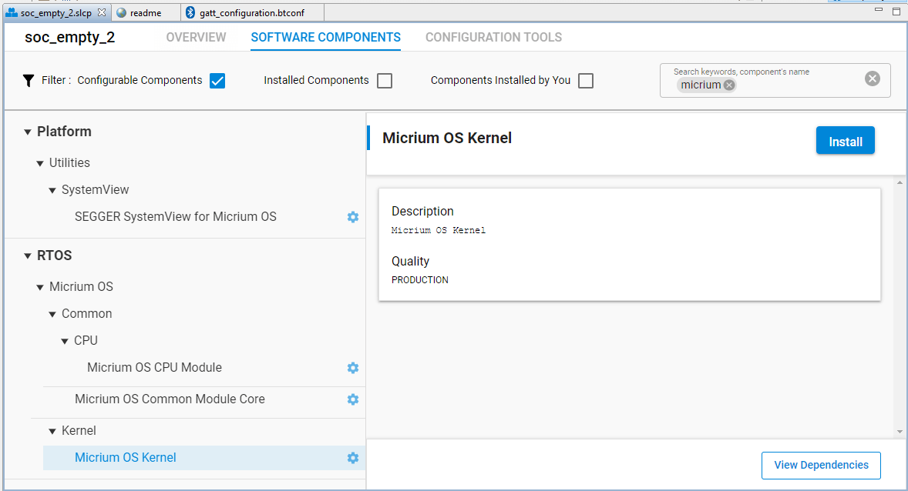

**Micrium OS Kernel** 组件将 Micrium RTOS 支持添加到 **SOC-Empty** 示例项目，并将该项目配置为在多任务中运行 Bluetooth Stack。这些任务将在 [2. System Architecture](#2-system-architecture) 中进行讨论。

添加 **Micrium OS Kernel** 组件时会自动添加以下组件：

通用的 RTOS 相关的：

* Platform - CMSIS - CMSIS-RTOS2
* Platform - CMSIS - CMSIS-RTOS2 Headers
* Platform - Common - Common APIs for CMSIS-Compliant Kernels

Micrium OS 相关的：

* RTOS - Micrium OS - Common - CPU - Micrium OS CPU Module
* RTOS - Micrium OS - Common - Micrium OS Common Module Core
* RTOS - Micrium OS - Common - RTOS Description
* RTOS - Micrium OS - Kernel - Micrium OS Kernel

**注意**：如果在应用程序中使用了组件 **Simple timer service**，那么应该使用一个针对 Micrium OS 的称为 **Simple timer service for Micrium RTOS** 的单独版本来替代。

## 1.3 FreeRTOS Configuration

要让 FreeRTOS 在您的应用程序中运行，您需要将 **FreeRTOS** 组件和您喜好的 **FreeRTOS Heap** 组件（示例中使用了 Heap 3）添加到您的应用程序项目中。

要将 **FreeRTOS** 组件添加到 **SOC-Empty** 示例项目：

1. 双击 Simplicity Studio Project Explorer 中的 `soc_empty.slcp` 文件以打开 Project Configurator，然后点击 **SOFTWARE COMPONENTS** 选项卡。
2. 在右上角的搜索栏中输入 **freertos**。
3. 在左窗格中选择 **FreeRTOS Heap 3**，然后点击 **Install**。

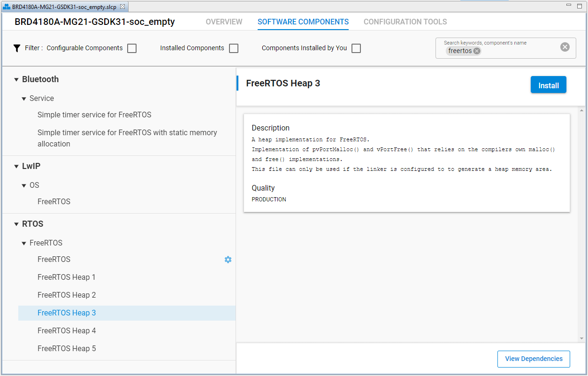

**FreeRTOS Heap 3** 组件将 FreeRTOS 支持添加到 **SOC-Empty** 示例项目，并将项目配置为在多个任务中运行 Bluetooth Stack。这些任务将在 [2. System Architecture](#2-system-architecture) 中进行讨论。

**注意**：如果添加的是 **FreeRTOS** 组件而不是 **FreeRTOS Heap 3** 组件，它将默认为 **FreeRTOS Heap 4**。要查看有关 FreeRTOS 堆实现的更多信息，请参阅 [FreeRTOS documentation](https://www.freertos.org/a00111.html)。

添加 **FreeRTOS Heap 3** 组件时会自动添加以下组件：

通用的 RTOS 相关的：

* Platform - CMSIS - CMSIS-RTOS2
* Platform - CMSIS - CMSIS-RTOS2 Headers
* Platform - Common - Common APIs for CMSIS-Compliant Kernels

Micrium OS 相关的：

* RTOS - FreeRTOS - FreeRTOS
* RTOS - FreeRTOS - FreeRTOS Heap 3

**注意**：如果应用程序中使用了组件 **Simple timer service**，那么应该使用针对 FreeRTOS 的称为 **Simple timer service for FreeRTOS** 和 **Simple timer service for FreeRTOS with static memory allocation** 的特殊版本来替代。

# 2. System Architecture

支持 Micrium RTOS 或 FreeRTOS 的 **SOC-Empty** 示例应用程序需要若干任务才能运行：

* Link Layer Task
* Bluetooth Host Task
* Event Handler Task
* Idle Task

Silicon Labs 已为 Micrium RTOS 和 FreeRTOS 实现了这些任务。

## 2.1 Inter-Task Communication

在描述任务之前，了解任务如何相互通信是很重要的。应用程序中的任务通过使用多个标志来相互同步。这些标志位于 sl_bt_rtos_adaptation 层的内部。下表总结了这些标志：

| FLAG                              | Sender                              | Receiver                            | Purpose                                                               |
| :-------------------------------- | :---------------------------------- | :---------------------------------- | :-------------------------------------------------------------------- |
| SL_BT_RTOS_EVENT_FLAG_STACK       | Link Layer Task                     | Bluetooth Host Task                 | Bluetooth stack needs an update, call sl_bt_pop_event()               |
| SL_BT_RTOS_EVENT_FLAG_LL          | Radio Interrupt                     | Link Layer Task                     | Link Layer needs an update, call sl_bt_priority_handle()              |
| SL_BT_RTOS_EVENT_FLAG_CMD_WAITING | Event Handler and Application Tasks | Bluetooth Host Task                 | Command is ready in shared memory, call sli_bt_cmd_handler_delegate() |
| SL_BT_RTOS_EVENT_FLAG_RSP_WAITING | Bluetooth Host Task                 | Event Handler and Application Tasks | Response is ready in shared memory.                                   |
| SL_BT_RTOS_EVENT_FLAG_EVT_WAITING | Bluetooth Host Task                 | Event Handler Task                  | Event is ready in shared memory.                                      |
| SL_BT_RTOS_EVENT_FLAG_EVT_HANDLED | Event Handler Task                  | Bluetooth Host Task                 | Event is handled and shared memory is free to use for next event.     |

下图说明了如何使用这些标志来同步任务。

除了这些标志之外，gecko 命令处理程序还使用了一个互斥量来使其线程安全。这使得从多个任务中调用 BGAPI 命令成为可能。

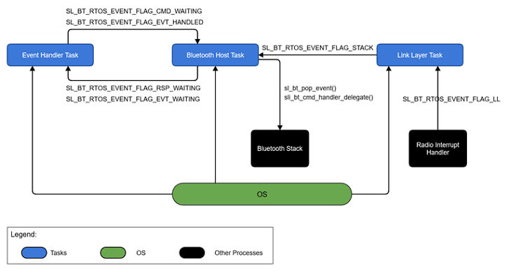

## 2.2 Link Layer Task

该任务的目的是更新上层链路层（Upper Link Layer）。Link Layer Task 在运行之前等待 `SL_BT_RTOS_EVENT_FLAG_LL` 标志被设置。通过调用 `sl_bt_priority_handle()` 来更新上层链路层。`SL_BT_RTOS_EVENT_FLAG_LL` 标志由 `sli_bt_rtos_ll_callback()` 设置，它是一个在协议栈配置中为 `scheduler_callback` 指定的回调函数。该回调在一个内核感知中断处理程序（下层链路层）中调用。该任务具有最高优先级。

## 2.3 Bluetooth Host Task

该任务的目的是更新 Bluetooth Stack、发出事件和处理命令。该任务在运行之前等待 `SL_BT_RTOS_EVENT_FLAG_STACK`、`SL_BT_RTOS_EVENT_FLAG_CMD_WAITING` 和 `SL_BT_RTOS_EVENT_FLAG_EVT_HANDLED` 标志中的任何一个被设置。`SL_BT_RTOS_EVENT_FLAG_STACK` 标志由 `sli_bt_rtos_stack_callback()` 设置，它是一个在协议栈配置中为 `stack_schedule_callback` 指定的回调函数。此任务的优先级高于 Event Handler Task 和任何 Application Tasks，但低于 Link Layer Task。

在此任务开始运行之前，它将为应用程序运行 Bluetooth Stack 作准备。此任务调用 `sl_bt_init()` 初始化并配置 Bluetooth Stack，然后调用 `sl_bt_rtos_create_tasks()` 创建 Link Layer Task 和 Event Handler Task。

### 2.3.1 Updating the Stack

Bluetooth Stack 必须定期更新。Bluetooth Host Task 通过调用 `sl_bt_event_pending()` 更新协议栈，并通过调用 `sl_bt_pop_event()` 从协议栈中读取下一个协议栈事件。这使协议栈可以处理来自链路层的消息以及它自己的内部消息，以执行其需要执行的定时操作。

### 2.3.2 Issuing Events

Bluetooth Host Task 设置 `SL_BT_RTOS_EVENT_FLAG_EVT_WAITING` 标志，以向 Event Handler Task 指示一个事件已就绪以被检索。一次只能检索一个事件。检索事件后，Event Handler Task 会清除 `SL_BT_RTOS_EVENT_FLAG_EVT_WAITING` 标志。Event Handler Task 会设置 `SL_BT_RTOS_EVENT_FLAG_EVT_HANDLED` 标志，以指示事件处理已完成。

### 2.3.3 Command Handling

命令可能从多个任务中发送到协议栈。对这些命令的响应将转发到调用任务。命令和响应使用 `SL_BT_RTOS_EVENT_FLAG_CMD_WAITING` 和 `SL_BT_RTOS_EVENT_FLAG_RSP_WAITING` 标志以及 BluetoothMutex 互斥量来进行同步。

名为 `sli_bt_cmd_handler_rtos_delegate()` 的辅助函数准备命令，并将其发送到协议栈。任何 BGAPI 函数都会调用此函数，并通过使用互斥量使其可重入。该函数通过在互斥量上挂起而开始。当它获得对互斥量的控制后，便会准备好命令并将其放入共享内存中，然后设置 `SL_BT_RTOS_EVENT_FLAG_CMD_WAITING` 标志以向协议栈指示一个命令正在等待被处理。Bluetooth Host Task 会通过清除此标志来指示该命令已发送到协议栈，并且现在可以安全地发送另一个命令。

然后执行会挂起在 `SL_BT_RTOS_EVENT_FLAG_RSP_WAITING` 标志上，该标志由 Bluetooth Host Task 在执行命令时设置。这表明对命令的响应正在等待。最后，互斥量会被释放。

下图展示了 Bluetooth Host Task 的运行流程。

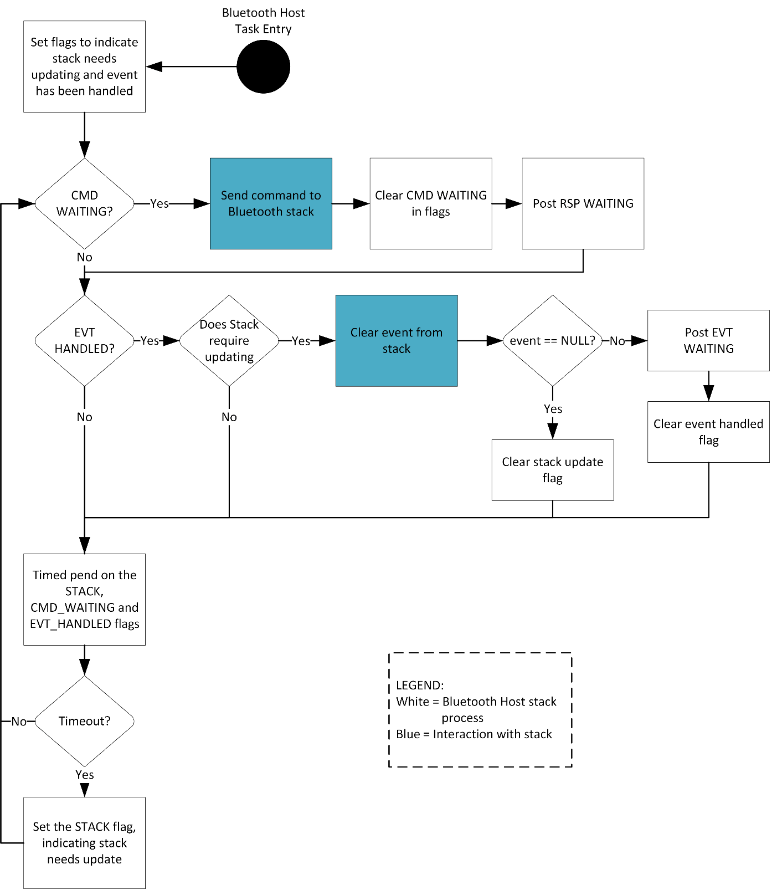

1. 在任务启动时，设置 `SL_BT_RTOS_EVENT_FLAG_STACK` 以指示协议栈需要更新，并且设置 `SL_BT_RTOS_EVENT_FLAG_EVT_HANDLED` 标志以指示当前没有正在处理的事件。
2. 如果设置了 `SL_BT_RTOS_EVENT_FLAG_CMD_WAITING` 标志，则调用 `sli_bt_cmd_handler_rtos_delegate()` 来处理该命令。
3. 如果设置了 `SL_BT_RTOS_EVENT_FLAG_STACK` 和 `SL_BT_RTOS_EVENT_FLAG_EVT_HANDLED` 标志，则调用 `sl_bt_pop_event()` 从协议栈中获取一个事件。如果发现一个事件正在等待，则设置 `SL_BT_RTOS_EVENT_FLAG_EVT_WAITING` 标志，并清除 `SL_BT_RTOS_EVENT_FLAG_EVT_HANDLED` 标志，以向 Event Handler Task 指示事件已准备被处理，并向 Bluetooth Host Task 指示当前正在处理事件。否则，将清除 `SL_BT_RTOS_EVENT_FLAG_STACK` 标志，以指示协议栈不需要更新。
4. 此时，任务将检查协议栈是否需要更新以及是否有任何事件正在等待处理。如果没有等待处理的事件，并且协议栈不需要更新，则可以安全地进入睡眠状态，并且 Bluetooth Host Task 会在 `SL_BT_RTOS_EVENT_FLAG_STACK`、`SL_BT_RTOS_EVENT_FLAG_EVT_HANDLED` 和 `SL_BT_RTOS_EVENT_FLAG_CMD_WAITING` 标志上挂起。
5. 无限重复执行步骤 2 - 4。

## 2.4 Event Handler Task

该任务的目的是处理 Bluetooth Stack 发送的事件。此任务等待 `SL_BT_RTOS_EVENT_FLAG_EVT_WAITING` 标志被设置。该标志由 Bluetooth Host Task 设置，以指示存在一个待处理的事件。设置此标志后，将调用 `sl_bt_process_event()` 来处理事件。最后，设置 `SL_BT_RTOS_EVENT_FLAG_EVT_HANDLED` 标志以向 Bluetooth Host Task 指示已处理该事件，并且 Event Handler Task 已准备好处理下一个事件。此任务的优先级低于 Bluetooth Host Task 和 Link Layer Task。

此任务为 User-Type OTA Control Characteristic 处理 `gatt_server_user_write_request` 事件，并将设备引导至 OTA DFU 模式。然后，此任务将事件分派到 `sl_bt_on_event()`，该函数需要集成到应用程序中。

## 2.5 Idle Task

当没有任务准备运行时，OS 将调用 Idle Task。Idle Task 默认情况下将 MCU 置于最低可用的睡眠模式（EM2）。

# 3. Application Integration

本节描述了 Bluetooth Event Handler 和 Application Tasks，以及如何使用它们来实现一个示例 Bluetooth 设备。

## 3.1 Bluetooth Event Handler

Bluetooth Event Handler 在 `sl_bt_on_event()` 中实现 —— Event Handler Task 的一部分 —— 采用指向事件的指针并进行相应的处理。可在 Silicon Labs Bluetooth API Documentation（参见 [4. Additional Resources](#4-additional-resources)）中找到事件的完整列表。由协议栈触发的某些事件主要是提供信息的，不需要应用程序执行任何操作。因为这是一个简单的应用程序，所以它仅处理少量事件，如下所示：

* `system_boot`：此事件指示 Bluetooth Stack 已初始化并准备接收命令。在这里您可以设置可发现性和可连接性模式。
* `connection_closed`：此事件在关闭连接时触发。在该事件下，广告将重新启动以允许将来的连接。

## 3.2 Customizing the Application

本节介绍一些常见的任务，如自定义 GATT Attributes、添加事件处理程序以及添加对其他外设的支持。

### 3.2.1 GATT Services and Characteristics

本节介绍如何添加 Service 和 Characteristic 以控制 Wireless Starter Kit 上的 LED。Bluetooth GATT Configurator 是 Simplicity Studio 随附的工具之一。该工具提供了用于创建和编辑 GATT Database 的图形界面。

1. 在一个已打开项目的 CONFIGURATION TOOLS 选项卡上或通过在 Simplicity Studio Project Explorer 中双击文件 `config/btconf/gatt_configuration.btconf` 打开 Bluetooth GATT Configurator。<br>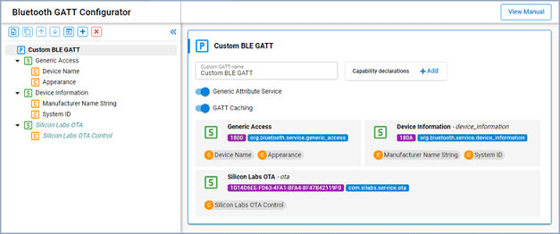
2. 创建新一个新的 Service。在左窗格中选择 **Custom BLE GATT**。点击左上角的添加新项（Add New Item）控件并选择 **New Service**。<br>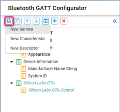
3. 选择所创建的 Custom Service 并将其命名为 **Lighting Control**，如下图所示。<br>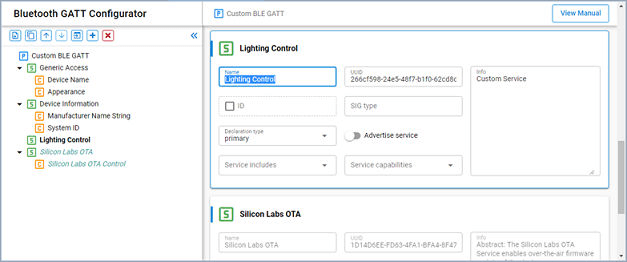
4. 添加一个 Characteristic。
    * 选择 **Lighting Control** Service。点击左上角的添加新项控件并选择 **New Characteristic**。
    * 选择所创建的 Custom Characteristic 并在右侧将其命名为 **LED0**。
    * 勾选 **id** 复选框并输入 **LED0** 作为 ID。
    * 将 **Value Settings** 设置为 User。
    * 设置属性 **Read** 和 **Write** 的切换开关。
   
    现在，该 Characteristic 应如下图所示。<br>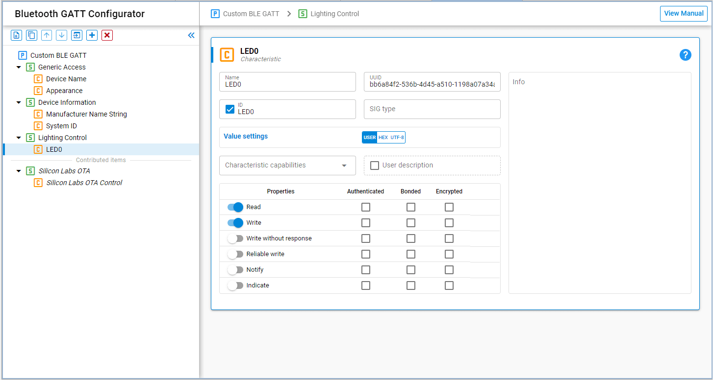
5. 点击 **Save**，Simplicity Studio 将自动更新生成的源代码。

### 3.2.2 Event Handlers

本节讨论如何添加事件处理程序，以读取和写入在 [3.2.1 GATT Services and Characteristics](#321-gatt-services-and-characteristics) 中添加的 GATT Characteristic。该 Characteristic 具有写和读权限。这是一种用户类型，因此应用程序需要处理以下事件：

* `gatt_server_user_write_request`
* `gatt_server_user_read_request`

需要 Simple LED Driver 组件以访问 Wireless Starter Kit 上的 LEDs。Simplicity Studio 提供了 Software Components Configuration 工具来管理驱动程序和 API 组件。

1. 双击 Simplicity Studio Project Explorer 中的 `soc_empty.slcp` 文件，然后点击顶部的 **SOFTWARE COMPONENTS** 选项卡。
2. 在右上角的搜索框中输入 **led**。在左窗格中选择 **Simple LED** 并点击 **Install**，如下图所示。<br>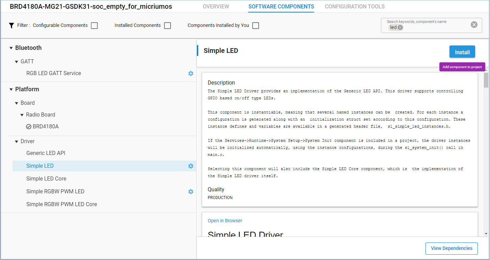
3. 这将弹出一个 Create A Component Instance 窗口。保留默认实例名称 **led0** 并点击 **Done**。
4. 点击 **Add New Instances**。这将弹出一个 Create A Component Instance 窗口。
5. 保留默认实例名称 **led1** 并点击 **Done**。现在看起来应该如下图所示。<br>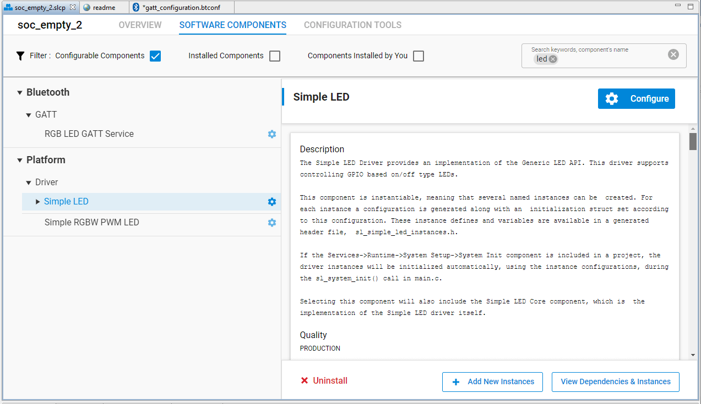

创建 Simple LED Driver 组件的 **led0** 和 **led1** 实例后，将自动安装并打开 LED 驱动程序。该应用程序可以通过调用 LED API 直接访问 LED0 和 LED1。

在 `app.c` 中添加以下代码，以包含具有用于设置和清除 LED 的函数声明的头文件。

```c
#include "sl_simple_led_instances.h"
```

如 [3.1 Bluetooth Event Handler](#31-bluetooth-event-handler) 中所述，应在 `sl_bt_on_event()` 中处理应用程序的 Bluetooth 事件。添加以下代码以实现用户写入请求处理程序。

```c
case sl_bt_evt_gatt_server_user_write_request_id:
    if (evt->data.evt_gatt_server_user_write_request.characteristic == gattdb_LED0) {
        if (evt->data.evt_gatt_server_user_write_request.value.data[0]) {
            sl_led_turn_on(&sl_led_led0);
        }
    else {
        sl_led_turn_off(&sl_led_led0);
    }
    sl_bt_gatt_server_send_user_write_response(
        evt->data.evt_gatt_server_user_write_request.connection,
        evt->data.evt_gatt_server_user_write_request.characteristic,
        0);
    }
break;
```

该事件处理程序验证要写入的 Characteristic 为 LED0 Characteristic，然后根据写入的数据打开或关闭 LED0。最后，它将响应发送到远程的 GATT Client 以指示已执行写操作。

添加以下代码以实现用户读取请求处理程序。

```c
case sl_bt_evt_gatt_server_user_read_request_id:
    if(evt->data.evt_gatt_server_user_read_request.characteristic == gattdb_LED0) {
        led0_state = sl_led_get_state(&sl_led_led0);
        sl_bt_gatt_server_send_user_read_response(
            evt->data.evt_gatt_server_user_read_request.connection,
            evt->data.evt_gatt_server_user_read_request.characteristic,
            0,
            1, &led0_state, &sent_len);
    }
break;
```

该事件处理程序将 LED0 的状态发送到 Client。事件处理需要在 `sl_bt_on_event()` 中声明的两个变量 `led0_state` 和 `sent_len`，如以下代码所示。

```c
uint8_t led0_state = 0;
uint16_t sent_len = 0;
```

根据您的应用程序的需求，您可以按照这种方式为其他事件添加类似的处理程序。在 `sl_bt_on_event()` 中实现的事件处理程序应快速地完成其工作。如果您的应用程序需要执行繁重或异步的工作，则您可能需要创建其他应用程序任务来进行这些工作。这将在 [3.3 Adding Application Tasks](#33-adding-application-tasks) 中讨论。

### 3.2.3 Adding Support for Other Peripherals

添加对其他外设的支持的最简单方法是使用 Silicon Labs 的 emlib/emdrv 外设库。这些库包含用于初始化和控制 EFR32 系列的外设的 API。在 [4. Additional Resources](#4-additional-resources) 中可以找到这些库的文档链接。

这些库被打包成软件组件，并包含在 Silicon Labs Gecko Platform SDK 中。通过使用 Software Components Configuration 工具，您可以轻松地将外设驱动程序和库添加到项目中。该工具还可以解决依赖关系，并自动安装外设组件所需的组件。

## 3.3 Adding Application Tasks

您可能需要在 Bluetooth 应用程序中添加应用程序任务以简化应用程序的实现。当您的应用程序需要执行需要大量计算、无法及时响应或与 Bluetooth 事件无关的过程时，这将十分有用。本节演示 Wireless Starter Kit 上的 LED 闪烁，您将在其中学习如何在应用程序中创建一个 Application Task。

要创建应用程序任务，需要将 Micrium RTOS 或 FreeRTOS 支持添加到 **SOC-Empty** 示例项目中。请按照 [1.2 Micrium OS Configuration](#12-micrium-os-configuration) 中的步骤安装 **Micrium OS Kernel** 组件或 [1.3 FreeRTOS Configuration](#13-freertos-configuration) 中的步骤安装 **FreeRTOS Heap 3** 组件。

**注意**：尽管 Bluetooth RTOS 应用程序示例使用了 CMSIS-RTOS2 API 函数来实现 Bluetooth 特性，但强烈建议用户应用程序代码不要使用 CMSIS-RTOS2 API，而是使用原生的 Micrium OS RTOS 或 FreeRTOS API 来充分利用系统。CMSIS-RTOS2 API 实现不支持所有的 RTOS 特性，更适合支持相对简单的 Bluetooth Stack 以移植到不同的 RTOS。

### 3.3.1 Adding an Application Task with the Micrium OS RTOS

在 `app.c` 中包含该头文件。

```c
#include "os.h"
```

要创建一个 Micrium RTOS 任务，您需要声明一个任务控制块（TCB，Task Control Block）、分配一个内存空间以作为任务的栈、编写任务代码，并设置 `OSTaskCreate()` API 所需的任务名、优先级以及其它参数。任务的优先级在应用程序中必须是唯一的，并且必须低于 Link Layer Task、Bluetooth Host Task 和 Event Handler Task。数字越小，优先级越高。因此，Silicon Labs 建议您为应用程序任务指定大于或等于 **10** 的优先级数字。Bluetooth Stack 的任务优先级可以在 “sl_bt_rtos_config.h” 中找到，并且可以在 Bluetooth – RTOS 下的 **Bluetooth Core** 组件中进行配置。

在 `app.c` 的全局作用域中添加以下代码。

```c
//Application task
#define SL_BT_RTOS_APPLICATION_PRIORITY         10u

#ifndef APPLICATION_STACK_SIZE
#define APPLICATION_STACK_SIZE (1000 / sizeof(CPU_STK))
#endif
static void    ApplicationTask (void *p_arg);
static OS_TCB  ApplicationTaskTCB;
static CPU_STK ApplicationTaskStk[APPLICATION_STACK_SIZE]; 
```

在 `app_init()` 中添加以下代码以创建任务。

```c
RTOS_ERR os_err;

//Application task
OSTaskCreate(&ApplicationTaskTCB,
             "Application Task",
             ApplicationTask,
             0u,
             SL_BT_RTOS_APPLICATION_PRIORITY,
             &ApplicationTaskStk[0u],
             APPLICATION_STACK_SIZE / 10u,
             APPLICATION_STACK_SIZE,
             0u,
             0u,
             0u,
             (OS_OPT_TASK_STK_CHK | OS_OPT_TASK_STK_CLR),
             &os_err);
```

然后，在 `ApplicationTask()` 中编写任务的代码。任务通常无穷地运行，并且在完成后需要让出执行给其他任务。一个执行让出（Yield）意味着将释放 CPU 时间来执行其他任务。这通常是通过调用时间或事件 API 来实现的。以下代码是每秒打开或关闭 LED1 的任务实现。

```c
//Application task
static void ApplicationTask (void *p_arg)
{
    RTOS_ERR os_err;
    (void)p_arg;

    while (DEF_TRUE) {
        // Put your application code here!
        OSTimeDlyHMSM(0, 0, 1, 0,
                      OS_OPT_TIME_DLY | OS_OPT_TIME_HMSM_NON_STRICT,
                      &os_err);
                      sl_led_toggle(&sl_led_led1);
    }
}
```

### 3.3.2 Implementing a Time- and Event-Driven Task with the Micrium OS RTOS

任务可以是时间驱动的、事件驱动的或同时是时间驱动和事件驱动的。该模型确定程序何时执行：

1. 定时器到期。
2. 事件发生。
3. 1 或 2。

Link Layer Task、Bluetooth Host Task 和 Event Handler Task 都是事件驱动的，[3.3 Adding Application Tasks](#33-adding-application-tasks) 中演示的 LED 切换任务是时间驱动的。
 
[3.3 Adding Application Tasks](#33-adding-application-tasks) 中演示的 LED 切换任务是更改为时间和事件驱动任务的一个很好的示例。此任务调用时间 API 将自身挂起一段特定时间。时间和事件驱动的任务需要支持超时的事件 API，以便任务挂起执行，直到事件发生或超时到期。本节演示 LED 如何根据是否按下 Wireless Starter Kit 上的按钮来进行不同频率的闪烁。

需要 Simple Button 组件来访问 Wireless Starter Kit 上的按钮。按照 [3.2.2 Event Handlers](#322-event-handlers) 的步骤安装组件，并在 Software Components Configuration 工具中创建 **btn0** 和 **btn1** 实例，如下图所示。

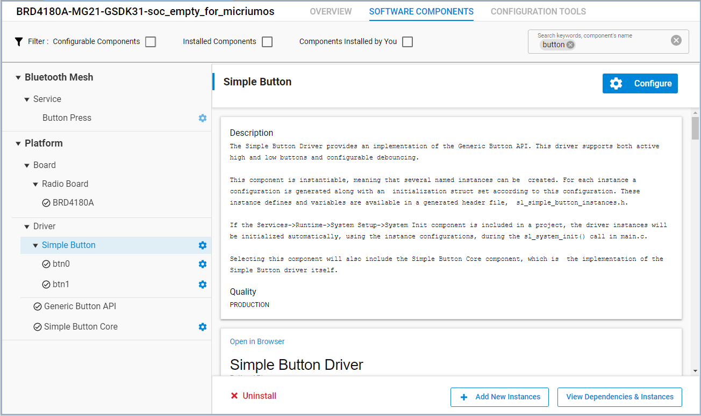

在 `app.c` 中添加以下代码以包含具有按钮状态更改回调函数声明的头文件。

```c
#include "sl_simple_button_instances.h"
```

该演示使用 Micrium Event Flag Management APIs 进行任务间通信。Event Flag Management 的原理是一个任务等待事件标志组中的一个或多个标志被设置，而另一个任务在相应的事件发生时设置同一个事件标志组中的一个标志。一个标志是一个 32-bit 变量的一个位。因此，标志是一种位模式，即它是一个 32-bit 变量的位组合。

任务使用事件标志组的最简单方法是将其声明为全局变量。在 `app.c` 的全局作用域中添加以下代码。

```c
OS_FLAG_GRP application_event_flags;

#define APPLICATION_EVENT_FLAG_BTN_ON   ((OS_FLAGS)1)
#define APPLICATION_EVENT_FLAG_BTN_OFF  ((OS_FLAGS)2)
```

在创建 Application Task 之前，在 `app_init()` 中添加以下代码以创建事件标志组。

```c
OSFlagCreate(&application_event_flags,
             "Application Flags",
             (OS_FLAGS)0,
             &os_err);
```

接下来，按照以下说明在 `ApplicationTask()` 中修改任务的代码。该任务调用 `OSFlagPend()` 来挂起其执行，并等待 `APPLICATION_EVENT_FLAG_BTN_ON` 和 `APPLICATION_EVENT_FLAG_BTN_OFF` 标志中的任何一个被设置。如果设置了任何标志或超时 `interval_ms` 到期，任务将恢复执行。因此，当没有标志被设置时，任务以周期性间隔开关 LED1，并在设置标志时更改间隔。

如果要在此示例中实现事件驱动的任务，请以 0 作为第三个参数调用 `OSFlagPend()`，该任务将永远等待直到任何标志被设置。

```c
//Application task
static void ApplicationTask (void *p_arg)
{
    RTOS_ERR os_err;
    (void)p_arg;
    uint32_t interval_ms;
    OS_RATE_HZ tick_rate;
    OS_FLAGS flags;

    tick_rate = OSTimeTickRateHzGet(&os_err);
    interval_ms = 1 * tick_rate;

    while (DEF_TRUE) {
        // Put your application code here!
        flags = OSFlagPend(&application_event_flags,
                           (OS_FLAGS)APPLICATION_EVENT_FLAG_BTN_ON + APPLICATION_EVENT_FLAG_BTN_OFF,
                           interval_ms,
                           OS_OPT_PEND_BLOCKING + OS_OPT_PEND_FLAG_SET_ANY + OS_OPT_PEND_FLAG_CONSUME,
                           NULL,
                           &os_err);
        if (flags & APPLICATION_EVENT_FLAG_BTN_ON) {
            interval_ms = tick_rate / 5; //200ms
            flags &= ~APPLICATION_EVENT_FLAG_BTN_ON;
        }
        if (flags & APPLICATION_EVENT_FLAG_BTN_OFF) {
            interval_ms = 1 * tick_rate; //1s
            flags &= ~APPLICATION_EVENT_FLAG_BTN_OFF;
        }
        sl_led_toggle(&sl_led_led1);
    }
}
```

最后，在回调函数 `sl_button_on_change()` 中编写代码以设置标志。当 Button0 或 Button1 的状态更改时，按钮驱动程序将调用此函数。该函数在按下按钮时设置 `APPLICATION_EVENT_FLAG_BTN_ON` 标志，并在释放按钮时设置 `APPLICATION_EVENT_FLAG_BTN_OFF` 标志。该代码应如下所示。

```c
void sl_button_on_change(const sl_button_t *handle)
{
    RTOS_ERR os_err;

    if (sl_button_get_state(handle) == SL_SIMPLE_BUTTON_PRESSED) {
        OSFlagPost(&application_event_flags,(OS_FLAGS)APPLICATION_EVENT_FLAG_BTN_ON,OS_OPT_POST_FLAG_SET,&os_err);
    }
    else if (sl_button_get_state(handle) == SL_SIMPLE_BUTTON_RELEASED) {
        OSFlagPost(&application_event_flags,(OS_FLAGS)APPLICATION_EVENT_FLAG_BTN_OFF,OS_OPT_POST_FLAG_SET,&os_err);
    }
}
```

现在，按下或释放按钮时，LED 切换任务是事件驱动的。当没有按下或释放按钮时，它是时间驱动的。这将演示：

1. LED1 每秒钟闪烁一次。
2. 按下按钮并保持按下状态时，LED1 每 0.2 秒闪烁一次。
3. 释放按钮时，LED1 恢复每秒闪烁一次。

### 3.3.3 Adding an Application Task with the FreeRTOS

在 `app.c` 中包含以下头文件。

```c
#include"FreeRTOS.h"
#include "task.h"
```

要创建一个 FreeRTOS 任务，您需要声明一个任务控制块、分配一个内存空间以作为任务的栈、编写任务代码，并设置 `xTaskCreateStatic()` API 所需的任务名、优先级以及其它参数。任务的优先级在应用程序中必须是唯一的，并且必须低于 Link Layer Task、Bluetooth Host Task 和 Event Handler Task。~~数字越小，优先级越高~~ 数字越大，优先级越高。因此，Silicon Labs 建议您为应用程序任务指定大于或等于 **10** 的优先级数字。Bluetooth Stack 的任务优先级可以在 “sl_bt_rtos_config.h” 中找到，并且可以在 Bluetooth – RTOS 下的 **Bluetooth Core** 组件中进行配置。

在 `app.c` 的全局作用域中添加以下代码。

```c
//Application task
#define SL_BT_RTOS_APPLICATION_PRIORITY     10u

static void vTaskApplication(void * pvParameters);
_ALIGNED(8) static StackType_t thread_application_stk[250 & 0xFFFFFFF8u];
_ALIGNED(4) static StaticTask_t thread_application_cb;
```

在 `app_init()` 中添加以下代码以创建任务。

```c
//Application task
xTaskCreateStatic((TaskFunction_t)vTaskApplication,
                  "Application Task",
                  sizeof(thread_application_stk) / sizeof(StackType_t),
                  NULL,
                  (UBaseType_t)SL_BT_RTOS_APPLICATION_PRIORITY,
                  thread_application_stk,
                  &thread_application_cb);
```

然后，在 `vTaskApplication()` 中编写任务的代码。任务通常无穷地运行，并且在完成后需要让出执行给其他任务。一个执行让出意味着将释放 CPU 时间来执行其他任务。这通常是通过调用时间或事件 API 来实现的。以下代码是每秒打开或关闭 LED1 的任务实现。

```c
//Application task
static void vTaskApplication(void * pvParameters)
{
    (void)pvParameters;

    while (1) {
        // Put your application code here!
        vTaskDelay(1000);
        sl_led_toggle(&sl_led_led1);
    }
}
```

### 3.3.4 Adding Initialization with the FreeRTOS

初始化外设可能需要启用中断。FreeRTOS 在调度程序启动之前会禁用中断，因此这些操作应在一个单独的任务中启动。以下代码是初始化相对湿度和温度（RHT）传感器并每秒记录一次当前温度的任务实现。

```c
// Sensor task
static void vTaskSensor(void * pvParameters)
{
    (void)pvParameters;

    sl_status_t sc;
    int32_t temperature = 0;
    uint32_t humidity = 0;

    // Put your initialization code here!
    sl_sensor_rht_init();

    while (1) {
        // Put your application code here!
        vTaskDelay(1000);
        sc = sl_sensor_rht_get(&humidity, &temperature);
        sl_app_assert(sc == SL_STATUS_OK, "Error reading temperature");
        sl_app_log("Temperature: %5.2f C\n", (float)temperature / 1000);
    }
}
```

从 SDK v3.1.2 起，日志记录和断言得到了增强。因此，上面的代码可以改写为：

```c
// Sensor task
static void vTaskSensor(void * pvParameters)
{
    (void)pvParameters;

    sl_status_t sc;
    int32_t temperature = 0;
    uint32_t humidity = 0;

    // Put your initialization code here!
    sl_sensor_rht_init();

    while (1) {
        // Put your application code here!
        vTaskDelay(1000);
        sc = sl_sensor_rht_get(&humidity, &temperature);
        app_assert_status(sc);
        app_log("Temperature: %5.2f C\n", (float)temperature / 1000);
    }
}
```

### 3.3.5 Implementing a Time- and Event-Driven Task with the FreeRTOS

任务可以是时间驱动的、事件驱动的或同时是时间驱动和事件驱动的。该模型确定程序何时执行：

1. 定时器到期。
2. 事件发生。
3. 1 或 2。

Link Layer Task、Bluetooth Host Task 和 Event Handler Task 都是事件驱动的，[3.3 Adding Application Tasks](#33-adding-application-tasks) 中演示的 LED 切换任务是时间驱动的。
 
[3.3 Adding Application Tasks](#33-adding-application-tasks) 中演示的 LED 切换任务是更改为时间和事件驱动任务的一个很好的示例。此任务调用时间 API 将自身挂起一段特定时间。时间和事件驱动的任务需要支持超时的事件 API，以便任务挂起执行，直到事件发生或超时到期。本节演示 LED 如何根据是否按下 Wireless Starter Kit 上的按钮来进行不同频率的闪烁。

需要 Simple Button 组件来访问 Wireless Starter Kit 上的按钮。按照 [3.2.2 Event Handlers](#322-event-handlers) 的步骤安装组件，并在 Software Components Configuration 工具中创建 **btn0** 和 **btn1** 实例，如下图所示。


在 `app.c` 中添加以下代码以包含具有按钮状态更改回调函数声明的头文件。

```c
#include "sl_simple_button_instances.h"
#include “event_groups.h“
```

该演示使用 FreeRTOS Event Groups（或 “flags”）APIs 进行任务间通信。Event Group 的原理是一个任务等待 Event Group 中的一个或多个位（或标志）被设置，而另一个任务在相应的事件发生时设置同一个 Event Group 中的一个位。在默认配置中一个 Event Group 实现具有 24-bits。因此，它是一种位模式，即它是一个 24-bit 变量的位组合。

任务使用事件标志组的最简单方法是将其声明为全局变量。在 `app.c` 的全局作用域中添加以下代码。

```c
// Declare a variable to hold the handle of the created Event Group.
EventGroupHandle_t xEventGroupApplicationHandle;

// Declare a variable to hold the data associated with the created Event Group.
StaticEventGroup_t xEventGroupApplicationData;

#define APPL_EVENT_GROUP_BIT_BTN_ON     ((EventBits_t)1)
#define APPL_EVENT_GROUP_BIT_BTN_OFF    ((EventBits_t)2)
```

在创建 Application Task 之前，在 `app_init()` 中添加以下代码以创建 Event Group。

```c
xEventGroupApplicationHandle = xEventGroupCreateStatic( &xEventGroupApplicationData );
```

接下来，按照以下说明在 `vTaskApplication()` 中修改任务的代码。该任务调用 `xEventGroupWaitBits()` 来挂起其执行，并等待 `APPL_EVENT_GROUP_BIT_BTN_ON` 和 `APPL_EVENT_GROUP_BIT_BTN_OFF` 位中的任何一个被设置。如果设置了任何位或超时 `xTicksToWait` 到期，任务将恢复执行。因此，当没有位被设置时，任务以周期性间隔开关 LED1，并在设置位时更改间隔。

如果要在此示例中实现事件驱动的任务，请将 TimeOut 部分的 `sl_led_toggle()` 注释掉。然后，任务将仅在设置任何位后才开关 LED1。它仍然会理所当然地超时，但实际上它是事件驱动的，因为它会立即开始再次等待事件。也可以将超时设置得尽可能长来减少超时。

```c
//Application task
static void vTaskApplication(void * pvParameters)
{
    (void)pvParameters;
    EventBits_t uxBits;
    TickType_t xTicksToWait = 1000 / portTICK_PERIOD_MS; // Wait maximum of 1000 ms

    while (1) {
        // Put your application code here!

        uxBits = xEventGroupWaitBits(
                    xEventGroupApplicationHandle, // The Event Group being tested.
                    APPL_EVENT_GROUP_BIT_BTN_ON | APPL_EVENT_GROUP_BIT_BTN_OFF, // The bits to wait for
                    pdTRUE, // bits should be cleared before returning.
                    pdFALSE, // Don't wait for both bits, either bit will do.
                    xTicksToWait );// Wait a maximum of 1000 ms (or 200 ms) for either bit to be set.

        if (uxBits & APPL_EVENT_GROUP_BIT_BTN_ON) {
            xTicksToWait = 200 / portTICK_PERIOD_MS; // Set timeout into 200 ms
            sl_led_toggle(&sl_led_led1);
        }
        else if (uxBits & APPL_EVENT_GROUP_BIT_BTN_OFF) {
            xTicksToWait = 1000 / portTICK_PERIOD_MS; // Set timeout into 1000 ms
            sl_led_toggle(&sl_led_led1);
        }
        else { // TimeOut
            sl_led_toggle(&sl_led_led1); // Comment out for an event-driven operation
        }
    }
}
```

最后，在回调函数 `sl_button_on_change()` 中编写代码以设置位。当 Button0 或 Button1 的状态更改时，按钮驱动程序将调用此函数。该函数在按下按钮时设置 `APPL_EVENT_GROUP_BIT_BTN_ON` 位，并在释放按钮时设置 `APPL_EVENT_GROUP_BIT_BTN_OFF` 位。该代码应如下所示。

```c
void sl_button_on_change(const sl_button_t *handle)
{
    if (sl_button_get_state(handle) == SL_SIMPLE_BUTTON_PRESSED) {
        xEventGroupSetBits(xEventGroupApplicationHandle, APPL_EVENT_GROUP_BIT_BTN_ON);
    }
    else if (sl_button_get_state(handle) == SL_SIMPLE_BUTTON_RELEASED) {
        xEventGroupSetBits(xEventGroupApplicationHandle, APPL_EVENT_GROUP_BIT_BTN_OFF);
    }
}
```

现在，按下或释放按钮时，LED 切换任务是事件驱动的。当没有按下或释放按钮时，它是时间驱动的。这将演示：

1. LED1 每秒钟闪烁一次。
2. 按下按钮并保持按下状态时，LED1 每 0.2 秒闪烁一次。
3. 释放按钮时，LED1 恢复每秒闪烁一次。

### 3.3.6 Bluetooth On-Demand Start

如果 Bluetooth Stack 并不总是在应用程序中使用，那么可以随时反初始化和再次初始化它。您可以使用 [Bluetooth start/stop APIs](https://docs.silabs.com/bluetooth/latest/a00028#gad9a6d5812e0c014d0eb4c86f22f216dd) 来完成这些操作。要使用这些 API，请将 Bluetooth on-demand start 组件添加到项目中：

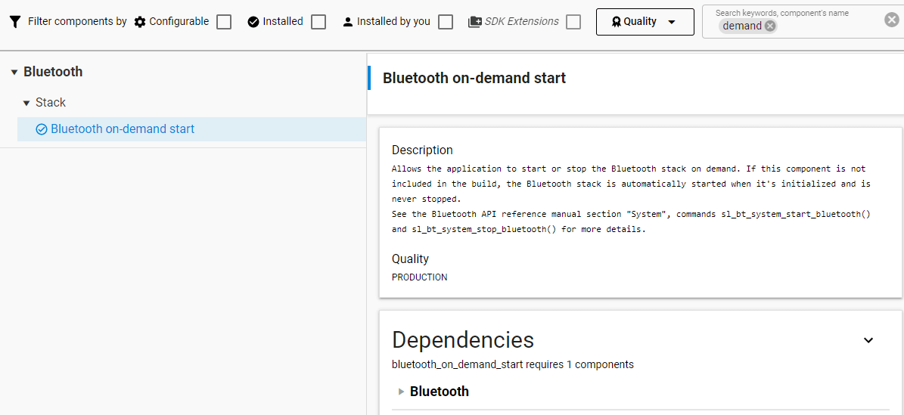

当项目中包含此特性时，Bluetooth Stack 将不会自动启动。应用程序需要负责启动和停止它。要测试此特性，请更改前面提到的示例代码中的应用程序代码：

```c
static void ApplicationTask (void *p_arg)
{
    RTOS_ERR os_err
    (void)p_arg;
    OS_FLAGS flags;
    static bool stack_is_running = false;

    while (DEF_TRUE) {
        // Put your application code here!
        flags = OSFlagPend(&application_event_flags,
                           (OS_FLAGS)APPLICATION_EVENT_FLAG_BTN_ON + APPLICATION_EVENT_FLAG_BTN_OFF,
                           0,
                           OS_OPT_PEND_BLOCKING + OS_OPT_PEND_FLAG_SET_ANY + OS_OPT_PEND_FLAG_CONSUME, NULL,
                           &os_err);
        if (flags & APPLICATION_EVENT_FLAG_BTN_ON) {
            if (!stack_is_running){
                sl_bt_system_start_bluetooth();
            }
            else{
                sl_bt_system_stop_bluetooth();
            }
            stack_is_running = !stack_is_running;
        }
    }
}
```

# 4. Additional Resources

请查阅以下资源以获取其他信息。

* [Silicon Labs Bluetooth API Documentation](https://docs.silabs.com/bluetooth/latest/)
* [Silicon Labs Bluetooth C Developer's Guide](https://docs.silabs.com/bluetooth/latest/general/c-developer39s-guide)
* [Silicon Labs Platform Documentation](https://docs.silabs.com/)
* [Micriµm OS Documentation](https://docs.silabs.com/micrium/latest)
* [The FreeRTOS Kernel](https://freertos.org/RTOS.html)
