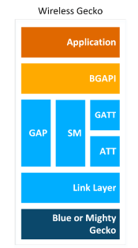
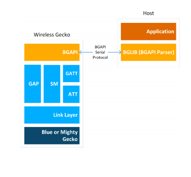
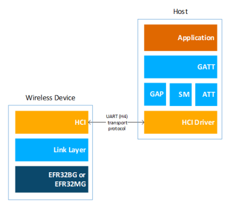
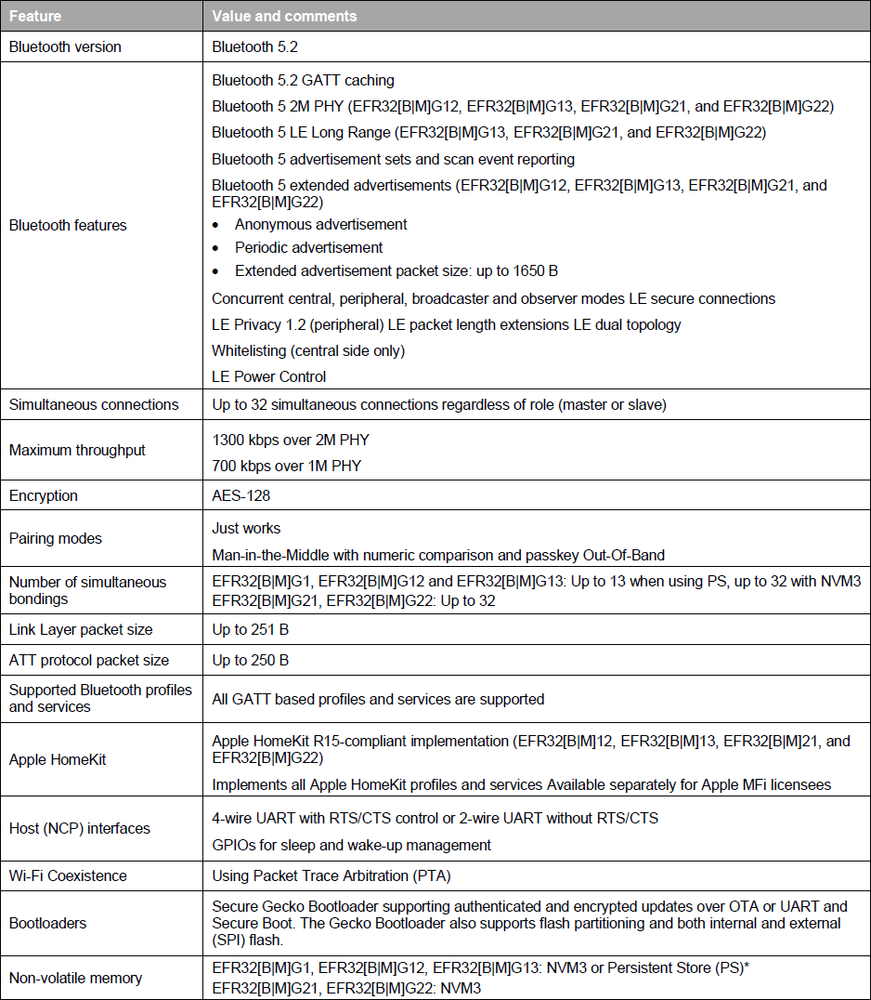
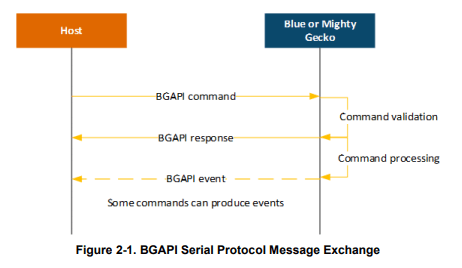
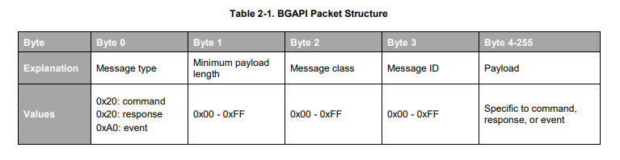
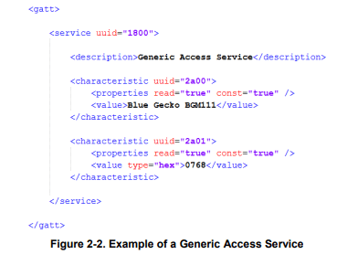
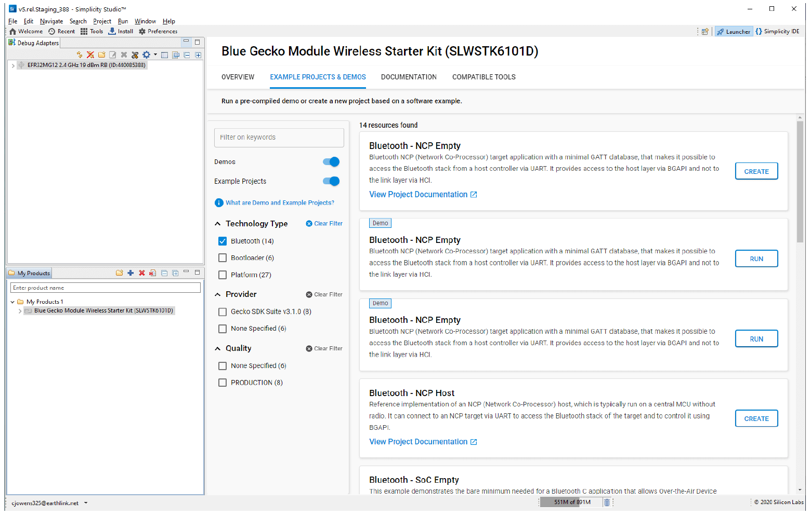

您正在查看的文档版本：5.0 | 此版本仅适用于 Simplicity Studio 5。 如果您使用 Simplicity Studio 4，请切换到 <a href="https://docs.silabs.com/bluetooth/2.13">2.13</a>。| 关于其他版本，请参阅<a href="https://docs.silabs.com/bluetooth/5.0/general/overview/_version_history">版本历史</a>。

# 总体概述

[发布说明](https://www.silabs.com/documents/public/release-notes/bt-software-release-notes-3.2.4.0.pdf) | [下载](https://www.silabs.com/products/development-tools/software/bluetooth-low-energy)

## 关于 Bluetooth 栈

v3.x Silicon Labs Bluetooth 栈是一个先进的 Bluetooth 5-compliant 协议栈，实现了 Bluetooth Low Energy 标准。它支持多连接、并发的 Central、Peripheral、Broadcaster 和 Observer 角色。v3.x Silicon Labs Bluetooth 栈适用于 Silicon Labs EFR32 SoCs 和 Modules。

Silicon Labs Bluetooth 栈为开发者提供了多个 API 以访问 Bluetooth 功能。其支持三种模式：

1. Standalone 模式，即 Bluetooth 栈和应用程序都在 EFR32 SoC 或 Module 中运行。应用程序可以用 C 编程语言开发。 
2. NCP（Network Co-Processor，网络协处理器）模式，即 Bluetooth 栈在 EFR32 中运行，应用程序在一个单独的 Host MCU 上运行。在这种情况下，Bluetooth 栈可以被配置成 NCP 模式，API 通过 UART 等串行接口暴露出来。 
3. RCP（Radio Co-Processor，无线电协处理器）模式，即只有 Bluetooth 栈的 Link 层在 EFR32 上运行，而栈的 Host 层以及应用程序在单独的 Host MCU 或 PC 上运行。在这种使用情况下，Host 层是由第三方开发的，因为 Silicon Labs 的 Bluetooth 栈只为 EFR32 SoCs/Modules 而构建。Link 层和 Host 层通过 HCI（Host-Controller Interface，主机-控制器接口）进行通信，这是两层之间的标准接口。HCI 可以通过 UART 访问，遵循 Bluetooth SIG's UART (H4) 传输协议。 

### Bluetooth 栈特性

Silicon Labs Bluetooth 栈的特性在下表中列出。

### Bluetooth 资格认证

所有部署 Bluetooth 技术的产品都必须通过Bluetooth SIG 的资格认证过程。在线资源将帮助你了解关于 [Bluetooth 资格认证](https://www.bluetooth.com/develop-with-bluetooth/qualification-listing/qualification-consultants/)、流程和 [Launch Studio](https://www.bluetooth.org/OTV/new_vids/launch-studio-SG-English/content/index.html#/?_k=esxjsd) 教程的更多信息，Launch Studio 是用来完成 Bluetooth 资格认证流程的在线工具。如果想获得设备认证的帮助，可以考虑联系离你最近的 [Bluetooth 认证顾问](https://www.bluetooth.com/develop-with-bluetooth/qualification-listing/qualification-consultants/)。

当基于 Silicon Labs 的 Bluetooth 栈认证你的终端产品时，请整合预认证的组件。要了解更多信息并查看预认证组件列表，请参阅 [QSG169: Bluetooth® SDK v3.x Quick-Start Guide](../QSG169/Bluetooth%20Quick-Start%20Guide%20for%20SDK%20v3.x%20and%20Higher.md)。

### Bluetooth 栈 API

本节简要介绍了不同的软件 API。

#### Bluetooth API

Silicon Labs Bluetooth 栈提供的 Bluetooth API 是与该栈进行通信的主要 API。它提供了对 Bluetooth 栈实现的所有 Bluetooth 功能的访问，如 GAP（Generic Access Profile）、连接管理器、SM（Security Manager，安全管理器）、GATT Client 和 Server。

除了 Bluetooth 功能外，Bluetooth API 还提供对其他一些功能的访问，如用于射频测试的 DTM（Direct Test Mode）API、用于读写设备闪存中的 key 的 PS（Persistent Store，持久化存储）API、用于现场固件更新的 DFU（Device Firmware Update）API，以及用于各种系统级功能的 System API。

#### BGAPI 串行协议和 Bluetooth Host API

在 NCP 模式下配置时，可以使用 BGAPI 串行协议控制 Bluetooth 栈。这允许通过串行接口（如 UART）从单独的 Host（如 EFM32 微控制器）中控制 Bluetooth 栈。当在 Standalone 模式下使用时，BGAPI 串行协议通过 UART 提供与 BGAPI API 完全相同的 Bluetooth API。

BGAPI 串行协议是一个轻量级二进制协议，它将 BGAPI 命令从 Host 传输到 Bluetooth 栈，并将响应和事件从 Bluetooth 栈传回 Host。

Bluetooth SDK 为 NCP 目标（EFR）和 NCP Host 提供现成的 BGAPI 串行协议解析器实现。它为 Bluetooth 栈提供的所有 API 实现了串行协议解析器。在 Host API 之上开发的 Host 代码可以编写为与 EFR 的代码相同，这样可以轻松地将应用程序代码从 EFR 移植到单独的 Host，反之亦然。

BGAPI 串行协议数据包的结构描述如下。欲了解更多信息，请参阅 [BGAPI Headers](https://docs.silabs.com/bluetooth/5.0/bgapi-headers)。

#### Bluetooth Profile Toolkit GATT Builder

Bluetooth Profile Toolkit 是一个基于 XML 的 API 和描述语言，用于描述基于 GATT 的 Service 和 Characteristic，无需编写代码即可轻松完成。根据 [UG118: Blue Gecko Bluetooth® Profile Toolkit Developer Guide](https://www.silabs.com/documents/public/user-guides/ug118-bluegecko-bt-profile-toolkit.pdf) 中的信息，可以很容易地手工编写 XML 文件。如果您在 Simplicity Studio 之外进行开发，请使用 Profile Toolkit GATT Builder。

在 Simplicity Studio 内，GATT Configurator 允许以可视化方式构建 GATT，而无需手工编辑 XML 文件。详情见 [UG438: GATT Configurator User’s Guide for Bluetooth SDK v3.x](https://www.silabs.com/documents/public/user-guides/ug438-gatt-configurator-users-guide-sdk-v3x.pdf)。通过 Project Configurator 的 Software Components 选项卡的 Advanced Configurators 在 Simplicity Studio 中打开 GATT Configurator。点击 Open，GATT Configurator 工具将在新标签中打开文件 gatt\_configuration.btconf。

gatt\_configuration.btconf 提供 GATT 数据库的主干。它位于项目的 config > btconfig 目录中。您可以在同一目录中添加其他 XML 文件并扩展 GATT 数据库。附加的 XML 文件的内容将在 GATT Configurator UI 中显示为 Contributed Items。有关示例，请参阅随大多数示例应用程序提供的 ota-dfu.xml 文件。

使用 Profile Toolkit 开发的 GATT 数据库会被转换为 .c 文件和 .h 文件，并在编译固件时作为预构建步骤包含在应用程序项目中。然后，可以使用 Bluetooth 栈的 GATT API 或一个远程的 Bluetooth 设备访问 GATT。

#### CMSIS 和 EMLIB

CMSIS（Cortex Microcontroller Software Interface Standard）是所有 ARM Cortex 设备的通用编码标准。Silicon Labs 提供的 CMSIS 库包含所有设备的头文件、定义（用于外设、寄存器和位域）和启动文件。此外，CMSIS 还包含所有 Cortex 设备通用的功能，例如中断处理、内部功能等。虽然您可以使用硬编码地址和数据值写入寄存器，但建议您使用这些定义以确保代码的可移植性和可读性。

为了简化 Wireless Geckos 的编程，Silicon Labs 开发并维护了一个名为 EMLIB 的完整 C 函数库，该库提供对设备中所有外设和核心功能的高效、清晰和稳健的访问和控制。该库位于 SDK 的 em\_xxx.c（如 em\_dac.c）和 em\_xxx.h 文件中。EMLIB 文档在 [Gecko Platform documentation](https://docs.silabs.com/gecko-platform/latest/) 中可用。

## 关于 Bluetooth SDK

Bluetooth SDK 是一个完整的软件开发套件，使您能够使用 C 编程语言在 Bluetooth 栈之上开发应用程序。该 SDK 还支持创建 Standalone 应用程序，其中 Bluetooth 栈和应用程序都在 Wireless Gecko 中运行，或 NCP 架构，其中应用程序在外部 Host 上运行，而 Bluetooth 栈在 Wireless Gecko 中运行。[QSG169: Bluetooth® SDK v3.x Quick-Start Guide](../QSG169/Bluetooth%20Quick-Start%20Guide%20for%20SDK%20v3.x%20and%20Higher.md) 中描述了 SDK 内容和文件夹结构。

## 关于演示和示例

从头开始的应用程序开发可能很困难。因此，Bluetooth SDK 附带了许多内置演示和示例，涵盖了最常见的用例，如下图所示。演示是您可以立即运行的预构建应用程序映像。可以在构建应用程序映像之前修改软件示例。与软件示例同名的演示是从它们各自的示例构建的。

注意：您所看到的演示和示例取决于所选的部件。如果您使用包含多个部件的自定义解决方案，请点击您正在使用的部件以仅查看适用于该部件的项目。

演示和软件示例位于 Simplicity Studio 启动器视图的 Example Projects & Demos 选项卡中。

* 要在您的设备上下载并运行演示，请点击要在目标上运行的正确演示上的 RUN。
* 要使用默认项目配置将软件示例代码作为新项目导入您的工作区，请在所需示例项目的名称上点击 CREATE，然后将打开一个 New Project Wizard 窗口。点击 FINISH，您的项目将以 Simplicity IDE 模式打开，您可以在其中对其进行自定义。

如果示例项目非常符合您的需求，请使用您的应用程序代码来扩展该代码并重写自定义部分。否则，从 SoC-Empty 应用程序开始。请注意，SoC-Empty 应用程序不是空白的，而是提供了一个只开始广告的最小项目。

### Demo/Example 描述

提供了以下示例。名字中带有（\*）的示例具有相匹配的预构建演示。

* Silicon Labs Gecko Bootloader examples (see [UG266: Silicon Labs Gecko Bootloader User Guide](https://www.silabs.com/documents/public/user-guides/ug266-gecko-bootloader-user-guide.pdf) and [AN1086: Using the Gecko Bootloader with Silicon Labs Bluetooth Applications](https://www.silabs.com/documents/login/application-notes/an1086-gecko-bootloader-bluetooth.pdf))
* Bluetooth Examples
    * Bluetooth Examples
        * Bluetooth – RCP: Radio Co-Processor (RCP) target application. Runs the Bluetooth Controller (i.e. the Link Layer only) and provides access to it using the standard HCI (Host-Controller Interface) over a UART connection.
        * Bluetooth – NCP(*): Network Co-Processor (NCP) target application. Runs the full Bluetooth stack and provides access to it by exposing the Bluetooth API (BGAPI) via UART connection. NCP mode makes it possible to run your application on a host controller or PC. This example does not have a GATT database, but makes it possible to build one from the application using the Dynamic GATT API.
        * Bluetooth – NCP Empty(*): Network Co-Processor (NCP) target application. Runs the full Bluetooth stack and provides access to it by exposing the Bluetooth API (BGAPI) via UART connection. NCP mode makes it possible to run your application on a host controller or PC. This example contains a minimal GATT database, and cannot be used with host applications that use the Dynamic GATT API.
        * Bluetooth – NCP Host: Reference implementation of an NCP (Network Co-Processor) host, which typically runs on a central MCU without radio. It can connect to an NCP target via UART to access the Bluetooth stack of the target and to control it using BGAPI. This example uses the Dynamic GATT feature.
        * Bluetooth – NCP AoA Locator(*): Network Co-Processor (NCP) target application extended with CTE Receiver support. It enables Angle of Arrival (AoA) calculation. Use this application with Direction Finding host examples.
        * Bluetooth – SoC AoA Asset Tag(*): Demonstrates a CTE (Constant Tone Extension) transmitter that can be used as an asset tag in a Direction Finding setup estimating Angle of Arrival (AoA).
        * Bluetooth – SoC Blinky(*): The classic blinky example using Bluetooth communication. From the EFR Connect mobile app, the LED controller button toggles LED0 on the board. In addition, pressing or releasing PB0 on the mainboard notifies the app. This is a demonstration of a simple two-way data exchange over GATT.
        * Bluetooth – SoC DTM: This example implements the direct test mode (DTM) application for radio testing. DTM commands can be called via UART. See [AN1267: Radio Frequency Physical Layer Evaluation in Bluetooth® SDK v3.x](https://www.silabs.com/documents/public/application-notes/an1267-bt-rf-phy-evaluation-using-dtm-sdk-v3x.pdf) for more information.
        * Bluetooth – SoC Empty: A minimal project structure that serves as a starting point for custom Bluetooth applications. It contains a minimal GATT database that can be expanded to fit your application requirements. The application starts advertising after boot and restarts advertising after a connection is closed. It also supports Over-the-Air Device Firmware Upgrade (OTA DFU)
        * Bluetooth – SoC Interoperability Test (*): A test procedure containing several test cases for Bluetooth Low Energy communication. This demo is meant to be used with the EFR Connect mobile app, through the "Interoperability Test" tile on the Develop view of the app.
        * Bluetooth – SoC Thermometer(*): Implements a GATT Server with the Health Thermometer Profile, which enables a Client device to connect and get temperature data. Temperature is read from the Si7021 digital relative humidity and temperature sensor of the WSTK or of the Thunderboard.
        * Bluetooth – SoC Thermometer Client: Implements a GATT Client that discovers and connects with up to four Bluetooth LE devices advertising themselves as Thermometer Servers. It displays the discovery process and the temperature values received via UART.
            * Note: Some radio boards will exhibit random pixels in the display when this example is running because they have a shared pin for sensor- and display-enabled signals.
        * Bluetooth – SoC Thermometer FreeRTOS: Demonstrates the integration of FreeRTOS into Bluetooth applications. RTOS is added to the Bluetooth - SoC Thermometer sample app.
        * Bluetooth – SoC Thermometer Micrium OS: Demonstrates the integration of Micrium RTOS into Bluetooth applications. RTOS is added to the Bluetooth - SoC Thermometer sample app.
        * Bluetooth – SoC Throughput(*): Tests the throughput capabilities of the device and can be used to measure throughput between two EFR32 devices, as well as between a device and a smartphone using the EFR Connect mobile app, through the Throughput demo tile.
        * Bluetooth – SoC Voice(*): Voice over Bluetooth Low Energy sample application. It is supported by Thunderboard Sense 2 and Thunderboard EFR32BG22 boards and demonstrates how to send voice data over GATT, which is acquired from the on-board microphones.
        * Bluetooth – SoC iBeacon(*): An iBeacon device implementation that sends non-connectable advertisements in iBeacon format. The iBeacon Service gives Bluetooth accessories a simple and convenient way to send iBeacons to smartphones. This example can be tested together with the EFR Connect mobile app.
        * Bluetooth – SoC Thunderboard Sense 2( ), and Thunderboard EFR32BG22( ): Demonstrate the features of the Thunderboard Kit. These can be tested with the Thunderboard mobile app.
* Dynamic Multiprotocol Examples (see [AN1134: Dynamic Multiprotocol Development with Bluetooth and Proprietary Protocols on RAIL](https://www.silabs.com/documents/public/application-notes/an1134-bluetooth-rail-dynamic-multiprotocol.pdf) for more information)
    * Bluetooth – SoC Empty RAIL DMP FreeRTOS: A minimal project structure, used as a starting point for custom Bluetooth + Proprietary DMP (Dynamic Multiprotocol) applications. It runs on top of FreeRTOS and multiprotocol RAIL.
    * Bluetooth – SoC Empty RAIL DMP Micrium OS: A minimal project structure, used as a starting point for custom Bluetooth + Proprietary DMP (Dynamic Multiprotocol) applications. It runs on top of Micrium OS and multiprotocol RAIL.
    * Bluetooth – SoC Empty Standard DMP FreeRTOS: A minimal project structure, used as a starting point for custom Bluetooth + Standard DMP (Dynamic Multiprotocol) applications. It runs on top of FreeRTOS and multiprotocol RAIL utilizing IEE802.15.4 standard protocol.
    * Bluetooth – SoC Empty Standard DMP Micrium OS: A minimal project structure, used as a starting point for custom Bluetooth + Standard DMP (Dynamic Multiprotocol) applications. It runs on top of Micrium OS and multiprotocol RAIL, utilizing IEE802.15.4 standard protocol.
    * Bluetooth – SoC Light RAIL DMP FreeRTOS(*): A Dynamic Multiprotocol reference application demonstrating a light bulb that can be switched both via Bluetooth and via a Proprietary protocol. To switch it via Bluetooth use the Wireless Gecko smartphone app. To switch it via Proprietary protocol use the Flex (RAIL) - Switch sample app.
    * Bluetooth – SoC Light RAIL DMP Micrium OS: A Dynamic Multiprotocol reference application demonstrating a light bulb that can be switched both via Bluetooth and via a Proprietary protocol. To switch it via Bluetooth use the Wireless Gecko smartphone app. To switch it via Proprietary protocol use the Flex (RAIL) - Switch sample app.
    * Bluetooth – SoC Light Standard DMP FreeRTOS(*): A Dynamic Multiprotocol reference application demonstrating a light bulb that can be switched both via Bluetooth and via a standard protocol. To switch it via Bluetooth use the Wireless Gecko smartphone app. To switch it via standard protocol use the "Flex (RAIL) - Switch Standards" sample app.
    * Bluetooth – SoC Light Standard DMP Micrium OS(*): A Dynamic Multiprotocol reference application demonstrating a light bulb that can be switched both via Bluetooth and via a standard protocol. To switch it via Bluetooth use the Wireless Gecko smartphone app. To switch it via standard protocol use the "Flex (RAIL) - Switch Standards" sample app.
* NCP Host Examples (located in C:\SiliconLabs\SimplicityStudio\v5\developer\sdks\gecko_sdk_suite\\app\bluetooth\examples_host)
    * empty: Minimal host-side project structure, used as a starting point for NCP host applications. Use it with the Bluetooth – NCP target application flashed to the radio board.
    * ota-dfu: Demonstrates how to perform an OTA DFU on a Silicon Labs Bluetooth Device. It requires a WSTK with a radio board flashed with NCP firmware to be used as the GATT client that performs the OTA.
    * uart-dfu: Demonstrates how to perform a UART DFU on a Silicon Labs Bluetooth Device running NCP firmware
    * voice: On a WSTK programmed with NCP firmware, it to connects to the Bluetooth – SoC Voice example, sets the correct configuration on it, receives audio via Bluetooth, and stores audio data into a file.
    * aoa_locator: A locator host sample app that works together with a Bluetooth – NCP AoA Locator target app. It receives IQ samples from the target and estimates the Angle of Arrival (AoA). For more information see AN1296: Application Development with Silicon Labs’ RTL Library.
    * aoa_multilocator: Connects to multiple aoa_locator sample apps (via MQTT) and estimates a position from Angles of Arrival (AoA). For more information, see [AN1296: Application Development with Silicon Labs’ RTL Library](https://www.silabs.com/documents/public/application-notes/an1296-application-development-with-rtl-library.pdf).
    * aoa_multilocator_gui: Connects to the aoa_multilocator sample app (via MQTT), reads out the position estimations and displays the tags and locators on a 3D GUI. This sample app is python based. For more information, see [AN1296: Application Development with Silicon Labs’ RTL Library](https://www.silabs.com/documents/public/application-notes/an1296-application-development-with-rtl-library.pdf).
    * aoa_compass: Demo application with GUI showcasing the angle estimation capabilities of the RTL library. This is now replaced with the AoA Analyzer tool as described in [QSG175: Silicon Labs Direction Finding Solution Quick-Start Guide](https://www.silabs.com/documents/public/quick-start-guides/qsg175-direction-finding-solution-quick-start-guide.pdf).
    * throughput: Tests the throughput capabilities of the device in NCP mode and can be used to measure throughput between two devices as well as between a device and a smartphone
* Python-Based NCP Host Examples
    * Python-based NCP host examples can be accesssed at [https://github.com/SiliconLabs/pybgapi-examples](https://github.com/SiliconLabs/pybgapi-examples). These examples are meant to be used with PyBGAPI ([https://pypi.org/project/pybgapi/](https://pypi.org/project/pybgapi/)).