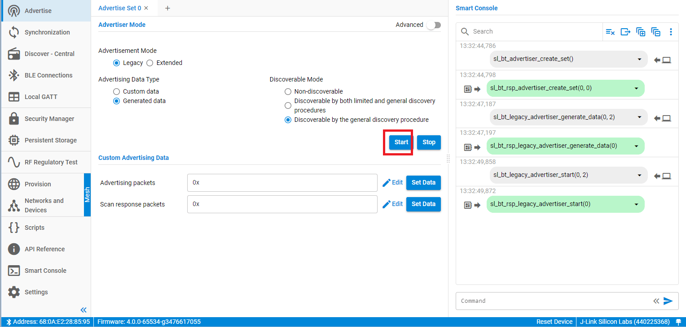
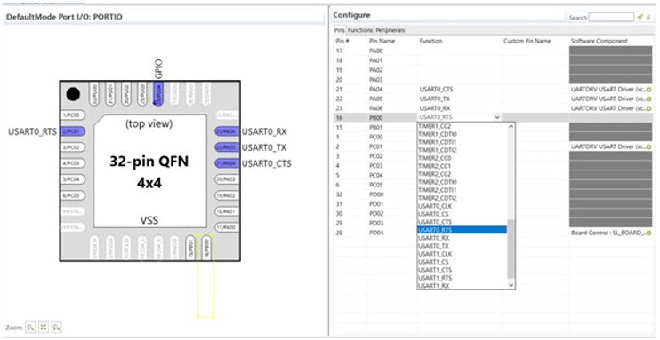

# QSG169: Bluetooth® Quick-Start Guide for SDK v3.x and Higher (Rev. 1.2) <!-- omit in toc -->

- [1 Introduction](#1-introduction)
  - [1.1 Prerequisites](#11-prerequisites)
  - [1.2 Support](#12-support)
  - [1.3 Documentation](#13-documentation)
  - [1.4 Gecko Platform](#14-gecko-platform)
- [2 About the Bluetooth Stack](#2-about-the-bluetooth-stack)
  - [2.1 Bluetooth Stack Features](#21-bluetooth-stack-features)
  - [2.2 Bluetooth Qualification](#22-bluetooth-qualification)
  - [2.3 The Bluetooth Stack APIs](#23-the-bluetooth-stack-apis)
    - [2.3.1 The BGAPI Bluetooth API](#231-the-bgapi-bluetooth-api)
    - [2.3.2 CMSIS and emlib](#232-cmsis-and-emlib)
    - [2.3.3 The BGAPI Serial Protocol and BGLIB Host API](#233-the-bgapi-serial-protocol-and-bglib-host-api)
    - [2.3.4 GATT Configuration](#234-gatt-configuration)
      - [The Bluetooth Profile Toolkit GATT Builder](#the-bluetooth-profile-toolkit-gatt-builder)
      - [The GATT Configurator](#the-gatt-configurator)
      - [Building a Dynamic GATT database](#building-a-dynamic-gatt-database)
  - [2.4 About the Bluetooth SDK](#24-about-the-bluetooth-sdk)
    - [2.4.1 Libraries](#241-libraries)
    - [2.4.2 Include Files](#242-include-files)
    - [2.4.3 Platform Components](#243-platform-components)
- [3 About Demos and Examples](#3-about-demos-and-examples)
  - [3.1 Bluetooth SDK Examples](#31-bluetooth-sdk-examples)
    - [3.1.1 Demo/Example Descriptions](#311-demoexample-descriptions)
  - [3.2 Other Bluetooth Functionality Examples](#32-other-bluetooth-functionality-examples)
- [4 Getting Started with Bluetooth Demo Software](#4-getting-started-with-bluetooth-demo-software)
  - [4.1 Prepare the Mainboard](#41-prepare-the-mainboard)
  - [4.2 Flash the Demo](#42-flash-the-demo)
  - [4.3 Test the Bluetooth Demos Using an Android or iOS Smartphone](#43-test-the-bluetooth-demos-using-an-android-or-ios-smartphone)
    - [4.3.1 Testing the NCP Demo](#431-testing-the-ncp-demo)
      - [Bluetooth NCP Commander](#bluetooth-ncp-commander)
      - [Testing with the Smartphone App](#testing-with-the-smartphone-app)
    - [4.3.2 Testing the iBeacon Demo](#432-testing-the-ibeacon-demo)
    - [4.3.3 Testing the Health Thermometer Demo](#433-testing-the-health-thermometer-demo)
- [5 Starting Application Development](#5-starting-application-development)
  - [5.1 GATT Database](#51-gatt-database)
  - [5.2 Component Configuration](#52-component-configuration)
  - [5.3 Building and Flashing](#53-building-and-flashing)
  - [5.4 Enabling Field Updates](#54-enabling-field-updates)
- [6 Development Tools](#6-development-tools)
  - [6.1 The GATT Configurator](#61-the-gatt-configurator)
  - [6.2 The Pin Tool](#62-the-pin-tool)
  - [6.3 Multi-Node Energy Profiler](#63-multi-node-energy-profiler)
  - [6.4 Network Analyzer](#64-network-analyzer)
  - [6.5 Simplicity Commander](#65-simplicity-commander)
  - [6.6 Bluetooth NCP Commander](#66-bluetooth-ncp-commander)
  - [6.7 IAR Embedded Workbench](#67-iar-embedded-workbench)

---

本文档介绍了如何使用 Bluetooth SDK v3.x、Simplicity Studio® 5、及兼容的 WSTK（Wireless Starter Kit）开始 Bluetooth 开发。如果您购买了 EFR32BG WSTK，则可以先使用预编译的 Demo 和 Android/iOS App 进行试验，然后再开发自己的应用程序。

如果要使用 Simplicity Studio 4 和 Bluetooth SDK v2.x，那么请阅读 *QSG139: Bluetooth® SDK v2.x Quick Start Guide* 中相应的内容。

# 1 Introduction

本文档介绍了如何使用 Silicon Labs 产品开始 Bluetooth 开发。它介绍了 Silicon Labs Bluetooth Stack v3.x 的特性以及可用于帮助开发的资源。使用 Silicon Labs 开发环境 Simplicity Studio 5 和 Bluetooth SDK v3.x（Gecko SDK 的一部分）开始应用程序开发。

Simplicity Studio 5 包含了使用 Silicon Labs 设备进行 IoT 产品开发所需的一切，包括一个资源和项目启动器、软件配置工具、带有 GNU toolchain 的完整 IDE 和分析工具。本文档重点介绍 Simplicity Studio 5 环境中的使用和开发。或者，可以通过从 GitHub 下载或克隆最新版本来手动安装 Gecko SDK。有关详细信息，请参阅 [https://github.com/SiliconLabs/gecko_sdk](https://github.com/SiliconLabs/gecko_sdk)。

SDK 附带了许多 Example 应用程序，您可以修改这些应用程序来创建自己的应用程序。如果您使用 EFR32BG 设备进行开发并购买了 EFR32BG WSTK，则可以使用预编译的 Demos 与 Android 或 iOS App 来演示 Bluetooth 软件特性。

本文档介绍了以下内容：

* Bluetooth Stack 特性和组件（参阅 [2 About the Bluetooth Stack](#2-about-the-bluetooth-stack)）
* 有关预编译的 Demos 的说明以及 SDK 中可用的 Examples 代码（参阅 [3 About Demos and Examples](#3-about-demos-and-examples)）
* 如何使用 iOS 或 Android App 测试预构建的 Demo（参阅 [4 Getting Started with Bluetooth Demo Software](#4-getting-started-with-bluetooth-demo-software)）
* 如何在 Simplicity Studio 中开发自己的应用程序（参阅 [5 Starting Application Development](#5-starting-application-development)）
* 对开发过程中有用的其他工具的描述（参阅 [6 Development Tools](#6-development-tools)）

## 1.1 Prerequisites

在开始应用开发之前，您应该：

* 基本了解 Bluetooth 技术和术语。如果您尚未了解 Bluetooth，则 *UG103.14: Bluetooth LE Fundamentals* 能给你提供一个很好的起点。
* 购买了 EFR32BG Wireless Starter Kit 或其他兼容的目标硬件。
* 在 Silicon Labs 上创建了一个帐户。您可以在 [https://siliconlabs.force.com/apex/SL_CommunitiesSelfReg?form=short](https://siliconlabs.force.com/apex/SL_CommunitiesSelfReg?form=short) 上注册。
* 下载了 Simplicity Studio 5 和包含 Bluetooth SDK 的 Silicon Labs Gecko SDK，并大致熟悉了 SSv5 Launcher 透视图。SSv5 安装和入门说明以及一组详细参考资料可在在线的 *Simplicity Studio 5 User’s Guide* 中找到，该指南可从 [https://docs.silabs.com/](https://docs.silabs.com/) 和 SSv5 的帮助菜单上获得。
* 获得了兼容的编译器（有关兼容版本，请参阅 Bluetooth SDK 的发行说明）：
  * Simplicity Studio 带有免费的 GCC C 编译器。
  * IAR Embedded Workbench for ARM (IAR-EWARM) 也可以用作 Silicon Labs Bluetooth 项目的编译器。安装 IAR-EWARM 后，Simplicity Studio 下次启动时将自动检测并配置 IDE 以使用 IAR-EWARM。

要获得 30 天的 IAR-EWARM 评估许可证，请执行以下操作：

* 转到 Silicon Labs 支持门户，[https://www.silabs.com/support](https://www.silabs.com/support)。
* 向下滚动到页面底部，然后点击 **Contact Support** 。
* 如果您尚未登录，请登录。
* 点击 Software Releases 选项卡。在视图列表中，选择 **Development Tools** 。点击 **Go** 。这将跳转到在发行说明中命名的 IAR-EWARM 版本的链接。
* 下载 IAR 安装包（大约需要 1 个小时）。
* 安装 IAR。
* 在 IAR License Wizard 中，点击 **Register with IAR Systems to get an evaluation license** 。
* 完成注册，IAR 将提供 30 天的评估许可证。
* 安装 IAR-EWARM 后，Simplicity Studio 下次启动时将自动检测并配置 IDE 以使用 IAR-EWARM。

## 1.2 Support

您可以通过 Simplicity Studio 5 的 Welcome 视图下的 Learn and Support 访问 [https://www.silabs.com/support](https://www.silabs.com/support) 上的 Silicon Labs 支持门户。在开发过程中遇到问题时，可以使用支持门户联系客户支持。

## 1.3 Documentation

特定于硬件的文档可以通过 Simplicity Studio 5 中的 Overview 选项卡上的链接进行访问。

可通过 Documentation 选项卡获得 SDK 文档、用户指南和其他参考。

可以在线上获取 Bluetooth API 参考以及其他有用的文档和代码示例：[https://docs.silabs.com/bluetooth/latest/](https://docs.silabs.com/bluetooth/latest/)

培训材料可在 Silicon Labs 网站上找到：[https://www.silabs.com/support/training/bluetooth](https://www.silabs.com/support/training/bluetooth)。

下图汇总了 Bluetooth SDK 的关键文档。

## 1.4 Gecko Platform

Gecko Platform 是一组驱动程序和其他底层特性，可直接与 Silicon Labs Chip 和 Module 进行交互。Gecko Platform 组件包括 EMLIB、EMDRV、RAIL Library、NVM3 和 mbedTLS。有关 Gecko Platform 的更多信息，请参阅 Simplicity Studio 的 Documentation 选项卡中的发行说明。

# 2 About the Bluetooth Stack

v3.x Silicon Labs Bluetooth Stack 是一个实现了 BLE（Bluetooth Low Energy）标准的先进的 Bluetooth 5-compliant 协议栈。它支持多个连接、可同时存在 Central、Peripheral、Broadcaster 和 Observer 角色。v3.x Silicon Labs Bluetooth Stack 适用于 Silicon Labs EFR32 SoC 和 module。

Silicon Labs Bluetooth Stack 为开发人员提供了多个 API，以访问 Bluetooth 功能。它支持三种模式：

1. Standalone 模式，Bluetooth Stack 和应用程序均在 EFR32 SoC 或 Module 中运行。可以使用 C 编程语言开发这种应用程序。 
2. NCP（Network Co-Processor，网络协处理器）模式，其中 Bluetooth Stack 在 EFR32 中运行，而应用程序在单独的 Host MCU 上运行。对于此用例，可以将 Bluetooth Stack 配置为 NCP 模式，其中 API 通过串行接口（如 UART）暴露出来。 
3. RCP（Radio Co-Processor，无线电协处理器）模式，其中只有 Bluetooth Stack 的 Link 层在 EFR32 上运行，栈的 Host 层以及应用程序在单独的 Host MCU 或 PC 上运行。在此用例中，Host 层由第三方开发，因为 Silicon Labs 的 Bluetooth Stack 仅为 EFR32 SoC/Module 构建。Link 层和 Host 层通过 HCI（Host-Controller Interface，主机-控制器接口）进行通信，这是两层之间的标准接口。可以按照蓝牙 Bluetooth SIG's UART (H4) 传输协议或 Silicon Labs 专有的 CPC（Co-Processor Communication，协处理器通信）协议通过 UART 访问 HCI。 

## 2.1 Bluetooth Stack Features

下表列出了 Silicon Labs Bluetooth Stack 的特性。

<table>
<thead>
  <tr>
    <th>Feature</th>
    <th>EFR32[B|M]G1</th>
    <th>EFR32[B|M]G12</th>
    <th>EFR32[B|M]G13</th>
    <th>EFR32[B|M]G21*</th>
    <th>EFR32[B|M]G22</th>
    <th>EFR32[B|M]G24</th>
  </tr>
</thead>
<tbody>
  <tr>
    <td>Bluetooth version</td>
    <td>Bluetooth 5.3</td>
    <td>Bluetooth 5.3</td>
    <td>Bluetooth 5.3</td>
    <td>Bluetooth 5.3</td>
    <td>Bluetooth 5.3</td>
    <td>Bluetooth 5.3</td>
  </tr>
  <tr>
    <td>Concurrent central, peripheral, broadcaster and observer modes</td>
    <td>✓</td>
    <td>✓</td>
    <td>✓</td>
    <td>✓</td>
    <td>✓</td>
    <td>✓</td>
  </tr>
  <tr>
    <td>Simultaneous connections</td>
    <td>✓ (up to 8)</td>
    <td>✓ (up to 32)</td>
    <td>✓ (up to 8)</td>
    <td>✓ (up to 32)</td>
    <td>✓ (up to 8)</td>
    <td>✓ (up to 32)</td>
  </tr>
  <tr>
    <td>LE secure connections</td>
    <td>✓</td>
    <td>✓</td>
    <td>✓</td>
    <td>✓</td>
    <td>✓</td>
    <td>✓</td>
  </tr>
  <tr>
    <td>LE Privacy 1.2 (peripheral)</td>
    <td>✓</td>
    <td>✓</td>
    <td>✓</td>
    <td>✓</td>
    <td>✓</td>
    <td>✓</td>
  </tr>
  <tr>
    <td>LE packet length extensions</td>
    <td>✓</td>
    <td>✓</td>
    <td>✓</td>
    <td>✓</td>
    <td>✓</td>
    <td>✓</td>
  </tr>
  <tr>
    <td>LE dual topology</td>
    <td>✓</td>
    <td>✓</td>
    <td>✓</td>
    <td>✓</td>
    <td>✓</td>
    <td>✓</td>
  </tr>
  <tr>
    <td>Link Layer Device Filtering (central side only)</td>
    <td>✓</td>
    <td>✓</td>
    <td>✓</td>
    <td>✓</td>
    <td>✓</td>
    <td>✓</td>
  </tr>
  <tr>
    <td>LE Power Control</td>
    <td>✓</td>
    <td>✓</td>
    <td>✓</td>
    <td>✓</td>
    <td>✓</td>
    <td>✓</td>
  </tr>
  <tr>
    <td>Bluetooth 5 GATT caching</td>
    <td>✓</td>
    <td>✓</td>
    <td>✓</td>
    <td>✓</td>
    <td>✓</td>
    <td>✓</td>
  </tr>
  <tr>
    <td>Bluetooth 5 2M PHY</td>
    <td>x</td>
    <td>✓</td>
    <td>✓</td>
    <td>✓</td>
    <td>✓</td>
    <td>✓</td>
  </tr>
  <tr>
    <td>Bluetooth 5 LE Long Range</td>
    <td>x</td>
    <td>x</td>
    <td>✓</td>
    <td>✓</td>
    <td>✓</td>
    <td>✓</td>
  </tr>
  <tr>
    <td>Bluetooth 5 advertisement sets and scan event reporting</td>
    <td>✓</td>
    <td>✓</td>
    <td>✓</td>
    <td>✓</td>
    <td>✓</td>
    <td>✓</td>
  </tr>
  <tr>
    <td>Bluetooth 5 extended advertisements.</td>
    <td>x</td>
    <td>✓ (up to 1650B)</td>
    <td>✓ (up to 1650B)</td>
    <td>✓ (up to 1650B)</td>
    <td>✓ (up to 1650B)</td>
    <td>✓ (up to 1650B)</td>
  </tr>
  <tr>
    <td>Bluetooth 5 periodic advertisements</td>
    <td>x</td>
    <td>✓ (up to 1650B)</td>
    <td>✓ (up to 1650B)</td>
    <td>✓ (up to 1650B)</td>
    <td>✓ (up to 1650B)</td>
    <td>✓ (up to 1650B)</td>
  </tr>
  <tr>
    <td>Bluetooth 5 periodic advertising synchronization</td>
    <td>x</td>
    <td>✓</td>
    <td>✓</td>
    <td>✓</td>
    <td>✓</td>
    <td>✓</td>
  </tr>
  <tr>
    <td>Directed advertising</td>
    <td>✓</td>
    <td>✓</td>
    <td>✓</td>
    <td>✓</td>
    <td>✓</td>
    <td>✓</td>
  </tr>
  <tr>
    <td>Adaptive Frequency Hopping</td>
    <td>✓</td>
    <td>✓</td>
    <td>✓</td>
    <td>✓</td>
    <td>✓</td>
    <td>✓</td>
  </tr>
  <tr>
    <td>L2CAP Connection Oriented Channels</td>
    <td>✓</td>
    <td>✓</td>
    <td>✓</td>
    <td>✓</td>
    <td>✓</td>
    <td>✓</td>
  </tr>
  <tr>
    <td>CTE transmitter</td>
    <td>x</td>
    <td>x</td>
    <td>x</td>
    <td>x</td>
    <td>✓</td>
    <td>✓</td>
  </tr>
  <tr>
    <td>CTE receiver</td>
    <td>x</td>
    <td>x</td>
    <td>x</td>
    <td>x</td>
    <td>select part numbers</td>
    <td>select part numbers</td>
  </tr>
  <tr>
    <td>Maximum throughput</td>
    <td>700 kbps over 1M PHY</td>
    <td>700 kbps over 1M PHY, 1300 kbps over 2M PHY</td>
    <td>700 kbps over 1M PHY, 1300 kbps over 2M PHY</td>
    <td>700 kbps over 1M PHY, 1300 kbps over 2M PHY</td>
    <td>700 kbps over 1M PHY, 1300 kbps over 2M PHY</td>
    <td>700 kbps over 1M PHY, 1300 kbps over 2M PHY</td>
  </tr>
  <tr>
    <td>Encryption</td>
    <td>AES-128</td>
    <td>AES-128</td>
    <td>AES-128</td>
    <td>AES-128</td>
    <td>AES-128</td>
    <td>AES-128</td>
  </tr>
  <tr>
    <td>Pairing modes</td>
    <td>Just works, numeric comparison, passkey entry, Out-Of-Band</td>
    <td>Just works, numeric comparison, passkey entry, Out-Of-Band</td>
    <td>Just works, numeric comparison, passkey entry, Out-Of-Band</td>
    <td>Just works, numeric comparison, passkey entry, Out-Of-Band</td>
    <td>Just works, numeric comparison, passkey entry, Out-Of-Band</td>
    <td>Just works, numeric comparison, passkey entry, Out-Of-Band</td>
  </tr>
  <tr>
    <td>Number of simultaneous bondings</td>
    <td>Up to 13 with PS Store, up to 32 with NVM3</td>
    <td>Up to 13 with PS Store, up to 32 with NVM3</td>
    <td>Up to 13 with PS Store, up to 32 with NVM3</td>
    <td>Up to 32</td>
    <td>Up to 32</td>
    <td>Up to 32</td>
  </tr>
  <tr>
    <td>Link Layer packet size</td>
    <td>Up to 251 B</td>
    <td>Up to 251 B</td>
    <td>Up to 251 B</td>
    <td>Up to 251 B</td>
    <td>Up to 251 B</td>
    <td>Up to 251 B</td>
  </tr>
  <tr>
    <td>ATT protocol packet size</td>
    <td>Up to 250 B</td>
    <td>Up to 250 B</td>
    <td>Up to 250 B</td>
    <td>Up to 250 B</td>
    <td>Up to 250 B</td>
    <td>Up to 250 B</td>
  </tr>
  <tr>
    <td>Supported Bluetooth profiles and services</td>
    <td>All GATT based profiles and services are supported</td>
    <td>All GATT based profiles and services are supported</td>
    <td>All GATT based profiles and services are supported</td>
    <td>All GATT based profiles and services are supported</td>
    <td>All GATT based profiles and services are supported</td>
    <td>All GATT based profiles and services are supported</td>
  </tr>
  <tr>
    <td>Apple HomeKit</td>
    <td>x</td>
    <td>Apple HomeKit R15-compliant implementation</td>
    <td>Apple HomeKit R15-compliant implementation</td>
    <td>Apple HomeKit R15-compliant implementation</td>
    <td>Apple HomeKit R15-compliant implementation</td>
    <td>Apple HomeKit R15-compliant implementation</td>
  </tr>
  <tr>
    <td>Host (NCP/RCP) interfaces</td>
    <td>4-wire UART with RTS/CTS control or 2-wire UART without RTS/CTS, GPIOs for sleep and wake-up management</td>
    <td>4-wire UART with RTS/CTS control or 2-wire UART without RTS/CTS, GPIOs for sleep and wake-up management</td>
    <td>4-wire UART with RTS/CTS control or 2-wire UART without RTS/CTS, GPIOs for sleep and wake-up management</td>
    <td>4-wire UART with RTS/CTS control or 2-wire UART without RTS/CTS, GPIOs for sleep and wake-up management</td>
    <td>4-wire UART with RTS/CTS control or 2-wire UART without RTS/CTS, GPIOs for sleep and wake-up management</td>
    <td>4-wire UART with RTS/CTS control or 2-wire UART without RTS/CTS, GPIOs for sleep and wake-up management</td>
  </tr>
  <tr>
    <td>Wi-Fi Coexistence</td>
    <td>Using Packet Trace Arbitration (PTA)</td>
    <td>Using Packet Trace Arbitration (PTA)</td>
    <td>Using Packet Trace Arbitration (PTA)</td>
    <td>Using Packet Trace Arbitration (PTA)</td>
    <td>Using Packet Trace Arbitration (PTA)</td>
    <td>Using Packet Trace Arbitration (PTA)</td>
  </tr>
  <tr>
    <td>Non-volatile memory</td>
    <td>NVM3 or Persistent Store (PS)**</td>
    <td>NVM3 or Persistent Store (PS)**</td>
    <td>NVM3 or Persistent Store (PS)**</td>
    <td>NVM3</td>
    <td>NVM3</td>
    <td>NVM3</td>
  </tr>
  <tr>
    <td colspan="7">
      
* EFR32MR21 has the same feature set as xG21, but works only in the RCP mode. The SoC and NCP modes are not supported.

      
** Example applications in the SDK that are generated for these platforms will use PS by default.

    </td>
  </tr>
</tbody>
</table>

## 2.2 Bluetooth Qualification

所有采用 Bluetooth 技术的产品都必须通过 Bluetooth SIG's Qualification Process，即使产品没有 Bluetooth Logo 或包装和文档中未提及 Bluetooth 也是如此。实际上这意味着，在您可以向市场销售支持 Bluetooth 的产品之前，该产品必须通过 Bluetooth SIG 获得最终产品的资格。资格清单有一个 [Declaration Fee](https://www.bluetooth.com/develop-with-bluetooth/qualification-listing/qualification-listing-fees/)。可通过在线资源了解有关 [Bluetooth Qualification Process](https://www.bluetooth.com/develop-with-bluetooth/qualification-listing/) 的更多信息，以及有关 [Launch Studio](https://www.bluetooth.com/develop-with-bluetooth/build/test-tools/launch-studio/) 的教程，这是用于完成 Bluetooth Qualification Process 的在线工具。如果您需要帮助来认证您的设备，请考虑联系离您最近的 [Bluetooth Qualification Consultant](https://www.bluetooth.com/develop-with-bluetooth/qualification-listing/qualification-consultants/)。

当基于 Silicon Labs Bluetooth Stack 对您的最终产品进行资格认证时，您将集成下表中列出的预认证组件，具体取决于用于构建您的应用程序的 SDK 版本。

| Bluetooth SDK version | Component                  | QDID                                                                                              |
| :-------------------- | :------------------------- | :------------------------------------------------------------------------------------------------ |
| v2.13.x up to v3.1.x  | Link Layer (Bluetooth 5.2) | Launch Studio Listing Details: [147971](https://launchstudio.bluetooth.com/ListingDetails/105576) |
| “                     | Host stack (Bluetooth 5.2) | Launch Studio Listing Details: [146950](https://launchstudio.bluetooth.com/ListingDetails/104376) |
| V3.2.x and above      | Link Layer (Bluetooth 5.3) | Launch Studio Listing Details: [178212](https://launchstudio.bluetooth.com/ListingDetails/141145) |
| “                     | Host stack (Bluetooth 5.3) | Launch Studio Listing Details: [175341](https://launchstudio.bluetooth.com/ListingDetails/137791) |

**注意**：根据 Bluetooth SIG Qualification [Program Reference Document (PRD)](https://www.bluetooth.org/docman/handlers/DownloadDoc.ashx?doc_id=40972)，对于新的 EPLs（End Product Listing），被测组件的评估日期必须少于三年。QDID（Qualified Design ID）到期后，将使用比过时的 QDID 使用的 SDK 版本更新的 SDK 版本，以使您的产品合格。您可以通过在 [Launch Studio](https://launchstudio.bluetooth.com/Listings/Search) 的搜索栏中输入 Silicon Laboratories 来浏览我们的有效合格组件及其评估日期。

上述基于软件的预认证组件是在进行 [“Qualification Process with Required Testing”](https://www.bluetooth.com/develop-with-bluetooth/qualification-listing/qualification-process-with-required-testing/) 时要集成的三个组件中的两个。尽管有“Required Testing”，但客户无需进行任何其他测试，因为测试报告已嵌入在预认证的组件中，可供 SIG 审核。

除了这两个软件组件之外，您还必须在最终产品清单中集成已认证的 RF-PHY 组件。如果您要使用 Silicon Labs Bluetooth Module 进行设计，请参考 Module 的 Datasheet 以获取要使用的适当组件 QDID。如果您使用 SoC 进行设计，则可能需要根据您的硬件设计，通过 Bluetooth SIG 获得自己的 RF-PHY 认证。在后一种情况下，请通过支持门户咨询附近的 [Bluetooth Qualification Consultant](https://www.bluetooth.com/develop-with-bluetooth/qualification-listing/qualification-consultants/) 或 Silicon Labs，以了解是否可以使用现有的 Silicon Labs RF-PHY 预认证。

Silicon Labs 不提供预认证的资料。客户必须向其提供其最终应用程序，这些应用程序将根据 SIG profile specification 实现功能。

## 2.3 The Bluetooth Stack APIs

本节简要介绍开发人员在 SoC 或 NCP 模式下开发 Bluetooth 应用程序时可用的不同软件 API。在 RCP 模式下，使用标准 HCI，它在 Bluetooth Core Specification 中定义，因此这里不进行讨论。

### 2.3.1 The BGAPI Bluetooth API

BGAPI 是 Silicon Labs Bluetooth Stack 提供的 Bluetooth API。它提供对由 Bluetooth Stack 实现的所有 Bluetooth 功能的访问，如：GAP（Generic Access Profile）、连接管理器（Connection Manager）、安全管理器（SM，Security Manager）以及 GATT Client 和 Server。

除了 Bluetooth API，BGAPI 还提供对其他一些功能的访问，如用于射频测试目的的 DTM（Direct Test Mode）API、用于在设备闪存中读写 Key 的 PS（Persistent Store，持久化存储）API、用于现场固件更新的 DFU（Device Firmware Update，设备固件更新）API 和用于各种系统级功能的 System API。

### 2.3.2 CMSIS and emlib

CMSIS（Cortex Microcontroller Software Interface Standard）是所有 ARM Cortex 设备的通用编码标准。Silicon Labs 提供的 CMSIS 库包含所有设备的头文件、定义（外设、寄存器和位域）和启动文件。此外，CMSIS 包含所有 Cortex 设备通用的功能（如中断处理、内部功能等）。尽管可以使用硬编码的地址和数据值写入寄存器，但是更建议使用定义以确保代码的可移植性和可读性。

为了简化 Wireless Gecko 的编程，Silicon Labs 开发并维护了一个名为 emlib 的完整 C 函数库，该库提供对设备中所有外设和核心功能的访问和控制。该库位于 SDK 的 em\_xxx.c（如 em\_dac.c）和 em\_xxx.h 文件中。

emlib 文档位于 [https://docs.silabs.com](https://docs.silabs.com/)。

### 2.3.3 The BGAPI Serial Protocol and BGLIB Host API

在 NCP 模式下，Bluetooth Stack 还实现了 BGAPI 串行协议。这样，就可以通过串行接口（如 UART）从独立的 Host（如 EFM32 MCU）中控制 Bluetooth Stack。在 Standalone 模式下，BGAPI 串行协议通过 UART 提供与 BGAPI API 完全相同的 Bluetooth API。此外，为用户消息传递保留了额外的命令和事件，以防接口应使用自定义命令进行扩展。

BGAPI 串行协议是一个轻量级的二进制协议，该协议将 BGAPI 命令从 Host 传送到 Bluetooth Stack，并将响应和事件从 Bluetooth Stack 传回 Host。

Bluetooth SDK 提供了现成的 BGAPI 串行协议解析器实现，称为 BGLIB。它为 Bluetooth Stack 提供的所有 API 实现了串行协议解析器和 C 语言函数以及事件。在 BGLIB 之上开发的 Host 代码可以与 Wireless Gecko 的代码相同，从而可以轻松地将应用程序代码从 Wireless Gecko 移植到单独的 Host 上，反之亦然。

此处还提供基于 Python 的 BGAPI 串行协议解析器：[https://pypi.org/project/pybgapi/](https://pypi.org/project/pybgapi/)

BGAPI 串行协议数据包结构描述如下。

| Byte        | Byte 0         | Byte 1                 | Byte 2        | Byte 3      | Byte 4-255                              |
| :---------- | :------------- | :--------------------- | :------------ | :---------- | :-------------------------------------- |
| Explanation | Message type   | Minimum payload length | Message class | Message ID  | Payload                                 |
| Values      | 0x20: command  | 0x00 - 0xFF            | 0x00 - 0xFF   | 0x00 - 0xFF | Specific to command, response, or event |
| “           | 0x20: response | 0x00 - 0xFF            | 0x00 - 0xFF   | 0x00 - 0xFF | Specific to command, response, or event |
| “           | 0xA0: event    | 0x00 - 0xFF            | 0x00 - 0xFF   | 0x00 - 0xFF | Specific to command, response, or event |

### 2.3.4 GATT Configuration

Bluetooth 应用程序通常需要一个 GATT 数据库。GATT 数据库的结构可以在 Bluetooth 应用程序中定义。Silicon Labs Bluetooth SDK 提供了两种定义 GATT 数据库的方法：

* 可以在编译时使用 Bluetooth SDK 提供的适当工具定义静态 GATT 数据库。在这种情况下，数据库结构存储在 ROM 中，这意味着更快的启动时间和更低的内存使用量。
* 可以在运行时使用适当的 BGAPI 命令定义动态 GATT 数据库。在这种情况下，数据库结构存储在 RAM 中，这使其更加灵活。在 NCP 用例中建议这样做，以避免重新构建在 Wireless Gecko 上运行的目标代码。

#### The Bluetooth Profile Toolkit GATT Builder

Bluetooth Profile Toolkit 是一个简单的基于 XML 的 API 和描述语言，用于简易地描述基于 GATT 的 Service 和 Characteristic，而无需为其编写代码。根据 *UG118: Blue Gecko Bluetooth® Profile Toolkit Developer Guide* 中包含的信息，可以轻松地手工编写 XML 文件。如果要在 Simplicity Studio 之外进行开发，请使用 Profile Toolkit GATT Builder，并按照 *UG118: Blue Gecko Bluetooth® Profile Toolkit Developer Guide* 中的说明将您的 GATT 数据库转换为 C 代码。

#### The GATT Configurator

Simplicity Studio 包含了 GATT Configurator，该工具通过可视化方式构建 GATT，而无需手动编辑 XML 文件。有关摘要信息，请参阅 [6.1 The GATT Configurator](#61-the-gatt-configurator)；有关详细信息，请参阅 *UG438: GATT Configurator User's Guide for Bluetooth SDK v3.x*。通过 Project Configurator、Configuration Tools 选项卡在 Simplicity Studio 中打开 GATT Configurator。点击 **Open**，GATT Configurator 工具将在新标签中打开文件 `gatt_configuration.btconf` 。

`gatt_configuration.btconf` 给出了 GATT 数据库的主干。它位于项目的 `config > btconfig` 目录中。该文件可以使用 GATT Configurator 进行编辑。

在 `config > btconfig` 目录中的其他 xml 文件的内容将在 GATT Configurator UI 中显示为 *Contributed Items*。例如，OTA DFU 软件组件提供的 in\_place\_ota\_dfu.xml 文件。如果这些文件通过 GATT Configurator 进行编辑，那么它们将成为 Custom BLE GATT 的一部分，并将从 Contributed Items 中删除。此外，Contributed Items（Services 及其 Characteristics）将从 xml 文件移动到 gatt\_configuration.btconf 文件。

保存 `gatt_configuration.btconf` 后，使用 GATT Configurator 开发的 GATT 数据库将转换为 .c 文件和 .h 文件，并在编译固件时作为预构建步骤包含在应用程序项目中。然后可以使用 Bluetooth Stack GATT API 或远程 Bluetooth 设备访问 GATT。

#### Building a Dynamic GATT database

如果在您的项目中安装了 Dynamic GATT Database 软件组件，或者如果此 API 类已明确地初始化，则 GATT 数据库也可以使用 Bluetooth API 的 GATT Database API 类从应用程序动态构建。有关详细信息，请参阅 [https://docs.silabs.com/bluetooth/latest/](https://docs.silabs.com/bluetooth/latest/) 上的 Bluetooth API Reference Manual 和 *UG438: GATT Configurator User’s Guide for Bluetooth SDK v3.x* 的相应部分。在 NCP 模式下，还可以在 Host 端采用静态 GATT 数据库代码并将其转换为动态 API 调用以通过 UART 传输数据库结构。有关详细信息，请参阅 *AN1259: Using the v3.x Silicon Labs Bluetooth® Stack in Network Co-Processor Mode*。

## 2.4 About the Bluetooth SDK

Bluetooth SDK 是一个完整的软件开发套件，它使您可以使用 C 编程语言在 Bluetooth Stack 之上开发应用程序。SDK 还支持制作 Standalone 应用程序，其中 Bluetooth Stack 和应用程序都在 Wireless Gecko 中运行；或者 NCP 架构，其中应用程序在外部 Host 上运行，而 Bluetooth Stack 在 Wireless Gecko 中运行。以下各小节介绍了 SDK 的内容和文件夹结构。

### 2.4.1 Libraries

以下库随 Bluetooth SDK 一起交付并且必须包含在 C 应用程序项目中。

| Library                                 | Explanation                     | Mandatory                                  |
| :-------------------------------------- | :------------------------------ | :----------------------------------------- |
| libbluetooth.a                          | Bluetooth stack library         | Yes                                        |
| librail_efr32xg1_gcc_release.a          | RAIL library for GCC            | Yes for GCC projects on EFR32xG1 platform  |
| librail_efr32xg12_gcc_release.a         | RAIL library for GCC            | Yes for GCC projects on EFR32xG12 platform |
| librail_efr32xg13_gcc_release.a         | RAIL library for GCC            | Yes for GCC projects on EFR32xG13 platform |
| librail_efr32xg14_gcc_release.a         | RAIL library for GCC            | Yes for GCC projects on EFR32xG14 platform |
| librail_efr32xg21_gcc_release.a         | RAIL library for GCC            | Yes for GCC projects on EFR32xG21 platform |
| librail_efr32xg22_gcc_release.a         | RAIL library for GCC            | Yes for GCC projects on EFR32xG22 platform |
| librail_efr32xg24_gcc_release.a         | RAIL library for GCC            | Yes for GCC projects on EFR32xG24 platform |
| librail_efr32xg1_iar_release.a          | RAIL library for IAR            | Yes for IAR projects on EFR32xG1 platform  |
| librail_efr32xg12_iar_release.a         | RAIL library for IAR            | Yes for IAR projects on EFR32xG12 platform |
| librail_efr32xg13_iar_release.a         | RAIL library for IAR            | Yes for IAR projects on EFR32xG13 platform |
| librail_efr32xg14_iar_release.a         | RAIL library for IAR            | Yes for IAR projects on EFR32xG14 platform |
| librail_efr32xg21_iar_release.a         | RAIL library for IAR            | Yes for IAR projects on EFR32xG21 platform |
| librail_efr32xg22_iar_release.a         | RAIL library for IAR            | Yes for IAR projects on EFR32xG22 platform |
| librail_efr32xg24_iar_release.a         | RAIL library for IAR            | Yes for IAR projects on EFR32xG24 platform |
| libpsstore.a                            | PSStore library                 | Yes, on series 1                           |
| binapploader.o                          | Apploader for OTA updates       | No                                         |
| libcoex.a                               | Wi-Fi and Bluetooth coexistence | No                                         |
| libnvm3_CM33_gcc.a / libnvm3_CM33_iar.a | -                               | Yes, on series 2                           |

### 2.4.2 Include Files

以下文件随 Bluetooth SDK 一起交付并且必须包含在 C 应用程序项目中。

| Library                 | Explanation                                                                                                                | When needed                                                                                            |
| :---------------------- | :------------------------------------------------------------------------------------------------------------------------- | :----------------------------------------------------------------------------------------------------- |
| bg_gattdb_def.h         | Bluetooth GATT database structure definition.                                                                              | Included automatically.                                                                                |
| sl_bt_version.h         | Bluetooth stack version in plain text. The boot event reports the same version values as this file has.                    | For convenient access to Bluetooth SDK version Information. Not mandatory for application development. |
| sl_bt_ll_config.h       | Bluetooth Link Layer configuration data type definitions. Included by sl_bt_stack_config.h.                                | Included automatically.                                                                                |
| sl_bt_stack_config.h    | Bluetooth stack configuration data type definitions. Included by sl_bluetooth_config.h.                                    | Included automatically.                                                                                |
| sl_bluetooth_config.h   | Bluetooth configuration.                                                                                                   | Included automatically if application is generated with the Project Configurator.                      |
| sl_bt_types.h           | Bluetooth API data type definitions.                                                                                       | Included automatically.                                                                                |
| sl_bt_stack_init.h      | Bluetooth feature and API initialization functions on SoC.                                                                 | Included automatically if application is generated with the Project Configurator.                      |
| sl_bt_api.h             | Bluetooth API declarations with comprehensive documentation. This is the single file for Bluetooth API in SoC or NCP mode. | Included automatically if application is generated with the Project Configurator.                      |
| sli_bt_api.h            | Bluetooth API library in plain source code for NCP host applications.                                                      | Included automatically if application is generated with the Project Configurator.                      |
| sl_bt_ncp_host_api.c    | Bluetooth API library in plain source code for NCP host applications.                                                      | Included automatically if application is generated with the Project Configurator.                      |
| sl_bt_ncp_host.h        | An adaptation layer between host application and Bluetooth API serial protocol.                                            | Included automatically if application is generated with the Project Configurator.                      |
| sl_bt_ncp_host.c        | An adaptation layer between host application and Bluetooth API serial protocol.                                            | Included automatically if application is generated with the Project Configurator.                      |
| sl_bt_rtos_adaptation.h | An adaptation layer for running Bluetooth in Micrium OS on SoC.                                                            | Included automatically if application is generated with the Project Configurator.                      |
| sl_bt_rtos_adaptation.c | An adaptation layer for running Bluetooth in Micrium OS on SoC.                                                            | Included automatically if application is generated with the Project Configurator.                      |

### 2.4.3 Platform Components

Bluetooth SDK 随附了以下组件。平台组件位于 platform 文件夹下。

<table>
<thead>
  <tr>
    <th>Folder</th>
    <th>Explanation</th>
  </tr>
</thead>
<tbody>
  <tr>
    <td>bootloader</td>
    <td>Gecko Bootloader source code and project files.</td>
  </tr>
  <tr>
    <td>CMSIS</td>
    <td>Silicon Laboratories CMSIS-CORE device headers. (1)</td>
  </tr>
  <tr>
    <td>common</td>
    <td>Silicon Labs status codes</td>
  </tr>
  <tr>
    <td>Device</td>
    <td>EFR32BG and EFR32MG device files. (2)</td>
  </tr>
  <tr>
    <td>emdrv</td>
    <td>A set of function-specific high-performance drivers for EFR32 on-chip peripherals. Drivers are typically DMA based and are using all available low-energy features. For most drivers, the API offers both synchronous and asynchronous functions. (3)</td>
  </tr>
  <tr>
    <td>emlib</td>
    <td>A low-level peripheral support library that provides a unified API for all EFM32, EZR32 and EFR32 MCUs and SoCs from Silicon Laboratories. (4)</td>
  </tr>
  <tr>
    <td>Halconfig</td>
    <td>Peripheral configuration</td>
  </tr>
  <tr>
    <td>Hwconf_data</td>
    <td>Gather chip-specific hardware configuration</td>
  </tr>
  <tr>
    <td>micrium_os</td>
    <td>Micrium OS</td>
  </tr>
  <tr>
    <td>middleware</td>
    <td>Display driver for WSTK development kits (5)</td>
  </tr>
  <tr>
    <td>radio</td>
    <td>Silicon Labs RAIL (Radio Abstraction Interface Layer) library</td>
  </tr>
  <tr>
    <td>service</td>
    <td>Sleeptimer driver and configuration file. Used by the Bluetooth LE stack.</td>
  </tr>
  <tr>
    <td colspan="2">
      
(1) <a href="https://docs.silabs.com/mcu/latest/bgm21/group-Parts">https://docs.silabs.com/mcu/latest/bgm21/group-Parts</a>

      
(2) <a href="https://docs.silabs.com/mcu/latest/bgm21/group-Parts">https://docs.silabs.com/mcu/latest/bgm21/group-Parts</a>

      
(3) <a href="https://docs.silabs.com/mcu/latest/bgm21/group-emdrv">https://docs.silabs.com/mcu/latest/bgm21/group-emdrv</a>

      
(4) <a href="https://docs.silabs.com/mcu/latest/bgm21/group-emlib">https://docs.silabs.com/mcu/latest/bgm21/group-emlib</a>

      
(5) <a href="https://docs.silabs.com/mcu/latest/bgm21/group-emlib">https://docs.silabs.com/mcu/latest/bgm21/group-emlib</a>

    </td>
  </tr>
</tbody>
</table>

# 3 About Demos and Examples

## 3.1 Bluetooth SDK Examples

由于从头开始开发应用程序是很困难的，因此 Bluetooth SDK 附带了许多内置的 Demo 和 Example，它们涵盖了最常见的用例，如下图所示。Demo 是预构建的应用程序映像，您可以立即运行它们。在构建应用程序映像之前，可以修改软件 Example。与软件 Example 同名的 Demo 是从各自的 Example 中构建的。点击 **View Project Documentation** 可以查看有关某些 Example 的其他信息。当您基于 Example 创建项目时，这也会显示在一个 **readme** 标签上。

使用 **Demos** 和 **Example Projects** 开关来过滤仅 Examples 或仅 Demos。卡片左上角的蓝色 Demo 标签也标示了其是一个 Demo。Solution Examples 开关供将来使用。

**注意**：您所看到的 Demos 和 Examples 是由您所选定的部件决定的。如果您使用的自定义解决方案包含了多个部件，那么请点击您要使用的部件，以仅查看适用于该部件的项目。

要在设备上下载并运行 Demo，请点击想要的 Demo 卡片上的 **RUN**。该 Demo 会自动下载到所选设备。有关测试 Demo 的更多信息，请参阅 [4 Getting Started with Bluetooth Demo Software](#4-getting-started-with-bluetooth-demo-software)。

软件 Example 包含一个可配置的 GATT 数据库和可配置的组件。请参阅 [5 Starting Application Development](#5-starting-application-development)。

### 3.1.1 Demo/Example Descriptions

以下 Example 作为 Bluetooth SDK 的一部分来提供。名字中带有 (\*) 的 Example 具有相匹配的预构建 Demo。

* **Silicon Labs Gecko Bootloader examples** (see *UG266: Silicon Labs Gecko Bootloader User’s Guide for GSDK 3.2 and Lower* or *UG489: Silicon Labs Gecko Bootloader User’s Guide for GSDK 4.0 and Higher*, and [*AN1086: Using the Gecko Bootloader with Silicon Labs Bluetooth Applications*](https://www.silabs.com/documents/login/application-notes/an1086-gecko-bootloader-bluetooth.pdf))
* **Bluetooth Examples**
    * **Bluetooth – RCP(\*)**: Radio Co-Processor (RCP) target application. Runs the Bluetooth Controller (i.e. the Link Layer only) and provides access to it using the standard HCI (Host-Controller Interface) over a UART connection.
    * **Bluetooth – RCP CPC(\*)**: Radio Co-Processor (RCP) target application. Runs the Bluetooth Controller (i.e. the Link Layer only) and provides access to it using the standard HCI (Host-Controller Interface) over CPC (Co-Processor Communication) protocol through a UART connection.
    * **Bluetooth – NCP(\*)**: Network Co-Processor (NCP) target application. Runs the Bluetooth stack dynamically and provides access to it via the Bluetooth API (BGAPI) using a UART connection. NCP mode makes it possible to run your application on a host controller or PC.
    * **Bluetooth – NCP Host**: Reference implementation of an NCP (Network Co-Processor) host, which typically runs on a central MCU without radio. It can connect to an NCP target via UART to access the Bluetooth stack of the target and to control it using BGAPI.
    * **Bluetooth AoA – NCP Locator(\*)**: Network Co-Processor (NCP) target application extended with CTE Receiver support. It enables Angle of Arrival (AoA) calculation. Use this application with Direction Finding host examples.
    * **Bluetooth AoA –Asset Tag(\*)**: Demonstrates a CTE (Constant Tone Extension) transmitter that can be used as an asset tag in a Direction Finding setup estimating Angle of Arrival (AoA).
    * **Bluetooth – SoC Application OTA DFU**: A minimal project structure that serves as a starting point for custom Bluetooth applications providing Over-the-Air device firmware update in the user application runtime.
    * **Bluetooth – SoC Application OTA DFU FreeRTOS**: Demonstrates the integration of FreeRTOS into Bluetooth applications. RTOS is added to the *Bluetooth - SoC Application OTA DFU* sample application that realizes over-the-air device firmware updates in user application scope.
    * **Bluetooth – SoC Application OTA DFU MicriumOS**: Demonstrates the integration of MicriumOS into Bluetooth applications. RTOS is added to the *Bluetooth - SoC Application OTA DFU* sample application that realizes over-the-air device firmware updates in user application scope.
    * **Bluetooth – SoC Blinky(\*)**: The classic blinky example using Bluetooth communication. Demonstrates a simple two-way data exchange over GATT. This can be tested with the EFR Connect mobile app.
    * **Bluetooth – SoC Certificate Based Authentication and Pairing**: Demonstrates Certificate-Based Authentication and Pairing over Bluetooth LE.
    * **Bluetooth – SoC CSR Generator**: Certificate-generating firmware example. Software generates the device EC key pair, the signing request for the device certificate, and other related data. The generated data can be read out by the Central Authority. See *Bluetooth – SoC Certificate Based Authentication and Pairing*.
    * **Bluetooth – SoC DTM**: This example implements the direct test mode (DTM) application for radio testing. DTM commands can be called via UART. See [*AN1267: Radio Frequency Physical Layer Evaluation in Bluetooth® SDK v3.x*](https://www.silabs.com/documents/public/application-notes/an1267-bt-rf-phy-evaluation-using-dtm-sdk-v3x.pdf) for more information.
    * **Bluetooth – SoC Empty**: A minimal project structure that serves as a starting point for custom Bluetooth applications. The application starts advertising after boot and restarts advertising after a connection is closed.
    * **Bluetooth – SoC Interoperability Test(\*)**: A test procedure containing several test cases for Bluetooth Low Energy communication. This sample app (also provided as a demo) is meant to be used with the EFR Connect mobile app, through the "Interoperability Test" tile on the Develop view of the app.
    * **Bluetooth – SoC Thermometer(\*)**: Implements a GATT Server with the Health Thermometer Profile, which enables a Client device to connect and get temperature data. Temperature is read from the Si7021 digital relative humidity and temperature sensor of the WSTK or of the Thunderboard.
    * **Bluetooth – SoC Thermometer Client**: Implements a GATT Client that discovers and connects with up to four Bluetooth LE devices advertising themselves as Thermometer Servers. It displays the discovery process and the temperature values received via UART. **Note**: Some radio boards will exhibit random pixels in the display when this example is running because they have a shared pin for sensor- and display-enabled signals.
    * **Bluetooth – SoC Thermometer FreeRTOS**: Demonstrates the integration of FreeRTOS into Bluetooth applications. RTOS is added to the Bluetooth - SoC Thermometer sample app.
    * **Bluetooth – SoC Thermometer Micrium OS**: Demonstrates the integration of Micrium RTOS into Bluetooth applications. RTOS is added to the Bluetooth - SoC Thermometer sample app.
    * **Bluetooth – SoC Throughput(\*)**: Tests the throughput capabilities of the device and can be used to measure throughput between two EFR32 devices, as well as between a device and a smartphone using the EFR Connect mobile app, through the Throughput demo tile.
    * **Bluetooth – SoC Voice(\*)**: Voice over Bluetooth Low Energy sample application. It is supported by Thunderboard Sense 2 and Thunderboard EFR32BG22 boards and demonstrates how to send voice data over GATT, which is acquired from the on-board microphones.
    * **Bluetooth – SoC iBeacon(\*)**: Sends non-connectable advertisements in iBeacon format. The iBeacon Service gives Bluetooth accessories a simple and convenient way to send iBeacons to smartphones. This example can be tested together with the EFR Connect mobile app.
    * **Bluetooth – SoC Thunderboard Sense 2(\*)**, and **Thunderboard EFR32BG22(\*)**: Demonstrate the features of the Thunderboard Kit. These can be tested with the EFR Connect mobile app.
* **Dynamic Multiprotocol Examples** (see [*AN1134: Dynamic Multiprotocol Development with Bluetooth and Proprietary Protocols on RAIL*](https://www.silabs.com/documents/public/application-notes/an1134-bluetooth-rail-dynamic-multiprotocol.pdf) for more information)
    * **Bluetooth RAIL DMP – SoC Empty FreeRTOS**: A minimal project structure, used as a starting point for custom Bluetooth + Proprietary DMP (Dynamic Multiprotocol) applications. It runs on top of FreeRTOS and multiprotocol RAIL.
    * **Bluetooth RAIL DMP – SoC Empty Micrium OS**: A minimal project structure, used as a starting point for custom Bluetooth + Proprietary DMP (Dynamic Multiprotocol) applications. It runs on top of Micrium OS and multiprotocol RAIL.
    * **Bluetooth RAIL DMP – SoC Empty Standard FreeRTOS**: A minimal project structure, used as a starting point for custom Bluetooth + Standard DMP (Dynamic Multiprotocol) applications. It runs on top of FreeRTOS and multiprotocol RAIL utilizing IEE802.15.4 standard protocol.
    * **Bluetooth RAIL DMP – SoC Empty Standard Micrium OS**: A minimal project structure, used as a starting point for custom Bluetooth + Standard DMP (Dynamic Multiprotocol) applications. It runs on top of Micrium OS and multiprotocol RAIL, utilizing IEE802.15.4 standard protocol.
    * **Bluetooth RAIL DMP – SoC Light RAIL FreeRTOS(\*)**: A Dynamic Multiprotocol reference application demonstrating a light bulb that can be switched both via Bluetooth and via a Proprietary protocol. Can be tested with the EFR Connect mobile app and the **RAIL – SoC Switch** sample app.
    * **Bluetooth RAIL DMP – SoC Light RAIL Micrium OS**: A Dynamic Multiprotocol reference application demonstrating a light bulb that can be switched both via Bluetooth and via a Proprietary protocol. Can be tested with the EFR Connect mobile app and the **RAIL – SoC Switch** sample app.
    * **Bluetooth RAIL DMP – SoC Light Standard FreeRTOS(\*)**: A Dynamic Multiprotocol reference application demonstrating a light bulb that can be switched both via Bluetooth and via a standard protocol. Can be tested with the EFR Connect mobile app and the **RAIL – SoC Switch** Standards sample app.
    * **Bluetooth RAIL DMP – SoC Light Standard Micrium OS(\*)**: A Dynamic Multiprotocol reference application demonstrating a light bulb that can be switched both via Bluetooth and via a standard protocol. Can be tested with the EFR Connect mobile app and the **RAIL – SoC Switch** Standards sample app.
* **NCP Host Examples** (located in \<GSDK install location\>\app\bluetooth\example\_host)
    * **bt_host_empty**: Minimal host-side project structure, used as a starting point for NCP host applications. Use it with the **Bluetooth – NCP** target application flashed to the radio board.
    * **bt_host_ota_dfu**: Demonstrates how to perform an OTA DFU on a Silicon Labs Bluetooth Device. It requires a WSTK with a radio board flashed with NCP firmware to be used as the GATT client that performs the OTA.
    * **bt_host_uart_dfu**: Demonstrates how to perform a UART DFU on a Silicon Labs Bluetooth Device running NCP firmware.
    * **bt_host_voice**: On a WSTK programmed with NCP firmware, it to connects to the **Bluetooth – SoC Voice** example, sets the correct configuration on it, receives audio via Bluetooth, and stores audio data into a file.
    * **bt_aoa_host_locator**: A locator host sample app that works together with a **Bluetooth AoA – NCP Locator** target app. It receives IQ samples from the target and estimates the Angle of Arrival (AoA). For more information see *QSG175: Application Development with Silicon Labs’ RTL Library*.
    * **bt_host_positioning**: Connects to multiple **bt_aoa_host_locator** sample apps (via MQTT) and estimates a position from Angles of Arrival (AoA). For more information, see *QS175: Application Development with Silicon Labs’ RTL Library*.
    * **bt_host_positioning_gui**: Connects to the **bt_host_positioning** sample app (via MQTT), reads out the position estimations and displays the tags and locators on a 3D GUI. This sample app is python based. For more information, see *QSG175: Application Development with Silicon Labs’ RTL Library*.
    * **bt_host_throughput**: Tests the throughput capabilities of the device in NCP mode and can be used to measure throughput between two devices as well as between a device and a smartphone.
    * **bt_host_cpc_hci_bridge**: A background application to be run when HCI interface is exposed via CPC. This application retrieves the HCI commands/events from the CPC messages and forwards them toward the Bluetooth host running on the PC. Similarly, it forwards the HCI commands from the host toward the target over CPC.

## 3.2 Other Bluetooth Functionality Examples

Bluetooth SDK 提供了演示基本 Bluetooth 特性（如简单的 Bluetooth Server、Bluetooth Client、OTA DFU）的 Examples，并以此作为您（基于 RCP、NCP、SoC、RTOS 或 DMP）开发的起点。然而，开发人员通常需要有关如何使用额外的 Bluetooth 特性（如扩展广告等）的指导。此外，查看涵盖常见用例的完整解决方案 Example 并演示如何将外设编程与 Bluetooth 集成在一起可能非常有用。

为了满足这些需求，GitHub 上的存储库中提供了更多 Examples。存储库有详细的 README 文件，指导开发人员如何设置项目。为了使设置更容易，一些存储库还提供了 .slcp 文件，可以使用 Simplicity Studio 自动生成项目。目前，可以使用以下 Bluetooth 相关的存储库：

* **Bluetooth Stack Features** 此存储库演示了 Bluetooth Stack 的不同特性。每个 Example 都专注于一个特性，并且只添加了一个最小的应用程序逻辑来演示它。此存储库提供 .slcp 文件。该存储库可在此处获得：[https://github.com/SiliconLabs/bluetooth_stack_features](https://github.com/SiliconLabs/bluetooth_stack_features)。
* **Bluetooth Applications** 此存储库提供了完整的应用示例，演示了如何将 Bluetooth 通信添加到为实际问题提供解决方案的应用程序中。这个存储库非常值得查阅，通过它您既可以了解完整的 Bluetooth 应用程序应该是什么样子的，也可能会找到一个已经与您想要实现的应用程序非常相似的示例。该存储库可在此处获得：[https://github.com/SiliconLabs/bluetooth_applications](https://github.com/SiliconLabs/bluetooth_applications)。
* **Python-Based NCP Host Examples** 可以在 [https://github.com/SiliconLabs/pybgapi-examples](https://github.com/SiliconLabs/pybgapi-examples) 访问基于 Python 的 NCP Host Example。这些 Examples 旨在与 PyBGAPI（[https://pypi.org/project/pybgapi/](https://pypi.org/project/pybgapi/)）一起使用，它可以使用 Python 实现 NCP Host 代码。

注意：这些存储库中的 Examples 维护程度与 SDK 提供的 Examples 不同。如果您发现了问题，那么请在 [https://community.silabs.com/](https://community.silabs.com/) 上进行报告。

使用 Simplicity Studio 生成 GitHub Example 项目（仅适用于带有 slcp 文件的存储库）：

1. 打开 Simplicity Studio 并导航至 Window > Preferences > Simplicity Studio > External Repos。
2. 点击 **Add**。
3. 在 URI 字段中输入存储库的 HTTPS 克隆地址，例如 [https://github.com/SiliconLabs/bluetooth_stack_features.git](https://github.com/SiliconLabs/bluetooth_stack_features.git) 或者，将存储库克隆到您的硬盘驱动器上，并提供本地存储库中 .git 文件夹的路径，例如 C:\MyRepositories\bluetooth_stack_features\\.git。
4. 为存储库输入一个任意名称（例如“Bluetooth Stack Features”）和描述，这将稍后显示。
5. 点击 **Next**。如果您输入了存储库的克隆地址，Simplicity Studio 将为您克隆存储库。
6. 点击 **Finish**，然后点击 **Apply and Close**。
7. 如果您不在 Launcher 透视图上，请从右上角的 Perspectives 工具栏将其打开。
8. 在 Debug Adapters 视图或 My Products 视图中选择您的开发板。
9. 在 General 卡片上，验证 Gecko SDK 版本并根据需要进行更改。 注意：Bluetooth Stack Feature Examples 目前仅与 Gecko SDK v4.1 兼容！
10. 转到 Example Projects & Demos 选项卡。
11. 现在您应该看到您的存储库列在 Provider 过滤类下。选择此过滤器。 注意：仅当存储库包含至少一个与您的设备兼容的示例时，它才会显示。
12. 存储库中包含的与您的设备兼容的所有 Examples 将会显示出来。点击其中任何一个上的 **Create** 以创建一个新的示例项目。示例项目安装了演示给定特性所需的所有软件组件，并且所有需要的代码都会自动复制到您的项目中。其可能需要额外的配置，因此请仔细阅读 Example 的 README 文件。

# 4 Getting Started with Bluetooth Demo Software

Blue Gecko Bluetooth Wireless Starter Kit 旨在帮助您评估 Silicon Labs 的 Bluetooth Module 和开始开发自己的应用。Kit 有不同的版本，其带有不同的 Module/Radio 板。有关当前配置的详细信息，请参阅 [https://www.silabs.com/products/development-tools/wireless/bluetooth/bluegecko-bluetooth-low-energy-module-wireless-starter-kit](https://www.silabs.com/products/development-tools/wireless/bluetooth/bluegecko-bluetooth-low-energy-module-wireless-starter-kit)。

要开始使用 Bluetooth Demo 软件，您应该已经下载了 Simplicity Studio 5（SSv5）和 Bluetooth SDK v3.x，如 [Simplicity Studio 5 User's Guide](https://docs.silabs.com/simplicity-studio-5-users-guide/latest/) 中所述。Bluetooth SDK 随附了一些预构建的 Demos，您可以将其刷写到您的 EFR32 设备，并使用智能手机进行测试。本节介绍如何在 Android 和 iOS 设备上测试三个预构建的 Demos：

* NCP Empty demo
* iBeacon demo
* Health Thermometer demo

## 4.1 Prepare the Mainboard

1. 如下图所示，将一个 Bluetooth Module Radio Board 连接到 Mainboard。
2. 使用 **Mainboard USB** 连接器将 Mainboard 连接到 PC。
3. 将 **Power switch** 调整到 **“AEM”** 位置。 **注意**：在此阶段，系统可能会提示您安装 Mainboard 的驱动程序，但您现在可以跳过此步骤。
4. 检查蓝色的 **USB Connection Indicator** LED 是否点亮或开始闪烁。
5. 检查 Mainboard LCD 显示器是否点亮并显示 Silicon Labs Logo。

在开始测试 Demo 之前，请注意 Mainboard 上的以下部分：

* Temperature & Humidity Sensor
* PB0 button
* LED0

## 4.2 Flash the Demo

* 按如上所述连接设备后，打开 SSv5。
* 在 Debug Adapters 视图中选择设备。
* 在 Example Projects & Demos 选项卡上，点击所选 Demo 上的 **RUN**。

## 4.3 Test the Bluetooth Demos Using an Android or iOS Smartphone

### 4.3.1 Testing the NCP Demo

在目标上加载 **NCP** Demo：

1. 打开连接了 Mainboard 和 Radio Board 的 Simplicity Studio，然后选择相应的 Debug Adapter。
2. 在 OVERVIEW 选项卡上的 “General Information” 下，选择 Gecko SDK Suite（如果未选择）。在 Example Projects & Demos 选项卡上，找到 **Bluetooth - NCP** Demo 并点击 RUN。这会将该 Demo 刷写到您的设备，但不会自动开始广告。

此时，可以将 BGAPI 3.x 命令发送到 Kit。从 Bluetooth SDK version 3.1.0 开始，Silicon Labs 引入了一个新工具，即 Bluetooth NCP Commander，其可用于使用 UART 向 Kit 发送 BGAPI 3.x 命令。可以通过此工具控制连接、广告和其他标准 Bluetooth Low Energy 操作。

#### Bluetooth NCP Commander

Bluetooth NCP Commander 可以通过 Project Configurator 的 Configuration Tools 选项卡或从 Simplicity Studio 的 Tools 菜单打开。

1. 启动 Bluetooth NCP Commander，然后使用 JLink 适配器与 Kit 建立 Virtual UART 连接： 
2. 点击 **Connect**。如果一切正常，您应该会看到以绿色显示的 “sl_bt_system_get_identity_address” 命令的结果： 
3. 与 SoC Examples 不同，NCP Demo 没有内置 GATT 数据库，它希望 Host 使用动态 GATT database BGAPI 命令来构建 GATT 数据库。要创建一个基本 GATT 数据库，请选择 Local GATT 菜单，然后点击 **Create Basic GATT**。这将触发一系列将构建基本数据库的 BGAPI 命令。您可以根据需要修改此 GATT 数据库。您还可以在此处通过更改 Device Name Characteristic 的值来更改设备名称。 
4. 要开始广告您的设备以便其他设备可以发现它并连接它，请选择 “Advertise” 菜单，点击 “+” 按钮（**Create Set**）以创建一个广告集。 
5. 要使用设备名称填充广告负载，请将 Advertising Data Type 设置为 **Generated data**。 
6. 点击 **Start** 以开始广告。 

#### Testing with the Smartphone App

1. 在 Master 端（智能手机），从 Google Play Store 或 App Store 安装 **EFR Connect** App，然后打开它。要找到您的正在广告的设备，请点击 Develop 选项卡，然后点击 **Bluetooth Browser**。这会显示附近的所有正在广告的设备。通过点击 “Silabs Example” 旁边的 **Connect** 来连接到您的设备。它的 GATT 数据库会自动被发现并显示。点击任何 Service 以列出其 Characteristic 并点击任何 Characteristic 以读取其值。  

### 4.3.2 Testing the iBeacon Demo

Bluetooth Beacons 是不可连接的广告，它可以帮助您定位设备、确定自己的位置或获取有关 Beaconing 设备所连接资产的最少信息。

将 **iBeacon** Demo 刷写到设备后，您可以使用 **EFR Connect** App 中的 **Bluetooth Browser** 找到 Beacon 信号。启动 **EFR Connect**，点击 Develop 选项卡，然后点击 **Bluetooth Browser**。要过滤 Beacons，请点击 ，然后选择要显示的 Beacon 类型。该 App 为您提供了 Beacon 相关的基本信息，如 RSSI —— 可以帮助确定 Beacon 的距离。点击 Beacon 以获取其提供的数据的更多相关信息。

### 4.3.3 Testing the Health Thermometer Demo

NCP Empty Demo 使用基本的静态信息（如设备名称）实现了最小的 GATT 数据库，而 Health Thermometer Demo 则通过实时温度测量扩展了该数据库。

将 **Health Thermometer** Demo 刷写到设备后，启动 **EFR Connect**，点击 Demo 选项卡，然后点击 **Health Thermometer**。在设备列表中找到作为 Thermometer Example 的设备广告，然后点击以进行连接。该智能手机 App 会自动找到设备的 Temperature Measurement Characteristic 并定期读取该值，然后在手机屏幕上显示该值。

尝试触摸 Mainboard 上的温度传感器（见 [4.1 Prepare the Mainboard](#41-prepare-the-mainboard)）。您应该能够看到温度发生变化。

# 5 Starting Application Development

开发 Bluetooth 应用包含两个主要步骤：定义 GATT 数据库结构和定义诸如 `connection_opened`、`connection_closed` 等事件的事件处理程序。

应用程序开发的最常见起点是 **SoC Empty** Example。该项目包含一个简单的 GATT 数据库（包含 Generic Access Service、Device Information Service、OTA Service）和一个 while 循环（用于处理协议栈引发的某些事件）。您可以根据需要扩展 GATT 数据库和该 Example 的事件处理程序。

**注意**：从 Bluetooth SDK version 2.7.0.0 起，必须使用 Gecko Bootloader 以及应用程序加载所有设备。当您要开始时，最简单的方法是加载任何预编译的 Demo 映像，这些映像随配置为映像的一部分的 Bootloader 一起提供。当您刷写应用程序时，它会覆盖 Demo，但 Bootloader 会被保留。随后，您可能希望构建自己的 Bootloader，如 *UG266: Silicon Labs Gecko Bootloader User’s Guide for GSDK 3.2 and Lower* 或 *UG489: Silicon Labs Gecko Bootloader User’s Guide for GSDK 4.0 and Higher* 中所述。

通过三个对话框可以完成新项目的创建：

* Target, SDK, and Toolchain
* Examples
* Configuration

<table>
  <tr>
    <td></td>
    <td></td>
    <td></td>
  </tr>
</table>

对话框顶部的指示器显示您的位置。

您可以按照 [Simplicity Studio 5 User's Guide](https://docs.silabs.com/simplicity-studio-5-users-guide/latest/) 中的描述，从 Launcher Perspective 中的不同位置开始项目。当您开始使用时，建议您从 File 菜单开始，因为它可以带您完成以上所有三个对话框。

1. 选择 **New >> Silicon Labs Project Wizard**。
2. 检阅您的 SDK 和 Toolchain。如果您希望使用 IAR 来替代 GCC，请确保在此处进行更改。因为创建项目后就很难更改 Toolchain 了。点击 **NEXT**。
3. 在 Example Project Selection 对话框中，过滤为 Bluetooth 并选择 **Bluetooth - SoC Empty**。点击 **NEXT**。

在 Project Configuration 对话框上，重命名您的项目（如果需要）。请注意，若更改任何已链接的资源，则引用这些资源的任何其他项目都会发生更改。当您开始时，默认选择包含项目文件但链接到 SDK 是最好的。点击 **FINISH**。如果 Example 有文档，项目将在 README 标签上打开。请注意，屏幕右上角现在包含一个 Simplicity IDE Perspective 控件。

## 5.1 GATT Database

当您创建项目后，gatt_configuration.btconf 标签页上会有一个可视化的 GATT Configurator，以帮助您简单地创建自己的 GATT 数据库。

您可以在此时创建自己的数据库，或者稍后在 Project Explorer 中双击项目下的 gatt_configuration.btconf 文件或通过 Project Configurator 的 Advanced > GATT Configurator 组件返回到数据库。有关更多信息，请参阅 [6.1 The GATT Configurator](#61-the-gatt-configurator)。

每个 Characteristic 的引用都会在 gatt_db.h 中生成并定义。您可以在代码中使用此引用，通过 `sl_bt_gatt_server_read_attribute_value()`/`sl_bt_gatt_server_write_attribute_value()` 命令在本地 GATT 数据库中读取/写入 Characteristic 值。

您还可以使用 GATT database API 从应用程序中构建 GATT 数据库。在这种情况下，您需要在 Project Configurator Software Components 选项卡上安装 Dynamic GATT Database 软件组件。

您将在 app.c 的 main 循环中找到事件处理程序。您可以使用其他事件处理程序扩展此列表。事件的完整列表以及协议栈命令可在 [Bluetooth Software API Reference Manual](https://docs.silabs.com/) 中找到。

## 5.2 Component Configuration

Bluetooth SDK v3.x 项目基于 Gecko Platform component-based 架构。可以通过 Simplicity Studio 的 Component Editor 安装和配置软件特性和功能。当您安装组件时，安装过程将：

1. 将相应的 SDK 文件从 SDK 文件夹复制到项目文件夹。
2. 将给定组件的所有依赖项复制到项目文件夹中。
3. 将新的 include 目录添加到项目设置。
4. 将配置文件复制到 /config 文件夹中。
5. 修改相应的 auto-generated 文件以将组件集成到应用程序中。

另外，“init” 类型的软件组件将利用给定组件的相应配置文件作为输入来实现给定组件的初始化代码。

某些软件组件（如 OTA DFU）将完全集成到应用程序中以执行特定任务（而无需任何其他代码），而其他组件则提供可在应用程序中使用的 API。

注意：所有 EFR32 部件都具有一个独特的 RSSI 偏移。此外，电路板、天线和外壳设计也会影响 RSSI。创建新项目时，会安装 **RAIL Utility, RSSI** 组件。此特性包括 Silicon Labs 为每个部件测量的默认 RSSI 偏移。如有必要，可在对完整产品进行 RF 测试后修改此偏移。

要查看组件库，请点击项目的 \<project-name\>.slcp 标签页，然后点击 **Software Components**。许多过滤器以及关键字搜索可帮助您探索各种组件类别。请注意，这将呈现所有 SDK 的组件。

项目中已安装的组件会被勾选（1），可以将其卸载。可配置的组件用齿轮符号（2）表示。

点击 **Configure** 以打开 Component Editor，然后查看可配置组件的参数。

当您更改组件配置时，您的更改会自动保存并自动生成项目文件。您可以在 Simplicity IDE 的右下角看到生成进度。待生成完成后再构建应用程序映像。

## 5.3 Building and Flashing

要构建和调试您的项目，请点击 Simplicity IDE 上的 **Debug** 图标。它将构建并下载您的项目，然后打开 Debug Perspective。点击 **Play**（在 Debug 旁边）开始在设备上运行您的项目。

## 5.4 Enabling Field Updates

您可以通过 UART DFU 为现场设备部署新固件；或者，对于 SoC 应用程序，可以通过 OTA DFU 进行部署。有关这些方法的详情，请参考 [*AN1086: Using the Gecko Bootloader with the Silicon Labs Bluetooth Applications*](https://www.silabs.com/documents/login/application-notes/an1086-gecko-bootloader-bluetooth.pdf)。

# 6 Development Tools

## 6.1 The GATT Configurator

每个 Bluetooth 连接都有一个 GATT Client 和一个 GATT Server。Server 拥有一个 GATT 数据库（可被 Client 读写的 *Characteristics* 集合）。Characteristics 被分组到 *Services* 中，一组 Services 确定一个 *Bluetooth Profile*。

如果您要实现一个 GATT Server（通常是 Peripheral 设备），那么您必须定义一个 GATT 数据库结构。Client（通常是 Central 设备）也可以有一个 GATT 数据库，即使没有设备会查询它，因此您可以在代码中保留默认的数据库结构。这种结构既可以在运行时使用动态 GATT API 设计，也可以在编译时使用 GATT Configurator 设计。对于 SoC 应用程序，建议使用 GATT Configurator 实现静态 GATT 数据库，因为与使用动态 GATT 配置相比，它可以确保更快的启动和更低的内存消耗。

GATT Configurator 是一个易于使用的工具，可帮助您构建自己的 GATT 数据库。项目的 Profile/Service/Characteristic/Descriptor 列表显示在左侧，有关所选项的详细信息显示在右侧。在 Profile 列表上方提供了一个选项菜单。

GATT Configurator 菜单为：

1. 添加一个项。
2. 复制所选项。
3. 向上移动所选项。
4. 向下移动所选项。
5. 导入 GATT 数据库。
6. 添加预定义。
7. 删除所选项。

要添加自定义的 Service，请点击 **Profile (Custom BLE GATT)**，然后点击 **Add (1)**。要添加自定义的 Characteristic，请选择一个 Service，然后点击 **Add (1)**。要添加预定义的 Service/Characteristic，请点击 **Add Predefined (6)**。要了解有关 Configurator 的更多信息，请参阅 [UG438: GATT Configurator User’s Guide for Bluetooth SDK v3.x](https://www.silabs.com/documents/public/user-guides/ug438-gatt-configurator-users-guide-sdk-v3x.pdf)。

您可以在 [https://www.bluetooth.com/specifications/gatt](https://www.bluetooth.com/specifications/gatt) 上找到任何 Profile/Service/Characteristic/Descriptor 的详细说明。

Characteristic 通常是 Fields 的复杂结构。如果您想知道 Characteristic 具有哪些 Fields，请访问 [https://www.bluetooth.com/specifications/gatt/characteristics](https://www.bluetooth.com/specifications/gatt/characteristics)。

## 6.2 The Pin Tool

Simplicity Studio 5 提供了一个 Pin Tool，可让您轻松配置新的外设或更改现有外设的属性。在 Project Configurator 的 SOFTWARE COMPONENTS 选项卡中，展开 Advanced Configurators 组并打开 Pin Tool。图形视图因芯片而异。

例如，您可以通过在列表中选择所需的引脚，然后从下拉列表中选择其功能，将用于 USART 通信的引脚重新分配给自定义板设计的适当 Layout。

点击所选项后，Layout 将被更新。保存文件后，将自动生成配置的源码。有关更多信息，请参阅 [Simplicity Studio 5 User's Guide](https://docs.silabs.com/simplicity-studio-5-users-guide/latest/)。

## 6.3 Multi-Node Energy Profiler

Multi-Node Energy Profiler 是一个附加的工具，您可以使用它轻松地在运行时测量设备的功耗。您可以轻松找到峰值和平均功耗，并检查睡眠模式电流。

**注意**：用于 EFR32BG22 的 SDK Example 应用程序启用了 EM2 调试（见 init_mcu.c），与 Datasheet 的值相比，这增加了电流消耗。

要对当前项目进行 Profile，请在菜单栏中点击 Tools，然后选择 Energy Profiler，或在 Project Explorer 视图中右键 \<project\>.slcp 文件，然后选择 **Profile as / Simplicity Energy Profiler target**。这将自动构建您的项目，将其上传到设备，然后启动 Energy Profiler。Energy Profiler Perspective 将呈现出来，如下图所示。

有关如何使用此工具的详细信息，请参阅 *UG343: Multi-Node Energy Profiler User's Guide*。您可以使用当前 Perspective 右上角的 Perspective 按钮在 Simplicity IDE 和 Energy Profiler Perspective 之间切换。

您可以在功耗图中看到了峰值。通过点击 Play 暂停分析，点击其中的一个峰，然后使用时间轴（y 轴）缩放，直到看到三个可区分的峰。这些代表了在三个广告通道上发送的三个广告包。如果您启用了右上角的 Rx/Tx 视图，则还可以在下面的 Rx/Tx 栏中看到三个对应的 Tx 事件。请注意，现在的最高功耗可能会比之前在图表上显示的大。这是因为在缩小模式下，显示的值是平均值。如果需要精确值，请始终放大。

要测量平均功耗，只需在一段时间内点击并拖动鼠标即可。右上角会出现一个新窗口，显示给定间隔的功耗信息。Bluetooth 通信通常具有周期性：广告或连接间隔。建议测量广告或连接间隔内的平均值，以获得适当的平均功耗。也可以测量总体平均值，但这会受到瞬态事件的影响。

Multi-node Energy Profiler 还能够同时测量多个设备的功耗。要开始测量新设备，请点击 Quick Access 菜单（左上角），然后选择 **Start Energy Capture**。要停止测量，请点击 Quick Access 菜单，然后选择 **End/Save session**。

要了解此工具的更多信息，请参阅 [Simplicity Studio 5 User's Guide](https://docs.silabs.com/simplicity-studio-5-users-guide/latest/)。

## 6.4 Network Analyzer

Silicon Labs Network Analyzer 是一个免费的数据包捕获和调试工具，可用于调试 Wireless Gecko 与其他 Bluetooth 设备之间的 Bluetooth 连接。它以网络流量、活动和持续时间的图形视图极大地加速了网络和应用程序的开发过程。

Packet Trace 应用程序直接从 Wireless Gecko SoC 和 Module 上可用的 PTI（Packet Trace Interface）中捕获数据包。因此，与 Air-based 捕获相比，它可以更准确地捕获数据包。

更多信息请参阅 *AN1317: Using Network Analyzer with Bluetooth® Mesh and Low Energy*。

## 6.5 Simplicity Commander

Simplicity Commander 是一个简单的刷写工具，可用于通过 J-Link 接口刷写固件映像、擦除闪存、锁定和解锁调试访问以及对闪存页进行写保护。GUI 和 CLI 均可使用。有关更多信息，请参阅 *UG162: Simplicity Commander Reference Guide*。

## 6.6 Bluetooth NCP Commander

Bluetooth NCP Commander 应用程序可用于测试和评估 Bluetooth SoC 和 Module，并且可用于通过 Serial/UART 接口使用 BGAPI 串行协议（NCP）来控制 Bluetooth 硬件。它还支持在目标设备上动态构建 GATT 数据库。有关详细信息，请参阅 *AN1259: Using the Silicon Labs v3.x Bluetooth® Stack in Network Co-Processor Mode*。

Bluetooth NCP Commander 也可作为一个独立的应用程序使用，位于：`C:\SiliconLabs\SimplicityStudio\v5\developer\adapter_packs\ncp_commander`。

要在 MAC 上查找独立版本，请找到 Simplicity Studio，右击并选择 Show Package Content。NCP Commander 可在以下位置找到：`developer\adapter_packs\ncp_commander`。

## 6.7 IAR Embedded Workbench

IAR Embedded Workbench 也可以用作开发和调试 Bluetooth 应用程序的 IDE。您必须使用与 SDK 版本兼容的 IAR 版本。有关兼容版本信息，请参阅 SDK 的发布说明。

