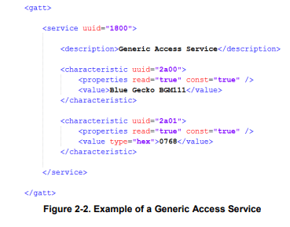

您正在查看的文档版本：5.0 | 此版本仅适用于 Simplicity Studio 5。 如果您使用 Simplicity Studio 4，请切换到 <a href="https://docs.silabs.com/bluetooth/2.13">2.13</a>。| 关于其他版本，请参阅<a href="https://docs.silabs.com/bluetooth/5.0/_version_history">版本历史</a>。

# General Overview

[Silicon Labs Bluetooth LE Documentation](#silicon-labs-bluetooth-le-documentation) | [Release Notes](https://www.silabs.com/documents/public/release-notes/bt-software-release-notes-5.0.0.0.pdf) | [Downloads](https://www.silabs.com/products/development-tools/software/bluetooth-low-energy)

## About the Bluetooth Stack

v3.x Silicon Labs Bluetooth Stack 是一个先进的 Bluetooth 5-compliant 协议栈，实现了 Bluetooth Low Energy 标准。它支持多个连接、同时存在 Central、Peripheral、Broadcaster 和 Observer 角色。v3.x Silicon Labs Bluetooth Stack 适用于 Silicon Labs EFR32 SoCs 和 Modules。

Silicon Labs Bluetooth Stack 为开发者提供了多个 API 以访问 Bluetooth 功能。其支持三种模式：

1. Standalone 模式，即 Bluetooth Stack 和应用程序都在 EFR32 SoC 或 Module 中运行。应用程序可以用 C 编程语言开发。 
2. NCP（Network Co-Processor，网络协处理器）模式，即 Bluetooth Stack 在 EFR32 中运行，应用程序在一个单独的 Host MCU 上运行。在这种情况下，Bluetooth Stack 可以被配置成 NCP 模式，API 通过 UART 等串行接口暴露出来。 
3. RCP（Radio Co-Processor，无线电协处理器）模式，即只有 Bluetooth Stack 的 Link 层在 EFR32 上运行，而 Stack 的 Host 层以及应用程序在单独的 Host MCU 或 PC 上运行。在这种使用情况下，Host 层是由第三方开发的，因为 Silicon Labs 的 Bluetooth Stack 只为 EFR32 SoCs/Modules 而构建。Link 层和 Host 层通过 HCI（Host-Controller Interface，主机-控制器接口）进行通信，这是两层之间的标准接口。HCI 可以通过 UART 访问，遵循 Bluetooth SIG's UART (H4) 传输协议。 

### Bluetooth Stack Features

Silicon Labs Bluetooth Stack 的特性在下表中列出。

### Bluetooth Qualification

所有部署 Bluetooth 技术的产品都必须通过 Bluetooth SIG's Qualification Process。在线资源将帮助你了解关于 [Bluetooth Qualification](https://www.bluetooth.com/develop-with-bluetooth/qualification-listing/qualification-consultants/)、流程和 [Launch Studio](https://www.bluetooth.org/OTV/new_vids/launch-studio-SG-English/content/index.html#/?_k=esxjsd) 教程的更多信息，Launch Studio 是用来完成 Bluetooth Qualification Process 的在线工具。如果想获得设备认证的帮助，可以考虑联系离你最近的 [Bluetooth Qualification Consultant](https://www.bluetooth.com/develop-with-bluetooth/qualification-listing/qualification-consultants/)。

当基于 Silicon Labs Bluetooth Stack 认证你的终端产品时，请整合预认证的组件。要了解更多信息并查看预认证组件列表，请参阅 [QSG169: Bluetooth® SDK v3.x Quick-Start Guide](QSG169/Bluetooth%20Quick-Start%20Guide%20for%20SDK%20v3.x%20and%20Higher.md)。

### The Bluetooth Stack APIs

本节简要介绍了不同的软件 API。

#### The Bluetooth API

Silicon Labs Bluetooth Stack 提供的 Bluetooth API 是与该 Stack 进行通信的主要 API。它提供了对 Bluetooth Stack 实现的所有 Bluetooth 功能的访问，如 GAP（Generic Access Profile）、连接管理器（Connection Manager）、SM（Security Manager，安全管理器）、GATT Client 和 Server。

除了 Bluetooth 功能外，Bluetooth API 还提供对其他一些功能的访问，如用于射频测试的 DTM（Direct Test Mode）API、用于读写设备闪存中的 key 的 PS（Persistent Store，持久化存储）API、用于现场固件更新的 DFU（Device Firmware Update）API，以及用于各种系统级功能的 System API。

#### The BGAPI Serial Protocol and the Bluetooth Host API

在 NCP 模式下配置时，可以使用 BGAPI 串行协议控制 Bluetooth Stack。这允许通过串行接口（如 UART）从单独的 Host（如 EFM32 微控制器）中控制 Bluetooth Stack。当在 Standalone 模式下使用时，BGAPI 串行协议通过 UART 提供与 BGAPI API 完全相同的 Bluetooth API。

BGAPI 串行协议是一个轻量级二进制协议，它将 BGAPI 命令从 Host 传输到 Bluetooth Stack，并将响应和事件从 Bluetooth Stack 传回 Host。

Bluetooth SDK 为 NCP 目标（EFR）和 NCP Host 提供现成的 BGAPI 串行协议解析器实现。它为 Bluetooth Stack 提供的所有 API 实现了串行协议解析器。在 Host API 之上开发的 Host 代码可以编写为与 EFR 的代码相同，这样可以轻松地将应用程序代码从 EFR 移植到单独的 Host，反之亦然。

BGAPI 串行协议数据包的结构描述如下。欲了解更多信息，请参阅 [BGAPI Headers](https://docs.silabs.com/bluetooth/5.0/bgapi-headers)。

#### The Bluetooth Profile Toolkit GATT Builder

Bluetooth Profile Toolkit 是一个基于 XML 的 API 和描述语言，用于描述基于 GATT 的 Service 和 Characteristic，而无需为其编写代码。根据 [UG118: Blue Gecko Bluetooth® Profile Toolkit Developer Guide](https://www.silabs.com/documents/public/user-guides/ug118-bluegecko-bt-profile-toolkit.pdf) 中的信息，可以很容易地手工编写 XML 文件。如果您在 Simplicity Studio 之外进行开发，请使用 Profile Toolkit GATT Builder。

在 Simplicity Studio 内，GATT Configurator 允许以可视化方式构建 GATT，而无需手工编辑 XML 文件。详情见 [UG438: GATT Configurator User’s Guide for Bluetooth SDK v3.x](https://www.silabs.com/documents/public/user-guides/ug438-gatt-configurator-users-guide-sdk-v3x.pdf)。通过 Project Configurator 的 Software Components 选项卡的 Advanced Configurators 在 Simplicity Studio 中打开 GATT Configurator。点击 Open，GATT Configurator 工具将在新标签中打开文件 gatt_configuration.btconf。

gatt_configuration.btconf 提供 GATT 数据库的主干。它位于项目的 config > btconfig 目录中。您可以在同一目录中添加其他 XML 文件并扩展 GATT 数据库。附加的 XML 文件的内容将在 GATT Configurator UI 中显示为 Contributed Items。有关示例，请参阅随大多数示例应用程序提供的 ota-dfu.xml 文件。

使用 Profile Toolkit 开发的 GATT 数据库会被转换为 .c 文件和 .h 文件，并在编译固件时作为预构建步骤包含在应用程序项目中。然后，可以使用 Bluetooth Stack 的 GATT API 或一个远程的 Bluetooth 设备访问 GATT。

#### CMSIS and EMLIB

CMSIS（Cortex Microcontroller Software Interface Standard）是所有 ARM Cortex 设备的通用编码标准。Silicon Labs 提供的 CMSIS 库包含所有设备的头文件、定义（用于外设、寄存器和位域）和启动文件。此外，CMSIS 还包含所有 Cortex 设备通用的功能，例如中断处理、内部功能等。虽然您可以使用硬编码地址和数据值写入寄存器，但建议您使用这些定义以确保代码的可移植性和可读性。

为了简化 Wireless Geckos 的编程，Silicon Labs 开发并维护了一个名为 EMLIB 的完整 C 函数库，该库提供对设备中所有外设和核心功能的高效、清晰和稳健的访问和控制。该库位于 SDK 的 em_xxx.c（如 em_dac.c）和 em_xxx.h 文件中。EMLIB 文档在 [Gecko Platform documentation](https://docs.silabs.com/gecko-platform/latest/) 中可用。

## About the Bluetooth SDK

Bluetooth SDK 是一个完整的软件开发套件，使您能够使用 C 编程语言在 Bluetooth Stack 之上开发应用程序。该 SDK 还支持创建 Standalone 应用程序，其中 Bluetooth Stack 和应用程序都在 Wireless Gecko 中运行，或 NCP 架构，其中应用程序在外部 Host 上运行，而 Bluetooth Stack 在 Wireless Gecko 中运行。[QSG169: Bluetooth® SDK v3.x Quick-Start Guide](QSG169/Bluetooth%20Quick-Start%20Guide%20for%20SDK%20v3.x%20and%20Higher.md) 中描述了 SDK 内容和文件夹结构。

## About Demos and Examples

从头开始的应用程序开发可能很困难。因此，Bluetooth SDK 附带了许多内置的 Demos 和 Examples，涵盖了最常见的用例，如下图所示。Demo 是您可以立即运行的预构建应用程序映像。可以在构建应用程序映像之前修改软件 Example。与软件 Example 同名的 Demo 是从它们各自的 Example 构建的。

注意：您所看到的 Demos 和 Examples 取决于所选的部件。如果您使用包含多个部件的自定义解决方案，请点击您正在使用的部件以仅查看适用于该部件的项目。

Demos 和 Examples 位于 Simplicity Studio 启动器视图的 Example Projects & Demos 选项卡中。

* 要在您的设备上下载并运行 Demo，请点击要在目标上运行的 Demo 上的 RUN。
* 要使用默认项目配置将软件 Example 代码作为新项目导入您的工作区，请在所需 Example 项目的名称上点击 CREATE，然后将打开一个 New Project Wizard 窗口。点击 FINISH，您的项目将以 Simplicity IDE 模式打开，您可以在其中对其进行自定义。

如果 Example 项目非常符合您的需求，请使用您的应用程序代码来扩展该代码并重写自定义部分。否则，从 SoC-Empty 应用程序开始。请注意，SoC-Empty 应用程序不是空白的，而是提供了一个只开始广告的最小项目。

### Demo/Example Descriptions

提供了以下示例。名字中带有（*）的示例具有相匹配的预构建 Demo。

* Silicon Labs Gecko Bootloader examples (see [UG266: Silicon Labs Gecko Bootloader User Guide](https://www.silabs.com/documents/public/user-guides/ug266-gecko-bootloader-user-guide.pdf) and [AN1086: Using the Gecko Bootloader with Silicon Labs Bluetooth Applications](https://www.silabs.com/documents/login/application-notes/an1086-gecko-bootloader-bluetooth.pdf))
* Bluetooth Examples
    * Bluetooth – RCP: Radio Co-Processor (RCP) target application. Runs the Bluetooth Controller (i.e. the Link Layer only) and provides access to it using the standard HCI (Host-Controller Interface) over a UART connection.
    * Bluetooth – NCP(*): Network Co-Processor (NCP) target application. Runs the full Bluetooth stack and provides access to it by exposing the Bluetooth API (BGAPI) via UART connection. NCP mode makes it possible to run your application on a host controller or PC. This example does not have a GATT database, but makes it possible to build one from the application using the Dynamic GATT API.
    * Bluetooth – NCP Empty(*): Network Co-Processor (NCP) target application. Runs the full Bluetooth stack and provides access to it by exposing the Bluetooth API (BGAPI) via UART connection. NCP mode makes it possible to run your application on a host controller or PC. This example contains a minimal GATT database, and cannot be used with host applications that use the Dynamic GATT API.
    * Bluetooth – NCP Host: Reference implementation of an NCP (Network Co-Processor) host, which typically runs on a central MCU without radio. It can connect to an NCP target via UART to access the Bluetooth stack of the target and to control it using BGAPI. This example uses the Dynamic GATT feature.
    * Bluetooth – NCP AoA Locator(*): Network Co-Processor (NCP) target application extended with CTE Receiver support. It enables Angle of Arrival (AoA) calculation. Use this application with Direction Finding host examples.
    * Bluetooth – SoC AoA Asset Tag(*): Demonstrates a CTE (Constant Tone Extension) transmitter that can be used as an asset tag in a Direction Finding setup estimating Angle of Arrival (AoA).
    * Bluetooth – SoC Blinky(*): The classic blinky example using Bluetooth communication. From the EFR Connect mobile app, the LED controller button toggles LED0 on the board. In addition, pressing or releasing PB0 on the mainboard notifies the app. This is a demonstration of a simple two-way data exchange over GATT.
    * Bluetooth – SoC DTM: This example implements the direct test mode (DTM) application for radio testing. DTM commands can be called via UART. See [AN1267: Radio Frequency Physical Layer Evaluation in Bluetooth® SDK v3.x](https://www.silabs.com/documents/public/application-notes/an1267-bt-rf-phy-evaluation-using-dtm-sdk-v3x.pdf) for more information.
    * Bluetooth – SoC Empty: A minimal project structure that serves as a starting point for custom Bluetooth applications. It contains a minimal GATT database that can be expanded to fit your application requirements. The application starts advertising after boot and restarts advertising after a connection is closed. It also supports Over-the-Air Device Firmware Upgrade (OTA DFU)
    * Bluetooth – SoC Interoperability Test (*): A test procedure containing several test cases for Bluetooth Low Energy communication. This demo is meant to be used with the EFR Connect mobile app, through the "Interoperability Test" tile on the Develop view of the app.
    * Bluetooth – SoC Thermometer(*): Implements a GATT Server with the Health Thermometer Profile, which enables a Client device to connect and get temperature data. Temperature is read from the Si7021 digital relative humidity and temperature sensor of the WSTK or of the Thunderboard.
    * Bluetooth – SoC Thermometer Client: Implements a GATT Client that discovers and connects with up to four Bluetooth LE devices advertising themselves as Thermometer Servers. It displays the discovery process and the temperature values received via UART.
        * Note: Some radio boards will exhibit random pixels in the display when this example is running because they have a shared pin for sensor- and display-enabled signals.
    * Bluetooth – SoC Thermometer FreeRTOS: Demonstrates the integration of FreeRTOS into Bluetooth applications. RTOS is added to the Bluetooth - SoC Thermometer sample app.
    * Bluetooth – SoC Thermometer Micrium OS: Demonstrates the integration of Micrium RTOS into Bluetooth applications. RTOS is added to the Bluetooth - SoC Thermometer sample app.
    * Bluetooth – SoC Throughput(*): Tests the throughput capabilities of the device and can be used to measure throughput between two EFR32 devices, as well as between a device and a smartphone using the EFR Connect mobile app, through the Throughput demo tile.
    * Bluetooth – SoC Voice(*): Voice over Bluetooth Low Energy sample application. It is supported by Thunderboard Sense 2 and Thunderboard EFR32BG22 boards and demonstrates how to send voice data over GATT, which is acquired from the on-board microphones.
    * Bluetooth – SoC iBeacon(*): An iBeacon device implementation that sends non-connectable advertisements in iBeacon format. The iBeacon Service gives Bluetooth accessories a simple and convenient way to send iBeacons to smartphones. This example can be tested together with the EFR Connect mobile app.
    * Bluetooth – SoC Thunderboard Sense 2( ), and Thunderboard EFR32BG22( ): Demonstrate the features of the Thunderboard Kit. These can be tested with the Thunderboard mobile app.
* Dynamic Multiprotocol Examples (see [AN1134: Dynamic Multiprotocol Development with Bluetooth and Proprietary Protocols on RAIL](https://www.silabs.com/documents/public/application-notes/an1134-bluetooth-rail-dynamic-multiprotocol.pdf) for more information)
    * Bluetooth – SoC Empty RAIL DMP FreeRTOS: A minimal project structure, used as a starting point for custom Bluetooth + Proprietary DMP (Dynamic Multiprotocol) applications. It runs on top of FreeRTOS and multiprotocol RAIL.
    * Bluetooth – SoC Empty RAIL DMP Micrium OS: A minimal project structure, used as a starting point for custom Bluetooth + Proprietary DMP (Dynamic Multiprotocol) applications. It runs on top of Micrium OS and multiprotocol RAIL.
    * Bluetooth – SoC Empty Standard DMP FreeRTOS: A minimal project structure, used as a starting point for custom Bluetooth + Standard DMP (Dynamic Multiprotocol) applications. It runs on top of FreeRTOS and multiprotocol RAIL utilizing IEE802.15.4 standard protocol.
    * Bluetooth – SoC Empty Standard DMP Micrium OS: A minimal project structure, used as a starting point for custom Bluetooth + Standard DMP (Dynamic Multiprotocol) applications. It runs on top of Micrium OS and multiprotocol RAIL, utilizing IEE802.15.4 standard protocol.
    * Bluetooth – SoC Light RAIL DMP FreeRTOS(*): A Dynamic Multiprotocol reference application demonstrating a light bulb that can be switched both via Bluetooth and via a Proprietary protocol. To switch it via Bluetooth use the Wireless Gecko smartphone app. To switch it via Proprietary protocol use the Flex (RAIL) - Switch sample app.
    * Bluetooth – SoC Light RAIL DMP Micrium OS: A Dynamic Multiprotocol reference application demonstrating a light bulb that can be switched both via Bluetooth and via a Proprietary protocol. To switch it via Bluetooth use the Wireless Gecko smartphone app. To switch it via Proprietary protocol use the Flex (RAIL) - Switch sample app.
    * Bluetooth – SoC Light Standard DMP FreeRTOS(*): A Dynamic Multiprotocol reference application demonstrating a light bulb that can be switched both via Bluetooth and via a standard protocol. To switch it via Bluetooth use the Wireless Gecko smartphone app. To switch it via standard protocol use the "Flex (RAIL) - Switch Standards" sample app.
    * Bluetooth – SoC Light Standard DMP Micrium OS(*): A Dynamic Multiprotocol reference application demonstrating a light bulb that can be switched both via Bluetooth and via a standard protocol. To switch it via Bluetooth use the Wireless Gecko smartphone app. To switch it via standard protocol use the "Flex (RAIL) - Switch Standards" sample app.
* NCP Host Examples (located in C:\SiliconLabs\SimplicityStudio\v5\developer\sdks\gecko_sdk_suite\\app\bluetooth\examples_host)
    * empty: Minimal host-side project structure, used as a starting point for NCP host applications. Use it with the Bluetooth – NCP target application flashed to the radio board.
    * ota-dfu: Demonstrates how to perform an OTA DFU on a Silicon Labs Bluetooth Device. It requires a WSTK with a radio board flashed with NCP firmware to be used as the GATT client that performs the OTA.
    * uart-dfu: Demonstrates how to perform a UART DFU on a Silicon Labs Bluetooth Device running NCP firmware
    * voice: On a WSTK programmed with NCP firmware, it to connects to the Bluetooth – SoC Voice example, sets the correct configuration on it, receives audio via Bluetooth, and stores audio data into a file.
    * aoa_locator: A locator host sample app that works together with a Bluetooth – NCP AoA Locator target app. It receives IQ samples from the target and estimates the Angle of Arrival (AoA). For more information see AN1296: Application Development with Silicon Labs’ RTL Library.
    * aoa_multilocator: Connects to multiple aoa_locator sample apps (via MQTT) and estimates a position from Angles of Arrival (AoA). For more information, see [AN1296: Application Development with Silicon Labs’ RTL Library](https://www.silabs.com/documents/public/application-notes/an1296-application-development-with-rtl-library.pdf).
    * aoa_multilocator_gui: Connects to the aoa_multilocator sample app (via MQTT), reads out the position estimations and displays the tags and locators on a 3D GUI. This sample app is python based. For more information, see [AN1296: Application Development with Silicon Labs’ RTL Library](https://www.silabs.com/documents/public/application-notes/an1296-application-development-with-rtl-library.pdf).
    * aoa_compass: Demo application with GUI showcasing the angle estimation capabilities of the RTL library. This is now replaced with the AoA Analyzer tool as described in [QSG175: Silicon Labs Direction Finding Solution Quick-Start Guide](https://www.silabs.com/documents/public/quick-start-guides/qsg175-direction-finding-solution-quick-start-guide.pdf).
    * throughput: Tests the throughput capabilities of the device in NCP mode and can be used to measure throughput between two devices as well as between a device and a smartphone
* Python-Based NCP Host Examples
    * Python-based NCP host examples can be accesssed at [https://github.com/SiliconLabs/pybgapi-examples](https://github.com/SiliconLabs/pybgapi-examples). These examples are meant to be used with PyBGAPI ([https://pypi.org/project/pybgapi/](https://pypi.org/project/pybgapi/)).

## Silicon Labs Bluetooth LE Documentation

[文档集的图形表示](#documentation-flow)在本清单的末尾。

### Getting Started

* [x] [Getting Started with Simplicity Studio 5 and the Gecko SDK](../SimplicityStudio/Simplicity%20Studio%205%20Users%20Guide/Getting%20Started.md) - 描述了下载开发工具和包含 Silicon Labs Bluetooth SDK 的 Gecko SDK。介绍了 Simplicity Studio 5 界面。
* [x] [UG103.14: Bluetooth LE Fundamentals](UG103.14/Bluetooth%20LE%20Fundamentals.md) - 为刚接触 Bluetooth Low Energy 技术的人提供了一个概述。
* [x] [QSG169: Bluetooth SDK v3.x Quick Start Guide](QSG169/Bluetooth%20Quick-Start%20Guide%20for%20SDK%20v3.x%20and%20Higher.md) - 描述了使用 Simplicity Studio 5 IDE 和工具进行 Bluetooth SDK v3.x 的应用开发。
* [ ] [AN1255: Transitioning from the v2.x to the v3.x Bluetooth SDK]() - 描述了在 Simplicity Studio 4 中使用 Bluetooth SDK v2.x 和在 Simplicity Studio 5 中使用 Bluetooth SDK v3.x 之间的区别，概述了将 v2.x 项目迁移到 v3.x 所需的步骤。

### Developing with Bluetooth LE

* [ ] [UG434: Silicon Labs Bluetooth C Application Developer's Guide for SDK v3.x]() - 涵盖了 Bluetooth Stack v3.x 架构、应用开发流程、使用 MCU 内核和外设、协议栈配置选项和协议栈资源用量。
* [ ] [UG438: GATT Configurator User's Guide for Bluetooth SDK v3.x and Higher]() - 描述了如何使用 Simplicity Studio 5 的 GATT Configurator，这是一个直观的界面，可以访问 Bluetooth Specification 中定义的所有 Profiles、Services、Characteristics 和 Descriptors。
* [ ] [UG118: Blue Gecko Bluetooth Profile Toolkit Developer's Guide]() - 检阅使用这种基于 XML 的标记语言来描述 Bluetooth GATT Database、配置访问和安全属性，并将 GATT Database 作为固件的一部分。
* [ ] [AN1259: Using the v3.x Silicon Labs Bluetooth Stack in Network Co-Processor Mode]() - 描述了在 NCP 模式下使用 Bluetooth Stack 时，如何配置 NCP 目标和如何对 NCP Host 进行编程。
* [ ] [AN1328: Enabling a Radio Co-Processor using the Bluetooth Controller and HCI Functions]() - 简要介绍了标准的 HCI 以及如何使用 Silicon Labs Bluetooth LE Controller。
* [ ] [AN1260: Integrating v3.x Silicon Labs Bluetooth Applications with Real-Time Operating Systems]() - 描述了如何将 v3.x Silicon Labs Bluetooth 应用程序与 RTOS 集成，并演示了如何将时间驱动和事件驱动的应用程序与 Bluetooth Stack 同时运行。
* [ ] [AN1362: Amazon FreeRTOS Architecture and Sample Applications]() - 总结了 Amazon FreeRTOS 组件和示例应用程序，并解释了如何使用这些示例与 AWS（Amazon Web Services）云进行智能手机应用程序的通信。
* [ ] [AN1366: Bluetooth LE Use Case-Based Low Power Optimization]() - 描述了如何利用 Bluetooth 技术的不同特性来实现特定使用情况下的最小能耗。
* [x] [UG162: Simplicity Commander Reference Guide](../Others/UG162/Simplicity%20Commander%20Reference%20Guide.md) - 描述了如何以及何时使用 Simplicity Commander 的命令行接口。

### Direction Finding

* [ ] [UG103.18: Bluetooth Direction Finding Fundamentals]() - 解释 Bluetooth 的 AoA（Angle of Arrival）和 AoD（Angle of Departure）测向技术的基本知识，并提供评估 AoA 的理论。
* [ ] [QSG175: Silicon Labs' Direction Finding Solution Quick-Start Guide]() - 描述了 Silicon Labs 提供的用于支持 DF（Direction Finding）的软件组件，并提供了有关如何开始开发您自己的应用程序的说明。
* [ ] [AN1296: Application Development with Silicon Labs' RTL Library]() - 描述为演示 Bluetooth 5.1 的测向功能而提供的示例应用程序。使用 Silicon Labs 的 RTL（Real Time Locating）库演示了到 AoA（Angle of Arrival）评估。这些技术适用于 EFR32MGx 和 EFR32BGx 系列。
* [ ] [AN1297: Custom Direction-Finding Solutions using Silicon Labs' Bluetooth Stack]() - Bluetooth 5.1 使得在 Bluetooth 数据包中发送 CTEs（Constant Tone Extensions）成为可能，在这些数据包中可以进行相位测量。本指南适用于那些利用相位测量和天线切换功能来实现自定义应用程序的人员。
* [ ] [UG514: Using the Bluetooth Direction Finding Tool Suite]() - Bluetooth Direction Finding Tool Suite 旨在简化 Silicon Labs 的 RTL 库的开发。它提供了多种工具来配置系统，还可以通过分析工具来帮助开发，这些分析工具可以根据观察到的 IQ 样本计算出许多输出参数。

### Multiprotocol

* [x] [UG103.16: Multiprotocol Fundamentals](../Others/UG103.16/Multiprotocol%20Fundamentals.md) - 描述了四种多协议模式，讨论了为多协议实现选择协议时的注意事项，并回顾了无线电调度器，这是动态多协议解决方案的必需组件。
* [x] [UG305: Dynamic Multiprotocol User's Guide](../Others/UG305/Dynamic%20Multiprotocol%20User's%20Guide.md) - 描述了如何实现动态多协议解决方案。
* [ ] [AN1269: Dynamic Multiprotocol Development with Bluetooth and Proprietary Protocols on RAIL in GSDK v3.x]() - 提供有关如何在 GSDK v3.x 中开发在 RAIL 上运行 Bluetooth 和专有协议的动态多协议应用程序的详细信息。
* [ ] [AN1333: Running Zigbee, OpenThread, and Bluetooth Concurrently on a Linux Host with a Multiprotocol Co-Processor]() - 描述了如何在 Linux Host 处理器上运行 Zigbee EmberZNet、OpenThread 和 Bluetooth 网络栈的任何组合，与一个支持多协议和 multi-PAN 的 EFR32 RCP（Radio Co-Processor）对接，以及如何在 EFR32 上作为 Zigbee NCP（Network Co-Processor）与 OpenThread RCP 一起运行。

### Coexistence

* [ ] [UG103.17: Wi-Fi Coexistence Fundamentals]() - 介绍了改善 2.4 GHz IEEE 802.11b/g/n Wi-Fi 与其他 2.4 GHz 无线电（如 Bluetooth、Bluetooth Mesh、Bluetooth Low Energy）和基于 IEEE 802.15.4 的无线电（如 Zigbee 和 OpenThread）的共存的方法。
* [ ] [AN1128: Bluetooth Coexistence with Wi-Fi]() - 描述了 Wi-Fi 对 Bluetooth 的影响以及改善 Bluetooth 与 Wi-Fi 共存的方法。解释了在 Bluetooth 和 Wi-Fi 无线电之间没有直接交互的情况下改善共存的设计注意事项。这些技术适用于 EFR32MGx 和 EFR32BGx 系列。讨论了 Silicon Labs PTA（Packet Traffic Arbitration），以协调位于同一位置的 Bluetooth 和 Wi-Fi 无线电的 2.4GHz RF 流量。

### Security

* [ ] [UG103.05: IoT Endpoint Security Fundamentals]() - 介绍了实施物联网系统时必须考虑的安全概念。它使用 ioXt 联盟的八项安全原则作为结构，清楚地描述了 Silicon Labs 为支持端点安全而提供的解决方案以及您必须在 Silicon Labs 框架之外执行的操作。
* [ ] [AN1302: Bluetooth Low Energy Application Security Design Considerations in SDK v3.x and Higher]() - 提供了有关在考虑安全和隐私的情况下设计 Bluetooth Low Energy 应用程序的详细信息。
* [ ] [AN1190: Series 2 Secure Debug]() - 描述了如何锁定和解锁 EFR32 Gecko Series 2 设备的调试访问。描述了调试访问的许多方面，包括安全调试解锁。还包括用于锁定和解锁调试访问的 DCI（Debug Challenge Interface）和 SE（Secure Engine）Mailbox Interface。
* [ ] [AN1222: Production Programming of Series 2 Devices]() - 提供了有关在生产环境中编程、供应和配置 Series 2 设备的详细信息。涵盖了 Series 2 设备的安全引擎子系统，该子系统运行可轻松升级的 SE（Secure Engine）或 VSE（Virtual Secure Engine）固件。
* [ ] [AN1247: Anti-Tamper Protection Configuration and Use]() - 展示了如何使用 Secure Vault 在 EFR32 Series 2 设备上编程、供应和配置防篡改模块。
* [ ] [AN1268: Authenticating Silicon Labs Devices using Device Certificates]() - 如何使用安全设备证书和签名通过 Secure Vault 验证 EFR32 Series 2 设备。
* [ ] [AN1271: Secure Key Storage]() - 解释了如何使用 Secure Vault 安全地 “包装” EFR32 Series 2 设备中的密钥，以便它们可以存储在非易失性存储器中。
* [ ] [AN1303: Programming Series 2 Devices Using the Debug Challenge Interface (DCI) and Serial Wire Debug (SWD)]() - 描述了如何通过 DCI 和 SWD 供应和配置 Series 2 设备。
* [ ] [AN1311: Integrating Crypto Functionality Using PSA Crypto Compared to Mbed TLS]() - 描述了与 Mbed TLS 相比如何使用 PSA Crypto 将加密功能集成到应用程序中。

### Bootloading

* [x] [UG103.06: Bootloader Fundamentals](../Others/UG103.6/Bootloader%20Fundamentals.md) - 介绍了 Silicon Labs 网络设备的引导加载。讨论了 Gecko Bootloader 以及遗留的 Ember Bootloader 和 Bluetooth Bootloader，并描述了它们各自使用的文件格式。
* [ ] [UG489: Silicon Labs Gecko Bootloader User's Guide for GSDK 4.0 and Higher]() - 描述了用于 EFR32 SoC 和 NCP 的 Silicon Labs Gecko Bootloader 的高级实现，并提供了有关如何开始使用 Gecko Bootloader 和 GSDK 4.0（及更高版本）中的 Silicon Labs 无线协议栈的信息。
* [ ] [AN1086: Using the Gecko Bootloader with Silicon Labs Bluetooth Applications]() - 包含将 Gecko Bootloader 与 Silicon Labs Bluetooth 应用程序结合使用的相关详细信息。它补充了 [UG489: Silicon Labs Gecko Bootloader User's Guide for GSDK 4.0 and Higher]() 中提供的通用 Gecko Bootloader 实现信息。
* [ ] [AN1326: Transitioning to the Updated Gecko Bootloader in GSDK 4.0 and Higher]() - GSDK 4.0 中引入的 Gecko Bootloader v2.x 与 Gecko Bootloader v1.x 相比包含了许多更改。此文档描述了版本之间的差异，包括如何在 Simplicity Studio 5 中配置新的 Gecko Bootloader。
* [ ] [AN1218: Series 2 Secure Boot with RTSL]() - 包含了有关在 Series 2 设备上配置和使用带有硬件信任根和安全加载器的安全启动的详细信息，包括如何配置签署密钥。这是 [UG489: Silicon Labs Gecko Bootloader User's Guide for GSDK 4.0 and Higher]() 的配套文档。

### Non-Volatile Data Storage

* [x] [UG103.07: Non-Volatile Data Storage Fundamentals](../Others/UG103.7/Non-Volatile%20Data%20Storage%20Fundamentals.md) - 介绍了使用闪存的非易失性数据存储以及为 Silicon Labs 微控制器和 SoC 提供的三种不同存储实现：Simulated EEPROM、PS Store 和 NVM3。
* [x] [AN1135: Using Third Generation Non-Volatile Memory (NVM3) Data Storage](../Others/AN1135/Using%20Third%20Generation%20Non-Volatile%20Memory%20(NVM3)%20Data%20Storage.md) - 解释了 NVM3 如何在各种协议实现中用作非易失性数据存储。

### Testing

* [ ] [AN1246: EFR32BG SoC Bluetooth Smart Device Power Consumption Measurements]() - 描述了如何测量运行 Bluetooth i-Beacon Example 的 EFR32BG 设备的功耗。有关一般说明，请参阅 [AN969: Measuring Power Consumption in Wireless Gecko Devices]()。
* [ ] [AN1267: Radio Frequency Physical Layer Evaluation in Bluetooth SDK v3.x and Higher]() - 检阅使用 Bluetooth SDK v3.x 中的 Direct Test Mode 协议对 EFR32BG SoC 和 BGM Module 执行射频物理层评估。
* [ ] [AN1317: Using Network Analyzer with Bluetooth Low Energy and Mesh]() - 描述了如何使用 Simplicity Studio 5 的 Network Analyzer 调试 Bluetooth Mesh 和 Bluetooth Low Energy 应用程序。它可以与 [AN958: Debugging and Programming Interfaces for Customer Designs]() 一起阅读，以了解将 Packet Trace Interface 与自定义硬件结合使用的更多相关信息。
* [ ] [AN1309: Bluetooth Low Energy Interoperability Testing Report]() - 包含了 Silicon Labs 的 IC 和 Bluetooth Low Energy Stack 与 Android 和 iOS 智能手机的互操作性测试结果。

### Documentation Flow

