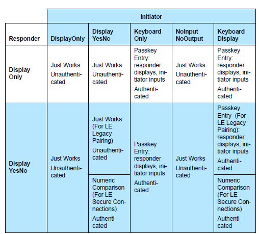
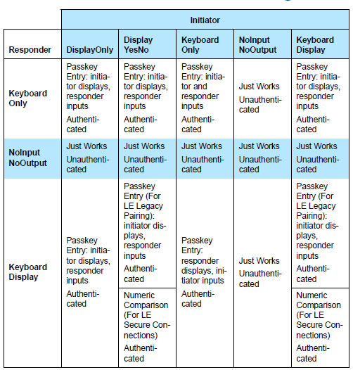

# UG103.14: Bluetooth® LE Fundamentals (Rev. 0.7) <!-- omit in toc -->

- [1. Background](#1-background)
- [2. Bluetooth Low Energy Architecture](#2-bluetooth-low-energy-architecture)
- [3. Physical Layer](#3-physical-layer)
- [4. Link Layer](#4-link-layer)
  - [4.1 Link Layer Operations](#41-link-layer-operations)
    - [4.1.1 Advertisement](#411-advertisement)
    - [4.1.2 Scanning](#412-scanning)
    - [4.1.3 Connections](#413-connections)
  - [4.2 Network Topologies](#42-network-topologies)
- [5. Generic Access Profile (GAP)](#5-generic-access-profile-gap)
- [6. Attribute Protocol (ATT)](#6-attribute-protocol-att)
  - [6.1 Attributes](#61-attributes)
  - [6.2 Attribute Protocol Operations](#62-attribute-protocol-operations)
  - [6.3 Acknowledgements](#63-acknowledgements)
- [7. Generic Attribute Profile (GATT)](#7-generic-attribute-profile-gatt)
- [8. Bluetooth Low Energy Security](#8-bluetooth-low-energy-security)
  - [8.1 What Protection Does Bluetooth Security Provide?](#81-what-protection-does-bluetooth-security-provide)
  - [8.2 Pairing and Bonding](#82-pairing-and-bonding)
  - [8.3 Encryption](#83-encryption)
  - [8.4 Privacy](#84-privacy)
- [9. Next Steps](#9-next-steps)

---

Silicon Labs’ Fundamentals 系列的本卷提供了 BLE（Bluetooth Low Energy）技术的概述。传统的 Bluetooth 技术经过优化，可以以节能的方式发送稳定的高质量数据流。BLE 技术允许长距离的突发无线电连接，使其成为依赖高电池寿命且不需要高吞吐量流数据的应用的理想选择。本概述重点介绍了 BLE 技术，但也涉及到与传统 Bluetooth 技术的一些对比。

# 1. Background

Silicon Labs 正在开发旨在满足客户需求的产品，因为我们正迈入家庭设备的互联世界，这通常被称为物联网（IoT，Internet of Things）。总体而言，Silicon Labs 的物联网目标是：

* 通过一流的网络连接家庭中的所有设备，无论是使用 ZigBee PRO、Thread、BLE 还是其他新兴标准。
* 利用公司在低功耗、受限设备中的专业知识。
* 增强已建立的低功耗混合信号芯片。
* 提供与现有 Ethernet 和 Wi-Fi 设备的低成本桥接。
* 支持云服务以及与智能手机和平板电脑的连接，以促进易用性和客户的普通用户体验。

实现这些目标将提高互联家庭中物联网设备的采用率和用户接受度。

Bluetooth 技术是物联网的核心组成部分。Bluetooth 旨在通过使用无线电传输交换数据来为电缆连接提供无线替代方案。Bluetooth 最受欢迎的应用之一是无线音频。它使用称为 BR/EDR（Bit Rate/Enhanced Data Rate）的 Bluetooth 版本，该版本经过优化，可以以省电的方式发送稳定的高质量数据流。

Bluetooth 4.0 引入了 BLE。开发者现在能够创建可以在纽扣电池上运行数月甚至数年的传感器。这些传感器中的某些传感器是如此高效，以至于通过按下开关来产生的动能可以提供工作能量。BLE 技术与 BR/EDR 本质上不同。BR/EDR 建立了相对短距离的连续无线连接，使其非常适合从智能手机到头戴式耳机的流音频传输等应用。BLE 技术允许长距离的突发无线电连接，使其非常适合需要较长电池寿命的物联网应用。此外，BLE 技术基于使用 GATT（Generic Attributes）的全新开发框架构建。GATT Profile 根据 GATT 功能性描述了用例、角色和一般行为。这些 Profile 使开发者可以快速轻松地开发应用程序，以将设备直接连接到在智能手机、PC 或平板电脑上运行的应用。

Bluetooth 设备可以支持 BR/EDR 和 BLE 双模式，也可以仅支持 BLE 单模式。

除了超低功耗和与智能手机、PC 和平板电脑的连接性之外，BLE 的其他好处还包括：

* 低成本
* 可靠且健壮：AFH（Adaptive Frequency Hopping，自适应跳频）、重传和 24-bit CRC（Cyclic Redundancy Checks，循环冗余校验）
* 安全：配对（Pairing）、绑定（Bonding）、隐私（Privacy）、中间人（MITM，Man in the Middle，）保护和 AES-128 加密
* 支持快速开发：
  * 涵盖主要用例（HR、HID、Glucose、Proximity 等）的标准化 Profile
  * 可以将 Profile 作为应用程序开发，其支持快速部署
  * Vendor-specific Profile 无需等待 Bluetooth SIG 标准化 Profile 和操作系统开发人员将它们集成
* 可广泛部署：受主流平台的支持 —— iOS、Android 4.3（及更高版本）、Windows 8 和 10、OSX 和 Linux

Bluetooth Specification 由 Bluetooth SIG（Special Interest Group）管理。SIG 维护着一个网站 [https://www.bluetooth.com](https://www.bluetooth.com)，其中包含介绍性信息以及指向规范和其他更多技术细节的链接。在本文档中，括号内是指规范的修订版，其中（BT5.0）表示 Bluetooth Specification 5.0。

本文档概述了 BLE 的以下方面：

* Bluetooth 架构概述
* 无线电特性
* 链路层的基础
* 解释设备发现和连接的工作方式
* Bluetooth 安全概述
* Attribute Protocol
* Generic Attribute Profile 和 Bluetooth Profile

# 2. Bluetooth Low Energy Architecture

下图展示了 BLE 架构：

组成部分如下：

* 物理层（Physical Layer）：控制无线电传输/接收。
* 链路层（Link Layer）：定义数据包结构、包含状态机和无线电控制、并提供链路层级别的加密。

通常将这两层分组为 Controller，其余的层则分组为 Host。HCI（Host-to-Controller Interface，主机-控制器接口）标准化了 Controller 和 Host 之间的通信。Host 层包含：

* L2CAP（Logical Link Control and Adaptation Protocol）：L2CAP 充当协议多路复用器，并处理数据包的分段和重组。它还提供了逻辑通道，这些通道在一个或多个逻辑链路上多路复用。BLE 中使用的 L2CAP 是基于 classic Bluetooth L2CAP 的优化和简化协议。通常，应用开发者无需关心与 L2CAP 层进行交互的细节。交互由 Bluetooth 协议栈处理，L2CAP 操作的细节不在本文档中介绍。
* ATT（Attribute Protocol）：ATT 提供了在 BLE 设备之间传输数据的方法。它依靠 BLE 连接，并提供通过该连接读取（Read）、写入（Write）、指示（Indicate）和通知（Notify）Attribute 值的过程。ATT 用于大多数 BLE 应用，有时还用于 BR/EDR 应用。
* GATT（Generic Attribute Profile）：GATT 用于将各个 Attribute 分组成逻辑上的 Service。例如 Heart Rate Service，它公开了心率传感器的操作。除了实际数据外，GATT 还提供了 Attribute 的相关信息，即如何访问 Attribute 以及需要哪种安全级别
* GAP（Generic Access Profile）：GAP 层为 BLE 设备提供了广告（Advertise）自身或其他设备、进行设备发现（Discovery）、打开和管理连接（Connection）以及广播（Broadcast）数据的手段。
* SM（Security Manager）：提供用于绑定设备、加密和解密数据以及实现设备隐私的方法。

以下各节将更详细地讨论这些组成部分。

# 3. Physical Layer

BLE 工作在 2.4 GHz ISM（Industrial Scientific Medical）频段（2402 MHz-2480 MHz）中，该频段在大多数国家/地区是免许可的。Bluetooth 4 Specification 定义了 40 个射频信道，信道间隔为 2 MHz（见下图）。在 40 个信道中有 3 个是广告信道（以绿色显示），用于设备发现、连接建立和广播。选择这些频率作为广告信道是为了最大程度上减少在多个国家/地区普遍使用的 IEEE 802.11 信道 1、6 和 11 的干扰。

在 Bluetooth 5 Specification 中，以下突出显示的 3 个广告信道称为主要（Primary）广告信道。剩下的 37 个信道可用作辅助（Secondary）广告信道或用于其他广告数据传输的数据信道。

数据信道用于已连接设备间的双向通信。AFH（Adaptive FHSS）用于选择在给定时间间隔内进行通信的数据信道。AFH 可靠、健壮且抗干扰。

所有物理信道均使用 GFSK（Gaussian Frequency Shift Keying，高斯频移键控）调制，调制指数为 0.5（可降低峰值功耗）。在 Bluetooth 4.0、4.1 和 4.2 规范中，物理层数据速率为 1 Mbps。

Bluetooth 5 标准引入了额外的 2M PHY 速率，以实现更大的吞吐量或更短的 TX 和 RX 时间。

Bluetooth 和法规标准的最新变化使 Bluetooth Smart 设备可以使用高达 100 mW（20 dBm）的发射功率。但是，并非所有国家/地区都允许使用 100 mW 的发射功率，因为当存在明显干扰时，BLE 无线电设备可能会下降到两个射频信道。

BLE 无线电的要求如下：

| Feature                | Value              |
| :--------------------- | :----------------- |
| Minimum TX power       | 0.01 mW (-20 dBm)  |
| Maximum TX power       | 100 mW (20 dBm)    |
| Minimum RX sensitivity | -70 dBm (BER 0.1%) |

BLE 无线电的典型范围如下：

| TX power | RX sensitivity | Antenna gain | Range      |
| :------- | :------------- | :----------- | :--------- |
| 0 dBm    | -92 dBm        | -5 dB        | 160 meters |
| 10 dBm   | -92 dBm        | -5 dB        | 295 meters |

由于智能手机的射频性能有限，因此智能手机的射程通常为 0 ~ 50 米。

# 4. Link Layer

BLE 链路层提供了原始无线电操作以及比特流传输和接收的第一级控制和数据结构。例如，链接层定义以下内容。

* Bluetooth 状态机和状态转换
* 数据和广告包格式
* 链路层操作
* 连接、数据包计时、重传
* 链路层级别的安全

应用开发者不需要详细了解这些内容，但是一些基本概念会影响应用程序的设计、开发和最终设备的操作。本节提供了这些概念的摘要。

## 4.1 Link Layer Operations

本节描述了 BLE 链路层的基本操作，包括：

* 广告
* 扫描
* 连接建立

### 4.1.1 Advertisement

广告是 BLE 无线技术中最基本的操作之一。广告为设备提供了一种广播其存在、允许建立连接，以及可选地广播数据（如支持的 Service 列表、设备名、TX 功率级别）的方式。

如下图所示，进行广告的 BLE 设备在一个或多个广告信道上广播数据包，然后远程设备可以获取这些数据包。

应用程序通常可以控制以下广告参数。

| Parameter              | Values                                                                      | Description                                                                                                                                                                                                                                            |
| :--------------------- | :-------------------------------------------------------------------------- | :----------------------------------------------------------------------------------------------------------------------------------------------------------------------------------------------------------------------------------------------------- |
| Advertisement interval | 20 ms to 10240 ms                                                           | Defines the interval between the advertisement events. Each event consist of 1 to 3 advertisement packets depending on the configuration. A random 0-10 ms is added by the link layer to every advertisement interval to help avoid packet collisions. |
| Advertisement channels | 37, 38 and 39 (primary channels); 0-10 and 11-36 (BT 5 secondary channels)  | The physical RF channels used to transmit the advertisement packets. For most reliable operation all channels should be used, but reducing the number of channels used will reduce power consumption at the cost of reliability.                       |
| Discoverability mode   | Not Discoverable; Generic Discoverable; Limited Discoverable; Broadcast     | Defines how the advertiser is visible to other devices.                                                                                                                                                                                                |
| Connectability mode    | Not Connectable; Directed Connectable; Undirected                           | Connectable Defines if the advertiser can be connected or not                                                                                                                                                                                          |
| Payload                | 0 to 31 B (primary advertisement); 0 to 255 B (BT5 secondary advertisement) | 0-31 bytes of data can be included in each primary advertisement packet. 0-255 bytes of data can be included in each secondary advertisement packet (Bluetooth 5)                                                                                      |

### 4.1.2 Scanning

扫描是一种操作，其中扫描者（Scanner）侦听传入的广告，以便发现、发现并连接或简单地接收广告设备广播的数据。

支持两种类型的扫描模式：被动扫描（见 [Figure 4.2. Passive Scanning](#passive_scanning)）和主动扫描（见 [Figure 4.3. Active Scanning](#active_scanning)）。

在被动扫描模式下，扫描者仅侦听传入的广告包。扫描者以循环的方式侦听每个广告信道，每次侦听一个信道。

在主动扫描模式下，扫描者侦听传入的广告包，并在收到广告包后，向广告者（Advertiser）发送一个额外的扫描请求包来了解广告者的更多信息。通常，扫描响应包含诸如支持的 Service 列表和友好名称之类的信息，但是应用程序可以完全地控制扫描响应数据的有效载荷。

应用程序通常控制以下扫描参数。

| Parameter           | Values                                                        | Description                                                                                                                                 |
| :------------------ | :------------------------------------------------------------ | :------------------------------------------------------------------------------------------------------------------------------------------ |
| Scan interval       | 2.5 ms to 10240 ms                                            | The interval is ms from the beginning of a scan event to a beginning of a consecutive scan event. Must be equal or larger than scan window. |
| Scan window         | 2.5 ms to 10240 ms                                            | The scan window defines the duration of the listening (RX) window during a scan event.                                                      |
| Scan type           | Limited; Generic; Observation                                 | Defines which type of advertisers the scanner reports.                                                                                      |
| Scan mode           | Active; Passive                                               | Defines if active or passive scanning is performed.                                                                                         |
| Connectability mode | Not Connectable; Directed Connectable; Undirected Connectable | Defines if the advertiser can be connected to or not.                                                                                       |

### 4.1.3 Connections

连接使应用数据能够以可靠的方式进行传输，因为 BLE 连接使用了 CRC、确认和重传来确保正确的数据交付。此外，BLE 连接使用 AFH 来检测和适应周围的射频条件并提供可靠的物理层。连接还支持数据的加密和解密，以确保其机密性。

BLE 连接总是从扫描者接收到广告包开始，并且需要该广告包的广告者允许连接。下图说明了 BLE 连接建立的过程。

应用程序通常控制以下连接参数。

| Parameter                       | Values                          | Description                                                                                                                                                             |
| :------------------------------ | :------------------------------ | :---------------------------------------------------------------------------------------------------------------------------------------------------------------------- |
| Minimum Connection Interval     | 7.5 ms                          | Minimum allowed connection interval                                                                                                                                     |
| Maximum Connection Interval     | 4000 ms                         | Maximum allowed connection interval                                                                                                                                     |
| Connection (peripheral) latency | 0 to 500 (connection intervals) | The amount of connection events the peripheral is allowed to skip if it has no data to send.                                                                            |
| Supervision timeout             | 100 ms to 32000 ms              | Defines how long the break in communications can be (for example due to out of range situation) before the connection is dropped and an error is presented to the user. |

可以在连接期间使用一个连接更新消息来更新连接参数。

当 Central 设备以定义的连接间隔向 Peripheral 发送数据包时，连接事件（见 [Figure 4.5. Connection Timeline](#connection_timeline)）开始。Peripheral 收到 Central 设备的数据包后，可以在 150 µs 内做出响应。如果 Peripheral 没有要发送的数据，那么它可以跳过 Connection (Peripheral) Latency 定义的一定数量的连接事件（见 [Figure 4.6. Peripheral Latency (latency=3)](#peripheral_latency)）。如果 Central 或 Peripheral 设备在 Supervision Timeout 所定义的时间内未收到任何数据包，则连接终止。

.png "Figure 4.6. Peripheral Latency \(latency=3\)")

如果 Peripheral 发送的数据量超过单个数据包可容纳的数据量，则连接事件将自动延长，并且 Peripheral 可以发送尽可能多的数据包，直到下一个连接间隔开始为止。这只能与不需要确认的 ATT 操作一起使用。

## 4.2 Network Topologies

BLE 技术中的设备角色有：

* 广告者（Advertiser）：广播广告包但无法接收它们的设备。它可以允许或不允许连接。
* 扫描者（Scanner）：仅侦听广告的设备。它可以连接到广告者。
* Peripheral：连接到单个 Central 设备（BT 4.0）或多个 Central 设备（BT 4.1 及更高版本）的设备。
* Central：连接到一个或多个 Peripheral 的设备。理论上，一个 Central 可以连接无数个 Peripheral；但在实践中，一个 Central 可以同时连接 4 ~ 20 个 Peripheral。
* Hybrid：设备可以同时进行广告和扫描，或者连接到一个 Central 设备并同时进行广告或扫描。但是，这是 Vendor-specific 的，应该与 Vendor 一起确认所支持的特性。

下面两个图展示了 BLE 拓扑的示例。

设备可以变更角色和拓扑，如下图所示。

# 5. Generic Access Profile (GAP)

GAP 是每个 BLE 开发者都可以接触到的第一层。这是因为 GAP 用于控制设备如何被其他设备看见和连接以及如何发现并连接到远程设备。

简而言之，GAP 提供对 [4.1 Link Layer Operations](#41-link-layer-operations) 中描述的链路层操作的访问，这些操作与设备发现、连接建立和终止以及连接时序控制有关。

GAP 定义了为底层 Controller 提供特定要求的设备角色。角色使设备可以具有仅发送（TX）、仅接收（RX）或可收发的无线电。

* 广播者（Broadcaster）（仅 TX）：发送广告事件和广播数据。
* 观察者（Observer）（仅 RX）：侦听广告事件和广播数据。
* Peripheral（RX 和 TX）：始终为 Peripheral，可连接和进行广告。专为与 Central 角色进行单一连接的简单设备而设计。
* Central（RX 和 TX）：始终是 Central，从不广告。专为负责启动和管理多个连接的设备而设计。

一台设备可以支持多个角色，但在给定时间内只能担任一个角色。

GAP 还定义了发现、连接和绑定的模式和过程。尽管底层技术可能有所不同，但 BLE 和 BR/EDR 的术语相同。

模式：

* 可连接性（Connectable）：可以建立连接。 状态：不可连接（Non-Connectable），可连接（Connectable）。
* 可发现性（Discoverable）：可被发现（正在广告时）。状态：无（None），有限（Limited），一般（General）。
* 可绑定性（Bondable）：如果可连接，将与连接的设备配对以进行长期连接。状态：不可绑定（Non-Bondable），可绑定（Bondable）。

过程：

* 名称发现（Name Discovery）：进入菜单，找到另一台设备的名称。该名称在双模设备中与 BR/EDR 共享。
* 设备发现（Device Discovery）：搜索可用于连接的设备。
  * 查找设备的地址和名称。
  * 定义设备角色。
* 链路建立（Link Establishment）：选择一个正在广告的设备后，与它连接。
  * 指示链路层发送 CONNECT_REQ。
  * 执行 Service 发现。
  * 请求设备认证（非数据认证）。
  * 请求使用 Service。
* Service 发现：由 Central 和 Peripheral 角色的设备用来查找对等设备上可用的 Service。

# 6. Attribute Protocol (ATT)

BLE Profile 可暴露设备的状态。状态作为一个或多个称为 Attribute 的值公开。访问这些 Attribute 的协议称为 ATT（Attribute Protocol）。ATT 在专用的 L2CAP 通道上定义了分别扮演服务端和客户端角色的两个设备之间的通信。ATT 定义了两个角色：

* 服务端（Server）：将数据存储为一个或多个 Attribute 的设备
* 客户端（Client）：从一个或多个服务端收集信息的设备

客户端可以通过发送请求来访问服务端的 Attribute，这些请求会触发来自服务端的响应消息。为了提高效率，服务端也可以向客户端发送两种类型的（未经请求的）消息，这些消息包含 Attribute：通知（无确认）；和指示（要求客户端发送确认）。客户端还可以向服务端发送命令以写入 Attribute 值。请求/响应和指示/确认事务遵循一个停止与等待（stop-and-wait）策略。

本节介绍 Attribute 并提供协议方法的摘要。

## 6.1 Attributes

Attribute 是可以在 0 ~ 512 byte 之间变化的数组，如下示例所示，并且它们可以是固定长度或可变长度。

<table title="Example">
<thead>
  <tr>
    <th>Value</th>
  </tr>
</thead>
<tbody>
  <tr>
    <td style="white-space: nowrap">0x0000</td>
  </tr>
  <tr>
    <td style="white-space: nowrap">0x426c75656769676120546563686e6f6c6f67696573</td>
  </tr>
</tbody>
</table>

所有 attribute 都有句柄（handle）（用于寻址单个 attribute），如下示例所示。客户端使用句柄访问服务端的 attribute。

<table title="Example">
<thead>
  <tr>
    <th>Handle</th>
    <th>Value</th>
  </tr>
</thead>
<tbody>
  <tr>
    <td style="white-space: nowrap">0x0001</td>
    <td style="white-space: nowrap">0x0000</td>
  </tr>
  <tr>
    <td style="white-space: nowrap">0x0002</td>
    <td style="white-space: nowrap">0x426c75656769676120546563686e6f6c6f6769657</td>
  </tr>
</tbody>
</table>

Attribute 还具有类型，由 UUID（Universally Unique Identifier，通用唯一标识符）描述，如下示例所示。UUID 确定 attribute 值的含义。

有两种类型的 UUID：

* Globally unique 16-bit UUID，在 [characteristics specification](https://www.bluetooth.com/specifications/bluetooth-core-specification) 中定义。
* Manufacturer-specific 128-bit UUID，这可以在线生成（如 [https://www.uuidgenerator.net/](https://www.uuidgenerator.net/)）。

<table title="Example">
<thead>
  <tr>
    <th>Handle</th>
    <th>UUID</th>
    <th>Value</th>
    <th>Description</th>
  </tr>
</thead>
<tbody>
  <tr>
    <td style="white-space: nowrap">0x0001</td>
    <td style="white-space: nowrap">0x1804</td>
    <td style="white-space: nowrap">0x0000</td>
    <td style="white-space: nowrap">TX power as dBm</td>
  </tr>
  <tr>
    <td style="white-space: nowrap">T0x0002</td>
    <td style="white-space: nowrap">0x2a00</td>
    <td style="white-space: nowrap">0x426c75656769676120546563686e6f6c6f6769657</td>
    <td style="white-space: nowrap">Device name, UTF-8</td>
  </tr>
</tbody>
</table>

Attribute 还具有权限（permission），可以是：

* 可读（Readable）/不可读（Not readable）
* 可写（Writable）/不可写（Not writable）
* 可读和可写/不可读也不可写

Attribute 还可能需要以下内容：

* 身份验证（Authentication），以读取或写入
* 授权（Authorization），以读取或写入
* 加密和配对（Encryption and pairing），以读取或写入

Attribute 类型和句柄是公开的信息，但权限不是。因此，读或写请求可能会导致错误，“Read/Write Not Permitted”或“Insufficient Authentication”。

## 6.2 Attribute Protocol Operations

ATT 是一个无状态顺序协议，这意味着协议中没有存储任何状态，一次只能执行一个操作。

下表描述了可用的 ATT 方法：

<table title="Table 6.1. Attribute Protocol Methods">
<thead>
  <tr>
    <th>Method</th>
    <th>Description</th>
    <th>Direction</th>
  </tr>
</thead>
<tbody>
  <tr>
    <td style="white-space: nowrap">Find Information (starting handle, ending handle)</td>
    <td style="white-space: nowrap">Used to discover attribute handles and their types (UUIDs)</td>
    <td style="white-space: nowrap">Client -&gt; Server</td>
  </tr>
  <tr>
    <td style="white-space: nowrap">Find By Type Value (starting handle, ending handle, type, value)</td>
    <td style="white-space: nowrap">Returns the handles of all attributes matching the type and value</td>
    <td style="white-space: nowrap">Client -&gt; Server</td>
  </tr>
  <tr>
    <td style="white-space: nowrap">Read By Group Type (starting handle, ending handle, type)</td>
    <td style="white-space: nowrap">Reads the value of each attribute of a given type in a range</td>
    <td style="white-space: nowrap">Client -&gt; Server</td>
  </tr>
  <tr>
    <td style="white-space: nowrap">Read By Type (starting handle, ending handle, type)</td>
    <td style="white-space: nowrap">Reads the value of each attribute of a given type in a range</td>
    <td style="white-space: nowrap">Client -&gt; Server</td>
  </tr>
  <tr>
    <td style="white-space: nowrap">Read (handle)</td>
    <td style="white-space: nowrap">Reads the value of given handle  <strong>Maximum payload: 250 bytes</strong></td>
    <td style="white-space: nowrap">Client -&gt; Server</td>
  </tr>
  <tr>
    <td style="white-space: nowrap">Read Blob (handle, offset)</td>
    <td style="white-space: nowrap">Can be used to read long attributes larger than 250 bytes  <strong>Maximum payload: 64 kB</strong></td>
    <td style="white-space: nowrap">Client -&gt; Server</td>
  </tr>
  <tr>
    <td style="white-space: nowrap">Read Multiple ([Handle]*)</td>
    <td style="white-space: nowrap">Used to read multiple values at the same time</td>
    <td style="white-space: nowrap">Client -&gt; Server</td>
  </tr>
  <tr>
    <td style="white-space: nowrap">Write (handle, value)</td>
    <td style="white-space: nowrap">Writes the value to the given handle, with no response  <strong>Maximum payload: 250 bytes</strong></td>
    <td style="white-space: nowrap">Client -&gt; Server</td>
  </tr>
  <tr>
    <td style="white-space: nowrap">Prepare Write (handle, offset, value) and Execute (exec/cancel)</td>
    <td style="white-space: nowrap">Prepares a write procedure, which is queued in server until the write is executed.</td>
    <td style="white-space: nowrap">Client -&gt; Server</td>
  </tr>
  <tr>
    <td style="white-space: nowrap">Handle Value Notification (handle, value)</td>
    <td style="white-space: nowrap">Server notifies client of an attribute with a new value  <strong>Maximum payload: 250 bytes</strong></td>
    <td style="white-space: nowrap">Server -&gt; Client</td>
  </tr>
  <tr>
    <td style="white-space: nowrap">Handle Value Indication (handle, value)</td>
    <td style="white-space: nowrap">Server indicates to client an attribute with a new value. Client must confirm reception.  <strong>Maximum payload: 250 bytes</strong></td>
    <td style="white-space: nowrap">Server -&gt; Client</td>
  </tr>
  <tr>
    <td style="white-space: nowrap">Error response</td>
    <td style="white-space: nowrap">Any request can cause an error and error response contains information about the error.</td>
    <td style="white-space: nowrap">Server -&gt; Client</td>
  </tr>
</tbody>
</table>

## 6.3 Acknowledgements

ATT 操作可选地要求确认（ACK）。这使应用可以知道已成功传输了哪些数据包，并可用于设计极其可靠的应用。

因为服务端必须等待客户端的 ACK，所以数据吞吐量会受到影响。

无 ACK 操作可用于需要高吞吐量的应用中，因为可以在连接间隔内执行多个操作。链路层仍会重传丢失的数据包，因此可靠性不会受到影响，但是应用无法知道哪些数据包已成功传输。

下图说明了这两种操作。

# 7. Generic Attribute Profile (GATT)

GATT 建立在 ATT 之上，并为 ATT 所传输和存储的数据建立了通用框架。GATT 定义了两个角色：服务端（Server）和客户端（Client）。

GATT 服务端存储通过 ATT 传输的数据和接受来自 GATT 客户端的 ATT 请求。另一方面，GATT 服务端响应请求，并且在被配置后当 GATT 服务端上发生事件时向 GATT 客户端发送指示和通知。GATT 还指定 GATT 服务端上所容纳数据的格式。

由 ATT 传输的 attribute 被格式化为 service 和 characteristic。Service 可能包含一些 characteristic。Characteristic 包含单个值和描述 characteristic 值的任意数量的 descriptor（描述符）。

Bluetooth profile 指定了交换数据​​的结构。Profile 定义了 profile 中使用的元素（如 service 和 characteristic），但它也可能包含安全性和连接建立参数的定义。通常，profile 由完成高级用例所需的一个或多个 service 组成（如心率或节奏监测）。标准化的 profile 允许设备和软件供应商构建可互操作的设备和应用。

Bluetooth SIG 标准化的 profile 在 Profile Specification 中定义。这位于 [https://developer.bluetooth.org/gatt/profiles/Pages/ProfilesHome.aspx](https://developer.bluetooth.org/gatt/profiles/Pages/ProfilesHome.aspx)。

Service 是由一个或多个用于完成设备特定功能的 characteristic 组成的数据集合（如电池监视或温度数据），而不是完整的用例。

Bluetooth SIG 标准化的 service 在 Service Specification 中定义，这位于 [https://developer.bluetooth.org/gatt/services/Pages/ServicesHome.aspx](https://developer.bluetooth.org/gatt/services/Pages/ServicesHome.aspx)。

Characteristic 是在 service 中使用的值，用于（1）公开和/或交换数据和/或（2）控制信息。Characteristic 具有明确定义的已知格式。它们还包含有关如何访问值、必须满足哪些安全要求以及（可选）如何显示或解释 characteristic 值的信息。Characteristic 还可以包含 descriptor（用于描述值或 characteristic 数据指示/通知的许可配置）。

Bluetooth SIG 标准化的 characteristic 在 Characteristic Specification 中定义。这位于 [https://developer.bluetooth.org/gatt/characteristics/Pages/CharacteristicsHome.aspx](https://developer.bluetooth.org/gatt/characteristics/Pages/CharacteristicsHome.aspx)。

下图展示了 GATT 客户端、GATT 服务端、service、characteristic 和 characteristic 声明、数据和 descriptor 之间的关系。

# 8. Bluetooth Low Energy Security

为了确保通过 BLE 技术的通信始终受到保护和保持安全，该技术提供了多种特性来确保数据的可信性、完整性、隐私性和加密性。第一部分概述了 BLE 安全技术。随后的部分将更详细地讨论以下主题：

* 配对（Pairing）
* 加密（Encryption）
* 隐私（Privacy）

## 8.1 What Protection Does Bluetooth Security Provide?

Bluetooth specification 定义了安全特性，以保护用户的数据和身份。BLE 技术使用的安全特性符合 NIST 或 FIPS。

BLE 技术提供三种基本的安全服务：

* 身份验证和授权（Authentication and Authorization）：在设备之间建立信任关系
* 加密和数据保护（Encryption and Data Protection）：保护数据完整性和机密性
* 隐私和机密（Privacy and Confidentiality）：防止设备跟踪

Bluetooth 安全模型包括五个安全特性：

* 配对（Pairing）：创建共享密钥的过程
* 绑定（Bonding）：存储在配对过程中创建的密钥，以便以后可以使用它们
* 设备身份验证（Device authentication）：对存储的密钥进行验证
* 加密（Encryption）：数据机密性
* 消息完整性（Message integrity）：防止数据更改

安全管理器（Security Manager）负责：

* 配对
* 密钥分发
* 生成哈希和短期密钥

另一方面，链路层负责数据的加密和解密。

BLE 安全特性可针对无线通信中的以下常见威胁提供保护。

* MITM（Man-in-the-Middle，中间人）攻击要求具有监视、更改或将消息注入通信的能力。例如，这可以通过主动窃听来完成，在这种情况下，攻击者侦听并中继在认为完全通过攻击者完全控制的专用连接上彼此直接通信的两方之间的消息。 如果通过使用密钥输入或带外配对方法配对设备，则 BLE 技术可提供针对 MITM 攻击的保护。另外，可以在 Bluetooth 4.2 或更新标准的设备中使用 LE Secure 连接和数字比较配对方法。
* 被动窃听（Passive Eavesdropping）意味着某人正在被动地侦听（如通过使用嗅探器）他人的通信。为了防止被动窃听，LE Secure Connection 使用 ECDH 公钥加密技术，由于它允许在不安全的信道上交换密钥，因此提供了非常强的抵抗被动窃听攻击的强度。
* 隐私保护（Privacy Protection）。由于大多数 BLE 设备都有与之关联的地址，并且该地址包含在广告包中，因此可以将地址与设备相关联以便跟踪它们。BLE 技术中的隐私特性和经常更改的地址可用于防止跟踪。

## 8.2 Pairing and Bonding

Bluetooth 配对是一个过程，其中双方交换他们的身份信息以建立可信任关系并生成用于数据交换的加密密钥。BLE 技术根据应用的安全要求提供了多种配对选项。

BLE 4.0 和 4.1 使用安全简单配对（Secure Simple Pairing）模型，在该模型中，用户可以根据设备的输入/输出能力从 Just Works、Passkey Entry 和 Out-of-Band 中选择一种方法。

在 BLE 4.2 中，通过新的 LE Secure Connection 配对模型，添加了数字比较方法以及引入了 ECDH（Elliptical Curve Diffie-Hellman）密钥交换算法，增强了安全性。

下表总结了可在双方之间使用的关联模型，具体取决于双方支持的 I/O 能力（BLUETOOTH SPECIFICATION Version 4.2 \[Vol 1, Part A\] 5.4.1 Association Models）。

术语配对（pairing）是指安全密钥的生成和交换，术语绑定（bonding）是指安全密钥的存储，以便以后可以使用。

## 8.3 Encryption

BLE 技术使用 AES-CCM 进行加密，并且加密由 BLE controller 执行。此加密功能使用 FIPS-1971 中定义的 AES-128-bit 块密码生成 128-bit 加密。

## 8.4 Privacy

BLE 技术还支持一项特性，该特性会在一段时间内降低跟踪 BLE 设备的能力。这是通过频繁更改 Bluetooth 设备地址来实现的。更改的地址称为公用地址（public address），绑定的设备能够从公用地址中解析出私有（不变的）地址（private (non-changing) address）。

为了解析私有地址，设备需要预先绑定。公用地址是使用设备的 IRK（Identity Resolving Key，身份解析密钥）生成的，并且在之前的配对或绑定过程中进行了交换。

在 Bluetooth 4.0 和 4.1 标准中，私有地址在 host 处解析和生成。在 Bluetooth 4.2 及更高版本的标准中，私有地址在 controller 上解析和生成，而不涉及 host。

# 9. Next Steps

有关如何安装必要的工具和 SDK 以便使用 Simplicity Studio IDE 和其他工具开始开发的说明，请参见 *QSG169: Bluetooth® SDK v3.x Quick-Start Guide*。
