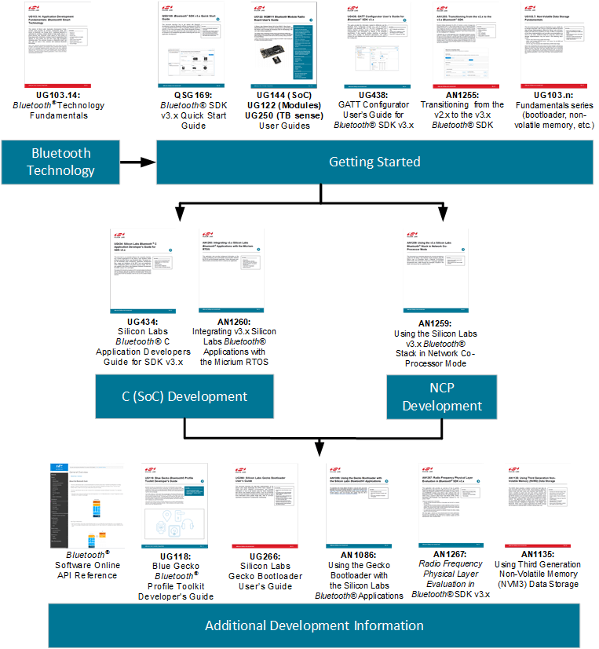

# UG434: Silicon Labs Bluetooth ® C Application Developer's Guide for SDK v3.x and Higher (Rev. 1.1) <!-- omit in toc -->

- [1. Introduction](#1-introduction)
  - [1.1 About this Version](#11-about-this-version)
  - [1.2 Prerequisites](#12-prerequisites)
- [2. Application Development Flow](#2-application-development-flow)
  - [2.1 Application Build Flow](#21-application-build-flow)
- [3. Project Structure](#3-project-structure)
  - [3.1 Bluetooth Files](#31-bluetooth-files)
    - [Library Files](#library-files)
    - [RAIL](#rail)
    - [EMLIB and EMDRV](#emlib-and-emdrv)
    - [mbed TLS](#mbed-tls)
    - [Sleep Timer](#sleep-timer)
    - [Power Manager](#power-manager)
    - [Header Files](#header-files)
    - [API Header Files](#api-header-files)
  - [3.2 GATT Database](#32-gatt-database)
  - [3.3 Device Firmware Upgrade](#33-device-firmware-upgrade)
  - [3.4 NCP Applications](#34-ncp-applications)
  - [3.5 RTOS Support](#35-rtos-support)
  - [3.6 Multiprotocol Support](#36-multiprotocol-support)
  - [3.7 Platform Components](#37-platform-components)
- [4. Configuring the Bluetooth Stack and a Wireless Gecko Device](#4-configuring-the-bluetooth-stack-and-a-wireless-gecko-device)
  - [4.1 Wireless Gecko MCU and Peripherals Configuration](#41-wireless-gecko-mcu-and-peripherals-configuration)
    - [4.1.1 Adaptive Frequency Hopping](#411-adaptive-frequency-hopping)
    - [4.1.2 Bluetooth Clocks](#412-bluetooth-clocks)
      - [HFCLK](#hfclk)
      - [LFCLK](#lfclk)
      - [HFRCODPLL](#hfrcodpll)
      - [CTUNE](#ctune)
      - [Default HFXO CTUNE Value](#default-hfxo-ctune-value)
    - [4.1.3 DC-DC Configuration](#413-dc-dc-configuration)
    - [4.1.4 LNA](#414-lna)
    - [4.1.5 Periodic Advertising](#415-periodic-advertising)
      - [Periodic Advertiser](#periodic-advertiser)
      - [Periodic Advertising Synchronization](#periodic-advertising-synchronization)
    - [4.1.6 PTI](#416-pti)
    - [4.1.7 Transmit Power](#417-transmit-power)
    - [4.1.8 Security Manager](#418-security-manager)
    - [4.1.9 Accept List Filtering](#419-accept-list-filtering)
    - [4.1.10 Wi-Fi coexistence](#4110-wi-fi-coexistence)
    - [4.1.11 OTA Configuration for EFR32\[M|B\]G1x devices](#4111-ota-configuration-for-efr32mbg1x-devices)
    - [4.1.12 OTA Configuration for EFR32\[M|B\]G2x devices](#4112-ota-configuration-for-efr32mbg2x-devices)
    - [4.1.13 Even Connection Distribution Algorithm](#4113-even-connection-distribution-algorithm)
  - [4.2 Bluetooth Configuration with sl\_bt\_init\_stack()](#42-bluetooth-configuration-with-sl_bt_init_stack)
    - [4.2.1 Bluetooth On-Demand Start](#421-bluetooth-on-demand-start)
    - [4.2.2 CONFIG\_FLAGS](#422-config_flags)
    - [4.2.3 Mbedtls](#423-mbedtls)
    - [4.2.4 Security Manager](#424-security-manager)
    - [4.2.5 Multiprotocol Priority Configuration](#425-multiprotocol-priority-configuration)
    - [4.2.6 Sleep](#426-sleep)
      - [Disabling Sleep at Runtime](#disabling-sleep-at-runtime)
    - [4.2.7 Bluetooth Stack Configuration](#427-bluetooth-stack-configuration)
      - [Buffer Memory](#buffer-memory)
      - [Number of Connections](#number-of-connections)
      - [Advertisers](#advertisers)
      - [Periodic Advertisement Synchronization](#periodic-advertisement-synchronization)
    - [4.2.8 PA](#428-pa)
    - [4.2.9 Software Timers](#429-software-timers)
    - [4.2.10 RF Path](#4210-rf-path)
      - [Gain](#gain)
      - [Output selection](#output-selection)
    - [4.2.11 NVM3 Error Codes](#4211-nvm3-error-codes)
  - [4.3 Radio Co-Processor Mode](#43-radio-co-processor-mode)
- [5. Bluetooth Stack Event Handling](#5-bluetooth-stack-event-handling)
  - [5.1 Non-Blocking Event Listener](#51-non-blocking-event-listener)
    - [5.1.1 Notification for Updating Event Listener](#511-notification-for-updating-event-listener)
  - [5.2 Event Listener with RTOS](#52-event-listener-with-rtos)
    - [5.2.1 Commands from Multiple Tasks](#521-commands-from-multiple-tasks)
- [6. Interrupts](#6-interrupts)
  - [6.1 External Event](#61-external-event)
  - [6.2 Priorities](#62-priorities)
- [7. Wireless Gecko Resources](#7-wireless-gecko-resources)
  - [7.1 Flash](#71-flash)
    - [7.1.1 Optimizing Flash Usage](#711-optimizing-flash-usage)
      - [Dead Code Elimination](#dead-code-elimination)
      - [Selective Initialization of Bluetooth Stack Components](#selective-initialization-of-bluetooth-stack-components)
    - [7.1.2 Bluetooth Bonding Database](#712-bluetooth-bonding-database)
  - [7.2 Linking](#72-linking)
  - [7.3 RAM](#73-ram)
    - [7.3.1 Bluetooth Stack](#731-bluetooth-stack)
    - [7.3.2 Bluetooth Object Pools](#732-bluetooth-object-pools)
    - [7.3.3 Bluetooth Buffer Memory](#733-bluetooth-buffer-memory)
    - [7.3.4 Bluetooth GATT Database](#734-bluetooth-gatt-database)
    - [7.3.5 Call Stack](#735-call-stack)
    - [7.3.6 Heap memory](#736-heap-memory)
- [8. Application ELF-file](#8-application-elf-file)
  - [IAR](#iar)
  - [GCC](#gcc)
- [9. Documentation](#9-documentation)

---

本文档是每个使用 Silicon Labs Bluetooth Stack 为 Silicon Labs Wireless Gecko 产品开发基于 C 的应用程序的开发者必不可少的参考。该指南涵盖了 Bluetooth Stack 的架构、应用开发流程、MCU 核心与外设的使用和限制、协议栈配置选项以及协议栈资源使用情况。此版本文档适用于 Silicon Labs Bluetooth SDK 3.0.x 及更高版本。

本文档旨在为 Wireless Geckos 开发 Bluetooth 应用程序时，捕获并填补 Bluetooth Stack API Reference、Gecko SDK API Reference 和 Wireless Gecko Reference Manuals 之间的空白。本文档公开了有助于开发人员充分利用可用硬件资源的详细信息。

# 1. Introduction

本文档是 Silicon Labs Bluetooth Stack 的 C 开发者指南。其涵盖了各个方面的开发，并且是对使用 C 开发运行 Bluetooth Stack 的 Wireless Gecko 产品的每个开发者的重要参考。

本文档涵盖了以下主题：

* [2. Application Development Flow](#2-application-development-flow) 讨论了应用程序的开发流程。
* [3. Project Structure](#3-project-structure) 综述了项目结构。
* [4. Configuring the Bluetooth Stack and a Wireless Gecko Device](#4-configuring-the-bluetooth-stack-and-a-wireless-gecko-device) 解释了项目在应用程序代码中的包含库和实际的 Wireless Gecko 配置。
* [5. Bluetooth Stack Event Handling](#5-bluetooth-stack-event-handling) 对于使用 Silicon Labs Bluetooth Stack 进行开发的每个人来说都是重要的一环，因为它解释了应用程序如何在基于事件的架构中与协议栈同步运行。
* [6. Interrupts](#6-interrupts) 和 [7. Wireless Gecko Resources](#7-wireless-gecko-resources) 涉及外设和芯片组资源的主题，内容包括为协议栈使用情况保留的内容，应如何处理中断以及协议栈的内存占用量和应用程序的可用内存。

## 1.1 About this Version

Silicon Labs Bluetooth SDK 的当前版本为 4.0.x。

当前支持的编译器和 IDE 版本是：

* **IDE**：Simplicity Studio 5.2 或更高版本
* **Compiler**：GCC 10.3-2021.10, and IAR 9.20.4

## 1.2 Prerequisites

本文档假定读者已正确安装当前版本的 Silicon Labs Bluetooth SDK 到开发机（Windows、MAC OSX 或 Linux），并且读者熟悉快速入门指南和 SDK 的示例。而且，读者应该对 Bluetooth 技术有基本的了解。有关更多信息，请参见 *UG103.14: Bluetooth Technology Fundamentals*。

有关在 Silicon Labs Simplicity Studio 开发环境中开始使用示例应用程序的说明，请参阅 *QSG169: Bluetooth® SDK v3.x Quick Start Guide*。

# 2. Application Development Flow

下图描述了高级别的固件结构。开发者在协议栈（Silicon Labs 将其作为一个预编译的对象文件来提供）之上创建一个应用程序，从而为最终设备提供 Bluetooth 连通性。


Bluetooth Stack 包含以下块：

* **Bootloader** — Gecko Bootloader 不是协议栈的一部分，但其随 Bluetooth SDK 一起提供。有关更多信息，请参阅 *UG266: Gecko Bootloader User Guide* 和 *AN1086: Using the Gecko Bootloader with Silicon Labs Bluetooth Applications*。有关一般的引导加载的信息，请参阅 *UG103.06: Bootloading Fundamentals*。
* **Bluetooth Stack** — Bluetooth 相关的功能，包括 Link Layer、Generic Access Profile、Security Manager、Attribute Protocol 和 Generic Attribute Profile。
* **Bluetooth AppLoader** — 一个在 Bootloader 之后启动的应用程序。它检查用户的应用程序是否有效，如果有效，则 AppLoader 启动该应用程序。如果应用程序映像无效，则 AppLoader 将启动 OTA 流程以尝试接收有效的应用程序映像。这需要使用 Gecko Bootloader。从 Bluetooth SDK version 4.0.x 开始，EFR32\[M|B\]G2x 设备上的 AppLoader 与 Gecko Bootloader 合并以为一个通信插件。

## 2.1 Application Build Flow


如 *QSG169: Bluetooth® SDK v3.x Quick Start Guide* 中所述，构建一个项目首先要定义 Bluetooth Services 和 Characteristics，并从 Silicon Labs 提供的示例或一个空的项目模板中编写应用程序源码。

SDK v2.1.0 及更高版本提供了两种定义 Bluetooth Services 和 Characteristics 的方式。第一个选项是 Simplicity Studio 中的 Visual GATT Editor GUI。这是用于设计 GATT 并生成 `gatt_db.c` 和 `gatt_db.h` 的图形工具。此外，它可以导入 `.xml` 和 `.bgproj` GATT 定义文件。Visual GATT Editor 是 Simplicity Studio 项目中用于 GATT 定义和生成的默认工具。

第二个选择是根据 *UG118: Blue Gecko Bluetooth® Profile Toolkit Developer's Guide* 创建 `.xml` 或 `.bgproj`，然后将 BGBuild 可执行文件用作预编译步骤，以将 GATT 定义文件转换为 .c 和 .h。此方法在 IAR Embedded Workbench 项目中使用。

编译项目会生成一个对象文件，然后将其与 SDK 中提供的预编译库链接。链接的输出是一个闪存映像，可以编程到所支持的 Wireless Gecko 设备。

# 3. Project Structure

本节说明应用程序项目结构以及项目中必须包含的必需和可选资源。

## 3.1 Bluetooth Files

### Library Files

Bluetooth Stack 库有：

* **binapploader.o**：针对 EFR32\[M|B\]G1x 设备的 Bluetooth AppLoader 的二进制映像，提供可选的 OTA（Over-the-Air）功能。
* **binapploader_nvm3.o**：支持 NVM3 的 EFR32\[M|B\]G1x 设备的 Bluetooth AppLoader 二进制映像。
* **libbluetooth.a**：Bluetooth Stack 库。
* **libpsstore.a**：Bluetooth Stack 的 PS Store 功能。在 EFR32\[M|B\]G2x 设备上不可用。必须使用 NVM3 来替代。

### RAIL

Bluetooth Stack 使用 RAIL 来访问无线电，需要将 RAIL 库与 Bluetooth Stack 链接在一起。RAIL 为每个设备系列以及单协议和多协议环境提供了单独的库。Gecko SDK Suite 中提供了 RAIL 库。有关更多信息，请参考 *UG103.13: RAIL Fundamentals* 及其他 RAIL 文档。

**注意**：为了确保无线电模块符合法规要求，需要将无线电模块的 Bluetooth Stack 与 RAIL 库及无线电模块的配置库链接在一起。这些是 `librail_module_<soc family><compiler>_release.a` 和 `librail_config<modulename>.a`。

### EMLIB and EMDRV

Bluetooth Stack 使用 EMLIB 和 EMDRV 库来访问 EFR32 硬件。EMLIB 和 EMDRV 外设库以源码形式提供，它们必须包含到项目中。EMLIB 和 EMDRV 是 Gecko SDK Suite 的一部分。有关 EMLIB 和 EMDRV 的更多信息，请参阅 [https://docs.silabs.com/](https://docs.silabs.com/) 上的 Platform EMDRV Documentation 和 EMLIB Documentation。

### mbed TLS

Bluetooth Stack 使用 Mbedtls 库进行加密操作。Mbedtls 库以源码形式提供，并且必须包含到项目中。Mbedtls 是 Gecko SDK Suite 的一部分。有关更多信息，请参阅 [Mbedtls Documentation](https://docs.silabs.com/mbed-tls/latest/)。

### Sleep Timer

Sleep Timer 是一个平台组件，用于提供软件定时器、计时和日期功能。Bluetooth Stack 将其用于深度睡眠，其必须包含到项目中。参阅 [Platform sleeptimer Documentation](https://docs.silabs.com/mcu/latest/efr32mg13/group-SLEEPTIMER)。

请注意，Sleep Timer 回调是从中断上下文中调用的。不能从回调中调用 BGAPI 函数。相反，应用程序应该在应用程序主循环中实现定时器任务处理。一个 Simple Timer 组件实现了辅助功能，该功能还允许从其回调中调用 BGAPI 命令。

### Power Manager

Power Manager 是一个平台组件，用于管理系统的电源模式。其主要目的是在处理器无执行时将系统转到低能耗模式。请在 [https://docs.silabs.com/](https://docs.silabs.com/) 上的 Modules > Platform Services > Power Manager 下查看您的 MCU 的参考。

### Header Files

**sl_bt_version.h**

该文件包含 Bluetooth Stack 的版本。

### API Header Files

这些文件定义了 Bluetooth Stack API。

这些文件用于两个目的：首先，它们包含了实际的 Bluetooth Stack API 以及协议栈的命令和事件；其次，它们为 Bluetooth Stack 提供了配置和事件管理 API。

下面介绍配置、事件和睡眠管理 API。

```c
sl_status_t sl_bt_init_stack(const sl_bt_configuration_t *config)
```

该函数接受单个参数 —— 一个指向 `sl_bt_configuration_t` 结构的指针。其目的是使用结构中提供的参数配置和初始化 Bluetooth Stack。调用函数 `sl_bt_init_stack()` 后，必须分别初始化每个必需的协议栈组件。这种分别初始化允许通过不包含那些不需要的协议栈组件来优化内存。SSv5（Simplicity Studio 5）中的 Project Configurator 将负责协议栈的初始化。在 Non-SSv5 的应用程序中，应用程序必须调用 `sl_bt_init_stack()`，然后初始化 BGAPI 类。

```c
sl_status_t sl_bt_pop_event(sl_bt_msg_t* evt)
```

这是一个从 Bluetooth Stack 请求 Bluetooth 事件的非阻塞函数。当一个事件被请求并且事件队列不为空时，一个事件对象会被复制到应用程序提供的内存中。如果事件队列中没有事件，则返回 `SL_STATUS_NOT_FOUND`。

协议栈的事件处理将在 [5. Bluetooth Stack Event Handling](#5-bluetooth-stack-event-handling) 中详细讨论。

```c
int sl_bt_event_pending(void)
```

此函数检查事件队列中是否有任何待处理的 Bluetooth Stack 事件。如果找到了一个待处理的 Bluetooth 事件，则该函数返回一个非零值，指示该事件应由 `sl_bt_pop_event()` 处理。如果未找到事件，则返回零。

**sl_bt_types.h**

**sl_bt_stack_init.h**

**sl_bt_api.h**

**sl_bgapi.h**

这些文件包含了 Bluetooth Stack API 和该协议栈的命令和事件，以及 Bluetooth Stack 的配置 API。

**sl_bt_ncp_host_api.c**、**sl_bt_ncp_host.c**、**sl_bt_ncp_host.h** 和 **sl_bt_internal.h**

这些文件在为外部 Host 开发应用程序时使用。它们提供了 Host 应用和 BGTAPI 串行协议之间的 API 定义和适配层。

## 3.2 GATT Database

GATT（Generic Attribute Profile）Database 是一个描述 Bluetooth 设备的 Bluetooth Profiles、Services 和 Characteristics 的标准化方法。Silicon Labs Bluetooth SDK 提供了两种定义 GATT Database 的方法：

* Static GATT Database 可以在编译时使用 Bluetooth SDK 提供的适当的工具进行定义，或者可以用 XML 编写并作为预构建任务传递给 BGBuild 可执行文件。在这种情况下，数据库结构存储在 ROM 中，这意味着更快的启动时间和更低的内存使用量。
* Dynamic GATT Database 可以使用 bluetooth_feature_dynamic_gattdb 组件在运行时通过适当的 BGAPI 命令进行定义。在这种情况下，数据库结构存储在 RAM 中，这意味着更好的灵活性。推荐在 NCP 用例中使用这种方法，以避免重新构建在 Wireless Gecko 上运行的目标代码。

您也可以组合使用这两种方法。有关如何创建 GATT Database 和语法的更多信息，请参阅 *UG118: Blue Gecko Bluetooth® Smart Profile Toolkit Developer's Guide*。

**gatt_db.c** 和 **gatt_db.h**

gatt_db.c 定义了 GATT Database 的结构和内容，并由 BGBuild 或 Visual GATT Editor 自动生成。gatt_db.h 包含此数据库以及本地 Characteristics 和 Services 的 Handle。GATT 的类型定义从 bg_gatt_db_def.h 到 gatt_db.h 自动包含在内。

## 3.3 Device Firmware Upgrade

DFU（Device Firmware Upgrade，设备固件升级）是通过一个串行链路或 OTA 升级应用程序的过程。在这两种情况下，应用程序都需要添加以下文件来启用对 DFU 的支持。

**application_properties.c**

该文件包含了应用程序特性结构，该结构包含了应用程序映像的相关信息，如类型、版本和安全性。该结构在 Gecko Bootloader API 的 `application_properties.h` 中定义。Simplicity Studio 项目中包含了一个预生成的文件，可以对其进行修改以包含特定于应用程序的特性。可以使用 Gecko Bootloader API 访问应用程序特性。可以通过更改定义来更新以下成员：

```c
// Version number for this application (uint32_t)
#define APP_PROPERTIES_VERSION

// Unique ID (e.g. UUID or GUID) for the product this application is built for (uint8_t[16])
#define APP_PROPERTIES_ID
```

将 Bluetooth AppLoader 与 OTA 过程一起使用时，需要将指向应用程序特性结构的指针设置为应用程序向量表 Vector 13。当使用默认启动文件且结构名称为 `sl_app_properties` 时，将自动启用该指针。

## 3.4 NCP Applications

在为外部 Host 开发应用程序时，需要定义 `SL_BT_API_FULL` 以防止链接器从应用程序中删除 BGAPI 命令实现。该定义包括了应用程序中所有启用的 BGAPI 类的完整实现。

## 3.5 RTOS Support

Bluetooth Stack 也可以在 Micrium RTOS 和 FreeRTOS 上运行。在这种情况下，以下文件将被添加到项目中：

* **sl_bt_rtos_adaptation.c**
* **sl_bt_rtos_adaptation.h**
* **sl_bt_rtos_config.h**
* **sl_bt_rtos_adaptation.c** 和 **sl_bt_rtos_adaptation.h**

`sl_bt_rtos_adaptation.c` 和 `sl_bt_rtos_adaptation.h` 使用 CMSIS-RTOS2 提供了用于与 Bluetooth Stack 和其他 RTOS 任务的进行 IPC（Inter-Process Communication，进程间通信）的 RTOS 任务。

`sl_bt_rtos_config.h` 用于设置 Bluetooth RTOS 任务的优先级。

需要在 `sl_bt_configuration_t` 结构中为 Bluetooth Stack 配置对 RTOS 的支持。`config_flags` 字段需要设置 `SL_BT_CONFIG_FLAG_RTOS`。这会导致 Bluetooth Stack 依赖于 RTOS 进行睡眠，而不是直接睡眠。`scheduler_callback` 和 `stack_schedule_callback` 必须配置为调用适当的函数。这些回调用于唤醒相应的任务。

与 RTOS 一起使用的 Bluetooth Stack 配置如下：

```c
.config_flags = SL_BT_CONFIG_FLAG_RTOS,
.scheduler_callback = sli_bt_rtos_ll_callback,
.stack_schedule_callback = sli_bt_rtos_stack_callback,
```

可以调用 `sl_bt_rtos_init()` 来初始化协议栈并创建所需的 RTOS 任务。

```c
void sl_bt_rtos_init();
```

它调用函数 `sl_bt_init()` 初始化 Bluetooth Stack。

## 3.6 Multiprotocol Support

在多协议环境中使用 Bluetooth Stack 时，必须使用以下函数启用 Bluetooth Stack 中的多协议特性：

```c
sl_bt__init_multiprotocol();
```

在多协议环境中使用 Bluetooth 还需要使用具有多协议支持的 RAIL 库。

## 3.7 Platform Components

Bluetooth Stack v3.x 依赖于许多平台组件，这些组件是 Gecko SDK Suite 的底层 Gecko Platform 基础设施的一部分。`autogen` 文件夹包含用于初始化硬件和处理事件的源码。`config` 文件夹包含硬件和协议栈配置选项。

# 4. Configuring the Bluetooth Stack and a Wireless Gecko Device

要在 Wireless Gecko 上运行 Bluetooth Stack 和应用程序，必须正确配置 MCU 及其外设。

## 4.1 Wireless Gecko MCU and Peripherals Configuration

**sl_system_init()**

`sl_system_init()` 函数用于初始化系统。它将调用平台、驱动、服务、协议栈和内部应用初始化函数，这些函数位于 `autogen` 文件夹中。

**App_init()**

`App_init()` 函数用于初始化应用程序特定的特性。

### 4.1.1 Adaptive Frequency Hopping

Bluetooth Stack 实现了 AFH（Adaptive Frequency Hopping，自适应跳频），符合 ETSI EN 300 328 标准。使用 +10 dBm 以上的发射功率时需要 AFH。AFH 还可以通过避免信道拥塞来提高性能。

要在 Bluetooth Stack 中启用 AFH，必须调用以下初始化函数：

```c
void sl_bt_init_afh();
```

包含 `bluetooth_feature_afh` 组件时，它会自动包含在内。在 Central-Peripheral 连接中，两端可以独立使用 AFH。Central 设备可能是非自适应的，但 Peripheral 设备仍然可能自适应。该标准允许在拥塞信道上使用控制传输。出于合规性原因，如果 Peripheral 设备检测到其正在使用拥塞信道，它只会在该信道上发送单个数据包以防止连接超时。

**注意**：旧版（Legacy）广告不使用 AFH。旧版广告使用 3 个信道，而 AFH 至少需要 15 个信道才能满足 ETSI 标准的要求。必须使用扩展（Extended）广告来启用 AFH 广告。

### 4.1.2 Bluetooth Clocks

时钟设置在 `sl_event_handler.c` 的 `sl_platform_init()` 函数中初始化。时钟设置包括使用诸如 Tuning 之类的参数初始化振荡器（HFXO、LFXO 和 LFRCO）、初始化时钟（HFCLK、LFCLK、LFA、LFB、LFE）以及将时钟分配给振荡器。注意：此函数未启用外设时钟（如 GPIO 时钟、TIMER 时钟）。初始化外设时必须启用它们。

#### HFCLK

HFCLK 用于无线电协议定时器（PROTIMER）。HFCLK 是一个高频时钟，精度必须至少为 ±50 ppm。该时钟需要一个外部晶振才能足够准确（HFXO）。

HFXO 初始化将外部晶振配置以用于时序关键型连接和睡眠管理。必须将一个 HFXO 设置为高频时钟（HFCLK），并物理连接到 Wireless Gecko 的 HFXO 输入引脚。

#### LFCLK

低频时钟 LFCLK 有两个用途。在 Bluetooth Stack 中，它用于 Bluetooth 协议计时。它还需要跟踪睡眠模式下的时间。

当设备进入睡眠模式时，将保存 PROTIMER 的当前状态。设备唤醒后，它将计算经过多少个睡眠时钟滴答，并相应地调整 PROTIMER。这使得在无线电中，PROTIMER 似乎一直在滴答。

此时钟的准确性取决于设备的工作模式。在广告或扫描时，精度不是那么重要，但是当连接打开时，精度必须至少为 ±500 ppm。此时钟可以由 LFXO、PLFRCO（(EFR32\[B|M\]G13 或 \[M|B\]GM13）或 LFRCO（EFR32\[M|B\]G2x 或 \[M|B\]GM2x）驱动，取决于精度要求。如果应用程序仅需要广告或扫描，则可以将 LFRCO 用作时钟源。但是，如果需要 Bluetooth 连接，则时钟源必须是 LFXO、PLFRCO（EFR32\[M|B\]G13 或 \[M|B\]GM13）或具有高精度模式（High Precision Mode）的 LFRCO（EFR32\[M|B\]G22 或 \[M|B\]GM22）。使用 PLFRCO 或 LFRCO 时，时钟的精度必须配置为 ±500 ppm。

在默认配置中，LFXO 连接到 Wireless Gecko，并设置为 LFCLK 的时钟源。如果设计仅具有高精度模式的 PLFRCO 或 LFRCO，则连接 PLFRCO 或 LFRCO 并将其设置为时钟源。

如果设计中未连接具有高精度模式的 LFXO、PLFRCO 或 LFRCO，则如果 LF 时钟精度不满足 500 ppm 要求，就会自动禁用睡眠。

#### HFRCODPLL

HFRCODPLL 是一个高频时钟，在 EFR32\[M|B\]G2x 设备中其作为系统时钟与 Bluetooth Stack 一起使用。在 EFR32\[M|B\]G21x 上，HFRCODPLL 需要配置为 80 MHz 并设置为系统时钟源。

```c
CMU_HFRCODPLLBandSet(cmuHFRCODPLLFreq_80M0Hz);
CMU_ClockSelectSet(cmuClock_SYSCLK, cmuSelect_HFRCODPLL);
```

#### CTUNE

示例项目均默认设置了 HFXO 和 LFXO 的 CTUNE（Crystal Tune），以与所有 Silicon Labs Bluetooth 模块、参考设计和无线板一起使用。但是，在某些情况下，最终产品设计需要针对每个设备或每个设计进行特定的晶振校准。可以根据 `sl_device_init_hfxo()` 函数中的设计调整 CTUNE 值。

有关配置 HFXO 和 LFXO 的更多信息，请参阅 EFR32 Reference Manual。

#### Default HFXO CTUNE Value

系统使用以下逻辑顺序检查多个源的默认 HFXO CTUNE 值：

1. CTUNE PSKEY 已设置。该 Key 的 ID 为 `50`（即十六进制的 `32`），并包含 2 byte 的数据，用于 16 bit CTUNE 值。这可以使用 BGAPI 命令 `sl_bt_nvm_save` 进行编程。
2. DEVINFO 中存在校准值。某些模块在 DEVINFO Page 中包含了一个出厂编程的值。
3. Manufacturing Token 存在于 User Data Page 中。这由开发者编程，或者如果开发板的 EEPROM 包含该值，则可以由 Simplicity Studio 自动设置。该 Token 由 2 byte 组成，位于 User Data Page 的起始地址偏置 0x0100 处。有关特定的 EFR 变体，请参阅 EFR32 Reference Manual，以获取完整的闪存映射。
4. 如果在生成项目时选择了一个无线板，则使用该板的头文件中的默认值。
5. 如果未找到其他任何内容，则使用 CMU 头文件中的默认值。

**注意**：Bluetooth Stack 仅支持 38.4 MHz 的 HFXO 频率。不支持其他 HFXO 频率。

### 4.1.3 DC-DC Configuration

在具有 DC-DC 的设备上，可以在 `sl_event_handler.c` 中的 `sl_device_init_dcdc()` 函数中进行配置。SDK 中的示例将 DC-DC 配置设置为可与 Silicon Labs Bluetooth 模块、无线板和参考设计一起使用，但是自定义设计可能需要特定的 DC-DC 设置。这些自定义设置可以在 `sl_device_init_dcdc_xx.c` 中进行设置。

```c
/** DCDC regulator initialization structure. */
typedef struct {
    EMU_DcdcMode_TypeDef            mode;               /**< DCDC mode. */
    EMU_VreginCmpThreshold_TypeDef  cmpThreshold;       /**< VREGIN comparator threshold. */
    EMU_DcdcTonMaxTimeout_TypeDef   tonMax;             /**< Ton max timeout control. */
    bool                            dcmOnlyEn;          /**< DCM only mode enable. */
    EMU_DcdcDriveSpeed_TypeDef      driveSpeedEM01;     /**< DCDC drive speed in EM0/1. */
    EMU_DcdcDriveSpeed_TypeDef      driveSpeedEM23;     /**< DCDC drive speed in EM2/3. */
    EMU_DcdcPeakCurrent_TypeDef     peakCurrentEM01;    /**< EM0/1 peak current setting. */
    EMU_DcdcPeakCurrent_TypeDef     peakCurrentEM23;    /**< EM2/3 peak current setting. */
} EMU_DCDCInit_TypeDef;
```

有关配置 DC-DC 的更多信息，请参阅 EFR32 Reference Manual 的 Chapter 11 和 *AN0948: Power Configurations and DC-DC*。

### 4.1.4 LNA

LNA（Low-Noise Amplifier，低噪声放大器）是一种电子放大器，可放大非常低功率的信号而不会显着降低其信噪比。LNA 改善了 RF 灵敏度。

某些 MGM12P 模块中的板载 LNA 作为 FEM（Front-End Module，前端模块）的一部分。要在这些模块中使用 LNA，需要正确配置和启用 FEM。FEM 在 `sl_fem_util_config.h` 中进行配置。

如果开发板支持 FEM，则在 `sl_service_init()` 函数中的 `sl_fem_util_init()` 中初始化 FEM。

### 4.1.5 Periodic Advertising

定期广告使多个监听器（Listener）可以与单个广告设备同步。因此，它是组播的一种形式。

每个监听器在开始接收数据之前都需要与广告设备同步。定期广告利用正在监听的设备上的扫描器（Scanner）建立与广告设备的同步。同步后，可以停止扫描器。这比使用扫描器全时间收听广播广告要省电得多。

定期广告由两个部分组成：周期广告器（Advertiser）角色和监听端上的周期广告同步。这两个部分彼此独立，需要分别进行初始化。

#### Periodic Advertiser

Bluetooth 配置中的 `max_advertisers` 也配置了周期广告器的最大数量。

要在 Bluetooth Stack 中启用周期广告器，必须在 `sl_bt_init_stack()` 函数之后调用以下初始化函数，该函数在包含 `bluetooth_feature_periodic_adv` 组件时自动添加：

```c
void sl_bt_init_periodic_advertising();
```

#### Periodic Advertising Synchronization

Bluetooth 配置中的 `max_periodic_sync` 用于配置 Bluetooth Stack 需要支持的最大同步数量。

要在 Bluetooth Stack 中启用定期广告同步，必须在 `sl_bt_init_stack()` 函数之后通过包含 `bluetooth_feature_sync` 组件来调用以下初始化函数：

```c
void sl_bt_class_sync_init();
```

此命令还将初始化 BGAPI 同步类，使其可用。

### 4.1.6 PTI

PTI（Packet Trace Interface，数据包跟踪接口）是 Wireless Gecko SoC 中的内置模块，用于将传入和传出的无线数据包作为原始数据路由到调试接口。然后可以捕获这些数据包并将其显示在 Simplicity Studio’s Network Analyzer 中。Network Analyzer 具有 Bluetooth 数据包的解码器，可用于调试、分析和测量 Bluetooth 网络。

`sl_stack_init()` 函数内的 `sl_rail_util_pti_init()` 用于初始化 PTI。可以使用 `SL_RAIL_UTIL_PTI_BAUD_RATE_HZ` 定义来设置波特率，并且可以使用 `sl_rail_util_pti_config.h` 中带有 `SL_RAIL_UTIL_PTI_DOUT_` 和 `SL_RAIL_UTIL_PTI_DFRAME_` 前缀的定义来配置引脚。

### 4.1.7 Transmit Power

Bluetooth 的发射功率取决于无线电允许的最大功率、软件配置、RF 路径增益补偿以及 AFH 的使用。

ETSI EN 300 328 标准要求在发射功率为 +10 dBm 以上时使用 AFH。

如果 AFH 被限制，则最大允许功率限制为小于 +10 dBm。ETSI 标准要求至少有 15 个信道用于 AFH。在以下情况下阻止使用 +10 dBm 及以上功率：旧版广告、扫描响应以及在没有足够可用信道时的连接。

### 4.1.8 Security Manager

正确地配置 Security Manager 以确保可以实现安全要求是非常重要的。使用 `sl_bt_sm_configure()` 设置安全标志和设备的 IO 能力。IO 能力定义了哪些配对方法是可能的，并且应该设置为与设备的能力相匹配。安全标志可用于强制执行某些安全设置，如要求配对始终使用可绑定模式、配对仅使用安全连接或是否需要身份验证。Security Manager 还有一个标志，用于指示是否首选经过身份验证或未经身份验证的配对（如果两者都可能的话）。如果未设置此标志，那么如果两个设备都没有请求身份验证，则即使两个设备的 IO 能力都允许经过身份验证的绑定也不会使用它。请参阅 [API Reference - Security Manager](https://docs.silabs.com/bluetooth/5.0/a00095) 中的可用选项。

可以存储在 Bonding Database 中的绑定数量是通过 `sl_bt_sm_store_bonding_configuration()` 设置的。此命令还用于定义如果 Bonding Database 变满会发生什么。除非两个设备都处于可绑定模式，否则配对不会存储在 Bonding Database 中。使用 `sl_bt_sm_set_bondable_mode()` 启用可绑定模式。

### 4.1.9 Accept List Filtering

接受列表过滤用于过滤设备。当前仅在发现设备时才支持。连接请求、广告期间来自远程设备的扫描请求以及连接启动不受接受列表的限制。

接受列表大小与已绑定设备最大数量的配置相当。如果在使用接受列表时更改了已绑定设备的最大数量，则需要在新设置生效之前重置设备。

已绑定设备会自动添加到接受列表中。或者，可以使用 BGAPI 命令 `sl_bt_sm_add_to_whitelist()` 手动添加它们。

不支持随机地址解析。使用可解析随机地址的设备在扫描过程中将不可见。由于大多数 Android 和 iOS 手机使用可解析随机地址，因此接受列表过滤特性将在设备发现期间有效地阻止这些设备。

要在 Bluetooth Stack 中启用接受列表过滤，必须在 `sl_bt_init_stack()` 函数之后调用以下初始化函数：

```c
void sl_bt_init_whitelisting();
```

包含 `bluetooth_feature_whitelisting` 组件时，它将自动包含在内。启用该功能后，可以在运行时通过 BGAPI 命令 `sl_bt_gap_enable_whitelisting()` 启用和禁用该功能。

可以使用 `sl_bt_sm_configure()` 将连接限制为仅已绑定或接受列表的设备。这不需要启用接受列表过滤。

### 4.1.10 Wi-Fi coexistence

COEX（Wi-Fi Coexistence）是一个可以被 Bluetooth 和 Wi-Fi 仲裁的，可以使用无线电传输的协议。启用后，它可以改善 Wi-Fi 和 Bluetooth 的性能。COEX 在 `sl_bluetooth_coex_config.h` 中配置。

要启用 COEX，请在 `sl_bt_init_stack()` 之后调用以下函数。

```c
sl_bit_init_coex_hal();
```

包含 `bluetooth_feature_coex` 组件时，它将自动包含在内。COEX 实现了 Wi-Fi IC 的 GPIO 接口。它依赖 EMLIB `em_gpio.c` 和 EMDRV `gpiointerrupt.c`，并且要求这两个文件都包含在项目中。

### 4.1.11 OTA Configuration for EFR32\[M|B\]G1x devices

由于部分固件升级由 Bluetooth AppLoader 应用程序处理，因此支持 Bluetooth OTA 固件升级。在 EFR32\[M|B\]G1x 设备上，使用 `bluetooth_feature_ota_config` 组件启用 OTA 配置。在 EFR32\[M|B\]G2x 设备上，AppLoader 和 Gecko Bootloader 合并在一起。

可以使用 `sl_bt_ota_set_configuration()` 函数来配置 OTA 模式，如可以将 OTA 设置为使用静态随机地址而不是公共地址。有关其他选项，请参考 BGAPI 文档。

当 Wireless Gecko 处于 AppLoader 的 OTA 模式时，可以使用 `sl_bt_ota_set_device_name()` 函数配置其设备名称和设备名称长度。可以通过 `sl_bt_ota_set_advertising_data()` 将 OTA 模式下使用的广告数据设置为使用自定义数据而不使用默认数据。

如果设备未使用默认的 RF 路径，则可以使用 `sl_bt_ota_set_rf_path()` 在 OTA 模式下进行配置。

最后，将设备设置为 OTA DFU 模式应该是安全的，以便只有受信任的设备才具有该功能。

有关 OTA 固件更新的更多信息，请参阅 *UG266: Silicon Labs Gecko Booloader User's Guide* 和 *AN1086: Using the Gecko Bootloader with Silicon Labs Bluetooth Applications*。

### 4.1.12 OTA Configuration for EFR32\[M|B\]G2x devices

在 EFR32\[M|B\]G2x 设备上，AppLoader 的配置是通过修改 Bootloader 项目中提供的 AppLoader 源文件 `btl_apploader_common.c` 直接完成的。

请注意，将设备设置为 OTA DFU 模式应该是安全的，以便只有受信任的设备才具有该功能。

有关 OTA 固件更新的更多详细信息，请参阅 *UG266: Silicon Labs Gecko Booloader User's Guide* 和 *AN1086: Using the Gecko Bootloader with Silicon Labs Bluetooth Applications*。

### 4.1.13 Even Connection Distribution Algorithm

均衡连接分配算法设计用于涉及多个并发连接的应用。该算法尝试以这样的方式分配连接，即它们在时间上尽可能均匀地分布而不会重叠，并且所有连接应获得空中接口资源的相等份额。

为了获得最佳性能，算法用户应：

* 如果所有连接的间隔都不相同，则以最长的连接间隔启动第一个连接。
* 设置其他连接的连接间隔，使它们成为或允许（通过最小 ~ 最大范围）第一个间隔的整数分数。
* 使第一个间隔足够长，以使所有连接都可以在合理的传输时间内适应该间隔。

如果不遵循上述建议，可以期望算法和连接正常工作，但是性能可能不是最佳的。

默认情况下，链路层使用传统的随机连接分布算法。可以通过在软件初始化阶段添加组件 `bluetooth_feature_ll_even_scheduling` 或调用链接层函数 `ll_connSchAlgorithmEvenEnable()` 来启用均衡连接分配算法。由于均衡连接调度机制旨在与多个（最多 32 个）并发连接一起使用，因此建议按以下方式增加缓冲区和堆的大小。

```c
SL_BT_CONFIG_BUFFER_SIZE 20160
SL_HEAP_SIZE 22520
```

## 4.2 Bluetooth Configuration with sl_bt_init_stack()

`sl_bt_init_stack()` 函数用于配置 Bluetooth Stack，包括分配给连接的内存缓冲区大小。在配置 Bluetooth Stack 之前，不能使用任何 Bluetooth Stack 的功能。

Bluetooth Stack 配置示例：

```c
#define SL_BT_CONFIG_DEFAULT                                                       \
    {                                                                              \
        .config_flags = SL_BT_CONFIG_FLAGS,                                        \
        .bluetooth.max_connections = SL_BT_CONFIG_MAX_CONNECTIONS,                 \
        .bluetooth.max_advertisers = SL_BT_CONFIG_MAX_ADVERTISERS,                 \
        .bluetooth.max_periodic_sync = SL_BT_CONFIG_MAX_PERIODIC_ADVERTISING_SYNC, \
        .bluetooth.max_buffer_memory = SL_BT_CONFIG_BUFFER_SIZE,                   \
        .scheduler_callback = SL_BT_CONFIG_LL_CALLBACK,                            \
        .stack_schedule_callback = SL_BT_CONFIG_STACK_CALLBACK,                    \
        .gattdb = &bg_gattdb_data,                                                 \
        .max_timers = SL_BT_CONFIG_MAX_SOFTWARE_TIMERS,                            \
        .rf.tx_gain = SL_BT_CONFIG_RF_PATH_GAIN_TX,                                \
        .rf.rx_gain = SL_BT_CONFIG_RF_PATH_GAIN_RX,                                \
    }
```

`sl_bt_init_stack()` 函数中的配置选项包括：Bluetooth 连接计数、广告器计数、定期广告同步计数、内存缓冲区大小、定时器数量、GATT Database 和 PA 配置。

调用函数 `sl_bt_init_stack()` 后，必须分别初始化每个使用的协议栈组件。这种分别初始化允许通过不包含不必要的协议栈组件来优化内存。

以下 API 可用于单独初始化协议栈组件。通过包含相应的组件可以自动添加对初始化函数的调用。`SL_BT_BGAPI_CLASS` 宏用于创建一个结构 `sli_bgapi_class` 表以使用 `sl_bt_init_classes()` 初始化包含的 BGAPI 类。

|                     |                                                                                                                                                                                                                 |
| :------------------ | :-------------------------------------------------------------------------------------------------------------------------------------------------------------------------------------------------------------- |
| advertiser          | The commands and events in this class are related to common advertising functionalities in GAP peripheral and broadcaster roles. This is the base class for legacy, extended, and periodic advertising classes. |
| coex                | Enables the Bluetooth API to support the Coexistence interface.                                                                                                                                                 |
| connection          | The commands and events in this class are related to managing connection establishment, parameter setting, and disconnection procedures.                                                                        |
| cte_receiver        | Commands and events in this class manage Constant Tone Extension (CTE) receiving.                                                                                                                               |
| cte_transmitter     | Commands and events in this class manage Constant Tone Extension (CTE) transmission.                                                                                                                            |
| dfu                 | These commands and events are related to controlling firmware updates over the configured host interface and are available only when the device is booted in DFU mode. Usually not needed in application.       |
| extended advertiser | The commands and events in this class are related to extended advertising functionalities in GAP peripheral and broadcaster roles.                                                                              |
| gap                 | The commands and events in this class are related to the Generic Access Profile (GAP) in Bluetooth.                                                                                                             |
| gatt                | The commands and events in this class are used to browse and manage attributes in a remote GATT server.                                                                                                         |
| gattdb              | These commands and events are used for managing the local GATT database when using the dynamic GATT database.                                                                                                   |
| gatt_server         | These commands and events are used by the local GATT server to manage the local GATT database.                                                                                                                  |
| legacy advertiser   | The commands and events in this class are related to legacy advertising functionalities.                                                                                                                        |
| nvm                 | Manage user data in NVM keys in the flash memory of the Bluetooth device.                                                                                                                                       |
| ota                 | Commands for configuring OTA DFU.                                                                                                                                                                               |
| pa advertiser       | The commands and events in this class are related to periodic advertising functionalities.                                                                                                                      |
| scanner             | The commands and events in this class are related to scanning functionalities in GAP central and observer roles.                                                                                                |
| sm                  | The commands in this class manage Bluetooth security, including commands for starting and stopping encryption and commands for management of all bonding operations.                                            |
| sync                | Provides the periodic advertising synchronization feature.                                                                                                                                                      |
| system              | Commands and events in this class can be used to access and query the local device.                                                                                                                             |
| test                | Enables the DTM test APIs.                                                                                                                                                                                      |

### 4.2.1 Bluetooth On-Demand Start

借助 Bluetooth 按需启动特性，应用程序可以在需要时启动和停止 Bluetooth Stack 的运行。该特性通过包含 `bluetooth_on_demand_start` 组件来启用。启用此特性后，Bluetooth Stack 在调用 `sl_bt_system_start_bluetooth()` 之前不会运行。此特性的主要目的是针对 DMP 用例，在该用例中不需要全时间的 Bluetooth，并且需要释放资源以供其他应用程序使用。可以使用 `sl_bt_system_stop_bluetooth()` 停止 Bluetooth Stack，它通过断开任何活跃连接并停止任何正在进行的广告和扫描来优雅地将 Bluetooth 恢复到空闲状态。当协议栈停止时，协议栈启动时分配的任何资源都会被释放。当 Bluetooth Stack 不再运行时，除 System 之外的所有 BGAPI 类都将变得不可用。

如果未启用此特性，Bluetooth Stack 将自动启动。

### 4.2.2 CONFIG_FLAGS

当前仅支持一个配置标志 `SL_BT_CONFIG_FLAG_RTOS`，如果应用程序使用 RTOS，则需要设置该标志。

### 4.2.3 Mbedtls

协议栈使用的 Mbedtls 加密库是使用一个配置文件配置的，该配置文件定义了支持哪些算法以及实现是使用硬件加速还是在软件上完成。EFR32\[M|B\]G2x 设备使用新的 PSA Crypto API 进行加密操作，而 EFR32\[M|B\]G1x 设备继续使用经典的 Mbedtls API。除了启用加密操作外，PSA Crypto API 还可以在 Vault-enabled 设备中的闪存上存储已加密的长期加密的 Key。

Mbedtls 需要使用 `sl_mbedtls_init()` 来进行初始化。使用 `#define MBEDTLS_CONFIG_FILE` 给出 Mbedtls 配置文件路径。如果配置需要变更，那么应该使用默认的配置文件 `config/mbedtls_config.h`、`autogen/mbedtls_config_autogen.h`、`config/psa_crypto_config.h` 和 `autogen/psa_crypto_config_autogen.h` 作为一个模板。后两个配置文件仅与 EFR32\[M|B\]G2x 设备一起使用。

在 PSA Crypto API 中，一次只能打开一定数量的 Key。Bluetooth 配对需要同时打开 2 个 Key。默认情况下，没有为应用程序保留 Key Slot 以节省 RAM。如果应用程序使用 PSA Crypto API，则 `SL_PSA_KEY_USER_SLOT_COUNT` 设置必须设置为应用程序需要同时保持打开状态的 Key 数的值。这可以通过位于 `config/psa_crypto_config.h` 中的 `SL_PSA_KEY_USER_SLOT_COUNT` 设置进行更改。每个 Key Slot 将使用 40 byte 的 RAM。

对于 EFR32\[M|B\]G1x 设备，项目还必须包含 `sl_bt_mbedtls_context.c`，它在 SDK 中作为源码提供。协议栈使用它来获取 Mbedtls 上下文大小，这取决于所使用的 Mbedtls 配置。

如果在 Bluetooth Stack 使用加密操作时发生任何 Mbedtls 错误，那么将发送 `sl_bt_evt_system_error`，状态设置为 `SL_STATUS_BT_CRYPTO`，数据字段包含实际的 Mbedtls 错误代码。

请注意，实际的 Bluetooth 连接加密使用 RADIOAES，它没有 DPA 对抗措施。RADIOAES 只能访问临时会话密钥。

### 4.2.4 Security Manager

在使用协议栈之前，需要使用 `sl_bt_sm_configure()` 配置 Bluetooth Security Manager。该配置可用于控制，例如是否仅允许安全连接配对或是否需要身份验证。有关详细信息，请参阅 [Setting up the Security Manager](https://docs.silabs.com/bluetooth/5.0/general/security/using-bluetooth-security-features-in-silicon-labs-bluetooth-sdk#setting-up-the-security-manager)。

### 4.2.5 Multiprotocol Priority Configuration

在多协议环境中将 Bluetooth Stack 与其他协议一起使用时，可能有必要更改 RAIL 的 Bluetooth 优先级设置以优化某些用例。

应用程序需要分配配置结构并将其提供给 Bluetooth Stack：

```c
sl_bt_bluetooth_ll_priorities custom_priorities;
static const sl_bt_configuration_t config = {
    //
    .bluetooth.linklayer_priorities = &custom_priorities,
    //
};
```

必须通过 `SL_BT_BLUETOOTH_PRIORITIES_DEFAULT` 常量将 `sl_bt_bluetooth_ll_priorities` 结构初始化为默认状态。

`sl_bt_bluetooth_ll_priorities` 结构包含以下字段：

* `scan_min`、`scan_max`、`scan_step` —— 扫描操作的优先级范围。
* `adv_min`、`adv_max`、`adv_step` —— 广告操作的优先级范围。
* `conn_min` 和 `conn_max` —— 连接数据包的优先级范围。
* `init_min` 和 `init_max` —— 连接启动的优先级范围。
* `rail_mapping_offset` —— Bluetooth 优先级所在的 RAIL 优先级级别。
* `rail_mapping_range` —— Bluetooth 优先级所在的 RAIL 优先级范围。

对于每个优先级范围，0 为最大优先级，0xff 为最小优先级。Bluetooth 优先级与 RAIL 优先级不同。也就是说，Bluetooth 在所有 Bluetooth 优先级所在的位置都有自己的介于 0 和 0xff 之间的空间。要将 Bluetooth 优先级映射到 RAIL 优先级，使用 `rail_mapping_offset` 和 `rail_mapping_range` 字段中的值形成一阶方程：

```c
RAIL_priority = (BT_priority / 0xFF) * rail_mapping_range + rail_mapping_offset
```

### 4.2.6 Sleep

Wireless Gecko 的睡眠模式 EM2（Energy Mode Two）由平台的 Power Manager 组件管理。包含 Power Manager 组件或调用 `sl_power_manager_init()` 函数会自动启用深度睡眠。

睡眠模式要求硬件中存在准确的 32 kHz 低频时钟（LFCLK）。如果 Bluetooth Stack 没有准确的睡眠时钟并且应用程序必须支持 Bluetooth 连接，则无法进入低功耗睡眠模式。对于不需要低功耗睡眠模式的应用程序，可以省去 LFXO 或 LFRCO。

#### Disabling Sleep at Runtime

如果应用程序需要在运行时禁用睡眠，那么可以通过实现 `app_is_ok_to_sleep()` 函数来完成。设备要进入睡眠状态时将会调用该函数。当 EM2 被禁用（/阻塞）时，协议栈将在 EM0 和 EM1 之间切换。有关更多信息，请参阅 Power Manager 文档。

### 4.2.7 Bluetooth Stack Configuration

#### Buffer Memory

Bluetooth Stack 使用内存来缓冲 API 事件以及在 Bluetooth 连接、广告和扫描中传输的数据。该缓冲区内存是在调用 `sl_bt_init_stack()` 时，由 Bluetooth Stack 从堆中分配的。缓冲区内存的大小（以字节为单位）由 `sl_bluetooth_config.h` 中的 `SL_BT_CONFIG_BUFFER_SIZE` 定义。默认值是实现足够吞吐量和支持多个同时连接的估计值。如果应用程序需要提高连接中的数据吞吐量，或者使用带长广告数据的广告或扫描，则可以考虑增加此值。

设置缓冲区大小的示例：

```c
static const sl_bt_configuration_t config = {
    //
    .bluetooth.max_buffer_memory = SL_BT_CONFIG_BUFFER_SIZE,
    //
};
```

#### Number of Connections

同时进行的 Bluetooth 连接的绝对最大数量为 32。为连接管理分配的内存量进一步限制了连接数量。在 `sl_bt_init_stack()` 中的初始化期间从堆分配内存。可以定义 `SL_BT_CONFIG_MAX_CONNECTIONS` 来设置连接数。`SL_BT_CONFIG_MAX_CONNECTIONS` 在配置结构的 `.bluetooth.max_connections` 字段中传递给 Bluetooth Stack。

将 Bluetooth 连接限制为 1 的示例：

```c
#define SL_BT_CONFIG_MAX_CONNECTIONS 1
```

有关连接的 RAM 使用量的更多信息，请参阅 [7.3.2 Bluetooth Object Pools](#732-bluetooth-object-pools)。

#### Advertisers

可以通过此配置选项定义广告集的最大数量。这些广告集可用于启动多个广告器。此配置选项还配置了定期广告的最大数量。每个广告上下文分配约 60 byte 的 RAM。广告器的数量由 `SL_BT_CONFIG_USER_ADVERTISERS` 定义。

```c
.bluetooth.max_advertisers = SL_BT_CONFIG_USER_ADVERTISERS;
```

**注意**：最大可连接广告受到 `MAX_CONNECTIONS` 的限制。

#### Periodic Advertisement Synchronization

需要配置支持的最大数量的定期广告同步。每个同步上下文分配约 40 byte 的 RAM。

```c
.bluetooth.max_periodic_sync = 5; //!< Maximum number of periodic advertisement synchronizations to support. Default is 0.
```

### 4.2.8 PA

在基于 EFR32 SoC 的设计中，可以从 DC/DC 的输出或直接从 3.3 V 电源提供 PAVDD（Power Amplifier Voltage Regulator VDD Input）。

Bluetooth Stack 配置默认使用 DC/DC 作为 PAVDD 输入。如果使用 3.3 V 电源为 PAVDD 供电，则需要定义 `.pa.input` 字段。

Bluetooth Stack 会自动选择高功率 PA（如果可用）。`pa_mode` 配置可用于选择 Bluetooth Stack 使用的 PA 模式。EFR32\[M|B\]G21 具有 3 个 PA，因此 Bluetooth 配置结构中的 `pa_mode` 设置可以采用 3 个值。其他设备则有 2 个 PA。

```c
.pa.config_enable = 1,                  // PA Configuration is enabled
.pa.input = SL_BT_RADIO_PA_INPUT_VBAT,  // PAVDD is supplied from an 3.3 V power supply
.pa.pa_mode = 0                         // selects high power PA if available
```

### 4.2.9 Software Timers

可以配置最大可用的软件定时器数量。每个定时器都需要协议栈的资源才能实现。在某些情况下，增加的软件定时器数量可能会导致性能下降。

```c
.max_timers = 4;
```

### 4.2.10 RF Path

#### Gain

应用程序可以分别定义 RX 和 TX 的 RF 路径增益值。正值表示给定 RF 路径上的增益，而负值则表示减损。

Bluetooth Stack 在设置 TX 功率时会考虑 TX 的 RF 路径增益。TX 功率会自动调整以使得天线辐射的功率与应用程序请求相匹配。例如，如果应用程序要求的最大功率为 +10 dBm，路径损耗为 -1 dB，则 RF 引脚的实际功率设置为 +11 dBm。

必须小心设置 TX 的 RF 路径增益并符合实际情况。协议栈会对 TX 功率进行限制以符合 RF 法规。如果 TX 的 RF 路径增益设置不当，设备可能会违规和无法通过 RF 认证！

注意：此设置不适用于带有集成天线的 Modules，对于此类设备应忽略。

RX 的 RF 路径增益用于补偿来自 Bluetooth Stack 的 RSSI 报告。

```c
.rf.tx_gain = -20; // RF TX path gain in unit of 0.1 dB. -20 means -2 dB loss on the TX RF path.
.rf.rx_gain = -18; // RF RX path gain in unit of 0.1 dB. -18 means -1.8 dB loss on the RX RF path.
```

#### Output selection

在基于 EFR32\[M|B\]G21 SoC 的设计中，可以选择 RF 输出。

```c
.rf.flags = SL_BT_RF_CONFIG_ANTENNA; // enabling output configuration
.rf.antenna = 0;                     // desired output,
```

有关正确的值，请参考 RAIL 头文件 `rail_chip_specific.h` 中的天线路径选择。

### 4.2.11 NVM3 Error Codes

Bluetooth Stack 将 NVM3 错误码映射到相应的 `sl_status` 码中（如果存在）。其他 NVM3 错误码使用基本值 0x480 + NVM3 错误值进行映射。可从 platform/emdrv/nvm3/inc/nvm3.h 中找到 NVM3 错误值。例如，`ECODE_NVM3_ERR_ALIGNMENT_INVALID` 将被映射为 0x481。

## 4.3 Radio Co-Processor Mode

Bluetooth Controller 可用于具有 HCI 接口的 RCP（Radio Co-Processor）模式。链路层必须使用供应商特定的 HCI 命令进行配置，以便在链路层可以使用之前分配动态内存结构。

以下命令仅在链路层使用 HCI 接口时可用。将值设置为 0 会释放相应的对象。

`VS_SiliconLabs_Deinit` 会反初始化链路层分配的所有内存。它不会发送对命令的响应，因为没有内存可以发送它。发送此命令之前必须先发送复位命令。

| Command                              | Opcode | Parameter                |
| :----------------------------------- | :----- | :----------------------- |
| VS_SiliconLabs_Allocate_Connections  | 0xfc20 | uint8_t num_connections  |
| VS_SiliconLabs_Allocate_Advertisers  | 0xfc21 | uint8_t num_advertisers  |
| VS_SiliconLabs_Allocate_Addresses    | 0xfc22 | uint8_t num_addresses    |
| VS_SiliconLabs_Allocate_PeriodicAdv  | 0xfc23 | uint8_t num_periodicadv  |
| VS_SiliconLabs_Allocate_PeriodicScan | 0xfc24 | uint8_t num_periodicscan |
| VS_SiliconLabs_Deinit                | 0xfc25 | (no parameters)          |

# 5. Bluetooth Stack Event Handling

Wireless Geckos 的 Bluetooth Stack 是一个事件驱动的架构，其中事件在 main while 循环中处理。

## 5.1 Non-Blocking Event Listener

这种操作模式是示例应用程序中完成事件处理的默认方式。

* `sl_bt_pop_event()` 函数处理内部消息队列，直到接收到一个事件或处理完所有消息。
* 该函数将接收到的事件数据拷贝到一个 `sl_bt_msg_t` 结构，或者若队列中没有事件，则返回 `SL_STATUS_NOT_FOUND`。

应用程序可以覆盖 `sl_bt_on_event()` 的弱实现以实现事件处理程序。它是从应用程序主循环中自动调用的。下面是一个来自 soc-empty 应用程序的示例。

```c
void sl_bt_on_event(sl_bt_msg_t* evt)
{
    sl_status_t sc;

    // Handle stack events
    switch (SL_BT_MSG_ID(evt->header)) {
    case sl_bt_evt_system_boot_id:
    
        // Create an advertising set.
        sc = sl_bt_advertiser_create_set(&advertising_set_handle);
        app_assert(sc == SL_STATUS_OK,
                   "[E: 0x%04x] Failed to create advertising set\n",
                   (int)sc);

        // Start general advertising and enable connections.
        sc = sl_bt_advertiser_start(
            advertising_set_handle,             // advertising set handle
            advertiser_general_discoverable,    // discoverable mode
            advertiser_connectable_scannable);  // connectable mode
        app_assert(sc == SL_STATUS_OK,
                   "[E: 0x%04x] Failed to start advertising\n",
                   (int)sc);
        break;

    default:
        break;
    }
}
```

要进行阻塞的事件处理，请在一个循环中调用 `sl_bt_pop_event()` 直到其返回一个有效事件。

### 5.1.1 Notification for Updating Event Listener

在某些情况下，可能需要在应用程序的另一个事件循环中运行 Bluetooth 事件循环。Bluetooth Stack 具有一个回调机制，用于通知应用程序有关更新 Bluetooth Stack 事件监听器的需求。通过在 Bluetooth 配置结构中定义一个回调函数来启用此功能。

**注意**：此 `stack_schedule_callback` 是从中断上下文中调用的。重要的是不要从此上下文中调用 `sl_bt_pop_event`。应用程序必须设置一个标志或使用其他机制来使能应用程序主循环以更新 Bluetooth Stack。

```c
static const sl_bt_configuration_t config = {
    //
    .stack_schedule_callback = bluetooth_update
    //
};

void bluetooth_update()
{
    //set notification for application
}
```

## 5.2 Event Listener with RTOS

默认情况下，在接收到事件时，使用 RTOS 的事件处理调用 `sl_bt_on_event()` 的方式与不使用 RTOS 时相同。

如果应用程序需要定义自己的 Bluetooth 事件处理程序，则需要定义 `SL_BT_DISABLE_EVENT_TASK`。然后应用程序可以使用 `sl_bt_rtos_has_event_waiting()` 来检查是否有任何事件正在等待。要处理事件，请调用 `sl_bt_rtos_get_event()` 并使用 `sl_bt_rtos_set_event_handled()` 来标记该事件已处理。

### 5.2.1 Commands from Multiple Tasks

可以从多个 Micrium OS 任务发送 Bluetooth 命令。从 Gecko SDK v3.1.2 开始，所有 BGAPI 命令函数都会自动锁定，以使其线程安全。因此，对 BGAPI 的单独调用不再需要使用 `sl_bt_bluetooth_pend()` 和 `sl_bt_bluetooth_post()`。

应用程序只需使用 `sl_bt_bluetooth_pend()` 和 `sl_bt_bluetooth_post()` 来保护需要以线程安全方式自动执行多个命令的代码段。这包括使用 `sl_bt_system_data_buffer_write()` 将数据写入系统缓冲区，然后调用 `sl_bt_extended_advertiser_set_long_data()` 将该数据设置到一个广告器集的情况。为了同步访问共享的系统缓冲区，应用程序需要在 `sl_bt_system_data_buffer_write()` 之前调用 `sl_bt_bluetooth_pend()` 来上锁，在 `sl_bt_extended_advertiser_set_long_data()` 之后调用 `sl_bt_bluetooth_post()` 来释放锁。

# 6. Interrupts

中断在其各自的中断处理程序中创建事件，无论是无线电中断还是来自 IO 引脚的中断。这些事件随后在消息队列的主事件循环中进行处理。应用程序应该尽量降低中断处理程序的处理时间，并将详细的处理留给事件回调或主循环。

通常，中断方案是根据任何基于事件的编程架构，但是一些独特且重要的例外适用于 Bluetooth Stack：

* 无法从中断上下文中调用 BGAPI 命令。
* 只能从中断上下文中调用 `sl_bt_external_signal()` 函数。

## 6.1 External Event

外部事件用于捕获所有外设中断以作为要传递到主事件循环并在该循环内进行处理的外部信号。外部事件中断可以来自任何外设中断源，如 IO、Comparator 或 ADC 等）。信号位数组用于通知事件处理程序已发出哪些外部中断。

* 外部信号的主要目的是触发一个从中断上下文到主事件循环的事件。
* 可以通过调用 `void sl_bt_external_signal(uint32 signals)` 函数来生成 BGAPI 事件 `sl_bt_evt_system_external_signal`。
* 可以从中断上下文中调用函数 `sl_bt_external_signal`。
* `sl_bt_external_signal` 函数的 `signals` 参数会传递给 `sl_bt_evt_system_external_signal` 事件。

```c
/**
* Main
*/
void main()
{
    ...

    //Event loop
    while(1) {
        ...

        //External signal indication (comes from the interrupt handler)
        case sl_bt_evt_system_external_signal_id:
        // Handle GPIO IRQ and do something
        // External signal command’s parameter can be accessed using
        // event->data.evt_system_external_signal.extsignals
        break;

        ...
    }
}

/**
* Handle GPIO interrupts and trigger system_external_signal event
*/
void GPIO_ODD_IRQHandler()
{
    static bool radioHalted = false;

    uint32_t flags = GPIO_IntGet();
    GPIO_IntClear(flags);

    //Send gecko_evt_system_external_signal_id event to the main loop
    sl_bt_external_signal(...);
}
```

## 6.2 Priorities

强烈建议无线电应具有最高优先级的中断。这是默认的配置，其他中断的优先级相对较低。Radio 的默认中断优先级为 4、Link Layer 优先级为 5、USART 中断为 6、其他中断的默认优先级为 7。值越少优先级越高。

如果应用程序需要禁用中断，建议使用 `BASEPRI` 寄存器而不是 `PRIMASK` 寄存器。`BASEPRI` 寄存器使用中断优先级来禁用中断，而 `PRIMASK` 会禁用所有中断。可以将 EMLIB Core 配置为使用 `BASEPRI` 寄存器，然后可以将其与 `CORE_ENTER_ATOMIC()` 和 `CORE_EXIT_ATOMIC()` 宏一起使用，这将禁用中断优先级 3（及更低优先级）的中断。有关详细信息，请参阅 [Core Interrupt](https://docs.silabs.com/gecko-platform/latest/emlib/api/efr32xg22/group-core) 文档。

不使用 RTOS 时，Link Layer 使用 PendSV 来实现高于应用程序软件的优先级。使用 RTOS 时，Link Layer 将不使用 PendSV，但是 Link Layer 任务将比应用程序任务具有更高的优先级。RTOS 调度程序随后会将 Link Layer 任务优先于应用程序任务。

下表描述了在不同操作上下文中运行的 Bluetooth Stack 中的三个不同组件，以及它们为保证连接而禁用中断的最长时间。

<table>
<thead>
  <tr>
    <th>Component</th>
    <th>Description</th>
    <th>Timing Accuracy</th>
    <th>Operating Context</th>
    <th>Maximum IRQ Disable</th>
    <th>If Timing Requirements are Ignored</th>
  </tr>
</thead>
<tbody>
  <tr>
    <td>Radio</td>
    <td>Time-critical low level TX/RX radio control</td>
    <td>Microseconds</td>
    <td>Radio IRQ</td>
    <td>&lt; ~10 µs</td>
    <td>Packets are not transmitted or received, which will eventually cause supervision timeout and Bluetooth link loss.</td>
  </tr>
  <tr>
    <td>Link layer</td>
    <td>Time-critical connection management procedures and encryption</td>
    <td>Milliseconds</td>
    <td>PendSV IRQ (1)</td>
    <td>&lt; ~20 ms</td>
    <td>If the link control procedure is not handled in time, Bluetooth link loss may happen. Peripheral-side channel map update and connection update timings are controlled by central device.</td>
  </tr>
  <tr>
    <td>Host Stack</td>
    <td>Bluetooth Host Stack, Security Manager, GATT</td>
    <td>Seconds</td>
    <td>Application</td>
    <td>&lt; 30 s</td>
    <td>SMP and GATT have a 30 s timeout and if operations are not handled within that timeout Bluetooth link loss will occur.</td>
  </tr>
  <tr>
    <td colspan="6">(1) PendSV interrupt is only used without RTOS</td>
  </tr>
</tbody>
</table>

# 7. Wireless Gecko Resources

Bluetooth Stack 使用了 Wireless Gecko 的一些资源，这些资源对应用程序不可用。下表列出了这些资源，并说明了协议栈的使用情况。前四个资源（红色）始终由 Bluetooth Stack 使用。

<table>
<thead>
  <tr>
    <th>Category</th>
    <th>Resource</th>
    <th>Used in software</th>
    <th>Notes</th>
  </tr>
</thead>
<tbody>
  <tr>
    <td>PRS</td>
    <td style="color: red;">PRS7</td>
    <td>PROTIMER RTC synchronization</td>
    <td>PRS7 always used by the Bluetooth stack.</td>
  </tr>
  <tr>
    <td rowspan="2">Timers</td>
    <td style="color: red;">RTCC</td>
    <td>EM2 timings</td>
    <td>The sleep timer uses RTCC in the default configuration.<br>In EFR32[M|B]G13 and EFR32[M|B]G22, RTCC can be used by applications if the sleep timer is configured to use another resource. See <a href="https://docs.silabs.com/mcu/latest/efr32mg13/group-SLEEPTIMER">platform sleeptimer documentation</a>.</td>
  </tr>
  <tr>
    <td style="color: red;">PROTIMER</td>
    <td>Bluetooth</td>
    <td>The application does not have access to PROTIMER.</td>
  </tr>
  <tr>
    <td>Radio</td>
    <td style="color: red;">RADIO</td>
    <td>Bluetooth</td>
    <td>Always used and all radio registers are reserved for the Bluetooth stack.</td>
  </tr>
  <tr>
    <td rowspan="5">GPIO</td>
    <td>NCP</td>
    <td>Host communication.</td>
    <td>2 to 6 x I/O pins can be allocated for the NCP usage depending on used features (UART, RTS/CTS, wake-up and host wake-up).<br>Optional to use, and valid only for NCP use case.</td>
  </tr>
  <tr>
    <td>PTI</td>
    <td>Packet trace</td>
    <td>2 to N x I/O pins.<br>Optional to use.</td>
  </tr>
  <tr>
    <td>TX enable</td>
    <td>TX activity indication</td>
    <td>1 x I/O pin.<br>Optional to use.</td>
  </tr>
  <tr>
    <td>RX enable</td>
    <td>RX activity indication</td>
    <td>1 x I/O pin.<br>Optional to use.</td>
  </tr>
  <tr>
    <td>COEX</td>
    <td>Wi-Fi coexistence</td>
    <td>4 x I/O pin.<br>Optional to use.</td>
  </tr>
  <tr>
    <td>CRC</td>
    <td>GPCRC</td>
    <td>PS Store</td>
    <td>Can be used in application, but application should always reconfigure GPCRC before use, and GPCRC clock must not be disabled in CMU.</td>
  </tr>
  <tr>
    <td>Flash</td>
    <td>MSC</td>
    <td>PS Store</td>
    <td>Can be used by the application.</td>
  </tr>
  <tr>
    <td rowspan="2">CRYPTO</td>
    <td>CRYPTO</td>
    <td>Bluetooth link encryption</td>
    <td>The CRYPTO peripheral can only be accessed through the mbedTLS crypto library, not through any other means. The library should be able to do the scheduling between the stack and application access.</td>
  </tr>
  <tr>
    <td>RADIOAES</td>
    <td>Bluetooth link encryption</td>
    <td>The application does not have access to RADIOAES</td>
  </tr>
</tbody>
</table>

## 7.1 Flash

应用程序和 Bluetooth Stack 从闪存中执行。闪存可划分为用于 Bootloader、Bluetooth AppLoader、Application + Bluetooth Stack 和 Non-Volatile Memory 的块，如下图所示。

* Bootloader 对于启用 Bluetooth Stack 和应用程序的可升级性至关重要。Bootloader 经过专门设计为未来进行的 Bootloader 改进和特性添加提供了保障。在具有独立的 Bootloader 闪存的设备上，Bootloader 将位于独立的 Bootloader 闪存处。
* Bluetooth AppLoader 为应用程序提供 OTA 可升级性。这是一项可选特性，但使用它需要同时使用 Bootloader。在 EFR32\[M|B\]G2x 设备上，从 Bluetooth SDK version 4.0.x 开始，AppLoader 与 Gecko Bootloader 合并在一起。
* PS Store 和 NVM3 都是一种非易失性数据存储，Bluetooth Stack 和应用程序可以在其中存储永久性的数据，如 Bluetooth 绑定密钥、应用程序配置数据、硬件配置等。它们不能被同时使用。PS Store 仅在 Series 1 设备上受到支持。
* 应用程序位于 Bluetooth AppLoader 和 NVM 之间。Bluetooth Stack 是一个与应用程序链接的库。Bluetooth Stack 包含实际的 Bluetooth 固件，包括链路层、GAP、SM、ATT 和 GATT 层。
* Manufacturing Token 存储用于存储 Manufacturing Token。在 EFR32\[M|B\]G2x 设备上，它位于主闪存的末端。


下表展示了每个块的闪存使用情况。预估值可能会因用例、配置、应用程序资源或 SDK 版本而异。

<table>
<thead>
  <tr>
    <th></th>
    <th style="text-align: center;">Compiler</th>
    <th style="text-align: center;">EFR32[M|B]G1</th>
    <th style="text-align: center;">EFR32[M|B]G12</th>
    <th style="text-align: center;">EFR32[M|B]G13</th>
    <th style="text-align: center;">EFR32[M|B]G21</th>
    <th style="text-align: center;">EFR32[M|B]G21 with Vault</th>
    <th style="text-align: center;">EFR32[M|B]G22</th>
    <th style="text-align: center;">EFR32[M|B]G24</th>
    <th style="text-align: center;">EFR32[M|B]G27</th>
  </tr>
</thead>
<tbody>
  <tr>
    <td>Bootloader (1)</td>
    <td style="text-align: center;">-</td>
    <td style="text-align: center;">16</td>
    <td style="text-align: center;">16</td>
    <td style="text-align: center;">16</td>
    <td style="text-align: center;">16+56</td>
    <td style="text-align: center;">16+56</td>
    <td style="text-align: center;">24+48</td>
    <td style="text-align: center;">24+48</td>
    <td style="text-align: center;">24+48</td>
  </tr>
  <tr>
    <td>Bluetooth AppLoader (1)</td>
    <td style="text-align: center;">-</td>
    <td style="text-align: center;">42</td>
    <td style="text-align: center;">48</td>
    <td style="text-align: center;">50</td>
    <td style="text-align: center;">-</td>
    <td style="text-align: center;">-</td>
    <td style="text-align: center;">-</td>
    <td style="text-align: center;">-</td>
    <td style="text-align: center;">-</td>
  </tr>
  <tr>
    <td>soc-empty (2)</td>
    <td style="text-align: center;">GCC</td>
    <td style="text-align: center;">148</td>
    <td style="text-align: center;">154</td>
    <td style="text-align: center;">157</td>
    <td style="text-align: center;">163</td>
    <td style="text-align: center;">166</td>
    <td style="text-align: center;">172</td>
    <td style="text-align: center;">180</td>
    <td style="text-align: center;">173</td>
  </tr>
  <tr>
    <td style="text-align: center;">"</td>
    <td style="text-align: center;">IAR</td>
    <td style="text-align: center;">148</td>
    <td style="text-align: center;">154</td>
    <td style="text-align: center;">157</td>
    <td style="text-align: center;">163</td>
    <td style="text-align: center;">166</td>
    <td style="text-align: center;">172</td>
    <td style="text-align: center;">181</td>
    <td style="text-align: center;">173</td>
  </tr>
  <tr>
    <td>PS Store</td>
    <td style="text-align: center;">-</td>
    <td style="text-align: center;">4</td>
    <td style="text-align: center;">4</td>
    <td style="text-align: center;">4</td>
    <td style="text-align: center;">-</td>
    <td style="text-align: center;">-</td>
    <td style="text-align: center;">-</td>
    <td style="text-align: center;">-</td>
    <td style="text-align: center;">-</td>
  </tr>
  <tr>
    <td>NVM3 (3)</td>
    <td style="text-align: center;">-</td>
    <td style="text-align: center;">10</td>
    <td style="text-align: center;">10</td>
    <td style="text-align: center;">10</td>
    <td style="text-align: center;">40</td>
    <td style="text-align: center;">40</td>
    <td style="text-align: center;">40</td>
    <td style="text-align: center;">40</td>
    <td style="text-align: center;">40</td>
  </tr>
  <tr>
    <td>Manufacturing tokens</td>
    <td style="text-align: center;">-</td>
    <td style="text-align: center;">-</td>
    <td style="text-align: center;">-</td>
    <td style="text-align: center;">-</td>
    <td style="text-align: center;">8</td>
    <td style="text-align: center;">8</td>
    <td style="text-align: center;">8</td>
    <td style="text-align: center;">8</td>
    <td style="text-align: center;">8</td>
  </tr>
  <tr>
    <td colspan="10">(1) Bluetooth AppLoader was merged with bootloader on EFR32[M|B]G2x devices. The bootloader size includes the AppLoader communication plugin. The size in the table for EFR32[M|B]G2x devices is the size reserved for Bootloader and AppLoader by default. The actual size can be smaller.</td>
  </tr>
  <tr>
    <td colspan="10">(2) <em>soc-empty</em> is an example application provided in the Bluetooth SDK. It is compiled with high size optimizations. GCC uses the <code>-Os</code> flag, and IAR the <code>-Ohz</code> flag.</td>
  </tr>
  <tr>
    <td colspan="10">(3) NVM3 is an alternative to PS Store. They cannot be used simultaneously. NVM3 requires a minimum of 3 flash pages; the default configuration in the Bluetooth sample applications is 5 pages in the SDK. Please refer to <em>AN1135: Using Third Generation Non-Volatile Memory (NVM3) Data Storage</em> for further information about NVM3.</td>
  </tr>
</tbody>
</table>

### 7.1.1 Optimizing Flash Usage

#### Dead Code Elimination

Bluetooth Stack 库的设计可以从链接器的无效代码消除优化中受益。通过这种优化，所有未使用的代码将从应用程序中移除。

为了充分利用此优化特性，重要的是不要调用应用程序不需要的任何函数。这些函数包括 Bluetooth Stack 的所有初始化函数。

#### Selective Initialization of Bluetooth Stack Components

每个必需的协议栈组件必须单独初始化。有关更多信息，请参见 [4.2 Bluetooth Configuration with sl_bt_init_stack()](#42-bluetooth-configuration-with-sl_bt_init_stack)。

### 7.1.2 Bluetooth Bonding Database

Bluetooth Bonding Database 存储在 NVM 中。必须设置 NVM3 的大小以便可以容纳所需的绑定数量。下表展示了每个绑定最多（包括 NVM3 的开销）需要多少 NVM3 空间（以字节为单位）。EFR32\[M|B\]G1x 设备仍然使用旧的 Bonding Database，而 EFR32\[M|B\]G2x 设备使用新的 PSA ITS（Internal Trusted Store）来存储密钥。

|                            | EFR32\[M\|B\]G1x | EFR32\[M\|B\]G2x | EFR32\[M\|B\]G2x with Vault |
| :------------------------- | :--------------- | :--------------- | :-------------------------- |
| Secure Connections Pairing | 107              | 211              | 299                         |
| Legacy Pairing             | 155              | 311              | 443                         |

请注意，在 EFR32\[M|B\]G2x 设备中，在首次启动期间，设备会尝试将来自 SDK v3.1.1（及更早版本）中使用的旧的 Bonding Database 的密钥导入到 PSA ITS。如果 IRK（Privacy Key）导入失败，那么所有现有的绑定将会被删除，因为 IRK 是与已绑定的设备共享的。若导入某些绑定失败，则该绑定将被删除，将继续导入下一个。

当部署到 Secure Vault High 设备时，将使用 Secure Vault 的密钥管理功能保护 LTK（Long Term Key）等敏感密钥。下表显示了受保护的密钥及其存储保护特征。

| Wrapped Key                         | Exportable/Non-Exportable | Notes                                                           |
| :---------------------------------- | :------------------------ | :-------------------------------------------------------------- |
| Remote Long Term Key (LTK)          | Non-Exportable            | -                                                               |
| Local Long Term Key (legacy only)   | Non-Exportable            | -                                                               |
| Remote Identity Resolving Key (IRK) | Exportable                | Must be Exportable for future compatibility reasons             |
| Local Identity Resolving Key (IRK)  | Exportable                | Must be Exportable because the key is shared with other devices |

可以使用 “Non-Exportable” 的包装密钥，但不能在运行时查看或共享。“Exportable” 的包装密钥可以在运行时使用或共享，但其存储在闪存中时仍保持加密。

当使用 `bluetooth_feature_external_bonding_database` 组件时，应用程序负责存储持久化的绑定信息。在这种情况下，Bluetooth Stack 将仅在内部存储本地身份解析密钥。

## 7.2 Linking

Bluetooth Stack 作为一组库文件提供。应用程序将 Bluetooth Stack 库与应用程序的其余部分链接起来。然后，链接器将创建一个 ELF 文件，其中包含应用程序代码和准备好要加载到闪存中的数据。

为了生成 OTA DFU 文件，必须将应用程序的代码和数据链接到 ELF 文件中属于它们的节（Section）。这是通过 Gecko Platform 随附的链接器文件自动完成的。


根据所使用的设备，Bootloader 将放置在单独的闪存中；或者，如果不存在单独的 Bootloader 闪存，则链接器文件会从主闪存中为 Bootloader 保留一些存储空间。在 EFR32\[M|B\]G1x 设备上，Bluetooth AppLoader 放在主闪存的开头，并且应用程序和所有库从下一个空闲的闪存页开始。

有关 OTA 更新及其启用的方法的更多信息，请参考 *UG266: Silicon Labs Gecko Bootloader User's Guide* 和 *AN1086: Using the Gecko Bootloader with Silicon Labs Bluetooth Applications*。

## 7.3 RAM

Bluetooth Stack 预留了 Wireless Gecko 的部分 RAM，并将未使用的 RAM 留给应用程序。

Bluetooth 的功能性的 RAM 消耗分为：

* Bluetooth Stack
* Bluetooth Object Pools
* Bluetooth Buffer Memory
* Bluetooth GATT Database
* C STACK
* C HEAP

下表展示了在链接时静态完成的 RAM 分配。

| Component               | Static allocation at link time          | Configurable by |
| :---------------------- | :-------------------------------------- | :-------------- |
| Bluetooth stack         | 6 kB                                    |                 |
| Bluetooth GATT database | Application-dependent (20 to 200 bytes) |                 |
| Call stack              | 2752 bytes                              | SL_STACK_SIZE   |
| Heap memory             | 9200 bytes                              | SL_HEAP_SIZE    |

下表展示了在运行时从堆中动态完成的 RAM 分配。

| Component                                              | Dynamic heap allocation at run time | Configurable by                            |
| :----------------------------------------------------- | :---------------------------------- | :----------------------------------------- |
| Bluetooth stack                                        | 2 kB                                |                                            |
| Bluetooth connection objects                           | 1600 bytes = 400 bytes * 4          | SL_BT_CONFIG_MAX_CONNECTIONS               |
| Bluetooth advertiser objects                           | 160 bytes = 160 bytes * 1           | SL_BT_CONFIG_USER_ADVERTISERS              |
| Bluetooth periodic advertising synchronization objects | 0 bytes = 168 bytes * 0             | SL_BT_CONFIG_MAX_PERIODIC_ADVERTISING_SYNC |
| Bluetooth software timers                              | 160 bytes = 40 bytes * 4            | SL_BT_CONFIG_MAX_SOFTWARE_TIMERS           |
| Bluetooth buffer memory                                | 3150 bytes                          | SL_BT_CONFIG_BUFFER_SIZE                   |

### 7.3.1 Bluetooth Stack

Bluetooth Stack 为内部使用分配了大约 6 kB 的静态 RAM 和 2 kB 的堆。它包括具有低级别无线电驱动程序和应用编程接口的 Bluetooth Stack 软件。

### 7.3.2 Bluetooth Object Pools

Bluetooth Stack 使用内存来存储对象的必要上下文，如连接、广告器和定期广告同步。这些对象的数量取决于配置。[7.3 RAM](#73-ram) 中的表总结了默认配置中的内存使用情况，并展示了哪些配置项会影响分配的对象数。

### 7.3.3 Bluetooth Buffer Memory

Bluetooth Stack 使用内存来缓冲 API 事件以及在 Bluetooth 连接、广告和扫描中传输的数据。该缓冲区内存是在调用 `sl_bt_init_stack()` 时，由 Bluetooth Stack 从堆中分配的。缓冲区内存的大小（以字节为单位）由 `sl_bluetooth_config.h` 中的 `SL_BT_CONFIG_BUFFER_SIZE` 定义。默认值是用于实现适当的吞吐量并支持多个同时连接的预估值。如果应用程序需要提高连接数据的吞吐量、或者使用长广告数据的广告或扫描，则可以考虑增加此值。

### 7.3.4 Bluetooth GATT Database

Bluetooth GATT Database 使用静态分配的 RAM。RAM 的使用量取决于用户定义的 GATT Database，因此不能一概而论。所有启用了写入操作的 Characteristics 都使用了与其定义的长度一样多的 RAM。另外，GATT 中的每个 Attribute 都需要几个字节的 RAM 来维护 Attribute Permissions。典型的 RAM 使用量约为 20 ~ 200 byte。

### 7.3.5 Call Stack

Bluetooth Stack 至少需要从 RAM 中预留一个调用栈，如 [7.3 RAM](#73-ram) 的表中所述。应用程序开发人员必须在调用栈所需的内存之上为应用程序调用栈分配 RAM。调用栈的大小由 `sl_memory_config.h` 中的 `SL_STACK_SIZE` 配置。

### 7.3.6 Heap memory

Bluetooth Stack 使用堆为对象上下文和协议栈内部状态分配存储空间，如 [7.3 RAM](#73-ram) 的表所述。除了这些分配之外，Bluetooth Stack 还需要堆内存以在 Bluetooth 配对期间使用椭圆曲线算法进行非对称加密操作。

`sl_memory_config.h` 中的 `SL_HEAP_SIZE` 定义了在链接时从物理 RAM 中分配的最小堆大小。运行时的实际堆大小最终可能大于最小值，以利用任何可用的物理内存，否则这些物理内存将保持未分配状态。

默认的最小堆大小足以运行具有默认 Bluetooth 配置的 Bluetooth 示例。应用程序应配置最小堆大小以考虑使用的 Bluetooth 配置和应用程序可能需要的任何额外堆。

# 8. Application ELF-file

ELF（Executable and Linkable Format，可执行和可链接格式）是一种可执行文件的标准文件格式。本章介绍 ELF 文件中与应用程序和 Bluetooth Stack 相关的部分。

一些链接器提供了描述已消耗闪存的输出，但它包含的内容并不明显。Bluetooth 项目可能包含 Bootloader 和 Bluetooth AppLoader，并且设备可能具有用于 Bootloader 的单独闪存。ELF 文件提供有关 RAM 和闪存使用量的确切信息。

Simplicity Studio 提供了 GCC Toolchain，其中包含命令行工具 `objdump`。该工具可用于从 ELF 文件获取节（Section）信息。

`objdump` 需要输入 ELF 文件。如果使用参数 `-h`，则 `objdump` 转储节的头部信息。

## IAR

从命令行为示例应用程序调用 `objdump`：

```bash
arm-none-eabi-objdump -h ewarm-iar/exe/soc_empty.out
```

然后，`objdump` 输出如下：

```txt
Sections:
Idx Name                Size      VMA       LMA       File off  Algn
  0 .text_apploader rw  0000dfc0  00006000  00006000  00000034  2**13
                        CONTENTS, ALLOC, LOAD, READONLY, DATA
  1 application     us  000289f0  00014000  00014000  0000dff4  2**8
                        CONTENTS, ALLOC, LOAD, READONLY, CODE
  2 storage_regions rw  0000a000  00074000  00074000  000369e4  2**13
                        ALLOC
  3 application_ram rw  000045c8  20000000  20000000  000369e4  2**9
                        ALLOC
  4 .debug_abbrev       00000015  00000000  00000000  000369e4  2**0
                        CONTENTS, READONLY, DEBUGGING
  5 .debug_aranges      0000001c  00000000  00000000  000369fc  2**0
                        CONTENTS, READONLY, DEBUGGING
  6 .debug_frame        0003bf4f  00000000  00000000  00036a18  2**0
                        CONTENTS, READONLY, DEBUGGING
  7 .debug_info         00000056  00000000  00000000  00072968  2**0
                        CONTENTS, READONLY, DEBUGGING
  8 .debug_line         00000096  00000000  00000000  000729c0  2**0
                        CONTENTS, READONLY, DEBUGGING
  9 .iar.debug_frame    00015f9d  00000000  00000000  00072a58  2**0
                        CONTENTS, READONLY
 10 .comment            000e14ee  00000000  00000000  000889f8  2**0
                        CONTENTS, READONLY
 11 .iar.rtmodel        00000069  00000000  00000000  00169ee8  2**0
                        CONTENTS, READONLY
 12 .ARM.attributes     0000002e  00000000  00000000  00169f54  2**0
                        CONTENTS, READONLY
```

`.text_apploader` 包含 Bluetooth AppLoader。

`.text_signature` 是为 AppLoader 签名保留的空间。

`.text` 包含应用程序代码和只读数据。在此示例中，应用程序的大小为 0x289f0（十六进制），即 166384（十进制）字节。

`.stack` 是用于调用栈的 RAM 节。

`.data` 是用于已初始化变量的 RAM 节。

`.bss` 是用于未初始化变量的 RAM 节。

`.heap` 是用于堆的 RAM 节。

有关其余节的说明，请参阅 IAR 文档。

## GCC

针对示例应用程序从命令行调用 `objdump`：

```bash
arm-none-eabi-objdump -h build/debug/soc_empty.out
```

然后，`objdump` 输出如下：

```txt
Sections:
Idx Name                Size      VMA       LMA       File off  Algn
  0 .text_apploader     0000dfc0  00006000  00006000  00006000  2**0
                        CONTENTS, ALLOC, LOAD, READONLY, DATA
  1 .text_signature     00000040  00013fc0  00013fc0  00013fc0  2**0
                        ALLOC
  2 .text               000289dc  00014000  00014000  00014000  2**8
                        CONTENTS, ALLOC, LOAD, READONLY, CODE
  3 .ARM.exidx          00000008  0003c9dc  0003c9dc  0003c9dc  2**2
                        CONTENTS, ALLOC, LOAD, READONLY, DATA
  4 .stack              00000800  20000000  20000000  00050000  2**3
                        ALLOC
  5 .data               00000318  20000800  0003c9e4  00040800  2**2
                        CONTENTS, ALLOC, LOAD, CODE
  6 .bss                00001a74  20000b18  0003ccfc  00040b18  2**9
                        ALLOC
  7 .heap               00001f40  20002590  20002590  00040b18  2**3
                        CONTENTS
  8 .nvm                0000a000  0003c9e4  0003c9e4  00042a58  2**0
                        CONTENTS
  9 .ARM.attributes     00000036  00000000  00000000  0004ca58  2**0
                        CONTENTS, READONLY
 10 .comment            00000076  00000000  00000000  0004ca8e  2**0
                        CONTENTS, READONLY
 11 .debug_frame        000003c0  00000000  00000000  0004cb04  2**2
                        CONTENTS, READONLY, DEBUGGING
```

`.text_apploader` 包含 Bluetooth AppLoader。

`.text_signature` 是为 AppLoader 签名保留的空间。

`.text` 包含应用程序代码和只读数据。在此示例中，应用程序的大小为 0x289dc（十六进制），即 166364（十进制）字节。

`.ARM.exidx` 用于调试。

`.stack` 是用于调用栈的 RAM 节。

`.data` 是用于已初始化变量的 RAM 节。

`.bss` 是用于未初始化变量的 RAM 节。

`.heap` 是用于堆的 RAM 节。

有关其余节的说明，请参阅 GCC 文档。

# 9. Documentation


