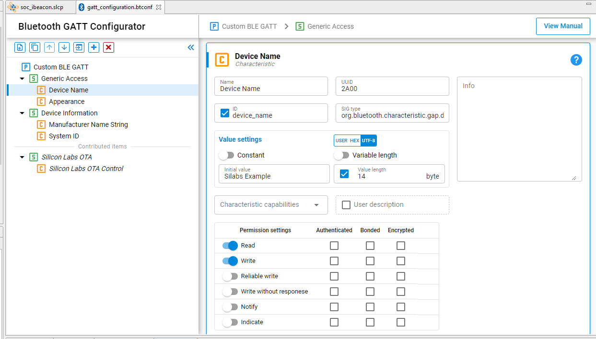

# UG438: GATT Configurator User’s Guide for Bluetooth® LE and Bluetooth Mesh (Rev. 0.3) <!-- omit in toc -->

- [1 GATT Configurator Overview](#1-gatt-configurator-overview)
  - [1.1 SIG Selector](#11-sig-selector)
  - [1.2 Custom GATT Editor](#12-custom-gatt-editor)
    - [1.2.1 Contributed Items](#121-contributed-items)
  - [1.3 Settings Section](#13-settings-section)
  - [1.4 Generating the GATT Database](#14-generating-the-gatt-database)
- [2 Use Cases](#2-use-cases)
  - [2.1 Drag and Drop](#21-drag-and-drop)
  - [2.2 Create New Item](#22-create-new-item)
  - [2.3 Adding Permissions](#23-adding-permissions)
  - [2.4 Adding Capabilities](#24-adding-capabilities)
  - [2.5 Including Services](#25-including-services)
  - [2.6 Import and Export a GATT Database](#26-import-and-export-a-gatt-database)
- [3 Dynamic GATT Configuration](#3-dynamic-gatt-configuration)
  - [3.1 Overview](#31-overview)
  - [3.2 Usage](#32-usage)

---

本指南提供了有效使用作为 Simplicity Studio® 5 的一部分提供的 Bluetooth GATT Configurator 以及 Bluetooth SDK 3.x 和 Bluetooth Mesh SDK 2.x 所需的信息。GATT Configurator 是一个直观的界面，可以访问 Bluetooth Specification 中定义的所有 Profiles、Services、Characteristics 和 Descriptors。它还支持为 Bluetooth 应用程序创建、导入或导出 Custom GATT Profiles。本指南回顾了用户界面并涵盖了配置器的一些最常见用法，以及 Dynamic GATT Configurator 的用法。



# 1 GATT Configurator Overview

GATT Configurator 是一个易于使用的工具，可帮助您构建自己的 GATT Database。项目的 Profiles/Services/Characteristics/Descriptors 列表显示在左侧，所选项的相关详细信息显示在右侧。

GATT Configurator 由左侧的 Custom GATT Editor（显示项目的 Profiles/Services/Characteristics/Descriptors 列表）和右侧的 Settings Editor 组成。SIG Selector 允许您将标准元素添加到 Profile。

Custom GATT Editor 顶部提供了一个选项菜单。

Custom GATT Editor 总是可见的，默认情况下会打开 Settings Editor。


GATT Configurator 的菜单为：


1. 添加一个项。
2. 复制所选项。
3. 向上移动所选项。
4. 向下移动所选项。
5. 导入 GATT 数据库。
6. 添加预定义（打开 SIG Editor）。
7. 删除所选项。

点击添加预定义（6）以打开 SIG Selector。


## 1.1 SIG Selector

SIG Selector 显示一个预定义的 Profiles、Services、Characteristics 和 Descriptors 的列表。可以使用过滤器窗格过滤这些项。标签页允许您在不同列表之间切换。如下图所示，列表右侧的窗格显示最新选择的相关文本信息。要将一个项添加到 Custom GATT Editor 中，请将鼠标悬停在它之上，然后点击右侧的 +。然后可以在 Settings Section 中编辑该项。所选的 SIG Service/Characteristic/Descriptor 将添加到突出显示的 Profile/Service/Characteristic 下。点击 **< BACK** 以返回到 Setting Editor。


## 1.2 Custom GATT Editor

Custom GATT Editor 显示当前配置文件中存在的项。这包括显示为一个层级列表的 Custom GATT Profile、Services、Characteristics 和 Descriptors。显示的项顺序反映了它们在 GATT Database 中的存在顺序。打开 Settings Editor 后，可以选择一个项以查看其 Properties 和配置：


配置文件名旁边的 * 指示未保存配置更改。

**注意**：Generic Attribute Service 未在 Custom GATT Database 结构中列出（上图中的左侧）。这是一个由协议栈维护的特殊 Service，可以通过在 Custom BLE GATT Profile 的设置中启用 **Generic Attribute Service** 滑动条来添加。启用后，该 Service 将成为数据库的一部分。然而它仍不会出现在 Custom GATT Database 结构中，由于 iOS 隐藏了该 Service，因此它不会出现在 iOS 设备上，但是您可能会在 Android 设备上看到它。


### 1.2.1 Contributed Items

一些 Service 在配置器中被列为 “Contributed Items”。这意味着它们的内容是在其他组件中定义的，因此无法从该视图中对其进行编辑。

## 1.3 Settings Section

Settings Editor 允许您配置 Custom GATT Editor 中存在项的 Properties，如 Profiles、Services、Characteristics 和 Descriptors。选择一个项以填充相关的配置选项（如 Name、ID、Properties 和 C
apabilities）。在此部分中所做的任何更改都会立即反映到所选项上。如果需要，可以在编辑时最小化 Custom GATT Editor。一个 Service 的所有 Characteristics 都包含在同一个 Settings Editor 窗格中。


## 1.4 Generating the GATT Database

保存配置后，数据库将自动生成。生成的源文件可以在名为 “autogen” 的目录中找到：


# 2 Use Cases

本章介绍了使用 GATT Configurator 执行的常见任务。

## 2.1 Drag and Drop

要在应用程序中包含源列表中的预定义项，请将此项从 Source Section 拖放到 Custom GATT Section。拖放 Profile 或 Service 时，其下级中的所有 Characteristics 和 Descriptors 将自动包含在内。为了维持层级结构，Descriptors 只能包含在 Characteristics 下，而 Characteristics 则在 Services 下。


在 Custom GATT Section 中，可以使用拖放来对项进行重新排序。这样可以省去再次包含和配置项的麻烦。同样，可以复制一个项并在该部分中移动。

## 2.2 Create New Item

使用添加一个项（1）菜单选项在 Custom GATT Editor 中添加一个新项。如果所选择的是一个 Profile，那么将创建一个新的 Service。如果所选择的是一个 Service，那么将在所选项下创建一个新的 Characteristic。仅在选择 Characteristic 后才能创建 Descriptor。

选择新项后，Settings Section 将显示该项的默认 Properties。此处可以根据要求配置该项。


应用程序使用 Characteristic ID 来获得对 GATT Database 的本地访问。您可以通过在复选框中输入一个唯一 ID 来输入此内容。


生成后，此 ID 会在 `gatt_db.h` 文件中获得一个宏，如下所示：

```c
extern const struct bg_gattdb_def bg_gattdb_data;

#define gattdb_service_changed_char             3
#define gattdb_device_name                      7
#define gattdb_ota_control                     21
#define gattdb_custom_characteristic           24
```

UUID（Universally Unique Identifier）是用于唯一地标识 Services、Characteristics 和 Descriptors 的数字。有两种类型的 UUID：

1. **16 bit** ：这些 16-bit UUID 由 Bluetooth SIG 预先定义。由于它们很短，所以能量和记忆效率都很高。例如，Blood Pressure Service 的 UUID 为 0x1810，而 Battery level Characteristic 的 UUID 为 0x2A19。
2. **128 bit** ：这打破了 16-bit UUID 的局限性，并赋予了您为自定义的 Services 和 Characteristics 声明 UUID 的能力。在 GATT Configurator 中随机生成的 UUID 是 version 4 (random) variant 1。如果某个 UUID 与 Bluetooth Base UUID：xxxxxxxx-0000-1000-8000-00805F9B34FB 不重叠，则可以将其用于自定义的 Service 或 Characteristic。

虽然没有中心机构可以确保其他设备不使用相同的 UUID，但是两个设备最终使用相同的 UUID 的可能性很小（1/2^128）。

## 2.3 Adding Permissions

Permissions 定义了可以对给定的 Characteristic 或 Descriptor 执行哪些操作。例如，在 Blood Pressure Profile 中，Blood Pressure Feature 具有一个 Mandatory Read Property。有关访问类型和安全要求的更多信息，请参见 *UG118: Blue Gecko Bluetooth® Profile Toolkit Developer's Guide* 的 Properties 小节。

首先可以使用滑动条启用所需的访问类型，然后可以使用复选框选择安全要求。


**注意**：*notify* 和 *indicate* Attribute 存储在 SIG 定义的 Client Characteristic Configuration Descriptor（UUID 为 0x2902 的 Descriptor，在启用通知时自动生成）中。如果您手动将 CCCD 添加到 Characteristic，那么 Descriptor 的值将覆盖此设置。对于这种情况，UI 上将显示一条警告。

## 2.4 Adding Capabilities

Bluetooth SDK 2.4 引入了一项称为 Polymorphic GATT 的新特性，可用于动态显示或隐藏 GATT Services 和 Characteristics。GATT Configurator 使用 GATT Capabilities 实现此特性。本节介绍如何实现它。

为了概括 Capabilities 如何工作，每个 Service/Characteristic 可以声明数个 Capabilities，并且 Capabilities 的状态（启用/禁用）确定这些 Services/Characteristics 的可见性（按位或运算）。例如，当 Service/Characteristic 中的至少一项 Capabilities 被启用时，它是可见的；而当其所有 Capabilities 被禁用时，它是不可见的。

总是从先声明 GATT 级别的 Capabilities 并定义其默认值开始。选择 Custom BLE GATT Profile，然后点击 “Capability declarations” 表中的 **+** 控件。添加 Capabilities 后，您可以更改其名称和默认值。例如，将 Appearance、Temperature_Measur 和 Tx_power 添加到 Profile 中，如下图所示：


添加这些 Capabilities 后，它们就可以在每个 Services 和 Characteristics 上使用。可以从 Settings Section 的名为 “Characteristic capabilities” 的下拉列表中进行声明。

在 Service 和 Characteristic 级别，已声明的 Capabilities 被视为已启用，未选择的 Capabilities 将被禁用。


**注意**：在连接过程中，请勿更改 Capabilities 的状态，因为这可能导致行为异常。最安全的方法是在未连接任何设备时更改 Capabilities。

## 2.5 Including Services

在一个 Service 定义中，可以使用 Service 的包含特性将一个或多个引用添加到其他 Services。包含定义由单个 Attribute（包含声明）组成，该 Attribute 包含 Client 引用的已包含 Service 的所需的所有详细信息。

已包含的 Service 可以帮助避免在 GATT Server 中重复数据。如果某个 Service 将被其他 Service 引用，则可以使用此机制来节省内存并简化 GATT Server 的布局。

首先为每个需要被包含的 Service 声明一个 ID。没有 ID 的 Service 将无法被引用。这通过选择 ID 复选框并提供 Service 标识符文本来完成。接下来，从名为 “Service includes” 的下拉列表中选择要引用的 Service，如图所示：


## 2.6 Import and Export a GATT Database

**Import**：Custom GATT 工具栏中的 Import 控件允许您使用 .btconf 文件导入一个现有的 GATT Database。请注意，这将覆盖现有的 GATT 数据。


**Export**：没有单独的导出功能。另一个项目可以直接导入该项目的 GATT Database（名为 gatt_configuration.btconf）。

# 3 Dynamic GATT Configuration

## 3.1 Overview

Silicon Labs Bluetooth SDK v3.2 引入了使用 Bluetooth APIs 动态创建 GATT Database 的能力。这些动态创建的 GATT Attributes 可以与从 GATT XML 文件生成的 Static Database 共存。在这种情况下，Static Database 的 Attribute Table 放在数据库的开头。当动态创建新的 Services 和 Characteristics 时，将它们添加到 Attribute Table 中 Static Database 的 Attributes 之后的位置。

建议将此特性用于 NCP 项目。使用这种方法，不需要修改 GATT Database 所在的目标应用程序。因此，可以使用 API 从 Host 端构建数据库。在其他情况下，GATT Configurator 是首选的解决方案。

## 3.2 Usage

默认情况下，“Dynamic GATT Database” 特性不包含在项目中。它需要从 Software Components 选项卡中安装。


对 GATT Database 的操作是在一个 “Session” 中完成的。当 Session 通过 “Committing” 更改来完成时，更改将被保存。未保存的更改对于已连接的远程 GATT Client 是不可见的。修改仅在 Session 结束时生效。

每个已添加的 Service 和 Characteristic 都需要使用适当的 API 来启动，否则它们对已连接的 Client 不可见。可以使用这种启动和停止机制来拥有一个 Polymorphic GATT Database，因为 Dynamic GATT Database 不支持 Capability 特性。

以下代码片段展示了如何将 Health Thermometer Service 和 Temperature Measurement Characteristic 动态地添加到数据库中。有关详细信息，请参阅 Bluetooth API Reference Manual 的 “GATT Database” 部分。

```c
//create a session for the database update
sl_bt_gattdb_new_session(&session);
//add the Thermometer service (UUID: 0x1809) to the database, as an advertised primary service
sl_bt_gattdb_add_service(session, sl_bt_gattdb_primary_service,
                                  SL_BT_GATTDB_ADVERTISED_SERVICE,2,uuid_service, &service);
//add the Temperature measurement (UUID:0x2A1C) characteristic to the service
sl_bt_gattdb_add_uuid16_characteristic(session, service, SL_BT_GATTDB_CHARACTERISTIC_INDICATE,
                                       0, 0, uuid_characteristic, sl_bt_gattdb_fixed_length_value,
                                       1, 1, 0, &characteristic);
//activate the new service
sl_bt_gattdb_start_service(session, service);
//activate the new characteristic
sl_bt_gattdb_start_characteristic(session, characteristic);
//save changes and close the database editing session
sl_bt_gattdb_commit(session);
```
