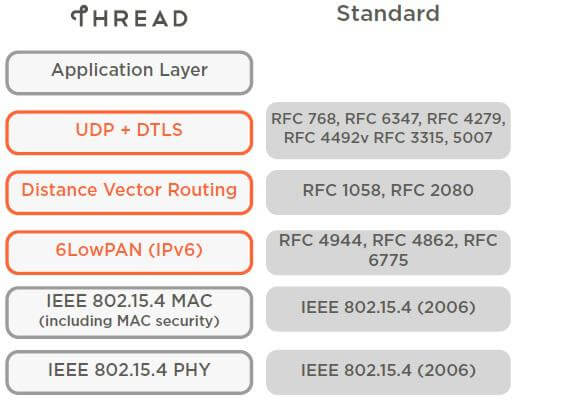
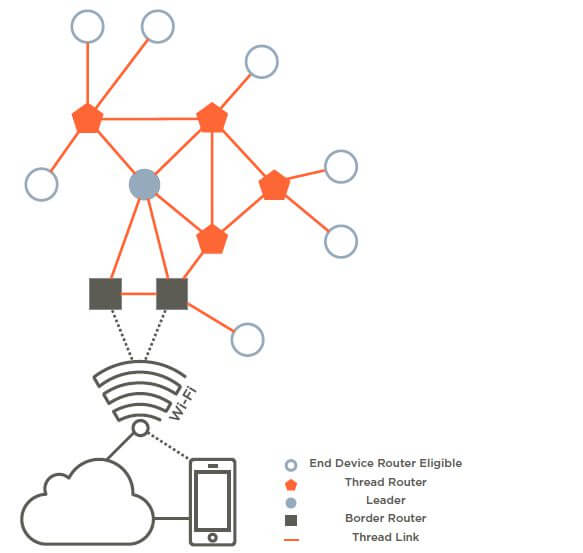
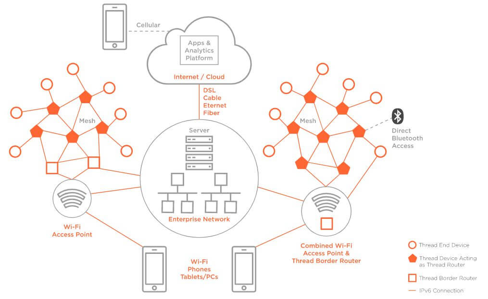
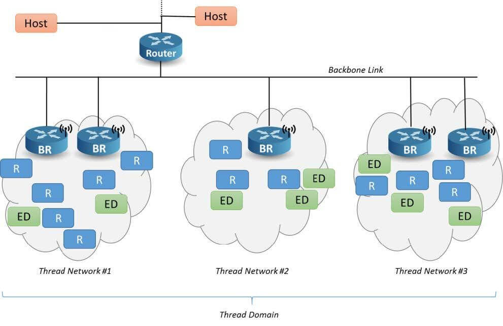
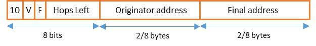
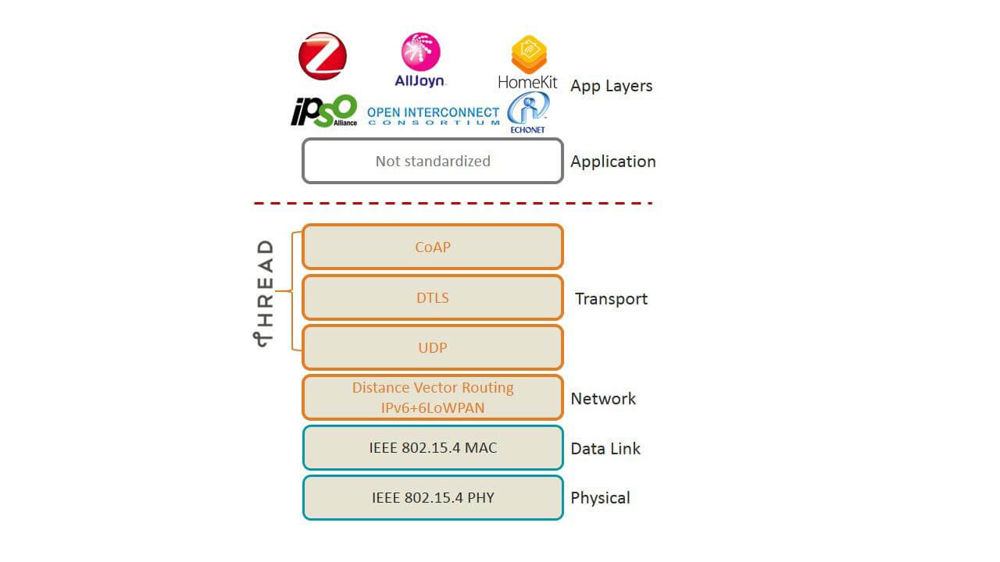

- [1. Introduction](#1-introduction)
    - [1.1 Silicon Labs and the Internet of Things](#11-silicon-labs-and-the-internet-of-things)
    - [1.2 Thread Group](#12-thread-group)
    - [1.3 What is Thread?](#13-what-is-thread)
    - [1.4 Thread General Characteristics](#14-thread-general-characteristics)
    - [1.5 OpenThread](#15-openthread)
- [2. Thread Technology Overview](#2-thread-technology-overview)
    - [2.1 IEEE 802.15.4](#21-ieee-802154)
    - [2.2 Thread Network Architecture](#22-thread-network-architecture)
        - [2.2.1 Residential Architecture](#221-residential-architecture)
        - [2.2.2 Commercial Architecture](#222-commercial-architecture)
    - [2.3 No Single Point of Failure](#23-no-single-point-of-failure)
- [3. IP Stack Fundamentals](#3-ip-stack-fundamentals)
    - [3.1 Addressing](#31-addressing)
    - [3.2 6LoWPAN](#32-6lowpan)
    - [3.3 Link Layer Forwarding](#33-link-layer-forwarding)
    - [3.4 6LoWPAN Encapsulation](#34-6lowpan-encapsulation)
    - [3.5 ICMP](#35-icmp)
    - [3.6 UDP](#36-udp)
    - [3.7 TCP](#37-tcp)
    - [3.8 SRP](#38-srp)
- [4. Network Topology](#4-network-topology)
    - [4.1 Network Address and Devices](#41-network-address-and-devices)
    - [4.2 Mesh Networks](#42-mesh-networks)
- [5. Routing and Network Connectivity](#5-routing-and-network-connectivity)
    - [5.1 MLE Messages](#51-mle-messages)
    - [5.2 Route Discovery and Repair](#52-route-discovery-and-repair)
- [5.3 Routing](#53-routing)
    - [5.4 Retries and Acknowledgements](#54-retries-and-acknowledgements)
- [6. Joining and Network Operation](#6-joining-and-network-operation)
    - [6.1 Network Discovery](#61-network-discovery)
    - [6.2 MLE Data](#62-mle-data)
    - [6.3 CoAP](#63-coap)
    - [6.4 DHCPv6](#64-dhcpv6)
    - [6.5 SLAAC](#65-slaac)
    - [6.6 SRP](#66-srp)
- [7. Management](#7-management)
    - [7.1 ICMP](#71-icmp)
    - [7.2 Device Management](#72-device-management)
    - [7.3 Network Management](#73-network-management)
- [8. Persistent Data](#8-persistent-data)
- [9. Security](#9-security)
    - [9.1 802.15.4 Security](#91-802154-security)
    - [9.2 Secure Network Management](#92-secure-network-management)
- [10. Border Router](#10-border-router)
    - [10.1 Border Router Features for Off-Mesh Communication](#101-border-router-features-for-off-mesh-communication)
    - [10.2 Thread over Infrastructure](#102-thread-over-infrastructure)
    - [10.3 OpenThread Border Router](#103-openthread-border-router)
- [11. Device Commissioning](#11-device-commissioning)
    - [11.1 Traditional Thread Commissioning](#111-traditional-thread-commissioning)
    - [11.2 Enhanced Commissioning with Commercial Extensions in Thread 1.2](#112-enhanced-commissioning-with-commercial-extensions-in-thread-12)
- [12. Application Layer](#12-application-layer)
- [13. Next Steps](#13-next-steps)

---

# UG103.11: Thread Fundamentals (Rev. 1.4) <!-- omit in toc -->

本文档介绍了 Thread 出现的简要背景，提供了技术概述，并描述了在实现 Thread 解决方案时需要考虑的 Thread 的一些关键特性。

Silicon Labs 的基础知识系列涵盖了项目经理、应用程序设计者和开发者在开始使用 Silicon Labs 芯片、网络协议栈（如 EmberZNet PRO 或 Silicon Labs Bluetooth®）以及相关开发工具开发嵌入式网络解决方案之前应了解的主题。这些文档可以作为任何需要介绍如何开发无线网络应用程序的人或刚接触 Silicon Labs 开发环境的人的起点。

# 1. Introduction

## 1.1 Silicon Labs and the Internet of Things

IPv4（Internet Protocol version 4）是于 1981 年在 RFC 791，[DARPA Internet Program Protocol Specification](https://datatracker.ietf.org/doc/html/rfc791) 中定义的（“RFC” 代表 “Request for Comments”）。IPv4 使用 32 位（4 字节）进行寻址，这可以为互联网上的设备提供 232 个唯一地址，即约 43 亿个地址。然而，随着用户和设备数量的指数增长，显而易见，IPv4 地址将会耗尽，这将需要一个新版本的 IP。因此，1990 年发起的 IPv6 意图取代 IPv4。IPv6 使用 128 位（16 字节）进行寻址，这将容许 2128 个地址，比 IPv4 多了 ~~7.9x1028~~ 约 3.4×1038 个地址（[http://en.wikipedia.org/wiki/IPv6](http://en.wikipedia.org/wiki/IPv6)）。

像 Silicon Labs 这样的嵌入式行业公司面临的挑战是解决这种技术迁移问题，更为重要的是要满足客户转向家庭和商业空间中设备不断互联的世界，这通常被称为 IoT（Internet of Things）的需求。Silicon Labs IoT 的高层次目标是：

- 使用一流的网络连接家庭和商业空间中的所有设备，无论是使用 Zigbee PRO、Thread、Bluetooth 还是其他新兴标准。
- 充分利用公司在节能微控制器方面的专业知识。
- 增强既定的低功耗、混合信号芯片。
- 提供与现有 Ethernet 和 Wi-Fi 设备的低成本桥接。
- 启用云服务以及与智能手机和平板电脑的连接，这将促使客户拥有易用和一致的用户体验。

实现所有这些目标将提高 IoT 设备的采用率和用户接受度。

## 1.2 Thread Group

Thread Group（[https://www.threadgroup.org/](https://www.threadgroup.org/)）于 2014 年 7 月 15 日创立。是 Silicon Labs 与其他六家公司一起发起的。Thread Group 是一个市场教育组，提供产品认证并促进使用支持 Thread 的 D2D（Device-to-Device）和 M2M（Machine-to-Machine）产品。Thread Group 的成员资格是开放的。

Thread Specification 1.1 可以在此处提交请求后下载：[https://www.threadgroup.org/ThreadSpec](https://www.threadgroup.org/ThreadSpec)。Thread Specification 的后续版本 1.2 和 1.3.0 也已在 2022 年与认证程序一起公布。最新的 Thread Specification 仅适用于 Thread 成员。

## 1.3 What is Thread?

Thread 是一种安全的无线 Mesh 网络协议。Thread 协议栈是一个开放标准，它建立在现有的 IEEE（Institute for Electrical and Electronics Engineers）和 IETF（Internet Engineering Task Force）标准的集合之上，而不是一个全新的标准（参见下图）。

## 1.4 Thread General Characteristics

Thread 协议栈支持 IPv6 地址并提供与其他 IP 网络的低成本桥接，它还针对低功耗/电池供电操作和无线设备到设备通信进行了优化。Thread 协议栈专为需要基于 IP 网络的智能家居和智慧楼宇应用而设计，并且可以在协议栈上使用各种应用层。

以下是 Thread 协议栈的一般特征：

- **简单的网络安装、启动和操作**：Thread 协议栈支持多种网络拓扑。使用智能手机、平板电脑或计算机进行安装十分简单。产品安装码用于确保只有授权设备才能加入网络。用于建立和加入网络的简单协议允许系统在路由问题发生时自行配置和修复。
- **安全**：除非获得授权并且所有通信都经过加密和安全，否则设备不会加入网络。安全性在网络层提供，也可以在应用层提供。所有 Thread 网络都使用智能手机时代的身份验证方案和 AES（Advanced Encryption Standard）加密技术进行加密。Thread 网络中使用的安全性比 Thread Group 评估过的其他无线标准更强。
- **小型和大型家庭网络**：家庭网络从几个到数百个设备不等。网络层旨在根据预期用途优化网络操作。
- **大型商业网络**：对于大型商业安装，单个 Thread 网络不足以满足所有应用程序、系统和网络要求。Thread Domain 模型允许在单个部署中扩展多达 10,000 台 Thread 设备，并结合使用不同的连接技术（Thread、Ethernet、Wi-fi 等）。
- **双向服务发现和连接**：多播和广播在无线 Mesh 网络上是低效的。对于 Off-Mesh 通信，Thread 提供了一个 Service Registry，设备可以在其中注册他们的存在和服务，客户端可以使用单播查询来发现已注册的服务。
- **范围**：典型设备提供足够的范围以覆盖普通家庭。带有功率放大器的现成设计大大扩展了范围。在物理层（PHY）使用分布式扩频，以更好地抵御干扰。对于商业安装，Thread Domain 模型允许多个 Thread 网络通过一个 Backbone 相互通信，从而扩展范围以覆盖许多 Mesh 子网。
- **无单点故障**：Thread 协议栈旨在提供安全可靠的操作，即使单个设备出现故障或丢失。Thread 设备还可以将基于 IPv6 的链路（如 Wi-Fi 和 Ethernet）合并到拓扑中，以减少多个 Thread Partition 的概率。这样，他们可以利用这些基础设施链路的更高吞吐量、信道容量和覆盖范围，同时仍然支持低功耗设备。
- **低功耗**：设备高效通信以提供增强的用户体验，并且在正常电池条件下具有数年的预期寿命。使用合适的工作周期，设备通常可以使用 AA 型电池运行数年。
- **高性价比**：来自多个供应商的兼容芯片组和软件栈针对大规模部署进行定价，并且从头开始设计具有极低的功耗。

## 1.5 OpenThread

Google 发布的 OpenThread 是 Thread® 的一个开源实现。Google 发布了 OpenThread，使得 Google Nest 产品中使用的网络技术可以被广大的开发者所用，以加速智能家居和智慧楼宇产品的开发。

凭借一个精简的平台抽象层和较小的内存占用，OpenThread 具有高度的可移植性。它支持 SoC（System-On-Chip）、NCP（Network Co-Processor）和 RCP（Radio Co-Processor）设计。

OpenThread 为智能家居和智慧楼宇应用定义了一个基于 IPv6 的可靠、安全和低功耗的无线设备到设备通信协议。它实现了 Thread Specification 1.1.1、Thread Specification 1.2 和 Thread Specification 1.3.0（截至本文档发布）中定义的所有特性。

Silicon Labs 已经实现了一个专门用于与 Silicon Labs 硬件配合使用的基于 OpenThread 的协议。该协议可以在 GitHub 上找到，并且还作为一个与 Simplicity Studio 5 一起安装的 SDK（Software Development Kit）提供。该 SDK 是 GitHub 源码的一个全面测试快照。与 GitHub 版本相比，它支持更广泛的硬件，并包含 GitHub 上无法获得的文档和示例应用程序。

# 2. Thread Technology Overview

## 2.1 IEEE 802.15.4

IEEE 802.15.4-2006 Specification 是一个无线通信标准，它定义了在 2.4 GHz 频段中以 250 kbps 运行的无线 MAC（Medium Access Control）和 PHY（Physical）层，并制定了一个到 sub-GHz 频段的路线图（[IEEE 802.15.4-2006 Specification](http://standards.ieee.org/findstds/standard/802.15.4-2006.html)）。802.15.4 在设计时考虑到了低功耗，适用于通常涉及大量节点的应用。

802.15.4 MAC 层用于基本消息处理和拥塞控制。该 MAC 层包含一个 CSMA（Carrier Sense Multiple Access）机制，用于设备侦听空闲信道，以及一个链路层，用于处理重试和消息确认，以便在相邻设备之间进行可靠通信。MAC 层加密用于基于软件栈更高层建立和配置的密钥的消息。网络层建立在这些底层机制之上，在网络中提供可靠的端到端通信。

Thread Specification 1.2 旨在通过提高 Thread 网络的响应能力和更高的网络密度能力来提高它们的可扩展性。为了实现这一点，利用了 IEEE 802.15.4-2015 Specification 中的多项优化，包括：

- **Enhanced Frame Pending**：通过减少 SED（Sleepy End Device）可以无线发送的消息数量，提高 SED 的电池寿命和响应能力。任何来自 SED 的数据包（不仅仅是数据请求）都可以通过即将到来的待定数据来确认。
- **Enhanced Keepalive**：通过将任何数据消息视为保活网络传输，减少维持 SED 与 Parent 之间的链接所需的流量。
- **CSL（Coordinated Sampled Listening）**：此 [IEEE 802.15.4-2015 Specification](https://standards.ieee.org/standard/802_15_4-2015.html) 特性允许通过调度同步的发送/接收周期而无需周期性数据请求，从而在 SED 和 Parent 之间容许更好的同步。这使得低功耗设备拥有低链路延迟和一个较低消息冲突可能性的网络。
- **Enhanced ACK Probing**：此 [IEEE 802.15.4-2015 Specification](https://standards.ieee.org/standard/802_15_4-2015.html) 特性允许发起者对链路度量（Link Metric）查询进行精细控制，同时通过重用常规数据流量模式而不是单独的探测消息来节省能耗。

## 2.2 Thread Network Architecture

### 2.2.1 Residential Architecture

用户通过其 HAN（Home Area Network）上的 Wi-Fi 或使用一个基于云的应用程序从他们自己的设备（智能手机、平板电脑或计算机）与住宅的 Thread 网络进行通信。下图说明了该 Thread 网络架构中的关键设备类型。

Thread 网络中包含以下设备类型，从 Wi-Fi 网络开始：

* **Border Router** 提供从 802.15.4 网络到其他物理层（Wi-Fi、Ethernet 等）上的相邻网络的连接。Border Router 为 802.15.4 网络中的设备提供服务，包括用于离线操作的路由服务和服务发现。一个 Thread 网络中可能有一个或多个 Border Router。
* **Leader**，在一个 Thread Network Partition 中，负责管理已分配的 Router ID 的注册表并接受来自 REED 的要成为 Router 的请求。Leader 决定哪些节点应该是 Router，Leader 和 Thread 网络中的所有 Router 一样，可以有 Device-End Children。Leader 还使用 CoAP（Constrained Application Protocol）分配和管理 Router 地址。然而，Leader 中包含的所有信息都存在于其他 Thread Router 中。因此，如果 Leader 发生故障或失去与 Thread 网络的连接，那么会有另一个 Thread Router 会被选举出来，并在无需用户干预的情况下接替 Leader（PS：即成为新的 Leader）。
* **Thread Router** 为网络设备提供路由服务。Thread Router 还为尝试加入网络的设备提供加入和安全服务。Thread Router 没有为睡眠进行设计，它可以降级其功能并成为 REED。
* **REED（Router-Eligible End Device）** 可以成为 Thread Router 或 Leader，但不一定成为具有特殊属性（例如多个接口）的 Border Router。由于网络拓扑或其他条件的约束，REED 没有充当 Router。REED 不会中继消息，也不会为网络中的其他设备提供加入或安全服务。如有必要，网络会管理 REED 并将其提升为 Router，这过程无需用户干预。
* **End Device** 是不具有 Router-Eligible 的 FED（Full End Device）或 MED（Minimal End Device）。MED 与其 Parent 进行通信前不需要显式的同步。
* **SED（Sleepy End Device）** 仅通过其 Thread Router Parent 进行通信，不能为其他设备中继消息。
* **SSED（Synchronized Sleepy End Device）** 是 SED 的一种，它使用 IEEE 802.15.4-2015 中的 CSL 来保持与 Parent 的同步调度，以避免使用常规数据请求。

### 2.2.2 Commercial Architecture

Thread 商业模型采用了住宅网络的关键设备类型并添加了一些新概念。用户通过 Wi-Fi 或企业网络通过设备（智能手机、平板电脑或计算机）与商业网络进行通信。下图说明了一个商业网络拓扑。

这些概念有：

- **Thread Domain Model** 支持多个 Thread 网络的无缝集成以及与 Non-Thread IPv6 网络的无缝交互。Thread Domain 的主要好处是设备在一定程度上可以灵活地加入任何配置有公共 Thread Domain 的可用 Thread 网络，这减少了当网络规模或数据量扩大时手动网络规划或手动重新配置的需求。
- **BBR（Backbone Border Router）** 是商业领域中的一类 Border Router，它有助于多个网段的 Thread Domain 同步，并允许大范围的多播传播进出 Thread Domain 中的每个单网格。属于较大 Domain 的 Thread 网络必须至少有一个 “Primary” BBR，并且可以有多个 “Secondary” BBR 以实现故障安全冗余。BBR 通过一个连接所有 Thread 网络的 Backbone 相互通信。
- **Backbone Link** 是一个 Non-Thread IPv6 链路，BBR 使用用于实现 TBLP（Thread Backbone Link Protocol）以与其他 BBR 同步的外部接口连接到该链路。
- 商业实施中的 Thread 设备使用 Thread Domain 和 **DUA（Domain Unique Address）** 进行配置。设备的 DUA 在其作为 Thread Domain 的一部分开始的生命周期内永远不会改变。这有助于在单个 Domain 中跨不同 Thread 网络进行迁移，并确保各个 BBR 促进跨多个 Thread 网络进行的路由。

这些概念如下图所示：

## 2.3 No Single Point of Failure

Thread 协议栈被设计为没有单点故障。虽然系统中有许多执行特殊功能的设备，但 Thread 的设计目的是可以在不影响网络或设备的持续运行的情况下更换它们。例如，一个 SED 需要一个 Parent 进行通信，因此该 Parent 代表其通信的单点故障。然而，SED 可以并且将在其 Parent 不可用时选择另一个 Parent。这样子的转换对用户来说是透明的。

虽然该系统设计用于无单点故障，但在某些拓扑下，会有个别设备不具备后备功能。例如，在具有单个 Border Router 的系统中，如果 Border Router 断电，则无法切换到备用 Border Router。在这种情况下，必须重新配置 Border Router。

借助 Thread Specification 1.3.0，共享基础设施链路的 Border Router 可以通过利用一个 TREL（Thread Radio Encapsulation Link）促进跨不同介质（如 Wi-Fi 或 Ethernet）的无单点故障。使用此特性，可以降低跨链路形成 Thread 分区的概率。

# 3. IP Stack Fundamentals

## 3.1 Addressing

Thread 协议栈中的设备支持 RFC 4291（[https://tools.ietf.org/html/rfc4291](https://tools.ietf.org/html/rfc4291): *IP Version 6 Addressing Architecture*）中定义的 IPv6 寻址架构。设备根据其可用资源支持一个 ULA（Unique Local Address）、一个 Thread Domain 模型中的 DUA（Domain Unique Address）和一个或多个 GUA（Global Unicast Address）。

IPv6 地址的高位指定网络，其余位指定该网络中的特定地址。因此，一个网络中的所有地址都具有相同的前 N ​​位。这前 N 位称为 “Prefix”。“/64” 表示这是一个带有 64 位 Prefix 的地址。起动网络的设备会选择一个 /64 Prefix，然后在整个网络中使用它。Prefix 是一个 ULA（[https://tools.ietf.org/html/rfc4193](https://tools.ietf.org/html/rfc4193): *Unique Local IPv6 Unicast Addresses*）。网络也可能有一个或多个 Border Router，每个 Border Router 可能有也可能没有 /64（可以用来生成 ULA 或 GUA）。网络中的设备使用其 EUI-64（64-bit Extended Unique Identifier）地址来派生其接口标识符，如 RFC 4944 的 Section 6（[https://tools.ietf.org/html/rfc4944](https://tools.ietf.org/html/rfc4944): *Transmission of IPv6 Packets over IEEE 802.15.4 Networks*）中定义的那样。设备支持从节点的 EUI-64（作为接口标识符）配置一个 Link Local IPv6 地址，该地址具有众所周知的 Link Local Prefix FE80::0/64，如 RFC 4862（[https://tools.ietf.org/html/rfc4862](https://tools.ietf.org/html/rfc4862): *IPv6 Stateless Address Autoconfiguration*）和 RFC 4944 中定义的那样。

这些设备还支持合适的多播地址。这包括 Link-Local All Node Multicast、Link-Local All Router Multicast、Solicited Node Multicast 和 Mesh Local Multicast。凭借 Domain 模型中 BBR 的存在，设备还可以支持更高范围的多播地址（如果它们注册了的话）。

根据 IEEE 802.15.4-2006 Specification，每个加入网络的设备都分配有一个 2 字节的短地址。对于 Router，此地址是使用地址字段中的高位分配的。对于 Child 则会使用其 Parent 的高位和适合的低位为其分配一个短地址。这允许网络中的任何其他设备通过使用其地址字段的高位来了解 Child 的路由位置。

## 3.2 6LoWPAN

6LoWPAN 代表 “IPv6 Over Low Power Wireless Personal Networks”。6LoWPAN 的主要目标是通过 802.15.4 链路传输和接收 IPv6 数据包。在这样做时，它必须适应 802.15.4 的空中发送最大帧的大小。在 Ethernet 链路中，一个具有 IPv6 MTU（Maximum Transmission Unit）（1280 字节）大小的数据包可以轻松地作为一帧通过链路发送。对于 802.15.4，6LoWPAN 充当 IPv6 网络层和 802.15.4 链路层之间的适配层。它通过在发送方对 IPv6 数据包进行分片并在接收方重新组装来解决传输 IPv6 MTU 的问题。

6LoWPAN 还提供了一种压缩机制，可减少无线发送的 IPv6 报头大小，从而减少传输开销。空中发送的比特位越少，设备消耗的能量就越少。Thread 充分利用这些机制在 802.15.4 网络上高效传输数据包。RFC 4944（[https://tools.ietf.org/html/rfc4944](https://tools.ietf.org/html/rfc4944）和 RFC 6282（[https://tools.ietf.org/html/rfc6282](https://tools.ietf.org/html/rfc6282）详细地描述了分片和报头压缩的方法。

## 3.3 Link Layer Forwarding

6LoWPAN 层的另一个重要特性是链路层数据包转发。这为在 Mesh 网络中转发多跳数据包提供了一种非常高效和低开销的机制。Thread 使用 IP 层路由和链路层数据包转发。

Thread 使用链路层转发根据 IP 路由表转发数据包。为了实现这一点，在每个多跳数据包中使用了 6LoWPAN Mesh Header（参见下图）。

在 Thread 中，6LoWPAN 层用发起者的 16 位短地址和最终目的地的 16 位源地址填充 Mesh Header 信息。发送端在路由表（Routing Table）中查找下一跳 16 位短地址，然后将 6LoWPAN 帧发送到下一跳 16 位短地址作为目的地。下一跳设备收到数据包，在路由表/邻居表（Routing Table / Neighbor Table）中查找下一跳，递减 6LoWPAN Mesh Header 中的 Hop 计数，然后将数据包发送到下一跳或最终目的地 16 位短地址的目的地。

> PS：看不懂的可以参考 [Transmission of IPv6 Packets over IEEE 802.15.4 Networks - Frame Delivery in a Link-Layer Mesh](https://datatracker.ietf.org/doc/html/draft-ietf-6lowpan-format-10#section-11) 。

## 3.4 6LoWPAN Encapsulation

6LoWPAN 数据包的构造原理与 IPv6 数据包相同，并包含每个附加功能的堆叠报头。每个 6LoWPAN 报头前面都有一个分派值，用于标识报头的类型（参见下图）。

Thread 使用以下类型的 6LoWPAN 报头：

- Mesh Header（用于链路层转发）
- Fragmentation Header（用于将 IPv6 数据包分段为多个 6LoWPAN 数据包）
- Header Compression Header（用于 IPv6 报头压缩）

6LoWPAN Specification 规定，如果存在多个报头，则它们必须按上述顺序出现。

以下是通过空中发送的 6LoWPAN 数据包的示例。

在下图中，6LoWPAN 有效负载由压缩的 IPv6 报头和 IPv6 有效负载的其余部分组成。

在下图中，6LoWPAN 有效负载包含 IPv6 报头和部分 IPv6 有效负载。

其余的有效负载将按照下图中的格式在后续数据包中传输。

## 3.5 ICMP

Thread 设备支持 [RFC 4443, Internet Control Message Protocol (ICMPv6) for the Internet Protocol Version 6 (IPv6) Specification](https://datatracker.ietf.org/doc/html/rfc4443) 中定义的 ICMPv6。它们还支持 echo 请求和 echo 应答消息。

## 3.6 UDP

Thread 协议栈支持 [RFC 768, User Datagram Protocol](https://datatracker.ietf.org/doc/html/rfc768) 中定义的 UDP（User Datagram Protocol）。

## 3.7 TCP

Thread 协议栈支持一个称为 “TCPlp（TCP Low Power）” 的 TCP（Transport Control Protocol）变体（请参阅 [usenix-NSDI20](https://www.usenix.org/system/files/nsdi20-paper-kumar.pdf)）。Thread 兼容设备实现了 TCP 发起者（Initiator）和侦听者（Listener）角色，如下所述：

- RFC 793, [Transmission Control Protocol](https://datatracker.ietf.org/doc/html/rfc793)
- RFC 1122, [Requirements for Internet Hosts](https://datatracker.ietf.org/doc/html/rfc1122)
- Thread Specification 1.3.0：现有的 TCP 实现通常不会在无线 Mesh 网络和受限的 802.15.4 帧大小下优化工作。因此，Specification 定义了 Thread 网络上高效 TCP 实现所需的那些元素和参数值（参见 Thread Specification 1.3.0, section 6.2 TCP）。

## 3.8 SRP

从 Thread Specification 1.3.0 开始，Thread 设备可以使用在 [Service Registration Protocol for DNS-Based Service Discovery](https://datatracker.ietf.org/doc/html/draft-ietf-dnssd-srp) 中定义的 SRP（Service Registration Protocol）。该功能要求必须存在一个由 Border Router 维护的 Service Registry。Mesh 网络上的 SRP 客户端可以注册以提供各种服务。SRP 服务端接受基于 DNS 的发现查询，并额外提供公钥加密以确保安全，还有一些其他小的增强功能以更好地支持受限的客户端。

# 4. Network Topology

## 4.1 Network Address and Devices

Thread 协议栈支持网络中所有 Router 之间的全 Mesh 连接。实际拓扑基于网络中的 Router 数量。如果只有一个 Router，则网络形成一个星形。如果有多个 Router，则会自动形成一个 Mesh 网（参见 [2.2 Thread Network Architecture](#22-thread-network-architecture)）。

## 4.2 Mesh Networks

嵌入式 Mesh 网络允许无线电为其他无线电中继消息，从而使无线电系统更加可靠。例如，如果一个节点不能直接向另一个节点发送消息，则嵌入式 Mesh 网络通过一个或多个中间节点中继消息。如 [5.3 Routing](#53-routing) 中所讨论的那样，Thread 协议栈中的所有 Router 节点都保持路由和相互连通，因此 Mesh 网会被不断地维护和连接。Thread 网络有 64 个 Router 地址的限制，但它们不能一次全部使用。这允许重新使用已删除设备的地址。

在 Mesh 网络中，SED 或 REED 不会为其他设备进行路由。这些设备将消息发送到 Parent（是一个 Router）。Parent Router 会处理其 Child 设备的路由操作。

# 5. Routing and Network Connectivity

Thread 网络可以有多达 32 个活动的 Router，它们会根据路由表对消息使用下一跳路由。路由表由 Thread 协议栈维护，以确保所有 Router 都具有网络中任何其他 Router 的连接和最新路径。所有 Router 都使用 MLE（Mesh Link Establishment）以一种压缩的格式与其他 Router 交换其路由到网络中其他 Router 的成本。

## 5.1 MLE Messages

MLE 消息用于建立和配置安全无线电链路、探测相邻设备以及维护网络中设备之间的路由成本。MLE 在路由层之下运行并在 Router 之间使用单跳链路本地单播和多播。

随着拓扑和物理环境的变化，MLE 消息用于识别、配置和保护与相邻设备的链路。MLE 还用于分发跨网络共享的配置值，例如信道（Channel）和 PAN（Personal Area Network）ID。这些消息可以通过 MPL（[https://tools.ietf.org/html/draft-ietf-roll-trickle-mcast-11](https://tools.ietf.org/html/draft-ietf-roll-trickle-mcast-11): *Multicast Protocol for Low power and Lossy Networks (MPL)*）指定的简单泛洪进行转发。

MLE 消息还确保在确定两个设备之间的路由成本时考虑非对称链路成本。非对称链路成本在 802.15.4 网络中很常见。为确保双向消息传递可靠，考虑双向链路成本是很重要的。

## 5.2 Route Discovery and Repair

按需路由发现通常用于低功耗 802.15.4 网络。然而，按需路由发现在网络开销和带宽方面的成本很高，因为设备会通过网络广播路由发现请求。在 Thread 协议栈中，所有 Router 会与网络中的所有其他 Router 交换包含成本信息的单跳 MLE 数据包。所有 Router 都将具有到网络中任何其他 Router 的最新路径成本信息，因此不需要按需路由发现。如果一条路由不再可用，Router 可以选择下一个最合适的路由到达目的地。

路由到 Child 设备是通过查看 Child 地址的高位来确定 Parent Router 地址来完成的。一旦设备获知了 Parent Router，它就知道该设备的路径成本信息和下一跳路由信息。

随着路由成本或网络拓扑的变化，这些变化将使用 MLE 单跳消息在网络中进行传播。路由成本基于两个设备之间的双向链路质量。每个方向的链路质量基于来自该相邻设备的传入消息的链路余量。这个传入的 RSSI（Received Signal Strength Indicator）映射到一个 0 ~ 3 的链路质量。0 表示未知成本。

当 Router 从邻居接收到新的 MLE 消息时，它要么已经有设备的邻居表条目，要么添加了一个。MLE 消息包含来自邻居的传入成本，因此会在 Router 的邻居表中进行更新。MLE 消息还包含在路由表中更新的其他 Router 的更新路由信息。

活动 Router 的数量受限于单个 802.15.4 数据包中可以包含的路由和成本信息的数量。此限制当前为 32 个 Router。

# 5.3 Routing

设备使用普通 IP 路由转发数据包。路由表填充有网络地址和合适的下一跳。

距离矢量路由用于获取到本地网络上的地址的路由。在本地网络上路由时，这个 16 位地址的高 6 位定义了 Router 目的地。然后这个 Parent Router 负责根据 16 位地址的剩余部分转发到最终目的地。

对于 Off-Network 路由，Border Router 会将它所提供的特定 Prefix 告知 Router Leader，并将此信息作为网络数据分发到 MLE 数据包中。网络数据包括 Prefix 数据（即 Prefix 自身）、6LoWPAN 上下文、Border Router 以及该 Prefix 的 SLAAC（Stateless Address Autoconfiguration）或 DHCPv6 服务器。如果设备要使用该 Prefix 配置地址，那么它会联系相应的 SLAAC 或 DHCP 服务器以获取该地址。网络数据还包含一个路由服务器列表，它们是默认 Border Router 的 16 位地址。

此外，在具有 Thread Domain 模型的商业领域中，Backbone Border Router 将其提供的 Domain Unique Prefix 告知 Router Leader，以指示该 Mesh 网是更大的 Thread Domain 的一部分。用于此的网络数据包括 Prefix 数据、6LoWPAN 上下文和 Border Router ALOC。这没有为此 Prefix 集设置 SLAAC 或 DHCPv6 标志，但是地址分配遵循 Stateless 模型。此外，还会指示此 Border Router 的 “backbone” 服务能力的服务和服务器 TLV。对于向 BBR 注册其 DUA 的任何设备，都存在 Backbone 上的重复地址检测功能。设备的 DUA 在其作为 Thread Domain 的一部分开始的生命周期内永远不会改变。这有助于在单个 Domain 中跨不同 Thread 网络进行迁移，并确保各个 BBR 促进跨多个 Thread 网络进行的路由。在 Backbone 上，使用标准 IPv6 路由技术，例如 IPv6 Neighbor Discovery（RFC 4861 的 NS/NA）和 Multicast Listener Discovery（RFC 3810 的 MLDv2）会被使用。

Leader 被指定跟踪 REED 成为 Router 或允许 Router 降级为 REED。Leader 还使用 CoAP 分配和管理 Router 地址。然而，Leader 中包含的所有信息也会周期性地广告给其他 Router。如果 Leader 离开了网络，那么另一个 Router 会被选举出来，并在没有用户干预的情况下接管 Leader。

Border Router 负责处理 6LoWPAN 压缩或扩展以及对离网设备的寻址。Backbone Border Router 负责处理使用 IP-in-IP 封装和解封装的 MPL，以便处理进出 Mesh 网的更大范围的多播。

有关 Border Router 的更多信息，请参阅 *AN1256: Using the Silicon Labs RCP with the OpenThread Border Router*。

## 5.4 Retries and Acknowledgements

虽然在 Thread 协议栈中使用了 UDP 消息传递，但还需要一些轻量级机制来实现可靠的消息传递：

- MAC 层重试 - 每个设备使用来自下一跳的 MAC 确认，并且如果未收到 MAC ACK 消息，则会在 MAC 层重试消息。
- 应用层重试 - 应用层可以确定消息可靠性是否是一个关键参数。如果是的话，可以使用端到端确认和重试协议，例如 CoAP 重试。

# 6. Joining and Network Operation

Thread 允许两种加入方法：

- 使用带外方法将 Commissioning 信息直接共享到设备。这允许使用此信息将设备引导到正确的网络。
- 在待加入设备和智能手机、平板电脑或 Web 上的 Commissioning 应用程序之间建立 Commissioning 会话。
- 对于具有 Thread Domain 模型的商业网络，Thread Specification 1.2 指定了在认证后为加入者提供操作证书的无用户干预的自主注册过程。操作证书对设备的 Domain 信息进行编码，并允许提供安全的 Network Master Key。此模型需要 Backbone Border Router 上的 Registrar 或 TRI（Thread Registrar Interface），并使用 ANIMA/BRSKI/EST 协议促进与外部机构（MASA）的通信。支持这种 Commissioning 模式的网络称为 CCM 网络。

有关 Commissioning Thread 网络的更多信息，请参阅 [11. Device Commissioning](#11-device-commissioning)。

使用 Beacon 有效负载中的 Permit Joining 标志进行加入是 802.15.4 常用的方法，但 Thread 网络不使用此方法。此方法最常用于按键式加入，其中设备没有用户界面或带外通道。这种方法在有多个可用网络的情况下存在设备转向问题，并且还可能带来安全风险。

在 Thread 网络中，所有加入都是用户发起的。加入后，通过 Commissioning 设备在应用层完成安全认证。这种安全认证在 [9. Security](#9-security) 中讨论。

设备作为 SED、End Device（MED 或 FED）或 REED 加入网络。只有在 REED 加入并了解网络配置后，它才能潜在地请求成为 Thread Router。在设备加入后，会根据其 Parent 提供一个 16 位短地址。如果一个 REED 成为一个 Thread Router，则 Leader 会分配一个 Router 地址给它。Thread Router 的重复地址检测由驻留在 Leader 上的集中式路由器地址分配机制确保。Parent 负责避免主机设备的地址重复，因为它会在加入时为它们分配地址。

## 6.1 Network Discovery

加入设备使用网络发现来确定无线电范围内的 802.15.4 网络。设备扫描所有信道，在每个信道上发出一个 MLE 发现请求，并等待 MLE 发现响应。802.15.4 MLE 发现响应包含带有网络参数的有效负载，包括网络的 SSID（Service Set Identifier）、Extended PAN ID 和其他指示网络是否正在接受新成员以及它是否支持 Native Commissioning 的值。

如果设备已被 Commissioned 到网络上，则不需要网络发现，因为它已经知道了网络的信道和 Extended PAN ID。然后，这些设备使用已提供的 Commissioning Material 连接到网络。

## 6.2 MLE Data

设备连接到网络后，需要各种信息才能参与到网络。MLE 为设备提供服务以向相邻设备发送单播以请求网络参数并更新邻居的链路成本。当新设备加入时，它还会执行一个 Challenge 响应以设置安全帧计数器，如 [9. Security](#9-security) 中所述。

所有设备都支持 MLE 链路配置消息的发送和接收。这包括 “Link Request”、“Link Accept” 和 “Link Accept And Request” 消息。

MLE 交换用于配置或交换以下信息：

- 相邻设备的 16 位短地址和 64 位 EUI 64 长地址
- 设备能力信息，包括是否为 SED（及其睡眠周期）
- 邻居链路成本（如果是 Thread Router）
- 设备之间的 Security Material 和帧计数器
- 到网络中所有其他 Thread Router 的路由成本
- 收集和分发有关各种链路配置值的链路度量

注意：MLE 消息是加密的，除非在发起节点引导操作期间新设备尚未获得 Security Material。

## 6.3 CoAP

RFC 7252（[https://tools.ietf.org/html/rfc7252](https://tools.ietf.org/html/rfc7252): *The Constrained Application Protocol (CoAP)*）中定义的 CoAP（Constrained Application Protocol）是一种专门用于受限节点和低功耗网络的传输协议。CoAP 提供应用程序端点之间的请求/响应交互模型，支持服务和资源的内置发现，并包含 Web 的关键概念，例如 URL。CoAP 在 Thread 中用于配置设备所需的 Mesh-Local 地址和多播地址。此外，CoAP 还用于管理消息，例如获取和设置活动 Thread Router 上的诊断信息和其他网络数据。

## 6.4 DHCPv6

RFC 3315 中定义的 DHCPv6 用作一个 Client-Server 协议来管理网络内设备的配置。DHCPv6 使用 UDP 从 DHCP 服务器请求数据（[https://www.ietf.org/rfc/rfc3315.txt](https://www.ietf.org/rfc/rfc3315.txt): *Dynamic Host Configuration Protocol for IPv6 (DHCPv6)*）。

DHCPv6 服务用于配置：

- 网络地址
- 设备所需的多播地址

因为短地址是使用 DHCPv6 从服务器分配的，所以不需要重复地址检测。Border Router 也使用 DHCPv6，它们根据它们提供的 Prefix 分配地址。

## 6.5 SLAAC

RFC 4862（[https://tools.ietf.org/html/rfc4862](https://tools.ietf.org/html/rfc4862): *IPv6 Stateless Address Autoconfiguration*）中定义的 SLAAC 是一种方法，该方法是 Border Router 分配一个 Prefix，然后通过 Router 派生出它的地址的后 64 位。IPv6 无状态自动配置机制不需要手动配置主机、最少的（如果有的话）路由器配置，也不需要额外的服务器。无状态机制允许主机使用本地可用信息和路由器广告的信息的组合来生成自己的地址。

## 6.6 SRP

从 Thread Specification 1.3.0 开始，Thread 设备可以使用在 [Service Registration Protocol for DNS-Based Service Discovery](https://datatracker.ietf.org/doc/html/draft-ietf-dnssd-srp) 中定义的 SRP（Service Registration Protocol）。这要求必须存在一个由 Border Router 维护的 Service Registry。Mesh 网络上的 SRP 客户端可以注册以提供各种服务。SRP 服务端接受基于 DNS 的发现查询，并额外提供公钥加密以确保安全，还有一些其他小的增强功能以更好地支持受限的客户端。

# 7. Management

## 7.1 ICMP

所有设备都支持 ICMPv6 错误消息，以及 echo 请求和 echo 应答消息。

## 7.2 Device Management

设备上的应用层可以访问一组设备管理和诊断信息，这些信息可以在本地使用或收集并发送到其他管理设备。

在 802.15.4 PHY 和 MAC 层，设备向管理层提供以下信息：

- EUI 64 地址
- 16 位短地址
- 能力信息
- PAN ID
- 已发送和已接收的数据包
- 已发送和已接收的八位字节（Octet）
- 发送或接收时丢弃的数据包
- 安全错误
- MAC 重试次数

## 7.3 Network Management

设备上的网络层还提供有关管理和诊断的信息，这些信息可以在本地使用或发送到其他管理设备。网络层提供 IPv6 地址列表、邻居和 Child 表以及路由表。

# 8. Persistent Data

由于各种原因，在现场运行的设备可能会意外或故意地重置。已重置的设备需要在无需用户干预的情况下重新发起网络操作。要成功完成此操作，非易失性存储必须存储以下信息：

- 网络信息（如 PAN ID）
- Security Material
- 来自网络的寻址信息以建立设备的 IPv6 地址

# 9. Security

Thread 网络是无线网络，因此必须保护它以免受到 OTA（Over-The-Air）攻击。Thread 还会连接到互联网，因此必须保护它以免受到互联网攻击。为 Thread 开发的许多应用程序将服务于需要长时间无人值守操作和低功耗的广泛用途。因此，Thread 网络的安全性至关重要。

Thread 在 MAC 层处使用一个 Network-Wide Key 进行加密。此密钥用于标准 IEEE 802.15.4-2006 身份验证和加密。IEEE 802.15.4-2006 安全保护 Thread 网络免受来自网络外部的无线攻击。任何单个节点的妥协都可能泄露 Network-Wide Key。因此，它通常不是 Thread 网络中使用的唯一安全方式。Thread 网络中的每个节点通过 MLE 握手与其邻居交换帧计数器。这些帧计数器有助于防止重放攻击。（有关 MLE 的更多信息，请参阅 Thread Specification）。Thread 允许应用程序使用任何互联网安全协议进行端到端通信。

节点通过随机化来混淆它们的 Mesh-Wide IP 地址接口和它们的 MAC 扩展 ID。分配给节点的储备 EUI64 仅在初始加入阶段用作源地址。一旦节点加入网络，该节点将使用基于其两字节节点 ID 的地址或上述随机地址之一作为其源。一旦节点加入网络，EUI64 就不会用作源地址。

网络管理也需要安全。Thread 网络管理应用程序可以在任何连接到互联网的设备上运行。如果该设备本身不是 Thread 网络的成员，那么它必须首先与 Thread Border Router 建立安全的 DTLS（Datagram Transport Layer Security）连接。每个 Thread 网络都有一个用于建立此连接的管理密码。一旦管理应用程序连接到 Thread 网络，就可以将新设备添加到网络中。

## 9.1 802.15.4 Security

IEEE 802.15.4-2006 Specification 描述了 PAN 和 HAN 的无线和媒体访问协议。这些协议旨在在专用无线电设备（例如 Silicon Labs 提供的设备）上实施。IEEE 802.15.4-2006 支持多种应用，其中许多是安全敏感的。例如，考虑一个监控建筑物占用情况的警报系统应用程序。如果网络不安全并且入侵者可以访问网络，则可以广播消息以创建虚假警报、修改现有警报或使合法警报静音。这些情况中的每一种都对建筑物的居住者构成重大风险。

许多应用程序需要机密性，并且大多数还需要完整性保护。802.15.4-2006 通过使用具有四种基本安全服务的链路层安全协议来满足这些要求：

- 访问控制（Access control）
- 消息完整性（Message integrity）
- 消息机密性（Message confidentiality）
- 重放保护（Replay protection）

IEEE 802.15.4-2006 提供的重放保护只是局部的。Thread 使用上面讨论的节点间的 MLE 握手来提供额外的安全性，以完善重放保护。

## 9.2 Secure Network Management

网络管理也需要安全。Thread 网络管理应用程序可以在任何连接到互联网的设备上运行。安全有两个部分：

* 802.15.4 负责的 OTA 安全。Thread 实现了 802.15.4-2006 level 5 安全性。
* CCM 网络：如果设备本身不是 CCM 网络的成员，则它必须与 Backbone Border Router 建立连接，以获得其操作证书，从而将自己建立为 Thread Domain 的一部分。
* 非 CCM 网络：互联网安全：如果设备本身不是 Thread 网络的成员，它必须首先与 Thread Border Router 建立安全的 DTLS 连接。每个 Thread 网络都有一个管理密码，用于在外部管理设备和 Border Router 之间建立安全连接。一旦管理应用程序连接到 Thread 网络，就可以将新设备添加到网络中。

# 10. Border Router

Thread Border Router 是一种通过本地家庭或企业网络将 Thread 无线网络连接到外部世界中其他基于 IP 的网络（如 Wi-Fi 或 Ethernet）的设备。与其他无线解决方案中的 Gateway 不同，它对位于网络层之上的传输和应用协议是完全透明的。因此，应用程序可以安全地进行端到端通信，而无需任何应用程序层转换。

一个 Thread Border Router 最低限度地支持以下功能：

* 通过 Thread 设备和其他外部 IP 网络之间的路由实现端到端的 IP 连通性。
* 外部的 Thread Commissioning（如移动电话），用于验证 Thread 设备并将其加入到 Thread 网络。

一个网络中可以有多个 Border Router，从而在其中一个发生故障时消除 “单点故障”。当企业网络运行 IPv6 和 IPv4 或仅 IPv4 时，Border Router 使每个 Thread 设备都可以直接连接到全球云服务。

## 10.1 Border Router Features for Off-Mesh Communication

在部分或全部转换到 IPv6 之前，可以在当前工作情况下立即实施 Thread，并且 Thread 使用 NAT（Network Address Translation）实现了 IPv4 向后兼容性。NAT64 将数据包在 IPv6 和 IPv4 间转换。Thread Border Router 可以作为 WAN（Wide Area Network）上的 IPv4 主机，能够获取 IPv4 接口和路由器地址。它可以使用 DHCP 从 IPv4 地址池中获取地址。Thread Border Router 还可以实现 PCP（Port Control Protocol）来控制传入的 IPv4 数据包如何被转换和转发，并支持静态映射。大多数 IPv4 到 IPv6（反之亦然）的转换可以由 Thread Border Router 处理，只需对现有网络进行最少的更改。

此外，Thread Border Router 支持双向的 IPv6 连通性，包括 IPv6 邻居发现、路由器广告、多播发现和数据包转发。

## 10.2 Thread over Infrastructure

当两组或多组设备之间没有连通时，Thread 网络会自动组织成单独的 Thread Network Partition。Thread Partition 允许设备与同一 Thread Partition 中的其他设备保持通信，但不能与其他 Partition 中的 Thread 设备保持通信。

Thread over Infrastructure 允许 Thread 设备将基于 IP 的链路技术（如 Wi-Fi 和 Ethernet）整合到 Thread 拓扑中。与其他链路技术相比，这些额外的 Thread 链路降低了多个 Thread Network Partition 发生的可能性，同时保证了与现有 Thread 1.1 和 1.2 设备的向后兼容性。对于任何包含至少两个通过共享相邻基础设施链路连接的 Border Router 的网络拓扑，都可以获得这些好处。

有关详细信息，请参阅 Thread Specification 1.3.0, Chapter 15 (Thread over Infrastructure)。

## 10.3 OpenThread Border Router

OpenThread 的 Border Router 实现称为 OTBR（OpenThread Border Router）。它支持使用 RCP 模型的 Mesh 网接口。Silicon Labs 提供了一个实现（在 Raspberry Pi 上受支持）和源代码作为 Silicon Labs GSDK 的一部分。有关更多信息，请参阅 *AN1256: Using the Silicon Labs RCP with the OpenThread Border Router*。

有关 OTBR 的设置和架构的文档可在 [https://openthread.io/guides/border-router](https://openthread.io/guides/border-router) 获得。

# 11. Device Commissioning

Thread 设备以不同方式在 Thread 网络上进行 Commissioning，如以下小节所述。

## 11.1 Traditional Thread Commissioning

对于小型网络（Thread Specification 1.1.1 或更高版本）的网络 Commissioning，安装人员可以使用为 Android 和 iOS 设备免费提供的 Thread Commissioning App。此 App 可用于轻松地将新设备添加到网络或重新配置现有设备。

Thread 使用 MeshCoP（Mesh Commissioning Protocol）来安全地进行身份认证、Commission 和将新的、不受信任的无线电设备加入到 Mesh 网络中。Thread 网络包括一个具有 IEEE 802.15.4 接口的自主自配置设备 Mesh 网和一个链路级安全层，该安全层要求 Mesh 网中的每个设备都拥有当前的 Shared Secret Master Key。

当 Commissioner Candidate（通常是通过 WiFi 连接的手机）通过其 Border Router 之一发现 Thread 网络时，开始 Commissioning 过程。Border Router 使用任何合适的服务位置向 Commissioner 广告其可用性。该发现机制必须为 Commissioner Candidate 提供通信路径和网络名称，因为网络名称稍后会用作建立 Commissioning Session 的加密盐。

Commissioner Candidate 在发现感兴趣的 Thread 网络后，使用  Commissioning Credential（用于身份验证的人工选择的密码）安全地连接到它。Commissioner Authentication 步骤通过 DTLS 在 Commissioner Candidate 和 Border Router 之间建立一个安全的 Client/Server Socket 连接。此安全会话称为 Commissioning Session。Commissioning Session 使用在发现阶段广告的已分配 UDP 端口号。这个端口被称为 Commissioner Port。用于建立 Commissioning Session 的凭证称为 PSKc（Pre-Shared Key for the Commissioner）。

然后，Commissioner Candidate 将其身份注册到其 Border Router。Leader 通过接受或拒绝 Border Router 作为 Commissioner 的可行代运人来响应。接受后，Leader 会更新其内部状态以跟踪活动的 Commissioner，然后 Border Router 向 Commissioner Candidate 发送一个确认消息，通知设备它现在是 Commissioner 了。

当有与 Thread 网络相关联的已授权 Commissioner 时，就可以加入符合条件的 Thread 设备了。在它们成为 Thread 网络的一部分之前，它们被称为 Joiner。Joiner 首先创建一个与 Commissioner 的 DTLS 连接以交换 Commissioning Material。然后它使用 Commissioning Material 加入到 Thread 网络。只有在这两个步骤完成后，节点才被认为是网络的一部分，然后可以参与未来节点的加入过程。所有这些步骤都确认了正确的设备已加入正确的 Thread 网络，并且 Thread 网络本身可以抵御无线和互联网攻击。有关 Mesh Commissioning Protocol 的更多信息，请参阅 Thread specification。

## 11.2 Enhanced Commissioning with Commercial Extensions in Thread 1.2

Thread Specification 1.2 及其 Commercial Extensions 现在允许更大规模的网络，例如办公楼、公共建筑、酒店或其他类型的工业或商业建筑中所需的网络。由于更好地支持子网划分，Thread Specification 1.2 更轻松地允许在一个部署中部署数千台设备，可以手动、自主以及通过高级的远程 Commissioning 特性进行配置。

Thread 1.2 中的 Commercial Extensions 允许大规模身份验证、网络加入、子网漫游和基于 Enterprise Domain 中受信任身份的操作。为了实现设备的可靠身份验证和授权信息的验证，系统安装人员可以设置一个 Enterprise Certificate Authority 以简化大规模网络的部署。这允许安装人员通过称为 Autonomous Enrollment 的自动注册过程来设置和维护网络，而无需直接访问各个设备，也无需与这些设备进行任何直接交互。与使用设备密码配对进行身份验证的 Thread 1.1 不同，Thread 1.2 中的 Commercial Extensions 将支持更具可扩展性的基于证书的身份验证方式。一个企业网络可以有一个或多个 Thread Domain，每个 Thread Domain 可以设置为集成多个 Thread 网络。

# 12. Application Layer

Thread 是一个无线 Mesh 网络栈，负责在 [2.2 Thread Network Architecture](#22-thread-network-architecture) 中描述的 Thread 网络中的不同设备之间路由消息。下图说明了 Thread 协议中的各层。

应用层的标准定义是 “指定通信网络中主机使用的共享协议和接口方法的抽象层”（[https://en.wikipedia.org/wiki/Application_layer](https://en.wikipedia.org/wiki/Application_layer)）。更简单地说，应用层是 “设备的语言”，例如，开关如何与灯泡对话。在这种定义下，Thread 中不存在应用层。客户根据 Thread 协议栈中的功能和自己的需求构建应用层。虽然 Thread 不提供应用层，但是它提供了基本的应用服务：

- UDP messaging UDP 提供了一种使用 16 位端口号和 IPv6 地址发送消息的方法。UDP 是一种比 TCP 更简单的协议，并且连接的开销更少（例如，UDP 不实现 keep-alive 消息）。因此，UDP 实现了更快、更高的消息吞吐量，并降低了应用程序的整体功耗预算。UDP 还具有比 TCP 更小的代码空间，从而在芯片上为自定义应用程序留下了更多可用的闪存。
- Multicast messaging Thread 提供了广播消息的能力，即将相同的消息发送到 Thread 网络上的多个节点。多播允许以内置方式与邻居节点、Router 和具有标准 IPv6 地址的整个 Thread 网络通信。
- Application layers using IP services Thread 允许使用 UDP 和 CoAP 等应用层来允许设备通过互联网进行交互通信。非 IP 应用层需要一些适配才能在 Thread 上工作。（有关 CoAP 的更多信息，请参阅 [RFC 7252](https://tools.ietf.org/html/rfc7252)）

Silicon Labs OpenThread SDK 包含以下示例应用程序，这些应用程序也可从 OpenThread GitHub 存储库获得：

- ot-cli-ftd
- ot-cli-mtd
- ot-ncp-ftd
- ot-ncp-mtd
- ot-rcp (used in conjunction with an OpenThread Border Router)

这些应用程序可用于演示 Thread 网络的特性。此外，Silicon Labs OpenThread SDK 还提供了 SED 示例应用程序（sleepy-demo-ftd 和 sleepy-demo-mtd），它演示了如何使用 Silicon Labs 电源管理器特性来创建低功耗设备。最后，ot-ble-dmp 示例应用程序演示了如何使用 OpenThread 和 Silicon Labs Bluetooth stack 构建动态多协议应用程序。有关在 Simplicity Studio 5 中使用示例应用程序的更多信息，请参阅 *QSG170: OpenThread Quick-Start Guide*。

# 13. Next Steps

Silicon Labs OpenThread SDK 包括经过认证的 OpenThread 网络栈和示例应用程序，可演示基本的网络和应用程序行为。我们鼓励客户使用随附的示例应用程序（尤其是 Silicon Labs 提供的）来熟悉 Thread。每个应用程序都演示了设备如何建立和加入网络，以及如何发送和接收消息。加载 Simplicity Studio 5 和 Silicon Labs OpenThread SDK 后，即可使用这些应用程序。Simplicity Studio 5 支持在 Thread 中创建应用程序（Project Configurator）和解码网络和应用程序层消息（Network Analyzer），从而进一步了解 Thread 网络的运行。有关详细信息，请参阅 *QSG170: OpenThread Quick-Start Guide*。

有关 OpenThread Border Router 的更多信息，请参阅 *AN1256: Using the Silicon Labs RCP with the OpenThread Border Router*。有关开发 Thread 1.3.0 示例应用程序的更多信息，请参阅 *AN1372: Configuring OpenThread Applications for Thread 1.3*。
