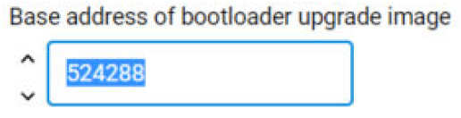
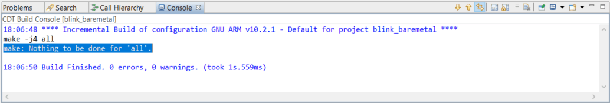
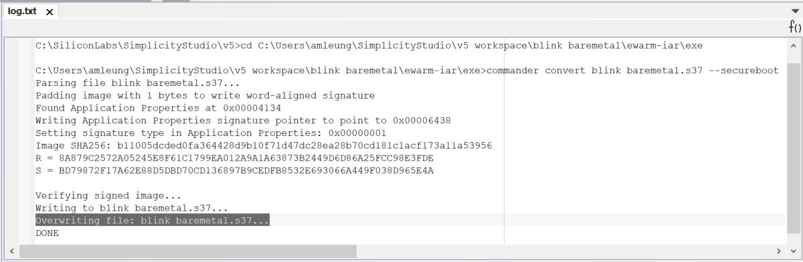

# AN1218: Series 2 Secure Boot with RTSL (Rev. 0.9) <!-- omit in toc -->

本应用笔记介绍了在 Series 2 设备上使用 RTSL（Root of Trust and Secure Loader）进行 Secure Boot 的设计。它还提供了如何实施 Secure Boot 过程的示例。

有关将 Gecko Bootloader 与 Series 2 设备一起使用的更多信息，请参见以下内容：

* *UG103.6: Bootloader Fundamentals*
* *UG266: Silicon Labs Gecko Bootloader User’s Guide for GSDK 3.2 and Lower*
* *UG489: Silicon Labs Gecko Bootloader User’s Guide for GDSK 4.0 and Higher*

# Table of Contents <!-- omit in toc -->

- [1. Series 2 Device Security Features](#1-series-2-device-security-features)
    - [1.1 User Assistance](#11-user-assistance)
    - [1.2 Key Reference](#12-key-reference)
    - [1.3 SE Firmware](#13-se-firmware)
- [2. Secure Boot Process](#2-secure-boot-process)
    - [2.1 Introduction](#21-introduction)
    - [2.2 ECDSA-P256-SHA256 Secure Boot in Series 1 Devices](#22-ecdsa-p256-sha256-secure-boot-in-series-1-devices)
    - [2.3 ECDSA-P256-SHA256 Secure Boot in Series 2 Devices](#23-ecdsa-p256-sha256-secure-boot-in-series-2-devices)
        - [2.3.1 HSE](#231-hse)
        - [2.3.2 VSE](#232-vse)
    - [2.4 Certificate-based Secure Boot in Series 2 Devices](#24-certificate-based-secure-boot-in-series-2-devices)
    - [2.5 Secure Loader](#25-secure-loader)
    - [2.6 Secure Boot Time](#26-secure-boot-time)
    - [2.7 Secure Boot Configuration](#27-secure-boot-configuration)
        - [2.7.1 SSB](#271-ssb)
        - [2.7.2 Application Firmware](#272-application-firmware)
- [3. Examples](#3-examples)
    - [3.1 Overview](#31-overview)
        - [3.1.1 Using Simplicity Commander](#311-using-simplicity-commander)
        - [3.1.2 Using an External Tool](#312-using-an-external-tool)
        - [3.1.3 Using a Platform Example](#313-using-a-platform-example)
        - [3.1.4 Generate Key and Signing](#314-generate-key-and-signing)
    - [3.2 Provision Public Sign Key and Secure Boot Enabling](#32-provision-public-sign-key-and-secure-boot-enabling)
        - [3.2.1 Simplicity Commander](#321-simplicity-commander)
        - [3.2.2 SE Manager Key Provisioning Platform Example](#322-se-manager-key-provisioning-platform-example)
        - [3.2.3 Simplicity Studio](#323-simplicity-studio)
    - [3.3 Provision GBL Decryption Key](#33-provision-gbl-decryption-key)
        - [3.3.1 Simplicity Commander](#331-simplicity-commander)
        - [3.3.2 SE Manager Key Provisioning Platform Example](#332-se-manager-key-provisioning-platform-example)
    - [3.4 Secure Boot](#34-secure-boot)
        - [3.4.1 Generate an Unsigned GBL Image](#341-generate-an-unsigned-gbl-image)
            - [3.4.1.1 AppBuilder](#3411-appbuilder)
            - [3.4.1.2 Bootloader-core Software Component](#3412-bootloader-core-software-component)
        - [3.4.2 Generate an Unsigned Application Image](#342-generate-an-unsigned-application-image)
        - [3.4.3 Signing for ECDSA-P256-SHA256 Secure Boot](#343-signing-for-ecdsa-p256-sha256-secure-boot)
        - [3.4.4 Signing for Certificate-Based Secure Boot](#344-signing-for-certificate-based-secure-boot)
        - [3.4.5 Generate a GBL Upgrade Image File](#345-generate-a-gbl-upgrade-image-file)
        - [3.4.6 Upload a GBL Upgrade Image File](#346-upload-a-gbl-upgrade-image-file)
    - [3.5 Upgrade to Certificate-Based Secure Boot](#35-upgrade-to-certificate-based-secure-boot)
    - [3.6 Certificate Revocation](#36-certificate-revocation)
    - [3.7 Upgrade to Secure Boot with RTSL](#37-upgrade-to-secure-boot-with-rtsl)
    - [3.8 Recover Devices when Secure Boot Fails](#38-recover-devices-when-secure-boot-fails)
- [4. Debugging on Secure Boot Enabled Device](#4-debugging-on-secure-boot-enabled-device)
    - [4.1 Simplicity IDE](#41-simplicity-ide)
    - [4.2 IAR](#42-iar)
- [5. Failure Analysis](#5-failure-analysis)
- [6. Revision History](#6-revision-history)

# 1. Series 2 Device Security Features

保护物联网设备免受安全威胁是优质产品的一个着重点。Silicon Labs 提供了多种安全选项来帮助开发人员构建安全设备、安全应用软件和安全通信路径来管理这些设备。通过引入包含 Secure Engine 的 Series 2 产品，Silicon Labs 的安全性供给得到了显著的增强。Secure Engine 是一个防篡改组件，用于安全地存储敏感数据和密钥并执行加密功能和安全服务。

在 Series 1 设备上，安全特性由 TRNG（如果可用）和 CRYPTO 外设实现。

在 Series 2 设备上，安全特性由 Secure Engine 和 CRYPTOACC（如果可用）实现。Secure Engine 可以是基于硬件的，也可以是虚拟的（基于软件的）。在本文档中，使用了以下缩写：

* HSE - Hardware Secure Engine
* VSE - Virtual Secure Engine
* SE - Secure Engine (either HSE or VSE)

Secure Vault 提供了额外的安全特性。根据部件和 SE 实现，可提供三个级别的 Secure Vault 特性支持，如下表所示：

| Level (1)               | SE Support         | Part (2)                                             |
| :---------------------- | :----------------- | :--------------------------------------------------- |
| Secure Vault High (SVH) | HSE only (HSE-SVH) | Refer to UG103.05 for details on supporting devices. |
| Secure Vault Mid (SVM)  | HSE (HSE-SVM)      | "                                                    |
| "                       | VSE (VSE-SVM)      | "                                                    |
| Secure Vault Base (SVB) | N/A                | "                                                    |

**注意** ：

1. 不同的 Secure Vault 级别的特性可以在 [https://www.silabs.com/security](https://www.silabs.com/security) 中找到。
2. [UG103.05](https://www.silabs.com/documents/public/user-guides/ug103-05-fundamentals-security.pdf)

Secure Vault Mid 包含两个核心安全功能：

* Secure Boot：初始引导阶段从一个不可变存储器（如 ROM）执行并且代码在被授权执行之前进行身份验证的过程。
* Secure Debug Access Control：锁定对调试端口的访问以确保操作安全，并在授权的实体需要访问时安全地解锁它们的能力。

Secure Vault High 提供额外的安全选项： 

* Secure Key Storage：通过使用只有 HSE-SVH 知道的根密钥“包裹”或加密密钥来保护加密密钥。 
* Anti-Tamper Protection：一个可配置的模块，用于保护设备免受篡改攻击。 
* Device Authentication：使用安全设备身份证书和数字签名来验证设备通信的来源或目标的功能。

Secure Engine Manager 和其他工具允许用户在测试和制造期间以及设备进入现场后在内部配置和控制他们的设备。

## 1.1 User Assistance

为支持这些产品，Silicon Labs 提供了白皮书、网络研讨会和文档。下表总结了关键的安全文档：

| Document                                                              | Summary                                                                                                                  | Applicability             |
| :-------------------------------------------------------------------- | :----------------------------------------------------------------------------------------------------------------------- | :------------------------ |
| AN1190: Series 2 Secure Debug                                         | How to lock and unlock Series 2 debug access, including background information about the SE                              | Secure Vault Mid and High |
| AN1218: Series 2 Secure Boot with RTSL (this document)                | Describes the secure boot process on Series 2 devices using SE                                                           | Secure Vault Mid and High |
| AN1247: Anti-Tamper Protection Configuration and Use                  | How to program, provision, and configure the anti-tamper module                                                          | Secure Vault High         |
| AN1268: Authenticating Silicon Labs Devices using Device Certificates | How to authenticate a device using secure device certificates and signatures, at any time during the life of the product | Secure Vault High         |
| AN1271: Secure Key Storage                                            | How to securely “wrap” keys so they can be stored in nonvolatile storage.                                                | Secure Vault High         |
| AN1222: Production Programming of Series 2 Devices                    | How to program, provision, and configure security information using SE during device production                          | Secure Vault Mid and High |

## 1.2 Key Reference

公/私密钥对以及其他密钥在整个 Silicon Labs 安全实施过程中使用。由于术语有时会造成混淆，下表列出了密钥名、它们的适用性以及使用它们的文档。

| Key Name                                                | Customer Programmed | Purpose                                                                     | Used in                          |
| :------------------------------------------------------ | :------------------ | :-------------------------------------------------------------------------- | :------------------------------- |
| Public Sign key (Sign Key Public)                       | Yes                 | Secure Boot binary authentication and/or OTA upgrade payload authentication | AN1218 (primary), AN1222         |
| Public Command key (Command Key Public)                 | Yes                 | Secure Debug Unlock or Disable Tamper command authentication                | AN1190 (primary), AN1222, AN1247 |
| OTA Decryption key (GBL Decryption key) aka AES-128 Key | Yes                 | Decrypting GBL payloads used for firmware upgrades                          | AN1222 (primary), UG266/UG489    |
| Attestation key aka Private Device Key                  | No                  | Device authentication for secure identity                                   | AN1268                           |

## 1.3 SE Firmware

Silicon Labs 强烈建议在 Series 2 设备上安装最新的 SE 固件以支持所需的安全特性。请参见 [AN1222](https://www.silabs.com/documents/public/application-notes/an1222-efr32xg2x-production-programming.pdf) 以了解升级 SE 固件的过程，并参见 [UG103.05](https://www.silabs.com/documents/public/user-guides/ug103-05-fundamentals-security.pdf) 以了解随 Series 2 设备和模块一起提供的最新 SE 固件。

# 2. Secure Boot Process

## 2.1 Introduction

Secure Boot 的目的是保护系统行为的完整性。由于系统的行为是由运行在其上的固件定义的，因此 Secure Boot 可确保固件的真实性和完整性。Secure Boot 是一个平台安全的基础组件，没有它，安全存储、安全传输、安全身份和数据机密性等其他安全方面通常会因恶意代码的注入而遭到破坏。

Secure Boot 作为一个过程，在允许运行之前会验证每个固件的真实性和完整性。每个经过身份验证的模块还可以在执行其他模块之前对其进行验证，从而形成一条信任链。如果任何模块未通过安全检查，则不允许运行，并且程序控制通常会在验证模块中停止。在大多数轻量级物联网系统中，Secure Boot 失败的行为会导致设备停止工作，直到可以将经过验证的签名映像加载到设备上。尽管这可能看起来很极端，但它比将智能灯泡重新用于挖掘加密货币，或将智能扬声器重新用作最终用户私人对话的监控设备要好。

信任链中的第一个链环是信任根。这通常是 Secure Boot 链中最薄弱的链环，因为信任根自身没有经过真实性或完整性检查。信任根的安全强度在于它的不变性。最强大的信任根在 ROM 中有其固件来源，并使用同样位于 ROM 中的 Public Sign Key。

Wireless SoC Series 1 和 Series 2 设备均使用一个两阶段的引导设计，包括不可升级的第一阶段信任根和可升级的第二阶段。在 Series 1 设备中，信任根（也称为 First-Stage Bootloader）位于闪存而不是 ROM 中，可升级部分（Main Bootloader）使用 CRC32 校验和检查完整性，但不使用 Public Sign Key 检查真实性。在 Series 2 设备中，信任根在 ROM 中，并且检查可升级部分的完整性和真实性。

使用 RTSL 的 Secure Boot 由 HSE（Hardware Secure Engine）或 Root Mode（VSE）下运行的 Cortex-M33 执行 Root 代码来实现。有关 SE 的更多信息，请参见 [AN1190: Series 2 Secure Debug](https://www.silabs.com/documents/public/application-notes/an1190-efr32-secure-debug.pdf) 中的“*Secure Engine Subsystem*”。

Silicon Labs 提供了 [CPMS（Custom Part Manufacturing Service）](https://www.silabs.com/developers/custom-part-manufacturing-service) 来定制用户的安全特性和设置。

本应用笔记使用以下缩写：

* FSB - First Stage Bootloader
* SSB - Second Stage Bootloader
* GBL - Gecko Bootloader
* RTSL - Root of Trust and Secure Loader
* HSM - Hardware Security Module
* OTP - One-Time Programmable
* WSTK - Wireless Starter Kit
* [GSDK](https://github.com/SiliconLabs/gecko_sdk) - Gecko Software Development Kit
* ECDSA-P256-SHA256 - Elliptic Curve Digital Signature Algorithm aka ECSDA using a P-256 curve and a SHA256 hash
* PEM (`.pem`) - Privacy Enhanced Mail
* DER (`.der`) - Distinguished Encoding Rules

## 2.2 ECDSA-P256-SHA256 Secure Boot in Series 1 Devices

Series 1（SVB）设备的 Secure Boot 过程起始于闪存，通常伴随着 GBL 第一阶段的执行。GBL 的第一阶段检查是否有针对 GBL 第二阶段的升级待决。如果是，则处理第二阶段的升级，然后执行它。否则，它只会执行第二阶段。如果启用了 Secure Boot，GBL 的第二阶段会在执行之前检查 Application 映像的完整性和真实性。如果完整性检查失败，程序控制权将保留在 SSB 中。下图说明了 Series 1 设备上的 Secure Boot 过程。


有关使用 Simplicity Commander 生成和下载签名固件映像的更多信息，请参见 [UG266](https://www.silabs.com/documents/public/user-guides/ug266-gecko-bootloader-user-guide.pdf)/[UG489](https://www.silabs.com/documents/public/user-guides/ug489-gecko-bootloader-user-guide-gsdk-4.pdf) 。

## 2.3 ECDSA-P256-SHA256 Secure Boot in Series 2 Devices

对于 Series 2 设备，SE（Secure Engine）实现了 FSB 以验证和升级 SSB。GBL 实现了 SSB（在 [UG266](https://www.silabs.com/documents/public/user-guides/ug266-gecko-bootloader-user-guide.pdf)/[UG489](https://www.silabs.com/documents/public/user-guides/ug489-gecko-bootloader-user-guide-gsdk-4.pdf) 中也称为 Main Bootloader）来验证和升级 Application 固件。

有关 Series 2 设备中 ECDSA-P256-SHA256 Secure Boot 过程的更多信息，请参见 [UG266](https://www.silabs.com/documents/public/user-guides/ug266-gecko-bootloader-user-guide.pdf)/[UG489](https://www.silabs.com/documents/public/user-guides/ug489-gecko-bootloader-user-guide-gsdk-4.pdf) 和 [ECDSA-P256-SHA256 Secure Boot](#343-signing-for-ecdsa-p256-sha256-secure-boot) 示例中的“Gecko Bootloader Security Features”部分。

**注意** ：可以采用一个两阶段设计来跳过 FSB 与 Application 之间的 SSB。但是，如果放弃了 SSB，那么 Application 将无法升级，并且本应用笔记假定 SSB 存在。

### 2.3.1 HSE

在 HSE-SVM 和 HSE-SVH 设备中，Secure Boot 过程源自安全协处理器（HSE）中包含的 ROM。下图说明了 Series 2 HSE 设备上的 Secure Boot 过程和流程。


### 2.3.2 VSE

在 VSE-SVM 设备中，主机 MCU（Cortex-M33）在复位后假定一个提升的安全状态，并通过源自 ROM 的代码安全地自行引导。下图说明了 Series 2 VSE 设备上的 Secure Boot 过程和流程。


## 2.4 Certificate-based Secure Boot in Series 2 Devices

有关 Series 2 设备中 Certificate-Based Secure Boot 过程的详细信息，请参见 [UG266](https://www.silabs.com/documents/public/user-guides/ug266-gecko-bootloader-user-guide.pdf)/[UG489](https://www.silabs.com/documents/public/user-guides/ug489-gecko-bootloader-user-guide-gsdk-4.pdf) 和 [Certificate-Based Secure Boot](#344-signing-for-certificate-based-secure-boot) 示例中的“*Gecko Bootloader Security Features*”部分。

Certificate-Based Secure Boot 使用密钥委托来最大限度地减少 Private Sign Key 的暴露，从而减少撤销 Public Sign Key 的机会。

如果证书的私钥泄露，那么所有使用该证书编程的设备都将面临风险，直到它们可以使用包含 [更高版本](#36-certificate-revocation) 证书的映像进行更新。

## 2.5 Secure Loader

在 Series 2 设备中，Secure Loader 是预加载到芯片中的固件。Silicon Labs 维护 Secure Loader 并通过安全升级包进行部署。它在功能上等同于 Series 1 设备上的第一阶段 GBL（有关详细信息，请参见 [UG266](https://www.silabs.com/documents/public/user-guides/ug266-gecko-bootloader-user-guide.pdf)/[UG489](https://www.silabs.com/documents/public/user-guides/ug489-gecko-bootloader-user-guide-gsdk-4.pdf) ）。在执行升级操作之前，Secure Loader 会验证暂存映像的真实性和完整性。Secure Loader 要求暂存映像驻留在芯片上，并且暂存映像不得与目标地址范围重叠。源自片外、片外存储、外部 NCP 主机接口或通过 OTA 更新程序生成的固件映像预计将在调用 Secure Loader 执行升级之前由 Application 或 SSB 暂存。


## 2.6 Secure Boot Time

Secure Boot 延长了设备复位的恢复时间。每个身份验证操作的持续时间取决于以下因素：

* 计算相关映像的 SHA-256 摘要（32 字节），它与固件映像的大小成正比。
* 验证上述 SHA-256 摘要的 ECDSA-P256 签名，它与映像大小无关。
* Crypto Engine 的时钟频率，即 VSE 设备中的 HSE 或 CRYPTOACC。

| Authentication   | Enable/Disable          | Duration                                                       |
| :--------------- | :---------------------- | :------------------------------------------------------------- |
| FSB code         | Enable (cannot disable) | FSB code size dependent                                        |
| SSB code         | Disable by default      | SSB code size and SE firmware version dependent                |
| Application code | Disable by default      | Application code size and SSB firmware (GBL) version dependent |

**注意** ：

* 如果使用 [Certificate-Based Secure Boot](#344-signing-for-certificate-based-secure-boot) ，它将因证书验证而延长启动时间。
* 请参见特定于设备的数据手册（如 [EFR32MG21B](https://www.silabs.com/documents/public/data-sheets/efr32mg21b-datasheet.pdf) ），以了解有关 Series 2 设备启动时序的数据。
* 请参见 [2.7 Secure Boot Configuration](#27-secure-boot-configuration) 了解如何启用 SSB 和 Application 代码验证。

## 2.7 Secure Boot Configuration

以下小节介绍如何配置 SSB（GBL）和 Application 固件的 Secure Boot。

### 2.7.1 SSB

在 Series 2 设备中，不可变的 OTP 存储器存储 [Public Sign Key and Secure Boot Enable flag](#32-provision-public-sign-key-and-secure-boot-enabling) 。一旦编程了这些值，用户就无法对其进行更改。一旦提供了 Public Sign Key，它就将在设备的整个生命周期内保持供给该密钥值。一旦启用了 Secure Boot，它就将在设备的整个生命周期内保持启用状态。这两个赋值操作都是 **不可撤销的** 。

用于 Series 2 设备的 Public Sign Key 是 NIST 素数曲线 P-256 上的 ECDSA 密钥对的公共部分。Public Sign Key 是一个客户密钥，并且通常在初始产品制造和设备编程阶段提供。共享相同固件映像的所有产品加载相同的 Public Sign Key 是很常见的。加载到设备中的密钥是公钥，没有保密要求。与该公钥相关联的用于签名固件映像或证书的私钥应当妥善保管，最好保护在 [HSM](#314-generate-key-and-signing) 或等效的密钥存储工具中。

用户可以使用 [Simplicity Commander](#321-simplicity-commander) 、 [SE Manager](#322-se-manager-key-provisioning-platform-example) 或 [Simplicity Studio](#323-simplicity-studio) 来编程 Public Sign Key 并在 SE OTP 中配置 SSB Secure Boot。


### 2.7.2 Application Firmware

用户可以使用 [GBL](#341-generate-an-unsigned-gbl-image) 项目中的 [AppBuilder](#3411-appbuilder) 或 [Bootloader-core software component](#3412-bootloader-core-software-component) 来配置 Application 固件的安全选项。

用户可以通过使用新的自定义设置升级 GBL 来重新配置 Application 固件的 Secure Boot 配置。


# 3. Examples

## 3.1 Overview

下表描述了 Series 2 Secure Boot 的示例。

| Example                                            | Device (Radio Board)              | SE Firmware   | Tool                              |
| :------------------------------------------------- | :-------------------------------- | :------------ | :-------------------------------- |
| Provision Public Sign Key and Secure Boot Enabling | EFR32MG21A010F1024IM32 (BRD4181A) | Version 1.2.9 | Simplicity Commander              |
| "                                                  | EFR32MG21A010F1024IM32 (BRD4181A) | Version 1.2.9 | SE Manager                        |
| "                                                  | EFR32MG21A010F1024IM32 (BRD4181A) | Version 1.2.9 | Simplicity Studio 5               |
| Provision GBL Decryption Key                       | EFR32MG21A010F1024IM32 (BRD4181A) | Version 1.2.9 | Simplicity Commander              |
| "                                                  | EFR32MG21A010F1024IM32 (BRD4181A) | Version 1.2.9 | SE Manager                        |
| Signing for ECDSA-P256-SHA256 Secure Boot          | EFR32MG21A010F1024IM32 (BRD4181A) | Version 1.2.9 | Simplicity Commander              |
| Signing for Certificate-Based Secure Boot          | EFR32MG21A010F1024IM32 (BRD4181A) | Version 1.2.9 | Simplicity Commander              |
| Generate a GBL Upgrade Image File                  | EFR32MG21A010F1024IM32 (BRD4181A) | Version 1.2.9 | Simplicity Commander              |
| Upgrade to Certificate-Based Secure Boot           | EFR32MG21A010F1024IM32 (BRD4181A) | Version 1.2.9 | Simplicity Commander              |
| Certificate Revocation                             | EFR32MG21A010F1024IM32 (BRD4181A) | Version 1.2.9 | Simplicity Commander              |
| Upgrade to Secure Boot with RTSL                   | EFR32MG21A010F1024IM32 (BRD4181A) | Version 1.2.9 | SE Manager & Simplicity Commander |
| Recover Devices when Secure Boot Fails             | EFR32MG21A010F1024IM32 (BRD4181A) | Version 1.2.9 | Simplicity Commander              |

**注意** ：除非在示例中指定，否则这些示例可以应用于其他 Series 2 设备。

### 3.1.1 Using Simplicity Commander

1. 本应用笔记使用 Simplicity Commander v1.12.0。对于其他版本的 Simplicity Commander，过程和控制台输出可能不同。最新版本的 Simplicity Commander 可以在 [https://www.silabs.com/developers/mcu-programming-options](https://www.silabs.com/developers/mcu-programming-options) 处下载。<br>
    ```sh
    commander --version
    ```

    ```
    Simplicity Commander 1v12p0b1057

    JLink DLL version: 7.52d
    Qt 5.12.10 Copyright (C) 2017 The Qt Company Ltd.
    EMDLL Version: 0v17p19b0
    mbed TLS version: 2.16.6

    Emulator found with SN=440048205 USBAddr=0

    DONE
    ```
2. Simplicity Commander 的 CLI（Command Line Interface）由 Simplicity Commander 文件夹中的 `commander.exe` 调用。其针对于 Simplicity Studio 5 的在 Windows 中的位置是 `C:\SiliconLabs\SimplicityStudio\v5\developer\adapter_packs\commander` 。为了方便使用，强烈建议在 Windows 中将 `commander.exe` 的路径添加到系统的 `PATH` 中。
3. 如果通过 USB 连接了多个 WSTK，则必须使用 `--serialno <J-Link serial number>` 选项指定目标 WSTK。
4. 如果 WSTK 处于调试模式 OUT，则必须使用 `--device <device name>` 选项指定目标设备。

有关 Simplicity Commander 的更多信息，请参见 [UG162: Simplicity Commander Reference Guide](https://www.silabs.com/documents/public/user-guides/ug162-simplicity-commander-reference-guide.pdf) 。

### 3.1.2 Using an External Tool

[Secure Boot examples](#34-secure-boot) 使用 **OpenSSL** 对映像文件和证书进行签名。Windows 版本的 OpenSSL 可以在 [https://slproweb.com/products/Win32OpenSSL.html](https://slproweb.com/products/Win32OpenSSL.html) 处下载。本应用笔记使用 OpenSSL Version 1.1.1h (Win64)。

```sh
openssl version
```

```
OpenSSL 1.1.1h 22 Sep 2020
```

OpenSSL 的 CLI 由 OpenSSL 文件夹中的 `openssl.exe` 调用。其在 Windows（Win64）中的位置是 `C:\Program Files\OpenSSL-Win64\bin` 。为了方便使用，强烈建议在 Windows 中将 `openssl.exe` 的路径添加到系统的 `PATH` 中。

### 3.1.3 Using a Platform Example

Simplicity Studio 5 包括用于密钥供给和 Secure Boot 启用的 [SE Manager platform example](https://docs.silabs.com/simplicity-studio-5-users-guide/latest/ss-5-users-guide-getting-started/start-a-project#examples) 。本应用笔记使用 GSDK v3.2.3 的平台示例。其他版本的 GSDK 上的控制台输出可能不同。

有关每个 SE Manager 平台示例的详细信息，请参见相应的 `readme` 文件。该文件还包括创建项目和运行示例的过程。

### 3.1.4 Generate Key and Signing

本节介绍如何生成密钥来为 Secure Boot 签名映像文件或证书。

#### Using Simplicity Commander <!-- omit in toc -->

1. 运行 `util genkey` 命令来生成 ECDSA-P256 Sign Key 对（ `sign_key.pem` 和 `sign_pubkey.pem` ）和  Public Sign Key Token 文件（ `sign_pubkey.txt` ）。Simplicity Commander 可以将 Token 文件（ `sign_pubkey.txt` ）中的 Public Sign Key 编程到 [top page of the main flash](#343-signing-for-ecdsa-p256-sha256-secure-boot) 。<br>
    ```sh
    commander util genkey --type ecc-p256 --privkey sign_key.pem --pubkey sign_pubkey.pem --tokenfile sign_pubkey.txt
    ```

    ```
    Generating ECC P256 key pair...
    Writing private key file in PEM format to sign_key.pem
    Writing public key file in PEM format to sign_pubkey.pem
    Writing EC tokens to sign_pubkey.txt...
    DONE
    ```

    **注意** ：相同的过程可用于为 [Certificate-Based Secure Boot](#344-signing-for-certificate-based-secure-boot) 生成 Bootloader 证书和 Application 证书密钥对。
2. 使用 `convert` 命令和步骤 1 中的 Private Key（如 `sign_key.pem` ）来签名映像文件或证书。有关 Simplicity Commander 签名过程的更多信息，请参见 [3.4.3 Signing for ECDSA-P256-SHA256 Secure Boot](#343-signing-for-ecdsa-p256-sha256-secure-boot) 和 [3.4.4 Signing for Certificate-Based Secure Boot](#344-signing-for-certificate-based-secure-boot) 。

#### Using an HSM and Simplicity Commander <!-- omit in toc -->

1. 用户可以使用 HSM 来生成 ECDSA-P256 Sign Key 对。Private Sign Key 会安全地保存在 HSM 中，Public Sign Key 可以以特定的格式（如 `sign_pubkey.pem` ）导出。<br>
    **注意** ：相同的过程可用于为 [Certificate-Based Secure Boot](#344-signing-for-certificate-based-secure-boot) 生成 Bootloader 证书和 Application 证书密钥对。
2. 使用 `util keytotoken` 命令将步骤 1 中的 Public Sign Key 转换为 Token 格式（ `sign_pubkey.txt` ）。Simplicity Commander 可以将 Token 文件（ `sign_pubkey.txt` ）中的 Public Sign Key 编程到 [top page of the main flash](#343-signing-for-ecdsa-p256-sha256-secure-boot) 。<br>
    ```sh
    commander util keytotoken sign_pubkey.pem --outfile sign_pubkey.txt
    ```

    ```
    Writing EC tokens to sign_pubkey.txt...
    DONE
    ```
3. 使用带 `--extsign` 选项的 `convert` 命令为 HSM 准备未签名的映像或证书。
4. 使用步骤 1 中的 Private Key 为步骤 3 中未签名的映像或证书生成签名。
5. 使用 `convert` 命令和步骤 4 中签名生成签名的映像或证书。有关 HSM 和 Simplicity Commander 签名过程的更多信息，请参见 [3.4.3 Signing for ECDSA-P256-SHA256 Secure Boot](#343-signing-for-ecdsa-p256-sha256-secure-boot) 和 [3.4.4 Signing for Certificate-Based Secure Boot](#344-signing-for-certificate-based-secure-boot) 。<br>
    **注意** ：Simplicity Commander v1.11.0 及以上版本支持 DER 格式签名。旧版本的 Simplicity Commander 只能处理 Raw 格式的签名。

## 3.2 Provision Public Sign Key and Secure Boot Enabling

在 SE OTP 中，Public Sign Key 用于在 Secure Boot 期间验证主机映像签名或证书。在设置 SE OTP 中的 Secure Boot 启用标志之前，用户应该提供此密钥。在 HSE-SVH 设备上，用户需要使用 Secure Boot 设置来配置 [anti-tamper protection configuration](https://www.silabs.com/documents/public/application-notes/an1247-efr32-secure-vault-tamper.pdf) 。

如果用户使用 Secure Boot 设置 [SECURE_BOOT_ANTI_ROLLBACK](#321-simplicity-commander) 选项，则 SE 将在 SE 闪存中存储 GBL（SSB）的反回滚版本计数器（4 字节），并在升级和每次引导时检查 Bootloader 版本。该版本计数器达到最大值（Bootloader 无法再升级）时不会回滚到 0。反回滚不会阻止将一个旧的已签名 GBL hex 映像刷入到设备。

下表描述了启用或禁用 `SECURE_BOOT_ANTI_ROLLBACK` 时，已签名 GBL 上的反回滚保护。

* GBL 在通过 [GBL upgrade image file](#345-generate-a-gbl-upgrade-image-file) （ `.gbl` ）升级 GBL 时处理反回滚保护。
* SE 在引导 GBL 时处理反回滚保护（如果启用了 `SECURE_BOOT_ANTI_ROLLBACK` ）。

| Action                         | SECURE_BOOT_ANTI_ROLLBACK Disable                            | SECURE_BOOT_ANTI_ROLLBACK Enable                                                                      |
| :----------------------------- | :----------------------------------------------------------- | :---------------------------------------------------------------------------------------------------- |
| Use a GBL upgrade image file   | Reject upgrade if an equal or lower GBL version is detected. | Reject upgrade if an equal or lower GBL version is detected.                                          |
| Flash and boot a GBL hex image | Accept to flash and boot regardless of the GBL version.      | Accept to flash regardless of the GBL version. But it cannot boot if a lower GBL version is detected. |

**注意** ：如果启用了 SE OTP 中的 [SECURE_BOOT_PAGE_LOCK_NARROW](#321-simplicity-commander) 或 [SECURE_BOOT_PAGE_LOCK_FULL](#321-simplicity-commander) 选项，那么需要在将 GBL hex 映像（ `.s37` ）刷写到设备之前执行一个批量擦除（ `commander device masserase` 或 `commander security erasedevice` 然后重置）。

为简单起见，本应用笔记中的 [Secure Boot examples](#34-secure-boot) 未启用以下 Secure Boot 选项。

* `SECURE_BOOT_PAGE_LOCK_NARROW`
* `SECURE_BOOT_PAGE_LOCK_FULL`

### 3.2.1 Simplicity Commander

以下过程假定所需文件位于同一文件夹中。

1. 按照 [3.1.4 Generate Key and Signing](#314-generate-key-and-signing) 中的步骤生成 ECDSA-P256 Sign Key 对（ `sign_key.pem` 和 `sign_pubkey.pem` ）和 Public Sign Key token 文件（ `sign_pubkey.txt` ）。
2. 运行 `security writekey` 命令来提供 Public Sign Key（ `sign_pubkey.pem` ）。Public Sign Key 一旦写入就无法更改。
    ```sh
    commander security writekey --sign sign_pubkey.pem --device EFR32MG21A010F1024 --serialno 440048205
    ```

    ```
    Device has serial number 000000000000000014b457fffe045b21
    ================================================================================
    Please look through any warnings before proceeding.
    THIS IS A ONE-TIME command, all code to be run on the device must be signed by this key.
    Type 'continue' and hit enter to proceed or Ctrl-C to abort:
    ================================================================================
    continue
    DONE
    ```
3. 运行 `security readkey` 命令以使用 token 文件（ `sign_pubkey.txt` ）中的 Public Sign Key 来验证 Public Sign Key。
    ```sh
    commander security readkey --sign --device EFR32MG21A010F1024 --serialno 440048205
    ```

    ```
    C4AF4AC69AAB9512DB50F7A26AE5B4801183D85417E729A56DA974F4E08A562C
    DE6019DEA9411332DC1A743372D170B436238A34597C410EA177024DE20FC819
    DONE
    ```
4. 对于 Series 2 VSE 设备（如 EFR32MG22C224F512IM40），运行 `flash` 命令以将 token 文件（ `sign_pubkey.txt` ）中的 Public Sign Key 编程到主闪存的首页以用于 [ECDSA-P256-SHA256 Secure Boot](#343-signing-for-ecdsa-p256-sha256-secure-boot) 。这在 Series 2 HSE 设备上是可选的。
    ```sh
    commander flash --tokengroup znet --tokenfile sign_pubkey.txt --device EFR32MG22C224F512IM40 --serialno 440048205
    ```

    ```
    Writing 8192 bytes starting at address 0x0007e000
    Comparing range 0x0007E000 - 0x0007FFFF (8 KiB)
    Programming range 0x0007E000 - 0x0007FFFF (8 KiB)
    DONE
    ```

    **注意** ：MCU Series 2 设备（如 EFM32PG22C200F512IM40）需要 Simplicity Commander Version 1.12.2 或更高版本才能支持 `flash --tokengroup znet` 命令。
5. 运行 `security genconfig` 命令以生成用于 Secure Boot 的 `user_configuration.json` 文件。
    ```sh
    commander security genconfig --nostore --outfile user_configuration.json --device EFR32MG21A010F1024 --serialno 440048205
    ```

    ```
    DONE
    ```

    | Name                           | Description                                                                                                                                                                                                                                                                                                             |
    | :----------------------------- | :---------------------------------------------------------------------------------------------------------------------------------------------------------------------------------------------------------------------------------------------------------------------------------------------------------------------- |
    | SECURE_BOOT_ENABLE             | If set, verifies the host image on the Cortex-M33 before releasing the Cortex-M33 from reset.                                                                                                                                                                                                                           |
    | SECURE_BOOT_VERIFY_CERTIFICATE | If set, requires certificate-based signing of the host image.                                                                                                                                                                                                                                                           |
    | SECURE_BOOT_ANTI_ROLLBACK      | If set, prevents secure upgrading to a host image with a lower version than the image that is currently stored in flash.                                                                                                                                                                                                |
    | SECURE_BOOT_PAGE_LOCK_NARROW   | If set, locks flash pages that have been validated by the Secure Boot process to prevent re-flashing by other means than through the SE. Write/erase locks pages from 0 through the page where the Secure Boot host image signature is located, not including the last page if the signature is not on a page boundary. |
    | SECURE_BOOT_PAGE_LOCK_FULL     | If set, locks flash pages that have been validated by the Secure Boot process to prevent re-flashing by other means than through the SE. Write/erase locks pages from 0 through the page where the Secure Boot host image signature is located, including the last page if the signature is not on a page boundary.     |

    **注意** ：主机映像是设备闪存起始地址中的固件。通常是 GBL。
6. 使用文本编辑器将默认的 Secure Boot 设置修改为本应用笔记中使用的所需配置。<br>
     <br>
    **注意** ：如果 `SECURE_BOOT_ENABLE` 为 false，则 SE 将忽略其他四个选项，无论它们是 true 还是 false。EFR32xG23 和未来的 Series 2 设备不允许将此设置编程到 SE OTP。
7. 运行 `security writeconfig` 命令将 Secure Boot 配置编程到 SE OTP。用户可以为每个设备执行一次此命令。
    ```sh
    commander security writeconfig --configfile user_configuration.json --device EFR32MG21A010F1024 --serialno 440048205
    ```

    ```
    ================================================================================
    THIS IS A ONE-TIME configuration: Please inspect file before confirming:
    user_configuration.json
    Type 'continue' and hit enter to proceed or Ctrl-C to abort:
    ================================================================================
    continue
    DONE
    ```
8. 运行 `security readconfig` 命令查看设备的 Secure Boot 配置。
    ```sh
    commander security readconfig --serialno 440048205
    ```
    

### 3.2.2 SE Manager Key Provisioning Platform Example

点击 `View Project Documentation` 链接以打开 `readme` 文件。


1. 将 `app_process.c` 中 `public_sign_key[PUB_KEY_SIZE]` 数组中默认的 Public Sign Key 修改为所需的值。
    ```c
    /// Public sign key
    SL_ALIGN(4) static const uint8_t public_sign_key[PUB_KEY_SIZE] = {
      0xc4, 0xaf, 0x4a, 0xc6, 0x9a, 0xab, 0x95, 0x12,
      0xdb, 0x50, 0xf7, 0xa2, 0x6a, 0xe5, 0xb4, 0x80,
      0x11, 0x83, 0xd8, 0x54, 0x17, 0xe7, 0x29, 0xa5,
      0x6d, 0xa9, 0x74, 0xf4, 0xe0, 0x8a, 0x56, 0x2c,
      0xde, 0x60, 0x19, 0xde, 0xa9, 0x41, 0x13, 0x32,
      0xdc, 0x1a, 0x74, 0x33, 0x72, 0xd1, 0x70, 0xb4,
      0x36, 0x23, 0x8a, 0x34, 0x59, 0x7c, 0x41, 0x0e,
      0xa1, 0x77, 0x02, 0x4d, 0xe2, 0x0f, 0xc8, 0x19
    };
    ```
2. 将 `app_se_manager_key_provisioning.c` 中 `init_se_otp_conf()` 函数中的默认 Secure Boot 设置修改为所需的配置。
    ```c
    // Overwrite secure boot options in SL_SE_OTP_INIT_DEFAULT if necessary.
    otp_init.enable_secure_boot = true;
    otp_init.verify_secure_boot_certificate = false;
    otp_init.enable_anti_rollback = true;
    otp_init.secure_boot_page_lock_narrow = false;
    otp_init.secure_boot_page_lock_full = false;
    ```
    **注意** ：如果 `enable_secure_boot` 为 false，SE 将忽略其他四个选项，无论它们是 true 还是 false。EFR32xG23 和未来的 Series 2 设备不允许将此设置编程到 SE OTP。
3. 如果设备中存在 GBL，请按照 [3.4.2 Generate an Unsigned Application Image](#342-generate-an-unsigned-application-image) 中的步骤生成未签名的 Application 映像。
4. 构建项目并运行 Application。如果需要一个已签名的 Application 映像，请按照 [3.4.3 Signing for ECDSA-P256-SHA256 Secure Boot](#343-signing-for-ecdsa-p256-sha256-secure-boot) 或 [3.4.4 Signing for Certificate-Based Secure Boot](#344-signing-for-certificate-based-secure-boot) 中的过程进行操作。
5. 然后按下 `SPACE` 跳过 AES-128 密钥的编程（仅限 HSE 设备）。可选地按下 `ENTER` 将硬编码的 [GBL Decryption Key](#332-se-manager-key-provisioning-platform-example) 编程到 HSE OTP。
    ```
    SE Manager Key Provisioning Example - Core running at 38000 kHz.
      . SE manager initialization... SL_STATUS_OK (cycles: 9 time: 0 us)

      . Get current SE firmware version... SL_STATUS_OK (cycles: 3578 time: 94 us)
      + Current SE firmware version (MSB..LSB): 00010209

      . Read SE OTP configuration... SL_STATUS_COMMAND_IS_INVALID (cycles: 3908 time: 102 us)

      . Press ENTER to program 128-bit AES key in SE OTP or press SPACE to skip.

      . Encrypt 16 bytes plaintext with 128-bit AES OTP key... SL_STATUS_FAIL (cycles: 4627 time: 121 us)

      . Press ENTER to program public sign key in SE OTP or press SPACE to skip.
    ```
6. 按下 `ENTER` 将硬编码的 Public Sign Key 编程到 SE OTP。
    ```
    + Warning: The public sign key in SE OTP cannot be changed once written!
    + Press ENTER to confirm or press SPACE to skip if you are not sure.
    ```
7. 按下 `ENTER` 确认操作。如果 Public Sign Key 已存在于 SE OTP 中，则 SE 返回 `SL_STATUS_INVALID_PARAMETER` 。
    ```
    . Initialize public sign key... SL_STATUS_OK (cycles: 56052 time: 1475 us)

    . Get public sign key... SL_STATUS_OK (cycles: 8450 time: 222 us)
    + The public sign key (64 bytes):
      C4 AF 4A C6 9A AB 95 12 DB 50 F7 A2 6A E5 B4 80
      11 83 D8 54 17 E7 29 A5 6D A9 74 F4 E0 8A 56 2C
      DE 60 19 DE A9 41 13 32 DC 1A 74 33 72 D1 70 B4
      36 23 8A 34 59 7C 41 0E A1 77 02 4D E2 0F C8 19
    
    . Press ENTER to program public command key in SE OTP or press SPACE to skip.
    ```

    ```
    . Initialize public sign key... SL_STATUS_INVALID_PARAMETER (cycles: 4375 time: 115 us)
    
    . Get public sign key... SL_STATUS_OK (cycles: 8435 time: 221 us)
    + The public sign key (64 bytes):
      C4 AF 4A C6 9A AB 95 12 DB 50 F7 A2 6A E5 B4 80
      11 83 D8 54 17 E7 29 A5 6D A9 74 F4 E0 8A 56 2C
      DE 60 19 DE A9 41 13 32 DC 1A 74 33 72 D1 70 B4
      36 23 8A 34 59 7C 41 0E A1 77 02 4D E2 0F C8 19
    
    . Press ENTER to program public command key in SE OTP or press SPACE to skip.
    ```
8. 按下 `SPACE` 跳过 Public Command Key 的编程。可选地按下 `ENTER` 将硬编码的 Public Command Key 编程到 SE OTP。
    ```
    . Get public command key... SL_STATUS_FAIL (cycles: 4126 time: 108 us)
    . Press ENTER to initialize SE OTP for secure boot configuration or press SPACE to skip.
    ```
9. 按下 `ENTER` 以编程 Secure Boot 配置。
    ```
    + Warning: The SE OTP configuration cannot be changed once written!
    + Press ENTER to confirm or press SPACE to skip if you are not sure.
    ```
10. 按下 `ENTER` 确认操作。如果步骤 2 中的无效设置或 Secure Boot 配置已编程到 SE OTP 中，则 SE 返回 `SL_STATUS_COMMAND_IS_INVALID` 。
    ```
    . Initialize SE OTP... SL_STATUS_OK (cycles: 267256 time: 7033 us)
    + Read SE OTP configuration... SL_STATUS_OK (cycles: 6865 time: 180 us)
    + Secure boot                    : Enabled
    + Secure boot verify certificate : Disabled
    + Secure boot anti-rollback      : Enabled
    + Secure boot page lock narrow   : Disabled
    + Secure boot page lock full     : Disabled

    . SE manager deinitialization... SL_STATUS_OK (cycles: 5 time: 0 us)
    ```

    ```
    . Initialize SE OTP... SL_STATUS_COMMAND_IS_INVALID (cycles: 3989 time: 104 us)

    . SE manager deinitialization... SL_STATUS_OK (cycles: 5 time: 0 us)
    ```

### 3.2.3 Simplicity Studio

安全操作在 Simplicity Studio 的 Security Settings 中执行。本应用笔记使用 Simplicity Studio v5.2.3.1。Simplicity Studio 5 其他版本的步骤和图片可能有所不同。

1. 右键所选的调试适配器 **RB (ID:J-Link serial number)** 以显示上下文菜单。<br>
2. 点击 **Device configuration...** 以打开 **Configuration of device: J-Link Silicon Labs (serial number)** 对话框。点击 **Security Settings** 标签页以获取所选设备的配置。<br>
3. 点击右上角的 **[Start Provisioning Wizard...]** 以弹出 **Secure Initialization** 对话框。建议勾选 **Enable Version Rollback Prevention of Host Image** 选项。 **Verify intermediate certificate before secure boot** 选项适用于 [Certificate-Based Secure Boot](#344-signing-for-certificate-based-secure-boot) 。<br><br>**注意** ：[SECURE_BOOT_PAGE_LOCK_NARROW](#321-simplicity-commander) 和 [SECURE_BOOT_PAGE_LOCK_FULL](#321-simplicity-commander) 选项在 Simplicity Studio 中尚不可用。
4. 点击 **\[Next >\]** 。将显示 **Security Keys** 对话框。<br>
5. 选中 **Enable Writing Sign Key** 将自动启用 Secure Boot。这将显示以下 **Secure Boot Warning** 。点击 **\[Yes\]** 以确认。<br>
6. 打开 [Public Sign Key](#343-signing-for-ecdsa-p256-sha256-secure-boot) token 文件（ `sign_pubkey.txt` ）。
    ```
    MFG_SIGNED_BOOTLOADER_KEY_X : 997011ED1708580BD4A6B7F8AD6EE19B0B8722611FB76A3A5702D5141180E101
    MFG_SIGNED_BOOTLOADER_KEY_Y : 0AC8673C8ACC26EE2B534C004F4A4B7EBBC23D04506DD66E3EF0DDC81E3CA55E
    ```
7. 将 Public Sign Key（先是 X-point `9970...` ，然后是 Y-point `0AC8...` ）复制到 **Sign Key:** 下的 **Key:** 输入框中。<br>
8. 点击 **\[Next >\]** 。将显示 **Secure Locks** 对话框。启用 Secure Boot 时，默认情况下不设置 **Debug Locks** 。有关这些锁的更多信息，请参见 [AN1190: Series 2 Secure Debug](https://www.silabs.com/documents/public/application-notes/an1190-efr32-secure-debug.pdf) 。<br>
9. 点击 **\[Next >\]** 以显示 **Summary** 对话框。<br>
10. 如果显示的信息正确，请点击 **\[Provision\]** 。点击 **\[Yes\]** 以进行确认。Public Sign Key 和 Secure Boot 配置一旦写入就无法更改。<br>
11. **Summary** 对话框会显示 **Provisioning Status** 。<br>
12. 点击 **\[Done\]** 以退出供应过程。现在设备配置已更新。

## 3.3 Provision GBL Decryption Key

GBL Decryption Key 用于在固件升级期间解密 [GBL upgrade image file](#345-generate-a-gbl-upgrade-image-file) 的有效负载。用户应在启用 [3.4.1.1 AppBuilder](#3411-appbuilder) 或 [3.4.1.2 Bootloader-core Software Component](#3412-bootloader-core-software-component) 中的 **Require encrypted firmware upgrade files** 选项之前提供此密钥。

下图和表格描述了两个（VSE）或三个（HSE）选项以选择用于 GBL 升级映像文件（Bootloader、SE 或 Application）解密的 GBL Decryption Key。


| Option for GBL Decryption Key Selection                                                   | GBL Decryption Key Storage                                                                                                                                                                  |
| :---------------------------------------------------------------------------------------- | :------------------------------------------------------------------------------------------------------------------------------------------------------------------------------------------ |
| 1. Use symmetric key stored in Secure Element storage (HSE devices only and GSDK ≥ v3.0). | The 128-bit symmetric key stored in HSE OTP is used for GBL upgrade image file decryption.                                                                                                  |
| 2. Use symmetric key stored in Application Properties Struct (GSDK ≥ v4.1).               | The 128-bit symmetric key stored in the GBL Application Properties Struct is used for GBL upgrade image file decryption. The key is stored in the Secure flash if TrustZone is implemented. |
| 3. Default storage if none of the above options are selected.                             | The 128-bit symmetric key stored on the top page of the main flash is used for GBL upgrade image file decryption. The key is stored in the Non-secure flash if TrustZone is implemented.    |

**注意** ：

* 选项 2 要求 GSDK v4.1 或更高版本中的 `ApplicationProperties_t` 结构 v1.2 或更高版本（在 Windows 文件夹 `C:\Users\<PC USER NAME>\SimplicityStudio\SDKs\gecko_sdk\platform\bootloader\api` 中的 `application_properties.h` 中定义）来存储 GBL Decryption Key。
    ```c
    /// Major version number of the AppliationProperties_t struct
    #define APPLICATION_PROPERTIES_VERSION_MAJOR (1UL)
    /// Minor version number of the AppliationProperties_t struct
    #define APPLICATION_PROPERTIES_VERSION_MINOR (2UL)
    ```

    ```c
    /// Application Properties struct
    typedef struct {
      /// @brief Magic value indicating this is an ApplicationProperties_t struct.
      /// Must equal @ref APPLICATION_PROPERTIES_MAGIC
      uint8_t magic[16];
      /// Version number of this struct
      uint32_t structVersion;
      /// Type of signature this application is signed with
      uint32_t signatureType;
      /// Location of the signature. Typically points to the end of the application
      uint32_t signatureLocation;
      /// Information about the application
      ApplicationData_t app;
      /// Pointer to information about the certificate
      ApplicationCertificate_t *cert;
      /// Pointer to Long Token Data Section
      uint8_t *longTokenSectionAddress;
      /// Parser Decryption Key
      const uint8_t decryptKey[16];
    } ApplicationProperties_t;
    ```
* 在为 [ECDSA-P256-SHA256](#343-signing-for-ecdsa-p256-sha256-secure-boot) 或 [Certificate-Based](#344-signing-for-certificate-based-secure-boot) 签名 GBL 映像之前，必须实施选项 2。
* GBL Decryption Key 的选项是互斥的。将选择两个（VSE）或三个（HSE）密钥存储之一进行解密。
* 从安全的角度来看，强烈建议为 HSE 设备使用或升级到选项 1，为 VSE 设备使用或升级到选项 2。
* 如果所选选项中的 GBL Decryption Key 被泄露，一个简单的方法是使用新的 GBL Decryption Key 将 GBL 升级到选项 2（如果现有选项为 1 或 3）。

### 3.3.1 Simplicity Commander

以下过程描述了如何为以下选项编程 GBL Decryption Key。所有过程均假定所需文件位于同一文件夹中。

* 使用存储在 Secure Element 存储中的对称密钥（仅限 HSE 设备且 GSDK ≥ v3.0）
* 使用存储在 Application Properties Struct 中的对称密钥（GSDK ≥ v4.1）
* 主闪存首页上的默认存储

1. 生成一个 128 位 Symmetric Key<br>运行 `util genkey` 以生成 GBL Decryption Key 的 token 文件。
    ```sh
    commander util genkey --type aes-ccm --outfile aes_key.txt
    ```

    ```
    Using Windows' Cryptographic random number generator
    DONE
    ```

    `aes_key.txt` 包含随机生成的 AES-128 密钥。使用文本编辑器将 `aes _key.txt` 中随机生成的密钥替换为所需的 GBL Decryption Key，如下所示。

    ```
    # Key randomly generated by 'util genkey'
    TOKEN_MFG_SECURE_BOOTLOADER_KEY: 81A5E21FA15286F1DF445C2CC120FA3F
    ```
2. （ **使用存储在 Secure Element 存储中的对称密钥** ）运行 `security writekey` 以提供 GBL Decryption Key。GBL Decryption Key 一旦写入便无法更改。
    ```sh
    commander security writekey --decrypt aes_key.txt --device EFR32MG21A010F1024 --serialno 440030580
    ```

    ```
    Device has serial number 0000000000000000000d6ffffead3d94
    ================================================================================
    Please look through any warnings before proceeding.
    THIS IS A ONE-TIME command, any encrypting of GBL files must be done with this key.
    Type 'continue' and hit enter to proceed or Ctrl-C to abort:
    ================================================================================
    continue
    DONE
    ```

    **注意** ：它不能从 HSE OTP 中读回 GBL Decryption Key。
3. （ **使用存储在 Application Properties Struct 中的对称密钥** ）运行 `convert` 命令将 GBL Decryption Key 编程到 GBL 的 `Application Properties Struct`。
    ```sh
    commander convert bootloader-uart-xmodem.s37 --aeskey aes_key.txt --outfile bootloader-uart-xmodem.s37
    ```

    ```
    Parsing file bootloader-uart-xmodem.s37...
    Writing to bootloader-uart-xmodem.s37...
    Overwriting file: bootloader-uart-xmodem.s37...
    DONE
    ```

    **注意** ：
    
    * `convert` 命令中的 `--aeskey` 选项需要 **Simplicity Commander v1.12.3 或更高版本** 。
    * GBL Decryption Key 只能添加到具有 `Application Properties Struct` v1.2 或更高版本的 GBL。
4. （ **主闪存首页上的默认存储** ）运行 `flash` 命令将 token 文件中的 GBL Decryption Key 编程到主闪存的首页。
    ```sh
    commander flash --tokengroup znet --tokenfile aes_key.txt --device EFR32MG21A010F1024 --serialno 440030580
    ```
    
    ```
    Writing 8192 bytes starting at address 0x000fe000
    Comparing range 0x000FE000 - 0x000FFFFF (8 KB)
    Programming range 0x000FE000 - 0x000FFFFF (8 KB)
    DONE
    ```

    **注意** ：MCU Series 2 VSE 设备（如 EFM32PG22C200F512IM40）需要 Simplicity Commander Version 1.12.2 或更高版本才能支持 `flash --tokengroup znet` 命令。

### 3.3.2 SE Manager Key Provisioning Platform Example

此示例仅适用于 HSE 设备的 [option 1](#33-provision-gbl-decryption-key) 。点击 `View Project Documentation` 链接以打开 `readme` 文件。


1. 将 `app_process.c` 中 `aes_key[16]` 数组中默认的 GBL Decryption Key 修改为需要的值。
    ```c
    /// 128-bit AES key
    SL_ALIGN(4) static const uint8_t aes_key[16] = {
      0x81, 0xa5, 0xe2, 0x1f, 0xa1, 0x52, 0x86, 0xf1,
      0xdf, 0x44, 0x5c, 0x2c, 0xc1, 0x20, 0xfa, 0x3f
    };
    ```
2. 将 `app_process.c` 中的 `ciphertext[16]` 数组修改为 AES ECB 在 16 字节零明文上的预期密文以验证步骤 1 中的 GBL Decryption Key。
    ```c
    /// Ciphertext to verify 128-bit AES key
    static const uint8_t ciphertext[16] = {
      0x66, 0xd2, 0x0f, 0x99, 0x65, 0x3e, 0xa8, 0xd0,
      0x83, 0x05, 0xa6, 0x39, 0xd4, 0x4e, 0x98, 0xa6
    };
    ```
3. 如果设备中已存在 GBL，请按照 [3.4.2 Generate an Unsigned Application Image](#342-generate-an-unsigned-application-image) 中的步骤生成未签名的 Application 映像。
4. 构建项目并运行 Application。如果需要一个已签名的 Application 映像，请按照 [3.4.3 Signing for ECDSA-P256-SHA256 Secure Boot](#343-signing-for-ecdsa-p256-sha256-secure-boot) 或 [3.4.4 Signing for Certificate-Based Secure Boot](#344-signing-for-certificate-based-secure-boot) 中的过程进行操作。
5. 然后按下 `ENTER` 将硬编码的 GBL Decryption Key 编程到 HSE OTP。
    ```
    SE Manager Key Provisioning Example - Core running at 38000 kHz.
      . SE manager initialization... SL_STATUS_OK (cycles: 9 time: 0 us)

      . Get current SE firmware version... SL_STATUS_OK (cycles: 3578 time: 94 us)
      + Current SE firmware version (MSB..LSB): 00010209

      . Read SE OTP configuration... SL_STATUS_COMMAND_IS_INVALID (cycles: 3908 time: 102 us)

      . Press ENTER to program 128-bit AES key in SE OTP or press SPACE to skip.
      + Warning: The 128-bit AES key in SE OTP cannot be changed once written!
      + Press ENTER to confirm or press SPACE to skip if you are not sure.
    ```
6. 按下 `ENTER` 以确认操作。该程序返回 `SL_STATUS_OK` 或 `SL_STATUS_INVALID_PARAMETER` （已存在）并执行 AES ECB 加密以验证 HSE OTP 中的 GBL Decryption Key。
    ```
    . Initialize 128-bit AES key... SL_STATUS_OK (cycles: 39059 time: 1027 us)

    . Encrypt 16 bytes plaintext with 128-bit AES OTP key... SL_STATUS_OK (cycles: 11013 time: 289 us)
    + Compare encrypted message with expected ciphertext... OK

    . Press ENTER to program public sign key in SE OTP or press SPACE to skip.
    ```

    ```
    . Initialize 128-bit AES key... SL_STATUS_INVALID_PARAMETER (cycles: 4474 time: 117 us)

    . Encrypt 16 bytes plaintext with 128-bit AES OTP key... SL_STATUS_OK (cycles: 11001 time: 289 us)
    + Compare encrypted message with expected ciphertext... OK

    . Press ENTER to program public sign key in SE OTP or press SPACE to skip.
    ```
7. 按下 `SPACE` 以跳过 Public Sign Key 的编程。
    ```
    . Get public sign key... SL_STATUS_FAIL (cycles: 4126 time: 108 us)
    
    . Press ENTER to program public command key in SE OTP or press SPACE to skip.
    ```
8. 按下 `SPACE` 以跳过 Public Command Key 的编程。
    ```
    . Get public command key... SL_STATUS_FAIL (cycles: 4126 time: 108 us)
    
    . Press ENTER to initialize SE OTP for secure boot configuration or press SPACE to skip.
    ```
9. 按下 `SPACE` 以跳过 Secure Boot 配置的编程。
    ```
    . SE manager deinitialization... SL_STATUS_OK (cycles: 10 time: 0 us)
    ```

## 3.4 Secure Boot

用户通常不应在开发阶段启用 Secure Boot 以避免 [debugging](#4-debugging-on-secure-boot-enabled-device) 冲突。Secure Boot 在接近固件发布时启用，并使用以下部分来验证配置和系统功能。

### 3.4.1 Generate an Unsigned GBL Image

通过 GBL 项目配置 Application 固件有两种方法。

1. 在 **GSDK v3.2 及更低版本** 中使用 [AppBuilder](#3411-appbuilder) （ `.isc` 文件）。
2. 在 **GSDK v4.0 及更高版本** 中使用 [Bootloader-core Software Component](#3412-bootloader-core-software-component) （ `.slcp` 文件）。

以下说明适用于 AppBuilder 和 Bootloader-core Software Component。

* 对于 [ECDSA-P256-SHA256 Secure Boot](#343-signing-for-ecdsa-p256-sha256-secure-boot) ，必须在 VSE 设备上启用 **Allow use of public key from manufacturing token storage** 选项（无法在 AppBuilder 中禁用，并且这已在 Bootloader-core Software Component 中废弃）。如果 Public Sign Key 已在 OTP 中提供，HSE 设备将忽略此默认启用选项。
* 如果启用了 **Enable application rollback protection** 选项（GSDK ≥ v3.0），GBL 会将 Application 版本计数器存储在 Bootloader 闪存空间的末尾。GBL 会在升级期间和每次引导时检查 Application 版本。防回滚不会阻止将较旧的 Application 映像刷写到设备。
* **Minimum application version allowed** 选项（GSDK ≥ v3.0）配置允许引导的最低 Application 版本。此选项维护在升级 GBL 后将重置为 0 的 Application 版本计数器。
* 如果启用了 SE OTP 中的 [SECURE_BOOT_PAGE_LOCK_FULL](#321-simplicity-commander) ，则 `Enable application rollback protection` 选项不适用。有关 Application 回滚保护的详细信息，请参见 [UG266](https://www.silabs.com/documents/public/user-guides/ug266-gecko-bootloader-user-guide.pdf)/[UG489](https://www.silabs.com/documents/public/user-guides/ug489-gecko-bootloader-user-guide-gsdk-4.pdf) （适用于 GSDK v3.2 及更低版本）或 [UG489](https://www.silabs.com/documents/public/user-guides/ug489-gecko-bootloader-user-guide-gsdk-4.pdf) （适用于 GSDK v4.0 及更高版本）中的“Secure Boot with Application Rollback Protection”章节。
* GBL 大小和起始地址取决于设备。有关 Series 2 设备上 Bootloader 大小和起始地址的更多信息，请参见 [UG103.6: Bootloader Fundamentals](https://www.silabs.com/documents/public/user-guides/ug103-06-fundamentals-bootloading.pdf) 中的“Memory Space For Bootloading”章节。

GBL 升级映像文件上的 **Require signed firmware upgrade files** 和 **Require encrypted firmware upgrade files** 选项参见 [3.4.5 Generate a GBL Upgrade Image File](#345-generate-a-gbl-upgrade-image-file) 。为了简单起见，本应用笔记中的 Secure Boot 示例不启用这些选项。有关这些选项的信息，请参见 [UG266](https://www.silabs.com/documents/public/user-guides/ug266-gecko-bootloader-user-guide.pdf)/[UG489](https://www.silabs.com/documents/public/user-guides/ug489-gecko-bootloader-user-guide-gsdk-4.pdf)/[UG489](https://www.silabs.com/documents/public/user-guides/ug489-gecko-bootloader-user-guide-gsdk-4.pdf) 。

以下小节介绍如何从 **UART XMODEM Bootloader** （GSDK < v4.1）或 **Bootloader - NCP UART XMODEM** （GSDK ≥ v4.1）构建未签名的 GBL 映像。


#### 3.4.1.1 AppBuilder

本应用笔记使用 GSDK v3.2.3 中的 UART XMODEM Bootloader 示例 v1.12.0。此示例的其他版本的过程和画面可能有所不同。

1. 创建一个 UART XMODEM Bootloader 工程。
2. AppBuilder（ `bootloader-uart-xmodem.isc` ）中的 **Plugins** 标签页展示了 UART XMODEM Bootloader 示例的默认配置。
3. 使用 **Plugins** 标签页中的 **Bootloader Core, provides API: core** 来设置 Application 固件配置。
    1. 本应用笔记将以下配置用于 [ECDSA-P256-SHA256 Secure Boot](#343-signing-for-ecdsa-p256-sha256-secure-boot) 。<br>
    2. 本应用笔记将以下配置用于 [Certificate-Based Secure Boot](#344-signing-for-certificate-based-secure-boot) 。<br>
4. 在 **Other** 标签页上的 **Additional Macros** 区域中为宏 **BOOTLOADER_VERSION_MAIN_CUSTOMER → Value** 输入一个更高的版本号（默认为 0），以用于 GBL 的 [anti-rollback protection](#32-provision-public-sign-key-and-secure-boot-enabling) 。<br>
5. GBL 的默认设置会在升级 GBL 或 SE 时覆盖现有的 Application 映像。即使不更改固件，它也会强制更新 Application 映像。使用下面的 Appbuilder 设置在升级 GBL 或 SE 时保留现有的 Application 映像。
    1. 在 **Other** 标签页上的 **Additional Macros** 区域中为宏 **BTL_APP_SPACE_SIZE → Value** 输入所需的 Application 映像大小。勾选 **-D？** 复选框以将此定义添加到项目中。<br>本应用笔记使用 `507904` （496 kB）来替换默认值 `((FLASH_BASE + FLASH_SIZE) - BTL_APPLICATION_BASE)` 。<br>
    2. **Base address of bootloader upgrade image** ≥ （ **BTL_APP_SPACE_SIZE** + GBL 的大小）。<br>本应用笔记的该示例使用 EFR32MG21A010F1024：<br>`Base address of bootloader upgrade image` = `507904` (496 kB) + `16384` (16 kB for GBL) = `524288` (512 kB)<br><br>**注意** ：`Base address of bootloader upgrade image` 的默认值为 `32768` （32 kB）。
    3. （ **Base address of bootloader upgrade image** + GBL 或 SE 的大小 + 升级文件开销）≤ Application 使用的设备主闪存的可用大小（有关详细信息，请参见项目链接器文件）。<br>本应用笔记中的示例使用 EFR32MG21A010F1024：<br>512 kB（ **Base address of bootloader upgrade image** ）+ 16 kB（GBL）或 48 kB（SE）+ 开销字节 < 1024 kB（主闪存的大小）<br>有关 GBL 和 SE 大小的更多信息，参见 [UG266](https://www.silabs.com/documents/public/user-guides/ug266-gecko-bootloader-user-guide.pdf)/[UG489](https://www.silabs.com/documents/public/user-guides/ug489-gecko-bootloader-user-guide-gsdk-4.pdf) 中的“Storage Space Size Configuration”章节。
    
    **注意** ：此特性需要 GBL v1.11.0 或更高版本支持。
6. 在右上角点击 **\[Generate\]** 。
7. 在 **Generation Successful** 对话框中，点击 **\[OK\]** 。
8. 构建项目以生成未签名的 GBL 映像文件（ `bootloader-uart-xmodem.s37` ）。
9. **（可选）** 运行 `util appinfo` 命令以检查未签名的 GBL 映像中的所有可用信息（Application Properties）。 `App version` 是针对 [SECURE_BOOT_ANTI_ROLLBACK](#321-simplicity-commander) 选项的 GBL 版本。
    ```sh
    commander util appinfo bootloader-uart-xmodem.s37
    ```

    ```
    Parsing file bootloader-uart-xmodem.s37...
    Found application properties in image.
    Application properties info:
    Application properties location : 0x00002b1c
    Signature location              : 0x00002d08
    Signature type                  : No signature
    Long token section address      : Not set (0x00000000)

    Application data info:
    For Series 2 devices: If rollback prevention is enabled in the OTP configuration, the device will not boot
    if the device has seen an application with a higher version number.
    App type                        : Bootloader (APPLICATION_TYPE_BOOTLOADER)
    App version                     : 0x010c0000
    Product ID                      : Not set (0x00000000000000000000000000000000)
    
    No certificate found in image.
    For Series 2 devices: If the configuration flag SECURE_BOOT_VERIFY_CERTIFICATE is set or a device has
    previously seen certificate based signing, it will not accept direct signing.
    DONE
    ```

#### 3.4.1.2 Bootloader-core Software Component

本应用笔记使用 GSDK v4.0 中的 UART XMODEM Bootloader 示例 v2.0.0。此示例的其他版本的过程和画面可能有所不同。

1. 创建一个 UART XMODEM Bootloader 工程。
2. 在 **SOFTWARE COMPONENTS** 标签页下勾选 **Installed Components** 会展示 UART XMODEM Bootloader 示例中已安装组件（ `bootloa der-uart-xmodem.slcp` ）的列表。
3. 点击 **Bootloader-core** 组件中的 **\[Configure\]** 以打开 **Bootloader Core Configuration** 。<br>
4. 使用 **Bootloader-core** 中的 **Bootloader Core Configuration** 来设置 Application 固件配置。
    1. 本应用笔记将以下配置用于 [ECDSA-P256-SHA256 Secure Boot](#343-signing-for-ecdsa-p256-sha256-secure-boot) 。<br>
    2. 本应用笔记将以下配置用于 [Certificate-Based Secure Boot](#344-signing-for-certificate-based-secure-boot) 。<br>
5. 输入一个更高的版本号（默认为 0）到 **BOOTLOADER VERSION MAIN CUSTOMER** 以用于 GBL 的 [anti-rollback protection](#32-provision-public-sign-key-and-secure-boot-enabling) 。<br>
6. GBL 的默认设置会在升级 GBL 或 SE 时覆盖现有的 Application 映像。即使不更改固件，它也会强制更新 Application 映像。使用下面的 Bootloader-core 设置在升级 GBL 或 SE 时保留现有的 Application 映像。
    1. 启用 **Use custom Bootloader Application Size** 选项后，在 **Enter Bootloader App Space Size** 对话框中输入所需的 Application 映像大小。<br>本应用笔记使用 `507904` （496 kB）来替换默认值 `0` 。<br>
    2. **Base address of bootloader upgrade image** ≥（ **Enter Bootloader App Space Size** + GBL 的大小）。<br>本应用笔记中的示例使用 EFR32MG21A010F1024：<br>`Base address of bootloader upgrade image` = `507904` (496 kB) + `16384` (16 kB for GBL) = `524288` (512 kB)<br><br>**注意** ：`Base address of bootloader upgrade image` 的默认值为 `32768` （32 kB）。
    3. （ **Base address of bootloader upgrade image** + GBL 或 SE 的大小 + 升级文件开销）≤ Application 使用的设备主闪存的可用大小（有关详细信息，请参见项目链接器文件）。<br>本应用笔记中的示例使用 EFR32MG21A010F1024：<br>512 kB（ **Base address of bootloader upgrade image** ）+ 16 kB（GBL）或 48 kB（SE）+ 开销字节 < 1024 kB（主闪存的大小）<br>有关 GBL 和 SE 大小的更多信息，参见 [UG489](https://www.silabs.com/documents/public/user-guides/ug489-gecko-bootloader-user-guide-gsdk-4.pdf) 中的“Storage Space Size Configuration”章节。
7. 点击右上角的 **\[X\]** 以退出 **Bootloader Core Configuration** 。
8. 构建项目以生成未签名的 GBL 映像文件（ `bootloader-uart-xmodem.s37` ）。
9. **（可选）** 如果选中了 GBL（GSDK ≥ v4.1）中的此 [GBL Decryption Key option](#33-provision-gbl-decryption-key) ，则运行 `convert` 命令以将 GBL Decryption Key 编程到 `Application Properties Struct` 。
    ```sh
    commander convert bootloader-uart-xmodem.s37 --aeskey aes_key.txt --outfile bootloader-uart-xmodem.s37
    ```

    ```
    Parsing file bootloader-uart-xmodem.s37...
    Writing to bootloader-uart-xmodem.s37...
    Overwriting file: bootloader-uart-xmodem.s37...
    DONE
    ```
10. **（可选）** 运行 `util appinfo` 命令以检查未签名的 GBL 映像中的所有可用信息（Application Properties）。 `App version` 是针对 [SECURE_BOOT_ANTI_ROLLBACK](#321-simplicity-commander) 选项的 GBL 版本。
    ```sh
    commander util appinfo bootloader-uart-xmodem.s37
    ```

    ```
    Parsing file bootloader-uart-xmodem.s37...
    Found application properties in image.
    Application properties info:
    Application properties location : 0x00002b30
    Signature location              : 0x00002c44
    Signature type                  : No signature
    Long token section address      : Not set (0x00000000)
    
    Application data info:
    For Series 2 devices: If rollback prevention is enabled in the OTP configuration, the device will not boot if the
    device has seen an application with a higher version number.
    App type                        : Bootloader (APPLICATION_TYPE_BOOTLOADER)
    App version                     : 0x02000000
    Product ID                      : Not set (0x00000000000000000000000000000000)
    
    No certificate found in image.
    For Series 2 devices: If the configuration flag SECURE_BOOT_VERIFY_CERTIFICATE is set or a device has previously seen
    certificate based signing, it will not accept direct signing.
    DONE
    ```

**注意** ：对于 TrustZone-aware Bootloader，未签名的 GBL 映像是 Secure 和 Non-secure Bootloader 的组合映像。 **Bootloader-core** 组件安装在 Secure Bootloader 中。

### 3.4.2 Generate an Unsigned Application Image

本节介绍如何为 GBL 生成未签名的 Application 映像。

1. 对于 Series 2 设备，Application 映像应放在主闪存页且位于 GBL 之后。有关 Application 起始地址的更多信息，请参见 [UG103.6: Bootloader Fundamentals](https://www.silabs.com/documents/public/user-guides/ug103-06-fundamentals-bootloading.pdf) 中的“Memory Space For Bootloading”部分。
2. **（Simplicity Studio 4）** 参考 [AN0042: USB/UART Bootloader](https://www.silabs.com/documents/public/application-notes/an0042-efm32-usb-uart-bootloader.pdf) 中的“Creating Applications for Use with the Bootloader”部分或 Silicon Labs Community 中的 [Knowledge Article](https://community.silabs.com/s/article/using-a-custom-linker-script-in-simplicity-ide-1?language=en_US) （Simplicity IDE）设置 Application 映像起始地址。
3. **（Simplicity Studio 5）** 用户可以使用 **Bootloader Application Interface** 组件来设置 Application 映像的起始地址。本应用笔记使用 GSDK v3.2.3 中的 **Platform - Blink Bare-metal** 示例。在其他版本的 GSDK 上，过程和画面可能会有所不同。以下步骤可适用于 GSDK 中的其他平台示例。
    1. 创建一个 Platform - Blink Bare-metal 项目。
    2. **Software Components** 标签页展示了用户可以在项目中安装的可用组件列表（ `blink_bardmetal.slcp` ）。
    3. 选择 **Platform** → **Bootloader** → **Bootloader Application Interface** 。
    4. 点击 **\[Install\]** 。
    
    <br>**注意** ：对于无线协议栈示例，Bootloader Application Interface 组件已存在于项目中。
4. Application 映像应包含一个 `ApplicationProperties_t` 结构（在下面的 Windows 文件夹中的 `application_properties.h` 中定义）来声明 Application 版本、功能和其他元数据。<br>对于 GSDK v3.2 及以下： `C:\SiliconLabs\SimplicityStudio\v5\developer\sdks\gecko_sdk_suite\<GSDK VERSION>\platform\bootloader\api`<br>对于 GSDK v4.0 及以上： `C:\Users\<PC USER NAME>\SimplicityStudio\SDKs\gecko_sdk\platform\bootloader\api`<br>下面是一个示例源文件 `app_properties.c` ，其中包含用于 GSDK v3.2 及更低版本上的 Secure Boot 的 `ApplicationProperties_t` 结构。
    ```c
    #include <stddef.h>
    #include "application_properties.h"

    const ApplicationProperties_t sl_app_properties = {
      .magic = APPLICATION_PROPERTIES_MAGIC,
      .structVersion = APPLICATION_PROPERTIES_VERSION,
      .signatureType = APPLICATION_SIGNATURE_NONE,
      .signatureLocation = 0,
      .app = {
        .type = APPLICATION_TYPE_MCU,
        .version = 1UL,
        .capabilities = 0UL,
        .productId = {0U},
      },
    };
    ```
    `signatureType` 和 `signatureLocation` 在使用 `convert` 命令签名 Application 映像时由 Simplicity Commander 填写。
5. 下表描述了如何将步骤 4 中的 `app_properties.c` 文件添加到 Platform - Blink Bare-metal 项目中。对于无线协议栈示例，具有 `ApplicationProperties_t` 结构的 `app_properties.c` 文件已经存在于项目中。
    | Simplicity Studio 4 & Simplicity Studio 5 with GSDK v3.2 and lower | Simplicity Studio 5 with GSDK v4.0 and higher                                                                 |
    | :----------------------------------------------------------------- | :------------------------------------------------------------------------------------------------------------ |
    | Manually added                                                     | Automatically added after installing the Bootloader Application Interface component in step 3 to the project. |
    **注意** ：请参见 Silicon Labs Community 中的 [Knowledge Article](https://community.silabs.com/s/article/using-a-custom-linker-script-in-simplicity-ide-1?language=en_US) 以将 `app_properties.c` 添加到 Simplicity Studio 4 中的项目中。
6. （ **使用 GSDK v3.2 及更低版本的 Simplicity Studio 4 和 Simplicity Studio 5** ）在 `app_properties.c` 的 `.version` 中为 Application 的 [anti-rollback protection](#32-provision-public-sign-key-and-secure-boot-enabling) （如果已启用）输入一个较高的版本号。
7. （ **使用 GSDK v4.0 及更高版本的 Simplicity Studio 5** ）在 **Platform** → **Bootloader** 下的 **App Properties** 组件中点击 **\[Configure\]** 以打开 **App Properties** 配置。下面的示例使用 GSDK v4.0。在其他版本的 GSDK 上，过程和画面可能会有所不同。<br><br>为 Application 的 [anti-rollback protection](#32-provision-public-sign-key-and-secure-boot-enabling) （如果已启用）输入一个较高的版本号到 **Version number for this application** 对话框。<br><br>**注意** ： `app_properties.c` 在以下 Windows 文件夹中。
    ```
    C:\Users\<PC USER NAME>\SimplicityStudio\SDKs\gecko_sdk\platform\bootloader\app_properties
    ```
8. 构建项目以生成未签名的 Application 映像文件（ `blink_bardmetal.s37` ）。
9. **（可选）** 运行 `util appinfo` 命令以检查未签名的 Application 映像中所有关于 `ApplicationProperties_t` 结构的可用信息。 `App version` 是为了 [AppBuilder](#3411-appbuilder) 或 [Bootloader-core software component](#3412-bootloader-core-software-component) 中的 **Enable application rollback protection** 选项。
    ```sh
    commander util appinfo blink_baremetal.s37
    ```

    ```
    Parsing file blink_baremetal.s37...
    Found application properties in image.
    Application properties info:
    Application properties location : 0x00006198
    Signature location              : Not set (0x00000000)
    Signature type                  : No signature
    Long token section address      : Not set (0x00000000)
    
    Application data info:
    For Series 2 devices: If rollback prevention is enabled in the OTP configuration, the device will not boot
    if the device has seen an application with a higher version number.
    App type                        : MCU application (APPLICATION_TYPE_MCU)
    App version                     : 0x00000001
    Product ID                      : Not set (0x00000000000000000000000000000000)
    
    No certificate found in image.
    For Series 2 devices: If the configuration flag SECURE_BOOT_VERIFY_CERTIFICATE is set or a device has
    previously seen certificate based signing, it will not accept direct signing.
    DONE
    ```

**注意** ：对于 TrustZone-aware Application，未签名的 Application 映像是 Secure 和 Non-secure Application 的组合映像。 `ApplicationProperties_t` 结构位于 Secure Application 中。

### 3.4.3 Signing for ECDSA-P256-SHA256 Secure Boot

下图描述了 ECDSA-P256-SHA256 Secure Boot 的签名和验证。


**注意** ：

* Bootloader 无法访问 VSE OTP 中的 Public Sign Key 来验证 Application 映像。因此，VSE 设备需要在主闪存的首页存储一个 [Public Sign Key copy](#321-simplicity-commander) （请参见 [UG266](https://www.silabs.com/documents/public/user-guides/ug266-gecko-bootloader-user-guide.pdf)/[UG489](https://www.silabs.com/documents/public/user-guides/ug489-gecko-bootloader-user-guide-gsdk-4.pdf)/[UG489](https://www.silabs.com/documents/public/user-guides/ug489-gecko-bootloader-user-guide-gsdk-4.pdf) 中的“Key Storage”部分）。
    
    | Device | FSB to Verify the Bootloader Image | SSB to Verify the Application Image                       |
    | :----- | :--------------------------------- | :-------------------------------------------------------- |
    | HSE    | Use the Public Sign Key in HSE OTP | Use the Public Sign Key in HSE OTP                        |
    | VSE    | Use the Public Sign Key in VSE OTP | Use the Public Sign Key on the top page of the main flash |
    
    一旦提供了 Public Sign Key，HSE 设备将忽略默认启用的 [Allow use of public key from manufacturing token storage option](#272-application-firmware) 。
* 为了更好地保护 Public Sign Key。强烈建议在 VSE 设备上使用 [certificate-based](#344-signing-for-certificate-based-secure-boot) Secure Boot，因为 SSB 不需要访问 Public Sign Key 来验证 Application 签名。

以下小节提供了两种对 Bootloader 映像和 Application 映像文件进行签名的方法。所有过程均假定所需文件位于同一文件夹中。

1. 使用 Simplicity Commander
2. 使用 HSM 和 Simplicity Commander

#### Bootloader Image File <!-- omit in toc -->

1. 如果未提供 SE OTP，请按照 [3.2.1 Simplicity Commander](#321-simplicity-commander) 中的步骤为 Bootloader 设置 ECDSA-P256-SHA256 Secure Boot 配置。
2. 按照 [3.4.1.1 AppBuilder](#3411-appbuilder) 或 [3.4.1.2 Bootloader-core Software Component](#3412-bootloader-core-software-component) 中的步骤为用户 Application 设置 ECDSA-P256-SHA256 Secure Boot 配置以生成一个未签名的 Bootloader 映像。
3. （ **使用 Simplicity Commander** ）使用 **Private Sign Key** 运行 `convert` 命令，用已签名的 Bootloader 映像文件（ `bootloader-uart-xmodem.s37` ）覆盖未签名的 Bootloader 映像文件。
    ```sh
    commander convert bootloader-uart-xmodem.s37 --secureboot --keyfile sign_key.pem --verify sign_pubkey.pem --outfile bootloader-uart-xmodem.s37
    ```

    ```
    Parsing file bootloader-uart-xmodem.s37...
    Found Application Properties at 0x00002b1c
    Writing Application Properties signature pointer to point to 0x00002d08
    Setting signature type in Application Properties: 0x00000001
    Image SHA256: c53bb8a3fd88a5071bfb71444324bb136b276160318488ff89011bbd269e114e
    R = AB62F3A52B13D137FBCC6A2176D4D1852E06B6E4E6B2673DC251FC491450CBDA
    S = 9C7C7AF2624165FD90FB3B114E3FA6FE4F4C5625B15C9F3D50DCB04DD06A7B19
    
    Verifying signed image...
    Writing to bootloader-uart-xmodem.s37...
    Overwriting file: bootloader-uart-xmodem.s37...
    DONE
    ```
4. （ **使用 HSM 和 Simplicity Commander** ）使用 **--extsign** 选项运行 `convert` 命令以生成一个外部签名的 Bootloader 映像文件（ `bootloader-uart-xmodem.extsign` ）。
    ```sh
    commander convert bootloader-uart-xmodem.s37 --secureboot --extsign --outfile bootloader-uart-xmodem
    ```

    ```
    Parsing file bootloader-uart-xmodem.s37...
    Found Application Properties at 0x00002b1c
    Writing Application Properties signature pointer to point to 0x00002d08
    Setting signature type in Application Properties: 0x00000001
    Writing to bootloader-uart-xmodem.extsign...
    DONE
    ```

    使用一个包含 Private Sign Key 的 HSM 为外部签名的 Bootloader 映像生成签名。此示例使用 [OpenSSL](#312-using-an-external-tool) 和 **Private Sign Key** 来模拟此过程。签名在 `bl_signature.der` 中。

    ```sh
    openssl dgst -sha256 -binary -sign sign_key.pem -out bl_signature.der bootloader-uart-xmodem.extsign
    ```

    使用 **bootloader image signature** 运行 `convert` 命令以使用已签名的 Bootloader 映像文件（ `bootloader-uart-xmodem.s37` ）覆盖未签名的 Bootloader 映像文件。

    ```sh
    commander convert bootloader-uart-xmodem.s37 --secureboot --signature bl_signature.der --verify sign_pubkey.pem --outfile bootloader-uart-xmodem.s37
    ```

    ```
    Parsing file bootloader-uart-xmodem.s37...
    Parsing signature file bl_signature.der...
    R = 0E9FC64F41B55367894908D3ADAC40E8D145E33224C4BAA8151EC3EFD107A154
    S = F56230AA6484E55270F22A4D164377CA918F66A367656AB6E10CB3F58641CE84
    Found Application Properties at 0x00002b1c
    Writing Application Properties signature pointer to point to 0x00002d08
    Setting signature type in Application Properties: 0x00000001
    
    Verifying signed image...
    Writing to bootloader-uart-xmodem.s37...
    Overwriting file: bootloader-uart-xmodem.s37...
    DONE
    ```
5. **（可选）** 运行 `util appinfo` 命令以检查有关已签名 GBL 映像中 `ApplicationProperties_t` 结构的所有可用信息。
    ```sh
    commander util appinfo bootloader-uart-xmodem.s37
    ```

    ```
    Parsing file bootloader-uart-xmodem.s37...
    Found application properties in image.
    Application properties info:
    Application properties location : 0x00002b30
    Signature location              : 0x00002c44
    Signature type                  : ECDSA-P256
    Long token section address      : Not set (0x00000000)
    
    Application data info:
    For Series 2 devices: If rollback prevention is enabled in the OTP configuration, the device will not boot
    if the device has seen an application with a higher version number.
    App type                        : Bootloader (APPLICATION_TYPE_BOOTLOADER)
    App version                     : 0x02000000
    Product ID                      : Not set (0x00000000000000000000000000000000)
    
    No certificate found in image.
    For Series 2 devices: If the configuration flag SECURE_BOOT_VERIFY_CERTIFICATE is set or a device has
    previously seen certificate based signing, it will not accept direct signing.
    DONE
    ```
6. 已签名的 Bootloader 映像文件（ `.s37` ）可用于 [production programming](https://www.silabs.com/documents/public/application-notes/an1222-efr32xg2x-production-programming.pdf) 或生成用于 Bootloader 升级的 [GBL upgrade image file](#345-generate-a-gbl-upgrade-image-file) 。
7. 如果设备没有 Bootloader，则运行 `flash` 命令以将签名的 Bootloader 映像（ `bootloader-uart-xmodem.s37` ）编程到设备。
    ```sh
    commander flash bootloader-uart-xmodem.s37 --device EFR32MG21A010F1024 --serialno 440048205
    ```
    
    ```
    Parsing file bootloader-uart-xmodem.s37...
    Writing 16384 bytes starting at address 0x00000000
    Comparing range 0x00000000 - 0x00003FFF (16 KiB)
    Programming range 0x00000000 - 0x00001FFF (8 KiB)
    Programming range 0x00002000 - 0x00003FFF (8 KiB)
    DONE
    ```

#### Application Image File <!-- omit in toc -->

1. 按照 [3.4.2 Generate an Unsigned Application Image](#342-generate-an-unsigned-application-image) 中的步骤为 Bootloader 生成未签名的 Application 映像。
2. **（使用 Simplicity Commander）** 使用 Private Sign Key 运行 `convert` 命令以用已签名的 Application 映像文件（ `blink_baremetal.s37` ）覆盖未签名的 Application 映像文件。
    ```sh
    commander convert blink_baremetal.s37 --secureboot --keyfile sign_key.pem --verify sign_pubkey.pem --outfile blink_baremetal.s37
    ```

    ```
    Parsing file blink_baremetal.s37...
    Found Application Properties at 0x000061bc
    Writing Application Properties signature pointer to point to 0x000064d8
    Setting signature type in Application Properties: 0x00000001
    Image SHA256: 8b58ec567126aa1f6baa88afc916581477745aca6f47697ec093512fc30dcc6f
    R = 056E3AA36BD882B5467D44A56DB7CC1AEE44D45BC9B98FAB05BE2C032573A1F7
    S = BE1D27CE7877D0BC761C0F02690CC74251EBE3A458474C573C21B3A738A03577

    Verifying signed image...
    Writing to blink_baremetal.s37...
    Overwriting file: blink_baremetal.s37...
    DONE
    ```
3. **（使用 HSM 和 Simplicity Commander）** 使用 **--extsign** 选项运行 `convert` 命令以生成一个外部签名的 Application 映像文件（ `blink_baremetal.extsign` ）。
    ```sh
    commander convert blink_baremetal.s37 --secureboot --extsign --outfile blink_baremetal
    ```

    ```
    Parsing file blink_baremetal.s37...
    Found Application Properties at 0x00006198
    Writing Application Properties signature pointer to point to 0x0000643c
    Setting signature type in Application Properties: 0x00000001
    Writing to blink_baremetal.extsign...
    DONE
    ```

    使用一个包含 Private Sign Key 的 HSM 为外部签名的 Application 映像生成签名。此示例使用 **Private Sign Key** 和 [OpenSSL](#312-using-an-external-tool) 来模拟此过程。签名在 `app_signature.der` 中。

    ```sh
    openssl dgst -sha256 -binary -sign sign_key.pem -out app_signature.der blink_baremetal.extsign
    ```

    使用 **application image signature** 运行 `convert` 命令以用已签名的 Application 映像文件（ `blink_baremetal.s37` ）覆盖未签名的 Application 映像文件。

    ```sh
    commander convert blink_baremetal.s37 --secureboot --signature app_signature.der --verify sign_pubkey.pem --outfile blink_baremetal.s37
    ```

    ```
    Parsing file blink_baremetal.s37...
    Parsing signature file app_signature.der...
    R = BD5BDC866CE67DA104B1E7B686C45B7BF96F2643154D37ACC63DACDF69C27E89
    S = 2DD3BFFAC857A5B0BD8C9B4DDB23D21944D062F8E431D36541B84EF411C1CC92
    Found Application Properties at 0x000061bc
    Writing Application Properties signature pointer to point to 0x000064d8
    Setting signature type in Application Properties: 0x00000001
    
    Verifying signed image...
    Writing to blink_baremetal.s37...
    Overwriting file: blink_baremetal.s37...
    DONE
    ```
4. **（可选）** 运行 `util appinfo` 命令以检查有关已签名 Application 映像中 `ApplicationProperties_t` 结构的所有可用信息。
    ```sh
    commander util appinfo blink_baremetal.s37
    ```

    ```
    Parsing file blink_baremetal.s37...
    Found application properties in image.
    Application properties info:
    Application properties location : 0x000061bc
    Signature location              : 0x000064d8
    Signature type                  : ECDSA-P256
    Long token section address      : Not set (0x00000000)
    
    Application data info:
    For Series 2 devices: If rollback prevention is enabled in the OTP configuration, the device will not boot
    if the device has seen an application with a higher version number.
    App type                        : MCU application (APPLICATION_TYPE_MCU)
    App version                     : 0x00000001
    Product ID                      : Not set (0x00000000000000000000000000000000)
    
    No certificate found in image.
    For Series 2 devices: If the configuration flag SECURE_BOOT_VERIFY_CERTIFICATE is set or a device has
    previously seen certificate based signing, it will not accept direct signing.
    DONE
    ```
5. 已签名的 Application 映像文件（ `.s37` ）可用于 [production programming](https://www.silabs.com/documents/public/application-notes/an1222-efr32xg2x-production-programming.pdf) 或生成一个用于 Application 升级的 [GBL upgrade image file](#345-generate-a-gbl-upgrade-image-file) 。

### 3.4.4 Signing for Certificate-Based Secure Boot

下图描述了 Certificate-based Secure Boot 的签名和验证。用户可以通过在没有和有 Application 证书的情况下升级 Application 固件，在标准和高级的 Certificate-based Secure Boot 之间自由切换。


#### Certificate <!-- omit in toc -->

下表描述了证书的元素。

| Element                       | Description                                                                                      |
| :---------------------------- | :----------------------------------------------------------------------------------------------- |
| Certificate structure version | The version of the certificate structure.                                                        |
| Reserved flags                | Reserved in the current certificate structure version.                                           |
| Certificate public            | key ECDSA-P256 public key, X and Y coordinates concatenated, used to validate the image.         |
| Certificate version           | The version of the running certificate.                                                          |
| Certificate signature         | ECDSA-P256 signature, used for the authentication of the public key and the certificate version. |

**注意** ：

* 如下 Windows 文件夹下的 `application_properties.h` 定义了证书结构（ `ApplicationCertificate_t` ）的参数。<br>对于 GSDK v3.2 及更低： `C:\SiliconLabs\SimplicityStudio\v5\developer\sdks\gecko_sdk_suite\<GSDK VERSION>\platform\bootloader\api` <br>对于 GSDK v4.0 及更高： `C:\Users\<PC USER NAME>\SimplicityStudio\SDKs\gecko_sdk\platform\bootloader\api`
* 证书不是 X.509 格式的。

#### Private/Public Key Pair <!-- omit in toc -->

下表描述了用于 Certificate-based Secure Boot 的证书中的 Private/Public Key 对。用户可以使用 [Simplicity Commander or HSM](#314-generate-key-and-signing) 生成这些密钥对。

| Certificate                    | Private Key                                | Public Key                                   | Description                                                                                                                                   |
| :----------------------------- | :----------------------------------------- | :------------------------------------------- | :-------------------------------------------------------------------------------------------------------------------------------------------- |
| Bootloader (bl_cert.bin) (1)   | bl_cert_key.pem (Private Bootloader Key)   | bl_cert_pubkey.pem (Public Bootloader Key)   | The bootloader certificate is signed by the Private Sign Key corresponding to the Public Sign Key in SE OTP.                                  |
| Application (app_cert.bin) (2) | app_cert_key.pem (Private Application Key) | app_cert_pubkey.pem (Public Application Key) | The application certificate is signed by the Private Bootloader Key corresponding to the Public Bootloader Key in the bootloader certificate. |

**注意** ：

1. 
    1. Bootloader 证书中的证书版本 < SE 闪存中的证书版本 —— 拒绝证书。
    2. Bootloader 证书中的证书版本 = SE 闪存中的证书版本 —— 接受证书。
    3. Bootloader 证书中的证书版本 > SE 闪存中的证书版本 —— 接受证书。SE 闪存中的证书版本已更新以匹配（ [revocation mechanism](#36-certificate-revocation) ）。
2. Application 证书中的证书版本与 Bootloader 证书中的证书版本进行比较。如果 Application 证书的版本等于或高于 Bootloader 证书中的证书版本，则接受该 Application 证书。

以下小节提供了两种对 Bootloader 映像和 Application 映像文件进行签名的方法。所有过程均假定所需文件位于同一文件夹中。

1. 使用 Simplicity Commander
2. 使用 HSM 和 Simplicity Commander

#### Bootloader Image File <!-- omit in toc -->

1. 如果未提供 SE OTP，请按照 [3.2.1 Simplicity Commander](#321-simplicity-commander) 中的步骤为 Bootloader 设置 Certificate-based Secure Boot 配置。
2. 按照 [3.4.1.1 AppBuilder](#3411-appbuilder) 或 [3.4.1.2 Bootloader-core Software Component](#3412-bootloader-core-software-component) 中的步骤为用户 Application 设置 Certificate-based Secure Boot 配置，以生成未签名的 Bootloader 映像。
3. **（使用 Simplicity Commander）** 使用 **Public Bootloader Key** 和 **Private Sign Key** 运行 `util gencert` 命令以生成 Bootloader 证书（ `bl_cert.bin` ）。有关 Bootloader 证书的 `--cert-version` 的详细信息，请参见 [Table 3.3 Certificates and Key Pairs for Certificate-Based Secure Boot Examples on page 44](#privatepublic-key-pair) 。
    ```sh
    commander util gencert --cert-type secureboot --cert-version 1 --cert-pubkey bl_cert_pubkey.pem --sign sign_key.pem --outfile bl_cert.bin
    ```

    ```
    Successfully signed certificate
    DONE
    ```

    使用 **Bootloader Certificate** 和 **Private Bootloader Key** 运行 `convert` 命令以用已签名的 Bootloader 映像文件（ `bootloader-uart-xmodem.s37` ）覆盖未签名的 Bootloader 映像文件。
    ```sh
    commander convert bootloader-uart-xmodem.s37 --secureboot --certificate bl_cert.bin --keyfile bl_cert_key.pem --outfile bootloader-uart-xmodem.s37
    ```

    ```
    Parsing file bootloader-uart-xmodem.s37...
    Writing certificate to location 0x00002cf0
    Private key matches public key in certificate.
    Found Application Properties at 0x00002d78
    Writing Application Properties signature pointer to point to 0x00002f64
    Setting signature type in Application Properties: 0x00000001
    Image SHA256: 3cf574b688853a801e8dc98687414db27f886c60c55dbf7fea2d47633df94e8d
    R = C866592B4CB7BAD9EFC35985F1B9D52C65C26453D4808597EEEFFB16DC4AA962
    S = 94CAA21ED5D7772F96BBF4D24A0711A94DCCB6D4D38DFA45182876B9BE2A8DE3
    
    Verifying signed image...
    Writing to bootloader-uart-xmodem.s37...
    Overwriting file: bootloader-uart-xmodem.s37...
    DONE
    ```
4. **（使用 HSM 和 Simplicity Commander）** 使用 **Public Bootloader Key** 和 **--extsign** 选项运行 `util gencert` 命令以生成外部签名的 Bootloader 证书（ `bl_cert.extsign` ）。有关 Bootloader 证书的 `--cert-version` 的详细信息，请参见 [Table 3.3 Certificates and Key Pairs for Certificate-Based Secure Boot Examples on page 44](#privatepublic-key-pair) 。
    ```sh
    commander util gencert --cert-type secureboot --cert-version 1 --cert-pubkey bl_cert_pubkey.pem --extsign --outfile bl_cert
    ```

    ```
    DONE
    ```

    使用一个包含 Private Sign Key 的 HSM 为外部签名的 Bootloader 证书生成签名。此示例使用 **Private Sign Key** 和 [OpenSSL](#312-using-an-external-tool) 来模拟此过程。签名在 `bl_cert_signature.der` 中。

    ```sh
    openssl dgst -sha256 -binary -sign sign_key.pem -out bl_cert_signature.der bl_cert.extsign
    ```

    使用 **bootloader certificate signature** 运行 `util signcert` 命令以生成 Bootloader 证书（ `bl_cert.bin` ）。

    ```sh
    commander util signcert bl_cert.extsign --cert-type secureboot --signature bl_cert_signature.der --verify sign_pubkey.pem --outfile bl_cert.bin
    ```

    ```
    R = 065A58EA6CE6BBA44F3C59C6D255A901DBBC55FA97F261658B2026ABC8CD9680
    S = 8A0011AA6393BC284B13C8313EE6772030DE07E213E74CA0FEA740F3D33E6518
    Successfully verified signature
    Successfully signed certificate
    DONE
    ```

    使用 **Bootloader Certificate** 和 **--extsign** 选项运行 `convert` 命令以生成外部签名的 Bootloader 映像文件（ `bootloader-uart-xmodem.extsign` ）。

    ```sh
    commander convert bootloader-uart-xmodem.s37 --secureboot --certificate bl_cert.bin --extsign --outfile bootloader-uart-xmodem
    ```

    ```
    Parsing file bootloader-uart-xmodem.s37...
    Writing certificate to location 0x00002cf0
    Found Application Properties at 0x00002d78
    Writing Application Properties signature pointer to point to 0x00002f64
    Setting signature type in Application Properties: 0x00000001
    Writing to bootloader-uart-xmodem.extsign...
    DONE
    ```

    使用一个包含 Private Bootloader Key 的 HSM 为外部签名的 Bootloader 映像生成签名。此示例使用 **Private Bootloader Key** 和 [OpenSSL](#312-using-an-external-tool) 来模拟此过程。签名在 `bl_signature.der` 中。

    ```sh
    openssl dgst -sha256 -binary -sign bl_cert_key.pem -out bl_signature.der bootloader-uart-xmodem.extsign
    ```

    使用 **Bootloader Certificate** 和 **bootloader image signature** 运行 `convert` 命令以使用已签名的 Bootloader 映像文件（ `bootloader-uart-xmodem.s37` ）覆盖未签名的 Bootloader 映像文件。

    ```sh
    commander convert bootloader-uart-xmodem.s37 --secureboot --certificate bl_cert.bin --signature bl_signature.der --outfile bootloader-uart-xmodem.s37
    ```

    ```
    Parsing file bootloader-uart-xmodem.s37...
    Writing certificate to location 0x00002cf0
    Parsing signature file bl_signature.der...
    R = 7AAA17E8F875F2572AF7692079ED2C48A1329D3AA2E616E7E13007CE68C32A21
    S = 6E5F1ACD929A1AC05DE9F4BC5CBDE0E076B32EDA353C5E571C7850AAB86BCCFB
    Found Application Properties at 0x00002d78
    Writing Application Properties signature pointer to point to 0x00002f64
    Setting signature type in Application Properties: 0x00000001
    
    Verifying signed image...
    Writing to bootloader-uart-xmodem.s37...
    Overwriting file: bootloader-uart-xmodem.s37...
    DONE
    ```

5. **（可选）** 使用 **Public Sign Key** 运行 `util verifysign` 命令以验证 **Bootloader Certificate and image** 是否已正确签名。

    ```sh
    commander util verifysign bootloader-uart-xmodem.s37 --verify sign_pubkey.pem
    ```

    ```
    Parsing file bootloader-uart-xmodem.s37...
    Found application properties at 0x00002d78
    Found certificate at 0x00002cf0
    Successfully verified certificate signature with verification key.
    Using certificate key to verify application signature.
    Successfully verified application signature.
    DONE
    ```
6. **（可选）** 运行 `util appinfo` 命令以检查已签名的 GBL 映像中有关 `ApplicationProperties_t` 结构的所有可用信息。
    
    ```sh
    commander util appinfo bootloader-uart-xmodem.s37
    ```

    ```
    Parsing file bootloader-uart-xmodem.s37...
    Found application properties in image.
    Application properties info:
    Application properties location : 0x00002d00
    Signature location              : 0x00002e14
    Signature type                  : ECDSA-P256
    Long token section address      : Not set (0x00000000)
    
    Application data info:
    For Series 2 devices: If rollback prevention is enabled in the OTP configuration, the device will not boot
    if the device has seen an application with a higher version number.
    App type                        : Bootloader (APPLICATION_TYPE_BOOTLOADER)
    App version                     : 0x02000000
    Product ID                      : Not set (0x00000000000000000000000000000000)
    
    Found certificate at 0x00002c78
    Application certificate info:
    Certificate located at          : 0x00002c78
    Certificate version             : 0x00000001
    Certificate key                 : 0xb1bc6f6fa56640ed522b2ee0f5b3cf7e5d48f60be8148f0dc08440f0a4e1dca4
                                      7c04119ed6a1be31b7707e5f9d001a659a051003e95e1b936f05c37ea793ad63
    Certificate signature           : 0xef3b53368d4cd7821eb30a96140bbde8840378cfea30687a8c10642e1c7728fd
                                      309f976adf46e4eac62a2233f0c1f08f4e58344bdec61775b5282ceb351bb3d0
    DONE
    ```
7. 已签名的 Bootloader 映像文件（ `.s37` ）可用于 [production programming](https://www.silabs.com/documents/public/application-notes/an1222-efr32xg2x-production-programming.pdf) 或生成用于 Bootloader 升级的 [GBL upgrade image file](#345-generate-a-gbl-upgrade-image-file) 。
8. 如果设备没有 Bootloader，则运行 `flash` 命令以将已签名的 Bootloader 映像（ `bootloader-uart-xmodem.s37` ）编程到设备。

    ```sh
    commander flash bootloader-uart-xmodem.s37 --device EFR32MG21A010F1024 --serialno 440048205
    ```

    ```
    Parsing file bootloader-uart-xmodem.s37...
    Writing 16384 bytes starting at address 0x00000000
    Comparing range 0x00000000 - 0x00003FFF (16 KiB)
    Programming range 0x00000000 - 0x00001FFF (8 KiB)
    Programming range 0x00002000 - 0x00003FFF (8 KiB)
    DONE
    ```

#### Application Image File (Standard Certificate-Based) <!-- omit in toc -->

1. 按照 [3.4.2 Generate an Unsigned Application Image](#342-generate-an-unsigned-application-image) 中的步骤为 Bootloader 生成未签名的 Application 映像。
2. **（使用 Simplicity Commander）** 使用 **Private Bootloader Key** 运行 `convert` 命令以用已签名的 Application 映像文件（ `blink_baremetal.s37` ）覆盖未签名的 Application 映像文件。
    
    ```sh
    commander convert blink_baremetal.s37 --secureboot --keyfile bl_cert_key.pem --verify bl_cert_pubkey.pem --outfile blink_baremetal.s37
    ```

    ```
    Parsing file blink_baremetal.s37...
    Found Application Properties at 0x000061bc
    Writing Application Properties signature pointer to point to 0x000064d8
    Setting signature type in Application Properties: 0x00000001
    Image SHA256: 8b58ec567126aa1f6baa88afc916581477745aca6f47697ec093512fc30dcc6f
    R = 994739A26AB520A88A5550F1643AE263D88A952F185F96EE7021FA43DEA6138C
    S = 65B7112715E2F999A6B216C32D3331AB63B2D31A0A1311DF36EEE62269F8D6AA
    
    Verifying signed image...
    Writing to blink_baremetal.s37...
    Overwriting file: blink_baremetal.s37...
    DONE
    ```
3. **（使用 HSM 和 Simplicity Commander）** 使用 **--extsign** 选项运行 `convert` 命令以生成外部签名的 Application 映像文件（ `blink_baremetal.extsign` ）。
    
    ```sh
    commander convert blink_baremetal.s37 --secureboot --extsign --outfile blink_baremetal
    ```

    ```
    Parsing file blink_baremetal.s37...
    Found Application Properties at 0x000061bc
    Writing Application Properties signature pointer to point to 0x000064d8
    Setting signature type in Application Properties: 0x00000001
    Writing to blink_baremetal.extsign...
    DONE
    ```

    使用一个包含 Private Bootloader Key 的 HSM 为外部签名的 Application 映像生成签名。此示例使用 **Private Bootloader Key** 和 [OpenSSL](#312-using-an-external-tool) 来模拟此过程。签名在 `app_signature.der` 中。

    ```sh
    openssl dgst -sha256 -binary -sign bl_cert_key.pem -out app_signature.der blink_baremetal.extsign
    ```

    使用 **application image signature** 运行 `convert` 命令以用已签名的 Application 映像文件（ `blink_baremetal.s37` ）覆盖未签名的 Application 映像文件。

    ```sh
    commander convert blink_baremetal.s37 --secureboot --signature app_signature.der --verify bl_cert_pubkey.pem --outfile blink_baremetal.s37
    ```

    ```
    Parsing file blink_baremetal.s37...
    Parsing signature file app_signature.der...
    R = 8DA79B020E954D24C23423D80627E046E44052736F6546902F016D64464E82DE
    S = 9D5A1CC424E97A5AD0352A4EEA6BBF565FED5FC61FF99E63AA73DFFEAD9EE399
    Found Application Properties at 0x000061bc
    Writing Application Properties signature pointer to point to 0x000064d8
    Setting signature type in Application Properties: 0x00000001
    
    Verifying signed image...
    Writing to blink_baremetal.s37...
    Overwriting file: blink_baremetal.s37...
    DONE
    ```
4. **（可选）** 使用 **Public Bootloader Key** 运行 `util verifysign` 命令以验证 Application 映像是否已正确签名。

    ```sh
    commander util verifysign blink_baremetal.s37 --verify bl_cert_pubkey.pem
    ```

    ```
    Parsing file blink_baremetal.s37...
    Found application properties at 0x000061bc
    Did not find application certificate in file
    If the configuration flag SECURE_BOOT_VERIFY_CERTIFICATE is set or a device has previously seen
    certificate based signing, it will not accept direct signing.
    Successfully verified application signature.
    DONE
    ```
5. **（可选）** 运行 `util appinfo` 命令以检查已签名的 Application 映像中有关 `ApplicationProperties_t` 结构的所有可用信息。
    
    ```sh
    commander util appinfo blink_baremetal.s37
    ```

    ```
    Parsing file blink_baremetal.s37...
    Found application properties in image.
    Application properties info:
    Application properties location : 0x000061bc
    Signature location              : 0x000064d8
    Signature type                  : ECDSA-P256
    Long token section address      : Not set (0x00000000)
    
    Application data info:
    For Series 2 devices: If rollback prevention is enabled in the OTP configuration, the device will not boot
    if the device has seen an application with a higher version number.
    App type                        : MCU application (APPLICATION_TYPE_MCU)
    App version                     : 0x00000001
    Product ID                      : Not set (0x00000000000000000000000000000000)
    
    No certificate found in image.
    For Series 2 devices: If the configuration flag SECURE_BOOT_VERIFY_CERTIFICATE is set or a device has
    previously seen certificate based signing, it will not accept direct signing.
    DONE
    ```
6. 已签名的 Application 映像文件（ `.s37` ）可用于 [production programming](https://www.silabs.com/documents/public/application-notes/an1222-efr32xg2x-production-programming.pdf) 或生成用于 Application 升级的 [GBL upgrade image file](#345-generate-a-gbl-upgrade-image-file) 。

#### Application Image File (Advanced Certificate-Based) <!-- omit in toc -->

1. 按照 [3.4.2 Generate an Unsigned Application Image](#342-generate-an-unsigned-application-image) 中的步骤为 Bootloader 生成未签名的 Application 映像。
2. **（使用 Simplicity Commander）** 使用 **Public Application Key** 和 **Private Bootloader Key** 运行 `util gencert` 命令以生成 Application 证书（ `app_cert.bin` ）。有关 Application 证书的 `--cert-version` 的详细信息，请参见 [Table 3.3 Certificates and Key Pairs for Certificate-Based Secure Boot Examples on page 44](#privatepublic-key-pair) 。
    
    ```sh
    commander util gencert --cert-type secureboot --cert-version 1 --cert-pubkey app_cert_pubkey.pem --sign bl_cert_key.pem --outfile app_cert.bin
    ```

    ```
    Successfully signed certificate
    DONE
    ```

    使用 **Application Certificate** 和 **Private Application Key** 运行 `convert` 命令以用已签名的 Application 映像文件（ `blink_baremetal.s37` ）覆盖未签名的 Application 映像文件。此命令将在签名之前将 Application 证书注入到 Application 映像中。

    ```sh
    commander convert blink_baremetal.s37 --secureboot --certificate app_cert.bin --keyfile app_cert_key.pem --outfile blink_baremetal.s37
    ```

    ```
    Parsing file blink_baremetal.s37...
    Writing certificate to location 0x000064d8
    Private key matches public key in certificate.
    Found Application Properties at 0x000061bc
    Writing Application Properties signature pointer to point to 0x00006560
    Setting signature type in Application Properties: 0x00000001
    Image SHA256: 38fd11214c36abf3bb4c4eeda8cfdd2ca2ac2ff1e07072d555a06c74700a23f5
    R = 6B4E3BB454513CAA4569415AE8F79453973AAC7FD1FC4914284B65010F3790A6
    S = 1657CAAABED579880187261038358C83B1780A67CC41475370D94ED4445A5557
    
    Verifying signed image...
    Writing to blink_baremetal.s37...
    Overwriting file: blink_baremetal.s37...
    DONE
    ```
3. **（使用 HSM 和 Simplicity Commander）** 使用 **Public Application Key** 和 **--extsign** 选项运行 `util gencert` 命令以生成外部签名的 Application 证书（ `app_cert.extsign` ）。有关 Application 证书的 `--cert-version` 的详细信息，请参见 [Table 3.3 Certificates and Key Pairs for Certificate-Based Secure Boot Examples on page 44](#privatepublic-key-pair) 。

    ```sh
    commander util gencert --cert-type secureboot --cert-version 1 --cert-pubkey app_cert_pubkey.pem --extsign --outfile app_cert
    ```

    ```
    DONE
    ```

    使用一个包含 Private Bootloader Key 的 HSM 为外部签名的 Application 证书生成签名。此示例使用 **Private Bootloader Key** 和 [OpenSSL](#312-using-an-external-tool) 来模拟此过程。签名在 `app_cert_signature.der` 中。

    ```sh
    openssl dgst -sha256 -binary -sign bl_cert_key.pem -out app_cert_signature.der app_cert.extsign
    ```

    使用 **application certificate signature** 运行 `util signcert` 命令以生成 Application 证书（ `app_cert.bin` ）。

    ```sh
    commander util signcert app_cert.extsign --cert-type secureboot --signature app_cert_signature.der --verify bl_cert_pubkey.pem --outfile app_cert.bin
    ```

    ```
    R = 279D4FA1B801D108F82E30B0CF1164BF597549287290BD3883C5847B91095CCE
    S = 567F0E219D2089EF4D79C3D94E43D2FADFE1899B71492ED358E6A1B46AE8162F
    Successfully verified signature
    Successfully signed certificate
    DONE
    ```

    使用 **Application Certificate** 和 **--extsign** 选项运行 `convert` 命令以生成外部签名的 Application 映像文件（ `blink_baremetal.extsign` ）。

    ```sh
    commander convert blink_baremetal.s37 --secureboot --certificate app_cert.bin --extsign --outfile blink_baremetal
    ```

    ```
    Parsing file blink_baremetal.s37...
    Writing certificate to location 0x000064d8
    Found Application Properties at 0x000061bc
    Writing Application Properties signature pointer to point to 0x00006560
    Setting signature type in Application Properties: 0x00000001
    Writing to blink_baremetal.extsign...
    DONE
    ```

    使用一个包含 Private Application Key 的 HSM 为外部签名的 Application 映像生成签名。此示例使用 **Private Application Key** 和 [OpenSSL](#312-using-an-external-tool) 来模拟此过程。签名在 `app_signature.der` 中。

    ```sh
    openssl dgst -sha256 -binary -sign app_cert_key.pem -out app_signature.der blink_baremetal.extsign
    ```

    使用 **Application Certificate** 和 **application image signature** 运行 `convert` 命令以使用已签名的 Application 映像文件（ `bootloader-uart-xmodem.s37` ）覆盖未签名的 Application 映像文件。此命令将在签名之前将 Application 证书注入到 Application 映像中。

    ```sh
    commander convert blink_baremetal.s37 --secureboot --certificate app_cert.bin --signature app_signature.der --verify app_cert_pubkey.pem --outfile blink_baremetal.s37
    ```

    ```
    Parsing file blink_baremetal.s37...
    Writing certificate to location 0x000064d8
    Parsing signature file app_signature.der...
    R = ADC2BAB959EC76CB2806C4649277669CF6E62A92ABFBBF20E551971449A8FCE0
    S = B6B80130F95F62671372D1B2E471C82ADB08946C1F8938EED11F9822CE763A54
    Found Application Properties at 0x000061bc
    Writing Application Properties signature pointer to point to 0x00006560
    Setting signature type in Application Properties: 0x00000001
    
    Verifying signed image...
    
    Verifying signed image...
    Writing to blink_baremetal.s37...
    Overwriting file: blink_baremetal.s37...
    DONE
    ```
4. **（可选）** 使用 **Public Bootloader Key** 运行 `util verifysign` 命令以验证 **Application Certificate and image** 是否已正确签名。

    ```sh
    commander util verifysign blink_baremetal.s37 --verify bl_cert_pubkey.pem
    ```

    ```
    Parsing file blink_baremetal.s37...
    Found application properties at 0x000061bc
    Found certificate at 0x000064d8
    Successfully verified certificate signature with verification key.
    Using certificate key to verify application signature.
    Successfully verified application signature.
    DONE
    ```
5. **（可选）** 运行 `util appinfo` 命令以检查已签名的 Application 映像中有关 `ApplicationProperties_t` 结构的所有可用信息。
    
    ```sh
    commander util appinfo blink_baremetal.s37
    ```

    ```
    Parsing file blink_baremetal.s37...
    Found application properties in image.
    Application properties info:
    Application properties location : 0x000061bc
    Signature location              : 0x00006560
    Signature type                  : ECDSA-P256
    Long token section address      : Not set (0x00000000)
    
    Application data info:
    For Series 2 devices: If rollback prevention is enabled in the OTP configuration, the device will not boot
    if the device has seen an application with a higher version number.
    App type                        : MCU application (APPLICATION_TYPE_MCU)
    App version                     : 0x00000001
    Product ID                      : Not set (0x00000000000000000000000000000000)
    
    Found certificate at 0x000064d8
    Application certificate info:
    Certificate located at          : 0x000064d8
    Certificate version             : 0x00000001
    Certificate key                 : 0xe562003cd86e225decfd35712e431a19ecd5031a079b06c1d473620a6be9f57a
                                      879820100fee074f28b5885fd6759f480b62aaa0717f96e245aab6635cfb1e11
    Certificate signature           : 0x039aaba62b5258e68d16e167c3a611c719c542bb3483f5d4b522472b06adf30f
                                      8cfcc484bf8551a208256e3d2d8c9194a7d2ac551e2cac659a99822308a40aa6
    DONE
    ```
6. 已签名的 Application 映像文件（ `.s37` ）可用于 [production programming](https://www.silabs.com/documents/public/application-notes/an1222-efr32xg2x-production-programming.pdf) 或生成用于 Bootloader 升级的 [GBL upgrade image file](#345-generate-a-gbl-upgrade-image-file) 。

### 3.4.5 Generate a GBL Upgrade Image File

本节介绍如何生成用于更新 Bootloader、Secure Engine 和 Application 固件的 GBL 升级映像文件。

**注意** ：

1. 按照 [3.4.1.1 AppBuilder](#3411-appbuilder) 或 [3.4.1.2 Bootloader-core Software Component](#3412-bootloader-core-software-component) 中的步骤以避免在升级 Bootloader 或 SE 时覆盖现有的 Application 映像（如有必要）。
2. 对于带通信接口的 [Standalone Bootloader](https://www.silabs.com/documents/public/user-guides/ug489-gecko-bootloader-user-guide-gsdk-4.pdf) ，用户只能生成三个独立的 GBL 升级映像文件，包含 Bootloader、SE 和 Application 映像。
3. 对于带存储的 [Application Bootloader](https://www.silabs.com/documents/public/user-guides/ug489-gecko-bootloader-user-guide-gsdk-4.pdf) ，用户可以生成一个包含 Bootloader、SE 和 Application 映像的单个 GBL 升级映像文件（参见下面的示例）。
    
    ```sh
    commander gbl create all.gbl --app app.s37 --bootloader bl.s37 --seupgrade se.seu
    ```
4. 如果用户在 [3.4.1.1 AppBuilder](#3411-appbuilder) 或 [3.4.1.2 Bootloader-core Software Component](#3412-bootloader-core-software-component) 中启用了 **Require signed firmware upgrade files** 选项，则需要一个已签名的 GBL 升级映像文件。下表展示了哪些私钥可用于签名 HSE 和 VSE 设备上的 GBL 升级映像文件（Bootloader、SE 或 Application）。VSE 设备在主闪存的首页存储一个 [Public Sign Key](#343-signing-for-ecdsa-p256-sha256-secure-boot) 副本以为 ECDSA-P256-SHA256 Secure Boot 验证 GBL 升级映像文件。

    | Secure Boot       | HSE                                        | VSE                                              |
    | :---------------- | :----------------------------------------- | :----------------------------------------------- |
    | ECDSA-P256-SHA256 | Private Sign Key                           | Private Sign Key (Public Sign Key in main flash) |
    | Certificate-Based | Private Sign Key or Private Bootloader Key | Private Bootloader Key                           |
5. 如果用户在 [3.4.1.1 AppBuilder](#3411-appbuilder) 或 [3.4.1.2 Bootloader-core Software Component](#3412-bootloader-core-software-component) 中启用了 **Require encrypted firmware upgrade files** 选项，则需要一个已加密的 GBL 升级映像文件。有关如何为此选项提供 GBL Decryption Key 的信息，请参见 [3.3 Provision GBL Decryption Key](#33-provision-gbl-decryption-key) 。
6. 对于带存储的 Application Bootloader，用户可以在 **GSDK v4.1.1 或更高版本** 中启用 **Upgrade SE without using the staging area** 选项以直接从存储中的 GBL 升级映像文件中获取 SE 映像，而不是将映像复制到预配置的升级位置。<br><br>要使用上述选项，如果启用了 **Require encrypted firmware upgrade files** 选项，则 SE 映像不能位于 GBL 升级映像文件的加密部分。使用 **Simplicity Commander v1.13.0 或更高版本** （参见下面的示例）中的 `--seunencrypted` 选项来生成已加密的 GBL 升级映像文件，其中 SE 映像位于文件的加密部分之外。
    
    ```sh
    commander gbl create se-upgrade.gbl --seupgrade secure-element.seu --seunencrypted --app myapp.s37 --encrypt aes_key.txt
    ```

如果启用了 **Require signed firmware upgrade files** 选项，以下小节提供了两种对 Bootloader、Secure Engine 和 Application 升级映像文件进行签名的方法。

1. 使用 Simplicity Commander
2. 使用 HSM 和 Simplicity Commander

这些小节还包括针对 **Require encrypted firmware upgrade files** 选项使用 AES-128 密钥（如 `aes_key.txt` ）的加密示例。所有过程均假定所需文件位于同一文件夹中。

#### Bootloader Upgrade <!-- omit in toc -->

1. **（未签名的）** 使用 **--bootloader** 选项和来自 [3.4.3 Signing for ECDSAP256-SHA256 Secure Boot](#343-signing-for-ecdsa-p256-sha256-secure-boot) 或 [3.4.4 Signing for Certificate-Based Secure Boot](#344-signing-for-certificate-based-secure-boot) 的已签名的 Bootloader 映像文件（ `bootloader-uart-xmodem.s37` ）运行 `gbl create` 命令来生成 Bootloader GBL 升级映像文件（ `bootloader-uart-xmodem.gbl` ）。<br>
    **没有加密：**
    ```sh
    commander gbl create bootloader-uart-xmodem.gbl --bootloader bootloader-uart-xmodem.s37
    ```
    ```
    Initializing GBL file...
    Adding bootloader to GBL...
    Writing GBL file bootloader-uart-xmodem.gbl...
    DONE
    ```
    **加密：**
    ```sh
    commander gbl create bootloader-uart-xmodem.gbl --bootloader bootloader-uart-xmodem.s37 --encrypt aes_key.txt
    ```
    ```
    Initializing GBL file...
    Adding bootloader to GBL...
    Encrypting GBL...
    Writing GBL file bootloader-uart-xmodem.gbl...
    DONE
    ```
2. **（已签名的 —— 使用 Simplicity Commander）** 使用 `--bootloader` 选项、**Private Sign Key** 或 **Private Bootloader Key** 和来自 [3.4.3 Signing for ECDSAP256-SHA256 Secure Boot](#343-signing-for-ecdsa-p256-sha256-secure-boot) 或 [3.4.4 Signing for Certificate-Based Secure Boot](#344-signing-for-certificate-based-secure-boot) 的已签名的 Bootloader 映像文件（ `bootloader-uart-xmodem.s37` ）运行 `gbl create` 命令来生成 Bootloader GBL 升级映像文件（ `bootloader-uart-xmodem.gbl` ）。<br>
    **没有加密：**
    ```sh
    commander gbl create bootloader-uart-xmodem.gbl --bootloader bootloader-uart-xmodem.s37 --sign sign_key.pem
    ```
    ```sh
    commander gbl create bootloader-uart-xmodem.gbl --bootloader bootloader-uart-xmodem.s37 --sign bl_cert_key.pem
    ```
    ```
    Initializing GBL file...
    Adding bootloader to GBL...
    Signing GBL...
    Image SHA256: 3eb09993ffca5f9b34df3f38b65ab9d2f6619b828b014a186516016d4bbd80f7
    R = C21E0C19254AC4F62374BBCA65DEBB42C7349384F5527330CD030A51DC2170F7
    S = E1680C3670DE68D731086845E2726EF3BF07B96EB54AA2DB2F390F60BDB6DAB2
    Writing GBL file bootloader-uart-xmodem.gbl...
    DONE
    ```
    **加密：**
    ```sh
    commander gbl create bootloader-uart-xmodem.gbl --bootloader bootloader-uart-xmodem.s37 --sign sign_key.pem --encrypt aes_key.txt
    ```
    ```sh
    commander gbl create bootloader-uart-xmodem.gbl --bootloader bootloader-uart-xmodem.s37 --sign bl_cert_key.pem --encrypt aes_key.txt
    ```
    ```
    Initializing GBL file...
    Adding bootloader to GBL...
    Encrypting GBL...
    Signing GBL...
    Image SHA256: a2ef5e19e6b2ec327010af9fcb7de861c6a311987b7d2c39ef6439ca8b9999c4
    R = B74972171109A05A9B1B45E1C8A2BCD57EAB1EA8F8A7936BBDB14CF6FA36B28C
    S = 9B673083684B01C2D05BD702A4D29A6EDCF88C471C3FA8B71DDE00AE85861930
    Writing GBL file bootloader-uart-xmodem.gbl...
    DONE
    ```
3. **（已签名的 —— 使用 HSM 和 Simplicity Commander）** 使用 `--bootloader` 和 `--extsign` 选项以及来自 [3.4.3 Signing for ECDSAP256-SHA256 Secure Boot](#343-signing-for-ecdsa-p256-sha256-secure-boot) 或 [3.4.4 Signing for Certificate-Based Secure Boot](#344-signing-for-certificate-based-secure-boot) 的已签名的 Bootloader 映像文件（ `bootloader-uart-xmodem.s37` ）运行 `gbl create` 命令来生成外部签名的 Bootloader GBL 升级映像文件（ `bootloader-uart-xmodem.extsign` ）。<br>
    **没有加密：**
    ```sh
    commander gbl create bootloader-uart-xmodem --bootloader bootloader-uart-xmodem.s37 --extsign
    ```
    ```
    Initializing GBL file...
    Adding bootloader to GBL...
    Preparing GBL for external signing...
    Writing GBL file bootloader-uart-xmodem.extsign...
    DONE
    ```
    **加密：**
    ```sh
    commander gbl create bootloader-uart-xmodem --bootloader bootloader-uart-xmodem.s37 --extsign --encrypt aes_key.txt
    ```
    ```
    Initializing GBL file...
    Adding bootloader to GBL...
    Encrypting GBL...
    Preparing GBL for external signing...
    Writing GBL file bootloader-uart-xmodem.extsign...
    DONE
    ```
    使用一个包含 Private Sign Key 或 Private Bootloader Key 的 HSM 为外部签名的 Bootloader GBL 升级映像文件生成签名。此示例使用 **Private Sign Key** 或 **Private Bootloader Key** 和 [OpenSSL](#312-using-an-external-tool) 来模拟此过程。签名在 `gbl_signature.der` 中。
    ```sh
    openssl dgst -sha256 -binary -sign sign_key.pem -out gbl_signature.der bootloader-uart-xmodem.extsign
    ```
    ```sh
    openssl dgst -sha256 -binary -sign bl_cert_key.pem -out gbl_signature.der bootloader-uart-xmodem.extsign
    ```
    使用上述的 **signature** 运行 `gbl sign` 命令以生成一个已签名的 Bootloader GBL 升级映像文件（ `bootloader-uar t-xmodem.gbl` ）。
    ```sh
    commander gbl sign bootloader-uart-xmodem.extsign --signature gbl_signature.der --verify sign_pubkey.pem --outfile bootloader-uart-xmodem.gbl
    ```
    ```sh
    commander gbl sign bootloader-uart-xmodem.extsign --signature gbl_signature.der --verify bl_cert_pubkey.pem --outfile bootloader-uart-xmodem.gbl
    ```
    ```
    Reading GBL data from bootloader-uart-xmodem.extsign...
    Parsing signature file gbl_signature.der...
    R = 90F0A3C0D5D9ED2DC10EB3F55595FF21AB31307DC6283E3F3B7494A30FB741D4
    S = 2765041F515A960F048CA250BFAB92031D4D1E569FB3F917C9329E7362C17B51
    Writing signature to GBL...
    Verifying GBL...
    Successfully verified GBL signature
    Writing GBL file bootloader-uart-xmodem.gbl...
    DONE
    ```
4. 按照 [3.4.6 Upload a GBL Upgrade Image File](#346-upload-a-gbl-upgrade-image-file) 中的步骤使用 Bootloader GBL 升级映像文件升级 Bootloader。

#### Secure Engine Upgrade <!-- omit in toc -->

1. **（未签名的）** 使用 `--seupgrade` 选项和 [SE image file](#13-se-firmware) （ `s2c1_se_fw_upgrade_1v2p9.seu` ）运行 `gbl create` 命令以生成 SE GBL 升级映像文件（ `s2c1_se_fw_upgrade_1v2p9.gbl` ）。<br>
    **没有加密：**
    ```sh
    commander gbl create s2c1_se_fw_upgrade_1v2p9.gbl --seupgrade s2c1_se_fw_upgrade_1v2p9.seu
    ```
    ```
    Initializing GBL file...
    Adding Secure Element upgrade image to GBL...
    Writing GBL file s2c1_se_fw_upgrade_1v2p9.gbl...
    DONE
    ```
    **加密：**
    ```sh
    commander gbl create s2c1_se_fw_upgrade_1v2p9.gbl --seupgrade s2c1_se_fw_upgrade_1v2p9.seu --encrypt aes_key.txt
    ```
    ```
    Initializing GBL file...
    Adding Secure Element upgrade image to GBL...
    Encrypting GBL...
    Writing GBL file s2c1_se_fw_upgrade_1v2p9.gbl...
    DONE
    ```
2. **（已签名的 —— 使用 Simplicity Commander）** 使用 `--seupgrade` 选项、 **Private Sign Key** 或 **Private Bootloader Key** 和 [SE image file](#13-se-firmware) （ `s2c1_se_fw_upgrade_1v2p9.seu` ）运行 `gbl create` 命令以生成已签名的 SE GBL 升级映像文件（ `s2c1_se_fw_upgrade_1v2p9.gbl` ）。<br>
    **没有加密：**
    ```sh
    commander gbl create s2c1_se_fw_upgrade_1v2p9.gbl --seupgrade s2c1_se_fw_upgrade_1v2p9.seu --sign sign_key.pem
    ```
    ```sh
    commander gbl create s2c1_se_fw_upgrade_1v2p9.gbl --seupgrade s2c1_se_fw_upgrade_1v2p9.seu --sign bl_cert_key.pem
    ```
    ```
    Initializing GBL file...
    Adding Secure Element upgrade image to GBL...
    Signing GBL...
    Image SHA256: 599d7fc35996b4715441b642709ed262525d09d811d4726e423c0d605ec0f0bf
    R = EF8EC2DDEDDF44DF88FEAD4ED0A9FDC6351B4D745D5A05BFB87204791871A525
    S = FCB26EF005D97E8C5341153A210AE9927E1CF646A3E473FFB90DA8C857E6421F
    Writing GBL file s2c1_se_fw_upgrade_1v2p9.gbl...
    DONE
    ```
    **加密：**
    ```sh
    commander gbl create s2c1_se_fw_upgrade_1v2p9.gbl --seupgrade s2c1_se_fw_upgrade_1v2p9.seu --sign sign_key.pem --encrypt aes_key.txt
    ```
    ```sh
    commander gbl create s2c1_se_fw_upgrade_1v2p9.gbl --seupgrade s2c1_se_fw_upgrade_1v2p9.seu --sign bl_cert_key.pem --encrypt aes_key.txt
    ```
    ```
    Initializing GBL file...
    Adding Secure Element upgrade image to GBL...
    Encrypting GBL...
    Signing GBL...
    Image SHA256: a5ab368c99c49503a7dfb6aef1724dc3f883eabddcac7b089148035483e24322
    R = 289F05910A8E0735648260FA7A1C67731CA86FB2DFCB9B405EC8D297892915A7
    S = F21D18351442D0E5F49CFBEDA2C0EFA8B7F0911B4B6216EB48250CB5889ECAFD
    Writing GBL file s2c1_se_fw_upgrade_1v2p9.gbl...
    DONE
    ```
3. **（已签名的 —— 使用 HSM 和 Simplicity Commander）** 使用 `--seupgrade` 和 `--extsign` 选项以及 [SE image file](#13-se-firmware) （ `s2c1_se_fw_upgrade_1v2p9.seu` ）运行 `gbl create` 命令以生成外部签名的 SE GBL 升级映像文件（ `s2c1_se_fw_upgrade_1v2p9.extsign` ）。<br>
    **没有加密：**
    ```sh
    commander gbl create s2c1_se_fw_upgrade_1v2p9 --seupgrade s2c1_se_fw_upgrade_1v2p9.seu --extsign
    ```
    ```
    Initializing GBL file...
    Adding Secure Element upgrade image to GBL...
    Preparing GBL for external signing...
    Writing GBL file s2c1_se_fw_upgrade_1v2p9.extsign...
    DONE
    ```
    **加密：**
    ```sh
    commander gbl create s2c1_se_fw_upgrade_1v2p9 --seupgrade s2c1_se_fw_upgrade_1v2p9.seu --extsign --encrypt aes_key.txt
    ```
    ```
    Initializing GBL file...
    Adding Secure Element upgrade image to GBL...
    Encrypting GBL...
    Preparing GBL for external signing...
    Writing GBL file s2c1_se_fw_upgrade_1v2p9.extsign...
    DONE
    ```
    使用一个包含 Private Sign Key 或 Private Bootloader Key 的 HSM 为外部签名的 SE GBL 升级映像文件生成签名。此示例使用 **Private Sign Key** 或 **Private Bootloader Key** 和 [OpenSSL](#312-using-an-external-tool) 来模拟此过程。签名在 `gbl_signature.der` 中。
    ```sh
    openssl dgst -sha256 -binary -sign sign_key.pem -out gbl_signature.der s2c1_se_fw_upgrade_1v2p9.extsign
    ```
    ```sh
    openssl dgst -sha256 -binary -sign bl_cert_key.pem -out gbl_signature.der s2c1_se_fw_upgrade_1v2p9.extsign
    ```
    使用上述的 **signature** 运行 `gbl sign` 命令以生成一个已签名的 SE GBL 升级映像文件（ `s2c1_se_fw_upgrade_1v2p9.gbl` ）。
    ```sh
    commander gbl sign s2c1_se_fw_upgrade_1v2p9.extsign --signature gbl_signature.der --verify sign_pubkey.pem --outfile s2c1_se_fw_upgrade_1v2p9.gbl
    ```
    ```sh
    commander gbl sign s2c1_se_fw_upgrade_1v2p9.extsign --signature gbl_signature.der --verify bl_cert_pubkey.pem --outfile s2c1_se_fw_upgrade_1v2p9.gbl
    ```
    ```
    Reading GBL data from s2c1_se_fw_upgrade_1v2p9.extsign...
    Parsing signature file gbl_signature.der...
    R = 2798B98194EE02717C738B5866ABD8D234D0F0E096E90495D371D2507D8E1C67
    S = 19F2586E2C6177D6B4EEC708E006F67334C989D0398D4233C686C98ECB6992FB
    Writing signature to GBL...
    Verifying GBL...
    Successfully verified GBL signature
    Writing GBL file s2c1_se_fw_upgrade_1v2p9.gbl...
    DONE
    ```
4. 按照 [3.4.6 Upload a GBL Upgrade Image File](#346-upload-a-gbl-upgrade-image-file) 中的步骤使用 SE GBL 升级映像文件升级 SE。

**注意** ：尝试将较低版本的 SE 映像文件（ `.seu` ）应用到设备将会被忽略。

#### Application Upgrade <!-- omit in toc -->

1. **（未签名的）** 使用 `--app` 选项和来自 [3.4.3 Signing for ECDSA-P256-SHA256 Secure Boot](#343-signing-for-ecdsa-p256-sha256-secure-boot) 或 [3.4.4 Signing for Certificate-Based Secure Boot](#344-signing-for-certificate-based-secure-boot) 的已签名的 Application 映像文件（ `blink_baremetal.s37` ）运行 `gbl create` 命令以生成 Application GBL 升级映像文件（ `blink_baremetal.gbl` ）。<br>
    **没有加密：**
    ```sh
    commander gbl create blink_baremetal.gbl --app blink_baremetal.s37
    ```
    ```
    Parsing file blink_baremetal.s37...
    Initializing GBL file...
    Adding application to GBL...
    Writing GBL file blink_baremetal.gbl...
    DONE
    ```
    **加密：**
    ```sh
    commander gbl create blink_baremetal.gbl --app blink_baremetal.s37 --encrypt aes_key.txt
    ```
    ```
    Parsing file blink_baremetal.s37...
    Initializing GBL file...
    Adding application to GBL...
    Encrypting GBL...
    Writing GBL file blink_baremetal.gbl...
    DONE
    ```
2. **（已签名的 —— 使用 Simplicity Commander）** 使用 `--app` 选项、 **Private Sign Key** 或 **Private Bootloader Key** 和来自 [3.4.3 Signing for ECDSA-P256-SHA256 Secure Boot](#343-signing-for-ecdsa-p256-sha256-secure-boot) 或 [3.4.4 Signing for Certificate-Based Secure Boot](#344-signing-for-certificate-based-secure-boot) 的已签名的 Application 映像文件（ `blink_baremetal.s37` ）运行 `gbl create` 命令以生成已签名的 Application GBL 升级映像文件（ `blink_baremetal.gbl` ）。<br>
    **没有加密：**
    ```sh
    commander gbl create blink_baremetal.gbl --app blink_baremetal.s37 --sign sign_key.pem
    ```
    ```sh
    commander gbl create blink_baremetal.gbl --app blink_baremetal.s37 --sign bl_cert_key.pem
    ```
    ```
    Parsing file blink_baremetal.s37...
    Initializing GBL file...
    Adding application to GBL...
    Signing GBL...
    Image SHA256: 116c1be47d799ab75afc7b3f4c9a8023e5cd031103b1d28c578eebfaf1ad73d2
    R = CE4D85C058301A2437440E00385D97E496F1D8B5CAFFB8C184F8A88B5266E3E9
    S = 90BBF754EBC0AB343CC32AA06ADED85F9D12D1A67CA6608F9085137142000A40
    Writing GBL file blink_baremetal.gbl...
    DONE
    ```
    **加密：**
    ```sh
    commander gbl create blink_baremetal.gbl --app blink_baremetal.s37 --sign sign_key.pem --encrypt aes_key.txt
    ```
    ```sh
    commander gbl create blink_baremetal.gbl --app blink_baremetal.s37 --sign bl_cert_key.pem --encrypt aes_key.txt
    ```
    ```
    Parsing file blink_baremetal.s37...
    Initializing GBL file...
    Adding application to GBL...
    Encrypting GBL...
    Signing GBL...
    Image SHA256: 24092ed828e6fffc41e7ed40c046b80789ef2337da0d7373a15e59d27e07e0fc
    R = 6143F307119402DC55C63220D54542B84EBEFB324963C63796A37B9845482B35
    S = AE3644D59DF3A27F45B335CB4F79D2347364958E0F152AF745FB7042537D1B6A
    Writing GBL file blink_baremetal.gbl...
    DONE
    ```
3. **（已签名的 —— 使用 HSM 和 Simplicity Commander）** 使用 `--app` 和 `--extsign` 选项以及来自 [3.4.3 Signing for ECDSA-P256-SHA256 Secure Boot](#343-signing-for-ecdsa-p256-sha256-secure-boot) 或 [3.4.4 Signing for Certificate-Based Secure Boot](#344-signing-for-certificate-based-secure-boot) 的已签名的 Application 映像文件（ `blink_baremetal.s37` ）运行 `gbl create` 命令以生成外部签名的 Application GBL 升级映像文件（ `blink_baremetal.extsign` ）。<br>
    **没有加密：**
    ```sh
    commander gbl create blink_baremetal --app blink_baremetal.s37 --extsign
    ```
    ```
    Parsing file blink_baremetal.s37...
    Initializing GBL file...
    Adding application to GBL...
    Preparing GBL for external signing...
    Writing GBL file blink_baremetal.extsign...
    DONE
    ```
    **加密：**
    ```sh
    commander gbl create blink_baremetal --app blink_baremetal.s37 --extsign --encrypt aes_key.txt
    ```
    ```
    Parsing file blink_baremetal.s37...
    Initializing GBL file...
    Adding application to GBL...
    Encrypting GBL...
    Preparing GBL for external signing...
    Writing GBL file blink_baremetal.extsign...
    DONE
    ```
    使用一个包含 Private Sign Key 或 Private Bootloader Key 的 HSM 为外部签名的 Application GBL 升级映像文件生成签名。此示例使用 **Private Sign Key** 或 **Private Bootloader Key** 和 [OpenSSL](#312-using-an-external-tool) 来模拟此过程。签名在 `gbl_signature.der` 中。
    ```sh
    openssl dgst -sha256 -binary -sign sign_key.pem -out gbl_signature.der blink_baremetal.extsign
    ```
    ```sh
    openssl dgst -sha256 -binary -sign bl_cert_key.pem -out gbl_signature.der blink_baremetal.extsign
    ```
    使用上述的 **signature** 运行 `gbl sign` 命令以生成一个已签名的 Application GBL 升级映像文件（ `blink_baremetal.gbl` ）。
    ```sh
    commander gbl sign blink_baremetal.extsign --signature gbl_signature.der --verify sign_pubkey.pem --outfile blink_baremetal.gbl
    ```
    ```sh
    commander gbl sign blink_baremetal.extsign --signature gbl_signature.der --verify bl_cert_pubkey.pem --outfile blink_baremetal.gbl
    ```
    ```
    Reading GBL data from blink_baremetal.extsign...
    Parsing signature file gbl_signature.der...
    R = 533499660E24F1620EF25D862FB607F46E9E4ECC41CBDECBE77C64EF1970D96A
    S = FA8901878218F5F1DB0FAF8B074CE98A27C63FFDE63730CD49EE47E847B9811D
    Writing signature to GBL...
    Verifying GBL...
    Successfully verified GBL signature
    Writing GBL file blink_baremetal.gbl...
    DONE
    ```
4. 按照 [3.4.6 Upload a GBL Upgrade Image File](#346-upload-a-gbl-upgrade-image-file) 中的步骤使用 Application GBL 升级映像文件升级 Application。

**注意：**

* Simplicity Commander v1.11.0 或以上版本支持在 `util verifysign` 命令中使用 GBL 升级映像文件。
    ```sh
    commander util verifysign blink_baremetal.gbl --verify sign_pubkey.pem
    ```
    ```
    Successfully verified GBL signature
    DONE
    ```
* Simplicity Commander v1.12.0 或以上版本修复了 v1.11.0 版本中在使用 `--extsign` 选项时在 GBL 升级映像文件上引入的错误。

### 3.4.6 Upload a GBL Upgrade Image File

本小节介绍如何在 GSDK v4.0 中使用 UART XMODEM Bootloader v2.0.0 将 GBL 升级映像文件（ `.gbl` ）上传到设备。其他版本的过程和画面可能会有所不同。

GBL 升级映像文件使用一种专有格式来存储固件升级的升级映像。使用 `gbl create` 命令为 Bootloader、Application 和 Secure Engine 生成 GBL 升级映像文件。有关 GBL 升级映像文件的创建，请参见 [UG266](https://www.silabs.com/documents/public/user-guides/ug266-gecko-bootloader-user-guide.pdf)/[UG489](https://www.silabs.com/documents/public/user-guides/ug489-gecko-bootloader-user-guide-gsdk-4.pdf)/[UG489](https://www.silabs.com/documents/public/user-guides/ug489-gecko-bootloader-user-guide-gsdk-4.pdf) 和 [3.4.5 Generate a GBL Upgrade Image File](#345-generate-a-gbl-upgrade-image-file) 。

用户可以使用支持 XMODEM-CRC 协议的任何终端软件进行文件传输。本应用笔记使用 [Tera Term](https://ttssh2.osdn.jp/index.html.en) 作为终端软件。串口默认设置为 115200 bps 8-N-1。

1. 假设 [UART XMODEM Bootloader](#341-generate-an-unsigned-gbl-image) 和 Application 固件已经刷写到 WSTK 上的无线电板。
2. 按下 WSTK 上的 RESET 和 PB0 按钮。
3. 释放 RESET 按钮以运行 UART XMODEM Bootloader。<br>
4. 释放 PB0 按钮。在 Tera Term 中按下 1（ `upload gbl` ）以上传一个 GBL 升级映像文件。<br>
5. 在 Tera Term 中通过 XMODEM-CRC 传输文件，导航至 **File → Transfer → XMODEM → Send...** 。<br>
6. 选择目标 GBL 升级映像文件。点击 **\[Open\]** 以上传。<br>
7. 如果没有发生错误，那么按下 2（ `run` ）以开始固件升级。<br>

## 3.5 Upgrade to Certificate-Based Secure Boot

即使 SE OTP 中的 [SECURE_BOOT_VERIFY_CERTIFICATE](#321-simplicity-commander) 选项被禁用，用户也可以将现场部署的 Series 2 设备从 [ECDSA-P256-SHA256 Secure Boot](#343-signing-for-ecdsa-p256-sha256-secure-boot) 升级到 [Certificate-Based Secure Boot](#344-signing-for-certificate-based-secure-boot) 。

```sh
commander security readconfig --serialno 440048205
```

```
MCU Flags
Secure Boot                    : Enabled
Secure Boot Verify Certificate : Disabled
Secure Boot Anti Rollback      : Enabled
Secure Boot Page Lock Narrow   : Disabled
Secure Boot Page Lock Full     : Disabled
```

以下升级到 Certificate-based Secure Boot 的过程是一个 **不可逆的** 过程。

1. 按照 [3.1.4 Generate Key and Signing](#314-generate-key-and-signing) 中的步骤生成一个 ECDSA-P256 Bootloader 证书密钥对。
2. 按照 [3.4.4 Signing for Certificate-Based Secure Boot](#344-signing-for-certificate-based-secure-boot) 中的步骤，使用步骤 1 中的 Bootloader 证书密钥对生成已签名的 GBL 映像文件。该已签名的 GBL 映像文件中的 Bootloader 证书版本（ `util gencert` 命令中的 `--cert-version` ）必须 **等于或大于一（≥ 1）** 。
3. 按照 [3.4.5 Generate a GBL Upgrade Image File](#345-generate-a-gbl-upgrade-image-file) 中的步骤将 Bootloader 升级到 Certificate-based Secure Boot。如果需要，使用 ECDSA-P256-SHA256 Secure Boot 的 [Private Sign Key](#345-generate-a-gbl-upgrade-image-file) 对 Bootloader GBL 升级映像文件进行签名。<br>一旦 SE 在 Bootloader 映像中识别出 Bootloader 证书，SE 就将使用 Public Bootloader Key 来 [验证](#344-signing-for-certificate-based-secure-boot) Bootloader 映像。如果步骤 2 中的 Bootloader 证书版本 **高于零（> 0）并已验证一次** ，那么 SE 将永远不会再次接受 [ECDSA-P256-SHA256 Secure Boot](#343-signing-for-ecdsa-p256-sha256-secure-boot) 签名的 Bootloader 映像。有关详细信息，请参见 [UG266](https://www.silabs.com/documents/public/user-guides/ug266-gecko-bootloader-user-guide.pdf)/[UG489](https://www.silabs.com/documents/public/user-guides/ug489-gecko-bootloader-user-guide-gsdk-4.pdf)/[UG489](https://www.silabs.com/documents/public/user-guides/ug489-gecko-bootloader-user-guide-gsdk-4.pdf) 中的“Secure Boot Procedure”章节。
    ```sh
    commander security status --device EFR32MG21A010F1024 --serialno 440048205
    ```
    ```
    SE Firmware version : 1.2.9
    Serial number       : 000000000000000014b457fffe045a2d
    Debug lock          : Disabled
    Device erase        : Enabled
    Secure debug unlock : Disabled
    Tamper status       : Not OK
    Secure boot         : Enabled
    Boot status         : 0x18 - Failed: Secure Boot requires cert, but none found
    DONE
    ```
4. **（Standard Certificate-Based）** 按照 [3.4.4 Signing for Certificate-Based Secure Boot](#344-signing-for-certificate-based-secure-boot) 中的步骤，在步骤 1 中使用 Private Bootloader Key 生成已签名的 Application 映像文件。
5. **（Advanced Certificate-Based）** 按照 [3.1.4 Generate Key and Signing](#314-generate-key-and-signing) 中的步骤生成一个 ECDSA-P256 Application 证书密钥对。<br>按照 [3.4.4 Signing for Certificate-Based Secure Boot](#344-signing-for-certificate-based-secure-boot) 中的步骤，使用本步骤中的 Application 证书密钥对和步骤 1 中的 Private Bootloader Key 生成已签名的 Application 映像文件。Application 证书版本（ `util gencert` 命令中的 `--cert-version` ）必须 **等于或高于** 步骤 2 中的 Bootloader 证书版本（ [Table 3.3 Certificates and Key Pairs for Certificate-Based Secure Boot Examples on page 44](#privatepublic-key-pair) ）。
6. 按照 [3.4.5 Generate a GBL Upgrade Image File](#345-generate-a-gbl-upgrade-image-file) 中的过程使用步骤 4 或 5 中的已签名映像升级 Application 以实现 Certificate-based Secure Boot。如果需要，使用 **步骤 1** 中的 [Private Sign Key](#345-generate-a-gbl-upgrade-image-file) 或 [Private Bootloader Key](#345-generate-a-gbl-upgrade-image-file) 为 Certificate-based Secure Boot 签名 Application GBL 升级映像文件。

## 3.6 Certificate Revocation

证书吊销是当证书的私钥展示出被泄露的迹象时使证书无效的行为。以下过程描述了如何吊销现场部署的 Series 2 设备的 Bootloader 证书。

1. 按照 [3.1.4 Generate Key and Signing](#314-generate-key-and-signing) 中的步骤生成一个新的 ECDSA-P256 Bootloader 证书密钥对。
2. 按照 [3.4.4 Signing for Certificate-Based Secure Boot](#344-signing-for-certificate-based-secure-boot) 中的步骤，使用步骤 1 中的 Bootloader 证书密钥对生成已签名的 GBL 映像文件。已签名的 GBL 映像文件中的 Bootloader 证书版本（ `util gencert` 命令中的 `--cert-version` ）必须 **高于** SE 闪存中的证书版本（ [Table 3.3 Certificates and Key Pairs for Certificate-Based Secure Boot Examples on page 44](#privatepublic-key-pair) ）。
3. 按照 [3.4.5 Generate a GBL Upgrade Image File](#345-generate-a-gbl-upgrade-image-file) 中的步骤，使用步骤 2 中的已签名映像升级 Bootloader。如果需要，使用 [Private Sign Key](#345-generate-a-gbl-upgrade-image-file) 或 **现有的** [Private Bootloader Key](#345-generate-a-gbl-upgrade-image-file) 为 Certificate-based Secure Boot 签名 Bootloader GBL 升级映像文件。
4. **（Standard Certificate-Based）** 按照 [3.4.4 Signing for Certificate-Based Secure Boot](#344-signing-for-certificate-based-secure-boot) 中的步骤，在步骤 1 中使用 Private Bootloader Key 生成已签名的 Application 映像文件。
5. **（Advanced Certificate-Based）** 按照 [3.4.4 Signing for Certificate-Based Secure Boot](#344-signing-for-certificate-based-secure-boot) 中的步骤，在步骤 1 中使用 Private Bootloader Key 生成已签名的 Application 映像文件。该已签名的 Application 映像文件中的 Application 证书版本（ `util gencert` 命令中的 `--cert-version` ）必须 **等于或高于** 步骤 2 中的 Bootloader 证书版本（ [Table 3.3 Certificates and Key Pairs for Certificate-Based Secure Boot Examples on page 44](#privatepublic-key-pair) ）。<br>若 Application 证书的 Private Application Key 被泄露，则用户应生成一个新的 [ECDSA-P256 application certificate key pair](#314-generate-key-and-signing) 。
6. 按照 [3.4.5 Generate a GBL Upgrade Image File](#345-generate-a-gbl-upgrade-image-file) 中的过程使用步骤 4 或 5 中的已签名映像升级 Application 以实现 Certificate-based Secure Boot。如果需要，使用 **步骤 1** 中的 [Private Sign Key](#345-generate-a-gbl-upgrade-image-file) 或 [Private Bootloader Key](#345-generate-a-gbl-upgrade-image-file) 为 Certificate-based Secure Boot 签名 Application GBL 升级映像文件。

## 3.7 Upgrade to Secure Boot with RTSL

以下过程描述了将现场部署的没有 Secure Boot 的 Series 2 设备升级为 Secure Boot with RTSL。

1. **（推荐）** 如果可用，请将 SE 固件升级到最新版本。参见 [UG266](https://www.silabs.com/documents/public/user-guides/ug266-gecko-bootloader-user-guide.pdf)/[UG489](https://www.silabs.com/documents/public/user-guides/ug489-gecko-bootloader-user-guide-gsdk-4.pdf)/[UG489](https://www.silabs.com/documents/public/user-guides/ug489-gecko-bootloader-user-guide-gsdk-4.pdf) 中的“Gecko Bootloader Operation - Secure Engine Upgrade”章节。
2. 按照 [3.4.1.1 AppBuilder](#3411-appbuilder) 或 [3.4.1.2 Bootloader-core Software Component](#3412-bootloader-core-software-component) 中的步骤准备一个未签名的 GBL 映像，其中包含 Application 固件所需的 [Secure Boot configuration](#27-secure-boot-configuration) 。
3. 按照 [3.1.4 Generate Key and Signing](#314-generate-key-and-signing) 中的步骤生成用于 Secure Boot 的 ECDSA-P256 Sign Key 对。如果使用 [Certificate-Based Secure Boot](#344-signing-for-certificate-based-secure-boot) ，则需要 Bootloader 证书和 Application 证书（高级）的密钥对。
4. 如果选择此 HSE [GBL Decryption Key option](#33-provision-gbl-decryption-key) ，那么请按照 [3.2.2 SE Manager Key Provisioning Platform Example](#322-se-manager-key-provisioning-platform-example) 中的步骤 1 至 2 进行操作。使用步骤 3 中的 Public Sign Key，按照 [3.2.2 SE Manager Key Provisioning Platform Example](#322-se-manager-key-provisioning-platform-example) 中的步骤 1 至 3 生成一个 **未签名的** 映像。使用此映像创建一个 [Application GBL upgrade image file](#345-generate-a-gbl-upgrade-image-file) 。
5. 在使用步骤 4 中的映像文件升级 Application 后，原始 GBL（Application Secure Boot 已禁用）引导到 **未签名的** `SE Manager Key Provisioning Platform Example` 。
6. 按照 [SE Manager Key Provisioning Platform Example](#322-se-manager-key-provisioning-platform-example) 中的步骤 5 至 8 将 Public Sign Key 安装到 SE OTP 并将 GBL Decryption Key（可选）安装到 HSE OTP。在步骤 9 中按下 `SPACE` 而不是 `ENTER` 以 **绕过** SE OTP 中的 [Secure Boot configuration](#27-secure-boot-configuration) 的编程。
    ```
    . Press ENTER to initialize SE OTP for secure boot configuration or press SPACE to skip.

    . SE manager deinitialization... SL_STATUS_OK (cycles: 5 time: 0 us)
    ```
    **注意：** <br> 
    * VSE 设备的 ECDSA-P256-SHA256 Secure Boot 需要将 [Public Sign Key](#343-signing-for-ecdsa-p256-sha256-secure-boot) 编程到主闪存的首页（不包括在本示例中）。
    * 如果为 GBL Decryption Key 选中了 [default storage option](#33-provision-gbl-decryption-key) 并且在步骤 2 中启用了 **Require encrypted firmware upgrade files** 选项，则需要将 GBL Decryption Key 编程到主闪存的首页（本示例中不包括）。
7. 按照 [3.4.3 Signing for ECDSA-P256-SHA256 Secure Boot](#343-signing-for-ecdsa-p256-sha256-secure-boot) 或 [3.4.4 Signing for Certificate-Based Secure Boot](#344-signing-for-certificate-based-secure-boot) （Bootloader Image File 小节，为 Bootloader 跳过 Secure Boot 配置）中的签名过程和在步骤 3 中生成的所需密钥来对步骤 2 中生成的未签名的 GBL 映像进行签名。使用此已签名的映像创建一个 [Bootloader GBL upgrade image file](#345-generate-a-gbl-upgrade-image-file) 。
8. 按照 [3.4.3 Signing for ECDSA-P256-SHA256 Secure Boot](#343-signing-for-ecdsa-p256-sha256-secure-boot) 或 [3.4.4 Signing for Certificate-Based Secure Boot](#344-signing-for-certificate-based-secure-boot) （Application Image File 小节）中的签名过程和在步骤 3 中生成的所需密钥来对步骤 4 生成的未签名的 Application 映像进行签名。使用此已签名的映像创建一个 [Application GBL upgrade image file](#345-generate-a-gbl-upgrade-image-file) 。<br>**注意** ：对于带存储的 Application Bootloader，用户可以为步骤 7 和 8 中的已签名映像生成一个 [single GBL upgrade image file](#345-generate-a-gbl-upgrade-image-file) 。
9. SE OTP 中的 Secure Boot 尚未启用，因此 FSB 在步骤 7 中升级到已签名的 GBL 时不会验证签名。更新后的 GBL（已启用 Application Secure Boot）在升级或引导到步骤 8 中已签名的 `SE Manager Key Provisioning Platform Example` 时验证签名。
10. 按照 [SE Manager Key Provisioning Platform Example](#322-se-manager-key-provisioning-platform-example) 中的步骤 9 至 10（使用 `SPACE` 为 OTP 密钥编程跳过先前的步骤）为已签名的 GBL 在 SE OTP 中编程所需的 [Secure Boot configuration](#27-secure-boot-configuration) 。
11. 更新一个 **已签名的** 自定义 Application 固件来替换用于 Secure Boot with RTSL 升级的已签名的 `SE Manager Key Provisioning Platform Example` 。

**注意：** 

* 请参见 [UG266](https://www.silabs.com/documents/public/user-guides/ug266-gecko-bootloader-user-guide.pdf)/[UG489](https://www.silabs.com/documents/public/user-guides/ug489-gecko-bootloader-user-guide-gsdk-4.pdf)/[UG489](https://www.silabs.com/documents/public/user-guides/ug489-gecko-bootloader-user-guide-gsdk-4.pdf) 中的“Enabling Secure Boot RTSL on Series 2 Devices”章节（Standalone Bootloaders 或 Application Bootloaders with Storage）以获取更多详情。
* 这里使用的 `SE Manager Key Provisioning Platform Example` 仅供参考。用户可以修改或编写新的 Application 来自动执行 Secure Boot with RTSL 升级过程。
* 如果在步骤 2 中启用了 [Require signed firmware upgrade files](#345-generate-a-gbl-upgrade-image-file) 选项，则必须对步骤 8 和 11 的 GBL 升级映像文件进行签名。
* 如果在步骤 2 中启用了 [Require encrypted firmware upgrade files](#345-generate-a-gbl-upgrade-image-file) 选项，则必须对步骤 8 和 11 的 GBL 升级映像文件进行加密。并且 GBL 中相应 [option](#33-provision-gbl-decryption-key) 的 GBL Decryption Key 必须到位。

## 3.8 Recover Devices when Secure Boot Fails

如果 Secure Boot 过程失败（意味着设备起始地址的固件映像验证失败），唯一的恢复方法是正确地刷写正确签名的映像。

下表描述了恢复 Secure Boot 故障设备的不同调试锁定方案。

| Secure Debug | Device Erase | Debug Lock | State                | Recover from Secure Boot Failure                                                                                     |
| :----------- | :----------- | :--------- | :------------------- | :------------------------------------------------------------------------------------------------------------------- |
| Disabled     | Enabled      | Disabled   | Unlock               | Flash a correctly signed image.                                                                                      |
| Disabled     | Enabled      | Enabled    | Standard debug lock  | Flash a correctly signed image after standard debug unlocking the device.                                            |
| Disabled     | Disabled     | Enabled    | Permanent debug lock | There is no way to recover the device. Make sure the programmed image is correctly signed before locking the device. |
| Enabled      | Disabled     | Enabled    | Secure debug lock    | Flash a correctly signed image after secure debug unlocking the device.                                              |

**注意** ：以下示例的 **Boot status** 中的错误码取决于主机映像（GBL）导致的引导失败。

以下过程描述了如何从以下锁定状态恢复 Secure Boot 故障设备。

* 未锁定
* 标准调试锁定
* 安全调试锁定

1. 按照 [3.4.3 Signing for ECDSA-P256-SHA256 Secure Boot](#343-signing-for-ecdsa-p256-sha256-secure-boot) 或 [3.4.4 Signing for Certificate-Based Secure Boot](#344-signing-for-certificate-based-secure-boot) 中的过程生成一个正确签名的 GBL。
2. **（未锁定）** 运行 `security status` 命令以获取引导状态。
    ```sh
    commander security status --device EFR32MG21A010F1024 --serialno 440048205
    ```
    ```
    SE Firmware version : 1.2.9
    Serial number       : 000000000000000014b457fffe045afd
    Debug lock          : Disabled
    Device erase        : Enabled
    Secure debug unlock : Disabled
    Tamper status       : Not OK
    Secure boot         : Enabled
    Boot status         : 0x12 - Failed: Error while checking signature of host firmware
    DONE
    ```
    运行 `flash` 命令以刷写正确签名的映像（如 `bootloader-uart-xmodem.s37` ）。如果检测到 Secure Boot 失败，则在刷写新映像之前将擦除设备。
    ```sh
    commander flash bootloader-uart-xmodem.s37 --device EFR32MG21A010F1024 --serialno 440048205
    ```
    ```
    WARNING: Failed secure boot detected. Issuing a mass erase before flashing to recover the device...
    Parsing file bootloader-uart-xmodem.s37...
    Writing 16384 bytes starting at address 0x00000000
    Comparing range 0x00000000 - 0x00003FFF (16 KiB)
    Programming range 0x00000000 - 0x00001FFF (8 KiB)
    Programming range 0x00002000 - 0x00003FFF (8 KiB)
    DONE
    ```
3. **（标准调试锁定）** 运行 `security status` 命令以获取引导状态。
    ```sh
    commander security status --device EFR32MG21A010F1024 --serialno 440048205
    ```
    ```
    SE Firmware version : 1.2.9
    Serial number       : 000000000000000014b457fffe045afd
    Debug lock          : Enabled
    Device erase        : Enabled
    Secure debug unlock : Disabled
    Tamper status       : Not OK
    Secure boot         : Enabled
    Boot status         : 0x12 - Failed: Error while checking signature of host firmware
    DONE
    ```
    运行 `security erasedevice` 命令以解锁设备。
    ```sh
    commander security erasedevice --device EFR32MG21A010F1024 --serialno 440048205
    ```
    ```
    Successfully erased device
    DONE
    ```
    **注意** ：执行上电或引脚复位以完成解锁过程。<br>
    运行 `flash` 命令以刷写正确签名的映像（如 `bootloader-uart-xmodem.s37` ）。如果检测到 Secure Boot 失败，则在刷写新映像之前将擦除设备。
    ```sh
    commander flash bootloader-uart-xmodem.s37 --device EFR32MG21A010F1024 --serialno 440048205
    ```
    ```
    WARNING: Failed secure boot detected. Issuing a mass erase before flashing to recover the device...
    Parsing file bootloader-uart-xmodem.s37...
    Writing 16384 bytes starting at address 0x00000000
    Comparing range 0x00000000 - 0x00003FFF (16 KiB)
    Programming range 0x00000000 - 0x00001FFF (8 KiB)
    Programming range 0x00002000 - 0x00003FFF (8 KiB)
    DONE
    ```
4. **（安全调试锁定）** 运行 `security status` 命令以获取引导状态。
    ```sh
    commander security status --device EFR32MG21A010F1024 --serialno 440048205
    ```
    ```
    SE Firmware version : 1.2.9
    Serial number       : 0000000000000000000d6ffffe0a3a5f
    Debug lock          : Enabled
    Device erase        : Disabled
    Secure debug unlock : Enabled
    Tamper status       : Not OK
    Secure boot         : Enabled
    Boot status         : 0x12 - Failed: Error while checking signature of host firmware
    DONE
    ```
    运行 `security unlock` 命令以使用 [debug unlock token](https://www.silabs.com/documents/public/application-notes/an1190-efr32-secure-debug.pdf) 解锁设备。
    ```sh
    commander security unlock --device EFR32MG21A010F1024 --serialno 440048205
    ```
    ```
    Unlocking with unlock payload:
    C:/Users/<username>/AppData/Local/SiliconLabs/commander/SecurityStore/
    device_0000000000000000000d6ffffe0a3a5f/challenge_020fc3cc9e492088d06d75d71b7aabfe/
    unlock_payload_0000000000111110.bin
    Secure debug successfully unlocked
    DONE
    ```
    使用 `--noreset` 选项运行 `flash` 命令以刷写正确签名的映像（如 `bootloader-uart-xmodem.s37` ）。
    ```sh
    commander flash --noreset bootloader-uart-xmodem.s37 --device EFR32MG21A010F1024 --serialno 440048205
    ```
    ```
    Parsing file bootloader-uart-xmodem.s37...
    Writing 16384 bytes starting at address 0x00000000
    Comparing range 0x00000000 - 0x00003FFF (16 KiB)
    Erasing range 0x00000000 - 0x00003FFF (2 sectors, 16 KiB)
    Programming range 0x00000000 - 0x00001FFF (8 KiB)
    Programming range 0x00002000 - 0x00003FFF (8 KiB)
    DONE
    ```
    **注意** ： `--noreset` 选项防止设备在刷写前返回到安全调试锁定状态。
5. 运行 `security status` 命令以获取引导状态。下面的示例是一个未锁定的设备。
    ```sh
    commander security status --device EFR32MG21A010F1024 --serialno 440048205
    ```
    ```
    SE Firmware version : 1.2.9
    Serial number       : 000000000000000014b457fffe045afd
    Debug lock          : Disabled
    Device erase        : Enabled
    Secure debug unlock : Disabled
    Tamper status       : OK
    Secure boot         : Enabled
    Boot status         : 0x20 - OK
    DONE
    ```

# 4. Debugging on Secure Boot Enabled Device

假设已将正确签名的 GBL 映像编程到设备中。按照 [3.4.2 Generate an Unsigned Application Image](#342-generate-an-unsigned-application-image) 中的步骤为 GBL 生成一个未签名的 Application 映像。

Windows 环境变量 `PATH` 应该包含 Simplicity Commander 的 `commander.exe` 所在的文件夹（ `C:\SiliconLabs\SimplicityStudio\v5\developer\adapter_packs\commander` ）。

以下小节介绍了如何在支持 Secure Boot 的设备上使用 Simplicity IDE 或 IAR 调试 Application 固件。

## 4.1 Simplicity IDE

本应用笔记使用 Simplicity Studio v5.2.3.1。Simplicity Studio 5 的其他版本的步骤和画面可能有所不同。

1. Simplicity IDE 在构建未签名的 Application 映像时，会在 Windows 中创建一个如下的文件夹（ `<NAME>` 是 PC 上的 Windows 用户名）。
    ```
    C:\Users\<NAME>\SimplicityStudio\v5_workspace\blink_baremetal\GNU ARM v10.2.1 - Default
    ```
2. 按照 [3.4.3 Signing for ECDSA-P256-SHA256 Secure Boot](#343-signing-for-ecdsa-p256-sha256-secure-boot) 或 [3.4.4 Signing for Certificate-Based Secure Boot](#344-signing-for-certificate-based-secure-boot) 中的过程创建一个批处理文件（Windows）以对未签名的 Application 映像进行签名，然后将其刷写到设备。本应用笔记以 ECDSA-P256-SHA256 Secure Boot（使用 Simplicity Commander）为例，创建一个如下的 `secure_boot_debug.bat` 文件。
    ```bat
    commander convert blink_baremetal.s37 --secureboot --keyfile sign_key.pem --verify sign_pubkey.pem --outfile blink_baremetal.s37
    commander flash blink_baremetal.s37
    ```
3. 将步骤 2 中的批处理文件和 `secure_boot_debug.bat` 中指定的文件（本例中为 `sign_key.pem` 和 `sign_pubkey.pem` ）复制到步骤 1 中的文件夹中。
4. 在 **Project Explorer** 窗口中右键项目，然后点击 **Properties** 打开属性对话框。<br>
5. 选择 **C/C++ Build → Settings → Build Steps** 。在 **Post-build steps** 下的 **Command** 中输入如下短语（可选地在 **Description** 中输入文本）以将批处理文件作为构建后操作运行。点击 **\[Apply and Close\]** 退出。
    ```
    cmd //c 'secure_boot_debug.bat'
    ```
    
6. 构建项目后， **Post-build steps** 中的批处理文件会用已签名的 Application 映像覆盖未签名的 Application 映像。<br><br>
    **注意** ：如果项目已经是最新的，它将不会调用步骤 5 中的 **Post-build steps** 来运行批处理文件。在项目中的源文件之一上使用伪编辑（添加空格或换行符）来触发构建操作。<br>
    
7. 如果步骤 6 没有错误，Application 将开始运行。
8. 在 **Project Explorer** 窗口中选择项目，点击 **Run → Attach to → 1 Silicon Labs ARM Program** 以附加到运行目标，以便在已签名的 Application 映像上进行调试。<br>
    

## 4.2 IAR

本节使用 Simplicity Studio v5.4.2.0 和 IAR v9.20.4。其他版本的 Simplicity Studio 5 和 IAR 的过程和画面可能有所不同。

1. **Overview** 标签页在左侧显示 **Target and Tool Settings** 卡片。如有必要，向下滚动并点击 **\[Change Target/SDK/Generators\]** 。<br>
    
2. 下拉 **CHANGE PROJECT GENERATORS** 列表并选择 **IAR Embedded Workbench Project** 。点击 **\[Save\]** 生成 IAR 工程。<br>
    
3. 在 **Project Explorer** 窗口中双击 IAR 工作区文件（ `blink_baremetal.eww` ）打开 IAR 项目。IAR 会在 Windows 中创建一个如下的文件夹（ `<NAME>` 是 PC 上的 Windows 用户名）用来存放编译后的映像。
    ```
    C:\Users\<NAME>\SimplicityStudio\v5_workspace\blink_baremetal\ewarm-iar\exe
    ```
    
4. 按照 [3.4.3 Signing for ECDSA-P256-SHA256 Secure Boot](#343-signing-for-ecdsa-p256-sha256-secure-boot) 或 [3.4.4 Signing for Certificate-Based Secure Boot](#344-signing-for-certificate-based-secure-boot) 中的过程创建一个批处理文件（Windows）以对未签名的 Application 映像进行签名。本应用笔记以 ECDSA-P256-SHA256 Secure Boot（使用 Simplicity Commander）为例，创建一个如下的 `secure_boot_debug.bat` 文件。
    ```bat
    cd C:\Users\<NAME>\SimplicityStudio\v5_workspace\blink_baremetal\ewarm-iar\exe
    commander convert blink_baremetal.s37 --secureboot --keyfile sign_key.pem --verify sign_pubkey.pem --outfile blink_baremetal.s37
    ```
5. 将步骤 4 中的批处理文件和 `secure_boot_debug.bat` 中指定的文件（本例中为 `sign_key.pem` 和 `sign_pubkey.pem` ）复制到步骤 3 中的文件夹中。
6. 在工作区中右键项目，然后点击 **\[Options...\]** 。<br>
    <br>
    **注意** ：对于 GSDK v3.2 及更低版本， `app_properties.c` 是手动添加到 IAR 项目中的。
7. 点击 **Build Actions** 打开 **Build Actions Configuration** 对话框。在 **Post-build command line** 中输入以下短语以将批处理文件作为构建后操作运行。点击 **\[OK\]** 退出。
    ```
    cmd /c "$PROJ_DIR$\ewarm-iar\exe\secure_boot_debug.bat > $PROJ_DIR$\log.txt 2>&1"
    ```
    
8. 构建项目后， **Post-build command** 中的批处理文件会用已签名的 Application 映像覆盖未签名的 Application 映像。<br>
    <br>
    **注意** ：如果项目已经是最新的，那么它不会调用步骤 7 中的 **Post-build command** 来运行批处理文件。在项目中的源文件之一上使用伪编辑（添加空格或换行符）来触发构建操作。<br>
    
9. `> $PROJ_DIR$\log.txt 2>&1` 将批处理文件输出重定向到 IAR 工程文件夹下的 `log.txt` 文件。<br>
    
10. 如果步骤 8 没有错误，点击  图标开始对已签名的 Application 映像进行调试。

# 5. Failure Analysis

下表描述了将 Series 2 设备返回 Silicon Labs 进行故障分析时的不同情况。

| State                 | Secure Boot Disabled                                    | Secure Boot Enabled (2)                                                                              |
| :-------------------- | :------------------------------------------------------ | :--------------------------------------------------------------------------------------------------- |
| Standard debug unlock | Device erase is not necessary for failure analysis.     | Device erase is not necessary, but a correctly signed image is required to perform failure analysis. |
| Standard debug lock   | Device erase is required to perform failure analysis.   | Require device erase and correctly signed image to perform failure analysis.                         |
| Permanent debug lock  | Cannot perform failure analysis.                        | Cannot perform failure analysis.                                                                     |
| Secure debug lock (1) | Require debug unlock token to perform failure analysis. | Require debug unlock token and correctly signed image to perform failure analysis.                   |

**注意：**

1. 按照 [AN1190](https://www.silabs.com/documents/public/application-notes/an1190-efr32-secure-debug.pdf) “Secure Debug Unlock and Roll Challenge - Simplicity Commander”章节中的过程为返回 Silicon Labs 进行故障分析的每个设备生成有效的调试解锁 Token。
2. 启用 Secure Boot 的设备，尤其是出现 Secure Boot 故障的设备，可能会限制 Silicon Labs 确定故障根本原因的能力。

# 6. Revision History

## Revision 0.9 <!-- omit in toc -->

February 2023

* Removed SE firmware recommendation (moved to [1.3 SE Firmware](#13-se-firmware)) in [2.1 Introduction](#21-introduction).
* Added Provision GBL Decryption Key examples to [3.1 Overview](#31-overview).
* Updated steps 5 and 8 in [3.2.2 SE Manager Key Provisioning Platform Example](#322-se-manager-key-provisioning-platform-example).
* Added [3.3 Provision GBL Decryption Key](#33-provision-gbl-decryption-key).
* Updated [3.4.1 Generate an Unsigned GBL Image](#341-generate-an-unsigned-gbl-image).
* Added step 9 and note (after step 10) to [3.4.1.2 Bootloader-core Software Component](#3412-bootloader-core-software-component).
* Added note (after step 9) to [3.4.2 Generate an Unsigned Application Image](#342-generate-an-unsigned-application-image#342-generate-an-unsigned-application-image).
* Added a table to [3.4.3 Signing for ECDSA-P256-SHA256 Secure Boot](#343-signing-for-ecdsa-p256-sha256-secure-boot).
* Updated [3.4.3 Signing for ECDSA-P256-SHA256 Secure Boot](#343-signing-for-ecdsa-p256-sha256-secure-boot), [3.4.4 Signing for Certificate-Based Secure Boot](#344-signing-for-certificate-based-secure-boot), and [3.4.5 Generate a GBL Upgrade Image File](#345-generate-a-gbl-upgrade-image-file) to clarify two methods are used for signing.
* Updated [3.4.5 Generate a GBL Upgrade Image File](#345-generate-a-gbl-upgrade-image-file) for Upgrade SE without using the staging area and Require encrypted firmware upgrade files options.
* Added a note to the Secure Engine Upgrade section in [3.4.5 Generate a GBL Upgrade Image File](#345-generate-a-gbl-upgrade-image-file).
* Updated [3.7 Upgrade to Secure Boot with RTSL](#37-upgrade-to-secure-boot-with-rtsl) for Require signed firmware upgrade files option.
* Updated [3.8 Recover Devices when Secure Boot Fails](#38-recover-devices-when-secure-boot-fails) to describe the states for Secure Boot recovery.

## Revision 0.8 <!-- omit in toc -->

August 2022

* Updated figure in [3.4.1 Generate an Unsigned GBL Image](#341-generate-an-unsigned-gbl-image) for GSDK v4.1.
* Updated [IAR file generation](#42-iar) to match Simplicity Studio 5.4.2.0 interface.

## Revision 0.7 <!-- omit in toc -->

June 2022

* Updated table and note in [1. Series 2 Device Security Features](#1-series-2-device-security-features).
* Replaced Device Compatibility with [SE Firmware](#13-se-firmware) in [1. Series 2 Device Security Features](#1-series-2-device-security-features).
* Added [5. Failure Analysis](#5-failure-analysis).

## Revision 0.6 <!-- omit in toc -->

March 2022

* Added digit 4 to Note 3 in [1. Series 2 Device Security Features](#1-series-2-device-security-features).
* Updated Device Compatibility and moved it under [1. Series 2 Device Security Features](#1-series-2-device-security-features).

## Revision 0.5 <!-- omit in toc -->

January 2022

* Corrected the Windows folder for GSDK v4.0 and higher in [2.1 Introduction](#21-introduction).
* Updated the web link for GSDK in [2.1 Introduction](#21-introduction).
* Added note to the table in [3.2 Provision Public Sign Key and Secure Boot Enabling](#32-provision-public-sign-key-and-secure-boot-enabling).
* Added note to the table in [3.2.1 Simplicity Commander](#321-simplicity-commander) step 5.
* Added step 9 to [3.4.1.1 AppBuilder](#3411-appbuilder).
* Added step 9 to [3.4.1.2 Bootloader-core Software Component](#3412-bootloader-core-software-component).
* Corrected the Windows folder for GSDK v4.0 and higher in [3.4.2 Generate an Unsigned Application Image](#342-generate-an-unsigned-application-image#342-generate-an-unsigned-application-image) steps 4 and 7.
* Updated note in [3.4.2 Generate an Unsigned Application Image](#342-generate-an-unsigned-application-image#342-generate-an-unsigned-application-image) step 5.
* Inserted steps 5 and 6 to Bootloader Image File section in [3.4.3 Signing for ECDSA-P256-SHA256 Secure Boot](#343-signing-for-ecdsa-p256-sha256-secure-boot).
* Added step 5 to Application Image File section in [3.4.3 Signing for ECDSA-P256-SHA256 Secure Boot](#343-signing-for-ecdsa-p256-sha256-secure-boot).
* Corrected the Windows folder for GSDK v4.0 and higher in [Table 3.2 Certificate Structure on page 44](#certificate).
* Inserted steps 6 and 7 to Bootloader Image File section in [3.4.4 Signing for Certificate-Based Secure Boot](#344-signing-for-certificate-based-secure-boot).
* Added step 6 to Application Image File (Standard Certificate-Based) section in [3.4.4 Signing for Certificate-Based Secure Boot](#344-signing-for-certificate-based-secure-boot).
* Added step 6 to Application Image File (Advanced Certificate-Based) section in [3.4.4 Signing for Certificate-Based Secure Boot](#344-signing-for-certificate-based-secure-boot).

## Revision 0.4 <!-- omit in toc -->

December 2021

* Formatting updates for source compatibility.
* Added [1. Series 2 Device Security Features](#1-series-2-device-security-features) and use the terminology defined in this section throughout the document.
* Added Device Compatibility section.
* Removed terminology and Table 2.1 in [2.1 Introduction](#21-introduction).
* Added [Figure 2.6 Series 2 Secure Loader Example on page 8](#25-secure-loader) to [2.5 Secure Loader](#25-secure-loader).
* Added [2.6 Secure Boot Time](#26-secure-boot-time).
* Added [2.7 Secure Boot Configuration](#27-secure-boot-configuration). Moved Sign Key and Secure Boot Enable Flag to this section.
* Added [3.1.2 Using an External Tool](#312-using-an-external-tool), [3.1.3 Using a Platform Example](#313-using-a-platform-example), and [3.1.4 Generate Key and Signing](#314-generate-key-and-signing) to [3.1 Overview](#31-overview).
* Added [3.2.2 SE Manager Key Provisioning Platform Example](#322-se-manager-key-provisioning-platform-example) to [3.2 Provision Public Sign Key and Secure Boot Enabling](#32-provision-public-sign-key-and-secure-boot-enabling).
* Added [3.4.1 Generate an Unsigned GBL Image](#341-generate-an-unsigned-gbl-image) to replace Overview section in [Secure Boot](#34-secure-boot).
* Added [3.4.2 Generate an Unsigned Application Image](#342-generate-an-unsigned-application-image#342-generate-an-unsigned-application-image) to [Secure Boot](#34-secure-boot).
* Updated [3.4.3 Signing for ECDSA-P256-SHA256 Secure Boot](#343-signing-for-ecdsa-p256-sha256-secure-boot) and [3.4.4 Signing for Certificate-Based Secure Boot](#344-signing-for-certificate-based-secure-boot) in [Secure Boot](#34-secure-boot).
* Added [3.4.5 Generate a GBL Upgrade Image File](#345-generate-a-gbl-upgrade-image-file) to [Secure Boot](#34-secure-boot).
* Added [3.4.6 Upload a GBL Upgrade Image File](#346-upload-a-gbl-upgrade-image-file) to [Secure Boot](#34-secure-boot).
* Added [3.5 Upgrade to Certificate-Based Secure Boot](#35-upgrade-to-certificate-based-secure-boot) and [3.6 Certificate Revocation](#36-certificate-revocation) to [3. Examples](#3-examples).
* Updated [3.7 Upgrade to Secure Boot with RTSL](#37-upgrade-to-secure-boot-with-rtsl) and [3.8 Recover Devices when Secure Boot Fails](#38-recover-devices-when-secure-boot-fails) in [3. Examples](#3-examples).
* Added [4. Debugging on Secure Boot Enabled Device](#4-debugging-on-secure-boot-enabled-device)

## Revision 0.3 <!-- omit in toc -->

July 2020

* Added SE conventions to Introduction.
* Updated Figure 2.1 and Figure 2.2 to Simplicity Studio 5.
* Updated Simplicity Commander version to 1.9.2 in Using Simplicity Commander.
* Renamed Provision Public Sign Key to Provision Public Sign Key and Secure Boot Enabling, added note for HSE-SVH devices.
* Added ECDSA-P256-SHA256 Secure Boot and Certificate-Based Secure Boot to Examples.
* Added SE Manager examples to Upgrade to Secure Boot with RTSL.
* Removed the Related Documents section in favor of web links in the text.

## Revision 0.2 <!-- omit in toc -->

March 2020

* Added figure to Secure Boot (ECDSA) in Series 1 Devices section.
* Added SE and VSE to Secure Boot (ECDSA) in Series 2 Devices section.
* Added figures to Secure Boot (ECDSA) in Series 2 Devices section.
* Added Secure Boot (Certificate) in Series 2 Devices section.
* Added Upgrade to Secure Boot with RTSL example.
* Combined all examples into one section and updated the content.
* Added Related Documents section.

## Revision 0.1 <!-- omit in toc -->

August 2019

* Initial Revision.
