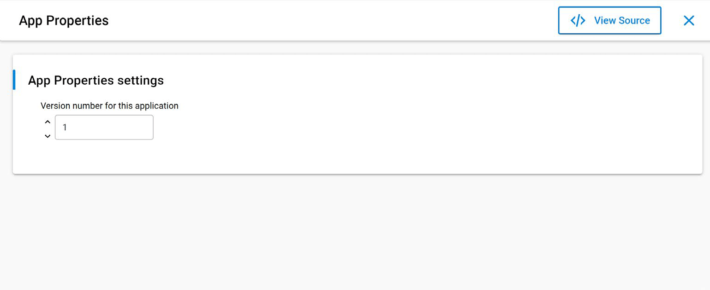

# UG489: Silicon Labs Gecko Bootloader User’s Guide for GSDK 4.0 and Higher (Rev. 0.5) <!-- omit in toc -->

本文档描述了用于 EFM32 和 EFR32 Series 1、Series 2 MCU（Microcontroller）、SoC（System on Chip）和 NCP（Network Co-Processor）的 Silicon Labs Gecko Bootloader 的高级实现，并提供了配置 Gecko Bootloader 的不同方面的相关信息。如果您不熟悉执行固件升级的基本原理或想了解有关升级映像文件的更多信息，请参见 *UG103.6: Bootloader Fundamentals* 。有关将 Gecko Bootloader 与不同无线协议栈结合使用的更多信息，请参见以下内容：

* *AN1084: Using the Gecko Bootloader with EmberZNet*
* *UG435.06: Bootloading and OTA with Silicon Labs Connect v3.x*
* *AN1086: Using the Gecko Bootloader with Silicon Labs Bluetooth Applications*

有关 Series 2 设备安全性的更多信息，请参见：

* *AN1218: Series 2 Secure Boot with RTSL*
* *AN1190: EFR32xG21 Secure Debug*
* *AN1222: Production Programming of Series 2 Devices*

有关使用具有 Secure Vault 的 Series 2 设备安全性的更多信息，请参见：

* *AN1247: Anti-Tamper Protection Configuration and Use*
* *AN1268: Authenticating Silicon Labs Devices using Device Certificates*
* *AN1271: Secure Key Storage*

# Table of Contents <!-- omit in toc -->

- [1 Overview](#1-overview)
    - [1.1 Core](#11-core)
        - [1.1.1 Shared Memory](#111-shared-memory)
    - [1.2 Drivers](#12-drivers)
    - [1.3 Components](#13-components)
        - [1.3.1 Communication](#131-communication)
        - [1.3.2 Compression](#132-compression)
        - [1.3.3 Debug](#133-debug)
        - [1.3.4 GPIO Activation](#134-gpio-activation)
        - [1.3.5 Security](#135-security)
        - [1.3.6 Storage](#136-storage)
    - [1.4 Compatibility](#14-compatibility)
- [2 Gecko Bootloader File Format](#2-gecko-bootloader-file-format)
    - [2.1 File Structures](#21-file-structures)
    - [2.2 Plaintext Tag Description](#22-plaintext-tag-description)
    - [2.3 Encrypted Tag Descriptions](#23-encrypted-tag-descriptions)
    - [2.4 GBL Tag Data Structures and Definitions](#24-gbl-tag-data-structures-and-definitions)
- [3 Gecko Bootloader Operation - Application Upgrade](#3-gecko-bootloader-operation---application-upgrade)
    - [3.1 Standalone Bootloader Operation](#31-standalone-bootloader-operation)
        - [3.1.1 Rebooting Into the Bootloader](#311-rebooting-into-the-bootloader)
        - [3.1.2 Downloading and Applying a GBL Upgrade File](#312-downloading-and-applying-a-gbl-upgrade-file)
        - [3.1.3 Booting Into the Application](#313-booting-into-the-application)
        - [3.1.4 Error Handling](#314-error-handling)
    - [3.2 Application Bootloader Operation](#32-application-bootloader-operation)
        - [3.2.1 Downloading and Storing a GBL Upgrade Image File](#321-downloading-and-storing-a-gbl-upgrade-image-file)
        - [3.2.2 Rebooting and Applying a GBL Upgrade File](#322-rebooting-and-applying-a-gbl-upgrade-file)
        - [3.2.3 Booting Into the Application](#323-booting-into-the-application)
- [4 Gecko Bootloader Operation - Bootloader Upgrade](#4-gecko-bootloader-operation---bootloader-upgrade)
    - [4.1 Bootloader Upgrade on Bootloaders with Communication Interface (Standalone Bootloaders)](#41-bootloader-upgrade-on-bootloaders-with-communication-interface-standalone-bootloaders)
        - [4.1.1 Downloading and Applying a Bootloader GBL Upgrade File](#411-downloading-and-applying-a-bootloader-gbl-upgrade-file)
    - [4.2 Bootloader Upgrade on Application Bootloaders with Storage](#42-bootloader-upgrade-on-application-bootloaders-with-storage)
        - [4.2.1 Storage Space Size Configuration](#421-storage-space-size-configuration)
        - [4.2.2 Upgrading Bootloaders without Secure Boot to Bootloaders with Secure Boot](#422-upgrading-bootloaders-without-secure-boot-to-bootloaders-with-secure-boot)
        - [4.2.3 Enabling Secure Boot RTSL on Series 2 Devices](#423-enabling-secure-boot-rtsl-on-series-2-devices)
- [5 Gecko Bootloader Operation - Secure Engine Upgrade](#5-gecko-bootloader-operation---secure-engine-upgrade)
    - [5.1 Secure Engine Upgrade on Bootloaders with Communication Interface (Standalone Bootloaders)](#51-secure-engine-upgrade-on-bootloaders-with-communication-interface-standalone-bootloaders)
        - [5.1.1 Downloading and Applying a Secure Engine GBL Upgrade File](#511-downloading-and-applying-a-secure-engine-gbl-upgrade-file)
        - [5.1.2 Downloading and Applying an Application GBL Upgrade File](#512-downloading-and-applying-an-application-gbl-upgrade-file)
    - [5.2 Secure Engine Upgrade on Application Bootloaders with Storage](#52-secure-engine-upgrade-on-application-bootloaders-with-storage)
        - [5.2.1 Storage Space Size Configuration](#521-storage-space-size-configuration)
- [6 Getting Started with the Gecko Bootloader](#6-getting-started-with-the-gecko-bootloader)
- [7 Configuring the Gecko Bootloader](#7-configuring-the-gecko-bootloader)
    - [7.1 Configuring Storage](#71-configuring-storage)
        - [7.1.1 SPI Flash Storage Configuration](#711-spi-flash-storage-configuration)
        - [7.1.2 Internal Storage Configuration](#712-internal-storage-configuration)
    - [7.2 Compressed Upgrade Images](#72-compressed-upgrade-images)
        - [7.2.1 LZMA Compression Settings](#721-lzma-compression-settings)
    - [7.3 Bootloader Example Configurations](#73-bootloader-example-configurations)
        - [7.3.1 UART XMODEM Bootloader](#731-uart-xmodem-bootloader)
        - [7.3.2 BGAPI UART DFU Bootloader](#732-bgapi-uart-dfu-bootloader)
        - [7.3.3 EZSP SPI Bootloader](#733-ezsp-spi-bootloader)
        - [7.3.4 Bluetooth AppLoader OTA DFU Bootloader](#734-bluetooth-apploader-ota-dfu-bootloader)
        - [7.3.5 SPI Flash Storage Bootloader](#735-spi-flash-storage-bootloader)
        - [7.3.6 SPI Flash Storage Bootloader SFDP](#736-spi-flash-storage-bootloader-sfdp)
        - [7.3.7 Internal Storage Bootloader](#737-internal-storage-bootloader)
    - [7.4 Image Acquisition Application Example Configuration](#74-image-acquisition-application-example-configuration)
    - [7.5 Setting a Version Number](#75-setting-a-version-number)
    - [7.6 Placing Bootloader in Main Flash](#76-placing-bootloader-in-main-flash)
    - [7.7 Hardware Configuration](#77-hardware-configuration)
    - [7.8 Size Requirements for Different Bootloader Configurations for Series 1 Devices](#78-size-requirements-for-different-bootloader-configurations-for-series-1-devices)
- [8 Simplicity Commander and the Gecko Bootloader](#8-simplicity-commander-and-the-gecko-bootloader)
    - [8.1 Creating GBL Files Using Simplicity Commander](#81-creating-gbl-files-using-simplicity-commander)
- [9 Gecko Bootloader Security Features](#9-gecko-bootloader-security-features)
    - [9.1 About Bootloader Image Security](#91-about-bootloader-image-security)
    - [9.2 About Application Image Security](#92-about-application-image-security)
        - [9.2.1 Secure Boot Procedure](#921-secure-boot-procedure)
        - [9.2.2 Secure Firmware Upgrade](#922-secure-firmware-upgrade)
    - [9.3 Using Application Image Security Features](#93-using-application-image-security-features)
        - [9.3.1 Generating Keys](#931-generating-keys)
        - [9.3.2 Signing an Application Image for Secure Boot](#932-signing-an-application-image-for-secure-boot)
        - [9.3.3 Creating a Signed and Encrypted GBL Upgrade Image File from an Application](#933-creating-a-signed-and-encrypted-gbl-upgrade-image-file-from-an-application)
    - [9.4 System Security Considerations](#94-system-security-considerations)
        - [9.4.1 Key Storage](#941-key-storage)
        - [9.4.2 Write-Protecting the Bootloader](#942-write-protecting-the-bootloader)
        - [9.4.3 Write-Protecting the Application](#943-write-protecting-the-application)
        - [9.4.4 Debug Access](#944-debug-access)
- [10 Gecko Bootloader and TrustZone](#10-gecko-bootloader-and-trustzone)
    - [10.1 Gecko Bootloader Operation](#101-gecko-bootloader-operation)
    - [10.2 Gecko Bootloader Configuration](#102-gecko-bootloader-configuration)
- [11 Application Interface](#11-application-interface)
    - [11.1 Application Properties](#111-application-properties)
    - [11.2 Error Codes](#112-error-codes)

# 1 Overview

Silicon Labs Gecko Bootloader 是 Silicon Labs 所有较新 MCU 和无线 MCU 的通用 Bootloader。Gecko Bootloader 可以配置为执行各种功能，从设备初始化到固件升级。该 Bootloader 的主要特性有：

* 可用于 Silicon Labs Gecko 微控制器和无线微控制器系列
* 可现场升级
* 可配置
* 增强的安全特性，包括：
    * **Secure Boot** ：启用 Secure Boot 时，Bootloader 会在每次启动时使用非对称密码技术强制对 Application 映像进行加密签名验证。这确保了 Application 是由可信方创建和签名的。
    * **Signed upgrade image file** ：Gecko Bootloader 支持对升级映像文件进行加密签名验证。这允许 Bootloader 和 Application 在开始升级过程之前验证 Application 或 Bootloader 升级是否来自可信源，确保映像文件是由可信方创建和签名的。
    * **Encrypted upgrade image file** ：映像文件也可以加密，防止窃听者获取明文的固件映像。

Gecko Bootloader 对其升级映像使用一个专有格式，称为 GBL（Gecko Bootloader 文件）。这些文件的文件扩展名为“.gbl”。有关详细信息，请参见 [2 Gecko Bootloader File Format](#2-gecko-bootloader-file-format) 。

在 Series 1 设备上，Gecko Bootloader 采用一个 Two-Stage 设计：First Stage 和 Main Stage，其中最小的 First Stage Bootloader 用于升级 Main Bootloader。First Stage Bootloader 仅包含读写内部闪存中固定地址的功能。要执行 Main Bootloader 升级，正在运行的 Main Bootloader 会验证 Bootloader 升级映像文件的完整性和真实性。然后正在运行的 Main Bootloader 会将升级映像写到内部闪存中的固定位置，并向 First Stage Bootloader 发出重新引导。First Stage Bootloader 会在将升级映像复制到 Main Bootloader 位置之前通过计算 CRC32 校验和来验证 Main Bootloader 固件升级映像的完整性。

在 Series 2 设备上，Gecko Bootloader 仅由 Main Stage Bootloader 组成。Main Bootloader 可通过 Secure Engine 升级。Secure Engine 可以是基于硬件的，也可以是虚拟的（软件）。如果是基于硬件的，那么实现可能具有或没有 Secure Vault。在整个文档中，将使用以下惯例。

* HSE - Hardware Secure Engine，若没有特别说明则指代具有或没有  Secure Vault 的 Secure Engine。
* VSE - Virtual Secure Engine
* SE - Secure Engine（HSE 或 VSE 的通用表示）

Secure Engine 通过从内部闪存中的可配置位置复制，提供将映像安装到内部闪存地址 0x0 的功能。这使得它可以采用一个 2-Stage 设计，其中不存在 Main Bootloader。然而，在本文档中假定存在 Main Bootloader。

要执行 Main Bootloader 升级，正在运行的 Main Bootloader 会验证 Bootloader 升级映像文件的完整性和真实性。然后正在运行的 Main Bootloader 会将升级映像写到闪存中的升级位置，并请求 Secure Engine 安装它。在某些设备上，Secure Engine 还能够根据信任根验证 Main Bootloader 更新映像的真实性。Secure Engine 自身可以使用相同的机制进行升级。有关详细信息，请参见 [5 Gecko Bootloader Operation - Secure Engine Upgrade](#5-gecko-bootloader-operation---secure-engine-upgrade) 。

Main Bootloader 由一个通用核心、驱动程序和一组赋予 Bootloader 特定功能的组件组成。通用 Bootloader 核心现在以完整源代码交付提供，而不是以前的编译库和源代码的组合，而组件继续以源代码交付。通用 Bootloader 核心包含解析 GBL 文件并将其内容刷写到设备的功能。

Gecko Bootloader 可以配置为在 Standalone 模式（也称为 Standalone Bootloader）或 Application 模式（也称为 Application Bootloader）下执行固件升级，具体取决于组件配置。可以在 Simplicity Studio IDE 中安装和配置组件。

Standalone Bootloader 使用一个通信通道来获取固件升级映像。NCP 设备始终使用 Standalone Bootloader。Standalone Bootloader 在一个单阶段过程中执行固件映像升级，该过程允许将 Application 映像放入到闪存，覆盖现有 Application 映像，而无需 Application 本身的参与。通常，Application 与 Standalone Bootloader 交互的唯一时间是在它请求重启到 Bootloader 时。Bootloader 运行后，它会使用 Bluetooth 或物理连接（如 UART 或 SPI）来接收包含固件升级映像的数据包。要用作具有物理连接的 Standalone Bootloader，必须配置一个提供通信接口（如 UART 或 SPI）的组件。

Application Bootloader 依赖于 Application 来获取固件升级映像。Application Bootloader 通过将固件升级映像写到一个闪存区域（称为下载空间）来执行固件映像升级。Application 可以用任何方便的方式（UART、OTA、Ethernet、USB 等）将固件升级映像传输到下载空间。下载空间可以是外部存储设备，例如 EEPROM 或 dataflash，也可以是设备内部闪存的一部分。Gecko Bootloader 可以将下载空间划分为多个存储槽，同时存储多个固件升级映像。要用作 Application Bootloader，必须配置提供 Bootloader 存储实现的组件。

Silicon Labs 提供了示例 Bootloader，这些 Bootloader 带有一组预配置的已安装组件，用于在独立模式或应用模式下进行配置。请参见 [7 Configuring the Gecko Bootloader](#7-configuring-the-gecko-bootloader) 。Silicon Labs Gecko SDK Suite 还包括用于多种不同 EFR32 设备的预编译 Bootloader 映像。在撰写本文时，提供了下表中展示的映像。

**注意** ：这些预编译映像中未启用 Bootloader 安全性特性。

| Use  | Wireless Stack | Image Name                            | Mode        | Interface          |
| :--- | :------------- | :------------------------------------ | :---------- | :----------------- |
| SoC  | EmberZNet PRO  | SPI Flash Storage Bootloader          | Application | SPI Serial Flash   |
| SoC  | Bluetooth      | Bluetooth In-Place OTA DFU Bootloader | Application | OTA/internal flash |
| NCP  | EmberZNet PRO  | UART XMODEM Bootloader                | Standalone  | UART (EZSP)        |
| NCP  | Bluetooth      | BGAPI UART DFU Bootloader             | Standalone  | UART (BGAPI)       |

请注意，在具有专用 Bootloader 区域的设备（EFR32xG12 和更高版本的 Series 1 设备）上，如果设备配置为引导至 Bootloader 区域（即，如果设置了 Config Lock Word 0 CLW0\[1\] 的 Bit 1），那么 Bootloader 区域中必须总是存在一个映像。设备在出厂时使用一个 Dummy Bootloader 进行了编程，该 Bootloader 可以直接跳转到主闪存中的 Application。这意味着当将 Bootloader 刷写到具有专用 Bootloader 区域的设备时，该 Dummy Bootloader 将被替换。如果稍后在开发过程中不再需要使用 Bootloader，则必须清除 CLW0\[1\] 或重新刷写 Dummy Bootloader。特定于平台的预构建 Dummy Bootloader 映像位于 *./platform/bootloader/util/bin/* 中。请注意，由于 Dummy Bootloader 仅包含一些指令并且不会填充 Bootloader 区域的其余部分，因此只有第一个闪存页（First Stage Bootloader 所在的位置）被覆盖，因此 Main Stage Bootloader 在刷写 Dummy Bootloader 后可能会被无损地保留下来。如果需要，可以单独擦除 Bootloader 区域中的其余闪存页。

在没有专用 Bootloader 区域的设备（EFR32xG1 和 EFR32 Series 2）上，不需要 Dummy Bootloader。

以下小节概述了 Gecko Bootloader 的通用核心、驱动程序和组件。有关详细信息，包括错误代码和条件的详细信息，请参见 Gecko Bootloader API Reference，它随 SDK 一起提供，位于 platform/bootloader/documentation 文件夹中。

使用 Simplicity Commander 的 `commander device pageerase --region @bootloader` 命令可以完全擦除 Bootloader 区域。在此状态下，设备将不会启动，直到 CLW0\[1\] 被清除或刷写了 Dummy Bootloader。有关如何将 Simplicity Commander 与 Gecko Bootloader 结合使用的更多信息，请参见 [8 Simplicity Commander and the Gecko Bootloader](#8-simplicity-commander-and-the-gecko-bootloader) 。

## 1.1 Core

Bootloader 核心包含 Bootloader 的主要功能。它还包含写入内部闪存的功能、一个用于解析和处理 GBL 升级文件内容的映像解析器，以及在主闪存中启动 Application 的功能。

映像解析器还可以选择支持 Legacy Ember Bootloader（EBL）文件格式，但如果启用对 EBL 文件的支持，则不支持 Gecko Bootloader 提供的任何安全特性。

不支持加密升级映像的 GBL 映像解析器版本也是可用的。该版本可用于闪存空间受限的 Bootloader，其中不需要对升级映像进行加密。

### 1.1.1 Shared Memory

为了在 Bootloader 和 Application 之间交换信息，使用了一部分 SRAM。SRAM 的内容在软件复位时仍会被保持，这使 SRAM 适合用作 Bootloader 和 Application 之间的通信通道。

该共享内存大小为 4 个字节，位于 SRAM 的首地址 0x20000000。它用于存储包含复位原因的单个字。复位原因字的结构在应用程序接口的 Reset Information 部分定义，其在文件 **btl_reset_info.h** 中，其中 16 位包含原因，16 位签名指示字是否有效。如果签名为 0xF00F，则复位原因有效。

Silicon Labs 使用的所有 16 位复位原因都将最高有效位设置为零。如果需要自定义复位原因，建议设置最高有效位以避免定义冲突。

除了 Reset Information 文档中定义的复位原因外，如果共享内存包含值 0x00000001，Bootloader 将进入固件升级模式。支持此值是为了与某些 Legacy Bluetooth Application 兼容。

## 1.2 Drivers

不同的固件升级 Application 需要不同的硬件驱动程序以供 Bootloader 的其他组件使用。

驱动模块包括：

* Delay：用于需要小延迟或超时的组件的简单延迟例程。
* SPI：用于与外部设备（如 SPI 闪存）通信的简单、阻塞式 SPI 主设备实现。
* SPI Slave：灵活的 SPI 从设备驱动程序实现，用于实现 SPI 协议的通信组件。该驱动程序支持阻塞和非阻塞操作，使用 DMA（Direct Memory Access）支持后台传输以支持非阻塞操作。
* UART：灵活的串行 UART 驱动程序实现，用于实现 UART 协议的通信组件。此驱动程序支持阻塞和非阻塞操作，使用 DMA 支持后台传输以支持非阻塞操作。此外，还包括对硬件流控制（RTS/CTS）的支持。

## 1.3 Components

Bootloader 的所有部分，无论是可选的还是可以为不同配置替换的，都作为组件来实现。每个组件可能有一个配置头文件，以及一个或多个实现。组件包括：

* Communication
    * UART: XMODEM
    * UART: BGAPI
    * SPI: EZSP
    * Bluetooth: AppLoader
* Compression
* Debug
* GPIO Activation
* Security
* Storage
    * Internal flash
    * External SPI flash

### 1.3.1 Communication

Communication 组件提供了一个接口，用于实现与主机设备（如计算机或微控制器）的通信。几个组件使用不同的传输和协议实现通信接口。

* BGAPI UART DFU：通过启用 BGAPI Communication 组件，Bootloader 通信接口将使用 BGAPI 命令实现 UART DFU 协议。有关此 Legacy Bootloader 的更多信息，请参见 *AN1053: Bluetooth® Device Firmware Update over UART for EFR32xG1 and BGM11x Series Products* 。
* Bluetooth:AppLoader：通过启用 Bluetooth AppLoader Communication 组件，Bootloader 通信接口将使用 Bluetooth 实现 OTA 设备固件升级功能。有关详细信息，请参见 *AN1086: Using the Gecko Bootloader with the Silicon Labs Bluetooth Applications* 。
* EZSP-SPI：通过启用 EZSP-SPI Communication 组件，Bootloader 通信接口将通过 SPI 实现 EZSP 协议。该组件使 Bootloader 与之前与 EmberZNet 无线栈一起发布的旧版 ezsp-spi-bootloader 兼容。有关 Legacy Ember Standalone Bootloader 的更多信息，请参见 *AN760: Using the Ember Standalone Bootloader* 。
* UART XMODEM：通过启用 UART XMODEM Communication 组件，Bootloader 通信接口将通过 UART 实现 XMODEM-CRC 协议。该组件使 Bootloader 与之前与 EmberZNet 无线栈一起发布的旧版 serial-uart-bootloader 兼容。有关 Legacy Ember Standalone Bootloader 的更多信息，请参见 *AN760: Using the Ember Standalone Bootloader* 。

### 1.3.2 Compression

Compression 组件为 Bootloader GBL 文件解析器提供处理压缩的 GBL 升级映像的能力。每个 Compression 组件都支持一种（解）压缩算法。在撰写本文时，支持通过 *GBL Compression (LZ4)* 和 *GBL Compression (LZMA)* 组件对使用 LZ4 和 LZMA 算法压缩的数据进行解压缩。

### 1.3.3 Debug

该组件为 Bootloader 提供调试输出支持。如果该组件配置为启用调试打印，则将通过 SWO（Serial Wire Output）打印简短的调试消息，可以通过多种方式访问该输出，包括使用 Simplicity Commander 以及连接到 Wireless Starter Kit 的 TCP/IP 接口的 4900 端口。

要打开调试打印，请启用 Debug 组件并选择 **Debug prints**。选择 **Debug asserts** 以在源代码中启用断言。

在 Series 1 设备上，还要在 Pin Tool 中选择 GPIO 外设。

### 1.3.4 GPIO Activation

如果 GPIO 引脚在引导期间处于活动状态，则此组件提供在复位后自动进入固件升级模式的功能。GPIO 引脚位置和极性是可配置的。

* GPIO：通过启用 GPIO Activation 组件，可以通过按钮激活固件升级模式。
* EZSP GPIO：基于 SPI 的 EZSP 通信协议可以与该组件一起使用。通过启用 EZSP GPIO 组件，可以通过激活 *nWake* 引脚进入固件升级模式。

### 1.3.5 Security

Security 组件提供加密操作的实现以及计算校验和以及从 Manufacturing Token 中读取加密密钥的功能。

模块包括：

* AES：AES 解密功能
* CRC16：CRC16 功能
* CRC32：CRC32 功能
* ECDSA：ECDSA 签名验证功能
* SHA-256：SHA-256 摘要功能

### 1.3.6 Storage

这些组件为 Bootloader 提供了针对 SoC 的多个存储选项。所有存储实现都必须提供一个 API 来访问要升级的映像文件。该 API 基于将下载空间划分为存储槽的概念，其中每个槽在内存中都有预定义的大小和位置，可用于存储单个升级映像。一些存储实现还支持原始存储 API 来访问底层存储介质。Application 可以使用它在存储介质中未用于存储固件升级映像的部分存储其他数据。实现包括：

* **Internal Flash** ：内部闪存存储实现使用设备的内部闪存进行升级映像存储。请注意，此存储区域只是一个下载空间，与用于保存活动的 Application 代码的内部闪存部分是分开的。
* **SPI Flash**：有两个组件可用于 SPI 闪存存储实现。
    1. **SPI Flash Storage** ：SPI Flash Storage 实现支持各种 SPI 闪存元件。支持的设备子集可以在 Gecko Bootloader 的这个组件中配置（如果未选择任何设备，则默认配置是包括所有受支持元件的驱动程序）。包含对需要 Bootloader 中有更多闪存空间的多个设备支持。SPI 闪存存储实现不支持任何写保护功能。支持的 SPI 闪存元件如表 1.2 所示。
    2. **SPI Flash Storage SFDP** ：SPI Flash Storage SFDP 实现支持所有支持 JEDEC SFDP（Serial Flash Description Parameter）标准的 SPI 闪存元件。通过查询闪存中存在的 SFDP 参数表自动检测 SPI 闪存类型。SPI Flash 的所有属性都可以从此参数表访问。该组件不可配置，因为会自动检测闪存。任何支持 SFDP 标准的闪存都可以与 Gecko Bootloader 一起使用。但是，与使用 **SPI Flash Storage** 组件相比，其性能可能会有所延迟。

**注意** ：对于电池供电的应用，建议使用低功耗设备。由于较高的静态电流，使用其他列出的设备会缩短电池寿命，但如果需要，可以通过外部关断 FET 电路来缓解这种情况。

| Manufacturer Part Number                                                    | Size (kB) | Quiescent Current (µA Typical)* |
| :-------------------------------------------------------------------------- | :-------: | :-----------------------------: |
| Macronix MX25R8035F (low power)                                             |   1024    |              0.007              |
| Macronix MX25R6435SF (low power)                                            |   8192    |              0.007              |
| Macronix MX25R3235F (low power)                                             |   4096    |              0.007              |
| Spansion S25FL208K                                                          |   1024    |               15                |
| Winbond W25X20BVSNIG (W25X20CVSNJG for high- temperature support)           |    256    |                1                |
| Winbond W25Q80BVSNIG (W25Q80BVSNJG for high- temperature support)           |   1024    |                1                |
| Macronix MX25L2006EM1I-12G (MX25L2006EM1R-12G for high-temperature support) |    256    |                2                |
| Macronix MX25L4006E                                                         |    512    |                2                |
| Macronix MX25L8006EM1I-12G (MX25L8006EM1R-12G for high-temperature support) |   1024    |                2                |
| Macronix MX25L1606E                                                         |   2048    |                2                |
| Macronix MX25U1635E (2V)                                                    |   2048    |                2                |
| Atmel/Adesto AT25DF041A                                                     |    512    |               15                |
| Atmel/Adesto AT25DF081A                                                     |   1024    |                5                |
| Atmel/Adesto AT25SF041                                                      |    512    |                2                |
| Micron (Numonyx) M25P20                                                     |    256    |                1                |
| Micron (Numonyx) M25P40                                                     |    512    |                1                |
| Micron (Numonyx) M25P80                                                     |   1024    |                1                |
| Micron (Numonyx) M25P16                                                     |   2048    |                1                |
| ISSI IS25LQ025B                                                             |    32     |                8                |
| ISSI IS25LQ512B                                                             |    64     |                8                |
| ISSI IS25LQ010B                                                             |    126    |                8                |
| ISSI IS25LQ020B                                                             |    256    |                8                |
| ISSI IS25LQ040B                                                             |    512    |                8                |

\* 静态电流值截至 2017 年 12 月；请检查最新的元件规格是否有任何变化。

## 1.4 Compatibility

1. Silicon Labs 建议使用相同的 GSDK 构建 Gecko Bootloader 和 Application。这意味着，如果 Gecko Bootloader 是使用 GSDK v4.0 构建的，建议 Application 也使用 GSDK v4.0 构建。
2. 支持向后兼容性，其中 Gecko Bootloader 是使用以前的 SDK 版本构建的，而 Application 是使用更新的 SDK 版本构建的。
3. 一般来说，Silicon Labs 不建议使用较新的 SDK 版本构建 Gecko Bootloader，同时使用较旧的 SDK 版本构建 Application。

下表试图解释上述准则：

| SDK version X < SDK version Y              | Application built using SDK version X | Application built using SDK version Y |
| :----------------------------------------- | :------------------------------------ | :------------------------------------ |
| Gecko Bootloader built using SDK version X | Recommended                           | Compatible                            |
| Gecko Bootloader built using SDK version Y | Not recommended                       | Recommended                           |

# 2 Gecko Bootloader File Format

GBL 文件格式由 Gecko Bootloader 使用。本节中描述的文件格式由 Simplicity Commander 命令生成。有关详细信息，请参见 *UG162: Simplicity Commander Reference Guide* 。

## 2.1 File Structures

GBL 文件格式由多个 Tag 组成，Tag 表示后续数据的格式和整个 Tag 的长度。Tag 的格式如下：

| Tag ID  | Tag Length |            Tag Payload             |
| :-----: | :--------: | :--------------------------------: |
| 4 bytes |  4 bytes   | Variable (according to tag length) |

## 2.2 Plaintext Tag Description

| Tag Name                             |           ID            | Description                                                                                                                                                                                      |
| :----------------------------------- | :---------------------: | :----------------------------------------------------------------------------------------------------------------------------------------------------------------------------------------------- |
| GBL Header Tag                       |       0x03A617EB        | This must be the first tag in the file. The header tag contains the version number of the GBL file specification, and flags indicating the type of GBL file – whether it is signed or encrypted. |
| GBL Version Dependency Tag           |       0x76A617EB        | This optional tag contains encoded version dependencies that the software currently running on the device must satisfy before an upgrade can be attempted. Only available on Series 2 devices.   |
| GBL Application Info Tag             |       0xF40A0AF4        | This tag contains information about the application update image that is contained in this GBL file                                                                                              |
| GBL SE Upgrade Tag                   |       0x5EA617EB        | This tag contains a complete encrypted Secure Element update image. Only applicable on Series 2 devices.                                                                                         |
| GBL Bootloader Tag                   |       0xF50909F5        | This tag contains a complete bootloader update image.                                                                                                                                            |
| GBL Program Data Tag                 | 0xFE0101FE / 0xFD0303FD | This tag contains information about what application data to program at a specific address into the main flash memory.                                                                           |
| GBL Program LZ4 Compressed Data Tag  |       0xFD0505FD        | This tag contains LZ4 compressed information about what application data to program at a specific address into the main flash memory.                                                            |
| GBL Program LZMA Compressed Data Tag |       0xFD0707FD        | This tag contains LZMA compressed information about what application data to program at a specific address into the main flash memory.                                                           |
| GBL Metadata Tag                     |       0xF60808F6        | This tag contains metadata that the bootloader does not parse, but can be returned to the application through a callback.                                                                        |
| GBL Certificate Tag                  |       0xF30B0BF3        | This tag contains a certificate that will be used to verify the authenticity of the GBL file.                                                                                                    |
| GBL Signature Tag                    |       0xF70A0AF7        | This tag contains the ECDSA-P256 signature of all preceding data in the file.                                                                                                                    |
| GBL End Tag                          |       0xFC0404FC        | This tag indicates the end of the GBL file. It contains a 32-bit CRC for the entire file as an integrity check. The CRC is a noncryptographic check. This must be the last tag.                  |

GBL 文件中允许的 GBL Tag 顺序如下图所示。


## 2.3 Encrypted Tag Descriptions

加密的 GBL 文件格式类似于未加密的版本。它引入了许多新 Tag。

| Tag Name                   |     ID     | Description                                                                                                                                                                 |
| :------------------------- | :--------: | :-------------------------------------------------------------------------------------------------------------------------------------------------------------------------- |
| GBL Header Tag             | 0x03A617EB | The GBL header is the same as for a plaintext GBL file, but the flag indicating that the GBL file is encrypted must be set.                                                 |
| GBL Encryption Init Header | 0xFA0606FA | This contains information about the image encryption such as the Nonce and the amount of encrypted data.                                                                    |
| GBL Encrypted Program Data | 0xF90707F9 | This contains an encrypted payload containing a plaintext GBL tag, one of Application Info, Bootloader, Metadata or Program Data. The data is encrypted using AES- CTR-128. |

下图展示了加密 GBL 文件中允许的 GBL Tag 顺序。


## 2.4 GBL Tag Data Structures and Definitions

**GBL Tag Header**

```c
typedef struct {
    uint32_t tagId;  // Tag ID representing the type of tag (GBL Header Tag, GBL Bootloader Tag, etc.).
    uint32_t length; // Length of the subsequent tag data in bytes.
} GblTagHeader_t;
```

**GBL Header Tag**

```c
typedef struct {
    GblTagHeader_t header;  // Tag header.
    uint32_t       version; // Version of the GBL file format specification. E.g. 0x03000000.
    uint32_t       type;    // Flags indicating whether the GBL file is encrypted and/or signed.
                            // See definitions below.
} GblHeader_t;


// GBL types
#define GBL_TYPE_NONE               0x00000000UL
#define GBL_TYPE_ENCRYPTION_AESCCM  0x00000001UL
#define GBL_TYPE_SIGNATURE_ECDSA    0x00000100UL
```

**GBL Version Dependency Tag**

```c
typedef struct {
    uint8_t  imageType;     // Type of image (application, bootloader, SE)
    uint8_t  statement;     // Encoded dependency statement (ex. appVersion > (0).1.2.3)
    uint16_t reserved;      // Reserved
    uint32_t version;       // The version number used in the statement (ex. (0).1.2.3)
} VersionDependency_t;

// Image types
#define GBL_VERSION_DEPENDENCY_TYPE_APPLICATION             0x01U
#define GBL_VERSION_DEPENDENCY_TYPE_BOOTLOADER              0x02U
#define GBL_VERSION_DEPENDENCY_TYPE_SE                      0x03U

// Operator encoding
#define GBL_VERSION_DEPENDENCY_OPERATOR_MASK                0x0FU
#define GBL_VERSION_DEPENDENCY_OPERATOR_SHIFT               0x00U
#define GBL_VERSION_DEPENDENCY_OPERATOR_TYPE_MASK           0x0EU
#define GBL_VERSION_DEPENDENCY_OPERATOR_NEGATOR_BIT_MASK    0x01U

#define GBL_VERSION_DEPENDENCY_OPERATOR_LT                  0x00U
#define GBL_VERSION_DEPENDENCY_OPERATOR_LEQ                 0x02U
#define GBL_VERSION_DEPENDENCY_OPERATOR_EQ                  0x04U
#define GBL_VERSION_DEPENDENCY_OPERATOR_GEQ                 0x06U
#define GBL_VERSION_DEPENDENCY_OPERATOR_GT                  0x08U

// Connective encoding
#define GBL_VERSION_DEPENDENCY_CONNECTIVE_MASK              0xF0U
#define GBL_VERSION_DEPENDENCY_CONNECTIVE_SHIFT             0x04U
#define GBL_VERSION_DEPENDENCY_CONNECTIVE_TYPE_MASK         0x0EU
#define GBL_VERSION_DEPENDENCY_CONNECTIVE_NEGATOR_BIT_MASK  0x01U

#define GBL_VERSION_DEPENDENCY_CONNECTIVE_AND               0x00U

// SE version mask for ignoring the compatibility byte when comparing versions
#define GBL_VERSION_DEPENDENCY_SE_VERSION_MASK              0x00FFFFFFUL
```

**GBL Application Info Tag**

```c
typedef struct {
    GblTagHeader_t    header;   // Tag header.
    ApplicationData_t appInfo;  // Application information structure. See definition below.
} GblApplication_t;

typedef struct ApplicationData {
    uint32_t type;              // Bitfield representing the type of application.
                                // See definitions below for possible values.
    uint32_t version;           // Version number for this application (customer-defined).
    uint32_t capabilities;      // Bitfield representing the capabilities of this application.
    uint8_t  productId[16];     // Unique ID (UUID or GUID) for the product this application is built for.
} ApplicationData_t;

// Application types
#define APPLICATION_TYPE_ZIGBEE         (1UL << 0UL)
#define APPLICATION_TYPE_THREAD         (1UL << 1UL)
#define APPLICATION_TYPE_FLEX           (1UL << 2UL)
#define APPLICATION_TYPE_BLUETOOTH      (1UL << 3UL)
#define APPLICATION_TYPE_MCU            (1UL << 4UL)
#define APPLICATION_TYPE_BLUETOOTH_APP  (1UL << 5UL)
#define APPLICATION_TYPE_BOOTLOADER     (1UL << 6UL)
#define APPLICATION_TYPE_ZWAVE          (1UL << 7UL)
```

**GBL SE Upgrade Tag**

```c
typedef struct {
    GblTagHeader_t header;      // Tag header.
    uint32_t       blobSize;    // Size of the SE upgrade data blob.
    uint32_t       version;     // Version of the SE image.
    uint8_t        data[];      // Array of data containing the SE upgrade blob.
} GblSeUpgrade_t;
```

**GBL Bootloader Tag**

```c
typedef struct {
    GblTagHeader_t header;              // Tag header.
    uint32_t       bootloaderVersion;   // Version number of the bootloader.
    uint32_t       address;             // Base address of the bootloader image.
    uint8_t        data[];              // Array of data containing the bootloader upgrade image.
} GblBootloader_t;
```

**GBL Program Data Tag**

```c
typedef struct {
    GblTagHeader_t header;              // Tag header.
    uint32_t       flashStartAddress;   // Address at which to start flashing data.
    uint8_t        data[];              // Array of data to be flashed
                                        // (compressed data in the LZ4 and LZMA variants of the tag).
} GblProg_t;
```

**GBL Metadata Tag**

```c
typedef struct {
    GblTagHeader_t header;      // Tag header.
    uint8_t        metadata[];  // Array containing the metadata.
} GblMetadata_t;
```

**GBL Certificate Tag**

```c
typedef struct {
    GblTagHeader_t           header;        // Tag header.
    ApplicationCertificate_t certificate;   // Certificate used to verify the GBL file. See definition below.
} GblCertificateEcdsaP256_t;

typedef struct ApplicationCertificate {
    uint8_t  structVersion;     // Version of the certificate structure.
    uint8_t  flags[3];          // Reserved flags.
    uint8_t  key[64];           // Public key used to verify the GBL file.
    uint32_t version;           // Version number of this certificate.
    uint8_t  signature[64];     // The signature of the certificate itself (not the GBL file).
} ApplicationCertificate_t;
```

**GBL Signature Tag**

```c
typedef struct {
    GblTagHeader_t header;  // Tag header.
    uint8_t        r[32];   // The r value of the ECDSA signature.
    uint8_t        s[32];   // The s value of the ECDSA signature.
} GblSignatureEcdsaP256_t;
```

**GBL End Tag**

```c
typedef struct {
    GblTagHeader_t header;  // Tag header.
    uint32_t       gblCrc;  // CRC32 checksum of the entire GBL file.
} GblEnd_t;
```

**GBL Encryption Init Header Tag**

```c
typedef struct {
    GblTagHeader_t header;      // Tag header.
    uint32_t       msgLen;      // Length of the ciphertext in bytes.
    uint8_t        nonce[12];   // Random AES-CTR nonce.
} GblEncryptionInitAesCcm_t;
```

**GBL Encrypted Data Tag**

```c
typedef struct {
    GblTagHeader_t header;              // Tag header.
    uint8_t        encryptedGblData[];  // Array containing the ciphertext (encrypted GBL data).
                                        // Note that the corresponding plaintext must contain one or
                                        // more complete GBL tags. Put differently: A single plaintext GBL
                                        // tag cannot be split across multiple encrypted tags.
} GblEncryptionData_t;
```

# 3 Gecko Bootloader Operation - Application Upgrade

本节总结了 Gecko Bootloader 更新 Application 固件的操作，首先假设 Gecko Bootloader 配置为独立模式，然后假设其配置为 Application 模式。[4 Gecko Bootloader Operation - Bootloader Upgrade](#3-gecko-bootloader-operation---application-upgrade) 提供了更新 Bootloader 固件的相同信息。

本节中说明 Gecko Bootloader 操作的图不提供有关不同设备的 Bootloader 内存布局的信息。有关详细信息，请参见 *UG103.6: Bootloader Fundamentals* 中的“Memory Space for Bootloading”小节。

## 3.1 Standalone Bootloader Operation

Standalone Bootloader 操作如下图所示：


1. 设备重启进入 Bootloader。
2. 包含 Application 映像的 GBL 文件从主机传输到设备。如果在 Main Stage Bootloader 中使能了映像加密，并且该映像是加密的，那么解密将在接收和解析 GBL 文件的过程期间进行。
3. Bootloader 即时应用来自 GBL 升级文件的 Application 升级。如果在 Main Stage Bootloader 中启用了映像身份验证并且该 GBL 文件包含签名，则在完成该过程之前验证映像的真实性。
4. 设备启动进入 Application。Application 升级完成。

### 3.1.1 Rebooting Into the Bootloader

Gecko Bootloader 支持多种触发 Bootloader 的机制。如果安装了 **GPIO Activation** 组件，主机设备可以通过复位将此引脚保持低/高（取决于配置），使设备进入 Bootloader。Bootloader 也可以通过软件进入。`bootloader_rebootAndInstall` API 首先通过向 SRAM 底部的共享内存位置写入命令来向 Bootloader 发出信号，告知它应该进入固件升级模式，然后执行软件复位。如果 Bootloader 在引导时在共享内存中找到正确的命令，它将进入固件升级模式，而不是引导现有的 Application。

### 3.1.2 Downloading and Applying a GBL Upgrade File

当 Bootloader 进入固件升级模式时，它会进入一个接收循环以等待来自主机设备的数据。接收循环的细节取决于协议。接收到的数据包会被传递到映像解析器，这是一个状态机，它解析数据并返回一个回调，其中包含任何应该采取行动的数据。Bootloader 核心实现此回调并将数据刷写到内部闪存的指定地址。如果启用了 GBL 文件身份验证或加密，映像解析器将强制执行此操作，并中止映像升级。

Bootloader 通过保持 Application 向量表的部分，直到 GBL 文件的 CRC 和 GBL 签名（如果需要）得到验证，来防止新上传的映像变为可引导状态。

### 3.1.3 Booting Into the Application

当 Application 升级完成时，Bootloader 会触发重启，并在 SRAM 底部的共享内存中放置一条消息以表明 Application 升级已成功完成。Application 可以使用此复位信息来获知刚刚执行了 Application 升级。

在跳转到主 Application 之前，Bootloader 会验证 Application 是否已准备好运行。这包括验证程序计数器和栈指针是否有效。如果启用了 Secure Boot，那么 Bootloader 就需要一个已签名的 Application 并尝试验证 Application 的签名。在未启用 Secure Boot 的情况下，Bootloader 会尝试验证 Application Properties 指针是否指向闪存中的有效 App Properties 结构。如果找到有效的 App Properties 结构，Bootloader 将根据 Application Properties 结构指示的签名类型继续进行，否则 Bootloader 假定 Application Properties 指针指向 Application（没有 Application Properties 的 Application）的 Reset Handler 并继续引导到 Application。若在任何阶段 Application 验证失败，则 Bootloader 将进入引导加载模式，而不是引导至 Application。

### 3.1.4 Error Handling

如果 Application 升级在任何时候中断，设备将没有可用的 Application。然后 Bootloader 复位设备，并重新进入固件升级模式。主机设备可以轻松地重启 Application 升级过程，尝试再次加载升级映像。

## 3.2 Application Bootloader Operation

下图说明了单个映像/单个存储槽和多个映像/多个存储槽的 Application Bootloader 操作。


1. 如下所述，将 GBL 文件下载到设备的存储介质（内部闪存或外部数据闪存）上，并指示存在升级映像。
2. 设备重启进入 Bootloader，Bootloader 进入固件升级模式。
3. Bootloader 应用来自 GBL 升级文件的 Application 升级。
4. 设备引导至 Application。Application 升级完成。

### 3.2.1 Downloading and Storing a GBL Upgrade Image File

为了准备接收升级映像，Application 需要找到一个可用的存储槽，或使用 `bootloader_eraseStorageSlot` 擦除现有的存储槽。如果 Bootloader 仅支持单个存储槽，则 Slot ID 应使用值 0。

然后，Application 使用合适的协议（如 Ethernet、USB、Zigbee、OpenThread 或 Bluetooth）接收 GBL 文件，并通过调用 `bootloader_writeStorage` 将其存储在槽中。

下载完成后，Application 可以选择通过调用 `bootloader_verifyImage` 来验证 GBL 文件的完整性。这也是在应用映像之前由 Bootloader 完成的，但可以由 Application 完成，以避免在接收到的映像损坏时重启至 Bootloader。

如果支持多个存储槽，Application 应通过调用 `bootloader_setImageToBootload` 写入一个引导加载列表。该列表被写到两个引导加载信息页中，如图 3.3 所示。引导加载列表是槽的优先列表，指示 Bootloader 在尝试执行固件升级时应使用的顺序。Bootloader 依次尝试验证这些存储槽中的映像，并应用第一个通过验证的映像。如果仅支持单个存储槽，Bootloader 会将整个下载空间视为单个存储槽。

### 3.2.2 Rebooting and Applying a GBL Upgrade File

可以通过软件进入 Bootloader。`bootloader_rebootAndInstall` API 通过向 SRAM 底部的共享内存位置写入一个命令来向 Bootloader 发出信号，表明它应该进入固件升级模式，然后执行软件复位。如果 Bootloader 在引导时在共享内存中找到正确的命令，它会进入固件升级模式，而不是引导现有的 Application。

Bootloader 遍历针对引导加载而标记的存储槽列表，并尝试验证每个存储槽中存储的映像。一旦找到有效的 GBL 升级文件，就会尝试从此 GBL 文件升级固件。如果升级失败，Bootloader 将移至列表中的下一个映像。如果没有映像通过验证，Bootloader 将重启回到现有的 Application，并在 SRAM 中的共享内存位置放置一条消息以指示未找到可用的升级映像。

### 3.2.3 Booting Into the Application

当 Application 升级完成时，Bootloader 会触发重启，并在 SRAM 底部的共享内存中放置一条消息以指示 Application 升级已成功完成。Application 可以使用此复位信息来获知刚刚执行了 Application 升级。

在跳转到主 Application 之前，Bootloader 会验证 Application 是否已准备好运行。这包括验证程序计数器和栈指针是否有效。如果启用了 Secure Boot，那么 Bootloader 就需要一个已签名的 Application 并尝试验证 Application 的签名。在未启用 Secure Boot 的情况下，Bootloader 会尝试验证 Application Properties 指针是否指向闪存中的有效 App Properties 结构。如果找到有效的 App Properties 结构，Bootloader 将根据 Application Properties 结构指示的签名类型继续进行，否则 Bootloader 假定 Application Properties 指针指向 Application（没有 Application Properties 的 Application）的 Reset Handler 并继续引导到 Application。若在任何阶段 Application 验证失败，则 Bootloader 将进入引导加载模式，而不是引导至 Application。

# 4 Gecko Bootloader Operation - Bootloader Upgrade

Bootloader 升级功能由 Series 1 设备上的 First Stage Bootloader 或 Series 2 设备上的 Secure Engine 提供。Secure Engine 自身也是可升级的。有关详细信息，请参见 [5 Gecko Bootloader Operation - Secure Engine Upgrade](#5-gecko-bootloader-operation---secure-engine-upgrade) 。在 Series 1 设备上，First Stage Bootloader 不可升级。

升级 Main Bootloader 的要求取决于 Bootloader 的配置：

* 带存储的 Application Bootloader：升级 Main Bootloader 需要一个包含 Bootloader 和 Application 升级映像的单一 GBL 文件。
* 带通信接口的 Standalone Bootloader：升级 Bootloader 需要两个 GBL 文件，一个只含有 Bootloader 升级映像，一个只含有 Application 升级映像。

Bootloader 升级过程的安全性通过签名 GBL 文件来提供。参见 [9.3.3 Creating a Signed and Encrypted GBL Upgrade Image File from an Application](#933-creating-a-signed-and-encrypted-gbl-upgrade-image-file-from-an-application) 。

本节中说明 Gecko Bootloader 操作的图不提供有关不同设备的 Bootloader 内存布局的信息。有关详细信息，请参见 *UG103.6: Bootloader Fundamentals* 中的“Memory Space for Bootloading”部分。为方便起见，图中未区分 SE 和 VSE。

## 4.1 Bootloader Upgrade on Bootloaders with Communication Interface (Standalone Bootloaders)

流程如下图所示：


1. 设备重启至 Bootloader。
2. 从主机传输一个仅包含 Bootloader 升级映像的 GBL 文件到设备。
3. GBL Bootloader Tag 的内容被写到内部闪存中的 Bootloader 升级位置，覆盖现有的 Application。
4. 设备重启至 First Stage Bootloader/Secure Engine。
5. First Stage Bootloader/Secure Engine 使用 Bootloader 升级位置中找到的新版本替换 Main Bootloader。
6. 设备引导至新的 Main Bootloader。
7. 从主机传输一个仅包含 Application 映像的 GBL 文件到设备。
8. Bootloader 即时应用来自 GBL 升级文件的 Application 映像。
9. 设备引导至 Application。Bootloader 升级完成。

Bootloader 升级的启动方式与 Application 升级相同。

### 4.1.1 Downloading and Applying a Bootloader GBL Upgrade File

当 Bootloader 进入接收循环时，包含 Bootloader 升级的 GBL 升级文件被传输到 Bootloader。当接收到数据包时，会将其传递给映像解析器。映像解析器解析数据并在回调中返回 Bootloader 升级数据。Bootloader 核心实现此回调并将数据刷写到内部闪存的 Bootloader 升级位置。

Bootloader 通过保持 Bootloader 向量表的部分，直到 GBL 文件的 CRC 和 GBL 签名（如果需要）得到验证，来防止新上传的 Bootloader 升级映像被解释为有效。

当收到完整的 Bootloader 升级映像时，Main Bootloader 向 First Stage Bootloader/Secure Engine 发出信号，告知它应该进入固件升级模式。在 Series 1 设备上，这是通过将一个命令写到 SRAM 底部的共享内存位置，然后执行软件复位来完成的。在 Series 2 设备上，Secure Engine 通信用于发出 Bootloader 升级已准备好执行的信号。

在 Series 1 设备上，First Stage Bootloader 验证当前 Main Bootloader 上的 CRC，并验证内部闪存中 Bootloader 升级位置中存在的 Bootloader 升级的 CRC。

* 若升级映像位置中的 CRC 和当前 Main Bootloader 中的 CRC 均有效，则如果升级版本号高于当前 Main Bootloader 版本，那么将复制升级映像到 Main Bootloader。
* 若升级映像位置中的 CRC 有效而当前 Main Bootloader 位置中的 CRC 无效，则不论版本地复制升级映像到 Main Bootloader。这是因为如果 Main Bootloader 映像损坏，则无法依赖 Main Bootloader 的版本。
* 若升级位置中的 CRC 无效，则不会应用升级。
  
在 Series 2 设备上，可以在应用 Bootloader 升级之前选择性地验证 Main Bootloader 的真实性。有关 Bootloader 映像版本控制的更多信息，请参见 [7.5 Setting a Version Number](#75-setting-a-version-number) 。

## 4.2 Bootloader Upgrade on Application Bootloaders with Storage

流程如下图所示：


1. 将包含 Bootloader 升级映像和 Application 映像的单个 GBL 文件下载到设备的存储介质（内部闪存或外部 SPI 闪存）。
2. 设备重启到 Main Bootloader。
3. Main Bootloader 将其升级映像解析到内部闪存中的 Bootloader 升级位置。根据 Application 的大小以及在 Series 2 设备上针对“Scratch Space”的 Bootloader 配置情况，现有的 Application 可能会被覆盖。
4. Main Bootloader 验证升级映像的完整性，然后使用复位原因 `BOOTLOADER_RESET_REASON_UPGRADE` 复位设备来应用升级。
5. 设备重启到 First Stage Bootloader/Secure Engine。
6. First Stage Bootloader/Secure Engine 用新版本替换 Main Bootloader。
7. 设备引导至新的 Main Bootloader。
8. Bootloader 应用来自 GBL 升级文件的 Application 映像。
9. 设备引导至 Application。Bootloader 升级完成。

Bootloader 升级的启动方式与 Application 升级相同。包含 Bootloader 和 Application 升级的单个 GBL 文件由 Application 写到存储，然后进入 Bootloader。

Bootloader 遍历针对引导加载而标记的存储槽列表，并尝试验证其中存储的 GBL 文件。验证返回有关 GBL 文件是否包含 Application 或 Bootloader 和 Application 的信息。映像解析器解析该文件。若 GBL 文件包含 Bootloader，则在回调中返回 Bootloader 升级数据。Bootloader 核心实现此回调并将数据刷写到内部闪存的 Bootloader 升级位置。


Bootloader 通过保持 Bootloader 向量表的部分，直到 GBL 文件的 CRC 和 GBL 签名（如果需要）得到验证，来防止新上传的 Bootloader 升级映像被解释为有效。

在 Series 1 设备上，Main Bootloader 向 First Stage Bootloader 发出信号，告知它应该通过向 SRAM 底部的共享内存位置写入一个命令来进入固件升级模式，然后执行软件复位。在 Series 2 设备上，Secure Engine 通信接口用于向 Secure Engine 发出 Bootloader 升级已准备就绪的信号。

在 Series 1 设备上，First Stage Bootloader 验证内部闪存中 Bootloader 升级位置中存在的 Bootloader 升级的 CRC，如果升级的版本号高于现有的 Main Bootloader 版本号，则将 Bootloader 升级复制到 Main Bootloader 上。在 Series 2 设备上，可以在应用 Bootloader 升级之前选择性地验证 Main Bootloader 的真实性。有关 Bootloader 映像版本控制的更多信息，请参见 [7.5 Setting a Version Number](#75-setting-a-version-number) 。

进入新的 Main Bootloader，并验证存储槽列表中针对引导加载而标记的映像。当映像解析器解析到包含 Bootloader + Application 升级的 GBL 文件的槽时，Bootloader 升级的版本号等于正在运行的 Main Bootloader 版本，因此不会进行另一次的 Bootloader 升级。相反，Application 升级数据在回调中返回。新的 Application 的引导加载如 [3.2 Application Bootloader Operation](#32-application-bootloader-operation) 中所述进行。

### 4.2.1 Storage Space Size Configuration

存储空间大小必须配置为有足够的空间来存储升级映像。根据配置的不同，Bootloader 的大小可能会有所不同。有关 Bootloader 的大小要求，请参见 [7.8 Size Requirements for Different Bootloader Configurations for Series 1 Devices](#78-size-requirements-for-different-bootloader-configurations-for-series-1-devices) 。

### 4.2.2 Upgrading Bootloaders without Secure Boot to Bootloaders with Secure Boot

不带 Secure Boot 特性的 Bootloader 可以升级为具有 Secure Boot 特性的 Bootloader。过程如下：

1. 准备启用了 Secure Boot 的 Gecko Bootloader 映像。该 Bootloader 的版本需要高于设备上的 Bootloader。
    * 从 Simplicity Studio 中的 **Bootloader Core** 组件里通过选中 **Enable secure boot** 选项开启 Secure Boot。
2. 生成一个公/私签名密钥对。有关创建签名密钥对的更多信息，请参见 [9.3.1 Generating Keys](#931-generating-keys) 。
3. 将上一步生成的公钥写入设备。默认情况下，公钥作为一个 Manufacturing Token 存储在设备中。只要将 Lock Bits 页配置为允许闪存写入，就可以通过设备上运行的 Application 代码写入该密钥。如果 Lock Bits 页被锁定，那么它只能被调试器擦除。因此，驻留在 Lock Bits 页中的签名/解密密钥无法从固件中擦除。这意味着，对于现场设备，闪存中的那些区域无法用新的替换。但是，可以修改步骤 1 中准备的 Gecko Bootloader 以在不同的位置查找解密和签名密钥。密钥位置在 Bootloader 项目文件 `btl_security_tokens.c` 中定义。
4. 使用步骤 2 中生成的私钥准备一个签名的 Application 映像。有关签名 Application 的更多信息，请参见 [9.3.2 Signing an Application Image for Secure Boot](#932-signing-an-application-image-for-secure-boot) 。
5. 使用 Gecko Bootloader 映像和签名的 Application 映像创建一个 GBL 文件。根据设备上运行的 Gecko Bootloader 的配置，GBL 文件需要是已签名/未签名的。有关创建 GBL 文件的更多详细信息，请参见 [9.3.3 Creating a Signed and Encrypted GBL Upgrade Image File from an Application](#933-creating-a-signed-and-encrypted-gbl-upgrade-image-file-from-an-application) 。
6. 上传 GBL 文件。有关升级过程的更多详细信息，请参见 [4.2 Bootloader Upgrade on Application Bootloaders with Storage](#42-bootloader-upgrade-on-application-bootloaders-with-storage) 。

### 4.2.3 Enabling Secure Boot RTSL on Series 2 Devices

可以使用以下过程启用 Secure Boot RTSL：

1. 准备启用了 Secure Boot 的 Gecko Bootloader 映像。该 Gecko Bootloader 的版本需要高于设备上的 Gecko Bootloader。
    *  从 Simplicity Studio 中的 **Bootloader Core** 组件里通过选中 **Enable secure boot** 选项开启 Secure Boot。
    *  对于 EFR32xG21，在 **Bootloader Core** 组件中，禁用 **Allow use of public key from manufacturing token storage** 选项。这意味着 Gecko Bootloader 永远不会使用存储在主闪存最后一页中的公钥。
    * （可选）在 **Bootloader Core** 组件中，选中 **Require signed firmware upgrade files** 选项。这意味着 Gecko Bootloader 将只接受签名的 GBL 文件。
2. 生成一个公/私签名密钥对。有关创建签名密钥对的更多信息，请参见 [9.3.1 Generating Keys](#931-generating-keys) 。
3. 准备一个 Application，将步骤 2 生成的公钥安装到 Secure Engine One-time Programmable 存储器中。在 VSE 中安装密钥需要一个复位例程。确保 Application 不会在复位循环中结束。从此 Application 创建一个未签名的 GBL 文件并上传。有关安装公钥的更多信息，请参见 *AN1218: Series 2 Secure Boot with RTSL* 。有关创建 GBL 文件的更多详细信息，请参见 [9.3.3 Creating a Signed and Encrypted GBL Upgrade Image File from an Application](#933-creating-a-signed-and-encrypted-gbl-upgrade-image-file-from-an-application) 。
4. 使用步骤 2 中生成的私钥对步骤 1 中生成的 Gecko Bootloader 映像进行签名。有关签名二进制文件的更多信息，请参见 [9.3.2 Signing an Application Image for Secure Boot](#932-signing-an-application-image-for-secure-boot) 。
5. 创建一个在 Secure Engine 上打开 Secure Boot 的自定义 Application，并使用步骤 2 生成的私钥对该 Application 二进制文件进行签名。有关如何在 Secure Engine 上打开 Secure Boot 的更多详细信息，请参见 *AN1218: Series 2 Secure Boot with RTSL* 。
6. 使用步骤 4 中的 Gecko Bootloader 映像和步骤 5 中的 Application 创建 GBL 文件。如果在步骤 1 中选中了 **Bootloader Core** 组件的 **Require signed firmware upgrade files** 选项，则必须对 GBL 文件进行签名。有关创建 GBL 文件，请参见 [9.3.3 Creating a Signed and Encrypted GBL Upgrade Image File from an Application](#933-creating-a-signed-and-encrypted-gbl-upgrade-image-file-from-an-application) 。
7. 上传包含 Gecko Bootloader 映像和 Application 的 GBL 文件。

# 5 Gecko Bootloader Operation - Secure Engine Upgrade

Secure Engine 是可升级的，升级 Secure Engine 的要求因 Bootloader 的配置而异：

* **Application bootloader with storage** ：升级 Secure Engine 需要包含 Secure Engine 和 Application 升级映像的单个 GBL 文件。
* **Standalone bootloader with communication interface** ：升级 Secure Engine 需要两个 GBL 文件，一个仅包含 Secure Engine 升级映像，一个仅包含 Application 升级映像，以及可选的第三个仅包含 Main Bootloader 升级的映像。

Bootloader 升级也可以像在 Application 模式下一样包含在同一个 GBL 文件中，或者作为 Standalone 模式下的第三个 GBL 文件。在本节中，说明 Gecko Bootloader 操作的图不提供有关不同设备的 Bootloader 内存布局的信息。有关详细信息，请参见 *UG103.6: Bootloader Fundamentals* 中的“Memory Space for Bootloading”小节。

Silicon Labs 通过 Simplicity Studio 提供签名和加密的 Secure Engine 升级映像。与正在运行的 Secure Engine 具有相同或更低版本号的升级映像将被忽略。

要下载 Secure Engine 固件映像，请连接一个 Series 2 设备并选择一个首选的 SDK。Secure Firmware 的 **Update to x.x.x** 链接会出现在 Launcher Perspective 中，如下图所示。


点击 Secure FW: x.x.x 旁边的 **Update to x.x.x** 。这会出现一个警告对话框。点击 **\[Yes\]** 以继续。


然后 Launcher Perspective 将会更新，显示当前的 Secure Firmware 版本和链接版本相同。


可以在 Gecko SDK 下的 *util/se_release/public* 目录中找到 Secure Engine 固件映像。Simplicity Studio 会显示所选 Gecko SDK 中可用的 SE 固件版本。

## 5.1 Secure Engine Upgrade on Bootloaders with Communication Interface (Standalone Bootloaders)

流程如下图所示。


1. 设备重启进入 Bootloader。
2. 仅包含 Secure Engine 升级映像的 GBL 文件从主机传输到设备。
3. GBL Secure Engine Tag 的内容被写到内部闪存中预配置的升级位置，覆盖现有的 Application。
4. 设备重启进入 Secure Engine。
5. Secure Engine 替换为预配置升级位置中的新版本。
6. 设备引导至 Main Bootloader。
7. 仅包含 Application 映像的 GBL 文件从主机传输到设备。
8. Bootloader 即时应用来自 GBL 升级的 Application 映像。
9. 设备引导至 Application。Secure Engine 升级完成。

### 5.1.1 Downloading and Applying a Secure Engine GBL Upgrade File

当 Bootloader 进入接收循环时，包含 Secure Engine 升级的 GBL 升级文件将传输到 Bootloader。当接收到一个数据包时，它会被传递给映像解析器。映像解析器解析数据并在回调中返回 Secure Engine 升级数据。Bootloader 核心实现此回调并将数据刷写到内部闪存中预配置的 Bootloader 升级位置。

当收到完整的 Secure Engine 升级映像时，Main Bootloader 向 Secure Engine 发出信号，告知它应该进入固件升级模式。这是通过 Secure Engine 通信接口完成的，该接口用于发出 Bootloader 升级已准备就绪的信号。

### 5.1.2 Downloading and Applying an Application GBL Upgrade File

Secure Engine 升级完成后，如果 Secure Engine 升级位置与 Application 重叠，则现有的 Application 将失效。包含 Application 升级的 GBL 升级文件会被传输到 Bootloader。Application 升级过程如下。有关详细信息，请参见 [3.1 Standalone Bootloader Operation](#31-standalone-bootloader-operation) 。

## 5.2 Secure Engine Upgrade on Application Bootloaders with Storage

流程如下图所示。


1. 将包含 Secure Engine 升级映像和 Application 映像的单个 GBL 文件下载到设备的存储介质（内部闪存或外部 SPI 闪存）上。
2. 设备重启进入 Bootloader。
3. a\) Main Bootloader 将其升级映像复制到内部闪存中预配置的升级位置。<br>b\) 或者，若已启用 no-staging Secure Engine upgrade 选项，则升级映像将直接从存储中的 GBL 文件中获取，而不是先将映像复制到预配置的升级位置。
4. 设备重启进入 Secure Engine。
5. Secure Engine 被预配置升级位置中的新版本替换（或直接从存储中找到，参考 3b）。
6. 设备引导至 Main Bootloader。
7. Bootloader 应用来自 GBL 升级文件的 Application 映像。
8. 设备引导至 Application。Secure Engine 升级完成。

### 5.2.1 Storage Space Size Configuration

存储空间大小必须配置足够的空间来存储升级映像。下表展示了保留的 SE 升级映像大小。

| Device Family | Reserved Flash for SE Upgrade Image |
| :------------ | :---------------------------------- |
| EFR32xG21     | 48 kB                               |
| EFR32xG22     | 24 kB                               |
| EFR32xG23     | 96 kB                               |

根据配置的不同，Bootloader 的大小可能会有所差异。有关 Bootloader 的大小要求，请参见 [7.8 Size Requirements for Different Bootloader Configurations for Series 1 Devices](#78-size-requirements-for-different-bootloader-configurations-for-series-1-devices) 。EFR32xG21 设备的 Bootloader 大小可达 16 kB，而 EFR32xG22、EFR32xG23 和 EFR32xG24 设备的 Bootloader 大小可达 24 kB。有关详细信息，请参见 *UG103.6: Bootloader Fundamentals* 。

# 6 Getting Started with the Gecko Bootloader

本节介绍如何从提供的示例之一构建 Gecko Bootloader。Simplicity Studio 5（GSDK v3.x 及更高版本）与 Simplicity Studio 4（GSDK v2.x）的不同之处在于示例应用程序的选择方式和项目的创建方式。有关详细信息，请参见 SDK 随附的文档。这些操作指南假定您已经按照 SDK 的快速入门指南中的说明安装了 Simplicity Studio 5、GSDK 和相关实用程序，并且您熟悉生成、编译和刷写相关版本中的示例应用程序。

* *QSG169: Bluetooth® SDK v3.x Quick-Start Guide*
* *QSG168: Proprietary Flex SDK v3.x Quick-Start Guide*
* *QSG170: Silicon Labs OpenThread SDK Quick-Start Guide*
* *QSG180: Zigbee EmberZNet Quick-Start Guide for SDK 7.0 and Higher*

1. 根据您选择的 Gecko Bootloader 示例创建一个项目。该项目打开时会显示一个描述示例的标签页。<br>
2. 点击项目（\*.slcp）标签页以进入 Project Configurator 界面。<br>
3. Software Components 标签页显示可以安装在项目中的可用组件列表。<br>
4. 如果安装了一个存储组件， **Storage Slot Setup** 组件会允许您配置要使用的存储槽。默认配置与目标部件和 Bootloader 类型相匹配。该组件最多支持三个存储插槽。<br>
5. 点击 **Build** （锤子）图标。
6. 构建完成后，Bootloader 二进制文件在 **artifact** 文件夹中可用，如下图所示：<br>

在 Series 1 设备上，构建目录中生成了三个 Bootloader 映像：一个 Main Bootloader、一个带有 CRC32 校验和的 Main Bootloader，以及 First Stage Bootloader 和带有 CRC32 校验和的 Main Bootloader 的一个组合。Main Bootloader 映像称为 **\<projectname\>.s37** ，具有 CRC32 校验和的 Main Bootloader 称为 **\<projectname\>-crc.s37** ，而 First Stage Bootloader 和带有 CRC32 校验和的 Main Bootloader 的组合映像称为 **\<projectname\>-combined.s37** 。首次对设备进行编程时，无论是在开发还是制造期间，都需要使用组合映像进行编程。对于后续编程，当设备上已经存在 First Stage Bootloader 时，可以下载仅包含 Main Bootloader 的映像。在这种情况下，应使用带有 CRC32 的 Main Bootloader。

要求任何通过串行线编程的 Main Bootloader 映像必须在映像中包含 CRC32。通过串行线下载的文件是“s37”文件。大多数情况下， **\<projectname\>-combined.s37** 文件是在生产编程期间下载的文件。但是，可以通过串行线仅下载 Main Bootloader，在这种情况下，应使用 **\<projectname\>-crc.s37** 。

使用 OTA 或主机方法升级的任何 Main Bootloader 应该已包含 CRC32，因为 Bootloader 发起的升级使用 GBL 文件（而不是“s37”文件）并且 Simplicity Commander 在构建 GBL 文件时添加了 CRC32。Simplicity Commander 的输入文件可以（并且应该）使用无 CRC 的“s37”文件。

在 Series 2 设备上，因为不存在 First Stage Bootloader 所以不存在组合映像。仅有包含 Main Bootloader 的映像，这是为 Bootloader 升级所必须的用于创建 GBL 文件的映像。

# 7 Configuring the Gecko Bootloader

## 7.1 Configuring Storage

配置为 Application Bootloader 的 Gecko Bootloader 必须包含一个 API 来存储和访问映像文件。该 API 基于存储槽的概念，其中每个槽在存储器中都有预定义的大小和位置，可用于存储单个升级映像。槽在 **Bootloader Storage Slot Setup** 组件中配置。

配置多个存储槽时，引导加载列表用于指示 Bootloader 访问槽以查找升级映像的顺序。如果支持多个存储槽，Application 应在重启进入 Bootloader 以启动固件升级过程之前调用 `bootloader_setImageToBootload` 写入引导加载列表。Bootloader 依次尝试验证这些存储槽中的映像，并应用第一个通过验证的映像。如果仅支持单个存储槽，那么 Bootloader 会隐式地使用该槽。在 **Bootloader Storage Slot Setup** 组件中最多可以配置三个槽。

### 7.1.1 SPI Flash Storage Configuration

当将 Gecko Bootloader 配置为从 SPI 闪存获取映像时，修改以下内容。

**base address of the storage area** 需要在 **Common Storage** 组件中配置。如果配置了多个存储槽，则这是 Bootloader 放置引导加载列表的地址。在默认配置中，该地址设置为 0。如果只配置了单个存储槽，则不使用引导加载列表，因此可以省略配置。

**location and size of the storage slots** 可以使用 **Bootloader Storage Slot Setup** 组件进行配置（最多支持三个可配置的存储槽）。这里输入的地址是绝对地址（它们不是基地址的偏移量）。如果配置了多个槽，则必须在 **Common Storage** 组件中配置的基址与 **Bootloader Storage Slot Setup** 组件中配置的第一个存储槽之间保留空间。必须保留足够的空间来容纳引导加载列表的两个副本。这两个副本需要驻留在不同的闪存页上，以在写入过程中断电时提供冗余。因此需要保留两个完整的闪存页。在默认示例应用程序中，使用了具有 4 kB 闪存扇区的 SPI 闪存部件。这意味着必须在第一个存储槽之前预留 8 kB。下图说明了如何对存储区域进行分区，其中最上面一行的数字代表起始地址。


### 7.1.2 Internal Storage Configuration

当将 Gecko Bootloader 配置为从内部闪存获取映像时，修改以下内容。

**base address of the storage area** 需要在 **Common Storage** 组件中配置。如果配置了多个存储槽，则这是 Bootloader 放置存储槽优先级列表以尝试从中进行引导加载的地方。在默认配置中，由于只配置了一个存储槽，所以这个值设置为 0，并且不使用。如果配置了多个存储槽，则需要配置该值。

**location and size of the storage slots** 可以使用 **Bootloader Storage Slot Setup** 组件进行配置（最多支持三个可配置的存储槽）。这里输入的地址是绝对地址（它们不是基地址的偏移量）。如果配置了多个槽，则必须在 **Common Storage** 组件中配置的基址与 **Bootloader Storage Slot Setup** 组件中配置的第一个存储槽之间保留足够的空间。必须保留足够的空间来容纳引导加载列表的两个副本。这两个副本需要驻留在不同的闪存页上，以在写入过程中断电时提供冗余。因此需要保留两个完整的闪存页。下图说明了如何对存储区域进行分区。


**注意** ：上面两个存储槽示例中的存储区域分区没有考虑任何 NVM 系统。如果使用了 SimEE 或 PS Store 等 NVM 系统，请注意存储区域的放置和大小，以使 Bootloader 存储不会与 NVM 重叠。

## 7.2 Compressed Upgrade Images

Gecko Bootloader 可选地支持压缩的 GBL 文件。在一个压缩的 GBL 文件中，只有 Application 升级数据被压缩，任何元数据和 Bootloader 升级数据（如果存在）保持未压缩状态。这意味着压缩的 GBL 文件与普通（未压缩的）GBL 文件相同，只是包含 Application 升级映像（如 *UG103.6: Bootloader Fundamentals* 所述）的 GBL Programming Tag 已被 GBL LZ4 Compressed Programming Tag 或 GBL LZMA Compressed Programming Tag 替代。压缩的 GBL 上的签名和加密操作与未压缩的 GBL 上的工作方式相同。

为了能够使用压缩的升级映像，必须将相关压缩算法的解压缩程序添加到 Gecko Bootloader 中。下表展示了 Gecko Bootloader 支持的压缩算法，以及应该添加哪个 Bootloader 组件来启用该特性。该表还展示了解压缩程序在 Bootloader 中占用了多少空间，以及压缩的 Application 升级映像的预期大小减少了多少。请注意 Bootloader 的大小要求。Bootloader 空间可能太小而无法容纳解压缩程序，具体取决于设备和启用的组件。

| Compression Algorithm | Component                     | Bootloader Size Requirement | Application Upgrade Size Reduction (typical) |
| :-------------------- | :---------------------------- | :-------------------------- | :------------------------------------------- |
| LZ4                   | GBL Compression (LZ4)         | < 1 kB                      | ~ 10%                                        |
| LZMA                  | Bootloader Compression (LZMA) | ~5 kB flash, 18 kB RAM      | ~ 30%                                        |

重要的是要注意压缩的 GBL 文件在传输到设备以及存储在升级区域时会保持压缩状态。在应用升级时 Bootloader 会将其解压。这意味着主闪存中运行的 Application 将与使用未压缩（普通）GBL 文件安装的 Application 相同。

压缩的 GBL 文件只能在 Bootloader 独立运行时由 Bootloader 解压缩，而不能通过应用程序接口解压缩。这意味着 Application 在重启之前执行的升级映像验证不会尝试解压缩 Application 升级，它只会验证压缩的有效负载的签名。重启进入 Bootloader 后，Bootloader 会将解压映像作为升级过程的一部分。

**注意** ：以上意味着 Bluetooth In-place Application 升级无法压缩，因为它们由 Bluetooth Supervisor 或 AppLoader 通过应用程序接口使用 Bootloader 中的功能进行处理。Supervisor/Stack 和 AppLoader 更新可以压缩，但 User Application 不能。

### 7.2.1 LZMA Compression Settings

LZMA 解压缩仅支持使用特定压缩设置压缩的映像。在使用 `commander gbl create --compress lzma` 命令时，Simplicity Commander 会自动使用这些设置。

* 概率模型计数器：lp + lc <= 2。Simplicity Commander 使用 lp=1，lc=1。
* 词典大小不超过 8 kB。Simplicity Commander 使用 8 kB。

这些设置共同导致解压程序需要 18 kB 的 RAM 用于解压 —— 10 kB 用于计数器，8 kB 用于字典。

GBL LZMA Compressed Programming Tag 包含一个完整的 LZMA 文件，包含 LZMA 标头、原始流和结束标记。Gecko Bootloader 仅支持解压包含结束标记作为压缩流的最后 8 个字节的有效负载。

## 7.3 Bootloader Example Configurations

以下小节介绍了示例 Bootloader 应用程序的关键配置选项。

**注意** ：所有示例配置都禁用了安全特性。在开发过程中，Silicon Labs 强烈建议启用安全特性以防止未经授权的各方上传不受信任的程序代码。请参见 [9.3 Using Application Image Security Features](#93-using-application-image-security-features) 了解如何配置 Gecko Bootloader 的安全特性。

### 7.3.1 UART XMODEM Bootloader

针对运行 EmberZNet PRO 和 Silicon Labs Connect 协议栈的 EFM32 和 EFR32 设备的 Standalone Bootloader，在 UART 上使用 XMODEM-CRC。

在此配置中，已安装了 **UART XMODEM** 通信组件、 **XMODEM Parser** 组件和 **Bootloader UART Driver** 组件。对于要在自定义板上运行的示例应用程序，需要在 **Bootloader UART Driver** 组件中配置用于 UART 的 GPIO 端口和引脚分配。在这里，可以启用或禁用硬件流控制，并且可以配置波特率和引脚。

**GPIO activation** 组件也是默认安装的，允许通过激活一个 GPIO 来复位到 Bootloader 以进入固件升级模式。可以在此处配置要使用的 GPIO 引脚。如果不需要此功能，可以卸载此组件。

### 7.3.2 BGAPI UART DFU Bootloader

针对 Bluetooth 协议栈的 Standalone Bootloader，为 UART DFU 使用 BGAPI 协议。该 Bootloader 应该用于所有 NCP 模式的 Bluetooth Application。

在此配置中，已安装了 **BGAPI UART DFU** 通信组件和 **Bootloader UART Driver** 组件。对于要在自定义板上运行的示例应用程序，需要在 **Bootloader UART Driver** 组件中配置用于 UART 的 GPIO 端口和引脚分配。在这里，可以启用或禁用硬件流控制，并且可以配置波特率和引脚。

**GPIO activation** 组件也是默认安装的，允许通过激活一个 GPIO 来复位到 Bootloader。可以在此处配置要使用的 GPIO 引脚。如果不需要此功能，可以卸载此组件。

### 7.3.3 EZSP SPI Bootloader

针对 EmberZNet PRO 和 Silicon Labs Connect 协议栈的 Standalone Bootloader，为 SPI 使用 EZSP。

在此配置中，已安装了 **EZSP-SPI** 通信组件、 **XMODEM Parser** 组件和 **Bootloader SPI Peripheral Driver** 组件。对于要在自定义板上运行的示例应用程序，需要在 **Bootloader SPI Peripheral Driver** 和 **EZSP-SPI** 组件中分别配置用于 SPI 和 EZSP 信号的 GPIO 端口和引脚。

**EZSP GPIO activation** 组件也是默认安装的，允许通过激活一个 GPIO 来复位到 Bootloader 以进入固件升级模式。可以在此处配置要使用的 GPIO 引脚。如果不需要此功能，可以卸载此组件。

### 7.3.4 Bluetooth AppLoader OTA DFU Bootloader

针对 Bluetooth 协议栈的 Standalone Bootloader，为 Over-The-Air DFU 使用 Bluetooth。

在此配置中，已安装了 **Bluetooth AppLoader** 通信组件。

### 7.3.5 SPI Flash Storage Bootloader

适用于所有无线协议栈的 Application Bootloader，使用外部 SPI 闪存存储 Application 通过 OTA 接收的升级映像。

在此配置中，已安装了 **SPI Flash Storage** 和 **Common Storage** 组件，以及 **Bootloader SPI Controller Driver** 组件。对于要在自定义板上运行的示例应用程序，需要在 **Bootloader SPI Controller Driver** 组件中配置用于与外部闪存进行 SPI 通信的 GPIO 端口和引脚，并且需要在 **SPI Flash Storage** 组件中配置 SPI 闪存的类型。存储区域的基地址可以在 **Common Storage** 组件中配置。存储槽的位置和大小可以使用 **Bootloader Storage Slot Setup** 组件（最多支持三个可配置的存储槽）进行配置。

SPI Flash Storage Bootloader 提供了可自定义的回调函数，可以在 *bootloader-callback-stubs.c* 中找到。例如，回调函数 *storage_customInit* 和 *storage_customShutdown* 可用于自定义硬件设置。可以使用 Bootloader 接口函数（如 *api/btl_interface.h* 中的 *bootloader_init* 和 *bootloader_deinit* ）从 Application 中接合这些回调函数。

目前，Silicon Labs 支持以下的 SPI Flash Storage Bootloader：

1. SPI Flash storage bootloader (multiple images)
2. SPI Flash storage bootloader (single image)
3. SPI Flash storage bootloader (single image with slot size of 1MB)。 **注意：此 Bootloader 只能用于外部 SPI 闪存大小 >= 1 MB 的系统** 。

### 7.3.6 SPI Flash Storage Bootloader SFDP 

适用于所有无线协议栈的 Application Bootloader，使用外部 SPI 闪存存储 Application 通过 OTA 接收的升级映像。

在此配置中，已安装了 **SPI Flash Storage SFDP** 和 **Common Storage** 组件，以及 **Bootloader SPI Controller Driver** 组件。对于要在自定义板上运行的示例应用程序，需要在 **Bootloader SPI Controller Driver** 组件中配置用于与外部闪存进行 SPI 通信的 GPIO 端口和引脚。SPI 闪存的类型在运行时检测。存储区域的基地址可以在 **Common Storage** 组件中配置。存储槽的位置和大小可以使用 **Bootloader Storage Slot Setup** 组件（最多支持三个可配置存储槽）进行配置。

SPI Flash Storage Bootloader SFDP 提供了可自定义的回调函数，可以在 *bootloader-callback-stubs.c* 中找到。例如，回调函数 *storage_customInit* 和 *storage_customShutdown* 可用于自定义硬件设置。可以使用 Bootloader 接口函数（如 *api/btl_interface.h* 中的 *bootloader_init* 和 *bootloader_deinit* ）从 Application 中接合这些回调函数。

### 7.3.7 Internal Storage Bootloader

适用于所有无线协议栈的 Application Bootloader，使用内部闪存存储 Application 通过 OTA 接收的升级映像。

提供了多个示例，包括 512 kB 闪存设备（如 EFR32xG13）、1024 kB 闪存设备（如 EFR32xG12）和 2048 kB 闪存设备（如 EFM32GG11）的配置。 **在任何其他设备上运行该 Bootloader 之前，应当修改存储布局** 。在此配置中，已安装了 **Internal Flash** 和 **Common Storage** 组件。存储区域的基地址在 **Common Storage** 组件中配置。存储槽的位置和大小可以使用 **Bootloader Storage Slot Setup** 组件（最多提供三个可配置的存储槽）进行配置。默认示例应用程序提供了单个存储槽和多个存储槽的配置。

Gecko Bootloader 提供的默认存储槽配置 **必须** 配置为匹配特定用例的 Application 配置。

| Sample Applications                                             |    Storage Offset     | Storage Size | Additional Notes                                                                                                               |
| :-------------------------------------------------------------- | :-------------------: | :----------: | :----------------------------------------------------------------------------------------------------------------------------- |
| Internal Storage Bootloader<br>(single image on 256 kB device)  |   0x21800 (137216)    |    88064     | This configuration is available for devices where flash base address is **0x00**                                               |
| "                                                               | 0x8021800 (134354944) |    88064     | This configuration is only available for devices where the flash base address is **0x08000000**                                |
| Internal Storage Bootloader<br>(single image on 352 kB device)  |   0x28000 (163840)    |    147456    | This configuration is available for devices where flash base address is **0x00**                                               |
| "                                                               | 0x8028000 (134381568) |    147456    | This configuration is only available for devices where the flash base address is **0x08000000**                                |
| Internal Storage Bootloader<br>(single image on 512 kB device)  |   0x44000 (278528)    |    196608    | This configuration is available for devices where flash base address is **0x00**                                               |
| "                                                               | 0x8044000 (134496256) |    196608    | This configuration is only available for devices where the flash base address is **0x08000000**                                |
| Internal Storage Bootloader<br>(single image on 1 MB device)    |   0x84000 (540672)    |    458752    | This configuration is available for devices where flash base address is **0x00**                                               |
| "                                                               | 0x8084000 (134758400) |    458752    | This configuration is only available for devices where the flash base address is **0x08000000**                                |
| Internal Storage Bootloader<br>(single image on 2 MB device)    |   0x10000 (1048576)   |   1011712    | This configuration is available for devices where flash base address is **0x00**                                               |
| "                                                               | 0x8100000 (135266304) |   1011712    | This configuration is only available for devices where the flash base address is **0x08000000**                                |
| Internal Storage Bootloader<br>(multiple images on 1 MB device) |   0x5A000 (368640)    |    337920    | This configuration is available for devices where flash base address is **0x00**                                               |
| "                                                               |   0xAC800 (706560)    |    337920    | This configuration is available for devices where flash base address is **0x00**                                               |
| Internal Storage Bootloader<br>(single image on 1536kB device)  |   0xC0000 (786432)    |    749568    | This configuration is available for devices where flash base address is **0x00**                                               |
| "                                                               | 0x80C0000 (135004160) |    749568    | This configuration is only available for devices where the flash base address is **0x08000000**                                |
| Internal Storage Bootloader<br>(single image on 1920kB device)  | 0x80E8000 (135168000) |    966656    | This example application is available for device families with flash size of 1920kB or higher (for example xG25 device family) |

## 7.4 Image Acquisition Application Example Configuration

这些示例说明了为 Application Bootloader 获取和存储 GBL 上传映像的 Application。针对正在运行的 Bootloader 接受一个 Application 升级，新的 Application 版本必须高于现有版本。可以在 Appbuilder 中设置版本号，方法是在 **Other** 标签页的 **Additional Macros** 字段中定义宏“APP_PROPERTIES_VERSION”。

## 7.5 Setting a Version Number

可以设置一个版本号来区分 Gecko Bootloader 的不同版本。要执行 Bootloader 升级，不仅正在运行的 Bootloader 必须通过其完整性检查（参见 [4.1.1 Downloading and Applying a Bootloader GBL Upgrade File](#411-downloading-and-applying-a-bootloader-gbl-upgrade-file) ），而且 Bootloader 升级映像的版本号也必须高于正在运行的 Bootloader 映像。可以使用 Simplicity Studio 通过配置 **Bootloader Core** 组件的 **Bootloader Version Main Customer** 选项来设置版本号。该宏将由配置文件 **btl_config.h** 选取，其中它与 Silicon Labs 提供的 Gecko Bootloader 文件的版本号结合在一起。

## 7.6 Placing Bootloader in Main Flash

对于 xG13 和 xG14 设备系列，如果用户安装了一些额外的组件，那么完全的 Main Stage Bootloader 可能无法放入到 Bootloader 闪存中。在这种情况下，可以通过在 Main Flash core 组件中安装 Bootloader 将 Main Stage Bootloader 放置在主闪存中。该组件内部提供了一个名为 MAIN_BOOTLOADER_IN_MAIN_FLASH 的宏，用于设置将 Main Bootloader 放置在主闪存中所需的适当地址。该 MACRO 用于从具有适当地址的通用链接器模板生成链接器文件，以将 Main Stage Bootloader 放置在主闪存中。

## 7.7 Hardware Configuration

Gecko Bootloader 使用 Pin Tool 来配置引脚分配和其他硬件相关设置。当 Pin Tool 配置可用于一个 Bootloader 组件时，相关设置将显示在该组件的 Component Editor 中。


如果需要，独立的 Pin Tool 用户界面也可用于配置 Gecko Bootloader 的设置。

虽然 Pin Tool 为许多不同的外设提供配置，但 Gecko Bootloader 仅使用以下 Pin Tool 模块：

* SERIAL 由 UART Driver 组件使用以配置波特率、流控制模式和引脚分配。
* VCOM 由 UART Driver 组件使用以在必要时启用串行接口（仅在 Silicon Labs Wireless Starter Kits 上）。
* EXTFLASH 由 SPI Driver 使用以配置频率和引脚分配。
* SPINCP 由 SPI Slave Driver 使用以配置引脚分配。
* BTL_BUTTON 由 GPIO Activation 组件使用。
* CMU HFXO frequency setting 由 delay driver 使用以在核心从 HFXO 运行时校准时序。

默认的 Bootloader 代码不考虑其他设置，如 CMU 振荡器配置或 DCDC 配置。如果需要使用这些配置设置，则必须在 `btl_main.c` 中添加所需的代码。

**注意** ：虽然 delay driver 使用 Pin Tool 中的 HFXO frequency setting，但此 HFXO 启用设置不用于在启动时初始化 HFXO。此设置仅在通过应用程序接口（参见 [11 Application Interface](#11-application-interface) ）调用 Bootloader 时使用，并且 Application 在调用 Bootloader 的应用程序接口 API 之前已切换到 HFXO。

## 7.8 Size Requirements for Different Bootloader Configurations for Series 1 Devices

为 Gecko Bootloader 启用不同的配置选项会改变所生成的映像的大小。下表展示了示例 Bootloader 配置的列表以及由此产生的 Main Bootloader 的近似大小。请注意，任何超过 14 kB 的大小都将太大而无法放入 EFR32xG13 闪存的 Bootloader 区域，而任何超过 16 kB 的大小都将太大而无法放入 EFR32xG14 和 EFM32TG11 闪存的 Bootloader 区域。此表的最后更新针对于 Gecko SDK Suite 4.0（Gecko Bootloader 2.0），并且不保证具有一个 SDK 版本的特定大小的配置将在未来的版本中保持该大小。

| Base Configuration                | Enabled Options                                             | Size (kB) |
| :-------------------------------- | :---------------------------------------------------------- | :-------: |
| XMODEM UART                       | Default configuration                                       |   12.8    |
| "                                 | Secure boot, signed and encrypted upgrade                   |   12.8    |
| "                                 | Secure boot, signed and encrypted upgrade, LZ4 compression  |   13.7    |
| "                                 | Secure boot, signed and encrypted upgrade, LZMA compression |   17.9    |
| Internal storage, single slot     | Default configuration                                       |   11.5    |
| "                                 | Secure boot, signed and encrypted upgrade                   |   11.5    |
| "                                 | Secure boot, signed and encrypted upgrade, LZ4 compression  |   12.4    |
| "                                 | Secure boot, signed and encrypted upgrade, LZMA compression |   16.6    |
| Internal storage, multiple slots  | Default configuration                                       |   12.1    |
| "                                 | Secure boot, signed and encrypted upgrade                   |   12.1    |
| "                                 | Secure boot, signed and encrypted upgrade, LZ4 compression  |    13     |
| "                                 | Secure boot, signed and encrypted upgrade, LZMA compression |   17.1    |
| SPI flash, single slot            | Default configuration                                       |   12.6    |
| "                                 | Secure boot, signed and encrypted upgrade                   |   12.6    |
| "                                 | Secure boot, signed and encrypted upgrade, LZ4 compression  |   13.5    |
| "                                 | Secure boot, signed and encrypted upgrade, LZMA compression |   17.7    |
| SPI flash, multiple slots         | Default configuration                                       |   13.1    |
| "                                 | Secure boot, signed and encrypted upgrade                   |   13.1    |
| "                                 | Secure boot, signed and encrypted upgrade, LZ4 compression  |    14     |
| "                                 | Secure boot, signed and encrypted upgrade, LZMA compression |    18     |
| SPI flash using SFDP, single slot | Default configuration                                       |   12.8    |
| "                                 | Secure boot, signed and encrypted upgrade                   |   12.8    |
| "                                 | Secure boot, signed and encrypted upgrade, LZ4 compression  |   13.8    |
| "                                 | Secure boot, signed and encrypted upgrade, LZMA compression |    18     |
| BGAPI UART                        | Default configuration                                       |   11.8    |
| "                                 | Secure boot, signed and encrypted upgrade                   |   11.8    |
| "                                 | Secure boot, signed and encrypted upgrade, LZ4 compression  |   12.7    |
| "                                 | Secure boot, signed and encrypted upgrade, LZMA compression |   16.9    |
| EZSP SPI                          | Default configuration                                       |   13.1    |
| "                                 | Secure boot, signed and encrypted upgrade                   |   13.1    |
| "                                 | Secure boot, signed and encrypted upgrade, LZ4 compression  |   13.9    |
| "                                 | Secure boot, signed and encrypted upgrade, LZMA compression |   18.1    |

# 8 Simplicity Commander and the Gecko Bootloader

Simplicity Commander 是一个用于生产环境的单一、通用工具。它使用一个简单的 CLI（Command Line Interface）调用也可以脚本化。您可以使用 Simplicity Commander 执行这些基本任务：

* 生成用于签名和加密的密钥文件 
* 为 Secure Boot 签名 Application 映像 
* 创建 GBL 映像（加密或未加密，签名或未签名） 
* 解析 GBL 映像

Simplicity Commander 在以下小节的示例中使用。有关执行命令以完成这些任务的更多信息，请参见 *UG162: Simplicity Commander Reference Guide* 。

**注意** ：Simplicity Commander 还提供了一个 GUI（Graphical User Interface），可在实验室中用于典型任务，如刷写设备映像。本用户指南中描述的功能是从 CLI 执行的。

## 8.1 Creating GBL Files Using Simplicity Commander

要从 Application **myapp.s37** 创建未签名的 GBL 文件，请执行 `commander gbl create myapp.gbl --app myapp.s37` 。

要从 Main Bootloader 升级 **mybootloader.s37** 创建未签名的 GBL 文件，请执行 `commander gbl create mybootloader.gbl --bootloader mybootloader.s37` 。该文件可与 Gecko Bootloader 的 Standalone Bootloader 配置一起使用。

要从 Secure Engine 创建未签名的 GBL 文件，请升级 **mySecureElement.seu** ，然后执行 `commander gbl create mySecureElement.gbl --seupgrade mySecureElement.seu` 。Secure Engine 映像 .seu 由 Silicon Labs 提供，可通过 Simplicity Studio 找到。参见 [5 Gecko Bootloader Operation - Secure Engine Upgrade](#5-gecko-bootloader-operation---secure-engine-upgrade) 。

这些命令也可以组合起来创建单个升级映像，适合与 Gecko Bootloader 的 Application Bootloader 配置一起使用： `commander gbl create myupgrade.gbl --app myapp.s37 --bootloader mybootloader.s37 --seupgrade mySecureElement.seu` 。

# 9 Gecko Bootloader Security Features

## 9.1 About Bootloader Image Security

在以下小节中讨论的 Secure Boot 和 Secure Firmware Upgrade 使 Gecko Bootloader 能够对 Application 映像提供真实性和完整性检查，从而为许多 Application 提供足够的安全级别。但是，在没有硬件信任根的系统中，无法检查 Gecko Bootloader 自身的真实性或完整性。它的安全性完全由设备硬件和设备上运行的软件的稳健性提供。

固件升级的本机行为将防止 Gecko Bootloader 在正常使用条件下的意外版本回滚。但是，如果没有硬件信任根，故意降级攻击可能是可行的。如果 Application 需要更高级别的安全保证，那么建议使用具有硬件信任根和防回滚保护的 Series 2 设备。有关更多信息，请参见 *AN1218: Series 2 Secure Boot with RTSL* 。

## 9.2 About Application Image Security

Gecko Bootloader 可以在两个层面加强安全性：

* Secure Boot 是指在设备每次启动时验证主闪存中 Application 映像的真实性。
* Secure Firmware Upgrade 是指在执行引导加载之前验证升级映像的真实性，并可选地强制对升级映像进行加密。

### 9.2.1 Secure Boot Procedure

启用 Secure Boot 后，在允许 Application 运行之前，每次引导时都会验证闪存中 Application 映像的加密签名。Secure Boot 在 Silicon Labs 提供的示例配置中默认未启用，但强烈建议启用它以确保固件映像的有效性和完整性。

#### Signature Algorithms <!-- omit in toc -->

Gecko Bootloader 支持 ECDSA-P256-SHA256 加密签名算法。这是 Application 固件映像的 SHA-256 摘要的 ECDSA（Elliptical Curve Digital Signature Algorithm），使用 NIST P-256（secp256r1）曲线。

#### Summary of Operation <!-- omit in toc -->

1. 引导时，Bootloader 检查 Application 映像以获取有关它是否已签名的信息。
2. 确定签名类型和签名位置。
3. 如果签名类型与 Bootloader 的要求不匹配，Bootloader 会进入设备固件升级模式并阻止 Application 运行。
4. 根据选择的签名算法，将从 Application 开始到签名位置的闪存内容的签名与签名位置的签名进行比较。
5. 如果签名不匹配，Bootloader 会进入设备固件升级模式并阻止 Application 运行。

#### Secure Boot using ECDSA-P256-SHA256 <!-- omit in toc -->

对于要针对 Secure Boot 签名的映像，Application 需要包含一个 **ApplicationProperties_t** 结构的副本。该结构包含有关使用哪种签名算法以及在哪里可以找到签名的信息。

每次引导时，Bootloader 都会计算 Application 映像的 SHA-256 摘要，从 Application 开始到签名开始。然后使用 ECDSA-P256 验证 SHA-256 摘要的签名。

如果签名有效，则允许 Application 启动。否则，进入 Bootloader，并尝试升级 Application（如果可用）。

用于签名验证的公钥作为 Manufacturing Token 存储在 Series 1 和 EFR32xG22 设备上。在 EFR32xG21 设备上，公钥可以存储为 Manufacturing Token 或存储在 Secure Engine One-time Programmable（OTP）存储器中。Simplicity Commander 可用于生成密钥对并将公钥写入设备。有关详细信息，请参见 *UG162: Simplicity Commander Reference Guide* 。

#### Secure Boot with Application Rollback Protection <!-- omit in toc -->

每次引导时， **ApplicationData_t** 结构中的 Application 版本存储在闪存中 Bootloader 区域的末尾，用于防止 Application 降级。Application 版本可以保持不变以进行升级。默认情况下，Bootloader 只允许 Application 将其版本递增 6 次。之后可以升级 Bootloader 以重置存储的 Application 版本并允许 Application 再次升级。可以通过修改链接器文件为每个版本保留额外的 4 个字节并通过增加 *btl_bootload.c* 中的 SL_GBL_APPLICATION_VERSION_STORAGE_CAPACITY 来增加允许的升级次数。 **对于 Series 2 设备，此选项不适用于 Secure Engine 配置为执行整页锁定的设备** 。如果闪存中的 Bootloader 区域被 Secure Engine 锁定，则 Bootloader 将无法在闪存中存储 Application 版本，并且它将继续但不执行该功能。

当使用可以在 **Bootloader Core** 组件中启用的 Application 升级版本检查选项时，Bootloader 会检查 Application 属性指向的闪存位置。如果 Application 属性结构存在，那么它将检查 Application 属性结构的兼容性并检查升级版本是否大于已安装的 Application；否则，它将在应用升级映像之前检查产品 ID 是否正确。

如果 App 属性位置不存在 App 属性结构，则假定先前的升级被中断，并允许升级继续。

如果 Bootloader 项目中安装了 Application rollback prevention 组件，则在应用升级映像之前，Bootloader 将检查驻留在签名/加密 GBL 文件内的 Application 属性结构中的 Application 版本，并且只会在 ApplicationData 结构中的 Application 版本等于或高于上次看到的最高 Application 版本时将 OTA 映像应用到 Application 区域。

通过选中 **Enable application rollback protection** 选项，可以在 **Bootloader Core** 组件中启用 Application 回滚保护特性。 **Minimum application version allowed** 选项可用于配置应允许引导的最低 Application 版本。

Application 版本存储在闪存中的 Bootloader 区域。为了正确保护存储的 Application 版本，建议通过选中 **Bootloader Core** 组件中的 **Prevent bootloader write/erase** 选项来锁定 Bootloader 闪存。

#### Secure Boot Using a Certificate <!-- omit in toc -->

在 Series 2 设备上，支持基于证书的 Secure Boot 操作。证书包含：

* 结构版本：证书结构的版本。
* 公钥：ECDSA-P256 公钥，X 和 Y 坐标连接，用于验证映像。
* 证书版本：正在运行的证书的版本。
* 签名：ECDSA-P256 签名，用于公钥和证书版本的认证。

证书结构的定义可以在 `api/application_properties.h` 中找到。

要利用基于证书的 Secure Boot，请在 Secure Boot OTP 中配置 certificate-based secure boot 选项以配置 Secure Engine 来验证 Bootloader 映像。在 **Bootloader Core** 组件中通过选中 **Enable certificate support** 选项来配置 Gecko Bootloader 以启用 certificate-based secure boot。Gecko Bootloader 证书必须由存储在 Secure Boot OTP 中的公钥的私钥对签名。有关密钥存储的更多信息，请参见 [9.4.1 Key Storage](#941-key-storage) 。

Certificate-based secure boot 过程如下图所示。


一旦 Secure Engine 上的 certificate-based secure boot 选项被打开，Secure Engine 就会验证 Gecko Bootloader 证书。存储在证书中的公钥用于验证 Gecko Bootloader 的签名。Secure Engine 将不接受没有证书的 Bootloader 映像。

如果仅在 Secure Engine 上启用了 secure boot 选项（非 certificate-based），并且 Secure Engine 识别到一个证书，则该证书将用于验证 Bootloader 映像。如果来自 Bootloader 映像的证书版本高于 0 并且验证了一次，那么 Secure Engine 将永远不会再接受没有证书的直接签名的 Bootloader 映像。

Gecko Bootloader 将使用存储在 Gecko Bootloader 证书中的公钥对直接签名的 Application 进行身份验证。如果 Application 包含证书，那么 Gecko Bootloader 将对其进行身份验证。该过程如下图所示。


在对 Application 证书进行身份验证后，Gecko Bootloader 使用 Application 证书中的公钥验证 Application 的签名。此外，Gecko Bootloader 会将 Gecko Bootloader 证书版本与 Application 证书版本进行比较。所有证书版本低于 Gecko Bootloader 证书版本的 Application 映像都将被拒绝。Gecko Bootloader 可以配置为仅允许具有证书的 Application 启动，方法是在 **Bootloader Core** 组件中选中 **Reject direct signed images** 选项。

**ApplicationProperties_t** 结构包含证书结构 **ApplicationCertificate_t** 。可以将证书结构注入到包含 **ApplicationProperties_t** 和 **ApplicationCertificate_t** 的映像中。要将证书注入到映像，请从 Simplicity Commander 发出以下命令：

```
commander convert <image file> --secureboot --keyfile <signing key> --certificate <certificate> --outfile <signed image file with certificate>
```

### 9.2.2 Secure Firmware Upgrade

Gecko Bootloader 支持一个安全的固件升级过程。这是通过使用对称加密来加密升级映像，并使用非对称密码来签名升级映像以确保其完整性和真实性来实现的。

#### Encryption Algorithms <!-- omit in toc -->

Gecko Bootloader 支持 AES-CTR-128 加密算法。GBL 升级文件在计数器模式下使用 128 位 AES 加密，使用一个随机数作为初始计数器值。

在 Series 1 和 EFR32xG22 设备上，用于解密的 AES-128 密钥（通常称为 OTA 解密密钥）作为 Manufacturing Token 来存储。在 EFR32xG21 设备上，OTA 解密密钥可以存储为 Manufacturing Token 或存储在 Secure Engine OTP 中。要使用存储在 Secure Engine OTP 中的 OTA 解密密钥，必须在 **Bootloader Core** 组件中选中 **Use symmetric key stored in Secure Engine storage** 选项。Simplicity Commander 可用于生成 OTA 解密密钥并将密钥写入到设备。有关详细信息，请参见 *UG162: Simplicity Commander Reference Guide* 。有关在 Series 2 设备上存储 OTA 解密密钥的更多信息，请参见 *AN1222: Production Programming of Series 2 Devices* 。

Secure Engine OTP 密钥支持依赖于默认启用的 SE Manager 组件。

#### Signature Algorithms <!-- omit in toc -->

Gecko Bootloader 支持 ECDSA-P256-SHA256 加密签名算法。这是 GBL 升级文件的 SHA-256 摘要的 ECDSA，使用 NIST P-256（secp256r1）曲线。

#### Summary of Operation <!-- omit in toc -->

在开始固件升级过程之前，Application 可以通过调用 Bootloader 验证函数来验证存储中的映像。

在固件升级期间，GBL 文件会被解析，如果是加密的，则即时解密。GBL 文件中的 GBL Signature Tag 向 Bootloader 指示文件已签名，并且签名已验证。如果签名验证失败，则固件升级过程中止。

在 Series 2 设备上，如果在 **Bootloader Core** 组件中选中了 **Enable certificate support** 选项，Gecko Bootloader 将使用存储在 Bootloader 证书中的公钥验证 GBL Signature Tag。GBL 文件中的 GBL Certificate Tag 向 Bootloader 指示该 GBL Certificate Tag 需要使用存储在 Bootloader 证书中的公钥进行身份验证。将 GBL Certificate Tag 中的证书版本与 Bootloader 证书进行比较，只有等于或高于 Bootloader 证书的版本才会被接受。一旦 GBL Certificate Tag 通过身份验证，GBL 文件的签名将使用来自 GBL Certificate Tag 的经过身份验证的公钥进行验证。在 EFRxG21 设备上，GBL Certificate Tag 也可以由存储在 Secure Engine OTP 中的公钥对应的私钥签名。

## 9.3 Using Application Image Security Features

此示例假定已在 Simplicity Studio 中构建了一个名为 **bootloader-uart-xmodem** 的 Bootloader。对于 Series 1 设备，在输出目录中生成了三个相关文件：

* **bootloader-uart-xmodem.s37** —— 该文件包含 Main Bootloader。可用于 Bootloader 升级。
* **bootloader-uart-xmodem-crc.s37** —— 该文件包含带有 CRC32 校验和的 Main Bootloader。
* **bootloader-uart-xmodem-combined.s37** —— 该文件在单个映像中包含 First Stage Bootloader 和带有 CRC32 校验和的 Main Bootloader。可用于 Bootloader 的制造和首次部署。

可以使用 Simplicity Studio 中的 Flash Programmer 或使用 Simplicity Commander 将相关版本刷写到 EFR32。对于 Series 2 设备，仅生成 Main Bootloader 二进制文件。

此示例提供了两种签名升级映像的方法。第一个选项使用 Simplicity Commander 生成密钥材料和签名数据。这适合开发。第二种选择使用一个外部签名器，如专用的 HSM（Hardware Security Module）来保护私钥材料并执行签名操作。Silicon Labs 建议使用 HSM 来保护私钥。

### 9.3.1 Generating Keys

要使用 Gecko Bootloader 的安全特性，需要生成加密和签名密钥。然后必须将这些密钥写入到 EFR32 设备。加密密钥与 GBL 文件一起用于安全固件升级。签名密钥与 GBL 文件一起用于安全固件升级和为 Secure Boot 对 Application 映像进行签名。

#### Generating a Signing Key Using Simplicity Commander <!-- omit in toc -->

```
commander util genkey --type ecc-p256 --privkey signing-key --pubkey signing-key.pub --tokenfile signing-key-tokens.txt
```

这将创建用于签名的 ECDSA-P256 密钥对； **signing-key** 包含 PEM 格式的私钥，**必须对第三方保密** 。此密钥稍后将用于签名映像和 GBL 文件。 **signing-key.pub** 包含 PEM 格式的公钥，可用于使用 `commander gbl parse` 来验证 GBL 文件。 **signing-key-tokens.txt** 包含 Token 格式的公钥，适用于写入到 EFR32 设备。

#### Generating a Signing Key Using a Hardware Security Module <!-- omit in toc -->

使用 HSM 时，私钥在 HSM 中保密。根据 HSM 供应商的操作指南，让它生成 ECDSA-P256 密钥对并将 PEM 格式的公钥导出到文件 **signing-key.pub** 。然后使用 Simplicity Commander 将密钥转换为适合写入到 EFR32 设备的 Token 格式。

```
commander gbl keyconvert --type ecc-p256 signing-key.pub --outfile signing-key-tokens.txt
```

#### Generating an Encryption Key <!-- omit in toc -->

```
commander util genkey --type aes-ccm --outfile encryption-key
```

这会在文件 **encryption-key** 中创建用于加密的 AES-128 密钥。该文件具有 Token 格式，适用于使用命令 `commander flash --tokenfile` 写入到 EFR32 设备。

#### Writing Keys to the Device <!-- omit in toc -->

要将包含加密密钥和公钥的两个 Token 文件作为 Manufacturing Token 写入到设备，请发出以下命令：

```
commander flash --tokengroup znet --tokenfile encryption-key --tokenfile signing-key-tokens.txt
```

### 9.3.2 Signing an Application Image for Secure Boot

如果 Bootloader 强制执行 Secure Boot，那么需要对 Application 进行签名才能通过验证。每次引导时，都会计算 Application 的 SHA-256 摘要。使用与 GBL 文件签名相同的公钥使用 ECDSA-P256 验证签名。签名验证失败将会阻止 Application 引导。

Application 映像应包含一个 **ApplicationProperties_t** 结构，用于声明 Application 的版本、功能和其他元数据。如果缺少 **ApplicationProperties_t** ，则无法对 Application 映像进行签名。有关添加 **ApplicationProperties_t** 的更多详细信息，请参见 [11.1 Application Properties](#111-application-properties) 。

#### Using Simplicity Commander <!-- omit in toc -->

可以使用以下命令对 Application 进行签名：

```
commander convert myapp.s37 --secureboot --keyfile signing-key --outfile myapp-signed.s37
```

#### Using a Hardware Security Module <!-- omit in toc -->

可以通过发出如下命令来准备 Application 以签名：

```
commander convert myapp.s37 --secureboot --extsign --outfile myapp-for-signing.s37
```

使用 HSM，对输出文件 **myapp-for-signing.s37** 进行签名，并将生成的 DER 格式的签名文件 **signature.der** 提供回给 Simplicity Commander：

```
commander convert myapp-for-signing.s37 --secureboot --signature signature.der --verify signing-key.pub --outfile myapp-signed.s37
```

### 9.3.3 Creating a Signed and Encrypted GBL Upgrade Image File from an Application

要从一个 Application 创建 GBL 文件，请使用 `commander gbl create` 。

请注意，截至撰写本文时，安全的 Application 映像只能通过 Simplicity Commander 构建，而不能通过 Simplicity Studio 提供的配置选项构建。

Application 映像应包含一个 **ApplicationProperties_t** 结构，用于声明 Application 的版本、功能和其他元数据。如果缺少 **ApplicationProperties_t** ，则无法对 Application 映像进行签名。有关添加 **ApplicationProperties_t** 的更多详细信息，请参见 [11.1 Application Properties](#111-application-properties) 。

#### Using Simplicity Commander to Sign <!-- omit in toc -->

对于名为 **myapp.s37** 的 Application，请使用：

```
commander gbl create myapp.gbl --app myapp.s37 --sign signing-key --encrypt encryption-key
```

这单条命令执行三个操作：

* 创建 GBL 文件 
* 加密 GBL 文件 
* 签名 GBL 文件

如果还希望使用 Secure Boot，则必须在创建 GBL 之前使用 `commander convert --secureboot` 签名 Application。

#### Using a Hardware Security Module to Sign <!-- omit in toc -->

对于之前已针对 Secure Boot 进行了签名的名为 **myapp-signed.s37** 的 Application，请使用：

```
commander gbl create myapp-for-signing.gbl --app myapp-signed.s37 --extsign --encrypt encryption-key 
```

此命令执行以下操作：

* 创建局部的 GBL 文件
* 加密局部的 GBL 文件
* 准备局部的 GBL 文件以供外部签名器签名

使用 HSM，对输出文件 **myapp-for-signing.gbl.extsign** 进行签名，并将生成的 DER 格式的签名文件 **signature.der** 提供回给 Simplicity Commander：

```
commander gbl sign myapp-for-signing.gbl.extsign --signature signature.der --verify signing-key.pub --outfile myapp.gbl
```

在使用 `gbl sign` 应用签名之前，GBL 文件是无效的。

## 9.4 System Security Considerations

Gecko Bootloader 安全特性可用于创建安全设备，但不能自行创建安全系统。本节介绍了在设计以 Gecko Bootloader 为组件的安全系统时需要考虑的因素。

### 9.4.1 Key Storage

在 Series 1 设备上，Gecko Bootloader 使用的解密和公共签名密钥存储在闪存中的 Lockbits 页中。为防止恶意程序能够更改或擦除密钥，在制造过程中写入密钥后，应将 Lockbits 页设置为写保护。

在 Series 2 设备上，Gecko Bootloader 使用的解密密钥和签名密钥可以存储在主闪存的最顶层页或 Secure Engine OTP 中。可以使用 Simplicity Commander 或使用 Secure Engine Mailbox 接口在 Secure Engine OTP 中供给解密密钥。EFR32xG22 设备上的 User Application 无法访问这些密钥，这意味着 Gecko Bootloader 使用的密钥需要存储在主闪存的最顶层页中。一旦将密钥值编程到 Secure Engine OTP 中，就无法更改。有关详细信息，请参见 *AN1218: Series 2 Secure Boot with RTSL* 和 *UG162: Simplicity Commander Reference Guide* 。

Gecko Bootloader 的默认行为是使用存储在 Secure Engine OTP 中的签名密钥来执行签名验证。如果未提供签名密钥，Gecko Bootloader 将尝试使用存储在主闪存最顶层页中的公共签名密钥。可以通过禁用 Simplicity Studio 中 **Bootloader Core** 组件的“Allow use of public key from manufacturing token storage”组件选项来禁用此回退机制。

### 9.4.2 Write-Protecting the Bootloader

默认情况下，Gecko Bootloader 使用的闪存区域是可读可写的。该区域需要保持可读，以便应用程序接口能够与 Bootloader 进行交互。复位后，该区域还需要立即可写才能执行 Bootloader 升级。

#### Series 1 <!-- omit in toc -->

可以对 EFR32xG12 及更新设备上的 Bootloader 区域进行写保护。这是通过在 Series 1 设备的每次启动时设置一次写入的 MSC_BOOTLOADERCTRL_BLWDIS 位来完成的。这些页在下次重启之前处于写保护状态。如果在 Simplicity Studio 的 **Bootloader Core** 组件中启用了“Prevent bootloader write/erase”组件选项，则此操作由 Gecko Bootloader 的 Main Stage 完成。

在 EFR32xG1 上，Bootloader 驻留在主闪存而不是信息块中，不存在 BLWDIS 选项。在 EFR32xG1 上，可以使用 `commander device protect --write --range 0x0:+0x800` 来使用 Page Lock 字对包含 First Stage Bootloader 的第一个闪存页进行写保护。如果要支持 Bootloader 升级，则包含 Main Bootloader 的页需要保持可写。

**注意** ：设置 MSC_BOOTLOADERCTRL_BLWDIS 还将阻止调试器刷写新的 Bootloader。这意味着在重新刷写之前没有完全停止和复位目标设备的调试工具可能无法刷写新的 Bootloader，因为闪存是写保护的。如果您不确定您的调试工具是否能够妥善处理此问题，Silicon Labs 建议在开发期间禁用此设置，并在投入生产之前启用它。如果您的调试工具能够在刷写之前停止并复位目标设备，那么这不是一个问题，Silicon Labs 建议您在开发的早期启用此设置。

#### Series 2 <!-- omit in toc -->

在 Series 2 设备上，如果在 Simplicity Studio 的 **Bootloader Core** 组件中启用了“Prevent bootloader write/erase”组件选项，则一次写入的 MSC_PAGELOCKx 寄存器用于对 Bootloader 使用的页进行写保护。这些页在下次重启之前处于写保护状态。

### 9.4.3 Write-Protecting the Application

在 Series 2 设备上，也可以对 Application 进行写保护。当组件选项“Prevent write/erase of verified application”启用时，Bootloader 将在成功验证 Application 签名后对 Application 使用的页进行写保护，然后才允许 Application 启动。此选项仅在启用 Application 的 Secure Boot 时可用。MSC_PAGELOCKx 寄存器用于保护页，并且写保护一直持续到下一次重启。

### 9.4.4 Debug Access

#### Series 1 <!-- omit in toc -->

为防止调试器访问 Series 1 设备，需要写入 Debug Lock 字。启用 Debug Lock 后可以进行设备恢复，但会擦除主闪存和 Lockbits 页。这将擦除存储在 Lockbits 页中的 Main Application 和密钥材料。Userdata 页和 Bootloader 区域将在 Debug Unlock 后继续存在，因此不应将机密存储在这些位置。要 Debug Lock 设备，请发出 `commander device lock --debug enable` 。AAP Lock 可用于永久地锁定调试端口。这也可以防止 Debug Unlock。要 AAP Lock 设备，请参见设备的参考手册以了解 AAP Lock 字的地址位置，并使用 `commander flash --patch` 将适当的值写到该地址。

#### Series 2 <!-- omit in toc -->

在 Series 2 设备上，可以通过 Secure Engine 阻止调试器访问。通过发出设备擦除启用 Debug Lock 后，可以重新启用调试器访问。要 Debug Unlock 设备，请从 Simplicity Commander 发出 `commander device lock --debug disable` 。这也会擦除主闪存，从而导致存储加密和签名密钥的主闪存顶层页被擦除。要永久地锁定调试端口，可以先通过 Secure Engine 发出设备擦除禁用命令。然后可以向 Secure Engine 发出调试锁定命令。有关详细信息，请参见 *AN1190: EFR32xG21 Secure Debug* 。

#### Disabling Debug Access from Software <!-- omit in toc -->

来自 Application 的 EMLIB DBG 模块的软件 API `DBG_DisableDebugAccess(dbgLockModeAllowErase)` 和 `DBG_DisableDebugAccess(dbgLockModePermanent)` 可用于锁定调试接口。

# 10 Gecko Bootloader and TrustZone

在 GSDK v4.2.2 中，Gecko Bootloader 附带了 TrustZone 支持以构建 TrustZone 感知的解决方案。本节概述了使用 TrustZone Aware Bootloader 时应考虑的要点。

## 10.1 Gecko Bootloader Operation

TrustZone Aware Application 可以具有以下配置：

* Secure app only
* Non-secure app only
* Secure and Non-secure pair

启用 TrustZone 后，Application Bootloader 将彻底地配置为安全的 Application，而 Communication Bootloader 分为安全和非安全对。通信接口通常位于 Application 和 GBL 解析器的非安全部分，而其他功能位于 Application 的安全部分。TrustZone Aware Application 是使用预定义工作区的 Application 生成和构建的。有关 TrustZone 工作区和 SLC CLI 工具的更多详细信息，请参见 *AN1374: Series 2 TrustZone* 和 *UG520: Software Project Generation and Configuration with SLC-CLI* 。

为了使 Communication Bootloader 功能正常，需要将组合的 Bootloader 二进制映像（包含安全和非安全二进制映像）编程到设备上。可以通过使用为工作区定义的 Post-build 步骤或使用 Commander 工具来获得组合的 Bootloader 二进制文件。有关如何使用 Commander 工具将多个二进制文件合并为一个二进制文件的更多详细信息，请参见 *UG162: Simplicity Commander Reference Guide* 。在构建 TrustZone 感知解决方案时，需要使用 **Bootloader TrustZone Secure** 组件构建 Application Bootloader。需要 **Bootloader TrustZone Secure** 组件来设置必要的配置，以便 Application 在 TrustZone 感知解决方案中正常运行。

要创建 Bootloader 升级文件，应使用组合的 Bootloader 二进制文件（安全和非安全）。有关将现有 Application 升级到 TrustZone 的更多详细信息，请参见 *AN1374: Series 2 TrustZone* 的第 6 节。为 xG21 系列构建 TrustZone Aware Communication Bootloader 时必须特别小心，因为 Bootloader 大小将从 16 kB（非 TrustZone 感知解决方案）增加到 24 kB（TrustZone 感知解决方案）。同样，在启用 TrustZone 的情况下，Bootloader – SoC Bluetooth Apploader OTA DFU Application 的大小从 72 kB 增加到 80 kB。

## 10.2 Gecko Bootloader Configuration

下表提供了三个可用的配置选项，作为启用 TrustZone 的 Bootloader 接口的一部分。

| Configuration Option                         | Description                                                                                                                                                                                                                                                                                                                                         |
| :------------------------------------------- | :-------------------------------------------------------------------------------------------------------------------------------------------------------------------------------------------------------------------------------------------------------------------------------------------------------------------------------------------------- |
| BOOTLOADER_DISABLE_OLD_BOOTLOADER_MITIGATION | Disables multi-tiered fallback logic. The fault handling logic as well as the USART auto-detection logic will be disabled. Default value is set to 0.                                                                                                                                                                                               |
| BOOTLOADER_DISABLE_NVM3_FAULT_HANDLING       | Disables peripheral access fault handling. The fault handling triggered by an erroneous access of peripherals will be disabled.<br><br>This should be disabled if all the peripherals that are in use by the bootloader have been properly configured by the **Manually override security state of peripherals** option. Default value is set to 0. |
| BOOTLOADER_MANUAL_OVERRIDE_SECURITY_STATE    | Manually override the security state of peripherals in use by the bootloader. This option can be used to manually set a peripheral’s access state before calling into the bootloader. Default value is set to 0.                                                                                                                                    |

# 11 Application Interface

Bootloader 有一个通过 Bootloader 中的函数表公开的应用程序接口。应用程序接口提供 API 以使用 Bootloader 功能来存储和检索升级映像并验证其完整性。还提供了用于重新引导至 Bootloader 的 API。有关详细信息，请参见 Gecko Bootloader API Reference，它随 SDK 一起提供，位于 platform/bootloader/documentation 文件夹中。

如果您没有使用来自 Silicon Labs 的协议栈，则 **api/btl_interface.h** 头文件提供 Bootloader 的应用程序接口 API。如果您使用的是 Silicon Labs 的协议栈，则应改用针对特定协议栈推荐的 Bootloader 接口 API。以下文件提供了 Bootloader 接口的实现：

**api/btl_interface.c**（通用接口）

**api/btl_interface_storage.c**（存储功能接口）

应用程序接口包含可包含在客户 Application 中的函数，以及通过 **MainBootloaderTable_t** 与 Bootloader 通信的函数。该表包含指向 Bootloader 的函数指针。Bootloader 的第 10 个字包含指向此结构的指针，允许任何 Application 轻松定位它。使用 Bootloader 接口 API 中提供的包装函数优于直接访问 Bootloader 表。模块包括：

* **Application Parser Interface** ：用于与 Bootloader 映像解析器交互的应用程序接口。
* **Application Storage Interface** ：用于与 Bootloader 存储交互的应用程序接口。存储接口仅在支持存储接口的 Bootloader 上可用。
* **Common Application Interface** ：通用的应用程序接口适用于所有版本的 Bootloader，与存在的组件无关。

## 11.1 Application Properties

Application 映像应包含一个 **ApplicationProperties_t** 结构，用于声明 Application 的版本、功能和其他元数据。Simplicity Commander 从 Application 中提取此结构中包含的元数据并将其放置在 GBL 升级文件 **GBL Application Tag** 中。如果 Application 中不存在该结构，那么 Simplicity Commander 将引发一个错误。 **ApplicationProperties_t** 结构在将 **bootloader_interface** 组件安装到 Application 时会添加到 Application 中。 **bootloader_interface** 组件会安装 **bootloader_app_properties** 组件，该组件将名为 **sl_app_properties** 的 **ApplicationProperties_t** 实例添加到项目中。该组件添加了一个名为 **app_properties.c** 的源文件和一个名为 **app_properties_config.h** 的配置文件。该配置文件允许用户通过 Simplicity Studio 的 Component Editor 配置 Application 版本。要打开 Component Editor，请在 **Platform > Bootloader** 下找到 **App Properties** 组件，如下所示。


点击 **Configure** 以打开 Component Editor。



Application 类型会根据构建项目时使用的无线栈自动填充。Application 类型的值在项目生成步骤中自动设置，可以在 **autogen/sl_application_type.h** 文件中找到。

正在运行的 Application 可以使用应用程序存储接口从 GBL 文件中提取 **GBL Application Tag** 的内容。请注意，仅当 GBL 文件包含 Application 映像时才会添加 **GBL Application Tag** ，如果 GBL 文件仅包含 Bootloader 升级或元数据，则不会添加。

Application 中的结构体也用于声明 Application 映像是否签名，和使用什么类型的签名。此信息由 Simplicity Commander 在使用 `commander convert (--secureboot, --extsign or -- signature)` 对映像签名时添加。为了让 Bootloader 定位 **ApplicationProperties_t** 结构，如果链接器尚未完工，Simplicity Commander 会修改 Application 的 Word 13，以便在针对 Secure Boot 签名 Application 映像时插入指向 **ApplicationProperties_t** 结构的指针。

## 11.2 Error Codes

大多数 Gecko Bootloader API 都会返回错误码。下表列出了可能返回的错误码分组。可以在 SDK 的 platform/bootloader 目录中的 *api/btl_errorcode.h* 以及 API Reference 中找到每个分组中错误码的完整列表。

| ID     | Description              |
| :----- | :----------------------- |
| 0x0    | OK                       |
| 0x01xx | Initialization error     |
| 0x02xx | Image verification error |
| 0x04xx | Storage error            |
| 0x05xx | Bootload error           |
| 0x06xx | Security error           |
| 0x07xx | Communication error      |
| 0x09xx | XMODEM parser error      |
| 0x10xx | GBL file parser error    |
| 0x11xx | SPI slave driver error   |
| 0x12xx | UART driver error        |
| 0x13xx | Compression error        |
