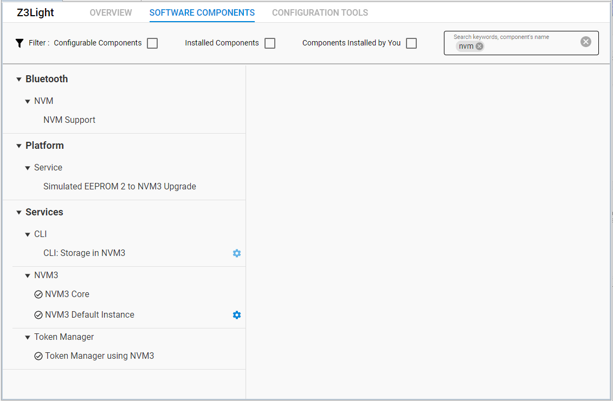

# AN1135: Using Third Generation Non-Volatile Memory (NVM3) Data Storage (Rev. 1.3) <!-- omit in toc -->

- [1. Introduction](#1-introduction)
- [2. NVM3 Default Instance](#2-nvm3-default-instance)
  - [2.1 NVM3 Default Instance Key Space](#21-nvm3-default-instance-key-space)
- [3. NVM3 in the Simplicity Studio 5 Project Configurator](#3-nvm3-in-the-simplicity-studio-5-project-configurator)
- [4. Using NVM3 with Silicon Labs Connect](#4-using-nvm3-with-silicon-labs-connect)
- [5. Using NVM3 with Silicon Labs OpenThread Applications](#5-using-nvm3-with-silicon-labs-openthread-applications)
- [6. Using NVM3 with Zigbee EmberZNet v7.x and Higher](#6-using-nvm3-with-zigbee-emberznet-v7x-and-higher)
- [7. Using NVM3 with Silicon Labs Bluetooth Applications](#7-using-nvm3-with-silicon-labs-bluetooth-applications)
  - [7.1 Configuring NVM3 in the Bluetooth SDK](#71-configuring-nvm3-in-the-bluetooth-sdk)
    - [With Simplicity Studio 5 and Bluetooth SDK v3.x](#with-simplicity-studio-5-and-bluetooth-sdk-v3x)
    - [With Simplicity Studio 4 and Bluetooth SDK v2.x](#with-simplicity-studio-4-and-bluetooth-sdk-v2x)
  - [7.2 Switching from PS Store to NVM3](#72-switching-from-ps-store-to-nvm3)
    - [With Simplicity Studio 5 and Bluetooth SDK v3.x](#with-simplicity-studio-5-and-bluetooth-sdk-v3x-1)
    - [With Simplicity Studio 4 and Bluetooth SDK v2.x](#with-simplicity-studio-4-and-bluetooth-sdk-v2x-1)
  - [7.3 Switching from NVM3 to PS Store](#73-switching-from-nvm3-to-ps-store)
    - [With Simplicity Studio 5 and Bluetooth SDK v3.x](#with-simplicity-studio-5-and-bluetooth-sdk-v3x-2)
    - [With Simplicity Studio 4 and Bluetooth SDK v2.x](#with-simplicity-studio-4-and-bluetooth-sdk-v2x-2)
- [8. Using NVM3 in AppBuilder-Based Applications](#8-using-nvm3-in-appbuilder-based-applications)
  - [8.1 NVM3 Library Plugin](#81-nvm3-library-plugin)
  - [8.2 SimEEv2 to NVM3 Upgrade Plugin](#82-simeev2-to-nvm3-upgrade-plugin)
- [9. Using NVM3 with Z-Wave Applications](#9-using-nvm3-with-z-wave-applications)
- [10. NVM3 API Options](#10-nvm3-api-options)
  - [10.1 Token API](#101-token-api)
    - [10.1.1 Deleting Tokens](#1011-deleting-tokens)
    - [10.1.2 Special Considerations for Indexed Tokens](#1012-special-considerations-for-indexed-tokens)
  - [10.2 Bluetooth NVM API](#102-bluetooth-nvm-api)
  - [10.3 Native NVM3 API](#103-native-nvm3-api)
- [11. Simplicity Commander and NVM3](#11-simplicity-commander-and-nvm3)

---

NVM3（Third Generation Non-Volatile Memory）驱动程序提供了一种读写存储在闪存中的数据对象（Key/Value Pair）的方法。磨损均衡用于减少擦写周期和最大化闪存寿命。该驱动程序对断电和重启事件是可还原的，这确保从驱动程序中检索的对象总是处于有效状态。单个 NVM3 实例可以在多个无线协议栈和应用程序代码之间共享，这使得它非常适合于多协议应用程序。本应用笔记解释了如何在 Zigbee（EmberZNet）、OpenThread、Z-Wave、Bluetooth 和 Connect 应用程序中使用 NVM3 进行非易失性数据存储。

与 Simplicity Studio 5 一起使用的 Gecko SDK Suite v3.x 引入了一种新的基于组件的项目架构，该架构取代了 AppBuilder。最终，所有无线协议都将转向到这种架构。本文档介绍了新架构和仍在使用的 AppBuilder 中的 NVM3 配置。

# 1. Introduction

NVM3 数据存储驱动程序用于在闪存中存储持久化数据。

NVM3 被设计成可以在 EFR32 上运行的所有 Silicon Labs 无线栈以及在 EFM32 上运行的 MCU 应用程序上工作。

NVM3 的一些主要特性是：

* 在闪存中使用 Key/Value Pair 数据存储
* 运行时创建和删除对象
* 在断电和复位事件间持久化
* 磨损均衡以最大化闪存寿命
* 对象大小最多可配置为 4096 字节
* 可配置闪存存储大小（最少 3 个闪存页）
* 具有可配置大小的缓存（Cache），用于加速对象访问
* 数据和计数器对象类型
* 包括多个 Silicon Labs 持久化存储 API 的兼容性层
* 在多协议应用程序中实现单个共享存储实例
* 重新封装 API，以允许应用程序在 CPU 负载较低的时间段内运行待清除页的擦除

在 [https://docs.silabs.com/](https://docs.silabs.com/) 上的 NVM3 Documentation 对 NVM3 进行了详细描述。本文档的其余部分假定您熟悉该内容。

虽然 NVM3 API 可以直接使用，但 NVM3 还可以作为 Silicon Labs 提供的其他几种持久性存储 API 的底层存储机制：

* EmberZnet 和 Connect 应用程序中使用的 Token API
* Silicon Labs Bluetooth 应用程序中使用的 Persistent Storage API

# 2. NVM3 Default Instance

可以在一个设备上创建多个 NVM3 实例，并且它们彼此独立地运行，但是为了节省存储，通常会仅使用一个 NVM3 实例，因为每个实例都会增加一些开销。对于基于 Silicon Labs 无线栈的应用程序，其使用一个通用的默认实例。这允许 DMP（Dynamic Multiprotocol，动态多协议）应用程序将多个无线栈组合在一起以共享同一个 NVM3 实例。

用于 NVM3 默认实例的闪存页数量是可配置的，如果应用程序包含了多个都使用默认实例的栈，则此设置必须进行匹配。

**重点**：当为闪存中已包含 NVM3 实例的设备创建一个包含 NVM3 实例的应用程序时，为 NVM3 实例配置的闪存页数量必须与设备上已找到的 NVM3 实例的闪存页数量匹配。因此，一旦将 NVM3 实例安装到设备上，如果不先擦除持有 NVM3 实例和 NVM3 对象的闪存页，就无法更改其大小。

NVM3 具有一个缓存用以加快对 NVM3 对象的访问。缓存大小必须设置为大于或等于在 NVM3 中已找到的对象数量。这包括通过 Native NVM3 API 创建的 NVM3 对象的数量和通过更高级的 API（如 Token API）创建的任何对象。缓存还必须足够大以容纳任何已删除的 NVM3 对象。`nvm3_countObjects()` ~~和~~ 函数可用于在任何给定点中查找 NVM3 中的存活对象和已删除对象的数量。Silicon Labs 建议在所有 NVM3 对象初始化之后，通过 Native NVM3 API 和更高级的 API（如 Token API）检查这些函数，以找出 NVM3 默认缓存大小的正确大小。

## 2.1 NVM3 Default Instance Key Space

NVM3 使用一个 20-bit Key 来标识每个对象。为了避免对多个对象使用相同的 Key，默认的 NVM3 实例的 NVM3 Key Space 已被划分为多个域，如下表所示。例如，在 Zigbee EmberZNet 栈中定义的 NVM3 对象应使用 0x10000 到 0x1FFFF 范围内的 NVM3 Key，而用户应用程序的 Token 应使用 0x10000 以下的 Key。请注意，任何用户定义的 NVM3 对象都应放置在 0x10000 以下。

<table id="Table-2.1" style="margin: auto; white-space: nowrap;">
<caption style="white-space: nowrap;">Table 2.1. NVM3 Default Instance Key Space</caption>
<thead>
  <tr>
    <th>Domain</th>
    <th>NVM3 Key</th>
  </tr>
</thead>
<tbody>
  <tr>
    <td>User</td>
    <td>0x00000 - 0x0FFFF</td>
  </tr>
  <tr>
    <td>Zigbee EmberZNet stack</td>
    <td>0x10000 - 0x1FFFF</td>
  </tr>
  <tr>
    <td>OpenThread stack</td>
    <td>0x20000 - 0x2FFFF</td>
  </tr>
  <tr>
    <td>Connect stack</td>
    <td>0x30000 - 0x3FFFF</td>
  </tr>
  <tr>
    <td>Bluetooth stack</td>
    <td>0x40000 - 0x4FFFF</td>
  </tr>
  <tr>
    <td>Z-Wave stack</td>
    <td>0x50000 - 0x5FFFF</td>
  </tr>
  <tr>
    <td>Bluetooth mesh stack</td>
    <td>0x60000 - 0x6FFFF</td>
  </tr>
  <tr>
    <td>Reserved</td>
    <td>0x70000 - 0x7FFFF</td>
  </tr>
  <tr>
    <td>Apple HomeKit</td>
    <td>0x80000 - 0x80FFF</td>
  </tr>
  <tr>
    <td>Zigbee Cluster Library (ZCL)</td>
    <td>0x81000 - 0x81FFF</td>
  </tr>
  <tr>
    <td>dotdot</td>
    <td>0x82000 - 0x82FFF</td>
  </tr>
  <tr>
    <td>Platform CLI SM</td>
    <td>0x83000 - 0x830FF</td>
  </tr>
  <tr>
    <td>Platform Crypto</td>
    <td>0x83100 - 0x870FF</td>
  </tr>
  <tr>
    <td>Bootloader</td>
    <td>0x87100 - 0x871FF</td>
  </tr>
  <tr>
    <td>Matter</td>
    <td>0x87200 - 0x87FFF</td>
  </tr>
  <tr>
    <td>Reserved</td>
    <td>0x88000 - 0x8FFFF</td>
  </tr>
  <tr>
    <td>Wi-SUN</td>
    <td>0x90000 - 0x9FFFF</td>
  </tr>
  <tr>
    <td>Reserved</td>
    <td>0xA0000 - 0xFFFFF</td>
  </tr>
</tbody>
</table>

# 3. NVM3 in the Simplicity Studio 5 Project Configurator

与 Silicon Labs Bluetooth v3.x、Connect v3.x、EmberZNet Zigbee v7.x 和 OpenThread SDK 应用程序一起使用的 Simplicity Studio 5 Project Configurator 包含一个 **NVM3 Core** 组件。还为 NVM3 默认实例提供了一个单独的组件，它将初始化该实例。



**NVM3 Default Instance** 组件提供了以下配置：

* **Cache Size** ：要缓存的对象数量。为了减少访问时间，该数量应该等于或大于任何时候存储在 NVM3 中的存活对象和已删除对象的数量。
* **Max Object Size** ：允许的最大 NVM3 对象大小，以字节为单位。必须介于 208 ~ 4096 字节。
* **User Repack Headroom** ：确定用户重新打包限制低于强制重新打包限制的字节数的余量。默认值为 0，这意味着强制和用户重新打包限制相同。
* **Default Instance Size** ：闪存中 NVM3 存储区域的大小。这必须设置为匹配整数个闪存页，最少 3 个页。

如果项目中包含了 **NVM3 Default Instance** 组件，那么如果项目中包含了 **System Init** 组件，则默认实例将在 `sl_system_init()` 期间自动初始化。

# 4. Using NVM3 with Silicon Labs Connect

本章适用于将 Proprietary Flex SDK v3.x 中的 Connect 与 Simplicity Studio 5 中的 Project Configurator 结合使用的用例。Proprietary Flex SDK v2.x 中的 Connect 与 Simplicity Studio 4 中的 AppBuilder 结合使用的用例在 [8. Using NVM3 in AppBuilder-Based Applications](#8-using-nvm3-in-appbuilder-based-applications) 中描述。

对于 Silicon Labs Connect v3.x 应用程序，在 Simplicity Studio 的 Project Configurator 的 Software Component 视图的 Platform->Driver 下有一个可用的 **Token Manager** 组件。虽然 Token Manager 提供了 [10.1 Token API](#101-token-api)，但必须为 Token 存储后端选择一个附加组件，其可以是 **Token Manager using Sim EEPROM 1**、**Token Manager using Sim EEPROM 2** 或
**Token Manager using NVM3**。如果选择 NVM3 作为存储后端，则 **NVM3** 和 **NVM3 Default Instance** 组件将包含在项目中。

# 5. Using NVM3 with Silicon Labs OpenThread Applications

本章适用于将 Silicon Labs OpenThread SDK v1.x 与 Simplicity Studio 5 中的 Project Configurator 结合使用的用例。默认情况下，GSDK 中的所有 OpenThread 示例应用程序均配置为使用 NVM3 将数据存储在非易失性存储器中。这样做时，这些应用程序：

* 利用了通用的默认 NVM3 实例
* 在项目中包含了 NVM3 Core 和 NVM3 Default Instance 组件
* 使用 Native NVM3 API 访问 NVM3 对象

OpenThread 栈使用的 NVM3 Key Space 为 0x20000 - 0x2FFFF。

# 6. Using NVM3 with Zigbee EmberZNet v7.x and Higher

本章适用于将 Silicon Labs Zigbee EmberZNet SDK v7.x 及更高版本与 Simplicity Studio 5 中的 Project Configurator 结合使用的用例。Zigbee EmberZNet 6.x 及更低版本与 AppBuilder 结合使用的用例在 [8. Using NVM3 in AppBuilder-Based Applications](#8-using-nvm3-in-appbuilder-based-applications) 中描述。

默认情况下，GSDK 中的所有 Zigbee 示例应用程序均配置为使用 NVM3 将数据存储在非易失性存储器中。这样做时，这些应用程序：

* 利用了通用的默认 NVM3 实例
* 在项目中包含了 NVM3 Core 和 NVM3 Default Instance 组件
* 使用 Native NVM3 API 访问 NVM3 对象

如果您有以旧版 SimEE 格式存储的非易失性数据，并且在将 Zigbee 应用程序迁移到 EmberZNet v7.x 或更高版本时需要保留数据，则可以使用 Token Manager 组件来帮助管理数据存储。有关详细信息，请参阅 Token Manager 组件的描述。

Zigbee 栈使用的 NVM3 Key Space 为 0x10000 - 0x1FFFF。

# 7. Using NVM3 with Silicon Labs Bluetooth Applications

传统上，Bluetooth 栈使用其专有的解决方案将数据存储在称为 **Persistent Store (PS Store)** 的非易失性存储器中。PS Store 既存储由栈处理的数据（如临时 Bluetooth 地址、绑定密钥等），又存储在复位设备时必须保留的用户数据（如设备状态）。要了解有关 PS Store 的更多信息，请阅读 [Bluetooth API Reference Guide](https://www.silabs.com/documents/login/reference-manuals/bluetooth-api-reference.pdf) 的相关部分。

Bluetooth SDK 中的一些示例应用程序仍配置为使用 PS Store，而其余示例应用程序则已配置为使用 NVM3。这意味着：

* 在 Series 1 设备上，除了 Bluetooth Mesh NCP 示例项目（默认情况下使用 NVM3）外，示例应用程序均配置为使用 PS Store。
* 在 Series 2 设备上，所有示例应用程序都配置为使用 NVM3。

Series 2 设备仅支持 NVM3，而在 Series 1 设备上 PS Store 和 NVM3 都是可用的。本节介绍了如何在 Bluetooth SDK 中配置 NVM3，以及如何在 PS Store 和 NVM3 之间进行切换。

## 7.1 Configuring NVM3 in the Bluetooth SDK

### With Simplicity Studio 5 and Bluetooth SDK v3.x

NVM3 可以使用 Project Configurator 进行配置，如 [3. NVM3 in the Simplicity Studio 5 Project Configurator](#3-nvm3-in-the-simplicity-studio-5-project-configurator) 中所述。

### With Simplicity Studio 4 and Bluetooth SDK v2.x

Project Configurator 不可用于配置 NVM3 参数。因此，必须手动定义参数。要覆盖默认参数：

1. 打开项目设置。
2. 查找定义的符号：
    1. 如果使用 GCC 作为编译器，请转到 C/C++ Build>Settings>GNU ARM C Compiler>Symbols>Defined Symbols
    2. 如果使用 IAR 作为编译器，请转到 C/C++ Build>Settings>IAR C/C++ compiler for ARM>Preprocessor>Defined Symbols
3. 添加以下任何定义以覆盖默认参数：
    * `NVM3_DEFAULT_NVM_SIZE`
    * `NVM3_DEFAULT_CACHE_SIZE`
    * `NVM3_DEFAULT_MAX_OBJECT_SIZE`
    * `NVM3_DEFAULT_REPACK_HEADROOM`

您可以在 [3. NVM3 in the Simplicity Studio 5 Project Configurator](#3-nvm3-in-the-simplicity-studio-5-project-configurator) 中找到每个参数的描述。提供 NVM3 的大小时请务必小心，因为它必须是闪存页大小的倍数。注意：在 Series 1 设备上，闪存页大小通常为 2 kB；而在 Series 2 设备上，闪存页大小通常为 8 kB。请检查设备的 datasheet。NVM 的大小必须至少为 3 个闪存页。

## 7.2 Switching from PS Store to NVM3

从 Bluetooth SDK v2.13.0 起，PS Store 和 NVM3 都可以作为 Series 1 设备上的非易失性存储解决方案。默认情况下，大多数示例应用程序都配置为使用 PS Store，但是对于某些应用程序（需要更大的非易失性存储），NVM3 可能是更好的解决方案。

**注意**：PS Store 和 NVM3 互不兼容，因此将已有的应用程序从 PS Store 升级到 NVM3 将导致设备上存储的所有数据丢失。如果您有一个正在现场运行的应用程序，那么最好还是将其停留在 PS Store 上。如果您仍要升级，请参阅 *AN1086: Using the Gecko Bootloader with the Silicon Labs Bluetooth® Application* 以了解更多信息。

**注意**：PS Store 仅使用 2 个闪存页（在 EFR32BG1/12/13 设备上为 4 kB）。因此，更改为 NVM3 时将影响闪存中的可用空间。升级固件时必须特别小心，以免将应用程序覆盖到 NVM3 区域。

### With Simplicity Studio 5 and Bluetooth SDK v3.x

要将项目配置从 PS Store 更改为 NVM3，只需如 [3. NVM3 in the Simplicity Studio 5 Project Configurator](#3-nvm3-in-the-simplicity-studio-5-project-configurator) 中讨论的那样，在 Project Configurator 中安装 **NVM3 Default Instance** 组件。这会自动卸载 PS Store 组件。

### With Simplicity Studio 4 and Bluetooth SDK v2.x

要将项目配置从 PS Store 更改为 NVM3，请使用以下过程：

1. 复制以下文件夹及其所有内容：
    ```
    C:\SiliconLabs\SimplicityStudio\v4\developer\sdks\gecko_sdk_suite\<version>\platform\emdrv\nvm3
    ```
    到您的项目的 `/platform/emdrv` 文件夹下。
2. 从项目中移除以下文件：
    * `/platform/emdrv/nvm3/src/nvm3_hal_extflash.c`
    * `/platform/emdrv/nvm3/src/nvm3_default_extflash.c` (NVM3 use with external flash is deprecated)
3. 如果您在项目中使用 Apploader，请从以下位置复制 NVM3 版本的 Apploader：
    ```
    C:\SiliconLabs\SimplicityStudio\v4\developer\sdks\gecko_sdk_suite\<version>\protocol\bluetooth\lib\<device>\<compiler>\binapploader_nvm3.o
    ```
    到您的项目的 `/protocol/bluetooth/lib/<device>/<compiler>` 文件夹下。
4. 如果您使用的是 GCC 编译器：
    1. 转到 `Project > Properties > C/C++ Build > Settings > GNU ARM C Compiler > Includes`。
    2. 添加 `${workspace_loc:/${ProjName}/platform/emdrv/nvm3/inc}` 到包含目录中。
    3. 转到 `Project > Properties > C/C++ Build > Settings > GNU ARM C Linker > Miscellaneous`。
    4. 移除 `${workspace_loc:/${ProjName}/protocol/bluetooth/lib/<device>/<compiler>/libpsstore.a}`。
    5. 添加 `${workspace_loc:/${ProjName}/platform/emdrv/nvm3/lib/libnvm3_CM4_gcc.a}`。
    
    如果您使用的是 IAR 编译器：
    1. 转到 `Project > Properties > C/C++ Build > Settings > IAR C/C++ Compiler for ARM > Preprocessor`。
    2. 添加 `${workspace_loc:/${ProjName}/platform/emdrv/nvm3/inc}` 到包含目录中。
    3. 转到 `Project > Properties > C/C++ Build > Settings > IAR Linker for ARM > Library`。
    4. 移除 `${workspace_loc:/${ProjName}/protocol/bluetooth/lib/<device>/<compiler>/libpsstore.a}`。
    5.  添加 `${workspace_loc:/${ProjName}/platform/emdrv/nvm3/lib/libnvm3_CM4_iar.a}`。
5. 如果您使用 Apploader，则还要修改：
    ```
    ${workspace_loc:/${ProjName}/protocol/bluetooth/lib/<device>/<compiler>/binapploader.o}
    ```
    为
    ```
    ${workspace_loc:/${ProjName}/protocol/bluetooth/lib/<device>/<compiler>/binapploader_nvm3.o}
    ```
6. 如 [7.1 Configuring NVM3 in the Bluetooth SDK](#71-configuring-nvm3-in-the-bluetooth-sdk) 所述配置 NVM3。

## 7.3 Switching from NVM3 to PS Store

由于诸如向后兼容性之类的原因，可能必须将配置从 NVM3 更改为 PS Store。

### With Simplicity Studio 5 and Bluetooth SDK v3.x

要将项目配置从 NVM3 更改为 PS Store，只需卸载 NVM3 Default Instance 组件。这会自动安装 PS Store 组件。请注意，这方法只在 Series 1 设备上可用，因为 Series 2 设备不支持 PS Store。

### With Simplicity Studio 4 and Bluetooth SDK v2.x

要将项目配置从 NVM3 更改为 PS Store，请使用以下过程：

1. 从您的项目中移除 `/platform/emdrv/nvm3`。
2. 从 `C:\SiliconLabs\SimplicityStudio\v4\developer\sdks\gecko_sdk_suite\<version>\protocol\bluetooth\lib\<device>\<compiler>\libpsstore.a` 中复制 PS Store 库到您项目中的 `/protocol/bluetooth/lib/<device>/<compiler>` 目录。
3. 如果您在项目中使用 Apploader，请从以下位置复制 PS Store 版本的 Apploader：
    ```
    C:\SiliconLabs\SimplicityStudio\v4\developer\sdks\gecko_sdk_suite\<version>\protocol\bluetooth\lib\<device>\<compiler>\binapploader.o
    ```
    到您的项目的 `/protocol/bluetooth/lib/<device>/<compiler>` 文件夹下。
    **注意**：Series 2 设备（EFR32xG2x）不支持 PS Store，因此这些设备只有 NVM3 版本的 Apploader。
4. 如果您使用的是 GCC 编译器：
    1. 转到 `Project > Properties > C/C++ Build > Settings > GNU ARM C Compiler > Includes`。
    2. 从包含目录中移除 `${workspace_loc:/${ProjName}/platform/emdrv/nvm3/inc}`。
    3. 转到 `Project > Properties > C/C++ Build > Settings > GNU ARM C Linker > Miscellaneous`。
    4. 添加 `${workspace_loc:/${ProjName}/protocol/bluetooth/lib/<device>/<compiler>/libpsstore.a}`。
    5. 移除 `${workspace_loc:/${ProjName}/platform/emdrv/nvm3/lib/libnvm3_CM4_gcc.a}`。
    
    如果您使用的是 IAR 编译器：
    1. 转到 `Project > Properties > C/C++ Build > Settings > IAR C/C++ Compiler for ARM > Preprocessor`。
    2. 从包含目录中移除 `${workspace_loc:/${ProjName}/platform/emdrv/nvm3/inc}`。
    3. 转到 `Project > Properties > C/C++ Build > Settings > IAR Linker for ARM > Library`。
    4. 添加 `${workspace_loc:/${ProjName}/protocol/bluetooth/lib/<device>/<compiler>/libpsstore.a}`。
    5. 移除 `${workspace_loc:/${ProjName}/platform/emdrv/nvm3/lib/libnvm3_CM4_iar.a}`。
5. 如果您使用 Apploader，则还要修改：
    ```
    ${workspace_loc:/${ProjName}/protocol/bluetooth/lib/<device>/<compiler>/binapploader_nvm3.o}
    ```
    为
    ```
    ${workspace_loc:/${ProjName}/protocol/bluetooth/lib/<device>/<compiler>/binapploader.o}
    ```

# 8. Using NVM3 in AppBuilder-Based Applications

本章介绍了如何在基于 Appbuilder 的应用程序中将 NVM3 用于非易失性存储，如 EmberZNet EmberZNet 6.10.x 及更低版本、GSDK 3.2 及更低版本中的 EmberZNet-based DMP 应用程序，和 Gecko SDK Suite 2.7 及更低版本中的 Connect 应用程序。

## 8.1 NVM3 Library Plugin

要将 NVM3 与 AppBuilder-based 示例应用程序一起使用，**NVM3 Library** 插件应包含在项目中。所有 PS Store 和 SimEE 插件均应取消选中。


**NVM3 Library** 插件提供了四个插件选项：

* **Flash Pages** ：用于 NVM3 数据存储的闪存页数量。必须为 3 或更高。对于 EFR32 Series 1 设备，默认值为 18（36 KB）；对于 EFR32 Series 2 设备，默认值为 4（32 KB）。
* **Cache Size** ：要缓存的对象数量。为了减少访问时间，该数量应等于或大于任何时候存储在 NVM3 中的对象的数量，包括 token 和已删除的对象。
* **Max Object Size** ：允许的最大 NVM3 对象大小，以 byte 为单位。必须介于 208 ~ 4096 byte。请注意，Token API 仅可用于访问 254 byte 或更小的对象。访问较大的对象时，必须使用 Native NVM3 API。
* **User Repack Headroom** ：确定用户重新打包限制低于强制重新打包限制的字节数的余量。默认值为 0，这意味着强制和用户重新打包限制相同。

当使用 NVM3 Library 插件时，必须包含 **Simulated EEPROM version 2 to NVM3 Upgrade Library** 或 **Simulated EEPROM version 2 to NVM3 Upgrade Stub Library**，如 [8.2 SimEEv2 to NVM3 Upgrade Plugin](#82-simeev2-to-nvm3-upgrade-plugin) 中所述。

## 8.2 SimEEv2 to NVM3 Upgrade Plugin

为 EmberZNet 应用程序提供了一个 AppBuilder 插件（ **Simulated EEPROM version 2 to NVM3 Upgrade Library** ），以将存储在 SimEEv2 中的 Token 升级到 NVM3。为了将 Token 成功升级到 NVM3，必须为所有 Token 添加 `CREATOR_*` 和 `NVM3KEY_*` 定义，如 [10.1 Token API](#101-token-api) 所述。该插件将使用 NVM3 存储实例替换 SimEEv2 存储。该插件通过将 SimEEv2 存储空间压缩至 12 kB 来实现此目的，然后在原来的 36 kB 的 SimEEv2 存储空间的剩余 24 kB 中创建一个 NVM3 实例。将 Token 数据从 SimEEv2 复制到 NVM3 之后，将擦除 SimEEv2 存储，并调整 NVM3 实例的大小以使用整个 36 kB 存储空间。除了升级库代码所需的代码空间外，升级不需要向 36 kB 存储区增加任何闪存空间。该插件要求现有的 SimEEv2 存储空间和新的 NVM3 存储空间位于相同的地址并具有相同的大小。

应当包含 **Simulated EEPROM version 2 to NVM3 Upgrade Library** 插件，以启用升级，如下图所示。如果未找到 SimEEv2 Token 数据，则该插件将查找 NVM3 数据，如果未找到，则将创建一个新的 NVM3 实例，并将 Token 设置为其默认值。对于不需要升级任何 SimEEv2 Token 的应用程序，应改为包含 **Simulated EEPROM version 2 to NVM3 Upgrade Stub** 插件。


# 9. Using NVM3 with Z-Wave Applications

有关将 NVM3 与 Z-Wave 应用程序结合使用的详细信息，请参阅 [https://www.silabs.com/documents/public/user-guides/INS14259.pdf](https://www.silabs.com/documents/public/user-guides/INS14259.pdf) 的 7.4 节。

# 10. NVM3 API Options

本章了介绍可用于访问 NVM3 对象的三种不同的 API。

* Token API
* Persistent Store API
* Native NVM3 API

## 10.1 Token API

Token API 用于通过 EmberZNet 和 Connect 栈以及多协议应用程序访问存储在 SimEEv1 和 SimEEv2 中的数据。有关如何定义和访问 Token 的信息，请参阅 *AN1154: Using Tokens for Non-Volatile Data Storage*，用户应在使用 Token API 之前阅读此文档。当选择中 NVM3 Library 插件而不是一个 SimEE 插件时，NVM3 默认实例将代替 SimEE 用以存储 Token 数据。仍然可以使用相同的 Token API 访问存储在 NVM3 中的 Token，但是 Token 的定义需要进行一些修改才能与 NVM3 一起工作，如下所述。

定义与 SimEE 一起使用的 Token 时，必须定义一个 Creator Code 以作为 Token 的标识符。同样地，在定义与 NVM3 一起使用的 Token 时，必须为 Token 定义 NVM3 Key。与 NVM3 和 SimEE 都兼容的 Token 定义将同时包含 NVM3 Key 和 Creator Code，如下所示：

```c
#define CREATOR_name    16bit_value
#define NVM3KEY_name    20bit_value
#ifdef DEFINETYPES
    typedef data_type type
#endif
#ifdef DEFINETOKENS
    DEFINE_*_TOKEN(name, type, ... ,defaults)
#endif
```

根据 [Table 2.1 NVM3 Default Instance Key Space](#Table-2.1) 中的域，为 Token 选择一个 20-bit NVM3 Key。每个 Token 必须具有唯一的 NVM3 Key，但 Indexed Token 除外，其中必须保留更多 NVM3 Key 如 [10.1.2 Special Considerations for Indexed Tokens](#1012-special-considerations-for-indexed-tokens) 所述。

### 10.1.1 Deleting Tokens

Token 是在编译时创建的，无法在运行时创建或删除 Token。但是，NVM3 对象是可以在运行时创建和删除的，并且 Token 初始化函数会为每个已定义的 Token 创建 NVM3 对象（如果尚不存在）。Token 初始化通常不会删除 NVM3 对象（没有与之关联的相应 Token）。因此，如果一个 Token 不再包含在应用程序中，则应用程序应使用 [10.3 Native NVM3 API](#103-native-nvm3-api) 中所述的 NVM3 Native API 手动删除其关联的 NVM3 对象。然而，对于 Indexed Token，Token 初始化会检查 Indexed Token 的索引是否大于或小于 Indexed Token 的 NVK3KEY 范围中找到的 NVM3 对象的数量。如果索引较少，则 Token 初始化将删除多余的 NVM3 对象。如果索引数量增加了，则将创建新的 NVM3 对象来保存这些索引。

删除 NVM3 对象时，实际的对象数据保留在 NVM3 中，但标记为已删除。删除的对象数据保留在 NVM3 中，并占用缓存空间，直到 NVM3 重新填充擦除包含这些对象所有版本的页为止。

### 10.1.2 Special Considerations for Indexed Tokens

NVM3 没有对 Indexed Token 的 Native 支持。因此，对 Indexed Token 的 NVM3 Key 选择提出了额外要求。使用 NVM3，可通过将每个索引存储在单独的对象中来实现 Indexed Token，该索引从 0（存储在所定义的 `NVM3KEY_name` Key value）开始到 127（使用 Key `NVM3KEY_name` + 127 存储）。在此实现中，必须为每个 Indexed Token 保留 128 个 NVM3 Key。用户仍然只需定义一个 `NVM3KEY_name` Key 值，但不应使用此定义的 Key 之后的 127 个值中的 Key 值来定义其他 Token。即使 Token 的定义少于 128 个索引，也应保留 128 个索引，以便后续的扩展。

下面的示例展示了在 User Key Domain 中定义的两个 Indexed Token：

```c
// This key is used for an indexed token and the subsequent 0x7F keys are also reserved
#define NVM3KEY_MY_INDEXED_TOKEN_A 0x00000
// This key is used for an indexed token and the subsequent 0x7F keys are also reserved
#define NVM3KEY_MY_INDEXED_TOKEN_B 0x00080
```

| NVM3KEY | NVM3 Objects Contents                               |
| :-----: | :-------------------------------------------------- |
| 0x00000 | Reserved for TOKEN\_MY\_INDEXED\_TOKEN\_A index 0   |
| 0x00001 | Reserved for TOKEN\_MY\_INDEXED\_TOKEN\_A index 1   |
| 0x00002 | Reserved for TOKEN\_MY\_INDEXED\_TOKEN\_A index 2   |
|   ...   |                                                     |
| 0x0007F | Reserved for TOKEN\_MY\_INDEXED\_TOKEN\_A index 127 |
| 0x00080 | Reserved for TOKEN\_MY\_INDEXED\_TOKEN\_B index 0   |
| 0x00081 | Reserved for TOKEN\_MY\_INDEXED\_TOKEN\_B index 1   |
|   ...   |                                                     |
| 0x000FF | Reserved for TOKEN\_MY\_INDEXED\_TOKEN\_B index 127 |

## 10.2 Bluetooth NVM API

最初为 PS Store 设计的 Bluetooth NVM API 可以在使用 NVM3 和 PS Store 时以相同的方式使用。Bluetooth 栈会在背后自动将其 NVM API 调用转换为 PS Store API 调用或 NVM3 API 调用，具体取决于项目所使用的组件。Zigbee + Bluetooth DMP 项目也是如此，其中 NVM3 被用作存储机制，但是 Bluetooth NVM API 仍然可以使用。Bluetooth API Reference Manual 中记录了 Bluetooth API。在 Bluetooth SDK v2.x 中，可以在 *Flash* 分类下找到该命令（以 `gecko_cmd_flash_` 开头的命令），而在 Bluetooth SDK v3.x 中，可以在 *NVM* 分类下找到它（以 `sl_bt_nvm` 开头的命令）。

Bluetooth NVM API 使用 16-bit Key，然后在将 NVM3 用作存储机制时将其映射到 20-bit NVM3 Key。四个最高有效位设置为 0x4，以将这些对象放置在 NVM3 默认实例的 Key Space 的 Bluetooth Domain 中。由于将 Bluetooth NVM API 固定为仅使用 Bluetooth Domain，因此必须使用 Native NVM3 API 来创建和访问放置在其他域（如 User Domain）中的任何对象。

如果要在同一应用程序中使用 Bluetooth NVM API 和 Native NVM3 API，则：

1. 调用 `gecko_init(pconfig)` 初始化 Bluetooth 栈并打开其自己的 NVM3 实例。这是在所有 Bluetooth 示例应用中完成的。
2. 通过使用默认参数调用 `nvm3_open()` 函数来打开 NVM3，以打开您的 NVM3 实例：
    ```c
    nvm3_open(nvm3_defaultHandle, nvm3_defaultInit);
    ```

用户数据现在可以保存到：

* PS Key 范围 0x4000 - 0x407F。所有其他 PS Key（0x0000 - 0xFFFF）都为栈保留（如用于存储绑定数据）。
* NVM3 Key 范围 0x00000 - 0x0FFFF（NVM3 User Data Area）和 0x44000 - 0x4407F（PS Store User Data Area）。

例如，以下 API 调用将具有相同的效果（写入相同的区域）：

* `nvm3_writeData(nvm3_defaultHandle,0x44000,(void*)data,len);`
* `gecko_cmd_flash_ps_save(0x4000,len,data); //in Bluetooth SDK v2.x`
* `sl_bt_nvm_save(0x4000,len,data); //in Bluetooth SDK v3.x`

同样地，您可以通过以下 API 调用读取相同的数据：

* `nvm3_readData(nvm3_defaultHandle,0x44000,(void*)read_buffer,maxlen);`
* `gecko_cmd_flash_ps_load(0x4000); //in Bluetooth SDK v2.x`
* `sl_bt_nvm_load(0x4000,maxlen,&read_len,(uint8_t*)read_buffer); //in Bluetooth SDK v3.x`

## 10.3 Native NVM3 API

对于不需要与 Token 或 PS Store API 兼容的 NVM3 对象的代码访问，建议使用 Native NVM3 API 来访问 NVM3 数据，以减少代码大小并允许使用 NVM3 的全部特性。也可以使用同一 NVM3 Key 通过 Native NVM3 API 访问任何 PS Store 对象或 Token。此 API 的完整文档可在 [Gecko Platform Developer Documentation](https://docs.silabs.com/gecko-platform/latest/driver/api/group-nvm3) 的 Drivers 部分中找到。如果您使用的是早期版本的 GSDK，请在该页面的版本历史记录中搜索相应的版本。

# 11. Simplicity Commander and NVM3

Simplicity Commander 是在生产环境中使用的一个通用工具。也可以编写脚本或通过 CLI（Command Line Interface）来调用它。Simplicity Commander 支持从设备读取 NVM3 数据区域并解析 NVM3 数据以提取存储的值。这在调试场景中很有用，在这种情况下，您可能需要找出已经运行了一段时间的应用程序的存储状态。

*UG162: Simplicity Commander Reference Guide* 中提供了有关如何将 Simplicity Commander 与 NVM3 一起使用的更多信息。
