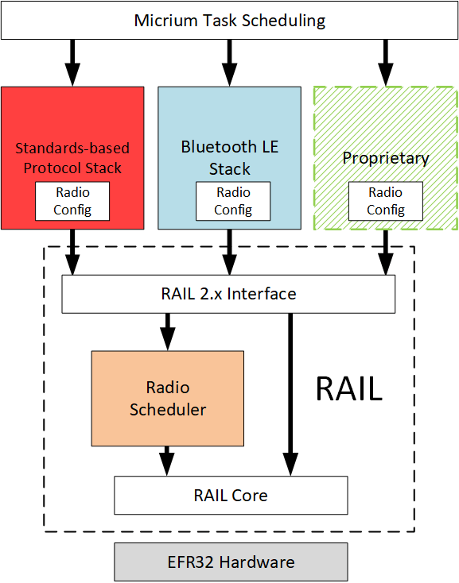

# UG103.16: Multiprotocol Fundamentals (Rev. 0.3) <!-- omit in toc -->

- [1. Introduction](#1-introduction)
- [2. Types of Multiprotocol Implementations](#2-types-of-multiprotocol-implementations)
  - [2.1 Programmable Multiprotocol](#21-programmable-multiprotocol)
  - [2.2 Switched Multiprotocol](#22-switched-multiprotocol)
  - [2.3 Dynamic Multiprotocol](#23-dynamic-multiprotocol)
  - [2.4 Concurrent Multiprotocol](#24-concurrent-multiprotocol)
- [3. Protocol Considerations](#3-protocol-considerations)
  - [3.1 Dynamic Multiprotocol Example](#31-dynamic-multiprotocol-example)
  - [3.2 Concurrent Multiprotocol Example](#32-concurrent-multiprotocol-example)
- [4. Radio Scheduler](#4-radio-scheduler)

---

本文档讨论了在单个芯片上使用多个协议的方法。它讨论了为多协议实现选择协议时的注意事项。还描述了 Silicon Labs Radio Scheduler 的基础知识，这是动态多协议解决方案的必需组件。

# 1. Introduction

Silicon Labs 正在开发满足客户需求的产品，因为我们正在进入一个家庭物联网（IoT）的世界。在高层次上，Silicon Labs 物联网的目标是：

* 无论是 Zigbee PRO 还是其他新兴标准，都可以通过一流的网络连接家中的所有设备。
* 利用公司在低功耗、受限设备方面的专业知识。
* 增强现有的低功耗、混合信号芯片。
* 为现有的以太网和 Wi-Fi 设备提供低成本的桥接。
* 实现云服务和与智能手机和平板电脑的连接，促进易用性和为客户提供通用的用户体验。

实现所有的这些目标将提高联网家庭中物联网设备的采用率和用户接受度。

通常，在单个设备上实现多个协议允许：

* 节省成本：单个设备可以执行多个功能。
* 节省空间：当协议可以共享单个无线电时，最终用户产品包装可以更小更简单。
* 节能：减少网络上的设备数量。

本文档介绍了实现多协议设备的四种不同方法以及有效实现的基础设施要求。它讨论了在为多协议实现选择协议时要考虑的协议操作的一些事项。最后，它总结了 Silicon Labs Radio Scheduler 的操作，这是动态多协议实现的重要组成部分。

# 2. Types of Multiprotocol Implementations

可以通过四种不同方式在单个设备上实现多个协议：

* 编程式（Programmable）：兼容多种协议的设备使用在制造中的一种协议进行编程。
* 切换式（Switched）：应用程序使用 bootloader 在协议之间切换。
* 动态式（Dynamic）：两个协议之间的应用程序时间片。
* 并发式（Concurrent）：应用程序在单个无线电的同一 RF 信道上运行两种协议。

以下部分更详细地讨论了这些实现。

## 2.1 Programmable Multiprotocol

编程式多协议实现需要一个具有支持多于一种协议的基础设施的芯片。应用程序在不同的协议中开发，如 Zigbee 和 Thread。每个芯片都在制造过程中使用单个应用程序进行编程。通过将单个芯片用于多种应用程序和目的，客户可以节省成本。

## 2.2 Switched Multiprotocol

在切换式多协议中，设备最初使用一种协议进行编程，然后在将来的某个时间点使用 bootloader 切换到另一种协议。切换式多协议有两个主要用例。

面向未来：设备制造商可能需要将他们的设备销售到不同的协议环境中，或者可能希望规划随时间变化的环境。

通过智能手机 commissioning：致力于单一协议环境（如 Zigbee Home Automation）的设备制造商可能希望使添加新设备的过程更安全和用户友好。在这种情况下，设备最初使用 Bluetooth commissioning 应用程序进行编程。Home Gateway/Trust Center 也使用 Bluetooth 应用程序编程，客户在其智能手机上使用一个 commissioning 应用程序。使用该智能手机应用程序，可以将新设备加入到网络中，与网络中的其他合适设备建立配对，然后切换网络协议。每个无线网络协议都有自己的加入和配对设备的机制，但所有这些都可以通过这种机制来适应。

一个有效的切换式多协议实现需要：

* 具有足够的内存以支持多协议平台。
* 通过一致的 API 来使用无线电。
* 交叉兼容的 bootloader。

## 2.3 Dynamic Multiprotocol

在动态式多协议实现中，两个协议并发运行，但应用程序对无线电进行时间分片并快速改变无线电配置（如信道），以使不同的无线协议能够同时可靠地运行。在时间分片中，软件基于其优先级和最小持续时间来调度任务，并且默认了一个后台任务以监听预定的任务。如果安排了更高优先级的任务，调度程序甚至会中断或延迟较低优先级的任务。

动态式多协议实现允许设备执行多个并发功能。例如，用户可以使用智能手机应用程序通过 Bluetooth 连接到设备以对其进行控制或执行诊断，同时将该设备连接到 Zigbee 网络以路由数据包并执行 ZCL（Zigbee Cluster Library）命令。

除了具有足够的内存、通用的代码基础设施、通用的无线电接口和支持多协议平台之外，一个有效的动态式多协议实现还需要：

* 一个用于支持任务切换和资源共享的 RTOS。
* 一个用于管理时间分片的无线电调度器。有关 Silicon Labs 无线电调度器的背景信息，请参阅 [4. Radio Scheduler](#4-Radio-Scheduler)。

有关 Silicon Labs 动态式多协议实现的其他信息，请参阅 *UG305: Dynamic Multiprotocol User's Guide* 。有关 Silicon Labs RAIL 的信息，请参阅 *UG103.13: RAIL Fundamentals* 。

## 2.4 Concurrent Multiprotocol

在并发式多协议实现中，两个协议不仅并发运行，而且共享相同的无线电信道。例如，Zigbee/Thread 网关或控制器设备可以管理网络从一种协议到另一种协议的转换，或者可以同时管理 Zigbee-based 和 Thread-based 网络。多协议设备始终控制网络使用的信道。在两个独立网络的情况下，它们必须能够通过缩放其流量或限制网络上的设备数量来适应减少的带宽。

# 3. Protocol Considerations

重要的是要认识到单个无线电不能同时接收或发送两个不同协议的两个数据包。为了共享单个无线电，两个协议都必须接受它们不会 100% 使用无线电。因此，它们必须能够在不显著降低性能或丢失应用程序消息的情况下放弃接管无线电。在这种情况下，“显著” 意味着应用程序在其预期的操作参数之外工作，如消息延迟或高于可接受的消息丢失。

虽然某些协议和应用程序对数据包传输有严格的时序要求，但在大多数情况下，多协议关注的是接收来自网络的传入数据包。

为了使协议成为动态式或并发式多协议实现的良好候选者，需要考虑以下因素。

* 在正常操作条件下（除了 commissioning、固件升级等），这两种协议都不能长时间（每次超过几毫秒）接管无线电。
* 一个或两个协议必须具有用于管理传入数据包丢失的强大机制，如 MAC 重试。
* 用例要求对一个或两个协议严格限制无线电使用，如只发射、低占空比。
* 一个或两个协议必须具有非常短的数据包和/或无线电所需的短时间。
* 一个或两个协议必须实现严格的时隙/连接间隔；和/或两个协议必须使用相同的无线电 PHY（如 IEEE 802.15.4）和信道。

> 注意：当无线电必须在两个不同的 PHY 之间切换时，它会从一个网络或另一个网络 “消失”。若设备在协议中是 sleepy end device 的父设备，那么当该设备 “消失” 时，sleepy end device 唤醒以发送消息将不可用，常规地依赖重试将影响 sleepy end device 的电池寿命。

> 注意：如果您要使用的一个协议只是要使用多种无线电配置，则您无需实施多协议。例如，Silicon Labs 的 RAIL 和无线电配置器支持同一协议中的多个无线电配置。有详情请参见 *AN971: EFR32 Radio Configurator Guide* 。当使用多种不同协议时多协议才有意义。

## 3.1 Dynamic Multiprotocol Example

Bluetooth LE 和 Zigbee 是用于动态式多协议实现的合适协议。由于 Zigbee 流量的低占空比和 Zigbee 网络栈中的重试机制，Zigbee Router 可以在短时间内将其无线电切换到某个其他频率/协议，而不会在应用级丢弃任何消息。

可以提前预测和计划 Bluetooth LE 无线电的使用。Bluetooth 信标（beacon）是非常短的数据包，通常最多 30 byte。无线电仅需要大约 1 ms 来发送信标，并且信标之间的间隔通常不小于 100 ms，因此只需要提供仅 1% 的占空比。这意味着无线电可以将至少 99% 的时间用于主要的 Zigbee 网络。

如果您使用的是 Silicon Labs 的产品，则还可以将 Bluetooth LE 添加到大多数专用网络中，因为 Bluetooth LE 数据包较短且通信之间的延迟较长。将专用协议栈与 Bluetooth 协议栈一起使用时，应检查所有专用通信，以确定其优先级和所需的定时精度。更多详情请参阅 *UG305: Dynamic Multiprotocol User's Guide* 和 *AN1134: Dynamic Multiprotocol Development with Bluetooth and Proprietary Protocols on RAIL* 。

## 3.2 Concurrent Multiprotocol Example

Zigbee 和 Thread 是用于并发式多协议实现的合适协议的一个示例。

多协议设备可以控制它在哪个 IEEE 802.15.4 信道上运行，以连接到其他 Zigbee 和 Thread 设备。它只有一个 IEEE 802.15.4 MAC/PHY 同时在两个网络上监听/发送，这意味着不需要切换无线 PHY。

多协议设备可以通过过滤两个 PAN ID 来管理来自任一网络的传入数据包，从而指向适当的网络栈。

操作的约束包括：

多协议设备必须控制 Zigbee 和 Thread 的相同 IEEE 802.15.4 信道的选择，这意味着它很可能是 Zigbee Coordinator/Thread Leader，实际上是两个网络中的 Gateway/Controller。

不能要求设备同时接收 Zigbee 和 Thread 数据包。然而，由于 MAC 重试，这在大多数用例中不应该是一个限制。

设备到/从 Zigbee 和 Thread 流量的组合占空比不得超过单个 Zigbee 或 Thread 设备通常能容忍的。（The combined duty cycle of the Zigbee and Thread traffic to/from the device must not exceed what would normally be tolerated by a single Zigbee or Thread device.）

# 4. Radio Scheduler

无线电调度器是动态式多协议实现的基本组成部分。它是一个根据无线协议栈和制造商的应用程序要求来调度无线电任务的系统。本节介绍无线电调度器的基本概念。有关 Silicon Labs 无线电调度器操作的详细信息（包括示例），请参阅 *UG305: Dynamic Multiprotocol User's Guide* 。

Silicon Labs 无线电调度器是 RAIL 库的一部分。它在无线电硬件之上和 RAIL API 之下运行，如下图所示。

根据情况，每个协议中的不同无线电事件可能或多或少地重要，或者或多或少地对时间敏感。无线电调度器在决定如何裁决时可以考虑这些因素。

Micrium OS 是一种 RTOS，允许协议栈和应用程序逻辑共享 CPU 执行时间。

无线电调度器使用以下概念：

**Radio Operation** ：预定的特定动作。无线电操作具有一个无线电配置和优先级。每个协议栈都可以请求无线电调度器执行三个无线电操作：

* 后台接收：持续接收，旨在被其他任务中断
* 预定接收：在未来时间内以最短持续时间接收
* 预定发送：在未来时间内以最短持续时间发送

**Radio Config** ：确定用于执行无线电操作的必须硬件状态。

**Priority** ：每个协议栈的每个操作都具有默认优先级。应用程序可以更改默认优先级。

**Slip Time** ：如果无法在请求的开始时间发起操作，则在未来可以发起操作时的最大时间。

**Yield** ：除非执行后台接收，否则协议栈必须在一个操作或一个操作序列结束时自愿放弃。在协议栈 yield 之前，调度程序将不会调度优先级较低的任务。

如果优先级较高的任务与之冲突，则无线电调度器可以中断预定的无线电操作。这可能在以下两种情况中发生：

1. 在必须发起更高优先级的无线电操作之前，预定的无线电操作花费的时间比预期的要长，并且相应的协议栈没有放弃。
2. 预定的更高优先级的无线电操作在未来发生，并且与已经预定的低优先级操作发生冲突。

某些长期存在的无线电操作会对产品的正确操作产生巨大影响。应用程序可能需要在协议之间协调这些任务。如果应用程序没有这样做，那么无线电调度器的优先级将优先。这可能导致任务被提前中断。
