# UG305: Dynamic Multiprotocol User’s Guide (Rev. 1.1) <!-- omit in toc -->

- [1. Introduction](#1-introduction)
  - [1.1 Terminology](#11-terminology)
  - [1.2 Architecture](#12-architecture)
  - [1.3 Single Firmware Image](#13-single-firmware-image)
  - [1.4 Independent Stack Operation](#14-independent-stack-operation)
- [2. The Radio Scheduler](#2-the-radio-scheduler)
  - [2.1 Radio Operations](#21-radio-operations)
    - [2.1.1 Background Receive](#211-background-receive)
    - [2.1.2 Scheduled Receive](#212-scheduled-receive)
    - [2.1.3 Scheduled Transmit](#213-scheduled-transmit)
  - [2.2 Radio Config](#22-radio-config)
  - [2.3 Priority](#23-priority)
  - [2.4 Slip Time](#24-slip-time)
  - [2.5 Yield](#25-yield)
  - [2.6 Interrupting a Radio Operation](#26-interrupting-a-radio-operation)
  - [2.7 Long-Lived Radio Operations](#27-long-lived-radio-operations)
- [3. Radio Scheduler Examples](#3-radio-scheduler-examples)
  - [3.1 Priority Scheduling](#31-priority-scheduling)
  - [3.2 Priority Interruption Example](#32-priority-interruption-example)
  - [3.3 Higher Priority Operation that is Extended](#33-higher-priority-operation-that-is-extended)
  - [3.4 Higher Priority Operation Without Interruption](#34-higher-priority-operation-without-interruption)
  - [3.5 Receive When a Higher Priority Operation is Running](#35-receive-when-a-higher-priority-operation-is-running)
- [4. Micrium OS](#4-micrium-os)
  - [4.1 Zigbee and Bluetooth](#41-zigbee-and-bluetooth)
    - [4.1.1 Inter-Task Communication](#411-inter-task-communication)
    - [4.1.2 Task Descriptions](#412-task-descriptions)
      - [4.1.2.1 Application/Zigbee Stack Task](#4121-applicationzigbee-stack-task)
      - [4.1.2.2 Bluetooth Link Layer Task](#4122-bluetooth-link-layer-task)
      - [4.1.2.3 Bluetooth Host Task](#4123-bluetooth-host-task)
      - [4.1.2.4 Idle Task](#4124-idle-task)
  - [4.2 Connect and Bluetooth](#42-connect-and-bluetooth)
    - [4.2.1 Inter-Task Communication](#421-inter-task-communication)
    - [4.2.2 Connect Task Descriptions](#422-connect-task-descriptions)
      - [4.2.2.1 Task Initialization](#4221-task-initialization)
      - [4.2.2.2 Connect Stack Task](#4222-connect-stack-task)
      - [4.2.2.3 Application Framework/Customer Application Task](#4223-application-frameworkcustomer-application-task)
      - [4.2.2.4 Bluetooth Link Layer Task](#4224-bluetooth-link-layer-task)
      - [4.2.2.5 Bluetooth Host Task](#4225-bluetooth-host-task)
      - [4.2.2.6 Idle Task](#4226-idle-task)
  - [4.3 Updating the v3.x Bluetooth Stack](#43-updating-the-v3x-bluetooth-stack)
    - [4.3.1 Issuing Bluetooth Events in v3.x](#431-issuing-bluetooth-events-in-v3x)
    - [4.3.2 Bluetooth Command Handling in v3.x](#432-bluetooth-command-handling-in-v3x)
  - [4.4 Updating the v2.x Bluetooth Stack](#44-updating-the-v2x-bluetooth-stack)
    - [4.4.1 Issuing Bluetooth Events in v2.x](#441-issuing-bluetooth-events-in-v2x)
    - [4.4.2 Bluetooth Command Handling in v2.x](#442-bluetooth-command-handling-in-v2x)
- [5. Implementing Multiprotocol with an 802.15.4-Based Stack](#5-implementing-multiprotocol-with-an-802154-based-stack)
  - [5.1 Wireless Protocol Support](#51-wireless-protocol-support)
  - [5.2 802.15.4 RAIL Priority](#52-802154-rail-priority)
    - [5.2.1 Balancing Priorities](#521-balancing-priorities)
- [6. Implementing Multiprotocol with RAIL](#6-implementing-multiprotocol-with-rail)
  - [6.1 Examples with Background Receive, Yield Radio and State Transition](#61-examples-with-background-receive-yield-radio-and-state-transition)
    - [6.1.1 State Transitions with a Single Protocol](#611-state-transitions-with-a-single-protocol)
    - [6.1.2 State Transitions with Two Protocols](#612-state-transitions-with-two-protocols)
    - [6.1.3 State Transitions with Two Protocols and Monotonically Increasing Priorities](#613-state-transitions-with-two-protocols-and-monotonically-increasing-priorities)
- [7. Implementing Multiprotocol with Bluetooth](#7-implementing-multiprotocol-with-bluetooth)
  - [7.1 Bluetooth Priorities](#71-bluetooth-priorities)
    - [7.1.1 Connections](#711-connections)
    - [7.1.2 Connection Initiation](#712-connection-initiation)
    - [7.1.3 Advertisements](#713-advertisements)
    - [7.1.4 Scanner](#714-scanner)
  - [7.2 Example of Bluetooth Scheduler Operation](#72-example-of-bluetooth-scheduler-operation)
  - [7.3 Modifying Priorities](#73-modifying-priorities)

---

本用户指南提供了有关使用 Silicon Labs 的动态多协议（Dynamic Multiprotocol）解决方案实现应用程序的详细信息。动态多协议对无线电进行时间分片，并快速更改配置，以使不同的无线协议能够同时可靠地运行。

# 1. Introduction

本文档介绍了 Silicon Labs 软件如何设计成可在单个无线芯片上被多种协议使用。动态多协议对无线电进行时间分片，并快速更改配置，以使不同的无线协议能够同时可靠地运行。

注意：本文档中的 Zigbee 特定信息适用于版本 6.10.x 及更低版本。

以下应用笔记中提供了有关特定动态多协议实现的详细信息：

[*AN1133: Dynamic Multiprotocol Development with Bluetooth and Zigbee EmberZNet SDK 6.x and Lower*](https://www.silabs.com/documents/public/application-notes/an1133-dynamic-multiprotocol-bluetooth-zigbee.pdf)

[*AN1134: Dynamic Multiprotocol Development with Bluetooth and Proprietary Protocols on RAIL in GSDK v2.x*](https://www.silabs.com/documents/public/application-notes/an1134-bluetooth-rail-dynamic-multiprotocol.pdf)

[*AN1269: Dynamic Multiprotocol Development with Bluetooth® and Proprietary Protocols on RAIL in GSDK v3.x*](https://www.silabs.com/documents/public/application-notes/an1269-bluetooth-rail-dynamic-multiprotocol-gsdk-v3x.pdf)

[*AN1209: Dynamic Multiprotocol Development with Bluetooth and Connect*](https://www.silabs.com/documents/public/application-notes/an1209-dynamic-multiprotocol-connect-bluetooth.pdf)

[*AN1265: Dynamic Multiprotocol Development with Bluetooth® and OpenThread in GSDK v3.x*](https://www.silabs.com/documents/public/application-notes/an1265-openthread-bluetooth-dynamic-multiprotocol-gsdk-v3x.pdf)

## 1.1 Terminology

下面列出了一些特定于动态多协议实现的术语。

* **Radio Abstraction Interface Layer (RAIL)** ：通用 API，高层代码可通过该 API 来访问 EFR32 无线电。
* **Radio Operation** ：一个要预定的特定动作。一个无线电操作含有一个无线电配置和一个优先级。每个协议栈都可以请求无线电调度器一次最多执行两个无线电操作（后台接收以及预定接收或预定传输）：
  * **Background Receive** ：持续的接收，预期由预定的操作中断，并在完成后返回。
  * **Scheduled Receive** ：在一个指定的时间和持续时间内接收数据包或计算 RSSI。（在 RAIL 上开发的开发者请注意，就 RAIL API 而言，本文档中使用的 “Scheduled Receive” 是指除 `RAIL_StartRx` 之外的任何接收操作，并且不仅仅限于 `RAIL_ScheduleRx` 的范围。）
  * **Scheduled Transmit** ：各种传输操作中的任何一种，包括立即传输、预定（未来）传输或 CCA-dependent 传输。（在 RAIL 上开发的开发者请注意，就 RAIL API 而言，本文档中使用的 “Scheduled Transmit” 是指任何传输操作，并且其范围不限于 `RAIL_StartScheduledTx` 。）
* **Radio Config** ：确定必须用于执行无线电操作的硬件状态。
* **Radio Scheduler** ：RAIL 组件，可在不同协议之间进行仲裁，以确定哪个将访问无线电。
* **Priority** ：每个协议栈中的每个操作都具有一个默认优先级。应用程序可以更改默认优先级。
* **Slip Time** ：如果操作无法在请求的起始时间开始，则将来可以开始操作的最长时间。
* **Yield** ：一个协议栈必须在一个操作或一系列操作结束时自发地让出（yield），除非它正在执行一个后台接收。在协议栈让出之前，调度器将不会调度优先级较低的任务。
* **RTOS (Real Time Operating System) Kernel** ：操作系统中负责任务管理以及任务间通信和同步的部分。此实现使用 Micrium OS-5 内核。

## 1.2 Architecture

动态多协议利用 EFR32 硬件和 RAIL 软件作为其构建块。然后，在这些基础层之上构建 Zigbee、Bluetooth 和/或任何其他基于标准或专有的协议，可以使用 Micrium 来管理不同协议之间的代码执行。下图说明了软件模块的一般结构。

<figure>
  
  <figcaption style="white-space: nowrap; text-align: center;">Figure 1.1. General Dynamic Multiprotocol Software Architecture</figcaption>
</figure>

从 v2.0 起，RAIL 需要将无线电配置句柄传递给 RAIL API 调用。此配置描述了协议栈使用的各种 PHY 参数。

Micrium OS 是一个 RTOS，它允许协议栈和应用程序逻辑地共享 CPU 执行时间。

无线电调度器是一个软件库，可以智能地应答协议栈的请求以执行无线电操作，以最大程度地提高可靠性并最大程度地降低延迟。RAIL 提供的不占用无线电的 API 会绕过无线电调度器。

RAIL 核心根据无线电调度器的指令配置 EFR32 硬件。

## 1.3 Single Firmware Image

Dynamic Multiprotocol 使软件开发者可以生成单个整体的二进制文件，并将其加载到 EFR32 上。通过升级整个二进制文件来完成软件更新。这可以通过使用 Gecko Bootloader 来完成，有关详细信息，请参阅 *UG266: Silicon Labs Gecko Bootloader User’s Guide for GSDK 3.2 and Lower* 和 *UG489: Silicon LabsGecko Bootloader User’s Guide for GSDK 4.0 and Higher*。

## 1.4 Independent Stack Operation

在动态多协议情况下，Silicon Labs stack 仍可彼此独立运行。某些长期存在的无线电操作将对另一协议的延迟和合规性操作产生影响。由应用程序确定这些事件的任何特殊注意事项。有关更多信息，请参见 [2. The Radio Scheduler](#2-The-Radio-Scheduler) 。

# 2. The Radio Scheduler

无线电调度器是 RAIL 的一个组件。RAIL 提供了直观、易于定制的无线电接口层和 API，可支持专有或基于标准的无线协议。无线电调度器旨在允许可以预定的和确定优先级的无线电操作。根据情况，每个协议中的不同无线电操作可能或多或少地重要，或者或多或少地对时间敏感。在做出有关冲突以及如何裁定冲突的决策时，调度器可以考虑这些因素。

除非您使用 RAIL 上的自定义协议开发应用程序，否则大多数无线电调度器功能都是由底层的协议栈和 RAIL 代码自动处理的。您只需要通过其常规 API 使用协议栈即可。

在一个较高的级别上，协议栈发送无线电操作（如预定接收或预定传输）。无线电操作进入队列，然后根据其参数在将来的某个时间进行服务。当它开始无线电操作时，调度器检查是否存在竞争事件以及该操作是否可以延迟。如果调度器无法运行事件，则它将结果返回到更高层（该层可能会使用新参数进行重试）。

一旦无线电操作已经开始，则相应的协议栈可以基于先前操作的结果（如正在等待一个 ACK）向调度器发送其他操作。在每个操作或每个系列操作结束时，协议栈必须让出无线电。

## 2.1 Radio Operations

调度器中的每个事件都分解成称为 “无线电操作” 的元素，这些元素与无线电配置和优先级相关联。

每个操作都有一个优先级，如果调度器收到一个时间上重叠的更高优先级的操作，则会中断优先级较低的操作。无法根据其调度参数运行的较低优先级的无线电操作将失败，并且需要由相应的协议栈进行重试。一旦调度器主动从协议栈中运行一个无线电操作，协议栈就可以继续发送其他无线电操作，直到它自发地让出，或者直到调度器收到更高优先级的无线电操作并抢占它为止。

* 后台接收（Background Receive）
* 预定接收（Scheduled Receive）
* 预定传输（Scheduled Transmit）

每个协议栈都可以要求无线电调度器一次最多执行两个无线电操作（后台接收以及预定接收或预定传输）：

每个操作具有以下参数：

<table>
<thead>
  <tr>
    <th>Parameter</th>
    <th>Description</th>
  </tr>
</thead>
<tbody>
  <tr>
    <td>Start Time</td>
    <td>An indication at what point in the future this radio operation will run. This could be “run right now” or some value in microseconds in the future.</td>
  </tr>
  <tr>
    <td>Priority</td>
    <td>A number that indicates the relative priority of the operation. When using the default settings, Bluetooth LE radio operations are almost always higher priority than Zigbee operations.</td>
  </tr>
  <tr>
    <td>Slip Time</td>
    <td>An amount of time that the event can be delayed beyond its start time and still be acceptable to the stack. This may be 0, in which case the event cannot be slipped.</td>
  </tr>
  <tr>
    <td style="white-space: nowrap;">Transaction Time</td>
    <td>The approximate amount of time that it takes to complete the transaction. Transmit events usually have a much more well-defined transaction time, while receive events are often unknown. This is used to help the radio scheduler determine whether an event can be run.</td>
  </tr>
</tbody>
</table>

协议栈定义了适合于正在执行的操作的这些各种参数。例如，Bluetooth 连接事件通常是在将来预定的，没有允许的 slip，而 Zigbee 传输事件通常可以延迟一小段时间然后再开始。

从 RAIL 无线电调度器的角度来看，预定传输和预定接收是相同的。它们都是需要使用无线电的简单操作，因此不能同时执行。它们的区别仅于在 RAIL API 层的表面（调用 TX 或 RX API）。

### 2.1.1 Background Receive

这是一种连续接收模式，预期被其他操作中断和在完成后返回。如果 “后台接收” 的优先级高于其他操作，则这些无线电操作将不会被调度，也将无法运行。这取决于协议栈或应用程序来更改优先级或自发地让出。有关后台接收如何与预定的操作进行交互的示例，请参见 [6.1 Examples with Background Receive, Yield Radio and State Transition](#6-1-Examples-with-Background-Receive-Yield-Radio-and-State-Transition) 。

### 2.1.2 Scheduled Receive

这是一个在一个未来时间上以一个指定持续时间进行的接收。无线电调度器将在决定是否调度操作时考虑无线电切换时间。如果无法调度，则调度器将失败事件发送到所调用的协议栈。无线电操作会自动扩展，直到协议栈自发地让出，或者调度器收到更高优先级的操作并将其中断。扩展接收允许协议栈根据较高层协议的要求继续进行无线电操作（如根据接收到的数据传输一个响应）。

### 2.1.3 Scheduled Transmit

这是一个在一个未来时间上以一个最小持续时间进行的传输。这个最小持续时间可以包括预期的后续事件（如一个对 IEEE 802.15.4 传输的 ACK）。但是，此操作的最小时间不必包括可能会使时间超出最小持续时间的意外事件（如由于 IEEE 802.15.4 中的 CCA 失败而导致的退避（backoffs））。无线电调度器在决定是否调度操作时要考虑无线电切换时间。如果无法调度，则调度器将失败事件发送到所调用的协议栈。

## 2.2 Radio Config

每个无线电操作都与一个预定义的无线电配置相关联，无线电配置确定了用于执行该操作所必须的硬件状态。无线电配置跟踪协议栈的当前状态，以便将来的无线电操作将使用相同的无线电参数。无线电配置可能处于活动状态或处于静止状态。如果协议栈更改了一个活动的无线电配置，则 RAIL 也会立即更改硬件配置（如更改信道）。如果无线电配置当前未激活，则下一个调度的无线电操作将使用新的无线电配置。

## 2.3 Priority

每个无线电操作都具有一个优先级，该优先级向调度器指示如果多个操作之间存在时间重叠时应执行哪个操作。调度器将优先级 0 视为最高优先级，将 255 视为最低优先级。无线电调度器将允许具有最高优先级的任务访问物理无线电硬件。对于大多数任务，仅在完成时才会将控制权返还给无线电调度器，但如果优先级较高的任务变为活动状态，则诸如后台接收之类的任务将被中断。

每个协议栈都有一组默认优先级，这些优先级基于 Silicon Labs 的关于如何最佳协作以最大化占空比和避免在通用用例中断开连接的分析。特定的用例可能有不同的需求。优先级如下，从最高到最低：

1. Bluetooth LE 预定传输
2. Bluetooth LE 预定接收
3. 其他协议的预定传输
4. 其他协议的后台接收

这些优先级可能会被应用程序覆盖或更改。由应用程序决定在什么情况下更改它们。 [5.2 802.15.4 RAIL Priority](#5-2-802-15-4-RAIL-Priority) 和 [7.1 Bluetooth Priorities](#7-1-Bluetooth-Priorities) 包含有关其特定实例的优先级的更多详细信息。

## 2.4 Slip Time

每个无线电操作都必须有一个 “slip time” 或最大起始时间，这意味着如果操作不能在请求的起始时间开始，则在将来可以开始该操作的最长时间。这允许调度器解决同时发生的较高优先级事件或超出其预期持续时间的较高优先级事件。该协议通常规定 slip time 是多少，但是无线电调度器能够在每个操作的基础上 slip time，从而允许协议栈 slip 某些事件（但不允许其他）。通常，IEEE 802.15.4 具有更长的 slip time，而 Bluetooth LE 具有一个最小的 slip time。

## 2.5 Yield

一旦一系列无线电操作被有效地运行，协议栈可以继续添加操作来扩展这最初的操作，直到协议栈不再需要进行特定的消息交换为止。协议栈必须自发地让出，除非它正在执行一个后台接收。如果协议栈未让出，则它将继续扩展其无线电操作，并且较低优先级的无线电操作将触发一个失败以返回到请求该无线电操作的相应协议栈。较高优先级的操作不能中断当前正在运行的较低优先级的无线电操作（其未让出）。请参见 [6.1 Examples with Background Receive, Yield Radio and State Transition](#6-1-Examples-with-Background-Receive-Yield-Radio-and-State-Transition) ，以了解有必要明确地让出无线电的情况的示例。

## 2.6 Interrupting a Radio Operation

如果一个较高优先级的操作与一个调度的无线电操作发生冲突，则该调度的无线电操作可能会中断。在以下两种情况下可能会发生这种情况：

1. 调度的无线电操作花费的时间比预期的长，并且在必须开始较高优先级的无线电操作之前，相应的协议栈没有让出。
2. 较高优先级的无线电操作刚刚被安排在将来发生，并且与已经安排的较低优先级的操作发生冲突。

## 2.7 Long-Lived Radio Operations

某些长期存在的无线电操作会对产品的正确操作产生巨大影响。应用程序可能需要在协议之间协调这些操作。如果应用程序不处理这些，则将通过无线电调度器优先级来处理。例如，IEEE 802.15.4 能量扫描可能要求无线电保持开启状态以收集足够的能量读数。如果应用程序无法正确地协调操作，则较高优先级的 Bluetooth 操作可能会过早地中断该扫描。

# 3. Radio Scheduler Examples

所有示例均使用 Bluetooth LE 和 Zigbee，但原理适用于其他 Bluetooth/802.15.4 组合。

调度器通过一个低优先级的 Zigbee 后台接收操作开始。这表示一个 always-on router，可能需要在未知时间上接收 IEEE 802.15.4 数据包。一个 Bluetooth LE 连接也处于活动状态，并且要求协议栈准备每 30 ms 接收一次。由于该连接的可预测性，Bluetooth LE 协议栈可以提前安排好此时间。

## 3.1 Priority Scheduling

这提供了判定不同无线电操作的优先级的基本示例。

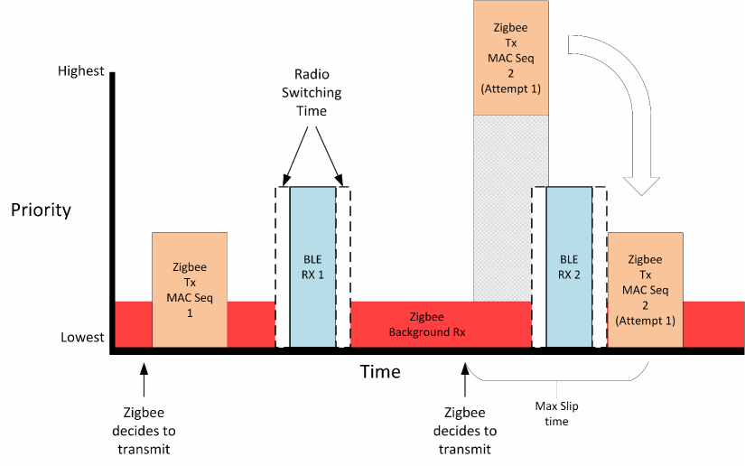

Zigbee 协议栈决定需要发送一个数据包。它可能将其作为一个 on-demand 事件进行，这意味着协议栈决定 *立即* 发送一个数据包，而无需提前通知调度器。这与 Bluetooth LE 的操作形成了鲜明的对比，Bluetooth LE 的操作安排是适度已知的。调度器估计，将来有可能执行 Zigbee TX 1 无线电操作，并且仍为更高优先级的 Bluetooth LE 接收事件提供服务。因此，调度器允许发生传输事件。Zigbee 协议栈执行此传输操作的所有部分（等待 MAC ack），然后自发地让出。Zigbee 传输无线电操作的估计事务处理时间不包括重试。

在此示例中，Bluetooth LE *已经* 被安排在将来接收，并且 Zigbee 协议栈想要进行传输。对于第一个 Zigbee TX 1 无线电操作，在 Bluetooth LE RX 1 无线电操作之前有足够的时间，因此调度器允许协议栈执行该操作。稍后，当 Zigbee 协议栈尝试安排 Zigbee TX 2 时，调度器会确定在高优先级的 Bluetooth LE RX 2 事件之前没有足够的时间。但是，Zigbee 协议栈已表明此操作可能会 slip 其起始时间。无线电调度器确定在给定的 Bluetooth LE 无线电操作预期持续时间之后，Zigbee 操作可以在该事件之后开始，并且仍在 Zigbee 协议栈所指示的 slip time 内。

如果一切都按预期进行，则 Zigbee 传输操作将发生首次尝试（不会因调度而导致任何失败）。

## 3.2 Priority Interruption Example

此示例说明了较高优先级的操作会中断较低优先级的操作。

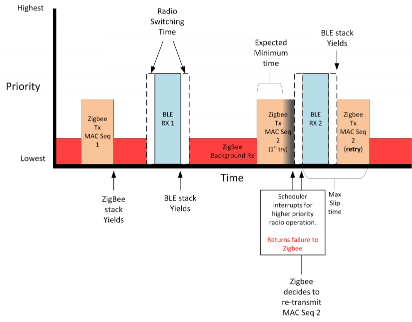

本示例以与上一个示例相同的方式开始。Zigbee 和 Bluetooth LE 都已安排了无线电操作，没有任何冲突。

后来，Zigbee 协议栈决定要为 Zigbee TX 2 事件发送另一个数据包。调度器根据 Zigbee TX 2 事件必须花费的最短时间，确定可以安排此事件并在之后为 Bluetooth LE RX 2 事件提供服务。然而，由于长时间的随机退避，Zigbee TX 2 事件花费的时间比预期的要长，并且没有及时让出。这会导致该事件与优先级较高的无线电操作发生冲突，因此无线电调度器会中断 Zigbee 事件并返回一个失败到更高级别的协议栈。Bluetooth LE 事件正常发生，当 Bluetooth LE 事件完成时，它会自发地让出。

从无线电调度器收到失败后，Zigbee 协议栈立即尝试重试 MAC 消息。它安排操作并包含一个 slip time。此时，Bluetooth LE 协议栈的优先级较高，因此该操作尚不能开始，但是调度器接受这个新的无线电操作。Bluetooth LE 协议栈完成其预定接收并让出无线电。然后，调度器触发 Zigbee 传输操作，因为它仍在初始的起始操作的 slip time 内。传输完成后，调度器将返回到后台接收操作。

## 3.3 Higher Priority Operation that is Extended

此示例展示了当一个较高优先级的操作花费的时间比最初预期的时间长并且导致一个较低优先级的操作错过它的机会时会发生什么。

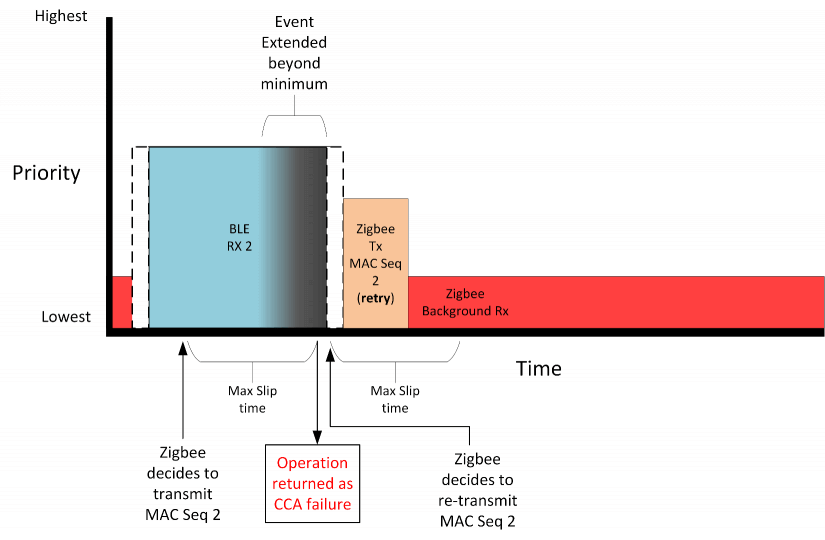

在这种情况下，Bluetooth LE 有一个正在进行的预定接收。Zigbee 决定发送一个数据包，但现在无法进行。调度器假定 Bluetooth LE 事件将在 Zigbee 事件的 slip time 结束之前完成并接受此操作。然而，由于设备之间发送了额外的数据包，导致 Bluetooth LE 事件的时间延长了。Bluetooth LE 操作具有优先权，因此 Zigbee 操作的 slip 最终会被用完。一个错误讲返回到协议栈。Zigbee 决定重新传输该数据包。同样，Zigbee 协议栈指示该操作应从现在开始，但可以 slip 到将来。调度器处于更改无线电配置的过程中，因此它无法立即开始操作。取而代之的是，它使无线电操作的开始时间 slip 了少许，然后执行操作。

## 3.4 Higher Priority Operation Without Interruption

在此示例中，无线电调度器在充当 Bluetooth LE 从机（slave）的节点上运行，并且该节点具有到不同主机节点的多个连接。它还有一个定期发送的广告信标（advertising beacon）。下图展示了这些事件实际上是紧接着发生的且没有足够的时间切换回 Zigbee 无线电配置的情况。因此，它将创建一个周期，在此期间 Zigbee 协议栈无法传输（即使使用 slip time）。

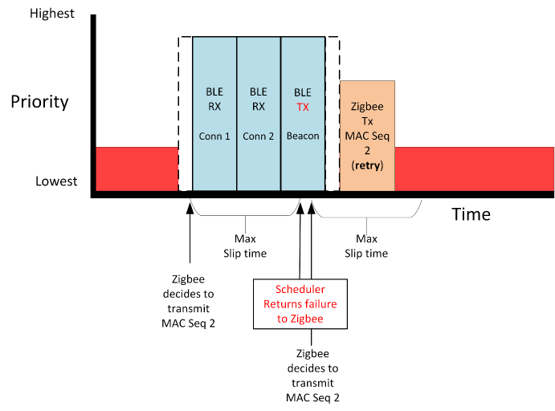

Zigbee 要求调度器安排一个传输无线电操作。即使调度器知道该事件将由于优先级而失败，但它仍接受该安排的事件。这样做有两个原因。第一，情况可能会改变，并且事件可以被执行。第二，位于无线电调度器之上的协议栈可能会尝试重试该操作。如果安排失败的结果立即返回，则协议栈重试的尝试将不太可能成功，因为还没有经历任何时间。相反，通过将事件入队并在 slip time 到期后返回失败，重试（具有自己的 slip time）将有更好的成功机会，因为即将进行的无线电操作将会有所不同。

## 3.5 Receive When a Higher Priority Operation is Running

此示例说明了当 Bluetooth LE 处于活动状态并且一个低优先级操作将接收数据时发生的情况。

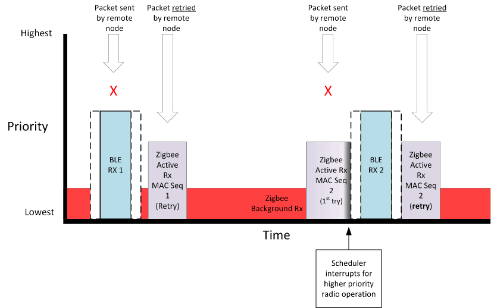

在第一种情况下，当发送一个 IEEE 802.15.4 消息且 Bluetooth LE 协议栈正利用无线电进行一个主动接收时，Zigbee 协议栈将不会在线接收到消息。然而，该消息的 Zigbee 发送方将在大多数情况下重试，并且这存在退避和其他时序改动，不会与另一个不太可能发生冲突的更高优先级的安排的 Bluetooth 接收事件发生冲突。Zigbee 消息将成功接收。

第二种情况表明，在一个主动接收的情况下，Zigbee 协议栈可能仍被中断并且不能接收（或 ACK）消息。成功的通信依赖于 MAC 或更高层的重试才能再次发送此消息和验证动态多协议设备是否接收到该消息。

尽管可能要考虑是否应该中断主动接收，但调度器很难做出该确定。通常，协议的健壮性应允许即使发生中断也可以成功接收消息。

# 4. Micrium OS

每个协议栈利用 Micrium OS-5 内核运行一个单独的 RTOS 任务，以提供任务切换。任务等效于其他操作系统中的线程。任务使用各种 IPC（interprocess communication）机制（消息队列和信号量）进行协调，以来回传递信息。任务因协议而异。Zigbee 需要四个任务，而 Connect 需要五个任务。以下各节描述了 Zigbee 和 Connect 的任务处理。

请注意，在 Gecko SDK Suite v3.0 中，Bluetooth API 结构已完全更新。除其他更改外，所有函数调用均已重命名。在以下各节中，提供了 v2.x 和 v3.x 变体。

## 4.1 Zigbee and Bluetooth

下图说明了用于 Zigbee 和 Bluetooth 的 Micrium OS 任务切换：

<figure>
  
  <figcaption style="white-space: nowrap; text-align: center;">Figure 4.1. Micrium OS Task Switching</figcaption>
</figure>

一个 Zigbee/Bluetooth 动态多协议应用程序需要若干任务才能运行：

* Application/Zigbee Stack task
* Bluetooth link layer task
* Bluetooth host task
* Idle task

这些已为您在 Micrium RTOS 上实现了。

### 4.1.1 Inter-Task Communication

在描述任务之前，重要的是要了解任务如何相互通信。该应用程序中的任务通过使用多个标志（flag）来相互同步。下表总结了这些标志：

<table id="Table-4.1" style="margin: auto;">
<caption style="white-space: nowrap;">Table 4.1. Flags in v3.x</caption>
<thead>
  <tr>
    <th>FLAG</th>
    <th>Sender</th>
    <th>Receiver</th>
    <th>Purpose</th>
  </tr>
</thead>
<tbody>
  <tr>
    <td><code>SL_BT_RTOS_EVENT_FLAG_STACK</code></td>
    <td>Link Layer Task</td>
    <td>Bluetooth Task</td>
    <td>Bluetooth stack needs an update, call<br><code>sl_bt_wait_event(sl_bt_msg_t* evt)</code> (v3.x)<br><code>gecko_wait_event()</code> (v2.x)</td>
  </tr>
  <tr>
    <td><code>SL_BT_RTOS_EVENT_FLAG_LL</code></td>
    <td>Radio interrupt</td>
    <td>Link Layer Task</td>
    <td>Link Layer needs an update, call<br><code>sl_bt_priority_handle()</code> (v3.x)<br><code>gecko_priority_handle()</code> (v2.x)</td>
  </tr>
  <tr>
    <td><code>SL_BT_RTOS_EVENT_FLAG_CMD_WAITING</code></td>
    <td>Application Task</td>
    <td>Bluetooth Task</td>
    <td>Command is ready in shared memory, call<br><code>gecko_handle_command()</code></td>
  </tr>
  <tr>
    <td><code>SL_BT_RTOS_EVENT_FLAG_RSP_WAITING</code></td>
    <td>Bluetooth Task</td>
    <td>Application Task</td>
    <td>Response is ready in shared memory</td>
  </tr>
  <tr>
    <td><code>SL_BT_RTOS_EVENT_FLAG_EVT_WAITING</code></td>
    <td>Bluetooth Task</td>
    <td>Application Task</td>
    <td>Event is ready in shared memory</td>
  </tr>
  <tr>
    <td><code>SL_BT_RTOS_EVENT_FLAG_EVT_HANDLED</code></td>
    <td>Application Task</td>
    <td>Bluetooth Task</td>
    <td>Event is handled and shared memory is free to use for next event</td>
  </tr>
</tbody>
</table>

<table style="margin: auto;">
<caption style="white-space: nowrap;">Table 4.2. Flags in v2.x</caption>
<thead>
  <tr>
    <th>FLAG</th>
    <th>Sender</th>
    <th>Receiver</th>
    <th>Purpose</th>
  </tr>
</thead>
<tbody>
  <tr>
    <td><code>BLUETOOTH_EVENT_FLAG_STACK</code></td>
    <td>Link Layer Task</td>
    <td>Bluetooth Task</td>
    <td>Bluetooth stack needs an update, call<br><code>sl_bt_wait_event(sl_bt_msg_t* evt)</code> (v3.x)<br><code>gecko_wait_event()</code> (v2.x)</td>
  </tr>
  <tr>
    <td><code>BLUETOOTH_EVENT_FLAG_LL</code></td>
    <td>Radio interrupt</td>
    <td>Link Layer Task</td>
    <td>Link Layer needs an update, call<br><code>sl_bt_priority_handle()</code> (v3.x)<br><code>gecko_priority_handle()</code> (v2.x)</td>
  </tr>
  <tr>
    <td><code>BLUETOOTH_EVENT_FLAG_CMD_WAITING</code></td>
    <td>Application Task</td>
    <td>Bluetooth Task</td>
    <td>Command is ready in shared memory, call <br><code>gecko_handle_command()</code></td>
  </tr>
  <tr>
    <td><code>BLUETOOTH_EVENT_FLAG_RSP_WAITING</code></td>
    <td>Bluetooth Task</td>
    <td>Application Task</td>
    <td>Response is ready in shared memory</td>
  </tr>
  <tr>
    <td><code>BLUETOOTH_EVENT_FLAG_EVT_WAITING</code></td>
    <td>Bluetooth Task</td>
    <td>Application Task</td>
    <td>Event is ready in shared memory</td>
  </tr>
  <tr>
    <td><code>BLUETOOTH_EVENT_FLAG_EVT_HANDLED</code></td>
    <td>Application Task</td>
    <td>Bluetooth Task</td>
    <td>Event is handled and shared memory is free to use for next event</td>
  </tr>
</tbody>
</table>

下图说明了如何在同步任务中使用这些标志。标志命名适用于 GSDKv2.x。对于 v3.x，方法是相同的，只是名称有所不同，如 [Table 4.1 Flags in v3.x](#Table-4.1) 所示。

除了这些标志之外，gecko 命令处理程序还使用互斥量使其具有 thread-safe。这样就可以从多任务中调用 BGAPI 命令。

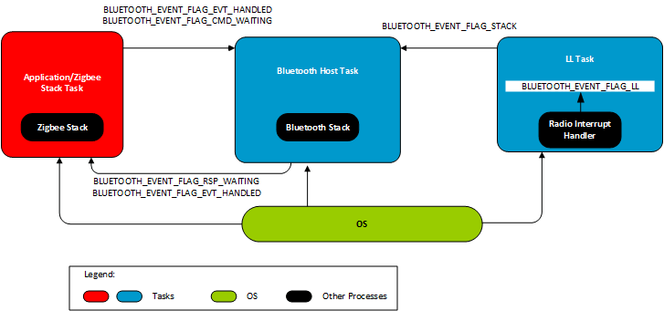

### 4.1.2 Task Descriptions

#### 4.1.2.1 Application/Zigbee Stack Task

Application/Zigbee Stack task 负责在启动时设置所有其他任务，包括 Bluetooth Host task 和 Bluetooth Link Layer task。Zigbee 具有大量的 API 集，并且这些 API 并非 thread-safe。因此，所有调用 Zigbee stack API 的代码都应从 Application/Zigbee Stack task 中执行。如果应用程序需要从 Application/Zigbee Stack task 以外的某个任务中调用某些 Zigbee stack API，则建议您从 non-Zigbee Stack task 中安排一个自定义事件。在自定义事件的相应事件处理函数中，可以使用 Zigbee stack API，因为该事件处理程序将从 Zigbee Stack Task 上下文中调用。Bluetooth 具有一个通过 BGAPI RTOS Adaption Layer 进行序列化的相对较少的 API 集。因此，从 Application/Zigbee Stack task 以外的任务中调用任何 Bluetooth API 是安全的。

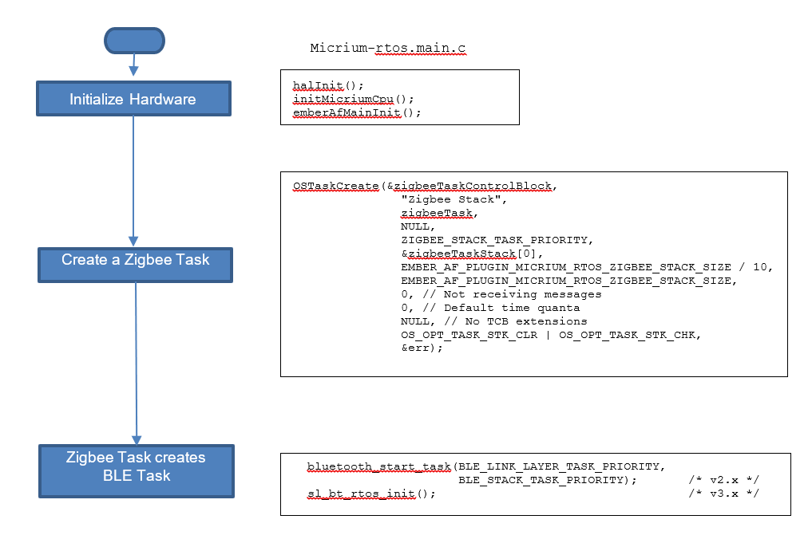

#### 4.1.2.2 Bluetooth Link Layer Task

Link layer task 的目的是更新上层链路层（upper link layer）。v3.x 和 v2.x 中的任务流程相同。

**v3.x** ：Link layer task 在运行前等待 `SL_BT_RTOS_EVENT_FLAG_LL` 标志被设置。通过调用 `sl_bt_priority_handle()` 来更新上层链路层。 `SL_BT_RTOS_EVENT_FLAG_LL` 标志由 ~~`BluetoothLLCallback()`~~ `sli_bt_rtos_ll_callback()` 设置，该标志从一个 kernel-aware 中断处理程序中调用。在 Bluetooth 启动任务之后，此任务具有最高优先级。

**v2.x** ：Link layer task 在运行前等待 `BLUETOOTH_EVENT_FLAG_LL` 标志被设置。通过调用 `gecko_priority_handle()` 来更新上层链路层。 `BLUETOOTH_EVENT_FLAG_LL` 标志由 `BluetoothLLCallback()` 设置，该标志从一个 kernel-aware 中断处理程序中调用。在 Bluetooth 启动任务之后，此任务具有最高优先级。

#### 4.1.2.3 Bluetooth Host Task

该任务的目的是更新 Bluetooth 协议栈、发出事件并处理命令。该任务的优先级比任何 application task 高，但比 link layer task 低。

#### 4.1.2.4 Idle Task

当没有任务准备运行时，OS 将调用 idle task。默认情况下，idle task 使 MCU 进入最低可用睡眠模式（EM2）。

## 4.2 Connect and Bluetooth

下图说明了用于 Connect 和 Bluetooth 的 Micrium OS 任务切换：

<figure>
  
  <figcaption style="white-space: nowrap; text-align: center;">Figure 4.2. Micrium OS Task Switching</figcaption>
</figure>

一个 Connect/Bluetooth 动态多协议应用程序需要执行以下任务才能运行：

* Application Framework/Customer Application task
* Connect stack task
* Bluetooth link layer task
* Bluetooth host task
* Idle task

这些已为您在 Micrium RTOS 上实现了。

在 Gecko SDK Suite v3.x 中，Connect 和 Bluetooth 都迁移到一个改进的 Gecko Platform component-based 基础设施。尽管在许多情况下流程保持不变，但 API 命令、标志名和其他功能已被更改。本章记录了 v3.x 与 v2.x 实现的区别。

### 4.2.1 Inter-Task Communication

在描述任务之前，重要的是要了解任务如何相互通信。该应用程序中的任务通过使用多个标志（flag）来相互同步。下表总结了这些标志：

<table id="Table-4.3" style="margin: auto;">
<caption style="white-space: nowrap;">Table 4.3. Flags in v3.x</caption>
<thead>
  <tr>
    <th>FLAG</th>
    <th>Sender</th>
    <th>Receiver</th>
    <th>Purpose</th>
  </tr>
</thead>
<tbody>
  <tr>
    <td><code>SL_BT_RTOS_EVENT_FLAG_STACK</code></td>
    <td>Link Layer Task</td>
    <td>Bluetooth Task</td>
    <td>Bluetooth stack needs an update, call<br><code>sl_bt_wait_event(sl_bt_msg_t* evt)</code></td>
  </tr>
  <tr>
    <td><code>SL_BT_RTOS_EVENT_FLAG_LL</code></td>
    <td>Radio interrupt</td>
    <td>Link Layer Task</td>
    <td>Link Layer needs an update, call<br><code>sl_bt_priority_handle()</code></td>
  </tr>
  <tr>
    <td><code>SL_BT_RTOS_EVENT_FLAG_CMD_WAITING</code></td>
    <td>Application Task</td>
    <td>Bluetooth Task</td>
    <td>A Bluetooth command is ready in shared memory, call<br><code>msli_bt_cmd_handler_delegate()</code></td>
  </tr>
  <tr>
    <td><code>SL_BT_RTOS_EVENT_FLAG_RSP_WAITING</code></td>
    <td>Bluetooth Task</td>
    <td>Application Task</td>
    <td>Response is ready in shared memory</td>
  </tr>
  <tr>
    <td><code>SL_BT_RTOS_EVENT_FLAG_EVT_WAITING</code></td>
    <td>Bluetooth Task</td>
    <td>Application Task</td>
    <td>Event is ready in shared memory</td>
  </tr>
  <tr>
    <td><code>SL_BT_RTOS_EVENT_FLAG_EVT_HANDLED</code></td>
    <td>Application Task</td>
    <td>Bluetooth Task</td>
    <td>Event is handled and shared memory is free to use for next event</td>
  </tr>
  <tr>
    <td><code>FLAG_IPC_COMMAND_PENDING</code></td>
    <td>Application Task</td>
    <td>Connect Task</td>
    <td>A Connect command is ready in shared memory, call<br><code>emAfPluginMicriumRtosHandleIncomingApiCommand()</code></td>
  </tr>
  <tr>
    <td><code>FLAG_IPC_RESPONSE_PENDING</code></td>
    <td>Connect Task</td>
    <td>Application Task</td>
    <td>A response to a Connect command is ready in shared memory</td>
  </tr>
  <tr>
    <td><code>FLAG_IPC_CALLBACK_PENDING</code></td>
    <td>Connect Task</td>
    <td>Application Task</td>
    <td>One or more callback commands are available in the callback queue</td>
  </tr>
</tbody>
</table>

<table style="margin: auto;">
<caption style="white-space: nowrap;">Table 4.4. Flags in v2.x</caption>
<thead>
  <tr>
    <th>FLAG</th>
    <th>Sender</th>
    <th>Receiver</th>
    <th>Purpose</th>
  </tr>
</thead>
<tbody>
  <tr>
    <td><code>BLUETOOTH_EVENT_FLAG_STACK</code></td>
    <td>Link Layer Task</td>
    <td>Bluetooth Task</td>
    <td>Bluetooth stack needs an update, call<br><code>gecko_wait_event()</code></td>
  </tr>
  <tr>
    <td><code>BLUETOOTH_EVENT_FLAG_LL</code></td>
    <td>Radio interrupt</td>
    <td>Link Layer Task</td>
    <td>Link Layer needs an update, call<br><code>gecko_priority_handle()</code></td>
  </tr>
  <tr>
    <td><code>BLUETOOTH_EVENT_FLAG_CMD_WAITING</code></td>
    <td>Application Task</td>
    <td>Bluetooth Task</td>
    <td>A Bluetooth command is ready in shared memory, call<br><code>gecko_handle_command()</code></td>
  </tr>
  <tr>
    <td><code>BLUETOOTH_EVENT_FLAG_RSP_WAITING</code></td>
    <td>Bluetooth Task</td>
    <td>Application Task</td>
    <td>Response is ready in shared memory</td>
  </tr>
  <tr>
    <td><code>BLUETOOTH_EVENT_FLAG_EVT_WAITING</code></td>
    <td>Bluetooth Task</td>
    <td>Application Task</td>
    <td>Event is ready in shared memory</td>
  </tr>
  <tr>
    <td><code>BLUETOOTH_EVENT_FLAG_EVT_HANDLED</code></td>
    <td>Application Task</td>
    <td>Bluetooth Task</td>
    <td>Event is handled and shared memory is free to use for next event</td>
  </tr>
  <tr>
    <td><code>FLAG_IPC_COMMAND_PENDING</code></td>
    <td>Application Task</td>
    <td>Connect Task</td>
    <td>A Connect command is ready in shared memory, call<br><code>emAfPluginMicriumRtosHandleIncomingApiCommand()</code></td>
  </tr>
  <tr>
    <td><code>FLAG_IPC_RESPONSE_PENDING</code></td>
    <td>Connect Task</td>
    <td>Application Task</td>
    <td>A response to a Connect command is ready in shared memory</td>
  </tr>
  <tr>
    <td><code>FLAG_IPC_CALLBACK_PENDING</code></td>
    <td>Connect Task</td>
    <td>Application Task</td>
    <td>One or more callback commands are available in the callback queue</td>
  </tr>
</tbody>
</table>

下图说明了如何在同步任务中使用这些标志。标志命名适用于 GSDKv2.x。对于 v3.x，方法是相同的，只是名称有所不同，如 [Table 4.3. Flags in v3.x](#Table-4.3) 所示。

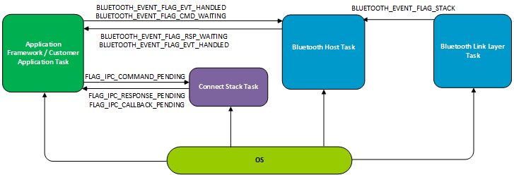

除了这些标志之外，Connect 和 Bluetooth 命令处理程序还使用互斥量使其 thread-safe。这样就可以从多任务中调用 BGAPI 命令和 Connect Stack API。

### 4.2.2 Connect Task Descriptions

#### 4.2.2.1 Task Initialization

在 v2.x 中，Connect Stack task 负责在启动时设置所有其他任务，包括 Application Framework task、Bluetooth Host task 和 Bluetooth Link Layer task。

任务创建和初始化在 v3.x 中的处理方式有所不同，如下流程图所示。

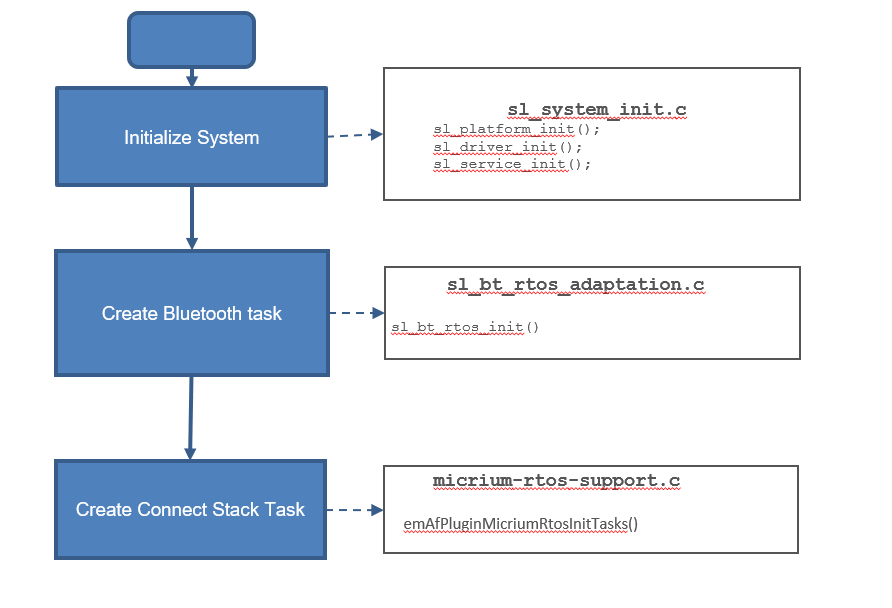

#### 4.2.2.2 Connect Stack Task

初始化后，v2.x 和 v3.x 中的 Connect Stack task 相同。Connect Stack task 执行协议栈主循环并处理来自 Application Framework task 和可选的其他 custom application task 的 IPC API 消息。这是通过以非阻塞方式检查 OS 标志 `FLAG_IPC_COMMAND_PENDING` 是否已设置来实现的。在这种情况下，将从共享内存中获取 API 消息，并调用相应的 stack API。然后，将包含 API 调用的返回状态（如果有）的响应打包到共享 RAM 中，并设置 `FLAG_IPC_RESPONSE_PENDING` 。一旦 Connect Stack task 让出，任务（API 命令的源头）将恢复执行并解析响应。

Connect Stack task 还分派 IPC 回调消息到 Application Framework task。为此，在触发协议栈回调时，会将相应的 IPC 消息放入 OS 队列中，并设置 `FLAG_IPC_CALLBACK_PENDING` 标志。一旦 Connect Stack tack 让出，Application Framework tack 将能够运行和处理队列中可用的任何回调消息。

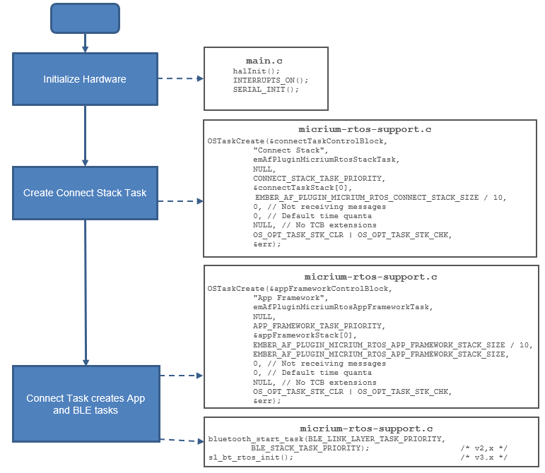

#### 4.2.2.3 Application Framework/Customer Application Task

Application Framework task 执行 application framework 主循环，该循环调用 plugin 和 application tick() 回调并运行应用程序事件。此任务还处理来自 Connect Stack task 的传入 IPC 回调消息，并将它们分派到订阅的 plugin 和 application。

#### 4.2.2.4 Bluetooth Link Layer Task

Link layer task 的目的是更新上层链路层（upper link layer）。v3.x 和 v2.x 中的任务流程相同。

**v3.x** ：Link layer task 在运行前等待 `SL_BT_RTOS_EVENT_FLAG_LL` 标志被设置。通过调用 `sl_bt_priority_handle()` 来更新上层链路层。 `SL_BT_RTOS_EVENT_FLAG_LL` 标志由 `sli_bt_rtos_ll_callback()` 设置，该标志从一个 kernel-aware 中断处理程序中调用。在 Bluetooth 启动任务之后，此任务具有最高优先级。

**v2.x** ：Link layer task 在运行前等待 `BLUETOOTH_EVENT_FLAG_LL` 标志被设置。通过调用 `gecko_priority_handle()` 来更新上层链路层。 `BLUETOOTH_EVENT_FLAG_LL` 标志由 `BluetoothLLCallback()` 设置，该标志从一个 kernel-aware 中断处理程序中调用。在 Bluetooth 启动任务之后，此任务具有最高优先级。

#### 4.2.2.5 Bluetooth Host Task

该任务的目的是更新 Bluetooth 协议栈、发出事件并处理命令。该任务的优先级比任何 application task 高，但比 link layer task 低。

#### 4.2.2.6 Idle Task

当没有任务准备运行时，OS 将调用 idle task。默认情况下，idle task 使 MCU 进入最低可用睡眠模式（EM2）。

## 4.3 Updating the v3.x Bluetooth Stack

Bluetooth 协议栈必须定期更新。Bluetooth host task 通过调用 `sl_bt_can_sleep_ticks()` 从协议栈中读取下一个定期更新事件；通过调用 `sl_bt_wait_event(sl_bt_msg_t* evt)` 更新协议栈。这允许协议栈处理来自链路层的消息以及它自己的内部消息，以执行其需要执行的定时操作（timed action）。

### 4.3.1 Issuing Bluetooth Events in v3.x

Bluetooth host task 设置 `SL_BT_RTOS_EVENT_FLAG_EVT_WAITING` 标志，以向 Bluetooth application task 指示有一个可以检索的事件。一次只能检索一个事件。当 application task 检索到事件时，将清除 `SL_BT_RTOS_EVENT_FLAG_EVT_WAITING` 标志。 ~~`SL_BT_RTOS_EVENT_FLAG_EVT_WAITING`~~ `SL_BT_RTOS_EVENT_FLAG_EVT_HANDLED` 标志由 application task 设置，以指示事件处理已完成。

### 4.3.2 Bluetooth Command Handling in v3.x

Bluetooth 命令可以从多个任务发送到协议栈。对这些命令的响应将转发到所调用的任务。命令和响应使用 `SL_BT_RTOS_EVENT_FLAG_CMD_WAITING` 和 `SL_BT_RTOS_EVENT_FLAG_RSP_WAITING` 标志以及 BluetoothMutex 互斥量来同步。

命令被名为 `sli_bt_cmd_handler_rtos_delegate()` 的辅助函数准备并发送到协议栈。任何 BGAPI 函数都调用此函数，并通过使用互斥量来使其可重入（re-entrant）。该函数通过在互斥量上挂起而开始。当它获得对互斥量的控制后，便会准备好命令并将其放入共享内存中，然后设置 `SL_BT_RTOS_EVENT_FLAG_CMD_WAITING` 标志以向协议栈指示正在等待处理命令。Bluetooth host task 会清除此标志，以指示该命令已发送到协议栈，并且现在可以安全地发送另一个命令。

然后执行挂起在 `SL_BT_RTOS_EVENT_FLAG_RSP_WAITING` 标志上，该标志在执行命令后由 Bluetooth host task 设置。这表明对命令的响应正在等待。最后，互斥量被释放。

下图说明了 Bluetooth host task 的运行。

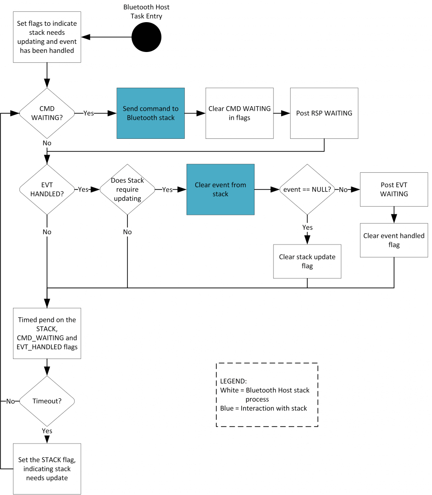

1. 在任务启动时，设置 `SL_BT_RTOS_EVENT_FLAG_STACK` 以指示协议栈需要更新，并且设置 `SL_BT_RTOS_EVENT_FLAG_EVT_HANDLED` 标志以指示当前未处理任何事件。
2. 接下来，如果设置了 `SL_BT_RTOS_EVENT_FLAG_CMD_WAITING` 标志，则调用 `sli_bt_cmd_handler_delegate()` 处理命令。
3. 然后，如果设置了 `SL_BT_RTOS_EVENT_FLAG_STACK` 和 `SL_BT_RTOS_EVENT_FLAG_EVT_HANDLED` 标志，则调用 `sl_bt_wait_event(sl_bt_msg_t* evt)` 以从协议栈中获取一个事件。如果发现有一个事件正在等待，则设置 `SL_BT_RTOS_EVENT_FLAG_EVT_WAITING` 标志，并清除 `SL_BT_RTOS_FLAG_EVT_HANDLED` 标志，以向 application task 指示已准备好处理事件，并向 Bluetooth host task 指示当前有一个事件正在处理。否则，将清除 `SL_BT_RTOS_EVENT_FLAG_STACK` 标志，以指示协议栈不需要更新。
4. 此时，任务将检查协议栈是否需要更新以及是否有任何事件正在等待处理。如果没有等待处理的事件并且协议栈不需要更新，则可以安全地进入睡眠状态，并调用 `sl_bt_can_sleep_ticks()` 来确定系统可以睡眠多长时间。然后，Bluetooth host task 会在 `SL_BT_RTOS_EVENT_FLAG_STACK` 、 `SL_BT_RTOS_EVENT_FLAG_EVT_HANDLED` 和 `SL_BT_RTOS_EVENT_FLAG_CMD_WAITING` 标志上定时挂起。
5. 如果发生超时并且在步骤 4 中确定的时间内未设置任何标志，则设置 `SL_BT_RTOS_EVENT_FLAG_STACK` 以指示协议栈需要更新。
6. 无限重复执行步骤 2 – 5。

## 4.4 Updating the v2.x Bluetooth Stack

Bluetooth 协议栈必须定期更新。Bluetooth host task 通过调用 `gecko_can_sleep_ticks()` 从协议栈中读取下一个定期更新事件；通过调用 `gecko_wait_event()` 更新协议栈。这允许协议栈处理来自链路层的消息以及它自己的内部消息，以执行其需要执行的定时操作（timed action）。

### 4.4.1 Issuing Bluetooth Events in v2.x

Bluetooth host task 设置 `BLUETOOTH_EVENT_FLAG_EVT_WAITING` 标志，以向 Bluetooth application task 指示有一个可以检索的事件。一次只能检索一个事件。当 application task 检索到事件时，将清除 `BLUETOOTH_EVENT_FLAG_EVT_WAITING` 标志。 `BLUETOOTH_EVENT_FLAG_EVT_HANDLED` 标志由 application task 设置，以指示事件处理已完成。

### 4.4.2 Bluetooth Command Handling in v2.x

Bluetooth 命令可以从多个任务发送到协议栈。对这些命令的响应将转发到所调用的任务。命令和响应使用 `BLUETOOTH_EVENT_FLAG_CMD_WAITING` 和 `BLUETOOTH_EVENT_FLAG_RSP_WAITING` 标志以及 BluetoothMutex 互斥量来同步。

命令被名为 `rtos_gecko_handle_command()` 的辅助函数准备并发送到协议栈。任何 BGAPI 函数都调用此函数，并通过使用互斥量来使其可重入（re-entrant）。该函数通过在互斥量上挂起而开始。当它获得对互斥量的控制后，便会准备好命令并将其放入共享内存中，然后设置 `BLUETOOTH_EVENT_FLAG_CMD_WAITING` 标志以向协议栈指示正在等待处理命令。Bluetooth host task 会清除此标志，以指示该命令已发送到协议栈，并且现在可以安全地发送另一个命令。

然后执行挂起在 `BLUETOOTH_EVENT_FLAG_RSP_WAITING` 标志上，该标志在执行命令后由 Bluetooth host task 设置。这表明对命令的响应正在等待。最后，互斥量被释放。

下图说明了 Bluetooth host task 的运行。


1. 在任务启动时，设置 `BLUETOOTH_EVENT_FLAG_STACK` 以指示协议栈需要更新，并且设置 `BLUETOOTH_EVENT_FLAG_EVT_HANDLED` 标志以指示当前未处理任何事件。
2. 接下来，如果设置了 `BLUETOOTH_EVENT_FLAG_CMD_WAITING` 标志，则调用 `gecko_handle_command()` 处理命令。
3. 然后，如果设置了 `BLUETOOTH_EVENT_FLAG_STACK` 和 `BLUETOOTH_EVENT_FLAG_EVT_HANDLED` 标志，则调用 `gecko_wait_event()` 以从协议栈中获取一个事件。如果发现有一个事件正在等待，则设置 `BLUETOOTH_EVENT_FLAG_EVT_WAITING` 标志，并清除 `BLUETOOTH_EVENT_FLAG_EVT_HANDLED` 标志，以向 application task 指示已准备好处理事件，并向 Bluetooth host task 指示当前有一个事件正在处理。否则，将清除 `BLUETOOTH_EVENT_FLAG_STACK` 标志，以指示协议栈不需要更新。
4. 此时，任务将检查协议栈是否需要更新以及是否有任何事件正在等待处理。如果没有等待处理的事件并且协议栈不需要更新，则可以安全地进入睡眠状态，并调用 `gecko_can_sleep_ticks()` 来确定系统可以睡眠多长时间。然后，Bluetooth host task 会在 `BLUETOOTH_EVENT_FLAG_STACK` 、 `BLUETOOTH_EVENT_FLAG_EVT_HANDLED` 和 `BLUETOOTH_EVENT_FLAG_CMD_WAITING` 标志上定时挂起。
5. 如果发生超时并且在步骤 4 中确定的时间内未设置任何标志，则设置 `BLUETOOTH_EVENT_FLAG_STACK` 以指示协议栈需要更新。
6. 无限重复执行步骤 2 – 5。

# 5. Implementing Multiprotocol with an 802.15.4-Based Stack

本章提供了有关使一个 802.15.4-based 协议栈（如 Zigbee 或 Connect）作为一个多协议应用程序的一部分的一般信息。有关如何配置 plugin 的详细信息以及特定协议更多详情，请参阅以下应用笔记之一：

* *AN1133: Dynamic Multiprotocol Development with Bluetooth and Zigbee*
* *AN1209: Dynamic Multiprotocol Development with Bluetooth and Connect*

## 5.1 Wireless Protocol Support

动态多协议的设计已经利用了不同无线协议所具有的不同特征。例如，Bluetooth Low Energy 在其无线电操作的安排中非常严格且可预测；广告和连接间隔在设置的时间上发生。相反，一个 802.15.4 协议在许多消息事件的时间安排上更为灵活；IEEE 802.15.4 中的 CSMA（carrier sense multiple access）添加了随机退避，因此事件允许毫秒级延迟。这使 IEEE 802.15.4 消息可以在 Bluetooth Low Energy 事件附近发送，并且仍然可以可靠地接收。

## 5.2 802.15.4 RAIL Priority

802.15.4 协议当前具有三个 RAIL 优先级。

<table style="white-space: nowrap;">
<thead>
  <tr>
    <th>No.</th>
    <th>Name</th>
    <th>Default Setting</th>
    <th>Exit Criterion</th>
  </tr>
</thead>
<tbody>
  <tr>
    <td>1</td>
    <td>Active TX</td>
    <td>100</td>
    <td>MAC ACK received (or not)</td>
  </tr>
  <tr>
    <td>2</td>
    <td>Active RX</td>
    <td>255</td>
    <td>Packet filtered or MAC ACK sent</td>
  </tr>
  <tr>
    <td>3</td>
    <td>Background RX</td>
    <td>255</td>
    <td>Task with higher Priority present</td>
  </tr>
</tbody>
</table>

如果执行了一个 Active TX，则会在收到相应的 MAC 确认（或发生超时）时释放无线电。

Background RX 将使无线电处于接收状态以准备接收异步消息。如果 Active RX 优先级与 Background RX 优先级不同，则每当检测到一个同步字（sync word）时，接收优先级就会提高，只有当该数据包被过滤或完成并且它发送了 ACK（如果请求了）时，才降低接收优先级。

### 5.2.1 Balancing Priorities

如 [7.1 Bluetooth Priorities](#7-1-Bluetooth-Priorities) 中所述，默认情况下，Bluetooth 优先级范围映射到 RAIL 优先级范围 16 - 32。通常，Bluetooth 使用低优先级（32）启动，并动态地将优先级提高到最大（16）（如果消息不成功则需要）。

如上一节中所述，802.15.4-based 协议栈（如 Zigbee 或 Connect）使用默认 RAIL 优先级值，Background RX 为 255、Active RX 为 255、Active TX 为 100。

这些默认 RAIL 优先级使得在一个 802.15.4 protocol-Bluetooth 多协议应用程序中，默认情况下 Bluetooth 流量始终会优先于 802.15.4 协议流量。对于许多应用来说，这是一个不错的选择，因为与 802.15.4 协议不同，Bluetooth 流量具有严格的时序要求。但是，如果 Bluetooth 流量负载很高（例如，使用非常小的连接间隔发送大量数据），那么 802.15.4 协议流量可能会从访问无线电中完全地阻塞，因为它的优先级较低并且 Bluetooth 流量所留下的可用无线电时间的窗口（windows）太小。

**注意**：以下信息当前仅适用于 EmberZNet Zigbee stack。Silicon Labs Connect 尚未具有更改优先级所需的 API。

如果您正在开发一个 802.15.4-based 动态多协议应用程序，并且在 Bluetooth 流量高负载的情况下该流量（802.15.4）的成功非常重要，则可以使用以下 API 来调整默认优先级，如下表所示：

```c
EmberStatus emberRadioSetSchedulerPriorities(const EmberMultiprotocolPriorities *priorities)
```

<table style="white-space: nowrap;">
<thead>
  <tr>
    <th>No.</th>
    <th>Name</th>
    <th>Default Setting</th>
  </tr>
</thead>
<tbody>
  <tr>
    <td>1</td>
    <td>Active TX</td>
    <td>23</td>
  </tr>
  <tr>
    <td>2</td>
    <td>Active RX</td>
    <td>24</td>
  </tr>
  <tr>
    <td>3</td>
    <td>Background RX</td>
    <td>255</td>
  </tr>
</tbody>
</table>

由于 Bluetooth 的原始 RAIL 优先级设置为 32，因此这些 802.15.4 优先级设置将使 802.15.4 流量高于 Bluetooth 的原始优先级，这使 802.15.4 协议在 Bluetooth 流量高负载下有机会成功传输或接收流量。另一方面，如果 Bluetooth 被 802.15.4 流量从调度器中碰撞开，则 Bluetooth 将动态增加其优先级（最高为 16）。因此，在最初允许 802.15.4 协议访问无线电之后，Bluetooth 将在后续重试上取得优先权（如有必要）。

这种方法允许这两种协议在它们对无线电的使用上做出妥协，没有一个协议可以完全主导另一个协议。

# 6. Implementing Multiprotocol with RAIL

本章为直接使用 RAIL API 来开发专有协议的用户提供了有关 RAIL 特殊性的更多信息。特别是，它提供了有关如何使用 RAIL API 来处理特定无线电调度器情况的详细信息。

## 6.1 Examples with Background Receive, Yield Radio and State Transition

RAIL 多协议优先级系统的基本原理非常简单：具有较高优先级的无线电事件将始终抢占具有较低优先级的任何其他无线电事件。但是，在考虑状态转换和 API（如 `RAIL_StartRx()` ）时，此话题会变得更加复杂，这些 API 将无线电无限期地置于特定状态。本节提供一些说明和示例，以演示如何处理这些无时间限制的状态，以及应用层如何使用诸如 `RAIL_YieldRadio()` 之类的 API 来控制它们。示例如下：

* 具有单个协议的状态转换
* 具有两个协议的状态转换
* 具有两个协议且优先级单调递增的状态转换

在这些示例中， `RAIL_StartTx()` 是中断 background RX 的 TX 事件的源。但是请注意，这些示例适用于 `RAIL_StartRx()` 以外的任何无线电 API。换句话说，这些示例适用于任何启动一个无线电事件（不是一个 background RX）的 API。

这些示例说明了有关状态转换的预期多协议行为。总结如下：

* 在一个状态转换中，在调用 `RAIL_YieldRadio()` 之前，新状态会被视为一个具有相同优先级的始发事件的不确定扩展。
* Background RX 事件不受 `RAIL_YieldRadio()` 的影响。只有 `RAIL_Idle()` 可以从 background RX 状态中永久移除一个协议。
* 具有较高优先级的事件将始终抢占具有较低优先级的事件，而不考虑其他任何 API 调用。
* 通过 `RAIL_YieldRadio()` 或 `RAIL_Idle()` ，只有 `RAIL_StartRx()` 接收可以从更高优先级的事件 “返回”。
* 除 `RAIL_StartRx()` 以外的所有无线电事件都需要 `RAIL_YieldRadio()` 才能结束并继续进行下一个事件。
* 不能使用 `RAIL_Idle()` 来替代 `RAIL_YieldRadio()` 调用 。 `RAIL_Idle()` 会清除给定协议的 **所有** 事件。

### 6.1.1 State Transitions with a Single Protocol

第一个示例检查具有单个协议的无线电行为（即，对所有无线电函数调用都使用相同的 `RAIL_Handle_t` ）。无线电首先调用 `RAIL_StartRx()` 以从 RX 开始，然后调用 `RAIL_StartTx()` 进入到一个具有更高优先级的 TX。请务必注意，在完成传输之后，无线电会转换到 `RAIL_SetTxTransitions()` 所指定的状态，并且会无限期地保持与 TX 相同的优先级和信道状态，直到调用 `RAIL_YieldRadio()` 为止。之后，无线电以初始指定的优先级和信道返回到 RX。

<figure>
  
  <figcaption style="white-space: nowrap; text-align: center;">Figure 6.1. State Transitions with Calls to RAIL_StartTx(), RAIL_StartRx(), RAIL_YieldRadio() with a Single Protocol</figcaption>
</figure>

由于 ACK'ing，很大程度上需要主动让出无线电，因此有必要使用 `RAIL_YieldRadio()` API。设计理念是，由于 TX 和接收到的 ACK 都被视为同一事务的一部分，因此，如果节点发送并期望一个 ACK，则它应该既能够为 ACK 而转换到 RX，又能够继续为 ACK 而侦听，以与原始 TX 的操作作为相同操作的一部分（因此优先级相同）。但是，一般而言 RAIL 本身无法知道是否需要 ACK。这可能取决于其他因素（如数据包内容或其他应用程序逻辑），所以无法简单地通过检查是否已使用 `RAIL_ConfigAutoAck()` 配置了 ACK'ing 来确定。因此，有关何时完成无线电事务的决定权留给了 application/stack。

在不需要 ACK 的情况下，Silicon Labs 建议在处理 `RAIL_EVENT_TX_PACKET_SENT` 事件时调用 `RAIL_YieldRadio()` 。这样做会使上图中的绿线最小化到中断延迟时间。如果应用程序确实希望收到一个 ACK，则应在收到 ACK 或认为 ACK 超时时调用 `RAIL_YieldRadio()` 。

### 6.1.2 State Transitions with Two Protocols

该场景与关于 TX 之后的状态转换的第一个场景相似，但是引入了另一种协议。

<figure>
  
  <figcaption style="white-space: nowrap; text-align: center;">Figure 6.2. State Transitions with Calls to RAIL_StartTx(), RAIL_StartRx(), RAIL_YieldRadio() With Two Protocols</figcaption>
</figure>

在这种情况下，请务必注意，在 TX 事务期间可以随时调用 `RAIL_StartRx()` 。只要其优先级小于或等于 TX 的优先级，在应用程序在协议 A 上调用 `RAIL_YieldRadio()` 之前，RX 才会生效。在 TX 期间调用 `RAIL_StartRx()` 时，RX 只是被加入到要处理的事件队列中。

另一个关键点是，尽管在协议 A 上 `RAIL_YieldRadio()` 将从协议 A 上的 TX 转换到协议 B 上的 RX，但是在协议 B 上 `RAIL_Idle()` 仍需要从协议 B 上的 RX 转换到协议 A 上的 RX。这里的理念是 Background RX 不能真正地被让出，因为事件从未真正结束。退出的唯一方法是通过调用 `RAIL_Idle()` 来停止 Background RX。

### 6.1.3 State Transitions with Two Protocols and Monotonically Increasing Priorities

最后的方案与前一个方案几乎相同，除了在协议 B 上对 `RAIL_StartRx()` 的调用比在协议 A 上对 `RAIL_StartTx()` 的调用具有更高的优先级。

<figure>
  
  <figcaption style="white-space: nowrap; text-align: center;">Figure 6.3. Example of State Transitions with Calls to RAIL_StartTx(), RAIL_StartRx(), RAIL_YieldRadio() with Two Protocols and Different Priorities</figcaption>
</figure>

在这种情况下，由于第二个 `RAIL_StartRx()` 的优先级高于 `RAIL_StartTx()` ，因此不再需要一个 `RAIL_YieldRadio()` 调用。因为第二个 `RAIL_StartRx()` 的优先级更高，所以它会抢占 `RAIL_StartTx()` 事件，从而控制无线电并从状态中移除 TX 事件。与前一个示例一样，在协议 B 上的 RX 期间的任何时间，都可以调用 `RAIL_Idle()` 返回到协议 A 上的 RX。

此处请注意，当应用程序在协议 B 的 RX 上调用 `RAIL_Idle()` 时，应用程序不会返回到协议 A 的 TX 转换。而是直接转到 background RX，即使应用程序从未在协议 A 的 TX 上调用 `RAIL_Idle()` 。对于安排的无线电操作（即，由 `RAIL_StartRx()` 以外的 API 启动的任何无线电操作），一旦无线电事件被更高优先级的事件所抢占，它将被完全移除，并且将不会再返回。由 `RAIL_StartRx()` 开始的仅后台接收可以在后台保持，并且可以通过调用 `RAIL_YieldRadio()` 或 `RAIL_Idle()` 来 “返回”。

为了强调 `RAIL_YieldRadio()` 和 `RAIL_Idle()` 之间的区别，请务必注意，对于所有这些示例，对 `RAIL_YieldRadio()` 的调用不能替换为 `RAIL_Idle()` 。 `RAIL_Idle()` 会清除给定协议的 **所有** 事件 —— 后台操作（即由 `RAIL_StartRx()` 启动的）和预定操作（即由 `RAIL_StartRx()` 以外的 API 启动的）。 `RAIL_Idle()` 真正地导致应用程序退出 TX 转换状态，并且会清除 Background RX，从而导致应用程序返回到空闲状态，而不是 RX。

# 7. Implementing Multiprotocol with Bluetooth

有关如何实现 RAIL/Bluetooth light/switch 多协议示例的详细信息，以及有关在 RAIL 上使用自己的协议开发多协议应用程序的更多信息，请参阅 *AN1134: Dynamic Multiprotocol Development with Bluetooth and Proprietary Protocols on RAIL* 。

## 7.1 Bluetooth Priorities

与针对不同操作类型而使用静态定义优先级的 Zigbee 相比，Bluetooth 使用一个范围和偏移量方法将所有任务分配给一个优先级谱的给定区域。

<figure>
  
  <figcaption style="white-space: nowrap; text-align: center;">Figure 7.1. Mapping of Bluetooth Priority Range to RAIL Priority Range</figcaption>
</figure>

在此示例中，Bluetooth 优先级范围（从 0 到 255）被映射到共享 RAIL 优先级空间的一个有限部分。

与 Zigbee 不同，Bluetooth 具有更严格的时序要求，其中缺少一个给定的槽（slot）可能会导致连接终止。Bluetooth 还具有一系列不同的任务，例如（可能有多个）连接、广告和扫描。

<table style="margin: auto;">
<caption style="white-space: nowrap;">Table 7.1. Different priorities in Bluetooth</caption>
<thead>
  <tr>
    <th>No.</th>
    <th>Name</th>
    <th>Default Setting</th>
    <th>Exit Criterion</th>
  </tr>
</thead>
<tbody>
  <tr>
    <td>1</td>
    <td>Connection</td>
    <td>135 to 0</td>
    <td>Connection Event Ends</td>
  </tr>
  <tr>
    <td>2</td>
    <td>Connection Initiation</td>
    <td>55 to 15</td>
    <td>Initiation Window Ends</td>
  </tr>
  <tr>
    <td>3</td>
    <td>Advertisement</td>
    <td>175 to 127</td>
    <td>Advertisement Event Ends</td>
  </tr>
  <tr>
    <td>4</td>
    <td>Scanner</td>
    <td>191 to 143</td>
    <td>Scan Window Ends</td>
  </tr>
</tbody>
</table>

为了处理该 Bluetooth 调度器（其优先级已映射到 RAIL 无线电调度器），为每个任务考虑以下参数：

1. Start Time
2. Minimum time
3. Maximum time
4. Priority

<figure>
  
  <figcaption style="white-space: nowrap; text-align: center;">Figure 7.2. Bluetooth Task</figcaption>
</figure>

如果开始时间移动了，则总运行时间将减少，也就是说，松弛时间（slack）将减少。优先级也可以动态调整。

### 7.1.1 Connections

连接具有较高的优先级。连接的开始时间无法移动。

Bluetooth 调度器会随着连接与监视（supervision）超时之间的距离越近，并达到与其接近的最大优先级，来动态地提高优先级。TX 队列中的 TX 数据包还增加了一个连接的优先级。

### 7.1.2 Connection Initiation

连接启动会扫描来自目标设备的广告以建立一个连接。与一个扫描器（scanner）相比，它具有更高的优先级，可以建立更可靠的连接。

### 7.1.3 Advertisements

默认情况下，广告的优先级较低，并且可以移动其起点。开始时间和最大时间由广告间隔定义。

如果一个广告无法被发送，则广告的优先级将缓慢增加，并在成功发送广告后将其重置。

### 7.1.4 Scanner

默认情况下，这些任务的优先级最低。开始时间、最小时间和最大时间由扫描间隔和窗口大小定义。即使被更高优先级的任务中断，扫描也可以继续。如果发生这种情况，将累积扫描时间，以确保在每个扫描间隔达到所需的扫描窗口大小。

与广告一样，如果先前无法满足所需的扫描间隔或窗口大小，则优先级会增加。一旦满足扫描间隔或窗口大小，它将重置为其初始优先级。

## 7.2 Example of Bluetooth Scheduler Operation

此示例说明了 Bluetooth 调度器将如何调度三个连接任务和一个广告任务，每个任务具有不同的优先级。在下图中，灰色部分表示任务所需的最小运行时间，蓝色部分表示任务可以使用的最大运行时间，如果可以灵活使用，则可以移动任务的区域。下图展示了初始设置。

<figure>
  
  <figcaption style="white-space: nowrap; text-align: center;">Figure 7.3. Task Scheduling Example: Setup</figcaption>
</figure>

如下所示，Conn1 是第一个运行的任务，因为它与任何更高优先级的任务都不重叠。

<figure>
  
  <figcaption style="white-space: nowrap; text-align: center;">Figure 7.4. Task Scheduling Example: 1st Step</figcaption>
</figure>

Adv1 与更高优先级的 Conn2 重叠。Adv1 非常灵活，因此可以如下图所示进行移动。

<figure>
  
  <figcaption style="white-space: nowrap; text-align: center;">Figure 7.5. Task Scheduling Example: 2nd Step</figcaption>
</figure>

Conn2 与更高优先级的 Conn4 重叠。由于 Conn2 不灵活，因此 Conn2 的调度失败。

<figure>
  
  <figcaption style="white-space: nowrap; text-align: center;">Figure 7.6. Task Scheduling Example: 3rd Step</figcaption>
</figure>

Conn4 不与其他任务重叠，因此将 Conn1 末端调整为在 Conn4 开始之前停止。

<figure>
  
  <figcaption style="white-space: nowrap; text-align: center;">Figure 7.7. Task Scheduling Example: 4th Step</figcaption>
</figure>

最后 Adv1 运行。Conn4 调整为在 Adv1 启动之前结束。

<figure>
  
  <figcaption style="white-space: nowrap; text-align: center;">Figure 7.8. Task Scheduling Example: 4th Step</figcaption>
</figure>

## 7.3 Modifying Priorities

`sl_bt_configuration_t` （v3.x）/ `gecko_configuration_t` （v2.x）结构包含一个字段 `bluetooth.linklayer_priorities` ，它是指向优先级配置的指针。如果指针为 NULL，则协议栈使用其默认优先级，如 [7.1 Bluetooth Priorities](#7-1-Bluetooth-Priorities) 和本节所述。

如果指针不为 NULL，则其必须指向一个优先级设置的结构，如下所示：

```c
typedef struct{
    uint8_t scan_min,
    uint8_t scan_max,
    uint8_t adv_min,
    uint8_t adv_max,
    uint8_t conn_min,
    uint8_t conn_max,
    uint8_t init_min,
    uint8_t init_max,
    uint8_t threshold_coex,
    uint8_t rail_mapping_offset,
    uint8_t rail_mapping_range,
} gecko_bluetooth_ll_priorities;
```

参数 `scan_min` 、 `can_max` 、 `adv_min` 、 `adv_max` 、 `conn_min` 、 `conn_max` 、 `init_min` 和 `init_max` 分别定义了扫描、广告、连接和初始化的最小和最大优先级。优先级将在最小和最大的边界之间移动，如 [7.1.1 Connections](#7-1-1-Connections) 到 [7.1.4 Scanner](#7-1-4-Scanner) 所述。

参数 `threshold_coex` （默认值为 175）用于定义一个优先级阈值，高于该阈值设备将触发相应的 GPIO 来断言（如果已配置），以指示设备对接管频段的要求。有关管理由 WLAN 和 BLE/Mesh 无线电组合组成的典型设置的共存问题的更多详细信息，请参阅 *AN1028: Bluetooth Coexistence with Wi-Fi* 。

最后，参数 `rail_mapping_offset` 和 `rail_mapping_range` 定义了如何将 Bluetooth 链路层优先级映射到全局 RAIL 无线调度器优先级。这些值的映射可以在 [7.1 Bluetooth Priorities](#7-1-Bluetooth-Priorities) 中看到。

当前（自 Gecko SDK version 2.2 起），`rail_mapping_offset` 和 `rail_mapping_range` 的默认值为 16。
