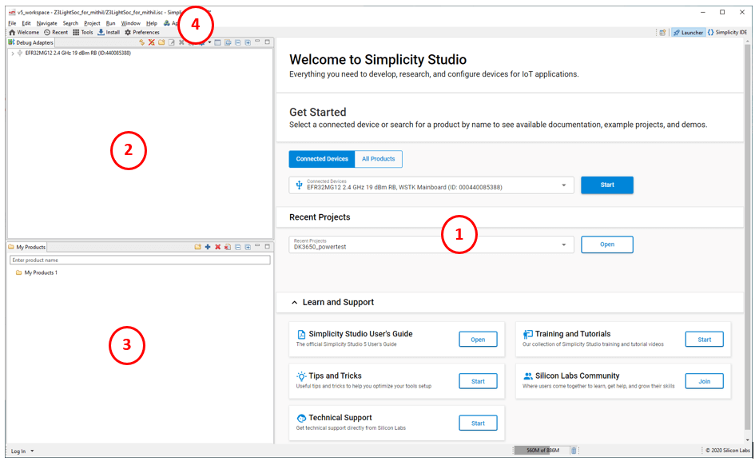
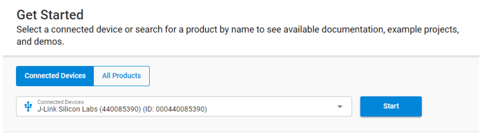
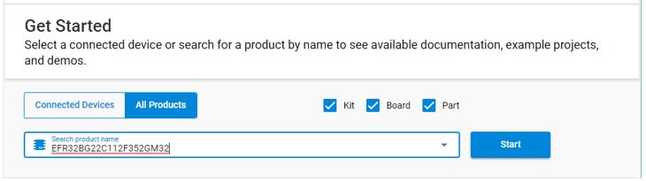
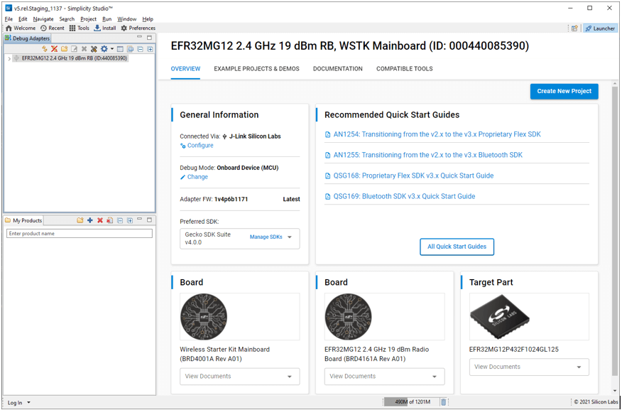
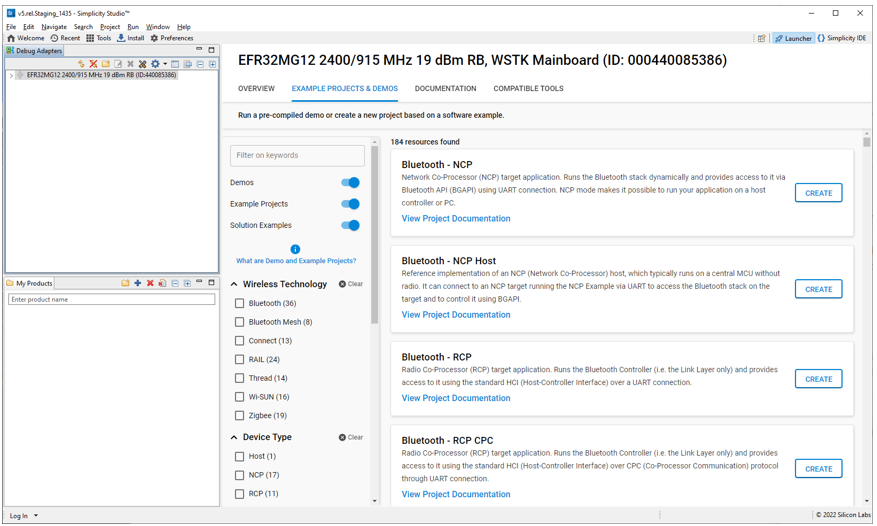
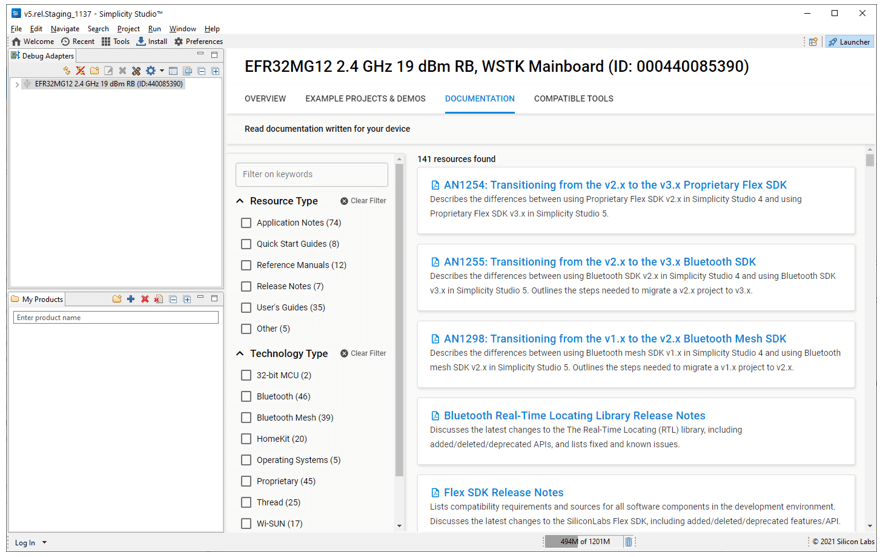
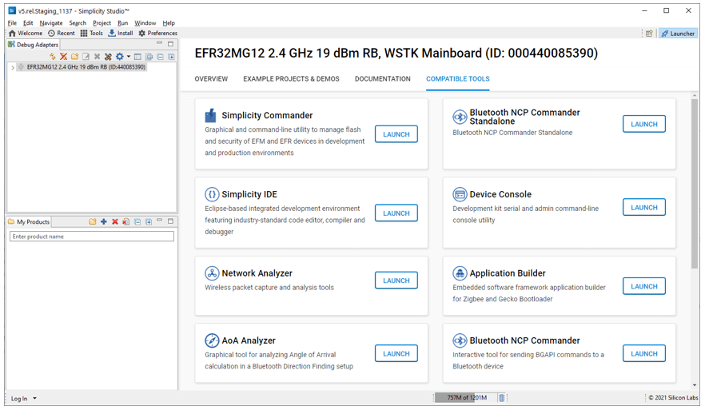

文档版本：5.4.2

# 探索 SSv5

当打开 Simplicity Studio® 5（SSv5）时，首先显示的是 Launcher 透视图中的欢迎页面。“透视图（perspective）” 是 Eclipse 术语，表示视图和编辑器区域的排列。本页概述了 Launcher 透视图的主要部分。可以在 [About the Launcher](https://docs.silabs.com/simplicity-studio-5-users-guide/latest/ss-5-users-guide-about-the-launcher/) 参考部分中找到通过 Launcher 透视图访问的所有功能的详细参考。

1. **编辑器（Editor）**。编辑器以欢迎模式开始。在这里，您将从选择一个部件（part）开始，然后可以发现资源并基于该部件创建项目。请注意，当您下拉 Learn and Support 区域时，您可以访问技术支持、Silicon Labs 社区和教育资源。
2. **调试适配器视图（Debug Adapters view）**：通过调试适配器展示出物理连接到计算机或在本地网络上检测到的设备。选择设备可以开始一个项目。
3. **我的产品视图（My Product view）**：在这里您可以添加设备（device），板（board）或套件（kit），然后像已连接的套件一样选择它们。之后，您可以探索资源或为所选（目标）设备创建和配置项目。
4. **菜单（Menu）** 和 **工具栏（Toolbar）**：工具栏上提供了许多值得注意的主要功能。

* **Welcome** 用于返回到 Launcher Welcome 页面。
* **Recent** 用于显示最近项目的列表。在 Simplicity IDE Project Explorer 视图中选择一个以转到该项目。
* **Tools** 提供了可用工具的列表。
* **Install** 将弹出一个菜单，您可以在其中安装或卸载软件包和工具，或查看可用更新。
* **Preferences** 是首选项列表的快捷方式，与通过菜单选择 Window > Preferences 等价。

在整个 SSv5 中，launcher 和其他透视图的内容取决于您选择作为开发目标的设备以及您的软件环境。首次打开 SSv5 时，Launcher 透视图没有目标设备上下文。在连接套件时，它会同时出现在调试适配器视图和 **Get Started** 编辑器区域的设备选择器中。

如果您没有可连接的 Silicon Labs 套件，但想探索 SSv5 的更多功能，请点击 **All Products**，然后输入套件、板或设备的部件号。随着您的键入，您将看到一个列表。使用复选框可以过滤列表。

您还可以将产品添加到 My Products 视图中，并在那里选择目标设备。如果您在 **Get Started** 下添加了产品，则点击 **Start** 后，所选产品将添加到 My Products 视图中，以便在 Welcome 页面或其他 Launcher 透视视图中轻松访问。

连接或选择目标设备后，点击 **Start** 开始移动到 Launcher 透视图的 OVERVIEW 选项卡，这将显示有关该设备的详细信息。

您会在 OVERVIEW 选项卡上找到几张 “卡片”。第一个是 **General Information** 卡片，您可以在其中更新 Silicon Labs 套件的调试适配器固件、更改调试适配器的模式、管理目标设备的安全设置（如果适用）以及更改活动/首选 SDK。

**Recommended Quick Start Guides** 卡片突出显示了可用于所选目标设备的一些入门资源。点击 **All Quick-Start Guides** 可快速转到 DOCUMENTATION 选项卡，该选项卡已预先过滤为快速入门指南。所选目标的每个板和设备也有可用的卡片。每个硬件卡片上的 **View Documents** 下拉列表提供了该项目的硬件文档的过滤视图。

您可以使用 **Create New Project** 控件开始一个项目。有关创建项目的介绍，请参阅[开始一个项目](#开始一个项目)。

EXAMPLE PROJECTS & DEMOS 选项卡展示与所选设备兼容的示例项目和演示列表。演示是预构建的软件示例，可以加载到兼容设备中并用于展示和测试应用程序的功能。每个演示都附带一个相关的示例项目。有关提供的示例和演示的更多信息，请参阅您的 SDK 的 Quick Start Guide。

使用复选框和搜索框可以过滤列表。有许多不同的过滤器类别可用。显示的类别和过滤器取决于您所选择的设备。点击任何演示上的 **RUN** 可以将其安装在目标设备上。在任何项目上点击 **CREATE** 可以创建它。这等效于从 OVERVIEW 选项卡中创建项目，不同的只是该项目已被选中。

DOCUMENTATION 选项卡展示与所选设备兼容的所有文档。使用复选框或文本过滤器字段来查找感兴趣的资源。与您的开发环境相对应的技术过滤器将向您展示与该环境相关的大多数软件文档。

COMPATIBLE TOOLS 选项卡展示与所选设备兼容的工具。工具栏上的 Tools 按钮展示所有未过滤的工具。

