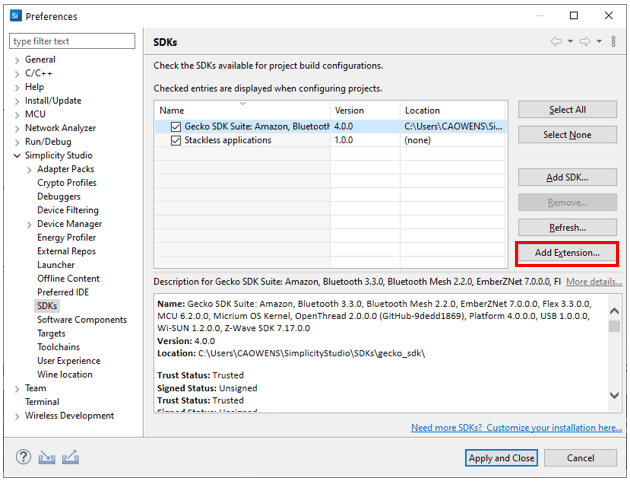
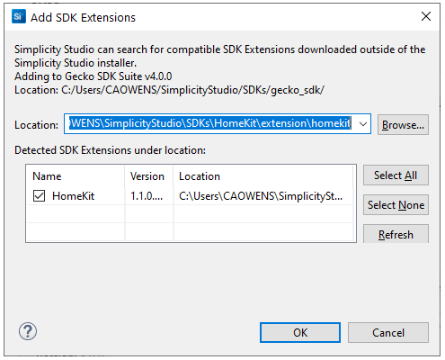
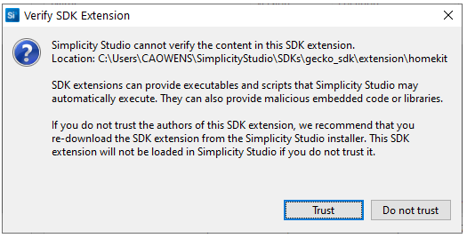
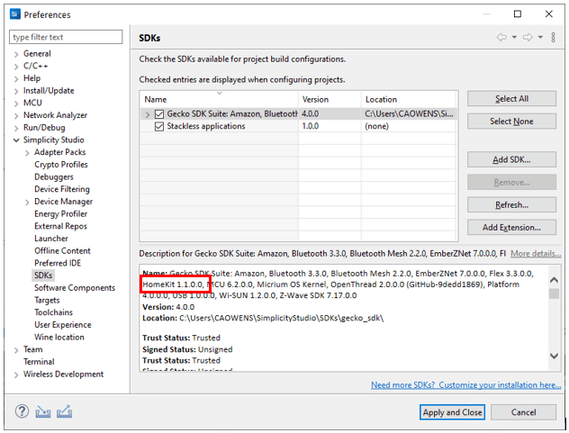
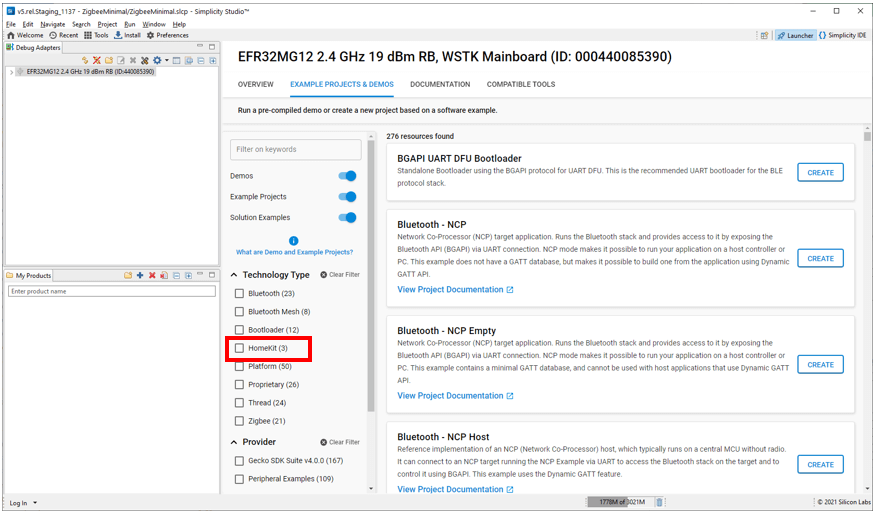

文档版本：5.4.2

# 安装 SDK 扩展

SDK 扩展是特定于使用 Project Configurator 和其他 Silicon Labs Configurator (SLC)-based 工具开发 32-bit 设备的实体。它是组件和其他项目（例如示例文件）的集合。SDK 扩展依赖于父 SDK（必须先安装好）。SDK 扩展可用于控制对某些功能的访问，或包含客户创建的组件和其他项目，与 Silicon Labs SDK 分开维护。

**注意**：Silicon Labs' HomeKit SDK 需要作为 SDK 扩展安装，因为它仅适用于已签署 Made For iPhone (MFi) 协议的已授权 Apple 开发人员。您必须登录到您的 Silicon Labs 客户帐户才能查看和下载 HomeKit SDK。

如果您有可用的扩展，请使用以下过程安装它。

<ol>
    <li>
        

            从工具栏上的 Preferences 打开 Preferences &gt; Simplicity Studio &gt; SDKs 或从 Launcher 透视图的 OVERVIEW 选项卡中选择 <strong>Manage SDKs</strong>。选择父 SDK 并点击 <strong>Add Extensions</strong>。 
            
        

    </li>
    <li>
        

            在 Add SDK Extensions 对话框中，浏览到扩展目录。如果它具有有效的 SDK 扩展，SSv5 会检测到它。点击 <strong>OK</strong>。 
            
        

    </li>
    <li>
        

            这可能会要求您信任该 SDK 扩展。如果信任，请点击 <strong>Trust</strong>。 
            
        

    </li>
    <li>
        

            该扩展现在会出现在 SDK 列表中，正如 HomeKit 在本示例中的那样。点击 <strong>Apply and Close</strong>。 
            
        

    </li>
</ol>

添加 SDK 扩展后，SSv5 会像对待任何其他 SDK 一样对待它，例如在示例项目的过滤器中显示它。

