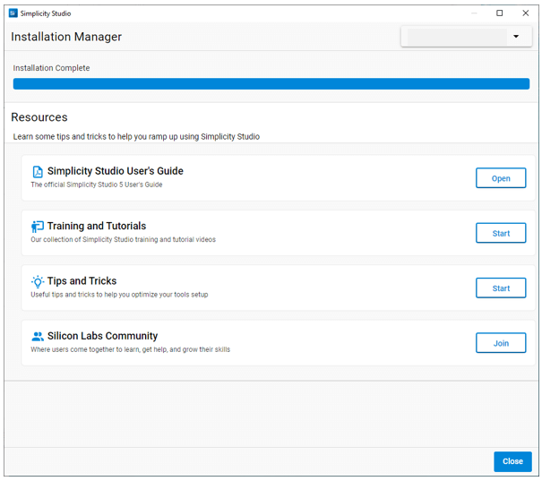

<p style="background: margin: 24px 0; padding: 8px; background: #f6f6f6; color: #555; font-size: 14pt;">文档版本：5.4.2</p>

# 安装 SSv5 和软件

本节讨论[如何安装 SSv5](#安装-ssv5)，以及安装 SSv5 后[如何安装软件](#安装软件)。

**注意**：根据您的公司环境，您可能会遇到安装问题。例如，如果您无法登录 Simplicity Studio® 5（SSv5）但知道您输入的客户帐户用户名和密码正确，或者您在连接到更新服务器时收到错误消息并且您的计算机确实已连接到互联网，请参阅 [SDK 安装或更新不起作用](https://docs.silabs.com/simplicity-studio-5-users-guide/latest/ss-5-users-guide-tips-and-tricks/#sdk-installation-or-updates-are-not-working) 以了解可能的原因及解决方案。

## 安装 SSv5

提供了[在 Windows 和 MacOS](#在-windows-和-macos-上)以及[在 Linux 上](#在-linux-上)的安装说明。

### 在 Windows 和 MacOS 上

<ol>
    <li>
        <p>
            从 Silicon Labs 网站下载 SSv5 安装包。Windows 软件包是一个 “.iso” 磁盘映像。软件包下载完成后，双击它以将 iso 映像挂载为一个驱动器，然后双击驱动器内的 setup.exe 文件以启动安装程序。
        </p>
    </li>
    <li>
        <p>
            当 SSv5 安装程序首次启动时，它会显示一个 Simplicity Studio License Agreement 对话框。接受协议条款并点击 <strong>Next &gt;</strong>。<br>
            
        </p>
    </li>
    <li>
        <p>
            选择目标位置，点击 <strong>Next &gt;</strong>，然后点击 <strong>Install</strong>。
        </p>
    </li>
    <li>
        <p>
            当 SSv5 启动时，您会看到一个或多个附加许可协议。您可以单独地或全部一次性地接受它们。完成后点击 <strong>DONE</strong>。<br>
            
        </p>
    </li>
    <li>
        <p>
            接下来，您将被邀请登录。使用您的 Silicon Labs 帐户用户名和密码登录。<strong>NOTE</strong>：虽然您可以在此处跳过登录，但您必须先登录才能访问某些访问受限的软件包。<br>
            
        </p>
    </li>
    <li>
        <p>
            在登录完成之前，您必须同意 Experience Tracking。您可以稍后在 SSv5 Preferences &gt;&gt; Simplicity Studio &gt;&gt; User Experience 中更改状态。<br>
            
        </p>
    </li>
    <li>
        <p>
            如果您连接了硬件，根据您的操作系统和安全设置，您可能需要允许 SSv5 对您的系统进行更改。SSv5 会提示您安装 Device Inspector 。点击 <strong>Yes</strong>。<br>
            
        </p>
    </li>
</ol>

### 在 Linux 上

Simplicity Studio for Linux® OS 仅在 Ubuntu® LTS 发行版上得到官方支持。Simplicity Studio 可能可以在其他发行版上工作，但官方仅在 Ubuntu® LTS 上对其进行过测试和验证。

基本的 Simplicity Studio 平台（非安装程序）以 tar 文件的形式提供，该文件应展开到所需的安装目录中。推荐的安装目录是用户的根目录（`/home/USERNAME/SimplicityStudio_v5`）。此目录必须是可以在没有 root 权限的情况下更新的目录。

在第一次启动 Simplicity Studio 之前，请执行以下命令：

```bash
sudo apt-get update
sudo apt-get upgrade
cd SimplicityStudio_v5
sudo ./setup.sh
```

有关 setup.sh 脚本的更多信息，请参阅[注意事项](#注意事项)。

当 Simplicity Studio 可执行文件 “studio” 启动时，它会启动首次安装过程，以按[连接的调试适配器](#按连接的设备安装软件)或[技术类型](#按技术类型安装软件)添加支持。

#### 注意事项

**setup.sh** 会：

1. 尝试为 USB 设备连接安装 dev 规则
2. 通过系统的包管理器安装缺少的包（库）。

setup.sh 只会在 Ubuntu® 发行版上安装所需的外部 Linux® 软件包。对于其他发行版，应检查 setup.sh 脚本以获取可能需要安装以使 Simplicity Studio 工作的软件包列表。

如果正在使用 **Wayland 显示协议** ，请在终端窗口中使用 `./studiowayland.sh` 启动 Simplicity Studio。

**JxBrowser**：Simplicity Studio 使用第三方产品 JxBrowser 来渲染一些窗口，包括安装窗口、Launcher 透视图和 Project Configurator 窗口。默认情况下，JxBrowser 将 Chromium 浏览器展开到 /tmp 文件夹。如果对 /tmp 文件夹的访问权限不足，则可以通过在 studio.ini 文件中添加一行来指定不同的路径，例如：`-Djxbrowser.chromium.dir=/home/USERNAME/.jxbrowser`。

## 安装软件

SSv5 安装完成后会提示安装 Gecko SDK（GSDK）等软件包。SSv5 提供了两个选项：

* [按连接的设备安装](#按连接的设备安装软件)
* [按技术类型安装](#按技术类型安装软件)

您无需连接目标设备即可按技术类型进行安装。


### 按连接的设备安装软件

<ol>
    <li>
        <p>
            确保您已连接设备，然后点击 <strong>Install by Connecting Devices</strong>。这将显示已连接的设备。<br>
            
        </p>
        <p>
            如果您没有看到已连接的设备，或者在显示此对话框后连接了设备，请点击 <strong>Refresh</strong>。如果您没有连接设备，则无法继续。<br>
            
        </p>
    </li>
    <li>
        <p>
            选择要使用的设备。如果您选择了多个具有不同软件兼容性的设备，Studio 将下载与任何设备兼容的任何软件包。点击 <strong>NEXT</strong>。
        </p>
    </li>
    <li>
        <p>
            您有两个安装选项，<strong>Auto</strong> 和 <strong>Advanced</strong>。<br>
            
        </p>
        <ul>
            <li>
                <p>选择 <strong>Auto</strong> 让 SSv5 自动下载与连接的硬件兼容的并且是您的账户拥有访问权限的所有包。</p>
            </li>
            <li>
                <p>选择 <strong>Advanced</strong> 以选择要安装的软件包或指定 Gecko SDK 的安装位置</p>
            </li>
        </ul>
        <p>
            如果您选择 <strong>Advanced</strong>，则必须安装所有 “Required” 包。<strong>注意</strong>：除非您了解该选择的全部影响，否则不要排除包。点击 <strong>Read More</strong> 以查看每个项目的发行说明。可以选择更改 Gecko SDK（GSDK）的默认安装位置。GSDK 将作为 GitHub 存储库的克隆来安装。不要选择已包含其他内容的现有文件夹，因为您的克隆存储库将不再是干净的。<br>
            
        </p>
    </li>
    <li>
        <p>
            在开始安装软件包之前，请接受一份或多份软件许可协议。<br>
            
        </p>
    </li>
    <li>
        <p>
            点击 <strong>NEXT</strong> 后，安装开始。<br>
            
        </p>
        <p>
            根据您的选择，安装可能需要一些时间。进度条可能会在安装大文件的地方暂停，但会在它们完成后恢复。如果安装过程中出现问题，SSv5 会显示错误。您必须重新启动 SSv5 才能恢复。
        </p>
    </li>
    <li>
        <p>
            安装完成后，点击 <strong>CLOSE</strong>。<br>
            
        </p>
    </li>
    <li>
        <p>
            点击 <strong>RESTART</strong> 开始使用项目进行工作。<br>
            
        </p>
    </li>
</ol>

### 按技术类型安装软件

<ol>
    <li>
        <p>
            点击 <strong>Install by Technology Type</strong>
        </p>
    </li>
    <li>
        <p>
            选择要安装的技术并点击 <strong>NEXT</strong>。要安装 Gecko SDK Suite，请选择 <strong>32-Bit and Wireless MCUs</strong>。<br>
            
        </p>
    </li>
    <li>
        <p>
            您有两个安装选项，<strong>Auto</strong> 和 <strong>Advanced</strong>。<br>
            
        </p>
        <ul>
            <li>
                <p>选择 <strong>Auto</strong> 让 SSv5 自动下载与连接的硬件兼容的并且是您的账户拥有访问权限的所有包。</p>
            </li>
            <li>
                <p>选择 <strong>Advanced</strong> 以选择要安装的软件包或指定 Gecko SDK 的安装位置</p>
            </li>
        </ul>
        <p>
            如果您选择 <strong>Advanced</strong>，则必须安装所有 “Required” 包。<strong>注意</strong>：除非您了解该选择的全部影响，否则不要排除包。点击 <strong>Read More</strong> 以查看每个项目的发行说明。可以选择更改 Gecko SDK（GSDK）的默认安装位置。GSDK 将作为 GitHub 存储库的克隆来安装。不要选择已包含其他内容的现有文件夹，因为您的克隆存储库将不再是干净的。<br>
            
        </p>
    </li>
    <li>
        <p>
            在开始安装软件包之前，请接受一份或多份软件许可协议。<br>
            
        </p>
    </li>
    <li>
        <p>
            点击 <strong>NEXT</strong> 后，安装开始。<br>
            
        </p>
        <p>
            根据您的选择，安装可能需要一些时间。进度条可能会在安装大文件的地方暂停，但会在它们完成后恢复。如果安装过程中出现问题，SSv5 会显示错误。您必须重新启动 SSv5 才能恢复。
        </p>
    </li>
    <li>
        <p>
            安装完成后，点击 <strong>CLOSE</strong>。<br>
            
        </p>
    </li>
    <li>
        <p>
            点击 <strong>RESTART</strong> 开始使用项目进行工作。<br>
            
        </p>
    </li>
</ol>