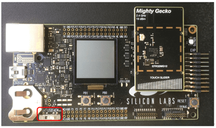

文档版本：5.4.2

# 先决条件

要简化您的 Simplicity Studio® 5（SSv5）安装：

* 将[开发硬件](#硬件)连接到您的 PC
* 登录您的[客户帐户](#客户帐户)

## SSv5 系统要求

操作系统

| Operating System | Version                                        |
| :--------------- | :--------------------------------------------- |
| Windows          | Windows 10 (x64)                               |
| macOS            | 10.24 Mojave or 10.25 Catalina (GNU toolchain) |
| Linux            | Ubuntu 20.04 LTS                               |

硬件

| Hardware Component | Item                                                                                       |
| :----------------- | :----------------------------------------------------------------------------------------- |
| CPU                | 1 GHZ or better                                                                            |
| Memory             | 1 GB RAM minimum, 8 GB recommended for Wireless Protocol development                       |
| Disk Space         | 600 MB disk space for minimum FFD installation; 7 GB for Wireless Dynamic Protocol support |

## 硬件

要开始使用 Simplicity Studio 并不需要 Silicon Labs development kit。但是，如果 Simplicity Studio 检测到官方的 development kit，则可以使用它来帮助您选择合适的软件和工具进行安装。如果您没有 development kit，那么您可以在[此处](https://www.silabs.com/development-tools.p-microcontrollers.p-wireless)探索可用的选项。

### EFR32 Kits

如果您有一个 Silicon Labs Wireless Starter Kit（WSTK）或 Pro Kit，那么请您在主板（mainboard）上安装无线板（radio board），并使用 kit 随附的 USB 电缆将主板连接到您的 PC。

**注意**：为了在 SSv5 中获得最佳性能，请确保主板上的电源开关处于 Advanced Energy Monitoring 或 “AEM” 处。

## 客户帐户

如果您还没有账户，那么请您在 Silicon Labs Customer Support Portal 上创建一个帐户。请务必记住账户的用户名和密码，因为您将使用它在 SSv5 上进行登录。您的帐户属性不仅决定了您可以下载哪些软件组件，还决定了您将收到哪些通知。

要查看或更改您的通知订阅，请登录门户，点击 **HOME** 以转到门户主页，然后点击 Manage Notifications 磁贴。请确保您勾选了 **Software/Security Advisory Notices & Product Change Notices (PCNs)** ，并且至少订阅了您的平台和协议。Silicon Labs 强烈建议您接收这些通知。点击 **Save** 以保存任何更改。
