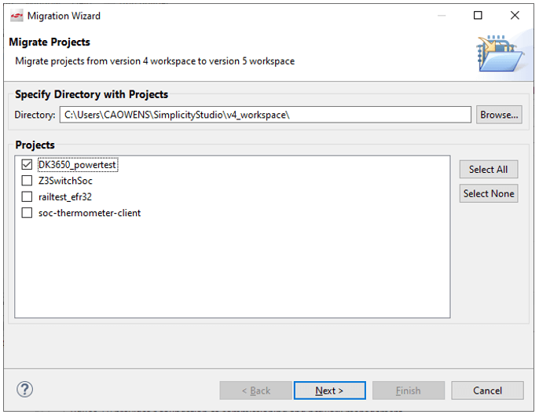
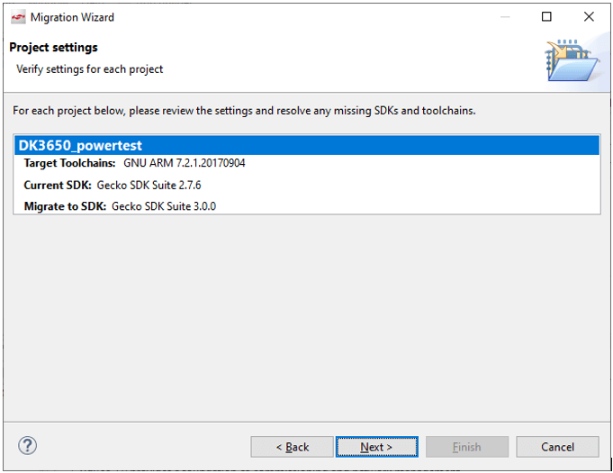
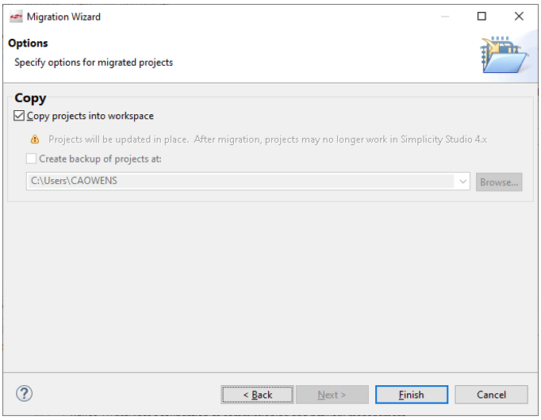
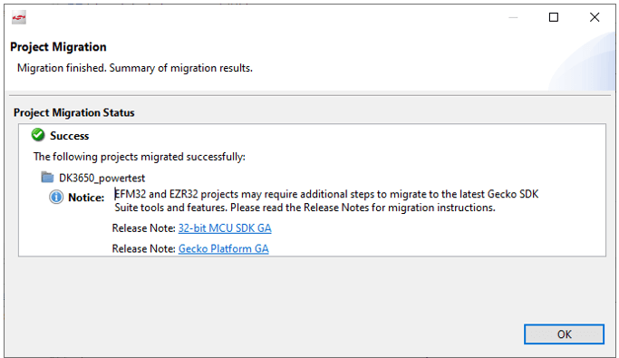
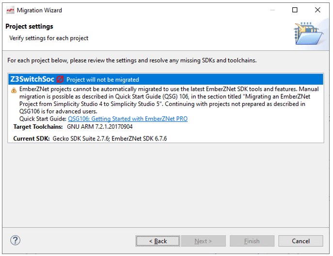

文档版本：5.4.2

# 项目迁移

## 转移到 Component-Based 架构

在 SSv5 version 5.3 中，Gecko Bootloader、Zigbee 和 Z-Wave 更改为 Silicon Labs Configurator component-based 架构。有关从早期版本的 SSv5 转移到这些项目的更多信息，请参阅：

* Zigbee [AN1301: Transitioning from Zigbee EmberZNet SDK 6.x to SDK 7.x](https://www.silabs.com/documents/public/application-notes/an1301-zigbee-v6x-to-v7x-transition-guide.pdf)
* Gecko Bootloader [AN1326: Transitioning to the Updated Gecko Bootloader in GSDK 4.0 and Higher](https://www.silabs.com/documents/public/application-notes/an1326-gecko-bootloader-transitioning-guide.pdf)

## 从 Simplicity Studio 4 迁移到 Simplicity Studio 5

将项目从 Simplicity Studio® 4（SSv4）迁移到 SSv5 的过程取决于项目的类型。

如果要迁移 [Bootloader、EFM32 或 EFM8 项目](#bootloaderefm32-和-efm8-项目)，请使用 **Migrate Project** 工具。如果您要迁移 [Z-Wave](#z-wave-项目)、[Bluetooth/Bluetooth Mesh、Proprietary Flex 或 Zigbee 项目](#zigbeeflex-和-bluetoothbluetooth-mesh-项目)，请按照指定文档中的说明进行操作。

### Bootloader、EFM32 和 EFM8 项目

**Bootloader 注意**：将此过程用作迁移的第一步。

点击 **Tools** 工具栏按钮以打开 Tools 对话框。选择 **Migrate Projects** 并点击 **OK**。选择要迁移的项目，点击 **Next**。

验证显示的信息，然后点击 **Next**。

决定是否要复制项目（推荐）并点击 **Finish**。

项目将从 SSv4 迁移到 SSv5。

### Z-Wave 项目

（通过 Simplicity Studio 5.2）按照知识库文章 [Migrating a Z-Wave project from GSDK 2.7.6 to GSDK 3.0.0](https://www.silabs.com/community/software/simplicity-studio/knowledge-base.entry.html/2020/07/17/migrating_a_z-waveprojectfromgsdk276togsdk-opdc) 中的指示进行操作。

### Zigbee、Flex 和 Bluetooth/Bluetooth Mesh 项目

无法使用该工具迁移这些项目。相反，请参阅以下文档：

* Zigbee (Through Simplicity Studio 5.2): [QSG106: Getting Started with EmberZNet PRO](https://www.silabs.com/documents/public/quick-start-guides/qsg106-efr32-zigbee-pro.pdf)
* Flex: [AN1254: Transitioning from the v2.x to the v3.x Proprietary Flex SDK](https://www.silabs.com/documents/public/application-notes/an1254-transitioning-from-proprietary-flex-sdk-v2-to-v3.pdf)
* Bluetooth: [AN1255: Transitioning from the v2.x to the v3.x Bluetooth SDK](https://www.silabs.com/documents/public/application-notes/an1255-transitioning-from-bluetooth-sdk-v2-to-v3.pdf)
* Bluetooth Mesh: [AN1298: Transitioning from the v1.x to the v2.x Bluetooth Mesh SDK](https://www.silabs.com/documents/public/application-notes/an1298-transitioning-from-bluetooth-mesh-1x-to-2x.pdf)

如果您尝试使用该工具，在大多数情况下，该工具会将您指向迁移过程的文档。

