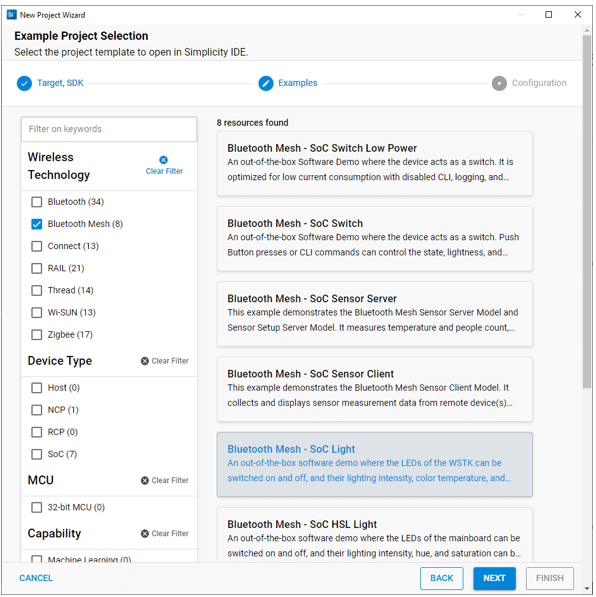
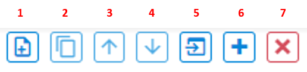

文档版本：5.4.2

# 开始一个项目

Simplicity Studio® 5（SSv5）支持多种不同的项目类型，可以通过 **File > New** 创建。这些包括：

* Silicon Labs Project Wizard（创建 Project Configurator 项目，如本节所述）
* [Solution...](https://docs.silabs.com/simplicity-studio-5-users-guide/latest/ss-5-users-guide-developing-with-project-configurator/project-solutions)
* Project...（打开 New Project Wizards 对话框）
* Other（将上述所有选项与其他很少使用的选项结合起来）

选择 **Files > New > Project** 以打开 New Project Wizards 对话框。

最值得注意的是：

* Silicon Labs Project Wizard（两个实例）以及 Silicon Labs MCU Project Wizard：创建 Project Configurator 项目，如本节所述。
* Direction Finding Project Wizard：创建 [Bluetooth multi-locator direction-finding projects](https://docs.silabs.com/simplicity-studio-5-users-guide/latest/ss-5-users-guide-direction-finding-tools/)。
* AppBuilder Project Wizard：创建 [AppBuilder Project](https://docs.silabs.com/d/0.4/ss-5-users-guide-developing-with-appbuilder)。

本页重点介绍 Project Configurator（\*.slcp）项目。

## 项目创建

通过一系列的三个对话框可以创建新的 Simplicity Studio® 5（SSv5）项目：

* [Target, SDK, and Toolchain](#target-sdk-and-toolchain-selection)
* [Examples](#examples)
* [Configuration](#configuration)

对话框顶部的指示器显示您所在的位置。

您可以从 Launcher Perspective 中的三个不同位置开始一个项目。你从哪里开始将决定你将到达三个对话框中的哪一个。如果您需要进行更改，请点击 **BACK** 以移至先前的对话框。

* **从 OVERVIEW 选项卡中**：点击 **Create New Project**。从 Examples 对话框开始。
* **从 EXAMPLE PROJECTS 选项卡中**：根据需要使用过滤器，选择一个项目，然后点击 **CREATE**。从 Project Configuration 对话框开始。
* **从文件菜单中**：选择 New >> Silicon Labs Project Wizard。从 Target, SDK, and Toolchain Selection 对话框开始。

开始后，您可以保留默认值。

### Target, SDK, and Toolchain Selection

如果您已连接或选择了目标，则所有信息都已预先填充好了。否则，您可以在此处选择目标部件。点击 **NEXT**。

请注意，如果您想在 SSv5 中使用 IAR，请在此处选择它。如果您在 Project Configurator 环境中进行开发，那么一旦创建了项目，就很难更改编译器了。

### Examples

使用复选框或关键字查找感兴趣的示例，然后选择它并点击 **NEXT**。

### Configuration

如果需要，请重命名您的项目。“With project files” 下的三个选项控制复制哪些和链接哪些源。如果修改了链接源，则更改将应用​​于链接到该源的任何其他项目。

* 链接到源（Link to sources）：该项目将链接到 SDK 文件和项目文件，例如 app.c。
* 链接 SDK 并复制项目源（Link SDK and copy project sources）（默认）：将项目源复制到您的工作区。请注意，这将创建 SDK 文件夹结构，但如果您向下深探，您将会看到所有文件夹都是空的。
* 复制内容（Copy contents）：项目文件和 SDK 文件都复制到您的工作区。

点击 **FINISH**。

完成项目创建后，Simplicity IDE 透视图将打开。初次配置可能会稍有延迟。有关此透视图中可用的所有特性和功能的详细信息，请参阅 [About the Simplicity IDE](https://docs.silabs.com/simplicity-studio-5-users-guide/latest/ss-5-users-guide-about-the-simplicity-ide/)。

1. **编辑器区域（Editor area）**（取决于项目）。
2. **项目资源管理器视图（Project Explorer view）**：列出工作区中可用的项目和解决方案。
3. **调试适配器视图（Debug Adapters view）**：列出通过 USB 连接到您的计算机或在本地网络上检测到的套件或 SEGGER J-Link。
4. **开发者视图（Developer views）**：开发过程中使用的一组视图。

Simplicity IDE 透视图中的编辑器取决于项目：

* [Project Configurator](#project-configurator-项目)：用于从 Gecko SDK 4.0 开始的所有 Gecko SDK 协议和工具；项目文件以 .slcp 结尾。
* [8-bit Hardware Configurator](https://docs.silabs.com/simplicity-studio-5-users-guide/latest/ss-5-users-guide-developing-for-8bit-devices/using-hardware-configurator)：用于 8-bit 设备应用程序。
* [AppBuilder](https://docs.silabs.com/simplicity-studio-5-users-guide/latest/ss-5-users-guide-getting-started/start-a-project#appbuilder-projects)：用于 Gecko SDK 3.2 及更低版本中的 Zigbee EmberZNet 和 Gecko Bootloader；项目文件以 .isc 结尾。

## Project Configurator 项目

本页除了介绍 Project Configurator 项目外，还介绍了：

- [开始一个项目](#开始一个项目)
  - [项目创建](#项目创建)
    - [Target, SDK, and Toolchain Selection](#target-sdk-and-toolchain-selection)
    - [Examples](#examples)
    - [Configuration](#configuration)
  - [Project Configurator 项目](#project-configurator-项目)
    - [Pin Tool](#pin-tool)
    - [Bluetooth GATT Configurator](#bluetooth-gatt-configurator)
    - [Bluetooth Mesh Configurator](#bluetooth-mesh-configurator)
    - [Memory Editor](#memory-editor)
    - [Proprietary Radio Configurator](#proprietary-radio-configurator)
    - [Wi-SUN Configurator](#wi-sun-configurator)
    - [Zigbee Cluster Configurator](#zigbee-cluster-configurator)
    - [AppBuilder Projects](#appbuilder-projects)

注意：[Memory Editor](#memory-editor) 是一个主要用于 [solutions](https://docs.silabs.com/simplicity-studio-5-users-guide/latest/ss-5-users-guide-developing-with-project-configurator/solutions) 的工具的 beta 版实现。

Project Configurator 项目在 **.slcp**（Silicon Labs Configurator project）文件中定义。用户可以通过在 Software Components 选项卡上添加、删除和配置组件来修改项目。有关详细信息，请参阅 [Developing with Project Configurator](https://docs.silabs.com/simplicity-studio-5-users-guide/latest/ss-5-users-guide-developing-with-project-configurator/)。

注意：从 Simplicity Studio 5.3 版开始，您可以通过导入 .slcp 文件在 Simplicity IDE 中创建项目。有关详细信息，请参阅 [Import and Export](https://docs.silabs.com/simplicity-studio-5-users-guide/latest/ss-5-users-guide-about-the-simplicity-ide/import-and-export)。

项目通常在包含示例项目描述的 README 选项卡上或在 OVERVIEW 选项卡上打开。

OVERVIEW 选项卡包含三张带有信息的卡片，其中一些带有可以更改的设置：

* **Target and Tool Settings**，您可以在其中更改开发目标、SDK 和项目生成器。向下滚动并点击 **Change Target/SDK/Generators** 可以编辑这些设置。项目生成器配置决定了 SSv5 在您配置项目时生成的 IDE 或构建系统项目文件。（注意：Simplicity IDE 使用的编译器/工具链可在 **Project > Build Configurations** 中配置。默认 IDE 可在 **Preferences > Simplicity Studio > Preferred IDE** 中配置。）
* **Project Details**，您可以在其中重命名项目，更改项目源导入模式，并在必要时强制生成项目和源文件（在 autogen 文件夹中）。
  * **Import mode** 控制复制哪些资源以及链接哪些资源。如果您修改了链接的源，您的更改将应用​​于链接到该源的任何其他项目。
  * **Force Generation** 在极少数未触发自动生成的情况下使用，这通常是因为在 SSv5 之外进行了一些更改，例如编辑 .slcp 文件。
* **Quick Links** 提供了指向通常用于修改项目或较低级别配置（例如无线电或外围连接）的工具的链接。链接因 SDK 和目标设备而异。

要通过组件库配置项目，请点击 SOFTWARE COMPONENTS 选项卡。许多过滤器和关键字搜索可帮助您探索各种组件类别。请注意，所有已安装 SDK 的组件均已显示。

展开组件类别\子类别以查看各个组件。项目中已安装的组件会被选中（1），并且可以被卸载。可配置组件由齿轮符号（2）表示。

点击组件名称旁边的齿轮符号或可配置组件描述中的 **Configure** 以打开 Component Editor。您可以在此处更改参数或直接编辑组件源。

在 Component Editor 中的变改会自动保存。

当您在 Project Configurator 中进行更改时，例如安装或卸载组件，项目输出文件会自动生成。进度显示在透视图的右下方。

速度根据您的系统而异。在构建应用程序映像之前，请确保生成已完成。

构建应用程序映像并将其刷写到您的目标设备，如 [Building and Flashing](https://docs.silabs.com/simplicity-studio-5-users-guide/latest/ss-5-users-guide-building-and-flashing/) 中所述。

CONFIGURATION TOOLS 选项卡提供了一种在工具的选项卡尚未打开时打开工具的简便方法，作为常规选项卡上 Quick Links 卡片的替代方法。它展示了与项目类型相关的配置工具。 例如，Bluetooth Mesh 项目展示了许多工具，而 OpenThread 项目可能只显示 Pin Tool。点击工具卡上的 **Open** 以在单独的选项卡中打开它。

### Pin Tool

[Pin Tool](https://docs.silabs.com/simplicity-studio-5-users-guide/latest/ss-5-users-guide-developing-with-project-configurator/pin-tool) 允许您修改目标设备的引脚使用和参数。除了通过 CONFIGURATION TOOLS 选项卡打开 Pin Tool，您还可以在 Project Explorer 视图中双击 \<project\>.pintool 文件。

双击 Software Component 以打开 Component Editor 并配置该功能。Pin Tool 不会自动保存。

### Bluetooth GATT Configurator

Bluetooth 和 Bluetooth Mesh 项目都使用 [Bluetooth GATT Configurator](https://docs.silabs.com/simplicity-studio-5-users-guide/latest/ss-5-users-guide-developing-with-project-configurator/bluetooth-gatt-configurator) 进行配置。

Bluetooth GATT Configurator 菜单允许您添加和删除服务（service）和特征（characteristic）。

1. 添加一个项。
2. 复制所选项。
3. 向上移动所选项。
4. 向下移动所选项。
5. 导入 Bluetooth GATT 数据库。
6. 添加预定义。
7. 删除所选项。

要添加自定义服务，请点击 **Profile (Custom BLE GATT)**，然后点击 **Add**（1）。要添加自定义特征，请选择一项服务，然后点击 **Add**（1）。要添加预定义的服务/特征，请点击添加预定义 **Add Predefined**（6）。

### Bluetooth Mesh Configurator

Bluetooth Mesh 项目 Device Composition Data 通过 [Bluetooth Mesh Configurator](https://docs.silabs.com/simplicity-studio-5-users-guide/latest/ss-5-users-guide-developing-with-project-configurator/bluetooth-mesh-configurator) 进行配置。Device Composition Data 呈现在三个方面：设备信息、元素和模型。

设备信息由在第一个字段中选择的公司确定。

每个节点至少有一个主要元素。要添加更多元素，请点击右下角的绿色 + 符号。

Bluetooth Mesh Configurator 具有 SIG-adopted 模型和 vendor 模型的编辑器。提供了 SIG-adopted 模型组件，但其无法编辑。然而，您可以删除这些模型，然后添加模型以满足您的需要。要删除模型，请选择它并点击红色 X 符号。要添加 SIG-adopted 模型，请将模型从左侧模型池拖到正确元素中的 SIG 模型表中。列表将显示所有 SIG-adopted 模型，您可以选择所需的模型。

在开发 SIG-adopted 模型未涵盖的产品时，vendor 模型为您提供了更大的灵活性。供应商可以在这些 vendor 模型中定义自己的规范，包括状态、消息和相关行为。Vendor 模型编辑器如下图所示。

### Memory Editor

Memory Editor 是一个图形工具，用于编辑工作区中应用程序的内存布局。它是该工具的 beta 版实现，旨在与 [solutions](https://docs.silabs.com/simplicity-studio-5-users-guide/latest/ss-5-users-guide-developing-with-project-configurator/project-solutions) 一起使用。在此版本中，它可以用于单个项目。大多数项目此时没有包含默认设置，这将导致出现下图所示的警告。将工具计算的默认值保存下来以作为起点。

### Proprietary Radio Configurator

[Radio Configurator](https://docs.silabs.com/simplicity-studio-5-users-guide/latest/ss-5-users-guide-developing-with-project-configurator/proprietary-radio-configurator) 作为 Proprietary SDK 的一部分提供。使用 Radio Configurator 可为 RAIL-based 无线电应用程序创建标准或自定义的无线电配置。

Radio Configurator 中的参数以卡片形式排列，其中一些组合在一起。不同的无线电配置文件提供不同的视图和参数集。

1. 在 General Settings 卡片中，可以在 **Select radio profile** 下拉菜单中选择一个无线电配置文件。无线电配置文件可以是任何受支持的无线电链路技术。这些技术可以受标准（例如 Sigfox 或 WMBus 协议）的约束，也可以完全自定义。完全可自定义的配置文件称为 “Base Profile”。
2. 在 **Select a radio PHY** 下拉列表中可以选择无线电 PHY（无线电配置）。每个配置文件都有可供使用的 “内置” 配置。
3. 查看并更新配置文件选项。默认情况下，是不允许更改的；字段显示为灰色。要启用自定义，请使用 General Settings 卡片上的 **Customized** 开关。这允许您访问配置文件定义的所有参数。

### Wi-SUN Configurator

[Wi-SUN Configurator](https://docs.silabs.com/simplicity-studio-5-users-guide/latest/ss-5-users-guide-developing-with-project-configurator/wi-sun-configurator) 作为 Wi-SUN SDK 的一部分提供。使用它通过三个面板配置 Wi-SUN 应用程序的主要设置：Application、Security 和 Radio。对于某些项目，只有 Radio 面板可用。Wi-SUN Configurator 选项卡在创建项目时可用，或者可以通过打开项目文件 /config/wisun/wisun_settings.wisunconf 来显示。

### Zigbee Cluster Configurator

[Zigbee Cluster Configurator](https://docs.silabs.com/simplicity-studio-5-users-guide/latest/ss-5-users-guide-developing-with-project-configurator/zigbee-cluster-configurator) 作为 Zigbee EmberZNet SDK 的一部分提供。使用它来管理 Zigbee 端点（endpoint）、簇（cluster）和命令（command）。该接口基于添加或修改端点。

您可以根据需要添加和配置簇。簇配置界面由三个选项卡组成：

* Attributes
* Attribute Reporting
* Commands

通过 Zigbee Cluster Configurator 所做的配置更改会被保存到 zcl_config.zap 文件中。当您保存文件时，Zigbee Cluster Configurator 不仅会将 .zap 文件保存到您的项目中，还会自动生成您的 Zigbee 应用程序所需的所有 .c 和 .h 文件。

### AppBuilder Projects

AppBuilder Projects 是通过修改各种选项卡中的参数来配置的，尤其是 PLUGINS 选项卡。有关详细信息，请参阅使用 [Developing with AppBuilder](https://docs.silabs.com/simplicity-studio-5-users-guide/latest/ss-5-users-guide-developing-with-appbuilder/)。

配置项目后，点击 **Generate** 以创建项目文件。如 [Building and Flashing](https://docs.silabs.com/simplicity-studio-5-users-guide/latest/ss-5-users-guide-building-and-flashing/) 中所述构建应用程序映像并将其刷写到您的目标设备。

要修改目标设备的引脚使用和参数，请使用 HAL 选项卡上提供的 [Hardware Configurator](https://docs.silabs.com/simplicity-studio-5-users-guide/latest/ss-5-users-guide-developing-with-appbuilder/configuring-peripherals)。请注意，虽然界面类似于 8-bit Hardware Configurator，但这是一个不同的工具。

通过 Hardware Configurator 所做的更改存储在一个特定于板的 .hwconf 文件中。
