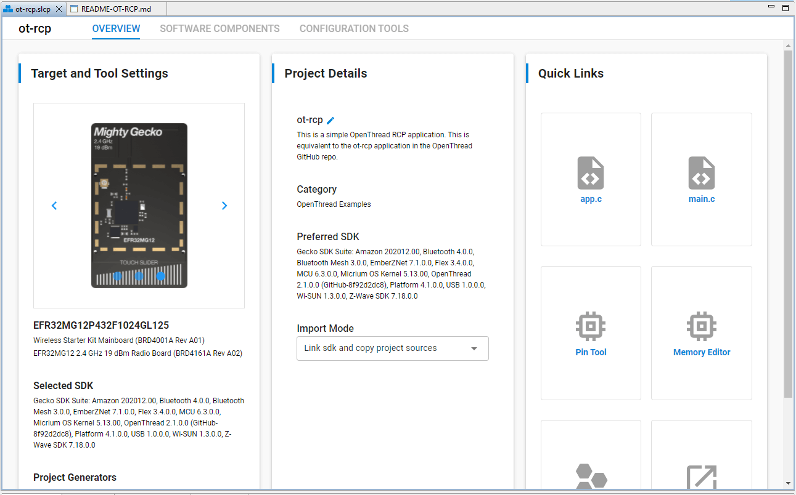
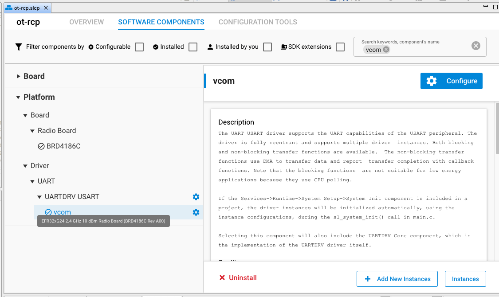
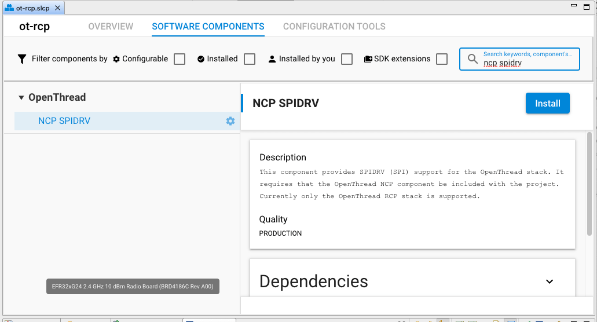
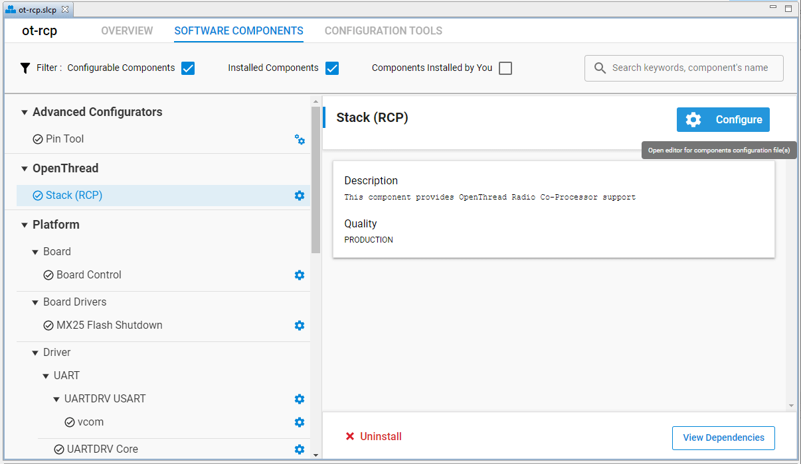
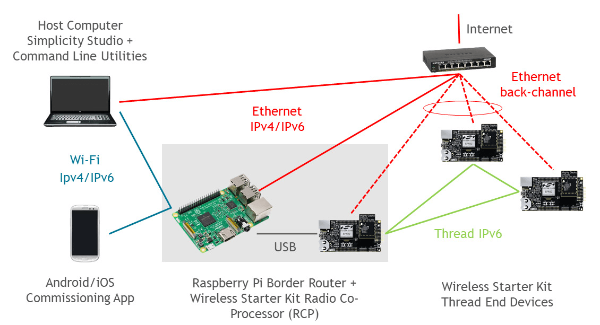
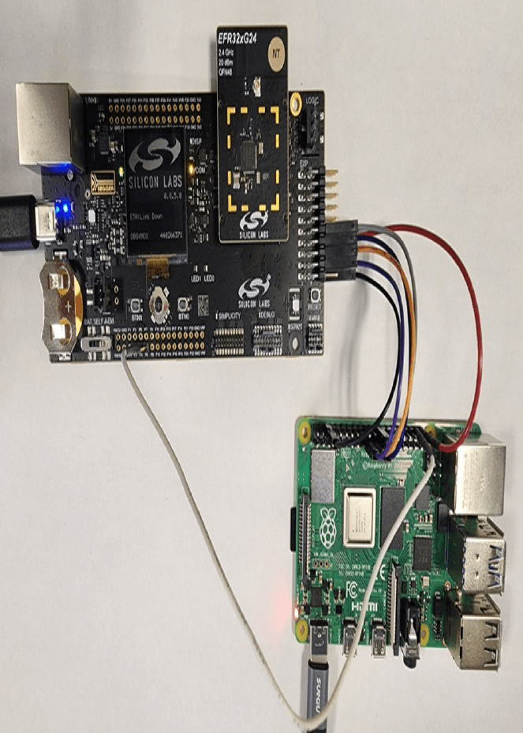
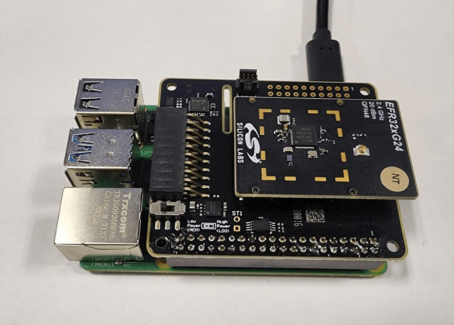
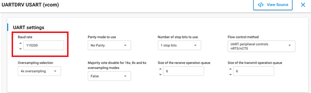

# AN1256: Using the Silicon Labs RCP with the OpenThread Border Router (Rev. 1.0) <!-- omit in toc -->

- [1 引言](#1-引言)
  - [1.1 硬件要求](#11-硬件要求)
- [2 RCP 映像的构建和安装说明](#2-rcp-映像的构建和安装说明)
  - [2.1 使用预编译的 RCP 映像](#21-使用预编译的-rcp-映像)
  - [2.2 使用 Simplicity Studio 5 构建 RCP 映像](#22-使用-simplicity-studio-5-构建-rcp-映像)
  - [2.3 使用 Simplicity Studio 5 针对 SPI 从默认的 OT-RCP 应用程序中配置 RCP 映像](#23-使用-simplicity-studio-5-针对-spi-从默认的-ot-rcp-应用程序中配置-rcp-映像)
  - [2.4 使用 Simplicity Studio 5 在 RCP 映像中配置 OpenThread 选项](#24-使用-simplicity-studio-5-在-rcp-映像中配置-openthread-选项)
- [3 Border Router Host 的构建和安装说明](#3-border-router-host-的构建和安装说明)
  - [3.1 安装硬件](#31-安装硬件)
    - [3.1.1 Raspberry Pi 与 WSTK 之间的硬线 SPI 连接](#311-raspberry-pi-与-wstk-之间的硬线-spi-连接)
    - [3.1.2 用于 Raspberry Pi 与 WSTK 之间的 SPI 连接的无线扩展板](#312-用于-raspberry-pi-与-wstk-之间的-spi-连接的无线扩展板)
  - [3.2 安装用于 RCP 的 Raspberry Pi](#32-安装用于-rcp-的-raspberry-pi)
    - [3.2.1 Docker 安装](#321-docker-安装)
      - [3.2.1.1 先决条件](#3211-先决条件)
      - [3.2.1.2 安装指引](#3212-安装指引)
    - [3.2.2 手动安装 OpenThread Border Router](#322-手动安装-openthread-border-router)
      - [重要笔记](#重要笔记)
- [4 OTBR 配置信息](#4-otbr-配置信息)
  - [4.1 OTBR 特性配置](#41-otbr-特性配置)
  - [4.2 Docker 配置笔记](#42-docker-配置笔记)
  - [4.3 手动安装的 OTBR 配置笔记](#43-手动安装的-otbr-配置笔记)
    - [4.3.1 使用 UART 接口的 OTBR 配置](#431-使用-uart-接口的-otbr-配置)
    - [4.3.2 使用 SPI 接口的 OTBR 配置](#432-使用-spi-接口的-otbr-配置)
  - [4.4 NAT64 配置笔记](#44-nat64-配置笔记)
  - [4.5 使用 ot-ctl 来配置和控制您的 OpenThread Border Router](#45-使用-ot-ctl-来配置和控制您的-openthread-border-router)
- [5 OpenThread 资源](#5-openthread-资源)

---

Thread Border Router 用于将 Thread 网络连接到其他 IP-based 网络，如 Wi-Fi® 或 Ethernet®。Thread 网络需要一个 Border Router 才能连接到其他网络。Border Router 为 Thread 网络内的设备提供了服务，包括用于离网（off-network）操作的路由服务、通过 IPv6 基础设施链路的双向连接以及启用 DNS-based 服务发现的服务注册。Silicon Labs 提供了一个 Border Router Add-On Kit，其中包含了构建 Border Router 软件所需的 Raspberry Pi 设备和示例 RCP（Radio Co-Processor，无线协处理器）应用程序。

注意：请参阅 OpenThread 发行说明以了解 Silicon Labs 发行版本所支持的 OpenThread（openthread）和 OpenThread Border Router（ot-br-posix）存储库的稳定版本提交。OpenThread 发行说明随 SDK 一起安装，也可以在 [docs.silabs.com](https://docs.silabs.com/) 上找到它。这适用于 Silicon Labs 为发行版本提供的所有默认容器，以及发行中包含的这些存储库的副本。虽然我们支持使用 GitHub 上的任何提交（使用 [ot-efr32](https://github.com/openthread/ot-efr32) 存储库）进行构建，但请注意 GitHub 上的最新公开代码可能不稳定。

# 1 引言

本应用笔记适合希望开发 OTBR（OpenThread Border Router）的软件工程师。本文假定您熟悉 OpenThread 和基本的 Thread 概念。有关 OpenThread 的介绍和 Thread 概念的信息，请访问 [https://openthread.io/](https://openthread.io/)。有关 OTBR 设置和安装的信息，请参阅 [https://openthread.io/guides/border-router](https://openthread.io/guides/border-router)。

本应用笔记假设您已下载了 Simplicity Studio 5（SSv5）和 Silicon Labs OpenThread SDK，并且熟悉了 SSv5 Launcher 透视图。可以在 [https://docs.silabs.com/](https://docs.silabs.com/) 和 SSv5 帮助菜单的在线 *Simplicity Studio 5 User's Guide* 中找到 SSv5 安装和入门说明以及一组详细参考资料。有关配置、构建和刷写 OpenThread 示例应用程序的更多信息，请参阅 *QSG170: Silicon Labs OpenThread Quick Start Guide*。

本应用笔记涉及以下主题：

* **RCP 映像的构建和安装说明**<br>解释 RCP 映像的构建和安装过程。
* **OpenThread Border Router 的构建和安装说明**<br>在基于 POSIX 的平台上定义 OpenThread Border Router 的构建和安装过程，包括一个为 Raspberry Pi 部署预构建的 Docker 容器的选项。
* **OTBR 配置信息**<br>提供 OTBR 信息，例如如何配置各种 Border Router 特性和 NAT64（Network Address Translation，网络地址转换）接口。
* **其他 OpenThread 资源**<br>包含指向 OpenThread 资源的链接。

## 1.1 硬件要求

一个 Thread Border Router 含有两个组件：

* 支持 Thread Border Router 的 Raspberry Pi 主机（推荐：Raspberry Pi 3 Model B+ 或更高版本）
* 支持 Thread 的 Silicon Labs RCP

要创建 RCP，您需要以下资源：

* [EFR32MG Wireless Starter Kit](https://www.silabs.com/products/development-tools/wireless/mesh-networking/mighty-gecko-starter-kit) 或 [Thunderboard Sense 2 Sensor-to-Cloud Advanced IoT Kit](https://www.silabs.com/development-tools/thunderboard/thunderboard-sense-two-kit)
* 支持 Thread 通信的 Silicon Labs 板

**注意**：有关 Silicon Labs 预编译 RCP 映像的列表，请参见 [Table 2-1](#Table_2-1)。

# 2 RCP 映像的构建和安装说明

**注意**：以下说明仅适用于使用 Simplicity Studio 为给定 GSDK 版本构建的 RCP 映像。

要使用最新的 OpenThread 构建 RCP 映像，请按照 [ot-efr32](https://github.com/openthread/ot-efr32) 存储库中的说明进行操作。

## 2.1 使用预编译的 RCP 映像

以下为 Silicon Labs 提供的各个板的预编译映像及其映像位置。默认的预编译映像是针对 UART 接口配置的。

**注意**：默认情况下，Silicon Labs GSDK 使用 Thread 协议版本 1.3，以下的预编译 RCP 映像也是一样。

<table id="Table_2-1" style="margin-left: auto; margin-right: auto;">
    <caption>Table 2-1. Silicon Labs Precompiled RCP Images</caption>
    <thead>
        <tr>
            <th>Board Name</th>
            <th>Image Location</th>
        </tr>
    </thead>
    <tbody>
        <tr>
            <td>brd4161a</td>
            <td>protocol/openthread/demos/ot-rcp/ot-rcp-brd4161a.s37</td>
        </tr>
        <tr>
            <td>brd4166a</td>
            <td>protocol/openthread/demos/ot-rcp/ot-rcp-brd4166a.s37</td>
        </tr>
        <tr>
            <td>brd4168a</td>
            <td>protocol/openthread/demos/ot-rcp/ot-rcp-brd4168a.s37</td>
        </tr>
        <tr>
            <td>brd4180a</td>
            <td>protocol/openthread/demos/ot-rcp/ot-rcp-brd4180a.s37</td>
        </tr>
        <tr>
            <td>brd4304a</td>
            <td>protocol/openthread/demos/ot-rcp/ot-rcp-brd4304a.s37</td>
        </tr>
    </tbody>
</table>

## 2.2 使用 Simplicity Studio 5 构建 RCP 映像

Silicon Labs 有许多标准 OpenThread 映像的示例应用程序：

1. 选择 **ot-rcp** 作为 OpenThread Border Router over UART interface 的默认 RCP 映像的示例。
2. 将目标部件连接到计算机后，打开 Simplicity Studio 5 的 **File** 菜单并选择 **New > Silicon Labs Project Wizard**。Target, SDK, and Toolchain Selection 对话框会被打开。点击 **NEXT**。
3. Example Project Selection 对话框会被打开。使用 **Technology Type** 和 **Keyword** 过滤器搜索 **ot-rcp**，这是一个 OpenThread Border Router 的默认 RCP 映像示例。选择它并点击 **NEXT**。
4. Project Configuration 对话框会被打开。在这里，您可以重命名您的项目，更改默认项目文件位置，和确定您是否将链接到或复制项目文件。请注意，如果您更改任何链接资源，则引用它的任何其他项目都会受到影响。点击 **FINISH**。
5. Simplicity IDE 透视图会被打开并且 Project Configurator 会打开到 **OVERVIEW** 选项卡。有关通过 Simplicity IDE 透视图和 Project Configurator 提供的功能的详细信息，请参阅在线的 *Simplicity Studio 5 User's Guide*。<br>
6. 你可以对 SOFTWARE COMPONENTS 进行任何配置更改，如下一节所述。您可以在 Simplicity IDE 透视图的右下方看到自动生成的进度条。必须确保在构建之前进度条已完成。<br>
7. 按照 *QSG170: Silicon Labs OpenThread Quick Start Guide* 中的说明编译并刷写应用程序映像。

## 2.3 使用 Simplicity Studio 5 针对 SPI 从默认的 OT-RCP 应用程序中配置 RCP 映像

1. 按照 2.2 节步骤 1 – 4 中的描述生成 ot-rcp 应用程序。
2. 在 RCP 项目（.slcp）的 **SOFTWARE COMPONENTS** 选项卡下，展开 **Platform** 菜单。在 **UARTDRV USART** 组件下选择 **vcom**。<br>
3. 点击 **Uninstall** 以移除组件，此时 **UARTDRV Core** 组件也会被卸载。
4. 在 RCP 项目（.slcp）的 **SOFTWARE COMPONENTS** 选项卡下，展开 **OpenThread** 菜单。选择 **NCP SPIDRV** 组件并点击 **Install**。<br>
5. 按照 *QSG170: Silicon Labs OpenThread Quick Start Guide* 中的说明编译并刷写应用程序映像。

## 2.4 使用 Simplicity Studio 5 在 RCP 映像中配置 OpenThread 选项

1. 在您的 RCP 项目（.slcp）的 **SOFTWARE COMPONENTS** 选项卡下，展开 **OpenThread** 菜单。为 RCP 构建选择 **Stack (RCP)**。
2. 点击 **Configure** 以更改与 OpenThread 构建相关的设置。<br>**注意**：您可以选中 **Configurable Components** 和 **Installed Components** 复选框以仅筛选出您可以成功配置的组件。<br>
3. 为您的 RCP 项目配置各种编译时设置。各种构建选项在 OpenThread 文档 [https://openthread.io/guides/build](https://openthread.io/guides/build) 中进行了说明。
4. 有关与 WiFi 共存的配置，请参阅 *AN1017 Zigbee and OpenThread Coexistence with WiFi*。

# 3 Border Router Host 的构建和安装说明

## 3.1 安装硬件

如下图所示，使用 Ethernet 电缆将每个 Wireless Starter Kit 主板和主机连接到 Ethernet 交换机。这些连接将允许对 RCP 和终端设备进行编程和网络分析。终端设备也可以选择通过 USB 而不是 Ethernet 连接到主机。



### 3.1.1 Raspberry Pi 与 WSTK 之间的硬线 SPI 连接

按如下所示连接 SPI 引脚：

| Raspberry Pi Connector (SPI Pins) | WPK’s Expansion Connector (brd4002) |
| :-------------------------------- | :---------------------------------- |
| GPIO10 / Pin19 (MOSI)             | Pin 4                               |
| GPIO9 / Pin21 (MISO)              | Pin 6                               |
| GPIO11 / Pin23 (SCLK)             | Pin 8                               |
| GPIO7/8 / Pin24/26 (CS0/CS1)      | Pin 10                              |
| GPIO21 / Pin40 (Interrupt line)   | Pin 7                               |
| GND / Pin 6                       | Pin 1                               |
| GPIO20 / Pin38 (Reset line)       | Pin F4 on breakout connector        |



### 3.1.2 用于 Raspberry Pi 与 WSTK 之间的 SPI 连接的无线扩展板

您还可以使用一个安装在 Raspberry Pi 顶部的[无线扩展板](https://www.silabs.com/documents/public/user-guides/ug291-exp4320a-user-guide.pdf)来避免硬线连接，如下所示。



注意：根据 SPI 连接，使用 [4.3.2 节](#432-使用-spi-接口的-otbr-配置) 中所述的正确 `OTBR_AGENT_OPTS`。

## 3.2 安装用于 RCP 的 Raspberry Pi

有两种不同的方法可以安装用于 RCP 的 Raspberry Pi：

* Docker 容器
* 手动安装

### 3.2.1 Docker 安装

**注意**：以下 Docker 容器仅应与使用 Simplicity Studio 5 为给定发行版本构建的 RCP 一起使用。请务必使容器的标签版本与您正在测试的 GSDK 版本相匹配。

Silicon Labs 建议使用 OTBR 部署公司的 Docker 容器。在容器中运行 OTBR 允许您创建易于部署的产品，和快速开发原型和测试。

Silicon Labs 提供以下预构建的 Docker 容器（带有标签），其托管在 DockerHub 上：

[https://hub.docker.com/r/siliconlabsinc/openthread-border-router/tags](https://hub.docker.com/r/siliconlabsinc/openthread-border-router/tags)

用于 proprietary radio 的支持版本（alpha 发行版本）：

[https://hub.docker.com/r/siliconlabsinc/openthread-border-router-proprietary-na-915/tags](https://hub.docker.com/r/siliconlabsinc/openthread-border-router-proprietary-na-915/tags)

#### 3.2.1.1 先决条件

* 确保您已经将 [Raspberry Pi OS Lite image](https://www.raspberrypi.org/downloads/raspberry-pi-os/) 或 [Raspberry Pi OS with Desktop](https://www.raspberrypi.org/downloads/raspberry-pi-os/) 刷写到您的 SD 卡上。
* 确保您已经更新了您的本地存储库和包管理器（安装 Docker 之前执行 **apt-get update** 和 **apt-get upgrade**）
* 可选但推荐：安装 Haveged 以获得更好的熵条件。

#### 3.2.1.2 安装指引

* 确保在任何更新后重启：
    ```Shell
    curl -sSL https://get.docker.com | sh
    ```
* 完成后，您可以修改 Docker 用户设置修改以便在每个命令之前无需 `sudo`：
    ```Shell
    sudo usermod -aG docker $USER
    ```
* Raspberry Pi 和 Linux 用户，请确保执行：
    ```Shell
    sudo modprobe ip6table_filter
    ```
    以启用 OTBR 防火墙支持。这允许 OTBR 脚本在 otbr-agent 启动之前在 Docker 容器内创建规则。<br>
    要确保此设置在重启后仍然存在，请将以下行添加到 `/etc/modules`：
    ```Shell
    ip6table_filter
    ```
    如果您未完成此步骤，您可能会在启动 Docker 容器时看到 modprobe 错误。
* 发出以下命令来安装容器。请注意，您的 RCP 一次只能与一个 Border Router 容器一起运行。此外，请务必验证 RCP 版本（Thread 协议版本 1.3）以确保其是针对该容器的。<br>
    UART 接口:
    ```Shell
    docker pull siliconlabsinc/openthread-border-router:gsdk-4.2.0
    ```
    SPI 接口:
    ```Shell
    docker pull siliconlabsinc/openthread-border-router:gsdk-4.2.0_spi
    ```
* 要运行一个 OpenThread Border Router（默认为 Thread 协议版本 1.3），请发出以下命令：
    * UART 接口示例：
        ```Shell
        docker run -d --name "otbr" \
            --sysctl "net.ipv6.conf.all.disable_ipv6=0 net.ipv4.conf.all.forwarding=1 net.ipv6.conf.all.forwarding=1" \
            -p 8080:80 --dns=127.0.0.1 -it \
            --volume /dev/ttyACM0:/dev/ttyACM0 \
            --privileged siliconlabsinc/openthread-border-router:gsdk-4.2.0 \
            --radio-url spinel+hdlc+uart:///dev/ttyACM0?uart-baudrate=460800 \
            --backbone-interface eth0
        ```
    * SPI 接口示例：
        ```Shell
        docker run -d --name "otbr" \
            --sysctl "net.ipv6.conf.all.disable_ipv6=0 net.ipv4.conf.all.forwarding=1 net.ipv6.conf.all.forwarding=1" \
            -p 8080:80 --dns=127.0.0.1 -it \
            --volume /dev/ttyACM0:/dev/ttyACM0 \
            --privileged siliconlabsinc/openthread-border-router:gsdk-4.2.0 \
            --radio-url spinel+spi:///dev/spidev0.0?gpio-int-device=/dev/gpiochip0&gpio-int-line=21&gpio-reset-device=/dev/gpiochip0&gpio-reset-line=20&no-reset=1&spi-speed=1000000 \
            --backbone-interface eth0
        ```

（有关配置 SPI Radio URL 的说明，请参阅下面的 4.3.2 节）

您可以使用其他参数来配置容器。更多信息请参阅 [4 OTBR 配置信息](#4-otbr-配置信息)或 `ot-br-posix` 安装目录中的 Dockerfile。

### 3.2.2 手动安装 OpenThread Border Router

有关如何设置 Raspberry Pi 以与 RCP 一起使用的信息，请参阅 OpenThread Border Router 网站：[https://openthread.io/guides/border-router/raspberry-pi](https://openthread.io/guides/border-router/raspberry-pi)。

[https://openthread.io/guides/border-router/build](https://openthread.io/guides/border-router/build) 详细地介绍了完整的构建说明。

在上述过程中，检查并记下您对 `/etc/dhcpcd.conf`、`/etc/default/otbr-agent` 或 `/etc/tayga.conf` 等文件的配置更改，以便日后需要重新应用它们。

#### 重要笔记

* Silicon Labs 建议使用 root-level 访问权限运行所有 OpenThread 设置脚本。
* 对于手动设置，您可以使用 Silicon Labs SDK 中包含的 ot-br-posix 版本：
    ```Text
    util/third_party/ot-br-posix
    ```
    执行 bootstrap 步骤后，通过复制或创建指向 OpenThread 栈的符号链接，确保在 third_party/openthread/repo 中检查到正确版本的 OpenThread 栈：
    ```Text
    util/third_party/ot-br-posix/third_party/openthread/repo -> util/third_party/openthread
    ```
* 确保您的主机环境中对以下文件具有可执行权限：
    ```Text
    util/third_party/ot-br-posix/script/bootstrap
    util/third_party/ot-br-posix/script/setup
    ```
* 有关给定发行版本支持的稳定提交，请参阅 OpenThread 发行说明。如果使用 GitHub 构建，请按照说明在 [ot-efr32](https://github.com/openthread/ot-efr32) 存储库上构建 RCP。
* 记得在构建过程中包含您想要的正确标志：
    ```Shell
    sudo ./script/bootstrap
    ```
    要启用 border routing，请指定您的平台的 Ethernet 或 Wi-fi 接口：
    ```Shell
    sudo INFRA_NAME=eth0 ./script/setup
    ```

要为 border router 使用 Silicon Labs 的特定配置设置，您可以获取 gsdk 中“**\<gsdk_location\>/protocol/openthread/platform-abstraction/posix/openthread-core-silabs-posix-config.h**”下托管的特殊配置头文件。

然后按如下方式运行设置：

```Shell
# Copy the config file to a known include path
sudo cp <gsdk_location>/protocol/openthread/platform-abstraction/posix/openthread-core-silabs-posixconfig.h <gsdk_location>/util/third_party/openthread/src/posix/platform/

# Run the setup by specifying the above config header
sudo INFRA_IF_NAME=eth0 "OTBR_OPTIONS="-DOT_CONFIG=openthread-core-silabs-posix-config.h"
./script/setup
```

要使用 SPI 接口构建 OTBR，请按如下方式指定 RCP 总线：

```Shell
sudo INFRA_IF_NAME=eth0 "OTBR_OPTIONS="-DOT_POSIX_CONFIG_RCP_BUS=SPI" ./script/setup
```

**注意**：如果不指定 `OT_POSIX_CONFIG_RCP_BUS`，则默认为 UART/HDLC 接口。

# 4 OTBR 配置信息

## 4.1 OTBR 特性配置

有关如何正确配置 OpenThread Border Router 的特性和服务的信息，请访问 [https://openthread.io/guides/border-router](https://openthread.io/guides/border-router#features_and_services)。

## 4.2 Docker 配置笔记

* **注意**：Silicon Labs-hosted Docker 容器仅应与使用 Simplicity Studio 5 为给定发行版本构建的 RCP 一起使用。请务必使容器的标签版本与您正在测试的 GSDK 版本相匹配。
* 您需要配置您希望 OTBR 使用的 TTY 端口，以便在启动时连接您的 RCP。查找 RCP 设备的 TTY 端口。最简单的方法是在 RCP 连接后查找 `/tty/dev…` 条目。它通常应该是 `/dev/ttyUSB0` 或 `/dev/ttyACM0`。
* 按如下方式执行 Docker 安装（针对 UART 接口的示例）：
    ```Shell
    docker run -d --name "otbr" \
        --sysctl "net.ipv6.conf.all.disable_ipv6=0 net.ipv4.conf.all.forwarding=1 net.ipv6.conf.all.forwarding=1" \
        -p 8080:80 --dns=127.0.0.1 -it \
        --volume /dev/ttyACM0:/dev/ttyACM0 \
        --privileged siliconlabsinc/openthread-border-router:gsdk-4.2.0 \
        --radio-url spinel+hdlc+uart:///dev/ttyACM0?uart-baudrate=460800 \
        --backbone-interface eth0
    ```
    * `-d` 确保容器以分离模式运行。
    * 您可以随时使用 `docker logs` 命令查看容器的运行日志。
    * `--name` 在 docker 容器正确关闭（或删除）之前是持久的。
    * 端口 `8080` 指示托管 Border Router 管理网页的 Web 服务器的端口。
    * radio-url 选项中的 `?uart-baudrate=460800` 是必需的，以应对 UART 上的分片/重组问题，以及高代价的操作（如使用长 IPv6 数据包的 DTLS 或其它高数据速率用例）。<br>如果您在主机上使用更高的波特率，那么请确保通过在 RCP 的 WSTK 的管理控制台上发出以下命令来更改 RCP 上的波特率：
    ```Text
    > serial vcom config speed 460800
    ```
    还要确保在您的 RCP 项目中的 UARTDRV USART 组件中设置正确的波特率，如下图所示：<br>
* 您可以直接向容器发出命令，而无需附加到容器：
    ```Shell
    docker exec -ti otbr sh -c "sudo ot-ctl state"
    ```
    有关更多信息，请参阅 [docker exec documentation](https://docs.docker.com/engine/reference/commandline/exec/)。
* 您也可以通过发出以下命令直接获得上面的交互式 shell：
    ```Shell
    docker exec -ti otbr sh -c "sudo ot-ctl"
    ```
* 您可以查看正在运行 OTBR Docker 容器的窗口以查看 Border Router 的运行日志输出，或使用如下命令：
    ```Shell
    docker logs [container-id] -f
    ```
* 如果您不适当地加载了容器，您可以按如下所示管理容器：
    ```Shell
    # list all container images
    docker images otbr
    # remove existing container
    docker image rm -f <container ID>
    # list running containers
    docker ps -a
    # to remove running container
    docker rm -f <container name>
    ```

## 4.3 手动安装的 OTBR 配置笔记

### 4.3.1 使用 UART 接口的 OTBR 配置

* 您需要配置您希望 OTBR 使用的 tty 端口，以便在启动时连接您的 RCP。查找 RCP 设备的 tty 端口。最简单的方法是在 RCP 连接后查找 `/tty/dev…` 条目。它通常应该是 `/dev/ttyUSB0` 或 `/dev/ttyACM0`。
* 编辑 `/etc/default/otbr-agent` 文件并查找 `OTBR_AGENT_OPTS` 配置。在该参数中包含 tty 端口名称，如下所示：
    ```Text
    OTBR_AGENT_OPTS="-I wpan0 spinel+hdlc+uart:///dev/ttyACM0?uart-baudrate=460800"
    ```
* 如果要运行 Backbone Border Router（Thread 协议版本 1.2 或更高版本），则需要添加 backbone 接口，如下所示：
    ```Text
    OTBR_AGENT_OPTS="-I wpan0 -B eth0 spinel+hdlc+uart:///dev/ttyACM0?uart-baudrate=460800"
    ```
* 如果要运行一个 Thread 1.3 Border Router，您可以指定 TREL（Thread Radio Encapsulation Link，Thread 无线封装链路）接口以启用 Thread over Infrastructure 链路，如下所示：
    ```Text
    OTBR_AGENT_OPTS="-I wpan0 -B eth0 spinel+hdlc+uart:///dev/ttyACM0?uart-baudrate=460800 trel://eth0"
    ```
* 在您的 Raspberry Pi 上发出 `> sudo ot-ctl state ` 命令以查看 host 和 RCP 之间的连接状态。
* 要验证正在使用的波特率，请发出命令：
    ```Shell
    stty -F /dev/ttyACM0
    ```
* 检查所有必需的服务是否已在 OTBR 上运行。<br>`sudo systemctl status` 不应该报告任何服务在“degraded”状态下运行。
* 检查 `/var/log/syslog` 以获取 otbr-agent 的运行日志。

### 4.3.2 使用 SPI 接口的 OTBR 配置

* 您需要配置希望 OTBR 使用的 SPI 端口，以便在启动时连接您的 RCP。查看您的 Raspberry Pi 上是否启用了 SPI 接口。如果不，
    * 通过在 `/boot/config.txt` 中添加以下内容来启用它
        ```Text
        dtparam=spi=on
        dtoverlay=diable-bt #Maybe not required
        ```
    * 如果在 /boot/config.txt 中定义了 `dtoverlay=spi0-1cs,cs0_pin=26`，则将其删除/注释掉。
    * 重启 Raspberry pi。
    * 使用此命令验证 SPI 端口 `ls /dev | grep spi`。
    * 您应该会看到两个设备：`spidev0.0` 和 `spidev0.1`，具体取决于您的 Raspberry Pi 版本。
* 编辑 `/etc/default/otbr-agent` 文件，并查找 `OTBR_AGENT_OPTS` 配置。根据您的硬件设置，在该参数中包含正确的 GPIO，如下所示，请参阅 [3.1.1](#311-raspberry-pi-与-wstk-之间的硬线-spi-连接) 和 [3.1.2](#312-用于-raspberry-pi-与-wstk-之间的-spi-连接的无线扩展板) 节。
    * 如果 Raspberry Pi 硬连线到 wstk 扩展连接器上的 SPI 引脚，请使用以下参数。如果您使用的是 Rasp Pi 的 CS0，请使用 `spidev0.0`，或者如果是 CS1 引脚则使用 `spidev0.1`。
        ```Text
        OTBR_AGENT_OPTS="-I wpan0 -B eth0 spinel+spi:///dev/spidev0.0?gpio-int-device=/dev/gpiochip0&gpioint-line=21&gpio-reset-device=/dev/gpiochip0&gpio-reset-line=20&no-reset=1&spi-speed=1000000"
        ```
    * 如果使用了无线扩展板（brd8016A）将无线电板安装在 Raspberry Pi 上，请使用以下参数。
        ```Text
        OTBR_AGENT_OPTS="-I wpan0 -B eth0 spinel+spi:///dev/spidev0.0?gpio-int-device=/dev/gpiochip0&gpio-int-line=22&gpio-reset-device=/dev/gpiochip0&gpio-reset-line=23&no-reset=1&spispeed=1000000"
        ```
    * 如果您有自定义的硬件连接，请确保提供相应的 GPIO 引脚。
    * 通过重启 Raspberry pi 或发出 `> sudo systemctl restart otbr-agent` 来启动 `otbr-agent` 服务。
* 在 Raspberry Pi 上发出 `> sudo ot-ctl state` 命令以查看 host 与 RCP 之间的连接状态。
* 检查所有必需的服务是否都在 OTBR 上运行。<br>`sudo systemctl status` 不应该报告任何服务在“degraded”状态下运行。
* 检查 `/var/log/syslog` 以获取 otbr-agent 的运行日志。

## 4.4 NAT64 配置笔记

* 从 GSDK 4.2.0 开始，Silicon Labs OpenThread Border Router 使用 OpenThread-based NAT64 实现，它会自动设置 NAT64 前缀以用于地址转换。请参阅 [https://openthread.io/guides/borderouter/docker/test-connectivity](https://openthread.io/guides/border-router/docker/test-connectivity) 中的示例。
* Silicon Labs 不建议在使用 192.168.x.x 地址的网络上使用默认的 NAT 配置，因为默认情况下 NAT 在 NAT64 接口上使用这些地址。

## 4.5 使用 ot-ctl 来配置和控制您的 OpenThread Border Router

如需获取完整的命令列表，请执行：

```Shell
> sudo ot-ctl help
```

有关如何手动设置 Thread 网络的示例以及如何启用外部 commissioner 的示例，请参阅 [https://openthread.io/guides/border-router/external-commissioning](https://openthread.io/guides/border-router/external-commissioning)。

您可以执行以下两个命令来检查一个正在运行的 Thread 网络：

```Shell
> sudo ot-ctl state
```

和

```Shell
> sudo ot-ctl ifconfig
```

**注意**：错误消息 `OpenThread Daemon is not running` 指示 RCP 连接存在问题。根据 [4.3 手动安装的 OTBR 配置笔记](#43-手动安装的-otbr-配置笔记) 检查 `/dev/tty` 条目是否有效，并检查有效的 RCP 应用程序是否已刷写到设备上。

# 5 OpenThread 资源

Silicon Labs 提供了组件和配置选项，使您能够使用示例应用程序配置 Thread 1.3 特性。如需更多信息，请参阅 *AN1372: Configuring OpenThread Applications for Thread 1.3*。

要查找更多资源或利用 OpenThread 社区页面，请访问：[https://openthread.io/resources](https://openthread.io/resources)

要获取 OpenThread Border Router 的相关信息，请访问：[https://openthread.io/guides/border-router](https://openthread.io/guides/border-router)

还有一些故障排除相关的网页：

* [https://openthread.io/guides/border-router/build#verify-services](https://openthread.io/guides/border-router/build#verify-services)
* [https://openthread.io/guides/border-router/access-point#troubleshooting](https://openthread.io/guides/border-router/access-point#troubleshooting)
