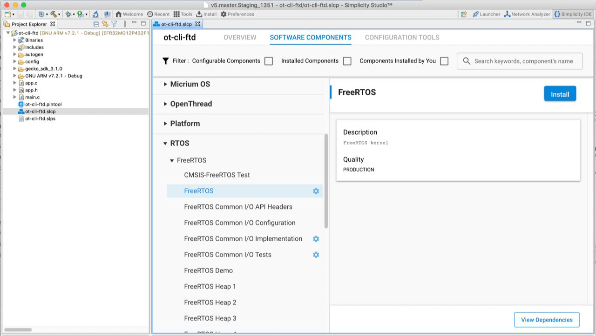

# AN1264: Using Open Thread with FreeRTOS™ (Rev. 0.2) <!-- omit in toc -->

- [1 开始](#1-开始)
- [2 main 函数和任务模型](#2-main-函数和任务模型)

---

Silicon Labs OpenThread SDK 提供了对 FreeRTOS 的支持，FreeRTOS 是一个适用于微控制器和小型微处理器的功能齐全的 RTOS（Real-Time Operating System，实时操作系统）。对 FreeRTOS 的支持已集成到 Simplicity Studio 中。

EFR32MGxx 系列都支持 FreeRTOS。要查看 FreeRTOS 的文档，请访问 [https://www.freertos.org/](https://www.freertos.org/)。

# 1 开始

要将 FreeRTOS 集成到您的应用程序中，只需在 Simplicity Studio 中为项目安装 FreeRTOS 组件即可。ot-ble-dmp 示例应用程序默认在 FreeRTOS 上运行，您可以将 FreeRTOS 添加到任何 OpenThread 项目。ot-cli-ftd 示例应用程序是一个很好的开始示例。

1. 在您的项目中，在 Project Explorer 中双击该项目的 **.slcp** 文件以打开项目窗口。
2. 点击 SOFTWARE COMPONENTS 选项卡以查看组件类别的完整列表。
3. 在组件列表中的 RTOS > FreeRTOS 下找到 FreeRTOS 组件。
4. 选择 **FreeRTOS**，然后点击 **Install**。  此组件会将所有 FreeRTOS 内核文件以及一些集成文件和它所依赖的一些附加组件带入到您的项目中。
5. 点击 **View Dependencies** 以显示该组件。 其中一个依赖项是 CMSIS-RTOS2 组件，它是集成文件使用的 RTOS 抽象层。Silicon Labs 建议应用程序开发者直接使用 FreeRTOS API，而不是使用 CMSIS-RTOS2 API。 另一个依赖项是 FreeRTOS 使用的堆实现。FreeRTOS 有五个不同的堆实现。每个都展示为一个组件。默认情况下，FreeRTOS Heap 4 组件会被添加到项目中。您可以通过选择不同的堆组件并点击 **Install** 来更改此设置。例如，FreeRTOS HEAP 3 使用系统的 `malloc()` 和 `free()` 实现，是一个常见的选择。

# 2 main 函数和任务模型

FreeRTOS 组件旨在与标准的 Silicon Labs main.c 模板一起使用。标准的 main 函数适用于裸机和基于内核的项目，并负责所有必需的系统初始化和任务创建。

对于在 FreeRTOS 上运行的 OpenThread，会创建单个任务，其同时运行 OpenThread 栈和应用程序逻辑。从其他任务中调用 OpenThread API 是不安全的。

在裸机的 OpenThread 应用程序中，应用程序逻辑放置在 `app_process_action()` 回调中。与之不同的是，在 FreeRTOS 上运行时，应用程序逻辑放置在 `sl_ot_rtos_application_tick()` 回调中。
