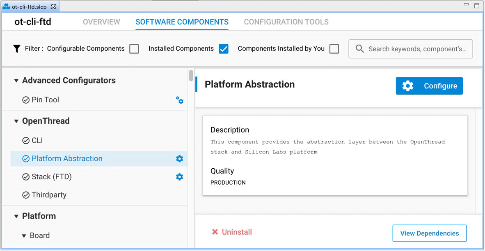
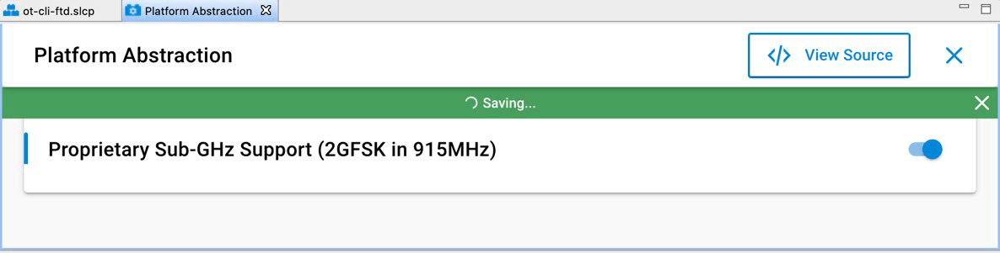
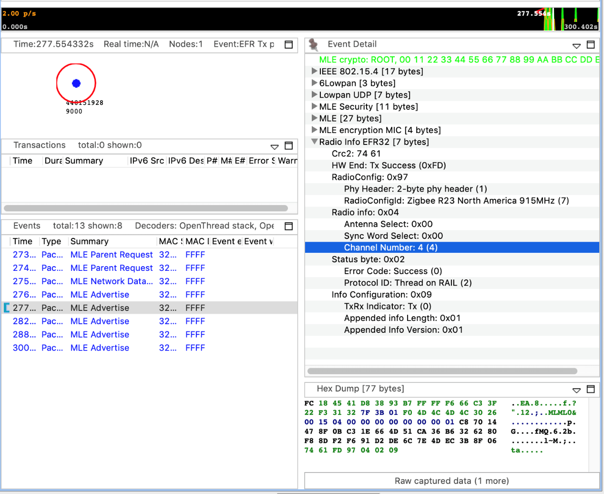

# AN1350: Single-Band Proprietary Sub-GHz Support with OpenThread (Rev. 0.1) <!-- omit in toc -->

- [1 引言](#1-引言)
  - [1.1 Proprietary Sub-GHz Radio PHY](#11-proprietary-sub-ghz-radio-phy)
    - [1.1.1 调制细节](#111-调制细节)
    - [1.1.2 信道和频率规格](#112-信道和频率规格)
    - [1.1.3 PHR 长度](#113-phr-长度)
    - [1.1.4 硬件限制](#114-硬件限制)
- [2 为 Proprietary Sub-GHz 构建 OpenThread 示例应用程序](#2-为-proprietary-sub-ghz-构建-openthread-示例应用程序)
- [3 使用 Proprietary Sub-GHz 网络](#3-使用-proprietary-sub-ghz-网络)
  - [3.1 创建 Proprietary Sub-GHz 网络](#31-创建-proprietary-sub-ghz-网络)
  - [3.2 在 OpenThread Border Router 上启用 Proprietary Sub-GHz 支持](#32-在-openthread-border-router-上启用-proprietary-sub-ghz-支持)
  - [3.3 验证 Sub-GHz 操作](#33-验证-sub-ghz-操作)

---

本文档介绍如何使用 Silicon Labs OpenThread SDK 和 Simplicity Studio® 5 以及 WSTK（Wireless Starter Kit）配置 OpenThread 应用程序以在 proprietary sub-GHz 频段上运行。还提供了有关支持此特性的 proprietary Radio PHY 的详细信息。

# 1 引言

Sub-GHz radio 与 2.4 GHz radio 相似，可以提供相对简单的无线解决方案。与 2.4 GHz 相比，sub-GHz 具有一些优势，但具体取决于目标应用。

使用 sub-GHz radio 的一些显着优势是：

* 更远的距离
* 在拥挤的环境中更少的信号衰落
* 更低的干扰
* 更低的功耗

本应用笔记提供了在 sub-GHz 频段上创建、构建和运行 OpenThread 应用程序的分步指南。

由于 Thread 是一个 2.4 GHz 协议，并且该规范目前不支持 sub-GHz 特性，因此使用如下以添加 sub-GHz 支持：

* 随 SDK 提供的 Proprietary radio PHY 以及，
* OpenThread 栈支持的 Proprietary radio 配置。

**注意**：此特性目前仅支持 single-band 操作，因此要求网状网中的所有节点都在同一个 sub-GHz 频段上运行。

## 1.1 Proprietary Sub-GHz Radio PHY

为了在特定频段上运行无线应用程序，应用程序通常需要 radio 实现来提供必要的 PHY 支持。对于 Silicon Labs 平台上支持的 OpenThread 应用程序，平台抽象层默认支持 2.4 GHz 频段。对于 sub-GHz 特性，已添加了 proprietary radio PHY 支持。

本节介绍用于支持此特性的 proprietary radio PHY 规格。PHY 规格符合 NA FCC Part 15.247 规定。

### 1.1.1 调制细节

OpenThread SDK 当前支持的 proprietary radio PHY 使用以下调制规格。

<table style="margin-left: auto; margin-right: auto;">
<caption style="white-space: nowrap;">Table 1.1. Proprietary Sub-GHz Modulation Specification</caption>
<thead>
    <tr>
        <th>Parameter</th>
        <th>Configuration</th>
    </tr>
</thead>
<tbody>
    <tr>
        <td>Modulation</td>
        <td>2-Level GFSK</td>
    </tr>
    <tr>
        <td>Data Rate</td>
        <td>500 kbps</td>
    </tr>
    <tr>
        <td>Tx Filter BT</td>
        <td>0.5 (Gaussian)</td>
    </tr>
    <tr>
        <td>Modulation Index</td>
        <td>0.76</td>
    </tr>
</tbody>
</table>

### 1.1.2 信道和频率规格

同样，proprietary radio PHY 的信道和频率规格以及所支持信道的中心频率已记录在下表中。

<table style="margin-left: auto; margin-right: auto;">
<caption style="white-space: nowrap;">Table 1.2. Proprietary Sub-GHz PHY Band Parameters</caption>
<thead>
    <tr>
        <th>Band Parameters</th>
        <th>Value</th>
    </tr>
</thead>
<tbody>
    <tr>
        <td>Channel Page</td>
        <td>23</td>
    </tr>
    <tr>
        <td>Frequency Band (MHz)</td>
        <td>902- 928</td>
    </tr>
    <tr>
        <td>Channel Spacing (MHz)</td>
        <td>1.0</td>
    </tr>
    <tr>
        <td>Total Channels</td>
        <td>25</td>
    </tr>
    <tr>
        <td>Channel Numbers</td>
        <td>0 – 24</td>
    </tr>
    <tr>
        <td>1st Channel Center Freq. (MHz)</td>
        <td>903.0</td>
    </tr>
</tbody>
</table>

<table style="margin-left: auto; margin-right: auto;">
<caption style="white-space: nowrap;">Table 1.3. Channels and Center Frequencies for 902-928 MHz Band</caption>
<thead>
    <tr>
        <th style="text-align: center;">Chan. #</th>
        <th style="text-align: center;">Fc (MHz)</th>
    </tr>
</thead>
<tbody>
    <tr>
        <td style="text-align: center;">0</td>
        <td style="text-align: center;">903.0</td>
    </tr>
    <tr>
        <td style="text-align: center;">1</td>
        <td style="text-align: center;">904.0</td>
    </tr>
    <tr>
        <td style="text-align: center;">...</td>
        <td style="text-align: center;">...</td>
    </tr>
    <tr>
        <td style="text-align: center;">23</td>
        <td style="text-align: center;">926.0</td>
    </tr>
    <tr>
        <td style="text-align: center;">24</td>
        <td style="text-align: center;">927.0</td>
    </tr>
</tbody>
</table>

### 1.1.3 PHR 长度

proprietary radio PHY 支持 2 字节 PHR。对于支持的 127 字节 PSDU，第 2 字节的最后 7 位表示帧长度。

### 1.1.4 硬件限制

支持 915 MHz 频段且仅使用 EFR32MG12 或 EFR32MG13 部件的无线板目前支持 proprietary sub-GHz 特性。可用于测试此特性的无线板有 BRD4164a、BRD4170a 和 BRD4158a。

# 2 为 Proprietary Sub-GHz 构建 OpenThread 示例应用程序

要为 sub-GHz 构建 OpenThread 示例应用程序，您需要 Simplicity Studio 5（SSv5）和 Gecko SDK 3.2（或更高版本）开发环境以及 OpenThread SDK。

本文档假定您已安装了 SSv5 和 OpenThread SDK，并且熟悉 SSv5 以及如何配置、构建和刷写应用程序。如果没有，那么您应该先参阅 *QSG170: Silicon Labs OpenThread Quick-Start Guide*。

1. 连接您的目标开发硬件（支持 proprietary sub-GHz，如 [1.1.4 硬件限制](#114-硬件限制) 所述），打开 SSv5 的文件菜单并选择 New > Silicon Labs Project Wizard。这将打开 Target, SDK, and Toolchain Selection 对话框。其中应该填充好了您的目标硬件。点击 **NEXT**。
2. Example Project Selection 对话框将打开。使用 Technology Type 和 Keyword 过滤器搜索特定示例，例如 **ot-cli-ftd**。选择它并点击 **NEXT**。<br>请注意，如果您没有看到该应用程序，则您所连接的硬件可能是不兼容的。要进行验证，请在 Launcher Perspectives My Products 视图中输入 EFR32MGxx 并选择其中一个板。转到 Examples 选项卡，按 Thread technology 进行过滤并验证您是否可以看到该应用程序。
3. Project Configuration 对话框将打开。在这里，您可以重命名您的项目，更改默认项目文件位置，并确定您是否将链接到或复制项目文件。请注意，如果您更改了任何的链接资源，那么引用它的任何其他项目都会受到影响。除非您要修改 SDK 资源，否则请使用默认选择。点击 **FINISH**。Simplicity IDE 打开时会在 Project Configurator 中打开 **ot-cli-ftd** 项目。
4. 要配置 proprietary sub-GHz 支持，请在 SOFTWARE COMPONENTS 选项卡上，选择 Installed Components 并选择 OpenThread 下的 **Platform Abstraction** 组件。请注意，您还可以在搜索字段中按名称搜索组件。<br>
5. 点击 **Configure** 并启用 **Proprietary Sub-GHz Support** 配置选项。<br><br>注意：如果您没有看到与 Platform Abstraction 组件关联的 **Configure** 控件或“Proprietary Sub-GHz Support”配置选项，则您的硬件可能与上述 proprietary radio 规格不兼容。
6. 构建项目。现在您可以使用 SSv5 工具（例如 flash programmer 或 Simplicity Commander）将生成的 ot-cli-ftd.s37 映像上传到您的板上。

# 3 使用 Proprietary Sub-GHz 网络

支持 sub-GHz ISM 频段的 Silicon Labs 无线板设计在 US FCC 902-928 MHz 频段上运行（使用一条外部的鞭状天线）。因此，使用此特性时，请使用无线板上的 SMA 天线连接器连接外部鞭状天线。有关此要求的更多信息，请参阅您的无线板的参考手册。

## 3.1 创建 Proprietary Sub-GHz 网络

如 [1 引言](#1-引言) 中所述，proprietary sub-GHz 特性目前仅支持单频段使用，因此要求网状网中的每个节点都运行启用了 sub-GHz 特性的应用程序。相应地，要创建 sub-GHz 网络：

1. 构建 **ot-cli-ftd** 示例并启用 proprietary sub-GHz 特性，如 [2 为 Proprietary Sub-GHz 构建 OpenThread 示例应用程序](#2-为-proprietary-sub-ghz-构建-openthread-示例应用程序) 所述，并将此应用程序刷写到您的所有节点上。
2. 使用标准的 OpenThread CLI 命令来建立和连接到网络。*QSG170: Silicon Labs OpenThread Quick Start Guide* 的第 3.5 节提供了此步骤的示例。
3. 由此建立的网络具有在 sub-GHz 频段上运行的节点（支持的信道在 0 - 24 之间，覆盖 902 - 928 MHz）

## 3.2 在 OpenThread Border Router 上启用 Proprietary Sub-GHz 支持

本节假定您熟悉 OpenThread Border Router 的基本构建和安装说明。如果不是，请参阅 *AN1256: Using the Silicon Labs RCP with the OpenThread Border Router*。

为了在 OpenThread Border Router 上启用 proprietary sub-GHz 支持：

1. 使用 Simplicity Studio 5 并启用 sub-GHz 特性构建 RCP 映像。从 **ot-rcp** 示例开始，按照 [2 为 Proprietary Sub-GHz 构建 OpenThread 示例应用程序](#2-为-proprietary-sub-ghz-构建-openthread-示例应用程序) 中描述的步骤进行操作。
2. 对于 Border Router Host 你可以：
    1. 使用预构建的 docker 映像（推荐）<br>[https://hub.docker.com/r/siliconlabsinc/openthread-border-router-proprietary-na-915/tags](https://hub.docker.com/r/siliconlabsinc/openthread-border-router-proprietary-na-915/tags)
    2. 或者，使用以下 OpenThread proprietary radio 配置集为您的 host 手动构建 Border Router 映像。此选项需要您修改 OTBR 的构建脚本（其细节超出了本文档的范围）

| Configuration                                             | Value     |
| :-------------------------------------------------------- | :-------- |
| OPENTHREAD_CONFIG_PLATFORM_RADIO_PROPRIETARY_SUPPORT      | 1         |
| OPENTHREAD_CONFIG_RADIO_2P4GHZ_OQPSK_SUPPORT              | 0         |
| OPENTHREAD_CONFIG_RADIO_915MHZ_OQPSK_SUPPORT              | 0         |
| OPENTHREAD_CONFIG_PLATFORM_RADIO_PROPRIETARY_CHANNEL_PAGE | 23        |
| OPENTHREAD_CONFIG_PLATFORM_RADIO_PROPRIETARY_CHANNEL_MIN  | 0         |
| OPENTHREAD_CONFIG_PLATFORM_RADIO_PROPRIETARY_CHANNEL_MAX  | 24        |
| OPENTHREAD_CONFIG_PLATFORM_RADIO_PROPRIETARY_CHANNEL_MASK | 0x1ffffff |
| OPENTHREAD_CONFIG_DEFAULT_CHANNEL                         | 0         |

## 3.3 验证 Sub-GHz 操作

为了验证您的应用程序是否已正确配置为在 sub-GHz 频段上运行，

1. 在您的节点上执行以下 CLI 命令，以检索支持的信道掩码：
    ```Text
    > channel supported
    0x1ffffff
    Done
    ```
    对于 proprietary sub-GHz 应用，此命令的结果是 `0x1ffffff`，表示此配置支持信道 0-24。对于 2.4 GHz 应用，返回的输出为 `0x7fff800`，表示该频段支持的信道 11-26。
2. 或者，对于运行 sub-GHz 应用程序且属于 OpenThread 网络一部分的节点，您还可以使用 Silicon Labs Network Analyzer 验证 radio 信息。<br>

有关如何使用 Silicon Labs Network Analyzer 采集 OpenThread 数据包的更多详细信息，请参阅 *QSG170: Silicon Labs OpenThread Quick Start Guide* 的第 5.4 节。
