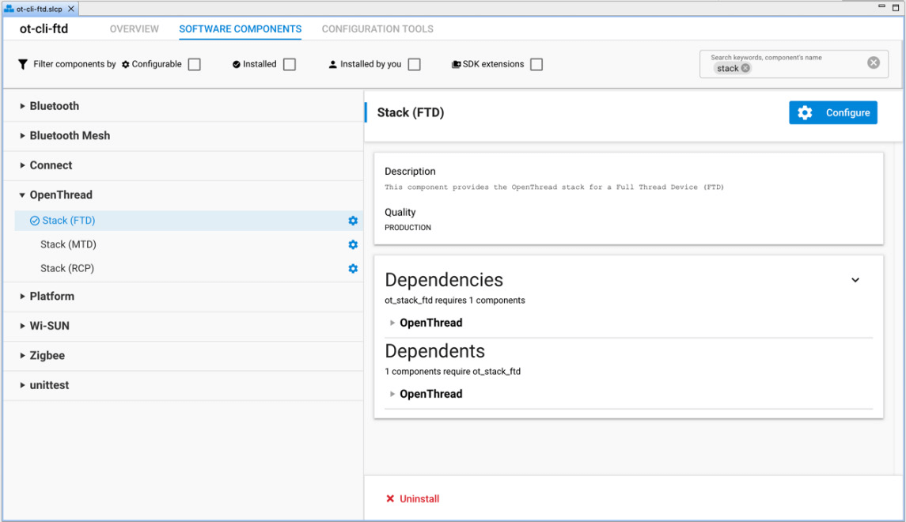
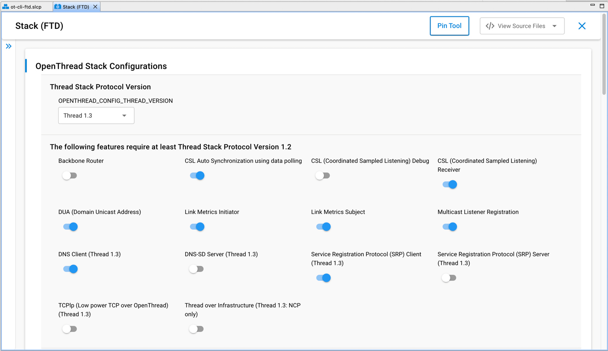

# AN1372: Configuring OpenThread Applications for Thread 1.3 (Rev. 0.4) <!-- omit in toc -->

- [1 在 SoC 应用程序中包含 Thread 1.3 特性](#1-在-soc-应用程序中包含-thread-13-特性)
- [2 在 OpenThread Border Router 中包含 Thread 1.3 特性](#2-在-openthread-border-router-中包含-thread-13-特性)

---

Thread 1.3 建立在 Thread 1.1 和 Thread 1.2 的健壮基础之上。它定义了 Thread Border Router 定义的增强和补充，以启用双向 IPv6 连接、使用 DNS 的服务发现以及使用 NAT 提供 IPv4-backwards 支持。它包括对 Thread-over-infrastructure (non-802.15.4 IPv6) 链路的支持。最后，为了解决吞吐量问题，规范将 TCP 支持定义为一个标准组件和协议。

**注意**：Silicon Labs 包含了 OpenThread 栈的当前默认协议版本 1.3（=4）。

Silicon Labs 提供了组件和配置选项，使您能够使用示例应用程序配置 Thread 1.3 特性。这些特性与 EFR32MG1x 和 EFR32MG2x 的 SoC、RCP 和 Module 兼容。本应用笔记假设您对如何在 EFR32 设备上实现 Thread 有基本的了解。如需更多信息，请参阅 *UG103.11: Thread Fundamentals*。

# 1 在 SoC 应用程序中包含 Thread 1.3 特性

Silicon Labs 提供了许多示例的 SoC OpenThread 应用程序。您可以修改这些以包含 Thread 1.3 特性（其中一些特性默认启用）。本章假定您已熟悉在 Simplicity Studio 5 中创建和修改 OpenThread 项目。如果您需要更多信息，请参阅 [Simplicity Studio 5 User's Guide](https://docs.silabs.com/simplicity-studio-5-users-guide/latest/ss-5-users-guide-overview/) 和 *QSG170: Silicon Labs OpenThread Quick Start Guide*。

例如，以下过程展示了如何配置 1.3 特性：

1. 基于示例 **OpenThread – SoC CLI (FTD)** 创建一个项目。
2. 在 **SOFTWARE COMPONENTS** 选项卡上，搜索并选中 **Stack (FTD)** 条目。根据您的应用程序，您可能必须在 **Stack (MTD)** 或 **Stack (RCP)** 组件上执行此操作（此示例适用于 FTD 应用程序）。 
3. 配置各种编译时设置。这些选项在 [https://github.com/openthread/openthread/blob/main/examples/README.md](https://github.com/openthread/openthread/blob/main/examples/README.md) 上的 OpenThread 文档中进行了解释。  **对于 Thread 1.3 特性**，以下标志是必要的。每个标志的描述指示其是强制的、可选的还是推荐的。对于 Thread 1.1 应用程序，**不要启用** 这些标志。
    * **Thread Stack Protocol Version**（强制）：设置为 Thread 1.3。
    * **DNS Client**（强制）：Thread 1.3 合规性所必需的。
    * **DNS-SD Server**（推荐）：仅 FTD。Thread Border Router 上的 Thread 1.3 合规性所必需的。否则为可选的。
    * **SRP Client**（强制）：Thread 1.3 合规性所必需的。
    * **SRP Server**（推荐）：仅 FTD。Thread Border Router 上的 Thread 1.3 合规性所必需的。否则为可选的。
    * **TCPlp (TCP low-power)**（可选）：不是 Thread 1.3 合规性所必需的；但是，作为 Thread 1.3 中定义的特性，可以启用它来测试低功耗 TCP 特性。
    * **Thread over Infrastructure**（推荐）：仅 NCP。Thread Border Router 上的 Thread 1.3 合规性所必需的（border router POSIX 栈默认启用）。对于 EFR 平台上的示例应用程序，这仅适用于 NCP，因此是一项未经测试的实验性特性，因为 Silicon Labs 不直接支持 NCP 应用程序。

下表中包含有关这些特性的其他信息。

<table style="margin-left: auto; margin-right: auto;" id="Table_1-1">
  <caption style="white-space: nowrap;">Table 1-1. Thread 1.3 Configuration Flags</caption>
  <thead>
    <tr>
      <th>Flag</th>
      <th>Note</th>
    </tr>
  </thead>
  <tbody>
    <tr>
      <td>DNS Client (OPENTHREAD_CONFIG_DNS_CLIENT_ENABLE)</td>
      <td>Enables support for DNS client. Enables sending DNS queries for AAAA (IPv6) records.</td>
    </tr>
    <tr>
      <td>DNS-SD Server (OPENTHREAD_CONFIG_DNSSD_SERVER_ENABLE)</td>
      <td>
Enables support for DNS-SD server. Service information from a local SRP server is used to resolve DNS-SD queries.

A DNS server should implement the following features:
<ul><li>
DNS recursive resolver to answer queries for all valid DNS record types, including host name records, for example. DNS type "A" and "AAAA" address records.
</li><li>
DNS authoritative server that answers authoritatively for DNSBased Service Discovery [RFC 6763] records and any other DNS records registered with the Thread Service Registry by clients using the Service Registration Protocol.
</li><li>
DNS Update Server: A server that accepts properly authenticated client requests to update authoritative DNS data.</li>
</ul></td>
    </tr>
    <tr>
      <td>SRP Client (OPENTHREAD_CONFIG_SRP_CLIENT_ENABLE)</td>
      <td>
Enables support for SRP (Service Registration Protocol) client.

An SRP client Thread Device registers services with the SRP server, communicates with the corresponding DNS-SD authoritative server for queries, and uses the DNS recursive resolver for DNS resolution as defined by the respective IETF specifications.

For more information, see: <a href="https://github.com/openthread/openthread/blob/main/src/cli/README_SRP_CLIENT.md">https://github.com/openthread/openthread/blob/main/src/cli/README_SRP_CLIENT.md</a>
</td>
    </tr>
    <tr>
      <td>SRP Server (OPENTHREAD_CONFIG_SRP_SERVER_ENABLE)</td>
      <td>
Enables support for SRP (Service Registration Protocol) server.

An SRP server supports the DNS Update Server functions, plus additional public key cryptography for security and some other minor enhancements to better support constrained clients.

For more information, see: <a href="https://github.com/openthread/openthread/blob/main/src/cli/README_SRP.md">https://github.com/openthread/openthread/blob/main/src/cli/README_SRP.md</a>
</td>
    </tr>
    <tr>
      <td>TCPlp (TCP Low Power) (OPENTHREAD_CONFIG_TCP_SERVER_ENABLE)</td>
      <td>
Enables the low-power TCP feature, as defined in the Thread 1.3 specification. This depends on the third-party tcplp library included in the openthread stack.

For more information, see: <a href="https://github.com/openthread/openthread/blob/main/src/cli/README_TCP.md">https://github.com/openthread/openthread/blob/main/src/cli/README_TCP.md</a>
</td>
    </tr>
    <tr>
      <td>Thread over Infrastructure (OPENTHREAD_CONFIG_RADIO_LINK_TREL_ENABLE)</td>
      <td>
Enables TREL radio link for Thread over Infrastructure feature.

For sample applications, this is applicable to NCPs only, which are currently not supported by Silicon Labs. See the next section for information on how this applies to border router POSIX platforms.
</td>
    </tr>
  </tbody>
</table>

# 2 在 OpenThread Border Router 中包含 Thread 1.3 特性

Silicon Labs 提供了几个示例的 OpenThread RCP 应用程序。默认情况下，如果 host（Border Router，是 Silicon Labs 支持的 RCP 模型）上存在受支持的 Silicon Labs 硬件上的 RCP 应用程序，那么它们会自动支持 Thread 1.3 特性。Thread 1.3 的所有特性都不是 RCP 特定的，因此为 RCP 示例应用程序打开或关闭它们没有任何效果。

有关如何为 Raspberry Pi 3B+ 或更高版本构建 OpenThread Border Router 的详细说明，请参阅 *AN1256: Using the Silicon Labs RCP with the OpenThread Border Router*。您必须将 Thread 1.3 RCP 与 Border Router（协议栈版本也是 1.3）一起使用。

通过确保 POSIX 栈启用以下 CMake 标志，可以在 Border Router 上单独启用 Thread 1.3 特性。这些标志在当前默认的 OpenThread Border Router 产品中默认启用。（有关其用途的更多信息，请参阅 [Table 1-1. Thread 1.3 Configuration Flags](#Table_1-1)）。

<table style="margin-left: auto; margin-right: auto;">
<caption style="white-space: nowrap;">Table 2-1. Border Router CMake Mappings</caption>
<thead>
  <tr>
    <th>CMake Flag</th>
    <th>Thread 1.3 Configuration Flag</th>
  </tr>
</thead>
<tbody>
  <tr>
    <td>OT_DNS_CLIENT</td>
    <td>OPENTHREAD_CONFIG_DNS_CLIENT_ENABLE</td>
  </tr>
  <tr>
    <td>OT_DNSSD_SERVER</td>
    <td>OPENTHREAD_CONFIG_DNSSD_SERVER_ENABLE</td>
  </tr>
  <tr>
    <td>OT_SRP_CLIENT</td>
    <td>OPENTHREAD_CONFIG_SRP_CLIENT_ENABLE</td>
  </tr>
  <tr>
    <td>OT_SRP_SERVER</td>
    <td>OPENTHREAD_CONFIG_SRP_SERVER_ENABLE</td>
  </tr>
  <tr>
    <td>OT_TREL</td>
    <td>OPENTHREAD_CONFIG_RADIO_LINK_TREL_ENABLE
Make sure that the OPENTHREAD_CONFIG_POSIX_APP_TREL_INTERFACE_NAME property is also set to the IPv6 link on which you wish to enable TREL (via the trel://argument).

On a network with at least two border routers, if TREL is enabled on both border routers on the same shared infrastructure link, then they can automatically use that link to provide a single Thread partition.
</td>
  </tr>
</tbody>
</table>

您可以安装带有 OpenThread Border Router 的预构建的 Docker 容器：[https://hub.docker.com/r/siliconlabsinc/openthread-border-router/tags](https://hub.docker.com/r/siliconlabsinc/openthread-border-router/tags)

或者，您可以按照 *AN1256: Using the Silicon Labs RCP with the OpenThread Border Router* 或 [https://openthread.io/guides/border-router/build](https://openthread.io/guides/border-router/build) 中的步骤手动安装 OpenThread Border Router。
