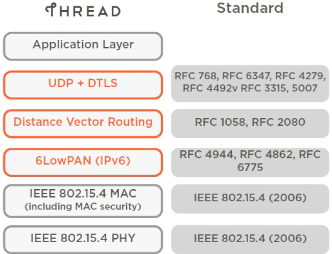

> You are viewing documentation for version: [2.3.1](https://docs.silabs.com/openthread/2.3.1/openthread-start/) | [Version History](https://docs.silabs.com/openthread/2.3.1/version-history)

---

- **[Developing with OpenThread](developing-with-openthread.md)**
- [Getting Started](getting-started.md)
- [Fundamentals](fundamentals.md)
- [OpenThread Developer's Guide](openthread-developer's-guide.md)
- [API Reference Guide](https://docs.silabs.com/openthread/2.3.1/openthread-api/)

---

# Developing Silicon Labs OpenThread Applications <!-- omit from toc -->

Google 发布的 OpenThread 是：

- **Thread® 网络协议的一个开源实现**。Google Nest 发布了 OpenThread，使得 Nest 产品中使用的技术可以被广大的开发者所用，以加速智能家居产品的开发。
- **与操作系统和平台无关**，其具有一个精简的平台抽象层和较小的内存占用，因此具有高度的可移植性。它支持片上系统（SoC）及协处理器设计。
- **一个 Thread Certified Component**，实现了 Thread 1.3.0 规范中定义的所有特性，包括所有 Thread 网络层（IPv6、6LoWPAN、IEEE 802.15.4 with MAC security、Mesh Link Establishment、Mesh Routing）和设备角色，以及对 Border Router 的支持。

Silicon Labs 已经实现了一个专门用于与 Silicon Labs 硬件配合使用的基于 OpenThread 的协议。该协议可以在 GitHub 上找到，并且还作为一个与 Simplicity Studio 5 一起安装的软件开发工具包（SDK）提供。该 SDK 是 GitHub 源码的一个全面测试快照。与 GitHub 版本相比，它支持更广泛的硬件，并包含 GitHub 上无法获得的文档和示例应用程序。这些页面的内容旨在供那些希望尝试或已经在使用 Silicon Labs OpenThread SDK 开发 OpenThread 应用程序的人员使用。

**有关此版本的详细信息**：[silabs.com Gecko SDK 页面](https://www.silabs.com/developers/gecko-software-development-kit) 上提供了发行说明的链接。

**有关 Silicon Labs 的 OpenThread 产品信息**：请参阅 [silabs.com 上的产品页面](https://www.silabs.com/wireless/thread)。

**有关 OpenThread 协议和其他无线网络主题的背景信息**：[Fundamentals 部分](fundamentals.md)是一个很好的起点。此部分还包含开源的 OpenThread 协议的信息和资源。

**要开始开发**：请参阅 [Getting Started 部分](getting-started.md) 以开始使用示例应用程序。

**如果您已经正在进行开发**：请参阅 [Developer's Guide](openthread-developer's-guide.md) 以了解详细信息或直接转到 [API Reference](https://docs.silabs.com/openthread/2.3.1/openthread-api/)。
