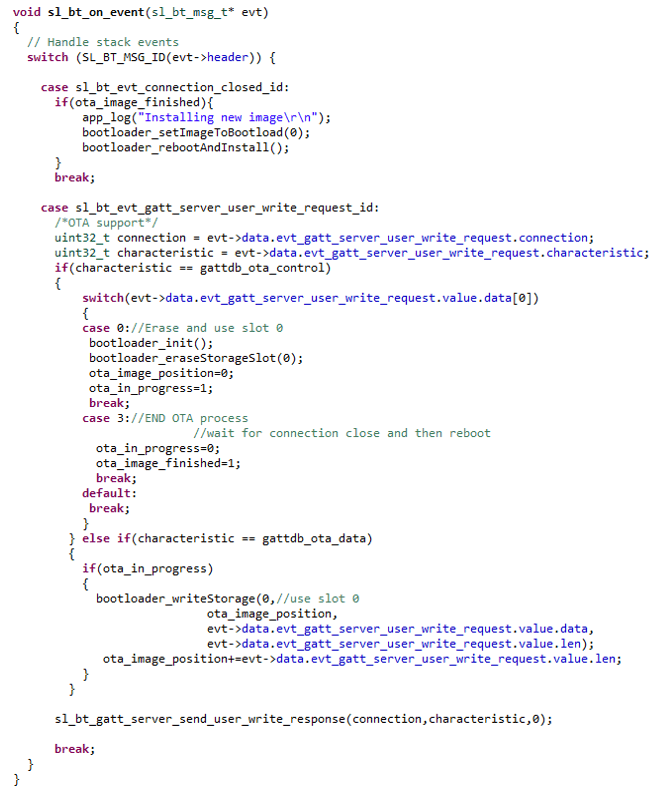

# AN1086: Using the Gecko Bootloader with the Silicon Labs Bluetooth® Applications (Rev. 1.3) <!-- omit in toc -->

- [1. 概述](#1-概述)
- [2. BGAPI UART Device Firmware Upgrade (DFU)](#2-bgapi-uart-device-firmware-upgrade-dfu)
  - [2.1 UART DFU 选项](#21-uart-dfu-选项)
  - [2.2 UART DFU 过程](#22-uart-dfu-过程)
  - [2.3 为 Bluetooth NCP Application 创建升级映像](#23-为-bluetooth-ncp-application-创建升级映像)
  - [2.4 UART DFU Host 示例](#24-uart-dfu-host-示例)
- [3. Bluetooth OTA 升级](#3-bluetooth-ota-升级)
  - [3.1 AppLoader](#31-apploader)
  - [3.2 Gecko Bootloader 配置](#32-gecko-bootloader-配置)
  - [3.3 In-Place OTA 过程](#33-in-place-ota-过程)
    - [3.3.1 从 PS Store 固件升级到 NVM3](#331-从-ps-store-固件升级到-nvm3)
  - [3.4 Silicon Labs OTA GATT service](#34-silicon-labs-ota-gatt-service)
  - [3.5 OTA GATT Database and Generic Attribute Service](#35-ota-gatt-database-and-generic-attribute-service)
  - [3.6 从 User Application 中触发重启到 DFU Mode](#36-从-user-application-中触发重启到-dfu-mode)
  - [3.7 OTA-Related Configurations in the v3.x Bluetooth Stack](#37-ota-related-configurations-in-the-v3x-bluetooth-stack)
    - [3.7.1 在 v3.x 中设置 OTA 标志](#371-在-v3x-中设置-ota-标志)
    - [3.7.2 在 v3.x 中设置 OTA 设备名称](#372-在-v3x-中设置-ota-设备名称)
    - [3.7.3 在 v3.x 中设置 OTA 广告数据](#373-在-v3x-中设置-ota-广告数据)
  - [3.8 OTA-Related Configurations in the v2.x Bluetooth Stack](#38-ota-related-configurations-in-the-v2x-bluetooth-stack)
    - [3.8.1 在 v2.x 中设置 OTA 标志和 OTA 设备名称](#381-在-v2x-中设置-ota-标志和-ota-设备名称)
    - [3.8.2 在 v2.x 中设置 OTA 广告数据](#382-在-v2x-中设置-ota-广告数据)
  - [3.9 Application Properties in OTA Mode](#39-application-properties-in-ota-mode)
  - [3.10 创建 OTA 升级映像](#310-创建-ota-升级映像)
  - [3.11 OTA DFU Host 示例](#311-ota-dfu-host-示例)
    - [3.11.1 准备用于 NCP Mode 的 Development Kit](#3111-准备用于-ncp-mode-的-development-kit)
    - [3.11.2 构建 OTA Host 示例应用](#3112-构建-ota-host-示例应用)
    - [3.11.3 使用 NCP Host 示例运行 OTA](#3113-使用-ncp-host-示例运行-ota)
    - [3.11.4 OTA Host 示例内部操作](#3114-ota-host-示例内部操作)
  - [3.12 OTA 错误码](#312-ota-错误码)
- [4. 在 User Application 中实现设备固件更新](#4-在-user-application-中实现设备固件更新)
  - [4.1 从 User Application 中更新固件的基本步骤](#41-从-user-application-中更新固件的基本步骤)
  - [4.2 启用 Gecko Bootloader API](#42-启用-gecko-bootloader-api)
  - [4.3 Application 控制下的 Bluetooth OTA 更新的示例实现](#43-application-控制下的-bluetooth-ota-更新的示例实现)
- [5. 附录：Application 控制下的 Bluetooth OTA 更新](#5-附录application-控制下的-bluetooth-ota-更新)

本应用笔记包含有关将 Silicon Labs Gecko Bootloader 与 Silicon Labs Bluetooth application 一起使用的详细信息。它补充了 [UG266: Silicon Labs Gecko Bootloader User’s Guide](http://www.silabs.com/documents/public/user-guides/ug266-gecko-bootloader-user-guide.pdf) 中提供的一般 Gecko Bootloader 实现信息。如果您不熟悉执行固件升级的基本原理，或者需要有关升级映像文件的更多信息，请参考 [UG103.6: Bootloader Fundamentals](http://www.silabs.com/documents/public/user-guides/UG103-06-AppDevFundamentals-Bootloading.pdf)。

在 Gecko SDK Suite v3.0 中，Bluetooth API 结构已完全更新。除了其他更改外，所有函数调用均已重命名。本文档涵盖了 v2.x 和 v3.x 变体。

# 1. 概述

Silicon Labs Gecko Bootloader 是适用于 Silicon Labs 的所有 newer MCU 和 wireless MCU 的通用 bootloader。可以将 Gecko Bootloader 配置为执行各种 bootload 功能（从设备初始化到固件升级）。Gecko Bootloader 使用一种专有格式的升级映像，称为 GBL（Gecko Bootloader）。这些映像的文件扩展名为 “.gbl”。*UG103.6: Bootloader Fundamentals* 中提供了有关 GBL 文件格式的其他信息。

Gecko Bootloader 采用一个 two-stage 设计，其中最小的 first stage bootloader 用于升级 main bootloader。First stage bootloader 仅包含读写 internal flash 中固定地址的功能。要执行 main bootloader 升级，正在运行的 main bootloader 会验证 bootloader 升级映像文件的完整性和真实性。然后，正在运行的 main bootloader 会将升级映像写到 flash 中的固定位置，并重启到 first stage bootloader。First stage bootloader 在将升级映像复制到 main bootloader 位置之前会计算 CRC32 校验和来验证 main bootloader 固件升级映像的完整性。

可以将 Gecko Bootloader 配置为以 standalone mode（standalone bootloader）或 application mode（application bootloader）执行固件升级，具体取决于 plugin 配置。可以通过 Simplicity Studio IDE 启用和配置 plugin。

本文档介绍了如何配置和使用 Gecko Bootloader 进行 BGAPI UART 设备固件升级和 Bluetooth OTA（over-the-air）升级。

与 legacy Bluetooth bootloader 不同，Gecko Bootloader 未捆绑到 application 下载映像中。因此，您必须从 application 映像中单独地编译和加载 bootloader。

# 2. BGAPI UART Device Firmware Upgrade (DFU)

这是 NCP-mode Bluetooth application 中使用的固件升级。通过使用 UART（作为物理接口）和 BGAPI 协议，将包含新固件的 GBL 映像写到目标设备。BGAPI UART DFU bootloader 是一个 standalone bootloader，因此不需要配置任何存储区域。在 UART DFU 升级期间，bootloader 将新的固件映像直接写到旧的固件映像上，因此不需要临时的下载区域。

## 2.1 UART DFU 选项

必须使用配置为 **BGAPI UART DFU Bootloader** 的 Gecko Bootloader 对目标设备进行编程。默认配置如下：

UART Options：

* Selected USART: USART0
* Baudrate 115200
* TX pin: PA0
* RX pin: PA1
* HW flow control: disabled
* UART enable port: PA5 (VCOM_ENABLE on WSTK)

GPIO Activation：

* GPIO activation is enabled and mapped to button PB0 (active low)

默认设置适用于使用 WSTK（Wireless Starter Kit）进行测试。通过编辑 Plugin 的参数，可以轻松地更改这些设置。这可以通过在 AppBuilder 项目的 Plugins 选项卡中选中 UART driver plugin 来完成。在此 plugin 中，可以启用或禁用硬件流控制、配置波特率和引脚分配。

GPIO activation plugin 默认情况下处于启用状态，其允许通过复位来激活 GPIO 以进入到 bootloader。如果不需要此 plugin，则可以禁用它；您也可以在此 plugin 下配置用于此功能的 GPIO 引脚。

## 2.2 UART DFU 过程

UART DFU 涉及的基本步骤如下：

1. 将目标设备引导到 DFU mode（通过发送 `dfu_reset(1)`）。
2. 等待 `DFU boot` 事件。
3. 发送命令 `DFU Flash Set Address` 以开始固件升级。
4. 发送 GBL 升级映像的全部内容（使用命令 `DFU flash upload`）。
5. 发送完所有数据后，host 将发送命令 `DFU flash upload finish`。
6. 要完成升级，host 将目标设备重置为 normal mode（通过发送 `dfu_reset(0)`）。

DFU-related BGAPI 命令的详细说明，请参考 *Bluetooth Software API Reference Manual*。

在升级开始时，NCP host 使用命令 `Flash Set Address` 来定义起始地址。起始地址应始终设置为零。在数据上传期间（上述的步骤 4），目标设备会自动计算 flash 偏移。

Host 不需要显式设置任何写偏移。

## 2.3 为 Bluetooth NCP Application 创建升级映像

在 Simplicity Studio 中构建 C-based NCP 项目不会自动生成 UART DFU 升级映像（GBL 文件）。需要通过运行位于项目根目录中的脚本来单独地创建 GBL 文件。SDK 示例中提供了两个脚本：

* `create_bl_files.bat`（Windows）
* `create_bl_files.sh`（Linux/Mac）

可以通过从项目目录中调用脚本来生成 GBL 文件。

如果您使用的是 Gecko SDK Suite v3.x，则需要在运行脚本之前定义两个环境变量 `PATH_SCMD` 和 `PATH_GCCARM`，如下表所示。

<table>
<thead>
  <tr>
    <th style="white-space: nowrap">Variable Name</th>
    <th style="white-space: nowrap">Variable Value</th>
  </tr>
</thead>
<tbody>
  <tr>
    <td style="white-space: nowrap"><code>PATH_SCMD</code></td>
    <td style="white-space: nowrap"><code>C:\SiliconLabs\SimplicityStudio\v5\developer\adapter_packs\commander</code></td>
  </tr>
  <tr>
    <td style="white-space: nowrap"><code>PATH_GCCARM</code></td>
    <td style="white-space: nowrap"><code>C:\SiliconLabs\SimplicityStudio\v5\developer\toolchains\gnu_arm\7.2_2017q4</code></td>
  </tr>
</tbody>
</table>

运行 `create_bl_files` 脚本会在名为 `output_gbl` 的子文件夹中创建多个 GBL 文件。名为 `full.gbl` 的文件是用于 UART DFU 的升级映像。其他文件与 OTA 升级有关，可以忽略。

如果签名密钥和/或加密密钥（名为 `app-sign-key.pem`、`app-encrypt-key.txt`）位于同一目录中，则该脚本还会创建 GBL 文件的安全变体。

> 注意：根据 SDK 版本，脚本可能还会生成 EBL 文件。EBL 是 Bluetooth SDK versions 2.1.1 及更早版本中使用的文件格式。生成的 EBL 文件存储在子文件夹 `output_ebl` 中。使用 Gecko Bootloader 时可以忽略这些文件。

## 2.4 UART DFU Host 示例

UART DFU host 示例是一个 C 程序，其位于以下目录的 SDK 示例下（确切路径取决于安装的 SDK 版本）：

**v3.x**：

```
C:\SiliconLabs\SimplicityStudio\v5\developer\sdks\gecko_sdk_suite\<version>\app\bluetooth\example_host\uart_dfu
```

**v2.x**：

```
C:\SiliconLabs\SimplicityStudio\v4\developer\sdks\gecko_sdk_suite\<version>\app\bluetooth\example_ncp_host\uart_dfu
```

在 Windows 中，可以使用 MinGW 或 Cygwin 来构建该程序。在 Linux 或 Mac 中，可以使用 GCC toolchain 来构建该程序。

通过在项目根目录中运行 make（或 mingw32-make）来构建项目。成功构建之后，将在名为 `exe` 的子文件夹中创建一个可执行文件。可执行文件名是：

* v3.x：`uart_dfu.exe`
* v2.x：`uart-dfu.exe`

在运行示例之前，您需要检查与 NCP 目标关联的 COM 端口号。有关更多详细信息，请参考 *AN1259: Using the v3.x Silicon Labs Bluetooth® Stack in Network Co-Processor Mode* 或 *AN1042: Using the v2.x Silicon Labs Bluetooth® Stack in Network Co-Processor Mode*。

`uart_dfu.exe` 程序需要三个命令行参数：

* COM port number
* Baud rate
* Name of the (full) GBL file

v3.x 中的示例用法和预期输出：

```
./uart_dfu.exe COM42 115200 full.gbl
Syncing..DFU OK
Bootloader version: ***
........
........
finish
```

v2.x 中的过程相同，除了可执行文件名为 `uart-dfu.exe`。

一个 `DFU flash upload` 命令中上传的字节数是可配置的。SDK 中包含的 UART DFU host 示例使用一个 48-byte 有效负载。最大的可用有效负载长度为 128 byte。使用名为 `MAX_DFU_PACKET` 的 C 预处理器指令指定一个命令中发送的最大字节数。`MAX_DFU_PACKET` 的值必须可被四整除。

# 3. Bluetooth OTA 升级

要启用 Bluetooth OTA 升级，必须使用配置为 **Internal Storage Bootloader** 的 Gecko Bootloader 对目标设备进行编程。这是一个 application bootloader，它要求新的固件映像获取由 application 管理。

## 3.1 AppLoader

使用 Silicon Labs Bluetooth SDK 开发的 Bluetooth application 包含两个部分：AppLoader 和 user application。AppLoader 是一个支持 in-place OTA 更新所需的 small standalone application。AppLoader 可以独立于 user application 运行。它包含 Bluetooth stack 的最小版本，仅包含执行 OTA 更新所需的那些功能。在 AppLoader 中禁用了所有与支持 OTA 更新无关的 Bluetooth 功能，以最大程度地减少 flash 的占用量。

AppLoader 的功能和局限性总结如下：

* 启用 user application 的 OTA 更新。
* AppLoader 自身也可以更新。
* 仅支持一个 Bluetooth 连接，仅充当 GATT server 角色。
* 不支持加密和绑定等其他安全特性。
* 未启用 PTI，因此无法将 Network Analyzer 与 AppLoader 一起使用。

> 注意：SDK v3.x 中的 AppLoader 要求 Gecko Bootloader 版本必须为 v1.11 及更高版本才能支持 OTA。

User application 放置在 AppLoader 之后的 code flash 中。SDK 中提供的默认链接器脚本将放置 user application，以使其从 AppLoader 之后的下一个 flash sector 开始。User application 包含 Bluetooth stack 的全功能版本，并且可以独立于 AppLoader 运行。如果不需要支持 in-place OTA 更新，则可以完全移除 AppLoader，以释放 flash 供其他使用（代码空间或数据存储）。[4. 在 User Application 中实现设备固件更新](#4-在-User-Application-中实现设备固件更新) 描述了如何在 application 代码中实现 OTA（无需 AppLoader 的参与）。

有关 AppLoader 和 Bluetooth application 总体结构的更多详细信息，请参考 *UG434: Silicon Labs Bluetooth® C Application Developers Guide for SDK v3.x* 或 *UG136: Silicon Labs Bluetooth® C Application Developers Guide for SDK v2.x*。

## 3.2 Gecko Bootloader 配置

Gecko Bootloader 必须配置为 application bootloader。OTA 功能几乎完全在 AppLoader 中或在 user application 中实现。Gecko Bootloader 负责将数据从下载区域复制到最终目标。此外，AppLoader 利用了 Gecko Bootloader 所支持的某些功能（如解析传入的 GBL 映像）。

> 注意：Gecko Bootloader 具有 Application upgrade version 检查功能，该功能可以包含在 Bootloader 项目的 Plugin 配置中。此功能用于在应用升级之前检查 application 升级的版本号和产品 ID。然而，这不应与 Apploader 一起使用，因为版本比较是针对 Apploader 而非 application 进行的。

对于 EFR32xG1，默认使用 **Bluetooth in-place OTA DFU Bootloader** 配置。在此配置中，在下载 Bluetooth stack 升级时，通常用于容纳 Bluetooth application 的 main flash 的上半部分被重新用作存储区域。

对于 EFR32xG12 及之后的版本，可以使用任何使用内部存储的 application bootloader 配置。默认的示例应用配置适用于 Bluetooth OTA 升级，并且可以进行修改以满足 application 的需求。下图展示了 EFR32xG1 和 EFR32xG12 设备的示例 flash 布局。有关 flash 组织的更多信息，请参阅 *UG434: Silicon Labs Bluetooth® C Application Developers Guide for SDK v3.x* 或 *UG136: Silicon Labs Bluetooth® C Application Developers Guide for SDK v2.x*。

<p>
    
</p>

请注意，在 series 2 设备（EFR32xG2x）上，默认的 NVM 解决方案是 NVM3，并且在 series 1 设备上也可以使用 NVM3 代替 PS Store。在这种情况下，NVM 区域将大于 4 kB，因此必须相应地减小 bootloader 配置中的槽大小，以避免覆盖 NVM 区域。

## 3.3 In-Place OTA 过程

大多数的 OTA 功能由 AppLoader 自主处理，从而大大简化了 application 的开发。User application 的最低要求是提供触发重启到 DFU mode 的方法。在这种情况下，重启到 DFU mode 意味着复位设备后，将运行 AppLoader 而不是 user application。上传完成后，AppLoader 会将设备重启回 normal mode。

可以通过多种方式触发重启到 DFU mode。由 application 开发者决定哪个最适用。Bluetooth SDK 中提供的大多数示例应用已经在代码中内置了 OTA 支持。在这些示例中，DFU mode 是通过 Silicon Labs OTA service 触发的，该 service 包含在 application 的 GATT database 中。以下各节详细说明了如何在 user application 中完成此操作。

AppLoader 支持两种类型的更新：

* 完全更新（Full update）：AppLoader 和 user application 均被更新。
* 部分更新（Partial update）：仅更新 user application。

> 注意：在较早的协议栈版本（SDK v2.6.x 及更早版本）中，部分更新和完全更新的含义与当前的 OTA 实现相比有所不同。为避免混淆，以下总结了新旧 OTA 之间的主要区别。

<table>
<thead>
  <tr>
    <th style="white-space: nowrap"></th>
    <th style="white-space: nowrap">SDK v2.6.x and older</th>
    <th style="white-space: nowrap">SDK v2.7.x and later</th>
  </tr>
</thead>
<tbody>
  <tr>
    <td style="white-space: nowrap">OTA update files generated</td>
    <td>stack.gbl: Bluetooth stack and OTA update part<br>(supervisor)<br>app.gbl: User application</td>
    <td>apploader.gbl: AppLoader (including minimal Bluetooth stack)<br><br>application.gbl: user application (including full Bluetooth stack)</td>
  </tr>
  <tr>
    <td style="white-space: nowrap">Partial update</td>
    <td>Only user application is updated. Bluetooth stack remains the same. Application must be built with same SDK version that is currently installed in the target device.</td>
    <td>User application is updated. The Bluetooth stack is part of the user application, therefore the stack is also updated. The user application and AppLoader do not need to be built from the same SDK.<sup>1</sup></td>
  </tr>
  <tr>
    <td style="white-space: nowrap">Full update</td>
    <td>Both the Bluetooth stack and the user application are updated in two phases (first stack, then application)</td>
    <td>Both the AppLoader and user application (including Bluetooth stack) are updated in two phases (first AppLoader, then user application)</td>
  </tr>
  <tr>
    <td colspan="3"><sup>1</sup> A full update is always recommended when moving from one SDK version to another. The size of AppLoader can vary depending on the SDK version. This may prevent a partial OTA update if the new application image overlaps with the old AppLoader version.</td>
  </tr>
</tbody>
</table>

从 OTA client 的角度来看，新旧版本的总体 OTA 流程相同。通过将两个 GBL 文件上传到目标设备来执行完全更新，而部分更新仅需要一个文件。因为通过 OTA 上传 GBL 文件的机制是相同的，所以 SDK 2.7.0 中引入的 OTA 解决方案是向后兼容的：

* 使用 OTA 可以将设备中正在运行的 application 从 SDK v2.6.x（或更早的版本，最低至 2.0.x）升级到 2.7.x。
* 使用 OTA 可以将设备中正在运行 v2.7.x 固件降级到 2.6.x 或更早的版本。
* 使用 OTA 可以将设备中正在运行的 application（SDK v2.7.x 固件和 Gecko Bootloader v1.11 及更高版本）升级到 SDK v3.x。

使用 AppLoader 进行的部分更新过程包括以下步骤：

1. OTA client 连接到目标设备。
2. Client 请求目标设备重启到 DFU mode。
3. 重启后，client 再次连接。
4. 在第二次连接期间，目标设备正在运行 AppLoader（而不是 user application）。
5. 上传新的固件映像（`application.gbl`）到目标。
6. AppLoader 将新的 application 复制到现有 application 的顶部。
7. 上传完成并关闭连接后，AppLoader 会重启回 normal mode。
8. 更新完成。

通过部分更新，可以更新 Bluetooth stack 和 user application。在部分更新期间，不会修改 AppLoader。

完全更新可同时更新 AppLoader 和 user application。完全更新分两个步骤进行。因为更新 AppLoader 时会擦除 user application，所以在 AppLoader 更新后必须更新 application。

完全更新的第一阶段将更新 AppLoader，它包括以下步骤：

1. OTA client 连接到目标设备。
2. Client 请求目标设备重启到 DFU mode。
3. 重启后，client 再次连接。
4. 在第二次连接期间，目标设备正在运行 AppLoader（而不是 user application）。
5. 上传新的 AppLoader 映像（`apploader.gbl`）到目标。
6. AppLoader 将映像复制到下载区域（在 Gecko bootloader 配置中指定）。
7. 上传完成并关闭连接后，AppLoader 会重启并请求 Gecko Bootloader 安装下载的映像。
8. Gecko Bootloader 使用下载的映像更新 AppLoader 并重启。
9. 重启后，新的 AppLoader 将启动。

在 AppLoader 更新结束时，设备不包含有效的 user application，因此 AppLoader 将保持 DFU mode。为了完成更新，将按照部分更新中所述的相同操作顺序上传新的 user application。

SDK 包含一个示例 OTA client 实现，可用于执行完全更新和部分更新。在 [3.11 OTA DFU Host 示例](#3-11-OTA-DFU-Host-示例) 中介绍了此示例应用。也可以使用 EFR Connect smartphone app 执行完全和部分 OTA。

### 3.3.1 从 PS Store 固件升级到 NVM3

如果某个在现场中的 application 已经使用了 PS Store，并且应该升级为使用 NVM3，则可以利用使用了 NVM3 的新固件，通过 OTA DFU（overthe-air device firmware upgrade）对其进行升级。

然而，在这种情况下，将无法保留 PS Store 中存储的数据。所有绑定信息和存储的用户数据都将丢失。尽管如此，新的 application 可以重新初始化 NVM 区域（at the end of the main flash）以使用 NVM3 来替代 PS Store，并且升级后 NVM3 可以正常工作。

将软件从 PS Store 升级到 NVM3 颇具挑战性，这主要是由于 application 通过非易失性存储器（PS Store/NVM3）向 AppLoader 提供的信息也会被升级。以下是执行从 PS Store 到 NVM3 的 OTA 升级的详细步骤，在该升级中，执行升级的设备与待升级的设备绑定在一起。

> 注意：该过程说明了将升级程序（upgrader）和要升级的设备绑定在一起以展示所有挑战。绑定并不是从 PS Store 升级到 NVM3 的条件。

1. 设备使用带有 PS Store 的 application。
  * Application 在 PS Store 中设置 `random address OTA flag` 和 `OTA device name`。
2. Smartphone 打开一个与该设备的连接并进行绑定（如果尚未绑定）。
  * Application 将绑定信息存储在 PS Store 中。
3. Smartphone 通过将 0x00 写到 OTA control characteristic 来将设备重置为 OTA mode。
4. AppLoader（带有 PS Store 支持）启动。
  * AppLoader 使用一个随机地址和 OTA 设备名称进行广告。
5. Smartphone 连接并上传新的 AppLoader（带有 NVM3 支持）。
6. 设备复位并应用新的 AppLoader 映像。
7. 新的 AppLoader（带有 NVM3 支持）启动。
  * AppLoader 使用公有地址和默认名称（“Apploader”）进行广告，因为它无法从 PS Store 中读取随机地址标志和 OTA 设备名称。
  * Smartphone 将该设备视为已绑定，因为绑定信息与公有地址相关联，但是 AppLoader 不支持绑定。
8. Smartphone 在重新连接之前会删除该设备的绑定信息。
9. Smartphone 连接并上传新 application（带有 NVM3 支持）。
10. 新 application 启动。
  * Application 通过重新格式化 NVM 区域来初始化 NVM3。
  * Application 在 NVM3 中设置 `random address OTA flag` 和 `OTA device name`。
11. Smartphone 打开一个连接并再次绑定。
  * Application 将绑定信息存储在 NVM3 中。

之后，NVM3 到 NVM3 的更新将正常工作。

1. 设备使用带有 NVM3 的 application。
  * Application 在 NVM3 中设置 `random address OTA flag` 和 `OTA device name`。
2. Smartphone 打开一个与该设备的连接并进行绑定（如果尚未绑定）。
  * Application 将绑定信息存储在 NVM3 中。
3. Smartphone 通过将 0x00 写到 OTA control characteristic 来将设备重置为 OTA mode。
4. AppLoader（带有 NVM3 支持）启动。
  * AppLoader 使用一个随机地址和 OTA 设备名称进行广告。
5. Smartphone 连接并上传新的 AppLoader（带有 NVM3 支持）。
6. 设备复位并应用新的 AppLoader 映像。
7. 新的 AppLoader（带有 NVM3 支持）启动。
  * AppLoader 使用一个随机地址和 OTA 设备名称进行广告。
8. Smartphone 连接并上传新 application（带有 NVM3 支持）。
9. 新 application 启动。
10. Smartphone 打开一个连接，并使用现有绑定信息对连接进行加密。
  * 绑定信息仍存储在 NVM3 中。

## 3.4 Silicon Labs OTA GATT service

以下 XML 的表现定义了 Silicon Labs OTA service。它是使用 128-bit UUID 值的自定义 service。Service 内容和 UUID 值是固定的，不能更改。

下表描述了 OTA service 的 characteristic。Service 自身的 UUID 值为 `1d14d6eefd63-4fa1-bfa4-8f47b42119f0`。

<table title="Table 3.1. Silicon Labs OTA Service Characteristics" id="Table-3.1">
<thead>
  <tr>
    <th style="white-space: nowrap;">Characteristic</th>
    <th style="white-space: nowrap; text-align: center;">UUID</th>
    <th style="white-space: nowrap; text-align: center;">Type</th>
    <th style="white-space: nowrap; text-align: center;">Length</th>
    <th style="white-space: nowrap; text-align: center;">Support</th>
    <th style="white-space: nowrap; text-align: center;">Properties</th>
  </tr>
</thead>
<tbody>
  <tr>
    <td style="white-space: nowrap;">OTA Control Attribute</td>
    <td style="white-space: nowrap; text-align: center;">F7BF3564-FB6D-4E53-88A4-5E37E0326063</td>
    <td style="white-space: nowrap; text-align: center;">Hex</td>
    <td style="white-space: nowrap; text-align: center;">1 byte</td>
    <td style="white-space: nowrap; text-align: center;">Mandatory</td>
    <td style="white-space: nowrap; text-align: center;">Write</td>
  </tr>
  <tr>
    <td style="white-space: nowrap;">OTA Data Attribute<sup>1</sup></td>
    <td style="white-space: nowrap; text-align: center;">984227F3-34FC-4045-A5D0-2C581F81A153</td>
    <td style="white-space: nowrap; text-align: center;">Hex</td>
    <td style="white-space: nowrap; text-align: center;">Variable,<br>max 244 bytes</td>
    <td style="white-space: nowrap; text-align: center;">Mandatory</td>
    <td style="white-space: nowrap; text-align: center;">Write without response,<br>Write</td>
  </tr>
  <tr>
    <td style="white-space: nowrap;">AppLoader version<sup>2</sup><br>(Bluetooth stack version<sup>2,3</sup>)</td>
    <td style="white-space: nowrap; text-align: center;">4F4A2368-8CCA-451E-BFFF-CF0E2EE23E9F</td>
    <td style="white-space: nowrap; text-align: center;">Hex</td>
    <td style="white-space: nowrap; text-align: center;">8</td>
    <td style="white-space: nowrap; text-align: center;">Optional</td>
    <td style="white-space: nowrap; text-align: center;">Read</td>
  </tr>
  <tr>
    <td style="white-space: nowrap;">OTA version<sup>2</sup></td>
    <td style="white-space: nowrap; text-align: center;">4CC07BCF-0868-4B32-9DAD-BA4CC41E5316</td>
    <td style="white-space: nowrap; text-align: center;">Hex</td>
    <td style="white-space: nowrap; text-align: center;">1</td>
    <td style="white-space: nowrap; text-align: center;">Optional</td>
    <td style="white-space: nowrap; text-align: center;">Read</td>
  </tr>
  <tr>
    <td style="white-space: nowrap;">Gecko Bootloader version<sup>2</sup></td>
    <td style="white-space: nowrap; text-align: center;">25F05C0A-E917-46E9-B2A5-AA2BE1245AFE</td>
    <td style="white-space: nowrap; text-align: center;">Hex</td>
    <td style="white-space: nowrap; text-align: center;">4</td>
    <td style="white-space: nowrap; text-align: center;">Optional</td>
    <td style="white-space: nowrap; text-align: center;">Read</td>
  </tr>
  <tr>
    <td style="white-space: nowrap;">Application version</td>
    <td style="white-space: nowrap; text-align: center;">0D77CC11-4AC1-49F2-BFA9-CD96AC7A92F8</td>
    <td style="white-space: nowrap; text-align: center;">Hex</td>
    <td style="white-space: nowrap; text-align: center;">4</td>
    <td style="white-space: nowrap; text-align: center;">Optional</td>
    <td style="white-space: nowrap; text-align: center;">Read</td>
  </tr>
  <tr>
    <td colspan="6">Notes:<br><sup>1</sup> This characteristic is excluded from the user application GATT database.<br><sup>2</sup> Version information is automatically added by AppLoader when running in DFU mode. These are optional in the application GATT database.<br><sup>3</sup> This characteristic exposes AppLoader version starting from SDK 2.7.0; was stack version in earlier versions.</td>
  </tr>
</tbody>
</table>

<table title="Table 3.2. Possible Control Words Written to the OTA Control Characteristic">
<thead>
  <tr>
    <th style="white-space: nowrap; text-align: center;">Hex value</th>
    <th>Description</th>
  </tr>
</thead>
<tbody>
  <tr>
    <td style="white-space: nowrap; text-align: center;">0x00</td>
    <td>OTA client initiates the upgrade procedure by writing value 0.</td>
  </tr>
  <tr>
    <td style="white-space: nowrap; text-align: center;">0x03</td>
    <td>After the entire GBL file has been uploaded the client writes this value to indicate that upload is finished.</td>
  </tr>
  <tr>
    <td style="white-space: nowrap; text-align: center;">0x04</td>
    <td>Request the target device to close connection. Typically the connection is closed by OTA client but using this control value it is possible to request that disconnection is initiated by the OTA target device.</td>
  </tr>
  <tr>
    <td style="white-space: nowrap; text-align: center;">Other values</td>
    <td>Other values are reserved for future use and must not be used by application.</td>
  </tr>
</tbody>
</table>

在 DFU mode 下，AppLoader 使用上述全部的 OTA service。如本章后面所述，这允许远程 Bluetooth 设备上传新的固件映像。User application 的 GATT database 仅包含全部 OTA service 的子集。最低的 application 要求是包含 OTA control characteristic。Application 不得在其 GATT database 中包含 OTA data characteristic（除非 OTA 更新完全在 application code 中实现，如 [4. 在 User Application 中实现设备固件更新](#4-在-User-Application-中实现设备固件更新) 中所述）。

从 user application 的角度来看，只有 OTA control attribute 是相关的。在 SDK 包含的 OTA host 示例参考实现中，当 client 将值 0 写到 OTA control attribute 时，将触发 OTA 过程。User application 不处理与 OTA 升级相关的任何数据传输，因此 OTA Data Attribute 不包括在 user application 的 GATT 中。

也可以使用 application-specific 触发器进入 OTA mode，因此在 application 的 GATT database 中包含 OTA control attribute 并非必须的。如果使用其他机制来处理重启到 DFU mode，则可以从 application GATT 中排除整个 OTA service。然而，应注意的是，为了与 SDK 或 EFR Connect smartphone app 中的 OTA host 示例兼容，必须如上所述实现 OTA 触发器。

> 注意：AppLoader 拥有自己的 GATT database，该 database 与 user application 的 GATT database 无关。

OTA host 示例应用使用 GATT database 中的 OTA Data Attribute 的存在来检查目标设备是以 normal mode（user application）还是 DFU mode（AppLoader）运行。因此，不得将 OTA Data Attribute 包含在 user application 的 GATT 中。Bluetooth SDK 中 OTA-enabled 示例仅公开 OTA Control Attribute。

OTA data attribute 之后的四个 characteristic 会自动添加到 AppLoader 使用的 GATT database 中。其中包括 OTA client 可以在开始固件更新之前读取的版本信息。例如，通过检查 AppLoader 版本，OTA client 可以检查是否需要完全或部分更新。

AppLoader 版本是一个 8-byte 值，由四个 two-byte field 组成，其以 \<major\>.\<minor\>.\<patch\>-\<build\> 的形式指示 AppLoader 版本。例如，值 010000000000170b 可以解释为版本“1.0.0-2839”。

OTA 版本是一个 1-byte 值，指示用于兼容性检查的 OTA 协议版本。SDK 2.7.0 中的 OTA 版本号为 3。只有在需要时（如果 OTA 实现中的某些更改可能会导致向后兼容性问题），此版本号才会递增。

Gecko Bootloader 版本是在 Gecko Bootloader 项目（文件 `btl_config.h`）中配置的 4-byte 值。两个最高有效字节是主（major）数字和副（minor）数字。其他两个字节是 customer-specific，可以设置它们以指示某些 Gecko Bootloader 配置选项（如是否需要 secure boot）。例如，值 00000401 表示 Gecko Bootloader 版本为“1.4”，customer-specific 部分为 0x0000（如果在 Gecko Bootloader 项目中未配置 customer-specific 版本信息，则为此默认值）。

Application 版本是一个 4-byte 值，并且已初始化为 `application_properties.c` 中定义的相同值。该值的编码是 application-specific。在 SDK 示例项目中，`application_properties.c` 被包含在内但 application 版本设置为零。在实际的 application 中，强烈建议使用一些有意义的 application 版本，以便在设备处于 OTA mode 时可以通过 ota 方式读取它。[3.7 OTA-Related Configurations in the v3.x Bluetooth Stack](#3-7-OTA-Related-Configurations-in-the-v3-x-Bluetooth-Stack) 中将详细讨论 application properties 文件。

AppLoader 不支持加密或绑定，因此对表 [Table 3.1 Silicon Labs OTA Service Characteristics](#Table-3.1) 中列出的任何 characteristic 都没有访问限制。由于 user application 具有自己的 GATT database，因此可以包含额外的安全性要求（如有必要）。例如，user application 可以要求 OTA control attribute 只能由绑定的 client 写入，以便只有绑定的 client 才能触发重启到 DFU mode。

为了提高安全性，建议将 Gecko Bootloader 配置为使用 secure boot 和签名的 GBL 映像。

## 3.5 OTA GATT Database and Generic Attribute Service

当引导到 DFU mode 时，AppLoader 使用的 GATT database 与 application 使用的普通 GATT 不同。

AppLoader 使用的 OTA DFU GATT database 包含以下 service：

* Generic Attribute (UUID 0x1801)
* Generic Access (UUID 0x1800)
* Silicon Labs OTA service (UUID 0x1d14d6ee-fd63-4fa1-bfa4-8f47b42119f0)

Bluetooth specification 要求，如果 GATT-based service 可以在设备的生命周期中发生变更，则 GATT database 中应存在 **Generic Attribute Service (UUID 0x1801)** 和 **Service Changed characteristic (UUID 0x2A05)** 。有关详细信息，请参阅 [Bluetooth Core specification, Version 5.2, Vol. 3, Part G, 7 DEFINED GENERIC ATTRIBUTE PROFILE SERVICE](https://www.bluetooth.com/specifications/adopted-specifications)。

Generic Attribute service 自动包含在 OTA 期间使用的 AppLoader GATT database 中。为避免由于 GATT 缓存而引起的任何互操作性问题，强烈建议在 normal mode 下使用的 application GATT database 也启用此 service。默认情况下，SDK 示例应用中启用了 Generic Attribute service。

> 注意：当重启到 DFU mode 或重启回 normal mode 时，AppLoader 不会产生 service 变更指示。

自动的 service 变更指示要求 client 已绑定并已启用此 characteristic 的指示。AppLoader 不支持绑定，因此不会生成 service 变更指示。

Generic Attribute Service 也可以使用与其他 service 相同的 XML 表示法，以在 application 的 GATT database 中明确定义。Generic Attribute service 必须是列表中的第一个 service，以确保它与在 OTA 期间使用的 Generic Attribute Service 一致。Bluetooth specification 要求 Service Changed characteristic 的 attribute handle 不得更改，因此该 service 必须位于列表的第一位（与 OTA GATT database 中的相同）。

可以在 Bluetooth SIG 网站上找到有关 Generic Attribute Service 的更多详细信息：

[https://www.bluetooth.com/specifications/gatt/services](https://www.bluetooth.com/specifications/gatt/services)

还要注意，AppLoader 不支持在 Bluetooth Core Specification 5.1 和 Silicon Labs Bluetooth SDK 2.11.1 中引入的 GATT 缓存增强。

## 3.6 从 User Application 中触发重启到 DFU Mode

在 user application 中启用 OTA 的最低功能要求是实现一个“hook”，以使设备可以重启到 DFU mode。默认情况下，这是通过 Silicon Labs OTA service 完成的。

以下代码段来自 SDK 随附的 SoC Thermometer 示例。在其他示例中，进入 DFU mode 的代码相似。

<p>
    
</p>

<p>
    
</p>

在 v3.x 中：ID 为 `sl_bt_evt_gatt_server_user_write_request_id` 的事件表示远程 Bluetooth client 已写入了一个 characteristic（of type user）。该事件处理程序可以在 `ota_dfu.c` 文件中找到，该文件是 OTA DFU 组件的一部分。

在 v2.x 中：ID 为 `gecko_evt_gatt_server_user_write_request_id` 的事件表示远程 Bluetooth client 已写入了一个 characteristic（of type user）。该事件处理程序通常包含在示例项目的 `app.c` 文件中。

在此示例中，代码仅检查是否写入了 OTA control characteristic，如果是，则触发重启以进入 DFU mode。在重启之前，该 application 会关闭 Bluetooth 连接。变量 `boot_to_dfu` 将被设置，以指示已请求 DFU 重启。当协议栈引发连接关闭事件时，application 将检查变量 `boot_to_dfu`，如果设置了该变量，则通过调用 v3.x 中的 `sl_bt_system_reset(2)` 或 v2.x 中的 `gecko_cmd_system_reset(2)` 来执行 DFU 重启。参数值 2 表示设备将重启到 OTA DFU mode。OTA 升级的其余部分由 AppLoader 管理，并且不需要 user application 执行进一步的操作。

## 3.7 OTA-Related Configurations in the v3.x Bluetooth Stack

除了实现 hook 以进入 DFU mode 之外，user application 还必须实现一些额外的 OTA-related 配置。其中包括 OTA-flag、OTA-device name 和 OTA-advertising data。为使这些配置生效，必须安装 OTA 软件组件。这可以在 Simplicity Studio 5 的 Project Configurator 中完成。

### 3.7.1 在 v3.x 中设置 OTA 标志

您可以使用运行时命令 `sl_bt_ota_set_configuration(flags)` 设置 OTA 标志。该设置存储在持久性存储中。

`flags` 是一个 32-bit unsigned integer 变量。标志定义如下。

* Bit 0：广告地址<br>0：使用公有地址。<br>1：使用静态随机地址。
* Bit 1：Application 更新版本检查。<br>0：禁用 application 版本检查。<br>1：启用 application 版本检查。
* Bits 2-31：保留。

`flags` 值以位掩码的形式给出。标志值定义如下。

* 0：使用公有设备地址并禁用 application 版本检查。
* 1：使用静态随机地址并禁用 application 版本检查。
* 2：使用公有设备地址并启用 application 更新版本检查。
* 3：使用静态随机地址并启用 application 更新版本检查。

如果 user application 未设置标志，则使用默认值 0。在这种情况下，将使用公有设备地址，并且 AppLoader 在 OTA mode 下不执行任何 application 版本检查。

### 3.7.2 在 v3.x 中设置 OTA 设备名称

您可以使用运行时命令 `sl_bt_ota_set_device_name(name_len, name)` 来设置要在 OTA 更新期间使用的设备名称。该名称存储在持久性存储中。参数 `name` 指定将设备重启到 DFU mode 时使用的 Bluetooth 设备名称。请注意，除了指定名称字符串外，application 还必须在 `name_len` 参数中指定该字符串中的确切字符数。名称的最大长度为 17 byte。

OTA 期间使用的设备名称不必是静态的。例如，可以基于设备的序列号或唯一标识该设备的某些其他值来动态生成字符串。

如果未在 user application 中设置设备名称，则使用默认的 OTA 设备名称“OTA”。

### 3.7.3 在 v3.x 中设置 OTA 广告数据

使用命令 `sl_bt_ota_set_advertising_data(packet_type, adv_data_len, adv_data)` 设置 OTA 广告数据。

数据包类型标识数据是用于广告数据包还是用于扫描响应数据包。

* 2：OTA 广告包
* 4：OTA 扫描响应数据包

您最多可以设置 31 byte 数据。

> 注意：必须在完成 NVM3（PS）初始化之后（即在 `sl_bt_init()` 之后）调用 OTA 配置命令。

请注意，如果未在 user application 中设置 OTA 广告数据，则在 OTA mode 期间将使用包含设备名称、TX 功率、广告标志和 Bluetooth 设备地址的默认 OTA 广告数据。以下文本段说明了典型的默认 OTA 广告原始数据以及如何将其分解为不同的广告数据元素。

```
0x02010604094F5441081B005B7728E20A68020A00: raw OTA advertising data
02:                         length = 2bytes
01:                         type = flags
06:                         value = 6 (General Discoverable Mode, BR/EDR Not Supported)
---------------------------------------------------------------------------------
04:                         length = 4 bytes
09:                         type = complete local name
4F5441:                     value = OTA
---------------------------------------------------------------------------------
08:                         length = 8bytes
1B:                         type = BL device address
005B7728E20A68:             value = 00(public) 5B:77:28:E2:0A:68
---------------------------------------------------------------------------------
02:                         length = 2 bytes
0A:                         type = Tx Power
00:                         value = 0dBm
```

OTA mode 下使用的 Bluetooth 设备地址通过如下方式确定：

* 如果在 OTA 配置标志中启用了静态随机地址，则使用该地址。
* 如果 user application 已覆盖了默认的 Bluetooth 地址（使用命令 `sl_bt_system_set_identity_address()`），则在 OTA 期间也将使用该地址（从 SDK v2.8.0 起）。
* 如果未定义静态随机地址或自定义地址，则使用默认的 Bluetooth 地址（已编程到生产设备中）。

## 3.8 OTA-Related Configurations in the v2.x Bluetooth Stack

除了实现 hook 以进入 DFU mode 之外，user application 还必须实现一些额外的 OTA-related 配置。其中包括 OTA-flag、OTA-device name 和 OTA-advertising data。

### 3.8.1 在 v2.x 中设置 OTA 标志和 OTA 设备名称

User application 通过调用 `gecko_init()` 来初始化 Bluetooth stack。此函数接受一个参数，即指向包含各种配置参数的结构（类型为 `gecko_configuration_t`）的指针。下面展示的代码段摘自 Bluetooth C SDK 的 SoC Thermometer 示例。突出地显示了三个 OTA-related 配置参数。

<p>
    
</p>

OTA 参数收集在名为 `gecko_ota_config_t` 的结构中，该结构是 `gecko_configuration_t` 的一部分。`gecko_ota_config_t` 的定义如下所示。

<p>
    
</p>

`flags` 是一组配置标志。在 `gecko_configuration.h` 中定义的以下标志值是可能的：

<table>
<thead>
  <tr>
    <th>Flag</th>
    <th>Description</th>
  </tr>
</thead>
<tbody>
  <tr>
    <td style="white-space: nowrap;">GECKO_OTA_FLAGS_RANDOM_ADDRESS</td>
    <td>If set, AppLoader will use the static random address during OTA mode.</td>
  </tr>
</tbody>
</table>

`device_name_ptr` 和 `device_name_len` 指定将设备重启到 DFU mode 时使用的 Bluetooth 设备名称及其字符长度。

OTA 期间使用的设备名称不必是静态的。例如，可以基于设备的序列号或唯一标识该设备的某些其他值来动态生成字符串。但是，必须在初始化协议栈时（通过调用 `gecko_init()`）设置名称。

定义 OTA 设备名称的另一种方法是使用 API 调用 `cmd_system_set_device_name`。此方法允许在初始化协议栈后更改名称。

### 3.8.2 在 v2.x 中设置 OTA 广告数据

可以使用命令 `gecko_cmd_le_gap_bt5_set_adv_data` 设置 OTA 广告数据。相同的命令用于在广告数据包、扫描响应数据包或定期广告数据包中设置用户定义的数据。

请注意，如果未在 user application 中设置 OTA 广告数据，则在 OTA mode 期间将使用包含设备名称、TX 功率、广告标志和 Bluetooth 设备地址的默认 OTA 广告数据。以下文本段说明了典型的默认 OTA 广告原始数据以及如何将其分解为不同的广告数据元素。

```
0x02010604094F5441081B005B7728E20A68020A00: raw OTA advertising data
02:                         length = 2bytes
01:                         type = flags
06:                         value = 6 (General Discoverable Mode, BR/EDR Not Supported)
---------------------------------------------------------------------------------
04:                         length = 4 bytes
09:                         type = complete local name
4F5441:                     value = OTA
---------------------------------------------------------------------------------
08:                         length = 8bytes
1B:                         type = BL device address
005B7728E20A68:             value = 00(public) 5B:77:28:E2:0A:68
---------------------------------------------------------------------------------
02:                         length = 2 bytes
0A:                         type = Tx Power
00:                         value = 0dBm
```

OTA mode 下使用的 Bluetooth 设备地址通过如下方式确定：

* 如果在 OTA 配置标志中启用了静态随机地址，则使用该地址。
* 如果 user application 已覆盖了默认的 Bluetooth 地址（使用命令 `cmd_system_set_identity_address()`），则在 OTA 期间也将使用该地址（从 SDK v2.8.0 起）。
* 如果未定义静态随机地址或自定义地址，则使用默认的 Bluetooth 地址（已编程到生产设备中）。

## 3.9 Application Properties in OTA Mode

源文件 `application_properties.c` 需要包含在使用了 OTA 和 Gecko Bootloader 的项目中。默认情况下，此文件包含在 SDK 示例中。Application properties 存储在 code flash 中的固定位置，以便当设备在 OTA mode 下运行时 AppLoader 可以访问数据。这些 properties 包括一个 application-specific 32-bit 版本号。由 application 设计者决定如何对该值进行编码。该值在 AppLoader 使用的 GATT database 中公开，以便 OTA client 可以在设备重启到 OTA mode 后通过 Bluetooth 连接读取该值。

使用以下 `application_properties.c` 中的 #define 设置版本信息：

```c
/// Version number for this application (uint32_t) #define APP_PROPERTIES_VERSION 1
```

默认值设置为 1，但是强烈建议在此处添加有意义的版本号信息，以便 OTA client 可以检查目标设备上安装的确切版本。这可以更好地管理现场部署单元的 OTA 更新，尤其是在单元运行不同版本的 application 的情况下。如果 AppLoader 根本没有检测到任何有效的 application，则 GATT database 中的 application 版本将初始化为零值。

> 注意：早期的 SDK 版本要求 user application 必须包含头文件 `aat.h`。从 SDK v2.7.0 起，不再需要此文件，并且不得包含该文件。

## 3.10 创建 OTA 升级映像

在 Simplicity Studio 中构建 C-based Bluetooth application 不会自动生成 OTA DFU 升级映像（GBL 文件）。需要通过运行位于项目根文件夹中的脚本来分别地创建 GBL 文件。SDK 示例中提供了两个脚本：

* `create_bl_files.bat`（Windows）
* `create_bl_files.sh`（Linux/Mac）

可以通过从项目目录中调用脚本来生成 GBL 文件。

如果使用的是 Gecko SDK Suite v3.x，则需要在运行脚本之前定义两个环境变量 `PATH_SCMD` 和 `PATH_GCCARM`，如下表所示。

<table>
<thead>
  <tr>
    <th style="white-space: nowrap">Variable Name</th>
    <th style="white-space: nowrap">Variable Value</th>
  </tr>
</thead>
<tbody>
  <tr>
    <td style="white-space: nowrap"><code>PATH_SCMD</code></td>
    <td style="white-space: nowrap"><code>C:\SiliconLabs\SimplicityStudio\v5\developer\adapter_packs\commander</code></td>
  </tr>
  <tr>
    <td style="white-space: nowrap"><code>PATH_GCCARM</code></td>
    <td style="white-space: nowrap"><code>C:\SiliconLabs\SimplicityStudio\v5\developer\toolchains\gnu_arm\7.2_2017q4</code></td>
  </tr>
</tbody>
</table>

运行 `create_bl_files` 脚本会在名为 `output_gbl` 的子文件夹中创建六个 GBL 文件。名为 `application.gbl` 和 `apploader.gbl` 的文件用于 OTA DFU。文件 `full.gbl` 与 UART DFU 升级有关，可以忽略。

如果签名密钥和/或加密密钥（名为 `app-sign-key.pem`、`app-encrypt-key.txt`）位于同一目录中，则该脚本还会创建 GBL 文件的安全变体。

如果同一目录中存在 bootloader 映像（名为 `bootloader-second-stage.s37`），则脚本还将创建一个包含 bootloader + apploader 映像的 GBL 文件。该 GBL 文件可用于升级 bootloader。

## 3.11 OTA DFU Host 示例

Bluetooth SDK 包含 OTA host 参考实现。该示例使用 C 语言编写，并使用一个 Bluetooth development kit（在 NCP mode 下）作为 modem。OTA host application 在 host computer 上运行。有关 NCP mode 操作的更多信息，请参阅 `QSG169: Bluetooth® v3.x Quick Start Guide` 或 `QSG139: Bluetooth® v2.x Quick Start Guide`。

下图展示了 OTA 测试设置的概述。OTA host application 在连接到一个 Bluetooth development kit 的 laptop 上运行。它们一起构成了 **OTA client**。Host 程序使用在 NCP mode 下的 development kit，并使用 BGAPI 协议通过虚拟串行端口连接与 development kit 进行通信。

无线升级的目标设备显示在右侧。它由它的 Bluetooth 地址标识。

<p>
    
</p>

### 3.11.1 准备用于 NCP Mode 的 Development Kit

Host 端使用的 development kit 应使用合适的 NCP mode 固件进行编程。Bluetooth SDK 包含一个名为 **NCP – Empty Target** 的示例项目，可用于此目的。

Development kit main board 具有一个 on-board USB-to-UART converter。该 board 将被 host computer 视为一个虚拟 COM 端口。

### 3.11.2 构建 OTA Host 示例应用

OTA host 示例位于 Bluetooth SDK 安装树下的以下目录中（确切路径取决于安装的 SDK 版本）：

**v3.x**:

```
C:\SiliconLabs\SimplicityStudio\v5\developer\sdks\gecko_sdk_suite\<version>\app\bluetooth\example_host\ota_dfu
```

**v2.x**:

```
C:\SiliconLabs\SimplicityStudio\v4\developer\sdks\gecko_sdk_suite\<version>\app\bluetooth\example_ncp_host\ota_dfu
```

项目文件夹包含一个 makefile，该文件允许使用 MinGW（通过运行 `mingw32-make`）或 Cygwin（通过运行 `make`）来构建程序。这将在名为 `exe` 的子文件夹中创建一个可执行文件。可执行文件名为：

* v3.x：`ota_dfu.exe`
* v2.x：`ota-dfu.exe`

### 3.11.3 使用 NCP Host 示例运行 OTA

OTA host 程序需要以下命令行参数：

* COM port number associated with the development kit used in NCP mode
* Baud rate (use fixed value 115200)
* Name of the GBL file to be uploaded into target device
* Bluetooth address of the target device
* (optional) force write without response (possible values 0 / 1, default is 0)

一个完整的 OTA 升级分为两个部分，并且需要两个单独的 GBL 文件，一个用于 AppLoader，另一个用于 user application。完整的 OTA 要求 host 示例程序被调用两次。v3.x 中的示例用法如下所示：

```
./ota_dfu.exe COM49 115200 apploader.gbl 00:0B:57:0B:49:23
./ota_dfu.exe COM49 115200 application.gbl 00:0B:57:0B:49:23
```

v2.x 中的过程相同，只是可执行文件名是 `ota-dfu.exe`。

如果只升级 application，则 host 程序将运行一次，并且将 `application.gbl` 文件作为参数传递。换句话说，仅运行上面列出的两个命令中的第二个。

> 注意：从 SDK 2.7.0 起，user application 还包括 Bluetooth stack，因此无需完全更新即可更新 Bluetooth stack。仅在需要更新 AppLoader 时才需要完全更新。

### 3.11.4 OTA Host 示例内部操作

OTA host 示例被实现为一个状态机。OTA 序列中的关键步骤总结如下。请注意，程序执行与所使用的升级映像的类型无关。该程序只需将一个 GBL 文件上传到目标设备。由用户决定一次或两次调用程序，具体取决于升级类型（部分 OTA 或完全 OTA）。

下图以稍微简化的形式说明了 OTA host 示例程序中的状态转换。

<p>
    
</p>

在 **INIT** 状态下，程序将检查作为命令行参数传递的 GBL 文件的总大小。其并不解析 GBL 文件的内容。其需知道文件的大小，以便可以将整个内容上传到目标设备。

在 **CONNECT** 状态下，程序尝试打开一个与目标设备的连接，该目标设备的 Bluetooth 地址作为命令行参数给出。Host 程序不会为此设备执行扫描。如果目标设备没有进行广告，则尝试打开连接将导致程序被阻塞。

建立连接后，该程序将移至 **FIND SERVICES** 状态（其将执行 service discovery）。在这种情况下，只需要关注 OTA service，因此程序将使用特定的 UUID 执行 service discovery（使用 v3.x 中的 `sl_bat_gatt_discover_primary_services_by_uuid` 或 v2.x 中的 `cmd_gatt_discover_primary_services_by_uuid`）。

找到 service 后，下一个状态是 **FIND CHARACTERISTICS**，这将查询 OTA service 的 characteristic（使用 v3.x 中的 `sl_bat_gatt_discover_characteristics` 或 v2.x 中的 `gecko_cmd_gatt_discover_characteristics`）。为了进行 OTA 过程，需要发现 `ota_control` 的 handle 值。

`ota_data` characteristic 的存在与否取决于目标设备是否已经处于 DFU mode。如果找不到 `ota_data` handle，则下一个状态是 **RESET TO DFU**。在这种状态下，host 程序通过将值 0x00 写到 `ota_control` characteristic 来请求重启到 DFU mode。然后跳回到 **CONNECT** 状态。

如果同时检测到 `ota_data` 和 `ota_control` characteristic handle，则下一个状态是 **OTA BEGIN**。Host 程序通过将值 0x00 写到 `ota_control` characteristic 来启动 OTA。这不会导致重启或任何其他副作用，因为目标设备已处于 DFU mode。

**OTA BEGIN** 之后的状态是 **OTA UPLOAD**。这是将 GBL 文件上传到目标设备的阶段。通过对 `ota_data` characteristic 执行多次写操作，GBL 文件的全部内容将被上传到目标设备。Host 程序使用无响应写入传输类型来优化吞吐量。请注意，即使未在 application 级别确认无响应写操作，较低协议层的错误检查（以及需要时重传）也可确保将所有数据包可靠地传递到目标设备。

上传整个 GBL 文件后，下一个状态是 **OTA END**。在此状态下，host 程序通过将值 0x03 写到 `ota_control` characteristic 来结束 OTA 过程。最后，该程序终止。

为了简化，一些错误情况已从状态图中省略。例如，如果在执行 service discovery 时未找到 OTA service，或者在 **FIND CHARACTERISTICS** 状态下未发现 `ota_control` characteristic，则程序将携带错误码退出。

> 注意：当目标设备重启到 DFU mode 时，host 程序必须再次执行完整的 service discovery 和 characteristic discovery。其无法将 `ota_control` 和 `ota_data` characteristic handle 存储在内存中，并且无法在第二个连接期间使用这些缓存的值。这是因为目标设备具有两个彼此独立的 GATT database：一个在 normal mode 下由 application 使用；另一个在 OTA DFU mode 下由 AppLoader 使用。虽然这两个 GATT database 都可能包含 Silicon Labs OTA service，但 characteristic handle 可能具有不同的值。因此，不能使用任何类型的 GATT 缓存。

## 3.12 OTA 错误码

当上传新的 GBL 文件时，AppLoader 会对它执行各种检查。AppLoader 可以通过两种方式向 OTA client 发送可能的错误信号：

1. 对写入 OTA control characteristic 的 OTA 终止代码（0x03）的响应。
2. 对写入 OTA_data characteristic 的响应。

如果 client 使用无确认的写入，则第 2 种方式不可用。在这种情况下，可能的错误码只有在上传了整个文件并且 client 通过写入 OTA control characteristic 完成上传后才可用。

OTA client 必须始终检查对上一次写入 OTA control characteristic 的响应值。非零值表示更新不成功。在这种情况下，设备将无法启动进入主程序，而是停留在 OTA mode 下。这样就可以再次尝试更新。

下表总结了 AppLoader 返回的可能结果代码。

<table title="Table 3.3. AppLoader Result Codes">
<thead>
  <tr>
    <th style="white-space: nowrap;">Result Code</th>
    <th style="white-space: nowrap;">Name</th>
    <th style="white-space: nowrap;">Description</th>
  </tr>
</thead>
<tbody>
  <tr>
    <td style="white-space: nowrap;">0x0000</td>
    <td style="white-space: nowrap;">OK</td>
    <td>Success / No errors found.</td>
  </tr>
  <tr>
    <td style="white-space: nowrap;">0x0480</td>
    <td style="white-space: nowrap;">CRC_ERROR</td>
    <td>CRC check failed, or signature failure (if enabled).</td>
  </tr>
  <tr>
    <td style="white-space: nowrap;">0x0481</td>
    <td style="white-space: nowrap;">WRONG_STATE</td>
    <td>This error is returned if the OTA has not been started (by writing value 0x0 to the control endpoint) and the client tries to send data or terminate the update.</td>
  </tr>
  <tr>
    <td style="white-space: nowrap;">0x0482</td>
    <td style="white-space: nowrap;">BUFFERS_FULL</td>
    <td>AppLoader has run out of buffer space.</td>
  </tr>
  <tr>
    <td style="white-space: nowrap;">0x0483</td>
    <td style="white-space: nowrap;">IMAGE_TOO_BIG</td>
    <td>New firmware image is too large to fit into flash, or it overlaps with AppLoader.</td>
  </tr>
  <tr>
    <td style="white-space: nowrap;">0x0484</td>
    <td style="white-space: nowrap;">NOT_SUPPORTED</td>
    <td>GBL file parsing failed. Potential causes are for example:<br><br>1) Attempting a partial update from one SDK version to another (such as 2.3.0 to 2.4.0)<br><br>2) The file is not a valid GBL file (for example, client is sending an EBL file)</td>
  </tr>
  <tr>
    <td style="white-space: nowrap;">0x0485</td>
    <td style="white-space: nowrap;">BOOTLOADER</td>
    <td>The Gecko bootloader cannot erase or write flash as requested by AppLoader, for example if the download area is too small to fit the entire GBL image.</td>
  </tr>
  <tr>
    <td style="white-space: nowrap;">0x0486</td>
    <td style="white-space: nowrap;">INCORRECT_BOOTLOADER</td>
    <td>Wrong type of bootloader. For example, target device has UART DFU bootloader instead of OTA bootloader installed.</td>
  </tr>
  <tr>
    <td style="white-space: nowrap;">0x0487</td>
    <td style="white-space: nowrap;">APPLICATION_OVERLAP_APPLOADER</td>
    <td>New application image is rejected because it would overlap with the AppLoader.</td>
  </tr>
  <tr>
    <td style="white-space: nowrap;">0x0488</td>
    <td style="white-space: nowrap;">INCOMPATIBLE_BOOTLOADER_VERSION</td>
    <td>AppLoader in Bluetooth SDK v3.0 requires Gecko Bootloader v1.11.</td>
  </tr>
  <tr>
    <td style="white-space: nowrap;">0x0489<sup>1</sup></td>
    <td style="white-space: nowrap;">ATT_ERROR_APPLICATION_VERSION_CHECK_FAIL</td>
    <td>AppLoader fails checking application version.</td>
  </tr>
  <tr>
    <td colspan="3"><sup>1</sup> Only in SDK v3.x or later.</td>
  </tr>
</tbody>
</table>

请注意，上面列出的错误码仅在使用 NCP host 示例进行测试时适用。结果代码的上半部分（0x04\*\*）由 NCP host 设备上运行的 BLE stack 生成。无线传输的 ATT 错误码的大小为一个八位字节。保留 0x80-0x9F 范围内的值，以用于 Bluetooth specification 中的 application-specific 错误。

EFR Connect mobile application 报告的错误消息与此处使用的命名不匹配。下表展示了 EFR Connect Android application (v2.0.3) 中使用的消息列表。

<table title="Table 3.4. EFR32 Connect Android Application Errors">
<thead>
  <tr>
    <th style="white-space: nowrap;">Result Code</th>
    <th style="white-space: nowrap;">OTA-Specific Meaning</th>
    <th style="white-space: nowrap;">Error Message Shown in the Android App</th>
  </tr>
</thead>
<tbody>
  <tr>
    <td style="white-space: nowrap;">0x80</td>
    <td style="white-space: nowrap;">CRC_ERROR</td>
    <td style="white-space: nowrap;">“GATT_NO_RESOURCES”</td>
  </tr>
  <tr>
    <td style="white-space: nowrap;">0x81</td>
    <td style="white-space: nowrap;">WRONG_STATE</td>
    <td style="white-space: nowrap;">“GATT_INTERNAL_ERROR”</td>
  </tr>
  <tr>
    <td style="white-space: nowrap;">0x82</td>
    <td style="white-space: nowrap;">BUFFERS_FULL</td>
    <td style="white-space: nowrap;">“GATT_WRONG_STATE”</td>
  </tr>
  <tr>
    <td style="white-space: nowrap;">0x83</td>
    <td style="white-space: nowrap;">IMAGE_TOO_BIG</td>
    <td style="white-space: nowrap;">“GATT_DB_FULL”</td>
  </tr>
  <tr>
    <td style="white-space: nowrap;">0x84</td>
    <td style="white-space: nowrap;">NOT_SUPPORTED</td>
    <td style="white-space: nowrap;">“GATT: BUSY”</td>
  </tr>
  <tr>
    <td style="white-space: nowrap;">0x85</td>
    <td style="white-space: nowrap;">BOOTLOADER</td>
    <td style="white-space: nowrap;">“GATT ERROR”</td>
  </tr>
  <tr>
    <td style="white-space: nowrap;">0x86</td>
    <td style="white-space: nowrap;">INCORRECT_BOOTLOADER</td>
    <td style="white-space: nowrap;">“GATT CMD STARTED”</td>
  </tr>
  <tr>
    <td style="white-space: nowrap;">0x87</td>
    <td style="white-space: nowrap;">APPLICATION_OVERLAP_APPLOADER</td>
    <td style="white-space: nowrap;">"GATT ILLEGAL PARAMETER"</td>
  </tr>
</tbody>
</table>

# 4. 在 User Application 中实现设备固件更新

除了前面各章中讨论的 UART 和 OTA DFU 解决方案之外，还可以在 user application 中完全实现固件更新功能。这样就可以使用自定义 GATT service 来替代 Silicon Labs OTA service。对于 UART DFU 更新，可以将 application 设计为支持 BGAPI 以外的其他协议。如果需要，可以将 user application 设计为同时支持 OTA 和 UART DFU 更新，并且可以支持其他接口（如 SPI）。

要使用此更新机制，可以使用任何 application bootloader 配置（使用内部或外部存储）。必须至少定义一个下载区域，并且该区域必须足够大以放置完整的 GBL 文件。不支持部分更新。下载区域不得与 user application 重叠，因此该 DFU 解决方案不适用于基于 EFR32xG1 的设备或模块（参考 [Figure 3.1 Examples of Main Flash Layout when Using Gecko Bootloader with Bluetooth OTA DFU](#Figure-3.1)）。

## 4.1 从 User Application 中更新固件的基本步骤

常规固件升级顺序在 *UG266: Silicon Labs Gecko Bootloader User’s Guide* 中进行了说明。基本步骤总结如下。

1. Application 通过调用 `bootloader_init()` 初始化 Gecko bootloader。
2. 通过调用 `bootloader_eraseStorageSlot(0)` 擦除下载区域。
3. 通过无线或某些物理接口（如 UART）接收更新映像（完整的 GBL 文件），application 通过调用 `bootloader_writeStorage()` 将接收到的字节写到下载区域。
4. （可选）Application 可以通过调用 `bootloader_verifyImage()` 来验证接收到的 GBL 文件的完整性。
5. 重启前，调用 `bootloader_setAppImageToBootload(0)` 以指定存储新映像的槽 ID。
6. 重启并通过调用 `bootloader_rebootAndInstall()` 指示 Gecko bootloader 执行更新。

此处假定仅配置了一个下载区域，因此上述函数调用中的槽索引设置为 0。

请注意，上述步骤 2 中的擦除过程需要几秒钟才能完成。如果新映像是通过 Bluetooth 连接下载的，则 supervision timeout 必须设置得足够长，以避免连接断开。或者，可以在打开 Bluetooth 连接之前预先擦除下载区域。又或者在写入过程中每次擦除下载区域的一个 flash 页。这可以使用 `bootloader_eraseRawStorage()` 完成。

## 4.2 启用 Gecko Bootloader API

Gecko bootloader 有一个通过 bootloader 中的函数表公开的应用接口。为了能够从 Bluetooth application 调用 Gecko bootloader 函数，必须将以下源文件添加到项目中：

* `btl_interface.c`（通用接口）
* `btl_interface_storage.c`（存储功能接口）

这些文件位于 Gecko SDK suite 的以下目录中（确切路径取决于安装的 SDK 版本）：

```
\gecko_sdk_suite\v3.x\platform\bootloader\api\
```

从 SDK v3.0 起，默认情况下会将这些文件复制到示例项目，但是必须将相应的包含文件添加到调用任何 Gecko bootloader 函数的源文件中：

```c
#include "btl_interface.h"
#include "btl_interface_storage.h"
```

另外，如果您使用的是 v2.x，请确保在包含路径中添加了以下 `\platform\bootloader\` 目录。通过使用 SDK 安装的符号路径，可以通过在包含路径中添加以下字符串来配置它：

```
"${StudioSdkPath}/platform/bootloader"
"${StudioSdkPath}/platform/bootloader/api"
```

## 4.3 Application 控制下的 Bluetooth OTA 更新的示例实现

这里使用 Silicon Labs OTA service 作为有关如何从 user application code 中执行固件更新的实际示例。附录中包含的代码示例使用 [3. Bluetooth OTA 更新](#3-Bluetooth-OTA-升级) 中讨论的相同 service 定义来实现 OTA 更新。主要区别在于：

1. OTA 在 application 的完全控制下执行，并且设备未重启到 DFU mode（更新中不涉及 AppLoader）。
2. 仅支持完全更新，并且使用单个 GBL 文件（`full.gbl`）执行更新。
3. 不支持 In-place OTA，下载区域不得与 user application 重叠。
4. 必须将 OTA_data characteristic 添加到 user application 的 GATT database 中。在 SDK v2.x 中，从预定义 characteristics 列表中将 Silicon Labs OTA data characteristic 添加到 OTA service。在 SDK v3.x 中，卸载 OTA DFU 软件组件。这将移除整个 OTA service。从预定义 service 列表中，将新的 Silicon Labs OTA service（包括 OTA_control 和 OTA_data characteritic）添加到 GATT database。

由于 AppLoader 不参与此类 DFU 实现，因此可以将其从项目中完全删除，以最大程度地减少 flash 的使用量。

在 v3.x 中：通过使用 Simplicity Studio 5 中的 Project Configurator 卸载 OTA-DFU，可以从 SDK 示例中移除 AppLoader。

在 v2.x 中：通过从项目链接器设置中删除 `binapploader.o`，可以从 SDK 示例中移除 AppLoader。

请注意，附录中的代码是简化版本。本文包含一个更完整的代码示例：

[https://docs.silabs.com/bluetooth/latest/code-examples/stack-features/firmware-upgrade/implementing-ota-firmware-update-in-user-application](https://docs.silabs.com/bluetooth/latest/code-examples/stack-features/firmware-upgrade/implementing-ota-firmware-update-in-user-application)

# 5. 附录：Application 控制下的 Bluetooth OTA 更新

<p>
    
</p>
