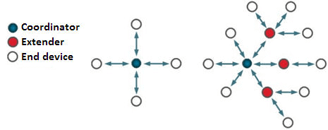
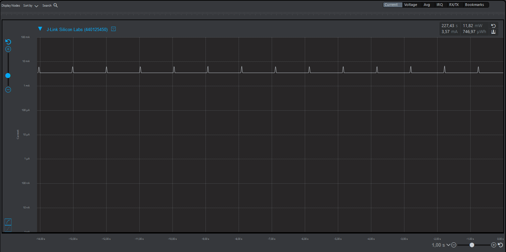
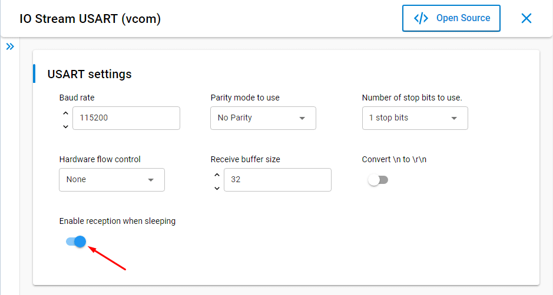
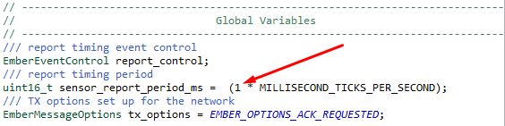
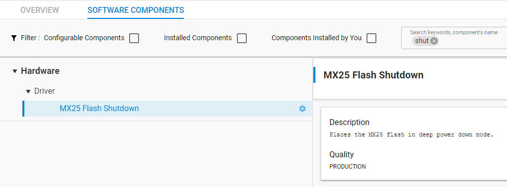
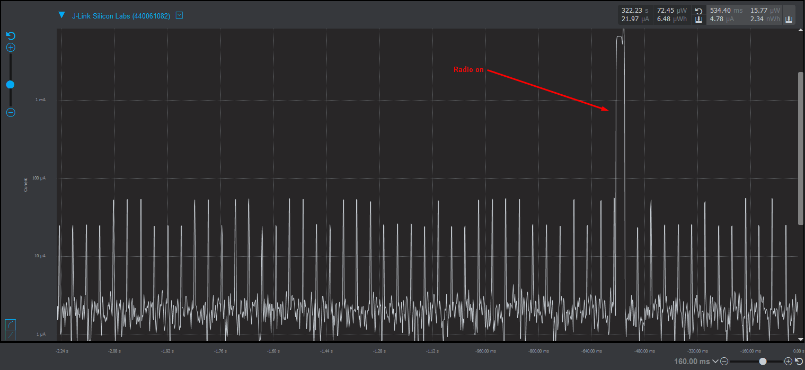

# AN1252: Building Low Power Networks with the Silicon Labs Connect Stack v3.x (Rev. 0.2) <!-- omit in toc -->

- [1. Introducing Low Power Sensor Networks](#1-introducing-low-power-sensor-networks)
- [2. Create the Baseline Network](#2-create-the-baseline-network)
  - [2.1 Build and Run the Coordinator/Sink Application](#21-build-and-run-the-coordinatorsink-application)
  - [2.2 Build and Run the Sensor Application](#22-build-and-run-the-sensor-application)
  - [2.3 Create the Network](#23-create-the-network)
  - [2.4 Monitor Baseline Energy Use](#24-monitor-baseline-energy-use)
- [3. Reduce Power Consumption](#3-reduce-power-consumption)
  - [3.1 Disable UART Reception during Sleep](#31-disable-uart-reception-during-sleep)
  - [3.2 Change Report Periodicity](#32-change-report-periodicity)
  - [3.3 Initialize the SPI Flash Chip](#33-initialize-the-spi-flash-chip)
  - [3.4 Reduced Power Consumption Results](#34-reduced-power-consumption-results)

本文档说明了使用 Simplicity Studio 和 Silicon Labs Connect Stack v3.x 开发的、用于降低传感器网络功耗的技术，这些技术是随 SimplicityStudio® 5 作为 Silicon Labs Proprietary Flex SDK v3.x 的一部分分发的。这些技术包括创建 sleepy end device，这种设备本质上会消耗较少的能量、减少报告频率并消除不必要的外设能耗。Flex SDK 随附的 sensor 和 sink 示例应用列举了这些技术。有关在 Connect 网络中节能的更深入背景信息，请参阅 *UG435.07: Energy Saving with Silicon Labs Connect v3.x* ，这是 *Connect v3.x User's Guide* 系列的一部分。

所有 EFR32FG 设备均支持 Proprietary。对于其他产品，请在 Ordering Information > Protocol Stack 下查看设备的 datasheet，以了解是否支持 Proprietary。在 Proprietary SDK version 2.7.n 中，EFR32xG22 不支持 Connect。

# 1. Introducing Low Power Sensor Networks

一个典型的低功耗网络包含充当网络 coordinator 的单个 “always-on” 设备，以及一个或多个充当 sleepy end device 的节点。这样的设备将其大部分时间都花在 deep sleep mode 下，仅短暂唤醒即可将数据传输到中心的 coordinator。低功耗网络的一个示例是简单的传感器网络，其中的传感器都是 sleepy end device，中央集线器（central hub）充当网络的 always-on coordinator 或 sink。

针对这种情况，Silicon Labs Flex SDK 包括基于 Connect stack 的示例 sensor 和 sink 应用程序。支持星型和扩展星型网络拓扑：

    

示例应用为：

* Connect (SoC): Sensor
* Connect (SoC): Sink

这些应用程序一起演示了星型拓扑。Sensor 与 sink 节点之间可以进行双向通信。本文档介绍了使用 Simplicity Studio 构建一个 sensor-sink 网络，然后对其进行修改以实现最低功耗。

如果您不熟悉在 Simplicity Studio 中构建示例应用，请查看 *QSG168: Proprietary Flex SDK v3.x Quick Start Guide* 。如果您不熟悉 Silicon Labs Connect stack 的特性和功能，请参阅 *UG103.12: Silicon Labs Connect Fundamentals* 。

# 2. Create the Baseline Network

本章介绍如何：

1. 生成并运行示例 coordinator/sink 应用程序。
2. 生成并运行 sensor 应用程序。
3. 创建网络。
4. 评估基准能耗。

您将至少需要将两个设备连接到一个运行 Simplicity Studio 的计算机。

## 2.1 Build and Run the Coordinator/Sink Application

1. 在 Simplicity Studio Launcher 透视图中，选择要用作 coordinator/sink 的设备。
2. 单击 **[Create New Project]** ，开始一个新项目。
3. 通过选择 **Connect: Sink (SoC)** 示例并完成 New Project 向导中的步骤来创建项目。
4. 编译（）和调试（）项目。 现在，coordinator 应用程序已安装在设备上。

要配置 coordinator，必须使用终端软件来设置参数。使用单独的应用程序或 Simplicity Studio 的内置控制台工具。在终端中发出 `help` 以查看固件的一些基本帮助。固件启动时，发出 `form 0` （在信道 0 上形成网络）和 `pjoin 255` （启用无限期的节点加入）命令：

此时，coordinator 已启动并正在运行，而且准备接受传入的加入请求，因此 sensor 节点可以连接到 sink。

    

## 2.2 Build and Run the Sensor Application

1. 返回到 Simplicity Studio Launcher 透视图，然后选择要用作 sensor 的设备。
2. 单击 **[Create New Project]** ，开始一个新项目。
3. 通过选择 Flex SDK，然后选择 **Connect: Sensor (SoC)** 示例并完成 New Project 向导中的步骤来创建项目。可以保留所有设置的默认设置。确保 sink 的无线电配置设置与 sensor 匹配。
4. 编译和调试/运行应用程序。

## 2.3 Create the Network

Sensor 两个最重要的终端命令是 `join` 和 `join-sleepy` 。在发出 `join` 时，设备将尝试连接到 coordinator，如果连接成功，则该节点将成为网络的一部分。该设备完全不会尝试进入 sleep mode 或 idle mode，从而使设备保持唤醒状态并消耗相对较高的电流。

`join-sleepy` 命令使设备可以进入睡眠状态。在成功的加入过程后，设备将开始定期将传感器数据发送到 sink（默认为 1 s）。

此时，由一个 coordinator/sink 和一个 node/sensor 组成的网络应该正常工作，传感器数据应该由 sensor 发送并由 sink 以 1 s 的周期接收。通过将 sensor 固件下载到其他设备中，可以将更多节点添加到网络。成功加入的状态代码为 0x90: Network up，固件在控制台上打印 Network up。

    

如果 sensor 无法加入网络，则固件会在控制台上打印数字状态代码，而不是文字说明。
* `0x40` ：未收到 ACK，发送了一个消息给节点，但该节点未响应。
* `0x41` ：如果发送方未获得轮询请求以发送其待决消息，则可能发生 Indirect MAC 超时。
* `0x70` ：无效的调用，通常在执行意外操作时（如已加入时进行加入或未加入时进行发送，等等）。
* `0xAB` ：没有有效的信标（beacon），无法听到其他无线电信号（如未连接天线）。

在使用 sensor/sink 示例进行实验的每个步骤之前，最好在 coordinator/sink 和 sensor 上发出 `leave` 命令。例如，coordinator 根据 EUI64 ID 来维护先前已连接的节点的信息。节点也存储了信息，并在上电时根据这些信息尝试自动重新连接到 coordinator。通过发出 `leave` 命令，这些信息将被清除。

## 2.4 Monitor Baseline Energy Use

Energy Profiler 是一个用于实时检查电流消耗的有用工具。有关使用 Energy Profiler 的详细信息，请参阅 *UG343: MultiNode Energy Profiler User's Guide* 。

下图展示了一个未优化的 sensor 节点的功耗。

    

# 3. Reduce Power Consumption

本章介绍降低功耗的技术，包括：

* 禁用 UART 接收以启用 sleep mode
* 变更报告周期
* 初始化 SPI Flash 芯片

最后，描述降低功耗后的结果。

## 3.1 Disable UART Reception during Sleep

第一步（也是最大程度降低功耗的一步）是在睡眠期间禁用 UART 接收。这使得可以在可能的情况下进入 EM2 mode。此选项可以在 Component Editor 中的 **IO Stream USART (vcom)** 设置下启用。

    

> 注意：如果在睡眠期间禁用了接收功能，则无法通过 CLI（UART）发出命令。Sensor 示例具有 PB0 在启用和禁用接收模式之间切换的功能。

## 3.2 Change Report Periodicity

如果睡眠功耗显着低于活动期间的功耗，则更改报告周期可以大大减少平均功耗。要更改报告周期，请打开 `app_process.c` 并修改 `sensor_report_period_ms` 值。

    

## 3.3 Initialize the SPI Flash Chip

通过采用上述修改，可以将睡眠电流降低至 ~ 10-12 μA。但是，Silicon Labs 设计的所有无线板都包含一个 SPI flash 芯片，如果不初始化的话，其功耗约为 8-10 μA。为了减少 SPI flash 的电流消耗，必须安装 **MX25 Flash Shutdown** 组件。在 sensor 应用程序中，默认情况下已安装了它。

    

## 3.4 Reduced Power Consumption Results

最后，如果应用了这些修改，则应该大大降低了 sleep mode 的电流消耗。

    

> 注意：WSTK 板的内置电流测量在 µA 及以下范围内，并不是很准确。一旦应用了所有修改，sensor 节点 sleep mode 的电流消耗应在 2-5 μA 范围内。
