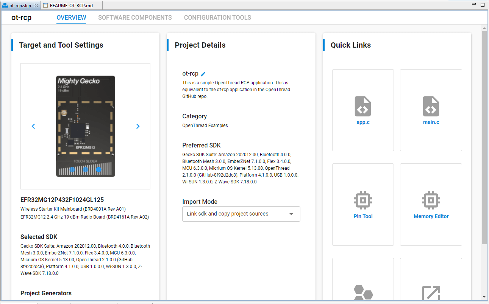
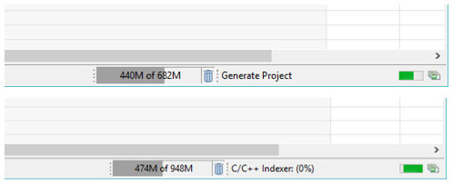
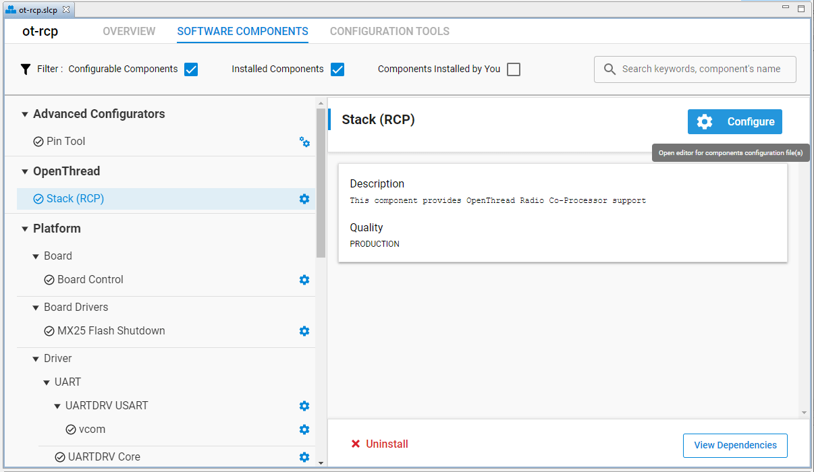
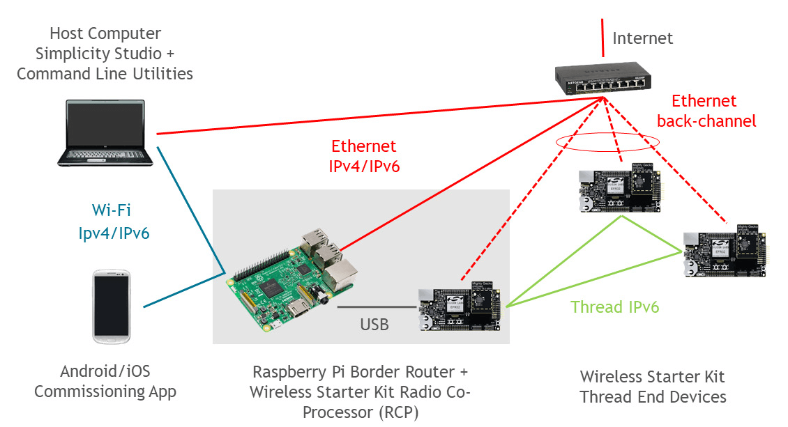
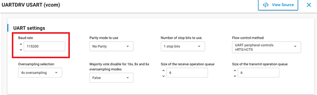

# AN1256: Using the Silicon Labs RCP with the OpenThread Border Router (Rev. 0.9) <!-- omit in toc -->

- [1 引言](#1-引言)
  - [1.1 硬件要求](#11-硬件要求)
- [2 RCP 映像的构建和安装说明](#2-rcp-映像的构建和安装说明)
  - [2.1 使用预编译的 RCP 映像](#21-使用预编译的-rcp-映像)
  - [2.2 使用 Simplicity Studio 5 构建 RCP 映像](#22-使用-simplicity-studio-5-构建-rcp-映像)
  - [2.3 使用 Simplicity Studio 5 在 RCP 映像中配置 OpenThread 选项](#23-使用-simplicity-studio-5-在-rcp-映像中配置-openthread-选项)
- [3 Border Router 主机的构建和安装说明](#3-border-router-主机的构建和安装说明)
  - [3.1 安装硬件](#31-安装硬件)
  - [3.2 安装用于 RCP 的 Raspberry Pi](#32-安装用于-rcp-的-raspberry-pi)
    - [3.2.1 Docker 安装](#321-docker-安装)
      - [3.2.1.1 先决条件](#3211-先决条件)
      - [3.2.1.2 安装指引](#3212-安装指引)
    - [3.2.2 手动安装 OpenThread Border Router](#322-手动安装-openthread-border-router)
      - [重要笔记](#重要笔记)
- [4 OTBR 配置信息](#4-otbr-配置信息)
  - [4.1 OTBR 特性配置](#41-otbr-特性配置)
  - [4.2 Docker 配置笔记](#42-docker-配置笔记)
  - [4.3 手动安装的 OTBR 配置笔记](#43-手动安装的-otbr-配置笔记)
  - [4.4 NAT64/Tayga 配置笔记](#44-nat64tayga-配置笔记)
  - [4.5 使用 ot-ctl 来配置和控制您的 OpenThread Border Router](#45-使用-ot-ctl-来配置和控制您的-openthread-border-router)
- [5 OpenThread 资源](#5-openthread-资源)

---

    

        

        

            A Thread Border Router connects a Thread Network to other IPbased networks, such as Wi-Fi® or Ethernet®. A Thread Network requires a Border Router to connect to other networks. The Border Router provides services for devices within the Thread Network, including routing services for off-network operations, bidirectional connectivity over IPv6 infrastructure links, and service registry to enable DNS-based service discovery. Silicon Labs provides a Border Router Add-On Kit containing a Raspberry Pi device and an example Radio Co-Processor (RCP) application required to build Border Router software. 
        

    

    

        Thread Border Router 将 Thread 网络连接到其他基于 IP 的网络，例如 Wi-Fi® 或 Ethernet®。Thread 网络需要有 Border Router 才能连接到其他网络。Border Router 为 Thread 网络内的设备提供服务，包括用于离线操作的路由服务、通过 IPv6 基础设施链路的双向连接以及启用基于 DNS 服务发现的服务注册。Silicon Labs 提供了一个 Border Router Add-On Kit，其中包含构建 Border Router 软件所需的 Raspberry Pi 设备和示例无线协处理器（RCP）应用程序。
    

    

        

        

            NOTE: Please refer to the OpenThread release notes for the stable version commits of OpenThread (openthread) and OpenThread Border Router (ot-br-posix) repos supported by a Silicon Labs release. OpenThread release notes are installed with the SDK and are also available on <a href="https://docs.silabs.com/">docs.silabs.com</a>. This applies to all default containers provided by Silicon Labs for the release, and the copies of these repos included in the release. While we support building using any commit on GitHub (using the <a href="https://github.com/openthread/ot-efr32">ot-efr32</a> repo), please note that the latest public code on GitHub can be unstable.
        

    

    

        注意：请参阅 OpenThread 发行说明以了解 Silicon Labs 发行版本所支持的 OpenThread（openthread）和 OpenThread Border Router（ot-br-posix）存储库的稳定版本提交。OpenThread 发行说明随 SDK 一起安装，也可以在 <a href="https://docs.silabs.com/">docs.silabs.com</a> 上找到它。这适用于 Silicon Labs 为发行版本提供的所有默认容器，以及发行中包含的这些存储库的副本。虽然我们支持使用 GitHub 上的任何提交进行构建（使用 <a href="https://github.com/openthread/ot-efr32">ot-efr32</a> 存储库），但请注意 GitHub 上的最新公开代码可能不稳定。
    

# 1 引言

    

        

        

            This application note is intended for software engineers who wish to develop an OpenThread Border Router (OTBR). It assumes some familiarity with OpenThread and basic Thread concepts. For an introduction to OpenThread and information on Thread concepts, visit <a href="https://openthread.io/">https://openthread.io/</a>. For information on OTBR setup and installation, refer to <a href="https://openthread.io/guides/border-router">https://openthread.io/guides/border-router</a>.
        

    

    

        本应用笔记适用于希望开发 OpenThread Border Router（OTBR）的软件工程师。本文假定您熟悉 OpenThread 和 Thread 的基本概念。有关 OpenThread 的介绍和 Thread 概念的信息，请访问 <a href="https://openthread.io/">https://openthread.io/</a>。有关 OTBR 设置和安装的信息，请参阅 <a href="https://openthread.io/guides/border-router">https://openthread.io/guides/border-router</a>。
    

    

        

        

            This application notes assumes that you have downloaded Simplicity Studio 5 (SSv5) and the Silicon Labs OpenThread SDK and are generally familiar with the SSv5 Launcher perspective. SSv5 installation and getting started instructions along with a set of detailed references can be found in the online <em>Simplicity Studio 5 User's Guide</em>, available on <a href="https://docs.silabs.com/">https://docs.silabs.com/</a> and through the SSv5 help menu. More information about configuring, building, and flashing OpenThread sample applications can be found in <em>QSG170: Silicon Labs OpenThread Quick Start Guide</em>. 
        

    

    

        本应用笔记假设您已下载 Simplicity Studio 5（SSv5）和 Silicon Labs OpenThread SDK，并且通常熟悉 SSv5 Launcher 透视图。可以在 <a href="https://docs.silabs.com/">https://docs.silabs.com/</a> 和 SSv5 帮助菜单的在线 <em>Simplicity Studio 5 User's Guide</em> 中找到 SSv5 安装和入门说明以及一组详细参考资料。有关配置、构建和刷写 OpenThread 示例应用程序的更多信息，请参阅 <em>QSG170: Silicon Labs OpenThread Quick Start Guide</em>。
    

    

        

        
This application note addresses the following topics.

        <ul>
            <li>
                
<strong>Build and Installation Instructions for the RCP Images</strong>

                
Explains the build and installation procedure for the Radio Co-Processor (RCP) image.

            </li>
            <li>
                
<strong>Build and Installation Instructions for the OpenThread Border Router</strong>

                
Defines the build and installation procedure for the OpenThread Border Router on POSIX-based platforms, including an option to deploy a pre-built Docker container for the Raspberry Pi.

            </li>
            <li>
                
<strong>OTBR Configuration Information</strong>

                
Provides OTBR information such as how to configure various Border Router features and the Network Address Translation (NAT64) interface.

            </li>
            <li>
                
<strong>Additional OpenThread Resources</strong>

                
Includes links to OpenThread Resources.

            </li>
        </ul>
    

    
本应用笔记涉及以下主题：

    <ul>
        <li>
            
<strong>RCP 映像的构建和安装说明</strong>

            
解释无线协处理器（RCP）映像的构建和安装过程。

        </li>
        <li>
            
<strong>OpenThread Border Router 的构建和安装说明</strong>

            
在基于 POSIX 的平台上定义 OpenThread Border Router 的构建和安装过程，包括一个为 Raspberry Pi 部署预构建的 Docker 容器的选项。

        </li>
        <li>
            
<strong>OTBR 配置信息</strong>

            
提供 OTBR 信息，例如如何配置各种 Border Router 特性和网络地址转换（NAT64）接口。

        </li>
        <li>
            
<strong>其他 OpenThread 资源</strong>

            
包含指向 OpenThread 资源的链接。

        </li>
    </ul>

## 1.1 硬件要求

    

        

        

            A Thread Border Router has two components:
            <ul>
                <li>A Raspberry Pi host with Thread Border Router support (Recommended: Raspberry Pi 3 Model B+ or above)</li>
                <li>A Thread-capable Silicon Labs Radio Co-processor (RCP)</li>
            </ul>
        

    

    

        一个 Thread Border Router 含有两个组件：
        <ul>
            <li>支持 Thread Border Router 的 Raspberry Pi 主机（推荐：Raspberry Pi 3 Model B+ 或更高版本）</li>
            <li>支持 Thread 的 Silicon Labs 无线协处理器（RCP）</li>
        </ul>
    

    

        

        

            To create the RCP, you need the following:
            <ul>
                <li><a href="https://www.silabs.com/products/development-tools/wireless/mesh-networking/mighty-gecko-starter-kit">EFR32MG Wireless Starter Kit</a> or <a href="https://www.silabs.com/development-tools/thunderboard/thunderboard-sense-two-kit">Thunderboard Sense 2 Sensor-to-Cloud Advanced IoT Kit</a></li>
                <li>Silicon Labs board capable of Thread communication</li>
            </ul>
        

    

    

        要创建 RCP，您需要以下资源：
        <ul>
            <li><a href="https://www.silabs.com/products/development-tools/wireless/mesh-networking/mighty-gecko-starter-kit">EFR32MG Wireless Starter Kit</a> 或 <a href="https://www.silabs.com/development-tools/thunderboard/thunderboard-sense-two-kit">Thunderboard Sense 2 Sensor-to-Cloud Advanced IoT Kit</a></li>
            <li>支持 Thread 通信的 Silicon Labs 板</li>
        </ul>
    

    

        

        

            Note: See <a href="#Table_2-1">Table 2-1</a> for a list of Silicon Labs Precompiled RCP Images.
        

    

    

        注意：有关 Silicon Labs 预编译 RCP 映像的列表，请参见 <a href="#Table_2-1">Table 2-1</a>。
    

# 2 RCP 映像的构建和安装说明

    

        

        
Note: The following instructions only apply to RCP images built using Simplicity Studio for a given GSDK release.

    

    

        注意：以下说明仅适用于使用 Simplicity Studio 为给定 GSDK 版本构建的 RCP 映像。
    

    

        

        
To build an RCP image using the latest OpenThread, follow instructions on the <a href="https://github.com/openthread/ot-efr32">ot-efr32</a> repo.

    

    

        要使用最新的 OpenThread 构建 RCP 映像，请按照 <a href="https://github.com/openthread/ot-efr32">ot-efr32</a> 存储库中的说明进行操作。
    

## 2.1 使用预编译的 RCP 映像

    

        

        
Silicon Labs has precompiled images available for these boards with their associated image locations.

    

    

        以下为 Silicon Labs 提供的各个板的预编译映像及其映像位置。
    

    

        

        
Note: By default, the Silicon Labs GSDK uses Thread protocol version 1.3, which also applies to the following precompiled RCP images.

    

    

        注意：默认情况下，Silicon Labs GSDK 使用 Thread 1.3，以下的预编译 RCP 映像也是一样。
    

<table id="Table_2-1" style="margin-left: auto; margin-right: auto;">
    <caption>Table 2-1. Silicon Labs Precompiled RCP Images</caption>
    <thead>
        <tr>
            <th>Board Name</th>
            <th>Image Location</th>
        </tr>
    </thead>
    <tbody>
        <tr>
            <td>brd4161a</td>
            <td>protocol/openthread/demos/ot-rcp/ot-rcp-brd4161a.s37</td>
        </tr>
        <tr>
            <td>brd4166a</td>
            <td>protocol/openthread/demos/ot-rcp/ot-rcp-brd4166a.s37</td>
        </tr>
        <tr>
            <td>brd4168a</td>
            <td>protocol/openthread/demos/ot-rcp/ot-rcp-brd4168a.s37</td>
        </tr>
        <tr>
            <td>brd4180a</td>
            <td>protocol/openthread/demos/ot-rcp/ot-rcp-brd4180a.s37</td>
        </tr>
        <tr>
            <td>brd4304a</td>
            <td>protocol/openthread/demos/ot-rcp/ot-rcp-brd4304a.s37</td>
        </tr>
    </tbody>
</table>

## 2.2 使用 Simplicity Studio 5 构建 RCP 映像

    

        

        
Silicon Labs has sample applications for a number of standard OpenThread images.

        <ol>
            <li>
                

                    Select <strong>ot-rcp</strong> as an example for the default RCP image for the OpenThread Border Router.
                

            </li>
            <li>
                

                    With your target part connected to your computer, open Simplicity Studio 5’s File menu and select <strong>New &gt; Silicon Labs Project Wizard</strong>. The Target, SDK, and Toolchain Selection dialog opens. Click <strong>NEXT</strong>.
                

            </li>
            <li>
                

                    The Example Project Selection dialog opens. Use the Technology Type and Keyword filters to search for <strong>ot-rcp</strong> as an example for the default RCP image for the OpenThread Border Router. Select it and click <strong>NEXT</strong>.
                

            </li>
            <li>
                

                    The Project Configuration dialog opens. Here you can rename your project, change the default project file location, and determine if you will link to or copy project files. Note that if you change any linked resource, it is changed for any other project that references it. Click <strong>FINISH</strong>.
                

            </li>
            <li>
                

                    The Simplicity IDE Perspective opens with the Project Configurator open to the <strong>OVERVIEW</strong> tab. See the online <em>Simplicity Studio 5 User's Guide</em> for details about the functionality available through the Simplicity IDE perspective and the Project Configurator. 
                    
                

            </li>
            <li>
                

                    Make any configuration changes to the software components, as described in the next section. You can see autogeneration progress in the bottom right of the Simplicity IDE perspective. Make sure that progress is complete before you build. 
                    
                

            </li>
            <li>
                

                    Compile and flash the application image as described in <em>QSG170: Silicon Labs OpenThread Quick Start Guide</em>.
                

            </li>
        </ol>
    

    
Silicon Labs 有许多标准 OpenThread 映像的示例应用程序：

    <ol>
        <li>
            

                选择 <strong>ot-rcp</strong> 作为 OpenThread Border Router 的默认 RCP 映像的示例。
            

        </li>
        <li>
            

                将目标部件连接到计算机后，打开 Simplicity Studio 5 的文件菜单并选择 <strong>New &gt; Silicon Labs Project Wizard</strong>。Target, SDK, and Toolchain Selection 对话框会被打开。点击 <strong>NEXT</strong>。
            

        </li>
        <li>
            

                Example Project Selection 对话框会被打开。使用 Technology Type 和 Keyword 过滤器搜索 <strong>ot-rcp</strong>，这是一个 OpenThread Border Router 的默认 RCP 映像示例。选择它并点击 <strong>NEXT</strong>。
            

        </li>
        <li>
            

                Project Configuration 对话框会被打开。在这里，您可以重命名您的项目，更改默认项目文件位置，和确定您是否将链接到或复制项目文件。请注意，如果您更改任何链接资源，则引用它的任何其他项目都会受到影响。点击 <strong>FINISH</strong>。
            

        </li>
        <li>
            

                Simplicity IDE 透视图会被打开并且 Project Configurator 会打开 <strong>OVERVIEW</strong> 选项卡。有关通过 Simplicity IDE 透视图和 Project Configurator 提供的功能的详细信息，请参阅在线的 <em>Simplicity Studio 5 User's Guide</em>。 
                
            

        </li>
        <li>
            

                你可以对 SOFTWARE COMPONENTS 进行任何配置更改，如下一节所述。您可以在 Simplicity IDE 透视图的右下方看到自动生成的进度条。必须确保在构建之前进度条已完成。 
                
            

        </li>
        <li>
            

                按照 <em>QSG170: Silicon Labs OpenThread Quick Start Guide</em> 中的说明编译并刷写应用程序映像。
            

        </li>
    </ol>

## 2.3 使用 Simplicity Studio 5 在 RCP 映像中配置 OpenThread 选项

    

        

        <ol>
            <li>
                

                    Under the <strong>SOFTWARE COMPONENTS</strong> tab in your RCP project (.slcp), expand the <strong>OpenThread</strong> menu. Select <strong>Stack (RCP)</strong> entry for an RCP build.
                

            </li>
            <li>
                

                    Click <strong>Configure</strong> to change the settings associated with the OpenThread build.
                

                

                    Note: You can select the <strong>Configurable Components</strong> and <strong>Installed Components</strong> checkboxes to filter to only those components you can configure successfully.
                

                

                    
                

            </li>
            <li>
                

                    Configure the various compile-time settings for your RCP project. The various build options are explained in the OpenThread documentation at <a href="https://openthread.io/guides/build">https://openthread.io/guides/build</a>. 
                

            </li>
        </ol>
    

    <ol>
        <li>
            

                在您的 RCP 项目（.slcp）的 <strong>SOFTWARE COMPONENTS</strong> 选项卡下，展开 <strong>OpenThread</strong> 菜单。为 RCP 构建选择 <strong>Stack (RCP)</strong> 条目。
            

        </li>
        <li>
            

                点击 <strong>Configure</strong> 以更改与 OpenThread 构建相关的设置。
            

            

                注意：您可以选中 <strong>Configurable Components</strong> 和 <strong>Installed Components</strong> 复选框以仅筛选出您可以成功配置的组件。
            

            

                
            

        </li>
        <li>
            

                为您的 RCP 项目配置各种编译时设置。各种构建选项在 OpenThread 文档 <a href="https://openthread.io/guides/build">https://openthread.io/guides/build</a> 中进行了说明。
            

        </li>
    </ol>

# 3 Border Router 主机的构建和安装说明

## 3.1 安装硬件

    

        

        

            Connect each Wireless Starter Kit main board and the host computer to an Ethernet switch with an Ethernet cable as shown in the following figure. These connections will permit programming and network analysis of the RCP and end devices. Optionally, end devices may be connected to the host computer by USB rather than Ethernet.
        

    

    

        如下图所示，使用 Ethernet 电缆将每个 Wireless Starter Kit 主板和主机连接到 Ethernet 交换机。这些连接将允许对 RCP 和终端设备进行编程和网络分析。终端设备也可以选择通过 USB 而不是 Ethernet 连接到主机。
    

    

## 3.2 安装用于 RCP 的 Raspberry Pi

    

        

        

            There are two different methods for installing a Raspberry Pi for use with an RCP:
            <ul>
                <li>Docker container</li>
                <li>Manual installation</li>
            </ul>
        

    

    

        有两种不同的方法可以安装用于 RCP 的 Raspberry Pi：
        <ul>
            <li>Docker 容器</li>
            <li>手动安装</li>
        </ul>
    

### 3.2.1 Docker 安装

    

        

        

            Note: The following Docker containers are only supposed to be used with RCPs built using Simplicity Studio 5 for a given release. Be sure to match the container tag version with the GSDK version that you are testing with.
        

    

    

        注意：以下 Docker 容器仅应与使用 Simplicity Studio 5 为给定发行版本构建的 RCP 一起使用。请务必使容器的标签版本与您正在测试的 GSDK 版本相匹配。
    

    

        

        

            Silicon Labs recommends deploying the company’s Docker container with the OTBR. Running the OTBR in a container allows for creation of easily deployable artifacts and fast development prototyping and testing.
        

    

    

        Silicon Labs 建议使用 OTBR 部署公司的 Docker 容器。在容器中运行 OTBR 允许您创建易于部署的产品，和快速开发原型和测试。
    

    

        

        

            Silicon Labs provides the following pre-built Docker containers (with tags), hosted on DockerHub:
        

    

    

        Silicon Labs 提供以下预构建的 Docker 容器（带有标签），其托管在 DockerHub 上：
    

    
<a href="https://hub.docker.com/r/siliconlabsinc/openthread-border-router/tags">https://hub.docker.com/r/siliconlabsinc/openthread-border-router/tags</a>

    

        

        

            For proprietary radio support (alpha release):
        

    

    

        用于专用无线电的支持版本（alpha 发行版本）：
    

    
<a href="https://hub.docker.com/r/siliconlabsinc/openthread-border-router-proprietary-na-915/tags">https://hub.docker.com/r/siliconlabsinc/openthread-border-router-proprietary-na-915/tags</a>

#### 3.2.1.1 先决条件

    

        

        <ul>
            <li>On your SD card, make sure you flash the <a href="https://www.raspberrypi.org/downloads/raspberry-pi-os/">Raspberry Pi OS Lite image</a> or <a href="https://www.raspberrypi.org/downloads/raspberry-pi-os/">Raspberry Pi OS with Desktop</a>.</li>
            <li>Make sure to update your local repositories and package manager (<strong>apt-get update</strong> and <strong>apt-get upgrade</strong> prior to installing Docker).</li>
            <li>Optional but recommended: Install Haveged for better entropy conditions.</li>
        </ul>
    

    <ul>
        <li>确保您已经将 <a href="https://www.raspberrypi.org/downloads/raspberry-pi-os/">Raspberry Pi OS Lite image</a> 或 <a href="https://www.raspberrypi.org/downloads/raspberry-pi-os/">Raspberry Pi OS with Desktop</a> 刷写到您的 SD 卡上。</li>
        <li>确保您已经更新了您的本地存储库和包管理器（安装 Docker 之前执行 <strong>apt-get update</strong> 和 <strong>apt-get upgrade</strong>）</li>
        <li>可选但推荐：安装 Haveged 以获得更好的熵条件。</li>
    </ul>

#### 3.2.1.2 安装指引

    

        

        <ul>
            <li>
                
Make sure you reboot after any updates:

                <pre>curl -sSL https://get.docker.com | sh</pre>
            </li>
            <li>
                
Once finished, you can modify the Docker user settings to not require <code>sudo</code> before each command:

                <pre>sudo usermod -aG docker $USER</pre>
            </li>
                
Raspberry Pi and Linux users, make sure to run:

                <pre>sudo modprobe ip6table_filter</pre>
                
for OTBR firewall support. This allows OTBR scripts to create rules inside the Docker container before otbr-agent starts.

                
To make sure this setting persists between reboots, add the following line to <code>/etc/modules</code>:

                <pre>ip6table_filter</pre>
                
If you do not complete this step, you may see modprobe errors when starting a Docker container.

            <li>
                
Issue the following commands to install the containers. Note that you can have only one Border Router container running at one time with your RCP. Also, be sure to verify the RCP version (Thread protocol version 1.3) that should be run against this container.

                <pre>docker pull siliconlabsinc/openthread-border-router:gsdk-4.1.1</pre>
            </li>
            <li>
                
To run an OpenThread Border Router (default is Thread protocol version 1.3), issue the following command:

                <pre>docker run -d --name "otbr" \
    --sysctl "net.ipv6.conf.all.disable_ipv6=0 net.ipv4.conf.all.forwarding=1 net.ipv6.conf.all.forwarding=1" \
    -p 8080:80 --dns=127.0.0.1 -it \
    --volume /dev/ttyACM0:/dev/ttyACM0 \
    --privileged siliconlabsinc/openthread-border-router:gsdk-4.1.1 \
    --radio-url spinel+hdlc+uart:///dev/ttyACM0?uart-baudrate=460800 \
    --backbone-interface eth0</pre>
            </li>
        </ul>
    

    <ul>
        <li>
            
确保在任何更新后重启：

            <pre>curl -sSL https://get.docker.com | sh</pre>
        </li>
        <li>
            
完成后，您可以将 Docker 用户设置修改为在每个命令之前不需要 <code>sudo</code>：

            <pre>sudo usermod -aG docker $USER</pre>
        </li>
            
Raspberry Pi 和 Linux 用户，请确保执行：

            <pre>sudo modprobe ip6table_filter</pre>
            
以启用 OTBR 防火墙支持。这允许 OTBR 脚本在 otbr-agent 启动之前在 Docker 容器内创建规则。

            
要确保此设置在重启后仍然存在，请将以下行添加到 <code>/etc/modules</code>：

            <pre>ip6table_filter</pre>
            
如果您未完成此步骤，您可能会在启动 Docker 容器时看到 modprobe 错误。

        <li>
            
发出以下命令来安装容器。请注意，您的 RCP 一次只能与一个 Border Router 容器一起运行。此外，请务必验证 RCP 版本（Thread 1.3）以确保其是针对该容器的。

            <pre>docker pull siliconlabsinc/openthread-border-router:gsdk-4.1.1</pre>
        </li>
        <li>
            
要运行 OpenThread Border Router（默认为 Thread 1.3），请发出以下命令：

            <pre>docker run -d --name "otbr" \
--sysctl "net.ipv6.conf.all.disable_ipv6=0 net.ipv4.conf.all.forwarding=1 net.ipv6.conf.all.forwarding=1" \
-p 8080:80 --dns=127.0.0.1 -it \
--volume /dev/ttyACM0:/dev/ttyACM0 \
--privileged siliconlabsinc/openthread-border-router:gsdk-4.1.1 \
--radio-url spinel+hdlc+uart:///dev/ttyACM0?uart-baudrate=460800 \
--backbone-interface eth0</pre>
        </li>
    </ul>

    

        

        
You can use additional arguments to configure your containers. For more information, see <a href="#4-otbr-配置信息">4 OTBR Configuration Information</a> or the Dockerfile in the <code>ot-br-posix</code> installation directory.

    

    
您可以使用其他参数来配置您的容器。更多信息请参阅 <a href="#4-otbr-配置信息">4 OTBR 配置信息</a> 或 <code>ot-br-posix</code> 安装目录中的 Dockerfile。

### 3.2.2 手动安装 OpenThread Border Router

    

        

        
Consult the OpenThread Border Router website for information on how to set up a Raspberry Pi for use with RCP: <a href="https://openthread.io/guides/border-router/raspberry-pi">https://openthread.io/guides/border-router/raspberry-pi</a>

    

    
有关如何设置 Raspberry Pi 以与 RCP 一起使用的信息，请参阅 OpenThread Border Router 网站：<a href="https://openthread.io/guides/border-router/raspberry-pi">https://openthread.io/guides/border-router/raspberry-pi</a>

    

        

        
Complete build instructions are detailed here: <a href="https://openthread.io/guides/border-router/build">https://openthread.io/guides/border-router/build</a>

    

    
此处详细介绍了完整的构建说明：<a href="https://openthread.io/guides/border-router/build">https://openthread.io/guides/border-router/build</a>

    

        

        
During the above process, check and note your configuration changes to files such as <code>/etc/dhcpcd.conf</code>, <code>/etc/default/otbr-agent</code> or <code>/etc/tayga.conf</code> in case you need to reapply them later.

    

    
在上述过程中，检查并记下您对 <code>/etc/dhcpcd.conf</code>、<code>/etc/default/otbr-agent</code> 或 <code>/etc/tayga.conf</code> 等文件的配置更改，以便日后需要重新应用它们。

#### 重要笔记

    

        

        <ul>
            <li>
                
Silicon Labs recommends running all OpenThread setup scripts with root-level access.

            </li>
            <li>
                
For manual setup, you can use the included version of the ot-br-posix in the Silicon Labs SDK:

                <pre>util/third_party/ot-br-posix</pre>
                
After running the bootstrap step, make sure to check out the right version of the openthread stack in third_party/openthread/repo, by either copying or creating a symbolic link to the OpenThread stack:

                <pre>util/third_party/ot-br-posix/third_party/openthread/repo -> util/third_party/openthread</pre>
            </li>
            <li>
                
Make sure you have executable permissions for the following files on the host environment you are running them on:

                <pre>util/third_party/ot-br-posix/script/bootstrap
util/third_party/ot-br-posix/script/setup</pre>
                
Refer to the OpenThread Release Notes for the stable commits supported by a given release.

                <ul>
                    <li>If building using GitHub, follow the instructions to build the RCP on the <a href="https://github.com/openthread/ot-efr32">ot-efr32</a> repo.</li>
                </ul>
            </li>
            <li>
                
Remember to include the right flags you want during build:

                <pre>sudo ./script/bootstrap</pre>
                
To enable border routing, specify your platform’s Ethernet or Wi-fi interface:

                <pre>sudo INFRA_NAME=eth0 ./script/setup</pre>
            </li>
        </ul>
    

    <ul>
        <li>
            
Silicon Labs 建议使用 root 级访问权限运行所有 OpenThread 设置脚本

        </li>
        <li>
            
对于手动设置，您可以使用 Silicon Labs SDK 中包含的 ot-br-posix 版本：

            <pre>util/third_party/ot-br-posix</pre>
            
执行 bootstrap 步骤后，通过复制或创建指向 OpenThread 栈的符号链接，确保在 third_party/openthread/repo 中检查正确版本的 OpenThread 栈：

            <pre>util/third_party/ot-br-posix/third_party/openthread/repo -> util/third_party/openthread</pre>
        </li>
        <li>
            
确保您的主机环境中对以下文件具有可执行权限：

            <pre>util/third_party/ot-br-posix/script/bootstrap
util/third_party/ot-br-posix/script/setup</pre>
            
有关给定发行版本支持的稳定提交，请参阅 OpenThread 发行说明。

            <ul>
                <li>如果使用 GitHub 构建，请按照说明在 <a href="https://github.com/openthread/ot-efr32">ot-efr32</a> 存储库上构建 RCP。</li>
            </ul>
        </li>
        <li>
            
记得在构建过程中包含您想要的正确标志：

            <pre>sudo ./script/bootstrap</pre>
            
要启用 Border Router，请指定您的平台的 Ethernet 或 Wi-fi 接口：

            <pre>sudo INFRA_NAME=eth0 ./script/setup</pre>
        </li>
    </ul>

# 4 OTBR 配置信息

## 4.1 OTBR 特性配置

    

        

        
For information on how to properly configure OpenThread Border Router features and services, visit <a href="https://openthread.io/guides/border-router#features_and_services">https://openthread.io/guides/border-router</a>.

    

    
有关如何正确配置 OpenThread Border Router 的特性和服务的信息，请访问 <a href="https://openthread.io/guides/border-router#features_and_services">https://openthread.io/guides/border-router</a>。

## 4.2 Docker 配置笔记

    

        

        <ul>
            <li>
                
Note: Silicon Labs-hosted Docker containers are only supposed to be used with RCPs built using Simplicity Studio 5 for a given release. Be sure to match the container tag version with the GSDK version that you are testing with.

            </li>
            <li>
                
You need to configure the TTY port you wish to use for the OTBR to connect your RCP at startup. Look for the TTY port of your RCP device. The easiest way to do this is to look for a <code>/tty/dev…</code> entry once the RCP is connected. It should generally either be <code>/dev/ttyUSB0</code> or <code>/dev/ttyACM0</code>.

            </li>
            <li>
                
Run your Docker installation as follows:

                <pre>docker run -d --name "otbr" \
    --sysctl "net.ipv6.conf.all.disable_ipv6=0 net.ipv4.conf.all.forwarding=1 net.ipv6.conf.all.forwarding=1" \
    -p 8080:80 --dns=127.0.0.1 -it \
    --volume /dev/ttyACM0:/dev/ttyACM0 \
    --privileged siliconlabsinc/openthread-border-router:gsdk-4.1.1 \
    --radio-url spinel+hdlc+uart:///dev/ttyACM0?uart-baudrate=460800 \
    --backbone-interface eth0</pre>
                <ul>
                    <li><code>-d</code> ensures that the container runs in detached mode.</li>
                    <li>You can see the running logs for the container any time using the <code>docker logs</code> command.</li>
                    <li><code>--name</code> is sticky until the docker container is properly closed (or removed).</li>
                    <li>Port <code>8080</code> indicates the port of the web server hosting the Border Router management webpage.</li>
                    <li>
                        
<code>?uart-baudrate=460800</code> is required in the radio url options to get around fragmentation / reassembly issues over UART, with costly operations such as DTLS with long IPv6 packets or other high data rate use cases.

                        
If you are using this higher baud rate on the host, make sure to also change the baud rate on the RCP by issuing the following command on the admin console of the RCP's WSTK:

                        <pre>&gt; serial vcom config speed 460800</pre>
                        
Make sure to also set the correct baud rate in your RCP project in the UARTDRV USART component as shown in the following figure: 

                    </li>
                </ul>
            </li>
            <li>
                
You can issue commands directly to the container without having to attach to it:

                <pre>docker exec -ti otbr sh -c "sudo ot-ctl state"</pre>
                
For more information, see the <a href="https://docs.docker.com/engine/reference/commandline/exec/">docker exec documentation</a>.

            </li>
            <li>
                
You can also directly obtain an interactive shell above by issuing this command:

                <pre>docker exec -ti otbr sh -c "sudo ot-ctl"</pre>
            </li>
            <li>
                
You can check the window running the OTBR Docker container for running log output of the Border Router or follow the container log as follows:

                <pre>docker logs [container-id] -f</pre>
            </li>
            <li>
                
You can manage your containers as shown below if they are loaded improperly:

                <pre># list all container images docker images otbr # remove existing container docker image rm -f &lt;container ID&gt; # list running containers docker ps -a # to remove running container docker rm -f &lt;container name&gt; </pre>
            </li>
        </ul>
    

    <ul>
        <li>
            
注意：Silicon Labs 托管的 Docker 容器仅应与使用 Simplicity Studio 5 为给定发行版本构建的 RCP 一起使用。请务必使容器的标签版本与您正在测试的 GSDK 版本相匹配

        </li>
        <li>
            
您需要配置您希望 OTBR 使用的 TTY 端口，以便在启动时连接您的 RCP。查找 RCP 设备的 TTY 端口。最简单的方法是在 RCP 连接后查找 <code>/tty/dev…</code> 条目。它通常应该是 <code>/dev/ttyUSB0</code> 或 <code>/dev/ttyACM0</code>

        </li>
        <li>
            
按如下方式执行 Docker 安装：

            <pre>docker run -d --name "otbr" \
--sysctl "net.ipv6.conf.all.disable_ipv6=0 net.ipv4.conf.all.forwarding=1 net.ipv6.conf.all.forwarding=1" \
-p 8080:80 --dns=127.0.0.1 -it \
--volume /dev/ttyACM0:/dev/ttyACM0 \
--privileged siliconlabsinc/openthread-border-router:gsdk-4.1.1 \
--radio-url spinel+hdlc+uart:///dev/ttyACM0?uart-baudrate=460800 \
--backbone-interface eth0</pre>
            <ul>
                <li><code>-d</code> 确保容器以分离模式运行。</li>
                <li>您可以随时使用 <code>docker logs</code> 命令查看容器的运行日志。</li>
                <li><code>--name</code> 在 docker 容器正确关闭（或删除）之前是持久的。</li>
                <li>端口 <code>8080</code> 指示托管 Border Router 管理网页的 Web 服务器的端口。</li>
                <li>
                    
radio-url 选项中的 <code>?uart-baudrate=460800</code> 是必需的，以应对 UART 上的分片/重组问题，以及高代价的操作（如使用长 IPv6 数据包的 DTLS 或其它高数据速率用例）

                    
如果您在主机上使用更高的波特率，那么请确保通过在 RCP 的 WSTK 的管理控制台上发出以下命令来更改 RCP 上的波特率：

                    <pre>&gt; serial vcom config speed 460800</pre>
                    
还要确保在您的 RCP 项目中的 UARTDRV USART 组件中设置正确的波特率，如下图所示： 

                </li>
            </ul>
        </li>
        <li>
            
您可以直接向容器发出命令，而无需附加到容器：

            <pre>docker exec -ti otbr sh -c "sudo ot-ctl state"</pre>
            
有关更多信息，请参阅 <a href="https://docs.docker.com/engine/reference/commandline/exec/">docker exec documentation</a>.

        </li>
        <li>
            
您也可以通过发出以下命令直接获得上面的交互式 shell：

            <pre>docker exec -ti otbr sh -c "sudo ot-ctl"</pre>
        </li>
        <li>
            
您可以查看正在运行 OTBR Docker 容器的窗口以查看 Border Router 的运行日志输出，或使用如下命令：

            <pre>docker logs [container-id] -f</pre>
        </li>
        <li>
            
如果您不适当地加载了容器，您可以按如下所示管理容器：

            <pre># list all container images docker images otbr # remove existing container docker image rm -f &lt;container ID&gt; # list running containers docker ps -a # to remove running container docker rm -f &lt;container name&gt; </pre>
        </li>
    </ul>

## 4.3 手动安装的 OTBR 配置笔记

    

        

        <ul>
            <li>
                

                    You need to configure the tty port you wish to use for the OTBR to connect your RCP at startup. Look for the tty port of your RCP device. The easiest way to do this is to look for a <code>/tty/dev…</code> entry once the RCP is connected. It should generally either be <code>/dev/ttyUSB0</code> or <code>/dev/ttyACM0</code>.
                

            </li>
            <li>
                
Edit the <code>/etc/default/otbr-agent</code> file and look for the <code>OTBR_AGENT_OPTS</code> configuration. Include the tty port name in that parameter as follows:

                <pre>OTBR_AGENT_OPTS="-I wpan0 spinel+hdlc+uart:///dev/ttyACM0?uart-baudrate=460800"</pre>
            </li>
            <li>
                
If running a Backbone Border Router (Thread protocol version 1.2 or above), add the backbone interface as follows:

                <pre>OTBR_AGENT_OPTS="-I wpan0 -B eth0 spinel+hdlc+uart:///dev/ttyACM0?uart-baudrate=460800"</pre>
            </li>
            <li>
                

                    If running a Thread 1.3 Border Router, you can specify the Thread Radio Encapsulation Link (TREL) interface to enable Thread over Infrastructure links as follows:
                

                <pre>OTBR_AGENT_OPTS="-I wpan0 -B eth0 spinel+hdlc+uart:///dev/ttyACM0?uart-baudrate=460800 trel://eth0"</pre>
            </li>
            <li>
                
Issue the <code>&gt; sudo ot-ctl state</code> command on your Raspberry Pi to see the status of the connection between the host and RCP.

            </li>
            <li>
                
To verify the baud rate in use, issue the command:

                <pre>stty -F /dev/ttyACM0</pre>
            </li>
            <li>
                
Check whether all required services are running on the OTBR.

                
<code>sudo systemctl status</code> should not report any services as running in a “degraded” state.

            </li>
            <li>
                
Check <code>/var/log/syslog</code> for a running log of otbr-agent.

            </li>
        </ul>
    

    <ul>
        <li>
            

                您需要配置您希望 OTBR 使用的 tty 端口，以便在启动时连接您的 RCP。查找 RCP 设备的 tty 端口。最简单的方法是在 RCP 连接后查找 <code>/tty/dev…</code> 条目。它通常应该是 <code>/dev/ttyUSB0</code> 或 <code>/dev/ttyACM0</code>
            

        </li>
        <li>
            
编辑 <code>/etc/default/otbr-agent</code> 文件并查找 <code>OTBR_AGENT_OPTS</code> 配置。在该参数中包含 tty 端口名称，如下所示：

            <pre>OTBR_AGENT_OPTS="-I wpan0 spinel+hdlc+uart:///dev/ttyACM0?uart-baudrate=460800"</pre>
        </li>
        <li>
            
如果要运行 Backbone Border Router（Thread 1.2 或更高版本），则需要添加 backbone 接口，如下所示：

            <pre>OTBR_AGENT_OPTS="-I wpan0 -B eth0 spinel+hdlc+uart:///dev/ttyACM0?uart-baudrate=460800"</pre>
        </li>
        <li>
            

                如果要运行 Thread 1.3 Border Router，您可以指定 Thread 无线封装链路（TREL，Thread Radio Encapsulation Link）接口以启用 Thread over Infrastructure 链路，如下所示：
            

            <pre>OTBR_AGENT_OPTS="-I wpan0 -B eth0 spinel+hdlc+uart:///dev/ttyACM0?uart-baudrate=460800 trel://eth0"</pre>
        </li>
        <li>
            
在您的 Raspberry Pi 上发出 <code>&gt; sudo ot-ctl state</code> 命令以查看 host 和 RCP 之间的连接状态。

        </li>
        <li>
            
要验证正在使用的波特率，请发出命令：

            <pre>stty -F /dev/ttyACM0</pre>
        </li>
        <li>
            
检查所有必需的服务是否已在 OTBR 上运行。

            
<code>sudo systemctl status</code> 不应该报告任何服务在 “degraded” 状态下运行。

        </li>
        <li>
            
检查 <code>/var/log/syslog</code> 以获取 otbr-agent 的运行日志。

        </li>
    </ul>

## 4.4 NAT64/Tayga 配置笔记

    

        

        <ul>
            <li>
                The Tayga service runs NAT64 in conjunction with NAT44 which provides statefulness to the NAT64 configuration. Use the <code>/etc/tayga.conf</code> file to configure the NAT64 interface.
            </li>
            <li>
                If a service is degraded, you can obtain more information issuing either the <code>systemctl status tayga.service</code> and <code>journalctl -xe</code> commands.
            </li>
            <li>
                You must configure a global prefix different from the one in <code>/etc/tayga.conf</code> with 64 bits length on the Border Router. The mesh devices can acquire a global address to use for the purposes of having a source address for NAT64 connectivity.
            </li>
            <li>
                You cannot use the default prefix to connect to non-routable IPv4 addresses. You must configure your <code>/etc/tayga.conf</code> file to use a non-default prefix.
            </li>
            <li>
                Silicon Labs does not recommend using the default NAT configuration on a network using 192.168.x.x addresses because that NAT uses those addresses by default on the NAT64 interface.
            </li>
        </ul>
    

    <ul>
        <li>
            Tayga 服务将 NAT64 与 NAT44 结合在一起运行，NAT44 为 NAT64 配置提供状态性。可以使用 <code>/etc/tayga.conf</code> 文件配置 NAT64 接口。
        </li>
        <li>
            如果服务已降级，您可以通过发出 <code>systemctl status tayga.service</code> 和 <code>journalctl -xe</code> 命令获取更多信息。
        </li>
        <li>
            您必须在 Border Router 上配置一个不同于 <code>/etc/tayga.conf</code> 中的全局前缀，长度为 64 位。网状网设备可以获取一个全局地址，以便为 NAT64 连接提供源地址。
        </li>
        <li>
            您不能使用默认前缀连接到不可路由的 IPv4 地址。您必须配置您的 <code>/etc/tayga.conf</code> 文件以使用一个非默认前缀。
        </li>
        <li>
            Silicon Labs 不建议在使用 192.168.x.x 地址的网络上使用默认的 NAT 配置，因为 NAT 会在 NAT64 接口上默认使用这些地址。
        </li>
    </ul>

## 4.5 使用 ot-ctl 来配置和控制您的 OpenThread Border Router

    

        

        
For a full command list, run:

    

    
如需获取完整的命令列表，请执行：

    <pre>&gt; sudo ot-ctl help</pre>

    

        

        

            Refer to <a href="https://openthread.io/guides/border-router/external-commissioning">https://openthread.io/guides/border-router/external-commissioning</a> for examples on how to manually set up a Thread Network and examples on how to enable an external commissioner.
        

    

    

        有关如何手动设置 Thread 网络的示例以及如何启用外部 commissioner 的示例，请参阅 <a href="https://openthread.io/guides/border-router/external-commissioning">https://openthread.io/guides/border-router/external-commissioning</a>。
    

    

        

        
You can run these two commands to check for a running Thread Network:

        <pre>&gt; sudo ot-ctl state</pre>
        
and

        <pre>&gt; sudo ot-ctl ifconfig</pre>
    

    
您可以执行以下两个命令来检查一个正在运行的 Thread 网络：

    <pre>&gt; sudo ot-ctl state</pre>
    
和

    <pre>&gt; sudo ot-ctl ifconfig</pre>

    

        

        

            Note: The error message <code>OpenThread Daemon is not running</code> indicates a problem with the RCP connection. Check for a valid <code>/dev/tty</code> entry per <a href="#43-手动安装的-otbr-配置笔记">4.3 OTBR Configuration Notes for a Manual Installation</a> and check that a valid RCP application was flashed onto the device.
        

    

    

        注意：错误消息 <code>OpenThread Daemon is not running</code> 指示 RCP 连接存在问题。根据 <a href="#43-手动安装的-otbr-配置笔记">4.3 手动安装的 OTBR 配置笔记</a>检查 <code>/dev/tty</code> 条目是否有效，并检查有效的 RCP 应用程序是否已刷写到设备上。
    

# 5 OpenThread 资源

    

        

        
Silicon Labs provides components and configuration options that enable you to configure Thread 1.3 features with sample applications. For more information, see <em>AN1372: Configuring OpenThread Applications for Thread 1.3</em>.

    

    
Silicon Labs 提供了组件和配置选项，使您能够使用示例应用程序配置 Thread 1.3 特性。如需更多信息，请参阅 <em>AN1372: Configuring OpenThread Applications for Thread 1.3</em>。

    

        

        
To find more resources or take advantage of the OpenThread community pages, visit: <a href="https://openthread.io/resources">https://openthread.io/resources</a>

    

    
要查找更多资源或利用 OpenThread 社区页面，请访问：<a href="https://openthread.io/resources">https://openthread.io/resources</a>

    

        

        
For information about the OpenThread Border Router, visit: <a href="https://openthread.io/guides/border-router">https://openthread.io/guides/border-router</a>

    

    
要获取 OpenThread Border Router 的相关信息，请访问：<a href="https://openthread.io/guides/border-router">https://openthread.io/guides/border-router</a>

    

        

        
Consult these troubleshooting webpages for more information:

    

    
还有一些故障排除相关的网页：

    <ul>
        <li><a href="https://openthread.io/guides/border-router/build#verify-services">https://openthread.io/guides/border-router/build#verify-services</a></li>
        <li><a href="https://openthread.io/guides/border-router/access-point#troubleshooting">https://openthread.io/guides/border-router/access-point#troubleshooting</a></li>
    </ul>

