# AN1260: Integrating v3.x Silicon Labs Bluetooth® Applications with the Micrium RTOS (Rev. 0.1) <!-- omit in toc -->

- [1. 引言](#1-引言)
  - [1.1 先决条件](#11-先决条件)
  - [1.2 Micrium OS 配置](#12-micrium-os-配置)
- [2. 系统架构](#2-系统架构)
  - [2.1 任务间通信](#21-任务间通信)
  - [2.2 Link Layer Task](#22-link-layer-task)
  - [2.3 Bluetooth Host Task](#23-bluetooth-host-task)
    - [2.3.1 更新协议栈](#231-更新协议栈)
    - [2.3.2 发出事件](#232-发出事件)
    - [2.3.3 命令处理](#233-命令处理)
  - [2.4 Event Handler Task](#24-event-handler-task)
  - [2.5 Idle Task](#25-idle-task)
- [3. 应用程序集成](#3-应用程序集成)
  - [3.1 Bluetooth Event Handler](#31-bluetooth-event-handler)
  - [3.2 自定义应用程序](#32-自定义应用程序)
    - [3.2.1 GATT Service 和 Characteristic](#321-gatt-service-和-characteristic)
    - [3.2.2 事件处理程序](#322-事件处理程序)
    - [3.2.3 添加对其他外设的支持](#323-添加对其他外设的支持)
  - [3.3 添加应用任务](#33-添加应用任务)
  - [3.4 实现时间和事件驱动的任务](#34-实现时间和事件驱动的任务)
- [4. 其他资源](#4-其他资源)

本应用笔记提供了有关系统架构以及 RTOS 与 Bluetooth 应用之间基于事件通信的背景信息。然后讨论用户定义的任务，并描述如何自定义应用。

# 1. 引言

本应用笔记以 Simplicity Studio 5 中的 **SOC-Empty** 示例为例，介绍如何集成 v3.x Silicon Labs Bluetooth 应用与 RTOS（real-time operating system，实时操作系统）。从 Silicon Labs Bluetooth SDK version 3.0.0 开始，适配层已设计为可以与 Micrium RTOS 一起工作。若要与任何其他 RTOS 一起工作，则该 OS 应具有以下特性：

* 具有优先级的任务
* 用于从中断上下文触发任务执行的标志
* 互斥量

该解决方案将 Bluetooth 协议栈事件的处理置于其自己的任务中，从而允许应用程序在没有 Bluetooth 事件待决时运行其他任务。当没有任务准备运行时，应用程序将进入睡眠状态。

## 1.1 先决条件

您应该具有：

* 对 RTOS 概念（如任务、信号量和互斥量）的一般理解。
* 具有 BLE（Bluetooth Low Energy）通信的工作知识。
* 带有 EFR32BG 或 EFR32MG 无线板的 Wireless Starter Kit。
* 已安装并熟悉以下软件的使用方法：
  * Simplicity Studio 5
  * 适用于 ARM 的 IAR Embedded Workbench（IAR-EWARM）（可选 —— 仅使用与 SDK 版本兼容的版本，见 SDK 发行说明）。可以在 Simplicity Studio 开发环境中用作编译器，以替代 Simplicity Studio 随附的GCC（The GNU Compiler Collection）。同样，请仅使用与 SDK 版本说明中列出的与 SDK 版本兼容的 GCC 版本。
  * Bluetooth SDK v3.0.0 或更高版本。

如果您需要熟悉这些概念中的任何一个，以下内容可能会有用：

* *UG103.14: Bluetooth® LE Fundamentals*
* *QSG169: Bluetooth® SDK v3.x Quick Start Guide*
* [µCOS-III Real Time Kernel](https://doc.micrium.com/pages/viewpage.action?pageId=10753180&amp;preview=/10753180/12779577/100-uCOS-III-ST-STM32-003.pdf)，概述 RTOS 基础

## 1.2 Micrium OS 配置

要在您的应用程序中运行 Micrium RTOS，需要将 **Micrium OS Kernel** 组件添加到您的应用程序项目中。该组件要求在 Simplicity Studio 中安装了 Micrium OS SDK。要安装 Micrium OS SDK 或检查它是否已安装，请在 Simplicity Studio 5 工具栏上单击 **Install**。在 Installation Manager 对话框中，单击 **Manage Installed Packages**。单击 **SDKs** 选项卡，向下滚动到 **Micrium OS package**，然后单击 **Install**（如果尚未安装）。您可能需要登录到 Silicon Labs 帐户才能安装 SDK。它应如下图所示。

<p>
  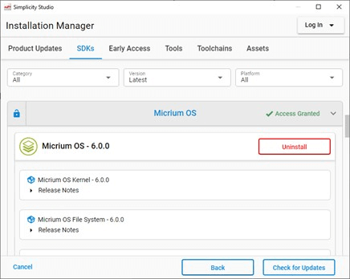
</p>

请按照以下步骤将 **Micrium OS Kernel** 组件添加到 **SOC-Empty** 示例项目。

1. 双击 Simplicity Studio Project Explorer 中的 `soc_empty.slcp` 文件，然后单击顶部的 **SOFTWARE COMPONENTS** 选项卡，打开 Software Components Configuration 工具。
2. 在右上角的搜索字段中搜索 **micrium**。（可选）选中 **Configurable Components** 复选框以缩短组件列表。
3. 在左窗格中选择 **Micrium OS Kernel**，然后单击 **Install**，如下图所示。<p>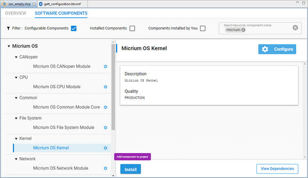</p>

**Micrium OS Kernel** 组件将 Micrium RTOS 支持添加到 **SOC-Empty** 示例项目，并将该项目配置为在多任务中运行 Bluetooth 协议栈。这些任务将在下一节中讨论。

# 2. 系统架构

具有 Micrium RTOS 支持的 **SOC-Empty** 示例应用需要若干任务才能运行：

* Link Layer Task
* Bluetooth Host Task
* Event Handler Task
* Idle Task

Silicon Labs 已为 Micrium RTOS 实施了这些任务。

## 2.1 任务间通信

在描述任务之前，重要的是要了解任务之间的通信方式。应用程序中的任务通过使用多个标志相互同步。下表总结了这些标志：

<table>
<thead>
  <tr>
    <th>FLAG</th>
    <th>Sender</th>
    <th>Receiver</th>
    <th>Purpose</th>
  </tr>
</thead>
<tbody>
  <tr>
    <td style="white-space: nowrap"><code>SL_BT_RTOS_EVENT_FLAG_STACK</code></td>
    <td style="white-space: nowrap">Link Layer Task</td>
    <td style="white-space: nowrap">Bluetooth Host Task</td>
    <td style="white-space: nowrap">Bluetooth stack needs an update, call <code>sl_bt_pop_event()</code></td>
  </tr>
  <tr>
    <td style="white-space: nowrap"><code>SL_BT_RTOS_EVENT_FLAG_LL</code></td>
    <td style="white-space: nowrap">Radio Interrupt</td>
    <td style="white-space: nowrap">Link Layer Task</td>
    <td style="white-space: nowrap">Link Layer needs an update, call <code>sl_bt_priority_handle()</code></td>
  </tr>
  <tr>
    <td style="white-space: nowrap"><code>SL_BT_RTOS_EVENT_FLAG_CMD_WAITING</code></td>
    <td style="white-space: nowrap">Event Handler<br>and<br>Application Tasks</td>
    <td style="white-space: nowrap">Bluetooth Host Task</td>
    <td style="white-space: nowrap">Command is ready in shared memory, call <code>sli_bt_cmd_handler_delegate()</code></td>
  </tr>
  <tr>
    <td style="white-space: nowrap"><code>SL_BT_RTOS_EVENT_FLAG_RSP_WAITING</code></td>
    <td style="white-space: nowrap">Bluetooth Host Task</td>
    <td style="white-space: nowrap">Event Handler<br>and<br>Application Tasks</td>
    <td style="white-space: nowrap">Response is ready in shared memory.</td>
  </tr>
  <tr>
    <td style="white-space: nowrap"><code>SL_BT_RTOS_EVENT_FLAG_EVT_WAITING</code></td>
    <td style="white-space: nowrap">Bluetooth Host Task</td>
    <td style="white-space: nowrap">Event Handler Task</td>
    <td style="white-space: nowrap">Event is ready in shared memory.</td>
  </tr>
  <tr>
    <td style="white-space: nowrap"><code>SL_BT_RTOS_EVENT_FLAG_EVT_HANDLED</code></td>
    <td style="white-space: nowrap">Event Handler Task</td>
    <td style="white-space: nowrap">Bluetooth Host Task</td>
    <td style="white-space: nowrap">Event is handled and shared memory is free to use for next event.</td>
  </tr>
</tbody>
</table>

下图说明了如何在同步任务中使用这些标志。

除了这些标志之外，gecko 命令处理程序还使用互斥量使其具有线程安全性。这样就可以从多个任务中调用 BGAPI 命令了。

<p>
  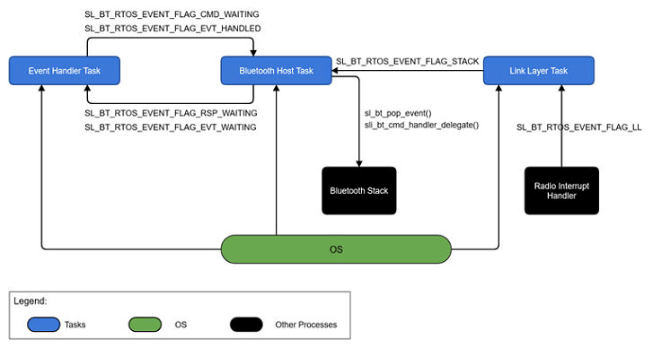
</p>

## 2.2 Link Layer Task

该任务的目的是更新较高的链路层。Link Layer Task 在运行之前等待 `SL_BT_RTOS_EVENT_FLAG_LL` 标志被设置。通过调用 `sl_bt_priority_handle()` 更新较高的链接层。`SL_BT_RTOS_EVENT_FLAG_LL` 标志由 `sli_bt_rtos_11_callback()` 设置，它是一个在协议栈配置中为 `scheduler_callback` 指定的回调函数。该回调在一个 kernel-aware 中断处理程序（较低的链接层）中被调用。该任务具有最高优先级。

## 2.3 Bluetooth Host Task

该任务的目的是更新 Bluetooth 协议栈、发出事件并处理命令。该任务在运行之前等待 `SL_BT_RTOS_EVENT_FLAG_STACK`、`SL_BT_RTOS_EVENT_FLAG_CMD_WAITING` 和 `SL_BT_RTOS_EVENT_FLAG_EVT_HANDLED` 标志中的任何一个被设置。`SL_BT_RTOS_EVENT_FLAG_STACK` 标志由 `sli_bt_rtos_stack_callback()` 设置，该函数是在协议栈配置中为 `stack_schedule_callback` 指定的回调函数。此任务的优先级高于 Event Handler Task 和任何 Application Task，但低于 Link Layer Task。

在此任务开始运行之前，它将为应用程序运行 Bluetooth 协议栈作准备。此任务调用 `sl_bt_init()` 初始化和配置 Bluetooth 协议栈，然后调用 `sl_bt_rtos_create_tasks()` 创建 Link Layer Task 和 Event Handler Task。

### 2.3.1 更新协议栈

Bluetooth 协议栈必须定期更新。Bluetooth Host Task 通过调用 `sl_bt_event_pending()` 更新协议栈，并通过调用 `sl_bt_pop_event()` 从协议栈中读取下一个协议栈事件。这使协议栈可以处理来自链路层的消息以及它自己的内部消息，以执行其需要执行的定时操作。

### 2.3.2 发出事件

Bluetooth Host Task 设置 `SL_BT_RTOS_EVENT_FLAG_EVT_WAITING` 标志，以向 Event Handler Task 指示一个事件已准备被检索。一次只能检索一个事件。检索事件后，Event Handler Task 会清除 `SL_BT_RTOS_EVENT_FLAG_EVT_WAITING` 标志。Event Handler Task 会设置 `SL_BT_RTOS_EVENT_FLAG_EVT_HANDLED` 标志，以指示事件处理已完成。

### 2.3.3 命令处理

命令可能由多个任务发送到协议栈。对这些命令的响应将转发到调用任务。命令和响应与 `SL_BT_RTOS_EVENT_FLAG_CMD_WAITING` 和 `SL_BT_RTOS_EVENT_FLAG_RSP_WAITING` 标志以及 `BluetoothMutex` 互斥量同步。

名为 `sli_bt_cmd_handler_delegate()` 的辅助函数准备命令，并将其发送到协议栈。任何 BGAPI 函数都调用此函数，并通过使用互斥量使其可重入。该函数通过在互斥量上挂起而开始。当它获得对互斥量的控制后，便会准备好命令并将其放入共享内存中，然后设置 `SL_BT_RTOS_EVENT_FLAG_CMD_WAITING` 标志以向协议栈指示正在等待处理命令。Bluetooth Host Task 清除此标志，以指示该命令已发送到协议栈，并且现在可以安全地发送另一个命令。

然后执行挂起在 `SL_BT_RTOS_EVENT_FLAG_RSP_WAITING` 标志上，该标志由 Bluetooth Host Task 在执行命令时设置。这表明对命令的响应正在等待。最后，互斥量被释放。

下图展示了 Bluetooth Host Task 的运行方式。

<p>
  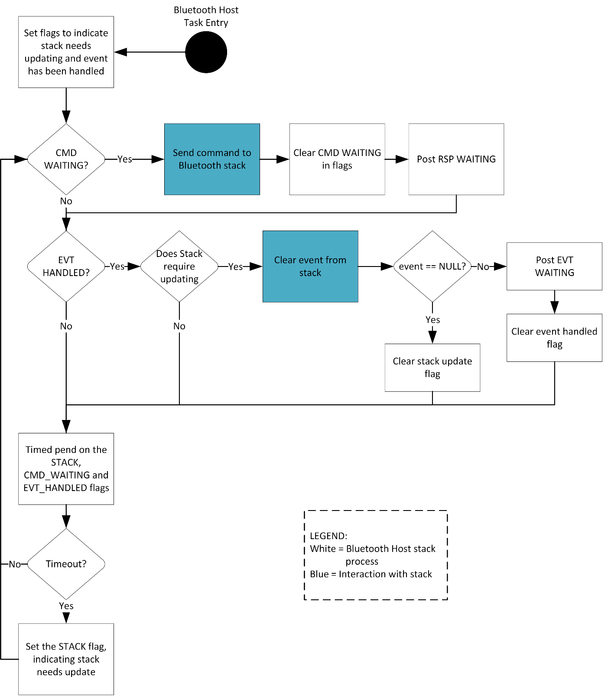
</p>

1. 在任务启动时，设置 `SL_BT_RTOS_EVENT_FLAG_STACK` 以指示协议栈需要更新，并且设置 `SL_BT_RTOS_EVENT_FLAG_EVT_HANDLED` 标志以指示当前未处理任何事件。
2. 如果设置了 `SL_BT_RTOS_EVENT_FLAG_CMD_WAITING` 标志，则调用 `sli_bt_cmd_handler_delegate()` 处理该命令。
3. 如果设置了 `SL_BT_RTOS_EVENT_FLAG_STACK` 和 `SL_BT_RTOS_EVENT_FLAG_EVT_HANDLED` 标志，则调用 `sl_bt_pop_event()` 从协议栈中获取事件。如果发现事件正在等待，则设置 `SL_BT_RTOS_EVENT_FLAG_EVT_WAITING` 标志，并清除 `SL_BT_RTOS_EVENT_FLAG_EVT_HANDLED` 标志，以向 Event Handler Task 指示事件已准备好处理，并向 Bluetooth Host Task 指示当前正在处理事件。否则，将清除 `SL_BT_RTOS_EVENT_FLAG_STACK` 标志，以指示协议栈不需要更新。
4. 此时，任务将检查协议栈是否需要更新以及是否有任何事件正在等待处理。如果没有等待处理的事件，并且协议栈不需要更新，则可以安全进入睡眠状态，并且 Bluetooth Host Task 会对 `SL_BT_RTOS_EVENT_FLAG_EVT_HANDLED` 和 `SL_BT_RTOS_EVENT_FLAG_CMD_WAITING` 标志进行挂起。
5. 无限重复执行步骤 2 - 4。

## 2.4 Event Handler Task

该任务的目的是处理 Bluetooth 协议栈发送的事件。此任务等待 `SL_BT_RTOS_EVENT_FLAG_EVT_WAITING` 标志被设置。该标志由 Bluetooth Host Task 设置，以指示存在等待处理的事件。设置此标志后，将调用 `sl_bt_process_event()` 处理事件。最后，设置 `SL_BT_RTOS_EVENT_FLAG_EVT_HANDLED` 标志以向 Bluetooth Host Task 指示已处理该事件，并且 Event Handler Task 已准备好处理下一个事件。此任务的优先级低于 Bluetooth Host Task 和 Link Layer Task。

此任务为 user-type OTA control characteristic 处理 `gatt_server_user_write_request` 事件，并将设备引导至 OTA DFU 模式。然后，此任务将事件调度到 `sl_bt_on_event()`，该事件需要集成到应用程序中。

## 2.5 Idle Task

当没有任务准备运行时，OS 将调用 Idle Task。Idle Task 默认情况下将 MCU 置于最低可用睡眠模式（EM2）。

# 3. 应用程序集成

本节描述了 Bluetooth Event Handler 和 Application Task，以及如何使用它们来实现示例 Bluetooth 设备。

## 3.1 Bluetooth Event Handler

Bluetooth Event Handler 在 `sl_bt_on_event()` 中实现（Event Handler Task 的一部分）（采用指向事件的指针并进行相应的处理）。可在 Silicon Labs Bluetooth API Documentation（参见 [4. 其他资源](#4-其他资源)）中找到事件的完整列表。由协议栈触发的某些事件主要是提供信息的，不需要应用程序执行任何操作。因为这是一个简单的应用程序，所以它仅处理少量事件，如下所示：

* `system_boot`：此事件表示 Bluetooth 协议栈已初始化并准备接收命令。在这里设置可发现性和可连接性模式。
* `connection_closed`：关闭连接时触发此事件。在该事件下，广告将重新启动以允许将来的连接。

## 3.2 自定义应用程序

本节介绍一些常见的任务，如自定义 GATT attribute、添加事件处理程序以及添加对其他外设的支持。

### 3.2.1 GATT Service 和 Characteristic

本节介绍如何添加 Service 和 Characteristic 以控制 Wireless Starter Kit 上的 LED。Bluetooth GATT Configurator 是一个 Simplicity Studio 随附的工具。该工具提供了用于创建和编辑 GATT 数据库的图形界面。

1. 在 Simplicity Studio Project Explorer 中双击文件 `config/btconf/gatt_configuration.btconf` 以打开 Bluetooth GATT Configurator。这将显示如下窗口。<p>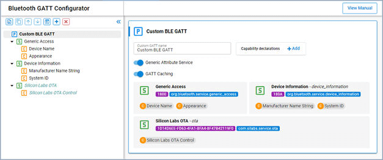</p>
2. 创建新 Service：在左窗格中选择 **Custom BLE GATT**，将鼠标悬停在该按钮上，然后单击左上角的添加新项下拉列表。然后选择 **New Service**。<p>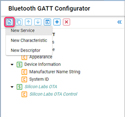</p>
3. 选择所创建的自定义 Service，并将 Service 命名为 **Lighting Control**，如下图所示。<p>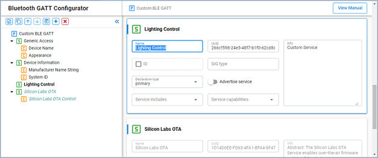</p>
4. 添加 Characteristic：
  <ul>
  <li>选择 <strong>Lighting Control</strong> Service，将鼠标悬停在按钮上，然后单击添加新项下拉菜单，然后选择 <strong>New Characteristic</strong>。</li>
  <li>选择所创建的自定义 Characteristic，并在右侧将 Characteristic 命名为 <strong>LED0</strong>。</li>
  <li>选中 <strong>id</strong> 复选框，然后输入 <strong>LED0</strong> 作为 ID。</li>
  <li>设置 <strong>User value</strong> 切换开关。</li>
  <li>在 <strong>Permission settings</strong> 部分，设置 <strong>Read</strong> 和 <strong>Write</strong> 切换开关。</li>
  </ul>
  <br>现在，该 Characteristic 应如下图所示。<p>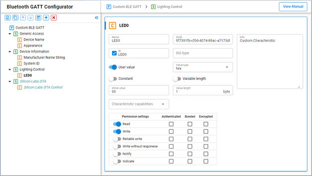</p>
5. 单击 **Save**，Simplicity Studio 将自动更新生成的源代码。

### 3.2.2 事件处理程序

本节讨论如何添加事件处理程序，以读取和写入在 [3.2.1 GATT Service 和 Characteristic](#321-gatt-service-和-characteristic) 中添加的 GATT Characteristic。该 Characteristic 具有写和读权限。这是一种用户类型，因此应用程序需要处理以下事件：

* `gatt_server_user_write_request`
* `gatt_server_user_read_request`

需要 Simple LED Driver 组件才能访问 Wireless Starter Kit 上的 LED。Simplicity Studio 提供了 Software Components Configuration 工具来管理驱动程序和 API 组件。

1. 双击 Simplicity Studio Project Explorer 中的 `soc_empty.slcp` 文件，然后单击顶部的 **SOFTWARE COMPONENTS** 选项卡，以打开 Software Components Configuration 工具。
2. 在右上角的搜索字段中搜索 **led**。在左窗格中选择 **Simple LED Driver**，然后单击 **Install**，如下图所示。<p>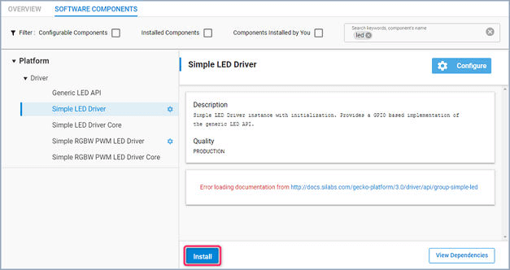</p>
3. 将弹出一个 Create A Component Instance 窗口。保留默认实例名称 **led0** 不变，然后单击 **Done**。
4. 单击 **Add New Instances**。将弹出一个 Create A Component Instance 窗口。
5. 保留默认实例名称为 **led1**，然后单击 **Done**。现在看起来应该如下图所示。<p>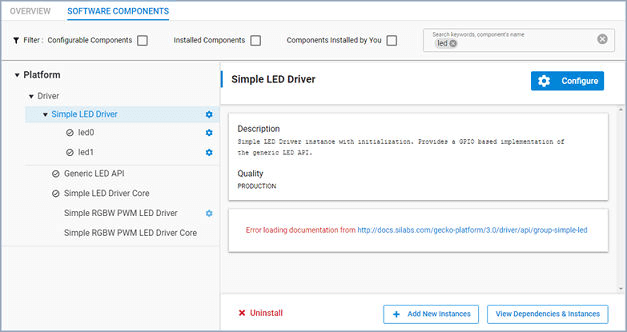</p>

创建 Simple LED Driver 组件的 **led0** 和 **led1** 实例后，将自动安装并打开 LED 驱动程序。该应用程序可以通过调用 LED API 直接访问 LED0 和 LED1。

在 `app.c` 中添加以下代码，以包含具有用于设置和清除 LED 的函数声明的头文件。

```c
#include "sl_simple_led_instances.h"
```

如 [3.1 Bluetooth Event Handler](#31-bluetooth-event-handler) 中所述，应在 `sl_bt_on_event()` 中处理应用程序的 Bluetooth 事件。添加以下代码以实现用户写请求处理程序。

```c
case sl_bt_evt_gatt_server_user_write_request_id:
    if (evt->data.evt_gatt_server_user_write_request.characteristic == gattdb_LED0) {
        if (evt->data.evt_gatt_server_user_write_request.value.data[0]) {
            sl_led_turn_on(&sl_led_led0);
        } else {
            sl_led_turn_off(&sl_led_led0);
        }
        sl_bt_gatt_server_send_user_write_response(
            evt->data.evt_gatt_server_user_write_request.connection,
            evt->data.evt_gatt_server_user_write_request.characteristic,
            0);
    }
break;
```

该事件处理程序验证要写入的 Characteristic 为 LED0 Characteristic，然后根据写入的数据打开或关闭 LED0。最后，它将响应发送到远程 GATT 客户端，以指示已执行写操作。

添加以下代码以实现用户读取请求处理程序。

```c
case sl_bt_evt_gatt_server_user_read_request_id:
    if(evt->data.evt_gatt_server_user_read_request.characteristic == gattdb_LED0) {
        led0_state = sl_led_get_state(&sl_led_led0);
        sl_bt_gatt_server_send_user_read_response(
            evt->data.evt_gatt_server_user_read_request.connection,
            evt->data.evt_gatt_server_user_read_request.characteristic,
            0,
            1,
            &led0_state,
            &sent_len);
    }
break;
```

该事件处理程序将 LED0 的状态发送到客户端。事件处理需要在 `sl_bt_on_event()` 中声明的两个变量 `led0_state` 和 `send_len`，如以下代码所示。

```c
uint8_t led0_state = 0;
uint16_t sent_len = 0;
```

根据您的应用程序的需要，您可以按照这种方式为其他事件添加类似的处理程序。在 `sl_bt_on_event()` 中实现的事件处理程序应快速完成其工作。如果您的应用程序需要执行繁重或异步的工作，则您可能需要创建其他应用任务来进行这些工作。这将在 [3.3 添加应用任务](#33-添加应用任务) 中讨论。

### 3.2.3 添加对其他外设的支持

添加对其他外设的支持的最简单方法是使用 Silicon Labs 的 emlib/emdrv 外设库。这些库包含用于初始化和控制 EFR32 系列的外设的 API。在 [4. 其他资源](#4-其他资源) 中可以找到这些库的文档链接。

这些库被打包成软件组件，并包含在 Silicon Labs Gecko Platform SDK 中。通过使用 Software Components Configuration 工具，您可以轻松地将外设驱动程序和库添加到项目中。该工具还可以解决依赖关系，并自动安装外设组件所需的组件。

## 3.3 添加应用任务

您可能需要在 Bluetooth 应用程序中添加应用任务，以简化应用程序的实现。当您的应用程序需要执行需要大量计算、无法及时响应或与 Bluetooth 事件无关的过程时，这将十分有用。本节演示 Wireless Starter Kit 上的 LED 闪烁，您将在其中学习如何在应用程序中创建应用任务。

要创建应用任务，需要将 Micrium RTOS 支持添加到 **SOC-Empty** 示例项目中。请按照 [1.2 Micrium OS 配置](#12-micrium-os-配置) 中的步骤安装 **Micrium OS Kernel** 组件。

将头文件包含在 `app.c` 中。

```c
#include "os.h"
```

要创建一个 Micrium RTOS 任务，您需要声明一个任务控制块（TCB，Task Control Block）、分配一个内存空间作为任务的栈、编写任务代码，并设置 `OSTaskCreate()` API 所需的参数（如任务名称和优先级）。任务的优先级在应用程序中必须是唯一的，并且必须低于 Link Layer Task、Bluetooth Host Task 和 Event Handler Task 的优先级。数字越小，优先级越高。因此，Silicon Labs 建议您为应用程序任务指定大于或等于 **10** 的优先级数字。

在 `app.c` 的全局作用域中添加以下代码。

```c
//Application task
#define SL_BT_RTOS_APPLICATION_PRIORITY     10u

#ifndef APPLICATION_STACK_SIZE
#define APPLICATION_STACK_SIZE  (1000 / sizeof(CPU_STK))
#endif

static void ApplicationTask (void *p_arg);
static OS_TCB ApplicationTaskTCB;
static CPU_STK ApplicationTaskStk[APPLICATION_STACK_SIZE];
```

在 `app_init()` 中添加以下代码以创建任务。

```c
RTOS_ERR os_err;

//Application task
OSTaskCreate(&ApplicationTaskTCB,
             "Application Task",
             ApplicationTask,
             0u,
             SL_BT_RTOS_APPLICATION_PRIORITY,
             &ApplicationTaskStk[0u],
             APPLICATION_STACK_SIZE / 10u,
             APPLICATION_STACK_SIZE,
             0u,
             0u,
             0u,
             (OS_OPT_TASK_STK_CHK | OS_OPT_TASK_STK_CLR),
             &os_err);
```

然后，在 `ApplicationTask()` 中编写任务的代码。任务通常无穷地运行，并且在完成后需要让其他任务运行。一个执行产出（yield）意味着将释放 CPU 时间来执行其他任务。这通常是通过调用时间或事件 API 来实现的。以下代码是每秒打开或关闭 LED1 的任务实现。

```c
//Application task
static void ApplicationTask (void *p_arg)
{
    RTOS_ERR os_err;
    (void)p_arg;

    while (DEF_TRUE) {
        // Put your application code here!
        OSTimeDlyHMSM(0, 0, 1, 0,
                      OS_OPT_TIME_DLY | OS_OPT_TIME_HMSM_NON_STRICT,
                      &os_err);
        sl_led_toggle(&sl_led_led1);
    }
}
```

## 3.4 实现时间和事件驱动的任务

任务可以是时间驱动的、事件驱动的、也可以是时间和事件驱动的。该模型确定何时执行该过程：

1. 定时器到期。
2. 发生事件。
3. 1 或 2。

Link Layer Task、Bluetooth Host Task 和 Event Handler Task 是事件驱动的，而在 [3.3 添加应用任务](#33-添加应用任务) 中演示的 LED 切换任务是时间驱动的。

[3.3 添加应用任务](#33-添加应用任务) 中演示的 LED 切换任务是一个很好的示例，可以将其更改为时间和事件驱动的任务。此任务调用时间 API 使其在特定时间段内挂起。时间和事件驱动的任务需要支持超时的事件 API，因此任务会暂停执行，直到事件发生或超时到期为止。本节将根据是否按下 Wireless Starter Kit 上的按钮来演示 LED 如何以不同的频率闪烁。

需要 Simple Button Driver 组件才能访问 Wireless Starter Kit 上的按钮。请按照 [3.2.2 事件处理程序](#322-事件处理程序) 中的步骤安装组件，并在 Software Components Configuration 工具中创建 **btn0** 和 **btn1** 实例，如下图所示。

<p>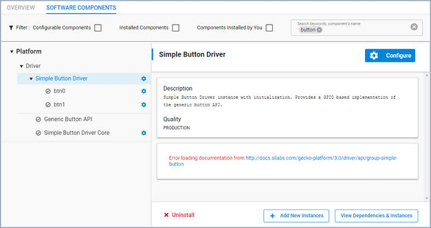</p>

在 `app.c` 中添加以下代码，以包含具有声明按钮状态已更改的回调函数的头文件。

```c
#include "sl_simple_button_instances.h"
```

该演示使用 Micrium Event Flag Management API 进行任务间通信。Event Flag Management 的原理是一个任务等待一个事件标志组中的一个或多个标志被设置，而另一个任务在发生相应事件时在同一事件标志组中设置一个标志。标志（Flag）是一个 32-bit 变量的一部分。因此，标志是一种位模式，即 32-bit 变量的位组合。

使用事件标志组执行任务的最简单方法是将其声明为全局变量。在 `app.c` 的全局作用域中添加以下代码。

```c
OS_FLAG_GRP application_event_flags;

#define APPLICATION_EVENT_FLAG_BTN_ON   ((OS_FLAGS)1)
#define APPLICATION_EVENT_FLAG_BTN_OFF  ((OS_FLAGS)2)
```

在创建 Application Task 之前，在 `app_init()` 中添加以下代码以创建事件标志组。

```c
OSFlagCreate(&application_event_flags,
             "Application Flags",
             (OS_FLAGS)0,
             &os_err);
```

接下来，按照以下说明在 `ApplicationTask()` 中修改任务的代码。该任务调用 `OSFlagPend()` 暂停执行，并等待 `APPLICATION_EVENT_FLAG_BTN_ON` 和 `APPLICATION_EVENT_FLAG_BTN_OFF` 标志中的任何一个被设置。如果设置了任何标志或超时 `interval_ms` 到期，任务将继续执行。因此，当标志未设置时，任务以周期性间隔切换 LED1，并在设置标志时更改间隔。

如果要在此示例中实现事件驱动的任务，请以 0 作为第三个参数调用 `OSFlagPend()`，该任务将永远等待直到任何标志被设置。

```c
//Application task
static void ApplicationTask (void *p_arg)
{
    RTOS_ERR os_err;
    (void)p_arg;
    uint32_t interval_ms;
    OS_RATE_HZ tick_rate;
    OS_FLAGS flags;

    tick_rate = OSTimeTickRateHzGet(&os_err);
    interval_ms = 1 * tick_rate;

    while (DEF_TRUE) {
        // Put your application code here!
        flags = OSFlagPend(&application_event_flags,
                           (OS_FLAGS)APPLICATION_EVENT_FLAG_BTN_ON + APPLICATION_EVENT_FLAG_BTN_OFF,
                           interval_ms,
                           OS_OPT_PEND_BLOCKING + OS_OPT_PEND_FLAG_SET_ANY + OS_OPT_PEND_FLAG_CONSUME,
                           NULL,
                           &os_err);
        if (flags & APPLICATION_EVENT_FLAG_BTN_ON) {
            interval_ms = tick_rate / 5;    //200ms
            flags &= ~APPLICATION_EVENT_FLAG_BTN_ON;
        }
        if (flags & APPLICATION_EVENT_FLAG_BTN_OFF) {
            interval_ms = 1 * tick_rate;    //1s
            flags &= ~APPLICATION_EVENT_FLAG_BTN_OFF;
        }
        sl_led_toggle(&sl_led_led1);
    }
}
```

最后，在回调函数 `sl_button_on_change()` 中编写代码以设置标志。当 Button0 或 Button1 的状态更改时，按钮驱动程序将调用此函数。该函数在按下按钮时设置 `APPLICATION_EVENT_FLAG_BTN_ON` 标志，并在释放按钮时设置 `APPLICATION_EVENT_FLAG_BTN_OFF` 标志。该代码应如下所示。

```c
void sl_button_on_change(const sl_button_t *handle)
{
    RTOS_ERR os_err;

    if (sl_button_get_state(handle) == SL_SIMPLE_BUTTON_PRESSED) {
        OSFlagPost(&application_event_flags,(OS_FLAGS)APPLICATION_EVENT_FLAG_BTN_ON,OS_OPT_POST_FLAG_SET,&os_err);
    } else if (sl_button_get_state(handle) == SL_SIMPLE_BUTTON_RELEASED) {
        OSFlagPost(&application_event_flags,(OS_FLAGS)APPLICATION_EVENT_FLAG_BTN_OFF,OS_OPT_POST_FLAG_SET,&os_err);
    }
}
```

现在，按下或释放按钮时，LED 切换任务是事件驱动的。当没有按钮被按下或释放时，它是时间驱动的。这将证明：

1. LED1 每秒钟闪烁一次。
2. 按下按钮并保持按下状态时，LED1 每 0.2 秒闪烁一次。
3. 释放按钮时，LED1 恢复每秒闪烁一次。

# 4. 其他资源

请查阅以下资源以获取其他信息。

* [Silicon Labs Bluetooth API Documentation](https://docs.silabs.com/bluetooth/latest/)
* [Silicon Labs Bluetooth C Developer's Guide](https://docs.silabs.com/bluetooth/latest/general/c-developer39s-guide)
* [Silicon Labs Platform Documentation](https://docs.silabs.com/)
* [Micriµm OS Documentation](https://doc.micrium.com/display/OSUM50800)
