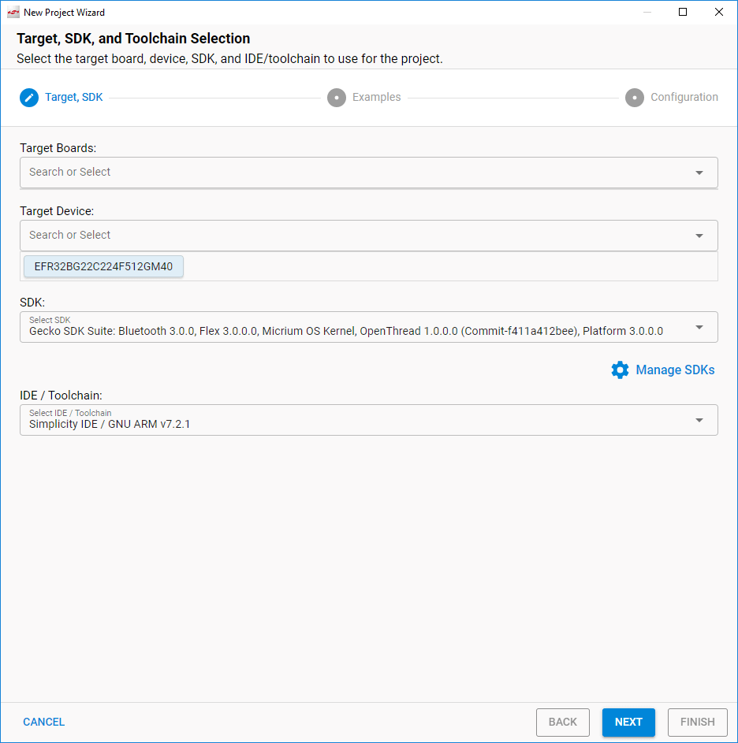

# AN1267: Radio Frequency Physical Layer Evaluation in Bluetooth® SDK v3.x (Rev. 0.1) <!-- omit in toc -->

- [1. DTM 基础](#1-dtm-基础)
- [2. 在 DTM 框架中启用的测试](#2-在-dtm-框架中启用的测试)
- [3. 使用 BGTool 进行测试](#3-使用-bgtool-进行测试)
- [4. 使用 DTM 2-Wire 固件进行测试](#4-使用-dtm-2-wire-固件进行测试)
  - [4.1 连接并使用 Bluetooth 测试仪进行测试](#41-连接并使用-bluetooth-测试仪进行测试)
  - [4.2 测试设备注意事项](#42-测试设备注意事项)
- [4.3 自定义 SOC - DTM 应用程序](#43-自定义-soc---dtm-应用程序)
- [5. 使用 BGAPI 命令 test_dtm_tx 和 test_dtm_rx 测试示例](#5-使用-bgapi-命令-test_dtm_tx-和-test_dtm_rx-测试示例)
  - [5.1 Output Power—RF-PHY/TRM/BV-01-C](#51-output-powerrf-phytrmbv-01-c)
  - [5.2 Modulation—RF-PHY/TRM/BV-05-C and RF-PHY/TRM/BV-06-C](#52-modulationrf-phytrmbv-05-c-and-rf-phytrmbv-06-c)
  - [5.3 Spectrum—RF-PHY/TRM/BV-03-C](#53-spectrumrf-phytrmbv-03-c)
  - [5.4 Receiver Tests](#54-receiver-tests)

本应用笔记概述了如何使用 Silicon Labs 的软件工具和专用工具，对具有 Bluetooth-enabled EFR32xG SoC 和 BGM/MGM Module 执行 Bluetooth-based RF（radio frequency）PHY（physical layer）评估。Bluetooth 设备的 RF 参数使用一个称为 DTM（Direct Test Mode）的协议进行验证。 *Bluetooth Core Specification versions 5.x, Volume 6, Part F* 中描述了 DTM。

可以通过三种方式执行测试：

* 通过 host 系统（通过 SoC 或 Module 的 host 接口）发出的 DTM 测试命令。
* 通过由运行在 SoC 或 Module 本身中的自定义 application 发出的 DTM 测试命令。这种命令可以由自定义 application 自动启动（如在启动时或在远程伙伴设备通过 Bluetooth LE 连接写入专用的 GATT characteristic 后）。
* 在专用的固件支持的特殊测试环境中，该固件允许测试设备控制测试目标。

利用这些选项，客户可以全面评估发射和接收性能，并测试其开发套件硬件或自定义硬件的 RF 功能。实验室测试需要 RF 测试仪器（如频谱分析仪和 RF 信号发生器，和/或 Bluetooth 测试仪）。

# 1. DTM 基础

Bluetooth specification 定义了一种机制，称为 DTM（Direct Test Mode），用于测试 Bluetooth low energy 设备的无线电性能。Bluetooth Core Specification 中对此机制进行了描述（如 *Bluetooth Core Specification versions 4.2, Volume 6, Part F* 和 *Bluetooth Core Specification versions 5.2, Volume 6, Part F* ，它们可以从 [https://www.bluetooth.com/specifications/bluetooth-core-specification](https://www.bluetooth.com/specifications/bluetooth-core-specification) 中获得）。DTM 用于验证 Bluetooth low energy 设备的 RF PHY，从而保证最终产品的互操作性和性能质量。与任何实施无线标准化技术的设备一样，RF 测试对于 Bluetooth 设备来说是必不可少的，因为在产品发布之前，必须仔细评估和验证诸如完全符合互操作性规范以及符合通信法规等因素。另外，可能需要在生产过程中评估产品的性能。在整个生产周期中以标准化的方式来完成 RF 测试是非常有用。

DTM 提供了两种用于 RF PHY 测试的方法。第一，上层测试器（Upper Tester）可以在 DUT（Device Under Test）的标准 HCI（host control interface）接口上输入特殊的 HCI 命令，以启动和停止 DUT 上的无线电测试。第二，上层测试器可以通过专用的 2-wire 连接直接访问 DUT，并且可以根据自动化测试例程自动启动和停止 DUT 上的无线电测试。

使 DUT 与上层测试器之间能够通信的 DTM 协议还规定了 DUT 中的反馈，其形式是对给定命令的确认，或者是在测试停止时报告的数据包计数信息。

下层测试器（Lower Tester）或 RF PHY 测试器也是测试设置的一部分，并且它是测量 RF 活动和性能的实际实验室仪器。RF PHY 测试器可以是单独的设备（如频谱分析仪），通常与第一种方法（由通用 host 系统发出 HCI 命令）一起使用，也可以是同一设备的一部分。在后一种情况下，RF PHY 测试器还可以用作上层测试器（如商用 Bluetooth 测试仪和本文档稍后引用的测试仪）。

Bluetooth-enabled Silicon Labs EFR32xG SoC 和 BGM/MGM Module 支持上述两种方法。可以加载特殊固件以启用 2-wire DTM，并允许上层测试器完全控制 SoC 或 Module。2-wire 链路是一个 UART-like 连接，其没有流控制、波特率在 1200 - 115200 之间，传输格式为 8N1（8 个数据位、无奇偶校验、1 个停止位）。另一种替代方案是，可以使用将设备配置为在 NCP（Network Co-Processor）mode 下运行的固件，因为 host 系统可以通过同一 host 接口（通常用于实现 BGAPI 协议，以控制和配置设备的常规 Bluetooth LE 功能）发出 BGAPI Bluetooth API 随附的测试命令。请注意，在这种情况下，将发送 BGAPI-formatted 测试命令，而不是发送标准中定义的 HCI 命令。这些 BGAPI 命令随后在内部作为 HCI 命令处理。SDK 不包含任何特殊的固件或配置来禁用 BGAPI DTM 命令/响应和使用原始的 HCI 命令/响应。

# 2. 在 DTM 框架中启用的测试

DTM 启用了一组 RF PHY 测试用例，这由 Bluetooth SIG（Special Interest Group）在 [https://www.bluetooth.com/specifications/qualification-test-requirements](https://www.bluetooth.com/specifications/qualification-test-requirements) 网站发布的称为“TCRL Release Table” and “Core - Test Requirements”的文档定义。

能力测试（在标准的 ISO 子组中定义）按代表协议服务、功能模块和目的的级别和分组进行组织，后者按发射器和接收器的工作条件划分。所有相关的 RF PHY 测试均符合测试规范 RF-PHY.TS.5.1.1 或更新的 RF-PHY.TS.p15，并显示在称为 `Core.TCRL.2019-2.xlsx` 的 Excel 文件的 RF-P 表中，该文件可在 `2019-2 TCRLs_2020-01-15_HFP1.8.zip` 中找到。

以下是物理层一致性测试用例的示例。它们由其标识符引用，其中 RF-PHY 表示 RF-PHY 测试目的，TRM 和 RCV 分别表示发射器和接收器测试。

* RF-PHY/TRM/BV-01-C [Output power]
* RF-PHY/TRM/BV-03-C [In-band emissions, uncoded data at 1 Ms/s]
* RF-PHY/TRM/BV-05-C [Modulation Characteristics, uncoded data at 1 Ms/s]
* RF-PHY/TRM/BV-06-C [Carrier frequency offset and drift, uncoded data at 1 Ms/s]
* RF-PHY/TRM/BV-08-C [In-band emissions at 2 Ms/s]
* RF-PHY/TRM/BV-10-C [Modulation Characteristics at 2 Ms/s]
* RF-PHY/TRM/BV-13-C [Modulation Characteristics, LE Coded (S=8)]


* RF-PHY/RCV/BV-01-C [Receiver sensitivity, uncoded data at 1 Ms/s]
* RF-PHY/RCV/BV-03-C [C/I and Receiver Selectivity Performance, uncoded data at 1 Ms/s]
* RF-PHY/RCV/BV-04-C [Blocking Performance, uncoded data at 1 Ms/s]
* RF-PHY/RCV/BV-05-C [Intermodulation Performance, uncoded data at 1 Ms/s]
* RF-PHY/RCV/BV-06-C [Maximum input signal level, uncoded data at 1 Ms/s]
* RF-PHY/RCV/BV-07-C [PER Report Integrity, uncoded data at 1 Ms/s]
* RF-PHY/RCV/BV-08-C [Receiver sensitivity at 2 Ms/s]
* RF-PHY/RCV/BV-10-C [Blocking performance at 2 Ms/s]
* RF-PHY/RCV/BV-27-C [Receiver sensitivity, LE Coded (S=8)]

上述所有测试都可以使用 EFR32xG SoC 和 BGM/MGM Module 执行，它们由 Silicon Labs Bluetooth stack 中内置的 DTM 实现提供支持。

> 注意：要完成规范中的全部测试，除了频谱分析仪外，还需要两个外部信号发生器来提供完整的干扰信号。

# 3. 使用 BGTool 进行测试

使用 EFR32xG SoC 和 BGM/MGM Module 执行 RF PHY 测试的一种简单方法是使用运行 BGTool 的 PC 作为上层测试器。SoC 或 Module 必须配置为在 NCP mode 下运行，并且必须安装 **Bluetooth > Feature > Test** 组件才能添加 DTM 命令。

*AN1259: Using the v3.x Silicon Labs Bluetooth® Stack in Network Co-Processor Mode* 讨论了 NCP 固件的基础知识、如何将其加载到设备上、并提供了一个示例来帮助您熟悉 NCP mode。它还包括有关如何通过 BGTool demo 开始控制和配置 Bluetooth 功能的说明。本章介绍了如何使用 BGTool 进行 RF PHY 测试，其中连接到 WSTK（Wireless Starter Kit）的无线板上的 SoC 或 Module 是示例 DUT，如下图所示。

<p>
    
</p>

启动 BGTool 并验证处于 NCP mode 的设备是否响应在 **Interactive view** 中输入的命令，接下来更换到 **RF regulatory test view** 。点击 **Open with the connected device** 。

<p>
    
</p>

下图所示的控制对话框将打开。根据所使用的 SDK，BGTool 可能会显示不同的视图和内容。

<p>
    
</p>

在此对话框中，您可以与设备进行交互并使用滑块和单选按钮设置 RF 测试参数。其提供了所有必需的配置选项：传输功率级别、工作频率、数据包类型和长度、以及是否执行发送或接收测试。

如果您打算使用默认发射功率以外的任何其他功率执行发射测试，请在启动下一个测试之前更改功率并点击 **Transmit power** 滑块旁边的 **Set** 。通常，默认值为固件允许的特定 SoC 或 Module 的最大值。点击 **Set** 会执行 BGAPI 的 `system_set_max_tx_power` 命令，该命令会更改功率值。

配置完测试的参数后，点击 **Start test** 。测试将一直运行，直到您点击 **Stop test** 。

根据所使用的 SDK，BGTool 可能会显示不同的视图和内容，例如在以下不存在固件上传部分的情况下。

下图显示了 BGTool 中所选的 PHY 选项、所选的 PN9 连续调制载波选项、以及将有效负载扩展到 255 byte。

<p>
    
</p>

当您点击 **Start test** 按钮时，BGTool 将通过设备的 host 接口发送一个 BGAPI 的 DTM 命令。命令参数对应于滑块和单选按钮的选择。下表总结了 BGAPI 的 DTM 命令。

<table title="Table 3.1. DTM Commands">
<thead>
  <tr>
    <th>Command</th>
    <th>Description</th>
  </tr>
</thead>
<tbody>
  <tr>
    <td><code>test_dtm_tx(packet_type, length, channel, phy)</code></td>
    <td>Starts a transmitter test. The DUT returns a response indicating that the command was received successfully. Shortly after this, a <code>test_dtm_completed</code> event is triggered, indicating that the command was processed by the radio and the actual test mode is started. At this point, the device is sending Bluetooth LE packets continuously at a fixed interval defined in the specification. The test is stopped using the <code>test_dtm_end</code> command, which is also followed by a <code>test_dtm_completed</code> event.<br><br>Only when a <code>test_dtm_completed</code> event follows the <code>test_dtm_end</code> command, the event's <code>number_of_packets</code> field carries the actual number of packets sent during the test.<br><br>The type and length of each packet is set by the <code>packet_type</code> and <code>length</code> parameters. The newest firmware versions add a parameter called <code>phy</code> that allows the selection of the PHY among 1M, 2M, 125k Coded, and 500k Coded, when supported by the DUT.<br><br>Note that a special packet type named <code>test_pkt_carrier</code> exists that can be used to transmit a continuous unmodulated carrier. The length field is ignored in this mode.<br><br>Another special packet type named <code>test_pkt_pn9</code> can be used to transmit a continuous modulated carrier instead, by means of a PN9 stream offering a 100% duty cycle.<br><br>In general, for the regulatory testing PRBS9 and/or the continuous modulated carrier are used, whereas the other two packet payloads are used when testing for the Bluetooth qualification.</td>
  </tr>
  <tr>
    <td><code>test_dtm_rx(channel, phy)</code></td>
    <td>Starts a receiver test. The procedure is similar to the transmitter test described above. When ending the test with the <code>test_dtm_end</code> command, the expected <code>test_dtm_completed</code> event from the device carries in its <code>number_of_packets</code> field the actual number of packets received during the test.
</td>
  </tr>
  <tr>
    <td><code>test_dtm_end()</code></td>
    <td>Can be issued at any time to end a transmitter or a receiver test. When the command is processed by the radio and the test has ended, a <code>test_dtm_completed</code> event is triggered.</td>
  </tr>
</tbody>
</table>

可以在 *Bluetooth Software API v3 Reference* 中找到这些命令及其相关响应以及上表中所提到的事件。

> 注意：一旦开始测试，常规的 Bluetooth LE 功能将不可用，换句话说，在测试运行期间将无法进行广告和扫描，并且类似地，不存在任何连接。

下图显示了实际测试中的命令、响应和事件的示例。

<p>
    
</p>

在此示例中，通过点击 **Start test** 来开始测试。开始 DTM 测试后，设备将仅接受通过点击 **Stop test** 输入的 `test_dtm_end` 命令。停止测试的唯一其他方法是复位设备或重启电源。

使用 BGTool 开始和停止测试的另一种方法是，在 BGTool 窗口底部的命令区域（标签为 **BGAPI commands**）中输入带有所需参数的命令。可以从 API 参考中复制粘贴此类命令，例如：

```
sl_bt_test_dtm_tx(0,37,19,1)
```

使用 BGTool 只是在实验室中执行 RF PHY 测试的方法之一。实际上，BGAPI 协议中的 DTM 命令也可用于任何能够通过设备的 host 接口发送 BGAPI 命令的 host MCU（如在实现基于 BGLib 库的 host 程序时）。

这些命令还可以由以 standalone mode 运行的 DUT 通过加载到 SoC/Module 上的自定义 C 程序来启动。用户可以从 **SOC-Empty** 示例项目开始，并对其进行自定义，以使其简单地在引导时自动启动测试命令，并通过硬复位或在定时器到期后终止测试命令。或者，该程序可以设计为允许一个传入的 Bluetooth LE 连接，远程设备可以通过该连接写入专用的 GATT characteristic。Characteristic 的内容将定义 application 应启动的测试命令，以及在终止事件（如允许下一个连接或复位）之前应运行的测试时间。

使用这种编程策略，客户通常会为其测试室准备多个固件映像，每个映像都包含在启动时启动特定测试的独立功能，然后简单地向测试室提供有关如何更改固件映像的说明。

**注意事项和限制**：

1. 本节中讨论的 DTM 测试旨在用于法规测试以及 Bluetooth 认证。所有测试的设计均满足由测试室制定的指导原则，以进行法规评估。
2. 在使用典型的 37 byte 有效负载的 1M PHY 传输测试期间，后续数据包传输以 625 µs 的间隔开始。在这种情况下，数据包传输本身持续 376 µs，导致占空比为 60.2%。这是因为测试中使用的数据包由报头（8 bit）加同步字（32 bit）加数据包类型字段（16 bit）加有效载荷（296 bit）加 CRC（24 bit）组成，air-interface 波特率为 1 Mbit/s，传输 1 bit 的时间为 1 µs。<br>根据 Core Specification version 4.2 中引入的 LE Data Packet Length Extension，可以使用 `test_dtm_tx` 命令配置的最大有效负载为最多为 255 byte。在最新的固件版本中给出了所有可能的 PHY 和数据包长度的组合，占空比实际上还将取决于数据包之间的间隔，该间隔不是固定的，而是根据 Core Specification version 4.2 and 5.x, in chapter “4.1.6 LE Test Packet Interval” of Volume 6, Part F 中的信息计算得出的。
3. 从本文档版本开始，不存在配置选项来定义在发出 `test_dtm_tx` 命令后设备将发送的数据包的固定数量。一个有用的用例是估算丢包：测试设置将使发射器发送一些事先已知的数据包，而接收器报告接收到的数据包数量（通过 `test_dtm_completed` 事件）。<br>这可以评估由于距离或其他条件导致的性能变化，或者可以在生产过程中用于验证刚刚生产的产品的质量。缺少这种配置选项的解决方法是让该单元仅在固定的时间内传输，这是通过考虑传输数据包的间隔来计算的：在 1M PHY and 37 bytes payload 示例中，将数据包之间的间隔设置为 625 µs，数据包速率为 1600 \[packets/s\]。

> 注意：目前，当用 `test_dtm_tx` 命令启动的测试模式停止时，`test_dtm_completed` 事件将报告在测试期间发送的实际数据包。在将协议栈发送的数据包的确切数量与接收器接收的实际数据包进行比较时，这对于精确估算 PER 很有用。2-wire 固件中的 DTM 通信响应不会报告已发送的数据包计数。

# 4. 使用 DTM 2-Wire 固件进行测试

如果有 Bluetooth 测试仪设备可用，则应将其用于评估 DUT 的 RF 性能，因为此类专用设备速度更快，并且可以提供自动化且准确的测试。之所以能够实现这些优势，是因为测试人员可以在完整 RF PHY 评估所需的所有测试中控制和配置 DUT。由于 DTM 2-wire 能力及其相关协议是 Bluetooth specification 的一部分，因此可以实现这种控制。

为了在商用 Bluetooth 测试仪（即具有 RF PHY 测量能力的上层测试器）和 DUT 之间启用 DTM 2-wire 通信，后者需要运行包含协议的特殊固件。可以通过 SimplicityStudio® 5（SSv5）在 Bluetooth SDK v3.x 中将这种特殊的 DTM 2-wire-capable 固件用作示例应用项目。本节概述了项目的创建和使用过程。假定您熟悉使用 SSv5 与 Bluetooth SDK v3.x 一起构建和刷写应用程序。有关这些过程的更多信息，可参考通过 SSv5 help 菜单获得的 online SSv5 User's Guide，或随 SDK 一起安装的 *QSG169: Bluetooth® SDK v3.x Quick Start Guide*。

要在 SSv5 中创建项目，请在 Launcher-perspective 中的 Debug Adapter 视图中选择正确的 DUT。这样可以正确地预先填充 Target Board 和 Target Device（SoC 或 Module）的设置。在 File 菜单中，选择 **New > Simplicity Studio Project Wizard** 。将打开 **Target, SDK and Toolchain Selection** 对话框。检查目标硬件、SDK 版本和 toolchain 是否正确。点击 **\[NEXT\]** 。

<p>
    
</p>

**Example Project Selection** 对话框将打开。使用 Technology Type 和 Keyword 过滤器搜索特定示例，在本例中为 **SoC – DTM** 。选中它，然后点击 **\[NEXT\]** 。

<p>
    
</p>

**Project Configuration** 对话框将打开。您不需要更改任何默认值。点击 **\[FINISH\]** 以创建 DTM 示例项目。

示例应用的配置如下：

* 通过设备的引脚启用了到 Bluetooth 测试仪的硬件链路，该引脚在其评估无线板上已映射到 WSTK 扩展接头的 UART TX（pin 12）和 UART RX（pin 14）。
* 链路使用的 UART 参数为 115200、8N1、无硬件流控制。

如果这些设置对您的 DUT 来说是正确的，则可以按原样使用示例应用。请参阅特定 SoC 或 Module 及其评估无线板的文档，以确定使用哪些引脚，以便将 DTM 信号路由到预期的扩展接头引脚。有关应用程序自定义的更多信息，请参阅 [4.3 自定义 SOC - DTM 应用程序](#4-3-自定义-SOC-DTM-应用程序)。

更改配置后（如有必要），构建应用程序映像并将其刷写到 DUT。如果应用程序无法正常运行甚至无法调试，则 DUT 中可能缺少 bootloader。编程 bootloader 的最简单方法是从 Launcher-perspective DEMOS-tab 中刷写预编译的 demo application (with bootloader)（如 Empty SoC），然后重新刷写 Soc Dtm 映像。

## 4.1 连接并使用 Bluetooth 测试仪进行测试

安装 DTM 固件后，就可以将 DUT 连线到 Bluetooth 测试仪，如下图所示。可以通过上层测试器接口（通常为 PC 软件）进行测试，如示例中所示，使用 Anritsu MT8852B 作为 Bluetooth 测试仪（[Figure 4.4 Connecting the Upper Tester to the DUT](#Figure-4.4) 至 [Figure 4.6 Receiver Measurements (PER)](#Figure-4.6)）。

<p>
    
</p>

首先，使用正确的参数建立与 DUT 的连接，如下图所示。

<p>
    
</p>

接下来，可以使用预先存在的脚本或自定义脚本来开始一组测试，如下图所示。在同一个图中，在完成自动测试之后，测试仪的 PC 程序会显示测试报告，总体结果为“Passed”。还要注意 **Script Setup** 框中的 **Fixed Offset** 字段，该字段可用于补偿功率损耗，例如在通过同轴天线电缆进行射频测试时。

<p>
    
</p>

任何商用 Bluetooth 测试仪都应能够测试 PER（Packet Error Rate）。在此测试配置中，上层测试器首先使用适当的 DTM 2-wire 命令将 DUT 配置为接收模式（用户在步骤 1 中进行测试配置后，将看到如下图所示的步骤 2），然后上层测试器开始发送用户在配置的 RF TX 功率级别时定义的数据包数量（步骤 3）。当用户结束测试时（步骤 4），将发送对应的 DTM 2-wire 命令到 DUT，与前面讨论的 BGAPI `test_dtm_completed` 事件类似，DUT 通过 2-wire 链路报告接收到的数据包，以便上层测试器可以根据规范计算 PER。

<p>
    
</p>

## 4.2 测试设备注意事项

某些 Bluetooth 测试仪（如本应用笔记中提到的 Anritsu MT8852B），使用 RS232 接口连接到 DTM 2-wire 的 DUT，这意味着，如在使用 DTM 固件和 WSTK 进行测试时，为了与设备的 TTL 逻辑交接，需要一个电平转换器。

某些 Bluetooth 测试仪无法生成功率低于一定值的 RF 信号（如本应用笔记中提到的 Anritsu MT8852B，功率值为 -90 dBm）。鉴于现代 SoC/Module 的接收器灵敏度要远远低于此灵敏度，因此可能需要使用衰减器进行适当的测试，以进一步降低在接收测试模式下定向至设备的信号的功率。

# 4.3 自定义 SOC - DTM 应用程序

通过配置 Software Component，可以配置设备的 2-wire UART 使用其他引脚和 UART 设置。

创建新项目时，默认情况下会打开 GATT Configurator。要转到 Project Configurator，请点击 `<project>.slcp` 选项卡，或在 Simplicity IDE Project Explorer 视图中双击 `<project>.slcp` 文件。点击 Software Components 选项卡。复选 Configurable Components 和 Installed Components 过滤器。在搜索框中输入“stream”。您应该只看到一个名为 **exp** 的 IO Stream 实现。选中 **exp**，然后点击 **\[Configure\]** 以打开 Component Editor。

<p>
    
</p>

您可以在此处配置波特率、引脚和其他参数。进行更改，然后关闭 Component Editor。所作的更改将自动保存。

<p>
    
</p>

除了配置组件外，您还可以在 Pin Tool 中更改配置。双击文件 `<project name>.pintool` 可将其打开。

<p>
    
</p>

您可以从 Configure 编辑器的 Pins 选项卡中更改引脚位置。选中一个引脚，然后下拉 Function 列表并选择一个功能。点击 Software Component 符号可以打开 Component Editor。在 Pin Tool 中所做的更改不会自动保存。

更改完成后，请编译并刷写以对其进行测试。

在 [Figure 4.1 Simplicity Studio 5 Target, SDK and Toolchain Selection Dialog](#Figure-4.1) 所示的 Simplicity Studio 快照中，带有 EFR32BG21 无线板的 WSTK 已连接到 PC。更常见的是使用自定义设计，而 Silicon Labs 的软件显然无法识别自定义板。在这种情况下，请按照本章开头所述开始创建 DTM 固件，但在 **Target, SDK and Toolchain Selection** 对话框中选择正确的 Target Device。Target Board 保留为空。检查 SDK，因为默认情况下它可能不正确，并检查 Toolchain。

<p>
    
</p>

如前所述继续进行过程。如上所述，UART 引脚很可能需要一些配置。

# 5. 使用 BGAPI 命令 test_dtm_tx 和 test_dtm_rx 测试示例

## 5.1 Output Power—RF-PHY/TRM/BV-01-C

基本功率测量用于进行所有输出功率测量。

在此示例中，使用了 `test_dtm_tx` 命令。

在此测试模式下，只有频率和输出功率是可配置的参数。

频谱分析仪用于测量无线电的功率，必须通过兼容的 RF 电缆连接到无线板的 RF 连接器。

当 DTM 固件安装在 DUT 中时，也可以使用单独的 Bluetooth 测试仪测试输出功率。

<p>
    
</p>

## 5.2 Modulation—RF-PHY/TRM/BV-05-C and RF-PHY/TRM/BV-06-C

用于进行调制、频率偏移和漂移测量。

在此示例中，使用了 `test_dtm_tx` 命令。

为了遵循测试规范，您可能需要更改有效负载的数据模式（1010 模式或 11110000 模式）。

频谱分析仪用于测量无线电的调制、频率偏移和漂移测量，并且必须通过兼容的 RF 电缆连接到无线板的 RF 连接器。

如果在 DUT 中安装了 DTM 固件，也可以使用单独的 Bluetooth 测试仪进行测试。

<p>
    
</p>

## 5.3 Spectrum—RF-PHY/TRM/BV-03-C

用于 in-band 发射测量。

在此示例中，使用了 `test_dtm_tx` 命令。

频谱分析仪用于测量无线电频谱，并且必须通过兼容的 RF 电缆连接到无线板的 RF 连接器。

如果在 DUT 中安装了 DTM 固件，也可以使用单独的 Bluetooth 测试仪进行测试。

<p>
    
</p>

## 5.4 Receiver Tests

用于进行所有 sensitivity-based 测量以及阻塞器测量。

在此示例中，使用了 `test_dtm_rx` 命令。在 BGTool 中，通过选择 **Low energy receive** 然后按 **Start test** 按钮来开始测试。

频谱分析仪和两个 RF 发生器用于验证接收器测试，并且必须通过兼容的 RF 电缆连接到无线板的 RF 连接器。

可以使用单独的 Bluetooth 测试仪，但是您可能必须考虑在其上添加外部信号发生器以提供第二个干扰源或阻塞信号。

<p>
    
</p>
