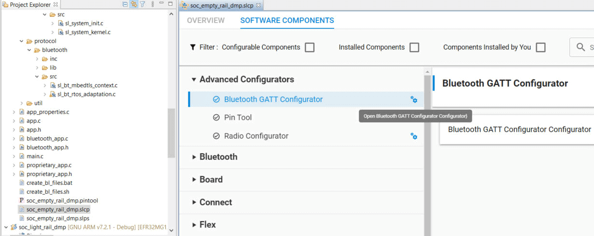
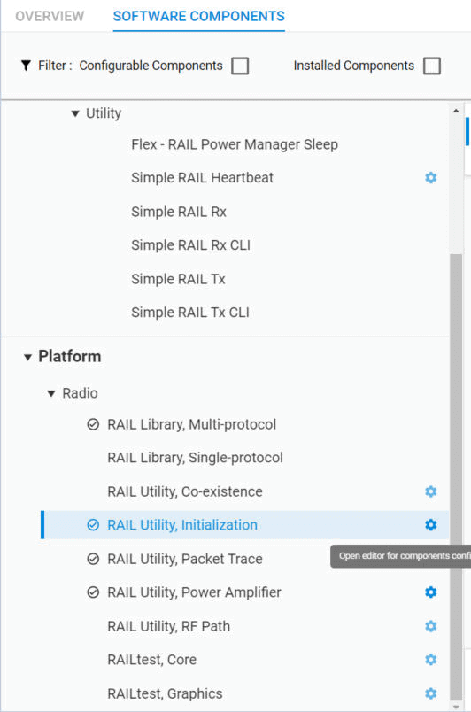

# AN1269: Dynamic Multiprotocol Development with Bluetooth® and Proprietary Protocols on RAIL in GSDK v3.x (Rev. 0.1) <!-- omit in toc -->

- [1. Introduction](#1-introduction)
  - [1.1 Requirements](#11-requirements)
- [2. Guidelines for Bluetooth and Proprietary Coexistence](#2-guidelines-for-bluetooth-and-proprietary-coexistence)
- [3. Software Architecture of a Bluetooth/Proprietary DMP application](#3-software-architecture-of-a-bluetoothproprietary-dmp-application)
- [4. Developing a Bluetooth/Proprietary DMP Project](#4-developing-a-bluetoothproprietary-dmp-project)
  - [4.1 Create a New Project](#41-create-a-new-project)
  - [4.2 Configure Bluetooth](#42-configure-bluetooth)
  - [4.3 Configure Proprietary Protocol](#43-configure-proprietary-protocol)
  - [4.4 Develop Bluetooth Application](#44-develop-bluetooth-application)
  - [4.5 Develop Proprietary Application](#45-develop-proprietary-application)
  - [4.6 Communication between Bluetooth and Proprietary Protocol](#46-communication-between-bluetooth-and-proprietary-protocol)
- [5. Examples](#5-examples)
  - [5.1 Sending Proprietary Packets](#51-sending-proprietary-packets)
  - [5.2 Receiving Proprietary Packets](#52-receiving-proprietary-packets)
- [6. Light/Switch Example](#6-lightswitch-example)
  - [6.1 Working with the Light/Switch Example](#61-working-with-the-lightswitch-example)
    - [6.1.1 Building the RAIL:Switch Application](#611-building-the-railswitch-application)
    - [6.1.2 Building the Bluetooth Light Application](#612-building-the-bluetooth-light-application)
    - [6.1.3 Changing the PHY Configuration](#613-changing-the-phy-configuration)

本应用笔记详细介绍了如何使用 Gecko SDK Suite v3.x 中的 SDK 开发同时运行 Bluetooth 和 Proprietary 的多协议应用程序。首先讨论了 Bluetooth 和 Proprietary 共存的条件。然后，该应用笔记会指导您如何创建一个新的 DMP 应用程序、如何配置 Bluetooth 和 Proprietary，以及在 Bluetooth 运行时如何发送和接收 Proprietary 数据包。最后，将详细介绍一个 Light/Switch DMP 示例。有关一般情况下动态多协议应用开发的背景以及有关 Bluetooth 任务优先级和调度的背景信息，请参阅 *UG305: Dynamic Multiprotocol User's Guide* 。

> 注：为了节省单词，用 Proprietary 指代 Proprietary 和 Proprietary Protocol（专有协议）。

# 1. Introduction

*UG305: Dynamic Multiprotocol User's Guide* 提供了有关动态多协议解决方案（其中两个协议在同一设备上同时运行）的信息，并且包括一般背景以及有关 Bluetooth 任务优先级和调度的信息。本应用笔记介绍了 Bluetooth/Proprietary 多协议解决方案。它假定读者熟悉动态多协议的原理以及与之相关的所有术语。

## 1.1 Requirements

为了能够使用本文档中讨论的所有特性，您将需要在计算机上安装以下组件：

* Bluetooth SDK version 3.0.0 或更高版本
* Micrium OS-5 kernel

为了能够运行 Light/Switch 示例，您需要在计算机上安装以下组件：

* Bluetooth SDK version 3.0.0 或更高版本
* Flex SDK version 3.0.0 或更高版本
* Micrium OS-5 kernel
* 一个具有至少 512 kB 闪存的 EFR32 芯片（运行所有必需的软件组件所必需）
* IAR-EWARM（IAR Embedded Workbench for ARM）（对于 RAIL Switch 应用程序是必需的）。有关所需的 IAR-EWARM 版本，请参阅 Bluetooth SDK 的发行说明。

# 2. Guidelines for Bluetooth and Proprietary Coexistence

当您开始实现一个 Bluetooth/Proprietary DMP 应用程序时，首先要考虑的是您的 Proprietary 是否与 Bluetooth 兼容。以下是您应始终考虑的一些准则：

* **Bluetooth 是确定性的** 。在 DMP 方案中，Bluetooth 的巨大优势在于它不会在随机时间上发送和接收数据包，而是始终在预定义的时间点（一个连接间隔的开始）上发送和接收数据包。这意味着 Bluetooth 不需要后台接收（background receive），并且 **您的 Proprietary 可以在后台接收** ，当然有时会被中断。

* **Bluetooth 需要准确性** 。预定义时间实例的结果是 **Bluetooth 数据包不能被延迟** （它们的时序需要 500 ppm 的精度）。如果您延迟了一个 Bluetooth 数据包，则另一端将不会收到它。因此，如果与 Proprietary 数据包发生冲突，则 **不得不延迟 Proprietary 数据包** ，或者必须丢弃其中一个数据包。

* **Bluetooth 连接是主动的** 。建立一个 Bluetooth 连接后，通过在每个连接间隔发送和接收至少一个空数据包，可以保持连接状态。因此，您的 Proprietary 需要准备好 **在每个连接间隔被中断** 。但是，如果您不需要 low Bluetooth latency，则可以将连接间隔设置为一个较长的​​时间。您还可以使用从机延迟参数来减少从机端的 Bluetooth 通信频率。

* **Bluetooth 使用短数据包** 。如果没有数据要发送，则通过空数据包使 Bluetooth 连接保持活动状态。一个空数据包在 1M PHY 上发送需要 80 µs；在 2 M PHY 上发送需要 40 µs。空数据包发送 + 帧间间隔 + 空数据包接收需要 80 + 150 + 80 = 310 µs 或 40 + 150 + 40 = 230 µs。这是 Bluetooth 在每个连接间隔中通常需要的时间。最大 Bluetooth 数据包具有 257 byte 的有效负载，在 1 M PHY 上发送需要 2120 µs；在 2 M PHY 上发送需要 1060 µs。在接收到一个空响应数据包的同时，在 1 M PHY 上需要 2120 + 150 + 80 = 2350 µs；在 2 M PHY 上发送需要 1060 + 150 + 40 = 1250 µs。

* **Bluetooth 使用数据包链（chain）** 。如果要发送的数据（过大）不能放进一个数据包中，则可以在一个连接间隔内扩展 Bluetooth 通信，也就是说，您可以 **期望在一个间隔内发送和接收多个数据包** ，但这很少见。

* **Bluetooth 是健壮的** 。如果一个 Bluetooth 数据包无法发送，则它将在 **下一个连接间隔中重新发送** 。如果接收到一个带有 **CRC error** 的 Bluetooth 数据包，则总是通过不发送一个响应数据包来 **通知对方** 。同样，该数据包将在下一个连接间隔中重新发送。唯一的限制是监督超时（supervision timeout）。如果在监督超时内没有成功传输，则连接断开。换句话说， **较高优先级的无线电任务可以使 Bluetooth 通信的时间间隔短于监督超时** 。

**总结** ：在实施 DMP 时，您必须考虑到 Bluetooth 将在一个短时间内（230 µs – 2350 µs）的每个连接间隔都需要无线电。Bluetooth 需要准确的时间，因此 Bluetooth 数据包不能被延迟。Bluetooth 数据包可以中断您的数据包发送和数据包接收，因此 Proprietary 应实现确认和重传机制，或与 Bluetooth 通信交错的确定性时许。较高优先级的无线电任务可以使 Bluetooth 通信的时间间隔短于监督超时。

# 3. Software Architecture of a Bluetooth/Proprietary DMP application

DMP 应用程序基于 Micrium RTOS。RTOS 有助于同时且独立地运行 Bluetooth 和 Proprietary。

由于 Bluetooth stack 本身只是一个功能集，因此 Bluetooth 需要单独的任务来运行 stack。 `BluetoothTask()` 和 `LinkLayerTask()` 对此负责，可以按原样地使用它们。可以使用 BGAPI 通过这些任务来访问 Bluetooth stack 的功能（像 RTOS-less 或 NCP 应用程序一样）。Bluetooth 应用程序（处理 Bluetooth 事件和调用 Bluetooth 命令）必须由开发者在 `sl_bt_on_event()` 中实现，其是从 `sl_bt_event_handler_task()` 中（间接）调用的。有关详细信息，请参考 *AN1260: Integrating Silicon Labs Bluetooth® Applications with the Micrium RTOS* 。

Proprietary 在 `proprietaryAppTask()` 中实现。与 Bluetooth 不同，Proprietary 可以直接通过 RAIL API 访问无线电。RAIL 事件需要定义一个回调函数 —— `sl_rail_app_on_event()` 。每当产生一个新的 RAIL 事件时，都会调用此函数，并且可以将该事件通知给应用程序。注意： `sl_rail_app_on_event()` 是从中断上下文中调用的，因此只应在其中执行 time-critical 函数。其他所有事情都应该在应用程序中完成。

尽管 Bluetooth 和 Proprietary 应用程序是独立的，但它们可以使用 IPC（inter-process communication）进行通信。


# 4. Developing a Bluetooth/Proprietary DMP Project

## 4.1 Create a New Project

Silicon Labs Bluetooth SDK (v2.9 or later) 包含 “Soc Empty Rail Dmp” 软件示例，应将其用作每个 Bluetooth/Proprietary 应用程序的起点。该示例项目：

* 包含了 multiprotocol RAIL library
* 包含了 Bluetooth library
* 包含了 Micrium RTOS
* 具有一个默认的 Bluetooth GATT database 配置
* 具有一个默认的 RAIL 配置
* 具有一个默认的 RTOS 配置
* 实现了 Bluetooth 初始化
* 实现了 RAIL 初始化
* 实现了 RTOS 初始化

您唯一要做的就是根据需求修改配置，并实现 Bluetooth application task 和 Proprietary application task。默认情况下， `proprietaryAppTask()` 是在 `private_app.c` 和 `private_app.h` 文件中定义和实现的。

对于 Bluetooth 部分，默认实现包含了 Bluetooth 事件处理程序 `sl_bt_on_event()` 函数，该函数在 `bluetooth_app.c` 文件中定义。

可以使用 Simplicity Studio 5 中的 visual GATT Configurator 配置 GATT database，可以使用 Radio Configurator 工具生成 RAIL 配置。您可能还需要向项目中添加一些 **emlib** 和 **emdrv** 文件，以支持外设配置。创建 DMP 项目的一般工作流程如下所示：


创建一个新项目。

1. 打开 Simplicity Studio 5。
2. 在 Debug Adapters 视图中选择一个已连接的设备，或在 My Products 视图中选择一个部件。
3. 点击 **File > New > Silicon Labs Project Wizard** 。
4. 查看您的 SDK 和 toolchain。如果您安装了多个 GSDK 版本，请验证是否显示了 Gecko SDK Suite v3.x。如果您希望使用 IAR 而不是 GCC，请确保在此处进行更改。创建项目后，很难再更改 toolchain。点击 **NEXT** 。
5. 在 Example Project Selection 对话框中，筛选 Bluetooth，然后选择 **SOC – Empty – RAIL – DMP** 。点击 **NEXT** 。
6. 为您的项目命名。点击 **\[FINISH\]** 。

## 4.2 Configure Bluetooth

配置 Bluetooth 包括两个步骤：

* 配置本地 GATT database
* 配置 Bluetooth stack

要配置本地 GATT database，请使用 Simplicity Studio 5 的 GATT Configurator：

1. 在项目中打开 `.slcp` 文件（如果尚未打开）。
2. 点击 Software Components 选项卡。
3. 在 Advanced Configurators 分组下，选择 Bluetooth GATT Configurator，然后单击 **Open** 。
    
4. 按照 *QSG169: Bluetooth® SDK v3.x Quick Start Guide* 中的说明添加您的 custom services 和 characteristics（或使用默认的 GATT database）。
5. 您的更改将自动保存并且项目文件将被生成。
    

要配置 Bluetooth stack：

1. 转到 Software Components 选项卡。
2. 找到 Bluetooth > Feature > Bluetooth Core 组件。
    
3. 根据您的需求更改配置。详情请参考 *UG434: Silicon Labs Bluetooth® C Application Developers Guide for SDK v3.x* （或使用默认配置）。
    

## 4.3 Configure Proprietary Protocol

配置 Proprietary 包括两个步骤：

* 配置无线电信道（基本频率、调制等）
* 配置 RAIL

要配置无线电信道，请使用 Simplicity Studio 5 的 Radio Configurator 工具：

1. 在项目中打开 `.slcp` 文件（如果尚未打开）。
2. 点击 Software Components 选项卡。
3. 在 Advanced Configurators 分组下，选择 Radio Configurator，然后单击 **Open** 。
    
4. 从无线电配置 profile 中选择 **Base Profile** 。
5. 从列表中选择一个预定义的无线电 PHY，或选择 Custom 设置，并应用您的设置。详情请参阅 *AN1253: EFR32 Radio Configurator Guide for Simplicity Studio 5* 。
    

要配置 RAIL：

1. 在 Software Components 选项卡上，选择 Flex > RAIL > Utility，点击 **Configure** 。
    
2. 根据需求更改配置。详情请参阅 *AN1253: EFR32 Radio Configurator Guide for Simplicity Studio 5* 。
    

## 4.4 Develop Bluetooth Application

Bluetooth 应用程序的实现方式必须与 non-DMP 方案相同：

* 可以从任何地方调用 BGAPI 命令（中断上下文除外！）
* 必须从 Bluetooth stack 的内部事件队列中获取 BGAPI 事件。这通常是在一个无限循环中完成的。

一个单协议的 Bluetooth 应用程序可以在有或没有 RTOS 的情况下运行。但是，DMP Bluetooth 应用程序只能在 RTOS 上运行。如 [3. Software Architecture of a Bluetooth/Proprietary DMP application](#3-Software-Architecture-of-a-Bluetooth-Proprietary-DMP-application) 中所述，您必须在 Bluetooth application task 中实现 Bluetooth 事件处理。该任务的基干在 `main.c` 中实现。要处理新的 Bluetooth 事件，只需添加具有适当事件 ID 的新 case 语句。下图展示了一般过程：


## 4.5 Develop Proprietary Application

Proprietary 应用程序直接使用 RAIL：

* 可以从任何地方调用 RAIL API 命令。
* RAIL API 事件必须在事件回调函数中处理。

默认情况下，事件回调函数设置为 `sl_rail_app_on_event()` 。一个空的 `sl_rail_app_on_event()` 函数在 `sl_rail_util_callbacks.c` 中作为一个弱函数来实现。它可以在应用程序中重载。每当从 RAIL 收到新的无线电事件时，都会调用此函数。每个 RAIL 事件在 64-bit 位域中设置一个特定的标志（flag）。请注意，可能会有多个标志被设置，因此您可能必须在一个回调中处理多个事件。注意：事件回调函数是从中断上下文中调用的，因此您必须将其作为一个中断处理程序来处理！仅进行快速计算，并设置一个标志来将相关变更通知给您的主循环。

处理无线电事件的主循环将在 `proprietaryAppTask()` 中实现，后者与最终调用 `sl_bt_on_event()` 事件处理程序的 `sl_bt_event_handler_task()` 一并运行。开发者的工作是决定如何在无线电事件处理程序（ `sl_rail_app_on_event()` ）和 `proprietaryAppTask()` 之间进行通信，通常的建议是使用 RTOS 的服务（如信号量、标志、消息队列等）。

下图展示了一般过程：


## 4.6 Communication between Bluetooth and Proprietary Protocol

Bluetooth 和 Proprietary 在两个独立的任务中一并运行。然而，经常需要同步它们，例如，如果您要在本地 GATT database 中的值变更时发送一个 Proprietary 数据包，或者要在收到一个 Proprietary 数据包时在本地 GATT database 中更改一个值。

要从 Bluetooth 任务中通知 Proprietary 任务（或反过来），最简单的方法是设置一个 RTOS 标志。您可以为事件定义一个队列，并使用该队列通知其他任务。在 Proprietary 任务中，您还可以使用函数 `sl_bt_external_signal()` 设置一个外部事件给 Bluetooth stack。这将在 Bluetooth stack 中生成一个 `sl_bt_evt_system_external_signal_id` 事件。

# 5. Examples

## 5.1 Sending Proprietary Packets

每次写入本地 GATT database 中的一个特定 characteristic 时，此简单示例都会发送一个 Proprietary 数据包。

1. 如 [4.1 Create a New Project](#4-1-Create-a-New-Project) 所述，创建一个新的 **Soc Empty Rail Dmp** 项目。
2. 在 GATT Configurator 中，使用以下参数向 GATT database 添加一个新 characteristic（如 *QSG169: Bluetooth® SDK v3.x Quick Start Guide* 中所述）。
   1. Name: Proprietary characteristic
   2. ID: prop_char
   3. Value type: hex
   4. Length: 16 byte
   5. Properties: Read, Write, Notify
3. 定义一个 `CHARACTERISTIC_CHANGED` 标志。此标志将在 `sl_bt_on_event()` 与 privateAppTask 之间的通信中使用，以作为 `private_event_flags` 标志组的一部分。
    ```c
    #define CHARACTERISTIC_CHANGED ((OS_FLAGS)0x01)
    ```
4. 创建一个 Tx FIFO。在 `proprietary_app.c` 中定义如下：
    ```c
    #define RAIL_TX_FIFO_SIZE (64)
    static uint8_t txFifo[RAIL_TX_FIFO_SIZE];
    ```
5. 在 Bluetooth application task（ `sl_bt_on_event()` ）中：
   1. 将一个新的事件处理程序添加到 switch – case 语句以处理 characteristic 值更改。
   2. 检查是否更改了 prop_char。
   3. 设置一个标志以通知 Proprietary。
    ```c
    case sl_bt_evt_gatt_server_attribute_value_id:
        if (evt->data.evt_gatt_server_attribute_value.attribute == gattdb_prop_char) {
            OSFlagPost(&proprietary_event_flags,
                        CHARACTERISTIC_CHANGED,
                        OS_OPT_POST_FLAG_SET,
                        &err);
        }
        break;
    ```
6. 在 `privateAppTask()` 中 —— 无限循环之前：
   1. 为 RAIL 设置 Tx FIFO。
   2. 为要发送的数据包定义调度器信息。
    ```c
    RAIL_SetTxFifo(railHandle, txFifo, 0, RAIL_TX_FIFO_SIZE);
    RAIL_SchedulerInfo_t txSchedulerInfo = (RAIL_SchedulerInfo_t){ .priority = 100,
                                                                    .slipTime = 100000,
                                                                    .transactionTime = 800 };
    ```
7. 在 `privateAppTask()` 的无限循环内：
   1. 等待 `CHARACTERISTIC_CHANGED` 标志。
   2. 将 characteristic 的内容拷贝到 Tx FIFO 中。
   3. 发送数据包。
    ```c
    while (DEF_TRUE) {
        RTOS_ERR err;
        OSFlagPend(&proprietary_event_flags,
                    CHARACTERISTIC_CHANGED,
                    (OS_TICK)0,
                    OS_OPT_PEND_BLOCKING       \
                    + OS_OPT_PEND_FLAG_SET_ANY \
                    + OS_OPT_PEND_FLAG_CONSUME,
                    NULL,
                    &err);
        sl_status_t result;
        result = sl_bt_gatt_server_read_attribute_value(gattdb_prop_char, 0, 16, data_len, dataPacket);
        RAIL_WriteTxFifo(railHandle, dataPacket, data_len, true);
        RAIL_StartTx(railHandle, 0, RAIL_TX_OPTIONS_DEFAULT, &txSchedulerInfo);
    }
    ```
8. 在 `sl_rail_app_on_event()` 中：
   1. 检查 packet_sent 事件，并且不要忘了让出无线电。
    ```c
    static void sl_rail_on_event(RAIL_Handle_t railHandle, RAIL_Events_t events)
    {
        if (events & RAIL_EVENT_TX_PACKET_SENT) {
            RAIL_YieldRadio(railHandle);
        }
    }
    ```

## 5.2 Receiving Proprietary Packets

本示例为上一部分中实现的发送方实现了一个接收方。一旦接收到一个 Proprietary 数据包，该示例就会更新本地 GATT database 中的一个 characteristic。

要实现一个接收方，请使用上一节中描述的发送方项目，并通过以下过程对其进行扩展。

1. 定义一个新标志，以通知 Proprietary 应用程序接收数据包。
    ```c
    #define PACKET_RECEIVED ((OS_FLAGS)0x02)
    ```
2. 创建一个 Rx FIFO。在 `proprietary_app.c` 中如下定义：
    ```c
    #define RAIL_RX_FIFO_SIZE (64)
    static uint8_t rxFifo[RAIL_RX_FIFO_SIZE];
    ```
3. 在 `privateAppTask()` 中 —— 无限循环之前：
   1. 设置 Rx 转换，以便在接收数据包后自动恢复 Rx 状态。
   2. 将 Rx 优先级设置为低于 Tx 优先级。
   3. 开始 Rx（在无限循环之前！）。
    ```c
    RAIL_StateTransitions_t stateTransition = (RAIL_StateTransitions_t){ .success = RAIL_RF_STATE_RX,
                                                                        .error = RAIL_RF_STATE_RX };
    RAIL_SetRxTransitions(railHandle,&stateTransition);
    RAIL_SchedulerInfo_t rxSchedulerInfo = (RAIL_SchedulerInfo_t){ .priority = 200 };
    RAIL_StartRx(railHandle, 0, &rxSchedulerInfo);
    ```
4. 在无线电事件处理程序中，如 `sl_rail_app_on_event()` ：
   1. 检查是否成功接收到一个数据包。
   2. 将数据包内容拷贝到本地 Rx FIFO。
   3. 设置一个标志，以通知 Proprietary 有关新数据包的信息。
    ```c
    if (events & RAIL_EVENT_RX_PACKET_RECEIVED) {
        RAIL_RxPacketInfo_t packetInfo;
        RTOS_ERR err;

        RAIL_GetRxPacketInfo(railHandle,
                            RAIL_RX_PACKET_HANDLE_NEWEST,
                            &packetInfo);

        if (packetInfo.packetStatus == RAIL_RX_PACKET_READY_SUCCESS) {
            RAIL_CopyRxPacket(rxFifo,&packetInfo);
            OSFlagPost(&proprietary_event_flags,PACKET_RECEIVED,OS_OPT_POST_FLAG_SET,&err);
        }
    }
    ```
5. 在 `privateAppTask()` 的无限循环内：
   1. 检查两个事件标志： `CHARACTERISTIC_CHANGED` 和 `PACKET_RECEIVED` 。您可以等待它们两者，然后检查设置了哪一个。
   2. 如果设置了 `PACKET_RECEIVED` 标志，则将接收到的数据包的内容写入本地 GATT database。
   3. 通知 Bluetooth stack 该值已更改（使用一个 Bluetooth 外部信号）。
    ```c
    while (DEF_TRUE) {
        RTOS_ERR err;
        OS_FLAGS active_flags = OSFlagPend (&proprietary_event_flags,
                                            CHARACTERISTIC_CHANGED \
                                            + PACKET_RECEIVED,
                                            (OS_TICK)0,
                                            OS_OPT_PEND_BLOCKING       \
                                            + OS_OPT_PEND_FLAG_SET_ANY \
                                            + OS_OPT_PEND_FLAG_CONSUME,
                                            NULL,
                                            &err);

        if (active_flags & CHARACTERISTIC_CHANGED) {
            sl_status_t result;
            result = sl_bt_gatt_server_read_attribute_value(gattdb_prop_char, 0, 16, data_len, dataPacket);
            RAIL_WriteTxFifo(railHandle, dataPacket 16, true);
            RAIL_StartTx(railHandle, 0, RAIL_TX_OPTIONS_DEFAULT, &txSchedulerInfo);
        }

        if (active_flags & PACKET_RECEIVED) {
            sl_bt_gatt_server_write_attribute_value(gattdb_prop_char,0,16,rxFifo);
            sl_bt_external_signal(CHARACTERISTIC_CHANGED);
        }
    }
    ```
6. 在 `sl_bt_on_event()` 中：
   1. 为外部信号添加一个新的事件处理程序。
   2. 检查是否收到 `CHARACTERISTIC_CHANGED` 信号。
   3. 发送一个通知。
    ```c
    case sl_bt_evt_system_external_signal_id:
        if (bluetooth_evt->data.evt_system_external_signal.extsignals & CHARACTERISTIC_CHANGED) {
            sl_bt_cmd_gatt_server_send_characteristic_notification(0xff, gattdb_prop_char,
                                                                16, rxFifo, &sent_len);
        }
        break;
    ```

# 6. Light/Switch Example

本节提供有关使用 Light/Switch 多协议示例代码的详细信息。

## 6.1 Working with the Light/Switch Example

要使用 Light/Switch 动态多协议示例，您必须同时安装了 Flex SDK version 3.0.0（或更高版本）和 Bluetooth SDK version 3.0.0（或更高版本）。Micrium kernel 随 Bluetooth SDK 一起安装。使用 SDK 的发行说明中记录的 IAR-EWARM。RAIL Switch 和 Bluetooth/RAIL Light 动态多协议应用程序的生成、构建和上传方法与其 SDK 中的其他应用程序相同。

* 要查看有关安装 Simplicity Studio 和 Flex SDK 以及构建示例应用程序的详细信息，请参阅 *QSG168: Proprietary Flex SDK v3.x Quick Start Guide* 。
* 要查看有关安装 Simplicity Studio 和 Bluetooth SDK 以及构建示例应用程序的详细信息，请参阅 *QSG169: Bluetooth® SDK v3.x Quick Start Guide* 。

> 注意：在具有多个 RAIL/Bluetooth 动态协议 Light 设备和单个 Switch 设备的演示配置中，可能会发生不可预测的行为。我们建议使用单个 Light 设备和单个 Switch 设备进行测试。

为方便起见，提供了以下摘要过程。

### 6.1.1 Building the RAIL:Switch Application

1. 打开 Simplicity Studio 5。
2. 在 Debug Adapters 视图中选择一个已连接的设备。
3. 点击 **File > New > Silicon Labs Project Wizard** 。
4. 查看您的 SDK 和 toolchain，并根据需求进行更改。点击 **NEXT** 。
5. 在 Example Project Selection 对话框中，筛选 Proprietary，然后选择 **Flex (RAIL) - Switch** 。点击 **NEXT**。
6. 为您的项目命名。点击 **\[FINISH\]** 。
7. 使用调试按钮自动编译并刷写，或者手动编译然后加载。

应用程序加载成功指示符取决于代码。以 **RAIL: Switch** 为例，在切换到灯泡显示之前，LCD 会显示一个简短的菜单。


### 6.1.2 Building the Bluetooth Light Application

Bluetooth Light 应用程序要求在设备上加载 Gecko Bootloader。当您加载预编译的 **SOC-Light-Rail-Dmp** 演示程序时，将加载 Gecko Bootloader。或者，您可以按照 *UG266: Silicon Labs Gecko Bootloader User's Guide* 中的描述，构建和加载您自己的 Gecko Bootloader 组合映像（名为 `<projectname>-combined.s37` ）。

1. 打开 Simplicity Studio 5。
2. 在 Debug Adapters 视图中选择一个已连接的设备。
3. 点击 **File > New > Silicon Labs Project Wizard** 。
4. 查看您的 SDK 和 toolchain，并根据需求进行更改。点击 **NEXT** 。
5. 在 Example Project Selection 对话框中，筛选 Bluetooth，然后选择 **Soc Light Rail Dmp** 。点击 **NEXT**。
6. 为您的项目命名。点击 **\[FINISH\]** 。
7. 使用调试按钮自动编译并刷写，或者手动编译然后加载。

应用程序加载成功指示符取决于代码。以 **Soc Light Rail Dmp** 为例，LCD 会显示一个灯泡。


### 6.1.3 Changing the PHY Configuration

RAIL/Bluetooth 示例的默认 PHY 配置是一个 sub-G 配置。在开始为您自己的硬件开发应用程序时，您可能需要修改此 PHY 配置。

要更改 PHY 配置：

1. 打开 **RAIL Switch** 项目。
2. 在项目中打开 `.slcp` 文件，然后点击 **Software Components** 选项卡。
3. 在 Advanced Configurators 下，选择 Radio Configurator，然后点击 **Open** 。
4. 选择一个新的 PHY。
5. 新的配置将生成到文件夹 `autogen` 中，其名称为 `rail_config.c` 和 `rail_config.h` 。
6. 打开 **Soc Light Rail Dmp** 项目。
7. 将 **RAIL Switch** 项目中的 `rail_config.c` 和 `rail_config.h` 复制到 **Soc Light Rail Dmp** 项目中。
8. 确保覆盖旧的 `rail_config.c` 和 `rail_config.h` 文件。
9. 像往常一样重建并刷写两个项目。
