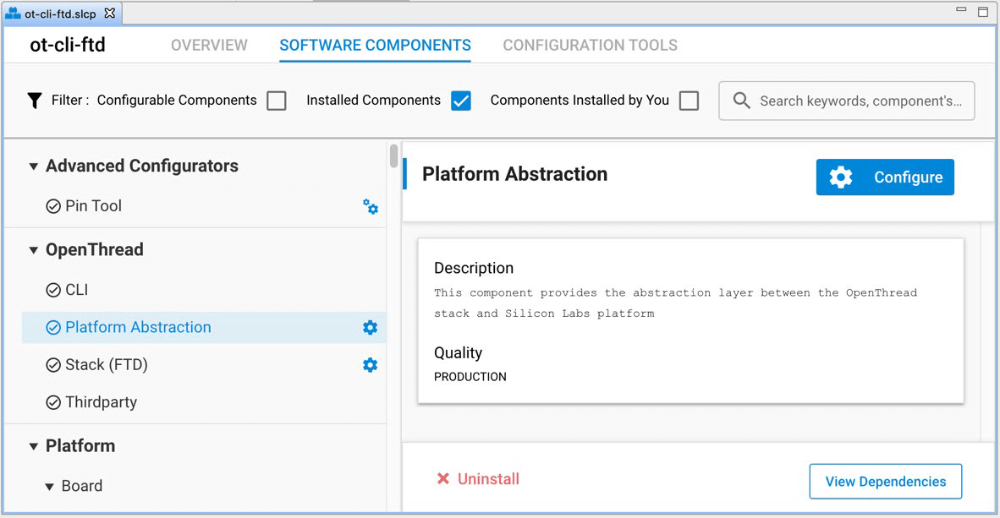
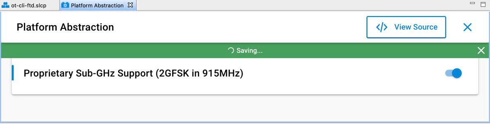

# AN1350: Single-Band Proprietary Sub-GHz Support with OpenThread (Rev. 0.1) <!-- omit in toc -->

- [1 引言](#1-引言)
  - [1.1 专有的 Sub-GHz 无线电 PHY](#11-专有的-sub-ghz-无线电-phy)
    - [1.1.1 调制细节](#111-调制细节)
    - [1.1.2 信道和频率规格](#112-信道和频率规格)
    - [1.1.3 PHR 长度](#113-phr-长度)
    - [1.1.4 硬件限制](#114-硬件限制)
- [2 为专有的 Sub-GHz 构建 OpenThread 示例应用程序](#2-为专有的-sub-ghz-构建-openthread-示例应用程序)
- [3 使用专有的 Sub-GHz 网络](#3-使用专有的-sub-ghz-网络)
  - [3.1 创建专有的 Sub-GHz 网络](#31-创建专有的-sub-ghz-网络)
  - [3.2 在 OpenThread Border Router 上启用专有的 Sub-GHz 支持](#32-在-openthread-border-router-上启用专有的-sub-ghz-支持)
  - [3.3 验证 Sub-GHz 操作](#33-验证-sub-ghz-操作)

---

    

        

        

            This document describes how to configure OpenThread applications to operate on a proprietary sub-GHz band using the Silicon Labs OpenThread software development kit (SDK) and Simplicity Studio® 5 with a compatible wireless starter kit (WSTK). It also provides details on the proprietary Radio PHY supported with this feature.
        

    

    

        本文档介绍如何使用 Silicon Labs OpenThread SDK 和 Simplicity Studio® 5 以及 Wireless Starter Kit（WSTK）配置 OpenThread 应用程序以在专有的（Proprietary）sub-GHz 频段上运行。还提供了有关支持此特性的专有无线电 PHY 的详细信息。
    

# 1 引言

    

        

        

            Sub-GHz radios, like 2.4 GHz ones, can offer relatively simple wireless solutions. When compared to 2.4 GHz, sub-GHz offers several advantages, depending on the target application.
        

    

    

        Sub-GHz 无线电与 2.4 GHz 无线电相似，可以提供相对简单的无线解决方案。与 2.4 GHz 相比，sub-GHz 具有一些优势，但具体取决于目标应用。
    

    

        

        
Some notable advantages of using sub-GHz radios are:

        <ul>
            <li>Longer range</li>
            <li>Less signal fading in congested environments</li>
            <li>Low interference</li>
            <li>Low power</li>
        </ul>
    

    
使用 sub-GHz 无线电的一些显着优势是：

    <ul>
        <li>更远的距离</li>
        <li>在拥挤的环境中更少的信号衰落</li>
        <li>更低的干扰</li>
        <li>更低的功耗</li>
    </ul>

    

        

        
This application note provides a step-by-step guide to creating, building, and running an OpenThread application on a sub-GHz band.

    

    
本应用笔记提供了在 sub-GHz 频段上创建、构建和运行 OpenThread 应用程序的分步指南。

    

        

        
As Thread is a 2.4GHz protocol and the specification currently does not support a sub-GHz feature, sub-GHz support has been added using:

        <ul>
            <li>Proprietary radio PHY made available with the SDK and,</li>
            <li>Proprietary radio configurations supported by the OpenThread stack.</li>
        </ul>
    

    
由于 Thread 是一个 2.4 GHz 协议，并且该规范目前不支持 sub-GHz 特性，因此使用如下以添加 sub-GHz 支持：

    <ul>
        <li>随 SDK 提供的专有无线电 PHY 以及，</li>
        <li>OpenThread 栈支持的专有无线电配置。</li>
    </ul>

    

        

        

            <strong>Note</strong>: This feature currently supports single-band operation only and so requires all the nodes in a mesh to be operating on the same sub-GHz band.
        

    

    

        <strong>注意</strong>：此特性目前仅支持单频段操作，因此要求网状网中的所有节点都在同一个 sub-GHz 频段上运行。
    

## 1.1 专有的 Sub-GHz 无线电 PHY

    

        

        

            For wireless applications to operate on a particular frequency band, the applications typically need the radio implementation to provide the necessary PHY support. For OpenThread applications supported on Silicon Labs platforms, the platform abstraction layer supports the 2.4GHz band by default. For the sub-GHz feature, proprietary radio PHY support has been added. 
        

    

    

        为了在特定频段上运行无线应用程序，应用程序通常需要无线电实现来提供必要的 PHY 支持。对于 Silicon Labs 平台上支持的 OpenThread 应用程序，平台抽象层默认支持 2.4 GHz 频段。对于 sub-GHz 特性，已添加了专有的无线电 PHY 支持。
    

    

        

        

            This section describes the proprietary radio PHY specifications that have been used to support this feature. The PHY specifications are compliant with the NA FCC Part 15.247 regulations.
        

    

    

        本节介绍用于支持此特性的专有无线电 PHY 规格。PHY 规格符合 NA FCC Part 15.247 规定。
    

### 1.1.1 调制细节

    

        

        
The proprietary radio PHY currently supported with the OpenThread SDK uses the following modulation specifications.

    

    

        OpenThread SDK 当前支持的专有无线电 PHY 使用以下调制规格。
    

<table style="margin-left: auto; margin-right: auto;">
<caption style="white-space: nowrap;">Table 1.1. Proprietary Sub-GHz Modulation Specification</caption>
<thead>
    <tr>
        <th>Parameter</th>
        <th>Configuration</th>
    </tr>
</thead>
<tbody>
    <tr>
        <td>Modulation</td>
        <td>2-Level GFSK</td>
    </tr>
    <tr>
        <td>Data Rate</td>
        <td>500 kbps</td>
    </tr>
    <tr>
        <td>Tx Filter BT</td>
        <td>0.5 (Gaussian)</td>
    </tr>
    <tr>
        <td>Modulation Index</td>
        <td>0.76</td>
    </tr>
</tbody>
</table>

### 1.1.2 信道和频率规格

    

        

        

            Similarly, the channel and frequency specifications for the proprietary radio PHY, and the center frequency for the supported channels have been captured in the following tables. 
        

    

    

        同样，专有无线电 PHY 的信道和频率规格以及所支持信道的中心频率已记录在下表中。
    

<table style="margin-left: auto; margin-right: auto;">
<caption style="white-space: nowrap;">Table 1.2. Proprietary Sub-GHz PHY Band Parameters</caption>
<thead>
    <tr>
        <th>Band Parameters</th>
        <th>Value</th>
    </tr>
</thead>
<tbody>
    <tr>
        <td>Channel Page</td>
        <td>23</td>
    </tr>
    <tr>
        <td>Frequency Band (MHz)</td>
        <td>902- 928</td>
    </tr>
    <tr>
        <td>Channel Spacing (MHz)</td>
        <td>1.0</td>
    </tr>
    <tr>
        <td>Total Channels</td>
        <td>25</td>
    </tr>
    <tr>
        <td>Channel Numbers</td>
        <td>0 – 24</td>
    </tr>
    <tr>
        <td>1st Channel Center Freq. (MHz)</td>
        <td>903.0</td>
    </tr>
</tbody>
</table>

<table style="margin-left: auto; margin-right: auto;">
<caption style="white-space: nowrap;">Table 1.3. Channels and Center Frequencies for 902-928 MHz Band</caption>
<thead>
    <tr>
        <th style="text-align: center;">Chan. #</th>
        <th style="text-align: center;">Fc (MHz)</th>
    </tr>
</thead>
<tbody>
    <tr>
        <td style="text-align: center;">0</td>
        <td style="text-align: center;">903.0</td>
    </tr>
    <tr>
        <td style="text-align: center;">1</td>
        <td style="text-align: center;">904.0</td>
    </tr>
    <tr>
        <td style="text-align: center;">...</td>
        <td style="text-align: center;">...</td>
    </tr>
    <tr>
        <td style="text-align: center;">23</td>
        <td style="text-align: center;">926.0</td>
    </tr>
    <tr>
        <td style="text-align: center;">24</td>
        <td style="text-align: center;">927.0</td>
    </tr>
</tbody>
</table>

### 1.1.3 PHR 长度

    

        

        

            The proprietary radio PHY supports 2-byte PHR. With a supported PSDU of 127 bytes, the last 7 bits of the 2nd byte represent the Frame Length.
        

    

    

        专有无线电 PHY 支持 2 字节 PHR。对于支持的 127 字节 PSDU，第 2 字节的最后 7 位表示帧长度。
    

### 1.1.4 硬件限制

    

        

        

            The proprietary sub-GHz feature is currently supported on radio boards supporting the 915 MHz band and using EFR32MG12 or EFR32MG13 parts only. Radio boards that could be used to test this feature are BRD4164a, BRD4170a and BRD4158a.
        

    

    

        支持 915 MHz 频段且仅使用 EFR32MG12 或 EFR32MG13 部件的无线板目前支持专有的 sub-GHz 特性。可用于测试此特性的无线板有 BRD4164a、BRD4170a 和 BRD4158a。
    

# 2 为专有的 Sub-GHz 构建 OpenThread 示例应用程序

    

        

        

            To build an OpenThread sample application for sub-GHz, you will need Simplicity Studio 5 (SSv5) and the Gecko SDK 3.2 (or higher) development environment with the OpenThread SDK package installed.
        

    

    

        要为 sub-GHz 构建 OpenThread 示例应用程序，您需要 Simplicity Studio 5（SSv5）和 Gecko SDK 3.2（或更高版本）开发环境以及 OpenThread SDK。
    

    

        

        

            This document assumes that you have installed SSv5 and the OpenThread SDK, and that you are familiar with SSv5 and configuring, building, and flashing applications. If not, see <em>QSG170: Silicon Labs OpenThread Quick-Start Guide</em>.
        

        <ol>
            <li>
                

                    Connect your target development hardware (supporting proprietary sub-GHz as discussed in section <a href="#114-硬件限制">1.1.4 Hardware Limitations</a>) connected, open SSv5's File menu and select New &gt; Silicon Labs Project Wizard. The Target, SDK, and Toolchain Selection dialog opens. Your target hardware should be populated. Click <strong>NEXT</strong>.
                

            </li>
            <li>
                

                    The Example Project Selection dialog opens. Use the Technology Type and Keyword filters to search for a specific example, for example <strong>ot-cli-ftd</strong>. Select it and click <strong>NEXT</strong>. 
                

                

                    Note that, if you do not see the application, your connected hardware may not be compatible. To verify, in the Launcher Perspectives My Products view enter EFR32MGxx and select one of the boards. Go to the Examples tab, filter by Thread technology and verify you can see the app.
                

            </li>
            <li>
                

                    The Project Configuration dialog opens. Here you can rename your project, change the default project file location, and determine if you will link to or copy project files. Note that if you change any linked resource, it is changed for any other project that references it. Unless you know you want to modify SDK resources, use the default selection. Click <strong>FINISH</strong>. The Simplicity IDE opens with the <strong>ot-cli-ftd</strong> project open in the Project Configurator.
                

            </li>
            <li>
                

                    To configure proprietary sub-GHz support, on the SOFTWARE COMPONENTS tab, select Installed Components and select the <strong>Platform Abstraction</strong> component under OpenThread. Note that you can also search for a component by name in the search field.
                

                

                    
                

            </li>
            <li>
                

                    Click <strong>Configure</strong> and enable the <strong>Proprietary Sub-GHz Support</strong> configuration option.
                

                

                    
                

                

                    Note: If you do not see the <strong>Configure</strong> control or the 'Proprietary Sub-GHz Support' configuration option associated with the Platform Abstraction component, your hardware may not be compatible with the proprietary radio specifications discussed above.
                

            </li>
            <li>
                

                    Build the project. The generated ot-cli-ftd.s37 image may now be uploaded to your board using an SSv5 tool such as the flash programmer or Simplicity Commander.
                

            </li>
        </ol>
    

    

        本文档假定您已安装了 SSv5 和 OpenThread SDK，并且熟悉 SSv5 以及如何配置、构建和刷写应用程序。如果没有，那么您应该先参阅 <em>QSG170: Silicon Labs OpenThread Quick-Start Guide</em>。
    

    <ol>
        <li>
            

                连接您的目标开发硬件（支持专有的 sub-GHz，如 <a href="#114-硬件限制">1.1.4 硬件限制</a> 所述），打开 SSv5 的文件菜单并选择 New &gt; Silicon Labs Project Wizard。这将打开 Target, SDK, and Toolchain Selection 对话框。其中应该填充好了您的目标硬件。点击 <strong>NEXT</strong>。
            

        </li>
        <li>
            

                Example Project Selection 对话框将打开。使用 Technology Type 和 Keyword 过滤器搜索特定示例，例如 <strong>ot-cli-ftd</strong>。选择它并点击 <strong>NEXT</strong>。
            

            

                请注意，如果您没有看到该应用程序，则您所连接的硬件可能是不兼容的。要进行验证，请在 Launcher Perspectives My Products 视图中输入 EFR32MGxx 并选择其中一个板。转到 Examples 选项卡，按 Thread technology 进行过滤并验证您是否可以看到该应用程序。
            

        </li>
        <li>
            

                Project Configuration 对话框将打开。在这里，您可以重命名您的项目，更改默认项目文件位置，并确定您是否将链接到或复制项目文件。请注意，如果您更改了任何的链接资源，那么引用它的任何其他项目都会受到影响。除非您要修改 SDK 资源，否则请使用默认选择。点击 <strong>FINISH</strong>。Simplicity IDE 打开时会在 Project Configurator 中打开 <strong>ot-cli-ftd</strong> 项目。
            

        </li>
        <li>
            

                要配置专有的 sub-GHz 支持，请在 SOFTWARE COMPONENTS 选项卡上，选择 Installed Components 并选择 OpenThread 下的 <strong>Platform Abstraction</strong> 组件。请注意，您还可以在搜索字段中按名称搜索组件。
            

            

                
            

        </li>
        <li>
            

                点击 <strong>Configure</strong> 并启用 <strong>Proprietary Sub-GHz Support</strong> 配置选项。
            

            

                
            

            

                注意：如果您没有看到与 Platform Abstraction 组件关联的 <strong>Configure</strong> 控件或 ‘Proprietary Sub-GHz Support’ 配置选项，则您的硬件可能与上述专有无线电规格不兼容。
            

        </li>
        <li>
            

                构建项目。现在您可以使用 SSv5 工具（例如 flash programmer 或 Simplicity Commander）将生成的 ot-cli-ftd.s37 映像上传到您的板上。
            

        </li>
    </ol>

# 3 使用专有的 Sub-GHz 网络

    

        

        

            Silicon Labs radio boards supporting the sub-GHz ISM band are designed to the operate in the US FCC 902-928 MHz band with an external whip antenna. Accordingly, when working with this feature, connect the external whip antenna using the SMA antenna connector on your radio board. For more information about this requirement, please refer to your radio board's reference manual. 
        

    

    

        支持 sub-GHz ISM 频段的 Silicon Labs 无线板设计在 US FCC 902-928 MHz 频段上运行（使用一条外部的鞭状天线）。因此，使用此特性时，请使用无线板上的 SMA 天线连接器连接外部鞭状天线。有关此要求的更多信息，请参阅您的无线板的参考手册。
    

## 3.1 创建专有的 Sub-GHz 网络

    

        

        

            As mentioned in section <a href="#1-引言">1 Introduction</a>, the proprietary sub-GHz feature currently supports single band use only and so requires every node in the mesh to be running an application with the sub-GHz feature enabled. Accordingly, to create a sub-GHz network:
        

        <ol>
            <li>
                
Build the <strong>ot-cli-ftd</strong> example with the proprietary sub-GHz feature enabled as discussed in section <a href="#2-为专有的-sub-ghz-构建-openthread-示例应用程序">2 Building an OpenThread Sample App for Proprietary Sub-GHz</a> and flash the same application on all your nodes. 

            </li>
            <li>
                
Use the standard OpenThread CLI commands to form and attach to a network. An example of this step is provided in Section 3.5 of <em>QSG170: Silicon Labs OpenThread Quick Start Guide</em>.

            </li>
            <li>
                
The resulting network formed has nodes operating on the sub-GHz band (with channels supported between 0 – 24, covering 902 – 928 MHz)

            </li>
        </ol>
    

    

        如 <a href="#1-引言">1 引言</a> 中所述，专有的 sub-GHz 特性目前仅支持单频段使用，因此要求网状网中的每个节点都运行启用了 sub-GHz 特性的应用程序。相应地，要创建 sub-GHz 网络：
    

    <ol>
        <li>
            
构建 <strong>ot-cli-ftd</strong> 示例并启用专有的 sub-GHz 特性，如 <a href="#2-为专有的-sub-ghz-构建-openthread-示例应用程序">2 为专有的 Sub-GHz 构建 OpenThread 示例应用程序</a> 所述，并将此应用程序刷写到您的所有节点上。

        </li>
        <li>
            
使用标准的 OpenThread CLI 命令来建立和连接到网络。<em>QSG170: Silicon Labs OpenThread Quick Start Guide</em> 的第 3.5 节提供了此步骤的示例。

        </li>
        <li>
            
由此建立的网络具有在 sub-GHz 频段上运行的节点（支持的信道在 0 - 24 之间，覆盖 902 - 928 MHz）

        </li>
    </ol>

## 3.2 在 OpenThread Border Router 上启用专有的 Sub-GHz 支持

    

        

        

            This section assumes that you are familiar with the basic build and install instructions for an OpenThread Border Router. If not, refer to <em>AN1256: Using the Silicon Labs RCP with the OpenThread Border Router</em>.
        

    

    

        本节假定您熟悉 OpenThread Border Router 的基本构建和安装说明。如果不是，请参阅 <em>AN1256: Using the Silicon Labs RCP with the OpenThread Border Router</em>。
    

    

        

        
To enable proprietary sub-GHz support on an OpenThread Border Router:

        <ol>
            <li>
                

                    Build an RCP image using Simplicity Studio 5 with the sub-GHz feature enabled. Start with the <strong>ot-rcp</strong> example and follow the steps described in Section <a href="#2-为专有的-sub-ghz-构建-openthread-示例应用程序">2 Building an OpenThread Sample App for Proprietary Sub-GHz</a>.
                

            </li>
            <li>
                
For the Border Router Host you can either:

                <ol>
                    <li>
                        
Use a pre-built docker image (Recommended)

                        
<a href="https://hub.docker.com/r/siliconlabsinc/openthread-border-router-proprietary-na-915/tags">https://hub.docker.com/r/siliconlabsinc/openthread-border-router-proprietary-na-915/tags</a>

                    </li>
                    <li>
                        

                            Or, manually build the border router image for your host with the following OpenThread proprietary radio configurations set. This option requires you to modify the OT BR build scripts (details of which are beyond the scope of this document)
                        

                        <table style="margin-left: auto; margin-right: auto;">
                        <thead>
                            <tr>
                                <th style="text-align: center;">Configuration</th>
                                <th>Value</th>
                            </tr>
                        </thead>
                        <tbody>
                            <tr>
                                <td><code>OPENTHREAD_CONFIG_PLATFORM_RADIO_PROPRIETARY_SUPPORT</code></td>
                                <td><code>1</code></td>
                            </tr>
                            <tr>
                                <td><code>OPENTHREAD_CONFIG_RADIO_2P4GHZ_OQPSK_SUPPORT</code></td>
                                <td><code>0</code></td>
                            </tr>
                            <tr>
                                <td><code>OPENTHREAD_CONFIG_RADIO_915MHZ_OQPSK_SUPPORT</code></td>
                                <td><code>0</code></td>
                            </tr>
                            <tr>
                                <td><code>OPENTHREAD_CONFIG_PLATFORM_RADIO_PROPRIETARY_CHANNEL_PAGE</code></td>
                                <td><code>23</code></td>
                            </tr>
                            <tr>
                                <td><code>OPENTHREAD_CONFIG_PLATFORM_RADIO_PROPRIETARY_CHANNEL_MIN</code></td>
                                <td><code>0</code></td>
                            </tr>
                            <tr>
                                <td><code>OPENTHREAD_CONFIG_PLATFORM_RADIO_PROPRIETARY_CHANNEL_MAX</code></td>
                                <td><code>24</code></td>
                            </tr>
                            <tr>
                                <td><code>OPENTHREAD_CONFIG_PLATFORM_RADIO_PROPRIETARY_CHANNEL_MASK</code></td>
                                <td><code>0x1ffffff</code></td>
                            </tr>
                            <tr>
                                <td><code>OPENTHREAD_CONFIG_DEFAULT_CHANNEL</code></td>
                                <td><code>0</code></td>
                            </tr>
                        </tbody>
                        </table>
                    </li>
                </ol>
            </li>
        </ol>
    

    
为了在 OpenThread Border Router 上启用专有 sub-GHz 支持：

    <ol>
        <li>
            

                使用 Simplicity Studio 5 并启用 sub-GHz 特性构建 RCP 映像。从 <strong>ot-rcp</strong> 示例开始，按照 <a href="#2-为专有的-sub-ghz-构建-openthread-示例应用程序">2 为专有的 Sub-GHz 构建 OpenThread 示例应用程序</a> 中描述的步骤进行操作。
            

        </li>
        <li>
            
对于 Border Router Host 你可以：

            <ol>
                <li>
                    
使用预构建的 docker 映像（推荐）

                    
<a href="https://hub.docker.com/r/siliconlabsinc/openthread-border-router-proprietary-na-915/tags">https://hub.docker.com/r/siliconlabsinc/openthread-border-router-proprietary-na-915/tags</a>

                </li>
                <li>
                    

                        或者，使用以下 OpenThread 专有无线电配置集为您的主机手动构建 Border Router 映像。此选项需要您修改 OTBR 的构建脚本（其细节超出了本文档的范围）
                    

                    <table style="margin-left: auto; margin-right: auto;">
                    <thead>
                        <tr>
                            <th style="text-align: center;">Configuration</th>
                            <th>Value</th>
                        </tr>
                    </thead>
                    <tbody>
                        <tr>
                            <td><code>OPENTHREAD_CONFIG_PLATFORM_RADIO_PROPRIETARY_SUPPORT</code></td>
                            <td><code>1</code></td>
                        </tr>
                        <tr>
                            <td><code>OPENTHREAD_CONFIG_RADIO_2P4GHZ_OQPSK_SUPPORT</code></td>
                            <td><code>0</code></td>
                        </tr>
                        <tr>
                            <td><code>OPENTHREAD_CONFIG_RADIO_915MHZ_OQPSK_SUPPORT</code></td>
                            <td><code>0</code></td>
                        </tr>
                        <tr>
                            <td><code>OPENTHREAD_CONFIG_PLATFORM_RADIO_PROPRIETARY_CHANNEL_PAGE</code></td>
                            <td><code>23</code></td>
                        </tr>
                        <tr>
                            <td><code>OPENTHREAD_CONFIG_PLATFORM_RADIO_PROPRIETARY_CHANNEL_MIN</code></td>
                            <td><code>0</code></td>
                        </tr>
                        <tr>
                            <td><code>OPENTHREAD_CONFIG_PLATFORM_RADIO_PROPRIETARY_CHANNEL_MAX</code></td>
                            <td><code>24</code></td>
                        </tr>
                        <tr>
                            <td><code>OPENTHREAD_CONFIG_PLATFORM_RADIO_PROPRIETARY_CHANNEL_MASK</code></td>
                            <td><code>0x1ffffff</code></td>
                        </tr>
                        <tr>
                            <td><code>OPENTHREAD_CONFIG_DEFAULT_CHANNEL</code></td>
                            <td><code>0</code></td>
                        </tr>
                    </tbody>
                    </table>
                </li>
            </ol>
        </li>
    </ol>

## 3.3 验证 Sub-GHz 操作

    

        

        
To verify if your application has been configured correctly to operate on the sub-GHz band,

        <ul>
            <li>
                
Execute the following CLI command on your node, to retrieve the supported channel mask:

                <pre>&gt; channel supported 0x1ffffff Done</pre>
                
For proprietary sub-GHz applications, the result of this command is <code>0x1ffffff</code>, indicating channels 0-24 supported for this configuration. For 2.4 GHz applications, the output returned is <code>0x7fff800</code>, indicating channels 11-26 supported for that band.

            </li>
            <li>
                
Alternately, for a node running the sub-GHz application and that is part of an OpenThread network, you can also verify the radio information using Silicon Labs Network Analyzer.

                

            </li>
        </ul>
    

    
为了验证您的应用程序是否已正确配置为在 sub-GHz 频段上运行，

    <ul>
       <li>
           
在您的节点上执行以下 CLI 命令，以检索支持的信道掩码：

           <pre>&gt; channel supported 0x1ffffff Done</pre>
           
对于专有的 sub-GHz 应用，此命令的结果是 <code>0x1ffffff</code>，表示此配置支持信道 0-24。对于 2.4 GHz 应用，返回的输出为 <code>0x7fff800</code>，表示该频段支持的信道 11-26。

       </li>
       <li>
           
或者，对于运行 sub-GHz 应用程序且属于 OpenThread 网络一部分的节点，您还可以使用 Silicon Labs Network Analyzer 验证无线电信息。

           

       </li>
    </ul>

    

        

        

            For more details on how to capture OpenThread packers using Silicon Labs Network Analyzer, refer to section 5.4 of <em>QSG170: Silicon Labs OpenThread Quick Start Guide</em>.
        

    

    

        有关如何使用 Silicon Labs Network Analyzer 采集 OpenThread 数据包的更多详细信息，请参阅 <em>QSG170: Silicon Labs OpenThread Quick Start Guide</em> 的第 5.4 节。
    

