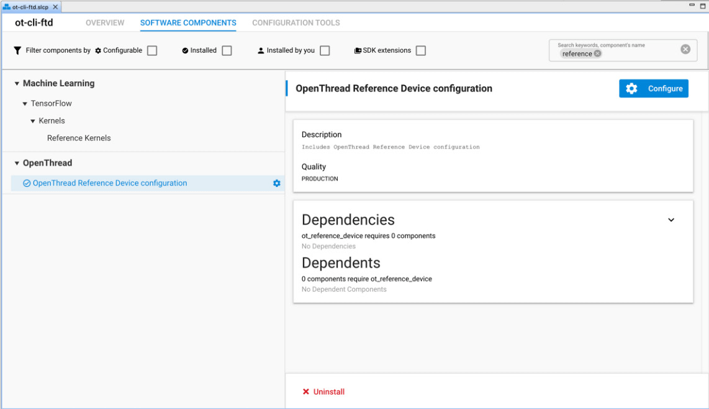
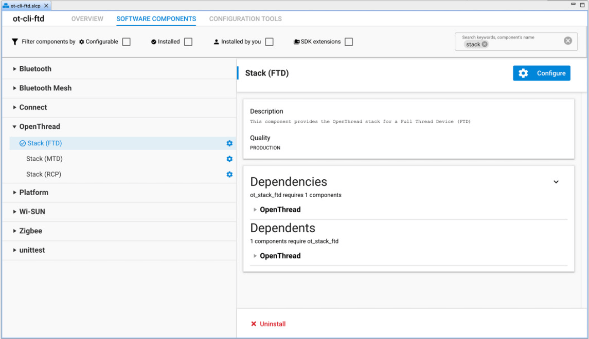
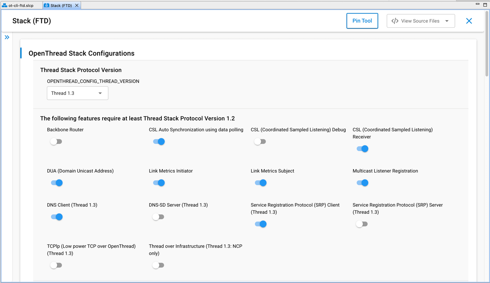

# AN1372: Configuring OpenThread Applications for Thread 1.3 (Rev. 0.3) <!-- omit in toc -->

- [1 在 SoC 应用程序中包含 Thread 1.3 特性](#1-在-soc-应用程序中包含-thread-13-特性)
- [2 在 OpenThread Border Router 中包含 Thread 1.3 特性](#2-在-openthread-border-router-中包含-thread-13-特性)

---

    

        

        

            Thread 1.3 builds on Thread 1.1 and Thread 1.2's robust foundation. It defines enhancements and additions to the Thread Border Router definition, to enable bidirectional IPv6 connectivity, service discovery using DNS, and provide IPv4-backwards support using NAT. It includes support for Thread-over-infrastructure (non-802.15.4 IPv6) links. Finally, to remedy throughput concerns, the specification defines support for TCP as a standard component and protocol.
        

    

    

        Thread 1.3 建立在 Thread 1.1 和 Thread 1.2 的健壮基础之上。它定义了 Thread Border Router 定义的增强和补充，以启用双向 IPv6 连接、使用 DNS 的服务发现以及使用 NAT 提供 IPv4 向后支持。它包括对 Thread-over-infrastructure (non-802.15.4 IPv6) 链路的支持。最后，为了解决吞吐量问题，规范将 TCP 支持定义为一个标准组件和协议。
    

    

        

        

            <strong>Note:</strong> Silicon Labs includes the OpenThread stack with the current default protocol version 1.3 (=4).
        

    

    

        <strong>注意：</strong> Silicon Labs 包含 OpenThread 栈和当前的默认协议版本 1.3（=4）。
    

    

        

        

            Silicon Labs provides components and configuration options that enable you to configure Thread 1.3 features with sample applications. These features are compatible with EFR32MG1x and EFR32MG2x SoCs, RCPs, and modules. This application note assumes you have a basic understanding of how Thread is implemented on EFR32 devices. For more information, see <em>UG103.11: Thread Fundamentals</em>.
        

    

    

        Silicon Labs 提供了组件和配置选项，使您能够使用示例应用程序配置 Thread 1.3 特性。这些特性与 EFR32MG1x 和 EFR32MG2x SoC、RCP 和 Module 兼容。本应用笔记假设您对如何在 EFR32 设备上实现 Thread 有基本的了解。如需更多信息，请参阅 <em>UG103.11: Thread Fundamentals</em>。
    

# 1 在 SoC 应用程序中包含 Thread 1.3 特性

    

        

        

            Silicon Labs provides a number of sample SoC OpenThread applications. You can modify these to include Thread 1.3 features (some of them are enabled by default). This chapter assumes you are familiar with creating and modifying OpenThread projects in Simplicity Studio 5. If you need more information, see the <a href="https://docs.silabs.com/simplicity-studio-5-users-guide/latest/ss-5-users-guide-overview/">Simplicity Studio 5 User's Guide</a> and <em>QSG170: Silicon Labs OpenThread Quick Start Guide</em>. 
        

    

    

        Silicon Labs 提供了许多示例的 SoC OpenThread 应用程序。您可以修改这些以包含 Thread 1.3 特性（其中一些特性默认启用）。本章假定您已熟悉在 Simplicity Studio 5 中创建和修改 OpenThread 项目。如果您需要更多信息，请参阅 <a href="https://docs.silabs.com/simplicity-studio-5-users-guide/latest/ss-5-users-guide-overview/">Simplicity Studio 5 User's Guide</a> 和 <em>QSG170: Silicon Labs OpenThread Quick Start Guide</em>。
    

    

        

        

            By default, our sample applications use a standardized "Reference Device configuration" with pre-selected parameters for a certifiable OpenThread build. To configure your own OpenThread settings, you will have to uninstall this configuration and replace it with a customized version.
        

    

    

        默认情况下，我们的示例应用程序使用带有预选参数的标准化“参考设备配置”，用于可认证的 OpenThread 构建。要配置您自己的 OpenThread 设置，您必须卸载此配置并将其替换为一个自定义版本。
    

    

        

        

            As an example, the following procedure shows how to configure 1.3 features on the <strong>ot-cli-ftd</strong> application.
            <ol>
                <li>
                    
Create a project based on the <strong>ot-cli-ftd</strong> example.

                    
On the SOFTWARE COMPONENTS tab, search for and select the <strong>OpenThread Reference Device configuration</strong> entry.

                </li>
                <li>
                    
Click <strong>Uninstall</strong> (near the bottom) to remove this standardized configuration.

                    

                </li>
                <li>
                    
On the SOFTWARE COMPONENTS tab, search for and select the <strong>Stack (FTD)</strong> entry. Depending on your application, you may have to do this on a <strong>Stack (MTD)</strong>, or <strong>Stack (RCP)</strong> component (this example is for an FTD application).

                    

                </li>
                <li>
                    
Configure the various compile-time settings. The options are explained in the OpenThread documentation at <a href="https://github.com/openthread/openthread/blob/main/examples/README.md">https://github.com/openthread/openthread/blob/main/examples/README.md</a>.

                    

                    
<strong>For Thread 1.3 features</strong>, the following flags are required. The description for each flag indicates whether is mandatory, optional, or recommended. <strong>Do not enable</strong> these flags for a Thread 1.1 application.

                    <ul>
                        <li>
<strong>Thread Stack Protocol Version</strong>: Set to Thread 1.3 (mandatory).
</li>
                        <li>
<strong>DNS Client</strong> (mandatory): Required for Thread 1.3 compliance.
</li>
                        <li>
<strong>DNS-SD Server</strong> (recommended): FTDs only. Required for Thread 1.3 compliance on Thread Border Routers. Optional otherwise.
</li>
                        <li>
<strong>SRP Client</strong> (mandatory): Required for Thread 1.3 compliance.
</li>
                        <li>
<strong>SRP Server</strong> (recommended): FTDs only. Required for Thread 1.3 compliance on Thread Border Routers. Optional otherwise.
</li>
                        <li>
<strong>TCPlp (TCP low-power)</strong> (optional): Not required for Thread 1.3 compliance; however, as a feature defined in Thread 1.3, this can be enabled to test the low power TCP feature.
</li>
                        <li>
<strong>Thread over Infrastructure</strong> (recommended): NCPs only. Required for Thread 1.3 compliance on Thread Border Routers (and enabled by default for the border router POSIX stack). For sample applications on EFR platforms, this applies only to NCPs, and as such is an untested, experimental feature, as Silicon Labs does not directly support NCP applications.
</li>
                    </ul>
                    
Additional information about these features is included in the following table.

                    <table style="margin-left: auto; margin-right: auto;">
                    <caption style="white-space: nowrap;">Table 1-1. Thread 1.3 Configuration Flags</caption>
                    <thead>
                        <tr>
                            <th>Flag</th>
                            <th>Note</th>
                        </tr>
                    </thead>
                    <tbody>
                        <tr>
                            <td>DNS Client (OPENTHREAD_CONFIG_DNS_CLIENT_ENABLE)</td>
                            <td>Enables support for DNS client. Enables sending DNS queries for AAAA (IPv6) records.</td>
                        </tr>
                        <tr>
                            <td>DNS-SD Server (OPENTHREAD_CONFIG_DNSSD_SERVER_ENABLE)</td>
                            <td>
Enables support for DNS-SD server. Service information from a local SRP server is used to resolve DNS-SD queries.

A DNS server should implement the following features:
<ul><li>
DNS recursive resolver to answer queries for all valid DNS record types, including host name records, for example. DNS type "A" and "AAAA" address records.
</li><li>
DNS authoritative server that answers authoritatively for DNSBased Service Discovery [RFC 6763] records and any other DNS records registered with the Thread Service Registry by clients using the Service Registration Protocol.
</li><li>
DNS Update Server: A server that accepts properly authenticated client requests to update authoritative DNS data.</li>
</ul></td>
                        </tr>
                        <tr>
                            <td>SRP Client (OPENTHREAD_CONFIG_SRP_CLIENT_ENABLE)</td>
                            <td>
Enables support for SRP (Service Registration Protocol) client.

An SRP client Thread Device registers services with the SRP server, communicates with the corresponding DNS-SD authoritative server for queries, and uses the DNS recursive resolver for DNS resolution as defined by the respective IETF specifications.

For more information, see: <a href="https://github.com/openthread/openthread/blob/main/src/cli/README_SRP_CLIENT.md">https://github.com/openthread/openthread/blob/main/src/cli/README_SRP_CLIENT.md</a>
</td>
                        </tr>
                        <tr>
                            <td>SRP Server (OPENTHREAD_CONFIG_SRP_SERVER_ENABLE)</td>
                            <td>
Enables support for SRP (Service Registration Protocol) server.

An SRP server supports the DNS Update Server functions, plus additional public key cryptography for security and some other minor enhancements to better support constrained clients.

For more information, see: <a href="https://github.com/openthread/openthread/blob/main/src/cli/README_SRP.md">https://github.com/openthread/openthread/blob/main/src/cli/README_SRP.md</a>
</td>
                        </tr>
                        <tr>
                            <td>TCPlp (TCP Low Power) (OPENTHREAD_CONFIG_TCP_SERVER_ENABLE)</td>
                            <td>
Enables the low-power TCP feature, as defined in the Thread 1.3 specification. This depends on the third-party tcplp library included in the openthread stack.

For more information, see: <a href="https://github.com/openthread/openthread/blob/main/src/cli/README_TCP.md">https://github.com/openthread/openthread/blob/main/src/cli/README_TCP.md</a>
</td>
                        </tr>
                        <tr>
                            <td>Thread over Infrastructure (OPENTHREAD_CONFIG_RADIO_LINK_TREL_ENABLE)</td>
                            <td>
Enables TREL radio link for Thread over Infrastructure feature.

For sample applications, this is applicable to NCPs only, which are currently not supported by Silicon Labs. See the next section for information on how this applies to border router POSIX platforms.
</td>
                        </tr>
                    </tbody>
                    </table>
                </li>
            </ol>
        

    

    

        例如，以下过程展示了如何在 <strong>ot-cli-ftd</strong> 应用程序上配置 1.3 特性。
        <ol>
            <li>
                
基于 <strong>ot-cli-ftd</strong> 示例创建一个项目。

                
在 SOFTWARE COMPONENTS 选项卡上，搜索并选择 <strong>OpenThread Reference Device configuration</strong> 条目。

            </li>
            <li>
                
点击 <strong>Uninstall</strong>（在底部附近）以移除此标准化配置。

                

            </li>
            <li>
                
在 SOFTWARE COMPONENTS 选项卡上，搜索并选择 <strong>Stack (FTD)</strong> 条目。根据您的应用程序，您可能必须在 <strong>Stack (MTD)</strong> 或 <strong>Stack (RCP)</strong> 组件上执行此操作（此示例适用于 FTD 应用程序）。

                

            </li>
            <li>
                
配置各种编译时设置。这些选项在 <a href="https://github.com/openthread/openthread/blob/main/examples/README.md">https://github.com/openthread/openthread/blob/main/examples/README.md</a> 中进行了解释。

                

                
<strong>对于 Thread 1.3 特性</strong>，以下标志是要求的。每个标志的描述指示其是强制的、可选的还是推荐的。对于 Thread 1.1 应用程序，<strong>不要启用</strong> 这些标志。

                <ul>
                    <li>
<strong>Thread Stack Protocol Version</strong>：设置为 Thread 1.3 （强制）。
</li>
                    <li>
<strong>DNS Client</strong>（强制）：Thread 1.3 合规性的要求。
</li>
                    <li>
<strong>DNS-SD Server</strong>（推荐）：仅 FTD。在 Thread Border Router 上是 Thread 1.3 合规性的要求。其它则是可选的。
</li>
                    <li>
<strong>SRP Client</strong>（强制）：Thread 1.3 合规性的要求。
</li>
                    <li>
<strong>SRP Server</strong>（推荐）：仅 FTD。在 Thread Border Router 上是 Thread 1.3 合规性的要求。其它则是可选的。
</li>
                    <li>
<strong>TCPlp (TCP low-power)</strong>（可选）：对于 Thread 1.3 合规性不是必要的；然而，作为 Thread 1.3 中定义的特性，可以启用此特性来测试低功耗 TCP 特性。
</li>
                    <li>
<strong>Thread over Infrastructure</strong>（推荐）：在 Thread Border Router 上是 Thread 1.3 合规性的要求（默认情况下为 Border Router POSIX 栈启用）。对于 EFR 平台上的示例应用程序，这仅适用于 NCP，因此是一个未经测试的实验性特性，因为 Silicon Labs 不直接支持 NCP 应用程序。
</li>
                </ul>
                
下表中包含有关这些特性的其他信息。

                <table style="margin-left: auto; margin-right: auto;" id="Table_1-1">
                <caption style="white-space: nowrap;">Table 1-1. Thread 1.3 Configuration Flags</caption>
                <thead>
                    <tr>
                        <th>Flag</th>
                        <th>Note</th>
                    </tr>
                </thead>
                <tbody>
                    <tr>
                        <td>DNS Client (OPENTHREAD_CONFIG_DNS_CLIENT_ENABLE)</td>
                        <td>Enables support for DNS client. Enables sending DNS queries for AAAA (IPv6) records.</td>
                    </tr>
                    <tr>
                        <td>DNS-SD Server (OPENTHREAD_CONFIG_DNSSD_SERVER_ENABLE)</td>
                        <td>
Enables support for DNS-SD server. Service information from a local SRP server is used to resolve DNS-SD queries.

A DNS server should implement the following features:
<ul><li>
DNS recursive resolver to answer queries for all valid DNS record types, including host name records, for example. DNS type "A" and "AAAA" address records.
</li><li>
DNS authoritative server that answers authoritatively for DNSBased Service Discovery [RFC 6763] records and any other DNS records registered with the Thread Service Registry by clients using the Service Registration Protocol.
</li><li>
DNS Update Server: A server that accepts properly authenticated client requests to update authoritative DNS data.</li>
</ul></td>
                    </tr>
                    <tr>
                        <td>SRP Client (OPENTHREAD_CONFIG_SRP_CLIENT_ENABLE)</td>
                        <td>
Enables support for SRP (Service Registration Protocol) client.

An SRP client Thread Device registers services with the SRP server, communicates with the corresponding DNS-SD authoritative server for queries, and uses the DNS recursive resolver for DNS resolution as defined by the respective IETF specifications.

For more information, see: <a href="https://github.com/openthread/openthread/blob/main/src/cli/README_SRP_CLIENT.md">https://github.com/openthread/openthread/blob/main/src/cli/README_SRP_CLIENT.md</a>
</td>
                    </tr>
                    <tr>
                        <td>SRP Server (OPENTHREAD_CONFIG_SRP_SERVER_ENABLE)</td>
                        <td>
Enables support for SRP (Service Registration Protocol) server.

An SRP server supports the DNS Update Server functions, plus additional public key cryptography for security and some other minor enhancements to better support constrained clients.

For more information, see: <a href="https://github.com/openthread/openthread/blob/main/src/cli/README_SRP.md">https://github.com/openthread/openthread/blob/main/src/cli/README_SRP.md</a>
</td>
                    </tr>
                    <tr>
                        <td>TCPlp (TCP Low Power) (OPENTHREAD_CONFIG_TCP_SERVER_ENABLE)</td>
                        <td>
Enables the low-power TCP feature, as defined in the Thread 1.3 specification. This depends on the third-party tcplp library included in the openthread stack.

For more information, see: <a href="https://github.com/openthread/openthread/blob/main/src/cli/README_TCP.md">https://github.com/openthread/openthread/blob/main/src/cli/README_TCP.md</a>
</td>
                    </tr>
                    <tr>
                        <td>Thread over Infrastructure (OPENTHREAD_CONFIG_RADIO_LINK_TREL_ENABLE)</td>
                        <td>
Enables TREL radio link for Thread over Infrastructure feature.

For sample applications, this is applicable to NCPs only, which are currently not supported by Silicon Labs. See the next section for information on how this applies to border router POSIX platforms.
</td>
                    </tr>
                </tbody>
                </table>
            </li>
        </ol>
    

# 2 在 OpenThread Border Router 中包含 Thread 1.3 特性

    

        

        

            Silicon Labs provides several sample OpenThread RCP applications. By default, the RCP applications on supported Silicon Labs hardware automatically support Thread 1.3 features if they are present on the host (the Border Router, which is Silicon Labs' supported RCP model). None of the Thread 1.3 features are RCP-specific, so turning them on or off for the RCP sample application has no effect.
        

    

    

        Silicon Labs 提供了几个示例的 OpenThread RCP 应用程序。默认情况下，如果主机（Border Router，是 Silicon Labs 支持的 RCP 模型）上存在受支持的 Silicon Labs 硬件上的 RCP 应用程序，那么它们会自动支持 Thread 1.3 特性。Thread 1.3 的所有特性都不是 RCP 特定的，因此为 RCP 示例应用程序打开或关闭它们没有任何效果。
    

    

        

        

            Refer to <em>AN1256: Using the Silicon Labs RCP with the OpenThread Border Router</em> for detailed instructions on how to build an OpenThread Border Router for Raspberry Pi 3B+ or above. You must use a Thread protocol version 1.3 RCP with a Border Router that is also running a stack at protocol version 1.3.
        

    

    

        有关如何为 Raspberry Pi 3B+ 或更高版本构建 OpenThread Border Router 的详细说明，请参阅 <em>AN1256: Using the Silicon Labs RCP with the OpenThread Border Router</em>。您必须将 Thread 1.3 RCP 与 Border Router（协议栈版本也是 1.3）一起使用。
    

    

        

        

            Thread 1.3 features can be enabled on the border router separately, by making sure the POSIX stack enables the following CMake flags. These flags are enabled by default with the current default OpenThread Border Router offering. (See <a href="#Table_1-1">Table 1-1. Thread 1.3 Configuration Flags</a> for more information on their purpose.)
        

    

    

        通过确保 POSIX 栈启用以下 CMake 标志，可以在 Border Router 上单独启用 Thread 1.3 特性。这些标志在当前默认的 OpenThread Border Router 产品中默认启用。（有关其用途的更多信息，请参阅 <a href="#Table_1-1">Table 1-1. Thread 1.3 Configuration Flags</a>）。
    

<table style="margin-left: auto; margin-right: auto;">
<caption style="white-space: nowrap;">Table 2-1. Border Router CMake Mappings</caption>
<thead>
  <tr>
    <th>CMake Flag</th>
    <th>Thread 1.3 Configuration Flag</th>
  </tr>
</thead>
<tbody>
  <tr>
    <td>OT_DNS_CLIENT</td>
    <td>OPENTHREAD_CONFIG_DNS_CLIENT_ENABLE</td>
  </tr>
  <tr>
    <td>OT_DNSSD_SERVER</td>
    <td>OPENTHREAD_CONFIG_DNSSD_SERVER_ENABLE</td>
  </tr>
  <tr>
    <td>OT_SRP_CLIENT</td>
    <td>OPENTHREAD_CONFIG_SRP_CLIENT_ENABLE</td>
  </tr>
  <tr>
    <td>OT_SRP_SERVER</td>
    <td>OPENTHREAD_CONFIG_SRP_SERVER_ENABLE</td>
  </tr>
  <tr>
    <td>OT_TREL</td>
    <td>OPENTHREAD_CONFIG_RADIO_LINK_TREL_ENABLE
Make sure that the OPENTHREAD_CONFIG_POSIX_APP_TREL_INTERFACE_NAME property is also set to the IPv6 link on which you wish to enable TREL (via the trel://argument).

On a network with at least two border routers, if TREL is enabled on both border routers on the same shared infrastructure link, then they can automatically use that link to provide a single Thread partition.
</td>
  </tr>
</tbody>
</table>

    

        

        

            You can install a pre-built Docker container with OpenThread Border Router: <a href="https://hub.docker.com/r/siliconlabsinc/openthread-border-router/tags">https://hub.docker.com/r/siliconlabsinc/openthread-border-router/tags</a>
        

    

    

        您可以安装带有 OpenThread Border Router 的预构建的 Docker 容器：<a href="https://hub.docker.com/r/siliconlabsinc/openthread-border-router/tags">https://hub.docker.com/r/siliconlabsinc/openthread-border-router/tags</a>
    

    

        

        

            Or you can manually install an OpenThread Border Router by following the steps in <em>AN1256: Using the Silicon Labs RCP with the OpenThread Border Router</em> or <a href="https://openthread.io/guides/border-router/build">https://openthread.io/guides/border-router/build</a>.
        

    

    

        或者，您可以按照 <em>AN1256: Using the Silicon Labs RCP with the OpenThread Border Router</em> 或 <a href="https://openthread.io/guides/border-router/build">https://openthread.io/guides/border-router/build</a> 中的步骤手动安装 OpenThread Border Router。
    

