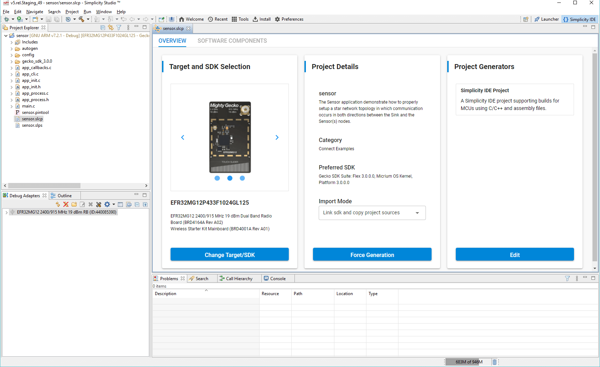
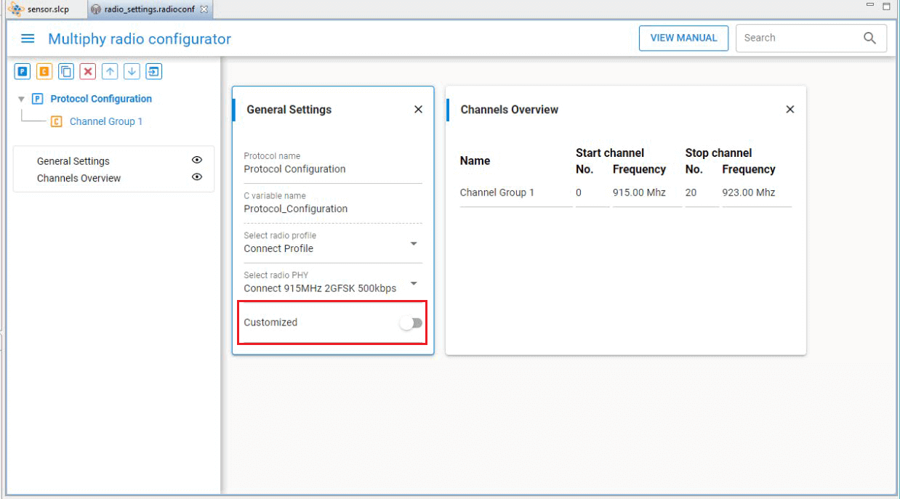
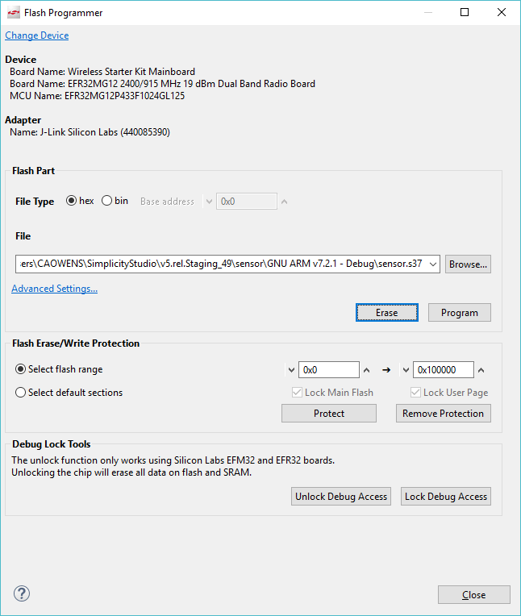

# QSG168: Proprietary Flex SDK v3.x Quick-Start Guide (Rev. 0.1) <!-- omit in toc -->

- [1. Proprietary Flex SDK 产品概述](#1-proprietary-flex-sdk-产品概述)
  - [1.1 关于 Connect 和 RAIL](#11-关于-connect-和-rail)
    - [1.1.1 Silicon Labs Connect](#111-silicon-labs-connect)
    - [1.1.2 Silicon Labs RAIL](#112-silicon-labs-rail)
    - [1.1.3 项目结构](#113-项目结构)
  - [1.2 Gecko Bootloader](#12-gecko-bootloader)
  - [1.3 Gecko Platform](#13-gecko-platform)
  - [1.4 先决条件](#14-先决条件)
  - [1.5 技术支持](#15-技术支持)
  - [1.6 文档](#16-文档)
- [2. Simplicity Studio 5 和 Proprietary Flex SDK 入门](#2-simplicity-studio-5-和-proprietary-flex-sdk-入门)
- [3. 使用示例应用](#3-使用示例应用)
  - [3.1 根据示例创建项目](#31-根据示例创建项目)
  - [3.2 组件配置](#32-组件配置)
  - [3.3 无线电配置](#33-无线电配置)
  - [3.4 Pin Tool](#34-pin-tool)
  - [3.5 编译和刷写应用程序](#35-编译和刷写应用程序)
    - [3.5.1 自动编译和刷写](#351-自动编译和刷写)
    - [3.5.2 手动编译和刷写](#352-手动编译和刷写)
  - [3.6 与示例交互](#36-与示例交互)
  - [3.7 使用自定义板](#37-使用自定义板)
- [4. 下一步](#4-下一步)
  - [4.1 Multi-Node Energy Profiler](#41-multi-node-energy-profiler)
  - [4.2 Network Analyzer](#42-network-analyzer)
  - [4.3 Simplicity Commander](#43-simplicity-commander)

该快速入门指南提供了使用 SimplicityStudio® 5 和 Silicon Labs Flex SDK v3.x 为 EFR32 配置、构建和安装应用程序的基本信息。Flex SDK 提供了两种应用开发路径。第一种是 Silicon Labs RAIL（Radio Abstraction Interface Layer，无线电抽象接口层），它是一种直观、通用的无线电接口层，旨在支持任意无线协议的实现。

第二种是使用 Silicon Labs Connect protocol stack，该协议栈提供了功能全面、易于自定义的无线网络解决方案，该解决方案针对要求低功耗且用于简单网络拓扑的设备进行了优化。

本指南是为那些不熟悉 Silicon Labs Flex SDK、Simplicity Studio 开发环境和 Silicon Labs 开发硬件的开发人员设计的。它提供了使用 EFR32 上 Flex SDK 随附的 Connect 和 RAIL 示例的入门说明。

所有 EFR32FG 设备均支持 Proprietary。对于其他产品，请在 Ordering Information > Protocol Stack 下查看设备的 datasheet，以了解是否支持 Proprietary。在 Proprietary SDK version 2.7.n 中，EFR32xG22 不支持 Connect。

# 1. Proprietary Flex SDK 产品概述

Silicon Labs Proprietary Flex SDK 为希望利用 Silicon Labs Connect 和基础 RAIL 库提供的可配置协议功能的开发者和希望在 RAIL 之上开始应用开发以开发自定义的 lower-level 无线电控制和网络协议的开发者提供支持。

本节内容包括：

* 有关 RAIL、Connect 和 Flex SDK 随附示例应用的背景信息
* 有关 Gecko Bootloader 的背景信息
* 使用 Flex SDK 开发应用程序的前提条件
* 支持
* 文档

## 1.1 关于 Connect 和 RAIL

Flex SDK 提供了两种应用开发路径。第一种是 Silicon Labs RAIL，它是一种直观、通用的无线电接口层，旨在支持任意无线协议的实现。第二种是使用 Silicon Labs Connect protocol stack，该协议栈提供了功能齐全、易于自定义的无线网络解决方案，该解决方案针对要求低功耗且用于简单网络拓扑的设备进行了优化。Connect 示例功能是通过易于配置的组件提供的，这些组件可以根据需要打开或关闭。

您是通过 Connect 还是 RAIL 开始开发取决于您在 Simplicity Studio 中选择作为起点的示例应用。如果您想包含以下功能而是进一步开发的情况下，Silicon Labs 建议您从 Connect 示例开始：

* MAC 层功能，包括跳频和安全性
* 网络形成和对星型网络、路由的支持
* Application-level 功能，包括诊断（diagnostics）、I/O、邮箱（mailbox）和 sleepy end device 管理
* 引导加载，包括 serial 和广播或单播 OTA（over-the-air）

以下各节提供有关 Connect 和 RAIL 的更多详细信息，包括示例应用的简要说明。当您基于示例创建项目时，Simplicity Studio IDE Overview 选项卡上的 Project Details 会提供有关示例以及与示例交互的更多详细信息。

### 1.1.1 Silicon Labs Connect

在 RAIL 库之上为 EFR32 实现了 Silicon Labs Connect 功能。Silicon Labs Connect 支持无线电调制、频率和数据速率的许多组合。该协议栈包含所有 MAC 层功能，如扫描和加入、建立点对点或星型网络，设备类型（如 sleepy end node、router 或 coordinators），无线电配置、跳频和每个地区的符合法规所需的 LBT（Listen Before Talk）协议以及为这些地区所作的 PHY 配置。借助已在协议栈中实现的这些功能，开发者可以专注于自己的应用开发，而不必担心较低级别的无线电和网络细节。

Flex SDK 包括许多 Connect 示例应用，包括以下内容。

* **(Connect) SoC - Empty** ：最小的 Connect 项目结构，用作自定义应用程序的起点。
* **(Connect) SoC - Empty Example DMP** ：动态多协议的最小项目结构，用作同时运行 Connect 和 Bluetooth 协议的自定义应用程序的起点。
* **(Connect) SoC - Direct mode Device** ：演示范围内节点之间的直接（direct）通信。网络参数由应用程序 commissioning。
* **(Connect) SoC - MAC Mode Device** ：演示范围内的节点之间的 direct MAC mode 通信。
* **(Connect) SoC - Sensor** 和 **(Connect) SoC - Sink** ：组合演示了如何设置星型网络拓扑，在该拓扑中，sink 和 sensor 节点之间发生双向通信。

### 1.1.2 Silicon Labs RAIL

Silicon Labs RAIL 提供了直观、通用的无线电接口层，旨在支持 proprietary 或 standards-based 无线协议。RAIL 作为库提供，您可以链接到您的应用程序。开发环境中提供了库功能的描述。RAIL API 记录在可通过 Simplicity Studio 获得的在线 API 参考中，也可以在线访问 [https://docs.silabs.com/](https://docs.silabs.com/) 来查看。

RAIL：

* 实现常用的无线电功能，因此不必将这些功能写入到应用程序或协议栈中。
* 使开发者不必成为复杂无线 SoC 的 RF 寄存器专家。
* 通过提供一个通用的无线电接口层，简化了代码向新无线 IC 的迁移以及新协议栈的开发。
* 除了开发应用代码外，还可以进行实验室评估。

RAIL 库支持以下 API：

* General Radio Operation
* Channel definition and selection
* Output power configuration
* Transmit
* Clear Channel Assessment before Transmit
* Scheduled Transmit
* Energy Detection
* Receive
* Packet Filtering
* Calibration
* CW (Carrier Wave) Transmission
* Modulated Transmission
* RFSense configuration as wake source

Flex SDK 包含示例 RAIL 应用代码，以演示设备能力和 RAIL 库功能。这些示例作为源代码提供，以提供应用开发的起点。当前版本中包含以下示例以及其他示例。

**(RAIL) RAILtest**

RAILtest 是 RAIL 库的一个常规测试工具。RAILtest 由负责 RAIL 库的核心工程团队开发。随着每个 RAIL 库功能的实现，将添加 RAILtest 串行命令以允许进行脚本化测试和临时实验。多个 RAILtest 串行命令可用于实验室评估。

RAILtest 包含以下命令：

* 发送和接收数据包。
* 在 RAIL 时基中的特定时间里调度传输。
* 配置 RAIL 地址过滤以仅接收特定的数据包。
* 启用 CCA 机制（CSMA/LBT），以在发送之前验证信道是否畅通。
* 在 RAIL 时基中设置定时器回调，以查看 RAIL 定时器 API 的工作方式。
* 在当前配置的频段内更改传输信道。
* 更改发射功率级别。
* 在 2.4 GHz 和/或 Sub-GHz 频段上启用指定持续时间的 RF 能量感应，并在此事件后唤醒。
* 输出连续的 unmodulated tone 以进行调试。
* 输出连续的 modulated PN9 stream 以进行调试。
* 进入 direct mode，在该模式下可以使用异步 GPIO 作为输入和输出来发送和接收数据。

**(RAIL) Range Test**

Range Test 示例可在使用 user-defined 参数定制的两个设备之间进行无线范围测试。Range Test 设计在 Silicon Labs WSTK 硬件上运行，而无需来自 host computer 的命令。此功能允许范围测试活动期间的移动性。

**(RAIL) Switch** ：演示灯和开关之间最简单的发送和接收操作交换。可以与 Bluetooth/RAIL 多协议示例中的 Bluetooth Light 应用程序一起使用，如 *QSG155: Using the Silicon Labs Dynamic Multiprotocol Demonstrations* 中所述。此示例的预编译二进制演示也可用于某些平台。

**(RAIL) Light** ：演示 RAIL 灯和 RAIL 开关之间最简单的发送和接收操作交换。灯能够定期更改，并向开关报告其状态。这不是动态多协议灯示例应用。

**(RAIL) Simple TRX Multi-PHY** ：演示使用可通过通道选择的多个 PHY。默认情况下，通道 0 配置为 2.4 GHz，250 kbps；而通道 1 配置为 915 MHz，500 kbps（两者的数据包都可以通过使用正确的预配置 PHY 的单个 PHY 应用程序接收）。有关详细信息，请参见 *AN971: EFR32 Radio Configurator Guide* 。

**(RAIL) Simple TRX** ：演示基于 RAIL 的最简单的发送和接收功能。

**(RAIL) Simple TRX with Auto-ACK** ：演示基于 RAIL 的两个节点之间最简单的交换发送和确认操作。

**(RAIL) Long Preamble Duty Cycle** ：演示如何使用长前导码实现 Rx 占空比。

**(RAIL) Burst Duty Cycle** ：演示如何使用重复传输来实现 Rx 占空比。

**(RAIL) Energy Mode** ：演示 EFR32 的低功耗模式（EM0 处于活动状态，EM1 处于睡眠状态，EM2 处于深度睡眠状态）。

**(RAIL) Empty Example** ：一个最小的 RAIL 项目结构，用作自定义应用程序的起点。

**(RAIL) WMBus Meter** ：实现无线 M-Bus 电表应用。有关详细信息，请参见 *AN1119: Using RAIL for Wireless M-Bus Applications with EFR32* 。使用 multi-PHY 配置器，并具有有限的 multi-PHY 功能，例如非对称双向模式。有关详细信息，请参见 *AN1253: EFR32 Radio Configurator Guide for Simplicity Studio 5* 。

**(RAIL) WMBus Collector** ：实现无线 M-Bus 收集器应用程序。有关详细信息，请参见 *AN1119: Using RAIL for Wireless M-Bus Applications with EFR32* 。使用 multi-PHY 配置器，有关详细信息，请参见 *AN1253: EFR32 Radio Configurator Guide for Simplicity Studio 5* 。

### 1.1.3 项目结构

项目始终包括以下部分：

* `autogen` 文件夹：仅 `autogen` 文件夹包含生成的代码。它包括 PHY 配置（`rail_config.c`）、初始化代码、链接器脚本以及组件使用的其他生成的代码（如 CLI 接口的命令描述符）。
* `config` 文件夹：组件配置头文件位于此文件夹中。可以使用 Simplicity IDE Component Editor 进行编辑，也可以直接编辑头文件。Component Editor 可通过 Project Configurator 的 **Configure** 控件使用，该控件仅可用于可配置的组件。
* `gecko_sdk` 文件夹（带有版本号）：包含由组件添加的源文件和二进制文件。
* 根文件夹中的文件：根文件夹中应仅包含应用程序特定的文件，包括源文件、项目配置器（`.slcp`）文件和 Pin Tool（`.pintool`）文件。

    

所有项目都包含 `main.c`，不建议对其进行修改。而应将初始化代码添加到 `app_init.c`，并在 `app_process.c` 中实现主循环。这样，System 组件可以初始化组件，并调用需要它的组件的“process”函数。此外，启用 RTOS 会将 `app_process` 的主循环转换为 RTOS 任务。

这些文件在 Connect 项目中也可用，并且可用于如初始化和处理任务（取决于是否运行协议栈）。但是，仍然建议使用 `emberAfInitCallback()` 和 `emberAfTickCallback()`，以便 Connect stack 可以优先在应用程序之前处理紧急的协议栈操作。

## 1.2 Gecko Bootloader

Bootloader 是一个存储在预留闪存（flash）中的程序，可以初始化设备、更新固件映像并可能执行某些完整性检查。Silicon Labs 的网络设备使用 bootloader 执行固件更新，其存在两种不同的模式：standalone（standalone bootloader）和 application（application bootloader）。Application bootloader 通过使用内部或外部存储器中存储的更新映像对闪存进行重新编程来执行固件映像更新。有关 bootloader 的更多信息，请参见 *UG103.6: Bootloader Fundamentals* 。

Gecko Bootloader 是一个代码库，可通过 Simplicity Studio IDE 对其进行配置，以生成可与各种 Silicon Labs 协议栈一起使用的 Bootloader。Bootloader 使用专门的固件更新映像格式。Gecko Bootloader 更新映像具有扩展名 `.gbl` 。

为 EFR32 设备提供的示例包括 Silicon Labs Gecko Bootloader 示例。提供了所有兼容的 Simplicity Studio SDK 的示例。有关使用 Gecko Bootloader 的更多信息，请参见 *UG266: Silicon Labs Gecko Bootloader User Guide*。

> 注意：使用 Gecko Bootloader 时，必须使用 Simplicity Commander 启用某些配置选项（如安全特性）。

## 1.3 Gecko Platform

Gecko Platform 是由驱动程序集和其他底层功能（可直接与 Silicon Labs 的芯片和模块进行交互）组成。Gecko Platform 组件包括 EMLIB、EMDRV、RAIL Library、NVM3 和 mbedTLS。有关 Gecko Platform 的详细信息，请参见 Simplicity Studio 的 Documentation 选项卡中的 release notes。

## 1.4 先决条件

在执行本指南中的步骤之前，您必须：

* 购买了 Wireless Gecko (EFR32) Portfolio Wireless Kits 之一。
* 安装了 Simplicity Studio 5 和 Flex SDK。开发硬件套件中随附的卡包含指向 Getting Started 页面的链接，该页面将引导您转到 Silicon Labs 软件产品的链接。有关 Connect 和 RAIL 以及这些组件的版本限制和兼容性限制，请参阅 *Flex SDK v3.x release notes* 。可在 *Simplicity Studio 5 User's Guide* 中找到安装 Simplicity Studio 5 和 Proprietary Flex SDK 的说明，该指南可从 [https://docs.silabs.com/](https://docs.silabs.com/) 中获得，也可以通过 Simplicity Studio 5 的 help 菜单获得。  Simplicity Commander 与 Simplicity Studio 一起安装。可以通过 Simplicity Studio 的 Tools 菜单访问功能受限的应用程序。通过在 Simplicity Commander 目录中打开命令提示符所调用的 CLI，可以访问大多数功能。有关更多信息，请参见 *UG162: Simplicity Commander Reference Guide* 。
* （可选）已安装 IAR Embedded Workbench for ARM（IAR EWARM）。请参阅 Release Notes 以查看 Flex SDK 支持的 IAR 版本。IAR 可以在 Simplicity Studio 开发环境中用作编译器，以替代 Simplicity Studio 随附的 GCC（The GNU Compiler Collection）。如下所述，从 Silicon Labs 支持门户网站下载受支持的版本。有关安装过程以及如何配置许可证的更多信息，请参考 IAR 安装程序的“QuickStart Installation Information”部分。

要获得 30 天的 IAR 评估许可证，请执行以下操作：

* 转到 Silicon Labs 支持门户，网址为 [https://www.silabs.com/support](https://www.silabs.com/support)。
* 向下滚动到页面底部，然后点击 **Contact Support** 。
* 如果您尚未登录，请登录。
* 点击 Software Releases 选项卡。在视图列表中，选择 **Development Tools** 。点击 **Go** 。其结果是指向发行说明中命名的 IAR-EWARM 版本的链接。
* 下载 IAR 软件包（大约需要 1 小时）。
* 安装 IAR。
* 在 IAR License Wizard 中，点击 **Register with IAR Systems to get an evaluation license** 。
* 完成注册，IAR 将提供 30 天的评估许可证。
* 一旦安装了 IAR-EWARM，下一次启动 Simplicity Studio 时，它会自动检测和配置 IDE 以使用 IAR-EWARM。

## 1.5 技术支持

您可以通过 Simplicity Studio 5 的 Welcome 视图下的 Learn and Support 访问在 [https://www.silabs.com/support](https://www.silabs.com/support) 中的 Silicon Labs 支持门户。在开发过程中，当您遇到任何技术问题时，可以使用支持门户以联系客户支持。

    

## 1.6 文档

可以通过 Simplicity Studio 5 中的 OVERVIEW 选项卡上的链接访问 Hardware-specific 文档。

    

SDK 文档和其它参考可以通过 Documentation 选项卡访问。

    

# 2. Simplicity Studio 5 和 Proprietary Flex SDK 入门

Simplicity Studio 5（SSv5）是一个免费的 Eclipse-based IDE，Silicon Labs 为其提供了一组 value-add 工具。开发者可以使用 SSv5 来开发、调试和分析 Flex 以及其他基于 Silicon Labs SDK 的应用程序。它的主要目的是减少开发时间，以便您可以专注于自己的应用程序，而不必研究硬件参考手册。

可通过 [https://docs.silabs.com/](https://docs.silabs.com/) 和 SSv5 help 菜单获得的在线的 *Simplicity Studio 5 User's Guide*，其提供了 SSv5 功能的概述和如何将其与 Flex SDK 一起使用，以及对各种 SSv5 工具和 perspective 的描述。

本指南假定您已下载了 SSv5 和 Flex SDK，并且熟悉 SSv5 Launcher perspective 的功能。

您应该连接好了您的 WSTK。

注意：为了在 Simplicity Studio 5 中获得最佳性能，请确保 WSTK 上的电源开关处于“AEM（Advanced Energy Monitoring）”位置，如下图所示。

    

# 3. 使用示例应用

本章提供有关使用 RAIL 和 Connect SoC 示例的说明。

Simplicity Studio 提供了多种使用示例应用开始项目的方法。可以通过 [https://docs.silabs.com/](https://docs.silabs.com/) 和 SSv5 help 菜单获得在线的 *Simplicity Studio 5 User's Guide* ，以了解这些方法。本指南使用 File > New > Silicon Labs Project Wizard 方法，因为它会引导您完成所有三个 Project Creation 对话框。

无论您如何开始，在 Simplicity Studio 中使用示例应用时，都将执行以下步骤：

* 选择一个示例应用并创建一个项目。
* 修改并生成无线电配置。
* 必要时修改代码。
* 编译应用程序并将其刷写到无线板上。

以下各节将介绍这些步骤。注意：您的 SDK 版本可能大于过程插图中显示的版本。

## 3.1 根据示例创建项目

1. 打开 SSv5 的 File 菜单，然后选择 **New > Silicon Labs Project Wizard** 。这将打开 **Target, SDK, and Toolchain Selection** 对话框。如果要将 toolchain 从默认的 GCC 更改为 IAR，请在此处进行操作。点击 **NEXT** 。

2. 将打开 Example Project Selection 对话框。使用 Technology Type 和 Keyword 过滤器搜索特定示例，在本例中为 **RAILtest** 。选中它，然后点击 **NEXT** 。

3. 将打开 Project Configuration 对话框。您可以在此处重命名项目、更改默认项目文件位置、以及确定是否链接或复制项目文件。请注意，如果您更改任何链接的资源，则引用该资源的任何其他项目也会更改。点击 **FINISH** ，将开始生成项目。

## 3.2 组件配置

新项目将在 Simplicity IDE Perspective 中打开，同时将 Project Configurator 打开到 OVERVIEW 选项卡。

默认配置设置将在已连接的开发板上使用，因此，在首次尝试开发套件时，建议保持不变，直接进行编译和刷写。

    

Flex SDK v3.x 项目采用了一个 Gecko Platform component-based 架构。可以通过组件库安装和配置软件功能。安装过程将：

1. 将相应的 SDK 文件从 SDK 文件夹复制到项目文件夹中。
2. 将给定组件的所有依赖项复制到项目文件夹中。
3. 将新的包含目录添加到项目设置。
4. 将配置文件复制到 `/config` 文件夹中。
5. 修改相应的 auto-generated 文件，以将组件集成到应用程序中。

另外，“init”类型的软件组件将利用给定组件的相应配置文件作为输入来为给定组件实现初始化代码。

某些软件组件（如父级支持）将完全集成到应用程序中，以执行特定任务，而无需任何其他代码，而其他组件则提供要在应用程序中使用的 API。

要查看组件库，请转到 SOFTWARE COMPONENTS 选项卡。

    

通过安装、卸载，和配置组件来配置项目。已安装的组件将被复选。可配置组件带有齿轮符号。选择一个组件以查看有关它的信息。许多过滤器以及关键字搜索可帮助您探索各种组件类别。请注意，将显示所有已安装的 SDK 的组件。有关通过 Simplicity IDE perspective 和 Project Configurator 可用的功能的详细信息，请参见在线的 *Simplicity Studio 5 User's Guide* 。

如果组件是可配置的，则可以点击 **CONFIGURE** 以打开 Component Editor。

    

您所做的任何更改都会自动保存，并且项目文件也会自动生成。进度显示在 Simplicity IDE perspective 的右下角。

    

## 3.3 无线电配置

关闭 Component Editor，然后展开 **Advanced Configurators** 组件分组。选择 Radio Configurator，然后点击 **Open** 。它将在 Radio Configurator 中打开 `/config/rail` 文件夹中的 `radio_settings.radioconf` 文件。

    

选择一个无线电配置文件（profile），以及所选配置文件的预定义无线电 PHY。然后，您可以通过打开 **Customized** 来自定义 PHY。在 Radio Configurator 中所做的更改不会自动保存。将更改保存到 `radio_settings.radioconf` 时，无线电配置将自动生成并保存在 `/autogen/rail_config.h` 和 `/autogen/rail_config.c` 文件中。有关使用 Radio Configurator 的更多信息，请参见 *AN1253: EFR32 Radio Configurator Guide for Simplicity Studio 5* 。

    

## 3.4 Pin Tool

在 Advanced Configurators 分组中，选择 Pin Tool，然后点击 **Open** 。它将在 Pin Tool 中打开项目的文件 `<project>.pintool`，使用该工具可以轻松地配置新外设或更改现有外设的属性。您也可以在 Project Explorer 视图中双击文件 `<project>.pintool` 以将其打开。

    

双击 Software Component 以打开 Component Editor 并配置该功能。Pin Tool 不会自动保存。

## 3.5 编译和刷写应用程序

您可以自动编译和刷写应用程序，也可以手动编译然后刷写它。

### 3.5.1 自动编译和刷写

您可以在 Simplicity IDE 中自动编译应用程序并将其刷写到已连接的开发硬件。单击 **Debug** 控件。

    

进度显示在控制台中，进度条显示在右下方。

    

构建和刷写完成后，将显示 Debug perspective。单击 **Resume** 控件以启动在 WSTK 上运行的应用程序。

    

**Resume** 控件旁边是 **Suspend** 、 **Disconnect** 、 **Reconnect** 和 **stepping** 控件。准备退出调试模式时，请单击 **Disconnect** 。

    

### 3.5.2 手动编译和刷写

生成项目文件后，不要单击 Simplicity IDE 中的 **Debug** ，而是单击顶部工具栏中的 **Build** 控件（锤子图标）。

示例应用将基于其构建配置进行编译。您可以随时通过右键单击 Project Explorer 视图中的项目目录并打开 **Build Configurations > Set Active** 来更改构建配置。

您也可以通过打开 IAR-EWARM 并在 IAR 中打开生成的项目文件，以直接在 IAR-EWARM 中构建应用程序。要生成用于 IAR-EWARM 的文件，请转到 Project Configurator 的 OVERVIEW 选项卡，然后编辑 Project Generators 以包含 IAR EMBEDDED WORKBENCH PROJECT。保存更改后，将创建 `.eww` 文件。

    

1. 打开 IAR-EWARM。
2. 选择 **File > Open > Workspace** ，然后导航到为示例应用选择的位置。
3. 选中应用程序 `.eww` 文件，然后单击 **Open** 。
4. 选择 **Project > Make** 或按 F7。如果应用程序的构建没有错误，则可以准备将映像安装在设备上。

您可以通过 Project Explorer 视图加载二进制映像。在 `Binaries` 子目录中找到 `<project>.bin`、`.hex` 或 `.s37` 文件。

    

右键该文件，然后选择 **Flash Programmer** 。这将打开 Flash Programmer，并填充文件路径。单击 **Program** 。

    

## 3.6 与示例交互

根据示例应用的不同，您也许可以通过 WSTK 主板的按钮、LED 和 LCD 以及开发环境的 Console 界面（使用 CLI）与之交互。

要启动 Console 界面，请在 Simplicity IDE perspective 中，右键 Debug Adapters 视图中的调试适配器。选择 **Launch Console** 。或者，从 Simplicity IDE 工具栏中的 Tools 图标，或在 Launcher perspective 中的 COMPATIBLE TOOLS 选项卡上，选择 **Device Console** 。选择 Serial 1 选项卡，然后键入回车以从示例应用 CLI 中获得提示。

    

在 RAILtest 应用程序中，Console 界面允许测试任何 RAIL 功能。输入 “help” 以获取可用的 CLI 命令列表。

为了进行简单的无线电功能测试，请在两个无线板上刷写相同的 RAILtest 二进制文件，然后为每个无线板打开一个 Console。确保将天线连接到每个无线板上（如果适用）。RAILtest 在两块板上均以 RX 状态启动。

在第一个 Console 窗口中输入 **tx 1** 。第一个无线节点将发送一个数据包，然后返回到 RX 状态。第二个无线节点将在其 Console 窗口中报告接收到的数据包。

在第二个 Console 窗口中输入 **tx 1** 。第二个无线节点将发送一个数据包，然后返回到 RX 状态。第一个无线节点将在其 Console 窗口中报告接收到的数据包。

下图显示了该过程结束时的 Console。

    

## 3.7 使用自定义板

使用自定义板时，有两种方法可用，具体取决于您的需求：

* 在 WSTK 上创建一个示例，然后使用 **Change Target/SDK** 控件在 Project Configurator 的 OVERVIEW 选项卡上移除 WSTK。这样，套件的布线将被保留，但是您可以使用 Pin Tool 对其进行更改。
* 创建仅包含部件而不包含 WSTK 的示例，并使用 Pin Tool 为示例的所有必需外设（如按钮或引脚）设置接线。

请注意，如果您从项目中删除 WSTK，则 WSTK 还可以依赖于被删除的组件（通常是外设初始化组件）。

# 4. 下一步

## 4.1 Multi-Node Energy Profiler

Multi-Node Energy Profiler 是一个 add-on 工具，您可以使用它轻松地在运行时测量设备的功耗。您可以轻松找到峰值和平均功耗，并检查睡眠模式电流。

要对当前项目进行 profile，请在 Simplicity IDE perspective 中下拉 Profile 菜单（），然后选择 **Profile as / Simplicity Energy Profiler target**。这将自动构建您的项目，将其上传到设备，然后启动 Energy Profiler。Energy Profiler perspective 将呈现出来，如下图所示。

    

有关如何使用此工具的详细信息，请参阅 *UG343: Multi-Node Energy Profiler User's Guide*。您可以使用当前 perspective 右上角的 Perspective 按钮在 Simplicity IDE 和 Energy Profiler perspective 之间切换。

    

您可以在功耗图中看到了峰值。通过点击 Play  暂停分析，点击其中的一个峰，然后使用时间轴（y 轴）缩放，直到看到三个可区分的峰。这些代表了在三个广告通道上发送的三个广告包。如果您启用了右上角的 Rx/Tx 视图，则还可以在下面的 Rx/Tx 栏中看到三个对应的 Tx 事件。请注意，现在的最高功耗可能会比之前在图表上显示的大。这是因为在缩小模式下，显示的值是平均值。如果需要精确值，请始终放大。要测量平均功耗，只需在一段时间内点击并拖动鼠标即可。右上角会出现一个新窗口，显示给定间隔的功耗信息。也可以测量总体平均值，但这会受到瞬态事件的影响。

    

Multi-node Energy Profiler 还能够同时测量多个设备的功耗。要开始测量新设备，请点击 Quick Access 菜单（左上角），然后选择 **Start Energy Capture** 。要停止测量，请点击 Quick Access 菜单，然后选择 **End/Save session** 。

    

要了解此工具的更多信息，请参阅 *UG343: Multi-Node Energy Profiler User's Guide* 。

## 4.2 Network Analyzer

Silicon Labs Network Analyzer 是一个免费的数据包捕获和调试工具，可用于调试 Wireless Gecko 与其他设备之间的连接。它以网络流量、活动和持续时间的图形视图极大地加速了网络和应用程序的开发过程。

Packet Trace 应用程序直接从 Wireless Gecko SoC 和 module 上可用的 PTI（Packet Trace Interface）中捕获数据包。因此，与 air-based 捕获相比，它可以更准确地捕获数据包。

  

## 4.3 Simplicity Commander

Simplicity Commander 是一个简单的刷写工具，可用于通过 J-Link 接口刷写固件映像、擦除 flash、锁定和解锁调试访问以及对 flash 页进行写保护。GUI 和 CLI 均可使用。有关更多信息，请参阅 *UG162: Simplicity Commander Reference Guide* 。

  

