# QSG169: Bluetooth® SDK v3.x Quick-Start Guide (Rev. 0.3) <!-- omit in toc -->

- [1. 引言](#1-引言)
  - [1.1 先决条件](#11-先决条件)
  - [1.2 支持](#12-支持)
  - [1.3 文档](#13-文档)
  - [1.4 Gecko Platform](#14-gecko-platform)
- [2. 关于 Bluetooth 协议栈](#2-关于-bluetooth-协议栈)
  - [2.1 Bluetooth 协议栈特性](#21-bluetooth-协议栈特性)
  - [2.2 Bluetooth Qualification](#22-bluetooth-qualification)
  - [2.3 Bluetooth Stack API](#23-bluetooth-stack-api)
    - [2.3.1 BGAPI Bluetooth API](#231-bgapi-bluetooth-api)
    - [2.3.2 CMSIS 和 emlib](#232-cmsis-和-emlib)
    - [2.3.3 BGAPI Serial Protocol 和 BGLIB Host API](#233-bgapi-serial-protocol-和-bglib-host-api)
    - [2.3.4 Bluetooth Profile Toolkit GATT Builder](#234-bluetooth-profile-toolkit-gatt-builder)
  - [2.4 关于 Bluetooth SDK](#24-关于-bluetooth-sdk)
    - [2.4.1 Libraries](#241-libraries)
    - [2.4.2 Include Files](#242-include-files)
    - [2.4.3 Platform Components](#243-platform-components)
- [3. 关于 Demo 和 Example](#3-关于-demo-和-example)
  - [3.1 Demo/Example 说明](#31-demoexample-说明)
- [4. Bluetooth Demo 入门](#4-bluetooth-demo-入门)
  - [4.1 准备 WSTK](#41-准备-wstk)
  - [4.2 刷写 Demo](#42-刷写-demo)
  - [4.3 使用 Android 或 iOS 智能手机测试 Bluetooth Demo](#43-使用-android-或-ios-智能手机测试-bluetooth-demo)
    - [4.3.1 测试 NCP Empty Demo](#431-测试-ncp-empty-demo)
    - [4.3.2 测试 iBeacon Demo](#432-测试-ibeacon-demo)
    - [4.3.3 测试 Health Thermometer Demo](#433-测试-health-thermometer-demo)
- [5. 开始应用开发](#5-开始应用开发)
  - [5.1 GATT 数据库](#51-gatt-数据库)
  - [5.2 组件配置](#52-组件配置)
  - [5.3 构建和刷写](#53-构建和刷写)
  - [5.4 启用现场更新](#54-启用现场更新)
- [6. 开发工具](#6-开发工具)
  - [6.1 GATT Configurator](#61-gatt-configurator)
  - [6.2 Pin Tool](#62-pin-tool)
  - [6.3 Multi-Node Energy Profiler](#63-multi-node-energy-profiler)
  - [6.4 Network Analyzer](#64-network-analyzer)
  - [6.5 Simplicity Commander](#65-simplicity-commander)
  - [6.6 BGTool Application](#66-bgtool-application)
  - [6.7 IAR Embedded Workbench](#67-iar-embedded-workbench)

本文档介绍了如何使用 Bluetooth SDK v3.x、Simplicity Studio® 5、及兼容的 WSTK（Wireless Starter Kit）进行 Bluetooth 开发。如果您购买了 Blue Gecko Bluetooth Wireless Starter Kit，则可以先使用预编译的 demo 和 Android/iOS app 进行试验，然后再开发自己的应用程序。

> 如果要使用 Simplicity Studio 4 和 Bluetooth SDK v2.x，那么请阅读 *QSG139: Bluetooth® SDK v2.x Quick Start Guide* 中相应的内容。

# 1. 引言

本文档介绍了如何使用 Silicon Labs 产品进行 Bluetooth 开发。它介绍了 Silicon Labs Bluetooth stack v3.x 的特性以及可用于帮助开发的资源。使用 Silicon Labs 开发环境 Simplicity Studio 5 和  Bluetooth Software Development Kit (SDK) v3.x 开始开发应用程序。SDK 附带了许多示例应用，您可以对其进行修改以创建自己的应用。如果您正在使用 EFR32BG 设备进行开发并购买了 Blue Gecko Bluetooth Wireless Starter Kit，那么您可以使用预编译的 demo 和 Android/iOS app 来演示 Bluetooth 软件特性。

本文档介绍了以下内容：

* Bluetooth 协议栈特性和组件（参阅 [2. 关于 Bluetooth 协议栈](#2-关于-bluetooth-协议栈)）
* 有关预编译的 demo 的说明以及 SDK 中可用的示例代码（参阅 [3. 关于 Demo 和 Example](#3-关于-demo-和-example)）
* 如何使用 iOS 或 Android app 测试预构建的 demo（参阅 [4. Bluetooth Demo 入门](#4-bluetooth-demo-入门)）
* 如何在 Simplicity Studio 中开发自己的应用程序（参阅 [5. 开始应用开发](#5-开始应用开发)）
* 对开发过程中有用的其他工具的描述（参阅 [6. 开发工具](#6-开发工具)）

## 1.1 先决条件

在开始应用开发之前，您应该：

* 基本了解 Bluetooth 技术和术语。如果您尚未了解 Bluetooth，则 *UG103.14: Bluetooth LE Fundamentals* 能给你提供一个很好的起点。
* 购买了 Blue Gecko Bluetooth Wireless Starter Kit 或其他兼容的目标硬件。
* 在 Silicon Labs 上创建了一个帐户。这是下载 Silicon Labs Bluetooth SDK 必需的。
  * 您可以在 [https://siliconlabs.force.com/apex/SL_CommunitiesSelfReg?form=short](https://siliconlabs.force.com/apex/SL_CommunitiesSelfReg?form=short) 上注册。
* 下载了 Simplicity Studio 5 和 Silicon Labs Bluetooth SDK，并大体上熟悉 SSv5 Launcher。可以在线上的 *Simplicity Studio 5 User's Guide* 中找到 SSv5 的安装与入门说明以及一些详细的参考，该指南可从 [https://docs.silabs.com/](https://docs.silabs.com/) 和 SSv5 的帮助菜单上获得。
* 获得了兼容的编译器：
  * Simplicity Studio 带有免费的 GCC C 编译器。
  * IAR Embedded Workbench for ARM (IAR-EWARM) 也可以用作 Silicon Labs Bluetooth 项目的编译器。您可以参阅 Bluetooth SDK 的 release notes 以获取兼容的 IAR-EWARM 版本。安装 IAR-EWARM 后，Simplicity Studio 下次启动时将自动检测并配置 IDE 以使用 IAR-EWARM。

要获得 30 天的 IAR-EWARM 评估许可证，请执行以下操作：

* 转到 Silicon Labs 支持门户，[https://www.silabs.com/support](https://www.silabs.com/support)。
* 向下滚动到页面底部，然后点击 **Contact Support** 。
* 如果您尚未登录，请登录。
* 点击 Software Releases 选项卡。在视图列表中，选择 **Development Tools** 。点击 **Go** 。这将跳转到 release notes 中命名的 IAR-EWARM 版本的链接。
* 下载 IAR 安装包（大约需要 1 个小时）。
* 安装 IAR。
* 在 IAR License Wizard 中，点击 **Register with IAR Systems to get an evaluation license** 。
* 完成注册，IAR 将提供 30 天的评估许可证。
* 安装 IAR-EWARM 后，Simplicity Studio 下次启动时将自动检测并配置 IDE 以使用 IAR-EWARM。

## 1.2 支持

您可以通过 Simplicity Studio 5 的欢迎页下的 Learn and Support 访问 [Silicon Labs 支持门户](https://www.silabs.com/support)。在开发过程中遇到问题时，可以使用支持门户联系客户支持。

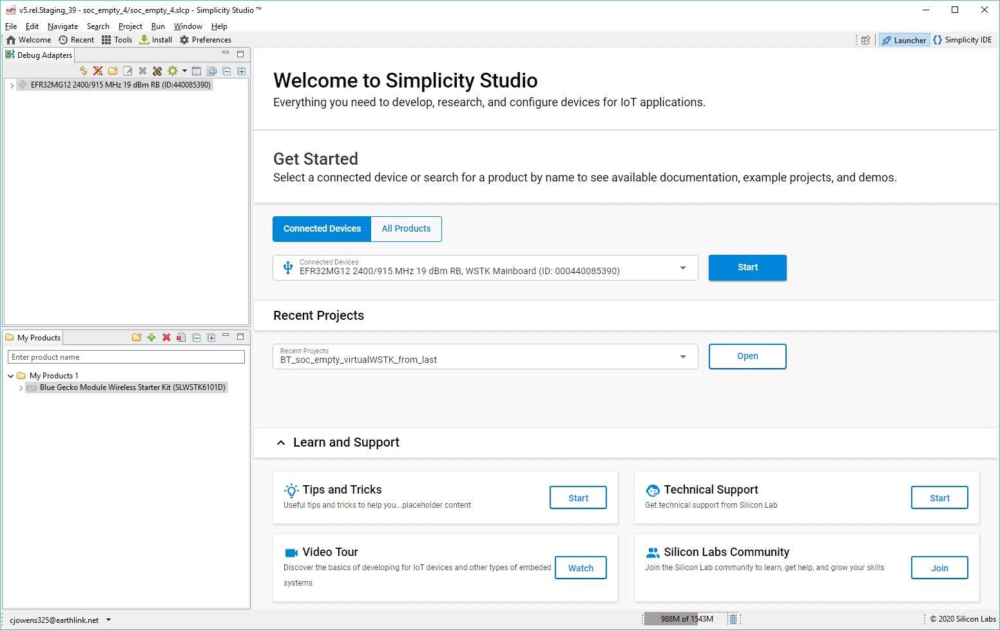

## 1.3 文档

Hardware-specific 的文档可以通过 Simplicity Studio 5 中的 Overview 选项卡上的链接进行访问。

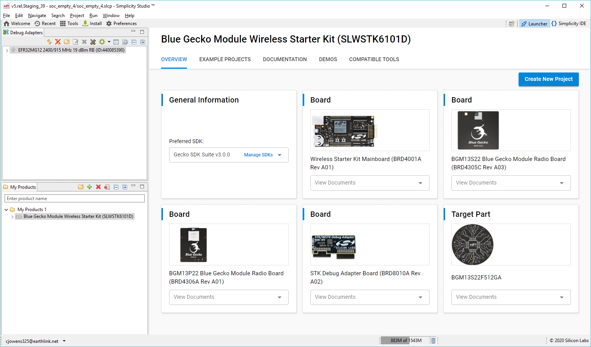

可通过 Documentation 选项卡获得 SDK 文档、用户指南和其他参考。

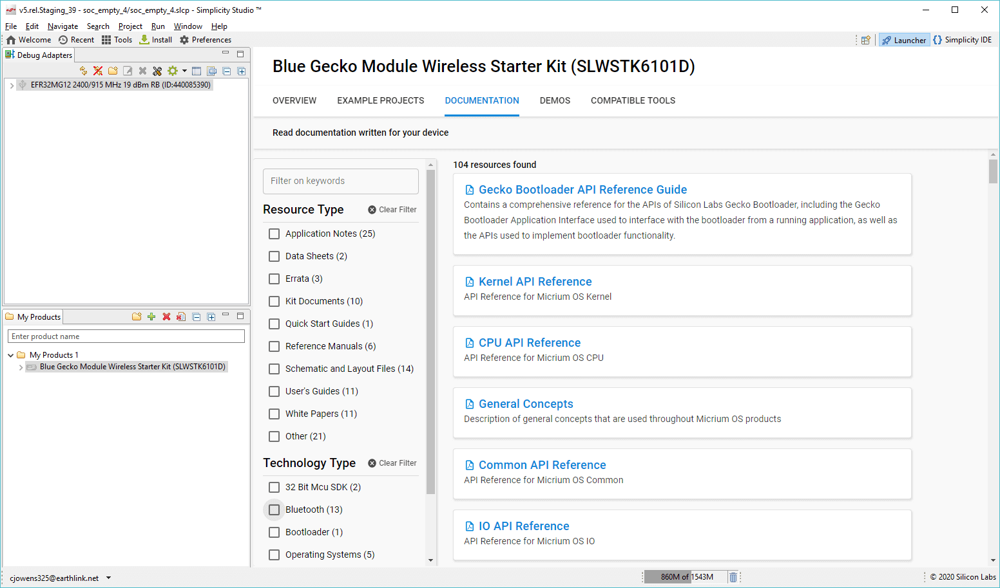

可以在线上获取 Bluetooth API 参考以及其他有用的文档和代码示例：[https://docs.silabs.com/bluetooth/latest/](https://docs.silabs.com/bluetooth/latest/)

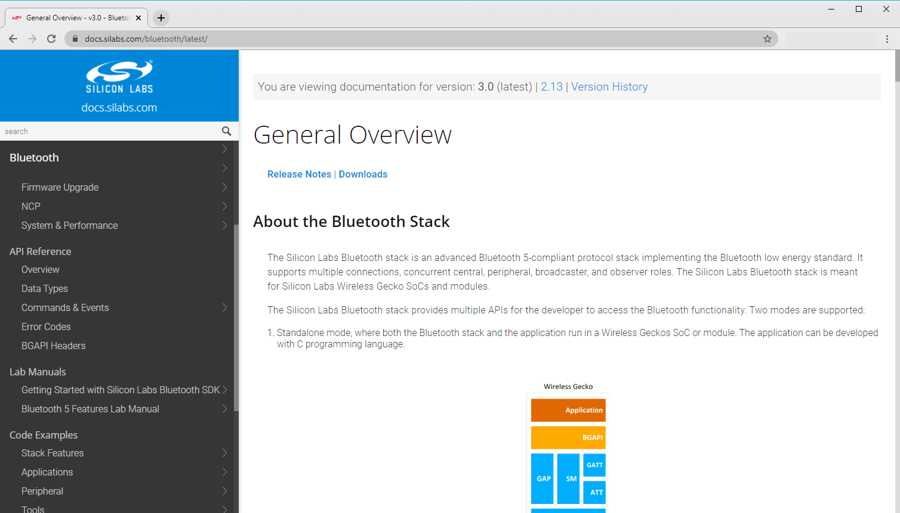

培训材料可在 Silicon Labs 网站上找到：[https://www.silabs.com/support/training/bluetooth](https://www.silabs.com/support/training/bluetooth)。

下图汇总了 Bluetooth SDK 的关键文档。

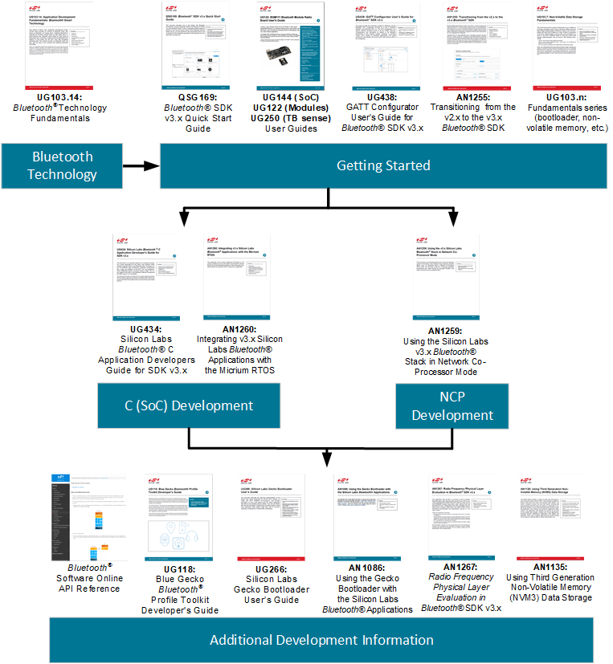

## 1.4 Gecko Platform

Gecko Platform 是驱动程序和其他底层功能（可直接与 Silicon Labs chip 和 module 进行交互）的集合。Gecko Platform 组件包括 EMLIB、EMDRV、RAIL Library、NVM3 和 mbedTLS。有关 Gecko Platform 的更多信息，请参阅 Simplicity Studio 的 Documentation 选项卡中的 release notes。

# 2. 关于 Bluetooth 协议栈

v3.x Silicon Labs Bluetooth stack 是一个实现 BLE 标准的 advanced Bluetooth 5-compliant protocol stack。它支持多个连接、可同时存在 central、peripheral、broadcaster 和 observer 角色。v3.x Silicon Labs Bluetooth stack 适用于 Silicon Labs Wireless Gecko SoC 和 module。

Silicon Labs Bluetooth stack 为开发人员提供了多个 API，以访问 Bluetooth 功能。它支持两种模式：

1. Standalone 模式，Bluetooth 协议栈和应用程序均在 Wireless Geckos SoC 或 module 中运行。可以使用 C 语言开发这种应用程序。
    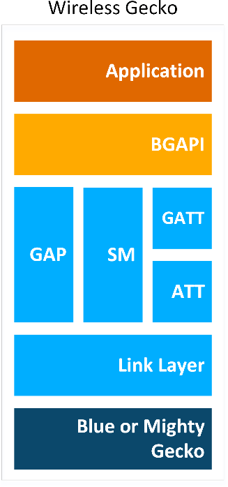
2. NCP（Network Co-Processor，网络协处理器）模式，其中 Bluetooth 协议栈在 Wireless Gecko 中运行，而应用程序在单独的 host MCU 上运行。对于此用例，可以将 Bluetooth 协议栈配置为 NCP 模式，其中 API 通过诸如 UART 之类的串行接口暴露出来。
    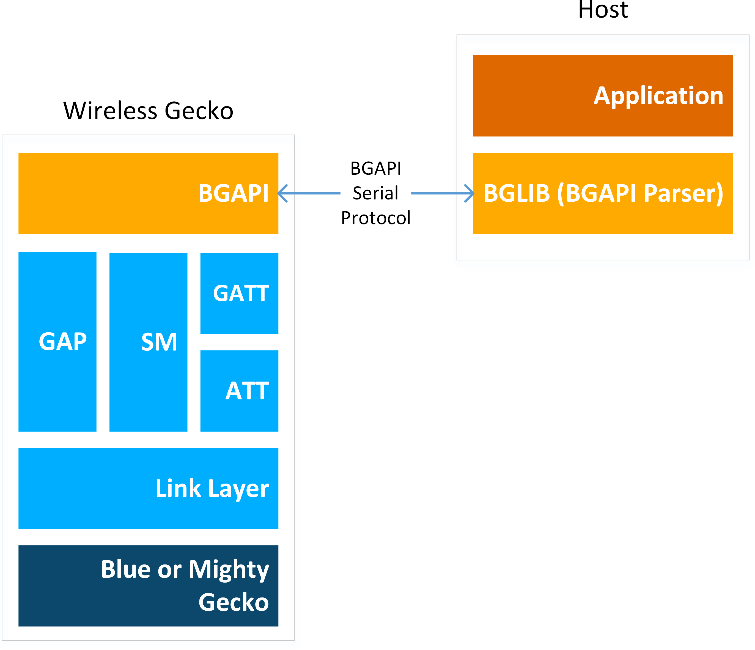

## 2.1 Bluetooth 协议栈特性

下表列出了 Silicon Labs Bluetooth stack 的特性。

<table>
<thead>
  <tr>
    <th>Feature</th>
    <th>Value and comments</th>
  </tr>
</thead>
<tbody>
  <tr>
    <td style="white-space: nowrap">Bluetooth version</td>
    <td style="white-space: nowrap">Bluetooth 5.2</td>
  </tr>
  <tr>
    <td style="white-space: nowrap">Bluetooth features</td>
    <td style="white-space: nowrap">Bluetooth 5.2 GATT caching  Bluetooth 5 2M PHY (EFR32[B|M]G12, EFR32[B|M]G13, EFR32[B|M]G21, and EFR32[B|M]G22)  Bluetooth 5 LE Long Range (EFR32[B|M]G13, EFR32[B|M]G21, and EFR32[B|M]G22)  Bluetooth 5 advertisement sets and scan event reporting  Bluetooth 5 extended advertisements (EFR32[B|M]G12, EFR32[B|M]G13, EFR32[B|M]G21, and EFR32[B|M]G22)
    <ul>
      <li>Anonymous advertisement</li>
      <li>Periodic advertisement</li>
      <li>Extended advertisement packet size: up to 1650 B</li>
    </ul>
    Concurrent central, peripheral, broadcaster and observer modes LE secure connections  LE Privacy 1.2 (peripheral) LE packet length extensions LE dual topology  Whitelisting (central side only)</td>
  </tr>
  <tr>
    <td style="white-space: nowrap">Simultaneous connections</td>
    <td style="white-space: nowrap">Up to 32 simultaneous connections regardless of role (master or slave)</td>
  </tr>
  <tr>
    <td style="white-space: nowrap">Maximum throughput</td>
    <td style="white-space: nowrap">1300 kbps over 2M PHY  700 kbps over 1M PHY</td>
  </tr>
  <tr>
    <td style="white-space: nowrap">Encryption</td>
    <td style="white-space: nowrap">AES-128</td>
  </tr>
  <tr>
    <td style="white-space: nowrap">Pairing modes</td>
    <td style="white-space: nowrap">Just works  Man-in-the-Middle with numeric comparison and passkey Out-Of-Band</td>
  </tr>
  <tr>
    <td style="white-space: nowrap">Number of simultaneous bondings</td>
    <td style="white-space: nowrap">EFR32[B|M]G1, EFR32[B|M]G12 and EFR32[B|M]G13: Up to 13 when using PS, up to 32 with NVM3 EFR32[B|M]G21, EFR32[B|M]G22: Up to 32</td>
  </tr>
  <tr>
    <td style="white-space: nowrap">Link Layer packet size</td>
    <td style="white-space: nowrap">Up to 251 B</td>
  </tr>
  <tr>
    <td style="white-space: nowrap">ATT protocol packet size</td>
    <td style="white-space: nowrap">Up to 250 B</td>
  </tr>
  <tr>
    <td style="white-space: nowrap">Supported Bluetooth profiles and services</td>
    <td style="white-space: nowrap">All GATT based profiles and services are supported</td>
  </tr>
  <tr>
    <td style="white-space: nowrap">Apple HomeKit</td>
    <td style="white-space: nowrap">Apple HomeKit R15-compliant implementation (EFR32[B|M]12, EFR32[B|M]13, EFR32[B|M]21, and EFR32[B|M]G22)  Implements all Apple HomeKit profiles and services Available separately for Apple MFi licensees</td>
  </tr>
  <tr>
    <td style="white-space: nowrap">Host (NCP) interfaces</td>
    <td style="white-space: nowrap">4-wire UART with RTS/CTS control or 2-wire UART without RTS/CTS  GPIOs for sleep and wake-up management</td>
  </tr>
  <tr>
    <td style="white-space: nowrap">Wi-Fi Coexistence</td>
    <td style="white-space: nowrap">Using Packet Trace Arbitration (PTA)</td>
  </tr>
  <tr>
    <td style="white-space: nowrap">Bootloaders</td>
    <td style="white-space: nowrap">Secure Gecko Bootloader supporting authenticated and encrypted updates over OTA or UART and Secure Boot. The Gecko Bootloader also supports flash partitioning and both internal and external (SPI) flash.</td>
  </tr>
  <tr>
    <td style="white-space: nowrap">Non-volatile memory</td>
    <td style="white-space: nowrap">EFR32[B|M]G1, EFR32[B|M]G12, EFR32[B|M]G13: NVM3 or Persistent Store (PS)* EFR32[B|M]G21, EFR32[B|M]G22: NVM3</td>
  </tr>
  <tr>
    <td colspan="2">* Example applications in the SDK that are generated for these platforms will use PS by default.</td>
  </tr>
</tbody>
</table>

## 2.2 Bluetooth Qualification

所有采用 Bluetooth 技术的产品都必须通过 Bluetooth SIG's Qualification Process。可以通过线上的 [Bluetooth Qualification Process](https://www.bluetooth.com/develop-with-bluetooth/qualification-listing/qualification-consultants/) 和 [Launch Studio](https://www.bluetooth.org/OTV/new_vids/launch-studio-SG-English/content/index.html#/?_k=esxjsd) 上的教程了解更多信息。Launch Studio 是用于完成 Bluetooth Qualification Process 的在线工具。如果您认证设备时需要协助，则可以考虑与离您最近的 [Bluetooth Qualification Consultant](https://www.bluetooth.com/develop-with-bluetooth/qualification-listing/qualification-consultants/) 联系。

基于 Silicon Labs 的 Bluetooth 协议栈对最终产品进行认证时，您将集成下表中列出的通过资格预审的组件，具体取决于用于构建应用程序的 SDK 版本。

<table>
<thead>
  <tr>
    <th style="white-space: nowrap" rowspan="2">Bluetooth SDK version</th>
    <th>Component</th>
    <th>QDID</th>
  </tr>
</thead>
<tbody>
  <tr>
    <td style="white-space: nowrap" rowspan="2">v2.6.x up to 2.10.x</td>
    <td style="white-space: nowrap">Link layer (Bluetooth 5.0) [*]</td>
    <td style="white-space: nowrap"><a href="https://launchstudio.bluetooth.com/ListingDetails/11850">99504</a></td>
  </tr>
  <tr>
    <td style="white-space: nowrap">Host stack (Bluetooth 5.0) [*]</td>
    <td style="white-space: nowrap"><a href="https://launchstudio.bluetooth.com/ListingDetails/11849">101550</a></td>
  </tr>
  <tr>
    <td style="white-space: nowrap" rowspan="3">v2.10.x up to 2.13.x</td>
    <td style="white-space: nowrap">Link Layer (Bluetooth 5.0 – including coded PHYs)</td>
    <td style="white-space: nowrap"><a href="https://launchstudio.bluetooth.com/ListingDetails/76437">124272</a></td>
  </tr>
  <tr>
    <td style="white-space: nowrap">Link Layer (Bluetooth 5.1)</td>
    <td style="white-space: nowrap"><a href="https://launchstudio.bluetooth.com/ListingDetails/80713">127618</a></td>
  </tr>
  <tr>
    <td style="white-space: nowrap">Host stack (Bluetooth 5.1)</td>
    <td style="white-space: nowrap"><a href="https://launchstudio.bluetooth.com/ListingDetails/78937">126252</a></td>
  </tr>
  <tr>
    <td style="white-space: nowrap" rowspan="2">v2.13.x and above</td>
    <td style="white-space: nowrap">Link Layer (Bluetooth 5.2)</td>
    <td style="white-space: nowrap"><a href="https://launchstudio.bluetooth.com/ListingDetails/105576">147971</a></td>
  </tr>
  <tr>
    <td style="white-space: nowrap">Host stack (Bluetooth 5.2)</td>
    <td style="white-space: nowrap"><a href="https://launchstudio.bluetooth.com/ListingDetails/104376">146950</a></td>
  </tr>
  <tr>
    <td colspan="3">[*] For end-product qualifications based on this component, because of the Erratum 10734 you must also check the items 21/17 and 34/13 in the "Summary ICS" and upload the test evidence and a declaration, which can be requested through the support portal.</td>
  </tr>
</tbody>
</table>

> 注意：根据 [Bluetooth SIG Qualification Program Reference Document (PRD)](https://www.bluetooth.com/develop-with-bluetooth/qualification-listing/)，对于新的最终产品列表（EPLs，End Product Listing），被测组件的评估日期必须少于三年。QDID 到期后，将使用比过时的 QDID 使用的 SDK 版本更新的 SDK 版本，以使您的产品合格。您可以通过在 [Launch Studio](https://launchstudio.bluetooth.com/Listings/Search) 的搜索栏中输入 Silicon Laboratories 来浏览我们的有效合格组件及其评估日期。

上述基于软件的资格预审组件是在进行“Qualification Process with Required Testing”时要集成的三个组件中的两个。尽管有“Required Testing”，但客户无需进行任何其他测试，因为测试报告已嵌入在资格预审的组件中，可供 SIG 审核。

除了这两个软件组件之外，您还必须在最终产品清单中集成合格的 RF-PHY 组件。如果您要使用 Silicon Labs 的 Bluetooth module 进行设计，请参考 module datasheet 以获取要使用的适当组件 QDID。如果您使用 SoC 进行设计，则可能需要根据您的硬件设计，通过 Bluetooth SIG 获得自己的 RF-PHY 认证。在后一种情况下，请通过支持门户咨询附近的 [Bluetooth Qualification Consultant](https://www.bluetooth.com/develop-with-bluetooth/qualification-listing/qualification-consultants/) 或 Silicon Labs，以了解是否可以使用现有的 Silicon Labs RF-PHY 资格预审。

Silicon Labs 不提供资格预审的资料。客户必须向其提供其最终应用程序，这些应用程序将根据 SIG profile specification 实现功能。

## 2.3 Bluetooth Stack API

本节简要介绍了可供开发人员使用的各种软件 API。

### 2.3.1 BGAPI Bluetooth API

BGAPI 是 Silicon Labs Bluetooth stack 提供的 Bluetooth API。它提供对由 Bluetooth 协议栈实现的所有 Bluetooth 功能的访问，如：GAP（Generic Access Profile）、连接管理器、安全管理器（SM，security manager）以及 GATT 客户端和服务端。

除了 Bluetooth API，BGAPI 还提供对其他一些功能的访问，如用于射频测试目的的 DTM（Direct Test Mode，直接测试模式）API、用于在设备 flash 中读写键（key）的 PS（Persistent Store，持久化存储）API、用于现场固件更新的 DFU（Device Firmware Update，设备固件更新）API 和用于各种系统级功能的 System API。

### 2.3.2 CMSIS 和 emlib

CMSIS（Cortex Microcontroller Software Interface Standard）是所有 ARM Cortex 设备的通用编码标准。Silicon Labs 提供的 CMSIS 库包含所有设备的头文件、定义（外设、寄存器和位域）和启动文件。此外，CMSIS 包含所有 Cortex 设备通用的功能（如中断处理、内部功能等）。尽管可以使用硬编码的地址和数据值写入寄存器，但是更建议使用定义以确保代码的可移植性和可读性。

为了简化 Wireless Gecko 的编程，Silicon Labs 开发并维护了一个名为 emlib 的完整 C 函数库，该库提供对设备中所有外设和核心功能的访问和控制。该库位于 SDK 的 `em_xxx.c` （如 `em_dac.c` ）和 `em_xxx.h` 文件中。

emlib 文档位于 [https://docs.silabs.com](https://docs.silabs.com/)。

### 2.3.3 BGAPI Serial Protocol 和 BGLIB Host API

在 NCP 模式下，Bluetooth 协议栈还实现 BGAPI 串行协议。这样，就可以通过串行接口（如 UART）从独立的 host（如 EFM32 MCU）中控制 Bluetooth 协议栈。在 Standalone 模式下，BGAPI 串行协议通过 UART 提供与 BGAPI API 完全相同的 Bluetooth API。

BGAPI 串行协议是一种轻量级的二进制协议，该协议将 BGAPI 命令从 host 传送到 Bluetooth 协议栈，并将响应和事件从 Bluetooth 协议栈传送回 host。

Bluetooth SDK 提供了现成的 BGAPI 串行协议解析器实现，称为 BGLIB。它为 Bluetooth 协议栈提供的所有 API 实现了串行协议解析器和 C 语言函数以及事件。在 BGLIB 之上开发的 host 代码可以与 Wireless Gecko 的代码相同，从而可以轻松地将应用程序代码从 Wireless Gecko 移植到单独的 host 上，反之亦然。

BGAPI 串行协议数据包结构描述如下。

<table title="Table 2-1. BGAPI Packet Structure">
<thead>
  <tr>
    <th>Byte</th>
    <th>Byte 0</th>
    <th>Byte 1</th>
    <th>Byte 2</th>
    <th>Byte 3</th>
    <th>Byte 4-255</th>
  </tr>
</thead>
<tbody>
  <tr>
    <th style="white-space: nowrap">Explanation</th>
    <td style="white-space: nowrap">Message type</td>
    <td style="white-space: nowrap">Minimum payload length</td>
    <td style="white-space: nowrap">Message class</td>
    <td style="white-space: nowrap">Message ID</td>
    <td style="white-space: nowrap">Payload</td>
  </tr>
  <tr>
    <th style="white-space: nowrap">Values</th>
    <td style="white-space: nowrap">0x20: command 0x20: response 0xA0: event</td>
    <td style="white-space: nowrap">0x00 - 0xFF</td>
    <td style="white-space: nowrap">0x00 - 0xFF</td>
    <td style="white-space: nowrap">0x00 - 0xFF</td>
    <td style="white-space: nowrap">Specific to command, response, or event</td>
  </tr>
</tbody>
</table>

### 2.3.4 Bluetooth Profile Toolkit GATT Builder

Bluetooth Profile Toolkit 是一个简单的 XML-based API 和描述语言，用于轻松描述 GATT-based service 和 characteristic，而无需用代码编写。根据 *UG118: Blue Gecko Bluetooth® Profile Toolkit Developer Guide* 中包含的信息，可以轻松地手工编写 XML 文件。如果要在 Simplicity Studio 之外进行开发，请使用 Profile Toolkit GATT Builder。

Simplicity Studio 包含 GATT Configurator，该工具通过可视化方式构建 GATT，而无需手动编辑 XML 文件。有关摘要信息，请参阅 [6.1. GATT Configurator](#61-gatt-configurator)；有关详细信息，请参阅 *UG438: GATT Configurator User's Guide for Bluetooth SDK v3.x*。通过 Project Configurator > Software Components > Advanced Configurators，在 Simplicity Studio 中打开 GATT Configurator。点击 **Open**，GATT Configurator 工具在新选项卡中打开文件 `gatt_configuration.btconf` 。

`gatt_configuration.btconf` 给出了 GATT 数据库（database）的主干。它位于项目的 config > btconfig 目录中。您可以在同一目录中添加其他 xml 文件和扩展 GATT 数据库。其他 xml 文件的内容将在 GATT Configurator UI 中显示为 Contributed Items。例如，查看大多数示例应用程序随附的 `ota-dfu.xml` 文件。

使用 GATT Configurator 开发的 GATT 数据库将转换为 `.c` 文件和 `.h` 文件，并在编译固件时作为预构建步骤包含在应用程序项目中。然后可以使用 Bluetooth 协议栈的 GATT API 或远程 Bluetooth 设备访问 GATT。

## 2.4 关于 Bluetooth SDK

Bluetooth SDK 是一个完整的软件开发套件，它使您可以使用 C 语言在 Bluetooth 协议栈之上开发应用程序。SDK 还支持制作独立的应用程序，其中 Bluetooth 协议栈和应用程序都在 Wireless Gecko 中运行；或者 NCP 架构，其中应用程序在外部 host 上运行，而 Bluetooth 协议栈在 Wireless Gecko 中运行。以下各节介绍了 SDK 的内容和文件夹结构。

### 2.4.1 Libraries

以下库随 Bluetooth SDK 一起提供，并且必须包含在 C 应用程序项目中。

<table>
<thead>
  <tr>
    <th>Library</th>
    <th>Explanation</th>
    <th>Mandatory</th>
  </tr>
</thead>
<tbody>
  <tr>
    <td style="white-space: nowrap"><code>libbluetooth.a</code></td>
    <td style="white-space: nowrap">Bluetooth stack library</td>
    <td style="white-space: nowrap">Yes</td>
  </tr>
  <tr>
    <td style="white-space: nowrap"><code>librail_efr32xg1_gcc_release.a</code></td>
    <td style="white-space: nowrap">RAIL library for GCC</td>
    <td style="white-space: nowrap">Yes for GCC projects on EFR32xG1 platform</td>
  </tr>
  <tr>
    <td style="white-space: nowrap"><code>librail_efr32xg12_gcc_release.a</code></td>
    <td style="white-space: nowrap">RAIL library for GCC</td>
    <td style="white-space: nowrap">Yes for GCC projects on EFR32xG12 platform</td>
  </tr>
  <tr>
    <td style="white-space: nowrap"><code>librail_efr32xg13_gcc_release.a</code></td>
    <td style="white-space: nowrap">RAIL library for GCC</td>
    <td style="white-space: nowrap">Yes for GCC projects on EFR32xG13 platform</td>
  </tr>
  <tr>
    <td style="white-space: nowrap"><code>librail_efr32xg14_gcc_release.a</code></td>
    <td style="white-space: nowrap">RAIL library for GCC</td>
    <td style="white-space: nowrap">Yes for GCC projects on EFR32xG14 platform</td>
  </tr>
  <tr>
    <td style="white-space: nowrap"><code>librail_efr32xg21_gcc_release.a</code></td>
    <td style="white-space: nowrap">RAIL library for GCC</td>
    <td style="white-space: nowrap">Yes for GCC projects on EFR32xG21 platform</td>
  </tr>
  <tr>
    <td style="white-space: nowrap"><code>librail_efr32xg22_gcc_release.a</code></td>
    <td style="white-space: nowrap">RAIL library for GCC</td>
    <td style="white-space: nowrap">Yes for GCC projects on EFR32xG22 platform</td>
  </tr>
  <tr>
    <td style="white-space: nowrap"><code>librail_efr32xg1_iar_release.a</code></td>
    <td style="white-space: nowrap">RAIL library for IAR</td>
    <td style="white-space: nowrap">Yes for IAR projects on EFR32xG1 platform</td>
  </tr>
  <tr>
    <td style="white-space: nowrap"><code>librail_efr32xg12_iar_release.a</code></td>
    <td style="white-space: nowrap">RAIL library for IAR</td>
    <td style="white-space: nowrap">Yes for IAR projects on EFR32xG12 platform</td>
  </tr>
  <tr>
    <td style="white-space: nowrap"><code>librail_efr32xg13_iar_release.a</code></td>
    <td style="white-space: nowrap">RAIL library for IAR</td>
    <td style="white-space: nowrap">Yes for IAR projects on EFR32xG13 platform</td>
  </tr>
  <tr>
    <td style="white-space: nowrap"><code>librail_efr32xg14_iar_release.a</code></td>
    <td style="white-space: nowrap">RAIL library for IAR</td>
    <td style="white-space: nowrap">Yes for IAR projects on EFR32xG14 platform</td>
  </tr>
  <tr>
    <td style="white-space: nowrap"><code>librail_efr32xg21_iar_release.a</code></td>
    <td style="white-space: nowrap">RAIL library for IAR</td>
    <td style="white-space: nowrap">Yes for IAR projects on EFR32xG21 platform</td>
  </tr>
  <tr>
    <td style="white-space: nowrap"><code>librail_efr32xg22_iar_release.a</code></td>
    <td style="white-space: nowrap">RAIL library for IAR</td>
    <td style="white-space: nowrap">Yes for IAR projects on EFR32xG22 platform</td>
  </tr>
  <tr>
    <td style="white-space: nowrap"><code>libpsstore.a</code></td>
    <td style="white-space: nowrap">PSStore library</td>
    <td style="white-space: nowrap">Yes, on series 1</td>
  </tr>
  <tr>
    <td style="white-space: nowrap"><code>binapploader.o</code></td>
    <td style="white-space: nowrap">Apploader for OTA updates</td>
    <td style="white-space: nowrap">No</td>
  </tr>
  <tr>
    <td style="white-space: nowrap"><code>libcoex.a</code></td>
    <td style="white-space: nowrap">Wi-Fi and Bluetooth coexistence</td>
    <td style="white-space: nowrap">No</td>
  </tr>
  <tr>
    <td style="white-space: nowrap"><code>libnvm3_CM33_gcc.a</code>/ <code>libnvm3_CM33_iar.a</code></td>
    <td style="white-space: nowrap"></td>
    <td style="white-space: nowrap">Yes, on series 2</td>
  </tr>
</tbody>
</table>

### 2.4.2 Include Files

以下文件随 Bluetooth SDK 一起提供，并且必须包含在 C 应用程序项目中。

<table>
<thead>
  <tr>
    <th>File</th>
    <th>Explanation</th>
    <th>When needed</th>
  </tr>
</thead>
<tbody>
  <tr>
    <td style="white-space: nowrap"><code>bg_gattdb_def.h</code></td>
    <td>Bluetooth GATT database structure definition.</td>
    <td>Included automatically if application is generated with the Project Configurator.</td>
  </tr>
  <tr>
    <td style="white-space: nowrap"><code>sl_bt_version.h</code></td>
    <td>Bluetooth stack version in plain text. The boot event reports the same version values as this file has.</td>
    <td>Included automatically.</td>
  </tr>
  <tr>
    <td style="white-space: nowrap"><code>sl_bt_ll_config.h</code></td>
    <td>Bluetooth Link Layer configuration data type definitions. Included by <code>sl_bt_stack_config.h</code>.</td>
    <td>Included automatically if application is generated with the Project Configurator.</td>
  </tr>
  <tr>
    <td style="white-space: nowrap"><code>sl_bt_stack_config.h</code></td>
    <td>Bluetooth stack configuration data type definitions. Included by <code>sl_bluetooth_config.h</code>.</td>
    <td>Included automatically if application is generated with the Project Configurator.</td>
  </tr>
  <tr>
    <td style="white-space: nowrap"><code>sl_bluetooth_config.h</code></td>
    <td>Bluetooth configuration.</td>
    <td>Included automatically if application is generated with the Project Configurator.</td>
  </tr>
  <tr>
    <td style="white-space: nowrap"><code>sl_bt_types.h</code></td>
    <td>Bluetooth API data type definitions.</td>
    <td>Included automatically if application is generated with the Project Configurator.</td>
  </tr>
  <tr>
    <td style="white-space: nowrap"><code>sl_bt_stack_init.h</code></td>
    <td>Bluetooth feature and API initialization functions on SoC.</td>
    <td>Included automatically if application is generated with the Project Configurator.</td>
  </tr>
  <tr>
    <td style="white-space: nowrap"><code>sl_bt_api.h</code></td>
    <td>Bluetooth API declarations with comprehensive documentation. This is the single file for Bluetooth API in SoC or NCP mode.</td>
    <td>Included automatically if application is generated with the Project Configurator.</td>
  </tr>
  <tr>
    <td style="white-space: nowrap"><code>sli_bt_api.h</code></td>
    <td>Bluetooth API library in plain source code for NCP host applications.</td>
    <td>Included automatically if application is generated with the Project Configurator.</td>
  </tr>
  <tr>
    <td style="white-space: nowrap"><code>sl_bt_ncp_host_api.c</code></td>
    <td>Bluetooth API library in plain source code for NCP host applications.</td>
    <td>Included automatically if application is generated with the Project Configurator.</td>
  </tr>
  <tr>
    <td style="white-space: nowrap"><code>sl_bt_ncp_host.h</code></td>
    <td>An adaptation layer between host application and Bluetooth API serial protocol.</td>
    <td>Included automatically if application is generated with the Project Configurator.</td>
  </tr>
  <tr>
    <td style="white-space: nowrap"><code>sl_bt_ncp_host.c</code></td>
    <td>An adaptation layer between host application and Bluetooth API serial protocol.</td>
    <td>Included automatically if application is generated with the Project Configurator.</td>
  </tr>
  <tr>
    <td style="white-space: nowrap"><code>sl_bt_rtos_adaptation.h</code></td>
    <td>An adaptation layer for running Bluetooth in Micrium OS on SoC.</td>
    <td>Included automatically if application is generated with the Project Configurator.</td>
  </tr>
  <tr>
    <td style="white-space: nowrap"><code>sl_bt_rtos_adaptation.c</code></td>
    <td>An adaptation layer for running Bluetooth in Micrium OS on SoC.</td>
    <td>Included automatically if application is generated with the Project Configurator.</td>
  </tr>
</tbody>
</table>

### 2.4.3 Platform Components

Bluetooth SDK 随附了以下组件。平台组件位于 platform 文件夹下。

<table>
<thead>
  <tr>
    <th>Folder</th>
    <th>Explanation</th>
  </tr>
</thead>
<tbody>
  <tr>
    <td style="white-space: nowrap">bootloader</td>
    <td style="white-space: nowrap">Gecko Bootloader source code and project files.</td>
  </tr>
  <tr>
    <td style="white-space: nowrap"><strong>CMSIS</strong></td>
    <td style="white-space: nowrap">Silicon Laboratories CMSIS-CORE device headers.  <a href="https://docs.silabs.com/mcu/latest/bgm21/group-Parts">Documentation</a></td>
  </tr>
  <tr>
    <td style="white-space: nowrap"><strong>common</strong></td>
    <td style="white-space: nowrap">Silicon Labs status codes</td>
  </tr>
  <tr>
    <td style="white-space: nowrap"><strong>Device</strong></td>
    <td style="white-space: nowrap">EFR32BG and EFR32MG device files.  <a href="https://docs.silabs.com/mcu/latest/bgm21/group-Parts">Documentation</a></td>
  </tr>
  <tr>
    <td style="white-space: nowrap"><strong>emdrv</strong></td>
    <td style="white-space: nowrap">A set of function-specific high-performance drivers for EFR32 on-chip peripherals. Drivers are typically DMA based and are using all available low-energy features. For most drivers, the API offers both synchronous and asynchronous functions.  <a href="https://docs.silabs.com/mcu/latest/bgm21/group-emdrv">Documentation</a></td>
  </tr>
  <tr>
    <td style="white-space: nowrap"><strong>emlib</strong></td>
    <td style="white-space: nowrap">A low-level peripheral support library that provides a unified API for all EFM32, EZR32 and EFR32 MCUs and SoCs from Silicon Laboratories.  <a href="https://docs.silabs.com/mcu/latest/bgm21/group-emlib">Documentation</a></td>
  </tr>
  <tr>
    <td style="white-space: nowrap"><strong>Halconfig</strong></td>
    <td style="white-space: nowrap">Peripheral configuration</td>
  </tr>
  <tr>
    <td style="white-space: nowrap"><strong>Hwconf_data</strong></td>
    <td style="white-space: nowrap">Gather chip-specific hardware configuration</td>
  </tr>
  <tr>
    <td style="white-space: nowrap"><strong>micrium_os</strong></td>
    <td style="white-space: nowrap">Micrium OS</td>
  </tr>
  <tr>
    <td style="white-space: nowrap"><strong>middleware</strong></td>
    <td style="white-space: nowrap">Display driver for WSTK development kits  <a href="https://docs.silabs.com/mcu/latest/bgm21/group-emlib">Documentation</a></td>
  </tr>
  <tr>
    <td style="white-space: nowrap"><strong>radio</strong></td>
    <td style="white-space: nowrap">Silicon Labs RAIL (Radio Abstraction Interface Layer) library</td>
  </tr>
  <tr>
    <td style="white-space: nowrap"><strong>service</strong></td>
    <td style="white-space: nowrap">Sleeptimer driver and configuration file. Used by the BLE stack.</td>
  </tr>
</tbody>
</table>

# 3. 关于 Demo 和 Example

由于从头开始开发应用程序是很困难的，因此 Bluetooth SDK 附带了许多内置的 demo 和 example，它们涵盖了最常见的用例，如下图所示。Demo 是预构建的应用程序映像，您可以立即运行它们。在构建应用程序映像之前，可以修改软件 example。与软件 example 同名的 demo 是从各自的 example 中构建的。

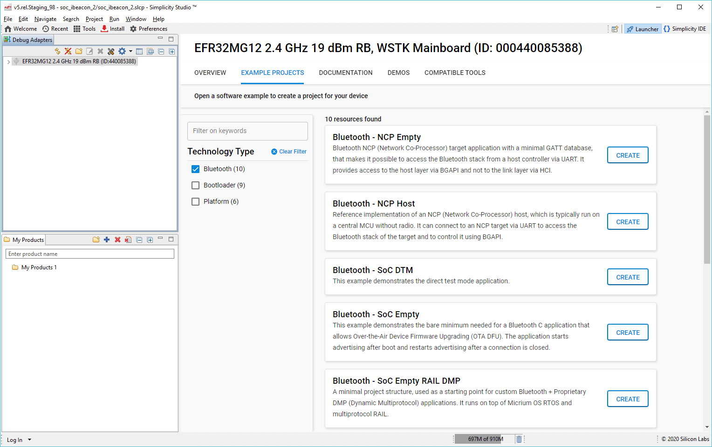

> 注意：您看到的 demo 和 example 由所选定的部件决定。如果您使用的自定义解决方案包含多个部件，请点击要使用的部件，以仅查看适用于该部件的项目。

要在设备上下载并运行 demo，请在 Demos 选项卡上选择一个 demo，然后点击 **RUN** 。该 demo 会自动下载到所选设备。有关测试 demo 的更多信息，请参阅 [4. Bluetooth Demo 入门](#4-Bluetooth-Demo-入门)。

软件 example 包含可配置的 GATT 数据库和组件。请参阅 [5. 开始应用开发](#5-开始应用开发)。

## 3.1 Demo/Example 说明

提供以下 example。名称中带有 (\*) 的示例具有一个匹配的预构建 demo。

* **Silicon Labs Gecko Bootloader examples**（参阅 [UG266: Silicon Labs Gecko Bootloader User Guide](https://www.silabs.com/documents/public/user-guides/ug266-gecko-bootloader-user-guide.pdf) 和 [AN1086: Using the Gecko Bootloader with Silicon Labs Bluetooth Applications](https://www.silabs.com/documents/login/application-notes/an1086-gecko-bootloader-bluetooth.pdf)）
* **Bluetooth Examples**
  * **Bluetooth (NCP)**
    * **NCP Host**：NCP Host example，其通过 USART 连接到一个 NCP 目标。它演示了在有或没有 USART flow-control 的情况下 BGLib 的用法。此 example 没有通过无线电的 Bluetooth 功能，因为它仅将 EFR32 用作 host 设备。
    * **NCP Empty(\*)** ：具有最小 GATT 数据库的 NCP 目标应用程序。以此作为起点创建 NCP 固件。可以从另一个（host）设备控制 NCP 设备，也可以使用 BGTool 直接从您的 PC 控制 NCP 设备。此 example 与 BGTool 一起提供了一种简单的方法，可以通过逐步向协议栈发出命令来入门和调试应用程序。
  * **Bluetooth (SoC – Basic)**
    * **SoC Empty**：最小的项目结构，用作自定义应用程序的起点。该项目具有启用外设连接的基本功能，并且包含一个最小的 GATT 数据库，可以对其进行扩展以适配您的应用程序需求。
    * **SoC iBeacon(\*)** ：一个 iBeacon 设备实现，以 iBeacon 格式发送不可连接的广告。iBeacon Service 为 Bluetooth 配件提供了一种将 iBeacon 发送到 iOS 设备的简单便捷的方法。此 example 演示了 0 dBm TX power 下的功耗。
    * **SoC Thermometer Client**：实现了一个客户端，该客户端发现并连接多达 4 个 BLE 设备，这些设备将自己广告为 Thermometer 服务端。它显示发现过程和通过 UART 接收到的温度值。
    * **SoC Thermometer(\*)** ：实现了 Health Thermometer Profile 的 Thermometer (GATT Server) 角色，该角色使收集器（Collector）设备能够连接 Thermometer 并与之交互。 <blockquote>注意：在运行此 example 时，某些无线板将在显示器中显示随机像素，因为它们具有用于传感器和显示使能信号的共享引脚。</blockquote>
  * **Bluetooth (SoC – Advanced)**
    * **SoC DTM**：用于运行 Bluetooth DTM 测试以进行射频测试。有关更多信息，请参阅 [AN1046: Bluetooth® Radio Frequency Physical Layer Evaluation](https://www.silabs.com/documents/login/application-notes/an1046-bt-dtm.pdf)。
    * **SoC Thermometer RTOS**：基于 Micrium RTOS 的 SOC - Thermometer example。
  * **Thunderboard**
    * **SoC Thunderboard React, - Thunderboard Sense, and - Thunderboard Sense 2(\*)** ：用于展示恰当的 Thunderboard 功能的 example。
* **Dynamic Multiprotocol Examples**（参阅 [AN1134: Dynamic Multiprotocol Development with Bluetooth and Proprietary Protocols on RAIL](https://www.silabs.com/documents/public/application-notes/an1134-bluetooth-rail-dynamic-multiprotocol.pdf)）
  * **SoC Empty RAIL DMP**：一个最小的项目结构，用作自定义动态多协议应用程序的起点。该项目具有启用外设连接的基本功能，无 GATT service。它运行在 Micrium OS RTOS 和 multiprotocol RAIL 之上。
  * **SoC Light RAIL DMP(\*)** ：实现了 Light (GATT Server) 角色，该角色使 Switch 设备能够与其连接并进行交互。该设备充当连接 Peripheral。这是一个动态多协议参考应用，它运行在 Micrium OS RTOS 和 multiprotocol RAIL 之上。要了解如何测试此 demo，请参阅 [QSG155: Using the Silicon Labs Dynamic Multiprotocol Demonstration Applications](https://www.silabs.com/documents/public/quick-start-guides/qsg155-dynamic-multiprotocol-demo-quick-start-guide.pdf)。
  * **SOC - Range Test - RAIL - DMP(\*)** ：带有 Bluetooth 连接的范围测试。它运行在 Micrium OS RTOS 和 multiprotocol RAIL 之上。
* **NCP Host Examples**（位于 `C:\SiliconLabs\SimplicityStudio\v5\developer\sdks\gecko_sdk_suite\<version>\app\bluetooth\examples_host` ）
  * **Empty**：最小的 host-side 项目结构，用作 NCP host 应用程序的起点。
  * **ota-dfu**：演示如何在 Silicon Labs Bluetooth 设备上执行 OTA DFU。它要求具有带 NCP 固件无线板的 WSTK 用作 GATT 客户端以执行 OTA。
  * **uart-dfu**：演示如何在运行 NCP 固件的 Silicon Labs Bluetooth 设备上执行 UART DFU。

# 4. Bluetooth Demo 入门

Blue Gecko Bluetooth Wireless Starter Kit 旨在帮助您评估 Silicon Labs 的 Bluetooth module，和开始开发自己的应用。Kit 有不同的版本，其带有不同的模块/无线板。有关当前配置的详细信息，请参阅 [https://www.silabs.com/products/development-tools/wireless/bluetooth/bluegecko-bluetooth-low-energy-module-wireless-starter-kit](https://www.silabs.com/products/development-tools/wireless/bluetooth/bluegecko-bluetooth-low-energy-module-wireless-starter-kit)。

要开始使用 Bluetooth demo，您应该已经下载了 Simplicity Studio 5（SSv5）和 Bluetooth SDK v3.x，如 [Simplicity Studio 5 User's Guide](https://docs.silabs.com/simplicity-studio-5-users-guide/1.0/index) 中所述。Bluetooth SDK 随附了一些预构建的 demo，可以将其刷写到您的 EFR32 设备，并使用智能手机进行测试。本节介绍如何在 Android 和 iOS 设备上测试三个预构建的 demo：

* NCP Empty demo
* iBeacon demo
* Health Thermometer demo

## 4.1 准备 WSTK

1. 如下图所示，将 Bluetooth Module Radio Board 连接到 WSTK Main Board。
2. 使用 **Main Board USB** 连接器将 WSTK 连接到 PC。
3. 将 **Power switch** 转到 **AEM** 位置。 <blockquote>注意：在此阶段，系统可能会提示您安装 WSTK Main Board 的驱动程序，但您现在可以跳过此步骤。</blockquote>
4. 检查蓝色的 **USB Connection Indicator** LED 点亮或开始闪烁。
5. 检查 Main Board LCD 显示屏是否点亮并显示 Silicon Labs logo。

在开始测试 demo 之前，请注意 WSTK Main Board 上的以下部分：

* Temperature & Humidity Sensor
* PB0 button
* LED0

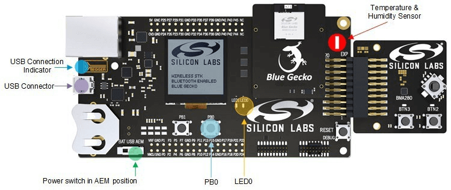

## 4.2 刷写 Demo

* 按如上所述连接设备后，打开 SSv5。
* 在 Debug Adapters 视图中选择设备。
* 在 Demos 选项卡上，点击所选 demo 上的 **RUN** 。

## 4.3 使用 Android 或 iOS 智能手机测试 Bluetooth Demo

### 4.3.1 测试 NCP Empty Demo

1. 在目标上加载 **NCP Empty** demo。打开已连接 WSTK 和无线板的 Simplicity Studio，然后选择相应的调试适配器。
2. 在 OVERVIEW 选项卡上的“General Information”下，选择 Gecko SDK Suite（如果未选择）。在 DEMOS 选项卡上，选择 **NCP Empty** demo，然后点击 RUN。这会将 demo 刷写到您的设备，但不会自动开始广告。
3. 此时，可以使用 BGTool 通过 UART 将 BGAPI 3.0 命令发送到 kit。可以通过此工具控制连接、广告和其他标准的 BLE 操作。BGTool 可以在 Simplicity Studio 5 的工具菜单中找到：
    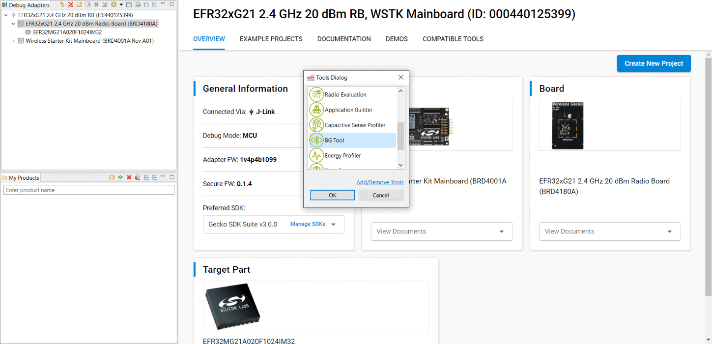
4. 启动 BGTool，然后建立与 kit 的 UART 连接：
    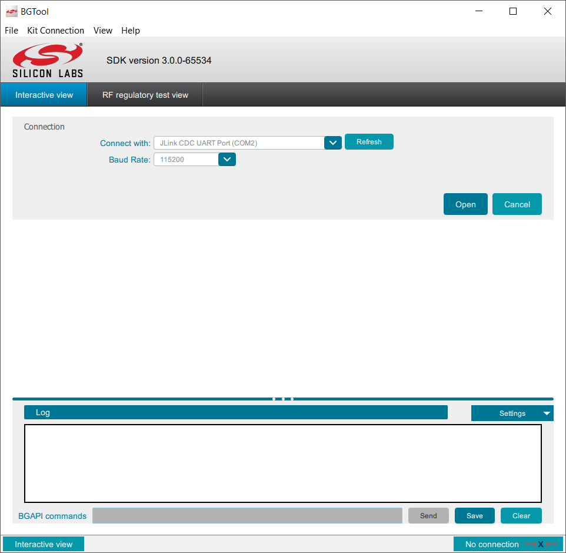
5. 点击 **Open** 。如果一切正常，您应该会看到 “sl\_bt\_system\_get\_identity\_address” 命令的结果显示为绿色：
    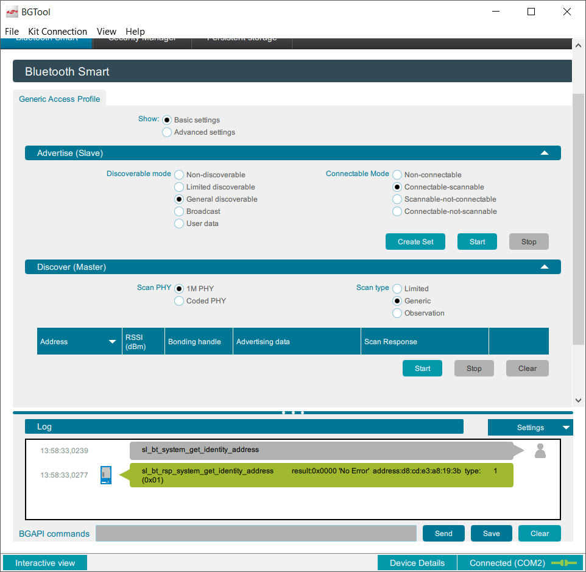
6. 在 Advertise 菜单中，点击 **Create Set**，然后点击 **Start** 以开始广告。
    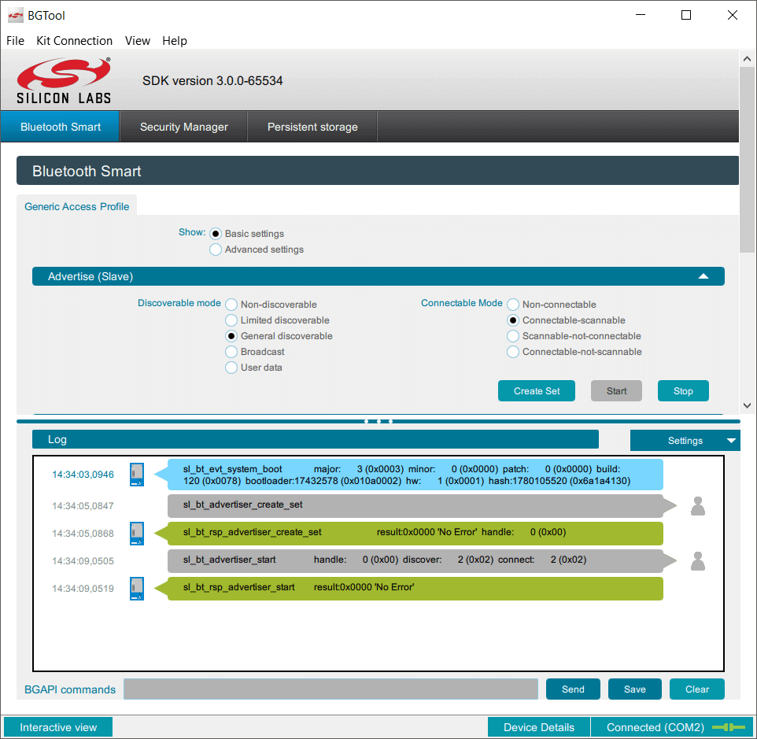
7. 在主机（智能手机）上，从 Google Play Store 或 App Store 中安装 **EFR Connect** app，然后将其打开。要找到您的广告设备，请点击 Develop 选项卡，然后点击 **Bluetooth Browser** 。这会展示附近的所有广告设备。点击“Silabs Example”旁边的 **Connect** 以连接到设备。这将自动发现并显示其 GATT 数据库。点击任何 service 以列出其 characteristic，点击任何 characteristic 以读取其值。
    
    

### 4.3.2 测试 iBeacon Demo

Bluetooth beacon 是不可连接的广告，它可帮助您定位设备、确定自己的位置或获取与 beaconing 设备相连的可用的最少信息。

将 **iBeacon** demo 刷写到设备后，您可以使用 **EFR Connect** app 中的 **Bluetooth Browser** 找到 beacon 信号。启动 **EFR Connect**，点击 Develop 选项卡，然后点击 **Bluetooth Browser** 。要过滤 beacon，请点击 ，然后选择要显示的 beacon 类型。该 app 为您提供了有关 beacon 的基本信息（如 RSSI —— 可以帮助确定 beacon 的距离）。点击 beacon 以获取有关其提供的数据的更多信息。

### 4.3.3 测试 Health Thermometer Demo

NCP Empty demo 使用基本的静态信息（如设备名称）实现了最小的 GATT 数据库，而 Health Thermometer demo 通过实时温度测量扩展了该数据库。

将 **Health Thermometer** demo 刷写到设备后，启动 **EFR Connect**，点击 Demo 选项卡，然后点击 **Health Thermometer** 。在设备列表中找到作为 Thermometer Example 的设备广告，然后点击以进行连接。智能手机 app 会自动找到设备的 Temperature measurement characteristic，定期读取该值，然后在手机屏幕上显示该值。

尝试触摸 WSTK 上的温度传感器（参阅 [4.1 准备 WSTK](#41-准备-wstk)）。您应该能够看到温度的变化。

# 5. 开始应用开发

开发 Bluetooth 应用包含两个主要步骤：定义 GATT 数据库结构和定义诸如 `connection_opened` 、 `connection_closed` 等事件的事件处理程序。

应用开发的最常见起点是 **SoC Empty** example。该项目包含一个简单的 GATT 数据库（包含 Generic Access service、Device Information service、OTA service）和一个 while 循环（用于处理协议栈引发的某些事件）。您可以根据需要扩展 GATT 数据库和该 example 的事件处理程序。

> 注意：从 Bluetooth SDK version 2.7.0.0 起，必须使用 Gecko Bootloader 以及应用程序加载所有设备。开始时，最简单的方法是加载任何预编译的 demo 映像及附随的 bootloader（配置为映像的一部分）。当您刷写应用程序时，它会覆盖 demo，但 bootloader 仍然保留。随后，您可能希望构建自己的 bootloader，如 *UG266: Silicon Labs Gecko Bootloader User Guide* 中所述。

通过三个对话框可以完成新项目的创建：

* Target、SDK 和 Toolchain
* Examples
* Configuration

<table>
  <tr>
    <td>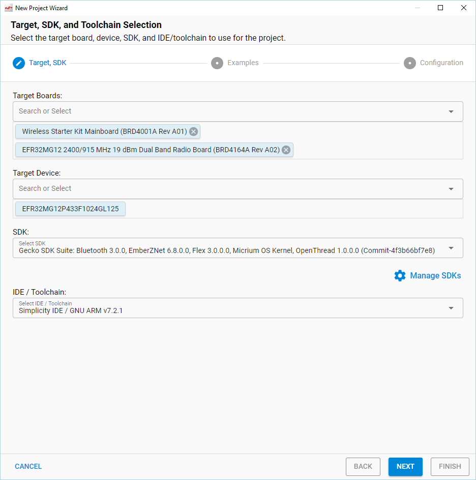</td>
    <td>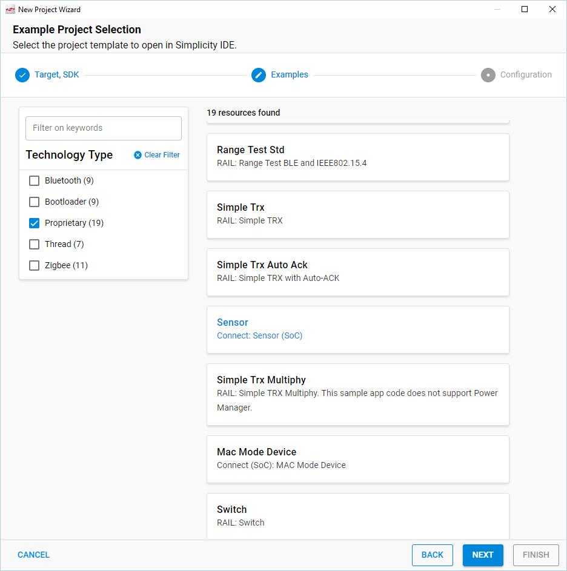</td>
    <td>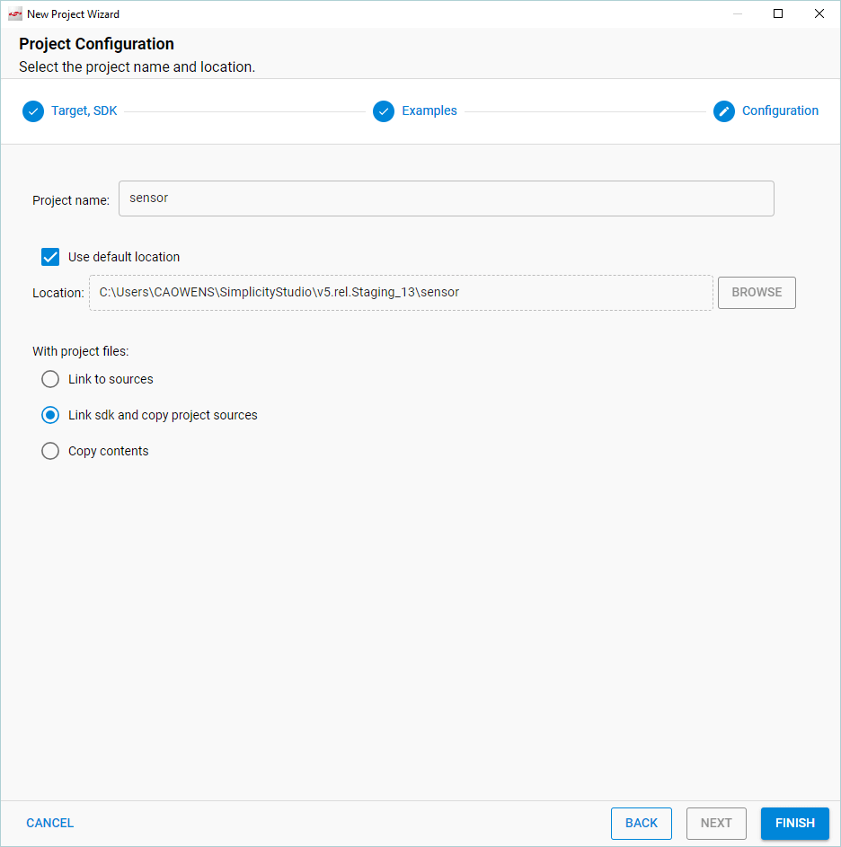</td>
  </tr>
</table>

对话框顶部的指示器显示您的位置。

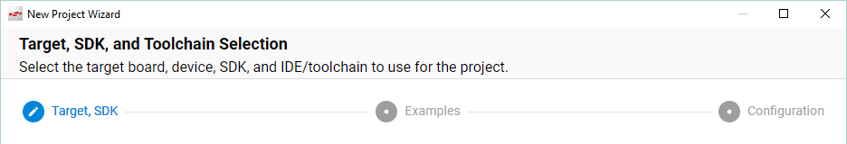

您可以按照 [Simplicity Studio 5 User's Guide](https://docs.silabs.com/simplicity-studio-5-users-guide/latest/) 中的描述，从 Launcher Perspective 中的不同位置启动项目。开始使用时，建议您从 File 菜单开始，因为它可以带您完成以上所有三个对话框。

1. 选择 **New >> Silicon Labs Project Wizard** 。
2. 查看您的 SDK 和 toolchain。如果您希望使用 IAR 而不是 GCC，请确保在此处进行更改。创建项目后，很难更改工具链。点击 **NEXT** 。
3. 在 Example Project Selection 对话框中，过滤为 Bluetooth 并选择 **SoC Empty** 。点击 **NEXT** 。
4. 如果需要，在 Project Configuration 对话框上，重命名您的项目。请注意，如果更改任何已链接资源，则引用该资源的任何其他项目都会更改。在开始使用时，默认选择是包含项目文件，但最好链接到 SDK。点击 **FINISH** 。

## 5.1 GATT 数据库

创建项目后，会自动显示一个可视化的 GATT Configurator，以帮助您简单地创建自己的 GATT 数据库。请注意，屏幕右上方现在包含一个 Simplicity IDE perspective 控件。

您可以在此时创建自己的数据库，或者稍后在 Project Explorer 中双击项目下的 `gatt_configuration.btconf` 文件或通过 Project Configurator 的 Advanced > GATT Configurator 组件返回数据库。有关更多信息，请参阅 [6.1 GATT Configurator](#61-gatt-configurator)。

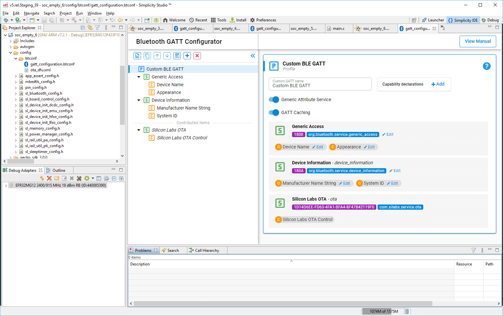

在 `gatt_db.h` 中生成并定义了每个 characteristic 的引用。您可以在代码中使用此引用，通过 `sl_bt_gatt_server_read_attribute_value()`/`sl_bt_gatt_server_write_attribute_value()` 命令在本地 GATT 数据库中读取/写入 characteristic 值。

您将在 `app.c` 的 main 循环中找到事件处理程序。您可以使用其他事件处理程序扩展此列表。事件的完整列表以及协议栈命令可在 [Bluetooth Software API Reference Manual](https://docs.silabs.com/) 中找到。

## 5.2 组件配置

Bluetooth SDK v3.x 项目基于 Gecko Platform component-based 架构。可以通过 Simplicity Studio 的 Component Editor 安装和配置软件功能。当您安装组件时，安装过程将：

1. 将相应的 SDK 文件从 SDK 文件夹复制到项目文件夹。
2. 将给定组件的所有依赖项复制到项目文件夹中。
3. 将新的包含目录添加到项目设置。
4. 将配置文件复制到 `/config` 文件夹中。
5. 修改相应的 auto-generated 文件，以将组件集成到应用程序中。

另外，“init”类型的软件组件将利用给定组件的相应配置文件作为输入来实现给定组件的初始化代码。

某些软件组件（如 OTA DFU）将完全集成到应用程序中以执行特定任务（而无需任何其他代码），而其他组件则提供可在应用程序中使用的 API。

要查看组件库，请点击项目的 `<project-name>.slcp` ，然后点击 **Software Components** 。许多过滤器以及关键字搜索可帮助您探索各种组件类别。请注意，这将呈现所有已安装的 SDK 组件。

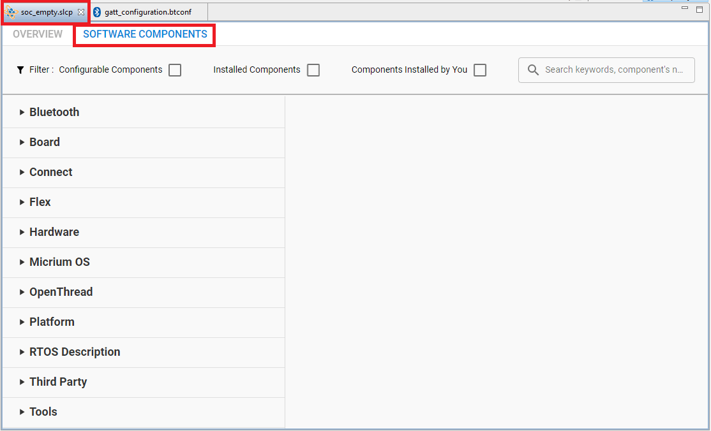

检查项目中已安装的组件（1），可以将其卸载。可配置的组件用齿轮符号（2）表示。

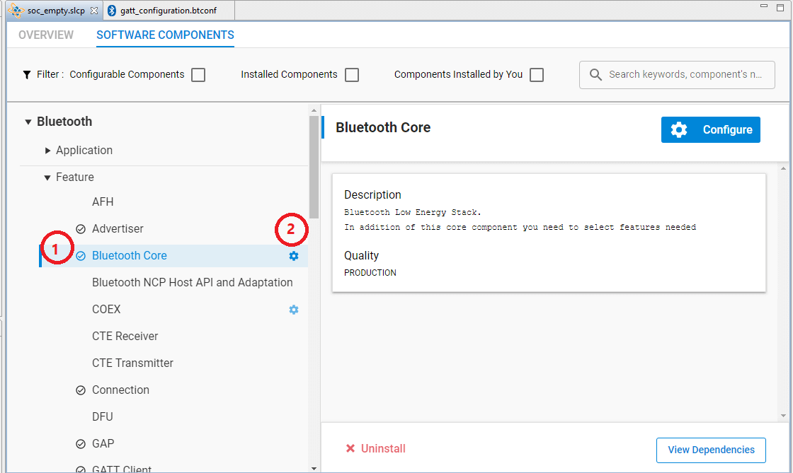

点击 **Configure** 以打开 Component Editor，然后查看可配置的组件参数。

更改组件配置时，更改将自动保存并自动生成项目文件。您可以在 Simplicity IDE 的右下角看到生成进度。待生成完成后再构建应用程序映像。

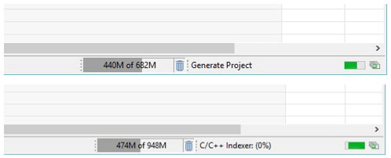

## 5.3 构建和刷写

要构建和调试项目，请点击 Simplicity IDE perspective 左上角的 Debug（）。它将构建并下载您的项目，然后打开 Debug perspective。点击 Play（）开始在设备上运行您的项目。

## 5.4 启用现场更新

可以通过 UART DFU（Device Firmware Update，设备固件更新）为现场设备部署新固件；对于 SoC 应用，则可以通过 OTA DFU 进行部署。有关这些方法的详情，请参考 [AN1086: Using the Gecko Bootloader with the Silicon Labs Bluetooth Applications](https://www.silabs.com/documents/login/application-notes/an1086-gecko-bootloader-bluetooth.pdf)。

# 6. 开发工具

## 6.1 GATT Configurator

每个 Bluetooth 连接都有一个 GATT 客户端和一个 GATT 服务端。服务端拥有一个 GATT 数据库（可被客户端读写的 Characteristic 集合）。Characteristics 归纳成 Service，一组 Service 确定了一个 Bluetooth Profile。

如果要实现 GATT 服务端（通常在 peripheral 设备上），则必须定义一个 GATT 数据库结构。在运行时无法修改此结构，因此必须预先设计。客户端（通常是 central 设备）也可以具有 GATT 数据库，即使没有设备可以查询它，也可以在代码中保留默认数据库结构。

GATT Configurator 是一个易于使用的工具，可帮助您构建自己的 GATT 数据库。项目配置的 Profile/Service/Characteristic/Descriptor 列表显示在左侧，有关所选项的详细信息显示在右侧。在 Profile 列表上方提供了一个选项菜单。

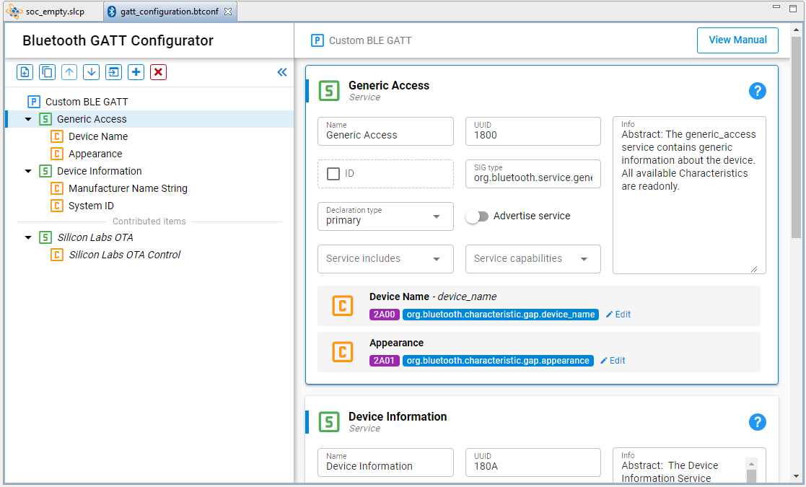

GATT Configurator 菜单为：

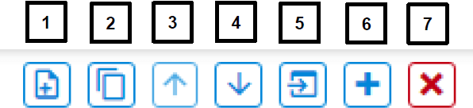

1. 添加一个项。
2. 复制所选项。
3. 向上移动所选项。
4. 向下移动所选项。
5. 导入 GATT 数据库。
6. 添加预定义。
7. 删除所选项。

要添加自定义 service，请点击配置文件 **Profile (Custom BLE GATT)** ，然后点击 **Add (1)** 。要添加自定义 characteristic，请选择一项 service，然后点击 **Add (1)** 。要添加预定义的 service/characteristic，请点击 **Add Predefined (6)** 。要了解有关 configurator 的更多信息，请参阅 [UG438: GATT Configurator User's Guide for Bluetooth SDK v3.x](https://www.silabs.com/documents/public/user-guides/ug438-gatt-configurator-users-guide-sdk-v3x.pdf)。

您可以在 [https://www.bluetooth.com/specifications/gatt](https://www.bluetooth.com/specifications/gatt) 上找到任何 Profile/Service/Characteristic/Descriptor 的详细说明。

Characteristic 通常是字段的复杂结构。如果您想知道 characteristic 具有哪些字段，请访问 [https://www.bluetooth.com/specifications/gatt/characteristics](https://www.bluetooth.com/specifications/gatt/characteristics)。

## 6.2 Pin Tool

Simplicity Studio 5 提供了 Pin Tool，可让您轻松配置新的外设或更改现有外设的特性。在 Project Configurator 的 SOFTWARE COMPONENTS 选项卡中，展开 Advanced Configurators 组并打开 Pin Tool。图形视图因芯片而异。

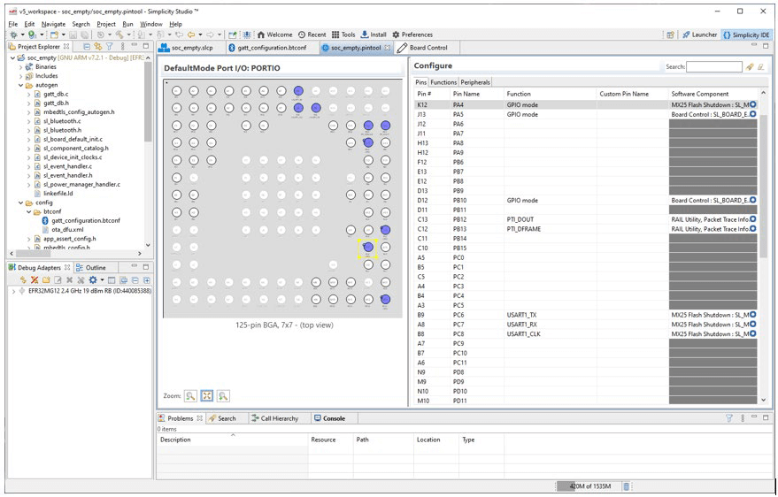

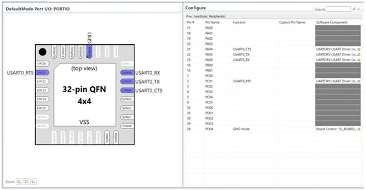

例如，您可以通过在列表中选择所需的引脚，然后从下拉列表中选择其功能，将用于 USART 通信的引脚重新分配给自定义板设计的适当 layout。

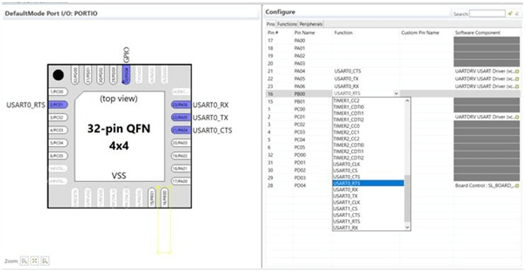

点击所选项后，layout 将被更新。保存文件后，将自动生成配置的源码。有关更多信息，请参阅 [Simplicity Studio 5 User's Guide](https://docs.silabs.com/simplicity-studio-5-users-guide/latest/)。

## 6.3 Multi-Node Energy Profiler

Multi-Node Energy Profiler 是一个 add-on 工具，您可以使用它轻松地在运行时测量设备的功耗。您可以轻松找到峰值和平均功耗，并检查睡眠模式电流。

> 注意：用于 EFR32BG22 的 SDK 示例应用启用了 EM2 调试（见 `init_mcu.c` ），与 datasheet 的值相比，这增加了电流消耗。

要对当前项目进行 profile，请在菜单栏中点击 Tools，然后选择 Energy Profiler，或在 Project Explorer 视图中右键 `<project>.slcp` 文件，然后选择 **Profile as / Simplicity Energy Profiler target** 。这将自动构建您的项目，将其上传到设备，然后启动 Energy Profiler。Energy Profiler perspective 将呈现出来，如下图所示。

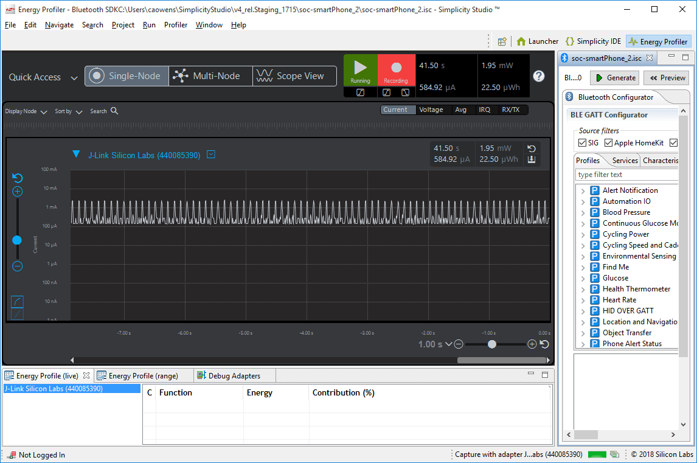

有关如何使用此工具的详细信息，请参阅 *UG343: Multi-Node Energy Profiler User's Guide*。您可以使用当前 perspective 右上角的 Perspective 按钮在 Simplicity IDE 和 Energy Profiler perspective 之间切换。

您可以在功耗图中看到了峰值。通过点击 Play  暂停分析，点击其中的一个峰，然后使用时间轴（y 轴）缩放，直到看到三个可区分的峰。这些代表了在三个广告通道上发送的三个广告包。如果您启用了右上角的 Rx/Tx 视图，则还可以在下面的 Rx/Tx 栏中看到三个对应的 Tx 事件。请注意，现在的最高功耗可能会比之前在图表上显示的大。这是因为在缩小模式下，显示的值是平均值。如果需要精确值，请始终放大。

要测量平均功耗，只需在一段时间内点击并拖动鼠标即可。右上角会出现一个新窗口，显示给定间隔的功耗信息。Bluetooth 通信通常具有周期性：广告或连接间隔。建议测量广告或连接间隔内的平均值，以获得适当的平均功耗。也可以测量总体平均值，但这会受到瞬态事件的影响。

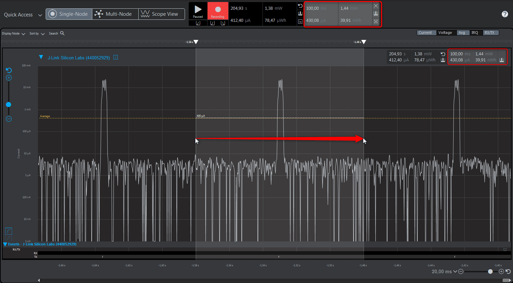

Multi-node Energy Profiler 还能够同时测量多个设备的功耗。要开始测量新设备，请点击 Quick Access 菜单（左上角），然后选择 **Start Energy Capture** 。要停止测量，请点击 Quick Access 菜单，然后选择 **End/Save session** 。

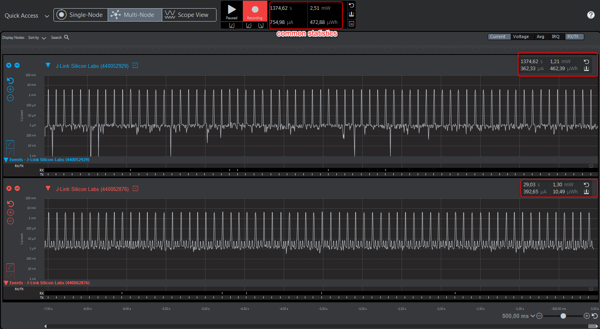

要了解此工具的更多信息，请参阅 [Simplicity Studio 5 User's Guide](https://docs.silabs.com/simplicity-studio-5-users-guide/latest/)。

## 6.4 Network Analyzer

Silicon Labs Network Analyzer 是一个免费的数据包捕获和调试工具，可用于调试 Wireless Gecko 与其他 Bluetooth 设备之间的 Bluetooth 连接。它以网络流量、活动和持续时间的图形视图极大地加速了网络和应用程序的开发过程。

Packet Trace 应用程序直接从 Wireless Gecko SoC 和 module 上可用的 PTI（Packet Trace Interface）中捕获数据包。因此，与 air-based 捕获相比，它可以更准确地捕获数据包。

## 6.5 Simplicity Commander

Simplicity Commander 是一个简单的刷写工具，可用于通过 J-Link 接口刷写固件映像、擦除 flash、锁定和解锁调试访问以及对 flash 页进行写保护。GUI 和 CLI 均可使用。有关更多信息，请参阅 *UG162: Simplicity Commander Reference Guide*。

## 6.6 BGTool Application

BGTool Application 可用于测试和评估 Bluetooth SoC 和 module，并可用于通过 Serial/UART 接口使用 BGAPI Serial Protocol（NCP）控制 Bluetooth 硬件。

## 6.7 IAR Embedded Workbench

IAR Embedded Workbench 也可以用作开发和调试 Bluetooth 应用程序的 IDE。您必须使用与 SDK 版本兼容的 IAR 版本。有关兼容版本信息，请参阅 SDK 的 release notes。

