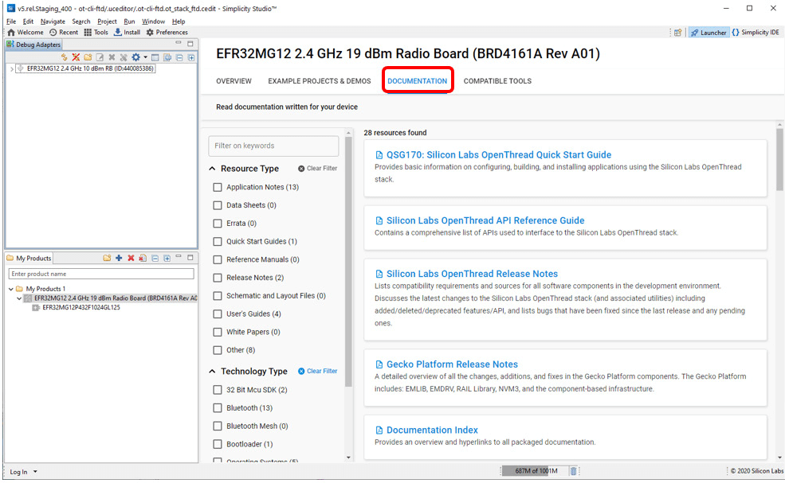
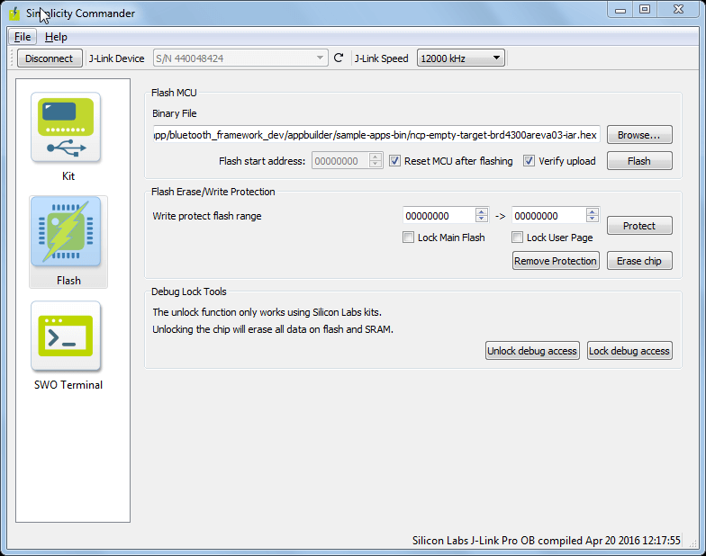

# QSG170: Silicon Labs OpenThread Quick-Start Guide (Rev. 0.5) <!-- omit in toc -->

- [1 引言](#1-引言)
  - [1.1 关于 Silicon Labs OpenThread SDK](#11-关于-silicon-labs-openthread-sdk)
    - [1.1.1 Simplicity Studio 5（SSv5）](#111-simplicity-studio-5ssv5)
    - [1.1.2 Gecko Bootloader](#112-gecko-bootloader)
    - [1.1.3 Gecko Platform](#113-gecko-platform)
  - [1.2 先决条件](#12-先决条件)
  - [1.3 支持](#13-支持)
  - [1.4 文档](#14-文档)
- [2 关于示例应用程序和演示](#2-关于示例应用程序和演示)
  - [2.1 演示](#21-演示)
  - [2.2 软件示例](#22-软件示例)
- [3 开发入门](#3-开发入门)
  - [3.1 基于示例创建项目](#31-基于示例创建项目)
  - [3.2 配置项目](#32-配置项目)
  - [3.3 构建项目](#33-构建项目)
    - [3.3.1 自动编译并刷写](#331-自动编译并刷写)
    - [3.3.2 手动编译并刷写](#332-手动编译并刷写)
  - [3.4 刷写 Bootloader](#34-刷写-bootloader)
  - [3.5 创建网络](#35-创建网络)
- [4. 下一步](#4-下一步)
- [5 开发工具](#5-开发工具)
  - [5.1 Simplicity Commander](#51-simplicity-commander)
  - [5.2 Pin Tool](#52-pin-tool)
  - [5.3 Multi-Node Energy Profiler](#53-multi-node-energy-profiler)
    - [5.3.1 Energy Profiler 与 Sleepy-demo 应用程序](#531-energy-profiler-与-sleepy-demo-应用程序)
  - [5.4 Network Analyzer](#54-network-analyzer)

本文档介绍如何使用 Silicon Labs OpenThread SDK（Software Development Kit）、Simplicity Studio® 5 和一个兼容的无线入门套件来开始 OpenThread 开发。

# 1 引言

Google 的 OpenThread 是一个 Thread 开源实现。谷歌发布的 OpenThread 可以使开发人员全面地使用 Google Nest 产品中使用的网络技术，以加速互联家庭和商业建筑的产品开发。

凭借一个狭窄的（narrow）平台抽象层和较小的内存占用，OpenThread 具有高度可移植性。它支持 SoC（system-on-chip）和 NCP（network co-processor）设计。OpenThread 实现了 Thread 1.1.1 和 Thread 1.2 规范中定义的所有特性。该规范定义了一种基于 IPv6 的可靠、安全和低功耗的无线设备到设备通信协议，适用于家庭和商业建筑应用。

本指南介绍如何使用随 Gecko SDK 和 SSv5（Simplicity Studio 5）提供的 Silicon Labs OpenThread SDK 开始开发 OpenThread 应用程序。SSv5 包含了使用 Silicon Labs 设备进行物联网产品开发所需的一切，这包括了资源和项目启动器、软件配置工具、带有 GNU 工具链的完整 IDE 和分析工具。本文档重点介绍 SS5 环境中的应用和开发。除此之外，您可以通过从 GitHub 中下载或克隆最新版本来手动安装 Gecko SDK。有关更多信息，请参阅 [https://github.com/SiliconLabs/gecko_sdk](https://github.com/SiliconLabs/gecko_sdk)。

## 1.1 关于 Silicon Labs OpenThread SDK

Silicon Labs OpenThread SDK 基于 Gecko Platform component-based 设计，其中每个组件（component）都提供一个特定的功能。组件由源文件和属性的集合组成。Component-based 设计通过添加、配置和删除组件来实现定制化。应用程序开发人员可以使用 SSv5 的项目配置器（Project Configurator）和组件编辑器（Component Editor），通过包含与所需功能匹配的组件并配置与这些组件关联的各种属性，可以简易地装配所需的功能。

Silicon Labs OpenThread SDK 基于 GitHub 中提供的 OpenThread 协议栈（stack），但还有许多增强功能，包括支持额外的平台和功能、额外的示例应用程序，以及额外的元数据以允许无缝集成到 SSv5。

**平台和功能**：Silicon Labs 强化了 OpenThread 源码和支持 EFR32 平台的平台抽象层，以提供 Gecko Platform 提供的附加功能，例如：

* Wi-Fi 共存（Wi-Fi coexistence）
* 天线分集（Antenna diversity）
* FreeRTOS 支持（FreeRTOS support）
* 非易失性存储器存储支持（Non-Volatile Memory storage support (NVM3)）
* 硬件加速的 MbedTLS（Hardware acceleration with MbedTLS）
* 多个域网无线协处理器（Multi-PAN Radio Co-Processor (RCP)）
* 协处理器通信支持（Co-Processor Communication support (CPC)）
* PSA Vault 支持（PSA Vault support）
* Proprietary Sub-GHz
* 电源管理器支持（Power manager support）

**示例应用程序**：SDK 中包含来自 GitHub 的示例应用程序，以及展示额外功能的新示例应用程序，例如 OpenThread/Bluetooth Low Energy Dynamic Multiprotocol 支持。这些示例在 [2 关于示例应用程序和演示](#2-关于示例应用程序和演示) 部分中进行了描述。

Silicon Labs OpenThread SDK 包含完整的 OpenThread GitHub 目录结构，但不使用 GitHub 解决方案提供的 makefile 构建系统。相反，Silicon Labs OpenThread SDK 使用 SSv5 提供的构建系统。GitHub makefile 构建选项已作为组件配置选项提供，并在 [3.2 配置项目](#32-配置项目) 中进行了讨论。在使用 Silicon Labs OpenThread SDK 构建 Host-RCP 应用程序（例如 OpenThread Border Router）时，请确保 Host 和 RCP（Radio Co-Processor）都使用同一 SDK 下的代码。

请参阅 Simplicity Studio 和 [docs.silabs.com](https://docs.silabs.com/simplicity-studio-5-users-guide/latest/) 中提供的发行说明，了解有关特性和用于该发行版的 OpenThread 协议栈版本的描述。

### 1.1.1 Simplicity Studio 5（SSv5）

SSv5 是最重要的开发环境，旨在支持 Silicon Labs 的物联网 SoC 和 module（模块）产品。它提供了对目标设备特定的 Web 和 SDK 资源的访问；软件和硬件配置工具；一个具有行业标准代码编辑器、编译器和调试器的集成开发环境（IDE，integrated development environment）；以及用于网络分析和代码相关能耗分析的高级增值工具。

SSv5 旨在简化开发人员的工作流程。它会智能地识别所有 Silicon Labs 评估和开发套件部件，并根据选定的开发目标提供适当的 SDK 及其他开发资源。

Silicon Labs OpenThread SDK 通过 SSv5 下载。GCC（GNU Compiler Collection）随 SSv5 一起提供。SSv5 提供的其他重要开发工具在 [5 开发工具](#5-开发工具) 中介绍。

### 1.1.2 Gecko Bootloader

Bootloader（引导加载程序）是一个存储在预留闪存中的程序，其可以初始化设备、更新固件映像，并可能执行一些完整性检查。Silicon Labs 网络设备使用以两种不同模式执行固件更新的 bootloader：standalone（也称为 standalone bootloader）和 application（也称为 application bootloader）。Application bootloader 通过使用存储在内部或外部存储器中的更新映像重新编程闪存来执行固件映像更新。Silicon Labs 建议您始终将 bootloader 映像与应用程序一起刷写，以便从一开始就适当地分配闪存使用量。有关 bootloader 的更多信息，请参阅 *UG103.6: Bootloader Fundamentals*。

### 1.1.3 Gecko Platform

Gecko Platform 是驱动程序（driver）和其他与 Silicon Labs 芯片及模块直接交互的底层特性的集合。Gecko Platform 组件包括 EMLIB、EMDRV、RAIL Library、NVM3 和 MbedTLS。有关 Gecko Platform 的更多信息，请参阅可在 SSv5 的 Documentation 选项卡中找到的发行说明，以及 [https://docs.silabs.com/](https://docs.silabs.com/) 中的在线 API 文档。

## 1.2 先决条件

在执行本指南中的步骤之前，您必须具备：

* 购买了 Wireless Gecko (EFR32) Portfolio Wireless Kits 的其中一款。
* 已下载 SSv5 和 Gecko SDK，其中包括 Silicon Labs OpenThread SDK，并且大致熟悉 SSv5 Launcher 透视图（perspective）。可以在 [https://docs.silabs.com/](https://docs.silabs.com/) 上的在线的 *Simplicity Studio 5 User's Guide* 和 SSv5 帮助菜单中找到 SSv5 安装和入门说明以及一些详细的参考资料。

对于编译器，请使用随 Silicon Labs OpenThread SDK 一起安装的 GNU ARM toolchain 版本。OpenThread 目前不支持 IAR Embedded Workbench for ARM (IAR EWARM) 编译器。

## 1.3 支持

您可以通过 SSv5 的 Learn and Support 下的 Welcome 视图访问位于 [https://www.silabs.com/support](https://www.silabs.com/support) 的 Silicon Labs 支持门户。如果您在开发过程中遇到任何问题，请使用支持门户联系客户支持。


## 1.4 文档

相关文档可以通过 SSv5 获得。它根据您所选择的部件进行过滤。可以通过部件 OVERVIEW 选项卡上的链接访问特定于硬件的文档。


SDK 文档和其他参考资料可通过 DOCUMENTATION 选项卡获得。使用 Thread Technology Type 复选框进行过滤，以查看与 OpenThread SDK 最密切相关的文档。



SSv5 及其工具记录在在线的 *Simplicity Studio 5 User's Guide* 中，可在 [https://docs.silabs.com/](https://docs.silabs.com/) 上以及通过 SSv5 帮助菜单获得。


# 2 关于示例应用程序和演示

从头开始开发应用程序很十分困难的，Silicon Labs OpenThread SDK 附带了许多涵盖最常见用例的内置示例应用程序和演示，并且是预配置的代码，这些都旨在说明常见的应用程序功能。Silicon Labs 强烈建议您从示例应用程序之一开始进行开发。

与 SSv5 中的所有内容一样，EXAMPLE PROJECTS & DEMOS 选项卡上展示的示例和演示是根据您所连接或选择的部件进行过滤的。

## 2.1 演示

演示是可以下载到兼容设备的预构建固件映像。查找演示是否可用于您的部件的最快方法是在 My Products 视图中添加部件或板信息，然后导航到 Launcher 透视图中的 EXAMPLE PROJECTS & DEMOS 选项卡。关闭 Example Projects 过滤器。Solution Examples 过滤器用于将来。


随 OpenThread SDK 提供的预编译演示应用程序映像与以下板兼容：

* brd4161a
* brd4166a
* brd4168a
* brd4180a
* brd4304a

请参阅 Silicon Labs OpenThread SDK 发行说明，了解受支持的部件的完整列表。

## 2.2 软件示例

由于通常您最终会将已编译的应用程序映像刷写到设备，因此请将设备连接到您的计算机并在 Debug Adapters 视图中选择它。在 Launcher 透视图的 EXAMPLE PROJECTS & DEMOS 选项卡中，根据 'Thread' technology type 过滤示例项目并关闭 **Demos**。


Silicon Labs OpenThread SDK 提供的示例应用程序如下。大多数示例有两种变体：FTD（Full Thread Device）和 MTD（Minimal Thread Device），并且面向 SoC、NCP 和 RCP 应用程序模型。

通常，示例应用程序是说明以下功能的简单示例：

* Testing with a CLI
* Network Co-Processor (NCP)
* Radio Co-Processor (RCP)
* Sleepy device
* Dynamic multiprotocol
* Multi-PAN RCP
* Multi-PAN RCP and CPC over SPI/UART

**OpenThread – SoC CLI (FTD)**：与 OpenThread GitHub 存储库中的 ot-cli-ftd 应用程序等同的 CLI 应用程序，用于在为 SoC 设计的 FTD 上测试 OpenThread 协议栈。此应用程序可用于针对 Thread Test Harness 测试 OpenThread 协议栈，以进行互操作性测试。

**OpenThread – SoC CLI (MTD)**：与 OpenThread GitHub 存储库中的 ot-cli-mtd 应用程序等同的 CLI 应用程序，用于在为 SoC 设计 MTD 上测试 OpenThread 协议栈。

**OpenThread – NCP (FTD)**：一个 OpenThread FTD 应用程序，等同于 OpenThread GitHub 存储库中为 NCP 设计的 ot-ncp-ftd 应用程序。虽然应用层位于 host 处理器上，但此应用程序在 802.15.4 SoC 上运行 OpenThread core。

**OpenThread – NCP (MTD)**：一个 OpenThread MTD 应用程序，等同于 OpenThread GitHub 存储库中为 NCP 设计的 ot-ncp-mtd 应用程序。与 ot-ncp-ftd 类似，此应用程序在 802.15.4 SoC 上运行 OpenThread core。


**OpenThread – RCP**：一个 OpenThread RCP 应用程序，等同于 OpenThread GitHub 存储库中的 ot-rcp 应用程序。虽然应用层和 OpenThread core 位于 host 处理器上，但此应用程序仅在 802.15.4 SoC 上运行最小的 OpenThread controller。此 RCP 软件示例必须与兼容的 OpenThread Border Router 一起使用。这可以从相同的 Silicon Labs OpenThread SDK 构建或从 docker 映像部署。有关更多详细信息，请参阅 *AN1256: Using the Silicon Labs RCP with the OpenThread Border Router*。

**OpenThread – SoC Sleepy Demo (FTD)**：一个在 FTD 上启动和形成 Thread 网络的应用程序，用于 sleepy-demo。此应用程序与 **OpenThread – SoC Sleepy Demo (MTD)** 应用程序结合使用。

**OpenThread – SoC Sleepy Demo (MTD)**：一个在 MTD 上演示 SED（Sleepy End Device）行为的应用程序，其连接到由运行 **OpenThread – SoC Sleepy Demo (FTD)** 应用程序的节点启动的 Thread 网络上。此应用程序演示了 EFR32 的电源管理器特性支持和 EM2（深度睡眠）模式。

**OpenThread BLE DMP – SoC Free RTOS**：一个用于测试使用 OpenThread 和 Bluetooth 的 DMP（Dynamic Multiprotocol）应用程序，其在 FreeRTOS 上运行。有关此应用程序的更多详细信息，请参阅 *AN1265: Dynamic Multiprotocol Development with Bluetooth and OpenThread in GSDK v3.x*。

**OpenThread (MultiPan) – RCP (UART)**：一个 multipan 802.15.4 RCP 应用程序。在此应用程序中，使用通过 CPC 协议（使用 UART 连接）承载的 SPINEL 提供对 802.15.4 的访问。

**OpenThread (MultiPan) – RCP (SPI)**：一个 multipan 802.15.4 RCP 应用程序。在此应用程序中，使用通过 CPC 协议（使用 SPI 连接）承载的 SPINEL 提供对 802.15.4 的访问。

**OpenThread (MultiPan/BLE) – RCP (UART)**：一个 multiprotocol 和 multipan RCP 应用程序。此应用程序使用 DMP 运行 multipan 802.15.4 和 Bluetooth Link Layer。使用 SPINEL 协议提供对 802.15.4 的访问，并使用标准 Bluetooth HCI（Host Controller Interface）协议提供对 Bluetooth 的访问。两者都使用 UART 连接通过 CPC 协议进行承载。

**OpenThread (MultiPan/BLE) – RCP (SPI)**：一个 multiprotocol 和 multipan RCP 应用程序。此应用程序使用 DMP 运行 multipan 802.15.4 和 Bluetooth Link Layer。使用 SPINEL 协议提供对 802.15.4 的访问，并使用标准 Bluetooth HCI（Host Controller Interface）协议提供对 Bluetooth 的访问。两者都使用 SPI 连接通过 CPC 协议进行承载。

有关 multi-PAN RCP 支持的更多详细信息，请参阅 *AN1333: Running Zigbee, OpenThread, and Bluetooth Concurrently on a Linux Host with a Multiprotocol RCP*。

# 3 开发入门

本节假设您已下载了 SSv5 和 Silicon Labs OpenThread SDK，并且熟悉 SSv5 Launcher 透视图的功能。

您应该连接您的主板（mainboard）。

注意：为了在 Simplicity Studio 5 中获得最佳性能，请确保主板上的电源开关处于 Advanced Energy Monitoring 或 “AEM” 位置，如下图所示。


在这些说明中，您将在两个节点上编译和加载一个简单的 **ot-cli-ftd** 应用程序。[3.5 创建网络](#35-创建网络) 描述了如何使用示例以创建网络。[5.4 Network Analyzer](#54-network-analyzer) 描述了如何使用 Network Analyzer 来观察网络中的流量。

在 Simplicity Studio 中使用示例应用程序时，您将按以下顺序执行这些步骤：

1. 基于示例创建项目。
2. 配置项目。
3. 构建应用程序映像并将其刷写到设备。

这些步骤将在以下小节中详细描述。这些流程针对带有 EFR32MG12 的主板进行了说明。注意：您的 SDK 版本可能晚于图中所示的版本。

## 3.1 基于示例创建项目

SSv5 提供了多种使用示例应用程序开始项目的方法。[https://docs.silabs.com/](https://docs.silabs.com/) 和 SSv5 帮助菜单上可用的在线的 *Simplicity Studio 5 User's Guide* 对所有内容进行了描述。本指南使用 **File > New > Silicon Labs Project Wizard** 方法，因为它会引导您完成所有三个项目创建对话框。

<ol>
    <li>
        打开 SSv5 的文件菜单并选择 <strong>New > Silicon Labs Project Wizard</strong>。这会打开 Target, SDK, and Toolchain Selection 对话框。不要更改 OpenThread 支持的默认 <strong>Simplicity IDE / GNU</strong> 工具链。<br>
        
    </li>
    <li>
        这会打开 Example Project Selection 对话框。使用 'Thread' Technology Type 和 Keyword 过滤器搜索特定示例，在本例中为 <strong>OpenThread – SoC CLI (FTD)</strong>。选择它并点击<strong>NEXT</strong>。<br>
        
    </li>
    <li>
        这会打开 Project Configuration 对话框。在这里，您可以重命名您的项目，更改默认的项目文件位置，并确定您是否将链接到或复制项目文件。请注意，如果您更改任何链接的资源，则引用它的任何其他项目都会被更改。点击<strong>FINISH</strong>。<br>
        
    </li>
    <li>
        这会打开 Simplicity IDE Perspective，并在 README 选项卡上展示项目描述。点击 \<project\>.slcp 选项卡以打开项目配置器的 OVERVIEW 选项卡。有关通过 Simplicity IDE 透视图和项目配置器提供的功能的详细信息，请参阅在线的 <em>Simplicity Studio 5 User's Guide</em>。<br>
        
    </li>
</ol>

## 3.2 配置项目

Silicon Labs OpenThread 应用程序建立在 Gecko Platform 组件结构之上。点击 SOFTWARE COMPONENTS 选项卡以查看组件类别的完整列表。

> 注意：所有 EFR32 部件都有唯一的 RSSI 偏移。此外，电路板、天线和外壳设计也会影响 RSSI。创建新项目时，安装 **RAIL Utility, RSSI** 组件。此特性包括 Silicon Labs 为每个部件测量的默认 RSSI 偏移。如果需要，可以在对整个产品进行射频测试后修改此偏移量。


项目通过安装和卸载组件，以及配置已安装的组件来进行配置。已安装的组件会被勾选。点击 Installed Components 可以查看示例应用程序已安装的组件的过滤列表。

可配置组件会有一个齿轮符号。选择一个组件可以查看有关它的信息。


如果组件是可配置的，点击 **CONFIGURE** 可以打开组件编辑器。

例如，在 Stack (FTD) 组件中，您可以启用或禁用各种协议栈功能。这些等同于在 GitHub 中构建示例应用程序时为其指定 makefile 构建选项。


您所做的任何更改都会自动保存，并且项目文件会自动生成。进度显示在 Simplicity IDE 透视图的右下角。


## 3.3 构建项目

您可以自动编译并刷写应用程序，也可以手动编译然后刷写它。

### 3.3.1 自动编译并刷写

<ol>
    <li>
        您可以在 Simplicity IDE 中自动编译并刷写应用程序到您所连接的开发硬件。在 Generation Confirmation 对话框中点击 OK 后，Simplicity IDE 将返回。点击 <strong>Debug</strong> 控件。<br>
        
    </li>
    <li>
        控制台会显示进度，右下角有进度条。<br>
        
    </li>
    <li>
        构建和刷写完成后，会显示一个 Debug 透视图。点击 <strong>Resume</strong> 控件可以开始在设备上运行应用程序。<br>
        <br>
        Resume 控件旁边是 <strong>Suspend</strong>、<strong>Disconnect</strong>、<strong>Reconnect</strong> 和 <strong>stepping</strong> 控件。当您准备好退出调试模式时，请点击 <strong>Disconnect</strong>。<br>
        
    </li>
</ol>

### 3.3.2 手动编译并刷写

<ol>
    <li>
        生成项目文件后，不要点击 Simplicity IDE 中的 Debug，而是点击顶部工具栏中的 <strong>Build</strong> 控件（锤子图标）。<br>
        
    </li>
    <li>
        您可以通过 Project Explorer 视图加载二进制映像。<br>
        在编译器子目录中可以找到 &lt;project&gt;.bin、.hex 或 .s37 文件。<br>
        <br>
        右键该文件并选择 <strong>Flash Programmer</strong>。或者，您可能会看到 <strong>Flash to Device...</strong> 选项，在这种情况下，您需要选择要编程的设备，这将会打开一个 Flash Programmer 对话框。Flash Programmer 将打开并填充好了文件路径。点击 <strong>PROGRAM</strong>。<br>
        
    </li>
</ol>

## 3.4 刷写 Bootloader

所有 Silicon Labs 示例都需要安装一个 bootloader。默认情况下，全新的设备在出厂时会被使用 dummy bootloader 进行编程。如果您有一个全新的设备，即其尚未清除 bootloader 区域，或者您的设备上已刷写了受支持的 bootloader 映像，那么请跳过此步骤并继续下一部分。

使用 Silicon Labs OpenThread 时，bootloader 用于启动您在上一个过程中创建和刷写的映像中的应用程序代码。安装 bootloader 映像后，它会一直保持安装状态，直到您擦除设备的 bootloader 区域。

如果您需要刷写一个 bootloader，那么请您选择一个 bootloader 示例，然后像任何应用程序一样构建和刷写它。有关更多信息，请参阅 *UG266: Silicon Labs Gecko Bootloader User's Guide for GSDK 3.2 and Lower* 或 *UG489: Silicon Labs Gecko Bootloader User's Guide for GSDK 4.0 and Higher*。

## 3.5 创建网络

根据示例应用程序，您可以使用 CLI（command line interpreter）通过开发环境的 Console 界面与其交互。Console 界面允许您建立网络并发送数据。

要启动 Console 界面，请在 Simplicity IDE 透视图中右键 Devices View / Debug Adapters Window 中的 J-Link 设备。选择 **Launch Console**。或者，从 Simplicity IDE 工具栏中的 Tools 图标，Launcher 透视图中的菜单选择 Device Console。要在 Console 上获得提示，请选择 Serial 1 选项卡并键入 Enter。


要使用 ot-cli-ftd 示例创建一个两个节点的网络，请在两个单独的节点上刷写 **ot-cli-ftd.s37** 应用程序映像。启动两个节点的 Console 并执行以下命令：

**建立网络**

在设备 A 上，键入：

```
> dataset init new
Done
> dataset commit active
Done
> ifconfig up
Done
> thread start
Done
```

上述命令会用新的网络参数初始化该节点并建立一个网络。几秒钟后，通过执行以下命令检查节点的状态。该节点现在应该是一个 leader（领导者）。

```
> state
leader
Done
```

通过运行以下命令检查网络参数：

```
> dataset
dataset
Active Timestamp: 1
Channel: 18
Channel Mask: 07fff800
Ext PAN ID: 4e08d5129185b233
Mesh Local Prefix: fda6:83fa:7cc1:e809/64
Master Key: d5bf78c4bbd96605c6e55a32fa2c03ab
Network Name: OpenThread-21ec
PAN ID: 0x21ec
PSKc: 3be0de54e5d0f2cd5622de0716680588
Security Policy: 0, onrcb
Done
```

**将第二个节点（设备 B）连接到网络**

> 注意：根据节点 A 生成的网络参数（如上所示），在以下命令中更新 channel 号和 master key。

在设备 B 上，键入：

```
> dataset channel 18
Done
> dataset networkkey d5bf78c4bbd96605c6e55a32fa2c03ab
Done
> dataset commit active
Done
> ifconfig up
Done
> thread start
Done
```

上述命令将使节点 B 连接到节点 A 创立的网络。几秒钟后，通过执行以下命令检查节点的状态。该节点现在应该是一个 child（子节点）（其最终会更新为一个 router（路由器））。

```
> state
child
Done
```

**测试网络连通性**

对于这一步骤，计算节点 B 的 IP 地址并从节点 A ping 它，如下所示。

在设备 B 上，键入：

```
> ipaddr
ipaddr
fda6:83fa:7cc1:e809:0:ff:fe00:e000
fda6:83fa:7cc1:e809:8a39:6c2d:e3d:ea61
fe80:0:0:0:e443:b790:285b:2f5f
Done
```

在设备 A 上，键入：

```
> ping fe80:0:0:0:e443:b790:285b:2f5f
ping fe80:0:0:0:e443:b790:285b:2f5f
Done
>
> 16 bytes from fe80:0:0:0:e443:b790:285b:2f5f: icmp_seq=2 hlim=64 time=21ms
```

下图展示了该过程结束时的 Console。


# 4. 下一步

接下来的一些步骤：

* 通过运行 ot-cli-ftd 应用程序支持的附加 cli 命令（如第 3 章所述）以探索 OpenThread 功能。可以在此处找到 OpenThread CLI 命令的完整列表：[https://github.com/openthread/openthread/blob/master/src/cli/README.md](https://github.com/openthread/openthread/blob/master/src/cli/README.md)。
* 编译并刷写一个不同的示例应用程序并探索它提供的功能。例如，sleepy-demo-mtd 应用程序支持 SED（sleepy end device）行为。有关此应用程序的一些有趣细节已在 [5.3 Multi-Node Energy Profiler](#53-multi-node-energy-profiler) 中进行了介绍。
* 探索配置示例应用程序之一以满足您的需求。大部分软件配置都可以通过组件来完成。选择一个组件以查看有关它的更多信息，并检查它是否可配置。
* 浏览文档。

<table>
<thead>
  <tr>
    <th>Document number</th>
    <th>Title</th>
  </tr>
</thead>
<tbody>
  <tr>
    <td colspan="2"><strong>Getting Started</strong></td>
  </tr>
  <tr>
    <td>QSG170</td>
    <td>Silicon Labs OpenThread Quick Start Guide</td>
  </tr>
  <tr>
    <td></td>
    <td>OpenThread Release Notes</td>
  </tr>
  <tr>
    <td></td>
    <td>Gecko Platform Release Notes</td>
  </tr>
  <tr>
    <td colspan="2"><strong>Fundamentals</strong></td>
  </tr>
  <tr>
    <td>UG103.11</td>
    <td>Thread Fundamentals</td>
  </tr>
  <tr>
    <td>UG103.01</td>
    <td>Wireless Networking Application Development Fundamentals</td>
  </tr>
  <tr>
    <td colspan="2"><strong>OpenThread References</strong></td>
  </tr>
  <tr>
    <td>AN1256</td>
    <td>Using the Silicon Labs RCP with the OpenThread Border Router</td>
  </tr>
  <tr>
    <td></td>
    <td>API reference</td>
  </tr>
  <tr>
    <td>UG162</td>
    <td>Simplicity Commander Reference Guide</td>
  </tr>
  <tr>
    <td>AN1372</td>
    <td>Configuring OpenThread Applications for Thread 1.3</td>
  </tr>
  <tr>
    <td>AN1264</td>
    <td>Using OpenThread with FreeRTOS</td>
  </tr>
  <tr>
    <td></td>
    <td></td>
  </tr>
  <tr>
    <td>AN1329</td>
    <td>Using Silicon Labs Secure Vault Features with OpenThread</td>
  </tr>
  <tr>
    <td>AN1350</td>
    <td>Single-Band Proprietary Sub-GHz Support with OpenThread</td>
  </tr>
  <tr>
    <td>AN1351</td>
    <td>Using the Co-Processor Communication Daemon (CPCd)</td>
  </tr>
  <tr>
    <td colspan="2"><strong>Bootloading</strong></td>
  </tr>
  <tr>
    <td>UG103.06</td>
    <td>Bootloader Fundamentals</td>
  </tr>
  <tr>
    <td>UG489/UG266</td>
    <td>Silicon Labs Gecko Bootloader User's Guide for GSDK 4.0 and Higher/3.2 and Lower</td>
  </tr>
  <tr>
    <td>AN1218</td>
    <td>Series 2 Secure Boot with RTSL</td>
  </tr>
  <tr>
    <td colspan="2"><strong>Memory Management</strong></td>
  </tr>
  <tr>
    <td>UG103.07</td>
    <td>Non-Volatile Data Storage Fundamentals</td>
  </tr>
  <tr>
    <td>AN1135</td>
    <td>Using Third Generation Non-Volatile Memory (NVM3) Data Storage</td>
  </tr>
  <tr>
    <td colspan="2"><strong>Dynamic Multiprotocol</strong></td>
  </tr>
  <tr>
    <td>UG103.16</td>
    <td>Multiprotocol Fundamentals</td>
  </tr>
  <tr>
    <td>AN1265</td>
    <td>Dynamic Multiprotocol Development with Bluetooth® and OpenThread in GSDK v3.x.</td>
  </tr>
  <tr>
    <td>UG305</td>
    <td>Dynamic Multiprotocol User's Guide</td>
  </tr>
  <tr>
    <td>AN1333</td>
    <td>Running Zigbee, OpenThread, and Bluetooth Concurrently on a Linux Host with a Multiprotocol RCP</td>
  </tr>
  <tr>
    <td colspan="2"><strong>Testing</strong></td>
  </tr>
  <tr>
    <td>AN718</td>
    <td>Manufacturing Test Overview</td>
  </tr>
  <tr>
    <td>AN700.1</td>
    <td>Manufacturing Test Guidelines for the EFR32</td>
  </tr>
  <tr>
    <td colspan="2"><strong>Performance</strong></td>
  </tr>
  <tr>
    <td>AN1141</td>
    <td>Thread Mesh Network Performance</td>
  </tr>
  <tr>
    <td>AN1142</td>
    <td>Mesh Network Performance Comparison</td>
  </tr>
  <tr>
    <td colspan="2"><strong>Coexistence</strong></td>
  </tr>
  <tr>
    <td>UG103.17</td>
    <td>Wi-Fi Coexistence Fundamentals</td>
  </tr>
  <tr>
    <td>AN1017</td>
    <td>Zigbee and Thread Coexistence with Wi-Fi</td>
  </tr>
  <tr>
    <td>AN1294</td>
    <td>Configuring Antenna Diversity for OpenThread</td>
  </tr>
  <tr>
    <td colspan="2"><strong>Security</strong></td>
  </tr>
  <tr>
    <td>AN1190</td>
    <td>Series 2 Secure Debug</td>
  </tr>
  <tr>
    <td>AN1222</td>
    <td>Production Programming of Series 2 Devices</td>
  </tr>
  <tr>
    <td>AN1247</td>
    <td>Anti-Tamper Protection Configuration and Use</td>
  </tr>
  <tr>
    <td>AN1268</td>
    <td>Authenticating Silicon Labs Devices using Device Certificates</td>
  </tr>
  <tr>
    <td>AN1271</td>
    <td>Secure Key Storage</td>
  </tr>
  <tr>
    <td>AN1303</td>
    <td>Programming Series 2 Devices Using the Debug Challenge Interface (DCI) and Serial Wire Debug (SWD)</td>
  </tr>
  <tr>
    <td>AN1311</td>
    <td>Integrating Crypto Functionality Using PSA Crypto Compared to Mbed TLS</td>
  </tr>
</tbody>
</table>

# 5 开发工具

## 5.1 Simplicity Commander

Simplicity Commander 是一个简单的刷写工具，可以用于刷写固件映像、擦除 Flash、锁定和解锁调试访问以及通过 J-Link 接口写受保护的 Flash 页。其有 GUI 和 CLI（Command Line Interface）可用。有关详细信息，请参阅 *UG162: Simplicity Commander Reference Guide for more information*。



## 5.2 Pin Tool

Simplicity Studio 提供了一个 Pin Tool，它可以让您轻松地配置新外设或更改现有外设的属性。在 CONFIGURATION TOOLS 选项卡中，点击 Pin Tool 卡片上的 Open 或在 Project Explorer 视图中双击文件 \<project\>.pintool 可以打开它。


双击一个 Software Component 会打开组件编辑器并配置该功能。Pin Tool 不会自动保存。

## 5.3 Multi-Node Energy Profiler

Multi-Node Energy Profiler 是一个附加工具，您可以使用它轻松地测量设备在运行时的能耗。您可以轻松地查找峰值和平均功耗，并检查睡眠模式电流。

要分析当前项目，请在 Simplicity IDE 透视图中下拉 Profile as 菜单，然后选择 Profile as / Simplicity Energy Profiler target。这会自动构建您的项目，将其上传到设备，然后启动 Energy Profiler。


有关如何启动 Energy Profiler 或在 Simplicity IDE 和 Energy Profiler 视角之间切换的详细信息，请参阅 *UG343: Multi-Node Energy Profiler User's Guide*。


对于运行 ot-cli-ftd 应用程序的节点，Energy Profiler 捕获应如下图所示：


请注意，您观察到的功耗结果可能会有所不同，因为外围设备及其能耗模式高度依赖于特定设备。

### 5.3.1 Energy Profiler 与 Sleepy-demo 应用程序

Energy Profiler 可用于任何正在运行的项目，一个很好的例子是 **OpenThread – SoC Sleepy Demo (MTD)** 应用程序。它使用 EFR32 的低功耗 EM2 模式演示了 SED（Sleepy End Device）的行为。

对于本练习，您将使用 **OpenThread – SoC Sleepy Demo (FTD)** 和 **OpenThread – SoC Sleepy Demo (MTD)** 应用程序创建一个两个节点的网络，并监控 sleepy 节点上的电流消耗。

<ol>
    <li>
        要构建 <strong>OpenThread – SoC Sleepy Demo (FTD)</strong> 和 <strong>OpenThread – SoC Sleepy Demo (MTD)</strong> 示例应用程序，请按照 <a href="#21-演示">2.1 演示</a> 中的说明刷写预编译的演示应用程序，或者按照 <a href="#3-开发入门">3 开发入门</a> 中的说明构建您自己的应用程序。
    </li>
    <li>
        由于 <strong>OpenThread – SoC Sleepy Demo (FTD)</strong> 和 <strong>OpenThread – SoC Sleepy Demo (MTD)</strong> 应用程序已经配置了默认网络参数，因此刷写应用程序应该会自动建立一个两个节点的网络（无需指定任何其他命令）。因此，
        <ul>
            <li>在节点 A 上，刷写 <strong>OpenThread – SoC Sleepy Demo (FTD)</strong> 应用程序。这应该会使节点 A 建立一个网络。</li>
            <li>在节点 B 上，刷写 <strong>OpenThread – SoC Sleepy Demo (MTD)</strong> 应用程序。这应该会使节点 B 作为 MTD 连接到节点 A 建立的网络。</li>
            <li>尝试通过从节点 A（FTD）向节点 B（MTD）发送 ping 来测试网络连接，如 <a href="#35-创建网络">3.5 创建网络</a> 中所述。</li>
        </ul>
    </li>
    <li>
        启动 Energy Profiler，在节点 B（MTD）上开始采集，然后按下节点 B 主板的 button 0。<br>
        <br>
        按下节点 B（MTD）主板上的 button 0 将使节点在 MED（Minimal End Device）和 SED（Sleepy End Device）之间切换，SED 会在空闲时关闭 RX。由于该节点使用 EFR32 的低功耗 EM2 模式，电流消耗将会显着下降（从 mA 到 µA），如下图所示。<br>
        <br>
        每 2 秒（即睡眠周期）会看到一个规则峰值表示节点短暂唤醒以向其父节点发送数据轮询消息的微小间隔，之后它又回到睡眠状态。<br>
        点击 Play 可以暂停分析。如需进一步分析，请点击其中一个峰，然后可以放大时间轴（x 轴）和电流轴（y 轴）。请注意，最大功耗现在可能大于放大之前图表上显示的值。这是因为在缩小模式下，显示的值是平均的。如果您需要精确值，请始终放大。要测量平均功耗，只需在一个时间间隔内点击并拖动鼠标。右上角会出现一个新窗口，显示给定时间间隔的功耗信息。<br>
        <br>
        Multi-node Energy Profiler 还能够同时测量多个设备的功耗。要开始测量一个新设备，请点击 Quick Access 菜单（左上角），选择 <strong>Start Energy Capture</strong> 并选择 <strong>Multi-Node View</strong>。要停止测量，请点击 Quick Access 菜单，然后选择 <strong>End/Save session</strong>。<br>
        <br>
        要了解有关如何使用此工具的更多信息，请参阅 <em>UG343: Multi-Node Energy Profiler User's Guide</em>。
    </li>
</ol>

## 5.4 Network Analyzer

Silicon Labs Network Analyzer 是一个分组（packet）采集和调试工具，可用于调试在 EFR32 平台上运行 OpenThread 协议栈的无线节点之间的连通性。它通过网络流量、活动和持续时间的图形视图显着地促进网络和应用程序的开发过程。有关 Network Analyzer 的指南，请参阅在线的 *Simplicity Studio 5 User's Guide*，这可通过 [https://docs.silabs.com/](https://docs.silabs.com/) 和 SSv5 帮助菜单获得。

Packet Trace 应用程序直接从 Wireless Gecko SoC 和 module 上可用的 PTI（Packet Trace Interface）采集分组。因此，与 air-based 采集相比，它提供了更准确的分组采集。

要使用 Silicon Labs Network Analyzer 采集 OpenThread 分组：

<ol>
    <li>
        在 Preferences 窗口（<strong>Simplicity Studio > Preferences</strong>）的 <strong>Network Analyzer > Decoding > Stack Versions</strong> 下，选择 OpenThread stack 选项。<br>
        
    </li>
    <li>
        在同一 Preferences 窗口（<strong>Simplicity Studio > Preferences</strong>）中，在 <strong>Network Analyzer > Decoding > Security Keys</strong> 下，验证 Thread 网络使用的正确 Network Master Key 已添加到已知密钥列表中。
    </li>
    <li>
        在 Debug Adapters 视图中，右键在 Thread 网络上运行的设备并开始采集。<br>
        
    </li>
</ol>

您现在应该能够看到如下所示的 Thread 流量。点击分组以在 Event Detail 视图（右侧）中查看有关其内容的更多详细信息。


