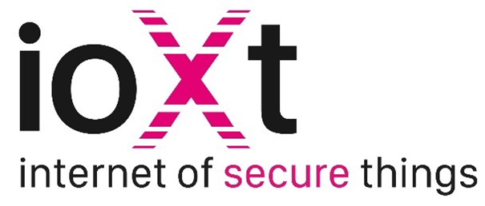
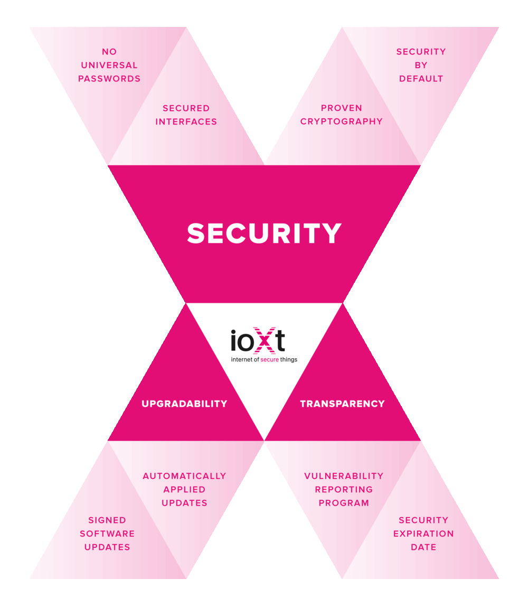
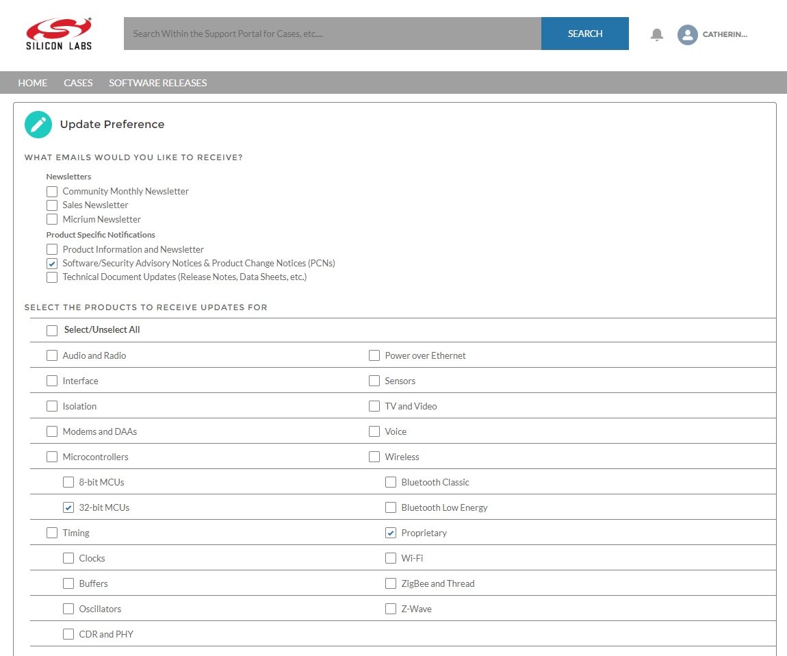
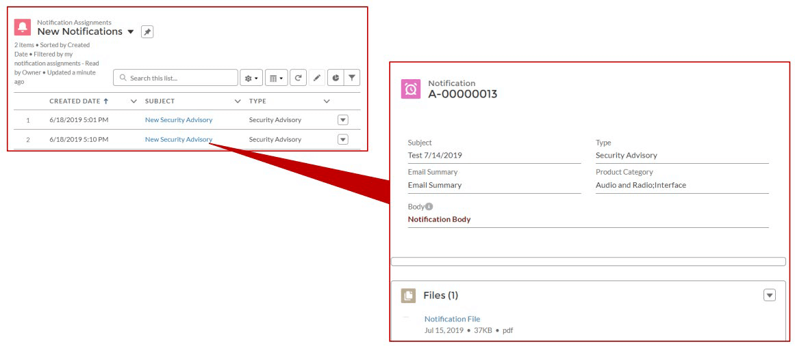
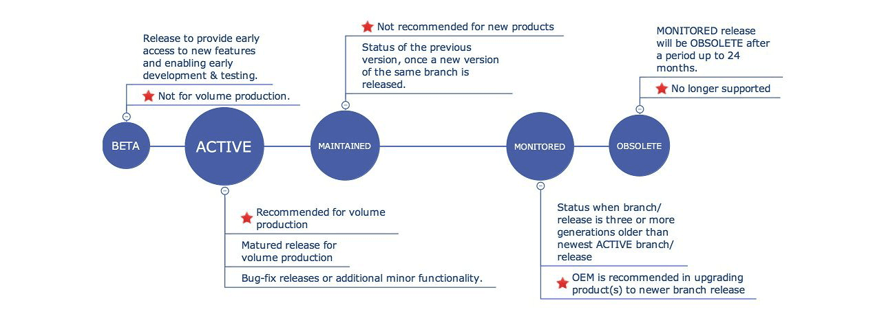

# UG103.5: IoT Endpoint Security Fundamentals (Rev. 1.2) <!-- omit in toc -->

- [1. 引言](#1-引言)
- [2. 没有通用密码](#2-没有通用密码)
- [3. 安全接口](#3-安全接口)
- [4. 经过验证的加密方式](#4-经过验证的加密方式)
- [5. 默认安全](#5-默认安全)
- [6. 已签名的软件更新](#6-已签名的软件更新)
- [7. 自动应用的更新](#7-自动应用的更新)
- [8. 漏洞报告程序](#8-漏洞报告程序)
- [9. 安全性到期日](#9-安全性到期日)
- [10. 下一步](#10-下一步)

本文档介绍了实现物联网（IoT）系统时必须考虑的安全概念。该文档使用 ioXt Alliance 的八项安全性原则作为结构，清楚地描述了 Silicon Labs 提供的支持端点安全性的解决方案以及您必须在 Silicon Labs 框架之外执行的操作。在适当的地方，会以 Silicon Labs 的自身安全保护方法作为示例。本文档是为产品开发人员和经理设计的。

有关特定安全主题的其他信息，请参见：

Gecko Bootloader 安全：

* *UG266: Gecko Bootloader User’s Guide*
* *AN1218: Series 2 Secure Boot with RTSL*

协议安全：

* *AN1233: Zigbee Security* （原 *UG103.05: Application Security Fundamentals*）
* *UG103.14: Bluetooth® LE Fundamentals and relevant Knowledge Base Articles (KBAs)*
* *AN1037: Apple HomeKit Over Bluetooth®*
* *UG235.03: Architecture of the Silicon Labs Connect Stack*

# 1. 引言

保护物联网的安全十分具有挑战性。随着外在威胁的增多，物联网安全变得越发关键。维护物理网产品的安全对开发者来说可能是非常繁重的（尤其是在低成本、资源受限的 IoT 产品中）。在互联互通的世界中保护您的产品是必要的，因为客户数据和现代在线商业模型被越来越多的黑客所关注，这些黑客可能会破坏了用户的隐私和公司的品牌。Silicon Labs 致力于与安全社区、客户和其他专家合作，以带来最先进的技术来帮助保护您的产品。

Silicon Labs 是 ioXt（Internet of Secure Things，安全物联网）联盟的成员。成立 ioXt 联盟的目的是将无线运营商、领先的消费产品制造商、标准组织、合法实验室和政府组织召集在一起，以协调基本的安全要求，为测试和兼容性认证奠定基础，并共同建立物联网的全球标准世界。

ioXt 联盟制定了 ioXt 安全承诺（[https://www.ioxtalliance.org/s/ioXt-SecurityPledge-booklet-final.pdf](https://www.ioxtalliance.org/s/ioXt-SecurityPledge-booklet-final.pdf)）。该承诺涵盖了安全性、可升级性和透明性方面的八项原则。Silicon Labs 在我们自己的运营以及我们提供的产品中都采用了这些原则。本文档介绍了我们对这些原则的处理方式。

上面的图片和所有承诺语言均摘自 *The ioXt Security Pledge: 8 Principles for Consumer Product Design and Manufacturing to Ensure Security, Upgradability & Transparency (2019)*。

# 2. 没有通用密码

产品不应具有通用密码（universal password）；操作需要唯一的安全凭证。通用密码使攻击者可以轻松访问任何设备。因此，产品应具有唯一的密码或要求用户在首次使用时立即输入新密码。

您有责任在激活之前确保您的产品强制创建唯一密码。

Silicon Labs 的产品旨在由制造商进行配置，然后再交付给客户，因此密码不在我们的范围之内。但是，Silicon Labs 工具旨在支持所讨论协议提供的各种安全级别。大多数协议提供了不同的安全级别，并在安全级别和其他功能（如易于形成网络）之间进行了权衡。您需要检查并确定应用所需的级别。例如：

* EmberZNet Pro SDK 支持高度安全的集中式信任中心控制的方法，该方法将设备的工厂编程的链接密钥（link key）替换为网络上每个设备唯一的密钥。
* Z-Wave 700 产品在首次加电时带有工厂编程的唯一 S2 密钥对，并通过包含公钥的 QR 码支持 SmartStart commissioning。
* Bluetooth 选项的范围从不安全的 “Just Works” 方法到 LE Secure Connections Pairing 模型。应用设计者可以实施其他设备身份验证方法（如通过配套的智能手机应用），以帮助确保安全配对，即使没有用户界面的设备也是如此。

# 3. 安全接口

所有产品接口均应由制造商适当保护。

要保护的接口将因产品配置而异。例如，在 NCP 拓扑中，必须保护 NCP 接口。调试接口应始终被锁定。通过使用强大的配对和 commissioning 方法以及启用加密和认证的传输来保护无线接口。

尽管最终由您来确保接口的安全，但 Silicon Labs 提供了实现该安全性的工具。

Series 1 和 Series 2 设备均设计为支持安全调试访问。对于 Series 1 设备，通过向设备写入调试锁定字（Debug Lock word）来提供该功能。解锁设备会删除主应用和 Lockbits 页中存储的密钥材料。对于 Series 2 设备，安全调试访问是通过设备的安全元素完成的。两者都允许开发人员锁定调试端口。有关 Series 2 实施的详细信息，请参见 *UG266: Silicon Labs Gecko Bootloader User's Guide*，以获取有关安全调试访问的概述。*UG104: Testing and Debugging Applications for the Silicon Labs EM35x and EFR32MG Platforms* 概述了各个应用测试阶段以及每个阶段所需的调试访问（硬件和软件）。

有关不同协议中无线接口安全性的更多信息，请参见以下内容：

* *AN1233: Zigbee Security*
* *UG103.14: Bluetooth® LE Fundamentals* 和相关 KBA
* *AN1037: Apple HomeKit Over Bluetooth®*
* *UG235.03: Architecture of the Silicon Labs Connect Stack*

# 4. 经过验证的加密方式

产品安全性应使用健壮的、经过验证的、可更新的加密技术（使用公开的、经过同行评审的方法和算法）。

其中的一个着重点是，任何物联网设备与其他设备、网关或云进行通信时的安全性。该标准要求使用经过验证的加密方法，而不是尝试自行实现。

开发者通常使用协议固有的标准化且经过验证的加密方法来保护 TCP/IP 连接、Bluetooth、Zigbee 或 Z-Wave 等通信的安全。但是，如果一个微控制器通过诸如 UART 之类的简单接口将敏感信息发送给另一个微控制器，则重要的是要认识到还应该确保数据安全，以防止他人窥探 UART 线路。

Silicon Labs 提供了一个硬件 CRYPTO 模块，该模块可以有效加速常见的加密操作，并允许以较低的 CPU 开销来有效地使用它们。CRYPTO 模块包括用于 AES（Advanced Encryption Standard，高级加密标准）、SHA-1 和 SHA-2（SHA-224 和 SHA-256）（Secure Hash Algorithm，安全哈希算法）的硬件加速器，以及用于 ECC（Elliptic Curve Cryptography，椭圆曲线密码术）和 GCM（Galois Counter Mode，伽罗瓦计数器模式）的模乘。CRYPTO 模块可以自主执行和迭代一系列指令，以辅助软件并加快复杂的密码功能（如 ECC、GCM 和 CCM（带有 CBC-MAC 的计数器））。

除了 CRYPTO 模块外，Silicon Labs 还包含了 mbed TLS（作为 Gecko Platform SDK 的一部分）。mbed TLS 是 ARM Limited 许可的开源软件。它提供了一个 SSL 库，可轻松地在应用中使用加密功能和 SSL/TLS。mbed TLS 支持 TLS 1.2 支持的所有加密算法的软件实现，以及当平台支持密码加速器时允许硬件驱动程序替换软件实现的构建 API。它的模块化框架允许将诸如加密库之类的子组件独立于 SSL/TLS 组件并入设计中，从而节省了宝贵的代码空间和运行时 RAM。mbed TLS 通过提供以下功能来支持 SSLv3 至 TLSv1.2 的通信：

* TCP/IP communication functions: listen, connect, accept, read/write.
* SSL/TLS communication functions: init, handshake, read/write.
* X.509 functions: CRT, CRL and key handling
* Random number generation
* Hashing
* Encryption/decryption

这些功能分为逻辑接口。它们可以单独使用以提供上述任何功能，也可以混合使用 X.509 PKI 的 SSL 服务器/客户端解决方案。源代码提供了此类实现的示例。Plugins 和 API 提供可通过各种 SDK 安装访问的配置接口。

有关更多信息，请参阅 [https://docs.silabs.com](https://docs.silabs.com) 上目标部分的最新 MCU 和 Peripheral Software Documentation。

# 5. 默认安全

制造商默认应适当地启用产品的安全功能。

产品的运输状态由制造商决定。该标准要求在交付产品之前启用产品随附的所有安全功能。客户不必打开安全性；相反，他们应该积极禁用它。例如，默认情况下，Silicon Labs Z-Wave 终端节点和网关 SDK 附带 S2 加密和 SmartStart 网络形成。

Silicon Labs 认为应在产品设计过程中考虑产品安全性，而不是事后考虑。在开发环境中，可以在应用开发过程中视情况启用或禁用所有 Silicon Labs 应用安全功能。在设备设计和测试期间还必须考虑安全性。*AN961: Bringing Up Custom Devices for the EFR32MG and EFR32FG Families* 描述了可以编程到自定义设备中以支持各种类型安全性（包括由 Gecko Bootloader 提供的安全性）的安全性 Token（密钥和证书等）（请参 [6. 已签名的软件更新](#6-已签名的软件更新)）。

# 6. 已签名的软件更新

产品应仅支持已签名的软件更新。尽管所有产品的可更新性至关重要，但确保这些更新映像的安全也同样重要。制造商必须对更新映像进行加密签名，以防止在部署过程中被篡改。该产品不得使用未签名的更新，因为它们可能是欺诈性的。

Silicon Labs 开发工具通过 Silicon Labs Gecko Bootloader 支持构建签名的升级映像并安全地现场更新设备。可以将 Gecko Bootloader 配置为执行各种功能，从设备初始化到固件升级。Bootloader 的主要功能包括：

* 可在 Silicon Labs 的 Gecko 微控制器和无线微控制器系列中使用
* 可现场升级
* 可配置
* 增强的安全功能，包括：
  * 安全启动（Secure Boot）：启用安全引导后，bootloader 会使用非对称密码对每次引导强制执行应用映像的加密签名验证。这样可以确保该应用是由受信任方创建并签名的。
  * 已签名的升级映像文件：Gecko Bootloader 支持对升级映像文件执行加密签名验证。这使 bootloader 和应用可以在开始升级过程之前验证应用或 bootloader 的升级是否来自受信任的源，从而确保映像文件是由受信任方创建并签名的。
  * 已加密的升级映像文件：还可以对映像文件进行加密，以防止窃听者获取纯文本固件映像。

在 Series 1 设备上，Gecko Bootloader 具有两阶设计（初阶和主阶），其中最小的初阶 bootloader 用于升级主阶 bootloader。初阶 bootloader 仅包含在内部闪存中读写固定地址的功能。要执行主阶 bootloader 升级，正在运行的主阶 bootloader 会验证 bootloader 升级映像文件的完整性和真实性。然后，运行中的主阶 bootloader 会将升级映像写入内部闪存中的固定位置，并向初阶 bootloader 发出重新引导请求。初阶 bootloader 在将升级映像复制到主阶 bootloader 位置之前会通过 CRC32 校验来验证主阶 bootloader 固件升级映像的完整性。

在 Series 2 设备上，Gecko Bootloader 仅有主阶。主阶 bootloader 可通过硬件外设安全元素（Secure Element）进行升级。通过从内部闪存的可配置位置进行复制，安全元素提供了将映像安装到内部闪存中地址 0x0 的功能。要执行主阶 bootloader 升级，正在运行的主阶 bootloader 会验证 bootloader 升级映像文件的完整性和真实性。然后，正在运行的主阶 bootloader 将升级映像写入闪存中的升级位置，并请求安全元素安装它。安全元素还能够针对信任根验证主阶 bootloader 更新映像的真实性。安全元素本身可以使用相同的机制进行升级。

总而言之，Series 2 设备支持信任的硬件根和安全启动过程，该过程可验证 Gecko Bootloader 的真实性和完整性；而在 Series 1 设备中，Gecko Bootloader 的真实性和完整性被假定为受信任且未进行明确检查。

Gecko Bootloader 可以在两个级别上实施应用映像安全性：

安全启动（Secure Boot）是指在每次设备启动时验证主闪存中应用映像的真实性。启用安全启动后，在每次启动应用之前，都会在每次启动时验证闪存中应用映像的加密签名。在 Silicon Labs 提供的示例配置中，默认情况下未启用安全启动，但是强烈建议启用安全启动以确保固件映像的有效性和完整性。

安全固件升级（Secure Firmware Upgrade）是指在执行引导加载之前验证升级映像的真实性，并有选择地强制对升级映像进行加密。安全固件升级过程使用对称加密对升级映像进行加密，并使用非对称加密对升级映像进行签名，以确保其完整性和真实性。

有关 Silicon Labs 支持软件更新安全性的更多信息，请参阅以下内容：

常规 Bootloader：*UG103.06: Bootloader Fundamentals*

Gecko Bootloader：*UG266: Silicon Labs Gecko Bootloader User’s Guide*

将 Gecko Bootloader 用于特定协议：

* *AN1084: Using the Gecko Bootloader with EmberZNet*
* *AN1085: Using the Gecko Bootloader with Silicon Labs Connect*
* *AN1086: Using the Gecko Bootloader with Silicon Labs Bluetooth Applications*

Series 2 设备上的安全启动：*AN1218: Series 2 Secure Boot with RTSL*。

# 7. 自动应用的更新

制造商将迅速采取行动以及时应用安全更新。只要检测到安全漏洞，制造商就会自动将补丁应用到产品。而无需用户干预。

制造商有责任开发和实施自动安全更新。此类系统的设计和方法（如通过与云连接的基础架构或服务代表的直接干预）将由您决定。

如 [8. 漏洞报告程序](#8-漏洞报告程序) 中所述，Silicon Labs 将通知您任何与安全相关的更新。您的责任是评估漏洞对特定产品造成的风险级别，并将更新适当地集成到平台中，以保护最终用户。更新的组件可能包括协议库、EFR32MG21 系列内部的安全元素固件、或者是执行安全 OTA 更新和安全启动功能的 SDK 模块（如 Gecko Bootloader）。

Silicon Labs 建议以下：

* 通过我们的 Salesforce 门户订阅安全更新。要查看或更改您的订阅，请登录到门户网站，单击 **HOME** 转到门户网站主页，然后单击 **Manage Notifications**。确保已选中 **Software/Security Advisory Notices & Product Change Notices (PCNs)**，并且至少已订阅您的平台和协议。单击 **\[Save\]** 已保存所有更改。

    

* 不要关闭 Simplicity Studio 的更新通知。在 Simplicity Studio 中，您可以下载更新并轻松访问产品发行说明。

# 8. 漏洞报告程序

制造商应实施漏洞报告程序，并将及时予以解决。所有提供 Internet 连接的设备和服务的公司都应提供公共联系点，作为漏洞披露政策的一部分，以便安全研究人员和其他人员能够报告问题。披露的漏洞应及时采取措施。

制造商负责实施自己的程序。对于任何单个漏洞，在解决该漏洞之前，您需要权衡与客户保持透明的价值与恶意利用该信息来利用漏洞的风险。Silicon Labs 对报告我们产品中发现的安全漏洞的范围做出了类似的决定。

Silicon Labs 客户和安全研究人员可以在 Silicon Labs 网站上报告 Silicon Labs 硬件和软件产品中的安全漏洞：[https://www.silabs.com/security/product-security](https://www.silabs.com/security/product-security)。

可以在以下位置找到 Silicon Labs 的安全漏洞披露政策：

[https://www.silabs.com/documents/public/miscellaneous/PS1012-Security_Vulnerability_Disclosure_Policy.pdf](https://www.silabs.com/documents/public/miscellaneous/PS1012-Security_Vulnerability_Disclosure_Policy.pdf)

Silicon Labs 拥有一个 PSIRT（Product Security Incident Response Team，产品安全事件响应团队），专门负责报告的安全漏洞的案例管理。PSIRT 与其他 Silicon Labs 小组（包括应用程序、开发人员、销售和市场营销）合作，评估报告的漏洞，执行技术分析并确定适当的响应。解决漏洞的关键过程包括：

* 分诊：确定重现该漏洞所需的内容。
* 技术分析和处置：确认安全漏洞的有效性、范围及影响，并提供解决方案或处置决策。Silicon Labs 根据 CVSS 3.1（Common Vulnerability Scoring System，常见漏洞评分系统）对事件进行评分：低、中、高、严重。
* 输出：与我们的客户沟通。报告实体以外的披露级别和方法取决于漏洞的严重性和范围。

Silicon Labs 向通过我们的 Salesforce 门户订阅的客户提供广泛的漏洞报告（有关如何订阅的信息，请参阅 [7. 自动应用的更新](#7-自动应用的更新)）。订阅的客户将看到类似于以下内容的安全建议通知：

# 9. 安全性到期日

制造商对于提供安全更新的时间段应保持透明。就像制造商的产品保修一样，在安全更新的整个支持期内，也应保持透明。

制造商应在各个阶段提供有关产品支持的详细信息，并发布安全性到期日期。 Z-Wave 的协议生命周期提供了一个示例。

生命周期详细信息将在哪些阶段应用更新以及将应用到哪个产品分支。有关各个阶段以及特定 Z-Wave 产品如何实现生命周期的详细信息，请参阅：

[https://www.silabs.com/products/development-tools/software/z-wave/embedded-sdk/life-cycle](https://www.silabs.com/products/development-tools/software/z-wave/embedded-sdk/life-cycle)

# 10. 下一步

Silicon Labs 安全性网页（[https://www.silabs.com/security](https://www.silabs.com/security)）包含指向各种常规安全性相关资源的链接。您可能希望在页面上添加书签，因为它将不断用新内容，新工具和新流程进行更新。

如果您处于产品设计的初期阶段，并且尚未选择设备或开发环境，则建议您在决策中包括安全注意事项。Silicon Labs 提供有关我们设备和开发环境的安全功能的信息。本章中引用了许多可用的目标安全性文档。

如果您已经在开发中，我们强烈建议您在开发、测试产品并将其发布给客户时执行此处描述的标准。
