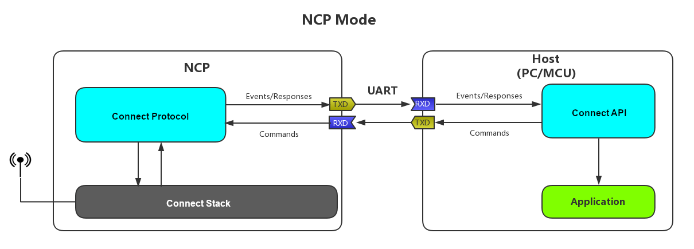
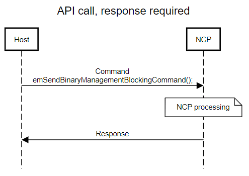
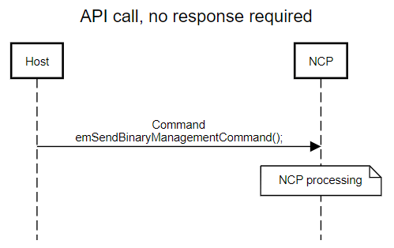
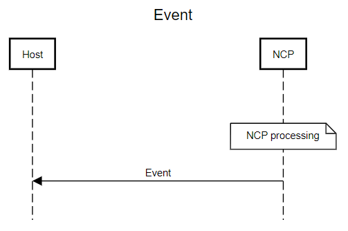

# UG235.09: Developing NCP Applications with Silicon Labs Connect v2.x (Rev. 0.2) <!-- omit in toc -->

- [1. Introduction](#1-introduction)
- [2. NCP and Host Applications](#2-ncp-and-host-applications)
  - [2.1 NCP Application (SoC)](#21-ncp-application-soc)
  - [2.2 Host Application](#22-host-application)
- [3. Compiling NCP and Host Applications](#3-compiling-ncp-and-host-applications)
  - [3.1 Compiling the NCP Application](#31-compiling-the-ncp-application)
  - [3.2 Compiling the Host Application](#32-compiling-the-host-application)
- [4. Connect Serial Protocol](#4-connect-serial-protocol)
  - [4.1 CSP Frame Format](#41-csp-frame-format)
  - [4.2 CSP Payload Format](#42-csp-payload-format)
- [5. Files to Port to Use NCP on a Specific Architecture / Platform](#5-files-to-port-to-use-ncp-on-a-specific-architecture--platform)

Connect v2.x User's Guide 的这一章介绍了如何使用 Silicon Labs Connect 开发 NCP（Network Co-processor）应用程序。Connect stack 作为 Silicon Labs Proprietary Flex SDK 的一部分提供。Connect v2.x User's Guide 假定您已经安装了 Simplicity Studio 开发环境和 Flex SDK，并且熟悉配置、编译和刷写 Connect-based 应用程序的基础知识。有关 Connect v2.x User's Guide 中各章的概述，请参阅 *UG235.01: Developing Code with Silicon Labs Connect v2.x*。

# 1. Introduction

NCP 指代 Network Co-processor。通过向系统中添加一个处于 NCP 模式的 Wireless Gecko (EFR32™) SoC，客户可以利用 EFR32 Radio 特性集实现一个 Connect-based 无线应用。原客户应用（在一个 Host 设备上运行，如 PC、MCU）通过 UART（Universal Asynchronous ReceiverTransmitter）接口连接到 NCP 并对其进行控制，如下图所示。

> 注：不应该混淆 NCP 和 vNCP（virtual Network Co-processor）。有关 vNCP 的更多信息，请参阅 *AN1153: Developing Connect vNCP Applications with Micrium OS*。

从 Host 发往 NCP 的消息称为 **commands**。从 NCP 发往 Host 的消息称为 **callbacks**。

Connect 使用 ASHv3（Asynchronous Serial Host version 3）协议，在 Host 与 NCP 之间传递 commands 和 responses。Connect NCP commands 和 responses 被封装到 ASHv3 消息中。有关 ASHv3 的详情，请参阅 *UG115: ASHv3 Protocol Reference*。

NCP 平台也可以通过正确配置的 serial bootloader（`bootloader-uart-xmodem`）进行加载。有关此 bootloader 的其他信息，请参阅 *UG235.06: Bootloading and OTA with Silicon Labs Connect*。

# 2. NCP and Host Applications

在 NCP 方法中，一个标准的 Connect-based 应用程序被分成两个单独的应用程序，这两个应用程序分别实现不同的角色：NCP 和 Host。NCP 在 EFR32 上运行，而 Host 应用程序在 Host 设备上运行。

## 2.1 NCP Application (SoC)

NCP 应用程序运行在 EFR32 上，并支持通过 UART 接口与 Host 应用程序进行通信。NCP 应用程序可以按配置进行构建，也可以选择地对目标硬件、初始化、主循环处理、事件定义/处理、以及与 Host 的消息传递进行自定义的扩展。Silicon Labs 提供了两个示例 NCP 应用程序：

* 项目名：`ncp-uart-hw` 使用硬件流控制。
* 项目名：`ncp-uart-sw` 使用软件流控制。

这些 NCP 应用程序可以直接使用，无需任何修改。

## 2.2 Host Application

Host 应用程序可以编译给几乎任何具有足够内存和一个 UART 的设备。Host 应用程序示例是针对 Linux 操作系统实现的。客户可以根据需要将它们移植到其它系统中。当前，Simplicity Studio 不支持针对 Host 架构的编译。因此，只能在 Simplicity Studio 环境外部（如命令行）编译可执行文件。所有作为独立的 SoC 应用程序提供的 Connect 应用程序也可以作为 NCP + Host 应用程序使用。

PHY（Physical layer）参数只能在编译时设置，并且只能在 NCP 应用程序中设置。Radio 参数在 Host 端不可配置。

# 3. Compiling NCP and Host Applications

## 3.1 Compiling the NCP Application

编译 NCP 应用程序的过程与任何其他 Connect-based EFR32 应用程序的过程相同。如果需要对示例进行任何配置（radio 参数、plugins、events 等），请使用 AppBuilder（Application Builder）。

## 3.2 Compiling the Host Application

与 NCP 相似，如果需要对 Host 应用程序进行任何配置（plugins、events 等），请使用 AppBuilder，然后生成项目文件。从这一点出发，有两种方法可以编译应用程序：

* 使用目标工具链在安装 Simplicity Studio 的计算机上交叉编译，然后部署到目标设备（需要 Host 设备的交叉编译器工具链）。
* 使用本机编译器在目标设备上进行编译（需要在目标设备上提供 SDK 的副本）。（请参阅下面的注释）

要编译该应用程序，请打开终端，导航到项目的根目录，然后发出 `make -f <project-name>.mak` 命令。编译项目后，在 `build-<project-name>-unix-host` 目录中可以找到名为 `<project-name>-unix-host-app` 的可执行文件。

> 注：将 `C:\SiliconLabs\SimplicityStudio\v4\developer\sdks\gecko_sdk_suite\<SDK-version>` 复制到目标设备。注意（并且您可能需要编辑 make 文件）以使 make 文件中的目录级别与目标设备上的目录级别匹配。

有一个特殊情况：当目标设备可以使用 Simplicity Studio 时（例如，目标设备是一台具有 Linux 操作系统的 x86 PC），则无需采取进一步措施。就像编译任何其他目标应用程序一样，只需编译项目即可。

Host 应用程序的可用 Connect stack API 与 NCP 应用程序中的 API 几乎相同，除了一些仅在一个或另一个上有意义的调用。使用相同的参数调用函数，并生成相同的返回值，相同的回调和事件控制 stack 行为等。因此，在开发 NCP 模式系统时，Host 应用程序与 Connect stack API 的交互与开发 NCP 应用程序时基本相同。

# 4. Connect Serial Protocol

Host 应用程序处理器使用 CSP（Connect Serial Protocol）与 NCP 上运行的 Connect stack 进行交互。CSP 消息通过 UART 接口在 Host 和 NCP 之间发送。CSP 是一个封装在 ASHv3 协议中的二进制协议。有关 ASHv3 协议的详细信息，请参阅 *UG115: ASHv3 Protocol Reference*。

来自应用程序的每个 API 调用都会转换为 CSP 消息。文件 `csp-host.c` 包含 Host API 实现，该实现将 API 调用转换为串行命令，并将传入的串行命令转换为对应用程序回调函数的调用。还有一个表将串行命令 ID 映射到处理程序。所有 API 调用均由一个标识符引用，该标识符必须在 Host 和 NCP 端之间匹配。文件 `csp-enum.h` 包含这些标识符。

`csp-ncp.c` 是与 `csp-host.c` 相对应的 NCP 代码。对于 `csp-host.c` 中的每个 API，`csp-ncp.c` 中都存在一个对应的处理程序。对于 `csp-host.c` 中的每个处理程序，`csp-ncp.c` 中都存在一个发送回调参数的 API。

文件 `csp-enum-decode.c` 包含将命令 ID 转换为字符串的代码。

> 注：请记住，文件 `csp-host.c`、`csp-ncp.c`、`csp-enum-decode.c` 和 `csp-enum.h` 是自动生成的，因此如有更改，恕不另行通知。

通常，CSP 的工作方式如下：

1. Host 上的 API 调用会生成串行消息，然后将其发送到 NCP。
2. Host 自旋以等待 NCP 的响应。
3. NCP 在收到来自 Host 的消息后，将对消息进行解码并调用实际的 stack API。
4. NCP 从 API 获取返回状态，将其打包为一个响应，然后将其发送到 Host。
5. Host 获取到这个响应，该响应是 API 调用的返回值。
6. 最后，Host 上的 stack API 调用返回实际的返回值。

下图展示了典型的 CSP 数据流。

还有一些 API 调用不需要响应。在这些情况下，Host 发送命令，而不等待响应，如下图所示。

第三种情况在 NCP 端生成事件时发生。在这种情况下，NCP 发送消息，并在 Host 端调用相应的回调函数，如下图所示。

## 4.1 CSP Frame Format

<table>
<thead>
  <tr>
    <th class="tbl-item">Byte 0</th>
    <th class="tbl-item">Byte 1</th>
    <th class="tbl-item">Byte 2</th>
    <th class="tbl-item">Byte 3</th>
    <th class="tbl-item">Byte 4</th>
    <th class="tbl-item">Byte 5</th>
    <th class="tbl-item">(Bytes &gt; 5)</th>
  </tr>
</thead>
<tbody>
  <tr>
    <td class="tbl-item">Start of frame</td>
    <td class="tbl-item">UART link type</td>
    <td class="tbl-item" colspan="2">Length</td>
    <td class="tbl-item">Management type</td>
    <td class="tbl-item" colspan="2">payload</td>
  </tr>
</tbody>
</table>

* Start of frame: 0x5A / '['
* UART link type (management / non-management—currently only management (0x01) is in use)
* Message length stored in 16 bits
* Management type (see `ncp-link.h`)
* Payload (for details, see section [4.2 CSP Payload Format](#42-csp-payload-format))

## 4.2 CSP Payload Format

<table>
<thead>
  <tr>
    <th class="tbl-item">Byte 0</th>
    <th class="tbl-item">Byte 1</th>
    <th class="tbl-item">Byte 2</th>
    <th class="tbl-item">(Bytes &gt; 2)</th>
  </tr>
</thead>
<tbody>
  <tr>
    <td class="tbl-item" colspan="2">Command identifier</td>
    <td class="tbl-item" colspan="2">Arguments</td>
  </tr>
</tbody>
</table>

CSP 消息的 payload 由一个 16-bit command identifier 和填充的 arguments 组成（参阅 `binary-management.h`）。

`formatBinaryManagementCommand()` 函数将参数填充到 CSP buffer 中，并返回 payload 所需的空间量。

# 5. Files to Port to Use NCP on a Specific Architecture / Platform

Host 应用程序中的大多数文件都可以按原样使用。但是，某些函数需要移植到目标系统：

* `halCommonGetInt32uMillisecondTick()` (in `system-timer.c`)
* `emberSerialReadByte()` (in `simple-linux-serial.c`)
* `putchar()`

移植以上函数应该可以为目标 Host 编译该项目。
