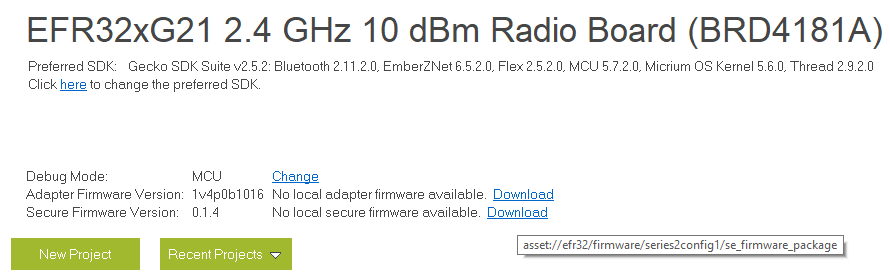
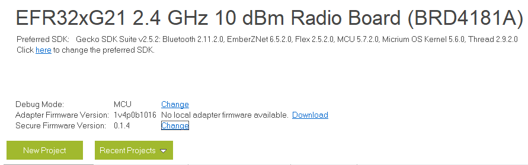
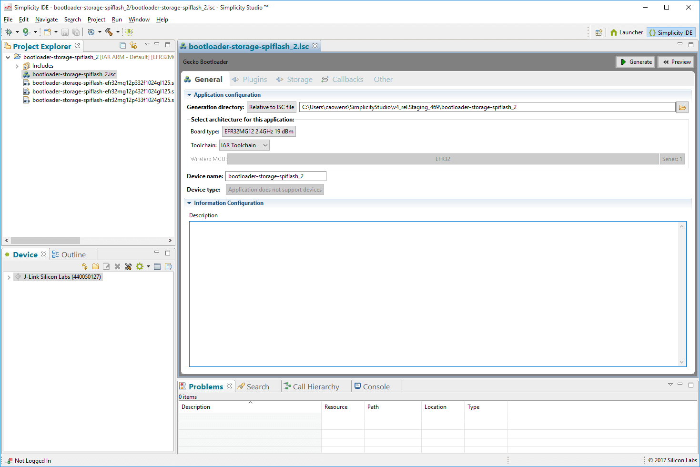
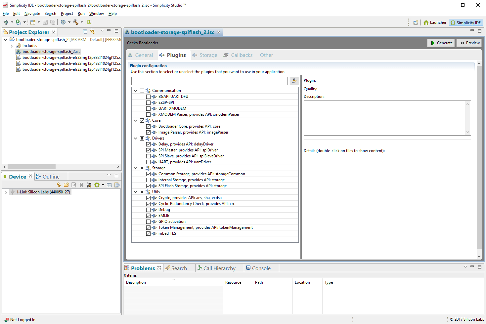
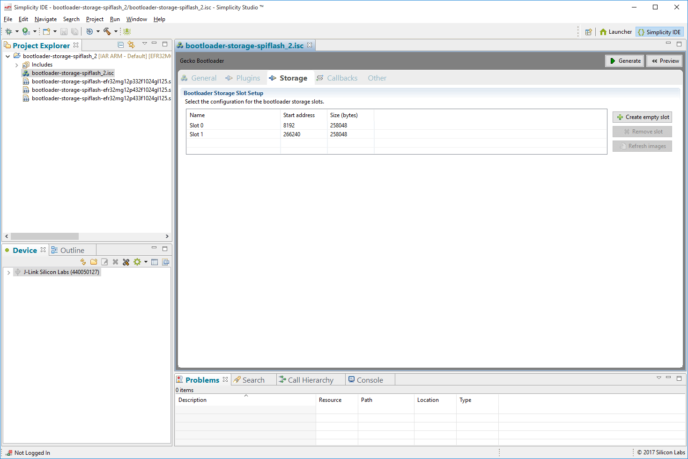

# UG266: Silicon Labs Gecko Bootloader User's Guide (Rev. 1.5) <!-- omit in toc -->

本文档介绍了适用于 EFM32 和 EFR32 的 Series 1 与 Series 2 MCU、SoC 和 NCP 的 Silicon Labs Gecko Bootloader 的高级实现，并提供了有关配置 Gecko Bootloader 的不同方面的信息。如果您不熟悉执行固件升级的基本原理，或者想了解有关升级映像文件的更多信息，请参考 *UG103.6: Bootloader Fundamentals*。

有关在不同的无线协议栈上使用 Gecko Bootloader 的更多信息，请参阅以下内容：

* *AN1084: Using the Gecko Bootloader with EmberZNet*
* *UG235.06: Bootloading and OTA with Silicon Labs Connect v2.x*
* *UG435.06: Bootloading and OTA with Silicon Labs Connect v3.x*
* *AN1086: Using the Gecko Bootloader with Silicon Labs Bluetooth Applications*

有关 Series 2 设备安全性的更多信息，请参阅：

* *AN1218: Series 2 Secure Boot with RTSL*
* *AN1190: EFR32xG21 Secure Debug*
* *AN1222: Production Programming of Series 2 Devices*

有关将 Series 2 设备与 Secure Vault 一起使用的安全性的详细信息，请参阅：

* *AN1247: Anti-Tamper Protection Configuration and Use*
* *AN1268: Authenticating Silicon Labs Devices using Device Certificates*
* *AN1271: Secure Key Storage*

# 1. 引言

Silicon Labs Gecko Bootloader 是 Silicon Labs 所有新型 MCU 和无线 MCU 的通用 bootloader。可以配置 Gecko Bootloader 以执行各种功能（从设备初始化到固件升级）。该 bootloader 的主要特点包括：

* 可在 Silicon Labs Gecko 微控制器和无线微控制器系列中使用
* 可现场升级（In-field upgradeable）
* 可配置
* 增强的安全特性，包括：
  * Secure Boot：启用 Secure Boot 后，bootloader 会在每次启动时强制执行应用程序映像的加密签名验证（使用非对称密码）。这可确保应用程序是由受信任方创建和签名的。
  * 签名的升级映像文件（Signed upgrade image file）：Gecko Bootloader 支持强制执行升级映像文件的加密签名验证。这允许 bootloader 和应用程序在开始升级过程之前验证应用程序或 bootloader 的升级是否来自受信任的源，从而确保映像文件是由受信任方创建和签名的。
  * 加密的升级映像文件（Encrypted upgrade image file）：还可以对映像文件进行加密，以防止窃听者获取明文固件映像。

Gecko Bootloader 使用专有格式的升级映像，称为 GBL（Gecko Bootloader file）。这些文件使用文件扩展名 `.gbl`。有关更多详细信息，请参见 [2. Gecko Bootloader 文件格式](#2-Gecko-Bootloader-文件格式)。

在 Series 1 设备上，Gecko Bootloader 采用 two-stage 设计（first stage 和 main stage），其中最小的 first stage bootloader 用于升级 main bootloader。First stage bootloader 仅包含读写内部 flash 中固定地址的功能。要执行 main bootloader 的升级，正在运行的 main bootloader 将验证 bootloader 升级映像文件的完整性和真实性。然后，正在运行的 main bootloader 将升级映像写入到 flash 中的固定位置，并重新引导到 first stage bootloader。First stage bootloader 在将升级映像覆盖到 main bootloader 的位置之前会通过计算 CRC32 校验值来验证 main bootloader 固件升级映像的完整性。

在 Series 2 设备上，Gecko bootloader 仅由 main stage bootloader 组成。Main bootloader 可以通过 Secure Element（安全元素）进行升级。Secure Element 可以是基于硬件的，也可以是虚拟的。在本文档中，将使用以下约定：

* SE - Hardware Secure Element
* VSE - Virtual Secure Element
* Secure Element - Either type, in general

通过从内部 flash 的可配置位置中进行复制，Secure Element 提供了将映像安装到内部 flash 中地址 0x0 的功能。这样就可以进行 2-stage 设计，其中不存在 main bootloader。然而，在整个文档中都假定存在 main bootloader。

要执行 main bootloader 升级，正在运行的 main bootloader 会验证 bootloader 升级映像文件的完整性和真实性。然后，正在运行的 main bootloader 会将升级映像写入到 flash 中的升级位置，并请求 Secure Element 进行安装。在某些设备上，Secure Element 还能够针对信任根验证 main bootloader 更新映像的真实性。Secure Element 本身可以使用相同的机制进行升级。有关更多详细信息，请参见 [5. Gecko Bootloader Operation - Secure Element Upgrade](#5-Gecko-Bootloader-Operation-Secure-Element-Upgrade)。

Main bootloader 由一个 common core、driver 和一组 plugin 组成，plugin 为 bootloader 提供了特定的能力。Common bootloader core 作为预编译库提供，而 plugin 作为源代码提供。Common bootloader core 包含解析 GBL 文件并将其内容刷写到设备的功能。

Gecko Bootloader 可以配置为在 standalone mode（standalone bootloader）或 application mode（application bootloader）中执行固件升级，具体取决于 plugin 配置。可以通过 Simplicity Studio IDE 启用和配置 plugin。

Standalone bootloader 使用一个通信通道来获取固件升级映像。NCP（network co-processor，网络协处理器）设备始终使用 standalone bootloader。Standalone bootloader 在一个 single-stage 过程中执行固件映像升级，这允许将应用程序映像放入 flash 以覆盖现有的应用程序映像，而无需应用本身的参与。通常，应用程序与 standalone bootloader 的唯一交互是应用程序请求重新引导到 bootloader。Bootloader 运行后，它会通过物理连接（如 UART 或 SPI）接收包含固件升级映像的数据包。要用作 standalone bootloader，则 bootloader 必须配置一个提供通信接口（如 UART 或 SPI）的 plugin。

Application bootloader 依赖应用程序以获取固件升级映像。Application bootloader 通过将固件升级映像写入到 flash 区域（称为下载空间（Download Space））来执行固件映像升级。应用程序可以以任何方便的方式（UART、OTA、Ethernet、USB 等）将固件升级映像传输到下载空间。下载空间可以是外部存储设备（如 EEPROM 或 dataflash），也可以是芯片内部 flash 的一部分。Gecko Bootloader 可以将下载空间划分为多个存储槽，并同时存储多个固件升级映像。要用作 application bootloader，则 bootloader 必须配置一个提供 bootloader 存储实现的 plugin。

Silicon Labs 提供了一些示例 bootloader，它们带有一组预先配置的 plugin，可以在 standalone 或 application 模式下进行配置，如 [7. 配置 Gecko Bootloader](#7-配置-Gecko-Bootloader) 中所述。Silicon Labs Gecko SDK Suite 还包含了几个不同的 EFR32 设备的预编译 bootloader 映像。在撰写本文时，提供了下表中展示的映像。

> 注意：这些预编译映像未启用 bootloader 的安全特性。

<table title="Table 1.1. Prebuilt Bootloader Images">
<thead>
  <tr>
    <th style="white-space: nowrap" align="center">Use</th>
    <th style="white-space: nowrap" align="center">Wireless Stack</th>
    <th style="white-space: nowrap" align="center">Image Name</th>
    <th style="white-space: nowrap" align="center">Mode</th>
    <th style="white-space: nowrap" align="center">Interface</th>
  </tr>
</thead>
<tbody>
  <tr>
    <td style="white-space: nowrap" align="center">SoC</td>
    <td style="white-space: nowrap" align="center">EmberZNet PRO</td>
    <td style="white-space: nowrap" align="center">SPI Flash Storage Bootloader</td>
    <td style="white-space: nowrap" align="center">Application</td>
    <td style="white-space: nowrap" align="center">SPI Serial Flash</td>
  </tr>
  <tr>
    <td style="white-space: nowrap" align="center">SoC</td>
    <td style="white-space: nowrap" align="center">Bluetooth</td>
    <td style="white-space: nowrap" align="center">Bluetooth In-Place OTA DFU Bootloader</td>
    <td style="white-space: nowrap" align="center">Application</td>
    <td style="white-space: nowrap" align="center">OTA/internal flash</td>
  </tr>
  <tr>
    <td style="white-space: nowrap" align="center">NCP</td>
    <td style="white-space: nowrap" align="center">EmberZNet PRO</td>
    <td style="white-space: nowrap" align="center">UART XMODEM Bootloader</td>
    <td style="white-space: nowrap" align="center">Standalone</td>
    <td style="white-space: nowrap" align="center">UART (EZSP)</td>
  </tr>
  <tr>
    <td style="white-space: nowrap" align="center">NCP</td>
    <td style="white-space: nowrap" align="center">Bluetooth</td>
    <td style="white-space: nowrap" align="center">BGAPI UART DFU Bootloader</td>
    <td style="white-space: nowrap" align="center">Standalone</td>
    <td style="white-space: nowrap" align="center">UART (BGAPI)</td>
  </tr>
</tbody>
</table>

注意，在具有专用 bootloader 区域的设备（EFR32xG12 和后续的 Series 1 设备）上，如果设备配置为引导至 bootloader 区域（即如果设置了 Config Lock Word 0 CLW0\[1\] 的 bit 1），则必须始终在引导 bootloader 区域中存在映像。设备在出厂时已配有 dummy bootloader，可直接跳转到 main flash 中的应用程序。这意味着当将 bootloader 刷写到具有专用 bootloader 区域的设备时，将替换此 dummy bootloader。如果在随后的开发期间不再需要使用 bootloader，则必须清除 CLW0\[1\] 或重新刷写 dummy bootloader。平台特定的预构建 dummy bootloader 映像位于 `./platform/bootloader/util/bin/` 中。注意，由于 dummy bootloader 仅由少量指令组成，并且不会填充 bootloader 区域的其余部分，因此只会覆盖第一个 flash 页（first stage bootloader 驻留的位置），因此 main stage bootloader 可能在刷写 dummy bootloader 之后保持不变。如果需要，可以单独擦除 bootloader 区域中的其它 flash 页。

在没有专用 bootloader 区域（EFR32xG1 和 EFR32 Series 2）的设备上，不需要 dummy bootloader。

随后的小节概述了 Gecko Bootloader 的 common core、driver 和 plugin。有关错误代码和条件的详细信息，请参阅 `platform/bootloader/documentation` 文件夹中 SDK 附带的 *Gecko Bootloader API Reference*。

可以使用 Simplicity Commander 的 `commander device pageerase --region @bootloader` 命令来完全擦除 bootloader 区域。在此状态下，设备将无法启动，直到 CLW0\[1\] 被清零或写入 dummy bootloader。关于如何使用 Simplicity Commander 和 Gecko bootloader，请阅读 [8. Simplicity Commander 与 Gecko Bootloader](#8-Simplicity-Commander-与-Gecko-Bootloader)。

## 1.1 Core

Bootloader core 包含 bootloader 的主要功能。它还包含写入内部 flash 的功能、用于解析和处理 GBL 升级文件内容的映像解析器、以及在 main flash 中引导应用程序的功能。

映像解析器还可选地支持 legacy Ember Bootloader（EBL）文件格式，但如果启用了对 EBL 文件的支持，则不支持 Gecko Bootloader 提供的任何安全特性。

它还提供不支持加密升级映像的 GBL 映像解析器版本。该版本可用于 flash 空间受限的 bootloader 应用，其不需要加密升级映像。

### 1.1.1 Shared Memory

需要使用一部分 SRAM 来在 bootloader 和应用程序之间交换信息。SRAM 的内容通过软件复位（software reset）得以保留，这使得 SRAM 适合作为 bootloader 和应用程序之间的通信通道。

Shared Memory 的大小为 4 byte，位于 SRAM 的第一个地址（0x20000000）。它用于存储包含复位原因的单个 word。Reset cause word 的结构在应用程序接口的 Reset Information 部分中，在文件 `btl_reset_info.h` 中定义为包含原因的 16 bit，以及指示该 word 是否有效的 16 bit 签名。如果签名读得 0xF00F，则复位原因有效。

Silicon Labs 使用的所有 16 bit 复位原因都将最高有效位设置为零。如果需要自定义复位原因，建议设置最高有效位以避免定义冲突。

除了 Reset Information 文档中定义的复位原因外，如果 shared memory 包含值 0x00000001，则 bootloader 将进入固件升级模式。该值用以与某些 legacy Bluetooth 应用保持兼容。

## 1.2 Drivers

不同的固件升级应用需要不同的硬件 driver，以供 bootloader 的其他组件使用。

Driver 模块包括：

* Delay：简单的延迟例程，用于需要小延迟或超时的 plugin。
* SPI：简单的阻塞式 SPI Master 实现，用于与外部设备（如 SPI flash）进行通信。
* SPI Slave：灵活的 SPI Slave driver 实现，用于实现 SPI 协议的通信 plugin。此 driver 支持阻塞和非阻塞操作，使用 DMA（Direct Memory Access，直接内存访问）来支持后台传输以支持非阻塞操作。
* UART：灵活的 serial UART driver 实现，用于实现 UART 协议的通信 plugin。此 driver 支持阻塞和非阻塞操作，使用 DMA 来支持后台传输以支持非阻塞操作。此外，还支持硬件流控制（RTS/CTS）。

## 1.3 Plugins

Bootloader 的所有可选部分或可以交换为不同配置的部分都实现为 plugin。每个 plugin 都有一个通用头文件和一个或多个实现。Plugin 包括：

* Communication
  * UART: XMODEM
  * UART: BGAPI
  * SPI: EZSP
* Compression
* Debug
* GPIO Activation
* Security
* Storage
  * Internal flash
  * External SPI flash

### 1.3.1 Communication

Communication plugin 提供用于实现与 host 设备（如计算机或微控制器）通信的接口。以下几个 plugin 使用不同的传输协议来实现通信接口。

* BGAPI UART DFU：通过启用 BGAPI communication plugin，bootloader 通信接口使用 BGAPI 命令来实现 UART DFU 协议。该 plugin 使 bootloader 与先前随 Silicon Labs Bluetooth SDK versions 2.0.0-2.1.1 发布的 legacy UART bootloader 兼容。有关此内容的更多信息，请参阅 *AN1053: Bluetooth® Device Firmware Update over UART for EFR32xG1 and BGM11x Series Products*。
* EZSP-SPI：通过启用 EZSP-SPI communication plugin，bootloader 通信接口通过 SPI 来实现 EZSP 协议。该 plugin 使 bootloader 与先前随 EmberZNet 无线协议栈一起发布的 legacy ezsp-spi-bootloader 兼容。有关 legacy Ember standalone bootloader 的更多信息，请参阅 *AN760: Using the Ember Standalone Bootloader*。
* UART XMODEM：通过启用 UART XMODEM communication plugin，bootloader 通信接口通过 UART 来实现 XMODEM-CRC 协议。该 plugin 使 bootloader 与先前随 EmberZNet 无线协议栈一起发布的 legacy serial-uart-bootloader 兼容。有关 legacy Ember standalone bootloader 的更多信息，请参阅 *AN760: Using the Ember Standalone Bootloader*。

### 1.3.2 Compression

Compression plugin 为 bootloader GBL 文件解析器提供了处理压缩的 GBL 升级映像的功能。每个 compression plugin 都支持一种压缩/解压算法。在撰写本文时，通过 **GBL Compression (LZ4)** 和 **GBL Compression (LZMA)** plugin 来支持使用 LZ4 和 LZMA 算法压缩/解压数据。

### 1.3.3 Debug

该 plugin 为 bootloader 提供了调试输出的支持。如果该 plugin 配置为启用调试打印，则短调试消息将通过 SWO（Serial Wire Output）打印，这可以通过多种方式访问，包括使用 Simplicity Commander，以及连接到 Wireless Starter Kit TCP/IP 接口的 4900 端口。

要打开调试打印，请启用 Debug plugin，然后选择 **Debug prints**。选择 **Debug asserts** 以启用源码中的断言。

在 Series 1 设备上，还要在 Hardware Configurator 中选择 GPIO 外设。

### 1.3.4 GPIO Activation

如果在引导期间 GPIO 引脚处于活动状态，则此 plugin 提供在复位后自动进入固件升级模式的功能。GPIO 引脚位置和极性是可配置的。

* GPIO：通过启用 GPIO activation plugin，可以通过按钮激活固件升级模式。
* EZSP GPIO：EZSP communication protocol over SPI 可以与此 plugin 一起使用。通过启用 EZSP GPIO plugin，可以通过激活 **nWake** 引脚进入固件升级模式。

### 1.3.5 Security

Security plugin 提供加密操作的实现以及计算校验和和从 manufacturing token 中读取加密密钥的功能。

模块包括：

* AES：AES 加密功能
* CRC16：CRC16 功能
* CRC32：CRC32 功能
* ECDSA：ECDSA 签名验证功能
* SHA-256：SHA-256 摘要功能

### 1.3.6 Storage

这些 plugin 为 SoC 提供了多种 bootloader 存储选项。所有存储实现都必须提供 API 来访问要升级的映像文件。此 API 基于将下载空间划分为存储槽的概念，其中每个槽在存储器中具有预定义的大小和位置，并且可用于存储单个升级映像。某些存储实现还支持原始存储 API 以访问底层存储介质。应用程序可以使用它将其他数据存储在非存储固件升级映像的存储介质的部分中。实现包括：

* Internal Flash：内部 flash 存储实现使用设备的内部 flash 进行升级映像存储。注意，此存储区域仅是一个下载空间，与用于保存活动应用代码的内部 flash 部分区分开。
* SPI Flash：SPI flash 存储实现支持各种 SPI flash 部件。支持的设备子集可以在编译时使用 AppBuilder 的 Bootloader 框架内的 SPI Flash Storage plugin 的选项中进行配置（如果未选中任何复选框，则默认配置包含所有支持部件的 driver）。包含对多个设备的支持需要在 bootloader 中有更多的 flash 空间。SPI flash 存储实现不支持任何写保护功能。受支持的 SPI flash 部件如下表所示。

> 注意：建议电池供电的应用使用带 low power 的部件。使用其他的部件会因静态电流较高而缩短电池寿命，但如果需要，可以通过外部关断 FET 电路来减轻这种情况。

<table title="Table 1.2. Supported Serial Dataflash/EEPROM External Memory Parts">
<thead>
  <tr>
    <th>Manufacturer Part Number</th>
    <th align="right">Size (kB)</th>
    <th align="right">Quiescent Current<br>(µA Typical)<sup>*</sup></th>
  </tr>
</thead>
<tbody>
  <tr>
    <td style="white-space: nowrap">Macronix MX25R8035F (low power)</td>
    <td style="white-space: nowrap" align="right">1024</td>
    <td style="white-space: nowrap" align="right">0.007</td>
  </tr>
  <tr>
    <td style="white-space: nowrap">Macronix MX25R6435SF (low power)</td>
    <td style="white-space: nowrap" align="right">8192</td>
    <td style="white-space: nowrap" align="right">0.007</td>
  </tr>
  <tr>
    <td style="white-space: nowrap">Spansion S25FL208K</td>
    <td style="white-space: nowrap" align="right">1024</td>
    <td style="white-space: nowrap" align="right">15</td>
  </tr>
  <tr>
    <td style="white-space: nowrap">Winbond W25X20BVSNIG<br><br>(W25X20CVSNJG for high- temperature support)</td>
    <td style="white-space: nowrap" align="right">256</td>
    <td style="white-space: nowrap" align="right">1</td>
  </tr>
  <tr>
    <td style="white-space: nowrap">Winbond W25Q80BVSNIG<br><br>(W25Q80BVSNJG for high- temperature support)</td>
    <td style="white-space: nowrap" align="right">1024</td>
    <td style="white-space: nowrap" align="right">1</td>
  </tr>
  <tr>
    <td style="white-space: nowrap">Macronix MX25L2006EM1I-12G<br><br>(MX25L2006EM1R-12G for high-temperature support)</td>
    <td style="white-space: nowrap" align="right">256</td>
    <td style="white-space: nowrap" align="right">2</td>
  </tr>
  <tr>
    <td style="white-space: nowrap">Macronix MX25L4006E</td>
    <td style="white-space: nowrap" align="right">512</td>
    <td style="white-space: nowrap" align="right">2</td>
  </tr>
  <tr>
    <td style="white-space: nowrap">Macronix MX25L8006EM1I-12G<br><br>(MX25L8006EM1R-12G for high-temperature support)</td>
    <td style="white-space: nowrap" align="right">1024</td>
    <td style="white-space: nowrap" align="right">2</td>
  </tr>
  <tr>
    <td style="white-space: nowrap">Macronix MX25L1606E</td>
    <td style="white-space: nowrap" align="right">2048</td>
    <td style="white-space: nowrap" align="right">2</td>
  </tr>
  <tr>
    <td style="white-space: nowrap">Macronix MX25U1635E (2V)</td>
    <td style="white-space: nowrap" align="right">2048</td>
    <td style="white-space: nowrap" align="right">2</td>
  </tr>
  <tr>
    <td style="white-space: nowrap">Atmel/Adesto AT25DF041A</td>
    <td style="white-space: nowrap" align="right">512</td>
    <td style="white-space: nowrap" align="right">15</td>
  </tr>
  <tr>
    <td style="white-space: nowrap">Atmel/Adesto AT25DF081A</td>
    <td style="white-space: nowrap" align="right">1024</td>
    <td style="white-space: nowrap" align="right">5</td>
  </tr>
  <tr>
    <td style="white-space: nowrap">Atmel/Adesto AT25SF041</td>
    <td style="white-space: nowrap" align="right">512</td>
    <td style="white-space: nowrap" align="right">2</td>
  </tr>
  <tr>
    <td style="white-space: nowrap">Micron (Numonyx) M25P20</td>
    <td style="white-space: nowrap" align="right">256</td>
    <td style="white-space: nowrap" align="right">1</td>
  </tr>
  <tr>
    <td style="white-space: nowrap">Micron (Numonyx) M25P40</td>
    <td style="white-space: nowrap" align="right">512</td>
    <td style="white-space: nowrap" align="right">1</td>
  </tr>
  <tr>
    <td style="white-space: nowrap">Micron (Numonyx) M25P80</td>
    <td style="white-space: nowrap" align="right">1024</td>
    <td style="white-space: nowrap" align="right">1</td>
  </tr>
  <tr>
    <td style="white-space: nowrap">Micron (Numonyx) M25P16</td>
    <td style="white-space: nowrap" align="right">2048</td>
    <td style="white-space: nowrap" align="right">1</td>
  </tr>
  <tr>
    <td style="white-space: nowrap">ISSI IS25LQ025B</td>
    <td style="white-space: nowrap" align="right">32</td>
    <td style="white-space: nowrap" align="right">8</td>
  </tr>
  <tr>
    <td style="white-space: nowrap">ISSI IS25LQ512B</td>
    <td style="white-space: nowrap" align="right">64</td>
    <td style="white-space: nowrap" align="right">8</td>
  </tr>
  <tr>
    <td style="white-space: nowrap">ISSI IS25LQ010B</td>
    <td style="white-space: nowrap" align="right">126</td>
    <td style="white-space: nowrap" align="right">8</td>
  </tr>
  <tr>
    <td style="white-space: nowrap">ISSI IS25LQ020B</td>
    <td style="white-space: nowrap" align="right">256</td>
    <td style="white-space: nowrap" align="right">8</td>
  </tr>
  <tr>
    <td style="white-space: nowrap">ISSI IS25LQ040B</td>
    <td style="white-space: nowrap" align="right">512</td>
    <td style="white-space: nowrap" align="right">8</td>
  </tr>
  <tr>
    <td colspan="3"><sup>*</sup> Quiescent current values are as of December 2017; check the latest part specifications for any changes.</td>
  </tr>
</tbody>
</table>

# 2. Gecko Bootloader 文件格式

Gecko Bootloader 使用 GBL 文件格式。本节中描述的文件格式由 Simplicity Commander 命令生成。有关更多信息，请参见 *UG162: Simplicity Commander Reference Guide*。

## 2.1 文件结构

GBL 文件格式由许多 tag 组成，这些 tag 指示后续数据的格式和整个 tag 的长度。Tag 的格式如下：

<table>
<thead>
  <tr>
    <th style="white-space: nowrap" align="center">Tag ID</th>
    <th style="white-space: nowrap" align="center">Tag Length</th>
    <th style="white-space: nowrap" align="center">Tag Payload</th>
  </tr>
</thead>
<tbody>
  <tr>
    <td style="white-space: nowrap" align="center">4 bytes</td>
    <td style="white-space: nowrap" align="center">4 bytes</td>
    <td style="white-space: nowrap" align="center">Variable (according to tag length)</td>
  </tr>
</tbody>
</table>

## 2.2 Plaintext Tag Description

<table>
<thead>
  <tr>
    <th>Tag Name</th>
    <th align="center">ID</th>
    <th>Description</th>
  </tr>
</thead>
<tbody>
  <tr>
    <td style="white-space: nowrap">GBL Header Tag</td>
    <td style="white-space: nowrap" align="center">0x03A617EB</td>
    <td>This must be the first tag in the file. The header tag contains the version number of the GBL file specification, and flags indicating the type of GBL file – whether it is signed or encrypted.</td>
  </tr>
  <tr>
    <td style="white-space: nowrap">GBL Application Info Tag</td>
    <td style="white-space: nowrap" align="center">0xF40A0AF4</td>
    <td>This tag contains information about the application update image that is contained in this GBL file.</td>
  </tr>
  <tr>
    <td style="white-space: nowrap">GBL SE Upgrade Tag</td>
    <td style="white-space: nowrap" align="center">0x5EA617EB</td>
    <td>This tag contains a complete encrypted Secure Element update image. Only applicable on Series 2 devices.</td>
  </tr>
  <tr>
    <td style="white-space: nowrap">GBL Bootloader Tag</td>
    <td style="white-space: nowrap" align="center">0xF50909F5</td>
    <td>This tag contains a complete bootloader update image.</td>
  </tr>
  <tr>
    <td style="white-space: nowrap">GBL Program Data Tag</td>
    <td style="white-space: nowrap" align="center">0xFE0101FE<br>or<br>0xFD0303FD</td>
    <td>This tag contains information about what application data to program at a specific address into the main flash memory.</td>
  </tr>
  <tr>
    <td style="white-space: nowrap">GBL Program<br>LZ4 Compressed Data Tag</td>
    <td style="white-space: nowrap" align="center">0xFD0505FD</td>
    <td>This tag contains LZ4 compressed information about what application data to program at a specific address into the main flash memory.</td>
  </tr>
  <tr>
    <td style="white-space: nowrap">GBL Program<br>LZMA Compressed Data Tag</td>
    <td style="white-space: nowrap" align="center">0xFD0707FD</td>
    <td>This tag contains LZMA compressed information about what application data to program at a specific address into the main flash memory.</td>
  </tr>
  <tr>
    <td style="white-space: nowrap">GBL Metadata Tag</td>
    <td style="white-space: nowrap" align="center">0xF60808F6</td>
    <td>This tag contains metadata that the bootloader does not parse, but can be returned to the application through a callback.</td>
  </tr>
  <tr>
    <td style="white-space: nowrap">GBL Signature Tag</td>
    <td style="white-space: nowrap" align="center">0xF70A0AF7</td>
    <td>This tag contains the ECDSA-P256 signature of all preceding data in the file.</td>
  </tr>
  <tr>
    <td style="white-space: nowrap">GBL End Tag</td>
    <td style="white-space: nowrap" align="center">0xFC0404FC</td>
    <td>This tag indicates the end of the GBL file. It contains a 32-bit CRC for the entire file as an integrity check. The CRC is a non-cryptographic check. This must be the last tag.</td>
  </tr>
</tbody>
</table>

下图展示了 GBL 文件中允许的 GBL tag 序列。

<p>
    
</p>

## 2.3 Encrypted Tag Description

加密的 GBL 文件格式类似于未加密的版本。它引入了许多新 tag。

<table>
<thead>
  <tr>
    <th style="white-space: nowrap">Tag Name</th>
    <th style="white-space: nowrap" align="center">ID</th>
    <th>Description</th>
  </tr>
</thead>
<tbody>
  <tr>
    <td style="white-space: nowrap">GBL Header Tag</td>
    <td style="white-space: nowrap" align="center">0x03A617EB</td>
    <td>The GBL header is the same as for a plaintext GBL file, but the flag indicating that the GBL file is encrypted must be set.</td>
  </tr>
  <tr>
    <td style="white-space: nowrap">GBL Encryption Init Header</td>
    <td style="white-space: nowrap" align="center">0xFA0606FA</td>
    <td>This contains information about the image encryption such as the Nonce and the amount of encrypted data.</td>
  </tr>
  <tr>
    <td style="white-space: nowrap">GBL Encrypted Program Data</td>
    <td style="white-space: nowrap" align="center">0xF90707F9</td>
    <td>This contains an encrypted payload containing a plaintext GBL tag, one of Application Info, Bootoader, Metadata or Program Data. The data is encrypted using AESCTR-128.</td>
  </tr>
</tbody>
</table>

下图展示了加密的 GBL 文件中允许的 GBL tag 序列。

<p>
    
</p>

# 3. Gecko Bootloader Operation - Application Upgrade

本节概述了用于更新应用程序固件的 Gecko Bootloader 操作。首先假设将 Gecko Bootloader 配置为 standalone mode，然后假设将其配置为 application mode。[4. Gecko Bootloader Operation - Bootloader Upgrade](#4-Gecko-Bootloader-Operation-Bootloader-Upgrade) 提供了有关更新 bootloader 固件的相同信息。

本节中说明 Gecko Bootloader 操作的插图未提供有关不同设备的 Bootloader 的内存布局信息。有关更多详细信息，请参见 *UG103.6: Bootloader Fundamentals* 中的“Memory Space for Bootloading”部分。

## 3.1 Standalone Bootloader Operation

Standalone Bootloader 操作如下图所示：

<p>
    
</p>

1. 设备重启（reboot）到 bootloader。
2. 从 host 传输包含应用程序映像的 GBL 文件到设备。如果在 main stage bootloader 中启用了映像加密并且该映像已加密，则在接收和解析 GBL 文件的过程中将执行解密。
3. Bootloader 即时应用来自 GBL 升级文件中的应用程序升级。如果在 main stage bootloader 中启用了映像认证，并且 GBL 文件包含签名，则在完成该过程之前将验证映像的真实性。
4. 设备引导到应用程序。应用程序升级完成。

### 3.1.1 重启到 Bootloader

Gecko Bootloader 支持多种触发 bootloader 的机制。如果启用了 GPIO Activation plugin，则 host 可以通过复位将此引脚保持为低电平/高电平（取决于配置），以使设备进入 bootloader。Bootloader 也可以通过软件进入。`bootloader_rebootAndInstall` API 首先通过向 SRAM 底部的 shared memory 位置写入命令来告知 bootloader 它应进入固件升级模式，然后执行软件复位。如果 bootloader 引导时在 shared memory 中找到正确的命令，那么它将进入固件升级模式，而不是引导现有的应用程序。

### 3.1.2 下载并应用 GBL 升级文件

当 bootloader 进入固件升级模式时，它将进入接收循环以等待来自 host 的数据。接收循环的细节取决于协议。接收到的数据包将传递给映像解析器，映像解析器是一个状态机，用于解析数据并返回一个（包含应该对其执行操作的任何数据）回调。Bootloader core 实现此回调，并将数据刷写到内部 flash 的指定地址。如果启用了 GBL 文件认证或加密，则映像解析器将强制执行此操作，并中止映像升级。

Bootloader 通过阻止应用程序向量表的部分来防止新上传的映像可引导，直到验证了 GBL 文件的 CRC 和 GBL 签名（如果需要）。

### 3.1.3 引导到应用程序

完成应用程序升级后，bootloader 会触发重启，并在 SRAM 底部的 shared memory 中放置消息，以表明应用程序升级已成功完成。应用程序可以使用此复位信息来了解刚刚执行的应用程序升级。

在跳转到 main 应用程序之前，bootloader 会验证应用程序是否已就绪。这包括验证应用程序的 Program Counter 是否有效，（如果启用了 Secure Boot）以及应用程序是否通过签名验证。

### 3.1.4 错误处理

如果应用程序升级在任何时候被中断，则设备将没有可正常运行的应用。然后，bootloader 将复位设备，并重新进入固件升级模式。Host 可以简单地重新开始应用程序升级过程，以尝试再次加载升级映像。

## 3.2 Application Bootloader Operation

下图展示了单个映像/存储槽和多个映像/存储槽的 application bootloader 操作。

<p>
    
</p>

<p>
    
</p>

1. 将 GBL 文件下载到设备的存储介质（内部 flash 或外部 dataflash）上，并指示存在升级映像。
2. 设备重启到 bootloader，然后 bootloader 进入固件升级模式。
3. Bootloader 应用来自 GBL 升级文件中的应用程序升级。
4. 设备引导到应用程序。应用程序升级完成。

### 3.2.1 下载并存储 GBL 升级映像文件

要准备接收升级映像，应用程序将找到可用的存储槽（slot），或使用 `bootloader_eraseStorage` 擦除现有的存储槽。如果 bootloader 仅支持单个存储槽，则使用的 slot ID 为 0。

然后，应用程序使用合适的协议（如 Ethernet、USB、Zigbee、OpenThread 或 Bluetooth）接收 GBL 文件，并通过调用 `bootloader_writeStorage` 将其存储在槽中。

下载完成后，应用程序可选地调用 `bootloader_verifyImage` 来验证 GBL 文件的完整性。这可以在应用映像之前由 bootloader 完成，但也可以从应用程序中完成以避免在接收到损坏的映像时重启到 bootloader。

如果支持多个存储槽，则应用程序应调用 `bootloader_setBootloadList` 来写入 bootload 列表。如 [Figure 3.3. Application Bootloader Operation: Multiple Storage Slots](#Figure-3.3) 所示，该列表将写入两个 bootload info 页，该列表是一个优先级列表，用于指示 bootloader 在尝试执行固件升级时应使用的顺序。Bootloader 将尝试按顺序验证这些存储槽中的映像，并应用第一个通过验证的映像。如果仅支持单个存储槽，则 bootloader 会将整个下载空间视为单个存储槽。

### 3.2.2 重启并应用 GBL 升级文件

Bootloader 可以通过软件进入。`bootloader_rebootAndInstall` API 通过向 SRAM 底部的 shared memory 位置写入命令来告知 bootloader 它应进入固件升级模式，然后执行软件复位。如果 bootloader 引导时在 shared memory 中找到正确的命令，那么它将进入固件升级模式，而不是引导现有的应用程序。

Bootloader 会遍历标记为 bootload 的存储槽列表，并尝试验证存储在每个槽中的映像。一旦找到有效的 GBL 升级文件，它就会尝试执行来自该 GBL 文件中的固件升级。如果升级失败，则 bootloader 将移至列表中的下一个映像。如果没有映像通过验证，则 bootloader 将重启回现有的应用程序，并在 SRAM 中的 shared memory 位置中放置一条消息以指示未找到可用的升级映像。

### 3.2.3 引导到应用程序

完成应用程序升级后，bootloader 会触发重启，并在 SRAM 底部的 shared memory 中放置消息，以表明应用程序升级已成功完成。应用程序可以使用此复位信息来了解刚刚执行的应用程序升级。

在跳转到 main 应用程序之前，bootloader 会验证应用程序是否已就绪。这包括验证应用程序的 Program Counter 是否有效，（如果启用了 Secure Boot）以及应用程序是否通过签名验证。

# 4. Gecko Bootloader Operation - Bootloader Upgrade

Bootloader 升级功能由 Series 1 设备上的 first stage bootloader 提供，或者由 Series 2 设备上的 Secure Element 提供。Secure Element 本身也可以升级。更多详细信息，请参见 [5. Gecko Bootloader Operation - Secure Element Upgrade](#5-Gecko-Bootloader-Operation-Secure-Element-Upgrade)。在 Series 1 设备上，first stage bootloader 不可升级。

升级 main bootloader 的要求取决于 bootloader 的配置：

* **Application bootloader with storage**：升级 main bootloader 需要一个包含 bootloader 和应用程序升级映像的 GBL 文件。
* **Standalone bootloader with communication interface**：升级 bootloader 需要两个 GBL 文件，一个只有 bootloader 升级映像，另一个只有应用程序升级映像。

通过对 GBL 文件进行签名来提供 bootloader 升级过程的安全性，如 [9.3.3 从应用程序中创建签名的和加密的 GBL 升级映像文件](#9-3-3-从应用程序中创建签名的和加密的-GBL-升级映像文件) 中所述。

本节中说明 Gecko Bootloader 操作的插图未提供有关不同设备的 Bootloader 的内存布局信息。有关更多详细信息，请参见 *UG103.6: Bootloader Fundamentals* 中的“Memory Space for Bootloading”部分。为了方便起见，这些插图都没有区分 SE 和 VSE。

## 4.1 Bootloader Upgrade on Bootloaders With Communication Interface (Standalone Bootloaders)

过程如下图所示：

<p>
    
</p>

1. 设备重启到 bootloader。
2. 从 host 传输仅包含 bootloader 升级映像的 GBL 文件到设备。
3. GBL Bootloader tag 的内容被写入到内部 flash 的 bootloader upgrade 位置，从而覆盖现有的应用程序。
4. 设备重启到 first stage bootloader/Secure Element。
5. First stage bootloader/Secure Element 使用在 bootloader upgrade 位置中找到的新版本替换 main bootloader。
6. 设备引导到新的 main bootloader。
7. 从 host 传输仅包含应用程序映像的 GBL 文件到设备。
8. Bootloader 即时应用来自 GBL 升级文件中的应用程序映像。
9. 设备引导到应用程序。Bootloader 升级完成。

Bootloader 升级的开始方式与应用程序升级相同。

### 4.1.1 下载并应用 Bootloader GBL 升级文件

当 bootloader 进入接收循环时，包含 bootloader 升级的 GBL 升级文件将被传输给 bootloader。收到数据包后，会将其传递给映像解析器。映像解析器解析数据，并在回调中返回 bootloader 升级数据。Bootloader core 实现此回调，并将数据刷写到内部 flash 的 bootloader upgrade 位置中。

Bootloader 通过阻止 bootloader 升级向量表的部分，直到 GBL 文件的 CRC 和 GBL 签名（如果需要）通过验证，来防止新上传的 bootloader 升级映像被解释为有效。

在接收到完整的 bootloader 升级映像后，main bootloader 会告知 first stage bootloader/Secure Element 其应进入固件升级模式。在 Series 1 设备上，这是通过将命令写入 SRAM 底部的 shared memory 位置，然后执行软件复位来完成的。在 Series 2 设备上，使用 Secure Element 通信来表示已准备好执行 bootloader 升级。

在 Series 1 设备上，first stage bootloader 会验证当前 main bootloader 上的 CRC，并验证内部 flash 的 bootloader upgrade 位置中存在的 bootloader 升级的 CRC。

* 如果 bootloader upgrade 位置中的 CRC 和当前 main bootloader 中的 CRC 均有效，那么如果待升级的版本号高于当前 main bootloader 的版本，则升级映像将被复制到 main bootloader 位置。
* 如果 bootloader upgrade 位置中的 CRC 有效，而当前 main bootloader 位置中的 CRC 无效，那么无论版本如何，升级映像都将被复制到 main bootloader 位置。这是因为如果 main bootloader 映像已损坏，则不能依赖 main bootloader 的版本。
* 如果 bootloader upgrade 中的 CRC 无效，则不进行升级。

在 Series 2 设备上，可选地在应用 bootloader 升级之前验证 main bootloader 的真实性。有关对 bootloader 进行版本控制的更多信息，请参见 [7.5 设置版本号](#7-5-设置版本号)。

### 4.1.2 将没有 Secure Boot 的 Bootloader 升级到具有 Secure Boot 的 Bootloader

可以使用以下过程将没有 Secure Boot 特性的 bootloader 升级为具有 Secure Boot 特性的 bootloader：

1. 准备一个启用了 Secure Boot 的 Gecko Bootloader 映像。Bootloader 的版本必须高于设备上的 bootloader 的版本。
  * 通过转到 Core plugin 并选中 **Enable secure boot** 选项，在 AppBuilder 中打开 Secure Boot。
  * （可选）在 Core plugin 中，选中 **Require signed firmware upgrade files** 选项。这意味着 Gecko Bootloader 将仅接受已签名的 GBL 文件。
2. 生成一个公有/私有签名密钥（Signing Key）对。有关创建签名密钥对的更多信息，请参见 [9.3.1 生成密钥](#9-3-1-生成密钥)。
3. 将上一步骤生成的公钥写入设备。默认情况下，公钥作为一个 manufacturing token 存储在设备中。只要将 Lock Bits 页配置为允许 flash 写入，即可通过设备上运行的应用代码来编写此密钥。如果 Lock Bits 页被锁定，则其只能由调试器擦除。因此，无法从固件中擦除 Lock Bits 页中的签名/解密密钥。这意味着，对于现场设备而言，flash 中的那些区域无法替换为新区域。然而，可以修改从步骤 1 准备的 Gecko Bootloader，以在不同位置查找签名/解密密钥。密钥位置在 bootloader 项目文件 `btl_security_tokens.c` 中定义。
4. 使用 Gecko Bootloader 映像创建 GBL 文件。对 GBL 文件进行签名/不签名，取决于设备上运行的 Gecko Bootloader 的当前配置。有关创建 GBL 文件的更多详细信息，请参见 [9.3.3 从应用程序中创建签名的和加密的 GBL 升级映像文件](#9-3-3-从应用程序中创建签名的和加密的-GBL-升级映像文件)。
5. 上传 GBL 文件。有关升级过程的更多详细信息，请参见 [4.1 Bootloader Upgrade on Bootloaders With Communication Interface (Standalone Bootloaders)](#4-1-Bootloader-Upgrade-on-Bootloaders-With-Communication-Interface-Standalone-Bootloaders)。

### 4.1.3 在 Series 2 设备上启用 Secure Boot RTSL

可以使用以下过程启用 Secure Boot RTSL（Root of Trust and Secure Loader）：

1. 准备一个启用了 Secure Boot 的 Gecko Bootloader 映像。该 Gecko Bootloader 的版本必须高于设备上的 Gecko Bootloader。
  * 通过转到 Core plugin 并选中 **Enable secure boot** 选项，在 AppBuilder 中打开 Secure Boot。
  * 对于 EFR32xG21，在 Core plugin 上，禁用 **Allow use of public key from manufacturing token storage** 选项。这意味着 Gecko Bootloader 将永远不会使用存储在 main flash 最后一页中的公钥。
  * （可选）在 Core plugin 中，选中 **Require signed firmware upgrade files** 选项。这意味着 Gecko Bootloader 将仅接受已签名的 GBL 文件。
2. 生成一个公有/私有签名密钥对。有关创建签名密钥对的更多信息，请参见 [9.3.1 生成密钥](#9-3-1-生成密钥)。
3. 准备一个应用程序，该应用程序将从步骤 2 生成的公钥安装到 Secure Element One-time Programmable 存储器中。在 VSE 中安装密钥需要一个重置例程。请确保该应用程序不会以重置循环结束。从此应用程序创建一个未签名的 GBL 文件并上传。有关安装公钥的更多信息，请参见 [9.3.3 从应用程序中创建签名的和加密的 GBL 升级映像文件](#9-3-3-从应用程序中创建签名的和加密的-GBL-升级映像文件)。
4. 使用在步骤 2 中生成的私钥对从步骤 1 中生成的 Gecko Bootloader 映像进行签名。有关对二进制文件进行签名的更多信息，请参见 [9.3.2 为 Secure Boot 对应用程序映像进行签名](#9-3-2-为-Secure-Boot-对应用程序映像进行签名)。
5. 制作一个自定义应用程序，该应用程序在 Secure Element 上打开 Secure Boot，并使用从步骤 2 生成的私钥对该应用程序二进制文件进行签名。有关如何在 Secure Element 上打开 Secure Boot 的更多详细信息，请参见 *AN1218: Series 2 Secure Boot with RTSL*。
6. 使用步骤 4 中的 Gecko Bootloader 映像创建 GBL 文件。
7. 使用步骤 5 中的应用程序创建 GBL 文件。如果在步骤 1 中选中了 Core plugin 的 **Require signed firmware upgrade files** 选项，则需要对 GBL 文件进行签名。
8. 上传包含 Gecko Bootloader 映像的 GBL 文件。
9. 上传包含应用程序的 GBL 文件。

### 4.1.4 下载并应用应用程序 GBL 升级文件

完成 bootloader 升级后，现有的应用程序将变为无效，因为 bootloader upgrade 位置与应用程序重叠。包含应用程序升级的 GBL 升级文件将传输给 bootloader。应用程序升级过程如 [3.1 Standalone Bootloader Operation](#3-1-Standalone-Bootloader-Operation) 中所述。

## 4.2 Bootloader Upgrade on Application Bootloaders With Storage

过程如下图所示：

<p>
    
</p>

1. 将包含 bootloader 升级映像和应用程序映像的单个 GBL 文件下载到设备的存储介质上（内部 flash 或外部 SPI flash）。
2. 设备重启到 bootloader。
3. main bootloader 将其升级映像复制到内部 flash 的 bootloader upgrade 位置，从而覆盖现有的应用程序。
4. 设备重启到 first stage bootloader/Secure Element。
5. First stage bootloader/Secure Element 使用新版本替换 main bootloader。
6. 设备引导到新的 main bootloader。
7. Bootloader 应用 GBL 升级文件中的应用程序映像。
8. 设备引导到应用程序。Bootloader 升级完成。

Bootloader 升级的开始方式与应用程序升级相同。包含 bootloader 和应用程序升级的单个 GBL 文件由应用程序写入到存储，然后进入 bootloader。

Bootloader 会遍历标记为 bootload 的存储槽列表，并尝试验证存储在其中的 GBL 文件。验证返回 GBL 文件是包含一个应用程序还是包含一个 bootloader 和一个应用程序。映像解析器解析该文件。如果 GBL 文件包含一个 bootloader，则会在回调中返回 bootloader 升级数据。Bootloader core 实现此回调，并将数据刷写到内部 flash 的 bootloader upgrade 位置中。

Bootloader 通过阻止 bootloader 升级向量表的部分，直到 GBL 文件的 CRC 和 GBL 签名（如果需要）通过验证，来防止新上传的 bootloader 升级映像被解释为有效。

在 Series 1 设备上，main bootloader 通过向 SRAM 底部的 shared memory 位置写入命令来告知 first stage bootloader 其应进入固件升级模式，然后执行软件复位。在 Series 2 设备上，使用 Secure Element 通信来表示已准备好执行 bootloader 升级。

在 Series 1 设备上，first stage bootloader 会验证内部 flash 的 bootloader upgrade 位置中存在的 bootloader 升级的 CRC。如果待升级的版本号高于当前 main bootloader 的版本，则将 bootloader upgrade 复制到 main bootloader 位置。在 Series 2 设备上，可选地在应用 bootloader 升级之前验证 main bootloader 的真实性。有关对 bootloader 进行版本控制的更多信息，请参见 [7.5 设置版本号](#7-5-设置版本号)。

进入新的 main bootloader，并验证标记为 bootload 的存储槽列表中的映像。当映像解析器使用 bootloader + application 升级来解析包含 GBL 文件的槽时，bootloader upgrade 的版本号等于正在运行的 main bootloader 版本，因此不会执行另一个 bootloader 升级。而是在回调中返回应用程序升级数据。新应用程序的引导加载按照 [3.2 Application Bootloader Operation](#3-2-Application-Bootloader-Operation) 中的描述进行。

### 4.2.1 存储空间大小配置

必须配置足够的存储空间来存储升级映像。因配置不同，bootloader 的大小可能会有所不同。Bootloader 的大小要求可在 [7.7 对于 Series 1 设备的不同 Bootloader 配置的大小要求](#7-7-对于-Series-1-设备的不同-Bootloader-配置的大小要求) 中找到。

### 4.2.2 将没有 Secure Boot 的 Bootloader 升级到具有 Secure Boot 的 Bootloader

可以使用以下过程将没有 Secure Boot 特性的 bootloader 升级为具有 Secure Boot 特性的 bootloader：

1. 准备一个启用了 Secure Boot 的 Gecko Bootloader 映像。Bootloader 的版本必须高于设备上的 bootloader 的版本。
  * 通过选中 AppBuilder 中的 Core plugin 的 **Enable secure boot** 选项打开 Secure Boot。
2. 生成一个公有/私有签名密钥对。有关创建签名密钥对的更多信息，请参见 [9.3.1 生成密钥](#9-3-1-生成密钥)。
3. 将上一步骤生成的公钥写入设备。默认情况下，公钥作为一个 manufacturing token 存储在设备中。只要将 Lock Bits 页配置为允许 flash 写入，即可通过设备上运行的应用代码来编写此密钥。如果 Lock Bits 页被锁定，则其只能由调试器擦除。因此，无法从固件中擦除 Lock Bits 页中的签名/解密密钥。这意味着，对于现场设备而言，flash 中的那些区域无法替换为新区域。然而，可以修改从步骤 1 准备的 Gecko Bootloader，以在不同位置查找签名/解密密钥。密钥位置在 bootloader 项目文件 `btl_security_tokens.c` 中定义。
4. 使用在步骤 2 中生成的私钥准备一个签名的应用程序映像。有关签名应用程序的更多信息，请参见 [9.3.2 为 Secure Boot 签名应用程序映像](#9-3-2-为-Secure-Boot-签名应用程序映像)。
5. 使用 Gecko Bootloader 映像和已签名的应用程序映像创建 GBL 文件。对 GBL 文件进行签名/不签名，取决于设备上运行的 Gecko Bootloader 的配置。有关创建 GBL 文件的更多详细信息，请参见 [9.3.3 从应用程序中创建签名的和加密的 GBL 升级映像文件](#9.3.3 从应用程序中创建签名的和加密的 GBL 升级映像文件)。
6. 上传 GBL 文件。有关升级过程的更多详细信息，请参见 [4.2 Bootloader Upgrade on Application Bootloaders With Storage](#4-2-Bootloader-Upgrade-on-Application-Bootloaders-With-Storage)。

### 4.2.3 在 Series 2 设备上启用 Secure Boot RTSL

可以使用以下过程启用 Secure Boot RTSL：

1. 准备一个启用了 Secure Boot 的 Gecko Bootloader 映像。该 Gecko Bootloader 的版本必须高于设备上的 Gecko Bootloader。
  * 通过选中 AppBuilder 中的 Core plugin 的 **Enable secure boot** 选项打开 Secure Boot。
  * 对于 EFR32xG21，在 Core plugin 上，禁用 **Allow use of public key from manufacturing token storage** 选项。这意味着 Gecko Bootloader 将永远不会使用存储在 main flash 最后一页中的公钥。
  * （可选）在 Core plugin 中，选中 **Require signed firmware upgrade files** 选项。这意味着 Gecko Bootloader 将仅接受已签名的 GBL 文件。
2. 生成一个公有/私有签名密钥对。有关创建签名密钥对的更多信息，请参见 [9.3.1 生成密钥](#9-3-1-生成密钥)。
3. 准备一个应用程序，该应用程序将从步骤 2 生成的公钥安装到 Secure Element One-time Programmable 存储器中。在 VSE 中安装密钥需要一个重置例程。请确保该应用程序不会以重置循环结束。从此应用程序创建一个未签名的 GBL 文件并上传。有关安装公钥的更多信息，请参见 *AN1218: Series 2 Secure Boot with RTSL*。有关创建 GBL 文件的更多详细信息，请参见 [9.3.3 从应用程序中创建签名的和加密的 GBL 升级映像文件](#9-3-3-从应用程序中创建签名的和加密的-GBL-升级映像文件)。
4. 使用在步骤 2 中生成的私钥对从步骤 1 中生成的 Gecko Bootloader 映像进行签名。有关对二进制文件进行签名的更多信息，请参见 [9.3.2 为 Secure Boot 对应用程序映像进行签名](#9-3-2-为-Secure-Boot-对应用程序映像进行签名)。
5. 制作一个自定义应用程序，该应用程序在 Secure Element 上打开 Secure Boot，并使用从步骤 2 生成的私钥对该应用程序二进制文件进行签名。有关如何在 Secure Element 上打开 Secure Boot 的更多详细信息，请参见 *AN1218: Series 2 Secure Boot with RTSL*。
6. 使用步骤 4 中的 Gecko Bootloader 映像和步骤 5 中的应用程序创建 GBL 文件。如果在步骤 1 中选中了 Core plugin 的 **Require signed firmware upgrade files** 选项，则需要对 GBL 文件进行签名。有关创建 GBL 文件的更多详细信息，请参见 [9.3.3 从应用程序中创建签名的和加密的 GBL 升级映像文件](#9-3-3-从应用程序中创建签名的和加密的-GBL-升级映像文件)。
7. 上传包含 Gecko Bootloader 映像和应用程序的 GBL 文件。

# 5. Gecko Bootloader Operation - Secure Element Upgrade

Secure Element 是可升级的，并且根据 Bootloader 的配置，升级 Secure Element 的要求也有所不同：

* **Application bootloader with storage**：升级 Secure Element 需要一个包含 Secure Element 和应用程序升级映像的 GBL 文件。
* **Standalone bootloader with communication interface**：升级 Secure Element 需要两个 GBL 文件，一个仅包含 Secure Element 升级映像，另一个仅包含应用程序升级映像，还可选地需要第三个映像（仅包含 main bootloader 升级映像）。

Application 模式下，bootloader 升级映像包含在同一个 GBL 文件中；Standalone 模式则作包含在第三个 GBL 文件中。本节中说明 Gecko Bootloader 操作的插图未提供有关不同设备的 Bootloader 的内存布局信息。有关更多详细信息，请参见 *UG103.6: Bootloader Fundamentals* 中的“Memory Space for Bootloading”部分。

Silicon Labs 通过 Simplicity Studio 提供签名的和加密的 Secure Element 升级映像。版本号比正在运行的 Secure Element 更低的或相同的升级映像将被忽略。

要下载 Secure Element 固件映像，请连接 Series 2 设备。固件下载链接将出现在 Launcher Perspective 中，如下图所示。

<p>
    
</p>

点击 **Secure Firmware Version** 旁边的 **Download**。然后 Launcher Perspective 将刷新，并显示一个 **Change** 链接，如下图所示。

<p>
    
</p>

可以在 `offline\efr32\firmware\series2config1\se_firmware_package` 目录中找到 Secure Element 固件映像。

## 5.1 Secure Element Upgrade on Bootloaders with Communication Interface (Standalone Bootloaders)

过程如下图所示：

<p>
    
</p>

1. 设备重启到 bootloader。
2. 从 host 传输仅包含 Secure Element 升级映像的 GBL 文件到设备。
3. GBL Secure Element tag 的内容被写入到内部 flash 的 pre-configured upgrade 位置，从而覆盖现有的应用程序。
4. 设备重启到 Secure Element。
5. 使用 pre-configured upgrade 位置中找到的新版本替换 Secure Element。
6. 设备引导到 main bootloader。
7. 从 host 传输仅包含应用程序映像的 GBL 文件到设备。
8. Bootloader 即时应用来自 GBL 升级文件中的应用程序映像。
9. 设备引导到应用程序。Secure Element 升级完成。

### 5.1.1 下载并应用 Secure Element GBL 升级文件

当 bootloader 进入接收循环时，包含 Secure Element 升级的 GBL 升级文件将被传输给 bootloader。收到数据包后，会将其传递给映像解析器。映像解析器解析数据，并在回调中返回 Secure Element 升级数据。Bootloader core 实现此回调，并将数据刷写到内部 flash 的 pre-configured bootloader upgrade 位置中。

在接收到完整的 Secure Element 升级映像后，main bootloader 会告知 Secure Element 其应进入固件升级模式。这是通过安全元素通信接口完成的，该接口用于指示已准备好执行 bootloader 升级。

### 5.1.2 下载并应用应用程序 GBL 升级文件

完成 Secure Element 升级后，如果 Secure Element 升级位置与应用程序重叠，则现有应用程序将变为无效。包含应用程序升级的 GBL 升级文件将传输给 bootloader。应用程序升级过程如 [3.1 Standalone Bootloader Operation](#3-1-Standalone-Bootloader-Operation) 中所述。

## 5.2 Secure Element Upgrade on Application Bootloaders with Storage

过程如下图所示：

<p>
    
</p>

1. 将包含 Secure Element 升级映像和应用程序映像的单个 GBL 文件下载到设备的存储介质上（内部 flash 或外部 SPI flash）。
2. 设备重启到 bootloader。
3. main bootloader 将其升级映像复制到内部 flash 的 pre-configured upgrade 位置。
4. 设备重启到 Secure Element。
5. 使用 pre-configured upgrade 位置中找到的新版本替换 Secure Element。
6. 设备引导到 main bootloader。
7. Bootloader 应用 GBL 升级文件中的应用程序映像。
8. 设备引导到应用程序。Secure Element 升级完成。

### 5.2.1 存储空间大小配置

必须配置足够的存储空间来存储升级映像。SE 升级映像大约需要 42 kB，VSE 升级映像大约需要 24 kB。因配置不同，bootloader 的大小可能会有所不同。有关 bootloader 的大小要求，请参见 [7.7 对于 Series 1 设备的不同 Bootloader 配置的大小要求](#7-7-对于-Series-1-设备的不同-Bootloader-配置的大小要求)。EFR32xG21 设备的 bootloader 大小最大为 16 kB，而 EFR32xG22 设备的 bootloader 大小最大为 24 kB。有关更多详细信息，请参见 *UG103.6: Bootloader Fundamentals* 中的“Memory Space for Bootloading”部分。

# 6. 开始使用 Gecko Bootloader

本节介绍如何通过提供的示例之一构建 Gecko Bootloader。Simplicity Studio 5（Gecko SDK Suite (GSDK) v3.x）与 Simplicity Studio 4（GSDK v2.x）在选择示例应用程序和创建项目的方式有所不同。有关详细信息，请参阅 SDK 随附的文档。下面的操作说明假定您已按照 SDK 快速入门指南中的描述安装了 Simplicity Studio 5、协议 SDK 和关联的实用程序，并且您熟悉生成、编译和刷写相关版本的示例应用程序。

* *QSG106: EmberZNet PRO Quick Start Guide*
* *QSG139: Bluetooth® SDK v2.x Quick Start Guide*
* *QSG169: Bluetooth® SDK v3.x Quick Start Guide*
* *QSG138: Proprietary Flex SDK v2.x Quick Start Guide*
* *QSG168: Proprietary Flex SDK v3.x Quick Start Guide*
* *WSG170: Silicon Labs OpenThread SDK Quick Start Guide*

1. 根据您选择的 Gecko Bootloader 示例创建一个项目。
2. 在 General 选项卡上，可选地输入一个描述。<p></p>
3. Plugins 选项卡展示相关示例所选中的配置。<p></p>
4. 如果启用了一个 storage plugin，则可以使用 Storage 选项卡配置要使用的存储槽。默认配置匹配目标部件和 bootloader 类型。<p></p>
5. 点击 **\[Generate\]** 。
6. 在 Generation Successful 对话框中，点击 **\[OK\]** 。
7. 点击构建按钮（）。

在 Series 1 设备上，将在构建目录中生成三个 bootloader 映像：main bootloader、main bootloader with CRC32 checksum、combined first stage and main bootloader with CRC32 checksum。main bootloader 命名为 `<projectname>.s37`，main bootloader with CRC32 checksum 命名为 `<projectname>-crc.s37`，combined first stage and main bootloader with CRC32 checksum 命名为 `<projectname>-combined.s37`。首次对设备进行编程时，无论是在开发过程中还是在制造过程中，都需要使用 combined 映像进行编程。对于后续编程，当设备上已经存在 first stage bootloader 时，可以下载仅包含 main bootloader 的映像。在这种情况下，应使用 main bootloader with CRC32。

有这样的要求，任何通过串行线（serial wire）编程的 main bootloader 映像都必须在映像中包含 CRC32。通过串行线下载的文件是“s37”文件。`<projectname>-combined.s37` 文件通常是在生产编程期间下载的文件。但是，可以通过串行线仅下载 main bootloader，在这种情况下，应使用 `<projectname>-crc.s37`。

通过 OTA 或 host 方法升级的任何 main bootloader 都应包含 CRC32，因为 bootloader-initiated 升级使用 GBL 文件（而非“s37”文件），而 Simplicity Commander 在构造 GBL 文件时将添加 CRC32。Simplicity Commander 的输入文件可以（并且应该）使用 non-CRC 的“s37”文件。

在 Series 2 设备上，由于没有 first stage bootloader，因此不存在 combined 映像。仅包含 main bootloader 的映像是必须用于为 bootloader 升级而创建的 GBL 文件的映像。

# 7. 配置 Gecko Bootloader

## 7.1 配置存储

配置为 application bootloader 的 Gecko Bootloader 必须包含用于存储和访问映像文件的 API。该 API 基于存储槽的概念，其中每个槽在存储器中具有预定义的大小和位置，并且可用于存储单个升级映像。这是通过在 Simplicity Studio 中的 Bootloader 应用框架中配置 Storage plugins 来完成的。

配置多个存储槽时，bootloader 应使用 bootload 列表所指示的顺序来访问存储槽以查找升级映像。如果支持多个存储槽，那么应用程序应在重启到 bootloader 之前调用 `bootloader_setImageToBootload` 来写入 bootload 列表，以启动固件升级过程。Bootloader 将尝试按顺序验证这些存储槽中的映像，并应用第一个通过验证的映像。如果仅支持单个存储槽，则 bootloader 将隐式地使用此存储槽。

### 7.1.1 SPI Flash 存储配置

要将 Gecko Bootloader 配置为从 SPI flash 中获取映像，请修改以下内容。

应在 Common Storage plugin 中配置 **base address of the storage area**。如果配置了多个存储槽，则这是 bootloader 放置 bootload 列表的地址。在默认配置中，该地址设置为 0。如果仅配置了单个存储槽，则不会使用 bootload 列表，因此可以省略配置。

可以在 AppBuilder 的 Storage 选项卡上配置 **location and size of the storage slots**。这里输入的地址是绝对地址（不是基地址的偏移量）。如果配置了多个存储槽，则必须在 Common Storage plugin 中配置的基地址与 Storage 选项卡上配置的第一个存储槽之间保留空间。必须保留足够的空间来容纳 bootload 列表的两个副本。这两个副本需要驻留在不同的 flash 页上，以便在写入期间发生断电时提供冗余。因此需要保留两个完整的 flash 页。在默认示例应用中，其使用具有 4 kB flash 扇区（sector）的 SPI flash 部件。这意味着必须在第一个存储槽之前保留 8 kB。下图说明了如何对存储区域进行分区，其中顶行中的数字表示起始地址。

<p>
    
</p>

### 7.1.2 内部存储配置

要将 Gecko Bootloader 配置为从内部 flash 中获取映像，请修改以下内容。

应在 Common Storage plugin 中配置 **base address of the storage area**。如果配置了多个存储槽，则这是 bootloader 放置 bootload 列表的地址。在默认配置中，仅配置了单个存储槽，因此该值设置为 0，并且不被使用。如果配置了多个存储槽，则需要配置该值。

可以在 AppBuilder 的 Storage 选项卡上配置 **location and size of the storage slots**。这里输入的地址是绝对地址（不是基地址的偏移量）。如果配置了多个存储槽，则必须在 Common Storage plugin 中配置的基地址与 Storage 选项卡上配置的第一个存储槽之间保留空间。必须保留足够的空间来容纳 bootload 列表的两个副本。这两个副本需要驻留在不同的 flash 页上，以便在写入期间发生断电时提供冗余。因此需要保留两个完整的 flash 页。下图说明了如何对存储区域进行分区。

<p>
    
</p>

> 注意：对于上述两个存储槽示例，其存储区域分区时没有考虑任何 NVM 系统。如果使用像 SimEE 或 PS Store 这样的 NVM 系统，则在放置和调整存储区域的大小时，应使 bootloader 存储不与 NVM 重叠。

## 7.2 压缩的升级映像

Gecko Bootloader 可选地支持压缩的 GBL 文件。在压缩的 GBL 文件中，仅压缩应用程序升级数据，而不压缩任何元数据和 bootloader 升级数据（如果存在）。这意味着除了包含应用程序升级映像的 GBL Programming Tag（如 *UG103.6: Bootloading Fundamentals* 中所述）会被 GBL LZ4 Compressed Programming Tag 或 GBL LZMA Compressed Programming Tag 替换外，压缩的 GBL 文件与普通（未压缩）GBL 文件相同。压缩的 GBL 上的签名和加密操作与未压缩的 GBL 上的操作相同。

为了能够使用压缩的升级映像，必须将相关压缩算法的解压器添加到 Gecko Bootloader 中。下表展示了 Gecko Bootloader 支持哪些压缩算法，以及应该添加哪个 AppBuilder plugin 来启用该功能。该表还展示了解压器在 bootloader 中占用的空间大小，以及压缩应用程序升级映像后预期减少的大小。请注意 bootloader 的大小要求。Bootloader 空间可能太小而无法容纳解压器，这取决于设备和所启用的 plugin。

<table>
<thead>
  <tr>
    <th style="white-space: nowrap">Compression Algorithm</th>
    <th style="white-space: nowrap">Plugin</th>
    <th style="white-space: nowrap" align="center">Bootloader Size Requirement</th>
    <th style="white-space: nowrap" align="center">Application Upgrade Size Reduction<br>(typical)</th>
  </tr>
</thead>
<tbody>
  <tr>
    <td style="white-space: nowrap">LZ4</td>
    <td style="white-space: nowrap">GBL Compression (LZ4)</td>
    <td style="white-space: nowrap" align="center">&lt; 1 kB</td>
    <td style="white-space: nowrap" align="center">~ 10%</td>
  </tr>
  <tr>
    <td style="white-space: nowrap">LZMA</td>
    <td style="white-space: nowrap">GBL Compression (LZMA)</td>
    <td style="white-space: nowrap" align="center">~5 kB flash, 18 kB RAM</td>
    <td style="white-space: nowrap" align="center">~ 30%</td>
  </tr>
</tbody>
</table>

请务必注意，压缩的 GBL 文件在传输到设备时保持压缩状态，并且存储在升级区域中。应用升级时，它由 bootloader 解压。这意味着 main flash 中正在运行的应用程序将与使用未压缩的 GBL 文件安装的应用程序相同。

压缩的 GBL 文件只能在独立运行时由 bootloader 解压，而不能通过应用程序接口解压。这意味着应用程序在重启之前执行的升级映像验证不会尝试解压应用程序升级，它只会验证签名。重启到 bootloader 后，它将在升级过程中解压映像。

> 注意：上述意味着无法压缩 Blutooth in-place 应用程序升级，因为其是由 Bluetooth Supervisor 或 AppLoader 通过应用程序接口使用 bootloader 中的功能来处理的。可以压缩 Supervisor/stack 和 AppLoader 更新，但不能压缩用户应用程序。

### 7.2.1 LZMA 压缩设置

LZMA 解压仅支持使用特定压缩设置所压缩的映像。使用 `commander gbl create --compress lzma` 命令时，Simplicity Commander 会自动使用这些设置。

* 概率模型计数器：lp + lc <= 2。Simplicity Commander 使用 lp = 1，lc = 1。
* 字典大小不超过 8 kB。Simplicity Commander 使用 8 kB。

这些设置导致解压器需要 18 kB 的 RAM 进行解压 —— 计数器为 10 kB，字典为 8 kB。

GBL LZMA Compressed Programming Tag 包含一个完整的 LZMA 文件，包括 LZMA header、raw stream 和 end mark。Gecko bootloader 仅支持解压缩包含 end mark（作为压缩流的最后 8 byte）的有效负载。

## 7.3 Bootloader 示例配置

以下部分描述了示例 bootloader 应用的关键配置选项。

> 注意：所有示例配置都禁用了安全特性。在开发过程中，Silicon Labs 强烈建议启用安全特性，以防止未授权方上传不受信任的程序代码。请参阅 [9.3 使用应用程序映像安全特性](#9-3-使用应用程序映像安全特性) 以了解如何配置 Gecko Bootloader 的安全特性。

### 7.3.1 UART XMODEM Bootloader

用于 EFM32 和 EFR32（运行 EmberZNet PRO 和 Silicon Labs Connect 协议栈）的 standalone bootloader，使用 XMODEM-CRC over UART。

在此配置中，其启用了 XMODEM UART communication plugin、XMODEM parser plugin 和 UART driver plugin。为了使示例应用在自定义板上运行，需要配置用于 UART 的 GPIO 端口和引脚。这可以通过转到 AppBuilder 项目的 Plugins 选项卡中，然后选中 UART driver plugin 来完成。在这 plugin 中，可以启用或禁用硬件流控制，配置波特率和引脚。

默认情况下，GPIO activation plugin 也处于启用状态，这允许 bootloader 通过复位来激活 GPIO 以进入固件升级模式。如果不需要该功能，则可以禁用此 plugin。或者可以在 GPIO activation plugin 中配置该功能所使用的 GPIO 引脚。

### 7.3.2 BGAPI UART DFU Bootloader

用于 Bluetooth 协议栈的 standalone bootloader，使用 BGAPI 协议的 UART DFU。此 bootloader 应用于所有 NCP-mode Bluetooth 应用程序。

在此配置中，其启用了 BGAPI UART DFU communication plugin 和 UART driver plugin。为了使示例应用在自定义板上运行，需要配置用于 UART 的 GPIO 端口和引脚。这可以通过转到 AppBuilder 项目的 Plugins 选项卡中，然后选中 UART driver plugin 来完成。在这 plugin 中，可以启用或禁用硬件流控制，配置波特率和引脚。

默认情况下，GPIO activation plugin 也处于启用状态，这允许 bootloader 通过复位来激活 GPIO 以进入固件升级模式。如果不需要该功能，则可以禁用此 plugin。或者可以在 GPIO activation plugin 中配置该功能所使用的 GPIO 引脚。

### 7.3.3 EZSP SPI Bootloader

用于使用 EZSP SPI 的 EmberZNet PRO 和 Silicon Labs Connect 协议栈的 standalone bootloader。

在此配置中，其启用了 EZSP SPI communication plugin、XMODEM parser plugin 和 SPI slave driver plugin。为了使示例应用在自定义板上运行，需要配置用于 SPI 和 EZSP signaling 的 GPIO 端口和引脚。这可以通过转到 AppBuilder 项目的 Plugins 选项卡中，然后分别选中 SPI slave plugin 和 EZSP SPI plugin 来完成。

EZSP GPIO activation plugin 在默认情况下也是启用的，这允许 bootloader 通过复位来激活 GPIO 以进入固件升级模式。如果不需要该功能，则可以禁用此 plugin。或者可以在 GPIO activation plugin 中配置该功能所使用的 GPIO 引脚。

### 7.3.4 SPI Flash Storage Bootloader

用于所有无线协议栈的 application bootloader，其使用外部 SPI flash 来存储应用通过 OTA 接收的升级映像。

在此配置中，其启用了 SPI flash plugin、common storage plugin 以及 SPI driver plugin。为了使示例应用在自定义板上运行，需要在 SPI plugin 中配置用于与外部 flash 进行 SPI 通信的 GPIO 端口和引脚，并且需要在 SPI flash plugin 中配置 SPI flash 的类型。可以在 Common Storage plugin 中配置存储区域的基地址。可以在 AppBuilder 的 Storage 选项卡上配置存储槽的位置和大小。

SPI Flash storage bootloader 提供了可自定义的回调函数，可以在 `bootloader-callback-stubs.c` 中找到它。示例的回调函数 `storage_customInit` 和 `storage_customShutdown` 可用于自定义硬件设置。可以使用 bootloader 接口函数（如 `api/btl_interface.h` 中的 `bootloader_init` 和 `bootloader_deinit` ）从应用程序中与这些回调函数对接。

### 7.3.5 Internal Storage Bootloader

用于所有无线协议栈的 application bootloader，其使用内部 flash 来存储应用通过 OTA 接收的升级映像。提供了多个示例，包括用于 512 kB flash 设备（如 EFR32xG13）、1024 kB flash 设备（如 EFR32xG12）和 2048 kB flash 设备（如 EFM32GG11）的配置。在任何其他设备上运行该 bootloader 之前，应修改其存储的布局。在此配置中，其启用了 internal flash plugin 和 common storage plugin。可以在 Common Storage plugin 中配置存储区域的基地址。可以在 AppBuilder 的 Storage 选项卡上配置存储槽的位置和大小。默认示例应用提供单个存储槽和多个存储槽的配置。

必须配置 Gecko Bootloader 提供的默认存储槽配置，以匹配特定于用例的应用程序配置。

<table title="Table 7.1. Internal Storage Bootloader Default Storage Configurations">
<thead>
  <tr>
    <th style="white-space: nowrap">Sample Applications</th>
    <th style="white-space: nowrap" align="center">Storage Offset</th>
    <th style="white-space: nowrap" align="center">Storage Size</th>
  </tr>
</thead>
<tbody>
  <tr>
    <td style="white-space: nowrap">Internal Storage Bootloader<br>(single image on 256 kB device)</td>
    <td style="white-space: nowrap" align="center">0x21800 (137216)</td>
    <td style="white-space: nowrap" align="center">88064</td>
  </tr>
  <tr>
    <td style="white-space: nowrap">Internal Storage Bootloader<br>(single image on 352 kB device)</td>
    <td style="white-space: nowrap" align="center">0x28000 (163840)</td>
    <td style="white-space: nowrap" align="center">147456</td>
  </tr>
  <tr>
    <td style="white-space: nowrap">Internal Storage Bootloader<br>(single image on 512 kB device)</td>
    <td style="white-space: nowrap" align="center">0x44000 (278528)</td>
    <td style="white-space: nowrap" align="center">196608</td>
  </tr>
  <tr>
    <td style="white-space: nowrap">Internal Storage Bootloader<br>(single image on 1 MB device)</td>
    <td style="white-space: nowrap" align="center">0x84000 (540672)</td>
    <td style="white-space: nowrap" align="center">458752</td>
  </tr>
  <tr>
    <td style="white-space: nowrap">Internal Storage Bootloader<br>(single image on 2 MB device)</td>
    <td style="white-space: nowrap" align="center">0x10000 (1048576)</td>
    <td style="white-space: nowrap" align="center">1011712</td>
  </tr>
  <tr>
    <td rowspan="2" style="white-space: nowrap">Internal Storage Bootloader<br>(multiple images on 1 MB device)</td>
    <td style="white-space: nowrap" align="center">0x5A000 (368640)</td>
    <td style="white-space: nowrap" align="center">337920</td>
  </tr>
  <tr>
    <td style="white-space: nowrap" align="center">0xAC800 (706560)</td>
    <td style="white-space: nowrap" align="center">337920</td>
  </tr>
</tbody>
</table>

## 7.4 Image Acquisition Application Example Configuration

这些示例说明了为 application bootloader 获取和存储 GBL 上传映像的应用程序。为了使正在运行的 bootloader 接受应用程序升级，新的应用程序版本必须高于现有版本。可以在 AppBuilder 中通过在 Other 选项卡的 Additional Macros 中定义宏 `APP_PROPERTIES_VERSION` 来设置版本号。

### 7.4.1 USB Device Loader

USB Device Loader 用于具有 USB 接口的设备，该设备使用 USB 设备协议栈来实现 MSD（Mass Storage Class device，大容量存储类设备）。

为了使该示例运行，必须使用 Gecko Bootloader 示例中的 Internal Storage Bootloader 对设备进行刷写。

通过 USB 连接到 PC 时，该 kit 将显示为带有 FAT12 格式磁盘的 MSD，可以在其中拖放包含升级映像的 gbl 文件。当检测到有效的升级文件时，应用程序将等待文件完全传输。传输完成后，其将使用 gbl 文件对为 bootloader 存储所分配的 flash 进行重新编程。在 bootloader 存储被重新编程后，升级将按照 [4.2 Bootloader Upgrade on Application Bootloaders With Storage](#4-2-Bootloader-Upgrade-on-Application-Bootloaders-With-Storage) 中的描述进行。

可以在 AppBuilder 的 USB Device Loader plugin 中的选项下配置升级映像的最大文件大小。如果设备必须由总线供电，则还要在该 plugin 中启用 Build buspowered device 选项。

### 7.4.2 USB Host Loader

USB Host Loader 用于具有 USB 接口的设备，该设备使用 USB host 和 Drivers 目录中的 MSD 模块来实现对 MSD 的支持。

为了使该示例运行，必须使用 Gecko Bootloader 示例中的 Internal Storage Bootloader 对设备进行刷写。

当一个 MSD 设备连接到 kit 时，该 kit（现在就像 host 一样）将开始寻找包含升级映像的有效 gbl 文件。一旦找到，其将使用 gbl 文件对为 bootloader 存储所分配的 flash 进行重新编程。在 bootloader 存储被重新编程后，升级将按照 [4.2 Bootloader Upgrade on Application Bootloaders With Storage](#4-2-Bootloader-Upgrade-on-Application-Bootloaders-With-Storage) 中的描述进行。

在此配置中，启用了 FatFs AppBuilder plugin。

## 7.5 设置版本号

设置版本号有利于区分 Gecko Bootloader 的不同版本。要执行 bootloader 升级，正在运行的 bootloader 映像不仅要按照 [4.1.1 下载并应用 Bootloader GBL 升级文件](#4-1-1-下载并应用-Bootloader-GBL-升级文件) 中的描述检查 bootloader 升级映像的完整性，而且 bootloader 升级映像的版本号必须高于正在运行的 bootloader 映像。可以在 Application Builder 中通过在 Other 选项卡的 Additional Macros 中定义宏 `BOOTLOADER_VERSION_MAIN_CUSTOMER` 来设置版本号，并且需要选中 `-D?` 复选框以将定义添加到编译器命令行。这个宏将被配置文件 `btl_config.h` 选中，它与 Silicon Labs 提供的 Gecko Bootloader 文件的版本号相结合。

## 7.6 硬件配置

Gecko Bootloader AppBuilder 框架集成了 Hardware Configurator（用于配置引脚和其他硬件相关设置）。当 Hardware Configurator 配置可用于 AppBuilder plugin 时，相关设置将显示在 AppBuilder plugin 配置的 Hardware Configurator 部分中。

<p>
    
</p>

如果需要，单独的 Hardware Configurator User Interface 也可用于配置 Gecko Bootloader 的设置。

虽然 Hardware Configurator 为许多不同的外设提供配置，但 Gecko Bootloader 仅使用以下的 Hardware Configurator 模块：

* SERIAL，被 UART Driver plugin 用来配置波特率、流控制模式和引脚。
* VCOM，被 UART Driver plugin 用来在必要时启用串行接口（仅限 Silicon Labs Wireless Starter Kits）。
* EXTFLASH，被 SPI Driver 用来配置频率和引脚。
* SPINCP，被 SPI Slave Driver 用来配置引脚。
* BTL_BUTTON，被 GPIO Activation plugin 使用。
* CMU HFXO frequency setting，被 delay driver 用来校准时序（如果 core 从 HFXO 运行）。

默认 bootloader 代码不考虑其他设置，如 CMU oscillator 配置或 DCDC 配置。如果需要使用这些配置，则必须在 `btl_main.c` 中添加所需的代码。

> 注意：虽然 delay driver 使用 Hardware Configurator 中的 HFXO frequency setting，但 HFXO 使能设置不用于在启动时初始化 HFXO。此设置仅在通过应用程序接口调用 bootloader 时使用，如 [10. 应用程序接口](#10-应用程序接口) 中所述，并且应用程序在调用 Bootloader 应用程序接口 API 之前已切换到 HFXO。

## 7.7 对于 Series 1 设备的不同 Bootloader 配置的大小要求

为 Gecko Bootloader 启用不同的配置选项会更改所生成映像的大小。下表展示了示例 bootloader 配置的列表及其产生的 main bootloader 的近似大小。注意，大于 14 kB 将无法放入 EFR32xG13 的 flash 的 bootloader 区域，而大于 16 kB 将无法放入 EFR32xG14 和 EFM32TG11 的 flash 的 bootloader 区域。此表更新至 Gecko SDK Suite 2.5 (Gecko Bootloader 1.8)，并且不保证以下配置的大小将在未来版本中保持。

<table title="Table 7.2. Bootloader Size Requirements">
<thead>
  <tr>
    <th style="white-space: nowrap">Base Configuration</th>
    <th style="white-space: nowrap">Enabled Options</th>
    <th style="white-space: nowrap">Size (kB)</th>
  </tr>
</thead>
<tbody>
  <tr>
    <td style="white-space: nowrap" rowspan="4">XMODEM UART</td>
    <td style="white-space: nowrap">Default configuration</td>
    <td style="white-space: nowrap" align="center">12.5</td>
  </tr>
  <tr>
    <td style="white-space: nowrap">Secure boot, signed and encrypted upgrade</td>
    <td style="white-space: nowrap" align="center">12.5</td>
  </tr>
  <tr>
    <td style="white-space: nowrap">Secure boot, signed and encrypted upgrade, LZ4 compression</td>
    <td style="white-space: nowrap" align="center">13.5</td>
  </tr>
  <tr>
    <td style="white-space: nowrap">Secure boot, signed and encrypted upgrade, LZMA compression</td>
    <td style="white-space: nowrap" align="center">17.5</td>
  </tr>
  <tr>
    <td style="white-space: nowrap" rowspan="4">Internal storage, single slot</td>
    <td style="white-space: nowrap">Default configuration</td>
    <td style="white-space: nowrap" align="center">11</td>
  </tr>
  <tr>
    <td style="white-space: nowrap">Secure boot, signed and encrypted upgrade</td>
    <td style="white-space: nowrap" align="center">11</td>
  </tr>
  <tr>
    <td style="white-space: nowrap">Secure boot, signed and encrypted upgrade, LZ4 compression</td>
    <td style="white-space: nowrap" align="center">12</td>
  </tr>
  <tr>
    <td style="white-space: nowrap">Secure boot, signed and encrypted upgrade, LZMA compression</td>
    <td style="white-space: nowrap" align="center">16</td>
  </tr>
  <tr>
    <td style="white-space: nowrap" rowspan="4">Internal storage, single slot</td>
    <td style="white-space: nowrap">Default configuration</td>
    <td style="white-space: nowrap" align="center">11.5</td>
  </tr>
  <tr>
    <td style="white-space: nowrap">Secure boot, signed and encrypted upgrade</td>
    <td style="white-space: nowrap" align="center">11.5</td>
  </tr>
  <tr>
    <td style="white-space: nowrap">Secure boot, signed and encrypted upgrade, LZ4 compression</td>
    <td style="white-space: nowrap" align="center">12.5</td>
  </tr>
  <tr>
    <td style="white-space: nowrap">Secure boot, signed and encrypted upgrade, LZMA compression</td>
    <td style="white-space: nowrap" align="center">16.5</td>
  </tr>
  <tr>
    <td style="white-space: nowrap" rowspan="4">SPI flash, single slot</td>
    <td style="white-space: nowrap">Default configuration</td>
    <td style="white-space: nowrap" align="center">12</td>
  </tr>
  <tr>
    <td style="white-space: nowrap">Secure boot, signed and encrypted upgrade</td>
    <td style="white-space: nowrap" align="center">12</td>
  </tr>
  <tr>
    <td style="white-space: nowrap">Secure boot, signed and encrypted upgrade, LZ4 compression</td>
    <td style="white-space: nowrap" align="center">13</td>
  </tr>
  <tr>
    <td style="white-space: nowrap">Secure boot, signed and encrypted upgrade, LZMA compression</td>
    <td style="white-space: nowrap" align="center">17</td>
  </tr>
  <tr>
    <td style="white-space: nowrap" rowspan="4">SPI flash, multiple slots</td>
    <td style="white-space: nowrap">Default configuration</td>
    <td style="white-space: nowrap" align="center">13</td>
  </tr>
  <tr>
    <td style="white-space: nowrap">Secure boot, signed and encrypted upgrade</td>
    <td style="white-space: nowrap" align="center">13</td>
  </tr>
  <tr>
    <td style="white-space: nowrap">Secure boot, signed and encrypted upgrade, LZ4 compression</td>
    <td style="white-space: nowrap" align="center">14</td>
  </tr>
  <tr>
    <td style="white-space: nowrap">Secure boot, signed and encrypted upgrade, LZMA compression</td>
    <td style="white-space: nowrap" align="center">18</td>
  </tr>
  <tr>
    <td style="white-space: nowrap" rowspan="4">BGAPI UART</td>
    <td style="white-space: nowrap">Default configuration</td>
    <td style="white-space: nowrap" align="center">12</td>
  </tr>
  <tr>
    <td style="white-space: nowrap">Secure boot, signed and encrypted upgrade</td>
    <td style="white-space: nowrap" align="center">12</td>
  </tr>
  <tr>
    <td style="white-space: nowrap">Secure boot, signed and encrypted upgrade, LZ4 compression</td>
    <td style="white-space: nowrap" align="center">13</td>
  </tr>
  <tr>
    <td style="white-space: nowrap">Secure boot, signed and encrypted upgrade, LZMA compression</td>
    <td style="white-space: nowrap" align="center">17</td>
  </tr>
  <tr>
    <td style="white-space: nowrap" rowspan="4">EZSP SPI</td>
    <td style="white-space: nowrap">Default configuration</td>
    <td style="white-space: nowrap" align="center">13</td>
  </tr>
  <tr>
    <td style="white-space: nowrap">Secure boot, signed and encrypted upgrade</td>
    <td style="white-space: nowrap" align="center">13</td>
  </tr>
  <tr>
    <td style="white-space: nowrap">Secure boot, signed and encrypted upgrade, LZ4 compression</td>
    <td style="white-space: nowrap" align="center">14</td>
  </tr>
  <tr>
    <td style="white-space: nowrap">Secure boot, signed and encrypted upgrade, LZMA compression</td>
    <td style="white-space: nowrap" align="center">18</td>
  </tr>
</tbody>
</table>

# 8. Simplicity Commander 与 Gecko Bootloader

Simplicity Commander 是一个用于生产环境的通用工具。可以使用一个简单的 CLI（Command Line Interface）调用它。您可以使用 Simplicity Commander 执行这些基础任务：

* 生成用于签名和加密的密钥文件
* 为 Secure Boot 签名应用程序映像
* 创建 GBL 映像（加密或未加密，签名或未签名）
* 解析 GBL 映像

Simplicity Commander 在以下各节的示例中使用。有关执行命令以完成这些任务的更多信息，请参阅 *UG162: Simplicity Commander Reference Guide*。

> 注意：Simplicity Commander 还提供了 GUI（Graphical User Interface），可以在实验中用于常规任务（如刷写设备映像）。本用户指南中描述的功能使用 CLI 来执行。

## 8.1 使用 Simplicity Commander 创建 GBL 文件

要从一个应用程序 `myapp.s37` 中创建一个未签名的 GBL 文件，请执行 `commander gbl create myapp.gbl --app myapp.s37`。

要从一个 main bootloader 升级 `mybootloader.s37` 中创建一个未签名的 GBL 文件，请执行 `commander gbl create mybootloader.gbl --bootloader mybootloader.s37`。此文件可与 Gecko Bootloader 的 standalone bootloader 配置一起使用。

要从一个 Secure Element 升级 `mySecureElement.seu` 中创建一个未签名的 GBL 文件，请执行 `commander gbl create mySecureElement.gbl --seupgrade mySecureElement.seu`。Secure Element 映像（.seu）由 Silicon Labs 提供，可以通过 Simplicity Studio 找到。

这些命令也可以组合在一起以创建单个升级映像，适用于 Gecko Bootloader 的 application bootloader 配置：`commander gbl create myupgrade.gbl --app myapp.s37 --bootloader mybootloader.s37 --seupgrade mySecureElement.seu`。

# 9. Gecko Bootloader 安全特性

## 9.1 关于 Bootloader 映像安全性

以下各节中讨论的 Secure Boot 和 Secure Firmware Upgrade 使 Gecko Bootloader 能够对应用程序映像提供真实性和完整性检查，从而为许多应用程序提供了足够的安全级别。但是，在没有硬件信任根的系统中，没有任何检查 Gecko Bootloader 自身真实性或完整性的过程。它的安全性完全由设备硬件和设备上运行的软件的健壮性提供。

固件升级的本机行为将防止 Gecko Bootloader 的版本在正常情况下意外回滚。但是，如果没有硬件信任根，则可能会受到故意降级攻击。如果应用程序需要更高级别的安全保证，则建议使用具有硬件信任根和抗回滚保护的 Series 2 设备。有关更多信息，请参考 *AN1218: Series 2 Secure Boot with RTSL*。

## 9.2 关于应用程序映像安全性

Gecko Bootloader 可以在两个级别上强制执行安全性：

* Secure Boot，指在每次启动设备时验证 main flash 中应用程序映像的真实性。
* Secure Firmware Upgrade，指在执行 bootload 之前验证升级映像的真实性，并可选地强制要求加密的升级映像。

### 9.2.1 Secure Boot 过程

启用 Secure Boot 后，在允许应用程序运行之前，将在每次启动时验证 flash 中应用程序映像的加密签名。默认情况下，Silicon Labs 提供的示例配置中未启用 Secure Boot，但强烈建议启用它以确保固件映像的有效性和完整性。

#### 签名算法

Gecko Bootloader 支持 ECDSA-P256-SHA256 加密签名算法。这是使用 NIST P-256 (secp256r1) curve 的应用程序固件映像的 SHA-256 摘要的 ECDSA（elliptical curve digital signature algorithm，椭圆曲线数字签名算法）签名。

#### 操作总结

1. 在启动时，bootloader 会检查应用程序映像以获取其是否已签名的信息。
2. 确定签名类型和签名位置。
3. 如果签名类型与 bootloader 的要求不匹配，则 bootloader 将进入设备固件升级模式并阻止应用程序运行。
4. 根据所选的签名算法，将从应用程序开始到签名位置的 flash 内容的签名与签名位置处的签名进行比较。
5. 如果签名不匹配，则 bootloader 进入设备固件升级模式并阻止应用程序运行。

#### 使用 ECDSA-P256-SHA256 的 Secure Boot

对于要为 Secure Boot 签名的映像，应用程序需要包含一个 `ApplicationProperties_t` 结构的副本。此结构包含有关使用哪种签名算法以及在何处查找签名的信息。

每次启动时，bootloader 都会计算应用程序映像的 SHA-256 摘要，从应用程序的开始到签名的开始。然后使用 ECDSA-P256 验证 SHA-256 摘要的签名。

如果签名有效，则允许应用程序启动。否则，进入 bootloader，并尝试升级应用程序。

用于签名验证的公钥作为 manufacturing token 存储在 Series 1 和 EFR32xG22 设备上。在 EFR32xG21 设备上，公钥既可以存储为 manufacturing token，也可以存储在 Secure Element OTP（One-time Programmable memory）中。Simplicity Commander 可用于生成密钥对并将公钥写入设备。有关更多信息，请参见 *UG162: Simplicity Commander Reference Guide*。

#### 具有应用程序回滚保护的 Secure Boot

每次引导时，`ApplicationData_t` 结构中的应用程序版本都存储在 flash 中 bootloader 区域的末尾，用于防止应用程序降级。该应用程序版本可以保持不变以进行升级。默认情况下，bootloader 仅允许应用程序将其版本增加 6 次。之后可以升级 bootloader，以重置存储的应用程序版本并再次允许应用程序升级。可以通过修改链接器文件为每个版本额外保留 4 byte，并通过从 `btl_bootload.c` 中增加 `SL_GBL_APPLICATION_VERSION_STORAGE_CAPACITY` 来增加允许的升级数量。Series 2 设备，此选项不适用于将 Secure Element 配置为执行全页锁定的设备。如果 flash 中的 bootloader 区域被 Secure Element 锁定，则 bootloader 将无法在 flash 中存储应用程序版本，并且它将继续运行而不执行该功能。

可以通过在 AppBuilder 的 Core plugin 中选中 **Enable application rollback protection** 选项来启用应用程序回滚保护特性。**Minimum application version allowed** 选项可用于配置应允许启动的最低应用程序版本。

应用程序版本存储在 flash 的 bootloader 区域中。为了正确地保护存储的应用程序版本，建议通过在 AppBuilder 的 Core plugin 中选中 **Prevent bootloader write/erase** 选项来锁定 bootloader flash。

#### 使用证书进行 Secure Boot

在 Series 2 设备上，支持 certificate-based secure boot 操作。该证书包含：

* 结构版本：证书结构的版本。
* 公钥：ECDSA-P256 公钥，X 和 Y 坐标串联在一起，用于验证映像。
* 证书版本：正在运行的证书版本。
* 签名：ECDSA-P256 签名，用于验证公钥和证书版本。

证书结构的定义可以在 `api/application_properties.h` 中找到。

要利用 certificate-based secure boot，请在 Secure Element OTP 中配置 certificatebased secure boot 选项，将 Secure Element 配置为对 bootloader 映像进行认证。通过在 AppBuilder 的 Core plugin 中选中 **Enable certificate support** 选项，将 Gecko Bootloader 配置为启用 certificate-based secure boot。Gecko Bootloader 证书必须由存储在 Secure Element OTP 中的公钥的私钥对签名。有关密钥存储的更多信息，请参阅 [9.4.1 密钥存储](#9-4-1-密钥存储)。

下图说明了 certificate-based secure boot 过程。

<p>
    
</p>

打开 Secure Element 上的 certificate-based secure boot 选项后，Secure Element 就会验证 Gecko Bootloader 证书。证书中存储的公钥用于验证 Gecko Bootloader 的签名。Secure Element 将不接受没有证书的 bootloader 映像。

如果仅在 Secure Element 上启用了 secure boot 选项（非 certificate-based），并且 Secure Element 识别出了一个证书，则该证书将用于验证 bootloader 映像。如果 bootloader 映像中的证书版本高于 0 且已被验证过一次，则 Secure Element 将永远不会再接受没有证书的直接签名的 bootloader 映像。

Gecko Bootloader 将使用存储在 Gecko Bootloader 证书中的公钥对直接签名的应用程序进行认证。

如果应用程序包含证书，则 Gecko Bootloader 将对其进行认证。下图说明了该过程。

<p>
    
</p>

对应用程序证书进行认证后，Gecko Bootloader 使用应用程序证书中的公钥来验证应用程序的签名。另外，Gecko Bootloader 将 Gecko Bootloader 证书版本与应用程序证书版本进行比较。证书版本低于 Gecko Bootloader 证书版本的所有应用程序映像都将被拒绝。通过在 AppBuilder 的 Core plugin 中选中 **Reject direct signed images** 选项，可以将 Gecko Bootloader 配置为仅允许带有证书的应用程序启动。

`ApplicationProperties_t` 结构包含证书结构 `ApplicationCertificate_t`。可以将证书结构注入到包含带有 `ApplicationCertificate_t` 的 `ApplicationProperties_t` 的映像。要将证书注入映像，请从 Simplicity Commander 发出以下命令：

```
commander convert <image file> --secureboot --keyfile <signing key> --certificate <certificate> --outfile <signed image file with certificate> 
```

### 9.2.2 Secure Firmware Upgrade

Gecko Bootloader 支持 Secure Firmware Upgrade 过程。通过使用对称加密对升级映像进行加密并使用非对称加密对升级映像进行签名，来确保其完整性和真实性。

#### 加密算法

Gecko Bootloader 支持 AES-CTR-128 加密算法。使用计数器模式下的 128-bit AES 加密 GBL 升级文件，并将随机数作为初始计数器值。

用于解密的 AES-128 密钥（通常称为 OTA 解密密钥）作为 manufacturing token 存储在 Series 1 和 EFR32xG22 设备上。在 EFR32xG21 设备上，OTA 解密密钥既可以存储为 manufacturing token，也可以存储在 Secure Element OTP 中。要利用存储在 Secure Element OTP 中的 OTA 解密密钥，必须在 AppBuilder 的 Core plugin 中选中 **Use symmetric key stored in Secure Element storage** 选项。Simplicity Commander 可用于生成 OTA 解密密钥并将密钥写入设备。有关更多信息，请参见 *UG162: Simplicity Commander Reference Guide*。有关在 Series 2 设备上存储 OTA 解密密钥的更多信息，请参见 *AN1222: Production Programming of Series 2 Devices*。

Secure Element OTP 密钥支持依赖于 SE Manager plugin，这默认是启用的。

#### 签名算法

Gecko Bootloader 支持 ECDSA-P256-SHA256 加密签名算法。这是使用 NIST P-256 (secp256r1) curve 的 GBL 升级文件的 SHA-256 摘要的 ECDSA 签名。

#### 操作总结

在开始固件升级过程之前，应用程序可以通过调用 bootloader 验证函数来验证存储器中的映像。

在固件升级期间，GBL 文件将被解析，如果是加密的，那么即时进行解密。GBL 文件中的 GBL Signature Tag 向 bootloader 指示文件已签名，并且签名已经过验证。如果签名验证失败，则中止固件升级过程。

在 Series 2 设备上，如果在 AppBuilder 的 Core plugin 中选中了 **Enable certificate support** 选项，则 Gecko Bootloader 将使用 bootloader 证书中存储的公钥对 GBL signature tag 进行认证。GBL 文件中的 GBL Certificate tag 向 bootloader 指示该 GBL certificate tag 需要使用存储在 bootloader 证书中的公钥进行认证。将 GBL certificate tag 中的证书版本与 bootloader 证书进行比较，并且仅接受等于或高于 bootloader 证书的版本。对 GBL certificate tag 进行了认证后，将使用来自 GBL certificate tag 的已认证公钥来验证 GBL 文件的签名。在 EFRxG21 设备上，GBL certificate tag 也可以由存储在 Secure Element OTP 中的公钥的私钥对签名。

## 9.3 使用应用程序映像安全特性

在此示例中，我们假设使用 Simplicity Studio 中的 Application Builder 构建了一个名为 `bootloader-uart-xmodem` 的 bootloader。对于 Series 1 设备，在输出目录中生成了三个相关的文件：

* `bootloader-uart-xmodem.s37` —— 该文件包含 main bootloader。可用于 bootloader 升级。
* `bootloader-uart-xmodem-crc.s37` —— 该文件包含带 CRC32 校验和的 main bootloader。
* `bootloader-uart-xmodem-combined.s37` —— 该文件在单个映像中包含 first stage bootloader 和带 CRC32 校验和的 main bootloader。可用于 bootloader 的制造和初始部署。

可以使用 Simplicity Studio 中的 Flash Programmer 或使用 Simplicity Commander 将相关版本刷写到 EFR32。

对于 Series 2 设备，仅生成 main bootloader 二进制文件。

此示例提供了两种签名升级映像的方法。第一种选项使用 Simplicity Commander 生成密钥凭证和签名数据，这适合用于开发。第二种选项使用外部签名器（如专用的 HSM（Hardware Security Module，硬件安全模块））来保护私钥凭证并执行签名操作。Silicon Labs 建议使用 HSM 来保护私钥。

### 9.3.1 生成密钥

为了使用 Gecko Bootloader 的安全特性，需要生成加密密钥和签名密钥。然后必须将这些密钥写入到 EFR32。加密密钥与 GBL 文件一起使用以进行 Secure Firmware Upgrade。签名密钥既可与 GBL 文件一起使用（用以 Secure Firmware Upgrade），也可用于为 Secure Boot 签名应用程序映像。

#### 使用 Simplicity Commander 生成签名密钥

```
commander util genkey --type ecc-p256 --privkey signing-key --pubkey signing-key.pub --tokenfile signing-key-tokens.txt
```

这将创建一个用于签名的 ECDSA-P256 密钥对：`signed-key` 包含 PEM 格式的私钥，并且必须对第三方保密。此密钥稍后将用于签名映像和 GBL 文件。`signing-key.pub` 包含 PEM 格式的公钥，可用于验证 GBL 文件（使用 `commander gbl parse`）。`signing-key-tokens.txt` 包含 token 格式的公钥，以合适地写入到 EFR32 。

#### 使用 HSM 生成签名密钥

使用 HSM 时，私钥在 HSM 内保密。根据 HSM 供应商的说明，让它生成 ECDSA-P256 密钥对，并将 PEM 格式的公钥导出到文件 `signing-key.pub`。然后使用 Simplicity Commander 将密钥转换为 token 格式，以合适地写入到 EFR32。

```
commander gbl keyconvert --type ecc-p256 signing-key.pub --outfile signing-key-tokens.txt
```

#### 生成加密密钥

```
commander util genkey --type aes-ccm --outfile encryption-key
```

这将在文件 `encryption-key` 中创建用于加密的 AES-128 密钥。该文件具有 token 格式，可以使用 `commander flash --tokenfile` 写入到 EFR32。

#### 向设备写入密钥

要将包含加密密钥和公钥的两个 token 文件作为 manufacturing token 写入设备，请发出以下命令：

```
commander flash --tokengroup znet --tokenfile encryption-key --tokenfile signing-key-tokens.txt
```

### 9.3.2 为 Secure Boot 签名应用程序映像

如果 bootloader 强制执行 Secure Boot，则需要对应用程序进行签名以通过验证。每次启动时，都会计算应用程序的 SHA-256 摘要。使用 ECDSA-P256 和 GBL 文件签名相同的公钥来验证签名。签名验证失败将会阻止应用程序启动。

应用程序映像应包含一个 `ApplicationProperties_t` 结构，以声明应用程序版本、能力及其他元数据。如果缺少 `ApplicationProperties_t`，则无法对应用程序映像进行签名。有关添加 `ApplicationProperties_t` 的更多详细信息，请参见 [10.1 应用程序属性](#10-1-应用程序属性)。

#### 使用 Simplicity Commander

可以使用以下命令对应用程序进行签名：

```
commander convert myapp.s37 --secureboot --keyfile signing-key --outfile myapp-signed.s37
```

#### 使用 HSM

可以通过发出以下命令为应用程序做好签名准备：

```
commander convert myapp.s37 --secureboot --extsign --outfile myapp-for-signing.s37
```

使用 HSM 对输出文件 `myapp-for-signing.s37` 进行签名，并将生成的 DER 格式的签名文件 `signature.der` 提供给 Simplicity Commander：

```
commander convert myapp-for-signing.s37 --secureboot --signature signature.der --verify signing-key.pub --outfile myapp-signed.s37
```

### 9.3.3 从应用程序创建签名的和加密的 GBL 升级映像文件

要从应用程序创建 GBL 文件，请使用 `commander gbl create`。

注意，在撰写本文时，安全应用映像只能通过 Simplicity Commander 构建，而不能通过 AppBuilder 提供的配置选项构建。

应用程序映像应包含一个 `ApplicationProperties_t` 结构，以声明应用程序版本、能力及其他元数据。如果缺少 `ApplicationProperties_t`，则无法对应用程序映像进行签名。有关添加 `ApplicationProperties_t` 的更多详细信息，请参见 [10.1 应用程序属性](#10-1-应用程序属性)。

#### 使用 Simplicity Commander 进行签名

对于名为 `myapp.s37` 的应用，使用：

```
commander gbl create myapp.gbl --app myapp.s37 --sign signing-key --encrypt encryption-key
```

此命令执行三个操作：

* 创建 GBL 文件
* 加密 GBL 文件
* 签名 GBL 文件

如果还需要 Secure Boot，则必须在创建 GBL 之前使用 `commander convert --secureboot` 对应用程序进行签名。

#### 使用 HSM 进行签名

对于名为 `myapp-signed.s37` 的应用（先前已为 Secure Boot 签名），使用：

```
commander gbl create myapp-for-signing.gbl --app myapp-signed.s37 --extsign --encrypt encryption-key
```

此命令执行如下操作：

* 创建局部（partial）GBL 文件
* 加密局部 GBL 文件
* 为外部签名器准备要签名的局部 GBL 文件

使用 HSM 对输出文件 `myapp-for-signing.gbl.extsign` 进行签名，并将生成的 DER 格式的签名文件 `signature.der` 提供给 Simplicity Commander：

```
commander gbl sign myapp-for-signing.gbl.extsign --signature signature.der --verify signing-key.pub --outfile myapp.gbl
```

在使用 `gbl sign` 进行签名之前，GBL 文件是无效的。

## 9.4 系统安全的注意事项

Gecko bootloader 安全特性可用于创建安全设备，但不能自行创建安全系统。本节讨论了在设计一个安全系统（其中 Gecko Bootloader 作为一个组件）时需要考虑的事项。

### 9.4.1 密钥存储

在 Series 1 设备上，Gecko bootloader 使用的解密密钥和公有签名密钥存储在 flash 的 Lockbits 页中。为防止恶意应用程序能够更改或擦除密钥，在制造过程中写入密钥后应对 Lockbits 页进行写保护。

在 Series 2 设备上，Gecko Bootloader 使用的解密密钥和签名密钥可以存储在 main flash 的最顶页，也可以存储在 Secure Element OTP 中。可以使用 Simplicity Commander 或使用 Secure Element Mailbox 接口在 Secure Element OTP 中设置解密密钥。在 EFR32xG22 设备上，无法从用户应用程序中访问密钥，这意味着 Gecko Bootloader 使用的密钥需要存储在 main flash 的最顶页。一旦将密钥值编程到 Secure Element OTP 中，就无法更改它。有关更多详细信息，请参考 *AN1218: Series 2 Secure Boot with RTSL* 和 *UG162: Simplicity Commander Reference Guide*。

Gecko Bootloader 的默认行为是使用存储在 Secure Element OTP 中的签名密钥来执行签名验证。如果未提供签名密钥，则 Gecko Bootloader 将尝试使用存储在 main flash 最顶页中的公有签名密钥。可以通过在 AppBuilder 的 Core plugin 中取消选中 **Allow use of public key from manufacturing token storage** 选项来禁用此后备机制。

### 9.4.2 对 Bootloader 进行写保护

默认情况下，Gecko bootloader 使用的 flash 区域是可读写的。该区域必须保持可读性，以便应用程序接口能够与 bootloader 进行交互。复位后，该区域也必须是可写的，以便能够执行 bootloader 升级。

#### Series 1

可以对 EFR32xG12 及更高版本上的 bootloader 区域进行写保护。这是通过在 Series 1 设备的每次启动时设置 write-once `MSC_BOOTLOADERCTRL_BLWDIS` bit 来完成的。这些页将变成写保护直到下一次重启。如果在 AppBuilder 的 Core plugin 中启用了 **Prevent bootloader write/erase** 选项，则这由 Gecko bootloader main stage 完成。

在 EFR32xG1 上，bootloader 驻留在 main flash（而不是信息块）中，BLWDIS 选项并不存在。在 EFR32xG1 上，可以使用 Page Lock word 来将包含 first stage bootloader 的第一个 flash 页变成写保护（使用 `commander device protect --write --range 0x0:+0x800`）。如果要支持 bootloader 升级，则包含 main bootloader 的页需要保持可写状态。

> 注意：设置 `MSC_BOOTLOADERCTRL_BLWDIS` 也会阻止调试器刷写新的 bootloader。这意味着在重新刷写之前不能完全停止并复位目标设备的调试工具可能无法刷写新的 bootloader，因为 flash 具有写保护。如果您不确定您的调试工具是否能够优雅地处理此问题，Silicon Labs 建议在开发期间禁用此设置，并在投入生产之前启用它。如果您的调试工具在刷写之前可以停止并复位目标设备，则这不是问题，Silicon Labs 建议在开发前期启用此设置。

#### Series 2

在 Series 2 设备上，如果在 AppBuilder 的 Core plugin 中启用了 **Prevent bootloader write/erase** 选项，则 write-once `MSC_PAGELOCKx` register 用于对 bootloader 使用的页进行写保护。
这些页将变成写保护直到下一次重启。

### 9.4.3 对应用程序进行写保护

在 Series 2 设备上，也可以对应用程序进行写保护。启用插件选项 **Prevent write/erase of verified application** 后，bootloader 将在成功验证应用程序签名后对应用程序使用的页进行写保护，然后再允许其启动。仅当启用应用程序的 Secure Boot 时，此选项才可用。`MSC_PAGELOCKx` register 用于保护这些页，写保护一直持续到下一次重启。

### 9.4.4 调试访问

#### Series 1

为了防止调试器访问 Series 1 设备，需要写入 Debug Lock word。启用 Debug Lock 后可以恢复设备，但会擦除 main flash 和 Lockbits 页。这将擦除 Lockbits 页中存储的主应用程序和密钥材料。Userdata 页和 bootloader 区域将在 Debug Unlock 后存留，因此不应将机密存储在这些位置。要 Debug Lock 设备，请发出 `commander device lock --debug enable`。AAP Lock 可用于永久锁定调试端口。这也可以防止 Debug Unlock。要 AAP lock 设备，请参考设备的 reference manual 以获取 AAP lock word 的地址位置，并使用 `commander flash --patch` 将适当的值写到该地址。

#### Series 2

在 Series 2 设备上，可以通过 Secure Element 阻止调试器访问。在通过发出设备擦除来启用 Debug Lock 后，可以重新启用调试器访问。要 debug-unlock 设备，请从 Simplicity Commander 发出 `commander device lock --debug disable`。这也将擦除 main flash，从而导致存储加密和签名密钥的 main flash 的顶页被擦除。要永久锁定调试端口，可以首先通过 Secure Element 发出设备擦除禁用命令。此后，可以将调试锁定命令发送给 Secure Element。有关更多详细信息，请参阅 *AN1190: EFR32xG21 Secure Debug*。

#### 从软件中禁用调试访问

可以从应用程序中使用来自 EMLIB DBG 模块的软件 API `DBG_DisableDebugAccess(dbgLockModeAllowErase)` 和 `DBG_DisableDebugAccess(dbgLockModePermanent)` 来锁定调试接口。

# 10. 应用程序接口

Bootloader 有一个通过 bootloader 中的函数表公开的应用程序接口。应用程序接口提供 API 以使用 bootloader 函数来存储和检索升级映像，并验证其完整性。还提供了重启到 bootloader 的 API。有关详细信息，请参阅 `platform/bootloader/documentation` 文件夹中 SDK 附带的 *Gecko Bootloader API Reference*。

如果您没有使用 Silicon Labs 的协议栈，`api/btl_interface.h` 头文件将提供 bootloader 应用程序接口 API。如果您正在使用 Silicon Labs 的协议栈，则应使用特定协议栈推荐的 bootloader 接口 API。以下文件提供了 bootloader 接口的实现：

* `api/btl_interface.c`（通用接口）
* `api/btl_interface_storage.c`（存储功能的接口）

应用程序接口由可包含在自定义应用中的函数组成，并通过 `MainBootloaderTable_t` 与 bootloader 通信。这个表包含指向 bootloader 的函数指针。Bootloader 的 10th word 包含指向此结构的指针，以允许任何应用程序轻易地定位它。应该优先选择使用 bootloader 接口 API 中提供的包装函数，这比直接访问 bootloader 表更好。模块包括：

* `Application Parser Interface`：用于与 bootloader 映像解析器交互的应用程序接口。
* `Application Storage Interface`：用于与 bootloader 存储交互的应用程序接口。存储接口仅适用于支持存储接口的 bootloader。
* `Common Application Interface`：所有版本的 bootloader 均可使用的通用应用程序接口，其与存在那些 plugin 无关。

## 10.1 应用程序属性

应用程序映像应包含 `ApplicationProperties_t` 结构来声明应用程序版本、能力和其他元数据。Simplicity Commander 从应用程序中提取此结构中包含的元数据，并将其放入 GBL 升级文件的 GBL Application Tag 中。如果应用程序中不存在该结构，Simplicity Commander 将引发错误。可以通过声明名为 `sl_app_properties` 的结构来将 `ApplicationProperties_t` 结构添加到应用程序映像中，因为 Silicon Labs 提供的启动文件包含通过该名称的对该结构的引用。正在运行的应用程序可以使用 Application Storage Interface 从 GBL 文件中提取此 tag 的内容。注意，仅当 GBL 文件包含应用程序映像时才添加 GBL Application Tag；当 GBL 文件仅包含 bootloader 升级或元数据时则不会添加。

应用程序中的结构还用于声明应用程序映像是否已签名，以及使用何种类型的签名。使用 `commander convert (--secureboot, --extsign or --signature)` 对映像进行签名时，Simplicity Commander 会添加此信息。为了使 bootloader 能够定位 `ApplicationProperties_t` 结构，如果链接器尚未完成，Simplicity Commander 会修改应用程序的 word 13，以便在为 Secure Boot 签名应用程序映像时插入指向 `ApplicationProperties_t` 结构的指针。

## 10.2 错误码

大多数 Gecko bootloader API 都会返回错误码。下表列出了可能返回的错误码集。每个组中的错误码的完整列表可以在 SDK 的 `platform/bootloader` 目录下的 `api/btl_errorcode.h` 中找到，也可以在 *API Reference* 中找到。

<table>
<thead>
  <tr>
    <th>ID</th>
    <th>Description</th>
  </tr>
</thead>
<tbody>
  <tr>
    <td style="white-space: nowrap">0x0</td>
    <td style="white-space: nowrap">OK</td>
  </tr>
  <tr>
    <td style="white-space: nowrap">0x01xx</td>
    <td style="white-space: nowrap">Initialization error</td>
  </tr>
  <tr>
    <td style="white-space: nowrap">0x02xx</td>
    <td style="white-space: nowrap">Image verification error</td>
  </tr>
  <tr>
    <td style="white-space: nowrap">0x04xx</td>
    <td style="white-space: nowrap">Storage error</td>
  </tr>
  <tr>
    <td style="white-space: nowrap">0x05xx</td>
    <td style="white-space: nowrap">Bootload error</td>
  </tr>
  <tr>
    <td style="white-space: nowrap">0x06xx</td>
    <td style="white-space: nowrap">Security error</td>
  </tr>
  <tr>
    <td style="white-space: nowrap">0x07xx</td>
    <td style="white-space: nowrap">Communication error</td>
  </tr>
  <tr>
    <td style="white-space: nowrap">0x09xx</td>
    <td style="white-space: nowrap">XMODEM parser error</td>
  </tr>
  <tr>
    <td style="white-space: nowrap">0x10xx</td>
    <td style="white-space: nowrap">GBL file parser error</td>
  </tr>
  <tr>
    <td style="white-space: nowrap">0x11xx</td>
    <td style="white-space: nowrap">SPI slave driver error</td>
  </tr>
  <tr>
    <td style="white-space: nowrap">0x12xx</td>
    <td style="white-space: nowrap">UART driver error</td>
  </tr>
  <tr>
    <td style="white-space: nowrap">0x13xx</td>
    <td style="white-space: nowrap">Compression error</td>
  </tr>
</tbody>
</table>
