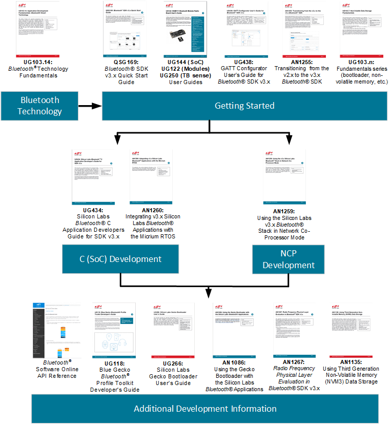

# UG434: Silicon Labs Bluetooth® C Application Developer's Guide for SDK v3.x (Rev. 0.3) <!-- omit in toc -->

- [1. 引言](#1-引言)
  - [1.1 关于该版本](#11-关于该版本)
  - [1.2 先决条件](#12-先决条件)
- [2. 应用开发流程](#2-应用开发流程)
  - [2.1 应用构建流程](#21-应用构建流程)
- [3. 项目结构](#3-项目结构)
  - [3.1 Bluetooth 文件](#31-bluetooth-文件)
    - [Library Files](#library-files)
    - [RAIL](#rail)
    - [EMLIB and EMDRV](#emlib-and-emdrv)
    - [mbed TLS](#mbed-tls)
    - [Sleep Timer](#sleep-timer)
    - [Power Manager](#power-manager)
    - [Header Files](#header-files)
  - [3.2 GATT 数据库](#32-gatt-数据库)
  - [3.3 设备固件升级](#33-设备固件升级)
  - [3.4 RTOS 支持](#34-rtos-支持)
  - [3.5 多协议支持](#35-多协议支持)
  - [3.6 平台组件](#36-平台组件)
- [4. 配置 Bluetooth 协议栈和 Wireless Gecko 设备](#4-配置-bluetooth-协议栈和-wireless-gecko-设备)
  - [4.1 Wireless Gecko MCU 和外设配置](#41-wireless-gecko-mcu-和外设配置)
    - [4.1.1 自适应跳频](#411-自适应跳频)
    - [4.1.2 Bluetooth 时钟](#412-bluetooth-时钟)
      - [HFCLK](#hfclk)
      - [LFCLK](#lfclk)
      - [HFRCODPLL](#hfrcodpll)
      - [CTUNE](#ctune)
      - [Default HFXO CTUNE Value](#default-hfxo-ctune-value)
    - [4.1.3 DC-DC 配置](#413-dc-dc-配置)
    - [4.1.4 LNA](#414-lna)
    - [4.1.5 定期广告](#415-定期广告)
      - [Periodic Advertiser](#periodic-advertiser)
      - [Periodic Advertising Synchronization](#periodic-advertising-synchronization)
    - [4.1.6 PTI](#416-pti)
    - [4.1.7 发射功率](#417-发射功率)
    - [4.1.8 白名单](#418-白名单)
    - [4.1.9 Wi-Fi 共存](#419-wi-fi-共存)
    - [4.1.10 OTA 配置](#4110-ota-配置)
    - [4.1.11 均衡连接分配算法](#4111-均衡连接分配算法)
  - [4.2 使用 sl_bt_init_stack() 配置 Bluetooth](#42-使用-sl_bt_init_stack-配置-bluetooth)
    - [4.2.1 CONFIG_FLAGS](#421-config_flags)
    - [4.2.2 Mbedtls](#422-mbedtls)
    - [4.2.3 多协议优先级配置](#423-多协议优先级配置)
    - [4.2.4 睡眠](#424-睡眠)
      - [Disabling Sleep at Runtime](#disabling-sleep-at-runtime)
    - [4.2.5 Bluetooth 协议栈配置](#425-bluetooth-协议栈配置)
      - [Buffer Memory](#buffer-memory)
      - [Number of Connections](#number-of-connections)
      - [Advertisers](#advertisers)
      - [Periodic Advertisement Synchronization](#periodic-advertisement-synchronization)
    - [4.2.6 PA](#426-pa)
    - [4.2.7 软件定时器](#427-软件定时器)
    - [4.2.8 射频路径](#428-射频路径)
      - [Gain](#gain)
      - [Output selection](#output-selection)
    - [4.2.9 NVM3 错误码](#429-nvm3-错误码)
- [5. Bluetooth 协议栈事件处理](#5-bluetooth-协议栈事件处理)
  - [5.1 阻塞事件监听器](#51-阻塞事件监听器)
  - [5.2 非阻塞事件监听器](#52-非阻塞事件监听器)
    - [5.2.1 睡眠与非阻塞事件监听器](#521-睡眠与非阻塞事件监听器)
    - [5.2.2 更新事件监听器的通知](#522-更新事件监听器的通知)
  - [5.3 使用 Micrium OS 的事件监听器](#53-使用-micrium-os-的事件监听器)
    - [5.3.1 来自多个任务的命令](#531-来自多个任务的命令)
- [6. 中断](#6-中断)
  - [6.1 外部事件](#61-外部事件)
  - [6.2 优先级](#62-优先级)
- [7. Wireless Gecko 资源](#7-wireless-gecko-资源)
  - [7.1 Flash](#71-flash)
    - [7.1.1 优化 Flash 使用量](#711-优化-flash-使用量)
      - [Dead code elimination](#dead-code-elimination)
      - [Selective Initialization of Bluetooth Stack Components](#selective-initialization-of-bluetooth-stack-components)
  - [7.2 链接](#72-链接)
  - [7.3 RAM](#73-ram)
    - [7.3.1 Bluetooth 协议栈](#731-bluetooth-协议栈)
    - [7.3.2 Bluetooth 对象池](#732-bluetooth-对象池)
    - [7.3.3 Bluetooth 缓冲区内存](#733-bluetooth-缓冲区内存)
    - [7.3.4 Bluetooth GATT 数据库](#734-bluetooth-gatt-数据库)
    - [7.3.5 调用栈](#735-调用栈)
    - [7.3.6 堆内存](#736-堆内存)
- [8. 应用程序 ELF 文件](#8-应用程序-elf-文件)
  - [IAR](#iar)
  - [GCC](#gcc)
- [9. 文档](#9-文档)

本文档是每个使用 Silicon Labs Bluetooth 协议栈为 Silicon Labs Wireless Gecko 产品开发 C-based 应用的开发者必不可少的参考。该指南涵盖了 Bluetooth 协议栈的架构、应用开发流程、MCU 核心与外设的使用和限制、协议栈配置选项以及协议栈资源使用情况。此版本文档适用于 Silicon Labs Bluetooth SDK 3.0.x 及以上版本。

# 1. 引言

本文档是 Silicon Labs Bluetooth 协议栈的 C 开发者指南。

该文档涵盖了各个方面的开发，并且是对使用 C 开发运行 Bluetooth 协议栈的 Wireless Gecko 产品的每个开发者的重要参考。

本文档涵盖以下主题：

* [2. 应用开发流程](#2-应用开发流程) 讨论了应用的开发流程。
* [3. 项目结构](#3-项目结构) 综述了项目结构。
* [4. 配置 Bluetooth 协议栈和 Wireless Gecko 设备](#4-配置-bluetooth-协议栈和-wireless-gecko-设备) 解释了项目在应用代码中的包含库和实际的 Wireless Gecko 配置。
* [5. Bluetooth 协议栈事件处理](#5-bluetooth-协议栈事件处理) 对于使用 Silicon Labs Bluetooth 协议栈进行开发的每个人来说都是重要的一环，因为它说明了应用如何在基于事件的架构中与协议栈同步运行。
* [6. 中断](#6-中断) 和 [7. Wireless Gecko 资源](#7-wireless-gecko-资源) 涉及外设和芯片组资源的主题，内容包括为协议栈使用保留的内容，应如何处理中断以及协议栈的内存占用量和应用的可用内存。

## 1.1 关于该版本

Silicon Labs Bluetooth SDK 的当前版本为 3.0.x。

当前支持的编译器和 IDE 版本是：

* **IDE** ：Simplicity Studio 5.0.0 或更高版本
* **Compiler** ：IAR v8.30.1 和 GCC 7.2.1

## 1.2 先决条件

本文档假定读者已正确安装当前版本的 Silicon Labs Bluetooth SDK 到开发机（Windows、MAC OSX 或 Linux），并且读者熟悉快速入门指南和 SDK 的示例。而且，读者应该对 Bluetooth 技术有基本的了解。有关更多信息，请参见 *UG103.14: Bluetooth Technology Fundamentals*。

有关在 Silicon Labs Simplicity Studio 开发环境中开始使用示例应用的说明，请参阅 *QSG169: Bluetooth® SDK v3.x Quick Start Guide*。

# 2. 应用开发流程

下图描述了 high-level 固件结构。开发者在协议栈（Silicon Labs 将其作为预编译的目标文件提供给应用）顶部创建一个应用，从而为最终设备提供 Bluetooth 连接。

<p>
  
</p>

Bluetooth 协议栈包含以下块：

* **Bootloader** —— Gecko Bootloader 不是协议栈的一部分，但其随 Bluetooth SDK 一起提供。有关更多信息，请参见 *UG266: Gecko Bootloader User Guide* 和 *AN1086: Using the Gecko Bootloader with Silicon Labs Bluetooth Applications*。有关常规引导加载的信息，请参见 *UG103.06: Bootloading Fundamentals*。
* **Bluetooth stack** —— Bluetooth 功能，包括 link layer、generic access profile、security manager、attribute protocol 和 generic attribute profile。
* **Bluetooth AppLoader** —— 在 bootloader 之后启动的应用。它检查用户应用是否有效，如果有效，则 AppLoader 启动该应用。如果应用映像无效，则 AppLoader 将启动 OTA 进程以尝试接收有效的应用映像。这需要使用 Gecko Bootloader。

## 2.1 应用构建流程

<p>
  
</p>

如 *QSG169: Bluetooth® SDK v3.x Quick Start Guide* 中所述，构建项目首先要定义 Bluetooth service 和 characteristic，并编写 Silicon Labs 提供的示例的应用源码或一个空的项目模板。

SDK v2.1.0 及更高版本提供了两种定义 Bluetooth service 和 characteristic 的方式。第一个选项是 Simplicity Studio 中的 Visual GATT Editor GUI。这是用于设计 GATT 并生成 `gatt_db.c` 和 `gatt_db.h` 的图形工具。此外，它可以导入 `.xml` 和 `.bgproj` GATT 定义文件。Visual GATT Editor 是 Simplicity Studio 项目中用于 GATT 定义和生成的默认工具。

第二种选择是根据 *UG118: Blue Gecko Bluetooth® Profile Toolkit Developer's Guide* 创建 `.xml` 或 `.bgproj`，然后将 BGBuild 可执行文件用作预编译步骤，以将 GATT 定义文件转换为 `.c` 和 `.h`。此方法在 IAR Embedded Workbench 项目中使用。

编译项目会生成一个目标文件，然后将其与 SDK 中提供的预编译库链接。链接的输出是一个 flash 映像，可以编程到所支持的 Wireless Gecko 设备。

# 3. 项目结构

本节说明应用程序项目结构以及项目中必须包含的必需和可选资源。

## 3.1 Bluetooth 文件

### Library Files

Bluetooth 协议栈库有：

* `binapploader.o`：Bluetooth AppLoader 的二进制映像，提供可选的 OTA（Over-the-Air）功能。
* `binapploader_nvm3.o`：用于具有 NVM3 支持的 Series 1 的 Bluetooth AppLoader 的二进制映像。
* `libbluetooth.a`：Bluetooth 协议栈库。
* `libpsstore.a`：Bluetooth 协议栈的 PS Store 功能。在 EFR32\[B|M\]G2x 设备上不可用。必须改用 NVM3。

### RAIL

Bluetooth 协议栈使用 RAIL 访问无线电，并且 RAIL 库需要与 Bluetooth 协议栈链接。RAIL 为每个设备系列以及单协议和多协议环境提供了单独的库。Gecko SDK Suite 中提供了 RAIL 库。有关更多信息，请参考 *UG103.13: RAIL Fundamentals* 及其他 RAIL 文档。

> 注意：为了确保无线电模块符合法规要求，需要将无线电模块的 Bluetooth 协议栈与 RAIL 库及无线电模块的配置库链接在一起。这些是 `librail_module_<soc family><compiler>_release.a` 和 `librail_config<modulename>.a`。

### EMLIB and EMDRV

Bluetooth 协议栈使用 EMLIB 和 EMDRV 库来访问 EFR32 硬件。EMLIB 和 EMDRV 外设库以源码形式提供，它们必须包含在项目中。EMLIB 和 EMDRV 是 Gecko SDK Suite 的一部分。有关 EMLIB 和 EMDRV 的更多信息，请参阅 [https://docs.silabs.com/](https://docs.silabs.com/) 上的 platform EMDRV documentation 和 EMLIB documentation。

### mbed TLS

Bluetooth 协议栈使用 Mbedtls 库进行加密操作。Mbedtls 库以源码形式提供，并且必须包含在项目中。Mbedtls 是 Gecko SDK Suite 的一部分。有关更多信息，请参阅 [Mbedtls documentation](https://docs.silabs.com/mbed-tls/latest/)。

### Sleep Timer

睡眠定时器（Sleep Timer）是一个平台组件，提供软件定时器、计时和日期功能。Bluetooth 协议栈将其用于深度睡眠，其必须包含在项目中。参阅 [platform sleeptimer documentation](https://docs.silabs.com/mcu/latest/efr32mg13/group-SLEEPTIMER)。

### Power Manager

电源管理器（Power Manager）是一个平台组件，用于管理系统的电源模式。其主要目的是在处理器无执行时将系统转到低能耗模式。请在 [https://docs.silabs.com/](https://docs.silabs.com/) 上的 Modules > Platform Services > Power Manager 下查看您的 MCU 的参考。

### Header Files

**sl_bt_version.h**

该文件包含 Bluetooth 协议栈版本。

**API Header Files**

这些文件定义了 Bluetooth 协议栈 API。

这些文件用于两个目的：首先，它们包含实际的 Bluetooth 协议栈 API，以及协议栈的命令和事件；其次，它们为 Bluetooth 协议栈提供配置和事件管理 API。

下面介绍配置、事件和睡眠管理 API。

```c
sl_status_t sl_bt_init_stack(const sl_bt_configuration_t *config)
```

该函数接受单个参数（一个指向 `sl_bt_configuration_t` 结构的指针）。其目的是使用结构中提供的参数配置和初始化 Bluetooth 协议栈。调用函数 `sl_bt_init_stack()` 后，必须分别初始化每个必需的协议栈组件。这种分别初始化允许通过不包含那些不需要的协议栈组件来优化内存。Simplicity Studio 5（SSv5）中的项目配置器将负责协议栈的初始化。在非 SSv5 应用中，应用必须调用 `sl_bt_init_stack()`，然后初始化 BGAPI 类。

可以使用以下 API 分别初始化协议栈组件：

* `sl_bt_class_dfu_init();`
* `sl_bt_class_system_init();`
* `sl_bt_class_gap_init();`
* `sl_bt_class_avertiser_init();`
* `sl_bt_class_scanner_init();`
* `sl_bt_class_sync_init();`
* `sl_bt_class_connection_init();`
* `sl_bt_class_gatt_init();`
* `sl_bt_class_gatt_server_init();`
* `sl_bt_class_ota_init();`
* `sl_bt_class_nvm_init();`
* `sl_bt_class_test_init();`
* `sl_bt_class_sm_init();`
* `sl_bt_class_coex_init();`
* `sl_bt_class_cte_transmitter_init();`
* `sl_bt_class_cte_receiver_init();`

```c
sl_status_t sl_bt_wait_event(sl_bt_msg_t* evt)
```

这是一个阻塞函数，它等待来自 Bluetooth 协议栈的事件并一直阻塞直到接收到事件为止。接收到事件后，将事件对象复制到应用提供的内存中。

如果 LF 时钟精度满足 500 ppm 要求，则 Bluetooth 协议栈会自动从电源管理器请求 EM2 功耗模式。否则，仅允许 EM1。当未从 Bluetooth 协议栈接收到任何事件时，设备将自动进入 EM1 或 EM2 模式。使用 `sl_bt_wait_event()` 是确保设备尽可能处于最低功耗睡眠模式的最简单方法。

Bluetooth 协议栈的事件处理将在 [5. Bluetooth 协议栈事件处理](#5-bluetooth-协议栈事件处理) 中详细讨论。

```c
sl_status_t sl_bt_pop_event(sl_bt_msg_t* evt)
```

这是一个非阻塞函数，用于从 Bluetooth 协议栈请求 Bluetooth 事件。当请求事件并且事件队列不为空时，事件对象将被复制到应用提供的内存中。如果事件队列中没有事件，则返回 `SL_STATUS_NOT_FOUND`。

使用此非阻塞事件监听器时，必须由应用代码管理 EM 睡眠模式，因为它们不会由 Bluetooth 协议栈自动管理。睡眠模式管理通过电源管理器来完成。

[5. Bluetooth 协议栈事件处理](#5-bluetooth-协议栈事件处理) 中详细讨论了协议栈的事件处理。

```c
int sl_bt_event_pending(void)
```

此函数检查事件队列中是否有任何未决的 Bluetooth 协议栈事件。如果找到了未决的 Bluetooth 事件，则该函数返回一个非零值，指示该事件应由 `sl_bt_pop_event()` 或 `sl_bt_wait_event()` 处理。如果未找到事件，则返回零。

**sl_bt_types.h**

**sl_bt_stack_init.h**

**sl_bt_api.h**

这些文件包含 Bluetooth 协议栈 API 和该协议栈的命令和事件，以及 Bluetooth 协议栈的配置 API。

**sl_bt_ncp_host_api.c, sl_bt_ncp_host.c, sl_bt_ncp_host.h and sl_bt_internal.h**

这些文件在为外部 host 开发应用时使用。它们提供了 host 应用和 BGTAPI 串行协议之间的 API 定义和适配层。

## 3.2 GATT 数据库

GATT（Generic Attribute Profile）数据库（database）是描述一个 Bluetooth 设备的 Bluetooth profile、service 和 characteristic 的标准化方法。使用 Silicon Labs Bluetooth stack，可以在 Simplicity Studio 的 Visual GATT Editor GUI 中直接编辑 GATT 定义，也可以用 XML 编写 GATT 定义，并将其作为预构建任务传递给 BGBuild 可执行文件。有关如何创建 GATT 数据库和语法的更多信息，请参阅 *UG118: Blue Gecko Bluetooth® Smart Profile Toolkit Developer's Guide*。

**gatt_db.c and gatt_db.h**

`gatt_db.c` 定义 GATT 数据库的结构和内容，并由 BGBuild 或 Visual GATT Editor 自动生成。`gatt_db.h` 包含此数据库以及本地 characteristic 和 service 的句柄（handle）。GATT 的类型定义从 `bg_gatt_db_def.h` 到 `gatt_db.h` 自动包含在内。

## 3.3 设备固件升级

DFU（Device Firmware Upgrade，设备固件升级）是通过串行链路或 OTA 升级应用的过程。在这两种情况下，~~cases th3~~ 应用都需要添加以下文件来启用对 DFU 的支持。

**application_properties.c**

该文件包含应用特性结构，该结构包含有关应用映像的信息，例如类型、版本和安全性。该结构在 Gecko Bootloader API 的 `application_properties.h` 中定义。Simplicity Studio 项目中包含一个预生成的文件，可以对其进行修改以包含 application-specific 特性。可以使用 Gecko Bootloader API 访问应用特性。可以通过更改定义来更新以下成员：

```c
// Version number for this application (uint32_t)
#define APP_PROPERTIES_VERSION

// Unique ID (e.g. UUID or GUID) for the product this application is built for (uint8_t[16])
#define APP_PROPERTIES_ID
```

将 OTA 进程与 Bluetooth AppLoader 一起使用时，需要将指向应用特性结构的指针设置为应用程序向量表 vector 13。当使用默认启动文件且结构名称为 `sl_app_properties` 时，将自动启用该指针。

## 3.4 RTOS 支持

Bluetooth 协议栈也可以在 Micrium RTOS 上运行。在这种情况下，以下文件将添加到项目中：`sl_bt_rtos_adaptation.c` 和 `sl_bt_rtos_adaptation.h`。

**sl_bt_rtos_adaptation.c and sl_bt_rtos_adaptation.h**

`sl_bt_rtos_adaptation.c` 和 `sl_bt_rtos_adaptation.h` 提供了 Micrium OS 任务，用于与 Bluetooth 协议栈和其他 Micrium OS 任务的 IPC（Inter-Process Communication，进程间通信）。

需要在 `sl_bt_configuration_t` 结构中为 Bluetooth 协议栈配置对 RTOS 的支持。`config_flags` 字段需要设置 `SL_BT_CONFIG_FLAG_RTOS`。这导致 Bluetooth 协议栈依赖 Micrium OS 进行睡眠，而不是直接睡眠。`scheduler_callback` 和 `stack_schedule_callback` 必须配置为调用适当的函数。这些回调用于唤醒相应的任务。

与 Micrium OS 一起使用的 Bluetooth 协议栈配置如下：

```c
.config_flags = SL_BT_CONFIG_FLAG_RTOS,
.scheduler_callback = sli_bt_rtos_ll_callback,
.stack_schedule_callback = sli_bt_rtos_stack_callback,
```

可以调用 `sl_bt_rtos_init()` 来初始化协议栈并创建所需的 RTOS 任务。

```c
void sl_bt_rtos_init();
```

它调用函数 `sl_bt_init()` 初始化 Bluetooth 协议栈。

## 3.5 多协议支持

在多协议环境中使用 Bluetooth 协议栈时，必须使用以下函数启用 Bluetooth 协议栈中的多协议特性：

```c
sl_bt__init_multiprotocol();
```

在多协议环境中使用 Bluetooth 还需要使用具有多协议支持的 RAIL 库。

## 3.6 平台组件

Bluetooth v3.x 协议栈依赖于许多平台组件，这些组件是 Gecko SDK Suite 的底层 Gecko Platform 基础设施的一部分。`autogen` 文件夹包含用于初始化硬件和处理事件的源码。`config` 文件夹包含硬件和协议栈配置选项。


# 4. 配置 Bluetooth 协议栈和 Wireless Gecko 设备

要在 Wireless Gecko 上运行 Bluetooth 协议栈和应用，必须正确配置 MCU 及其外设。

## 4.1 Wireless Gecko MCU 和外设配置

**sl_system_init()**

`sl_system_init()` 函数用于初始化系统。它将调用平台、驱动、服务、协议栈和内部应用初始化函数，这些函数位于 `autogen` 文件夹中。

**App_init()**

`App_init()` 函数用于初始化 application-specific 功能。

### 4.1.1 自适应跳频

Bluetooth 协议栈实现了 AFH（Adaptive Frequency Hopping，自适应跳频），符合 ETSI EN 300 328 标准。使用 +10 dBm 以上的发射功率时，需要 AFH。AFH 还可以通过避免通道拥塞来提高性能。

要在 Bluetooth 协议栈中启用 AFH，必须调用以下初始化函数：

```c
void sl_bt_init_afh();
```

包含 `bluetooth_feature_afh` 组件时，它会自动包含在内。在主从（master-slave）连接中，两端可以独立使用 AFH。该标准允许在拥塞的通道上使用控制传输。出于合规性原因，如果从机检测到正在使用拥塞的通道，它将仅在该通道上发送单个数据包以防止连接超时。

> 注意：旧版（Legacy）广告不使用 AFH。旧版广告使用 3 个通道，而 AFH 至少需要 15 个通道才能满足 ETSI 标准的要求。必须使用扩展广告来启用 AFH 广告。

### 4.1.2 Bluetooth 时钟

时钟设置在 `sl_event_handler.c` 的 `sl_platform_init()` 函数中初始化。时钟设置包括使用诸如 tuning 之类的参数初始化振荡器（HFXO、LFXO 和 LFRCO）、初始化时钟（HFCLK、LFCLK、LFA、LFB、LFE）以及将时钟分配给振荡器。注意：此函数未启用外设时钟（如 GPIO 时钟、TIMER 时钟）。初始化外设时必须启用它们。

#### HFCLK

HFCLK 用于无线电协议定时器（PROTIMER）。HFCLK 是一个高频时钟，精度必须至少为 ±50 ppm。该时钟需要一个外部晶振才能足够准确（HFXO）。

HFXO 初始化将外部晶振配置以用于时序关键型连接和睡眠管理。必须将一个 HFXO 设置为高频时钟（HFCLK），并物理连接到 Wireless Gecko 的 HFXO 输入引脚。

#### LFCLK

低频时钟 LFCLK 有两个用途。在 Bluetooth 协议栈中，它用于 Bluetooth 协议计时。它还需要跟踪睡眠模式下的时间。

当设备进入睡眠模式时，将保存 PROTIMER 的当前状态。设备唤醒后，它将计算经过多少个睡眠时钟滴答，并相应地调整 PROTIMER。这使得在无线电中，PROTIMER 似乎一直在滴答。

此时钟的准确性取决于设备的工作模式。在广告或扫描时，精度不是那么重要，但是当连接打开时，精度必须至少为 ±500 ppm。此时钟可以由 LFXO、PLFRCO（EFR32\[B|M\]G13 或 \[B|M\]GM13）或 LFRCO（EFR32\[B|M\]G2x 或 \[B|M\]GM2x）驱动，却决于精度要求。如果应用仅需要广告或扫描，则可以将 LFRCO 用作时钟源。但是，如果需要 Bluetooth 连接，则时钟源必须是 LFXO、PLFRCO（EFR32\[B|M\]G13 或 \[B|M\]GM13）或具有高精度模式（High Precision Mode）的 LFRCO（EFR32\[B|M\]G22 或 \[B|M\]GM22）。使用 PLFRCO 或 LFRCO 时，时钟的精度必须配置为 ±500 ppm。

在默认配置中，LFXO 连接到 Wireless Gecko，并设置为 LFCLK 的时钟源。如果设计仅具有高精度模式的 PLFRCO 或 LFRCO，则连接 PLFRCO 或 LFRCO 并将其设置为时钟源。

如果设计中未连接具有高精度模式的 LFXO、PLFRCO 或 LFRCO，则如果 LF 时钟精度不满足 500 ppm 要求，就会自动禁用睡眠。

#### HFRCODPLL

HFRCODPLL 是一个高频时钟，在 Series 2 设备中其作为系统时钟与 Bluetooth 协议栈一起使用。在 EFR32\[B|M\]G21x HFRCODPLL 需要配置为 80 MHz 并设置为系统时钟源。

```c
CMU_HFRCODPLLBandSet(cmuHFRCODPLLFreq_80M0Hz);
CMU_ClockSelectSet(cmuClock_SYSCLK, cmuSelect_HFRCODPLL);
```

#### CTUNE

示例项目均默认设置了 HFXO 和 LFXO 的 CTUNE（crystal tune），以与所有 Silicon Labs 的 Bluetooth 模块、参考设计和无线板一起使用。但是，在某些情况下，最终产品设计需要针对每个设备或每个设计进行特定的晶振校准。可以根据 `sl_device_init_hfxo()` 函数中的设计调整 CTUNE 值。

有关配置 HFXO 和 LFXO 的更多信息，请参阅 EFR32 Reference Manual。

#### Default HFXO CTUNE Value

系统使用以下逻辑顺序检查多个源的默认 HFXO CTUNE 值：

1. CTUNE PSKEY 已设置。该键（key）的 ID 为 `50`（`32` in hex），并包含 2 byte 的数据，用于 16 bit CTUNE 值。这可以使用 BGAPI 命令 `sl_bt_nvm_save` 进行编程。
2. 校准值存在于 DEVINFO 中。某些模块在 DEVINFO 页中包含工厂编程（factory-programmed）的值。
3. Manufacturing Token 存在于用户数据页中。这由开发者编程，或者如果板 EEPROM 包含该值，则可以由 Simplicity Studio 自动设置。该 Token 由 2 byte 组成，位于用户数据页的起始地址偏置 0x0100 处。有关特定的 EFR 变体，请参阅 EFR32 Reference Manual，以获取完整的 flash 映射。
4. 如果在生成项目时选择了无线板，则使用板头文件中的默认值。
5. 如果未找到其他任何内容，则使用 CMU 头文件中的默认值。

> 注意：Bluetooth 协议栈仅支持 38.4 MHz HFXO 频率。不支持其他 HFXO 频率。

### 4.1.3 DC-DC 配置

在具有 DC-DC 的设备上，可以在 `sl_event_handler.c` 中的 `sl_device_init_dcdc()` 函数中进行配置。SDK 中的示例将 DC-DC 配置设置为可与 Silicon Labs 的 Bluetooth 模块、无线板和参考设计一起使用，但是自定义设计可能需要特定的 DC-DC 设置。这些自定义设置可以在 `sl_device_init_dcdc_xx.c` 中进行设置。

```c
/** DCDC regulator initialization structure. */
typedef struct {
    EMU_DcdcMode_TypeDef            mode;               /**< DCDC mode. */
    EMU_VreginCmpThreshold_TypeDef  cmpThreshold;       /**< VREGIN comparator threshold. */
    EMU_DcdcTonMaxTimeout_TypeDef   tonMax;             /**< Ton max timeout control. */
    bool                            dcmOnlyEn;          /**< DCM only mode enable. */
    EMU_DcdcDriveSpeed_TypeDef      driveSpeedEM01;     /**< DCDC drive speed in EM0/1. */
    EMU_DcdcDriveSpeed_TypeDef      driveSpeedEM23;     /**< DCDC drive speed in EM2/3. */
    EMU_DcdcPeakCurrent_TypeDef     peakCurrentEM01;    /**< EM0/1 peak current setting. */
    EMU_DcdcPeakCurrent_TypeDef     peakCurrentEM23;    /**< EM2/3 peak current setting. */
} EMU_DCDCInit_TypeDef;
```

有关配置 DC-DC 的更多信息，请参阅 EFR32 Reference Manual 的第 11 章和 *AN0948: Power Configurations and DC-DC*。

### 4.1.4 LNA

LNA（low-noise amplifier，低噪声放大器）是一种电子放大器，可放大非常低功率的信号而不会显着降低其信噪比。LNA 改善了射频灵敏度。

某些 MGM12P 模块中的板载 LNA 作为 FEM（front-end module，前端模块）的一部分。要在这些模块中使用 LNA，需要正确配置和启用 FEM。FEM 在 `sl_fem_util_config.h` 中进行配置。

如果板支持 FEM，则在 `sl_service_init()` 函数中的 `sl_fem_util_init()` 中初始化 FEM。

### 4.1.5 定期广告

定期广告（Periodic Advertising）使多个 listener 可以与单个广告设备同步。因此，它是组播的一种形式。

每个 listener 在开始接收数据之前都需要与广告设备同步。定期广告利用 listening device 上的 scanner 建立与广告设备的同步。同步后，可以停止 scanner。这比使用 scanner 全时间收听广播广告要省电得多。

定期广告由两个部分组成：periodic advertiser role 和 periodic advertising synchronization on listening side。这两个部分彼此独立，需要分别进行初始化。

#### Periodic Advertiser

Bluetooth 配置中的 `max_advertisers` 也配置了 periodic advertiser 的最大数量。

要在 Bluetooth 协议栈中启用 Periodic Advertiser，必须在 `sl_bt_init_stack()` 函数之后调用以下初始化函数，该函数在包含 `bluetooth_feature_periodic_adv` 组件时自动添加：

```c
void sl_bt_init_periodic_advertising();
```

#### Periodic Advertising Synchronization

Bluetooth 配置中的 `max_periodic_sync` 用于配置 Bluetooth 协议栈需要支持的最大同步次数。

要在 Bluetooth 协议栈中启用定期广告同步，必须在 `sl_bt_init_stack()` 函数之后通过包含 `bluetooth_feature_sync` 组件来调用以下初始化函数：

```c
void sl_bt_class_sync_init();
```

此命令还将初始化 BGAPI 同步类，使其可供使用。

### 4.1.6 PTI

PTI（Packet Trace Interface，数据包跟踪接口）是 Wireless Gecko SoC 中的内置模块，用于将传入和传出的无线数据包作为原始数据路由到调试接口。然后可以捕获这些数据包并将其显示在 Simplicity Studio’s Network Analyzer 中。Network Analyzer 具有 Bluetooth 数据包的解码器，可用于调试、分析和测量 Bluetooth 网络。

`sl_stack_init()` 函数内的 `sl_rail_util_pti_init()` 用于初始化 PTI。可以使用 `SL_RAIL_UTIL_PTI_BAUD_RATE_HZ` 定义来设置波特率，并且可以使用 `sl_rail_util_pti_config.h` 中带有 `SL_RAIL_UTIL_PTI_DOUT_` 和 `SL_RAIL_UTIL_PTI_DFRAME_` 前缀的定义来配置引脚。

### 4.1.7 发射功率

Bluetooth 的发射功率取决于无线电允许的最大功率、软件配置、射频路径增益补偿以及 AFH 的使用。

ETSI EN 300 328 标准要求在发射功率为 +10 dBm 以上时使用 AFH。

如果 AFH 被限制，则最大允许功率限制为小于 +10 dBm。ETSI 标准要求至少有 15 个通道用于 AFH。在以下情况下阻止使用 +10 dBm 及以上功率：旧版（legacy）广告、扫描响应以及在没有足够可用通道时的连接。

### 4.1.8 白名单

白名单（Whitelisting）用于过滤设备。当前仅在发现设备时才支持。连接请求、广告期间来自远程设备的扫描请求以及连接启动不受白名单的限制。

白名单大小与绑定设备最大数量的配置匹配。如果在使用白名单时更改了绑定设备的最大数量，则需要在新设置生效之前重置设备。

绑定的设备会自动添加到白名单中。或者，可以使用 BGAPI 命令 `sl_bt_sm_add_to_whitelist()` 手动添加它们。

不支持随机地址解析。使用可解析随机地址的设备在扫描过程中将不可见。由于大多数 Android 和 iOS 手机使用可解析随机地址，因此白名单功能将在设备发现期间有效地阻止这些设备。

要在 Bluetooth 协议栈中启用白名单，必须在 `sl_bt_init_stack()` 函数之后调用以下初始化函数：

```c
void sl_bt_init_whitelisting();
```

包含 `bluetooth_feature_whitelisting` 组件时，它将自动包含在内。启用该功能后，可以在运行时通过 BGAPI 命令 `sl_bt_gap_enable_whitelisting()` 启用和禁用该功能。

可以使用 `sl_bt_sm_configure()` 将连接限制为仅绑定或列入白名单的设备。这不需要启用白名单。

### 4.1.9 Wi-Fi 共存

Wi-Fi 共存（COEX）是一个可以被 Bluetooth 和 Wi-Fi 仲裁的，可以使用无线传输的协议。启用后，它可以改善 Wi-Fi 和 Bluetooth 的性能。COEX 在 `sl_bluetooth_coex_config.h` 中配置。

要启用 COEX，请在 `sl_bt_init_stack()` 之后调用以下函数。

```c
sl_bit_init_coex_hal();
```

包含 `bluetooth_feature_coex` 组件时，它将自动包含在内。COEX 实现了 Wi-Fi IC 的 GPIO 接口。它依赖 EMLIB `em_gpio.c` 和 EMDRV `gpiointerrupt.c`，并且要求这两个文件都包含在项目中。

### 4.1.10 OTA 配置

由于部分固件升级由 Bluetooth AppLoader 应用处理，因此支持 Bluetooth OTA 固件升级。使用 `bluetooth_feature_ota_config` 组件启用 OTA 配置。

可以使用 `sl_bt_ota_set_configuration()` 函数来配置 OTA 模式，如可以将 OTA 设置为使用静态随机地址而不是公共地址。有关其他选项，请参考 BGAPI 文档。

当 Wireless Gecko 处于 AppLoader 的 OTA 模式时，可以使用 `sl_bt_ota_set_device_name()` 函数配置其设备名称和设备名称长度。可以通过 `sl_bt_ota_set_advertising_data()` 将 OTA 模式下使用的广告数据设置为使用自定义数据，而不使用默认数据。

如果设备未使用默认的射频路径，则可以使用 `sl_bt_ota_set_rf_path()` 在 OTA 模式下进行配置。

最后，应确保将设备设置为 OTA DFU 模式，以便只有受信任的设备才具有该能力。

有关 OTA 固件更新的更多信息，请参考 *UG266: Silicon Labs Gecko Booloader User's Guide* 和 *AN1086: Using the Gecko Bootloader with Silicon Labs Bluetooth Applications*。

### 4.1.11 均衡连接分配算法

均衡连接分配算法（Even Connection Distribution Algorithm）设计用于涉及多个并发连接的应用。该算法尝试以这样的方式分配连接，即它们在时间上尽可能均匀地分布而不会重叠，并且所有连接应获得空中接口资源的相等份额。

为了获得最佳性能，算法用户应：

* 如果所有连接的间隔都不相同，则以最长的连接间隔启动第一个连接。
* 设置其他连接的连接间隔，使它们成为或允许（通过最小 ~ 最大范围）第一个间隔的整数分数。
* 使第一个间隔足够长，以使所有连接都可以在合理的传输时间内适应该间隔。

如果不遵循上述建议，可以期望算法和连接正常工作，但是性能可能不是最佳的。

默认情况下，链路层使用传统的随机连接分布算法。可以通过在软件初始化阶段添加组件 `bluetooth_feature_ll_even_scheduling` 或调用链接层函数 `ll_connSchAlgorithmEvenEnable()` 来启用均衡连接分配算法。由于均衡连接调度机制旨在与多个（最多 32 个）并发连接一起使用，因此建议按以下方式增加缓冲区和堆的大小。

```c
SL_BT_CONFIG_BUFFER_SIZE 20160
SL_HEAP_SIZE 22520
```

## 4.2 使用 sl_bt_init_stack() 配置 Bluetooth

`sl_bt_init_stack()` 函数用于配置 Bluetooth 协议栈，包括分配给连接的内存缓冲区大小。在配置 Bluetooth 协议栈之前，不能使用任何 Bluetooth 协议栈的功能。

Bluetooth 协议栈配置示例：

```c
#define SL_BT_CONFIG_DEFAULT                                                       \
    {                                                                              \
        .config_flags = SL_BT_CONFIG_FLAGS,                                        \
        .bluetooth.max_connections = SL_BT_CONFIG_MAX_CONNECTIONS,                 \
        .bluetooth.max_advertisers = SL_BT_CONFIG_MAX_ADVERTISERS,                 \
        .bluetooth.max_periodic_sync = SL_BT_CONFIG_MAX_PERIODIC_ADVERTISING_SYNC, \
        .bluetooth.max_buffer_memory = SL_BT_CONFIG_BUFFER_SIZE,                   \
        .scheduler_callback = SL_BT_CONFIG_LL_CALLBACK,                            \
        .stack_schedule_callback = SL_BT_CONFIG_STACK_CALLBACK,                    \
        .gattdb = &bg_gattdb_data,                                                 \
        .max_timers = SL_BT_CONFIG_MAX_SOFTWARE_TIMERS,                            \
        .rf.tx_gain = SL_BT_CONFIG_RF_PATH_GAIN_TX,                                \
        .rf.rx_gain = SL_BT_CONFIG_RF_PATH_GAIN_RX,                                \
    }
```

`sl_bt_init_stack()` 函数中的配置选项包括：Bluetooth 连接计数、advertiser 计数、定期广告同步计数、内存缓冲区大小、定时器数量、GATT 数据库和 PA 配置。

调用函数 `sl_bt_init_stack()` 后，必须分别初始化每个使用的协议栈组件。这种分别初始化允许通过不包含不必要的协议栈组件来优化内存。

以下 API 可用于分别初始化协议栈组件。通过包含相应的组件，可以自动添加对初始化函数的调用。

<table>
  <tr>
    <td style="white-space: nowrap"><code>sl_bt_class_advertiser_init()</code></td>
    <td>The commands and events in this class are related to advertising functionalities in GAP peripheral and broadcaster roles.</td>
  </tr>
  <tr>
    <td style="white-space: nowrap"><code>sl_bt_class_coex_init()</code></td>
    <td>Coexistence interface is enabled and initialized with sl_bt_init_coex_hal function.</td>
  </tr>
  <tr>
    <td style="white-space: nowrap"><code>sl_bt_class_connection_init()</code></td>
    <td>The commands and events in this class are related to managing connection establishment, parameter setting, and disconnection procedures.</td>
  </tr>
  <tr>
    <td style="white-space: nowrap"><code>sl_bt_class_cte_receiver_init()</code></td>
    <td>Commands and events in this class manage Constant Tone Extension (CTE) receiving.</td>
  </tr>
  <tr>
    <td style="white-space: nowrap"><code>sl_bt_class_cte_transmitter_init()</code></td>
    <td>Commands and events in this class manage Constant Tone Extension (CTE) transmission.</td>
  </tr>
  <tr>
    <td style="white-space: nowrap"><code>sl_bt_class_dfu_init()</code></td>
    <td>These commands and events are related to controlling firmware updates over the configured host interface and are available only when the device is booted in DFU mode. Usually not needed in application.</td>
  </tr>
  <tr>
    <td style="white-space: nowrap"><code>sl_bt_class_gap_init()</code></td>
    <td>The commands and events in this class are related to the Generic Access Profile (GAP) in Bluetooth.</td>
  </tr>
  <tr>
    <td style="white-space: nowrap"><code>sl_bt_class_gatt_init()</code></td>
    <td>The commands and events in this class are used to browse and manage attributes in a remote GATT server.</td>
  </tr>
  <tr>
    <td style="white-space: nowrap"><code>sl_bt_class_gatt_server_init()</code></td>
    <td>These commands and events are used by the local GATT server to manage the local GATT database.</td>
  </tr>
  <tr>
    <td style="white-space: nowrap"><code>sl_bt_class_nvm_init()</code></td>
    <td>Manage user data in NVM keys in the flash memory of the Bluetooth device.</td>
  </tr>
  <tr>
    <td style="white-space: nowrap"><code>sl_bt_class_ota_init()</code></td>
    <td>Commands for configuring OTA DFU.</td>
  </tr>
  <tr>
    <td style="white-space: nowrap"><code>sl_bt_class_scanner_init()</code></td>
    <td>The commands and events in this class are related to scanning functionalities in GAP central and observer roles.</td>
  </tr>
  <tr>
    <td style="white-space: nowrap"><code>sl_bt_class_sm_init()</code></td>
    <td>The commands in this class manage Bluetooth security, including commands for starting and stopping encryption and commands for management of all bonding operations.</td>
  </tr>
  <tr>
    <td style="white-space: nowrap"><code>sl_bt_class_sync_init()</code></td>
    <td>Provides the periodic advertising synchronization feature.</td>
  </tr>
  <tr>
    <td style="white-space: nowrap"><code>sl_bt_class_system_init()</code></td>
    <td>Commands and events in this class can be used to access and query the local device.</td>
  </tr>
  <tr>
    <td style="white-space: nowrap"><code>sl_bt_class_test_init()</code></td>
    <td>Enables the DTM test APIs.</td>
  </tr>
</table>

### 4.2.1 CONFIG_FLAGS

当前仅支持一个配置标志 `SL_BT_CONFIG_FLAG_RTOS`，如果应用使用 RTOS，则需要设置该标志。

### 4.2.2 Mbedtls

协议栈使用的 Mbedtls 加密库是使用配置文件配置的，该配置文件定义了支持哪些算法以及实现是使用硬件加速还是在软件上完成。使用 `#define MBEDTLS_CONFIG_FILE` 给出 Mbedtls 配置文件路径。如果需要更改配置，则应使用默认配置文件 `mbedtls_config.h` 作为模板。此外，项目必须包含 `sl_bt_mbedtls_context.c`，该文件在 SDK 中作为源码提供。协议栈使用它来获取 Mbedtls 上下文大小，该大小取决于所使用的 Mbedtls 配置。

### 4.2.3 多协议优先级配置

在多协议环境中将 Bluetooth 协议栈与其他协议一起使用时，可能有必要更改 RAIL 的 Bluetooth 优先级设置以优化某些用例。

应用需要分配配置结构并将其提供给 Bluetooth 协议栈：

```c
sl_bt_bluetooth_ll_priorities custom_priorities;
static const sl_bt_configuration_t config = {
    //
    .bluetooth.linklayer_priorities = &custom_priorities,
    //
};
```

必须通过 `SL_BT_BLUETOOTH_PRIORITIES_DEFAULT` 常量将 `sl_bt_bluetooth_ll_priorities` 结构初始化为默认状态。

`sl_bt_bluetooth_ll_priorities` 结构包含以下字段：

* `scan_min`、`scan_max`、`scan step` —— 扫描操作的优先级范围。
* `adv_min`、`adv_max`、`adv step` —— 广告操作的优先级范围。
* `conn_min` 和 `conn_max` —— 连接数据包的优先级范围。
* `init_min` 和 `init_max` —— 连接启动的优先级范围。
* `rail_mapping_offset` —— Bluetooth 优先级所在的 RAIL 优先级级别。
* `rail_mapping_range` —— Bluetooth 优先级所在的 RAIL 优先级范围。

对于每个优先级范围，0 为最大优先级，0xff 为最小优先级。Bluetooth 优先级与 RAIL 优先级不同。也就是说，Bluetooth 在所有 Bluetooth 优先级所在的位置都有自己的介于 0 和 0xff 之间的空间。要将 Bluetooth 优先级映射到 RAIL 优先级，使用 `rail_mapping_offset` 和 `rail_mapping_range` 字段中的值形成一阶方程：

```c
RAIL_priority = (BT_priority / 0xFF) * rail_mapping_range + rail_mapping_offset
```

### 4.2.4 睡眠

`sl_power_manager_init()` 函数会自动启用 Wireless Gecko 的睡眠模式 EM2（energy mode two）。如 [5. Bluetooth 协议栈事件处理](#5-bluetooth-协议栈事件处理) 所述，在发生阻塞事件时，协议栈会自动处理睡眠模式。

睡眠模式要求硬件中存在准确的 32 kHz LFCLK（low-frequency clock，低频时钟）。如果 Bluetooth 协议栈没有准确的睡眠时钟，并且应用必须支持 Bluetooth 连接，则无法进入低功耗睡眠模式。对于不需要低功耗睡眠模式的应用，可以省去 LFXO 或 LFRCO。

#### Disabling Sleep at Runtime

如果应用需要在运行时禁用睡眠，则可以通过实现 `app_is_ok_to_sleep()` 函数来完成。设备要进入睡眠状态时将会调用该函数。当 EM2 被禁用（/阻塞）时，协议栈将在 EM0 和 EM1 之间切换。有关更多信息，请参阅知识库文章 [Using Energy Modes with Bluetooth Stack](https://www.silabs.com/community/wireless/bluetooth/knowledge-base.entry.html/2017/02/22/using_energy_modesw-B4eB)。

### 4.2.5 Bluetooth 协议栈配置

#### Buffer Memory

Bluetooth 协议栈使用内存来缓冲 API 事件以及在 Bluetooth 连接、广告和扫描中传输的数据。该缓冲区是在调用 `sl_bt_init_stack()` 时，由 Bluetooth 协议栈从堆中分配的。缓冲区的大小（以字节为单位）由 `sl_bluetooth_config.h` 中的 `SL_BT_CONFIG_BUFFER_SIZE` 定义。默认值是实现足够吞吐量和支持多个同时连接的估计值。如果应用需要提高连接中的数据吞吐量，或者使用广告或对长广告数据进行扫描，则可以考虑增加此值。

设置缓冲区大小的示例：

```c
static const sl_bt_configuration_t config = {
    //
    .bluetooth.max_buffer_memory = SL_BT_CONFIG_BUFFER_SIZE,
    //
};
```

#### Number of Connections

同时进行的 Bluetooth 连接的绝对最大数量为 8。为连接管理分配的内存量进一步限制了连接数量。初始化期间在 `sl_bt_init_stack()` 中从堆分配内存。可以定义 `SL_BT_CONFIG_MAX_CONNECTIONS` 来设置连接数。`SL_BT_CONFIG_MAX_CONNECTIONS` 在配置结构的 `.bluetooth.max_connections` 字段中传递给 Bluetooth 协议栈。

将 Bluetooth 连接限制为 1 的示例：

```c
#define SL_BT_CONFIG_MAX_CONNECTIONS 1
```

有关连接 RAM 使用量的更多信息，请参阅 [7.3.2 Bluetooth 对象池](#732-bluetooth-对象池)。

#### Advertisers

可以通过此配置选项定义广告集的最大数量。这些集合可用于启动多个 advertiser。此配置选项还配置了定期广告的最大数量。每个广告上下文分配约 60 byte 的 RAM。Advertiser 数量由 `SL_BT_CONFIG_USER_ADVERTISERS` 定义。

```c
.bluetooth.max_advertisers = SL_BT_CONFIG_USER_ADVERTISERS; //!< Maximum number of advertisers to support, if 0 defaults to 1
```

> 注意：最大可连接广告受到 `MAX_CONNECTIONS` 的限制。

#### Periodic Advertisement Synchronization

需要配置支持的最大数量的定期广告同步。每个同步上下文分配约 40 byte 的 RAM。

```c
.bluetooth.max_periodic_sync = 5; //!< Maximum number of periodic advertisement synchronizations to support. Default is 0.
```

### 4.2.6 PA

在基于 EFR32 SoC 的设计中，可以从 DC/DC 的输出或直接从 3.3 V 电源提供 PAVDD（Power Amplifier voltage regulator VDD input）。

Bluetooth 协议栈配置默认使用 DC/DC 作为 PAVDD 输入。如果使用 3.3 V 电源为 PAVDD 供电，则需要定义 `.pa.input` 字段。

Bluetooth 协议栈会自动选择高功率（high-power）PA（如果有）。`pa_mode` 配置可用于选择 Bluetooth 协议栈使用的 PA 模式。EFR32\[B|M\]G21 具有 3 个PA，因此 Bluetooth 配置结构中的 `pa_mode` 设置可以采用 3 个值。其他设备则有 2 个 PA。

```c
.pa.config_enable = 1,                  // PA Configuration is enabled
.pa.input = SL_BT_RADIO_PA_INPUT_VBAT,  // PAVDD is supplied from an 3.3 V power supply
.pa.pa_mode = 0                         // selects high power PA if available
```

### 4.2.7 软件定时器

可以配置最大可用软件定时器。每个定时器都需要协议栈的资源才能实现。在某些情况下，增加的软件定时器数量可能会导致性能下降。

```c
.max_timers = 4;
```

### 4.2.8 射频路径

#### Gain

应用可以分别定义 RX 和 TX 的射频路径（RF Path）增益值。

调整发射功率时，Bluetooth 协议栈会考虑 TX 射频路径增益。然后，从天线辐射的功率会匹配应用的请求。例如，如果应用要求的最大功率为 +10 dBm，路径损耗为 -1 dBm，则引脚上的实际功率为 +11 dBm。

RX 射频路径增益用于补偿来自 Bluetooth 协议栈的 RSSI 报告。

```c
.rf.tx_gain = -20; // RF TX path gain in unit of 0.1 dBm
.rf.rx_gain = -18; // RF RX path gain in unit of 0.1 dBm
```

#### Output selection

在基于 EFR32\[B|M\]G21 SoC 的设计中，可以选择射频输出。

```c
.rf.flags = SL_BT_RF_CONFIG_ANTENNA; // enabling output configuration
.rf.antenna = 0;                     // desired output,
```

有关正确的值，请参考 RAIL 头文件 `rail_chip_specific.h` 中的天线路径选择。

### 4.2.9 NVM3 错误码

Bluetooth 协议栈将 NVM3 错误码（Error Codes）映射到相应的 `sl_status` 中（如果存在）。其他 NVM3 错误码使用基本值 0x480 + NVM3 错误值进行映射。可从 `platform/emdrv/nvm3/inc/nvm3.h` 中找到 NVM3 错误值。例如，`ECODE_NVM3_ERR_ALIGNMENT_INVALID` 将被映射为 0x481。

# 5. Bluetooth 协议栈事件处理

Wireless Geckos 的 Bluetooth 协议栈是事件驱动的架构，其中事件在主 while 循环中处理。

## 5.1 阻塞事件监听器

`sl_bt_wait_event()` 是阻塞等待函数的实现，该函数等待事件队列中出现事件并将它们返回给事件处理程序。这是 Bluetooth 协议栈建议的操作模式，因为它可以最有效且自动地管理睡眠，同时使设备和连接保持同步。

* `sl_bt_wait_event()` 函数处理内部消息队列，直到接收到事件为止。
* 如果没有任何待处理的事件或消息要处理，则设备将进入 EM1 或 EM2 睡眠模式。
* 该函数将接收到的事件数据复制到 `sl_bt_msg_t` 结构中。

下面的代码片段展示了使用 `sl_bt_wait_event()` 的简单主 while 循环，该循环在启动后设置广告。

```c
/* Main loop */
while (1) {
    sl_bt_msg_t evt;

    /* Wait (blocking) for a Bluetooth stack event. */
    SL_STATUS status = sl_bt_wait_event(&evt);

    /* Run application and event handler. */
    switch (SL_BT_MSG_ID(evt.header)) {
    /* This boot event is generated when the system is turned on or reset. */
    case sl_bt_evt_system_boot_id:
        /* Initialize iBeacon ADV data */
        bcnSetupAdvBeaconing();
        break;
    /* Ignore other events */
    default:
        break;
    }
}
```

## 5.2 非阻塞事件监听器

这种操作模式需要更多的手动调整（如睡眠管理需要由应用完成）。在某些用例中，需要非阻塞操作。这是在示例应用中完成事件处理的默认方式。

* `sl_bt_pop_event()` 函数处理内部消息队列，直到接收到一个事件或处理完所有消息。
* 该函数将接收到的事件数据复制到 `sl_bt_msg_t` 结构，或者如果队列中没有事件，则返回 `SL_STATUS_NOT_FOUND`。

应用可以覆盖 `sl_bt_on_event()` 的弱实现，以实现事件处理程序。它是从应用主循环中自动调用的。下面是来自 soc-empty 应用的示例。

```c
void sl_bt_on_event(sl_bt_msg_t* evt)
{
    sl_status_t sc;
    // Handle stack events
    switch (SL_BT_MSG_ID(evt->header)) {
    case sl_bt_evt_system_boot_id:
        // Create an advertising set.
        sc = sl_bt_advertiser_create_set(&advertising_set_handle);
        app_assert(sc == SL_STATUS_OK,
                   "[E: 0x%04x] Failed to create advertising set\n",
                   (int)sc);

        // Start general advertising and enable connections.
        sc = sl_bt_advertiser_start(advertising_set_handle,            // advertising set handle
                                    advertiser_general_discoverable,   // discoverable mode
                                    advertiser_connectable_scannable); // connectable mode
        app_assert(sc == SL_STATUS_OK,
                   "[E: 0x%04x] Failed to start advertising\n",
                   (int)sc);
        break;
    default:
        break;
    }
}
```

### 5.2.1 睡眠与非阻塞事件监听器

当应用使用非阻塞 `sl_bt_pop_event()` 函数创建事件处理程序时，睡眠实现也有所不同。应用可以使用 `app_is_ok_to_sleep()` 告知电源管理器，该应用是否允许设备进入睡眠状态。

### 5.2.2 更新事件监听器的通知

在某些情况下，可能需要在应用的另一个事件循环中运行 Bluetooth 事件循环。Bluetooth 协议栈具有回调机制，用于通知应用有关更新 Bluetooth 协议栈事件监听器的需求。通过在 Bluetooth 配置结构中定义回调函数来启用此功能。

> 注意：此 `stack_schedule_callback` 是从中断上下文中调用的。重要的是不要从此上下文中调用 `sl_bt_pop_event` 或 `sl_bt_wait_event`。应用必须设置一个标志或使用其他机制来启用应用主循环以更新 Bluetooth 协议栈。

```c
static const sl_bt_configuration_t config = {
    //
    .stack_schedule_callback = bluetooth_update
    //
};

void bluetooth_update()
{
    //set notification for application
}
```

## 5.3 使用 Micrium OS 的事件监听器

应用使用一个不同的过程来使用 Micrium OS 接收事件。应用需要挂起（Pend）一个 Micrium OS flag，而不是调用函数来接收事件。事件只能从单个任务中接收。

`bluetooth_event_flags` 中的 Micrium OS flag 用于通知不同的任务有关 Bluetooth 协议栈的状态。应用仅使用 `BLUETOOTH_EVENT_FLAG_EVT_WAITING` 和 `BLUETOOTH_EVENT_FLAG_EVT_HANDLED`。

应用事件处理程序需要填写 `BLUETOOTH_EVENT_FLAG_EVT_WAITING`。

```c
OSFlagPend(&bluetooth_event_flags, (OS_FLAGS)BLUETOOTH_EVENT_FLAG_EVT_WAITING
    0,OS_OPT_PEND_BLOCKING + OS_OPT_PEND_FLAG_SET_ANY +
    OS_OPT_PEND_FLAG_CONSUME, NULL,&os_err);
```

然后，传入事件在 `bluetooth_evt` 中可用。

```c
switch (SL_BT_MSG_ID(bluetooth_evt->header)) {
    ...
}
```

处理事件后，需要释放它以允许接收下一个事件。这是通过发布 flag `BLUETOOTH_EVENT_FLAG_EVT_HANDLED` 通知 Bluetooth 任务来完成的。

```c
OSFlagPost(&bluetooth_event_flags, (OS_FLAGS)BLUETOOTH_EVENT_FLAG_EVT_HANDLED, OS_OPT_POST_FLAG_SET, &os_err);
```

> 注意：当应用挂起时，睡眠和电源管理由 Micrium OS 自动处理，而不是由应用处理。

### 5.3.1 来自多个任务的命令

可以从多个 Micrium OS 任务中发送 Bluetooth 命令。它要求每个任务在发送命令之前都具有排他性，然后再释放它。

为了方便起见，Bluetooth 协议栈提供了两个函数。`BluetoothPend` 获取 Micrium OS mutex，`BluetoothPost` 释放 mutex。

以下代码块在 Bluetooth 命令之前获取了对 Bluetooth 的 mutex，并在之后释放了该 mutex。

```c
BluetoothPend(&err); //acquire mutex for Bluetooth stack
gecko_cmd_gatt_server_send_characteristic_notification(0xff, gattdb_temp_measurement, 5, temp_buffer);
BluetoothPost(&err); //release mutex
```

# 6. 中断

中断（Interrupt）在其各自的中断处理程序中创建事件（无论是无线电中断还是来自 IO 引脚的中断）。这些事件随后在主事件循环中（从消息队列）进行处理。应用应该尽量减少中断处理程序的处理时间，并将详细的处理留给事件回调或主循环。

通常，中断方案是根据任何基于事件的编程架构的，但是一些独特且重要的例外适用于 Bluetooth 协议栈：

* 无法从中断上下文调用 BGAPI 命令。
* 只能从中断上下文中调用 `sl_bt_external_signal()` 函数。

## 6.1 外部事件

外部事件用于捕获所有外设中断以作为要传递到主事件循环并在该循环内进行处理的外部信号。外部事件中断可以来自任何外设中断源（如 IO、比较器或 ADC 等）。信号位数组用于通知事件处理程序已发出哪些外部中断。

* 外部信号的主要目的是触发一个从中断上下文到主事件循环的事件。
* 可以通过调用 `void sl_bt_external_signal(uint32 signals)` 函数来生成 BGAPI 事件 `sl_bt_evt_system_external_signal`。
* 可以从中断上下文中调用函数 `sl_bt_external_signal`。
* `sl_bt_external_signal` 函数的信号参数传递给 `sl_bt_evt_system_external_signal` 事件。

```c
/**
* Main
*/
void main()
{
    ...

    //Event loop
    while(1) {
        ...

        //External signal indication (comes from the interrupt handler)
        case sl_bt_evt_system_external_signal_id:
        // Handle GPIO IRQ and do something
        // External signal command’s parameter can be accessed using
        // event->data.evt_system_external_signal.extsignals
        break;

        ...
    }
}

/**
* Handle GPIO interrupts and trigger system_external_signal event
*/
void GPIO_ODD_IRQHandler()
{
    static bool radioHalted = false;

    uint32_t flags = GPIO_IntGet();
    GPIO_IntClear(flags);

    //Send gecko_evt_system_external_signal_id event to the main loop
    sl_bt_external_signal(...);
}
```

## 6.2 优先级

强烈建议无线电应具有最高优先级的中断。这是默认配置，其他中断的优先级较低。无线电的默认中断优先级为 1、链路层优先级为 2、USART 中断为 3、其他中断的默认优先级为 4。

如果应用需要禁用中断，建议使用 `BASEPRI` 寄存器而不是 `PRIMASK` 寄存器。`BASEPRI` 寄存器使用中断优先级来禁用，而 `PRIMASK` 禁用所有中断。可以将 EMLIB Core 配置为使用 `BASEPRI` 寄存器，然后可以将其与 `CORE_ENTER_ATOMIC()` 和 `CORE_EXIT_ATOMIC()` 宏一起使用。

在没有 RTOS 的情况下，链路层使用 PendSV 来实现高于应用软件的优先级。使用 RTOS，链接层将不使用 PendSV，但是链接层任务将比应用任务具有更高的优先级。然后，RTOS 调度程序将优先于链接层任务 ~~，而不是应用程序任务~~。

下表描述了在不同操作上下文中运行的 Bluetooth 协议栈中的三个不同组件，以及它们为禁用每个组件以确保连接的中断的最大时间。

<table>
<thead>
  <tr>
    <th>Component</th>
    <th>Description</th>
    <th>Timing<br>Accuracy</th>
    <th>Operating<br>Context</th>
    <th>Maximum IRQ<br>Disable</th>
    <th>If Timing Requirements are Ignored</th>
  </tr>
</thead>
<tbody>
  <tr>
    <td style="white-space: nowrap">Radio</td>
    <td>Time-critical low level TX/RX radio control</td>
    <td style="white-space: nowrap">Microseconds</td>
    <td style="white-space: nowrap">Radio IRQ</td>
    <td style="white-space: nowrap">&lt; ~10 µs</td>
    <td>Packets are not transmitted or received, which will eventually cause supervision timeout and Bluetooth link loss.</td>
  </tr>
  <tr>
    <td style="white-space: nowrap">Link layer</td>
    <td>Time-critical connection management procedures and encryption</td>
    <td style="white-space: nowrap">Milliseconds</td>
    <td style="white-space: nowrap">PendSV IRQ<sup>*</sup></td>
    <td style="white-space: nowrap">&lt; ~20 ms</td>
    <td>If the link control procedure is not handled in time, Bluetooth link loss may happen. Slave-side channel map update and connection update timings are controlled by master.</td>
  </tr>
  <tr>
    <td style="white-space: nowrap">Host Stack</td>
    <td>Bluetooth Host Stack, Security Manager, GATT</td>
    <td style="white-space: nowrap">Seconds</td>
    <td style="white-space: nowrap">Application</td>
    <td style="white-space: nowrap">&lt; 30 s</td>
    <td>SMP and GATT have a 30 s timeout and if operations are not handled within that timeout Bluetooth link loss will occur.</td>
  </tr>
  <tr>
    <td colspan="6"><sup>*</sup>PendSV interrupt is only used without RTOS</td>
  </tr>
</tbody>
</table>

# 7. Wireless Gecko 资源

Bluetooth 协议栈使用了 Wireless Gecko 的一些资源，这些资源对应用程序不可用。下表列出了资源，并说明了协议栈的使用情况。前四个资源（红色）始终由 Bluetooth 协议栈使用。

<table>
<thead>
  <tr>
    <th style="white-space: nowrap">Category</th>
    <th style="white-space: nowrap">Resource</th>
    <th style="white-space: nowrap">Used in software</th>
    <th>Notes</th>
  </tr>
</thead>
<tbody>
  <tr>
    <td>PRS</td>
    <td style="color: red;">PRS7</td>
    <td>PROTIMER RTC synchronization</td>
    <td>PRS7 always used by the Bluetooth stack.</td>
  </tr>
  <tr>
    <td rowspan="2">Timers</td>
    <td style="color: red;">RTCC</td>
    <td>EM2 timings</td>
    <td>The sleep timer uses RTCC in the default configuration.<br><br>In EFR32[B|M]G13 and EFR32[B|M]G2x, RTCC can be used by applications if the sleep timer is configured to use another resource. See <a href="https://docs.silabs.com/mcu/latest/efr32mg13/group-SLEEPTIMER">platform sleeptimer documentation</a></td>
  </tr>
  <tr>
    <td style="color: red;">PROTIMER</td>
    <td>Bluetooth</td>
    <td>The application does not have access to PROTIMER.</td>
  </tr>
  <tr>
    <td>Radio</td>
    <td style="color: red;">RADIO</td>
    <td>Bluetooth</td>
    <td>Always used and all radio registers are reserved for the Bluetooth stack.</td>
  </tr>
  <tr>
    <td rowspan="5">GPIO</td>
    <td>NCP</td>
    <td>Host communication.</td>
    <td>2 to 6 x I/O pins can be allocated for the NCP usage depending on used features (UART, RTS/CTS, wake-up and host wake-up).<br><br>Optional to use, and valid only for NCP use case.</td>
  </tr>
  <tr>
    <td>PTI</td>
    <td>Packet trace</td>
    <td>2 to N x I/O pins.<br><br>Optional to use.</td>
  </tr>
  <tr>
    <td>TX enable</td>
    <td>TX activity indication</td>
    <td>1 x I/O pin.<br><br>Optional to use.</td>
  </tr>
  <tr>
    <td>RX enable</td>
    <td>RX activity indication</td>
    <td>1 x I/O pin.<br><br>Optional to use.</td>
  </tr>
  <tr>
    <td>COEX</td>
    <td>Wi-Fi coexistence</td>
    <td>4 x I/O pin.<br><br>Optional to use.</td>
  </tr>
  <tr>
    <td>CRC</td>
    <td>GPCRC</td>
    <td>PS Store</td>
    <td>Can be used in application, but application should always reconfigure GPCRC before use, and GPCRC clock must not be disabled in CMU.</td>
  </tr>
  <tr>
    <td>Flash</td>
    <td>MSC</td>
    <td>PS Store</td>
    <td>Can be used by the application.</td>
  </tr>
  <tr>
    <td>CRYPTO</td>
    <td>CRYPTO</td>
    <td>Bluetooth link encryption</td>
    <td>The CRYPTO peripheral can only be accessed through the mbedTLS crypto library, not through any other means. The library should be able to do the scheduling between the stack and application access.</td>
  </tr>
</tbody>
</table>

## 7.1 Flash

应用和 Bluetooth 协议栈从 flash 执行。Flash 可划分为用于 bootloader、Bluetooth AppLoader、应用程序 + Bluetooth 协议栈和非易失性存储器的块，如下图所示。

* Bootloader 对于启用 Bluetooth 协议栈和应用程序升级能力至关重要。Bootloader 经过专门设计，可针对未来进行 bootloader 改进和增加特性。在具有独立 bootloader flash 的设备上，bootloader 位于此处。
* Bluetooth AppLoader 为应用程序提供 OTA 升级。这是一项可选特性，但使用它需要同时使用 bootloader。
* PS Store 和 NVM3 是 NVM（non-volatile data stores，非易失性数据存储），Bluetooth 协议栈和应用程序都可以在其中存储永久数据（如 Bluetooth 绑定密钥、应用配置数据、硬件配置等）。它们不能同时使用。PS Store 仅在 Series 1 设备上受支持。
* 应用程序位于 Bluetooth AppLoader 和 NVM 之间。Bluetooth 协议栈是与应用程序链接的库。Bluetooth 协议栈包含实际的 Bluetooth 固件（包括链路层、GAP、SM、ATT 和 GATT 层）。
* Manufacturing Token 存储用于存储 manufacturing Token。在 EFR32\[B|M\]G2x 设备上，它位于主 flash 的末端。

<p>
  
</p>

下表展示了每个块的 flash 使用情况。预估值可能会因用例、配置、应用资源或 SDK 版本而异。

<table>
<thead>
  <tr>
    <th rowspan="2"></th>
    <th rowspan="2" align="center">Compiler</th>
    <th colspan="5" align="center">EFR32</th>
  </tr>
  <tr>
    <td style="white-space: nowrap" align="center">[B|M]G1</td>
    <td style="white-space: nowrap" align="center">[B|M]G12</td>
    <td style="white-space: nowrap" align="center">[B|M]G13</td>
    <td style="white-space: nowrap" align="center">[B|M]G21</td>
    <td style="white-space: nowrap" align="center">[B|M]G22</td>
  </tr>
</thead>
<tbody>
  <tr>
    <td style="white-space: nowrap">Bootloader</td>
    <td style="white-space: nowrap" align="center"></td>
    <td style="white-space: nowrap" align="center">16</td>
    <td style="white-space: nowrap" align="center">16</td>
    <td style="white-space: nowrap" align="center">16</td>
    <td style="white-space: nowrap" align="center">16</td>
    <td style="white-space: nowrap" align="center">24</td>
  </tr>
  <tr>
    <td style="white-space: nowrap">Bluetooth AppLoader</td>
    <td style="white-space: nowrap" align="center"></td>
    <td style="white-space: nowrap" align="center">40</td>
    <td style="white-space: nowrap" align="center">44</td>
    <td style="white-space: nowrap" align="center">46</td>
    <td style="white-space: nowrap" align="center">48</td>
    <td style="white-space: nowrap" align="center">56</td>
  </tr>
  <tr>
    <td style="white-space: nowrap" rowspan="2">soc-empty<sup>*</sup></td>
    <td style="white-space: nowrap" align="center">GCC</td>
    <td style="white-space: nowrap" align="center">142</td>
    <td style="white-space: nowrap" align="center">152</td>
    <td style="white-space: nowrap" align="center">154</td>
    <td style="white-space: nowrap" align="center">150</td>
    <td style="white-space: nowrap" align="center">162</td>
  </tr>
  <tr>
    <td style="white-space: nowrap" align="center">IAR</td>
    <td style="white-space: nowrap" align="center">141</td>
    <td style="white-space: nowrap" align="center">151</td>
    <td style="white-space: nowrap" align="center">153</td>
    <td style="white-space: nowrap" align="center">150</td>
    <td style="white-space: nowrap" align="center">162</td>
  </tr>
  <tr>
    <td style="white-space: nowrap">PS Store</td>
    <td style="white-space: nowrap" align="center"></td>
    <td style="white-space: nowrap" align="center">4</td>
    <td style="white-space: nowrap" align="center">4</td>
    <td style="white-space: nowrap" align="center">4</td>
    <td style="white-space: nowrap" align="center"></td>
    <td style="white-space: nowrap"></td>
  </tr>
  <tr>
    <td style="white-space: nowrap">NVM3<sup>+</sup></td>
    <td style="white-space: nowrap" align="center"></td>
    <td style="white-space: nowrap" align="center">6</td>
    <td style="white-space: nowrap" align="center">6</td>
    <td style="white-space: nowrap" align="center">6</td>
    <td style="white-space: nowrap" align="center">24</td>
    <td style="white-space: nowrap" align="center">24</td>
  </tr>
  <tr>
    <td style="white-space: nowrap">Manufacturing tokens</td>
    <td style="white-space: nowrap" align="center"></td>
    <td style="white-space: nowrap" align="center"></td>
    <td style="white-space: nowrap" align="center"></td>
    <td style="white-space: nowrap" align="center"></td>
    <td style="white-space: nowrap" align="center">8</td>
    <td style="white-space: nowrap" align="center">8</td>
  </tr>
  <tr>
    <td colspan="7"><sup>*</sup> soc-empty is an example applications provided in the Bluetooth SDK. It is compiled with high size optimizations. GCC uses the <code>-Os</code> flag, and IAR the <code>-Ohz</code> flag.</td>
  </tr>
  <tr>
    <td colspan="7"><sup>+</sup> NVM3 is an alternative to PS Store. They cannot be used simultaneously. NVM3 requires a minimum of 3 flash pages, and that is the default configuration in the Bluetooth sample applications in the SDK. Please refer to <em>AN1135: Using Third Generation Non-Volatile Memory (NVM3) Data Storage</em> for further information about NVM3.</td>
  </tr>
</tbody>
</table>

### 7.1.1 优化 Flash 使用量

#### Dead code elimination

Bluetooth 协议栈库旨在受益于链接器的无效代码消除优化。通过这种优化，所有未使用的代码将从应用中删除。

为了充分利用此优化特性，重要的是不要调用应用不需要的任何函数。这些函数包括 Bluetooth 协议栈的所有初始化函数。

#### Selective Initialization of Bluetooth Stack Components

每个必需的协议栈组件必须单独初始化。有关更多信息，请参见 [4.2 使用 sl_bt_init_stack() 配置 Bluetooth](#42-使用-sl_bt_init_stack-配置-bluetooth)。

## 7.2 链接

Bluetooth 协议栈作为一组库文件提供。应用程序将 Bluetooth 协议栈库与其他应用链接。然后，链接器将创建一个 ELF 文件，其中包含应用程序代码和准备好要加载到 flash 中的数据。

为了生成 OTA DFU 文件，必须将应用程序的代码和数据链接到 ELF 文件中自己的部分。这是通过 Gecko 平台随附的链接器文件自动完成的。

<p>
  
</p>

根据使用的设备，bootloader 将放置在单独的 flash 中；或者，如果不存在单独的 bootloader flash，则链接器文件会从主 flash 中为 bootloader 保留一些存储器。Bluetooth AppLoader 放在主 flash 的开头，带有所有库的应用程序从下一个空闲 flash 页开始。

有关 OTA 更新及其启用方法的更多信息，请参考 *UG266: Silicon Labs Gecko Bootloader User's Guide* 和 *AN1086: Using the Gecko Bootloader with Silicon Labs Bluetooth Applications*。

## 7.3 RAM

Bluetooth 协议栈保留了 Wireless Gecko 的部分 RAM，并将未使用的 RAM 留给应用程序。

Bluetooth 功能的 RAM 消耗分为：

* Bluetooth 协议栈（Bluetooth stack）
* Bluetooth 对象池（Bluetooth object pools）
* Bluetooth 缓冲区内存（Bluetooth buffer memory）
* Bluetooth GATT 数据库（Bluetooth GATT database）
* C 栈（C STACK）
* C 堆（C HEAP）

下表展示了在链接时静态完成的 RAM 分配。

<table>
<thead>
  <tr>
    <th>Component</th>
    <th>Static allocation at link time</th>
    <th>Configurable by</th>
  </tr>
</thead>
<tbody>
  <tr>
    <td style="white-space: nowrap">Bluetooth stack</td>
    <td style="white-space: nowrap">6 kB</td>
    <td style="white-space: nowrap"></td>
  </tr>
  <tr>
    <td style="white-space: nowrap">Bluetooth GATT database</td>
    <td style="white-space: nowrap">Application-dependent (20 to 200 bytes)</td>
    <td style="white-space: nowrap"></td>
  </tr>
  <tr>
    <td style="white-space: nowrap">Call stack</td>
    <td style="white-space: nowrap">2 kB</td>
    <td style="white-space: nowrap"><code>SL_STACK_SIZE</code></td>
  </tr>
  <tr>
    <td style="white-space: nowrap">Heap memory</td>
    <td style="white-space: nowrap">8630 bytes</td>
    <td style="white-space: nowrap"><code>SL_HEAP_SIZE</code></td>
  </tr>
</tbody>
</table>

下表展示了在运行时从堆动态完成的 RAM 分配。

<table>
<thead>
  <tr>
    <th style="white-space: nowrap">Component</th>
    <th style="white-space: nowrap">Static allocation at link time</th>
    <th style="white-space: nowrap">Configurable by</th>
  </tr>
</thead>
<tbody>
  <tr>
    <td style="white-space: nowrap">Bluetooth stack</td>
    <td style="white-space: nowrap">2 kB</td>
    <td style="white-space: nowrap"></td>
  </tr>
  <tr>
    <td style="white-space: nowrap">Bluetooth connection objects</td>
    <td style="white-space: nowrap">1600 bytes = 400 bytes * 4</td>
    <td style="white-space: nowrap"><code>SL_BT_CONFIG MAX_CONNECTIONS</code></td>
  </tr>
  <tr>
    <td style="white-space: nowrap">Bluetooth advertiser objects</td>
    <td style="white-space: nowrap">160 bytes = 160 bytes * 1</td>
    <td style="white-space: nowrap"><code>SL_BT_CONFIG_USER_ADVERTISERS</code></td>
  </tr>
  <tr>
    <td style="white-space: nowrap">Bluetooth periodic advertising synchronization objects</td>
    <td style="white-space: nowrap">0 bytes = 168 bytes * 0</td>
    <td style="white-space: nowrap"><code>SL_BT_CONFIG_MAX_PERIODIC_ADVERTISING_SYNC</code></td>
  </tr>
  <tr>
    <td style="white-space: nowrap">Bluetooth software timers</td>
    <td style="white-space: nowrap">160 bytes = 40 bytes * 4</td>
    <td style="white-space: nowrap"><code>SL_BT_CONFIG_MAX_SOFTWARE_TIMERS</code></td>
  </tr>
  <tr>
    <td style="white-space: nowrap">Bluetooth buffer memory</td>
    <td style="white-space: nowrap">3150 bytes</td>
    <td style="white-space: nowrap"><code>SL_BT_CONFIG_BUFFER_SIZE</code></td>
  </tr>
</tbody>
</table>

### 7.3.1 Bluetooth 协议栈

Bluetooth 协议栈为内部使用分配了大约 6 kB 的静态 RAM 和 2 kB 的堆。它包括具有低级别无线电驱动程序和应用编程接口的 Bluetooth 协议栈软件。

### 7.3.2 Bluetooth 对象池

Bluetooth 协议栈使用内存来存储对象的必要上下文（如连接、advertiser 和定期广告同步）。这些对象的数量取决于配置。[7.3 RAM](#73-ram) 中的表总结了默认配置中的内存使用情况，并展示了哪些配置项会影响分配的对象数。

### 7.3.3 Bluetooth 缓冲区内存

Bluetooth 协议栈使用内存来缓冲 API 事件以及在 Bluetooth 连接、广告和扫描中传输的数据。该缓冲区内存是在调用 `sl_bt_init_stack()` 时，由 Bluetooth 协议栈从堆中分配的。缓冲区内存的大小（以字节为单位）由 `sl_bluetooth_config.h` 中 `SL_BT_CONFIG_BUFFER_SIZE` 定义。默认值是用于实现足够吞吐量并支持多个同时连接的预估值。如果应用需要提高连接数据的吞吐量、或者使用广告或长广告数据进行扫描，则可以考虑增加此值。

### 7.3.4 Bluetooth GATT 数据库

Bluetooth GATT 数据库使用静态分配的 RAM。RAM 的使用量取决于用户定义的 GATT 数据库，因此不能一概而论。所有启用了写入操作的 characteristic 都使用与其定义的长度一样多的 RAM。另外，GATT 中的每个 attribute 都需要几个字节的 RAM 来维护 Attribute Permission。典型的 RAM 使用量约为 20 ~ 200 byte。

### 7.3.5 调用栈

Bluetooth 协议栈至少需要从 RAM 保留 1.5 kB 的调用栈。应用开发者必须在协议栈所需的 1.5 kB 之上为应用调用栈分配 RAM。调用栈的大小由 `sl_memory_config.h` 中的 `SL_STACK_SIZE` 配置。

### 7.3.6 堆内存

Bluetooth 协议栈使用堆为对象上下文和协议栈内部状态分配存储空间，如 [7.3 RAM](#73-ram) 中的表所述。除了这些分配之外，Bluetooth 协议栈还需要堆内存以在 Bluetooth 配对期间使用椭圆曲线算法进行非对称加密操作。

`sl_memory_config.h` 中的 `SL_HEAP_SIZE` 定义了在链接时从物理 RAM 分配的最小堆大小。运行时的实际堆大小最终可能大于最小值，以利用任何可用的物理内存，否则这些物理内存将保持未分配状态。

默认的最小堆大小为 8630 byte，足以使用默认的 Bluetooth 配置运行 Bluetooth 示例。应用程序应配置最小堆大小，以考虑使用的 Bluetooth 配置以及应用程序可能需要的任何额外堆。

# 8. 应用程序 ELF 文件

ELF（Executable and Linkable Format，可执行和可链接格式）是一种可执行文件的标准文件格式。本章介绍 ELF 文件中与应用程序和 Bluetooth 协议栈相关的部分。

一些链接器提供了描述已消耗 flash 的输出，但是持续的（contins）状态并不明显。Bluetooth 项目可能包含 bootloader 和 Bluetooth AppLoader，并且设备可能具有用于 bootloader 的单独 flash。ELF 文件提供有关 RAM 和 flash 使用情况的确切信息。

Simplicity Studio 提供了 GCC 工具链，其中包含命令行工具 `objdump`。该工具可用于从 ELF 文件获取段信息。

`objdump` 需要输入 ELF 文件。如果使用参数 `-h`，则 `objdump` 转储段头部信息。

## IAR

从命令行为示例应用程序调用 `objdump`：

```bash
arm-none-eabi-objdump -h ewarm-iar/exe/soc_empty.out
```

然后，`objdump` 输出如下：

```txt
Sections:
Idx Name Size VMA LMA File off Algn
 0 .text_apploader rw 0000dfc0 00006000 00006000 00000034 2**13
        CONTENTS, ALLOC, LOAD, READONLY, DATA
 1 application us 000289f0 00014000 00014000 0000dff4 2**8
        CONTENTS, ALLOC, LOAD, READONLY, CODE
 2 storage_regions rw 0000a000 00074000 00074000 000369e4 2**13
        ALLOC
 3 application_ram rw 000045c8 20000000 20000000 000369e4 2**9
        ALLOC
 4 .debug_abbrev 00000015 00000000 00000000 000369e4 2**0
        CONTENTS, READONLY, DEBUGGING
 5 .debug_aranges 0000001c 00000000 00000000 000369fc 2**0
        CONTENTS, READONLY, DEBUGGING
 6 .debug_frame 0003bf4f 00000000 00000000 00036a18 2**0
        CONTENTS, READONLY, DEBUGGING
 7 .debug_info 00000056 00000000 00000000 00072968 2**0
        CONTENTS, READONLY, DEBUGGING
 8 .debug_line 00000096 00000000 00000000 000729c0 2**0
        CONTENTS, READONLY, DEBUGGING
 9 .iar.debug_frame 00015f9d 00000000 00000000 00072a58 2**0
        CONTENTS, READONLY
 10 .comment 000e14ee 00000000 00000000 000889f8 2**0
        CONTENTS, READONLY
 11 .iar.rtmodel 00000069 00000000 00000000 00169ee8 2**0
        CONTENTS, READONLY
 12 .ARM.attributes 0000002e 00000000 00000000 00169f54 2**0
        CONTENTS, READONLY
```

`.text_apploader` 包含 Bluetooth AppLoader。

`.text_signature` 是为 AppLoader 签名保留的空间。

`.text` 包含应用代码和只读数据。在此示例中，应用程序的大小为 0x289f0（十六进制），即 166384（十进制）byte。

`.stack` 是调用栈的 RAM 段。

`.data` 是初始化变量的 RAM 段。

`.bss` 是未初始化变量的 RAM 段。

`.heap` 是堆的 RAM 段。

有关其余段的说明，请参阅 IAR 文档。

## GCC

从命令行为示例应用程序调用 `objdump`：

```bash
arm-none-eabi-objdump -h build/debug/soc_empty.out
```

然后，`objdump` 输出如下：

```txt
Sections:
Idx Name Size VMA LMA File off Algn
 0 .text_apploader 0000dfc0 00006000 00006000 00006000 2**0
        CONTENTS, ALLOC, LOAD, READONLY, DATA
 1 .text_signature 00000040 00013fc0 00013fc0 00013fc0 2**0
        ALLOC
 2 .text 000289dc 00014000 00014000 00014000 2**8
        CONTENTS, ALLOC, LOAD, READONLY, CODE
 3 .ARM.exidx 00000008 0003c9dc 0003c9dc 0003c9dc 2**2
        CONTENTS, ALLOC, LOAD, READONLY, DATA
 4 .stack 00000800 20000000 20000000 00050000 2**3
        ALLOC
 5 .data 00000318 20000800 0003c9e4 00040800 2**2
        CONTENTS, ALLOC, LOAD, CODE
 6 .bss 00001a74 20000b18 0003ccfc 00040b18 2**9
        ALLOC
 7 .heap 00001f40 20002590 20002590 00040b18 2**3
        CONTENTS
 8 .nvm 0000a000 0003c9e4 0003c9e4 00042a58 2**0
        CONTENTS
 9 .ARM.attributes 00000036 00000000 00000000 0004ca58 2**0
        CONTENTS, READONLY
 10 .comment 00000076 00000000 00000000 0004ca8e 2**0
        CONTENTS, READONLY
 11 .debug_frame 000003c0 00000000 00000000 0004cb04 2**2
        CONTENTS, READONLY, DEBUGGING
```

`.text_apploader` 包含 Bluetooth AppLoader。

`.text_signature` 是为 AppLoader 签名保留的空间。

`.text` 包含应用代码和只读数据。在此示例中，应用程序的大小为 0x289dc（十六进制），即 166364（十进制）byte。

`.ARM.exidx` 用于调试。

`.stack` 是调用栈的 RAM 段。

`.data` 是初始化变量的 RAM 段。

`.bss` 是未初始化变量的 RAM 段。

`.heap` 是堆的 RAM 段。

有关其余段的说明，请参阅 GCC 文档。

# 9. 文档

<p>
  
</p>
