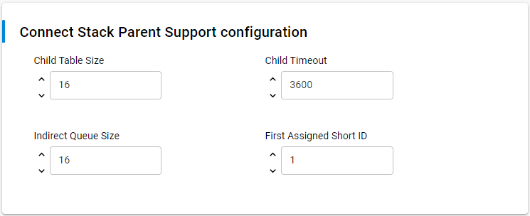
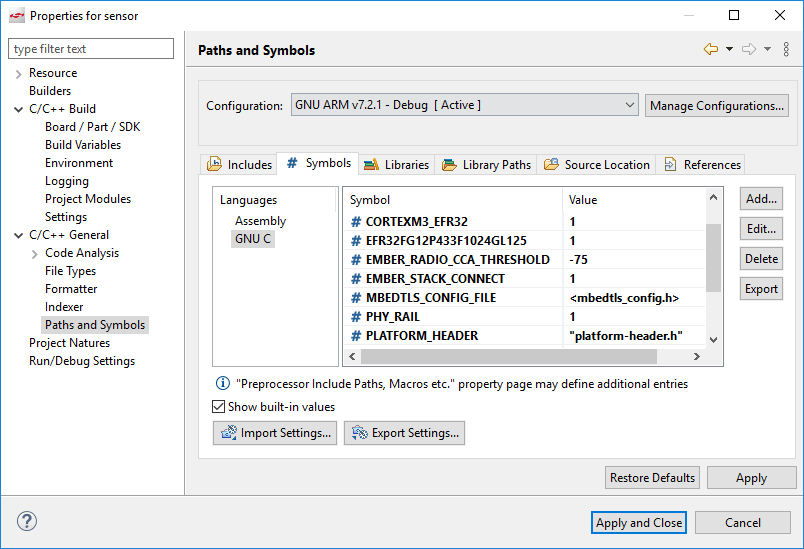

# UG435.03: Architecture of the Silicon Labs Connect Stack v3.x (Rev. 0.1) <!-- omit in toc -->

- [1. Introduction](#1-introduction)
- [2. Stack Peripheral Requirements](#2-stack-peripheral-requirements)
- [3. Connect Modes](#3-connect-modes)
  - [3.1 Extended Star Mode](#31-extended-star-mode)
  - [3.2 Direct Mode](#32-direct-mode)
  - [3.3 MAC Mode](#33-mac-mode)
- [4. Connect Stack Layers](#4-connect-stack-layers)
  - [4.1 Physical Layer](#41-physical-layer)
    - [4.1.1 FCC Regulations, DSSS, and Frequency Hopping](#411-fcc-regulations-dsss-and-frequency-hopping)
  - [4.2 MAC Layer](#42-mac-layer)
    - [4.2.1 Acknowledgments](#421-acknowledgments)
    - [4.2.2 CSMA/CA](#422-csmaca)
    - [4.2.3 Device Types](#423-device-types)
      - [4.2.3.1 Coordinator (Extended Star and MAC Mode)](#4231-coordinator-extended-star-and-mac-mode)
      - [4.2.3.2 Range Extender (Extended Star only)](#4232-range-extender-extended-star-only)
      - [4.2.3.3 End Devices and Sleepy End Devices (Extended Star and Direct Mode only)](#4233-end-devices-and-sleepy-end-devices-extended-star-and-direct-mode-only)
      - [4.2.3.4 MAC Mode Device and Sleepy MAC Mode Device (MAC Mode only)](#4234-mac-mode-device-and-sleepy-mac-mode-device-mac-mode-only)
    - [4.2.4 MAC Layer in Extended Star and Direct Mode](#424-mac-layer-in-extended-star-and-direct-mode)
      - [4.2.4.1 Messaging and Addressing](#4241-messaging-and-addressing)
      - [4.2.4.2 Short Address Allocation (Extended Star Mode only)](#4242-short-address-allocation-extended-star-mode-only)
      - [4.2.4.3 Security](#4243-security)
      - [4.2.4.4 Non-standard Command Messages](#4244-non-standard-command-messages)
      - [4.2.4.5 Association (Extended Star Mode only)](#4245-association-extended-star-mode-only)
        - [4.2.4.5.1 Device Joins Range Extender](#42451-device-joins-range-extender)
        - [4.2.4.5.2 Device Joins Coordinator](#42452-device-joins-coordinator)
        - [4.2.4.5.3 Device Joins with Address Selected on the Joining Device](#42453-device-joins-with-address-selected-on-the-joining-device)
        - [4.2.4.5.4 Joining Device Receives Multiple Beacons](#42454-joining-device-receives-multiple-beacons)
        - [4.2.4.5.5 Selective Joining](#42455-selective-joining)
    - [4.2.5 Commissioning (Direct Mode only)](#425-commissioning-direct-mode-only)
  - [4.3 MAC Layer in MAC Mode](#43-mac-layer-in-mac-mode)
    - [4.3.1 Messaging and Addressing](#431-messaging-and-addressing)
    - [4.3.2 Short Address Allocation](#432-short-address-allocation)
    - [4.3.3 Security](#433-security)
    - [4.3.4 Association](#434-association)
      - [4.3.4.1 Extended Association](#4341-extended-association)
    - [4.3.5 Commissioning](#435-commissioning)
  - [4.4 Frequency Hopping (Extended Star and Direct Mode only)](#44-frequency-hopping-extended-star-and-direct-mode-only)
    - [4.4.1 Frequency Hopping Messages](#441-frequency-hopping-messages)
    - [4.4.2 Hopping Sequence](#442-hopping-sequence)
    - [4.4.3 Full Synchronization](#443-full-synchronization)
    - [4.4.4 Passive Synchronization](#444-passive-synchronization)
    - [4.4.5 Active Synchronization](#445-active-synchronization)
    - [4.4.6 Server Advertising](#446-server-advertising)
    - [4.4.7 Summary of Component Parameters](#447-summary-of-component-parameters)
- [5. Network Layer](#5-network-layer)
  - [5.1 Network Layer Header](#51-network-layer-header)
  - [5.2 Routing (Extended Star Mode only)](#52-routing-extended-star-mode-only)
    - [5.2.1 Routing Tables](#521-routing-tables)
      - [5.2.1.1 Aging](#5211-aging)
      - [5.2.1.2 Child Table Limitations](#5212-child-table-limitations)
      - [5.2.1.3 Forwarding Rules](#5213-forwarding-rules)
  - [5.3 Leaving the Network (Extended Star Mode only)](#53-leaving-the-network-extended-star-mode-only)
  - [5.4 Network Layer Commands](#54-network-layer-commands)
  - [5.5 Network Layer Payload](#55-network-layer-payload)
- [6. Stack Configuration](#6-stack-configuration)
  - [6.1 Component Options in the Connect Stack Group](#61-component-options-in-the-connect-stack-group)
  - [6.2 Compile-time Macros](#62-compile-time-macros)
  - [6.3 Manufacturing Tokens](#63-manufacturing-tokens)

*Connect v3.x User's Guide* 的本章介绍了 Silicon Labs Connect stack v3.x 的架构。Connect stack 作为 Silicon Labs Proprietary Flex SDK v3.0 及更高版本的一部分来交付。 *Connect v3.x User's Guide* 假定您已经安装了 Simplicity Studio 开发环境和 Flex SDK，并且熟悉配置、编译、刷写 Connect-based 应用程序的基础知识。有关 *Connect v3.x User's Guide* 中各章的概述，请参阅 *UG435.01: About the Connect v3.x User's Guide* 。

# 1. Introduction

Silicon Labs Connect stack 提供了功能全面、易于定制的无线网络解决方案，该解决方案针对要求低功耗并用于简单网络拓扑的设备进行了优化。Connect 是可配置的，以符合全球范围内的区域通信标准。每种 RF 配置都旨在在每个区域标准下实现最佳性能。

Connect stack 支持多种无线电调制、频率、和数据速率的组合。协议栈为 End Node、Coordinator 和 Range Extender 提供支持。它包含一般的无线 MAC（Medium Access Control）层功能，如扫描和加入、建立点对点或星型网络，以及管理设备类型（如 Sleepy End Device、Router 和 Coordinator）。通过 Connect stack 中已实现的这些功能，开发者可以专注于他们的应用开发，而不必担心较低级别的无线电和网络细节。

# 2. Stack Peripheral Requirements

Connect stack 本身需要一些 MCU 外设才能工作：

* RF 收发器
* HFXO —— RF 收发器的依赖
* sleeptimer 组件：
  * 可以配置为使用各种定时器源，通常是 RTCC。
  * 所有可配置的定时器源均依赖一个 LF 振荡器，通常是 LFXO。
* 内部闪存（flash）的一部分用于 token（NVM）存储。有关更多信息，请参阅 *AN1154: Using Tokens for Non-Volatile Data Storage* 。
* 虽然 Connect 并未实际使用，但组件依赖项的配置会引入一个微秒定时器，默认情况下使用 TIMER0。

除非特别说明，否则可通过 emlib 和 RAIL 访问 MCU 硬件。这也引入了对某些常用 emlib 文件（如 `em_core.c` 或 `em_cmu.c`）的依赖。

Connect stack 也有以下可选的要求：

* PTI —— 为了 Network Analyzer 而使用的 RF 数据包输出（默认情况下启用）

一些组件可能需要其他外设。有关更多信息，请参阅 *UG435.04: Customizing Applications with Silicon Labs Connect v3.x* 。

# 3. Connect Modes

Connect 支持三种不同的操作模式。在任何单个网络中仅允许其中一种模式，并且没有简单的方法可以从一种模式升级到另一种。因此，您应该在设计过程的早期慎重选择模式。

## 3.1 Extended Star Mode

在这种模式下，Connect 支持扩展星型拓扑网络，如下图所示。

    

在该模式下，网络层支持任意两个设备之间的数据消息路由。End device 可以配置为 sleepy，这意味着它们在空闲时不保持无线电接收。网络层还为消息提供了端点，这些消息由发送方设置并由接收方查看，并且可以与 TCP/IP 端口类似地使用。

扩展星型拓扑是一个集中式网络。加入它必须由 PAN Coordinator 同意，并且短地址分配可以由 PAN Coordinator 处理。

此模式不完全符合 IEEE 802.15.4。

## 3.2 Direct Mode

在这种模式下，Connect 仅在设备范围内提供设备间连接，如下图所示。

    

Connect 网络层在该模式下仍然启用，但是它不提供路由，仅提供端点。然而，可以在应用层中实现路由协议。

这不是一个集中式拓扑。任何设备都可以通过设置正确的 PAN 参数来加入 PAN。协议栈不提供短地址分配，应用程序必须避免地址重复。

此模式不完全符合 IEEE 802.15.4。

## 3.3 MAC Mode

MAC mode 是一个完全符合 IEEE 802.15.4 的 Connect MAC 层设置。Connect 网络层将不会被启用，这会导致某些组件在此模式下不可用（因为某些组件需要端点）。与 Direct mode 相比，该 API 更复杂，并且需要一定的 IEEE 802.15.4 标准知识。

要使其完全符合 IEEE 802.15.4，请确保设置一个 15.4-compliant 无线电配置。

# 4. Connect Stack Layers

## 4.1 Physical Layer

Connect 使用 Radio Configurator 中配置的内容。有关如何使用此工具的更多信息，请参阅 *AN1253: EFR32 Radio Configurator Guide for Simplicity Studio 5* 。

然而，Connect 和 Radio Configurator 一同使用时有一些限制：

* Connect 将仅使用第一个配置的协议。
* 您应该使用 Connect profile。这将移除一些帧配置选项，因为 Connect 需要将帧的长度配置为与 802.15.4 兼容。
* 高于 500 kbps 比特率时，不能保证 hardware-based 地址过滤器（Connect 必需）正常工作。仅在 PER 测试之后才建议使用更高的比特率。

Connect 随附了几个预配置的 PHY 设置，旨在在下图所示的区域法规内工作。

    

### 4.1.1 FCC Regulations, DSSS, and Frequency Hopping

FCC 要求采取措施“widen”给定应用程序占用的频段。Connect 支持 DSSS（Direct Sequence Spread Spectrum）和 FHSS（Frequency-hopping Spread Spectrum）以符合此要求。通常，Silicon Labs 建议使用 DSSS。

DSSS 由硬件支持，不需要额外的通信即可工作。MAC 层可以完全兼容 15.4，15.4 定义了一些标准的 DSSS PHY 设置。另外，跳频（frequency hopping）需要 non-15.4-compatible MAC 命令以及设备之间的常规消息交换，以使其保持同步。

设置 DSSS 无线电配置需要一些 RF 知识，但是 Silicon Labs 提供了针对 2.4 GHz 和 915 MHz 的三种预配置设置。跳频不需要特殊的无线电配置，只需要配置良好的信道间隔和信道数即可。

可以使用较窄的频带（和较低的比特率）无线电配置来设置跳频，这会产生更高的灵敏度。

## 4.2 MAC Layer

Connect MAC 层基于 RAIL 的 IEEE 802.15.4-specific API，该 API 为硬件实现提供了接口：

* Address filtering
* ACK
* CSMA/CA (Carrier-Sense Multiple Access with Collision Avoidance)
* Data Request/frame pending bit setup

在 RAIL API 之上，Connect 实现了一个 802.15.4-like MAC。本节介绍了已实现的功能，并着重说明了与 IEEE 802.15.4-2011 标准的差异。

### 4.2.1 Acknowledgments

确认（Acknowledgments）是根据 IEEE 802.15.4 规范传输的。但是，确认时序和重发计数可能会通过以下方式偏离标准：

* 周转时间（即开始传输确认到接收结束期间的延迟）始终为 **12 symbol time** 。
* 可以使用 `EMBER_MAC_ACK_TIMEOUT_MS` 的定义或 `emberSetMacParams()` 的 `ackTimeout` 参数来配置设备等待 ACK 数据包的超时。默认值为 25 ms。Silicon Labs 建议在选择 PHY 之后微调此参数。
* 可以使用 `emberMacSetParams()` 的 `maxRetries` 参数配置发送方未收到 ACK 时的传输重试次数。默认值为 3（其定义为最多 4 次传输：第一次传输后重试 3 次）。

### 4.2.2 CSMA/CA

可以使用 `emberSetMacParams()` 配置 CSMA/CA 参数。默认值在 [API documentation](https://docs.silabs.com/connect-stack/latest/group-stack-info#gaea58352a21c1f1f87d33cb61099d4176) 中进行了说明，其实质上是 IEEE 802.15.4 为 2.4 GHz OQPSK PHY 推荐的参数。您还可以在 **Stack Common** 组件配置下配置阈值。

### 4.2.3 Device Types

设备类型取决于使用哪个 API 来加入网络。某些设备类型并非在每种模式下都可用。

#### 4.2.3.1 Coordinator (Extended Star and MAC Mode)

Coordinator 使用 API​​ `emberFormNetwork()` 或 `emberMacFormNetwork()` 形成网络。在 Extended Star mode 下，Coordinator 执行各种任务来维护网络：它将地址分配给加入的设备、维护路由表、等等。在 MAC mode 下，它没有特定的角色，但是它将自己报告为 PAN Coordinator。Coordinator 始终具有短地址 0x0000。Coordinator 需要 **Parent support** 组件。

#### 4.2.3.2 Range Extender (Extended Star only)

Range Extender 是一种支持在 Coordinator 和 End Device 之间路由的设备。它使用 `emberJoinNetwork()` 并将 `nodeType` 设置为 `EMBER_STAR_RANGE_EXTENDER` 来加入网络。Range Extender 需要 **Parent support** 组件。

#### 4.2.3.3 End Devices and Sleepy End Devices (Extended Star and Direct Mode only)

End Device 是一种可以在网络中通信的简单设备。Sleepy End Device 也一样，但是它会在空闲时关闭无线电，因此它只能通过消息轮询来接收消息。

End Device 在 Extended Star mode 下使用 `emberJoinNetwork()` 或 `emberJoinNetworkExtended()` 加入网络；在 Direct mode 下使用 `emberJoinCommissioned()` 加入网络。

这些函数都具有 `nodeType` 参数以选择实际的设备类型：

* `EMBER_STAR_END_DEVICE`
* `EMBER_STAR_SLEEPY_END_DEVICE`
* `EMBER_DIRECT_DEVICE`

#### 4.2.3.4 MAC Mode Device and Sleepy MAC Mode Device (MAC Mode only)

MAC mode 设备可以在 802.15.4 网络中扮演任何角色。Sleepy MAC Mode Device 也一样，但是它会在空闲时关闭无线电，因此它只能通过消息轮询来接收消息（这清除了关联请求命令中的“Receiver On When Idle”位）。

MAC mode 设备可以使用 `emberJoinNetwork()` 、 `emberJoinNetworkExtended()` 或 `emberJoinCommissioned()` 加入网络。

这些函数都具有 `nodeType` 参数以选择实际的设备类型：

* `EMBER_MAC_MODE_DEVICE`
* `EMBER_MAC_MODE_SLEEPY_DEVICE`

### 4.2.4 MAC Layer in Extended Star and Direct Mode

Extended Star mode 和 Direct mode 使用相同的 MAC 实现，但有一些小小的区别，以下几节将重点介绍它们。

#### 4.2.4.1 Messaging and Addressing

~~在 MAC mode 下，~~ Silicon Labs Connect 支持 IEEE 802.15.4 中可用的所有寻址模式。应用程序只能发送数据帧。协议栈仍可处理 MAC 命令、信标（beacon）和 ACK。

#### 4.2.4.2 Short Address Allocation (Extended Star Mode only)

短地址分配始终由 Coordinator 处理。默认情况下，Coordinator 从地址 0x0001 开始分配。可以在 **Parent support** 组件中对其进行修改，以保留部分地址空间用于手动 commissioning。

随着每个新的访问请求，分配的地址从第一个分配的地址开始递增。最后分配的地址存储在一个 token（非易失性存储器）中，因此即使 Coordinator 重新启动，其所分配地址的唯一性也能得到保证。Coordinator 无法分配它先前已分配给设备的地址。因此，在分配（最大）地址 0xFFFD 之后，它将不接受任何设备的任何额外访问请求。

#### 4.2.4.3 Security

在这些模式下，Connect 支持的安全性与 802.15.4's mode-5 security 非常相似，但并不完全兼容。它使用不同的字节序，并且计算的随机数略有不同，但是这些都不会影响安全性本身。

帧计数器存储在一个 token（一个持久的元素，Connect 通过多个可用的非易失性存储库之一来提供）中。为了进一步减少闪存的磨损，帧计数器只在每隔 16384（0x4000）个增量后才会保存。为了确保设备因复位或断电重启事件丢失 RAM 中的确切值后，帧计数器仍会递增，在启动时 Connect 将递增在持久化 token 中存储的基本值（这将放弃/跳过先前基本值中原始 16384 的任何未使用的剩余增量）。

#### 4.2.4.4 Non-standard Command Messages

Connect 使用一些 non-standard MAC 命令：

* 0x7D：扩展关联请求。如果请求者支持，则使用安全通信。有关更多信息，请参阅 [4.2.4.5.3 Device Joins with Address Selected on the Joining Device](#4-2-4-5-3-Device-Joins-with-Address-Selected-on-the-Joining-Device) 。
* 0x7E：跳频信息请求。有关更多信息，请参阅 [4.4 Frequency Hopping (Extended Star and Direct Mode only)](#4-4-Frequency-Hopping-Extended-Star-and-Direct-Mode-only) 。
* 0x7F：跳频信息。有关更多信息，请参阅 [4.4 Frequency Hopping (Extended Star and Direct Mode only)](#4-4-Frequency-Hopping-Extended-Star-and-Direct-Mode-only) 。

#### 4.2.4.5 Association (Extended Star Mode only)

##### 4.2.4.5.1 Device Joins Range Extender

在 Extended Star mode 下，Coordinator 负责分配短地址。因此，如果一个设备加入到一个 Range Extender，则 Range Extender 必须向 Coordinator 请求短地址。为此，Range Extender 使用网络层命令帧（有关更多信息，请参阅 [5.4 Network Layer Commands](#5-4-Network-Layer-Commands) ）。下图描述了此过程。

    

##### 4.2.4.5.2 Device Joins Coordinator

当一个（Sleepy）End Device 加入到 Coordinator 时，关联过程几乎与标准 IEEE 802.15.4 相同（有关简短说明，请参阅 *UG435.02: Using Silicon Labs Connect v3.x with IEEE 802.15.4* ）。但是，在时序方面存在一些差异，如下所示：

* 关联请求和数据请求命令之间的延迟增加了 500 ms，如上图所示。
* 主动扫描持续时间（加入设备等待信标的时间）是根据 IEEE 802.15.4 配置的，并根据符号时间进行计算。但是，在 low-symbol rate PHY 上，这会大大减慢加入过程。您可以使用 `emberSetActiveScanDuration()` 对其进行配置。

##### 4.2.4.5.3 Device Joins with Address Selected on the Joining Device

正在加入的设备可以选择自己的短地址。因为标准关联请求中没有此请求的地址字段，所以 Connect 将扩展关联请求用于此功能。在这种情况下，正在加入的设备负责地址的唯一性 —— Coordinator 不会对其进行检查。在所有其他细节上，加入过程都是相同的。

如果关联是从一个 Range Extender 中请求的，则它仍然会向 Coordinator 发送一个短地址请求（使用所请求的地址）。尽管这基本上总是由 Coordinator 批准的，但是这允许了将来处理地址分配（使用地址请求）的能力存在差异。

##### 4.2.4.5.4 Joining Device Receives Multiple Beacons

如果正在加入的设备在加入过程中收到了多个信标，它将：

* 如果它接收到一个来自 Coordinator 的信标，则加入该 Coordinator。
* 如果一个 Range Extender 已响应，则加入第一个 Range Extender 以做出响应。

> 注意：这仅适用于 End Device。Range Extender 只能加入到 Coordinator。

##### 4.2.4.5.5 Selective Joining

在某些情况下，需要在正在加入的设备上选择 Coordinator/Range Extender。在 Connect 中使用选择性加入有效负载可以启用此功能，这可以通过 `emberSetSelectiveJoinPayload()` 和 `emberClearSelectiveJoinPayload()` API 进行配置。启用后，将仅在配置了与正在加入的设备相同的加入有效负载的 Coordinator 和 Range Extender 上接受正在加入的设备的关联请求。因为标准关联请求不允许此字段，所以即使未请求地址，Connect 也会使用扩展关联请求。

### 4.2.5 Commissioning (Direct Mode only)

Commissioning 时，设备会设置其所有参数（PAN ID、短地址和设备类型），而无需与网络进行任何通信。这意味着 commissioning 设备负责确保所选的短地址是唯一的。

## 4.3 MAC Layer in MAC Mode

### 4.3.1 Messaging and Addressing

~~在 MAC mode 下，~~ Silicon Labs Connect 支持 IEEE 802.15.4 中可用的所有寻址模式。应用程序只能发送数据帧。协议栈仍可处理 MAC 命令、信标和 ACK。

### 4.3.2 Short Address Allocation

所有 non-sleepy MAC mode device 都处理短地址分配。它们分配随机地址，网络负责检测地址重复。

### 4.3.3 Security

MAC mode 支持与 Connect stack 的其他模式相同的 mode-5 security。安全性要求使用源的长地址来解码消息，因此当接收到短寻址帧时，应用程序应提供地址转换。这可以通过一个查找表进行处理，该表可以通过 API `emberMacAddShortToLongAddressMapping()` 进行填充和更新。

### 4.3.4 Association

MAC mode 下的关联实现了 IEEE 802.15.4 中描述的关联（有关简短说明，请参阅 *UG435.02: Using Silicon Labs Connect v3.x with IEEE 802.15.4* ）。MAC mode End Device 可以加入任何其他 non-sleepy MAC mode device（Coordinator 或 PAN Coordinator）。

#### 4.3.4.1 Extended Association

与 Extended Star 或 Direct mode 相比，API `emberJoinNetworkExtended()` 的工作方式有所不同。它仍然发送标准的关联请求，但只能用于请求短地址 0xFFFE，这意味着设备希望使用其长地址与网络进行通信。

### 4.3.5 Commissioning

Commissioning 时，设备会设置其所有参数（PAN ID、短地址和设备类型），而无需与网络进行任何通信。这意味着 commissioning 设备负责确保所选的短地址是唯一的。

## 4.4 Frequency Hopping (Extended Star and Direct Mode only)

跳频允许两个节点进行通信，同时以伪随机方式快速切换信道，从而减少信道干扰。跳频是在客户端-服务端模型中实现的，其中服务端协调跳频。服务端和客户端必须位于相同的 PAN 中，并且必须使用相同的跳频参数进行编程。在以下各节中，这些参数以 **粗体** 突出显示。

### 4.4.1 Frequency Hopping Messages

跳频是通过非标准跳频信息（non-standard Frequency hopping info）和跳频信息请求（Frequency hopping info request）MAC 命令消息实现的。正在接收跳频信息消息的客户端将建立服务端与客户端之间的同步，而跳频信息请求则从服务端中请求信息消息。Sleepy End Device 发送一个请求后，它将等待一个应答，类似于数据轮询。这些消息在没有 CSMA/CA 的情况下发送。

### 4.4.2 Hopping Sequence

当应用程序使用 `emberFrequencyHoppingStartServer()` 或 `emberFrequencyHoppingStartClient()` 启动跳频系统时，将生成跳频序列。默认情况下，所有信道都在 **Start channel** 和 **End channel** 之间使用，并且可以在启动系统之前使用 `emberFrequencyHoppingSetChannelMask()` 移除信道。接下来，使用一个伪随机序列发生器对信道进行重新排序，伪随机序列发生器由 **Channel Sequence Generation Seed** 组件参数选种，如下图所示。

    

无线电将以一个固定的顺序使用这些信道，持续时间由 **Channel duration** 时间指定 —— 定义信道槽。在这些信道槽的开始和结尾，不允许在使用 **Channel Guard Duration** 配置的时间内进行传输，以避免由于设备稍微不同步而导致的通信问题，如下图所示。

    

### 4.4.3 Full Synchronization

当一个客户端希望加入一个已经跳频的服务端时（或者如果一个客户端失去了同步），客户端将开始完全同步过程：它将开始发送跳频信息请求消息，以相反的顺序快速地在信道间跳跃，直到它接收到跳频信息（此时客户端与服务端重新同步）。如果客户端是一个 Sleepy End Device，则完全同步的工作原理相同，如下图所示。

    

如果客户端五次遍历所有信道都未收到跳频信息，那么它将使用 `EMBER_MAC_SYNC_TIMEOUT` 调用 `emberStackStatusHandler()` 。

### 4.4.4 Passive Synchronization

被动同步用于使 non-sleepy device 保持同步。服务端定期广播跳频信息消息，如果客户端收到该跳频信息消息，则客户端将调整其同步。这些广播的周期由 **Server Broadcast Info Period** 配置。然而，该周期不是准确的。在经过该周期以到达不同步的客户端之后，消息将始终在下一个时隙的中间发送，该客户端的 **Channel duration** 为下图所示的一半。

    

如果 non-sleepy 客户端未收到 **Client synchronization timeout** 的跳频信息消息，它将使用 `EMBER_MAC_SYNC_TIMEOUT` 调用 `emberStackStatusHandler()` 。

### 4.4.5 Active Synchronization

主动同步用于使 sleepy device 保持同步。如果 sleepy 客户端尚未收到 **Client resync period** 的跳频信息消息，则下一次传输尝试之前将进行主动同步：客户端将在下一个时隙的中间发送跳频信息请求，如下图所示。

    

如果客户端在其请求后未收到跳频信息消息，它将触发完全同步。

### 4.4.6 Server Advertising

服务端启动时，它将以广告周期开始。此阶段的目标是重新同步已经运行的客户端。例如，如果服务端在看门狗重置后重启，则可能会发生这种情况。此模式基本上是完全同步的逆过程：服务端以相反的顺序快速跳过所有信道，并在每个信道上发送跳频信息消息。服务端遍历所有信道 **Server advertisement sequence count** 次，如下图所示。

    

在上图中，客户端 B 收到了发送的第一个 Info 消息，但是客户端 A 没有收到（如由于某些干扰信号）。因此，客户端 A 仅在下一次与服务端匹配信道时才进行同步。

### 4.4.7 Summary of Component Parameters

组件的参数如下：

* **Channel Sequence Generation Seed** ：生成伪随机序列的种子数。
* **Start channel** ：伪随机序列信道范围的起始或最小值。其包含在内，即开始信道将在序列中。
* **End channel** ：伪随机序列信道范围的结束或最大值。其包含在内，即结束信道将在序列中。
* **Channel Duration** ：节点在每个信道上花费的时间（以毫秒为单位）。
* **Channel Guard Duration** ：进入和离开信道“槽”时，节点将不传输多长时间（以毫秒为单位）。在这段时间内从应用程序发送的请求将被推迟到保护持续时间结束为止。保护持续时间在信道持续时间之内。例如，使用 400 ms 的信道持续时间和 25 ms 的保护持续时间，节点更改信道，等待 25 ms、传输 350 ms、等待 25 ms，然后再次更换信道。
* **Server Broadcast Info Period** ：服务端广播其所在信道的索引号以及该信道已存在多长时间后的时间（以毫秒为单位）。这为与服务端不同步的客户端提供了重新同步的机会。
* **Client Resync Period** ：如果没有重新同步发生，sleepy 客户端请求服务端信息之后的时间（以秒为单位）。
* **Client synchronization timeout** ：non-sleepy 客户端将在该时间（以秒为单位）后停止，如果未发生重新同步，则会报告跳频同步失败。
* **Server advertisement sequence count** ：服务端在启动时循环通过所有信道以重新同步已运行的客户端的次数。

# 5. Network Layer

Connect 网络层仅在 Extended Star mode 和 Direct mode 下可用。它负责路由（仅适用于 Extended Star mode）和端点处理。端点实现协议之间的通道共享，类似于 TCP/IP 的端口概念。例如，Mailbox 组件使用端点 15、OTA 使用端点 14，其他端点在应用程序框架的帮助下发送到应用程序。

## 5.1 Network Layer Header

下图说明了网络层报头。

    

网络层报头包含在所有 MAC 数据帧中。

如果设置了 Frame type 位，则该帧是网络命令消息，并且由网络层处理；如果没有设置，则消息为数据帧。数据帧被路由到其目的地，或者被目的地接收，然后通过 `emberIncomingMessageHandler()` 回调（包括 NWK payload、source short ID 和作为参数的 endpoint）转发到应用层。

## 5.2 Routing (Extended Star Mode only)

### 5.2.1 Routing Tables

路由协议是集中式的，Coordinator 知道到网络中所有设备的路由。这是通过在设备上存储以下路由数据来实现的：

* End Device 存储其父级的地址。
* Range Extender 存储与其连接的所有子级的地址（子表）。
* Coordinator 存储与其连接的所有子级的地址（子表），并为每个 Range Extender 保留一个带有其子级的地址的表（Coordinator 路由表，仅 RAM）。

#### 5.2.1.1 Aging

子表还存储最后收到的消息的时间戳。如果子表已满，并且有一个新的子项要加入，则 Coordinator 可以移除一个在“Child timeout”时间（可在 **Parent support** 组件中配置，默认为 1 小时）内没有通信的子项。

#### 5.2.1.2 Child Table Limitations

子表具有以下限制：

* Coordinator 的最大子项数为 64（受限于最大的子表大小）。
* Range Extender 的最大子项数为 32（受限于 Range Extender 更新命令的格式）。

#### 5.2.1.3 Forwarding Rules

路由协议可以用以下转发规则表示：

* End Device：始终转发给父级（Coordinator 或 Range Extender）。
* Range Extender：如果最终目的地在子表中，则将数据包转发到最终目的地。否则，转发给 Coordinator。
* Coordinator：如果最终目的地在子表中，则将数据包转发到最终目的地。否则，在路由表中查找最终目的地，并将其转发到相应的 Range Extender。

## 5.3 Leaving the Network (Extended Star Mode only)

一个子项（End Device、Sleepy End Device 或 Range Extender）可以通过调用 `emberResetNetworkState()` 来离开网络（无需通知其父级）。该动作将使网络承受失败的消息路由尝试负担，直到设备从路由表和子表超时为止。为避免此问题，设备可以在离开网络之前通过调用 `emberNetworkLeave()` （而不是 `emberResetNetworkState()` ）来通知其父级。这将会发送离开通知（Leave notification）消息。收到消息后，父级将从子表中移除该子项。如果父级不确认离开通知，则子项将尝试在离开网络之前再发送 7 次（消息间使用 200 ms 的延迟）。

父级也可以通过调用 `emberRemoveChild()` 将子项从网络中移除。这将立即将子表中的 child ID 标记为可再用的（因此，如果子表已满，则可以将其重新分配给已允许加入的任何新子项）。该函数还将导致发送一个离开请求（Leave request）消息。对于 non-sleepy device，这将立即发生；对于 sleepy device，它将作为对数据轮询的响应来发送。如果该子项确认了离开请求消息，或者不响应 8 个离开请求消息，则将从子表中移除该子项。离开请求消息将在当子项试图与父级通信时发送。

## 5.4 Network Layer Commands

网络层支持以下命令：

* 0x01：短地址请求（Short address request）
* 0x02：短地址响应（Short address response）
* 0x03：Range Extender 更新请求（Range extender update request）
* 0x04：Range Extender 更新（Range extender update）
* 0x05：离开请求（Leave request）
* 0x06：离开通知（Leave notification）

如果双方都支持这些命令，则所有的这些命令都将使用安全通信。

如果一个设备加入到一个 Range Extender，则使用短地址请求和短地址响应来从 Coordinator 中获取短地址（有关更多信息，请参阅 [4.2.4.5.1 Device Joins Range Extender](#4-2-4-5-1-Device-Joins-Range-Extender) ）。

Range Extender 更新用于维护 Coordinator 上的路由表。它们的有效载荷是一个短地址数组。每个 Range Extender 都会将此命令定期发送给 Coordinator，默认情况下每 60 秒发送一次，或者可以使用编译时定义 `EMBER_NWK_RANGE_EXTENDER_UPDATE_PERIOD_SEC` 进行配置。此命令也是对 Range Extender 更新请求的响应。

如果 Coordinator 需要更新其路由表，则使用 Range Extender 更新请求。当前仅在 Coordinator 重启时使用。

## 5.5 Network Layer Payload

对有效负载的唯一要求是它必须存在：不支持长度为 0 的消息。没有有效负载的消息通常用于信标。Silicon Labs 建议将数据轮询消息用于信标。

# 6. Stack Configuration

Connect stack 在启动时加载各种配置值。这些值可以在三个不同的位置进行配置。

## 6.1 Component Options in the Connect Stack Group

Connect stack 分组中的许多组件都有类似 **Parent Support** 组件的配置选项。

    

这些配置选项将生成到项目 `config` 文件夹下的逻辑命名的头文件中（如 `parent-support-config.h` ）。

## 6.2 Compile-time Macros

Connect stack 使用了一些无法作为组件选项来配置的宏。这些都记录在 [Connect API documentation](https://docs.silabs.com/connect-stack/latest/group-configuration) 中。如果在编译时未定义配置宏，则将使用 `protocol/flex/stack/config/ember-configuration-defaults.h` 中的默认值。

可以在项目属性下添加编译时宏，如下图所示。

    

## 6.3 Manufacturing Tokens

Connect stack 还检查多个 manufacturing token 以对其进行配置。这些 token 通常在应用程序的生存期内写入一次，但也可以独立于固件写入。有关更多信息，请参阅 *AN961: Bringing Up Custom Devices for the EFR32MG and EFR32FG Families* 和 *AN1154: Using Tokens for Non-Volatile Data Storage* 。

支持以下 manufacturing token：

* `TOKEN_MFG_CUSTOM_EUI_64`
* `TOKEN_MFG_CTUNE`
* `TOKEN_MFG_SECURE_BOOTLOADER_KEY` (for Gecko bootloader)
* `TOKEN_MFG_SIGNED_BOOTLOADER_KEY_X` (for Gecko bootloader)
* `TOKEN_MFG_SIGNED_BOOTLOADER_KEY_Y` (for Gecko bootloader)

有关每个 manufacturing token 的更多信息，请参阅 *AN961: Bringing Up Custom Devices for the EFR32MG and EFR32FG Families* 。
