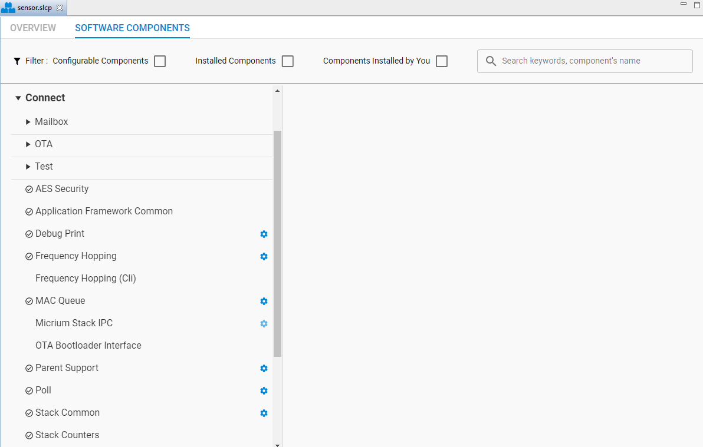
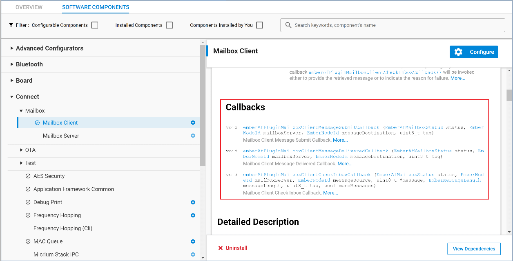

# UG435.04: Customizing Applications with Silicon Labs Connect v3.x (Rev. 0.2) <!-- omit in toc -->

- [1. Connect Stack and Application Framework](#1-connect-stack-and-application-framework)
- [2. Components](#2-components)
  - [2.1 Connect Features in the Component Library](#21-connect-features-in-the-component-library)
    - [2.1.1 MAC and Network Layer Components](#211-mac-and-network-layer-components)
    - [2.1.2 Application Framework Components](#212-application-framework-components)
    - [2.1.3 Bootloader-Related Components](#213-bootloader-related-components)
  - [2.2 Connect Application Dependency on Non-Connect Components](#22-connect-application-dependency-on-non-connect-components)
- [3. Callbacks](#3-callbacks)
  - [3.1 Implementing Callbacks to Support Installed Components](#31-implementing-callbacks-to-support-installed-components)
- [4. Events](#4-events)
  - [4.1 Creating an Event](#41-creating-an-event)
  - [4.2 Scheduling Events](#42-scheduling-events)

*Connect v3.x User's Guide* 的本章介绍了如何使用 Connect 组件、回调和事件来提供 developer-configurable 特性和应用行为。Connect stack 作为 Silicon Labs Proprietary Flex SDK v3.0 及更高版本的一部分来交付。 *Connect v3.x User's Guide* 假定您已经安装了 Simplicity Studio 开发环境和 Flex SDK，并且熟悉配置、编译、刷写 Connect-based 应用程序的基础知识。有关 *Connect v3.x User's Guide* 中各章的概述，请参阅 *UG435.01: About the Connect v3.x User's Guide* 。

本章中的信息是为刚接触 Connect 的开发者设计的。如果您熟悉 Simplicity Studio 4 中的 Connect v2.x，请参阅 *AN1254: Transitioning from the v2.x to the v3.x Proprietary Flex SDK* 。

*Connect v3.x User's Guide* 是一系列文档，为使用 Silicon Labs Connect Stack 进行应用开发的开发者提供了深入的信息。如果您不熟悉 Connect 和 Proprietary Flex SDK，请参阅 *QSG168: Proprietary Flex SDK v3.x Quick Start Guide* 。

所有 EFR32FG 设备均支持 Proprietary。对于其他产品，请在 Ordering Information > Protocol Stack 下查看设备的 datasheet，以了解是否支持 Proprietary。在 Proprietary SDK version 2.7.n 中，EFR32xG22 不支持 Connect。

# 1. Connect Stack and Application Framework

基于 Silicon Labs Connect 的应用程序不仅包含 Connect Stack，而且还包含 Connect Application Framework。它们使得开发者可以使用 Silicon Labs 开发和测试的最佳实践应用程序状态机代码作为基础来开始一个新项目。该框架位于 Silicon Labs Connect stack 之上，可与其他平台元素交互并提供应用层功能。它使用协议栈处理程序接口，并向开发者公开其自己的更抽象的、特定于应用程序的接口。

与 Gecko Software Development Kit（GSDK）v3.0 中引入的平台架构一样，Connect stack 和应用程序框架的结构可支持称为 **components** 的可选功能块。每个 Connect 组件均作为独立库或一组源代码提供。这使开发者可以只包括目标应用必不可少的那些功能，而不必为未使用的功能集耗费资源。

每个组件在应用程序框架之上注册一个或多个回调，然后由应用程序实现（覆盖默认的弱定义存根）。在 Connect-based 项目中，回调是开发者在现有 Silicon Labs 框架之上添加自定义应用代码的位置，以使该应用程序具有独特的行为并确定其反应方式。

在回调实现中，开发者可以利用整个平台和协议栈的 API，以及一整套 Application Framework-specific API，这些 API 通常为复杂的平台或协议栈功能提供高级封装。这些 API 记录在 [https://docs.silabs.com/connect-stack/latest](https://docs.silabs.com/connect-stack/latest) 上（其相关页面嵌入在 Simplicity Studio 5（SSv5）的 Project Configurator 中），其用法示例可在 Connect 示例代码中找到。

以下各节将仔细研究构成基于 Silicon Labs Connect 的应用程序的每个基本元素：组件、回调和事件。

# 2. Components

GSDK v3.x platform 引入了一种称为 **component library** 的机制，该机制使开发者能够利用现有的、经过验证的所需功能实现。GSDK v3.x 和 Simplicity Studio 5（SSv5）进行了重构，以支持这种基于模块化组件的方法来进行快速而强大的应用程序开发。

在 Flex SDK v3.x 中，重新设计了 Silicon Labs Connect（包括协议栈和应用程序框架），以与该组件架构无缝集成 —— 应用程序可以通过 Project Configurator 中的 SOFTWARE COMPONENTS 选项卡以与其他组件（如用于睡眠模式转换的 Power Manager、对 Silicon Labs 开发套件硬件的开发板支持等）相同的方式访问 Connect-specific 元素。

作为独立的预编译库或一组源代码提供，每个组件都向项目添加了特定功能集。使用 Project Configurator 安装所需的（或卸载不需要的）组件，以向构建中添加（或从构建中移除）关联的代码和库。许多组件具有可配置的选项，可以直接在底层头文件中进行调整，也可以使用 Component Editor 方便地进行管理。可以从 Project Configurator 轻松访问有关组件描述和行为的参考信息，包括组件依赖关系和依赖关系。

有关使用组件库的更多信息，请参阅 *Simplicity Studio 5 User's Guide* ，该指南可通过 SSv5 获得，也可从 [https://docs.silabs.com](https://docs.silabs.com/) 在线获得。

## 2.1 Connect Features in the Component Library

本节介绍了一些当前可用的 Connect 组件。有关完整和最新的列表（包括组件之间的依赖性），请参阅使用最新的 Flex SDK 的 Connect 项目的 SOFTWARE COMPONENTS 选项卡。这些组件可以在 top-level“Connect” 分组下找到，如下图所示。

<p>
    
</p>

### 2.1.1 MAC and Network Layer Components

组件库包括以下 MAC（Media Access Control）和网络（Network）层 Connect 组件：

* AES Security
* Frequency Hopping
* MAC Queue
* Parent Support
* Stack Common

**AES Security** ：使节点能够使用 IEEE 802.15.4 mode-5-like 或 mode-5 MAC 加密/认证（使用 Mbed TLS）交换安全消息。这利用了 EFR32 设备上硬件加速的 AES 支持。仅当应用程序将使用/支持 AES 安全性时才安装此组件。

**Frequency Hopping** ：允许节点进行通信，同时以伪随机方式快速切换信道，从而减少信道干扰，并有助于遵守法规。有关更多信息，请参阅 *U435.03: Architecture of the Silicon Labs Connect Stack v3.x* 。

**MAC queue** ：某些应用程序需要向 Connect stack 提交多个消息。该组件提供了动态内存分配功能，并允许根据提交顺序和/或优先级将消息入队并尽快发送出去。如果没有安装此组件，Connect stack 一次只能处理一个消息传输请求。

**Parent Support** ：提供父级特性，例如间接通信（与 sleepy device 进行通信）、子表和路由表支持。应该将其安装在旨在支持多个 end-device 和/或 sleepy-end-device 节点的任何 coordinator 或 range extender 节点上。为了节省 flash/RAM，star end device、direct device 或 MAC device 不应安装此组件。 *UG435.07: Energy Saving with Silicon Labs Connect v3.x* 也讨论了 Parent Support 组件。

间接队列（Indirect queue）支持可缓冲发往 sleepy child device 的数据包。

子表允许 star coordinator 或 star range extender 支持多个子设备。子设备在老化（aged）后会被移除。子信息表存储在非易失性存储器（NVM）中，并且需要（n\*11）字节 token 空间，其中 n 是配置的子表大小（有关更多信息，请参阅 [2.2 Connect Application Dependency on Non-Connect Components](#2-2-Connect-Application-Dependency-on-Non-Connect-Components) ）。Coordinator 的子表大小限制为 64，而 range extender 的子表的大小限制为 32。

扩展星型网络（即该网络包含 star range extender）中的 star coordinator 应用程序需要一个路由表。它存储从 star range extender 中收集的信息。

**Stack Common** ：提供 Connect Stack 通用功能，例如 15.4-like MAC 层、事件系统、动态内存分配和其他所需的基础设施功能。它还提供了栈配置文件，该文件分配了所有 sizable RAM 数据结构。其应该安装在任何 Connect 应用程序中。

### 2.1.2 Application Framework Components

可选的 Connect Application Framework 组件用于管理应用层功能，如下所示：

* Mailbox
  * Mailbox client
  * Mailbox server
* Application Framework Common
* Debug Print
* Frequency Hopping (CLI)
* Micrium Stack IPC
* Poll
* Stack Counters

**Mailbox** ：一种服务端/客户端服务，允许客户端节点向服务端节点提交消息并从服务端节点检索消息。应用层协议（与 MAC 层提供的间接队列相反），Mailbox 组件支持的超时时间（默认为 1 小时，可以设置为几天）比间接队列更长（8 ~ 30 秒之间）。MAC mode 下不支持 Mailbox 组件。 *UG435.07: Energy Saving with Silicon Labs Connect v3.x* 也讨论了 Mailbox 功能。

**Application Framework Common** ：声明所有必需的应用程序框架全局变量、初始化 Connect stack，并根据需要向应用程序组件分派协议栈回调。

**Debug Print** ：提供用于添加串行调试能力（从应用程序进行 printf-style 打印）的 API。

**Frequency Hopping (CLI)** ：提供跳频 CLI 命令。

**Micrium Stack IPC** ：为 Connect stack API 提供 IPC。如果安装了此组件，则协议栈将作为 Micrium OS 任务在 Micrium OS 中运行，而应用程序框架将作为单独的任务运行。使用 IPC 在应用程序框架上调用 API。类似地，使用 IPC 将协议栈回调传递给应用程序框架任务。应用程序还可以定义最多三个自定义 Micrium OS 任务。有关更多信息，请参阅 *UG435.05: Using Micrium OS (RTOS) with Silicon Labs Connect v3.x* 。

**Poll** ：管理对 end device 的定期轮询。常规 end device 需要与父级交换某种流量以作为一个 **keep-alive** 机制，也称为一个 **long poll** 间隔。Star sleepy end device 需要轮询父设备是否有传入数据包，也称为一个 **short poll** 间隔。默认情况下，star end device 处于 long poll mode。应用程序可以在适当时使用组件 API 切换到 short poll mode。例如，一个 star sleepy end device 发出一个期望响应的数据包。然后，应用程序切换到 short poll mode，直到收到预期的响应。 *UG435.07: Energy Saving with Silicon Labs Connect v3.x* 也讨论了 Polling 组件。

**Stack Counters** ：提供协议栈数据包计数器功能。如果安装了此组件，则 Connect stack 将跟踪成功和失败的传输以及成功接收的数据包和丢弃的传入数据包。

### 2.1.3 Bootloader-Related Components

Connect 提供以下组件，这些组件可以直接实现或支持 Connect OTA（Over-the-Air）bootloader 功能。有关此功能集的更深入介绍，请参阅 *U435.06: Bootloading and OTA with Silicon Labs Connect v3.x* 。

> 注意：MAC mode 下不支持 OTA Bootloader 组件。

* OTA
  * OTA Broadcast Bootloader Client
  * OTA Broadcast Bootloader Server
  * OTA Unicast Bootloader Client
  * OTA Unicast Bootloader Server
* Test
  * OTA Bootloader Test Common
  * OTA Broadcast Bootloader Test
  * OTA Unicast Bootloader Test
* OTA Bootloader Interface

**Bootloader Interface** ：提供一组用于与 Gecko Bootloader 进行交互的 API。

OTA Bootloader Server 组件实现 OTA Bootloader 协议的服务端。它们包括将映像分​​发到一个或多个目标设备（客户端）并指示一个或多个客户端在将来的某个特定时间执行映像引导加载操作的所有功能。

**OTA Broadcast Bootloader Server** ：广播的服务端版本，适用于多个客户端。

**OTA Unicast Bootloader Server** ：单播的服务端版本，用于单个客户端。

OTA Bootloader Client 组件实现 OTA Bootloader 协议的客户端。它们包括从 OTA bootloader 服务端下载映像，并被指示在将来的特定时间执行映像引导加载的所有功能。

**OTA Broadcast Bootloader Client** ：该广播的客户端版本假设有多个客户端同时接收同一映像。

**OTA Unicast Bootloader Client** ：该单播的客户端版本假设仅有一个客户端正在从服务端中接收映像。

OTA Bootloader Test 组件提供了测试代码，以演示如何在本地执行闪存读/写/擦除操作以及如何使用 OTA Bootloader Server/Client 组件执行 OTA Bootloading 操作。这些组件还支持一组 CLI 命令。

**OTA Bootloader Test Common** ：Bootloader 测试的通用部分，其中包含用于外部闪存部件操作的 CLI 命令，以及以广播和单播相同方式工作的功能（如在客户端设置映像标签）。

**OTA Broadcast Bootloader Test** ：Broadcast-specific bootloader 测试功能，例如用于设置目标设备、开始分发以及从目标请求引导加载的 CLI 命令。

**OTA Unicast Bootloader Test** ：Unicast-specific bootloader 测试功能。与上面的相同，但 CLI 命令与广播命令中的有所不同。

## 2.2 Connect Application Dependency on Non-Connect Components

随着 GSDK v3.x 的出现以及其统一的平台模块化和配置方法，以前对某些 Connect-specific 通用功能实现的支持已被组件库中其他 universal stack-agnostic 解决方案所取代。这包括（以前）Idle/Sleep 和 NVM “plugins”。注意：在 v3 之前使用 SDK 中的 Connect 进行过开发的开发者，应查阅 *AN1254: Transitioning from the v2.x to the v3.x Proprietary Flex SDK* 。

现在，Power Manager 组件可以监视设备的电源模式转换（有关更多信息，请参阅 *UG435.07: Energy Saving with Silicon Labs Connect v3.x* ）。

Connect 应用程序需要模拟的非易失性存储器支持。Silicon Labs 提供了许多这样的解决方案，它们位于 Services 组件分组中（强烈建议使用 NVM3）。这些库在芯片的内部闪存中模拟了一个 EEPROM，以最大程度地延长闪存页的寿命，并通过对闪存进行磨损均衡写入来减少写入周期。此 NVM 用于网络（由协议栈自动管理）和应用层（应用程序可以添加自己的 token）的 token 的持久存储。

这些 token 引出以下硬件要求：

* **SimEEv1** ：8 kB 闪存用于提供 2 kB token 空间
* **SimEEv2** ：36 kB 闪存用于提供 8 kB token 空间
* **NVM3** （强烈建议）：至少三个闪存页的可配置存储
* All versions：Connect stack 占用 47 byte 的 token 空间。对于 end device，这代表了完整的 token 存储空间。由于 Parent Support 组件，coordinators 和 range extender 最多可能需要 704 byte（n\*11 byte，最多支持 n 个子级，其中 n 在 0 ~ 64 之间）。

有关更多信息，请参阅 *AN703: Using Simulated EEPROM Version 1 and Version 2 for the EM35x and EFR32 SoC Platforms* ；*AN1135: Using Third Generation Non-Volatile Memory (NVM3) Data Storage* ； *AN1154: Using Tokens for Non-Volatile Data Storage* 。

# 3. Callbacks

Connect-based 应用程序包含 Stack Common 和 Application Framework Common 组件，它们不仅提供所需的初始化动作，而且实现了协议栈处理程序并将其分派到每个相关的组件回调中。尽管 Silicon Labs 提供了 Connect Application Framework 的所有源码（协议栈和 RAIL 作为预编译的库提供），但用户创建的代码应驻留在框架之外，并应通过框架实用程序和回调公开的 Connect Application Framework API 与框架进行交互。

GSDK v3 项目包含一个 `main.c` 文件（Connect-based 应用程序应保留此文件不变），该文件初始化协议栈并运行其主循环。协议栈将在初始化结束时调用 `emberAfInitCallback()` （在 `app_init.c` 中），并从主循环调用 `emberAfTickCallback()` （在 `app_process.c` 中）。使用这些函数进行初始化和主循环操作，可以使 Connect stack 优先考虑对及时执行协议栈和无线电任务至关重要的操作。

协议栈回调通过应用程序框架路由和分发。可以通过在相关 API 函数名称上注明前缀来观察到这一点（与协议栈 API 关联的 `ember` 和与应用程序框架 API 关联的 `emberAf` ）。例如，当收到传入消息导致协议栈向 `emberIncomingMessageHandler` 发送信号时，消息将传递到 `emberAfIncomingMessageCallback` （由应用程序处理）和 `emberAfIncomingMessage` （由组件使用），如以下 `app_framework_stack-cb.c` （来自 `gecko_sdk_3*/protocol/flex/app-framework-common/` ）中所述。

```c
void emberIncomingMessageHandler(EmberIncomingMessage *message)
{
    emberAfIncomingMessage(message);
    emberAfIncomingMessageCallback(message);
}
```

安装组件时，请注意 Project Configurator 中组件列表右侧提供的回调原型代码。使用这些参考示例在一个 `.c` 文件（通常是所安装组件的 `app_process.c` ）中实现必要的回调，如下示例所示。

## 3.1 Implementing Callbacks to Support Installed Components

例如，在 Software Configurator 中安装 Mailbox Client 组件时，将在项目内自动生成许多更改以支持该新组件。这些包括：

* 将配置文件（ `mailbox-client-config.h` ）复制到 `/config` 目录中。
* `/mailbox` SDK 目录已复制或链接到 `/gecko_sdk_3.0.0/protocol/flex` 。
* 将必要的包含目录添加到项目设置中。
* 必要时修改 `/autogen` 下的文件，以支持该组件引入的功能。

尽管它们在 SDK 中（在本例中为 `/gecko_sdk_3.0.0/protocol/flex/mailbox/mailbox-client/mailbox-client-cb.c` ）进行了弱定义，但在使用新安装的组件之前，应用程序通常必须实现关联的回调。为了简化此任务，必要时在 Project Configurator 中显示的嵌入文档中提供了原型：

<p>
    
</p>

该图显示了在安装 Mailbox Client 时对应用程序可用的三个回调：

* `emberAfPluginMailboxClientMessageSubmitCallback`
* `emberAfPluginMailboxClientMessageDeliveredCallback`
* `emberAfPluginMailboxClientCheckInboxCallback`

要完成 Mailbox Client 组件的安装，请将这些原型复制到 `app_process.c` 中，并实现应用程序所需的回调代码。

# 4. Events

Connect Application Framework 提供了一个简单的事件调度程序，可以将其视为回调机制的扩展。您可以使用它来设置延迟（或立即）事件，而无需直接使用定时器，这与使用 RTOS 任务来完成此行为的方式类似。但是，在没有合适的 RTOS 的情况下，Connect 不提供互斥量、信号量或队列（请参见下面的注释）。事件调度程序无法禁用，因为 Connect stack 还使用此功能来调度协议栈事件（如定期信标传输）。

**除非您需要严格的调度，否则 Silicon Labs 强烈建议您在 Connect 中使用事件而不是定时器。**

> 注意：启用 Micrium OS (RTOS) 组件后，事件仍然可用。Micrium OS 任务使用大量内存，因此您只能创建少量 RTOS 任务。另外，您可以拥有 256 个 Connect 事件（仅受 `EmberTaskId` 类型的限制），并且只需要为 RAM 中的每个事件分配一个 `EmberEventControl` （6 byte）。

## 4.1 Creating an Event

在运行时可以使用 `emberAfAllocateEvent()` 创建事件，这包含在 Application Framework Common 组件中。

这会将事件添加到由事件调度程序使用的 `emAppEvents` 数组（在 `autogen/app_framework_event_table.c` 中定义）。每个事件都需要一个控件（用于调度它）和一个回调（这是在调度事件运行时将执行的函数）。注意：在源码中填充 `emAppEvents` 的事件源自协议栈和已安装的组件，并在组件安装/卸载操作后重新生成 —— 覆盖所有用户编辑。

确保为控件分配内存，并为计划使用的任何事件实现回调。通常，它应该在 `app_process.c` 中，并且类似于以下内容：

```c
EmberEventControl myControl;

void myHandler(void) {
}
```

参阅 [https://docs.silabs.com/connect-stack/3.0/group-app-framework-common#gaf720508a9ada3dece4864ea2b320c9d7](https://docs.silabs.com/connect-stack/3.0/group-app-framework-common#gaf720508a9ada3dece4864ea2b320c9d7) 以获取更多信息。

## 4.2 Scheduling Events

调度的事件处理程序的回调一旦运行，它将被重复调用，直到 1）设置为不活动，或 2）延时的。但是，回调函数本身将一直运行直到返回为止 —— 不会被 `emberEventControlSetDelayMS` 命令（像 RTOS）停止。

因此，事件回调的主要职责是仔细管理源事件的下一次重复的调度。以下 API 最常用于调度事件：

* `emberEventControlSetActive(EmberEventControl control)` —— 尽快调度事件。
* `emberEventControlSetDelayMS(EmberEventControl control, uint32_t delay)` —— 在延迟 ms 后调度一个事件。
* `emberEventControlSetInactive(EmberEventControl control)` —— 关闭事件，直到再次调度事件为止（使用 `SetActive` 或 `SetDelayMS` ）。

典型的事件处理程序如下所示：

```c
void myHandler(void) {
    emberEventControlSetInactive(myControl); //make sure to set the event inactive, if we need to reschedule, we'll do it later
    EmberStatus status = someTaskToPerform();
    if ( status != EMBER_SUCCESS ) {         //task was unsuccessful, try again 1 second later
        emberEventControlSetDelayMS(myControl, 1000);
    }
}
```

全部可用的 API 可参阅 [https://docs.silabs.com/connect-stack/latest/group-event](https://docs.silabs.com/connect-stack/latest/group-event) 中相关的 API 文档。
