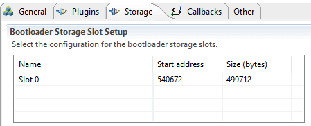

# UG435.06: Bootloading and OTA with Silicon Labs Connect v3.x (Rev. 0.1) <!-- omit in toc -->

- [1. Introduction](#1-introduction)
- [2. The Gecko Bootloader](#2-the-gecko-bootloader)
- [3. Setting Up a Silicon Labs Connect Application for Bootloading](#3-setting-up-a-silicon-labs-connect-application-for-bootloading)
- [4. Using the Standalone Bootloader with a System on Chip Application](#4-using-the-standalone-bootloader-with-a-system-on-chip-application)
- [5. Using the Application Bootloader for OTA](#5-using-the-application-bootloader-for-ota)
  - [5.1 Broadcast or Unicast](#51-broadcast-or-unicast)
  - [5.2 OTA Components](#52-ota-components)
  - [5.3 Theory of Operation: Broadcast OTA](#53-theory-of-operation-broadcast-ota)
  - [5.4 Theory of Operation: Unicast OTA](#54-theory-of-operation-unicast-ota)
  - [5.5 Remote Bootload Request](#55-remote-bootload-request)
- [6. Example: OTA Bootloading in a Sensor-Sink Demo](#6-example-ota-bootloading-in-a-sensor-sink-demo)
  - [6.1 Create Projects](#61-create-projects)
  - [6.2 Flashing Applications](#62-flashing-applications)
  - [6.3 Generating the GBL File](#63-generating-the-gbl-file)
  - [6.4 Loading the Image to the OTA Server](#64-loading-the-image-to-the-ota-server)
    - [6.4.1 Loading to SPI Flash](#641-loading-to-spi-flash)
    - [6.4.2 Loading Internal Flash](#642-loading-internal-flash)
    - [6.4.3 Preparing the Devices for Bootloading](#643-preparing-the-devices-for-bootloading)
      - [6.4.3.1 Preparing the Storage](#6431-preparing-the-storage)
      - [6.4.3.2 Preparing the Network](#6432-preparing-the-network)
    - [6.4.4 Unicast OTA](#644-unicast-ota)
      - [6.4.4.1 Unicast Download Resume Feature](#6441-unicast-download-resume-feature)
    - [6.4.5 Broadcast OTA](#645-broadcast-ota)
  - [6.5 Bootloading Finished](#65-bootloading-finished)

*Connect v3.x User's Guide* 的本章介绍了可在 Connect-based 应用程序中使用的 bootloader 选项（standalone、application 和 Over the Air (OTA)）。Connect stack 作为 Silicon Labs Proprietary Flex SDK v3.0 及更高版本的一部分来交付。 *Connect v3.x User's Guide* 假定您已经安装了 Simplicity Studio 开发环境和 Flex SDK，并且熟悉配置、编译、刷写 Connect-based 应用程序的基础知识。有关 *Connect v3.x User's Guide* 中各章的概述，请参阅 *UG435.01: About the Connect v3.x User's Guide* 。

# 1. Introduction

当无法连接 J-Link 调试器时，通常需要更新设备上的固件。在这些情况下，standalone bootloader 是理想的选择，因为它可以通过 UART（Universal Asynchronous Receiver/Transmitter）或 SPI（Serial Peripheral Interface）连接来更新固件。

在某些情况下，即使将设备连接到计算机也是有问题的。在这些情况下，可以进行 OTA（Over the Air）引导加载过程。这需要一个 application bootloader，该程序可以从板载存储（如 SPI flash 或 MCU flash 的一部分）更新固件。然而，OTA 映像传输仍然是 main application 的责任。

有关引导加载基础的更多详细信息，请参阅 *UG103.06: Bootloading Fundamentals* 。

# 2. The Gecko Bootloader

Silicon Labs Connect 仅支持 Gecko Bootloader，其可用于 Wireless Gecko（EFR32™）产品组合。对于 standalone bootloader，建议使用 **UART XMODEM Bootloader** 示例。对于 application bootloader，建议使用 **SPI Flash Storage Bootloader** （如果 EFR32 连着 SPI flash）或 **Internal Storage Bootloader** 。请注意，可用于 Silicon Labs Connect 的 OTA 协议仅支持 **single image** bootloader。

编译好 bootloader 后，请确保在刷写主固件之前先将其（ `<projectname\>-combined.s37` 文件）刷写到设备上。

有关使用 Gecko Bootloader 示例的更多详细信息，请参阅 *AN1085: Using the Gecko Bootloader with Silicon Labs Connect* 。有关 Gecko Bootloader 的更多信息，请参阅 *UG266: Silicon Labs Gecko Bootloader User's Guide* 。

# 3. Setting Up a Silicon Labs Connect Application for Bootloading

创建一个新的 Connect 示例并安装 Bootloader Application Interface 组件将：

* 修改 EFR32xG1 上的内存分配（bootloader 使用 flash 存储器的前 16 kB）。
* 添加一个编译时定义，以供 bootloader-related 代码使用。
* 从主固件中添加可用于与 bootloader 进行通信的 C 函数（如切换到 bootloader mode）。

一些特殊的应用程序功能（如 OTA）也需要一些其他组件。这些要求将在以下章节中讨论。

# 4. Using the Standalone Bootloader with a System on Chip Application

可以在不对应用程序代码进行进一步修改的情况下使用 standalone bootloader。如果在 Gecko Bootloader 中启用了 GPIO activation 功能（默认情况下启用），则可以通过在按下激活按钮的同时重置 MCU 来进入 bootloader mode。然后，您可以按照 *AN1085: Using the Gecko Bootloader with Silicon Labs Connect* 中的描述与 bootloader 进行通信。

或者，您可以在应用程序中通过使用以下函数来进入 bootloader mode：

```c
halLaunchStandaloneBootloader(STANDALONE_BOOTLOADER_NORMAL_MODE)
```

有关与 bootloader 进行通信的 API 的更多详细信息，请参见文件：

```
platform/base/hal/micro/bootloader-interface-standalone.h
```

# 5. Using the Application Bootloader for OTA

## 5.1 Broadcast or Unicast

Silicon Labs Connect 提供了两种 OTA 方法：

* 广播（Broadcast）：映像被发送到所有设备（尽管设备可以忽略它，所以从某种意义上说，它实际上是多播的）。仅支持 single-hop 范围 —— 即 coordinator 无法引导 range extender 后面的端点。
* 单播（Unicast）：映像被发送到单个设备。如果服务端和客户端在同一个 Connect 网络中，那么它将可以工作。Packets are ACKed (both per-hop and end-to-end)。缺点是它只能针对单个设备。因此，引导加载多个目标的速度会很慢，并且会给网络带来沉重的负担。

广播和单播都使用单个源来分发映像。这称为 OTA 服务端。下载映像的设备称为 OTA 客户端。广播和单播都支持安全消息。

目前，两种 OTA 方法均不适用于 MAC mode。无法使用广播方法来引导 sleepy end device。尽管从理论上讲，可以在 sleepy end device 上进行单播引导加载，但是这将花费很多时间，并且 Silicon Labs 不建议这样做。

## 5.2 OTA Components

要在 SoC 应用程序中测试 OTA，需要以下组件。

对于广播和单播 OTA：

* OTA Bootloader Interface：使应用程序能够与 bootloader 进行通信（如使用 bootloader API 写入 flash）。
* OTA Bootloader Test Common：实现通用的 bootloader CLI 命令（如擦除）。

对于广播 OTA：

* OTA Broadcast Bootloader Client：实现 OTA 映像接收。
* OTA Broadcast Bootloader Server：实现 OTA 映像传输。
* OTA Broadcast Bootloader Test：在 bootloader client/server 上实现 CLI，并将 OTA plugins 与 OTA Bootloader Interface 连接。

对于单播 OTA：

* OTA Unicast Bootloader Client：实现 OTA 映像接收。
* OTA Unicast Bootloader Server：实现 OTA 映像传输。
* OTA Unicast Bootloader Test：在 bootloader client/server 上实现 CLI，并将 OTA 组件与 OTA Bootloader Interface 连接。

所有组件都是开源的。

## 5.3 Theory of Operation: Broadcast OTA

广播 OTA 完成以下步骤：

1. 想要下载相同映像的客户端设置了相同的标签（tag）。
2. 服务端开始广播带标签的映像段（固件的一部分，适合带有存储器地址的 connect 数据帧）。
3. 客户端存储广播的映像段。根据地址，它们还可以识别丢失的段。
4. 服务端在 512 个段之后停止广播，并询问每个客户端（使用单播消息）缺少哪些段。
5. 客户端报告丢失的段，服务端收集此信息。
6. 服务端重新广播丢失的段。
7. 服务端再次询问缺少的段，并且此循环继续进行，直到所有客户端都拥有前 512 个段。
8. 服务端广播接下来的 512 个段，此循环继续进行，直到所有客户端都具有完整映像为止。

标签可以在并非所有设备都运行相同固件的网络中使用，也可以用于版本控制，以确保如果设备已经具有相同的映像，则不会参与 OTA 流程。

## 5.4 Theory of Operation: Unicast OTA

单播 OTA 更简单。它完成了以下步骤：

1. 客户端设置一个标签。
2. 服务端发送一次握手（handshake），告知客户端映像大小和标签。
3. 客户端响应握手。
4. 服务端发送带标签的映像段（固件的一部分，适合带有存储器地址的 connect 数据帧）。
5. 客户端以段响应进行响应。
6. 如果服务端未收到响应，它将再次发送该段。
7. 如果服务端收到了响应，它将发送下一个段，并继续此循环，直到客户端拥有整个映像为止。

标签仍然可用。它可以用于版本控制。服务端在停止传输之前会重试多次以发送未确认的段。客户端在放弃当前固件下载之前有五秒钟的超时时间。恢复功能已在 Flex 2.6 中实现。客户端计算收到的段数。如果服务端与客户端之间的连接丢失，则一旦服务端重新发起下载，客户端将在握手期间通知服务端仅发送其余部分。如果标签已更改或客户端已执行闪存擦除命令，那么将清除客户端上的段计数器。如果通信中断，则下载的重新发起是服务端上的客户应用程序的责任。

## 5.5 Remote Bootload Request

广播和单播 OTA 组件均实现命令消息（使远程引导加载请求成为可能 —— 即 OTA 服务端可以从客户端中请求引导加载），作为响应，客户端会将下载的映像加载到主存储器中并进行引导。

# 6. Example: OTA Bootloading in a Sensor-Sink Demo

以下示例逐步说明了如何使用 CLI 命令在 sensor-sink demo 中使用 OTA。sink 将是 OTA 服务端，sensor 将是 OTA 客户端。如果上下文是 Connect 网络，则示例将使用 sensor/sink；如果上下文是 OTA 过程，则示例将使用 OTA 客户端/服务端。

该示例可与 Silicon Labs Connect 支持的任何软件开发套件一起使用，但是 internal flash bootloader 示例仅适用于 1 MB（EFR32xG12）和 512 kB（EFR32xG13）设备。

## 6.1 Create Projects

1. 创建可用于您的设备的 single image bootloader 示例。无需修改它。
2. 创建一个 connect sink 应用程序。除了 Bootloader Application Interface 组件之外，您仅需要安装以下组件：
  * OTA Bootloader Interface
  * OTA Bootloader Test Common
  * OTA Broadcast or Unicast Bootloader Server
  * OTA Broadcast or Unicast Bootloader Test

  这将是 OTA 服务端项目。

3. 创建两个 sensor 应用程序。该示例将使用常规 J-Link 刷写一个，并使用 OTA 引导另一个。确保在两个应用程序之间进行一些区分以区别它们（如修改应用程序的初始化代码以在 UART 上打印出不同的消息或打开不同的 LED）。与步骤 2 相似，除了 Bootloader Application Interface 组件之外，这两个项目中都安装这些组件：
  * OTA Bootloader Interface
  * OTA Bootloader Test Common
  * OTA Broadcast or Unicast Bootloader Client
  * OTA Broadcast or Unicast Bootloader Test

  这些将是 OTA 客户端项目。

4. 生成并构建所有四个项目（bootloader, sink, two sensors）。

  > 注意：如果只有一个 sensor 项目，则可以通过从未修改的应用程序生成 GBL 文件，然后对其进行修改和重建来节省时间。或者，您可以使用任何其他应用程序来生成 GBL 文件。在这种情况下，您不能确定应用程序下次是否将启用 OTA 映像分发。

  > 注意：Connect stack 使用非易失性数据存储来存储 Connect stack 需要在设备断电重启之间保持不变的各种信息（通常称为 token）。这些 token 支持启动时自动重建网络。应用程序还可以使用此系统来存储持久性数据。

  > 注意：您可以在 *UG266: Silicon Labs Gecko Bootloader User's Guide* 中找到有关 GBL 文件格式以及如何生成 GBL 文件的更多信息。

## 6.2 Flashing Applications

为了使应用程序正常工作，您首先需要刷写 bootloader。最简单的刷写方法是使用 Simplicity Commander。请您确保使用 `<bootloader app name>-combined.s37` 文件，因为这是具有完整 bootloader 的唯一映像：Gecko Bootloader 是一个 two-stage bootloader，这意味着有一个很小的 first stage 可以更新 bootloader 本身（此示例中未演示）。只有 `-combined.s37` 文件包括此 first stage。所有其他二进制文件仅是 second stage，因此它们自己将无法运行。有关更多信息，请参阅 *UG266: Silicon Labs Gecko Bootloader User's Guide* 。

接下来，刷写 sink 和其中一个 sensor 应用程序。您几乎可以使用任何方法，只需确保不使用“ `bin` 文件”即可，因为它不包含地址信息，并且可能会覆盖 bootloader。此外，请确保在刷写应用程序之前 **不要擦除** 闪存。

如果同时存在 bootloader 和应用程序，则其应使用可用的 CLI（Command Line Interface）来作为通常的 Connect 项目启动。

## 6.3 Generating the GBL File

拥有应用程序的二进制文件后，您需要从它们中生成 GBL 文件。根据您使用的是 Windows 还是 UNIX，在项目目录中找到 `connect_create_gbl_image.bat` 或 `connect_create_gbl_image.sh` 文件。从终端运行该文件。GBL 文件将放置在二进制文件所在的构建文件夹中。

您需要将 `PATH_SCMD` 环境变量永久定义为 Simplicity Commander 根文件夹的路径。在 Windows 中，执行以下命令来注册此环境变量：

```powershell
setx PATH_SCMD C:\SiliconLabs\SimplicityStudio\v5\developer\adapter_packs\commander
```

## 6.4 Loading the Image to the OTA Server

接下来，您需要将另一个 sensor 的 GBL 文件刷写到 sink/OTA 服务端上的 bootloader 的存储槽中，如下图所示。

<p>
    
</p>

最简单的方法是使用以下小节中描述的 Simplicity Commander 命令。

### 6.4.1 Loading to SPI Flash

要将 `<application image>.gbl` 加载到 SPI flash，请使用以下命令：

```
commander extflash write <application image>.gbl
```

此方法仅在 Silicon Labs 开发套件上可用。完成后，它将锁定 MCU 并重置设备。

### 6.4.2 Loading Internal Flash

要刷写到内部存储器，请首先确定槽的起始地址。您可以从 bootloader 项目的 AppBuilder 中的 storage 选项卡中读取该信息。例如，对于 1 MB 设备，默认值为 540672，如下图所示。

<p>
    
</p>

Simplicity Commander 将识别出 GBL 文件，并且您不希望从它那里解码地址信息（因为它会将其刷写到地址 0）：基本上，您希望它作为一个二进制 blob 来处理。如果将 GBL 文件重命名为 `.bin` ，你就完全可以理解了。之后，您可以通过执行以下命令从 GUI（使用起始地址）或从命令行刷写它：

```
commander flash --address 84000 <application image>.bin
```

其中 `84000` 是十六进制的 540642，而 `<application image>.bin` 是重命名的 GBL 文件。

有关更多信息，请参阅 *UG162: Simplicity Commander Reference Guide* 。

### 6.4.3 Preparing the Devices for Bootloading

下一步是设备上的 CLI 命令。

#### 6.4.3.1 Preparing the Storage

使用这些命令来准备每个设备上的存储。

**Commands on the OTA server:**

```
bootloader_init
bootloader_validate_image
```

第二个命令将检查映像，它看起来应该像这样（带有更多点）：

```
Verifying image............done!
Image is valid!
```

**Commands on the OTA client:**

```
bootloader_init
bootloader_flash_erase
```

第二个命令将擦除闪存，这是在写入闪存之前所必需的。其输出应如下所示（带有更多点）：

```
flash erase started
flash erasing slot 0 started....................................
flash erase successful!
```

#### 6.4.3.2 Preparing the Network

这些命令是创建和加入网络的常用命令。

**Commands on the sink:**

```
form 0
pjoin 120
```

第一条命令启动网络，第二条命令允许 sensor 节点在 120 秒内加入网络。

**Commands on the sensor:**

```
join 0
```

设置较低的报告速率以使 CLI 更加可用是一个好主意：

```
set_report_period 10000
```

一旦在 sensor 和 sink 节点之间建立了连接，您应该每 10 秒可看到一次 sink 和 sensor 之间的通信。

您还需要在 sensor 上设置 bootloader 标签：

```
bootloader_set_tag 0xaa
```

下一步将需要 sensor 的 node ID。您可以通过执行 `info` 命令来获取节点当前状态的主要属性：

```
Node id: 0x0001
```

对于单播和广播 OTA，后续步骤有所不同。

### 6.4.4 Unicast OTA

在 OTA 服务端上使用如下命令：

```
bootloader_unicast_set_target 0x0001
```

这会将 OTA 数据包的目的地设置为 sensor，该 sensor 具有在上一步中标识的 node ID（ `0x0001` ）。

使用下一条命令，您可以启动 OTA 分发自身，如下图所示。

<p>
    
</p>

```
bootloader_unicast_distribute <size> 0xaa
```

其中 `<size>` 是 GBL 映像的大小（以字节为单位）， `0xaa` 是您之前在 OTA 客户端上设置的标签。

这将启动 OTA 映像分发过程。您应该在 OTA 服务端上看到 `get segment` 行（即从闪存读取段），并且在 OTA 客户端上看到 `incoming segment` 行。它应以 `image distribution completed`，服务端上为 `0x00` 和客户端上为 `Image download COMPLETED tag=0xAA size=<size>` 结束。

此时， `bootloader_validate_image` 也应在客户端上以 `valid` 返回。

接下来，您将请求引导加载，如下图所示。

<p>
    
</p>

为此，请在 OTA 服务端上执行以下命令：

```
bootloader_unicast_request_bootload 1000 0xaa
```

其中 `1000` 是超时（以毫秒为单位），而 `0xaa` 是再次标记。

#### 6.4.4.1 Unicast Download Resume Feature

从 Flex SDK version 2.6 起，OTA 下载特性支持从传输中断的段中继续下载。要测试此特性，请在下载过程中重置 OTA 服务端（通过硬件重置引脚或在 CLI 中发出 `reset` 命令）。当重置完成后，在服务端上发出与第一次尝试相同的命令：

```
bootloader_init
bootloader_unicast_set_target 0x0001
bootloader_unicast_distribute <size> 0xaa
```

下载应从中断点开始。中断和恢复的次数没有限制。如果标签已更改或 OTA 客户端上的闪存已擦除，则下载将从头开始（即将下载整个映像）。

### 6.4.5 Broadcast OTA

首先，在 OTA 服务端上设置目标列表。这是客户端的 node ID 的列表。这用于缺少段请求和引导加载请求消息。Broadcast plugin 中最大客户端数量限制为 50。

OTA 服务端上的以下命令将索引为 `0` 的 OTA 客户端的 node ID 设置为 `0x0001` ：

```
bootloader_broadcast_set_target 0 0x0001
```

您可以通过增加索引来使用同一命令设置多个目标。

使用下一条命令，您将启动 OTA 分发自身，如下图所示。

<p>
    
</p>

```
bootloader_broadcast_distribute <size> 0xaa 1
```

其中 `<size>` 是 GBL 映像的大小（以字节为单位）， `0xaa` 是您之前在 OTA 客户端上设置的标签， `1` 是您使用 `set-target` 设置的客户端数量。

这将启动 OTA 映像分发过程。您应该在 OTA 服务端上看到 `get segment` 行（即从闪存读取段），并且在 OTA 客户端上看到 `incoming segment` 行。它应以 `image distribution completed`，服务端上为 `0x00` 和客户端上为 `Image download COMPLETED tag=0xAA size=<size>` 结束。

此时， `bootloader_validate_image` 也应在客户端上以 `valid` 返回。

接下来，您将请求引导加载，如下图所示。

<p>
    
</p>

为此，请在 OTA 服务端上执行以下命令：

```
bootloader_broadcast_request_bootload 1000 0xaa 1
```

其中 `1000` 是超时（以毫秒为单位），最后两个参数与上述 `distribute` 相同。

## 6.5 Bootloading Finished

单播和广播引导加载请求都应立即以 `bootload request completed` 返回。超时后，您应该看到 OTA 客户端的引导加载。引导加载后，sensor 应该再次加入，因为网络信息存储在 NVM 中，但是这时您应该看到为 OTA 映像设置的差异。
