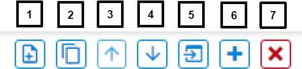

# UG438: GATT Configurator User's Guide for Bluetooth® SDK v3.x (Rev. 0.1) <!-- omit in toc -->

- [1. GATT Configurator 简介](#1-gatt-configurator-简介)
  - [1.1 SIG Selector](#11-sig-selector)
  - [1.2 Custom GATT Editor](#12-custom-gatt-editor)
    - [1.2.1 Contributed items](#121-contributed-items)
  - [1.3 Settings Section](#13-settings-section)
  - [1.4 生成 GATT 数据库](#14-生成-gatt-数据库)
- [2. 用例](#2-用例)
  - [2.1 拖放](#21-拖放)
  - [2.2 创建新项](#22-创建新项)
  - [2.3 添加权限](#23-添加权限)
  - [2.4 添加 Capability](#24-添加-capability)
  - [2.5 包含 Service](#25-包含-service)
  - [2.6 导入和导出 GATT 数据库](#26-导入和导出-gatt-数据库)

本指南提供有效使用 Bluetooth GATT Configurator（作为 SimplicityStudio® 5 与 Bluetooth SDK v3.x 的一部分来提供）所需的信息。GATT Configurator 是一个直观的界面，可访问 Bluetooth specification 中定义的所有 Profile、Service、Characteristic 和 Descriptor。它还支持为 Bluetooth 应用程序创建、导入或导出自定义 GATT profile。本指南介绍了用户界面和 Configurator 的一些最常见用法。

# 1. GATT Configurator 简介

GATT Configurator 是一个易于使用的工具，可帮助您构建自己的 GATT 数据库（database）。项目的 Profile/Service/Characteristic/Descriptor 列表显示在左侧，有关所选项目的详细信息显示在右侧。

GATT Configurator 由左侧的 Custom GATT Editor（显示项目的 Profile/Service/Characteristic/Descriptor 列表）和右侧的 Settings Editor 组成。SIG Selector 允许您将标准元素添加到 profile。

Custom GATT Editor 顶部提供了一个选项菜单。

Custom GATT Editor 始终可见，默认情况下会打开 Settings Editor。

<p>
  
</p>

GATT Configurator 菜单为：

<p>
  
</p>

1. 添加一个项。
2. 复制所选项。
3. 向上移动所选项。
4. 向下移动所选项。
5. 导入 GATT 数据库。
6. 添加预定义（打开 SIG Editor）。
7. 删除所选项。

点击 **Add Predefined (6)** 以打开 SIG Selector。

<p>
  
</p>

## 1.1 SIG Selector

SIG Selector 显示一个预定义的 Profile、Service、Characteristic 和 Descriptor 列表。可以使用过滤器窗格过滤这些项。选项卡可让您在不同列表之间切换。如下图所示，列表右侧的窗格显示有关最新选择的文本信息。要将项添加到 Custom GATT Editor 中，请将其放在鼠标上，然后点击右侧的 **+** 。然后可以在 Settings Section 中编辑该项。所选的 SIG service/characteristic/descriptor 将添加到突出显示的 profile/service/characteristic 下。点击 **< BACK** 以返回到 Setting Editor。

<p>
  
</p>

## 1.2 Custom GATT Editor

Custom GATT Editor 显示当前配置文件中存在的项。这包括显示为分层列表的自定义 GATT Profile、Service、Characteristic 和 Descriptor。显示的项顺序反映了它们在 GATT 数据库中的存在顺序。打开 Settings Editor 后，可以选择一个项以查看其特性和配置：

<p>
  
</p>

配置文件名旁边的 **\*** 表示未保存配置更改。

> 注意：Generic Attribute Service 未在 Custom GATT 数据库结构中列出（上图中的左侧）。这是一个由协议栈维护的特殊 service，可以通过在 Custom BLE GATT profile 的设置中启用 **Generic Attribute Service** 滑动条来添加。启用后，该 service 将成为数据库的一部分。然而它仍不会出现在 Custom GATT 数据库结构中，由于 iOS 隐藏了该 service，因此它不会出现在 iOS 设备上，但是您可能会在 Android 设备上看到它。

<p>
  
</p>

### 1.2.1 Contributed items

一些 service 在 Configurator 中被列为“contributed items”。这意味着它们的内容是在其他组件中定义的，因此无法从该视图中对其进行编辑。

## 1.3 Settings Section

Settings Editor 允许您配置 Custom GATT Editor 中存在项的特性，例如 Profile、Service、Characteristic 和 Descriptor。选择一个项以填充相关的配置选项（如 name、ID、propertie 和 capability）。在此 Section 中所做的任何更改都会立即反映到所选项。如果需要，可以在编辑时最小化 Custom GATT Editor。每个 service 的所有 characteristic 都包含在同一的 Settings Editor 窗格中。

<p>
  
</p>

## 1.4 生成 GATT 数据库

保存配置后，数据库将自动生成。生成的源文件可以在名为“autogen”的目录中找到：

<p>
  
</p>

# 2. 用例

本章介绍了使用 GATT Configurator 执行的常见任务。

## 2.1 拖放

要在应用程序中包含源列表中的预定义项，请将此项从 Source Section 拖放到 Custom GATT Section。拖放 profile 或 service 时，其下级别中的所有 characteristic 和 descriptor 将自动包含在内。为了保持层次结构，descriptor 只能包含 characteristic 下。

<p>
  
</p>

在 Custom GATT Section 中，可以使用拖放来对项进行重新排序。这样可以省去再次包含和配置项的麻烦。同样，可以复制项并在该 Section 中移动。

## 2.2 创建新项

使用  菜单选项在 Custom GATT Editor 中添加新项。如果所选择的是一个 profile，那么将创建一个新的 service。如果所选择的是一个 service，那么将在所选项下创建一个新的 characteristic。仅在选择 characteristic 后才能创建 descriptor。

选择新项后，Settings Section 将显示该项的默认特性。此处可以根据要求配置项。

<p>
  
</p>

应用程序使用 characteristic ID 来获得对 GATT 数据库的本地访问。您可以通过在复选框中输入唯一 ID 来输入此内容。

<p>
  
</p>

生成后，此 ID 会在 `gatt_db.h` 文件中获得一个宏，如下所示：

```c
extern const struct bg_gattdb_def bg_gattdb_data;

#define gattdb_service_changed_char             3
#define gattdb_device_name                      7
#define gattdb_ota_control                     21
#define gattdb_custom_characteristic           24
```

UUID（Universally Unique identifier）是用于唯一地标识 service、characteristic 和 descriptor 的数字。有两种类型的 UUID：

1. **16 bit** ：由 Bluetooth SIG 预先定义。例如，Blood Pressure Service 的 UUID 为 0x1810，而 Battery level Characteristic 的 UUID 为 0x2A19。
2. **128 bit** ：这打破了 16 bit UUID 的局限性，并赋予了您为自定义的 service 和 characteristic 声明 UUID 的能力。在 GATT Configurator 中随机生成的 UUID 是 version 4 (random) variant 1。如果某个 UUID 与 Bluetooth base UUID 不重叠，则可以将其用于自定义 service 或 characteristic：xxxxxxxx-0000-1000-8000-00805F9B34FB。

虽然没有中心机构可以确保其他设备不使用相同的 UUID，但是两个设备最终使用相同的 UUID 的可能性很小（1/2^128）。

## 2.3 添加权限

权限（Permission）定义了可以对给定的 characteristic 或 descriptor 执行哪些操作。例如，在 Blood Pressure Profile 中，Blood Pressure Feature 具有 Mandatory Read property。有关访问类型和安全要求的更多信息，请参见 *UG118: Blue Gecko Bluetooth® Profile Toolkit Developer's Guide* 的 Properties 部分。

首先可以使用滑动条启用所需的访问类型，然后可以使用复选框选择安全要求。

<p>
  
</p>

## 2.4 添加 Capability

Bluetooth SDK 2.4 引入了一项称为 Polymorphic GATT 的新特性，可用于动态显示或隐藏 GATT service 和 characteristic。GATT Configurator 使用 GATT capability 实现此特性。本节介绍如何进行。

为了概括 capability 如何工作，每个 service/characteristic 可以声明几个 capability，并且 capability 的状态（启用/禁用）确定这些 service/characteristic 的可见性（按位或运算）。例如，当 service/characteristic 中的至少一项 capability 被启用时，它是可见的；而当其所有 capability 被禁用时，则它是不可见的。

总是先声明 GATT-leve 的 capability 并定义其默认值。选择 Custom BLE GATT profile，然后点击“Capability declarations”表中的 **+** 控件。添加 capability 后，您可以更改名称和默认值。例如，将 Appearance、Temperature_Measur 和 Tx_power 添加到 profile 中，如下图所示：

<p>
  
</p>

添加这些 capability 后，它们就可以在每个 service 和 characteristic 上使用。可以从 Settings Section 的下拉列表中将其声明为“Characteristic capabilities”。

在 service 和 characteristic 级别，已声明的 capability 被视为已启用，未选择的 capability 将被禁用。

<p>
  
</p>

> 注意：在连接过程中，请勿更改 capability 状态，因为这可能导致行为异常。最安全的方法是在未连接任何设备时更改 capability。

## 2.5 包含 Service

在 service 定义中，可以使用 service 包含特性（Service includes feature）将一个或多个引用添加到其他 service。包含定义由单个 attribute（包含声明）组成，该 attribute 包含客户端引用所包含 service 所需的所有详细信息。

已包含的 service 可以帮助避免在 GATT 服务端中重复数据。如果某个 service 将被其他 service 引用，则可以使用此机制来节省内存并简化 GATT 服务端的布局。

首先为每个需要包含的 service 声明一个 ID。没有 ID 的 service 将无法被引用。这通过选择 ID 复选框并提供 service 标识符文本来完成。接下来，从下拉列表中选择要引用的 service，名为“Service includes”，如图所示：

<p>
  
</p>

## 2.6 导入和导出 GATT 数据库

**Import**：Custom GATT 工具栏中的 Import 控件允许您使用 `.btconf` 文件导入一个现有的 GATT 数据库。请注意，这将覆盖现有的 GATT 数据。

<p>
  
</p>

**Export**：没有单独的导出功能。另一个项目可以直接导入该项目的 GATT 数据库（名为 `gatt_configuration.btconf`）。
